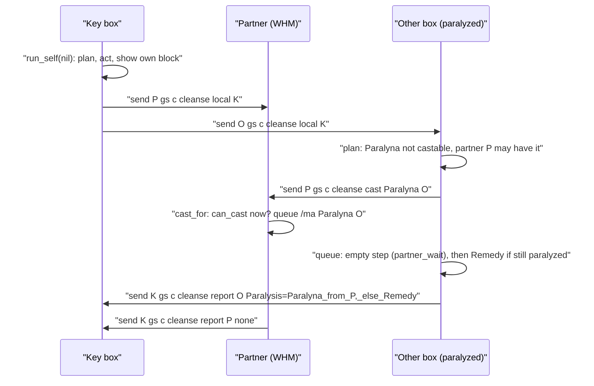

# Cleanse system (`//gs c cleanse`, debuffs off the box group)

`//gs c cleanse` takes the debuffs off this character and every other member of the box group. Like `//gs c stealth` ([stealth.md](stealth.md)), each box handles itself: the key box sends `cleanse local <name>` to the others, and each one reads its own buff ids from the game, walks its debuffs most urgent first (`DEBUFF_REMOVAL.lua` order, changed by `CLEANSE_CONFIG.lua`) and, per debuff, uses its own spell when it can cast it now, else asks the partners that may have the spell (`cleanse cast <spell> <name>`) and uses its item if the debuff is still on `partner_wait` seconds later, else its own item. Every action goes through the shared action queue (`shared/utils/core/action_queue.lua`). Each box sends a one-line summary back to the key box (`cleanse report <name> <body>`), which shows one `CLEANSE` block per box.

Verified against the code on 2026-10-01 (system added 2026-10-01, commit `7950cf8`; aura marks, per-turn decisions, Doom retries in front and the report separator fixed the same day, commit `295e701`). Not yet tested in game.

## Files

| Path | Lines | Role |
|---|---:|---|
| `shared/utils/debuff/cleanse.lua` | 283 | Command router (`Cleanse.handle`), plan per debuff (`plan_one`, `plan`), `run_self`, partner request (`partners_for`, `ask_partners`, `cast_for`), item use with aura watch and Doom retries (`use_item`), aura mark name (`mark_name`), reports (`report_to`, `receive_report`, `show`) |
| `shared/utils/debuff/cleanse_methods.lua` | 238 | Settings merge (`settings`), debuff order (`ordered`, `active`, `is_up`), items (`items_for`, `item_count`, `first_item`, `cast_time`), spells (`can_cast`, `partner_may_cast`, `SPELLS`) |
| `shared/data/debuffs/DEBUFF_REMOVAL.lua` | 104 | Every debuff: `key`, `name`, buff `ids`, `spell`, default `items`, `no_action`; list order = default removal order |
| `shared/utils/core/action_queue.lua` | 180 | Shared one-action-at-a-time queue (stealth, cleanse and `//gs c buff`), `push` and `push_next`, optional step `guard` (used by `//gs c buff` only, see [stealth.md](stealth.md#action-queue-sharedutilscoreaction_queuelua)) |
| `_master/config_global/CLEANSE_CONFIG.lua` | 48 | Settings template, copied to `<Character>/_common/combat/` by the clone |

Integration points:

- `shared/utils/core/COMMON_COMMANDS.lua` `handle_command`: `cleanse` is routed to `require('shared/utils/debuff/cleanse').handle(args)` right after `stealth`; `cleanse` is in the hand-written list of `is_common_command`.
- `shared/utils/core/char_paths.lua` and `migrate_layout.py` `COMMON_GROUPS`: `CLEANSE_CONFIG.lua` -> `combat`. `where_is_what.py` describes it.
- `shared/utils/messages/formatters/ui/message_commands.lua`: `//gs c help` lists `cleanse help`, `//gs c commands` lists `cleanse`.
- `shared/utils/debuff/uncurable_debuffs.lua`: `watch` / `is_marked`, the aura marks shared with Auto Medicine.
- `shared/utils/messages/formatters/magic/message_debuffs.lua` `show_debuff_uncurable`: the line when an item did not take the debuff off.
- `shared/utils/dualbox/alt_group.lua` `get_alts()` (other members) and `shared/utils/dualbox/alt_states.lua` `get(name)` (their known job and subjob).
- `shared/utils/messages/info_block.lua` (result and `check` blocks), `help_screen.lua` (help).
- No keybind: `COMMON_KEYBINDS.lua` has none for `cleanse`.

## How it works

### Command

`Cleanse.handle(args)`, `args` = the words after `cleanse`, first one lower-cased. Always returns `true`.

| Sub | Effect |
|---|---|
| (none) | `run_self(nil)`, then `send <name> gs c cleanse local <me>` to every `AltGroup.get_alts()` member |
| `self` | `run_self(nil)` only |
| `local <name>` | `run_self(<name>)`: sent by the key box; the result goes back to `<name>` |
| `cast <spell> <name>` | `cast_for(spell, name)`: a partner asks; queue `/ma "<spell>" <name>` only when the spell is in `SPELLS` and `Methods.can_cast(spell)` is true now. Spell names have no space, so `args[2]` is the whole name |
| `report <name> <body>` | `receive_report`: another box's result, shown as a block titled `<name>` |
| `check` | Dry run: `plan()` without running it, InfoBlock `CLEANSE :: Check (nothing is used)` with a `Jobs` line and one line per debuff |
| other (`help` included) | `HelpScreen.show` |

### A press across the group

### Plan of one debuff (`plan_one(entry, settings)`)

Returns `{text, tone, run, later}`; `run` acts now, `later` runs after the partner wait. First match wins:

1. `UncurableDebuffs.is_marked(mark_name(entry))`: `left alone (item had no effect: aura?)`, nothing done. `mark_name(entry)` = `entry.name:lower()` (`attack down`, `magic atk. down`), the name `uncurable_debuffs.lua` resolves to buff ids through `res.buffs[id].en:lower()`; every `name` of `DEBUFF_REMOVAL.lua` is a `res.buffs` name.
2. Own spell: `entry.spell`, `use_spells ~= false`, not `no_action`, `Methods.can_cast(spell)` -> `run` queues a function step (wait 0.05 s) that, when its turn comes, checks `Methods.is_up(entry)` and only then `ActionQueue.push_next`es `/ma "<spell>" <me>` with a longest wait of cast time + `WAIT_MARGIN` (3 s). An Erase, a Panacea or a partner's spell that went earlier in the queue may have taken the debuff off: then nothing is cast.
3. Partner: `entry.spell` and `ask_partner ~= false` and `partners_for(spell)` not empty -> `run` sends `gs c cleanse cast <spell> <me>` to each partner; `later` (only when an item exists) uses the item if `Methods.is_up(entry)` still. Text `<spell> from <names>[, else <item>]`.
4. Own item (`first_item(items_for(entry, settings))`, not for `no_action`) -> `use_item`.
5. Nothing: `cannot act, no partner can help` (`no_action`), `no item, no spell` (the entry has a spell or items but none is usable), else `nothing removes it`.

`partners_for(spell)` keeps the other members for which `Methods.partner_may_cast(spell, job, subjob)` is true, with the job and subjob from `AltStates.get(name)`: an unknown job counts as able (asked anyway); a main job with a level for the spell; a WHM / RDM / PLD subjob whose level for the spell is 49 or less; never a SCH subjob. The partner's MP, recast, learned spells and Addendum are not checked here: `cast_for` on the partner checks them with its own `can_cast`, and does nothing when it cannot.

### One box's run (`run_self(from)`)

1. `plan()` walks `Methods.active(settings)` and calls `run` of every step in order: all queue pushes and partner requests go out at once.
2. **Single partner_wait step**: when at least one step has a `later`, one empty function step is pushed with a longest wait of `partner_wait` (default 5), then one function step (wait 0.1 s) that calls every `later` in order. A function step runs first and then waits, so the empty one holds the queue for `partner_wait` and the checks run after it. This wait is shared by every debuff a partner was asked for, not one per debuff.
3. `from` set and not this character: `report_to(from, steps)` sends `cleanse report <me> <body>`, body = `<debuff name>=<text>` per step, spaces as `_`, steps joined with `|`, `none` when empty (not `;`: Windower's console ends a command at `;`, so only the first line reached the key box before 2026-10-01). `receive_report` splits on `|` and turns `_` back into spaces. Otherwise the block is shown here.

The plan (and so the report and `check`) is made at the press, before anything goes: it names the way chosen for each debuff, not what was finally used. With three erasable debuffs it says `Panacea` three times, although the first Panacea takes all three off and the next two steps use nothing.

### Items (`use_item(entry, item, tries, settings, front)`)

Each item is decided when its turn comes, not at the press. `use_item` queues one function step (wait 0.05 s; with `front`, through `push_next`, else `push`). When that step runs:

1. `Methods.is_up(entry)` false -> nothing (the debuff is gone: one Panacea takes every erasable debuff off, or a partner's spell or an earlier step landed). So three erasable debuffs spend one Panacea, not three.
2. Not Doom: `UncurableDebuffs.watch(mark_name(entry), item, 0, on_marked)`, so the watch starts when this item really goes, not when an earlier item of the queue does. `watch` counts the item in the inventory, and 4 s later marks the debuff when the count dropped and the debuff is still on (60 s at most; the mark is dropped as soon as the debuff is gone). `on_marked` prints `MessageDebuffs.show_debuff_uncurable`. Doom is never watched for an aura (Holy Water fails two times in three).
3. Doom and `tries < doom_tries`: `push_next` of a retry function step (wait 0.1 s).
4. `push_next` of `/item "<name>" <me>`, longest wait `ITEM_CAST` (1 s) + `WAIT_MARGIN`.

Steps 3 and 4 both go to the front, in reverse order, so the item goes next and the retry right after it. The retry checks `Methods.is_up(entry)` and the first item still in the inventory, and calls `use_item(..., tries + 1, settings, true)`: with `front` it goes before the other debuffs still queued, so Holy Waters follow one another while Doom stays. `doom_tries` is the total number of Holy Waters.

`later` (partner fallback) calls `use_item` without `front`: the item step joins the end of the queue.

### What this character has (`cleanse_methods.lua`)

- Debuffs: buff ids from `windower.ffxi.get_player().buffs` (not `buffactive`, which lags inside a scheduled function), matched against each entry's `ids`. `active(settings)` returns the entries up, in `ordered(settings)`: the `first` keys in their order, then the list order, `skip` keys removed.
- `items_for(entry, settings)`: `settings.items[entry.key]` when it is a table, else `settings.items.erasable` for an entry whose spell is Erase, else `entry.items`.
- Items: inventory (bag 0) only. Ids of the six default items are copied (`ITEM_IDS`: Echo Drops 4151, Remedy 4155, Eye Drops 4150, Antidote 4148, Holy Water 4154, Panacea 4149); another item named in the settings is looked up once in `res.items` and cached (`false` when unknown).
- `can_cast(name)`: the spell in `SPELLS`; the job reaching its level (main first, then sub, `job_for`); learned (`get_spells()[id]`); MP; recast 0; none of Silence (6), Mute (29), Omerta (262) on; **Scholar Addendum rule**: when the job that reaches the level is SCH (20), every spell but Cure needs Addendum: White (buff 401) up. A WHM/SCH casts as WHM and needs no Addendum.
- `SPELLS` (ids, MP, cast time, levels per job id 3 WHM, 5 RDM, 7 PLD, 20 SCH) are copied from `res/spells.lua`: Poisona 14, Paralyna 15, Blindna 16, Silena 17, Stona 18, Viruna 19, Cursna 20, Erase 143, Cure 1.

### Debuff table (`DEBUFF_REMOVAL.lua`)

56 entries in four groups: cannot act (Doom first, then Petrification, Sleep, Lullaby, Stun, Terror, Charm; all but Doom `no_action`), block actions (Silence, Paralysis, Curse, Amnesia, Mute, Omerta, Impairment, Muddle, Bane), ailments with their own spell (Plague, Disease, Blindness, Poison), erasable (Slow ... Dia, spell Erase, items `{'Panacea'}`). Ids 539-567 are the geomancy aura versions (Poison 540, Attack Down 557 ... Weight 567, Paralysis 566). The player page lists every entry: [Cleanse](../../user/features/cleanse.md#every-debuff-and-what-removes-it).

## Configuration

`<Character>/_common/combat/CLEANSE_CONFIG.lua` (template `_master/config_global/CLEANSE_CONFIG.lua`), read by `CleanseMethods.settings()` through `CharPaths.optional('common', 'CLEANSE_CONFIG')`. That is a `require`, so the file is read once per load; missing file = defaults. The merge is shallow: each top-level key of the file replaces the default (a missing `items` entry still falls back to the debuff's own default through `items_for`).

| Key | Default | Meaning |
|---|---|---|
| `use_spells` | `true` | Own spell before a partner or an item |
| `ask_partner` | `true` | Ask the partners that may have the spell |
| `partner_wait` | `5` | Seconds of the single wait step before the `later` checks |
| `doom_tries` | `5` | Holy Waters in all while Doom stays |
| `skip` | `{}` | Keys never handled |
| `first` | `{}` | Keys handled first, in this order |
| `items` | `{}` in `DEFAULTS`; the template writes `doom`, `curse`, `silence`, `paralysis`, `blindness`, `poison`, `erasable` with the default lists | Items per key; `erasable` for every Erase entry |

## Commands (internal)

| Command | Sent by | Effect |
|---|---|---|
| `cleanse local <name>` | The key box, to every other member | Run this box's part and report to `<name>` |
| `cleanse cast <spell> <name>` | A box that needs a spell, to its possible partners | Cast it on `<name>` if possible now |
| `cleanse report <name> <body>` | Each other box, to the key box | Show `<name>`'s result |

## Shared action queue

`shared/utils/core/action_queue.lua` (moved out of `stealth.lua` on 2026-10-01): one queue per character on `windower._action_queue`, generation `windower._action_gen_queue`, action packets through the `ActionListener` key `action_queue` ([core-lifecycle.md](core-lifecycle.md#actionlistener)), subscribed once per load from `push` (guard `_G._action_queue_listener`). `ActionQueue.push(command, wait, {delay, tag})`; cleanse passes `delay = 1.0` (`DELAY`) and `tag = 'CLEANSE'`, stealth its `delay` setting and `STEALTH`. A command step ends on the game's end-of-action for this character plus `delay`, or its longest wait; a function step runs first, then only its longest wait ends it; a refused `/ma` or `/item` is sent again (3 sends at most). `ActionQueue.push_next(command, wait, opts)` puts a step at the front (next to go), or starts the queue like `push` when it is idle; cleanse's local `push_next` passes the same `delay` and tag. The queue lives on `windower`, so a cleanse under way goes on across a job change. Full description: [stealth.md](stealth.md#action-queue-sharedutilscoreaction_queuelua).

## State & lifetime

| Where | What | Lifetime |
|---|---|---|
| `windower._action_queue`, `_action_gen_queue` | Shared queue (also stealth) | Until `//lua reload gearswap` |
| `windower._uncurable_debuffs` | Aura marks per lowercase buff name (`mark_name`; shared with Auto Medicine) | Same; each mark 60 s at most |
| `_G._action_queue_listener` | `true` once the queue has subscribed to `ActionListener` | Per load |
| `ITEM_IDS` (module local) | Item ids, including the ones looked up | Per load |

## Invariants & gotchas

- Buff state always from `get_player().buffs`, never `buffactive`: `later`, the own-spell and item checks and the Doom retry run inside queued function steps.
- An own spell or item is decided in a function step that then `push_next`es the action: the `is_up` check and the action are next to each other in the queue, whatever was queued between the press and that turn.
- `no_action` entries never use the character's own spell or item: only a partner (`Cure` for Sleep / Lullaby, `Stona` for Petrification). Stun, Terror, Charm have no spell: nothing is done.
- Silence has a spell (Silena) the silenced character cannot cast on itself (`NO_SPELLS`): its partner is asked, else Echo Drops / Remedy.
- The partner request has no claim: every partner that can cast answers, so two able partners both cast (same as `stealth cast`).
- `check` and the key share `plan()`, so `check` shows what the key would do; it does not look at the partners' MP or recast.

## Items covering several debuffs

`CleanseMethods.COVERS` lists the items that take several debuffs off in one
use (`Remedy`: silence, paralysis, blindness, poison). `best_item(names, key,
up)` picks, from the debuff's own list, an item that also covers another debuff
on now, else the first held; `plan` passes the set of debuffs on. PrecastGuard's
`covering_first` moves such an item to the front of the Auto Medicine list.
Panacea needs no entry: it is the only item of the erasable debuffs, and every
item is decided when its turn comes, so the next ones see them gone.

## Used by Auto Medicine

`Cleanse.ask_partners_for(key)` asks the partners that may have the spell of a
debuff (`partners_for` + `ask_partners`) and returns their names. PrecastGuard
calls it when Auto Medicine has no item left for Silence or Paralysis
(`AUTOCURE_CONFIG.lua` `ask_partner`, see [precast-pipeline.md](precast-pipeline.md)).
The item lists of Auto Medicine are the `items.silence` / `items.paralysis` of
`CLEANSE_CONFIG.lua` (`autocure_settings.lua` `cleanse_items`).

## Known issues

- The report and `check` show the plan made at the press (`Panacea` for each erasable debuff), not what was finally used; see [One box's run](#one-boxs-run-run_selffrom).

Fixed on 2026-10-01 (commit `295e701`):

- Aura marks were set and read by `entry.key` (`attack_down`), which `uncurable_debuffs.lua` could not match to a buff for multi-word keys: an aura debuff of those kinds was never marked and an item was spent on every press. They now go by `mark_name(entry)`, the game's name in lowercase.
- One Panacea was queued per erasable debuff. Each item and own spell is now decided when its turn comes (`is_up` check), so one Panacea covers every erasable debuff.
- Doom retries were appended at the end of the queue; they now go in front (`ActionQueue.push_next`).
- The report joined its lines with `;`, which ends a console command: only the first line reached the key box. `|` now.
- The `action_queue.lua` header said "a newer load drops an older queue"; it now says a queue under way goes on across a job change ([stealth.md](stealth.md#action-queue-sharedutilscoreaction_queuelua)).
