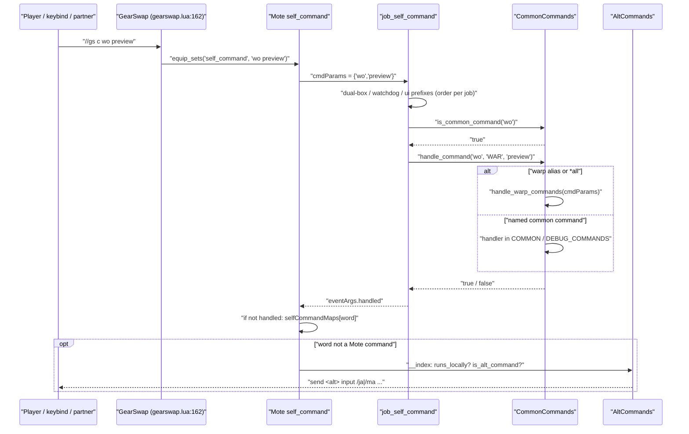

# Command routing, common commands and debug tooling

Every `//gs c <words>` typed by the player, sent by a keybind, a macro, `send_command('gs c ...')` or the dual-box partner (`send <char> gs c ...`) enters the same pipe: GearSwap hands the whole string to Mote's `self_command`, Mote splits it and calls the job's `job_self_command`, and the job file decides, in a fixed order that differs slightly per job, whether the command is a watchdog, dual-box, UI, common or job-specific command. `CommonCommands` (`shared/utils/core/COMMON_COMMANDS.lua`) owns the ~70 commands that every job shares (warp shortcuts, wardrobe, refill, lockstyle, debug toggles, diagnostics). A name that nothing on the main answers goes to the dual-box alt-command system, which `CommonCommands` installs as the last lookup of Mote's `selfCommandMaps`. The diagnostic handlers live in `DEBUG_COMMANDS.lua` and the tools under `shared/utils/debug/`. This page describes the routing contract, lists every command, and documents what each debug tool measures and writes.

## Files

| Path | Lines | Role |
|---|---|---|
| `shared/utils/core/COMMON_COMMANDS.lua` | 733 | `CommonCommands`: router (`handle_command`), membership tests (`is_common_command`, `runs_locally`), gameplay/utility handlers, installs the alt-command fallback |
| `shared/utils/core/DEBUG_COMMANDS.lua` | 453 | `DebugCommands`: perf, fulltest, syscheck, lagdebug, debugsubjob, jamsg/spellmsg/wsmsg, info, debugstate, memcheck; re-exposed on `CommonCommands` |
| `shared/utils/commands/info_command.lua` | 403 | `//gs c info <name>`: looks a JA / spell / WS up in the project databases and prints its fields |
| `shared/utils/config/config_loader.lua` | 86 | `ConfigLoader.load_ui_config(char, job)`: loads `<char>/config/UI_CONFIG.lua`, sets `_G.UIConfig` and `_G.ui_display_config` |
| `shared/utils/debug/debug_logger.lua` | 87 | `DebugLogger`: one-line flag-gated debug output through `MessageFormatter.show_debug` |
| `shared/utils/debug/full_test.lua` | 286 | `FullTest`: syscheck + module loads + `_G` hooks + `sets` structure, scored, optional file export |
| `shared/utils/debug/global_probe.lua` | 213 | `GlobalProbe`: snapshots `_G`, reports globals created afterwards, reports missing Mote hooks |
| `shared/utils/debug/lag_debugger.lua` | 500 | `LagDebugger`: event journal (frames, stalls, module loads, actions, job changes) kept on `windower._lagdebug`, exported to a file |
| `shared/utils/debug/performance_profiler.lua` | 354 | `Profiler`: load-time checkpoints for `get_sets()` and the job facades, persistent on/off switch file |
| `shared/utils/debug/system_checker.lua` | 314 | `SystemChecker`: 10 runtime health checks, scored, optional per-character export |
| `shared/jobs/*/functions/*_COMMANDS.lua` | 157-582 | Per-job `job_self_command`; only the routing contract is covered here (job commands belong to the job pages) |

Related files read to establish behaviour (not owned by this area): `shared/utils/core/WATCHDOG_COMMANDS.lua`, `shared/utils/core/CYCLE_HANDLER.lua`, `shared/utils/ui/UI_COMMANDS.lua`, `shared/utils/dualbox/alt_commands.lua`, `shared/utils/warp/warp_command_registry.lua`, `shared/utils/core/INIT_SYSTEMS.lua`, `shared/utils/core/module_cache.lua`, and the GearSwap engine (`../gearswap.lua`, `../refresh.lua`, `../user_functions.lua`, `../flow.lua`, `../libs/Mote-SelfCommands.lua`).

## How it works

### 1. Engine and Mote: from `//gs c` to `job_self_command`

1. GearSwap's `addon command` handler (`gearswap.lua:162-166`) takes everything after `c`, runs each word through `convert_auto_trans`/`from_shift_jis`, joins the words with single spaces and calls `equip_sets('self_command', nil, <string>)`. `equip_sets` calls the user function through `user_pcall` (`flow.lua:105`, `318-327`), which catches a Lua error inside the job's handler and re-raises it with a "GearSwap has detected an error in the user function" prefix, so it is printed and the rest of that command is skipped.
2. Mote's `self_command` (`Mote-SelfCommands.lua:9-37`) splits the string on spaces into `commandArgs`, creates `eventArgs = {handled = false}` and calls `job_self_command(commandArgs, eventArgs)`. Nothing is lower-cased by the engine or by Mote: every job file lower-cases only `cmdParams[1]`.
3. If `eventArgs.handled` is still false afterwards, Mote removes the first word and looks it up, case-sensitively, in `selfCommandMaps` (`Mote-SelfCommands.lua:454-465`: `toggle`, `cycle`, `cycleback`, `set`, `reset`, `unset`, `update`, `showtp`, `naked`, `help`, `test`). That is how `gs c update` (sent by AutoMove on each movement) and `gs c cycle X` reach Mote. Once `COMMON_COMMANDS` has loaded (on the first command of each job file load), a name missing from that table is answered by an `__index` that returns the dual-box alt's command of that name, if any (section 4).

### 2. The job-file contract

Every `[JOB]_COMMANDS.lua` defines `job_self_command(cmdParams, eventArgs)` and exports it as `_G.job_self_command`. Each one:

1. returns if `cmdParams[1]` is missing, calls its local `ensure_commands_loaded()` (lazy `require` of `COMMON_COMMANDS`, `WATCHDOG_COMMANDS`, `UI_COMMANDS`, `CYCLE_HANDLER`, `message_formatter`, `message_commands`),
2. computes `command = cmdParams[1]:lower()`,
3. tests a sequence of shared prefixes, each ending with `return`,
4. then tests its own job commands.

The common-command step has the same shape in all 16 files (BST, PUP and SMN also nil-check `CommonCommands`):

```lua
if CommonCommands.is_common_command(command) then
    local args = {}
    for i = 2, #cmdParams do table.insert(args, cmdParams[i]) end
    if CommonCommands.handle_command(command, '<JOB>', table.unpack(args)) then
        eventArgs.handled = true
    end
    return
end
```

`table.unpack` is not Lua 5.1; it comes from Windower's `libs/tables.lua:457`. With no extra arguments it is plain `unpack(t)`, which is what forwarding needs (passing only `cmdParams[1]` would drop every subcommand, e.g. `warp all`). With extra arguments it treats them as keys, not as a start index (see Gotchas).

When `handle_command` returns false the job file still returns, `eventArgs.handled` stays false and Mote tries `selfCommandMaps[cmdParams[1]]`, which finds nothing for any common name (`equip`, a failed `reload`...): the alt fallback refuses every name `CommonCommands.runs_locally` claims, so the command ends silently.

Order of the shared prefixes, per job (line numbers of the `if`):

| Job | altjobupdate / requestjob | watchdog | common | ui | debugmidcast | cyclestate | notes |
|---|---|---|---|---|---|---|---|
| BLM | 252 / 263 | 273 | 283 | 299 | 308 | 327 | |
| BRD | 165 / 176 | 271 | 279 | 184 | 246 | 265 | `forceidle` at 193 before common |
| BST | 154 / 165 | 227 | 238 | 176 | 185 | 216 | `debugprecast` at 197 overrides the common one (toggles `_G.BST_DEBUG_PRECAST`) |
| COR | 94 / 104 | 146 | 154 | 112 | 121 | 140 | |
| DNC | 71 / 82 | 90 | 98 | 111 | 120 | 139 | |
| DRK | 74 / 86 | 96 | 106 | 122 | 131 | 150 | |
| GEO | 91 / 102 | 144 | 152 | 110 | 119 | 138 | |
| PLD | 99 / 110 | 91 | 120 | 136 | 145 | 164 | |
| PUP | 154 / 165 | 215 | 226 | 176 | 185 | 204 | file is a copy of BST_COMMANDS |
| RDM | 160 / 170 | 190 | 198 | 183 | 227 | 246 | 218-221: every raw `selfCommandMaps` name falls to Mote; from 359: an unknown command is cast as a JA/WS/spell name, else left to Mote when `selfCommandMaps` (the alt fallback) answers it, else "Command not recognized" |
| RUN | 90 / 101 | 82 | 111 | 127 | 136 | 155 | |
| SAM | 56 / 67 | 77 | 87 | 103 | 112 | 131 | |
| SMN | 298 / 307 | 347 | 368 | 317 | 326 | 337 | `skillup` at 357 before common |
| THF | 77 / 88 | 96 | 104 | 117 | 126 | 145 | |
| WAR | 85 / 96 | 77 | 106 | 122 | 131 | 178 | |
| WHM | 67 / 78 | 88 | 98 | 112 | 121 | 140 | |

Because `ui`, `watchdog`, `cyclestate`, `debugmidcast`, `altjobupdate` and `requestjob` are not common names, the different orders only matter for names that collide (see Gotchas: `perf`, `testcolors`, `debugprecast`).

### 3. `CommonCommands.handle_command(command, job_name, ...)`

`COMMON_COMMANDS.lua:422-658`.

1. Normalises its input (`428-450`): a string `command` is lower-cased and rebuilt into `cmdParams = {command, ...}`; a table is taken as `cmdParams` directly (no caller passes a table today). `args = cmdParams[2..n]`.
2. Warp (`459-474`): exact match against `warp_command_registry.COMMANDS` (105 aliases), then any name ending in `all` whose base is a warp alias (`warpall`, `sdall`...). Both go to `handle_warp_commands(cmdParams)` (`388-414`), which requires `shared/utils/warp/warp_commands` and returns `WarpCommands.handle_command(cmdParams)`; on load failure it prints a module-by-module diagnostic.
3. One `if/elseif` chain for the named commands (`479-655`, table below).
4. Returns false otherwise. It never sends anything to the alt.

`is_common_command(command)` (`663-710`) repeats the same names as a hand-written `or` chain (`671-688`) and the warp exact and `all` tests (`692-707`). It does not look at the alt's config. The two lists must be kept in sync by hand: a name added to `handle_command` only is unreachable from every job file.



### 4. Alt commands and name shadowing

`AltCommands.is_alt_command(cmd)` (`shared/utils/dualbox/alt_commands.lua:424-431`) is true only on the dual-box MAIN (`_G.DualBoxConfig.enabled` and `role == 'main'`, `106-113`) when `cmd` is a key of the alt's current main-job or subjob config: `<main char>/config/alt/<JOB>_ALT_COMMANDS.lua` merged with `<JOB>_ALT_CUSTOM.lua` (`154-247`), filtered by the level the alt reported in `_G.AltJobState`, cached per `job/sub/levels` key (`249-281`). Explicit forms: `//gs c altcmds [filter]` / `altlist` lists them, `//gs c alt <name> [args]` runs one and forwards every extra word (`480-496`).

A bare `//gs c <name>` reaches the alt only as Mote's last lookup. At module load `COMMON_COMMANDS.lua:729-732` calls `AltCommands.install_fallback(selfCommandMaps, CommonCommands.runs_locally)` (`alt_commands.lua:507-520`), which puts an `__index` on Mote's `selfCommandMaps`. Mote reads that table only when `job_self_command` left the command unhandled (`Mote-SelfCommands.lua:26-35`), and `__index` runs only for names the table lacks, so:

- a job command always keeps its name. Names that exist both as a job command and as an alt key today (job file : alt config): `lightarts` (BLM, GEO, PLD : SCH), `darkarts` (BLM, GEO : SCH), `klimaform` (BLM : SCH), `dispel` (BLM, GEO : RDM, SCH), `entrust` (GEO : GEO), `doubleup` (COR : COR), `fandance` (DNC : DNC), `berserk`, `defender` (WAR : WAR), `thirdeye` (WAR : SAM), `marcato`, `nightingale`, `pianissimo`, `troubadour` (BRD : BRD), and RDM's table-driven `convert`, `chainspell`, `saboteur`, `composure` (RDM : RDM). They run on the main; `//gs c alt <name>` sends the alt's version;
- Mote's own commands (`update`, `cycle`, ...) are never shadowed;
- `__index` also refuses every name `CommonCommands.runs_locally(name)` claims (`COMMON_COMMANDS.lua:718-724`: common names, warp aliases and `<alias>all`, Mote's raw keys), so a common command whose handler fails does not fall through to the alt. Four alt keys are such names: `warp`, `escape`, `retrace` (BLM alt config) and `jump` (DRG alt config); they run only as `//gs c alt <name>`;
- the lookup is case-insensitive (`Haste` works), because `is_alt_command` and `execute` lower-case the name.

The table is rebuilt by Mote on every job file load, and `COMMON_COMMANDS` is required again in each new sandbox on its first command, so the fallback exists from the first command on. RDM's cast-by-name fallback leaves a name unhandled when `selfCommandMaps` answers it (`RDM_COMMANDS.lua:383-386`); the other 15 job files have no catch-all.

`altcmds` / `altlist` / bare `alt` pass `runs_locally` down to `AltCommands.list` (`alt_commands.lua:528-550`), which lists the names `runs_locally` claims apart, under a `//gs c alt <name>` line (`message_alt_commands.lua:277-284`). It cannot see job-specific commands, so a job command that shares an alt key (the list above) is still shown in the bare form although it runs on the main.

## Commands

### Common commands (`CommonCommands.handle_command`)

Arguments are passed through with their original case unless the handler lower-cases them (noted).

| Command (aliases) | Args | Effect | Route (`COMMON_COMMANDS.lua` unless stated) |
|---|---|---|---|
| warp aliases: `w warp w2 warp2 ret retrace esc escape tph tpholla tpd tpdem tpm tpmea tpa tpaltep tpy tpyhoat tpv tpvahzl rj recjugner rp recpashh rm recmeriph sd sandoria bt bastok wd windurst jn jeuno sb selbina mh mhaura rb rabao kz kazham ng norg tv tavnazia au wg whitegate ns nashmau ad adoulin stsd stable-sd stbt stable-bt stwd stable-wd stjn stable-jn op outpost cz ceizak ys yahse hn hennetiel mm morimar mj marjami yc yorcia km kamihr wj wajaom ar arrapago pg purgonorgo rl rulude zv zvahl riv riverne yo yoran lf leafallia bh behemoth cc chocircuit pt parting cg chocogirl ld leader td tidal` | `warp status|unlock|lock|fix|test|help|ipctest`, `all` | Warp spell / item / destination; `<alias>all` or `<alias> all` broadcasts to other instances | `459-474` -> `388-414` -> `warp/warp_commands.lua:228` |
| `naked` | - | `equip()` every slot to `empty`, prints "All slots cleared." Does not `enable` disabled slots (Mote's own `naked` did) | `479` -> `303-318` |
| `equip naked` | `naked` (case-insensitive) | Same as `naked`. `equip` with any other argument returns false | `481` |
| `mount` | - | Dismount if riding, else a random owned mount | `483` -> `100-109` -> `mount/mount_manager.lua:152` |
| `reload` | - | `JobChangeManager.force_reload(player.main_job, player.sub_job or 'SAM')` -> bumps the debounce counter, `gs reload` | `485` -> `26-38` -> `core/job_change_manager.lua:187` |
| `checksets` | - | `EquipmentChecker.check_job_equipment(job_name)` | `487` -> `114-124` -> `equipment/equipment_checker.lua:449` |
| `wardrobeaudit` (`wa`) | - | `WardrobeAuditor.audit()` | `489` -> `129-139` -> `equipment/wardrobe_auditor.lua:561` |
| `worganize` (`wo`) | `scan`/`scanwarp`, `keep`/`kept`/`items`, `verify`/`check`, `reset`, `recover`/`unlock`, `alt`/`kaories`, `global [preview|dry]`, `preview`/`dry`, none | Wardrobe organizer entry points. Arguments are compared case-sensitively; anything unrecognised (including `Preview`) runs the full `organize()` | `491` -> `150-193` |
| `refill` (`rf`) | - | `RefillManager.refill()`, then `DualBoxSyncIPC.broadcast('rf')` so the partner refills too | `493` -> `200-216` |
| `automedicine` (`am`) | `on`/`off` (lower-cased) or none = toggle | Auto use of Echo Drops / Remedy | `495` -> `225-232` -> `debuff/auto_medicine.lua:170` |
| `alt`, `altcmds`, `altlist` | `alt <name> [args]`, `altcmds [filter]` | Run / list alt commands; the list puts names that run on the main under `//gs c alt <name>` | `497` -> `243-250` -> `dualbox/alt_commands.lua:480` |
| `altbuff` | `<buff words...> <0/1>` | Sent by the alt to the main: record a buff going up/down | `499-505` -> `AltBuffReporter.receive` |
| `altbuffsync` | - | Sent by the main to the alt: resend every tracked buff | `506-512` -> `report_all` |
| `altsync` | - | On the main: ask the alt to resync | `513-521` -> `request_sync` |
| `altbuffs` | - | Show what the main believes about the alt's buffs | `522-528` -> `show_state` |
| `altdebug` | - | Toggle buff-report tracing (`windower._alt_buff_debug`), log to `data/altbuff_<char>.log` | `529-539` -> `alt_buff_reporter.lua:84` |
| `craft` | `[variant|off|stop|uncraft]` | Equip / leave a crafting set | `540` -> `craft/craft_commands.lua:241` |
| `fish` (`fishing`) | `[variant]` | Equip fishing set | `542` -> `craft_commands.lua:268` |
| `uncraft` | - | Unlock and restore gear | `544` -> `craft_commands.lua:287` |
| `lockstyle` (`ls`) | - | `select_default_lockstyle()` then `DualBoxSyncIPC.broadcast('ls')` | `546` -> `327-344` |
| `dressup` | - | `LockstyleManager.toggle_dressup()` (persistent) | `548` -> `352-363` |
| `perf` | `start|on|enable`, `stop|off|disable`, `toggle`, other/none = status (lower-cased) | Profiler switch | `550` -> `DEBUG_COMMANDS.lua:32-52` |
| `testcolors` (`colors`) | - | Prints chat colour codes 1-509 minus 10, 13, 30, 31, 253-279, 507-508, 14 per row | `552` -> `263-298` |
| `jump` | - | `DRGJumpManager.execute_jump()` | `554` -> `43-53` |
| `waltz` | - | DNC main or sub only; cancels Saber Dance; `WaltzManager.cast_curing_waltz('<stpc>')` | `556` -> `87-89`, `58-84` |
| `aoewaltz` | - | Same guard; `cast_divine_waltz()` | `558` -> `92-94` |
| `debugsubjob` (`dsj`) | - | Prints main/sub job + levels, zone id/name | `560` -> `DEBUG_COMMANDS.lua:117-143` |
| `debugwarp` | - | Toggles `windower._gs_debug.WARP`, mirrored to `_G.WARP_DEBUG` | `562-569` |
| `debugprecast` | - | Toggles `windower._gs_debug.PRECAST`, mirrored to `_G.PrecastDebugState` (read by `BRD_PRECAST.lua`, `RDM_PRECAST.lua`, `RUN_PRECAST.lua`). On BST the job file answers first and toggles `_G.BST_DEBUG_PRECAST` instead | `570-582` |
| `automovedebug` (`amd`) | - | Toggles `windower._gs_debug.AUTOMOVE`, mirrored to `_G.AUTOMOVE_DEBUG`. It has its own field because it used to be restored from `UPDATE`, which silently undid the toggle at the next job load | `583-594` |
| `debugjobchange` (`djc`) | - | Toggles `windower._gs_debug.JOBCHANGE`, mirrored to `_G.JOBCHANGE_DEBUG` - it has to survive the event it traces; when turning on, prints `_G.JobChangeManagerSTATE` counter/current/target | `595-611` |
| `debugstate` (`ds`) | - | Dumps AutoMove, JobChangeManager and UI manager counters | `595` -> `DEBUG_COMMANDS.lua:226-249` |
| `debugupdate` | - | Toggles `windower._gs_debug.UPDATE`, mirrors it to `_G.UPDATE_DEBUG` and `_G.AUTOMOVE_DEBUG`; restored on every load by `INIT_SYSTEMS.lua:32-35` | `597-606` |
| `fulltest` (`ft`) | `[export]` | Runs `FullTest`, prints, optionally writes the report | `607` -> `DEBUG_COMMANDS.lua:60-72` |
| `syscheck` (`sc`) | `[export]` | Runs `SystemChecker`, prints, optionally writes the report | `609` -> `DEBUG_COMMANDS.lua:76-88` |
| `lagdebug` (`ldb`) | `export|exp|e`, `reset|clear|r`, `status|stat|s`, none = toggle (lower-cased) | Lag journal control | `611` -> `DEBUG_COMMANDS.lua:92-109` |
| `jamsg` | `full|f`, `on|name|nameonly|name_only|n`, `off|disabled|disable|d`, none = show | JA message mode, saved per character | `613` -> `DEBUG_COMMANDS.lua:197-199`, `156-194` |
| `spellmsg` | same | Spell message mode (`spell_mode`, read by every spell family including Enfeebling) | `615` -> `DEBUG_COMMANDS.lua:202-204` |
| `wsmsg` | same plus `tp|tponly|tp_only|t` (= `on`) | WS message mode | `617` -> `DEBUG_COMMANDS.lua:207-209` |
| `info` | `<name words...>` | JA / spell / WS details | `619` -> `DEBUG_COMMANDS.lua:215-218` -> `commands/info_command.lua:370` |
| `debugmsg` | - | Prints `_G.MESSAGE_SETTINGS.spell_mode/ja_mode/ws_mode` | `621-631` |
| `testmsg` (`msgtest`) | `[job|system]` | `messages.test(filter)` | `632-639` |
| `msgtests` | - | `MessageValidator.run_all_tests()` | `640-644` |
| `memcheck` (`mem`) | ignored | `_G` survey written to a file, summary in chat | `645` -> `DEBUG_COMMANDS.lua:430-452` |
| `commands` (`cmds`) | - | `MessageCommands.show_commands_list()` | `647-650` |
| `help` (`?`) | - | `MessageCommands.show_help()`; shadows Mote's `help` | `651-654` |
| any alt-config key no local command answers | `[args]` | Sent to the alt by Mote's `selfCommandMaps` fallback (see section 4) | `alt_commands.lua:507-520` |

### Shared commands handled in the job files

| Command | Args | Effect | Handler |
|---|---|---|---|
| `altjobupdate` | `<job> <sub> [main_lvl] [sub_lvl]` | Record the alt's job (sent by the partner) | `DualBoxManager.receive_alt_job` (every job file) |
| `requestjob` | - | Reply with this character's job | `DualBoxManager.handle_job_request` |
| `watchdog` | none = status; `on`, `off`, `toggle`, `debug`, `buffer <n>`, `fallback <n>`, `clear`, `test [spell] [id]`, `stats` | Midcast watchdog control; sets `eventArgs.handled` itself | `WATCHDOG_COMMANDS.lua:36-100` |
| `ui` | none = toggle; `h|header`, `l|legend`, `c|columns`, `f|footer`, `s|save`, `on|enable`, `off|disable`, `font <name>`, `bg|background|theme <preset|toggle|list|r g b a>`, `help|?` | Keybind HUD | `UI_COMMANDS.lua:27-96`, see [ui-overlay.md](ui-overlay.md) |
| `cyclestate` | `<StateName> [reverse|backwards|r]` (`^[%w_]+$`) | HUD visible: Mote's `handle_cycle` without its chat line (`job_state_change(description, new, old)`, then `handle_update({'auto'})`, which runs `job_update` and refreshes gear), then a HUD repaint. HUD hidden: `send_command('gs c cycle <State>[ reverse]')` so Mote prints its message | `CYCLE_HANDLER.lua:90-124` |
| `debugmidcast` | - | `MidcastManager.toggle_debug()` + confirmation | every job file, see [midcast-and-buffs.md](midcast-and-buffs.md) |

Mote-native commands that still reach Mote: `update`, `toggle`, `cycle`, `cycleback`, `set`, `reset`, `unset`, `showtp`, `test`. `naked` and `help` are answered by `CommonCommands` first. BLM answers `cycle Storm` itself (`BLM_COMMANDS.lua:169-197`), so that one never reaches Mote on BLM.

## Public API

### CommonCommands (`COMMON_COMMANDS.lua`, returned module, no `_G` export)

| Function | Line | Notes |
|---|---|---|
| `handle_command(command, job_name, ...)` -> boolean | 422 | Router. Callers: the 16 job files. `job_name` is used only by `reload` and `checksets` |
| `is_common_command(command)` -> boolean | 663 | Callers: the 16 job files, `runs_locally`. Common names and warp aliases only |
| `runs_locally(name)` -> boolean | 718 | True for common names, warp aliases and raw `selfCommandMaps` keys. Passed to `AltCommands.install_fallback` and `AltCommands.handle` |
| `handle_reload(job_name)` | 26 | |
| `handle_jump()` | 43 | |
| `handle_waltz()`, `handle_aoewaltz()` | 87, 92 | |
| `handle_mount()` | 100 | |
| `handle_checksets(job_name)` | 114 | |
| `handle_wardrobeaudit()` | 129 | |
| `handle_wardrobeorganize(arg, arg2)` | 150 | |
| `handle_refill()` | 200 | Broadcasts `rf` |
| `handle_automedicine(arg)` | 225 | |
| `handle_alt_command(cmd, args)` | 243 | |
| `handle_craft`, `handle_fish`, `handle_uncraft` | 254-256 | Aliases of `CraftCommands.*` |
| `handle_testcolors()` | 263 | |
| `handle_naked()` | 303 | |
| `handle_lockstyle()` | 327 | Reads global `select_default_lockstyle`; broadcasts `ls` |
| `handle_dressup()` | 352 | |
| `handle_perf`, `handle_fulltest`, `handle_syscheck`, `handle_lagdebug`, `handle_debugsubjob`, `handle_jamsg`, `handle_spellmsg`, `handle_wsmsg`, `handle_info`, `handle_debugstate`, `handle_memcheck` | 372-383 | Aliases of `DebugCommands.*` |
| `handle_warp_commands(cmdParams)` | 388 | |

No `handle_*` function is called from outside `handle_command` (repo-wide grep including `Tetsouo/` and `Kaories/`).

### DebugCommands (`DEBUG_COMMANDS.lua`, returned module)

`handle_perf(action)` 32, `handle_fulltest(action)` 60, `handle_syscheck(action)` 76, `handle_lagdebug(action)` 92, `handle_debugsubjob()` 117, `handle_jamsg(mode)` 197, `handle_spellmsg(mode)` 202, `handle_wsmsg(mode)` 207, `handle_info(args)` 215, `handle_debugstate()` 226, `handle_memcheck(arg)` 430. Only caller: `COMMON_COMMANDS.lua:371-383`.

### InfoCommand (`info_command.lua`)

`InfoCommand.handle(args)` (370): joins `args` with spaces; `search_all_databases(name)` (307-361) tries `DataLoader.get_ability/get_spell/get_weaponskill` with the exact name, then scans `_G.FFXI_DATA.<kind>` case-insensitively. Each `DataLoader.get_*` loads its complete database on first use (`data_loader.lua:264-290`), in the order abilities, spells, weaponskills, stopping at the first hit: an ability name loads one database, a weaponskill or unknown name loads all three, and they stay in `_G.FFXI_DATA` for the rest of the environment. Output goes through `MessageInfo` (`formatters/ui/message_info.lua`); JA recast/duration are seconds, spell recast/duration/cast time centiseconds (`182-194`).

### ConfigLoader (`config_loader.lua`)

`ConfigLoader.load_ui_config(char_name, job_name)` -> table (33). `dofile(windower.windower_path .. 'addons/GearSwap/data/' .. char_name .. '/config/UI_CONFIG.lua')` inside `pcall` (45-50); on failure a fallback table (54-62) and `MessageCore.show_config_error`. Writes `_G.UIConfig` (67) then requires `shared/config/ui_settings` and writes `_G.ui_display_config` from its getters (70-77). Callers: module level of every entry file (`_master/entry/Tetsouo_*.lua`, `_master/Kaories/entry/*.lua`, live `Tetsouo/*.lua`, `Kaories/*.lua`), e.g. `_master/entry/Tetsouo_BLM.lua:57-58`.

### DebugLogger (`debug_logger.lua`, returned module)

| Function | Line | Callers |
|---|---|---|
| `log(prefix, message)` | 52 | `_master/config_global/UI_CONFIG.lua:382-387` |
| `logf(prefix, fmt, ...)` | 60 | `movement/automove.lua:251` |
| `log_if(flag_key, prefix, message)` | 72 | `job_change_manager.lua:90`, `job_sync_watchdog.lua:96`, `automove.lua:248` ... |
| `logf_if(flag_key, prefix, fmt, ...)` | 82 | `job_change_manager.lua:124,161,168`, `job_sync_watchdog.lua:142,155`, `automove.lua:108,238` ... |

`_if` variants read `_G[flag_key]` and return immediately when falsy; `MessageFormatter` is required on first real output (38-43). Output is `MessageFormatter.show_debug(prefix, msg)` = `MessageRenderer.send('[prefix] msg', 8)`.

### Profiler (`performance_profiler.lua`, returned module)

`enable()` 85, `disable()` 93, `toggle()` 100, `is_enabled()` 111, `status()` 116, `start(context)` 178, `mark(label)` 191, `finish()` 225, `create_timer(context)` 258, `profile_call(label, func, ...)` 309, `measure(label, block)` 334. Callers: `start/mark/finish` in every entry file's `get_sets()` (e.g. `_master/entry/Tetsouo_WAR.lua:72-138`), `create_timer` at the top of every `*_functions.lua` facade (e.g. `war_functions.lua:22`), `enable/disable/toggle/status` from `DebugCommands.handle_perf`. `profile_call` and `measure` have no caller.

### LagDebugger (`lag_debugger.lua`, `_G.LagDebugger` + returned module)

Control: `start()` 185, `stop()` 218, `toggle()` 227, `reset()` 236, `is_enabled()` 244, `status()` 249, `export()` 453, `log(type, data)` 276 (no caller), `_raw(type, data)` 260. Probes called by other systems, each a no-op unless recording: `on_automove_update` 286 (`automove.lua:254,281,355`), `on_automove_start` 303 (`automove.lua:324`), `on_automove_stop` 309 (`automove.lua:107`), `on_job_change` 315 (`job_change_manager.lua:133`), `on_cleanup` 321 (`job_change_manager.lua:89`), `on_gs_reload` 329 (`job_change_manager.lua:167`), `on_reload_complete` 335 (`INIT_SYSTEMS.lua:68`), `on_prerender_check` 341 (live `Tetsouo/Tetsouo_BST.lua:328` only), `on_job_update` 354 (live `Tetsouo/Tetsouo_WAR.lua:266`, `Tetsouo_BST.lua:244`, `Tetsouo_SMN.lua:160` only; no `_master` template calls it).

### SystemChecker, FullTest, GlobalProbe

- `SystemChecker.run()` 202 -> `{session, results, score, total, passed}`; `display(report)` 240; `export(report)` 263. Callers: `DebugCommands.handle_syscheck`, `FullTest.run` (via `run_system_checks`, `full_test.lua:22-29`).
- `FullTest.run()` 153; `display(report)` 198; `export(report)` 231. Caller: `DebugCommands.handle_fulltest`.
- `GlobalProbe.snapshot()` 157 (caller: `INIT_SYSTEMS.lua:267-272`, 5.0 s after load); `leaks()` 167 and `missing_hooks()` 197 (caller: `system_checker.lua:167-200`). Exported as `_G.GlobalProbe` (211).

## Debug tools

### SystemChecker (`//gs c syscheck [export]`)

Ten checks, each OK = 1, WARN = 0.5, FAIL = 0; score = `floor(sum/10*100)`.

| Check | Reads | OK / WARN / FAIL |
|---|---|---|
| AutoMove (22) | `_G.DISABLE_AUTOMOVE`, `_G.AUTOMOVE_RUNNING`, `windower._automove_seq` | disabled or running / `false` / `nil` |
| Watchdog (39) | `_G.MidcastWatchdog.get_stats()` | loaded / not yet loaded (it is loaded 2 s after load) |
| WarpInit (54) | `windower._warp_init_done`, else `WarpInit.is_initialized()` | flag set / not initialised / module failed |
| Hook Chain (71) | `windower._hook_wraps{ability,ws,midcast}` / `windower._gs_reload_count` | every ratio in 0.5-1.1 / a ratio < 0.5 or no reload yet / a ratio > 1.1 (accumulated wrapping) |
| State.Moving (99) | `state.Moving` | exists / missing |
| JobChangeMgr (107) | `_G.JobChangeManagerSTATE` | exists / - / missing |
| UI Manager (117) | `_G.ui_manager_state`, `_G.KeybindUI` | loaded / > 3 consecutive failures or not loaded |
| LagDebugger (137) | `_G.LagDebugger`, `windower._lagdebug.log` | loaded / - / missing |
| Global leaks (167) | `GlobalProbe.leaks()` | none / no baseline yet / list of names |
| Job hooks (187) | `GlobalProbe.missing_hooks()` | all 7 present / - / list |

Output: chat (`add_to_chat` 207/204/167, allowed for diagnostic tools by `.claude/CODE_QUALITY.md` section 6). Export: `data/syscheck_<player.name>.txt` (268), one file per character.

### FullTest (`//gs c fulltest [export]`)

Section A = the SystemChecker results; B = `pcall(require)` of 14 modules (the 9 mandatory systems + CommonCommands, MessageEngine, MessageColors, WarpInit, MidcastWatchdog, `full_test.lua:35-52`); C = `_G.job_update`, `job_precast`, `job_self_command` must be functions, at least one of `job_midcast`/`job_post_midcast`, count of 4 optional hooks; D = `sets.precast`, `sets.midcast`, `sets.idle`, `sets.engaged` non-empty tables, plus `sets.precast.WS`. Export: `data/fulltest_report.txt` (232), one file shared by all characters.

### LagDebugger (`//gs c lagdebug`)

State lives on `windower._lagdebug` (31-37), which survives `gs reload` and job changes (the `windower` seen by user code is GearSwap's `user_windower` table, created once per addon load, `user_functions.lua:418-423`). While recording:

- Module probe (66-87): replaces `_G.require` with a timing wrapper; any call taking >= 1.0 ms is logged as `MODULE_LOAD {path, ms}`. It wraps whatever `require` is current, which after `INIT_SYSTEMS.lua:47-52` is the `ModuleCache` wrapper, so cache hits stay under the threshold.
- Stall probe (103-141): `prerender` listener; counts every frame into `S.frames` (count, total, max, 10 ms buckets capped at 200) and logs `STALL {gap_ms, last_action, last_module}` for frames >= 40 ms.
- Action probe (144-166): `action` listener; for the player's own actions records `ACTION {kind, cat}` and remembers `last_action`.
- Probes from other systems: `GS_UPDATE_SENT`, `AUTOMOVE_START/STOP`, `JOB_CHANGE`, `CLEANUP_SYSTEMS`, `GS_RELOAD_SCHEDULED`, `GS_RELOAD_COMPLETE`, `BST_PRERENDER`, `JOB_UPDATE`.

The journal is a ring buffer of 2000 entries (`_max`, 41; `table.remove(S.log, 1)` at 271). On module load with recording on, the three probes are reinstalled and `PROBES_REARMED` is logged (489-497). Export: `data/debug_lag.txt` (459) with header, frame-time statistics and histogram, a legend, and one line per event with its fields sorted; one file shared by all characters.

### Profiler (`//gs c perf`)

Switch persisted as the existence of `data/.profiler_enabled` (40, 48-69), shared by every character; read into `_G.PERFORMANCE_PROFILING.enabled` when the module first loads in an environment (72-78). Enabling prints a reload hint (`profiler_messages.lua:27-29`: "Reload job to see timings"), since `start/mark/finish` and `create_timer` only run while a job file loads. `mark()` prints the time since the previous mark (green < 50 ms, yellow < 100, red), `finish()` the total of `get_sets()` (green < 200, yellow < 300); `create_timer(job)` returns a closure that prints per-module times inside the job facade (green < 5 ms, yellow < 10) and a `TOTAL` line. Output goes through the `PROFILER` message namespace (`shared/utils/messages/data/systems/profiler_messages.lua`).

### GlobalProbe

`snapshot()` stores the set of `_G` keys in `_G.__global_baseline`; `leaks()` returns every string key not in the baseline, not in `EXPECTED` (37-126, generated from `_G.x =` sites by `scripts/audit`), not starting with `__`, `job_` or `user_`, and not matching the factory patterns in `GENERATED` (132-136). `missing_hooks()` checks `job_precast`, `job_midcast`, `job_post_midcast`, `job_aftercast`, `job_status_change`, `job_buff_change`, `job_self_command` (190-193); all 16 job folders define the 7.

### memcheck, debugstate, debugsubjob

- `memcheck` (`DEBUG_COMMANDS.lua:430-452`): walks `_G`, groups entries by type, counts each table's direct children, sorts tables by that count, lists `package.loaded` when `package` is visible, writes `data/memcheck_<char>_<job>.txt` (388-389) and prints three numbers plus the path. Project modules show up under `_G.__require_cache` (see `module_cache.lua`).
- `debugstate` (226-249): `_G.AUTOMOVE_RUNNING`, `windower._automove_seq`, `_G._automove_sequence`, JobChangeManager counter and lockstyle registry size, UI manager ids and failure count.
- `debugsubjob` (117-143): `player.main_job/_level`, `player.sub_job/_level`, `windower.ffxi.get_info().zone` and its `res.zones` name. The header comment states its purpose: checking that `sub_job_level` reads 0 in Odyssey Sheol Gaol.

## Configuration

| Read / written | Where | Default / notes |
|---|---|---|
| Warp aliases | `shared/utils/warp/warp_command_registry.lua:21-62` | Single list shared with `warp_ipc.lua` |
| Alt command definitions | `<main char>/config/alt/<JOB>_ALT_COMMANDS.lua` + `<JOB>_ALT_CUSTOM.lua` | Loaded by `alt_commands.lua:159-172` with the MAIN's `player.name` |
| Message modes | `<char>/config/message_modes.lua` via `shared/config/message_settings.lua:35-41` | Written by `jamsg/spellmsg/wsmsg`; defaults `on` (`message_settings.lua:102-106`) |
| UI config | `<char>/config/UI_CONFIG.lua` | Fallback in `config_loader.lua:54-62` |
| Profiler switch | `data/.profiler_enabled` | Absent = off |
| Report files written | `data/syscheck_<char>.txt`, `data/fulltest_report.txt`, `data/debug_lag.txt`, `data/memcheck_<char>_<job>.txt`, `data/altbuff_<char>.log` | `windower.addon_path .. 'data/'` |

## State & lifetime

- GearSwap builds a new user environment on every file load (`gs reload`, job change, `gs l`): `refresh.lua:62-183`. `_G` inside project code is that environment (`refresh.lua:149`), so every `_G.*` flag below is reset on each load. The `windower` table seen by project code is the addon-lifetime `user_windower` (`user_functions.lua:418-423`), so `windower._*` fields survive until `//lua reload gearswap`.
- On each file load GearSwap unregisters every event registered through the user `windower.register_event`/`raw_register_event` (`refresh.lua:69-71`, `user_functions.lua:254-282`) and deletes text/prim objects. Scheduled coroutines are not cancelled by the engine.
- `_G` flags toggled by commands: `WARP_DEBUG`, `PrecastDebugState`, `AUTOMOVE_DEBUG`, `JOBCHANGE_DEBUG`, `UPDATE_DEBUG` (reset each load; `UPDATE_DEBUG` and `AUTOMOVE_DEBUG` are restored from `windower._gs_debug.UPDATE` by `INIT_SYSTEMS.lua:32-35`). `MidcastManagerDebugState` is also a plain `_G` value (`midcast_manager.lua:15-17`).
- Persistent fields: `windower._gs_debug` (debugupdate), `windower._lagdebug` (journal, probe event ids), `windower._alt_buff_debug` (altdebug), `windower._gs_reload_count` (incremented by `INIT_SYSTEMS.lua:38`, read by syscheck/fulltest).
- Module-level caches that die with the environment: `AltCommandsModule` (`COMMON_COMMANDS.lua:14`), `require_wrapped`/`original_require` (`lag_debugger.lua:54-55`), DebugLogger's `MessageFormatter`, Profiler's `M`.
- Events: only LagDebugger registers any (`prerender`, `action`), and only while recording; removed by `stop()` (169-178) and re-registered on load while recording (489-497).
- Load order: job files require `COMMON_COMMANDS` lazily on their first command, which itself requires `message_commands`, `message_formatter`, `message_renderer`, `warp_command_registry`, `craft_commands` and `DEBUG_COMMANDS` at module level. `lag_debugger` is required by `INIT_SYSTEMS.lua:60-62` right after `ModuleCache.install()`. `GlobalProbe.snapshot()` runs 5.0 s after `INIT_SYSTEMS`.

## Interactions

- Called by: every `[JOB]_COMMANDS.lua`; indirectly by AutoMove (`gs c update` passes through `is_common_command` on every movement), by the dual-box partner (`altbuff`, `altbuffsync`, `altjobupdate`, `requestjob`), by craft (`craft_commands.lua:169`, `craft_manager.lua:160` send `gs c rf`), by the wardrobe organizer (`lib/phases.lua:106-107` send `gs c naked`; `wardrobe_organizer.lua:127,130` send `gs c ls` and `gs c rf` after a successful run), and by `CycleHandler` (`gs c cycle <state>`).
- Calls: warp (`warp_commands.lua`), wardrobe organizer/auditor, refill, craft, mount, DRG jump, waltz, lockstyle factory, JobChangeManager, AutoMedicine, dual-box (`alt_commands`, `alt_buff_reporter`, `dualbox_sync_ipc`), message system (`MessageFormatter`, `MessageCommands`, `MessageRenderer`, `messages` API, `MessageValidator`), DataLoader.
- Sibling pages: [precast-pipeline.md](precast-pipeline.md) (`debugprecast` consumers), [midcast-and-buffs.md](midcast-and-buffs.md) (`debugmidcast`), [ui-overlay.md](ui-overlay.md) (`ui`, `cyclestate`).

## Invariants & gotchas

- Only `cmdParams[1]` is lower-cased by the job files; handlers that compare arguments must lower-case them themselves (`perf`, `lagdebug`, `fulltest`, `syscheck`, `automedicine`, `jamsg`... do; `wo` does not).
- `table.unpack` is Windower's (`libs/tables.lua:457-470`): `table.unpack(t)` = `unpack(t)`, but `table.unpack(t, 2)` returns `t[2]` only, not `t[2..n]`.
- A common name or a warp alias (and `<alias>all`) always beats a job command checked after `is_common_command`. Before naming a new job command, grep `CommonCommands.is_common_command` and `warp_command_registry.lua`. An alt-config key never beats a job command, but a job command that returns without `eventArgs.handled = true` (WAR's `berserk` when `buff_war` is nil, `WAR_COMMANDS.lua:212-218`) falls through to Mote and so to the alt's command of that name.
- `naked` from CommonCommands does not re-enable disabled slots; slots disabled by `gs disable` keep their gear while the message says all slots were cleared. The wardrobe organizer enables slots before sending it (`wardrobe/lib/phases.lua:82-101`).
- `refill` and `lockstyle` always broadcast to the dual-box partner, including when triggered by `send_command('gs c rf')` from craft or by the `gs c ls` / `gs c rf` the wardrobe organizer sends when it finishes.
- `debugprecast` has an effect only on BRD, RDM and RUN (the jobs that read `_G.PrecastDebugState`) and toggles a different flag on BST.
- `info` loads the complete ability, spell and weaponskill databases on first use.
- SystemChecker and FullTest print `passed` with `%d` although it can be fractional (a WARN counts 0.5), so "9/10" can accompany a 95 % score. SystemChecker colours WARN and FAIL identically (167, `system_checker.lua:238`).
- LagDebugger registers its probes with the user `windower.register_event`, which GearSwap wraps in `user_equip_sets` (`user_functions.lua:254-262`, `284-291`): every `prerender` and every zone `action` passes through GearSwap's `equip_sets` while recording. `raw_register_event` (used by `party_tracker.lua:64`) avoids that wrapper.

## Extending

Adding a common command:

1. Add the handler (in `COMMON_COMMANDS.lua`, or in `DEBUG_COMMANDS.lua` for diagnostics and alias it at `COMMON_COMMANDS.lua:371-383`).
2. Add the `elseif cmd == ...` branch in `handle_command` and the same name(s) in the `or` chain of `is_common_command` (671-688). Missing the second step makes the command unreachable.
3. Lower-case every argument you compare; make the no-match path print usage rather than run a mutating default.
4. Check the name against job commands (`grep "command == '<name>'" shared/jobs`), warp aliases and the alt configs.
5. Add it to `MessageCommands.show_commands_list()` (`message_commands.lua:517`).

Adding a job command: put it after the common block of the job's `job_self_command`, pick a name that is not a common name, warp alias or `<alias>all`, set `eventArgs.handled = true` on every path and `return`. A name that is also a key in `<char>/config/alt/*.lua` runs locally; the alt's version stays reachable as `//gs c alt <name>`.

Adding a debug flag that must survive a job change: store it on `windower._gs_debug` and restore it in `INIT_SYSTEMS.lua:32-35`, as `debugupdate` does.

## Known issues

- `wo` subcommands are case-sensitive and fall back to a full organize (`COMMON_COMMANDS.lua:157-191`).
- `show_error` called with two arguments drops the message (`COMMON_COMMANDS.lua:629`, `DEBUG_COMMANDS.lua:446`).
- Warp load-failure diagnostic probes a moved module path (`COMMON_COMMANDS.lua:404`).
- Unreachable job branches shadowed by common names: WAR `perf` (`WAR_COMMANDS.lua:186-205`), COR `testcolors`/`colors` (`COR_COMMANDS.lua:302`).
- `GlobalProbe.EXPECTED` whitelists `name` and `x` only because the generator read the probe's own comments (`global_probe.lua:114,126`).
- Comment says GearSwap does not unregister data-file events; the engine does (`lag_debugger.lua:104-107`).
- `debugjobchange` flag is lost on every file load, so traces emitted during a load never print (`COMMON_COMMANDS.lua:584`).
- syscheck WarpInit check trusts a flag that outlives the environment (`system_checker.lua:56-58`).
- `fulltest_report.txt` and `debug_lag.txt` are shared by all characters (`full_test.lua:232`, `lag_debugger.lua:459`).
- `altcmds` cannot tell that a job command shares an alt key, so on WAR with a WAR alt it lists `berserk` in the bare form although `//gs c berserk` runs on the main (`alt_commands.lua:537-541`).
- `automedicine` and `lagdebug` treat any unrecognised argument as "toggle" (`auto_medicine.lua:170-179`, `DEBUG_COMMANDS.lua:98-106`).
- PUP first command per load errors on a missing formatter function (`PUP_COMMANDS.lua:74-77`).
- `sanitize_ascii` strips non-ASCII before mapping UTF-8 punctuation, so the mapping never applies (`info_command.lua:52-60`).
- Help screen advertises `equip` as an alias of `naked` (`message_commands.lua:548`).
- BRD `forceidle` has no sender although its comment names the warp system (`BRD_COMMANDS.lua:232`).
- `spellmsg` comment says it excludes Enfeebling; it does not (`DEBUG_COMMANDS.lua:201`).
- `Profiler.profile_call`, `Profiler.measure`, `LagDebugger.log` have no caller (`performance_profiler.lua:309,334`, `lag_debugger.lua:276`).
- `LagDebugger.on_job_update` is wired only in live `Tetsouo_{WAR,BST,SMN}.lua`, not in any `_master` template.
