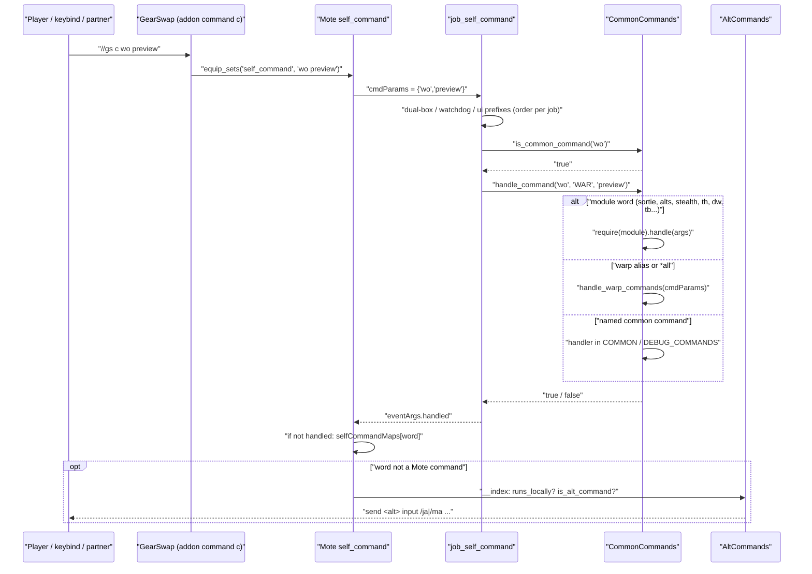

# Command routing, common commands and debug tooling

Every `//gs c <words>` enters the same pipe, whoever sends it: the player, a keybind, a macro, `send_command('gs c ...')` or another box of the group (`send <char> gs c ...`). GearSwap hands the whole string to Mote's `self_command`. Mote splits it and calls the job's `job_self_command`. The job file then checks the command against a fixed sequence of shared prefixes (dual-box, watchdog, UI, common), and only after those against its own commands. The sequence differs slightly from job to job.

`CommonCommands` (`shared/utils/core/COMMON_COMMANDS.lua`) owns the commands every job shares: warp shortcuts, wardrobe, refill, lockstyle, box-group orders, Sortie, stealth, Combat Mode, Treasure Mode, Dual Wield tiers, the belt status, temporary keybinds, key conflicts, trace, the debug toggles and the diagnostics. When nothing on the main answers a name, the name goes to the dual-box alt-command system. `CommonCommands` installs that system as the last lookup of Mote's `selfCommandMaps`.

The diagnostic handlers live in `DEBUG_COMMANDS.lua`, and the tools themselves under `shared/utils/debug/`. This page covers the routing contract, every shared command and every debug tool: what each one measures, where it writes, and what it costs.

## Files

| Path | Role |
|---|---|
| `shared/utils/core/COMMON_COMMANDS.lua` | `CommonCommands`: router (`handle_command`), membership tests (`is_common_command`, `runs_locally`), gameplay and utility handlers, installs the alt-command fallback at module load |
| `shared/utils/core/DEBUG_COMMANDS.lua` | `DebugCommands`: perf, fulltest, syscheck, lagdebug, debugsubjob, jamsg / spellmsg / wsmsg, info, debugstate, memcheck, debugmsg and the five persistent debug toggles; re-exposed on `CommonCommands` |
| `shared/utils/core/WATCHDOG_COMMANDS.lua` | `WatchdogCommands`: `//gs c watchdog ...` (called by the job files, not by `CommonCommands`) |
| `shared/utils/core/CYCLE_HANDLER.lua` | `CycleHandler.handle_cyclestate`: `//gs c cyclestate <State> [reverse]` (called by the job files) |
| `shared/utils/core/combat_mode_commands.lua` | `//gs c combatmode`, built on `optional_state_commands.lua`, see [keybinds-and-custom.md](keybinds-and-custom.md#optional-states-combat-mode-and-treasure-mode) |
| `shared/utils/equipment/treasure_commands.lua` | `//gs c th`, built on `optional_state_commands.lua` |
| `shared/utils/core/optional_state_commands.lua` | Shared command builder for Combat Mode and Treasure Mode (status, `show`, `hide`, `key`, `help`, `extra`) |
| `shared/utils/commands/info_command.lua` | `//gs c info <name>`: looks up a JA, spell or WS in the project databases and prints its fields |
| `shared/utils/config/config_loader.lua` | Installs `ModuleCache` at file level; `ConfigLoader.load_ui_config(char, job)` loads `<char>/_common/display/UI_CONFIG.lua` |
| `shared/utils/debug/debug_logger.lua` | `DebugLogger`: one-line flag-gated debug output through `MessageFormatter.show_debug` |
| `shared/utils/debug/full_test.lua` | `FullTest`: syscheck + module loads + `_G` hooks + `sets` structure, scored, optional file export |
| `shared/utils/debug/global_probe.lua` | `GlobalProbe`: snapshots `_G`, reports globals created afterwards and missing Mote hooks |
| `shared/utils/debug/lag_debugger.lua` | `LagDebugger`: event journal (frames, stalls, module loads, actions, job changes) kept on `windower._lagdebug`, exported to a file |
| `shared/utils/debug/performance_profiler.lua` | `Profiler`: load-time checkpoints for `get_sets()` and the job facades, persistent on/off switch file |
| `shared/utils/debug/system_checker.lua` | `SystemChecker`: 10 runtime health checks, scored, optional per-character export |
| `shared/utils/debug/trace_log.lua` | `TraceLog`: `//gs c trace`, appends what the game returns to `<Character>/trace.log` |
| `shared/utils/atelier/atelier_export.lua` | `AtelierExport`: `//gs c atelier [on\|off]`, writes `<Character>/saved/atelier/<JOB>_<SUB>.js` (`ATELIER_SUBS[char][job][sub]`, one per subjob; the `<JOB>.js` of before 2026-10-01 is removed on the next export and still read by the page) (sets with set_combine base and own slots, aliases, binds with their source, Mote modes, MACROBOOK / LOCKSTYLE configs, owned items by slot, `icons` = item name to id, `descs` = item id to the game's English description from `res.item_descriptions`, every augment of a piece in `augs`; `scan` = name to what //gs c gearscan read in `<Char>/saved/gear_augments.lua` (augments, path, rank, rank_stats, differ); the page parses descriptions and augments into stats (STAT_DEF / STAT_ALIAS in atelier.html), takes the scanned augments for a piece the set names none, the rank_stats of a scanned piece on the same path, and HIDDEN_FC for Fast Cast the description only names). `char` (in game only): the status packet GearSwap keeps in `player` (base_/add_ STR..CHR, max_hp, max_mp, attack, defense) and the worn gear with its own augments (extdata); the page (charStats) takes the worn gear out and the set's in: HP/MP with gear HP% on base + gear, DEF + 1.5 x VIT, Attack + STR. The status packet already holds merits, job point gifts, master level and traits for HP, MP, STR..CHR, Attack and Defense; `char.merits` (get_player().merits), `jp_spent` and `master_level` (0x061 byte 0x65) are exported too, and the page adds the Spell Interruption Rate merit (2 % a level, res/merit_points.lua) to the gear's SIRD. `char.merit_list`: the general merits (ids below 384) and the main job's two groups (384 + 64 x (job - 1), 2048 + 64 x (job - 1)) with key (get_player().merits name, MERIT_KEYS for the four odd ones), level and endesc; the Merits tab (renderMerits) edits levels in S.meritEdits, meritEffect reads a level's effect from endesc and meritDelta moves the measure in charStats. `char.skills` (get_player().skills), `sub_level`, `main_level` and `wskill` (weapon name to res.skills name) feed combatOf: Accuracy and Evasion with the engine's formulas (atelier-engine/player.js: skill steps, TRAITS by level, GIFTS at 2100 JP). collect_items also writes `owned` ({slot = {{name, augs, where, count}}}, one entry per distinct copy, `count` how many of it (two in one bag: one `where`, count 2), its augments from extdata via copy_augments) and keeps to the items the main job can wear (res.items jobs, `wearable`); atelier_all.py carries `owned` with `items`. Page: S.trial[char|job|path] = {slot: piece|null} is applied last in withWeapons (eff.tried), withoutTrial() gives the set as written for the differences, pieceChoices() builds the drawer list, trialLua() the set_combine. Buffs: FOODS / SONGS / ROLLS / BUBBLES / PROTECT / SHELL / HASTE / STORMS / JAS / ENEMIES, buffTotals() adds them up (atkp / defp fractions, deff / mevaf [%, cap], dmgmul product), charStats().calc() applies them on the measure, tankHTML() and offenseHTML() give the results (phalanxPotency, tpBase from atelier-engine/helpers.js get_tp). S.buffs per character is saved in localStorage. `shared/utils/atelier/atelier_sim.lua` (GET /actions, POST /simulate, GET /tpbonus): AtelierSim.tp_bonus runs TPBonusCalculator with the job's `_G.<JOB>TPConfig`, the main / sub and the buffs the page sends (`buffs=Warcry,Hagakure`: they stand for buffactive during the call), and `worn` (slot:name|... of the set before any TP piece, so its own TP pieces count, as TPBonusCalculator does in game), and answers the pieces by page slot plus `bonus` (TPBonusCalculator.effective_tp at 0 TP: weapon, buffs, Fencer), `total` (all the config's pieces), `pieces` (each config piece's bonus), `thresholds` and `worn_aware`; the page (tpAsk, tpSteps, tpLineHTML, tpTotalHTML: the TP line of a weaponskill set, S.wsTp) offers 1000, each threshold minus bonus (and a party Warcry, partyTp) minus total, each threshold minus bonus minus the TP Bonus the set wears (tpbOf: the config value, else the description), and 3000, each chip saying what it is (S._tpWhy), lays the TP pieces last, over the tried pieces, as job_post_precast does, and shows the TP the weaponskill opens with (past 3000: what is wasted; an answer without worn_aware: reload GearSwap); Simulate offers the same steps (simTpSteps). AtelierSim.run builds the spell as triggers.lua does (copy_entry of the res line, spell_complete, target from valid_target or a stand-in, action_type_map), runs the user env's precast / midcast / aftercast with _global.current_event set, reads gearswap.equip_list after each (slot names as the page's), and never calls equip_sets, so nothing is sent; send_command, add_to_chat (kept as messages), cancel_spell, cast_delay, disable / enable and coroutine.schedule are swapped for the run, recasts read as 0 unless asked, a weaponskill sees 3000 TP (player.tp, vitals and get_player); modes, status, TP and the equip list are put back. AtelierSim.actions lists the known spells for the job levels, the job abilities and weapon skills. `scripts/atelier/AtelierLink/AtelierLink.lua`: a Windower addon of its own (installed by `//gs c atelier link`, AtelierExport.install_link), door on 127.0.0.1:52760-52767, token in data/atelier/link_<Char>.js, GET /ping and POST /gearswap?do=load|unload|reload (lua load / unload / reload gearswap); the page (linkTick) offers Unload / Load GearSwap and sends a full restart through it. `shared/utils/atelier/atelier_live.lua`: AtelierLive.start() (AtelierExport.after_load at every load unless `<Char>/saved/atelier_live.off`, written by `//gs c atelier live off`; AtelierLive.set / stop) binds 127.0.0.1:52740-52747 with the LuaSocket GearSwap loads (gearswap.socket), keeps the door in windower._atelier_live across loads, writes data/atelier/live_<Char>.js (port, token) and polls the door from a raw prerender event every 6 frames; GET /ping, GET /export (AtelierExport.build), POST /save?file= (keybind_overrides.lua, set_overrides.lua only), POST /reload (gs reload); every request but OPTIONS carries the token; answers carry CORS and Access-Control-Allow-Private-Network. The page (liveTick every 2 s) replaces the loaded job's export with the live one at each new version and saves through the door first. `shared/utils/atelier/set_overrides.lua`: SetOverrides.apply(job), run by INIT_SYSTEMS.lua after init_gear_sets, lays `<Char>/saved/set_overrides.lua` ({<JOB> = {path = {slot = name | {name, augments} | 'empty'}}}) over the sets, every spelling of the slot replaced, and keeps the file's pieces in SetOverrides.was (exported as set.was); `set_overrides` and `key_overrides` (the two files, read by the export) let the page start from what is saved; the page writes them through the File System Access API into the data folder picked once (IndexedDB keeps the handle), a download otherwise (saveFile). `ws_skill` (collect_ws_skills): each weaponskill a set path names -> its combat skill (res.weapon_skills skill -> res.skills); withWeapons puts in a weaponskill's set the first MainWeapon value of that skill (wsOfSet, weaponSkillOf) unless the page has a choice; a weapon set (family weapons) gets no weapon mode. collect_icons picks, among items of one name (eleven Burtgangs), the copy in the bags, then equipment, then the highest id. pieceStats keeps base (description) and aug (augments, scanned, rank) apart for the hover card; an "Ability: stat +N" phrase is an effect, not a stat. r.rank: the scanned rank when the scanned copy is the one the set names (same path, or the scanned augments); r.rankStats when its rank stats are counted. The offline export copies the last measure of the job (same subjob first). `weapon_rules` = `<JOB>_WEAPONS.lua` (job_config); the page (withWeapons) puts a weapon mode's top-level set on top of the set (stance_weapon first), then grips[weapon] or shields[HybridMode][weapon] in sub, and a one-piece weapon set no mode names only in an empty slot; damageTakenLines adds PDT II / MDT II past the -50 % cap up to -87.5 % (Guide_Paladin 03_defense), `data/atelier/index.js` and the missing `data/atelier/icons/<id>.bmp` (the game's 32x32 item icons read from the FFXI DAT files by `shared/utils/atelier/item_icons.lua`, the layout EquipViewer's `icon_extractor.lua` reads; written once, then kept). Offline, every job of every character: `scripts/atelier/atelier_all.py` (or `Atelier - export all jobs.bat`) runs `scripts/atelier/load_job.lua` per job and subjob (the last one played first, marked `main_sub`, then the 20 other subjobs; such an export is kept only when its sets, keys or modes differ from the main one. The page shows buttons for the subjobs of MACROBOOK `solo` and the LOCKSTYLE `by_subjob` entries other than the default (namedSubs), the rest in a list, and shows the main export for a subjob without a file), a Lua 5.1 stand-in for GearSwap (include paths, sandbox, GearSwap's slot-only `set_combine`) that loads the entry, runs `get_sets()` and the first 10 s of scheduled work, then calls `AtelierExport.export()`; the script keeps the bag items of the last in-game export, marks the file `offline` and writes `data/atelier/index.js` once at the end, read by `data/atelier.html` (opens on the first character of the index; a job the shown character has not exported offers another exported character, since 2026-09-30). `install` (config_loader) wraps `set_combine` only while the per-character marker `<Character>/atelier.on` exists; `after_load` (INIT_SYSTEMS) exports 4 s after a load when on. `shared/utils/atelier/atelier_families.lua` (AtelierFamilies.collect): the spell families of the Enfeebling (`enfeebling_type`) and Enhancing (`spell_family`) databases with their spells, written as `window.ATELIER_FAMILIES` in `data/atelier/index.js` by write_index (atelier_all.py keeps that line); the page (familyNote) says under a family set (`sets.midcast['Enfeebling Magic'].duration`) which spells reach it at MidcastManager step P7, and under a mode set (`.Duration`, a value of a *Mode state) that only spells of no family use it. Since 2026-10-02 (`export_version` 2; the page flags an older export): each key carries what KeybindManager.applies checks besides the subjob (`visible_now` read at the export, `alt`, `weapon`, `override`), so the page leaves a hidden key unbound, shows a common key giving way to the job's (keyYields) and the condition of an alt or weapon key; the Keys tab lists Mote's global keys (libs/Mote-Globals.lua, MOTE_BINDS) and which job key replaces them; Mote's default modes show once a job gives them a choice (modeHidden), modes whose keys all belong to other subjobs or are hidden are listed apart (stateElsewhere); a leaf set holding no gear is exported (`empty`), and the offline loader's `empty` is GearSwap's `{name = 'empty'}`; THF's AbyWeapon is laid only with AbyProc on, in place of MainWeapon / SubWeapon (WEAPON_GATES). GET /sim_buffs (AtelierSim.sim_buffs) lists the buffs the job's code reads, offered by the Simulate tab (its quoted strings and buffactive[<id>] that are res.buffs names, under shared/jobs/<job>/) and whether it has a pet; the page shows the set, the closest written set (simSetOf) and what the job's code laid over it. Simulate (2026-10-02): the page's buffs (`buffs=`, picked from /sim_buffs: the res.buffs names quoted on a line of the job's code that reads a buff, an aftermath or calls AbilityHelper) stand for buffactive, never the player's own; a helper is told by AbilityHelper's own marker (windower._ability_replay for the action) and the rerun gets the ability's buff (extra_buff); any other action the run sent (a Cure re-tier, Double-Up) is simulated in its place (`redirect`); every plain value of _G, its snake_case tables and the windower._ keys are put back after each run (snapshot_globals); `kind=ra` runs a ranged attack (GearSwap's resources_ranged_attack). Export version 3 (2026-10-02): `macro_fallback` / `lockstyle_fallback` (the numbers the job's <JOB>_MACROBOOK / <JOB>_LOCKSTYLE factory call passes, used with no config file), each piece's `bag` and `priority`, `temp_binds` (TempBinds.current, saved/temp_binds.lua; a Keys group); /ping carries the alt's job (DualBoxManager), and the page resolves the book as macrobook_manager.lua does (bookFor: the alt's book for the subjob, its default, the solo one, the default, the fallback), with an alt picker (S.macroAlt); atelier_families.lua also lists, from the game's spells, MndEnfeebles / IntEnfeebles (white / black enfeebles), Blue Magic categories (BLUSpellMap.category), Ninjutsu families, SCH Helix Dark / Light, and under `midcast` Indi / Geo and the song types, and familyNote takes the deepest family parent of a path, with fixed notes for Composure, Self, Other, MagicBurst and Saboteur variants; set aliases resolve to their set (bypath); merit levels are capped at 15 (HP / MP), 8 (combat and magic skills) and 5 (job groups). Piece picker (2026-10-02): `owned` covers every bag (OWNED_BAGS: inventory, wardrobes, Mog Safe 1/2, Storage, Locker, Satchel, Sack, Case) and the Porter slips (`slips.get_player_items`), each copy with `where` (its bags); a set piece named without augments is any owned copy (sameCopy); the list is grouped with counts (pickGrp1-4); `shared/utils/atelier/atelier_catalog.lua` writes `data/atelier/catalog.js` (`ATELIER_CATALOG.items`: [id, name, slots, jobs, level, item level, description, rare 1/0 (res.items flag 0x8000, since v2)] for every gear item of res.items, rewritten only when the item count or CATALOG_VERSION changes; `twoAllowed(name)` reads the Rare flag: in "every item" mode the optimizer may put two copies of a non-Rare ring or earring, including a second copy to get of one you have once), loaded by the page when "Every item in the game" is ticked (S.allItems): the job's other items for the slot, best item level first, their stats read from the description as for owned pieces. Push (2026-10-02): `shared/utils/atelier/set_writer.lua` (text only: SetWriter.definitions / find / edit, strings and comments skipped, a one-line table rewritten whole, the file's indent and key padding kept, CRLF kept) and `shared/utils/atelier/set_push.lua` (POST /push?mode=preview|write&hash=, GET /push_history, POST /push_undo?id=: the set found in the job's set folder, pieces written through the file's own variables (the sets' usage, then the gear modules it requires: `local Nyame = Armor.Nyame`), backup in saved/backups/, history in saved/set_push_history.lua (hash_before / hash_after: undo only while the file is unchanged), the path dropped from set_overrides.lua; a `.Group` / `.Solo` version the file does not write yet is created right under its base set as `<base> = set_combine(<base>, {...})`, `SetWriter.create`, preview `created = true`, `before` empty). A push to `sets.precast.WS['X']` the file does not write creates it when X is a weaponskill (`known_ws`, the game's res; no slots needed: `created` lifts the `nothing` refusal), after the file's last `precast.WS` definition (`SetWriter.create(..., after)`, key spelled like that set's); page: `addWsList`, `openCreate`, `createGo`. POST /delete?mode=preview|write&hash= (body: the set path): `SetPush.delete_preview` / `SetPush.delete`, the set and its versions (`SetWriter.family`) taken out with the comment lines right above them (`SetWriter.remove`, a banner line stays, one blank line taken when the block sat between two), refused for one-key paths and precast.WS / FC / JA / RA, midcast.RA (`protected`) and while `SetWriter.uses` finds another set of the job's set files reading it (`used`, `users` = their paths); history entry with `deleted` (undo as for a push); backups named `<file>_<date>_<id>.lua` so two changes in one second keep their own copy. Page: `delButton`, `openDelete`, `delGo`, `forgetSets`. Page: `pushTarget(s)`: under the Group / Solo buff profile, a weaponskill set's push goes to that version (`versionPlan`: the draft's pieces that differ from the set), or opens it with the draft carried over when the file has it (`openVersion`). Page: one try per set (S.trial[char|job|path]; S.drafts[same key] = {prev: the try an optimization replaced, info: {tier, at, edited}, kept: [{name, tr}] the tries kept for comparing}; drafts A / B of an older page are converted at load, the one not shown kept), trialRow (in the Optimizer compartment of a weaponskill set, trialBar elsewhere), openCompare (withTrialAs: file, testing, try, each kept try with Take back / ×), pushPlan (piece / one / empty / inherit per slot), pushWarnings (not owned, out of reach, sets built on it), diffHTML, openHistory. Picker ranking: `shared/utils/atelier/atelier_ws.lua` exports `ws_skill` and `ws_info` (type, mods, hits, element from shared/data/weaponskills); setWants gives the stats a set is after (weaponskill: its attributes by %, WSD, TP Bonus, Skillchain Bonus, physical or magical stats; engaged, idle, FC and midcast kinds by name: WANTS / MIDCAST_KINDS; else the set's own non-generic stats), relevance scores each choice (value against the best choice, times the weight), and a piece is of no use (group 5, folded, its reason shown) when below level 99 with no iLv, armour with no iLv, none of the wanted stats, or under a quarter of the best score, unless it is the set's piece or worn in a set of the same kind; damage taken always counts (ALWAYS) and a piece lowering it is never set aside; wsWants weighs a weaponskill by its hits, fTP at S.wsTp, crit, replicating (ws_info) and the Target window's attack and accuracy caps. Pieces at their best (2026-10-02): loadRanked reads atelier-engine/catalog/augments_ranked.js and capes.js when present (local only), upgradeOf offers beside an owned copy the same copy at its top rank (piece.rank, stats from FFXI.ranked_stats through RANK_KEYS) or an Ambuscade cape with each material at its maximum (capeMax, piece.capeMax, the missing materials named); samePiece tells them apart by rank, a push of one warns (pushNotYet). Compare: the wanted stats first (always shown, best column in bold), damage taken on two lines (DT+PDT, DT+MDT+Shell) each part under its total, the others folded (S._cmpMore). Set stats: a capped line shows the cap with the total and what goes past it (cappedLi), DT+MDT counts Shell; caps added: Subtle Blow 50, SIRD 102. One stat filter for the set stats, Compare and a piece's card (statVisible / statSorter: S.statHide, S.statSort group / want / name, S.statOnlyWant, saved filters S.statPresets). A piece's best version (upgradeOf) rides on its own row: its chip or Shift+click tries it, Shift held while hovering shows it (maxTip), in the drawer and on the grid. Buff abilities (JAS: lvl, fx(main, level), excl for Warcry / Blood Rage which overwrite each other, party ones offered to every job): jasOf offers the main job's up to its level and the subjob's up to the subjob level (measured, else 49 + 1 per 5 Master Levels; no SP abilities), values from atelier-engine/player.js. Simulate with pieces in test (set_overrides.lua not pushed): POST /simulate?file=1 runs the action again with SetOverrides.as_file (the file's pieces laid back for the run) and the page shows both versions and what differs (simBlock); a result is run again after a GearSwap reload (S._simResult.ver); simSetOf recognises a set from 3/4 of its pieces, the one named after the action first. Optimizer (2026-10-02): the page loads atelier-engine/ (local only: the damage engine, enemies.js, catalog items / ranks / capes / augment parser) and `atelier_opt.js` (tracked, an engine part: FFXI.opt.gear, selection, context, ws, tpPieces, value, optimize) through ENGINE_FILES / loadRanked; optContext (job, subjob, Master Level, aggregate_buffs of the buff state, abilities on, Aftermath and prime stage, target), optPieces (a set piece named without augments is the owned copy, rank from gearscan), wsDamage / wsDamageHTML / Compare's damage row; optimizeWs: choices = owned pieces of every slot but main / sub / range minus the TP config's pieces (GET /tpbonus `piece_list`), start = the shown set, FFXI.opt.optimize (slot by slot until no gain, then pairs of slots over each slot's best 4), objective S.optOpts.obj (damage, damage_avg over 1000-3000, tp_return), floors S.optOpts pdt / mdt / sb (1e6 per point short), the TP pieces laid by the job's rule ported to JS (tpPieces) at each TP, players kept per set (playerOf); the pieces differing from the set go to draft B and Compare opens. Where to look (S.optOpts.where, optChoices): `mine` (owned, wardOnly keeps inventory / wardrobes), `mine_max` (upgradeOf: top rank, capeMax), `all` (gameChoices: the engine catalogue's items for the slot and job, level 99 or an item level, rank items on each path at the top rank, then FFXI.opt.prefilter keeps each slot's best 25 plus your pieces); a rank piece takes your gearscan rank (ownRank: the engine would count an unknown rank at the top); FFXI.opt.gains: what each missing or unfinished piece brings against your best piece for that slot (clash-aware); the TP config's pieces are ordinary choices, tpOnlyOut swaps one out at the end when your best other piece for that slot does as well (the rule lays it at the TP); the start is the set without any draft (withoutTrial); FFXI.opt.EXCLUSIVE / groupOf: one-choice mission rewards (BG Wiki), ruled out in gameChoices when another of the group is owned, a clash in the search; FFXI.opt.blocks / blocked: "Cannot equip ..." empties a slot (gearset, wornAt, the draft); the search runs in a Web Worker built once from the engine's parts (optWorker, a Blob: a page opened from the disk cannot load a worker file), FFXI.opt.run takes plain data (optContextInput), posts progress (onStep) and the result; optStop terminates it; without a worker it runs on the page |
| `shared/utils/debug/trace_hooks.lua` | `TraceHooks`: while the trace is on, adds a line per module read, include, command sent and GearSwap event (crash hunting) |
| `shared/jobs/<job>/functions/<JOB>_COMMANDS.lua` (17 files) | Per-job `job_self_command`. This page covers the routing contract only; job commands belong on the job pages |

Related files read to establish behaviour (owned by other pages): `shared/utils/ui/UI_COMMANDS.lua`, `shared/utils/dualbox/alt_commands.lua`, `alt_group.lua`, `dualbox_role.lua`, `roll_share.lua`, `shared/utils/keybinds/temp_binds.lua`, `shared/utils/sortie/sortie_commands.lua`, `shared/utils/stealth/stealth.lua`, `shared/utils/warp/warp_command_registry.lua`, `shared/utils/core/INIT_SYSTEMS.lua`, `shared/utils/core/module_cache.lua`, and the GearSwap engine (`../gearswap.lua`, `../refresh.lua`, `../user_functions.lua`, `../flow.lua`, `../libs/Mote-SelfCommands.lua`, `../libs/tables.lua`).

## How it works

### 1. Engine and Mote: from `//gs c` to `job_self_command`

1. GearSwap's `addon command` handler (`gearswap.lua`, branch `c`) takes everything after `c`. It runs each word through `convert_auto_trans` and `from_shift_jis`, joins the words with single spaces and calls `equip_sets('self_command', nil, <string>)`. `equip_sets` calls the user function through `user_pcall` (`flow.lua`). A Lua error inside the job's handler is caught there and printed with the prefix "GearSwap has detected an error in the user function", and the rest of that command is skipped.
2. Mote's `self_command` (`Mote-SelfCommands.lua`) splits the string on spaces into `commandArgs`, creates `eventArgs = {handled = false}` and calls `job_self_command(commandArgs, eventArgs)`. Neither the engine nor Mote lower-cases anything. Every job file lower-cases only `cmdParams[1]`.
3. If `eventArgs.handled` is still false afterwards, Mote removes the first word and looks it up, case-sensitively, in `selfCommandMaps` (`toggle`, `cycle`, `cycleback`, `set`, `reset`, `unset`, `update`, `showtp`, `naked`, `help`, `test`). `gs c update` (sent by AutoMove, DualWield, TreasureHunter, the optional-state commands...) and `gs c cycle X` reach Mote this way. Once `COMMON_COMMANDS` has loaded, which happens on the first command of each job-file load, a name missing from that table is answered by an `__index` that returns the dual-box alt's command of that name, if the alt has one (section 4).

### 2. The job-file contract

Every `[JOB]_COMMANDS.lua` defines `job_self_command(cmdParams, eventArgs)` and exports it as `_G.job_self_command`. Each one:

1. returns if `cmdParams[1]` is missing, then calls its local `ensure_commands_loaded()` (lazy `require` of `COMMON_COMMANDS`, `WATCHDOG_COMMANDS`, `UI_COMMANDS`, `CYCLE_HANDLER`, `message_formatter`, `message_commands`);
2. computes `command = cmdParams[1]:lower()`;
3. tests a sequence of shared prefixes, each ending with `return`;
4. then tests its own job commands.

The common-command step has the same shape in all 17 files (BST, PUP and SMN also nil-check `CommonCommands`):

```lua
if CommonCommands.is_common_command(command) then
    local args = {}
    for i = 2, #cmdParams do table.insert(args, cmdParams[i]) end
    if CommonCommands.handle_command(command, '<JOB>', table.unpack(args)) then
        eventArgs.handled = true
    end
    return
end
```

`table.unpack` is not Lua 5.1: it comes from Windower's `libs/tables.lua`. Called with no extra argument it is plain `unpack(t)`, which is what forwarding needs. Passing only `cmdParams[1]` would drop every subcommand, so `warp all` would lose its `all`. Called with extra arguments, it treats them as keys, not as a start index (see Gotchas).

When `handle_command` returns false or nil, the job file still returns and `eventArgs.handled` stays false. Mote then tries `selfCommandMaps[cmdParams[1]]`, which finds nothing for a common name. The alt fallback refuses every name `CommonCommands.runs_locally` claims, so the command ends silently.

Order of the shared prefixes in each job file, first to last (`alt/req` = `altjobupdate` then `requestjob`; `wd` = `watchdog`; `common` = `is_common_command`; `dm` = `debugmidcast`; `cs` = `cyclestate`):

| Job | Order before the job's own commands | Notes |
|---|---|---|
| BLM, BLU | alt/req, wd, common, ui, dm, cs | BLM answers `cycle Storm` itself (`handle_blm_standard_cycles`), so on BLM that one never reaches Mote |
| DNC, DRK, SAM, THF, WHM | alt/req, wd, common, ui, dm, cs | |
| PLD, RUN, WAR | wd, alt/req, common, ui, dm, cs | WAR keeps a `perf` branch after `cs` that the common `perf` shadows |
| BRD | alt/req, ui, `forceidle`, dm, cs, wd, common | Nothing in the repository sends `forceidle` |
| BST | alt/req, ui, dm, `debugprecast`, cs, wd, common | BST's own `debugprecast` answers before the common one and toggles `_G.BST_DEBUG_PRECAST` |
| COR, GEO, PUP | alt/req, ui, dm, cs, wd, common | COR keeps a `testcolors` / `colors` branch that the common one shadows |
| RDM | alt/req, ui, wd, common, raw Mote names, dm, cs | After `common`, every raw `selfCommandMaps` key is left to Mote. An unknown command at the end is cast as a JA / WS / spell name (read from `res`); if it is none of these and `selfCommandMaps` (the alt fallback) answers it, it is left to Mote; otherwise RDM prints "Command not recognized" |
| SMN | alt/req, ui, dm, cs, wd, `skillup`, common | |

In all 17 files, `altjobupdate` passes the sender's name (its 5th word, `cmdParams[6]`) to `DualBoxManager.receive_alt_job`, so an update from a box outside the pair is ignored (see [dualbox.md](dualbox.md)).

`ui`, `watchdog`, `cyclestate`, `debugmidcast`, `altjobupdate` and `requestjob` are not common names, so the different orders matter only for names that collide (Gotchas: `perf`, `testcolors`, `debugprecast`).

### 3. `CommonCommands.handle_command(command, job_name, ...)`

1. **Normalise.** A string `command` is lower-cased and rebuilt into `cmdParams = {command, ...}`. A table is taken as `cmdParams` directly (no caller passes a table today). `args = cmdParams[2..n]`.
2. **Module commands**, each handed to its own module, in this order:

   | Word | Module call |
   |---|---|
   | `sortie` | `SortieCommands.handle(args)` |
   | `alts`, `main`, `setalt`, `altreport`, `altmirror`, `altlead` | `AltGroup.route(cmd, args)` |
   | `rollshow` | `RollShare.receive(args)` |
   | `stealth` | `Stealth.handle(args)` |
   | `cleanse` | `Cleanse.handle(args)` |
   | `combatmode` | `combat_mode_commands.handle(args)` |
   | `keyconflicts`, `kc` | `KeybindManager.show_possible_conflicts()` |
   | `th` | `treasure_commands.handle(args)` |
   | `dw` | `DualWield.command(args)` |
   | `belt` | `ElementalBelt.show_status()` |
   | `tb` | `TempBinds.handle(args)` |
   | `trace` | `TraceLog.handle(args)` |

3. **Warp.** First an exact match against `warp_command_registry.COMMANDS` (105 aliases). Then any word ending in `all` whose base is an alias (`warpall`, `sdall`, and also `wall` = `w` + `all`). Both go to `handle_warp_commands(cmdParams)`, which requires `shared/utils/warp/warp_commands` and returns `WarpCommands.handle_command(cmdParams)`. If that module fails to load, it prints a module-by-module diagnostic instead.
4. **Named commands.** One `if/elseif` chain for the named commands (table below).
5. **Anything else** returns false. `handle_command` never sends anything to the alt.

`is_common_command(command)` repeats the same names as a hand-written `or` chain, plus the warp exact and `<alias>all` tests. It does not look at the alt's config. The two lists must be kept in sync by hand: a name added to `handle_command` only is unreachable from every job file.


```mermaid
sequenceDiagram
    participant P as "Player / keybind / partner"
    participant GS as "GearSwap (addon command c)"
    participant M as "Mote self_command"
    participant J as "job_self_command"
    participant CC as "CommonCommands"
    participant AC as "AltCommands"
    P->>GS: "//gs c wo preview"
    GS->>M: "equip_sets('self_command', 'wo preview')"
    M->>J: "cmdParams = {'wo','preview'}"
    J->>J: "dual-box / watchdog / ui prefixes (order per job)"
    J->>CC: "is_common_command('wo')"
    CC-->>J: "true"
    J->>CC: "handle_command('wo', 'WAR', 'preview')"
    alt "module word (sortie, alts, stealth, th, dw, tb...)"
        CC->>CC: "require(module).handle(args)"
    else "warp alias or *all"
        CC->>CC: "handle_warp_commands(cmdParams)"
    else "named common command"
        CC->>CC: "handler in COMMON / DEBUG_COMMANDS"
    end
    CC-->>J: "true / false"
    J-->>M: "eventArgs.handled"
    M->>M: "if not handled: selfCommandMaps[word]"
    opt "word not a Mote command"
        M->>AC: "__index: runs_locally? is_alt_command?"
        AC-->>P: "send <alt> input /ja|/ma ..."
    end
```

### 4. Alt commands and name shadowing

`AltCommands.is_alt_command(cmd)` (`shared/utils/dualbox/alt_commands.lua`) is true only on the dual-box main, and only when `cmd` is a key of the alt's current main-job or subjob config. "Main" means `_G.DualBoxConfig.enabled` and `role == 'main'` (see `get_alt_name`). The config is the generated `shared/data/alt/<JOB>_ALT_COMMANDS.lua` merged with the main character's `_common/dualbox/alt/<JOB>_ALT_CUSTOM.lua` (`load_job_config`); the CUSTOM file falls back to its `_master/config/alt/` template when the character has none. The merged config is filtered by the level the alt reported in `_G.AltJobState` and cached per `job/sub/levels` key (`load_config`). Explicit forms:

- `//gs c altcmds [filter]` (or `altlist`) lists the alt's commands;
- `//gs c alt <name> [args]` runs one and forwards every extra word (`AltCommands.handle`).

A bare `//gs c <name>` reaches the alt only as Mote's last lookup. At module load, `COMMON_COMMANDS.lua` calls `AltCommands.install_fallback(selfCommandMaps, CommonCommands.runs_locally)`, which puts an `__index` on Mote's `selfCommandMaps`. Mote reads that table only when `job_self_command` left the command unhandled, and `__index` runs only for names the table lacks. As a result:

- **A job command always keeps its name.** Names that exist both as a job command and as an alt key today (job file : alt config): `klimaform` (BLM : SCH), `dispel` (BLM, GEO : RDM, SCH), `entrust` (GEO : GEO), `doubleup` (COR : COR), `fandance` (DNC : DNC), `berserk`, `defender` (WAR : WAR), `thirdeye` (WAR : SAM), `marcato`, `nightingale`, `pianissimo`, `troubadour` (BRD : BRD), and RDM's table-driven `convert`, `chainspell`, `saboteur`, `composure` (RDM : RDM). They run on the main; `//gs c alt <name>` sends the alt's version.
- **`lightarts` / `darkarts`** are common commands (`ScholarActions.handle_command`): they run on the main when it has SCH as main job or subjob, and otherwise go to the alt when its config has them (SCH main or sub); with neither, an error.
- **Mote's own commands** (`update`, `cycle`, ...) are never shadowed.
- **`runs_locally` names never reach the alt.** `__index` refuses every name `CommonCommands.runs_locally(name)` claims: common names, warp aliases and `<alias>all`, and Mote's raw keys. A common command whose handler fails therefore does not fall through to the alt. Four alt keys are such names: `warp`, `escape`, `retrace` (BLM alt config) and `jump` (DRG alt config). They run only as `//gs c alt <name>`. Likewise, the alt keys `haste` (RDM, WHM alt configs) are why the Dual Wield command is `dw`, not `haste`.
- **The lookup is case-insensitive** (`Haste` works), because `is_alt_command` and `execute` lower-case the name.

Mote rebuilds the table on every job-file load, and `COMMON_COMMANDS` is required again in each new sandbox on its first command, so the fallback exists from the first command on. RDM's cast-by-name fallback leaves a name unhandled when `selfCommandMaps` answers it. The other 21 job files have no catch-all.

`altcmds`, `altlist` and a bare `alt` pass `runs_locally` down to `AltCommands.list`. The list shows the names `runs_locally` claims separately, under a `//gs c alt <name>` line (`message_alt_commands.lua`, `show_shadowed`). `AltCommands.list` cannot see job-specific commands, so a job command that shares an alt key (the list above) is still shown in the bare form although it runs on the main.

## Commands

### Common commands (`CommonCommands.handle_command`)

Arguments keep their original case unless the handler lower-cases them. The Route column names the handler. A bare function name is in `COMMON_COMMANDS.lua`, `Debug.x` is `DebugCommands.x` in `DEBUG_COMMANDS.lua`. Aliases are in parentheses.

**Warp and travel**

| Command (aliases) | Args | Effect | Route |
|---|---|---|---|
| warp aliases: `w warp w2 warp2 ret retrace esc escape tph tpholla tpd tpdem tpm tpmea tpa tpaltep tpy tpyhoat tpv tpvahzl rj recjugner rp recpashh rm recmeriph sd sandoria bt bastok wd windurst jn jeuno sb selbina mh mhaura rb rabao kz kazham ng norg tv tavnazia au wg whitegate ns nashmau ad adoulin stsd stable-sd stbt stable-bt stwd stable-wd stjn stable-jn op outpost cz ceizak ys yahse hn hennetiel mm morimar mj marjami yc yorcia km kamihr wj wajaom ar arrapago pg purgonorgo rl rulude zv zvahl riv riverne yo yoran lf leafallia bh behemoth cc chocircuit pt parting cg chocogirl ld leader td tidal` | `warp status\|unlock\|lock\|fix\|test\|help\|ipctest`, `all` | Warp spell, item or destination. `<alias>all` or `<alias> all` broadcasts to the other instances | `handle_warp_commands` -> `warp/warp_commands.lua` `WarpCommands.handle_command`, see [warp.md](warp.md) |
| `mount` | - | Dismount if riding, else a random owned mount | `handle_mount` -> `mount/mount_manager.lua` `MountManager.toggle` |

**Gear and inventory**

| Command (aliases) | Args | Effect | Route |
|---|---|---|---|
| `naked` | - | `equip()` every slot to `empty`, prints "All slots cleared." Does not `enable` disabled slots (Mote's own `naked` did) | `handle_naked` |
| `equip naked` | `naked` (any case) | Same as `naked`. `equip` alone or with another argument prints "Usage: //gs c equip naked" and returns true | router branch |
| `checksets` | - | `EquipmentChecker.check_job_equipment(job_name)` | `handle_checksets` -> `equipment/equipment_checker.lua` |
| `gearscan` | - | Reads the augments of every equipment piece in every bag (except temporary and recycle), writes `<Character>/saved/gear_augments.lua` for HP priority, shows a summary | router branch -> `equipment/gear_scan.lua` `GearScan.run`, see [equipment-and-inventory.md](equipment-and-inventory.md#gear-scan) |
| `hporder` | - | Toggles `windower._hp_order_debug` (`HPPriority.toggle_order_display`): the `hp_priority` equip hook (`equip_hooks.lua`) then notes each set's changing pieces (`show_order`), and one InfoBlock per frame lists them by priority (`flush_order`: the several `equip()` calls Mote makes for one change give one block) |
| `wardrobeaudit` (`wa`) | - | `WardrobeAuditor.audit()` | `handle_wardrobeaudit` -> `equipment/wardrobe_auditor.lua` |
| `worganize` (`wo`) | `scan`/`scanwarp`, `keep`/`kept`/`items`, `verify`/`check`, `reset`, `recover`/`unlock`, `alt` (plus a legacy alias named after a character), `global [preview\|dry]`, `preview`/`dry`, none | Wardrobe organizer entry points. Arguments are compared case-sensitively; anything unrecognised (including `Preview`) runs the full `organize()` | `handle_wardrobeorganize`, see [wardrobe-organizer.md](wardrobe-organizer.md) |
| `refill` (`rf`) | - | `RefillManager.refill()`, then `DualBoxSyncIPC.broadcast('rf')` so the other characters of the box group refill too | `handle_refill`, see [equipment-and-inventory.md](equipment-and-inventory.md) |
| `automedicine` (`am`) | `on`/`off` (lower-cased), none or anything else = toggle | Automatic Echo Drops / Remedy | `handle_automedicine` -> `debuff/auto_medicine.lua` `AutoMedicine.handle_command` |
| `craft` | `[variant\|off\|stop\|uncraft]` | Equip or switch a crafting set, or leave it | `CraftCommands.handle_craft`, see [factories-and-helpers.md](factories-and-helpers.md#craft-and-fishing-mode) |
| `fish` (`fishing`) | `[variant]` | Equip the fishing set | `CraftCommands.handle_fish` |
| `uncraft` | - | Unlock and restore gear | `CraftCommands.handle_uncraft` |
| `lockstyle` (`ls`) | - | `select_default_lockstyle()`, then `DualBoxSyncIPC.broadcast('ls')` (acted on by the box group only) | `handle_lockstyle` |
| `dressup` | - | `LockstyleManager.toggle_dressup()` (persisted in `data/.dressup_disabled`) | `handle_dressup` |
| `belt` | none | Obi / Orpheus status: on/off, `min_bonus`, belts found, day / weather, bonus per element now, Orpheus at the current target's distance. Also drops the owned-belt cache | `ElementalBelt.show_status`, see [factories-and-helpers.md](factories-and-helpers.md#elementalbelt) |
| `dw` | `auto`, `none`, `haste`, `haste2`, `max` (lower-cased), none = status | Dual Wield tier: shows the magic haste estimate; a tier word forces that tier (`windower._dw_forced`) and sends `gs c update`; `auto` clears the force. Any other word sends `gs c update` and shows the status | `DualWield.command`, see [factories-and-helpers.md](factories-and-helpers.md#dualwield) |
| `th` | none = status, `show`, `hide`, `key <key>\|none`, `clear`, `help` | Treasure Mode on this job: status, show / hide (rewrites `_common/keys/treasure_mode.lua`), key, forget the tags | `treasure_commands.handle` -> `OptionalStateCommands`, see [keybinds-and-custom.md](keybinds-and-custom.md#optional-states-combat-mode-and-treasure-mode) |
| `combatmode` | none = status, `show`, `hide`, `key <key>\|none`, `help` | Combat Mode (weapon lock) on this job: same scheme, file `_common/keys/combat_mode.lua` | `combat_mode_commands.handle` |

**Jobs and actions**

| Command (aliases) | Args | Effect | Route |
|---|---|---|---|
| `reload` | - | `JobChangeManager.force_reload(player.main_job, player.sub_job or 'SAM')`: bumps the debounce counter, then `gs reload` | `handle_reload` -> `core/job_change_manager.lua` |
| `jump` | - | `DRGJumpManager.execute_jump()` | `handle_jump`, see [factories-and-helpers.md](factories-and-helpers.md#drg-jumps) |
| `waltz` | - | DNC main or sub only. Cancels Saber Dance, then `WaltzManager.cast_curing_waltz('<stpc>')` | `handle_waltz` -> local `handle_waltz_generic` |
| `aoewaltz` | - | Same guard, then `cast_divine_waltz()` | `handle_aoewaltz` |
| `lightarts`, `darkarts` | - | SCH main or sub: Arts, then the Addendum on the next press. Without SCH: the alt's command of that name when its config has one, else an error | `scholar/scholar_actions.lua` `handle_command` |
| `aoe` | `sneak`/`invi`/`invisible`/`erase` | SCH main or sub: Light Arts + Accession (+ Addendum: White for Erase) as charges allow, then the spell; the job's `SneakInviAOE` when it has one. PLD and RUN answer the bare `aoe` first (Blue Magic rotation) | same |
| `buff` (`buffs`, `buffself`, `selfbuff`, `smartbuff`) | - | Every job: `_G.job_buff_extra` first when the job defines it (DNC: dance and samba), then the main job's `job` list, then the subjob's `subjob` list (skipped on a level-0 subjob), from `_common/combat/BUFF_CONFIG.lua` (defaults: BLM Stoneskin, Blink, Aquaveil, Ice Spikes; /WAR Berserk, Aggressor, Warcry; /SAM Hasso (two-handed weapon only), Third Eye; /NIN Utsusemi: Ni else Ichi; /DNC Haste Samba (350 TP); /WHM Reraise). What is up or on recast is listed, what the jobs cannot use is left out quietly, the rest goes through the shared action queue one after the other. A buff up with less than `refresh_below` percent left is recast (`cancel_first` ones cancelled first); a debuff landing during the queue is handled by `buff_guard.lua`. No list applied: a warning naming the file | `buffs/buff_command.lua` `BuffCommand.apply`, see [midcast-and-buffs.md](midcast-and-buffs.md#buff-command-and-engine) |
| `stealth` | `sneak`/`invi`/`both [self\|local]`, `status`, `check`, `refresh <s>`, `alert <s>`, `overwrite on\|off`, `alerts on\|off`, `delay <s>`, `help`; internal `claim`, `cast`, `time` | Sneak / Invisible on this character and every other member of the box group, timers, settings in `<Character>/_common/combat/STEALTH_CONFIG.lua` | `stealth/stealth.lua` `Stealth.handle`, see [stealth.md](stealth.md) |
| `cleanse` | none, `self`, `check`, `help` (any other word); internal `local <name>`, `cast <spell> <name>`, `report <name> <body>` | Debuffs off this character and every other member of the box group (own spell, partner, item), settings in `<Character>/_common/combat/CLEANSE_CONFIG.lua` | `debuff/cleanse.lua` `Cleanse.handle`, see [cleanse.md](cleanse.md) |
| `sortie` | `<target>` (the `targets` or `aliases` of the config), `escort [Indi-X]`, the `orders` (`off`, `judgment`, `fullcircle` in Tetsouo's), `list` (also with no argument), `help` | Only for a character with `_common/combat/SORTIE_CONFIG.lua` (see [Sortie config](#sortie-config)); without it every `sortie` word prints the warning `sortie: not set up for this character (_common/combat/SORTIE_CONFIG.lua)`. A target sets this character's stance and the target states, then tells the alt `sm load <profile_root><profile>`, `sm follow off`, `sm on` and its Indi- (`sm load` names a folder; Silmaril picks the file of the alt's current job and subjob there). A value the job's state lacks prints a warning and the rest still runs | `sortie/sortie_commands.lua` `SortieCommands.handle` |

#### Sortie config

All the data of `//gs c sortie` is the character's `_common/combat/SORTIE_CONFIG.lua` (since 2026-09-30; before, it was written in `sortie_commands.lua` for Tetsouo and Kaories). It is read at each command through `CharPaths.optional('common', 'SORTIE_CONFIG')` (`COMMON_GROUPS` in `char_paths.lua` and `migrate_layout.py` puts it in `combat/`). `SortieCommands.available()` is true only when the file exists and has a `targets` table. Without it, `sortie` answers the "not set up" warning, and `available_rows` in `message_commands.lua` removes every row starting with `//gs c sortie` from `QUICK_HELP` (`//gs c help`) and `COMMANDS_HELP` (`//gs c commands`). Only Tetsouo has the file (live, untracked; a copy in the untracked overlay `_master/Tetsouo/config_global/`); Kaories, Gabvanstronger, Blodykiller and a new clone have no sortie command.

| Key | Form | Use |
|---|---|---|
| `alt` | name | Character the orders go to (`send <alt> ...`) |
| `profile_root` | path | Prefix of every `sm load` (relative to `Windower/Settings`; Tetsouo: `Kaories/Sortie/GEO/`) |
| `stances` | `{name = {"State Value", ...}}` | This character's states for a stance (Tetsouo: `dps`, `tank`), set like `gs c set` without Mote's chat line; an unknown state falls back to `gs c set` |
| `target_states` | `{"State Value", ...}` | Set for every target, only the states this job has (`rawget(state, ...)`), others skipped silently. Tetsouo: `PhalanxSIRD On`, so only PLD is affected |
| `targets` | `{name = {profile, indi, stance, summary, states?}}` | One per target: the alt's profile folder, the Indi- it casts on load, the stance, the text shown; `states` replaces the same state of `target_states` (Tetsouo's `aminon` / `aminontest`: `PhalanxSIRD Off`) |
| `aliases` | `{alias = target}` | Bosses fought the same way (Tetsouo: `degei`, `skomora`, `ghatjot`, `dhartok` -> `melee`) |
| `escort` | `{indi, states = {SUB = {...}}}` | `sortie escort [Indi-X]`: `indi` is the default Indi- (`Indi-Regen` when missing); `states` per subjob of this character, set first (Tetsouo: `SCH = {'Regen on'}`, PLD's /SCH Regen). Then the alt gets `sm off` and `gs c escort <Indi> <me>` |
| `orders` | `{name = {command, action?}}` | One-shot console command to the alt; `action` is the text shown, none = "Silmaril OFF". A `sm off` order also records Silmaril off in the alts window (`AltGroup.note`) |

**Box group and alt**

| Command (aliases) | Args | Effect | Route |
|---|---|---|---|
| `alts` | `on`, `off`, `toggle`, `follow [name\|off]`, `do <command>`, `mirror`, `window`, `help` | Orders to every other member of the box group (`DualBoxConfig.group`), from either box | `AltGroup.route` -> `AltGroup.handle`, see [dualbox.md](dualbox.md) |
| `main` | - | This box becomes main and sends `setalt <me>` to the others. The role is saved in `<Character>/saved/dualbox_role.lua`, and also in each alt's own file when that folder is on this PC | `AltGroup.route` -> `dualbox_role.lua` `become_main` |
| `setalt` | `<main name>` | Sent by the new main: this box becomes an alt | `AltGroup.route` -> `become_alt` |
| `altreport`, `altmirror` | `<name> <on\|off> <leader\|off> <on\|off>` / `<name> phase <step> <npc>`, `<name> results <Name,Status\|...>` | Sent by each box's automation addon (local `lib/StateReport.lua` addition): real state and mirror progress for the alt window. Reports from boxes outside the group are ignored | `AltGroup.receive_report` / `receive_mirror` |
| `altlead` | `<leader\|off>` | Sent by the box that changed the follow: records the new leader (`group_state().follow`) | `AltGroup.receive_lead` |
| `rollshow` | `result\|bust <source> <hex fields...>` | Sent by a COR alt: prints its roll result or bust on the main, tagged with the caster | `dualbox/roll_share.lua` `RollShare.receive` |
| `alt`, `altcmds`, `altlist` | `alt <name> [args]`, `altcmds [filter\|help]` | Run or list the alt's commands; the list puts names that run on the main under `//gs c alt <name>` | `handle_alt_command` -> `AltCommands.handle` |
| `altbuff` | `<buff words...> <0/1>` | Sent by the alt to the main: record a buff going up or down | `AltBuffReporter.receive` |
| `altbuffsync` | - | Sent by the main to the alt: resend every tracked buff | `AltBuffReporter.report_all` |
| `altsync` | - | On the main: ask the alt to resync. Error when not dual-boxing as main | `AltBuffReporter.request_sync` |
| `altbuffs` | - | Show what the main believes about the alt's buffs | `AltBuffReporter.show_state` |
| `altdebug` | - | Toggle buff-report tracing (`windower._alt_buff_debug`), log to `data/altbuff_<char>.log` | `AltBuffReporter.toggle_debug` |
| any alt-config key that no local command answers | `[args]` | Sent to the alt by Mote's `selfCommandMaps` fallback (section 4) | `alt_commands.lua` `install_fallback` |

**Keys**

| Command (aliases) | Args | Effect | Route |
|---|---|---|---|
| `tb` | `[force] <key> <what>`, `<what>`, `list`, `del <key>`, `clear`, `help`/`?`, `run <key>` (sent by the key itself) | Temporary keybinds on Ctrl/Alt+F1-F8 | `keybinds/temp_binds.lua` `TempBinds.handle`, see [keybinds-and-custom.md](keybinds-and-custom.md#temporary-binds-gs-c-tb) |
| `keyconflicts` (`kc`) | - | Every key conflict the loaded job's list can meet, over all subjobs and partner jobs. Returns false (silent) when no keybind module is loaded | `KeybindManager.show_possible_conflicts` -> `KeyConflicts.show_possible` |

**Messages and help**

| Command (aliases) | Args | Effect | Route |
|---|---|---|---|
| `jamsg` | `full\|f`, `on\|name\|nameonly\|name_only\|n`, `off\|disabled\|disable\|d`, none or `help` = show | JA message mode, saved per character | `Debug.handle_jamsg` -> local `handle_message_config_generic` |
| `spellmsg` | same | Spell message mode (`spell_mode`, read by every spell family including Enfeebling) | `Debug.handle_spellmsg` |
| `wsmsg` | same plus `tp\|tponly\|tp_only\|t` (= `on`) | WS message mode | `Debug.handle_wsmsg` |
| `info` | `<name words...>` | JA / spell / WS details | `Debug.handle_info` -> `InfoCommand.handle` |
| `testmsg` (`msgtest`) | `[job\|system]` | `messages.test(filter)`: preview messages | router branch -> `messages/api/messages.lua` |
| `msgtests` | - | `MessageValidator.run_all_tests()` | router branch |
| `testcolors` (`colors`) | - | Prints chat colour codes 1-509 minus 10, 13, 30, 31, 253-279, 507-508, 14 per row | `handle_testcolors` |
| `commands` (`cmds`) | - | `MessageCommands.show_commands_list()`: every universal command, grouped | router branch |
| `help` (`?`) | - | `MessageCommands.show_help()`: where each system's help is. Shadows Mote's `help` | router branch |

**Debug and diagnostics**

| Command (aliases) | Args | Effect | Route |
|---|---|---|---|
| `trace` | `on`, `off`, `clear`, none = status | Records what the game returns to `<Character>/trace.log` | `debug/trace_log.lua` `TraceLog.handle` |
| `perf` | `start\|on\|enable`, `stop\|off\|disable`, `toggle`, other or none = status (lower-cased) | Profiler switch | `Debug.handle_perf` |
| `fulltest` (`ft`) | `[export]` | Runs `FullTest`, prints, optionally writes the report | `Debug.handle_fulltest` |
| `syscheck` (`sc`) | `[export]` | Runs `SystemChecker`, prints, optionally writes the report | `Debug.handle_syscheck` |
| `lagdebug` (`ldb`) | `export\|exp\|e`, `reset\|clear\|r`, `status\|stat\|s`, none or anything else = toggle (lower-cased) | Lag journal control | `Debug.handle_lagdebug` |
| `memcheck` (`mem`) | ignored | `_G` survey written to a file, summary in chat | `Debug.handle_memcheck` |
| `debugstate` (`ds`) | - | Dumps AutoMove, JobChangeManager and UI manager counters | `Debug.handle_debugstate` |
| `debugsubjob` (`dsj`) | - | Prints main/sub job and levels, zone id and name | `Debug.handle_debugsubjob` |
| `debugmsg` | - | Prints `_G.MESSAGE_SETTINGS.spell_mode/ja_mode/ws_mode` | `Debug.handle_debugmsg` |
| `debugwarp` | - | Toggles `windower._gs_debug.WARP`, mirrored to `_G.WARP_DEBUG` | `Debug.handle_debugwarp` |
| `debugprecast` | - | Toggles `windower._gs_debug.PRECAST`, mirrored to `_G.PrecastDebugState` (read by `BRD_PRECAST.lua`, `RDM_PRECAST.lua`, `RUN_PRECAST.lua`). On BST the job file answers first and toggles `_G.BST_DEBUG_PRECAST` instead | `Debug.handle_debugprecast` |
| `automovedebug` (`amd`) | - | Toggles `windower._gs_debug.AUTOMOVE`, mirrored to `_G.AUTOMOVE_DEBUG` | `Debug.handle_automovedebug` |
| `debugjobchange` (`djc`) | - | Toggles `windower._gs_debug.JOBCHANGE`, mirrored to `_G.JOBCHANGE_DEBUG`. When turning on, prints `_G.JobChangeManagerSTATE` counter / current / target | `Debug.handle_debugjobchange` |
| `debugupdate` | - | Toggles `windower._gs_debug.UPDATE`, copies it to `windower._gs_debug.AUTOMOVE`, mirrors both to `_G.UPDATE_DEBUG` / `_G.AUTOMOVE_DEBUG` | `Debug.handle_debugupdate` |

### Shared commands handled in the job files

| Command | Args | Effect | Handler |
|---|---|---|---|
| `altjobupdate` | `<job> <sub> [main_lvl] [sub_lvl] [sender]` | Record the alt's job (sent by the partner). An update whose sender is not this box's partner is ignored; an update with no sender (older format) is accepted | `DualBoxManager.receive_alt_job` |
| `requestjob` | - | Reply with this character's job | `DualBoxManager.handle_job_request` |
| `watchdog` | none = status; `on`, `off`, `toggle`, `debug`, `buffer <n>`, `fallback <n>`, `clear`, `test [spell] [id]`, `stats`, `help` | Midcast watchdog control; sets `eventArgs.handled` itself. A non-numeric `buffer` / `fallback` value is ignored without a message | `WatchdogCommands.handle_command` |
| `ui` | none = toggle; `h\|header`, `l\|legend`, `c\|columns`, `f\|footer`, `s\|save`, `on\|enable`, `off\|disable`, `font <name>`, `bg\|background\|theme <preset\|toggle\|list\|r g b a>`, the style words of `UIStyleCommands`, `help\|?` | Keybind HUD | `UICommands.handle_ui_command`, see [ui-overlay.md](ui-overlay.md) |
| `cyclestate` | `<StateName> [reverse\|backwards\|r]` (name must match `^[%w_]+$`) | HUD visible: Mote's `handle_cycle` without its chat line (`job_state_change(description, new, old)`, then `handle_update({'auto'})`, which runs `job_update` and refreshes gear), then a HUD repaint. HUD hidden: `send_command('gs c cycle <State>[ reverse]')` so Mote prints its message. Traced under `CYCLE` | `CycleHandler.handle_cyclestate` |
| `debugmidcast` | - | `MidcastManager.toggle_debug()` + confirmation | every job file, see [midcast-and-buffs.md](midcast-and-buffs.md) |

Mote-native commands that still reach Mote: `update`, `toggle`, `cycle`, `cycleback`, `set`, `reset`, `unset`, `showtp`, `test`. `CommonCommands` answers `naked` and `help` first.

## Public API

### CommonCommands (`COMMON_COMMANDS.lua`, returned module, no `_G` export)

| Function | Behaviour | Callers |
|---|---|---|
| `handle_command(command, job_name, ...)` -> boolean | Router, section 3. `job_name` is used only by `reload` and `checksets` | the 22 job files |
| `is_common_command(command)` -> boolean | True for common names, warp aliases and `<alias>all` | the 22 job files, `runs_locally` |
| `runs_locally(name)` -> boolean | `is_common_command(name)` or `rawget(selfCommandMaps, name) ~= nil` | `AltCommands.install_fallback`, `AltCommands.handle` / `list` (through `handle_alt_command`) |
| `handle_reload(job_name)` | `JobChangeManager.force_reload`; error message if the manager fails to load | router |
| `handle_jump()` | `DRGJumpManager.execute_jump()` | router |
| `handle_waltz()`, `handle_aoewaltz()` | Through the local `handle_waltz_generic(waltz_type, error_msg)` | router |
| `handle_mount()` | `MountManager.toggle()` | router |
| `handle_checksets(job_name)` | `EquipmentChecker.check_job_equipment` | router |
| `handle_wardrobeaudit()` | `WardrobeAuditor.audit()` | router |
| `handle_wardrobeorganize(arg, arg2)` | Dispatch to the `WardrobeOrganizer` entry points | router |
| `handle_refill()` | `RefillManager.refill()` + IPC broadcast `rf` | router |
| `handle_automedicine(arg)` | `AutoMedicine.handle_command(arg)` | router |
| `handle_alt_command(cmd, args)` | `AltCommands.handle(cmd, args, runs_locally)` (module resolved once per sandbox by the local `alt_commands()`) | router |
| `handle_craft`, `handle_fish`, `handle_uncraft` | Aliases of `CraftCommands.*` | router |
| `handle_testcolors()` | Colour chart | router |
| `handle_naked()` | Every slot `empty` | router |
| `handle_lockstyle()` | Reads global `select_default_lockstyle`; broadcasts `ls` | router |
| `handle_dressup()` | `LockstyleManager.toggle_dressup()` + message | router |
| `handle_perf`, `handle_fulltest`, `handle_syscheck`, `handle_lagdebug`, `handle_debugsubjob`, `handle_jamsg`, `handle_spellmsg`, `handle_wsmsg`, `handle_info`, `handle_debugstate`, `handle_memcheck`, `handle_debugwarp`, `handle_debugprecast`, `handle_automovedebug`, `handle_debugjobchange`, `handle_debugupdate`, `handle_debugmsg` | Aliases of `DebugCommands.*` | router |
| `handle_warp_commands(cmdParams)` | `WarpCommands.handle_command`, or the load diagnostic | router |

No `handle_*` function is called from outside `handle_command`. This was checked with a repository-wide `grep -r`, which also covers the gitignored character folders that ripgrep skips.

### DebugCommands (`DEBUG_COMMANDS.lua`, returned module)

| Function | Behaviour |
|---|---|
| `handle_perf(action)` | `Profiler.enable/disable/toggle/status` |
| `handle_fulltest(action)` | `FullTest.run` + `display`, `export` when `action` is `export` |
| `handle_syscheck(action)` | `SystemChecker.run` + `display`, `export` when asked |
| `handle_lagdebug(action)` | `_G.LagDebugger.export/reset/status/toggle`; prints "Module not loaded" when `_G.LagDebugger` is missing |
| `handle_debugsubjob()` | Job, levels, zone |
| `handle_jamsg(mode)`, `handle_spellmsg(mode)`, `handle_wsmsg(mode)` | Local `handle_message_config_generic(msg_type, mode_arg)`: requires `shared/config/JA_MESSAGES_CONFIG` / `ENHANCING_MESSAGES_CONFIG` / `WS_MESSAGES_CONFIG` and calls its `set_display_mode` |
| `handle_info(args)` | `InfoCommand.handle(args)` |
| `handle_debugstate()` | Counter dump |
| `handle_memcheck(arg)` | `_G` survey (argument ignored) |
| `handle_debugwarp()`, `handle_debugprecast()`, `handle_automovedebug()`, `handle_debugjobchange()`, `handle_debugupdate()` | The five persistent toggles, through the local `flip_debug(key)` |
| `handle_debugmsg()` | Message modes dump |

Only caller: the alias block of `COMMON_COMMANDS.lua`.

### InfoCommand (`info_command.lua`)

`InfoCommand.handle(args)` joins `args` with spaces, then `search_all_databases(name)` looks the name up. It first tries `DataLoader.get_ability`, `get_spell` and `get_weaponskill` with the exact name, then scans `_G.FFXI_DATA.<kind>` case-insensitively.

Each `DataLoader.get_*` loads its complete database on first use, in the order abilities, spells, weaponskills, and stops at the first hit. An ability name therefore loads one database; a weaponskill or an unknown name loads all three. They stay in `_G.FFXI_DATA` for the rest of the sandbox.

Output goes through `MessageInfo` (`formatters/ui/message_info.lua`). Units: JA recast and duration in seconds; spell recast, duration and cast time in centiseconds (`format_time`). A spell shows Target, Magic, Tier, Jobs (one level per job) and Notes. Wyvern commands are found, because the loader reads the `<job>_pet_commands` files. `sanitize_ascii` converts UTF-8 punctuation before stripping whatever non-ASCII is left.

### ConfigLoader (`config_loader.lua`)

At file level it installs `ModuleCache` (so the cache exists before Mote's `user_setup`). `ConfigLoader.load_ui_config(char_name, job_name)` -> table: `dofile` of the path `CharPaths.file('common', 'UI_CONFIG.lua', nil, char_name)` returns (`<char>/_common/display/UI_CONFIG.lua`, or an older place) inside `pcall`; on failure a fallback table and `MessageCore.show_config_error`. It writes `_G.UIConfig`, then requires `shared/config/ui_settings` and writes `_G.ui_display_config` from its getters. Callers: module level of every shared entry (`shared/entry/<job>.lua`, with `CharPaths.name()`).

### DebugLogger (`debug_logger.lua`, returned module)

| Function | Callers |
|---|---|
| `log(prefix, message)` | none |
| `logf(prefix, fmt, ...)` | `movement/automove.lua` `send_update` (inside its own `_G.UPDATE_DEBUG` test) |
| `log_if(flag_key, prefix, message)` | `job_change_manager.lua`, `job_sync_watchdog.lua`, `automove.lua` |
| `logf_if(flag_key, prefix, fmt, ...)` | `job_change_manager.lua`, `job_sync_watchdog.lua`, `automove.lua`, `data_loader.lua` (flag `DATA_DEBUG`, which no command sets) |

The `_if` variants read `_G[flag_key]` and return at once when it is falsy. `MessageFormatter` is required on the first real output. Output is `MessageFormatter.show_debug(prefix, msg)`.

### Profiler (`performance_profiler.lua`, returned module)

`enable()`, `disable()`, `toggle()`, `is_enabled()`, `status()`, `start(context)`, `mark(label, color)`, `finish(color)`, `create_timer(context)`, `measure(label, code_block)`. Callers:

- `start`, `mark` and `finish`: every entry file's `get_sets()`;
- `create_timer`: the top of every `*_functions.lua` facade;
- `enable`, `disable`, `toggle` and `status`: `DebugCommands.handle_perf`;
- `measure`: none.

### LagDebugger (`lag_debugger.lua`, `_G.LagDebugger` + returned module)

Control: `start()`, `stop()`, `toggle()`, `reset()`, `is_enabled()`, `status()`, `export()`, `log(type, data)` (no caller), `_raw(type, data)`.

Probes called by other systems, each a no-op unless recording:

| Probe | Called from |
|---|---|
| `on_automove_update` | `automove.lua` |
| `on_automove_start` | `automove.lua` |
| `on_automove_stop` | `automove.lua` |
| `on_job_change` | `job_change_manager.lua` |
| `on_cleanup` | `job_change_manager.lua` |
| `on_gs_reload` | `job_change_manager.lua` |
| `on_reload_complete` | `INIT_SYSTEMS.lua` |
| `on_prerender_check` | the BST entry (`shared/entry/bst.lua`, pet monitor) |
| `on_job_update` | every shared entry's `job_update` (`shared/entry/<job>.lua`, 22 files) |

### SystemChecker, FullTest, GlobalProbe, TraceLog

- `SystemChecker.run()` -> `{session, results, score, total, passed}`; `display(report)`; `export(report)`. Callers: `DebugCommands.handle_syscheck`, and `FullTest.run` (through its local `run_system_checks`).
- `FullTest.run()`, `display(report)`, `export(report)`. Caller: `DebugCommands.handle_fulltest`.
- `GlobalProbe.snapshot()` is called by `INIT_SYSTEMS.lua` 5.0 s after load. `leaks()` and `missing_hooks()` are called by `system_checker.lua` (`check_global_leaks`, `check_job_hooks`). Exported as `_G.GlobalProbe`.
- `TraceLog.log(tag, fmt, ...)`, `TraceLog.enabled()`, `TraceLog.handle(args)`. Exported as `_G.TraceLog`. `log` is called by the systems listed under [Trace](#trace-gs-c-trace); each call is a no-op while tracing is off.

## Debug tools

### SystemChecker (`//gs c syscheck [export]`)

Ten checks, each OK = 1, WARN = 0.5, FAIL = 0; score = `floor(sum / 10 * 100)`. The header line also shows the job, reload count and AutoMove sequence (`check_session`).

| Check (`system_checker.lua`) | Reads | OK / WARN / FAIL |
|---|---|---|
| AutoMove (`check_automove`) | `_G.DISABLE_AUTOMOVE`, `_G.AUTOMOVE_RUNNING`, `windower._automove_seq` | disabled or running / `false` / `nil` |
| Watchdog (`check_watchdog`) | `_G.MidcastWatchdog.get_stats()` | loaded / not yet loaded (it loads 2 s after load) |
| WarpInit (`check_warp`) | `windower._warp_init_done`, else `WarpInit.is_initialized()` | flag set / not initialised / module failed |
| Hook Chain (`check_hook_chain`) | `windower._hook_wraps{ability,ws,midcast}` / `windower._gs_reload_count` | every ratio in 0.5-1.1 / a ratio < 0.5 or no reload yet / a ratio > 1.1 (accumulated wrapping) |
| State.Moving (`check_state_moving`) | `state.Moving` | exists / missing |
| JobChangeMgr (`check_jobchange_manager`) | `_G.JobChangeManagerSTATE` | exists / - / missing |
| UI Manager (`check_ui`) | `_G.ui_manager_state`, `_G.KeybindUI` | loaded / > 3 consecutive failures or not loaded |
| LagDebugger (`check_lagdebugger`) | `_G.LagDebugger`, `windower._lagdebug.log` | loaded / - / missing |
| Global leaks (`check_global_leaks`) | `GlobalProbe.leaks()` | none / no baseline yet / list of names |
| Job hooks (`check_job_hooks`) | `GlobalProbe.missing_hooks()` | all 7 present / - / list |

Output goes to chat with `add_to_chat`: colour 207, then 204 for OK and 167 for both WARN and FAIL. Diagnostic tools may write to chat directly: the project rule allows a direct `add_to_chat` in the message system itself, in diagnostic tools (which must keep working when the message chain is what is broken) and in the INIT fallback. Export: `data/syscheck_<player.name>.txt`, one file per character.

### FullTest (`//gs c fulltest [export]`)

| Section | Content |
|---|---|
| A | The SystemChecker results |
| B | `pcall(require)` of 14 modules (`CRITICAL_MODULES`): the 9 mandatory systems, CommonCommands, MessageEngine, MessageColors, WarpInit, MidcastWatchdog |
| C | `_G.job_update`, `job_precast` and `job_self_command` must be functions; at least one of `job_midcast` / `job_post_midcast`; count of 4 optional hooks (`run_hook_checks`) |
| D | `sets.precast`, `sets.midcast`, `sets.idle`, `sets.engaged` must be non-empty tables, plus `sets.precast.WS` (`run_sets_checks`) |

Export: `data/fulltest_report.txt`, one file shared by all characters.

### LagDebugger (`//gs c lagdebug`)

State lives on `windower._lagdebug`, which survives `gs reload` and job changes. The `windower` table user code sees is GearSwap's `user_windower`, created once per addon load (`user_functions.lua`). While recording, three probes run:

- **Module probe** (`install_module_probe`). Replaces `_G.require` with a timing wrapper and logs any call taking at least 1.0 ms as `MODULE_LOAD {path, ms}`. It wraps whatever `require` is current. After `ModuleCache.install()` that is the cache wrapper, so cache hits stay under the threshold.
- **Stall probe** (`install_stall_probe`). A `prerender` listener. It counts every frame into `S.frames` (count, total, max, 10 ms buckets capped at 200) and logs `STALL {gap_ms, last_action, last_module}` for frames of at least 40 ms.
- **Action probe** (`install_action_probe`). An `action` listener. For the player's own actions it records `ACTION {kind, cat}` and remembers `last_action`.

Other systems add their own events through the probes above: `GS_UPDATE_SENT`, `AUTOMOVE_START/STOP`, `JOB_CHANGE`, `CLEANUP_SYSTEMS`, `GS_RELOAD_SCHEDULED`, `GS_RELOAD_COMPLETE`, `BST_PRERENDER`, `JOB_UPDATE`.

The journal is a ring buffer of 2000 entries (`_max`). On module load with recording on, the three probes are reinstalled and `PROBES_REARMED` is logged. Export: `data/debug_lag.txt`, shared by all characters. It holds a header, frame-time statistics and a histogram, a legend, and one line per event with its fields sorted.

### Profiler (`//gs c perf`)

The on/off switch is persisted as the existence of `data/.profiler_enabled` (`STATE_FILE`), shared by every character. It is read into `_G.PERFORMANCE_PROFILING.enabled` when the module first loads in a sandbox. Enabling prints a reload hint, because `start`, `mark`, `finish` and `create_timer` only run while a job file loads. What each call prints:

- `mark()`: the time since the previous mark (green < 50 ms, yellow < 100, red above);
- `finish()`: the total of `get_sets()` (green < 200 ms, yellow < 300);
- `create_timer(job)`: returns a closure that prints per-module times inside the job facade (green < 5 ms, yellow < 10), then a `TOTAL` line.

Output goes through the `PROFILER` message namespace (`shared/utils/messages/data/systems/profiler_messages.lua`).

### GlobalProbe

`snapshot()` stores the set of `_G` keys in `_G.__global_baseline`. `leaks()` returns every string key that is in none of these:

- the baseline;
- `EXPECTED`;
- the names starting with `__`, `job_` or `user_`;
- the factory patterns in `GENERATED`.

`missing_hooks()` checks the seven names of `REQUIRED_HOOKS`: `job_precast`, `job_midcast`, `job_post_midcast`, `job_aftercast`, `job_status_change`, `job_buff_change`, `job_self_command`. A global created by a new system must be added to `EXPECTED`, or syscheck reports it as a leak.

### Trace (`//gs c trace`)

`TraceLog` appends one line per `TraceLog.log(tag, fmt, ...)` call to `<windower>/addons/GearSwap/data/<Character>/trace.log`. A line holds the time, `os.clock()`, the main job, the tag and the formatted text, with tables expanded one level. The trace exists to show the values the game really returns, which offline tests cannot show.

- On/off lives in `windower._trace_log_on` and in a marker file `<Character>/trace.on`, read once when `windower._trace_log_on` is nil. The marker makes recording survive `//lua reload gearswap`, which resets the `windower` table.
- `trace on` and `trace off` set both. `clear` empties the log. Every form prints the state and the file path.
- It prints with `add_to_chat` directly (allowed for diagnostic tools), so it keeps working when the message system is what is being traced.
- Tags written today:

  | Tag | Written by |
  |---|---|
  | `MIDCAST` | `midcast/midcast_trace.lua`: the set path chosen and its pieces. When `sets.midcast[<skill>]` does not exist, the line says "Mote's own set (spell name / map) stays" |
  | `PRECAST` | the set chosen per press |
  | `WSTP`, `TP` | TP read and TP bonus gear per weaponskill |
  | `STEALTH` | `//gs c stealth` decisions, own Sneak / Invisible gained / lost, who each cast reached, see [stealth.md](stealth.md#trace) |
  | `CLEANSE` | shared action queue (`action_queue.lua`): a `//gs c cleanse` spell or item sent again, `not started, sent again: <command>` (see [cleanse.md](cleanse.md)) |
  | `ALTS` | alt group reports |
  | `CYCLE` | `cyclestate` decisions |
  | `CUSTOM` | CUSTOM pieces applied |
  | `LOAD` | every load's steps: entry file (`config_loader`), keys wanted / sent and kept at unload (`KeybindManager`, so a job file unloading shows), deferred load work skipped (`LoadGate`), HUD and alt window text objects created / destroyed, `INIT_SYSTEMS` start and end, lockstyle sent, job change seen, pending job-change work cancelled. Added 2026-09-29 to find where a client crash happens |
  | `ALIVE` | every 1 s while tracing (`TraceLog.start_heartbeat`, from `INIT_SYSTEMS` and `trace on`; the latest load's loop only, generation counter `windower._trace_heartbeat_gen`): sub job, Lua memory of the addon (`mem NKB`, GearSwap's own `collectgarbage`, absent from the sandbox), zone id, status, then the frequent events counted since the previous beat. After a crash the last line tells a crash during a load from one in play |
  | `REQ` | `trace_hooks.lua`: a module read from disk (`ModuleCache` miss, through `_G.__require_miss_hook`); cache hits are not written |
  | `INC` | `trace_hooks.lua`: every `include()` of the load (Mote, set files, hooks, facades) |
  | `CMD` | `trace_hooks.lua`: every command sent to Windower (GearSwap's real `windower.send_command`, which `send_command` and the sandbox `windower.send_command` both end in) |
  | `EV` | `trace_hooks.lua`: `> name detail` when a GearSwap event starts and `< name` when it returns, around GearSwap's `equip_sets`, the single door of every event and of every callback registered with `windower.register_event` (named after its event). A `>` without its `<` is where the process stopped, or an error (then chat shows it). Frequent events (`prerender`, `postrender`, `mouse`, `keyboard`, chunks, texts, `time change`, unnamed callbacks `?`) are counted into the next `ALIVE` line instead. `raw_register_event` callbacks bypass `equip_sets` and are not seen |
  | `BELT` | each Obi / Orpheus decision |
  | `TB` | temporary binds file load (restart detection) |
  | `TAG` | Treasure Hunter tagging |
  | `ROLL` | COR roll hold (`cor/functions/logic/roll_hold.lua`) |
  | `RDM` | RDM cast-by-name |
  | `HUD`, `REGION`, `WARP`, `SAMBA`, `EXPIACION`, `TRACE` | HUD section toggles, region config, warp item use, DNC samba, BLU Expiacion guard, start/stop marks |

- The COR check `//gs c rolldebug` writes its own `<Character>/rolldebug.log` (see [COR](../jobs/cor.md)), separate from the trace.
- Fine hooks (`trace_hooks.lua`, 2026-09-29). `TraceHooks.install()` runs at the top of every load from `config_loader.lua` (after `ModuleCache.install()`, before the `LOAD entry file` line) and from `trace on`, and does nothing while the trace is off. The sandbox part (`__require_miss_hook`, the `include` wrapper) is redone per load. The engine part wraps GearSwap's `equip_sets`, the real `windower.send_command` and the sandbox `windower.register_event` once (flag `gearswap._trace_engine_hooked`) and stays until `//lua reload gearswap`; the wrappers pass arguments, results and errors through and write nothing while the trace is off. They outlive the load that made them, so they read only persistent values: `windower._trace_path`, `windower._trace_log_on`, `gearswap.player`. Offline cost measured with a copy of `scripts/audit/loadprof.lua`: RDM `get_sets` 57 ms without, 76 ms with the trace on.
- Size. At each load (`TraceHooks.install` calls `TraceLog.rotate`) a log past 10 MB is moved to `<Character>/trace.old.log`, replacing the previous one. A character left with the marker file keeps tracing after every restart; `//gs c trace off` on that character removes the marker.

### memcheck, debugstate, debugsubjob

- **`memcheck`**. Walks `_G`, groups entries by type, counts each table's direct children and sorts tables by that count. It lists the loaded modules from `package.loaded` when the environment has `package`, else (GearSwap's sandbox, where `package` is absent) from the keys of `_G.__require_cache` (`module_cache.lua`). Until 2026-09-28 it read `package.loaded` only and listed 0 modules in game. It writes `data/memcheck_<char>_<job>.txt` (`export_report`) and prints three numbers plus the path.
- **`debugstate`**. Prints `_G.AUTOMOVE_RUNNING`, `windower._automove_seq`, `_G._automove_sequence`, the JobChangeManager counter and lockstyle-registry size, and the UI manager ids and failure count.
- **`debugsubjob`**. Prints `player.main_job/_level`, `player.sub_job/_level`, `windower.ffxi.get_info().zone` and its `res.zones` name. Written to check that `sub_job_level` reads 0 in Odyssey Sheol Gaol.

## Configuration

| Read / written | Where | Default / notes |
|---|---|---|
| Warp aliases | `shared/utils/warp/warp_command_registry.lua` `COMMANDS` | Single list shared with `warp_ipc.lua` |
| Alt command definitions | `shared/data/alt/<JOB>_ALT_COMMANDS.lua` + `<main char>/_common/dualbox/alt/<JOB>_ALT_CUSTOM.lua` | Loaded by `alt_commands.lua` `load_job_config` on the main; the CUSTOM file falls back to `_master/config/alt/` |
| Message modes | `<char>/saved/message_modes.lua` via `shared/config/message_settings.lua` | Written by `jamsg` / `spellmsg` / `wsmsg`; defaults `on` |
| Combat Mode / Treasure Mode | `<char>/_common/keys/combat_mode.lua`, `<char>/_common/keys/treasure_mode.lua` | Rewritten whole by `combatmode` / `th`; kept across a re-clone (`clone_character.py` `KEPT_ON_RECLONE`) |
| Dual Wield values | `<char>/_common/combat/DW_CONFIG.lua` (template `_master/config_global/DW_CONFIG.lua`) | Read by `dw` and the DW hook |
| Belt settings | `<char>/_common/combat/ELEMENTAL_BELT.lua` (template in `_master/config_global/`) | Shown by `belt` |
| Sortie data | `<char>/_common/combat/SORTIE_CONFIG.lua` (no generic template; Tetsouo's only) | Read at every `sortie` command; missing = no sortie command, rows hidden from the help ([Sortie config](#sortie-config)) |
| UI config | `<char>/_common/display/UI_CONFIG.lua` | Fallback in `config_loader.lua` |
| Profiler switch | `data/.profiler_enabled` | Absent = off |
| DressUp switch | `data/.dressup_disabled` | Present = DressUp not managed |
| Trace | `<char>/trace.log` (older part in `<char>/trace.old.log`), marker `<char>/trace.on` | Absent marker = off |
| Report files written | `data/syscheck_<char>.txt`, `data/fulltest_report.txt`, `data/debug_lag.txt`, `data/memcheck_<char>_<job>.txt`, `data/altbuff_<char>.log` | `windower.addon_path .. 'data/'` |

## State & lifetime

- GearSwap builds a new user environment on every file load (`gs reload`, job change, `gs l`, see `refresh.lua`). `_G` inside project code is that environment, so every `_G.*` flag below is reset on each load. The `windower` table seen by project code is the addon-lifetime `user_windower` (`user_functions.lua`), so `windower._*` fields survive until `//lua reload gearswap`.
- On each file load GearSwap unregisters every event registered through the user `windower.register_event` / `raw_register_event`, and deletes text and prim objects. Scheduled coroutines are not cancelled by the engine.
- `_G` flags toggled by commands: `WARP_DEBUG`, `PrecastDebugState`, `AUTOMOVE_DEBUG`, `JOBCHANGE_DEBUG`, `UPDATE_DEBUG`. Each toggle writes its own `windower._gs_debug` field, and the "restore persistent debug flags" block at the top of `INIT_SYSTEMS.lua` copies them back into `_G` on every load, so all five survive a job change. `MidcastManagerDebugState` is restored from `windower._midcast_debug` the same way (see [midcast-and-buffs.md](midcast-and-buffs.md)).
- Persistent fields:

  | Field | Holds |
  |---|---|
  | `windower._gs_debug` | the five toggles |
  | `windower._lagdebug` | journal, probe event ids |
  | `windower._alt_buff_debug` | `altdebug` |
  | `windower._trace_log_on`, `windower._trace_heartbeat_gen`, `windower._trace_path`, `windower._trace_counts`, `windower._trace_event_names` | trace, its ALIVE loop, the fine hooks |
  | `windower._gs_reload_count` | incremented by `INIT_SYSTEMS.lua`, read by syscheck / fulltest |
  | `windower._dw_forced` | `dw` force |

- Module-level caches that die with the environment: `AltCommandsModule` (`COMMON_COMMANDS.lua`), `require_wrapped` / `original_require` (`lag_debugger.lua`), DebugLogger's `MessageFormatter`, Profiler's `M`.
- Events: LagDebugger registers `prerender` and `action` only while recording. They are removed by `stop()` (`remove_event_probes`) and registered again on load while recording.
- Load order. Job files require `COMMON_COMMANDS` lazily, on their first command. It requires at module level `message_commands`, `message_formatter`, `warp_command_registry`, `craft_commands` and `DEBUG_COMMANDS`, and installs the alt fallback. `INIT_SYSTEMS.lua` requires `lag_debugger` after `ModuleCache.install()` and HP priority, and runs `GlobalProbe.snapshot()` 5.0 s later.

## Interactions

- Called by every `[JOB]_COMMANDS.lua`. Also indirectly by:
  - AutoMove, DualWield, TreasureHunter and the optional-state commands, whose `gs c update` passes through `is_common_command`;
  - the dual-box partner: `altbuff`, `altbuffsync`, `altjobupdate`, `requestjob`, `setalt`, `altlead`, `rollshow`;
  - craft (`craft_commands.lua`, `craft_manager.lua` send `gs c rf`);
  - the wardrobe organizer: `lib/phases.lua` sends `gs c naked`, and `wardrobe_organizer.lua` sends `gs c ls` and `gs c rf` after a successful run;
  - temporary keybinds (`gs c tb run <key>`);
  - `CycleHandler` (`gs c cycle <state>`).
- Calls: warp, wardrobe organizer and auditor, refill, craft, mount, DRG jump, waltz, lockstyle factory, JobChangeManager, AutoMedicine, dual-box (`alt_commands`, `alt_buff_reporter`, `alt_group`, `dualbox_role`, `dualbox_sync_ipc`, `roll_share`), Sortie, Stealth, CombatMode, TreasureHunter, DualWield, ElementalBelt, TempBinds, KeybindManager, TraceLog, message system (`MessageFormatter`, `MessageCommands`, `messages` API, `MessageValidator`), DataLoader.
- Sibling pages:
  - [precast-pipeline.md](precast-pipeline.md): the `debugprecast` consumers;
  - [midcast-and-buffs.md](midcast-and-buffs.md): `debugmidcast`;
  - [ui-overlay.md](ui-overlay.md): `ui`, `cyclestate`;
  - [dualbox.md](dualbox.md): `alts`, `main`, `setalt`, alt commands;
  - [keybinds-and-custom.md](keybinds-and-custom.md): `tb`, `kc`, `combatmode`, `th`, key rules;
  - [factories-and-helpers.md](factories-and-helpers.md): `ls`, `dressup`, `craft`, `jump`, `waltz`, `dw`, `belt`.

## Invariants & gotchas

- The job files lower-case only `cmdParams[1]`. Handlers that compare arguments must lower-case them themselves. Most do (`perf`, `lagdebug`, `fulltest`, `syscheck`, `automedicine`, `jamsg`, `trace`, `tb`, `dw`, `th`, `combatmode`); `wo` does not.
- `table.unpack` is Windower's (`libs/tables.lua`). `table.unpack(t)` is `unpack(t)`, but `table.unpack(t, 2)` returns `t[2]` only, not `t[2..n]`.
- A common name or a warp alias (and `<alias>all`) always beats a job command checked after `is_common_command`. Before naming a new job command, grep `CommonCommands.is_common_command` and `warp_command_registry.lua`. Watch the short aliases: `cc`, `pt`, `op`, `ns`, `ld`, `td`, `ar`, `mm` are warp destinations, and any word ending in `all` whose base is an alias is a warp broadcast.
- An alt-config key never beats a job command. However, a job command that returns without setting `eventArgs.handled = true` falls through to Mote, and so to the alt's command of that name. Example: WAR's `berserk` when `buff_war` is nil.
- `naked` from CommonCommands does not re-enable disabled slots: slots disabled by `gs disable` (or by Combat Mode, CUSTOM locks, craft) keep their gear while the message says all slots were cleared. The wardrobe organizer enables slots before it sends `naked` (`wardrobe/lib/phases.lua`, Phase 0).
- `refill` and `lockstyle` always broadcast to the dual-box partner. This includes the `gs c rf` sent by craft and the `gs c ls` / `gs c rf` the wardrobe organizer sends when it finishes.
- `debugprecast` has an effect only on BRD, RDM and RUN, the jobs that read `_G.PrecastDebugState`. On BST it toggles a different flag.
- `info` loads the complete ability, spell and weaponskill databases on first use.
- SystemChecker and FullTest print `passed` with `%d` although it can be fractional (a WARN counts 0.5), so "9/10" can come with a 95 % score. SystemChecker colours WARN and FAIL identically (`STATUS_COLOR`).
- LagDebugger registers its probes with the user `windower.register_event`, which GearSwap wraps in `user_equip_sets`. While recording, every `prerender` and every zone `action` therefore passes through GearSwap's `equip_sets`. `raw_register_event` avoids that wrapper: `party_tracker.lua` (`incoming chunk`), `dual_wield.lua` and `treasure_hunter.lua` use it, and the project's action packets reach every other module through the one raw listener of `ActionListener` ([core-lifecycle.md](core-lifecycle.md#actionlistener)); LagDebugger keeps its own plain `action` listener.

## For maintainers / AI

### Adding a common command

1. **Write the handler.** Put it in `COMMON_COMMANDS.lua`, or in `DEBUG_COMMANDS.lua` for a diagnostic (then alias it in the alias block of `COMMON_COMMANDS.lua`). A self-contained feature is better as its own module with a `handle(args)` returning `true`, routed in the "module commands" block the way `sortie`, `stealth`, `th`, `dw`, `tb` and `trace` are. `COMMON_COMMANDS.lua` is already past the 600-line soft limit.
2. **Register the name twice.** Add the branch in `handle_command` **and** the same name(s) in the `or` chain of `is_common_command`. Missing the second step makes the command unreachable from every job file. The two lists are not generated from one table.
3. **Return a boolean.** Return `true` when handled; `nil` counts as false, which leaves `eventArgs.handled` false (harmless for a common name, since `runs_locally` stops the alt fallback, but misleading).
4. **Lower-case what you compare.** Lower-case every argument you compare. On a word you do not recognise, print usage instead of running a mutating default.
5. **Check the name for collisions** before choosing it:
   - job commands: `grep -rn "command == '<name>'" shared/jobs`;
   - warp aliases (including `<alias>all`): `warp_command_registry.lua`;
   - alt configs: `shared/data/alt/*.lua` and `_master/config/alt/*_ALT_CUSTOM.lua`;
   - Mote's `selfCommandMaps`.
6. **Advertise it.** Add it to the help screens: `COMMANDS_HELP` (`//gs c commands`) and, if it has its own help, `QUICK_HELP` (`//gs c help`), both in `shared/utils/messages/formatters/ui/message_commands.lua`.
7. **Declare its globals.** If it creates a global, add the name to `global_probe.lua` `EXPECTED`.
8. **Use the message system.** Print through `MessageFormatter`, `InfoBlock` or `HelpScreen`. Direct `add_to_chat` is allowed only in the message system itself, the diagnostic tools (`lag_debugger.lua`, `full_test.lua`, `system_checker.lua`, `trace_log.lua`, `wardrobe_auditor.lua`, `wardrobe/lib/chat.lua`, `DEBUG_COMMANDS.lua`, `refill/refill_panels.lua`) and the INIT fallback.

### Adding a job command

- Put it after the common block of the job's `job_self_command`.
- Pick a name that is not a common name, a warp alias or `<alias>all`.
- Set `eventArgs.handled = true` on **every** path, including error paths, then `return`. A path that forgets it falls through to Mote and then to the alt's command of the same name.
- A name that is also a key in `<char>/_common/dualbox/alt/*.lua` runs locally; the alt's version stays reachable as `//gs c alt <name>`.

### Forwarding arguments

Always forward with `table.unpack(args)` (all of them), never `cmdParams[1]` or `table.unpack(t, 2)`. A forgotten argument fails silently: `warp all` becomes `warp`.

### Adding a persistent debug flag

Flip it with `flip_debug('<KEY>')` in `DEBUG_COMMANDS.lua` and add its line to the "restore persistent debug flags" block of `INIT_SYSTEMS.lua`, as the five existing toggles do. A flag kept only in `_G` is lost at the next job load, which is exactly when you are debugging a job change.

### Traps

- A job-specific branch placed **after** the common block for a name `is_common_command` claims is dead code. Examples today: WAR `perf`, COR `testcolors`.
- A job-specific branch placed **before** the common block silently overrides the common command on that job only. Example: BST `debugprecast`.
- Any `gs c ...` your code sends (e.g. `gs c update`) re-enters this pipe in full: the job's prefixes, then `is_common_command`, then Mote.

## Known issues

Open:

- `wo` subcommands are case-sensitive and fall back to a full organize (`COMMON_COMMANDS.lua` `handle_wardrobeorganize`).
- Fixed 2026-09-28: `handle_memcheck` and `handle_debugmsg` called the one-argument `show_error` with a prefix and the reason, so the chat showed only `MEMCHECK` / `MSG`; each now passes one message (`MEMCHECK: failed to open output file: <err>`, `MSG: MESSAGE_SETTINGS is nil`).
- The warp load-failure diagnostic probes a moved module path, `shared/utils/messages/message_warp`, now at `formatters/system/message_warp.lua` (`handle_warp_commands`).
- Job branches shadowed by common names are unreachable: WAR `perf` (commented as unreachable), COR `testcolors` / `colors`.
- `GlobalProbe.EXPECTED` whitelists `name` and `x`; nothing shows they are real globals.
- The syscheck WarpInit check trusts a flag that outlives the environment (`check_warp`).
- `data/fulltest_report.txt` and `data/debug_lag.txt` are shared by all characters (`FullTest.export`, `LagDebugger.export`).
- `altcmds` cannot tell that a job command shares an alt key. On WAR with a WAR alt it lists `berserk` in the bare form, although `//gs c berserk` runs on the main (`AltCommands.list`).
- `automedicine` and `lagdebug` treat any unrecognised argument as "toggle" (`AutoMedicine.handle_command`, `DebugCommands.handle_lagdebug`).
- `Profiler.measure`, `LagDebugger.log` and `DebugLogger.log` have no caller.
- A `trace.on` marker left on a character keeps tracing across restarts; since 2026-09-29 the log is capped by moving it to `trace.old.log` past 10 MB, so at most about 20 MB stay on disk.
- Fixed 2026-09-28: `RollShare.receive` returns true, so `rollshow` sets `eventArgs.handled` (before, it returned nothing; no visible effect, since `runs_locally` already stopped the alt fallback).
- `COMMON_COMMANDS.lua` is 786 lines, past the 600-line soft limit (under the 800 hard limit).
- `COMMANDS_HELP` lists `memcheck | mem [gc]`, but `handle_memcheck` ignores its argument. The Combat Mode help note names BLM and WHM for the ammo lock and leaves out GEO (`combat_mode_commands.lua`).
- `DebugLogger.logf_if('DATA_DEBUG', ...)` in `data_loader.lua` reads a flag that no command sets.

Fixed (kept for reference):

- The five debug toggles were lost on every file load. All five now live on `windower._gs_debug` and are restored by `INIT_SYSTEMS`.
- The help screens did not list `tb`, `trace` or `sortie`. `//gs c help` now points to every system's help (`tb help`, `sortie help`, `stealth help`, `combatmode help`...) and `//gs c commands` lists `trace`, `tb`, `kc`, `belt`, `dw`, `th`.
- `sanitize_ascii` stripped non-ASCII before mapping UTF-8 punctuation.
- The help screen advertised `equip` as an alias of `naked`. It now says `equip naked`, and `equip` alone prints its usage.
- The six debug toggles were moved out of `COMMON_COMMANDS.lua` into `DEBUG_COMMANDS.lua`.
