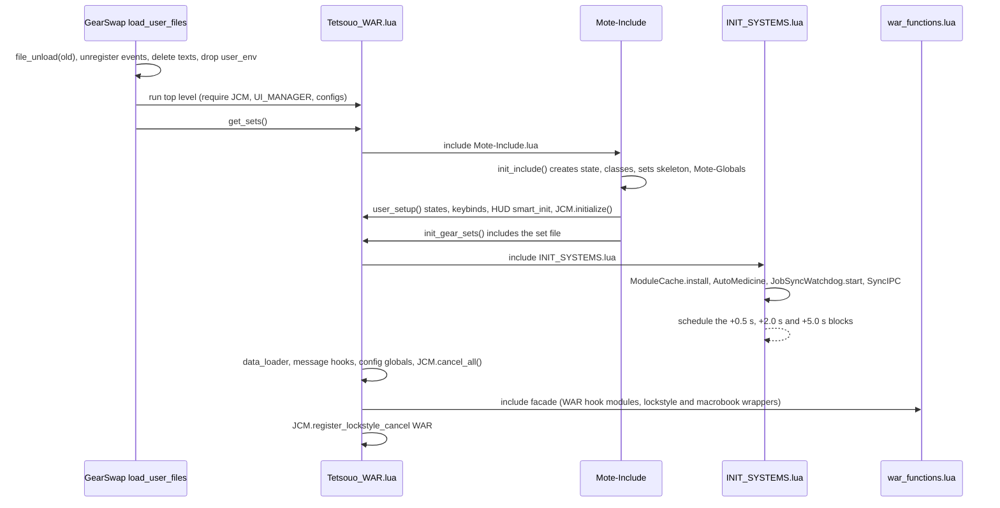
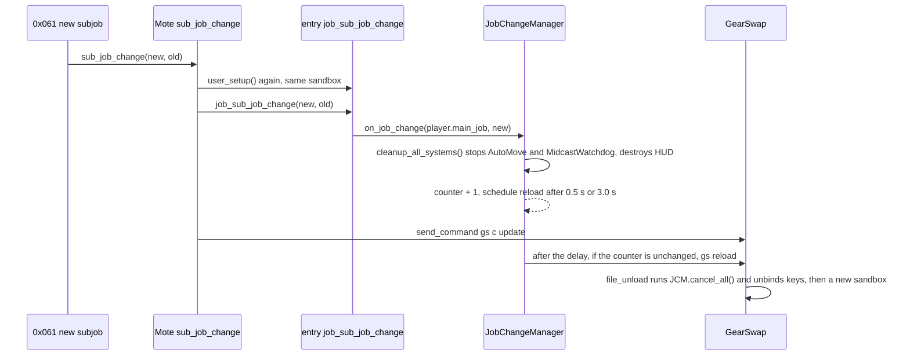
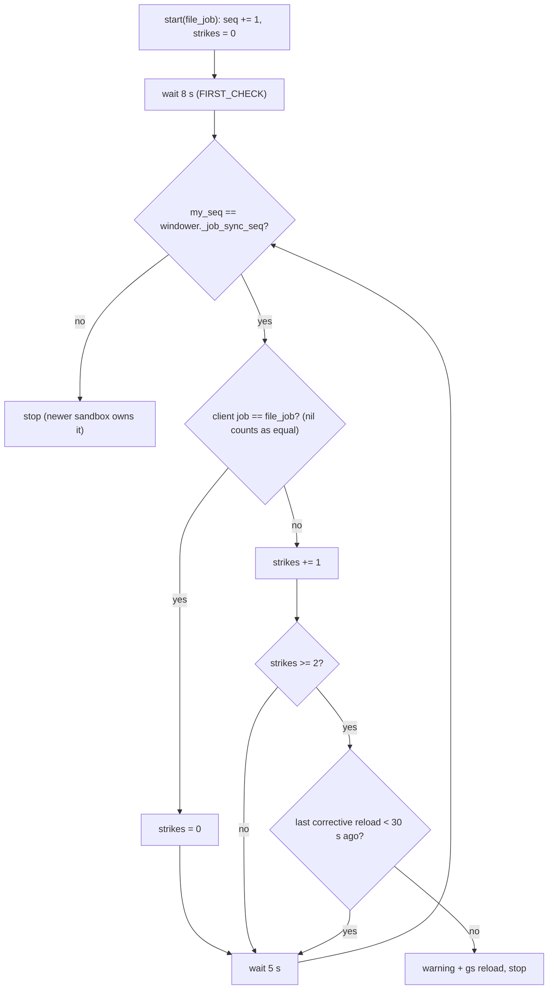

# Core bootstrap and lifecycle

This page covers how a job file comes up inside GearSwap, what `INIT_SYSTEMS.lua` starts and in which order, and the modules that keep a job environment consistent across job changes, subjob changes and reloads: `JobChangeManager` (debounced reload on subjob change), `JobSyncWatchdog` (reload when the loaded file no longer matches the client's job), `MidcastWatchdog` (recovery from a lost aftercast), `ModuleCache` (makes `require` cache), `LifecycleManager` (the shared `job_status_change` / `job_buff_change` / `job_aftercast` / `job_state_change` builders), and the two small command helpers `CycleHandler` and `WatchdogCommands`.

Everything here runs inside the GearSwap sandbox. The single most important fact for maintaining this area is that GearSwap throws the whole sandbox away and builds a new one on every main job change, every `gs reload` and every zone-in on a different job, while Windower coroutines scheduled by the old sandbox keep running. Most of the design (and most of the defects listed at the end) follow from that.

## Files

| Path | Lines | Role |
|---|---|---|
| `shared/utils/core/INIT_SYSTEMS.lua` | 272 | Included by every entry point's `get_sets()`. Installs the module cache, starts the universal systems (some synchronously, some on 0.5 s / 2 s / 5 s timers) |
| `shared/utils/core/job_change_manager.lua` | 226 | Debounced `gs reload` on subjob change, cleanup before it, lockstyle-cancel registry |
| `shared/utils/core/job_sync_watchdog.lua` | 165 | Compares the job the file was loaded for with the client's job every 5 s, forces `gs reload` after two mismatches |
| `shared/utils/core/midcast_watchdog.lua` | 474 | Tracks the spell/item in midcast; if no aftercast arrives within cast time + buffer, sends `gs c update` |
| `shared/utils/core/module_cache.lua` | 106 | Replaces the sandbox `require` with a caching wrapper, once per sandbox |
| `shared/utils/core/lifecycle_manager.lua` | 108 | Factory for the four Mote hooks every job used to copy |
| `shared/utils/core/state_display_override.lua` | 49 | Replaces Mote's `display_current_state` (see Known issues: it does not do what its header says) |
| `shared/utils/core/WATCHDOG_COMMANDS.lua` | 107 | `//gs c watchdog ...` handler, called from each job's `_COMMANDS.lua` |
| `shared/utils/core/CYCLE_HANDLER.lua` | 130 | `//gs c cyclestate <State> [reverse]`: Mote's cycle without the chat line when the keybind HUD is visible, Mote `cycle` otherwise |

Engine files referenced (outside the repo, read-only): `addons/GearSwap/refresh.lua`, `user_functions.lua`, `packet_parsing.lua`, `gearswap.lua`, `flow.lua`, `libs/Mote-Include.lua`, `libs/Mote-SelfCommands.lua`, `libs/Modes.lua`.

## The GearSwap environment model

What GearSwap does every time it loads a job file (`load_user_files`, `refresh.lua:62-181`):

1. Calls the current file's `file_unload` through `user_pcall2` (`refresh.lua:66`). Errors are printed, not raised (`flow.lua:339-348`).
2. Unregisters every event registered through the sandbox `windower.register_event` / `raw_register_event` (`refresh.lua:69-71`; the registry is filled by `register_event_user`, `user_functions.lua:254-274`).
3. Deletes every text and prim object created since the addon loaded (`refresh.lua:73-79`; GearSwap wraps `windower.text.create` to track them, `gearswap.lua:38-60`).
4. Drops the sandbox: `user_env = nil` (`refresh.lua:83`).
5. Forces `player.main_job_id` to the requested job (`refresh.lua:91-94`), searches the file (`Tetsouo_WAR.lua`, then fallbacks down to `default.lua`, `refresh.lua:97-110`). If nothing is found it returns here: no file, no sandbox.
6. Builds a brand-new `user_env` (`refresh.lua:114-149`). Notable entries: `require = include_user` (`:132`), `windower = user_windower` (`:118`), `gearswap = <GearSwap's own _G>`, `_G = user_env` (`:149`). `player`, `buffactive`, `world`, `pet`, `party` are GearSwap's live tables, shared by every sandbox.
7. Runs the file's top level, then `get_sets()` (`refresh.lua:165-180`).

Consequences that the rest of this page relies on:

- `_G` inside project code is the sandbox. Everything written to `_G.*` or to module-local variables dies with it.
- `windower` inside project code is GearSwap's `user_windower` proxy (`user_functions.lua:418-423`): a plain table with `__index = windower` and no `__newindex`. `windower._foo = x` therefore stores `_foo` in that proxy table, which GearSwap creates once when the addon loads. It survives every sandbox rebuild and dies only with `//lua reload gearswap` / `//lua unload gearswap`.
- Coroutines scheduled with `coroutine.schedule` are not tracked by GearSwap. A callback scheduled by an old sandbox still runs after the rebuild, with the old sandbox as its environment (it keeps that sandbox reachable in memory while pending).
- `include_user` binds every file it loads to whatever `user_env` is current at call time (`setfenv(f,user_env)`, `user_functions.lua:327`), not to the caller's sandbox. A `require` issued by a callback of a dead sandbox loads the module into the live one.
- Keybinds (`send_command('bind ...')`) are not tracked: each entry's `file_unload` unbinds them.

When is `load_user_files` called:

| Trigger | Path |
|---|---|
| Main job change request (outgoing 0x100) | `packet_parsing.lua:733-751`: sets `player.main_job_id` from the request and sends `lua i gearswap load_user_files <id>`. The server's answer (0x061, `packet_parsing.lua:376-381`) corrects `main_job_id` but never reloads the file |
| Zone-in on a different job (0x00A) | `packet_parsing.lua:32-41` |
| `//gs reload` / `//gs r` | `gearswap.lua:209-210` -> `refresh_user_env()` (`refresh.lua:657-666`), which reads the job from `windower.ffxi.get_player()` |
| `//gs load <file>` | `gearswap.lua:189-206` |
| Addon load / login | `gearswap.lua:136-144`, `:331-335` |

A subjob change does not reload anything: 0x061 with a new subjob id fires the `sub_job_change` user event in the current sandbox (`packet_parsing.lua:421-428`). Mote turns that into `user_setup()` then `job_sub_job_change()` then `send_command('gs c update')` (`Mote-Include.lua:981-990`). The project then asks for a reload itself through `JobChangeManager`.

## How a job file boots

Example: `_master/entry/Tetsouo_WAR.lua`. The other templates, the Kaories overlay and the live files follow the same shape: every one includes INIT_SYSTEMS one to three lines after Mote-Include, with only `Profiler.mark` calls in between (COR included: `_master/entry/Tetsouo_COR.lua:147` Mote, `:149` INIT_SYSTEMS, `:199` facade). What differs is the work done before Mote-Include (WAR `WARWSConfig`; BRD, BST, PUP config globals; COR event and RollTracker cleanup) and between INIT_SYSTEMS and the facade.

Step by step, with the WAR template:

| # | Where | What |
|---|---|---|
| 1 | `Tetsouo_WAR.lua:34-58` | File top level: `LOCKSTYLE_CONFIG`, `REGION_CONFIG`, `job_change_manager`, `UI_MANAGER`, `config_loader`. These `require`s run before the module cache exists, so each one executes its file. |
| 2 | `Tetsouo_WAR.lua:79` | `_G.WARWSConfig` set before Mote, because `user_setup()` needs it. |
| 3 | `Tetsouo_WAR.lua:81-82` | `include('Mote-Include.lua')`. Mote runs `init_include()` at the end of its own load (`Mote-Include.lua:188`): creates `state`, `classes`, `sets.*` skeletons, includes Mote-Utility / Mote-SelfCommands / Mote-Globals, calls `job_setup()` then `user_setup()` (`:165-172`) then `init_gear_sets()` (`:175`). So `user_setup()` runs in the middle of this line, before INIT_SYSTEMS and before the job facade. |
| 4 | `Tetsouo_WAR.lua:209-255` | `user_setup()`: `WARStates.configure()`, keybinds `bind_all()`, `KeybindUI.smart_init`, `JobChangeManager.initialize()` (seeds the reference job), the "initial macrobook/lockstyle" block, `require` of `dualbox_manager`. The block's gate passes on this first call only because `bind_all()` calls `show_intro()`, which `require`s `WAR_MACROBOOK`/`WAR_LOCKSTYLE`, and those bodies define the two globals (`_master/config/war/WAR_KEYBINDS.lua:111-112`, `:148-158`). SMN's intro requires its two wrappers for the same purpose (`_master/Tetsouo/config/smn/SMN_KEYBINDS.lua:84-86`, same in the live copy). RUN's intro does not: RUN runs the block 0.2 s later, once `get_sets()` has finished (`_master/entry/Tetsouo_RUN.lua:188-198`); BRD, BST and PUP also retry it after 0.2 s. |
| 5 | `Mote-Include.lua:193-201` | Mote defines a default `file_unload` only if the entry file has not defined one. Every entry defines its own, so Mote's default (and its `global_on_unload`) never runs. |
| 6 | `Tetsouo_WAR.lua:85` | `include('../shared/utils/core/INIT_SYSTEMS.lua')`, detailed below. |
| 7 | `Tetsouo_WAR.lua:91-121` | `data_loader`, the three `init_*_messages` hook files, config globals. |
| 8 | `Tetsouo_WAR.lua:124-126` | `JobChangeManager.cancel_all()`. In a fresh sandbox this only bumps a brand-new counter and walks an empty registry (see Known issues). |
| 9 | `Tetsouo_WAR.lua:129` | Facade `war_functions.lua`: includes every `WAR_*.lua` hook module, defines `select_default_lockstyle` / `cancel_war_lockstyle_operations` (lazy `LockstyleManager.create`), requires `dualbox_manager`. |
| 10 | `Tetsouo_WAR.lua:133-135` | `register_lockstyle_cancel("WAR", cancel_war_lockstyle_operations)`. |

`INIT_SYSTEMS.lua` itself, in execution order:

| Line | When | What | State touched |
|---|---|---|---|
| 32-35 | sync | Restore `_G.UPDATE_DEBUG` and `_G.AUTOMOVE_DEBUG` from `windower._gs_debug.UPDATE` | reads `windower._gs_debug` |
| 38 | sync | `windower._gs_reload_count += 1` (counts INIT runs, i.e. sandboxes that got this far) | `windower._gs_reload_count` |
| 47-52 | sync | `ModuleCache.install()` | replaces `_G.require` |
| 60-69 | sync | Load `LagDebugger` if absent, `on_reload_complete(job, sub, windower._automove_seq)` | `_G.LagDebugger` |
| 94-105 | +2.0 s | `require midcast_watchdog`, `_G.MidcastWatchdog = ...`, `start()` | `_G.MidcastWatchdog`, `_G.MIDCAST_WATCHDOG_TIMER`, `windower._midcast_wd_seq` |
| 120-125 | sync | `AutoMedicine.ensure()` (creates `state.AutoMedicine` if the job's states config did not) | `state.AutoMedicine` |
| 134-139 | sync | `JobSyncWatchdog.start(player.main_job)` | `windower._job_sync_seq` |
| 154-172 | sync | DualBox sync IPC: hooks `ls`, `lockstyle`, `rf`, `refill`, then `init_listener()` | see dualbox page |
| 181-234 | +0.5 s | `WarpInit.init()`; AutoMove `include` + `start()` unless `_G.DISABLE_AUTOMOVE == true`; `StateDisplayOverride.init()` | `_G.AutoMove`, `_G.display_current_state` |
| 267-272 | +5.0 s | `GlobalProbe.snapshot()` (baseline for `//gs c syscheck` leak report) | `_G.__global_baseline` |

A module that fails to load is reported through `MessageInit.show_module_load_failed` (`shared/utils/messages/formatters/system/message_init.lua:23`), loaded lazily by `ensure_message_init()` (`INIT_SYSTEMS.lua:78-86`). If `message_init` itself fails to load, `ensure_message_init()` returns nil and the calling line raises.

The header of `INIT_SYSTEMS.lua` (lines 7-19) is out of date: it says the watchdog loads immediately with a 3.5 s timeout and lists four systems. The code defers the watchdog by 2 s, uses a per-spell timeout, and starts ten things.

## Job and subjob changes

### Subjob change (the path JobChangeManager owns)

`JobChangeManager.on_job_change(main_job, sub_job)` (`job_change_manager.lua:118-183`):

1. Returns if either argument is nil (`:119-121`).
2. `cleanup_all_systems()` (`:55-91`) immediately, before any delay: `AutoMove.stop()`, `_G.MidcastWatchdog.stop()`, `KeybindUI.destroy()`, clears `_G.keybind_ui_display`, `_G.keybind_ui_visible`, resets `_G.ui_manager_state` job fields and bumps `smart_init_id` so a pending UI init aborts, `LagDebugger.on_cleanup()`.
3. Stores `target_main_job` / `target_sub_job` (only read by debug displays).
4. `debounce_counter += 1`, captures `my_counter` (`:141-142`).
5. Delay: 0.5 s when `STATE.current_main_job == main_job`, else 3.0 s (`:149-152`). `current_main_job` is the job seeded when this sandbox ran `user_setup()` the first time.
6. Schedules the reload (`:158-182`). When it fires it aborts if `my_counter ~= debounce_counter`; otherwise it records the new current jobs and sends `gs reload` (`:179`).

Every subjob change inside the debounce window bumps the counter, so only the last one reloads. A round trip (SAM/WAR -> SAM/DNC -> SAM/WAR) still reloads once after 0.5 s: the comment at `:144-148` states this is intended because cleanup has already torn the UI and AutoMove down. (This resolves 2026-09-18 audit P2-3; commit `5223943` keys the delay on the main job only.)

When the 3.0 s branch is reached: only when `player.main_job` at the subjob event differs from the job seeded in this sandbox. A normal main job change never reaches `on_job_change` (GearSwap reloads on the 0x100 request itself), so in practice this branch is taken in a sandbox whose file does not match the client's job (the situation `JobSyncWatchdog` also corrects).

`initialize()` is a seed, not an assignment (`:104-114`). Mote calls `user_setup()` (which calls `initialize()`) before `job_sub_job_change()` in the same sandbox (`Mote-Include.lua:981-988`); overwriting would make `current_sub_job` already equal to the new subjob. Its `config` argument is ignored.

How a pending reload is cancelled: the old sandbox's `file_unload` calls `cancel_all()` (every entry, e.g. `Tetsouo_WAR.lua:274-284`), which bumps the counter of the old `STATE` (`:44-51`) and calls each registered lockstyle cancel function (`:211-220`). Clearing `debounce_timer` alone would not stop the queued callback; the comment at `:45-48` records this.

### Main job change

GearSwap reloads on the outgoing request (0x100), so `JobChangeManager` is not involved. The old sandbox gets `file_unload` (JCM `cancel_all`, keybind unbind). AutoMove's and JobSyncWatchdog's old loops die at their next tick because the new sandbox bumps `windower._automove_seq` / `windower._job_sync_seq`; the old `MidcastWatchdog` loop keeps scanning until the new sandbox's `start()`, 2 s into the load, bumps `windower._midcast_wd_seq`, and ends at its next tick.

### Refused or reordered job change: JobSyncWatchdog

Because the file is chosen from the request, a request the server refuses leaves the previous job's file loaded while the client runs another job. `JobSyncWatchdog.start(file_job)` (`job_sync_watchdog.lua:122-157`) is called from INIT with `player.main_job`, which at that moment is the job the file was loaded for (`refresh.lua:91-94`).

- The client job comes from `windower.ffxi.get_player().main_job` (`:65-74`), independent of GearSwap's `player` table.
- `windower._job_sync_last_reload` (`:94-101`) keeps a 30 s floor between corrective reloads across sandboxes. It stays nil until the first correction because `os.clock()` counts from process start (`:53-56`).
- The earliest correction is 13 s after the bad load (8 s + one 5 s confirmation).
- Its debug traces use `JOBCHANGE_DEBUG`, now backed by
  `windower._gs_debug.JOBCHANGE` and restored by `INIT_SYSTEMS.lua:31-38`, so it
  survives the job change it is there to trace.

### Zone change

Zoning on the same job does not rebuild the sandbox, and none of the modules on this page react to it. Zoning in on a different job goes through `load_user_files` like a main job change (`packet_parsing.lua:38-41`).

## MidcastWatchdog

Purpose: when the aftercast packet is lost, GearSwap stays in midcast gear. The watchdog notices and sends `gs c update`.

- Jobs call `_G.MidcastWatchdog.on_midcast_start(spell)` from `job_post_midcast` (BLM, BRD, BST, COR, DNC, DRK, GEO, PLD, PUP, RDM, RUN, SAM, SMN, THF, WHM; not WAR) and `on_aftercast()` from `job_aftercast`, directly or through `LifecycleManager.aftercast` (PLD, PUP, RDM, RUN, SAM, WHM). WAR calls neither, so WAR's subjob spells are not watched.
- Only spell types in `MONITORED_SPELL_TYPES` (`midcast_watchdog.lua:142-151`: WhiteMagic, BlackMagic, BlueMagic, Ninjutsu, SummonerPact, BardSong, Geomancy, Trust) and `spell.type == 'Item'` are tracked; abilities, weaponskills, waltzes etc. return early (`:166-180`).
- Timeout (`calculate_timeout`, `:70-100`): items use `res.items[id].cast_delay` (or `cast_time`) + buffer with no Fast Cast; spells use `res.spells[id].cast_time * (1 - FC/100) + buffer`, where FC is `state.FastCast.value` capped at 80 (`:56-66`). Unknown id: `WATCHDOG_FALLBACK_TIMEOUT` (5.0 s). Buffer `WATCHDOG_BUFFER` 1.5 s.
- Loop: `start()` (`:442-463`) bumps the generation counter `windower._midcast_wd_seq` (`:431`, `:443-444`), sets `_G.MIDCAST_WATCHDOG_TIMER = true` and schedules a self-rescheduling callback every 0.5 s. A tick whose captured generation is no longer the current one returns without rescheduling (`:448-450`), so every `start()` or `stop()` ends the loops started before it and only the newest keeps running, whichever sandbox or module instance started it. Each tick runs `check_stuck()` under `pcall` (`:434-439`). If `age > timeout`: message, clear, leave test mode, `send_command('gs c update')` (`:247-263`).
- `stop()` (`:464-470`) clears the flag and the tracked cast. It is called only from `JobChangeManager.cleanup_all_systems()`.
- Test mode: `simulate_stuck()` (`:391-421`) fakes an active cast and sets `test_mode_active`, which makes `on_aftercast()` a no-op until `check_stuck()` fires.

Timeouts are only as good as `state.FastCast`. It is a user setting (`BLM_STATES.lua:249-254` defaults to 80, BST/COR/DNC to 0). With 80 configured and 50 % real Fast Cast, Teleport-Holla (cast time 20) gets 20 x 0.2 + 1.5 = 5.5 s against a real 10 s cast, and the watchdog would send `gs c update` mid-cast. Nothing stops that update from swapping gear during the cast: GearSwap's `equip_sets()` has no midaction check (`flow.lua:113-172`) and no project code calls `midaction()`, so idle/engaged gear goes on before the spell lands.

With Mote's `state.EquipStop` set to `midcast`, `filter_aftercast` cancels the aftercast (`Mote-Include.lua:362-368`), `job_aftercast` never runs, and the watchdog re-equips gear after the timeout.

## ModuleCache

Inside the sandbox `require` is `include_user` (`refresh.lua:132`). It returns `package.loaded[str]` when that is a table (Windower's own libs) and otherwise loads and executes the file every time (`user_functions.lua:300-327`); it never writes `package.loaded`.

`ModuleCache.install()` (`module_cache.lua:44-88`), called once per sandbox from `INIT_SYSTEMS.lua:47-52`:

- Guard: `rawget(_G, '__require_cache_installed')`, so a second call in the same sandbox returns false.
- Wraps the original `require`. Calls with a second argument (include-into-table form) or a non-string path pass straight through (`:64-66`).
- Key: `path:lower()`, matching `include_user`'s own lowercasing (`user_functions.lua:305`). A module that returns nil is stored as the `CACHED_NIL` sentinel so it is not re-run (`:40`, `:83`). A load that raises is not cached.
- Counters in `_G.__require_cache_stats`; the table itself is `_G.__require_cache`.

Lifetime: the cache lives on the sandbox `_G` and dies with it. The header (`:18-25`) gives the reason: a module is bound to the `user_env` it was loaded in, so a cache that outlived the sandbox would hand the next job modules bound to the old `player`/`sets`/`state`.

`include()` is not cached: set files and `automove.lua` are meant to re-execute.

`package.loaded` never holds a project module. Comments elsewhere that describe it being cleared on reload, or persisting across a job change, describe a mechanism that does not exist: `lockstyle_manager.lua:252-253`, `macrobook_manager.lua:24-25`, `craft_manager.lua:46-48`, `lag_debugger.lua:28`, `warp_init.lua:22`, `dualbox_sync_ipc.lua:36`, `dualbox_manager.lua:437`. What those modules actually get is one instance per sandbox from `_G.__require_cache` (plus a pre-cache instance if they were required before INIT_SYSTEMS), and a new sandbox on every main job change.

Gotcha: everything required before `INIT_SYSTEMS.lua:47` (entry top level, anything `user_setup()` requires, set files) is loaded uncached, and the first `require` after installation loads it again. For those modules there are two instances in the same sandbox. Module state that must be shared between them has to live on `_G` or `windower.*`. `JobChangeManager` does exactly that (`_G.JobChangeManagerSTATE`, `job_change_manager.lua:21-40`): the entry keeps the pre-cache instance as an upvalue while `COMMON_COMMANDS.handle_reload` gets the cached one.

## LifecycleManager

Four builders, each returning a handler; the caller assigns the Mote global (`job_status_change = LifecycleManager.status_change()` etc.). Each takes an optional `extra(...)` callback with the same arguments as the handler.

| Builder | Shared behaviour | `extra` | Used by |
|---|---|---|---|
| `status_change(extra)` (`:38-45`) | `DoomManager.handle_status_change(new, old)` (unlocks Doom slots after death) | always run after | BLM BRD BST COR DNC GEO PLD PUP RDM RUN SAM THF WHM |
| `buff_change(extra)` (`:50-59`) | `DoomManager.handle_buff_change(buff, gain)`; if it returns true the chain stops | skipped when Doom handled it | BLM BRD BST COR DNC PLD PUP RDM RUN SAM WHM (COR passes `retire_lost_roll`) |
| `aftercast(extra)` (`:68-77`) | `_G.MidcastWatchdog.on_aftercast()` if the watchdog is loaded. No `gs c update` (removed 2026-06, comment `:63-65`) | always run after | PLD PUP RDM RUN SAM WHM |
| `state_change(extra)` (`:85-100`) | Returns immediately for `stateField == 'Moving'`; otherwise `KeybindUI.update()` | run after the UI update | BRD BST DNC DRK GEO PLD PUP RUN SAM (PLD passes `on_state_change`) |

`DoomManager` is required on first use, not at file load (`:28-33`), without `pcall`.

## CycleHandler and state display

`//gs c cyclestate <State> [reverse]` is routed by every job's `_COMMANDS.lua` (16 files) to `CycleHandler.handle_cyclestate(cmdParams, eventArgs)` (`CYCLE_HANDLER.lua:90-124`):

- Fewer than two words: error message, handled.
- State name must match `^[%w_]+$` (`:99`).
- A third word `reverse`, `backwards` or `r` (any case) cycles backwards, the words Mote's `handle_cycle` accepts (`:27`, `:104`).
- HUD hidden (`KeybindUI.is_visible()` false): `windower.send_command('gs c cycle <State>[ reverse]')` so Mote's `handle_cycle` does the work and prints its chat line (`delegate_to_mote`, `:69-75`).
- HUD visible: the state is found with Mote's `get_state` (case-insensitive, mode states only; exact key if `get_state` is missing, `find_state` `:36-42`), then `cycle_silently` (`:48-63`) does what `handle_cycle` does minus the chat line: capture the old value, `cycle()`/`cycleback()`, `job_state_change(description or name, new, old)`, `handle_update({'auto'})` (`reset_buff_states`, `job_update`, `handle_equipping_gear`). Then `KeybindUI.update()` (`:120-122`); every `job_update` repaints too, and the HUD diff skips the second paint.

Both paths now pass the same arguments to `job_state_change` and both run `job_update`. The only differences left are deliberate:

| | HUD visible (CycleHandler) | HUD hidden (Mote `handle_cycle`, `Mote-SelfCommands.lua:140-169`) |
|---|---|---|
| `stateField` passed to `job_state_change` | description (`Hybrid Mode`), key when the state has none | same |
| `oldValue` | real previous value | same |
| `reset_buff_states()`, `job_update()`, gear refresh | via `handle_update({'auto'})` | via `handle_update({'auto'})` (`:163`, `:238-258`) |
| chat line | none (the HUD shows the new value) | `add_to_chat(122, ...)` (`:162`) |
| extra HUD repaint | `KeybindUI.update()` | none |

Job handlers still strip spaces from `stateField` (`PLD_COMMANDS.lua:229`, `WAR_COMMANDS.lua:279`...), so a caller passing the key also works. Nothing calls `update_combat_form()` any more: Mote never called it, and `handle_update` already refreshes the gear. BRD's copy, the last one, was removed in commit `951fb12`.

`StateDisplayOverride.init()` (`state_display_override.lua:29-43`), run from the 0.5 s INIT block, replaces the global `display_current_state` with a function taking `(new_value, state_name, old_value)` that stays silent when `_G.ui_display_config.enabled` and otherwise prints `MessageFormatter.show_state_display(...)`. Mote never calls `display_current_state` on a state change: its cycle/set/toggle handlers print directly (`Mote-SelfCommands.lua:70, 104, 162, 198, 226`), and the only caller is `handle_update` when the first argument is `user` (`:255-256`), with no arguments.

## Public API

### JobChangeManager (`shared/utils/core/job_change_manager.lua`, returned table; no `_G` export)

| Function | Params | Returns | Side effects | Callers |
|---|---|---|---|---|
| `initialize(config)` | `config` ignored | nil | Seeds `STATE.current_main_job/sub_job` from `player` if nil | every entry `user_setup` (BST/PUP with a table, possibly from a 0.2 s retry); `job_sub_job_change` of BLM DRK GEO PLD RUN SAM WAR WHM and live SMN |
| `on_job_change(main_job, sub_job)` | short job names | nil | Cleanup now, debounced `gs reload` | every entry `job_sub_job_change` |
| `force_reload(main_job?, sub_job?)` | defaults to `player` | nil | Bumps counter, sends `gs reload` immediately; error message if no job data | `COMMON_COMMANDS.handle_reload` (`COMMON_COMMANDS.lua:26-37`) |
| `cancel_all()` | | nil | Bumps counter, calls every registered lockstyle cancel under `pcall` | every entry `get_sets` and `file_unload` |
| `register_lockstyle_cancel(job, fn)` | job code, function | nil | Stores in `STATE.lockstyle_cancel_registry` | every entry `get_sets` after the facade |

### JobSyncWatchdog (`_G.JobSyncWatchdog`, returned)

| Function | Params | Side effects | Callers |
|---|---|---|---|
| `start(file_job)` | short job name; ignored if not a non-empty string or `NONE` | Bumps `windower._job_sync_seq`, schedules the check loop | `INIT_SYSTEMS.lua:136` |

### MidcastWatchdog (returned; `_G.MidcastWatchdog` set by INIT)

| Function | Notes | Callers |
|---|---|---|
| `on_midcast_start(spell)` | Records spell/item and its timeout; no-op when disabled | 15 job `_MIDCAST.lua` files |
| `on_aftercast()` | Clears tracking unless disabled or in test mode | job `_AFTERCAST.lua`, `LifecycleManager.aftercast` |
| `check_stuck()` | One scan; sends `gs c update` when overdue | internal loop |
| `start()` / `stop()` | Both bump `windower._midcast_wd_seq`, which ends every older loop; `start()` then runs a new one. `stop()` also clears the tracked midcast when `_G.MIDCAST_WATCHDOG_TIMER` is set | `INIT_SYSTEMS.lua:100` / `job_change_manager.lua:63` |
| `enable()`, `disable()`, `toggle()` | Message on change | `WATCHDOG_COMMANDS` |
| `toggle_debug()` (`enable_debug`, `disable_debug`) | Verbose per-scan messages | `WATCHDOG_COMMANDS` |
| `set_buffer(s)` | 0..10, else error message | `WATCHDOG_COMMANDS` |
| `set_fallback_timeout(s)` | (0..30], else error message | `WATCHDOG_COMMANDS` |
| `get_stats()` | Table: active, spell_name, ids, cast times, fast_cast, age, enabled, timeout, buffer, fallback_timeout, debug | `WATCHDOG_COMMANDS`, `system_checker.lua:40-47` |
| `clear_all()` | Clears tracking, sends `gs c update` | `WATCHDOG_COMMANDS` |
| `simulate_stuck(name, id)` | Test mode | `WATCHDOG_COMMANDS` |
| `is_enabled()`, `get_buffer()`, `get_fallback_timeout()`, `is_debug_enabled()` | Getters | none in the repository |

### ModuleCache (`_G.ModuleCache`, returned)

| Function | Returns | Callers |
|---|---|---|
| `install()` | true when installed by this call | `INIT_SYSTEMS.lua:50` |
| `stats()` | `hits, loads, cached_modules` | none (the header says syscheck; `system_checker.lua` does not call it) |

### LifecycleManager (`_G.LifecycleManager`, returned)

`status_change(extra)`, `buff_change(extra)`, `aftercast(extra)`, `state_change(extra)`: see the table above.

### StateDisplayOverride (returned only)

`init()`: assigns `_G.display_current_state`. Caller: `INIT_SYSTEMS.lua:229`.

### WatchdogCommands (returned only)

| Function | Notes |
|---|---|
| `is_watchdog_command(command)` | `command == 'watchdog'` |
| `handle_command(cmdParams, eventArgs)` | Returns false unless `cmdParams[1]:lower() == 'watchdog'`; sets `eventArgs.handled = true` when handled |

Callers: all 16 `shared/jobs/*/functions/*_COMMANDS.lua`, lazily required.

### CycleHandler (returned only)

`handle_cyclestate(cmdParams, eventArgs)`: always returns true. `cmdParams` = `{'cyclestate', State, ['reverse'|'backwards'|'r']}`. Callers: all 16 job `_COMMANDS.lua`.

## Commands

| Command | Handler | Effect |
|---|---|---|
| `//gs c reload` | `COMMON_COMMANDS.lua:485-486` -> `handle_reload` (`:26-37`) -> `JobChangeManager.force_reload` | Immediate `gs reload` (no cleanup, no debounce) |
| `//gs c watchdog` | `WATCHDOG_COMMANDS.lua:61-64` | Status (`show_status(get_stats())`) |
| `//gs c watchdog on` / `off` / `toggle` | `:65-70` | Enable / disable / toggle |
| `//gs c watchdog debug` | `:71-72` | Toggle per-scan debug output |
| `//gs c watchdog buffer <s>` | `:73-77` | `set_buffer` (non-numeric argument is ignored silently) |
| `//gs c watchdog fallback <s>` | `:78-82` | `set_fallback_timeout` |
| `//gs c watchdog clear` | `:83-84` | `clear_all()` |
| `//gs c watchdog test [name] [id]` | `:85-89` | `simulate_stuck(name or 'Teleport-Holla', id or 262)` (262 is Warp II, see Known issues) |
| `//gs c watchdog stats` | `:90-92` | Detailed stats |
| `//gs c watchdog <other>` | `:93-94` | Help |
| `//gs c cyclestate <State> [reverse]` | `CYCLE_HANDLER.lua:90` via each job's `_COMMANDS.lua` | UI-aware cycle (silent with the HUD visible, Mote's chat line otherwise) |
| `//gs c debugjobchange` / `djc` | `COMMON_COMMANDS.lua:595-611` | Toggles `windower._gs_debug.JOBCHANGE` (mirrored to `_G.JOBCHANGE_DEBUG`) and prints `JobChangeManagerSTATE` |
| `//gs c debugstate` / `ds` | `DEBUG_COMMANDS.lua:226-245` | Dumps JCM counter and registry size among others |
| `//gs c debugupdate` | `COMMON_COMMANDS.lua:597-605` | Toggles `windower._gs_debug.UPDATE` (restored by INIT on reload) |

## Configuration

Nothing on this page reads a config file. Tunables are file-level constants:

| Constant | Value | Where |
|---|---|---|
| Subjob / main debounce | 0.5 s / 3.0 s | `job_change_manager.lua:149-152` |
| `CHECK_INTERVAL`, `CONFIRMATIONS`, `RELOAD_COOLDOWN`, `FIRST_CHECK` | 5.0 s, 2, 30.0 s, 8.0 s | `job_sync_watchdog.lua:39-42` |
| `WATCHDOG_BUFFER` | 1.5 s (runtime: `watchdog buffer`) | `midcast_watchdog.lua:20` |
| `WATCHDOG_FALLBACK_TIMEOUT` | 5.0 s (runtime: `watchdog fallback`) | `midcast_watchdog.lua:23` |
| `FAST_CAST_CAP` | 80 | `midcast_watchdog.lua:26` |
| Watchdog scan period | 0.5 s | `midcast_watchdog.lua:455, 460` |
| INIT deferrals | 0.5 s, 2.0 s, 5.0 s | `INIT_SYSTEMS.lua:234, 105, 272` |

Runtime inputs read: `state.FastCast` (per job `[JOB]_STATES.lua`), `_G.DISABLE_AUTOMOVE` (read by INIT; no entry sets it since commit 0563ff9), `_G.ui_display_config.enabled` (StateDisplayOverride), `KeybindUI.is_visible()` (CycleHandler), `windower._gs_debug`.

Runtime changes made with `watchdog buffer/fallback/on/off/debug` live in module locals and are lost at the next sandbox rebuild.

## State and lifetime

### Written to the sandbox `_G` (rebuilt on every reload)

| Global | Writer | Readers |
|---|---|---|
| `JobChangeManagerSTATE` | `job_change_manager.lua:21-38` | JCM, `COMMON_COMMANDS.lua:587-594`, `DEBUG_COMMANDS.lua:231-240`, `system_checker.lua:108` |
| `MidcastWatchdog` | `INIT_SYSTEMS.lua:99` | jobs, `LifecycleManager`, JCM cleanup, `WATCHDOG_COMMANDS`, `system_checker` |
| `MIDCAST_WATCHDOG_TIMER` | `midcast_watchdog.lua:459` (set), `:469` (cleared) | `stop()` only (clears the tracked midcast when set, `:468-471`); `global_probe.lua:55` lists it as expected. It does not control the loop |
| `JobSyncWatchdog`, `LifecycleManager`, `ModuleCache` | module exports | no reader. `LifecycleManager` and `ModuleCache` are in the GlobalProbe expected list (`global_probe.lua:53-56`); `JobSyncWatchdog` is not, but it is created before the 5 s snapshot so it is part of the baseline |
| `require` (replaced), `__require_cache`, `__require_cache_installed`, `__require_cache_stats` | `module_cache.lua:55-60` | every `require` |
| `display_current_state` | `state_display_override.lua:30` | Mote `handle_update` |
| `UPDATE_DEBUG`, `AUTOMOVE_DEBUG`, `WARP_DEBUG`, `PrecastDebugState`, `JOBCHANGE_DEBUG` | `INIT_SYSTEMS.lua:31-38` | Mirrors of `windower._gs_debug.*`, re-seeded on every load; DebugLogger users |
| `keybind_ui_display`, `keybind_ui_visible`, `ui_manager_state.*` | cleared by `job_change_manager.lua:73-87` | UI manager |
| `job_status_change`, `job_buff_change`, `job_aftercast`, `job_state_change` | job modules via `LifecycleManager` builders | Mote |

Read only: `JOBCHANGE_DEBUG` (via `DebugLogger.log_if`), `LagDebugger`, `AutoMove`, `state`, `player`, `get_state`, `handle_update`, `job_state_change` (CycleHandler).

### Written to `windower.*` (survives sandbox rebuilds, dies with the addon)

| Field | Owner | Purpose |
|---|---|---|
| `_gs_reload_count` | `INIT_SYSTEMS.lua:38` | Count of INIT runs; read by `system_checker` (hook-chain ratio), `full_test.lua:155`, `dualbox_manager.lua:473` |
| `_gs_debug` | `COMMON_COMMANDS.lua:600-601` (read by `INIT_SYSTEMS.lua:32`) | Persisted `debugupdate` flag |
| `_job_sync_seq` | `job_sync_watchdog.lua:57, 102, 127` | Invalidates older check loops |
| `_job_sync_last_reload` | `job_sync_watchdog.lua:101` | 30 s floor between corrective reloads |
| `_automove_seq` | read at `INIT_SYSTEMS.lua:68` (owned by AutoMove) | passed to LagDebugger |
| `_midcast_wd_seq` | `midcast_watchdog.lua:431, 443, 467` | MidcastWatchdog loop generation: bumped by every `start()` and `stop()`, only the newest loop keeps running |

### Events, texts, keybinds, coroutines

- No module on this page registers a Windower event, creates a text object or binds a key. INIT_SYSTEMS triggers the DualBox IPC listener (`init_listener`) and AutoMove, which are documented on their own pages. GearSwap unregisters sandbox-registered events and deletes text/prim objects itself on every `load_user_files` (`refresh.lua:69-79`).
- Coroutines scheduled here and how each is invalidated:

| Scheduled by | Callback | Invalidation |
|---|---|---|
| `INIT_SYSTEMS.lua:94` (+2 s), `:181` (+0.5 s), `:267` (+5 s) | watchdog start, warp/automove/state display, probe snapshot | none: they run even if the sandbox was replaced. A stale watchdog start is harmless: the newer load's own start comes later and supersedes it |
| `job_change_manager.lua:158` | `gs reload` | `debounce_counter` mismatch (bumped by the next `on_job_change`, `force_reload`, `cancel_all`) |
| `job_sync_watchdog.lua:151, 154` | check loop | `windower._job_sync_seq` mismatch; ends after sending a reload |
| `midcast_watchdog.lua:455, 460` | scan loop | `windower._midcast_wd_seq` mismatch (bumped by every `start()` and `stop()`) |

### Behaviour per transition

| Transition | Sandbox | JCM | JobSyncWatchdog | MidcastWatchdog | ModuleCache |
|---|---|---|---|---|---|
| Cold load / `//lua reload gearswap` | new (addon state also new) | fresh STATE, seeded in `user_setup` | starts | starts at +2 s | installed |
| `//gs reload`, `//gs c reload`, JSW correction | new | old reload cancelled by `file_unload` | old loop superseded | old loop superseded by the new `start()` at +2 s | new cache |
| Subjob change | same, then new after 0.5 s | cleanup + debounced reload | superseded after reload | stopped by cleanup, restarted at +2 s | new cache |
| Main job change / zone-in on another job | new | not involved | superseded | superseded at +2 s | new cache |
| Main job change to a job with no file | none | not involved | old loop keeps running and forces one reload | old loop keeps running | none |
| Zone on same job, death, raise | same | nothing | nothing | nothing | same |

## Interactions

- Calls: `DebugLogger` (`shared/utils/debug/debug_logger.lua`), `MessageFormatter` / `MessageInit` / `MessageWatchdog` (see [messages.md](messages.md)), `KeybindUI` (`shared/utils/ui/UI_MANAGER.lua`), `AutoMove` (`shared/utils/movement/automove.lua`), `LagDebugger`, `GlobalProbe`, `AutoMedicine`, `DualBoxSyncIPC`, `WarpInit`, `DoomManager`, `resources`.
- Called by: every entry point (`get_sets`, `user_setup`, `job_sub_job_change`, `file_unload`), every job `_MIDCAST.lua` / `_AFTERCAST.lua` / `_STATUS.lua` / `_BUFFS.lua` / `_COMMANDS.lua`, `COMMON_COMMANDS.lua`, `system_checker.lua`, `full_test.lua`.
- Midcast set selection itself is on [midcast-and-buffs.md](midcast-and-buffs.md). Per-job wiring is on the pages under [../jobs/](../jobs/).

## Invariants and gotchas

- `user_setup()` runs inside `include('Mote-Include.lua')`, before INIT_SYSTEMS and the job facade. Anything defined by the facade (`select_default_lockstyle`, `select_default_macro_book`, job hooks) is nil during the first call. Mote calls `user_setup()` again on every subjob change (`Mote-Include.lua:981-984`), when everything exists.
- An error in the first `user_setup()` propagates out of `include('Mote-Include.lua')` and aborts the rest of `get_sets()` (`user_pcall` re-raises, `flow.lua:318-327`), including INIT_SYSTEMS and the facade.
- State that must survive a reload goes on `windower.*`, never `_G`. State that must not survive (anything holding functions or tables bound to a sandbox) goes on `_G`. A loop scheduled with `coroutine.schedule` needs a `windower.*` sequence captured at start; a `_G` flag is invisible to the next sandbox (AutoMove learned this, `automove.lua:25-31`).
- A callback from a dead sandbox that calls `require` loads the module into the live sandbox (`user_functions.lua:327`), with its own module state.
- Modules required before `INIT_SYSTEMS.lua:47` get a second instance after the cache is installed. Keep cross-instance state on `_G`.
- `JobChangeManager.initialize()` must stay a seed (only when nil).
- `cleanup_all_systems()` runs before the debounce, so any `on_job_change()` must be followed by a reload; aborting without one leaves the sandbox without AutoMove, watchdog and HUD.
- `WAR` does not feed the midcast watchdog.
- `CycleHandler` and Mote pass the same `stateField` (the description, the key when there is none) to `job_state_change`. Handlers still strip spaces so that a caller passing the key also works.

## Extending

Adding a universal system to INIT_SYSTEMS:

1. Decide whether it must exist before the first action (synchronous block, like AutoMedicine at `:120-125`) or can wait (inside the 0.5 s block at `:181-234`).
2. Load with `pcall(require, ...)` and report failure with `ensure_message_init().show_module_load_failed(name, err)`.
3. If it schedules a loop, capture a `windower._<name>_seq` at start and compare it on every tick, as `job_sync_watchdog.lua:127-133` does.
4. If it lives in a deferred block, check that the sandbox is still current before doing anything (the existing blocks do not).
5. Add its globals to the expected list in `shared/utils/debug/global_probe.lua` if they appear after the 5 s snapshot.

Adding a job hook through LifecycleManager: `local LifecycleManager = require('shared/utils/core/lifecycle_manager')`, then `job_buff_change = LifecycleManager.buff_change(function(buff, gain, eventArgs) ... end)` and `_G.job_buff_change = job_buff_change`.

Watching a new job's spells: call `_G.MidcastWatchdog.on_midcast_start(spell)` in `job_post_midcast`, as the 15 existing callers do (guarded by `if _G.MidcastWatchdog`) and use `LifecycleManager.aftercast()` or call `on_aftercast()` in `job_aftercast`. Add `state.FastCast` to the job's states config if the job has meaningful Fast Cast.

## Known issues

- `StateDisplayOverride` does not silence cycle messages and turns `//gs c update user` into "State: Unknown" or nothing (`state_display_override.lua:30-42`).
- JobSyncWatchdog keeps running after a change to a job with no file and forces one misleading reload (`job_sync_watchdog.lua:131-152`).
- `JOBCHANGE_DEBUG` is lost on every reload, so JobSyncWatchdog traces cannot be seen where they matter (`COMMON_COMMANDS.lua:584`, `INIT_SYSTEMS.lua:32-35`).
- `JobChangeManager.cancel_all()` in `get_sets()` is a no-op in a fresh sandbox (`_master/entry/Tetsouo_WAR.lua:123-126`).
- `watchdog test` defaults to spell id 262 (Warp II, 5 s) while labelling it Teleport-Holla (id 122, 20 s) (`WATCHDOG_COMMANDS.lua:87-88`).
- `watchdog clear` during a test leaves test mode on; the next real cast is reported stuck (`midcast_watchdog.lua:379-388`).
- Dead code: `ModuleCache.stats()`, `MidcastWatchdog.is_enabled/get_buffer/get_fallback_timeout/is_debug_enabled`.
- Out-of-date descriptions: `INIT_SYSTEMS.lua:7-19`, `job_change_manager.lua:1-2`, `docs/user/features/job-change-manager.md:19`, `docs/user/features/watchdog.md:70-71`.
