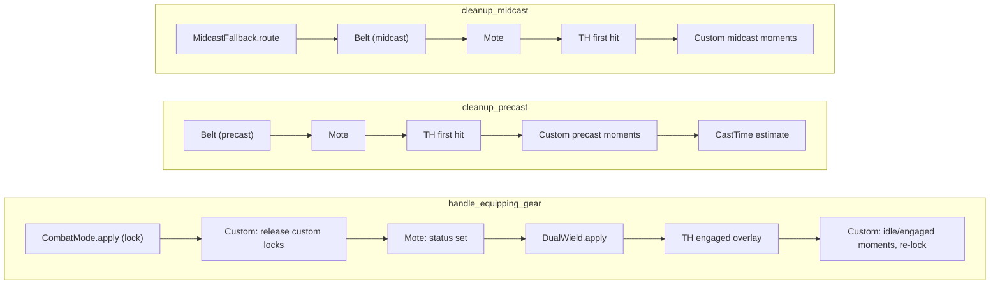
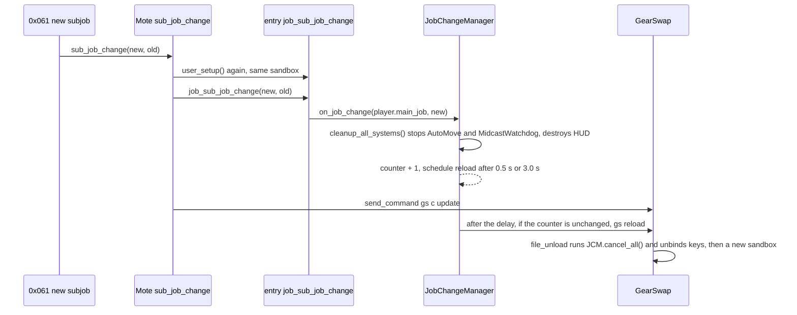
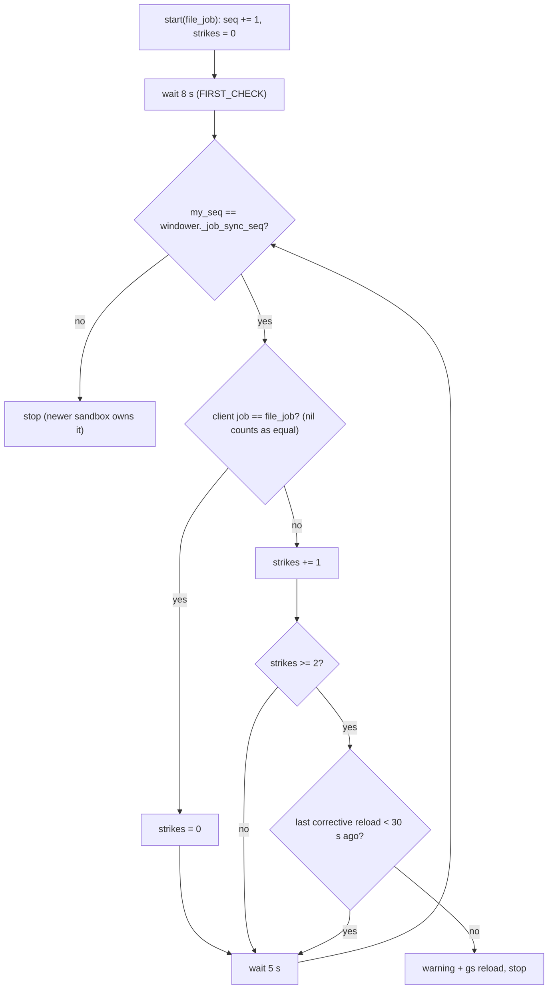

# Core bootstrap and lifecycle

This page covers how a job file comes up inside GearSwap, what `INIT_SYSTEMS.lua` starts and in which order, the wrapper chain it lays on Mote's `handle_equipping_gear` / `cleanup_precast` / `cleanup_midcast`, and the modules of `shared/utils/core/` that keep a job environment consistent across job changes, subjob changes and reloads:

- `JobChangeManager` (debounced reload on subjob change), `JobSyncWatchdog` (reload when the loaded file no longer matches the client's job), `MidcastWatchdog` (recovery from a lost aftercast), `ModuleCache` (makes `require` cache), `KeybindGuard` (re-sends the binds after a load);
- `LifecycleManager` (the shared `job_status_change` / `job_buff_change` / `job_aftercast` / `job_state_change` builders);
- the small helpers `CycleHandler`, `WatchdogCommands`, `StateDisplayOverride`, `CastTracker`, `AutoOptions` and `live_tp`.

The transition-by-transition view (subjob change, main job change, reload during a cast, craft, wardrobe organizer, Doom, dual-box) is on [job-change-lifecycle.md](../architecture/job-change-lifecycle.md). This page is the reference for the modules themselves.

Everything here runs inside the GearSwap sandbox. The single most important fact for maintaining this area is that GearSwap throws the whole sandbox away and builds a new one on every main job change, every `gs reload` and every zone-in on a different job, while Windower coroutines scheduled by the old sandbox keep running. Most of the design (and most of the defects listed at the end) follow from that.

Verified against the code on 2026-09-28. Line numbers of `INIT_SYSTEMS.lua` (a flat script with no functions) are given as of that date; everywhere else the function is named.

## Files

### `shared/utils/core/` (every file of the folder)

| Path | Lines | Role | Documented |
|---|---|---|---|
| `INIT_SYSTEMS.lua` | 412 | Included by every entry point's `get_sets()` right after Mote-Include. Starts the universal systems (some synchronously, some on 0.5 s / 2 s / 3 s / 5 s timers) and lays the gear hook chain | here |
| `job_change_manager.lua` | 235 | Debounced `gs reload` on subjob change, cleanup before it, lockstyle-cancel registry | here |
| `job_sync_watchdog.lua` | 165 | Compares the job the file was loaded for with the client's job every 5 s, forces `gs reload` after two mismatches | here |
| `midcast_watchdog.lua` | 470 | Tracks the spell/item in midcast; if no aftercast arrives within cast time + buffer, sends `gs c update` | here |
| `module_cache.lua` | 96 | Replaces the sandbox `require` with a caching wrapper, once per sandbox | here |
| `lifecycle_manager.lua` | 160 | Factory for the four Mote hooks every job used to copy, plus `refresh_after_buff` (gear rebuild after an Aftermath Lv.3 change) | here |
| `keybind_guard.lua` | 98 | Re-sends the job's binds 2 s after a load | here |
| `state_display_override.lua` | 46 | Replaces Mote's `display_current_state` (silent while the HUD is enabled) | here |
| `cast_tracker.lua` | 58 | Raw `action` listener: did this character start a cast / act since time t | here |
| `auto_options.lua` | 35 | Reads `<Character>/config/AUTO_ABILITIES.lua` (automatic JA options) | here |
| `live_tp.lua` | 30 | TP read from the game instead of GearSwap's stale copy | here (API), [factories-and-helpers.md](factories-and-helpers.md) (users) |
| `gear_hold.lua` | 25 | `GearHold.active()`: true while a COR roll holds the idle / engaged gear (`_G.cor_roll_hold`, written by `cor/functions/logic/roll_hold.lua`); asked by the Dual Wield, Treasure Hunter and custom-gear layers of the hook chain (2026-09-28) | here ([GearHold](#gearhold)), [cor.md](../jobs/cor.md) |
| `WATCHDOG_COMMANDS.lua` | 113 | `//gs c watchdog ...` handler, called from each job's `<JOB>_COMMANDS.lua` | here |
| `CYCLE_HANDLER.lua` | 136 | `//gs c cyclestate <State> [reverse]`: Mote's cycle without the chat line when the keybind HUD is visible | here |
| `combat_mode.lua` | 165 | Weapon lock on every job; its `handle_equipping_gear` wrapper is the outermost of the chain | hook: here; feature: [keybinds-and-custom.md](keybinds-and-custom.md) |
| `combat_mode_commands.lua` | 58 | `//gs c combatmode` | [keybinds-and-custom.md](keybinds-and-custom.md), [commands-and-debug.md](commands-and-debug.md) |
| `optional_state.lua`, `optional_state_commands.lua` | 142, 147 | Base of Combat Mode and Treasure Mode (shown / hidden / key per job) | [keybinds-and-custom.md](keybinds-and-custom.md), [factories-and-helpers.md](factories-and-helpers.md) |
| `COMMON_COMMANDS.lua` | 786 | Every `//gs c` command shared by all jobs | [commands-and-debug.md](commands-and-debug.md) |
| `DEBUG_COMMANDS.lua` | 583 | Debug toggles and dumps (`djc`, `debugupdate`, `debugstate`, `memcheck`...) | [commands-and-debug.md](commands-and-debug.md) |

### Bootstrap files outside `core/`

| Path | Role |
|---|---|
| `shared/utils/config/config_loader.lua` | Required at file level by every entry. Its first statement installs `ModuleCache`; `load_ui_config(char, job)` `dofile`s `<char>/config/UI_CONFIG.lua` and fills `_G.UIConfig` / `_G.ui_display_config` (details in [ui-overlay.md](ui-overlay.md)) |
| `_master/entry/Tetsouo_<JOB>.lua` (16) | Entry templates; see [characters-and-templates.md](../architecture/characters-and-templates.md) |

Engine files referenced (outside the repo, read-only): `addons/GearSwap/refresh.lua`, `user_functions.lua`, `packet_parsing.lua`, `gearswap.lua`, `flow.lua`, `libs/Mote-Include.lua`, `libs/Mote-SelfCommands.lua`, `libs/Modes.lua`.

## The GearSwap environment model

What GearSwap does every time it loads a job file (`load_user_files`, `refresh.lua:62-181`):

1. Calls the current file's `file_unload` through `user_pcall2` (`refresh.lua:66`). Errors are printed, not raised (`flow.lua:339-348`).
2. Unregisters every event registered through the sandbox `windower.register_event` / `raw_register_event` (`refresh.lua:69-71`; both `register_event_user` and `raw_register_event_user` record the id, `user_functions.lua:254-274`).
3. Deletes every text and prim object created since the addon loaded (`refresh.lua:73-79`; GearSwap wraps `windower.text.create` to track them, `gearswap.lua`).
4. Drops the sandbox: `user_env = nil` (`refresh.lua:83`).
5. Forces `player.main_job_id` to the requested job (`refresh.lua:91-94`), searches the file (`<name>_<JOB>.lua`, then fallbacks down to `default.lua`, `refresh.lua:97-110`). If nothing is found it returns here: no file, no sandbox.
6. Builds a brand-new `user_env` (`refresh.lua:114-149`). Notable entries: `require = include_user` (`:132`), `windower = user_windower` (`:118`), `coroutine` = the real Windower library, `gearswap = <GearSwap's own _G>`, `_G = user_env` (`:149`). `player`, `buffactive`, `world`, `pet`, `party` are GearSwap's live tables, shared by every sandbox.
7. Runs the file's top level, then `get_sets()` (`refresh.lua:165-180`).

Consequences that the rest of this page relies on:

- `_G` inside project code is the sandbox. Everything written to `_G.*` or to module-local variables dies with it.
- `windower` inside project code is GearSwap's `user_windower` proxy (`user_functions.lua:418-423`): a plain table with `__index = windower` and no `__newindex`. `windower._foo = x` therefore stores `_foo` in that proxy table, which GearSwap creates once when the addon loads. It survives every sandbox rebuild and dies only with `//lua reload gearswap` / `//lua unload gearswap`.
- Coroutines scheduled with `coroutine.schedule` are not tracked by GearSwap. A callback scheduled by an old sandbox still runs after the rebuild, with the old sandbox as its environment (it keeps that sandbox reachable in memory while pending).
- `include_user` binds every file it loads to whatever `user_env` is current at call time (`setfenv(f,user_env)`, `user_functions.lua:327`), not to the caller's sandbox. A `require` issued by a callback of a dead sandbox loads the module into the live one.
- Keybinds (`send_command('bind ...')`) and slot locks (`disable()`) are not tracked: each entry's `file_unload` unbinds its keys, and slot locks survive until an explicit `enable()`.
- `equip()` outside an event only fills `equip_list`, which the next event empties (`flow.lua:60`). From a coroutine, send `gs c update` instead.

When is `load_user_files` called:

| Trigger | Path |
|---|---|
| Main job change request (outgoing 0x100) | `packet_parsing.lua:733-751`: sets `player.main_job_id` from the request and sends `lua i gearswap load_user_files <id>`. The server's answer (0x061, `packet_parsing.lua:376-381`) corrects `main_job_id` but never reloads the file |
| Zone-in on a different job (0x00A) | `packet_parsing.lua:32-41` |
| `//gs reload` / `//gs r` | `gearswap.lua` -> `refresh_user_env()` (`refresh.lua:657-666`), which reads the job from `windower.ffxi.get_player()` |
| `//gs load <file>` | `gearswap.lua` |
| Addon load / login | `gearswap.lua` `load` / `login` events (login schedules `refresh_user_env` 2 s later) |

A subjob change does not reload anything: 0x061 with a new subjob id fires the `sub_job_change` user event in the current sandbox (`packet_parsing.lua:419-428`). Mote turns that into `user_setup()` then `job_sub_job_change()` then `send_command('gs c update')` (`Mote-Include.lua:981-990`). The project then asks for a reload itself through `JobChangeManager`.

## How a job file boots

Example: `_master/entry/Tetsouo_WAR.lua`. Every template, overlay entry and live file follows the same shape: `config_loader` required at file level, `include('Mote-Include.lua')`, `include('../shared/utils/core/INIT_SYSTEMS.lua')` one to three lines later (only `Profiler.mark` calls in between), then the message hooks, the job configs, `JobChangeManager.cancel_all()`, the job facade and `register_lockstyle_cancel`. What differs is the work done before Mote-Include (WAR `_G.WARWSConfig`; BRD, BST, PUP config globals; COR event and RollTracker cleanup) and between INIT_SYSTEMS and the facade.

```mermaid
sequenceDiagram
    participant GS as GearSwap load_user_files
    participant Entry as Tetsouo_WAR.lua
    participant CL as config_loader
    participant Mote as Mote-Include
    participant Init as INIT_SYSTEMS.lua
    participant Facade as war_functions.lua
    GS->>GS: file_unload(old), unregister events, delete texts, drop user_env
    GS->>Entry: run top level
    Entry->>Entry: LOCKSTYLE_CONFIG, REGION_CONFIG (uncached requires)
    Entry->>CL: require config_loader
    CL->>CL: ModuleCache.install() (require now caches), load_ui_config
    Entry->>Entry: require job_change_manager, UI_MANAGER (cached)
    GS->>Entry: get_sets()
    Entry->>Mote: include Mote-Include.lua
    Mote->>Mote: init_include(): state, classes, sets skeleton, Mote-Globals
    Mote->>Entry: job_setup(), user_setup(): states, bind_all, HUD smart_init, JCM.initialize(), macrobook/lockstyle, dualbox_manager
    Mote->>Entry: init_gear_sets(): set file
    Mote->>Mote: define handle_equipping_gear, cleanup_*, default file_unload if absent
    Entry->>Init: include INIT_SYSTEMS.lua
    Init->>Init: sync systems + hook chain; schedule +0.5/+2/+3/+5 s blocks
    Entry->>Entry: data_loader, message hooks, config globals, JCM.cancel_all()
    Entry->>Facade: include facade (hook modules, lockstyle/macrobook wrappers)
    Entry->>Entry: JCM.register_lockstyle_cancel('WAR', ...)
```

Step by step, with the WAR template (`_master/entry/Tetsouo_WAR.lua`, 313 lines):

| # | Where | What |
|---|---|---|
| 1 | file level, `:35-48` | `LOCKSTYLE_CONFIG` (fallback table if missing) and `REGION_CONFIG` -> `_G.RegionConfig`. These two `require`s run before the module cache exists, so they execute their file and are not cached. |
| 2 | file level, `:54-55` | `config_loader`: its first statement is `ModuleCache.install()`, so every later `require` of this load is cached, including those made from `user_setup()`. Then `load_ui_config('Tetsouo', 'WAR')`. |
| 3 | file level, `:59-60` | `job_change_manager`, `UI_MANAGER` (after `config_loader` on purpose: cached, and `UI_MANAGER` reads `_G.UIConfig` at load). Most other templates require them inside `get_sets()`/`user_setup()` instead, also after the cache exists. |
| 4 | `get_sets`, `:80` | `_G.WARWSConfig` set before Mote, because `user_setup()` needs it. |
| 5 | `get_sets`, `:83` | `include('Mote-Include.lua')`. Mote runs `init_include()` at the end of its own load (`Mote-Include.lua:188`): creates `state`, `classes`, `sets.*` skeletons, includes Mote-Utility / Mote-SelfCommands / Mote-Globals, calls `job_setup()` then `user_setup()` (`:165-172`) then `init_gear_sets()` (`:175`). So `user_setup()` runs in the middle of this line, before INIT_SYSTEMS and before the job facade. After `init_include()` returns, the rest of Mote-Include defines `handle_equipping_gear`, `cleanup_precast`, `cleanup_midcast` and the other default handlers, which is why no hook on them can be laid from `user_setup()`. |
| 6 | `user_setup`, `:201-255` | `WARStates.configure()`, the Ampulla lock re-applied to the default stance, keybinds `bind_all()`, `KeybindUI.smart_init`, `JobChangeManager.initialize()` (seeds the reference job), the "initial macrobook/lockstyle" block, `pcall(require, 'shared/utils/dualbox/dualbox_manager')`. The macrobook/lockstyle gate passes on this first call only because `bind_all()` calls `show_intro()` when it bound at least one key, and `KeybindManager`'s `show_intro` `require`s the job's `<JOB>_MACROBOOK` / `<JOB>_LOCKSTYLE` wrappers, whose bodies define the two globals. BRD, BST, PUP and RUN re-test the gate in a 0.2 s coroutine (RUN also defers its keybinds by 0.5 s). |
| 7 | `init_gear_sets`, `:146-149` | `include('sets/war_sets.lua')`, then `sync_weapon_with_hand()` (WAR aligns `state.MainWeapon` with the weapon in hand now that the sets exist). |
| 8 | Mote-Include `:193-201` | Mote defines a default `file_unload` only if the entry file has not defined one. Every entry defines its own, so Mote's default (and its `global_on_unload`) never runs. |
| 9 | `get_sets`, `:86` | `include('../shared/utils/core/INIT_SYSTEMS.lua')`, detailed below. |
| 10 | `get_sets`, `:92-121` | `data_loader`, the three `init_*_messages` hook files, config globals (`LockstyleConfig`, `UIConfig`, `RECAST_CONFIG`, `WARTPConfig`). |
| 11 | `get_sets`, `:125-127` | `JobChangeManager.cancel_all()`. In a fresh sandbox this only bumps a brand-new counter and walks an empty registry (see Known issues). |
| 12 | `get_sets`, `:130` | Facade `war_functions.lua`: includes every `WAR_*.lua` hook module, defines `select_default_lockstyle` / `cancel_war_lockstyle_operations` (lazy `LockstyleManager.create`), requires `dualbox_manager` (cache hit). |
| 13 | `get_sets`, `:134-136` | `register_lockstyle_cancel("WAR", cancel_war_lockstyle_operations)`. |
| 14 | `file_unload`, `:277-295` | `AmpullaLock.release()` first (slot locks outlive the file), `JobChangeManager.cancel_all()`, `WARKeybinds.unbind_all()`. |

### INIT_SYSTEMS.lua, in execution order

The file runs top to bottom once per load. "sync" blocks run during the `include`; scheduled blocks run later from a coroutine that is never cancelled.

| Lines (2026-09-28) | When | What | State touched |
|---|---|---|---|
| 35-41 | sync | Restore `_G.UPDATE_DEBUG`, `_G.AUTOMOVE_DEBUG`, `_G.WARP_DEBUG`, `_G.PrecastDebugState`, `_G.JOBCHANGE_DEBUG`, each from its own `windower._gs_debug.*` field | reads `windower._gs_debug` |
| 44 | sync | `windower._gs_reload_count += 1` (counts INIT runs, i.e. sandboxes that got this far) | `windower._gs_reload_count` |
| 54-59 | sync | `ModuleCache.install()`. Normally a no-op (returns false): `config_loader` installed it at file level. Kept for an entry that does not load `config_loader` | `_G.require` |
| 66-71 | sync | `HPPriority.apply()`: every HP piece of the loaded sets gets `priority` = its HP (Mote has already run `init_gear_sets`), see [equipment-and-inventory.md](equipment-and-inventory.md) | `sets` entries |
| 79-88 | sync | Load `LagDebugger` if absent, `on_reload_complete(job, sub, windower._automove_seq)` | `_G.LagDebugger` |
| 106-121 | sync | Define `ensure_message_init()` (lazy `message_init`, never returns nil) | local |
| 127-137 | +2.0 s | `require midcast_watchdog`, `_G.MidcastWatchdog = ...`, `start()` | `_G.MidcastWatchdog`, `_G.MIDCAST_WATCHDOG_TIMER`, `windower._midcast_wd_seq` |
| 151-156 | sync | `AutoMedicine.ensure()` (creates `state.AutoMedicine` if the job's states config did not; synchronous because PrecastGuard reads it on the first action) | `state.AutoMedicine` |
| 165-170 | sync | `JobSyncWatchdog.start(player.main_job)` | `windower._job_sync_seq` |
| 185-203 | sync | Dual-box sync IPC: hooks `ls`, `lockstyle`, `rf`, `refill`, then `init_listener()` (see [dualbox.md](dualbox.md)) | `_G.DUALBOX_SYNC_HOOKS`, `windower._sync_ipc_event_*` |
| 209-258 | +0.5 s | `WarpInit.init()`; AutoMove `include` + `start()` unless `_G.DISABLE_AUTOMOVE == true`; `StateDisplayOverride.init()` | `_G.AutoMove`, `_G.display_current_state` |
| 278-283 | sync (fires +2.0 s) | `KeybindGuard.schedule()` re-sends the job's binds once the console is quiet | `windower._keybind_guard_seq` |
| 287-292 | sync | `StealthTimers.start()`: raw `incoming chunk` listener for Sneak / Invisible end times, see [stealth.md](stealth.md) | `_G._stealth_listener`, `windower._stealth_*` |
| 301-306 | sync | `ElementalBelt.install()` (chain layer 1) | `cleanup_precast`, `cleanup_midcast` |
| 311-316 | sync | `DualWield.install()` (layer 2) + raw `action`, `gain buff`, `lose buff` listeners | `handle_equipping_gear` |
| 321-326 | sync | `TreasureHunter.install()` (layer 3) + `TreasureHunter.init()` (raw `action`, `incoming chunk`, `target change`, `zone change` listeners) | all three |
| 331-336 | sync | `MidcastFallback.install()` (layer 4) | `cleanup_midcast` |
| 341-346 | sync | `CustomStates.install_hooks()` (layer 5; only when the job has `<JOB>_CUSTOM.lua` entries) | all three + `user_buff_change` |
| 350-355 | sync | `CastTime.install_hook()` (layer 6) and `CastTracker.start()` (raw `action` listener) | `cleanup_precast`; `windower._cast_tracker` |
| 359-364 | sync | `CombatMode.install_hook()` (layer 7, outermost) | `handle_equipping_gear` |
| 383-395 | +3.0 s | Confirm `PrecastGuard`, `CooldownChecker` and `WSPrecastHandler` load; report the ones that do not | none |
| 407-412 | +5.0 s | `GlobalProbe.snapshot()` (baseline for the `//gs c syscheck` leak report) | `_G.__global_baseline` |

A module that fails to load is reported through `MessageInit.show_module_load_failed` (`shared/utils/messages/formatters/system/message_init.lua`), loaded lazily by `ensure_message_init()`. When `message_init` itself cannot be loaded the helper returns a stub that writes straight to chat (one of the three `add_to_chat` exceptions of CODE_QUALITY section 6), so the unguarded `ensure_message_init().show_*` call sites - several inside `coroutine.schedule` blocks - never raise. Every hook layer is installed inside `pcall(function() ... end)` and reports nothing on failure: a missing layer is silent.

The header of `INIT_SYSTEMS.lua` (lines 11-20) lists the timed order; it does not list the hook layers.

## The gear hook chain

GearSwap (through Mote) funnels every gear decision through three global functions that Mote defines after `user_setup()`:

| Mote function | Called by | Mote's own body |
|---|---|---|
| `handle_equipping_gear(status, pet_status)` | Mote `status_change`, `default_aftercast`, `handle_update` (every `gs c update`, cycle, toggle) | `job_handle_equipping_gear` hook, then `equip_gear_by_status` |
| `cleanup_precast(spell, spellMap, eventArgs)` | Mote `handle_actions` at the end of precast, **even when the action was cancelled** | EquipStop chat line only |
| `cleanup_midcast(spell, spellMap, eventArgs)` | same, end of midcast (after `job_post_midcast`) | EquipStop chat line only |

INIT_SYSTEMS wraps them in this order. Each later layer wraps the earlier ones, so the list is **innermost first**:

| # | Layer (installer) | Wraps | Runs its own work | Once-per-sandbox guard |
|---|---|---|---|---|
| 1 | `ElementalBelt.install` (`shared/utils/equipment/elemental_belt.lua`) | `cleanup_precast`, `cleanup_midcast` | **before** the inner call: Hachirin-no-Obi / Orpheus's Sash on elemental damage | `_G._elemental_belt_installed` |
| 2 | `DualWield.install` (`shared/utils/equipment/dual_wield.lua`) | `handle_equipping_gear` | **after**: Dual Wield tier pieces by magic haste (skipped while `GearHold.active()`) | `_G._dual_wield_installed` |
| 3 | `TreasureHunter.install` (`shared/utils/equipment/treasure_hunter.lua`) | all three | **after**: engaged TH overlay (the job's own SA/TA + TH layer on THF, `_G._treasure_engaged_by_job`; nothing while `GearHold.active()`), and `sets.TreasureHunter` on the first action against an untagged mob (not when cancelled) | `_G._treasure_installed` |
| 4 | `MidcastFallback.install` (`shared/utils/midcast/midcast_fallback.lua`) | `cleanup_midcast` | **before**: `route()` sends a spell the job's midcast did not route (subjob magic) through `MidcastManager` | `_G._midcast_fallback_installed` |
| 5 | `CustomStates.install_hooks` (`shared/utils/custom/custom_states.lua`) | all three, plus `user_buff_change` | gear: release the custom locks **before**, equip the `all` + `engaged`/`idle` moments (skipped when `Guards.hands_off` or `GearHold.active()`) and re-apply locks **after**; actions: equip the precast/midcast moments **after** (skipped when `Guards.hands_off`) | `_G._custom_state_hooks.gear == handle_equipping_gear`; not installed when the job has no custom entries |
| 6 | `CastTime.install_hook` (`shared/utils/precast/cast_time.lua`) | `cleanup_precast` | **after**, magic not cancelled: cast time from the gear actually sent, stored in `_G._precast_cast_time` (read by MidcastWatchdog) | `_G._cast_time_hook == cleanup_precast` |
| 7 | `CombatMode.install_hook` (`shared/utils/core/combat_mode.lua`) | `handle_equipping_gear` | **before**: `CombatMode.apply()` disables (or frees) main/sub/range (+ammo on BLM/GEO/WHM) | `_G._combat_mode_hook == handle_equipping_gear` |

What actually happens, in time order, on each call:


```mermaid
flowchart LR
    subgraph HEG["handle_equipping_gear"]
      direction LR
      a1["CombatMode.apply (lock)"] --> a2["Custom: release custom locks"] --> a3["Mote: status set"] --> a4["DualWield.apply"] --> a5["TH engaged overlay"] --> a6["Custom: idle/engaged moments, re-lock"]
    end
    subgraph PRE["cleanup_precast"]
      direction LR
      b1["Belt (precast)"] --> b2["Mote"] --> b3["TH first hit"] --> b4["Custom precast moments"] --> b5["CastTime estimate"]
    end
    subgraph MID["cleanup_midcast"]
      direction LR
      c1["MidcastFallback.route"] --> c2["Belt (midcast)"] --> c3["Mote"] --> c4["TH first hit"] --> c5["Custom midcast moments"]
    end
```

Why the order matters:

- Within one event the last `equip()` of a slot wins, and a disabled slot refuses every `equip()`. So the job's set goes on first, the automatic overlays (belt, Dual Wield, TH) after it, and the player's own `<JOB>_CUSTOM.lua` gear last. The midcast fallback set is laid before the belt so the belt is not overwritten by it.
- Combat Mode must disable the weapon slots before any gear goes on, hence outermost and "before".
- The cast-time estimate reads `gearswap.equip_list` over `player.equipment`, so it must run after every precast layer has equipped.
- The flags live on `_G`: a reload (new `_G`, and Mote redefines the functions) wraps again; a second call in the same sandbox does not wrap twice.
- A COR roll marks Mote's own gear update handled until the roll lands (`roll_hold.lua`); the "after" layers of `handle_equipping_gear` (Dual Wield, TH engaged overlay, custom idle / engaged gear) ask `GearHold.active()` and stay out of the way too. Before 2026-09-28 only Dual Wield checked, inline, so the TH belt and the player's CUSTOM gear went on over the roll's gear.

Where each layer is documented: belt, Dual Wield and TH in [equipment-and-inventory.md](equipment-and-inventory.md) / [factories-and-helpers.md](factories-and-helpers.md); MidcastFallback in [midcast-and-buffs.md](midcast-and-buffs.md); custom states and Combat Mode in [keybinds-and-custom.md](keybinds-and-custom.md).

### Keybind guard

`KeybindGuard.schedule()` (`shared/utils/core/keybind_guard.lua`) re-sends the current job's binds 2 s after the load. Mote has already run `user_setup()` by the time INIT_SYSTEMS is included, so `bind_all()` has fired; this is a second, silent pass for the case where it did not stick.

It exists because a bind that never lands is invisible: the job loads, `//gs c` answers, the HUD shows the row, and only the key is dead. The race is not ours to win: a load fires the whole bind list as console commands while the outgoing job file has just queued its own unbind burst from `file_unload`, and the order in which a dying sandbox's commands and a new one's reach Windower is decided in `Hook.dll`. Binding an already-bound key overwrites it, so a load where nothing was lost pays a few silent commands.

When it fires it reads `_G[<main job>..'Keybinds']`, asks it for `get_active_binds()` (every keybind module has it since `KeybindManager.create`), falls back to `.binds`, and sends `bind <key> <KeybindManager.bind_line(bind)>` for each entry.

The other half of the fix is in `KeybindManager.bind_all()`: it unbinds only the keys that will *not* be bound back (`clear_unwanted`), so no key is ever unbound and rebound in the same burst. Full rules, `bind_line` and the common keys: [keybinds-and-custom.md](keybinds-and-custom.md).

## Job and subjob changes

### Subjob change (the path JobChangeManager owns)


```mermaid
sequenceDiagram
    participant Srv as 0x061 new subjob
    participant Mote as Mote sub_job_change
    participant Entry as entry job_sub_job_change
    participant JCM as JobChangeManager
    participant GS as GearSwap
    Srv->>Mote: sub_job_change(new, old)
    Mote->>Entry: user_setup() again, same sandbox
    Mote->>Entry: job_sub_job_change(new, old)
    Entry->>JCM: on_job_change(player.main_job, new)
    JCM->>JCM: cleanup_all_systems() stops AutoMove and MidcastWatchdog, destroys HUD
    JCM-->>JCM: counter + 1, schedule reload after 0.5 s or 3.0 s
    Mote->>GS: send_command gs c update
    JCM->>GS: after the delay, if the counter is unchanged, gs reload
    GS->>GS: file_unload runs JCM.cancel_all() and unbinds keys, then a new sandbox
```

`JobChangeManager.on_job_change(main_job, sub_job)`:

1. Returns if either argument is nil.
2. `LagDebugger.on_job_change`, then `cleanup_all_systems()` immediately, before any delay: `AutoMove.stop()`, `_G.MidcastWatchdog.stop()`, `KeybindUI.destroy()`, clears `_G.keybind_ui_display`, `_G.keybind_ui_visible`, resets `_G.ui_manager_state` job fields and bumps `smart_init_id` so a pending UI init aborts, `LagDebugger.on_cleanup()`.
3. Stores `target_main_job` / `target_sub_job` (only read by debug displays).
4. `debounce_counter += 1`, captures `my_counter`.
5. Delay: 0.5 s when `STATE.current_main_job == main_job`, else 3.0 s. `current_main_job` is the job seeded when this sandbox ran `user_setup()` the first time.
6. Schedules the reload. When it fires it aborts if `my_counter ~= debounce_counter`; otherwise it records the new current jobs and sends `gs reload`.

Every subjob change inside the debounce window bumps the counter, so only the last one reloads. A round trip (SAM/WAR -> SAM/DNC -> SAM/WAR) still reloads once after 0.5 s: `cleanup_all_systems()` has already torn the UI and AutoMove down, so the reload has to happen.

The 3.0 s branch is reached only when `player.main_job` at the subjob event differs from the job seeded in this sandbox. A normal main job change never reaches `on_job_change` (GearSwap reloads on the 0x100 request itself), so in practice this branch is taken in a sandbox whose file does not match the client's job (the situation `JobSyncWatchdog` also corrects).

`initialize()` is a seed, not an assignment. Mote calls `user_setup()` (which calls `initialize()`) before `job_sub_job_change()` in the same sandbox (`Mote-Include.lua:981-988`); overwriting would make `current_sub_job` already equal to the new subjob. Its `config` argument is ignored: no maintained entry passes one; only the frozen clones (Hysoka, Gabvanstronger live folders) still do.

How a pending reload is cancelled: the old sandbox's `file_unload` calls `cancel_all()`, which bumps the counter of the old `STATE` (`cancel_all_pending`) and calls each registered lockstyle cancel function. Clearing `debounce_timer` alone would not stop the queued callback.

### Main job change

GearSwap reloads on the outgoing request (0x100), so `JobChangeManager` is not involved. The old sandbox gets `file_unload` (JCM `cancel_all`, keybind unbind, the job's own slot-lock releases). AutoMove's and JobSyncWatchdog's old loops die at their next tick because the new sandbox bumps `windower._automove_seq` / `windower._job_sync_seq`; the old `MidcastWatchdog` loop keeps scanning until the new sandbox's `start()`, 2 s into the load, bumps `windower._midcast_wd_seq`.

### Refused or reordered job change: JobSyncWatchdog

Because the file is chosen from the request, a request the server refuses leaves the previous job's file loaded while the client runs another job. `JobSyncWatchdog.start(file_job)` is called from INIT with `player.main_job`, which at that moment is the job the file was loaded for (`refresh.lua:91-94`).


```mermaid
flowchart TD
    S["start(file_job): seq += 1, strikes = 0"] --> W["wait 8 s (FIRST_CHECK)"]
    W --> C{"my_seq == windower._job_sync_seq?"}
    C -- no --> X["stop (newer sandbox owns it)"]
    C -- yes --> J{"client job == file_job? (nil counts as equal)"}
    J -- yes --> R["strikes = 0"] --> N["wait 5 s"] --> C
    J -- no --> K["strikes += 1"]
    K --> T{"strikes >= 2?"}
    T -- no --> N
    T -- yes --> L{"last corrective reload < 30 s ago?"}
    L -- yes --> N
    L -- no --> G["warning + gs reload, stop"]
```

- The client job comes from `windower.ffxi.get_player().main_job` (`live_main_job`), independent of GearSwap's `player` table.
- `windower._job_sync_last_reload` (`force_reload`) keeps a 30 s floor between corrective reloads across sandboxes. It stays nil until the first correction because `os.clock()` counts from process start.
- The earliest correction is 13 s after the bad load (8 s + one 5 s confirmation).
- Its debug traces use `JOBCHANGE_DEBUG`, backed by `windower._gs_debug.JOBCHANGE` and restored by INIT, so it survives the job change it is there to trace.

### Zone change

Zoning on the same job does not rebuild the sandbox, and none of the modules on this page react to it. Zoning in on a different job goes through `load_user_files` like a main job change (`packet_parsing.lua:38-41`).

## MidcastWatchdog

Purpose: when the aftercast packet is lost, GearSwap stays in midcast gear. The watchdog notices and sends `gs c update`.

- Jobs call `_G.MidcastWatchdog.on_midcast_start(spell)` from `<JOB>_MIDCAST.lua` (all jobs except WAR: BLM, BLU, BRD, BST, COR, DNC, DRK, GEO, PLD, PUP, RDM, RUN, SAM, SMN, THF, WHM) and `on_aftercast()` from `job_aftercast`, directly (`<JOB>_AFTERCAST.lua` of BLM, BRD, BST, COR, DNC, DRK, GEO, SMN, THF) or through `LifecycleManager.aftercast` (BLU, PLD, PUP, RDM, RUN, SAM, SMN, WHM). WAR calls neither, so WAR's subjob spells are not watched.
- Only spell types in `MONITORED_SPELL_TYPES` (WhiteMagic, BlackMagic, BlueMagic, Ninjutsu, SummonerPact, BardSong, Geomancy, Trust) and `spell.type == 'Item'` are tracked; abilities, weaponskills, waltzes etc. return early.
- Timeout (`calculate_timeout`): items use `res.items[id].cast_delay` (or `cast_time`) + buffer with no Fast Cast; spells use `res.spells[id].cast_time * (1 - FC/100) + buffer`, where FC is `state.FastCast.value` capped at 80 (`get_fast_cast_percent`). Unknown id: `WATCHDOG_FALLBACK_TIMEOUT` (5.0 s). Buffer `WATCHDOG_BUFFER` 1.5 s. `on_midcast_start` replaces that estimate by `_G._precast_cast_time` when it belongs to the same spell id: the cast time computed from the precast set GearSwap actually sent (layer 6 of the hook chain).
- Loop: `start()` bumps the generation counter `windower._midcast_wd_seq`, sets `_G.MIDCAST_WATCHDOG_TIMER = true` and schedules a self-rescheduling callback every 0.5 s. A tick whose captured generation is no longer the current one returns without rescheduling, so every `start()` or `stop()` ends the loops started before it. Each tick runs `check_stuck()` under `pcall` (`background_check`). If `age > timeout`: message, clear, leave test mode, `send_command('gs c update')`.
- `stop()` bumps the generation and, when `_G.MIDCAST_WATCHDOG_TIMER` is set, clears the flag and the tracked cast. It is called only from `JobChangeManager.cleanup_all_systems()`.
- Test mode: `simulate_stuck()` fakes an active cast and sets `test_mode_active`, which makes `on_aftercast()` a no-op until `check_stuck()` fires.

**Cast time from the gear** (`shared/utils/precast/cast_time.lua`). `CastTime.install_hook()` wraps `cleanup_precast`: for a magic action not cancelled, the worn gear (`player.equipment`) with this precast's `gearswap.equip_list` over it is summed from each piece's `res.item_descriptions` text and the augments written in the sets: `"Fast Cast"+N`, and every `<kind> (spell)casting time -N%` matching the spell. Plus the RDM trait by level, capped at 80 %; songs x0.5 under Nightingale and x1.5 under Troubadour; Celerity / Alacrity x0.5. Not counted: set bonuses, latents, Quick Magic. Stored in `_G._precast_cast_time = {id, name, seconds, percent}`.

Before this, timeouts were only as good as `state.FastCast`, still the fallback when no estimate matches. It is a user setting (BLM defaults to 80, BST/COR/DNC to 0). With 80 configured and 50 % real Fast Cast, Teleport-Holla (cast time 20) gets 20 x 0.2 + 1.5 = 5.5 s against a real 10 s cast, and the watchdog would send `gs c update` mid-cast. Nothing stops that update from swapping gear during the cast: GearSwap's `equip_sets()` has no midaction check and no project code calls `midaction()` there.

With Mote's `state.EquipStop` set to `midcast`, `filter_aftercast` cancels the aftercast (`Mote-Include.lua:362-368`), `job_aftercast` never runs, and the watchdog re-equips gear after the timeout.

## CastTracker

`shared/utils/core/cast_tracker.lua`, started by INIT_SYSTEMS. `start()` registers one raw `action` listener per sandbox (guard `_G._cast_tracker_listening`; the engine drops the listener at the next load). For every action packet whose actor is this character it stamps `windower._cast_tracker.last_action = os.clock()`, and `last_start` too for category 8 / param 24931 (a spell starts casting). The store lives on `windower`, so it survives a reload.

Callers: the BRD song queue (`shared/jobs/brd/functions/logic/song_queue.lua`) and `shared/utils/stealth/stealth.lua`, to tell within a second or two that a `/ma` the game refused never started, instead of waiting for a timeout.

## ModuleCache

Inside the sandbox `require` is `include_user` (`refresh.lua:132`). It returns `package.loaded[str]` when that is a table (Windower's own libs) and otherwise loads and executes the file every time (`user_functions.lua:300-327`); it never writes `package.loaded`.

`ModuleCache.install()`, called once per sandbox. The first call comes from the top of `shared/utils/config/config_loader.lua`, which every entry file requires at file level, before `get_sets()` and Mote's `user_setup()`; the call in INIT_SYSTEMS stays as a fallback for an entry file that does not load `config_loader`. A job load runs about 124 file loads with the cache installed this early (offline profile, 2026-09-27), against about 356 when it arrived after `user_setup()`.

- Guard: `rawget(_G, '__require_cache_installed')`, so a second call in the same sandbox returns false.
- Wraps the original `require`. Calls with a second argument (include-into-table form) or a non-string path pass straight through.
- Key: `path:lower()`, matching `include_user`'s own lowercasing (`user_functions.lua:305`). A module that returns nil is stored as the `CACHED_NIL` sentinel so it is not re-run. A load that raises is not cached.
- Counters in `_G.__require_cache_stats` (nothing in the repository reads them since `stats()` was removed on 2026-09-28; the offline load profiler can); the table itself is `_G.__require_cache`.

Lifetime: the cache lives on the sandbox `_G` and dies with it. A module is bound to the `user_env` it was loaded in, so a cache that outlived the sandbox would hand the next job modules bound to the old `player` / `sets` / `state`.

`include()` is not cached: set files and `automove.lua` are meant to re-execute.

`package.loaded` never holds a project module. What modules get is one instance per sandbox from `_G.__require_cache`, plus a pre-cache instance for anything an entry file requires before `config_loader` (only `LOCKSTYLE_CONFIG` and `REGION_CONFIG` in the templates, which are plain data), and a new sandbox on every main job change.

Gotcha: a module required before `config_loader` gets a second instance when it is required again after. Module state that must be shared between two instances has to live on `_G` or `windower.*`. `JobChangeManager` keeps its state on `_G.JobChangeManagerSTATE` for that reason (it used to be required before the cache in several entries); `alt_states.lua` keeps its weapon watch on `_G._own_weapon_watch` for the same reason.

## LifecycleManager

Four builders, each returning a handler; the caller assigns the Mote global (`job_status_change = LifecycleManager.status_change()` etc.) and exports it. Each takes an optional `extra(...)` callback with the same arguments as the handler. A fifth function, `refresh_after_buff`, is a helper the jobs call from their buff handler.

| Builder | Shared behaviour | `extra` | Used by |
|---|---|---|---|
| `status_change(extra)` | `DoomManager.handle_status_change(new, old)` (unlocks Doom slots after death); after `extra`, `hold_during_action` (below) | always run between the two | all 17 jobs (DRK, SMN and WAR since 2026-09-28; before, their `<JOB>_STATUS.lua` only called `DoomManager`) |
| `buff_change(extra)` | `DoomManager.handle_buff_change(buff, gain)`; if it returns true the chain stops | skipped when Doom handled it | BLM BLU BRD BST COR DNC PLD PUP RDM RUN SAM WHM (COR passes `retire_lost_roll`, SAM a call to `refresh_after_buff`) |
| `aftercast(extra)` | `_G.MidcastWatchdog.on_aftercast()` if the watchdog is loaded. No `gs c update` (removed 2026-06) | always run after | BLU PLD PUP RDM RUN SAM SMN WHM |
| `state_change(extra)` | Returns immediately for `stateField == 'Moving'`; otherwise `KeybindUI.update()` | run after the UI update | BLU BRD BST COR DNC DRK GEO PLD PUP RUN SAM SMN THF |
| `refresh_after_buff(buff)` (not a builder: called from a buff handler, returns a boolean) | For a buff in `GEAR_BUFFS` (only `'Aftermath: Lv.3'`), unless `buffactive['doom']`: schedules `send_command('gs c update')` 0.1 s later, skipped if `midaction()` is true at that moment (the action's aftercast rebuilds). Returns true when it scheduled the update | - | WAR DRK THF (from their own `job_buff_change`), SAM (as its `buff_change` `extra`), since 2026-09-29 |

`DoomManager` is required on first use (`doom()`), without `pcall`.

**Why `refresh_after_buff` defers.** Inside `buff_change`, `buffactive` still holds the buffs from before the change: on packet 0x063 GearSwap refreshes the user globals before it stores the new buff list (*(engine)* `packet_parsing.lua` lines 553-567). A rebuild inside the handler (`handle_equipping_gear(player.status)`, what WAR and DRK did before 2026-09-29) read the old state: a gained Aftermath got no AM3 set, a lost one put it back on. `gs c update` 0.1 s later is a new event, which refreshes `buffactive` first. Checked offline as a unit, not yet in game.

**Engage / disengage during an action** (`hold_during_action`). Mote's `status_change` equips the new status set at once unless `eventArgs.handled` (`Mote-Include.lua:995-1017`), which, during an action, lands over the action's gear (a Phantom Roll went out with the engaged neck). The shared handler returns early when `extra` already handled the event or the new status is not `Idle` / `Engaged`; otherwise, when `midaction()` is true, it sets `eventArgs.handled` and lets `default_aftercast` (`handle_equipping_gear(player.status)`) put on the set of the status in force when the action ends. A fallback is scheduled `STATUS_FALLBACK` = 3 s later: if no action is running and the status is still the new one, it sends `gs c update` (an `equip()` from a coroutine would never be sent).

## CycleHandler and state display

`//gs c cyclestate <State> [reverse]` is routed by every job's `<JOB>_COMMANDS.lua` (17 files) to `CycleHandler.handle_cyclestate(cmdParams, eventArgs)`:

- Fewer than two words: error message, handled.
- State name must match `^[%w_]+$`.
- A third word `reverse`, `backwards` or `r` (any case) cycles backwards, the words Mote's `handle_cycle` accepts.
- HUD hidden (`KeybindUI.is_visible()` false): `windower.send_command('gs c cycle <State>[ reverse]')` so Mote's `handle_cycle` does the work and prints its chat line (`delegate_to_mote`).
- HUD visible: the state is found with Mote's `get_state` (case-insensitive, mode states only; exact key if `get_state` is missing, `find_state`), then `cycle_silently` does what `handle_cycle` does minus the chat line: capture the old value, `cycle()`/`cycleback()`, `job_state_change(description or name, new, old)`, `handle_update({'auto'})` (`reset_buff_states`, `job_update`, `handle_equipping_gear`). Then `KeybindUI.update()`.

| | HUD visible (CycleHandler) | HUD hidden (Mote `handle_cycle`, `Mote-SelfCommands.lua:140-169`) |
|---|---|---|
| `stateField` passed to `job_state_change` | description (`Hybrid Mode`), key when the state has none | same |
| `oldValue` | real previous value | same |
| `reset_buff_states()`, `job_update()`, gear refresh | via `handle_update({'auto'})` | via `handle_update({'auto'})` |
| chat line | none (the HUD shows the new value) | `add_to_chat(122, ...)` |
| extra HUD repaint | `KeybindUI.update()` | none |

Job handlers still strip spaces from `stateField`, so a caller passing the key also works.

`StateDisplayOverride.init()`, run from the 0.5 s INIT block, replaces the global `display_current_state` with a function taking `(new_value, state_name, old_value)` that stays silent when `_G.ui_display_config.enabled` and otherwise prints `MessageFormatter.show_state_display(state_name or 'State', new_value or 'Unknown')`. Mote never calls `display_current_state` on a state change: its cycle/set/toggle handlers print directly, and the only caller is `handle_update` when the first argument is `user` (`Mote-SelfCommands.lua:255-256`), with no arguments.

## Public API

Every public function (module field or `_G` export) of the modules owned by this page.

### JobChangeManager (`shared/utils/core/job_change_manager.lua`, returned table; no `_G` export)

| Function | Params | Returns | Side effects | Callers |
|---|---|---|---|---|
| `initialize(config)` | `config` ignored | nil | Seeds `STATE.current_main_job/sub_job` from `player` if nil | every entry `user_setup` (BST/PUP also from their 0.2 s retry) |
| `on_job_change(main_job, sub_job)` | short job names | nil | Cleanup now, debounced `gs reload` | every entry `job_sub_job_change` |
| `force_reload(main_job?, sub_job?)` | defaults to `player` | nil | Bumps counter, sends `gs reload` immediately; error message if no job data | `CommonCommands.handle_reload` (`//gs c reload`) |
| `cancel_all()` | | nil | Bumps counter, calls every registered lockstyle cancel under `pcall` | every entry `get_sets` and `file_unload` |
| `register_lockstyle_cancel(job, fn)` | job code, function | nil | Stores in `STATE.lockstyle_cancel_registry` | every entry `get_sets` after the facade |

### JobSyncWatchdog (`_G.JobSyncWatchdog`, returned)

| Function | Params | Side effects | Callers |
|---|---|---|---|
| `start(file_job)` | short job name; ignored if not a non-empty string or `NONE` | Bumps `windower._job_sync_seq`, schedules the check loop | INIT_SYSTEMS (sync) |

### MidcastWatchdog (returned; `_G.MidcastWatchdog` set by INIT at +2 s)

| Function | Notes | Callers |
|---|---|---|
| `on_midcast_start(spell)` | Records spell/item and its timeout; no-op when disabled | 16 job `<JOB>_MIDCAST.lua` files (not WAR) |
| `on_aftercast()` | Clears tracking unless disabled or in test mode | job `<JOB>_AFTERCAST.lua`, `LifecycleManager.aftercast` |
| `check_stuck()` | One scan; sends `gs c update` when overdue | internal loop |
| `start()` / `stop()` | Both bump `windower._midcast_wd_seq`, which ends every older loop; `start()` then runs a new one. `stop()` also clears the tracked midcast when `_G.MIDCAST_WATCHDOG_TIMER` is set | INIT_SYSTEMS / `JobChangeManager` `cleanup_all_systems` |
| `enable()`, `disable()`, `toggle()` | Message on change | `WATCHDOG_COMMANDS` |
| `toggle_debug()` (`enable_debug`, `disable_debug`) | Verbose per-scan messages | `WATCHDOG_COMMANDS` |
| `set_buffer(s)` | 0..10, else error message | `WATCHDOG_COMMANDS` |
| `set_fallback_timeout(s)` | (0..30], else error message | `WATCHDOG_COMMANDS` |
| `get_stats()` | Table: active, spell_name, ids, cast times, fast_cast, age, enabled, timeout, buffer, fallback_timeout, debug | `WATCHDOG_COMMANDS`, `system_checker.lua` `check_watchdog` |
| `clear_all()` | Clears tracking, sends `gs c update`; does not leave test mode | `WATCHDOG_COMMANDS` |
| `simulate_stuck(name, id)` | Test mode | `WATCHDOG_COMMANDS` |

### ModuleCache (`_G.ModuleCache`, returned)

| Function | Returns | Callers |
|---|---|---|
| `install()` | true when installed by this call | `config_loader.lua` (file level), INIT_SYSTEMS (fallback) |

`stats()` was removed on 2026-09-28 (no caller); the counters stay in `_G.__require_cache_stats`.

### GearHold

`shared/utils/core/gear_hold.lua`, returned by `require` (no global).

| Function | Returns | Callers |
|---|---|---|
| `active()` | true while `rawget(_G, 'cor_roll_hold')` exists and `os.clock()` is before its `until_time` (a COR roll, at most 5 s, see [cor.md](../jobs/cor.md)) | `dual_wield.lua` `DualWield.apply`, `treasure_hunter.lua` (engaged overlay in the `handle_equipping_gear` wrapper), `custom_states.lua` (gear hook) |

Each caller requires it at call time (no module-level require). Outside COR `_G.cor_roll_hold` is never written, so `active()` is always false.

### KeybindGuard (`_G.KeybindGuard`, returned)

| Function | Notes | Callers |
|---|---|---|
| `schedule()` | Bumps `windower._keybind_guard_seq`, re-sends the job's binds after `REASSERT_DELAY` = 2.0 s unless a newer load bumped the sequence | INIT_SYSTEMS |

### LifecycleManager (`_G.LifecycleManager`, returned)

`status_change(extra)`, `buff_change(extra)`, `aftercast(extra)`, `state_change(extra)`, `refresh_after_buff(buff)`: see the table above. Callers: the jobs' `<JOB>_STATUS.lua`, `<JOB>_BUFFS.lua`, `<JOB>_AFTERCAST.lua`, `<JOB>_COMMANDS.lua` / state modules.

### StateDisplayOverride (returned only)

`init()`: assigns `_G.display_current_state`. Caller: INIT_SYSTEMS +0.5 s block.

### WatchdogCommands (returned only)

| Function | Notes |
|---|---|
| `is_watchdog_command(command)` | `command == 'watchdog'` |
| `handle_command(cmdParams, eventArgs)` | Returns false unless `cmdParams[1]:lower() == 'watchdog'`. `watchdog help` answers even before the watchdog exists; any other subcommand prints `show_not_loaded` until INIT has published `_G.MidcastWatchdog` (2 s after the load). Sets `eventArgs.handled = true` when handled |

Callers: all 17 `shared/jobs/*/functions/*_COMMANDS.lua`, lazily required.

### CycleHandler (returned only)

`handle_cyclestate(cmdParams, eventArgs)`: always returns true. `cmdParams` = `{'cyclestate', State, ['reverse'|'backwards'|'r']}`. Callers: all 17 job `<JOB>_COMMANDS.lua`.

### CastTracker (returned only)

| Function | Params | Returns | Callers |
|---|---|---|---|
| `start()` | | nil | INIT_SYSTEMS |
| `started_since(since)` | `os.clock()` value | true if a spell of this character started casting at or after `since` | BRD `song_queue.lua`, `stealth.lua` |
| `acted_since(since)` | `os.clock()` value | true if this character performed any action at or after `since` | same |

### AutoOptions (returned only)

| Function | Params | Returns | Callers |
|---|---|---|---|
| `on(name)` | option name | true only when `<Character>/config/AUTO_ABILITIES.lua` sets it to `true` | `SAM_STATUS.lua` (`sam_hasso`), `geo_auto_abilities.lua` (`geo_entrust`, `geo_full_circle`), BLU `unbridled.lua` (`blu_unbridled`), `expiacion_guard.lua` (`blu_expiacion_window`) |

The file is `require('config/AUTO_ABILITIES')` (relative, so the logged-in character's folder), read once per sandbox and cached in `_G._auto_options`; a missing file means every option is off. Template: `_master/config_global/AUTO_ABILITIES.lua`.

### live_tp (the module is the function)

`local live_tp = require('shared/utils/core/live_tp')`; `live_tp()` returns `windower.ffxi.get_player().vitals.tp`, falling back to `player.vitals.tp`, then 0. Every TP test in the project goes through it (12 requiring files under `shared/`: WS precast, auto-jump, DNC/BLU/WAR logic...). Reason: GearSwap's `player.tp` is re-read only when older than 0.5 s and never inside a `coroutine.schedule` callback.

### CombatMode hook (`shared/utils/core/combat_mode.lua`)

Only the lifecycle part is here; the feature, its settings file and its commands are on [keybinds-and-custom.md](keybinds-and-custom.md).

| Function | Notes | Callers |
|---|---|---|
| `install_hook()` | Outermost `handle_equipping_gear` wrapper (layer 7) | INIT_SYSTEMS |
| `apply()` | When `state.CombatMode` is `On`: if nothing is recorded yet and no craft session is active, `equip(sets.CombatMode)` when the set file defines it; then `disable()` the weapon slots and record them in `windower._combat_mode_locked`; otherwise `enable()` what was recorded, minus the slots another lock holds (`hold`), unless a craft session holds the gear | the hook |
| `hold(owner, slot_list)` | Records in `windower._weapon_locks[owner]` that another lock keeps `slot_list` disabled; `apply()` then leaves those slots locked when Combat Mode turns Off. The owner does its own `disable()` | WHM `job_state_change` (`'whm_melee'`, `Melee ON`) |
| `release(owner)` | Forgets `owner`'s record; the owner does its own `enable()` | WHM `job_state_change` (leaving `Melee ON`) |
| `is_on()`, `is_shown`, `settings`, `settings_path`, `attach` | state value, and the optional-state API | HUD, `KeybindManager.create` |

`attach` (through `optional_state`'s `on_attach`) frees the slots a previous job left locked (`windower._combat_mode_locked`): GearSwap keeps disabled slots across a job change.

## Commands

| Command | Handler | Effect |
|---|---|---|
| `//gs c reload` | `CommonCommands.handle_reload` -> `JobChangeManager.force_reload` | Immediate `gs reload` (no cleanup, no debounce) |
| `//gs c watchdog` | `WatchdogCommands.handle_command` | Status (`show_status(get_stats())`) |
| `//gs c watchdog on` / `off` / `toggle` | same | Enable / disable / toggle |
| `//gs c watchdog debug` | same | Toggle per-scan debug output |
| `//gs c watchdog buffer <s>` | same | `set_buffer` (non-numeric argument is ignored silently) |
| `//gs c watchdog fallback <s>` | same | `set_fallback_timeout` |
| `//gs c watchdog clear` | same | `clear_all()` |
| `//gs c watchdog test [name] [id]` | same | `simulate_stuck(name or 'Warp II', id or 262)` |
| `//gs c watchdog stats` | same | Detailed stats |
| `//gs c watchdog help` / `<other>` | same | Help |
| `//gs c cyclestate <State> [reverse]` | `CycleHandler.handle_cyclestate` via each job's `<JOB>_COMMANDS.lua` | UI-aware cycle |
| `//gs c debugjobchange` / `djc` | `DebugCommands.handle_debugjobchange` | Toggles `windower._gs_debug.JOBCHANGE` (mirrored to `_G.JOBCHANGE_DEBUG`) and prints `JobChangeManagerSTATE` |
| `//gs c debugstate` / `ds` | `DebugCommands.handle_debugstate` | Dumps JCM counter and registry size among others |
| `//gs c debugupdate` | `DebugCommands.handle_debugupdate` | Toggles `windower._gs_debug.UPDATE` (restored by INIT on reload) |
| `//gs c syscheck` | `DebugCommands.handle_syscheck` | Includes the GlobalProbe leak report against the +5 s baseline |

## Configuration

Nothing on this page reads a config file except `AutoOptions` (`AUTO_ABILITIES.lua`) and the `UI_CONFIG.lua` loaded by `config_loader`. Tunables are file-level constants:

| Constant | Value | Where |
|---|---|---|
| Subjob / main debounce | 0.5 s / 3.0 s | `JobChangeManager.on_job_change` |
| `CHECK_INTERVAL`, `CONFIRMATIONS`, `RELOAD_COOLDOWN`, `FIRST_CHECK` | 5.0 s, 2, 30.0 s, 8.0 s | `job_sync_watchdog.lua` TUNING block |
| `WATCHDOG_BUFFER` | 1.5 s (runtime: `watchdog buffer`) | `midcast_watchdog.lua` |
| `WATCHDOG_FALLBACK_TIMEOUT` | 5.0 s (runtime: `watchdog fallback`) | `midcast_watchdog.lua` |
| `FAST_CAST_CAP` | 80 | `midcast_watchdog.lua` |
| Watchdog scan period | 0.5 s | `MidcastWatchdog.start` |
| INIT deferrals | 0.5 s, 2.0 s, 3.0 s, 5.0 s | INIT_SYSTEMS |
| `REASSERT_DELAY` (KeybindGuard) | 2.0 s | `keybind_guard.lua` |
| `STATUS_FALLBACK` (LifecycleManager) | 3 s | `lifecycle_manager.lua` |

Runtime inputs read: `state.FastCast` (per job `[JOB]_STATES.lua`), `_G.DISABLE_AUTOMOVE` (read by INIT; no entry sets it), `_G.ui_display_config.enabled` (StateDisplayOverride), `KeybindUI.is_visible()` (CycleHandler), `windower._gs_debug`.

Runtime changes made with `watchdog buffer/fallback/on/off/debug` live in module locals and are lost at the next sandbox rebuild.

## State and lifetime

### Written to the sandbox `_G` (rebuilt on every reload)

| Global | Writer | Readers |
|---|---|---|
| `JobChangeManagerSTATE` | `job_change_manager.lua` (module body) | JCM, `DEBUG_COMMANDS.lua` `handle_debugjobchange` / `handle_debugstate`, `system_checker.lua` |
| `MidcastWatchdog` | INIT +2 s block | jobs, `LifecycleManager`, JCM cleanup, `WATCHDOG_COMMANDS`, `system_checker` |
| `MIDCAST_WATCHDOG_TIMER` | `MidcastWatchdog.start` (set), `stop` (cleared) | `stop()` only; `global_probe.lua` lists it as expected. It does not control the loop |
| `JobSyncWatchdog`, `LifecycleManager`, `ModuleCache`, `KeybindGuard` | module exports | no reader (in the GlobalProbe expected list) |
| `require` (replaced), `__require_cache`, `__require_cache_installed`, `__require_cache_stats` | `ModuleCache.install` | every `require` |
| `display_current_state` | `StateDisplayOverride.init` | Mote `handle_update` |
| `UPDATE_DEBUG`, `AUTOMOVE_DEBUG`, `WARP_DEBUG`, `PrecastDebugState`, `JOBCHANGE_DEBUG` | INIT_SYSTEMS lines 35-41 | Mirrors of `windower._gs_debug.*`, re-seeded on every load; DebugLogger users |
| `keybind_ui_display`, `keybind_ui_visible`, `ui_manager_state.*` | cleared by `cleanup_all_systems` | UI manager |
| `job_status_change`, `job_buff_change`, `job_aftercast`, `job_state_change` | job modules via `LifecycleManager` builders | Mote |
| `handle_equipping_gear`, `cleanup_precast`, `cleanup_midcast`, `user_buff_change` (wrapped) | hook chain layers | Mote |
| `_elemental_belt_installed`, `_dual_wield_installed`, `_treasure_installed`, `_midcast_fallback_installed`, `_custom_state_hooks`, `_cast_time_hook`, `_combat_mode_hook` | hook chain layers | the layers' own once-per-sandbox guards |
| `_precast_cast_time` | `CastTime` hook | `MidcastWatchdog.on_midcast_start` |
| `_cast_tracker_listening` | `CastTracker.start` | its own guard |
| `_auto_options` | `AutoOptions.on` | same |

Read only: `LagDebugger`, `AutoMove`, `state`, `player`, `get_state`, `handle_update`, `job_state_change` (CycleHandler).

### Written to `windower.*` (survives sandbox rebuilds, dies with the addon)

| Field | Owner | Purpose |
|---|---|---|
| `_gs_reload_count` | INIT_SYSTEMS line 44 | Count of INIT runs; read by `system_checker` (hook-chain ratio), `full_test.lua`, `dualbox_manager.lua` (one auto-init per load) and the listener load stamps |
| `_gs_debug` | `DEBUG_COMMANDS.lua` `flip_debug` (read by INIT) | The five persisted debug toggles |
| `_job_sync_seq` | `job_sync_watchdog.lua` | Invalidates older check loops |
| `_job_sync_last_reload` | `force_reload` in `job_sync_watchdog.lua` | 30 s floor between corrective reloads |
| `_automove_seq` | AutoMove (read by INIT for LagDebugger) | AutoMove loop generation |
| `_midcast_wd_seq` | `MidcastWatchdog.start/stop` | Loop generation: only the newest loop keeps running |
| `_keybind_guard_seq` | `KeybindGuard.schedule` | Invalidates a pending re-assert when another load starts |
| `_cast_tracker` | `cast_tracker.lua` `store()` | `{last_action, last_start}` (os.clock) |
| `_combat_mode_locked` | `CombatMode.apply` | Slots this module disabled, freed by the next job's `attach` |
| `_weapon_locks` | `CombatMode.hold` / `release` (WHM entry `file_unload` clears `whm_melee`) | `owner -> slots` of weapon locks other than Combat Mode's; `apply()` does not enable those slots |
| `_ui_live_state` | `UI_MANAGER.lua` | The live load's UI state; older HUD coroutines compare against it (see [ui-overlay.md](ui-overlay.md)) |

### Events, texts, keybinds, coroutines

- Listeners registered from this page's modules: `CastTracker` (raw `action`). Through INIT: DualWield (raw `action`, `gain buff`, `lose buff`), StealthTimers (raw `incoming chunk`), TreasureHunter (its trackers), DualBox sync IPC (`ipc message`), AutoMove and Warp. GearSwap unregisters all of them and deletes text/prim objects itself on every `load_user_files` (`refresh.lua:69-79`).
- Coroutines scheduled here and how each is invalidated:

| Scheduled by | Callback | Invalidation |
|---|---|---|
| INIT_SYSTEMS +2 s, +0.5 s, +3 s, +5 s blocks | watchdog start, warp/automove/state display, precast chain check, probe snapshot | none: they run even if the sandbox was replaced. A stale watchdog start is harmless: the newer load's own start supersedes it |
| `KeybindGuard.schedule` (+2 s) | re-send the binds | `windower._keybind_guard_seq` mismatch |
| `JobChangeManager.on_job_change` | `gs reload` | `debounce_counter` mismatch (bumped by the next `on_job_change`, `force_reload`, `cancel_all`) |
| `JobSyncWatchdog.start` | check loop | `windower._job_sync_seq` mismatch; ends after sending a reload |
| `MidcastWatchdog.start` | scan loop | `windower._midcast_wd_seq` mismatch (bumped by every `start()` and `stop()`) |
| `LifecycleManager` `hold_during_action` | 3 s status fallback | none; re-checks `midaction()` and `player.status` before sending `gs c update` |

### Behaviour per transition

| Transition | Sandbox | JCM | JobSyncWatchdog | MidcastWatchdog | ModuleCache | Hook chain |
|---|---|---|---|---|---|---|
| Cold load / `//lua reload gearswap` | new (addon state also new) | fresh STATE, seeded in `user_setup` | starts | starts at +2 s | installed by `config_loader` | laid by INIT |
| `//gs reload`, `//gs c reload`, JSW correction | new | old reload cancelled by `file_unload` | old loop superseded | old loop superseded at +2 s | new cache | re-laid on Mote's fresh functions |
| Subjob change | same, then new after 0.5 s | cleanup + debounced reload | superseded after reload | stopped by cleanup, restarted at +2 s | new cache | re-laid |
| Main job change / zone-in on another job | new | not involved | superseded | superseded at +2 s | new cache | re-laid |
| Main job change to a job with no file | none | not involved | old loop keeps running and forces one reload | old loop keeps running | none | none |
| Zone on same job, death, raise | same | nothing | nothing | nothing | same | same |

## Interactions

- Calls: `DebugLogger` (`shared/utils/debug/debug_logger.lua`), `MessageFormatter` / `MessageInit` / `MessageWatchdog` (see [messages.md](messages.md)), `KeybindUI` (`shared/utils/ui/UI_MANAGER.lua`), `AutoMove` (`shared/utils/movement/automove.lua`), `LagDebugger`, `GlobalProbe`, `AutoMedicine`, `DualBoxSyncIPC`, `WarpInit`, `StealthTimers`, `DoomManager`, the hook-chain modules, `resources`.
- Called by: every entry point (`get_sets`, `user_setup`, `job_sub_job_change`, `file_unload`), every job `<JOB>_MIDCAST.lua` / `<JOB>_AFTERCAST.lua` / `<JOB>_STATUS.lua` / `<JOB>_BUFFS.lua` / `<JOB>_COMMANDS.lua`, `COMMON_COMMANDS.lua`, `system_checker.lua`, `full_test.lua`.
- Midcast set selection itself is on [midcast-and-buffs.md](midcast-and-buffs.md). Per-job wiring is on the pages under [../jobs/](../jobs/).

## Invariants and gotchas

- `user_setup()` runs inside `include('Mote-Include.lua')`, before INIT_SYSTEMS and the job facade. Anything defined by the facade (`select_default_lockstyle`, `select_default_macro_book`, job hooks) is nil during the first call, and so are `_G.MidcastWatchdog` and AutoMove. Mote calls `user_setup()` again on every subjob change (`Mote-Include.lua:981-984`), when everything exists.
- An error in the first `user_setup()` propagates out of `include('Mote-Include.lua')` and aborts the rest of `get_sets()` (`user_pcall` re-raises, `flow.lua:318-327`), including INIT_SYSTEMS and the facade.
- State that must survive a reload goes on `windower.*`, never `_G`. State that must not survive (anything holding functions or tables bound to a sandbox) goes on `_G`. A loop scheduled with `coroutine.schedule` needs a `windower.*` sequence captured at start; a `_G` flag is invisible to the next sandbox.
- A callback from a dead sandbox that calls `require` loads the module into the live sandbox (`user_functions.lua:327`), with its own module state.
- Hooks on Mote functions defined after `user_setup()` (`handle_equipping_gear`, `cleanup_precast`, `cleanup_midcast`) must be laid from INIT_SYSTEMS, not from `user_setup()`: Mote's later definitions replace them.
- The hook-chain order is load-bearing (see its section). A new layer goes where its "before/after" position puts its `equip()` in the right place relative to the job set, the automatic overlays and the player's custom gear.
- `JobChangeManager.initialize()` must stay a seed (only when nil).
- `cleanup_all_systems()` runs before the debounce, so any `on_job_change()` must be followed by a reload; aborting without one leaves the sandbox without AutoMove, watchdog and HUD.
- WAR does not feed the midcast watchdog.

## For maintainers / AI

**Sandbox rules that bite in this area**

| Fact | Consequence |
|---|---|
| `_G` is rebuilt on every load | Per-load state, caches (`__require_cache`), hook guards. Anything meant to survive goes on `windower.*` |
| `windower.*` fields persist until `//lua reload gearswap` | Sequence counters, debug flags, cross-load timestamps. Seed with `windower._x = windower._x or 0`, never reset on load |
| Events registered via `windower.register_event` / `raw_register_event` are removed by the engine at the next load | Register once per sandbox (guard on `_G`); a `windower._x_event_id` token is only valid inside the load that stamped it |
| `register_event` (not raw) wraps the callback in `refresh_globals` + `equip_sets` | Use `raw_register_event` for high-frequency events (`action`, `incoming chunk`, `prerender`) |
| Coroutines are never cancelled | Every scheduled loop captures a `windower._x_seq` and returns when it moved; one-shot callbacks re-check their preconditions |
| `equip()` from a coroutine is never sent | Send `gs c update` instead |
| `player.tp`, `buffactive` are GearSwap copies refreshed at event time | In a raw event or a coroutine, read `windower.ffxi.get_player()` (`live_tp()`, `.buffs`) |
| `loadfile`, `setfenv`, `collectgarbage` are nil in the sandbox; `dofile` exists | Wrap doubtful stdlib with `rawget(_G, name)` |
| `require` in the sandbox is `include_user` | Relative paths resolve through the character folder, `data/`, `libs/`; `ModuleCache` only from `config_loader` on |

**Invariants to keep**

1. `config_loader` is the first shared module an entry file requires (it installs the cache). Anything required before it is loaded twice.
2. INIT_SYSTEMS is included right after Mote-Include, before the facade.
3. Every hook layer: guard with a `_G` flag, refuse to install when the function it wraps is missing, `pcall` its own work so a failure never blocks the inner call.
4. Every `file_unload` releases the slot locks its job owns, first, before anything that can throw.
5. `JobChangeManager.cancel_all_pending()` bumps the counter; clearing the timer handle is not enough.

**Testing offline** (`lua5.1` and `luac5.1` are installed)

- Syntax: `luac5.1 -p shared/utils/core/*.lua`, or `python scripts/check_syntax.py` (whole project, live folders included).
- Behaviour: load a module with stubs for the engine globals. Example for the debounce (run from `data/`):

```lua
package.path = './?.lua;' .. package.path
local queue, sent = {}, {}
windower = { send_command = function(c) sent[#sent + 1] = c end }
coroutine.schedule = function(fn, delay) queue[#queue + 1] = {fn = fn, t = delay} end
player = { main_job = 'SAM', sub_job = 'WAR' }
package.loaded['shared/utils/debug/debug_logger'] = { log_if = function() end, logf_if = function() end }
local JCM = require('shared/utils/core/job_change_manager')
JCM.initialize()
JCM.on_job_change('SAM', 'DNC')
JCM.on_job_change('SAM', 'WAR')
for _, job in ipairs(queue) do job.fn() end
print(#sent, sent[1], queue[2].t)   --> 1  gs reload  0.5
```

- The same approach works for the hook chain: define stub `handle_equipping_gear` / `cleanup_*` that record their call, stub `equip`/`disable`/`enable`, then call each installer in INIT order and check the recorded sequence.
- What cannot be tested offline: packet timing (0x061 vs 0x100 ordering), `Hook.dll` command ordering (KeybindGuard), text objects. Those need `//gs c debugjobchange`, `//gs c trace on` and `//gs c syscheck` in game.

## Extending

Adding a universal system to INIT_SYSTEMS:

1. Decide whether it must exist before the first action (synchronous block, like AutoMedicine) or can wait (inside the 0.5 s block).
2. Load with `pcall(require, ...)` and report failure with `ensure_message_init().show_module_load_failed(name, err)`.
3. If it schedules a loop, capture a `windower._<name>_seq` at start and compare it on every tick, as `JobSyncWatchdog.start` does.
4. If it lives in a deferred block, check that the sandbox is still current before doing anything (the existing blocks do not).
5. Add its globals to the expected list in `shared/utils/debug/global_probe.lua` if they appear after the 5 s snapshot.

Adding a gear hook layer: write an `install()` that follows invariant 3 above, and place its call in INIT_SYSTEMS between the layers it must sit between (inner layers equip first). Update the chain table on this page.

Adding a job hook through LifecycleManager: `local LifecycleManager = require('shared/utils/core/lifecycle_manager')`, then `job_buff_change = LifecycleManager.buff_change(function(buff, gain, eventArgs) ... end)` and `_G.job_buff_change = job_buff_change`.

Watching a new job's spells: call `_G.MidcastWatchdog.on_midcast_start(spell)` in `job_post_midcast`, guarded by `if _G.MidcastWatchdog`, and use `LifecycleManager.aftercast()` or call `on_aftercast()` in `job_aftercast`. Add `state.FastCast` to the job's states config if the job has meaningful Fast Cast.

## Known issues

Open:

- `StateDisplayOverride` does not silence cycle messages and turns `//gs c update user` into "State: Unknown" or nothing (Mote calls it with no arguments; its header says so).
- JobSyncWatchdog keeps running after a change to a job with no file and forces one misleading reload (`JobSyncWatchdog.start`).
- `JobChangeManager.cancel_all()` in `get_sets()` is a no-op in a fresh sandbox (every entry, e.g. `_master/entry/Tetsouo_WAR.lua` `get_sets`).
- Fixed 2026-09-28: `watchdog test` labelled its default spell Teleport-Holla while using Warp II's id (262); the label is now Warp II. The first word of `//gs c watchdog ...` is read in any case (`Watchdog On` used to show the help).
- `watchdog clear` during a test leaves test mode on; the next real cast is reported stuck (`MidcastWatchdog.clear_all`).
- Fixed 2026-09-28: the dead `ModuleCache.stats()` and `MidcastWatchdog.is_enabled/get_buffer/get_fallback_timeout/is_debug_enabled` are removed; WAR, DRK and SMN use `LifecycleManager.status_change()`.
- The job intro never shows the macro book or the lockstyle: `KeybindManager`'s `show_intro` looks for `get_<job>_macro_info` and `get_info` on the `<JOB>_MACROBOOK` / `<JOB>_LOCKSTYLE` modules, and the wrappers return nothing (owner decision pending).
- Fixed 2026-09-29 (confirmed in game on WAR the same day; DRK, SAM, THF checked offline only): the Aftermath Lv.3 gear change read `buffactive` before GearSwap stored the new buff (WAR and DRK rebuilt inside `job_buff_change`; SAM and THF did not rebuild at all). WAR, DRK, SAM and THF now call `LifecycleManager.refresh_after_buff`.
- Hook layers fail silently: each install is wrapped in `pcall(function() ... end)` with no report, unlike the other INIT blocks.
- The 3 s fallback of `hold_during_action` (sends `gs c update`) is not tested in game.
- `docs/user/features/job-change-manager.md` and `docs/user/features/watchdog.md` are out of date.

Fixed:

- `JOBCHANGE_DEBUG` lost on every reload: now on `windower._gs_debug.JOBCHANGE`, restored by INIT.
- `JobChangeManager.initialize({...})` called from `job_sub_job_change` with job modules nothing read: gone from every maintained entry (2026-09-25).
- Require cache installed after `user_setup()` (about 230 extra file loads per job load): installed by `config_loader` at file level since 2026-09-27.
