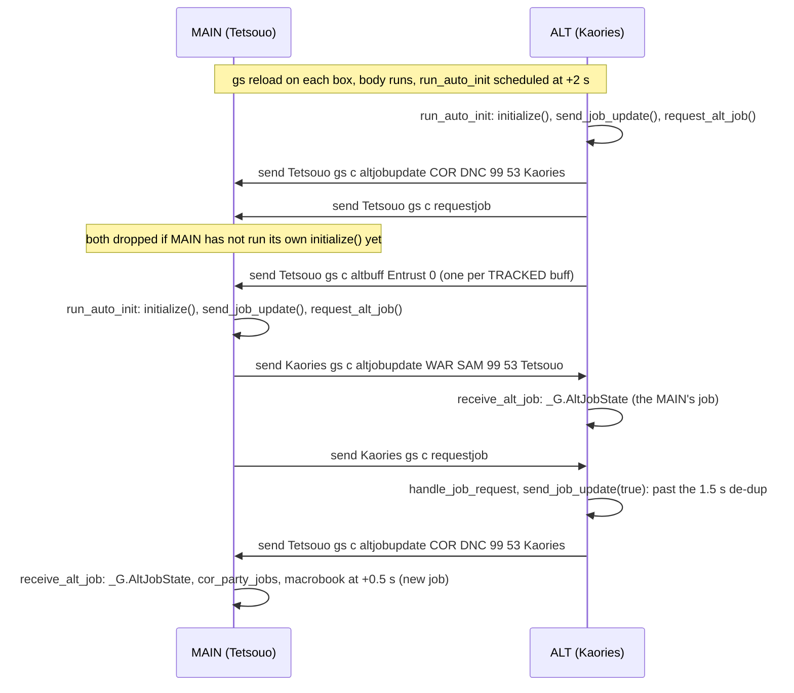
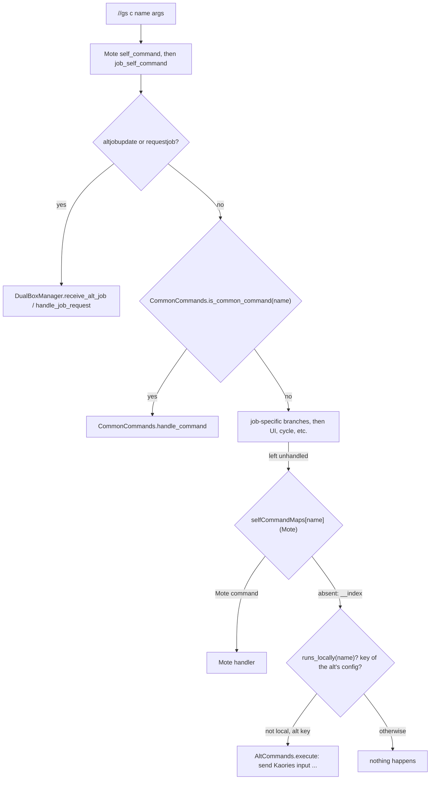

# Dual-box system (main/alt job exchange, alt commands, alt buff reporter, sync IPC)

The dual-box system connects two GearSwap instances running on the same machine: a
MAIN (Tetsouo) and an ALT (Kaories). It has four independent parts:

1. **Job exchange** (`dualbox_manager.lua`). About 2 s after every `gs reload`, each box sends
   its job and levels to the other and asks the other for theirs. Each stores the other box's job in
   `_G.AltJobState`. On the MAIN that state drives the macrobook choice and the alt command set; on
   both it feeds the COR roll job bonus.
2. **Alt commands** (`alt_commands.lua` + `config/alt/*.lua`). A short `//gs c <name>` typed on
   the MAIN, when no command of the MAIN answers that name, becomes `send Kaories input /ma "Spell" <laststid>`. The command set comes from the
   ALT's current main job plus its subjob, and each spell tier is picked from the level the ALT reported.
3. **Alt buff reporter** (`alt_buff_reporter.lua`). The ALT reports a small list of tracked
   buffs (Entrust, Composure, Bolter's Roll) to the MAIN, and the MAIN keeps them in `_G.AltBuffState`
   so alt commands can re-target (GEO Indi- under Entrust).
4. **Sync IPC** (`dualbox_sync_ipc.lua`). This is a Windower-IPC side channel that replays
   `//gs c ls` and `//gs c rf` on every other GearSwap instance. It is not gated on
   `DUALBOX_CONFIG` at all.

Parts 1 to 3 travel over the Windower **`send` addon** (`send <Name> gs c ...`) and arrive as
ordinary `//gs c` commands. Part 4 uses `windower.send_ipc_message` and an `ipc message` event.
On top of these, the **box group** (`alt_group.lua`, `dualbox_role.lua`, `alt_window.lua`) sends
orders to every other member (`//gs c alts`), swaps roles at runtime (`//gs c main`) and shows the
alts' state on the main.

Line numbers were re-read on 2026-09-25, after that day's uncommitted fixes (sender filter,
`//gs c main` writing the partner's role file, `not_ready` / `window_main_only` / `no_follower`
messages, time-stamped `alt_state.lua`, `_ALT_CUSTOM` fallback). Where a line adds nothing the
function is named.

## Files

| Path | Lines | Role |
|------|------:|------|
| `shared/utils/dualbox/dualbox_manager.lua` | 524 | Config load, job exchange protocol, `_G.AltJobState`, auto-init on every body execution |
| `shared/utils/dualbox/alt_commands.lua` | 570 | Loads the alt's command configs, resolves tier/target, builds and sends `send <alt> input ...`; installs the `selfCommandMaps` fallback |
| `shared/utils/dualbox/alt_buff_reporter.lua` | 336 | ALT: report tracked buffs. MAIN: store them, guess/expire, trace log |
| `shared/utils/dualbox/dualbox_sync_ipc.lua` | 159 | Windower IPC broadcast/hook registry for `ls`/`rf` mirroring |
| `shared/utils/dualbox/alt_group.lua` | 252 | `//gs c alts`: orders to every other member of the box group (`sm on/off`, follow, `do <command>`, mirror, window); `route()` also dispatches `main`/`setalt` |
| `shared/utils/dualbox/alt_window.lua` | 254 | Small overlay on the main: each alt (job, online) and the last Auto / Follow / Mirror orders; `//gs c alts window` shows/hides it |
| `shared/utils/dualbox/dualbox_role.lua` | 165 | `//gs c main` / `setalt`: switches the roles at runtime and saves them in `<Character>/config/dualbox_role.lua` |
| `shared/utils/messages/formatters/system/message_altgroup.lua` + `data/systems/altgroup_messages.lua` | - | `[ALTS]` / `[DUALBOX]` lines of the three modules above (including `not_ready`, `window_main_only`, `no_follower`, added 2026-09-25) |
| `shared/utils/messages/formatters/ui/message_dualbox.lua` | 190 | Chat output for the job exchange (via `M.send('DUALBOX', ...)`) |
| `shared/utils/messages/data/systems/dualbox_messages.lua` | 164 | Message templates for the above |
| `shared/utils/messages/formatters/ui/message_alt_commands.lua` | 274 | Renders `//gs c altcmds` (grouped overview / filtered view, plus the names only `alt <name>` reaches) |
| `_master/config/alt/<JOB>_ALT_COMMANDS.lua` | 22 files, 45-435 | Generated command tables, one per job (BLM BLU BRD BST COR DNC DRG DRK GEO MNK NIN PLD PUP RDM RNG RUN SAM SCH SMN THF WAR WHM) |
| `_master/config/alt/<JOB>_ALT_CUSTOM.lua` | 5 files | Hand-written overrides: BLM, GEO, RDM, SCH, SMN |
| `_master/config/alt/<JOB>_ALT_CUSTOM.lua.example` | 6 files | Commented templates: BLM, COR, GEO, RDM, SCH, WHM |
| `Tetsouo/config/alt/` (live, gitignored) | 33 files | Deployed copy of the above. Only the 6 `.example` files differ |
| `Tetsouo/config/DUALBOX_CONFIG.lua` (live) | 59 | MAIN role config. Template: `_master/Tetsouo/config_global/DUALBOX_CONFIG.lua` (identical) |
| `Kaories/config/DUALBOX_CONFIG.lua` (live) | 33 | ALT role config, generated by `clone_character.py` |
| `_master/Kaories/config_global/DUALBOX_CONFIG.lua` | 27 | Overlay copy of the ALT config (overwritten by the clone script, see Known issues) |
| `<Character>/config/dualbox_role.lua`, `alt_state.lua`, `alt_window.lua` (live, written in game) | - | Saved role, last `alts` orders, window position/visibility. Kept across a re-clone (`KEPT_ON_RECLONE` in `clone_character.py`), except `dualbox_role.lua` |

Integration points outside the folder: `shared/utils/core/COMMON_COMMANDS.lua` (command routing),
`shared/utils/core/INIT_SYSTEMS.lua:184-202` (sync IPC hooks + listener), the 16
`shared/jobs/*/functions/*_COMMANDS.lua` (protocol commands), every entry file's `user_setup()`
and every `*_functions.lua` facade (module load), `shared/jobs/geo/functions/GEO_BUFFS.lua:36`
(buff reports), `shared/utils/macrobook/macrobook_manager.lua:116-127` (`dualbox_config`, macro book per alt job),
`shared/jobs/cor/functions/logic/roll_tracker.lua:544` (roll job bonus).

How the config files were read for this page: every `*_ALT_CUSTOM.lua`, the GEO `.example`, and
`BLM_ALT_COMMANDS.lua` were read in full. The headers and samples of COR, GEO, BST, BLU and SMN
were read. Then all 27 command/custom files were loaded with `lua5.1` to count keys and fields
(numbers below).

## How it works

### Module load and auto-init (`dualbox_manager.lua`)

The module body runs every time it is `require`d without a cache hit:

- Every entry file requires it at the end of `user_setup()`, e.g. `_master/entry/Tetsouo_WAR.lua:253`,
  `Tetsouo/Tetsouo_BLM.lua:209`, `Kaories/Kaories_COR.lua:297`. `user_setup()` runs inside
  `include('Mote-Include.lua')`, which is before `INIT_SYSTEMS.lua` installs the module cache,
  so this require always executes the body.
- Every job facade requires it again (e.g. `shared/jobs/war/functions/war_functions.lua:97`,
  `rdm_functions.lua:83`). This one runs after the cache is installed and is the last body
  execution of the load. Later `require`s from the job COMMANDS files are cache hits.

Each body execution does this:

1. `windower._dualbox_init_counter += 1` and captures `my_init_counter` (`:457-458`).
2. Schedules `run_auto_init(1)` after `INIT_FIRST_DELAY = 2` s (`:465`, `:518`).

`run_auto_init(attempt)` (`:469-516`) runs these steps:

1. It aborts if another body ran since it was scheduled (`my_init_counter ~= windower._dualbox_init_counter`, `:470`).
   This also stops a chain left over from a previous `user_env`, because coroutines survive `gs reload` and `windower` is shared.
2. It retries every 1 s, at most 8 attempts, while `player.name` is missing (`:472-477`).
3. It runs at most once per `gs reload`: it compares `windower._gs_reload_count` (incremented in
   `INIT_SYSTEMS.lua:44`) to `windower._dualbox_init_last_reload` (`:479-481`).
4. It calls `DualBoxManager.initialize()` (`:483`), which loads `<player.name>/config/DUALBOX_CONFIG`
   into `_G.DualBoxConfig` (`:78-82`), applies the saved role over it (`DualBoxRole.apply_saved`,
   `:84-85`) and creates an empty `_G.AltJobState` (`:121-128`). If the config is missing, it installs
   disabled defaults (`:101-108`) and prints a warning.
5. Both roles then call `send_job_update()` and `request_alt_job()` (`:501-502`): the reload wiped this
   box's copy of the other box's job, and the other box may have dropped this box's earlier send.
6. The **ALT** role also calls `AltBuffReporter.report_all()` (`:504-511`).
7. Both roles call `AltWindow.start()` (`:514-515`); the window shows itself on the main only.

Until step 4 runs, `_G.DualBoxConfig` is nil. This window lasts 2 s at minimum after every reload. During it:

- `receive_alt_job` returns without storing (`:262-264`).
- `handle_job_request` returns without answering (`:216-218`).
- Alt commands are not recognised (`get_alt_name`, `alt_commands.lua:106`).
- `AltBuffReporter.report` sends nothing (`AltBuffReporter.report`).
- `//gs c alts ...` and `//gs c main` print "Dual-box not initialised yet" (`not_ready`) instead of
  the misleading "No alt set" (fixed 2026-09-25). `//gs c setalt` received in this window still saves
  the role file; `initialize` applies it 2 s later (fixed 2026-09-25).

### Job exchange protocol

| Wire command (sent via `send`) | Sender | When | Handler on receiver |
|---|---|---|---|
| `send <other> gs c altjobupdate <JOB>  <mlvl> <slvl> <sender>` | either box, `send_job_update` (`:149-211`) | Auto-init of either box. Reply to `requestjob` (forced past the de-dup). Also any role on subjob change in the `_master/entry/Tetsouo_BST.lua:274-278` / `Tetsouo_PUP.lua:247-251` templates | Every job COMMANDS file, e.g. `WAR_COMMANDS.lua:91-101`, calls `receive_alt_job(cmdParams[2..6])` (`:261-337`) |
| `send <other> gs c requestjob` | either box, `request_alt_job` (`:235-251`) | Auto-init of either box | Every job COMMANDS file, e.g. `WAR_COMMANDS.lua:103-108`, calls `handle_job_request` (`:215-226`), which answers on either role with `send_job_update(true)` |
| `send <main> gs c altbuff <Buff Name> <0\|1>` | ALT, `AltBuffReporter.report` | GEO `job_buff_change`. `report_all` at ALT auto-init and on `altbuffsync` | `COMMON_COMMANDS.lua:557-563` calls `AltBuffReporter.receive` |
| `send <alt> gs c altbuffsync` | MAIN, `request_sync` | `//gs c altsync`, or `sync_after` seconds after an alt command that declares it | `COMMON_COMMANDS.lua:564-570` calls `report_all` (sends only on the ALT) |
| `send <alt> input /ma "Name" <token>` (steps joined by `; wait N; `) | MAIN, `AltCommands.execute` (`alt_commands.lua:448-484`) | Player types an alt command | The `send` addon on the ALT's client. GearSwap is not involved on that side |
| `send <other> gs c setalt <me>` | the box that typed `//gs c main`, `DualBoxRole.become_main` | `//gs c main` | `AltGroup.route` -> `DualBoxRole.become_alt` |

Details of `send_job_update(force)` (`dualbox_manager.lua:149-211`):

- **Role.** It has no role guard: both boxes call it at auto-init, and `handle_job_request` calls it on
  either role.
- **Payload.** The payload is `main_job/sub_job/main_level/sub_level`, with `sub_job` set to `"NON"` when there is
  no subjob (`:166-176`). The sender's name (`player.name`) is appended as a fifth argument
  (`:199-200`, since 2026-09-25); a receiver that reads only four fields is unaffected.
- **De-dup.** An identical payload sent less than `SEND_DEDUP_WINDOW = 1.5` s ago is dropped (`:140`,
  `:180-186`), unless `force` is true. The last payload and time are stored on `windower` (`:205-206`),
  so the window survives `gs reload`. It is recorded only after a real send. A reply to `requestjob` is
  always forced: the asker has nothing, and this box's previous send of the same payload may have
  landed before the asker had initialised (and been dropped).
- **Target.** The target is `get_target_character()` (`:38`): `main_character` (fallback `alt_name`) for
  the ALT, and `alt_character` (fallback `alt_name`) for the MAIN.

`receive_alt_job(main_job, sub_job, main_level, sub_level, sender)` (`:261-337`) does the following on either box:

- It ignores an update whose `sender` is set and is not `get_target_character()` (case-insensitive,
  `:268-271`), so in a group of three only the tracked partner writes `_G.AltJobState`. A nil or
  empty sender (older 4- or 2-argument messages) is accepted. The 16 job COMMANDS files forward
  `cmdParams[6]` since 2026-09-25; the filter was inert before that.

- It notes whether the job or subjob differs from the stored `_G.AltJobState` (`:284-286`; levels are
  not compared).
- It replaces `_G.AltJobState` with `{job, subjob, main_level, sub_level, last_update=os.time(), online=true}`
  (`:288-297`). Missing levels become `0`, which is the case for the older two-argument form.
- It redraws the alt window (`AltWindow.refresh`, `:299-300`).
- It overwrites `main_job`/`sub_job`/`timestamp` of the matching `_G.cor_party_jobs` entry by name (`:309-318`).
  That entry is otherwise refreshed only from 0xDD packets.
- If the job and subjob are the ones it already held, it stops there, silently (`:320-322`). Both boxes send
  at every reload, so most updates are such repeats.
- Otherwise it prints `show_job_update_received` (`:325`) and schedules `select_default_macro_book()` after
  0.5 s (`:332-336`), on the ALT too (Kaories' configs have no `dualbox` table, so the ALT re-applies its
  solo book). The macrobook factory then reads `DualBoxManager.get_alt_job()` and picks
  `MACROBOOKS.dualbox[alt_job][own_sub]` (`dualbox_config`, `macrobook_manager.lua:116-127`).

The first update after this box's own reload always counts as new, because `initialize()` recreated an
empty `_G.AltJobState`. A reload of one box therefore re-selects the macro book on that box only; the
other box, which already held the same job, stores the push silently.

### Alt command routing

- Every job `job_self_command` checks `CommonCommands.is_common_command(command)` **before** its
  job-specific branches (e.g. `WAR_COMMANDS.lua:113`, `BLM_COMMANDS.lua:288`, before the job's own branches).
  `is_common_command` (`COMMON_COMMANDS.lua:679-727`) knows only built-in names and warp aliases; it does
  not look at the alt's config.
- The alt's keys are Mote's last lookup. When `COMMON_COMMANDS` is loaded (once per job-file load, on the
  first command that requires it) it calls `AltCommands.install_fallback(selfCommandMaps,
  CommonCommands.runs_locally)` (`COMMON_COMMANDS.lua:746-749`, `alt_commands.lua:519-532`), which sets an
  `__index` on Mote's `selfCommandMaps`. Mote reads that table only when `job_self_command` left the
  command unhandled (`Mote-SelfCommands.lua:26-35`), and `__index` runs only for names the table lacks.
- The `__index` answers only when `runs_locally(name)` is false (`COMMON_COMMANDS.lua:735-741`: common
  names, warp aliases, Mote's own keys) and `is_alt_command(name)` is true; it then returns a function that
  calls `AltCommands.execute(name, args)` (`alt_commands.lua:523-531`).
- The result: a job command, a common command and a Mote command all keep their names; a bare alt key
  works only for names nothing on the MAIN answers. `//gs c alt <name>` always reaches the alt. RDM's
  catch-all leaves a name unhandled when `selfCommandMaps` answers it (`RDM_COMMANDS.lua:388-395`). See
  [commands and debug](commands-and-debug.md#4-alt-commands-and-name-shadowing) for the names that collide
  today.

`AltCommands.execute(cmd, args)` (`alt_commands.lua:448-484`) runs these steps:

1. It resolves `alt = get_alt_name()` (`:106`). This is nil unless `DualBoxConfig.enabled` and `role == 'main'`.
2. It calls `load_config()` (`:260`), described below.
3. It resolves the entry's default token: `token_for(entry.target or 'lastst')`.
4. It builds the command with `build_command` (`:414`). Each step (the entry itself, or each element of
   `entry.chain`) becomes `send <alt> input <verb> "<name>" <token>` (`build_action` / `build_step`,
   `:354-379`), and the steps are joined with `'; wait ' .. (entry.step_delay or 2) .. '; '`. Each step
   carries its own `send`, so the `wait` and later steps run on the MAIN's console.
5. It calls `send_command(command)`. In the GearSwap sandbox this is `send_cmd_user`, which prefixes `@`
   (`GearSwap/user_functions.lua:247-252`).
6. It writes a trace line if `altdebug` is on (`trace_sent`, `:43`).
7. It applies the entry's buff effects (`apply_buff_effects`, `:381`).

Token resolution (`token_for`, `:331`):

- A function target is evaluated at command time under `pcall`.
- `me`/`pet` are sent literally (`<me>`, `<pet>`), so the ALT resolves them to itself (`ALT_SIDE_TARGETS`, `:69`).
- `lastst`, `t`, `bt`, `ft`, `scan` become `<lastst id>` style tokens (`<laststid>`, `<tid>`, ...). The `send` addon rewrites
  these to numeric ids on the MAIN's client (`SHARED_TARGETS`, `:61`).
- Any other value as the entry's `target` makes `execute` print an error. An unknown `target` on a
  `chain` step silently falls back to the entry's token (`build_step`).

Name resolution (`resolve_name`, `:309`) has three cases:

- `spell` is a function: `pcall(spell, args)`.
- `spell_from_state`: `tostring(state[<name>].value)` read from the **MAIN's** Mote state, or `fallback`
  when that state is absent.
- Otherwise `spell` is used as is.

### Config loading (`load_config` / `load_job_config`)

When `<player.name>/config/alt/<JOB>_ALT_COMMANDS` is missing - a character that became main with
`//gs c main` and never had alt configs - `load_job_config` falls back to
`_master/config/alt/<JOB>_ALT_COMMANDS` (`alt_commands.lua:167`). The same fallback now applies to
`<JOB>_ALT_CUSTOM` (`:183-187`, fixed 2026-09-25): a character without `config/alt/` gets the
`_master` custom commands (`entrusthaste`, `compass`...). `Tetsouo/config/alt/*_ALT_CUSTOM.lua` are
identical to `_master`, so nothing changes for Tetsouo.

`load_config()` (`:260-292`):

- It reads `_G.AltJobState` directly (`get_alt_jobs`, `:123`) and deliberately bypasses the 30 s
  `is_alt_online()` timeout (comment above `get_alt_jobs`).
- It caches one result per key `job/subjob/main_level/sub_level` in the module-local `cache` (`:102`). A cached `nil` is also kept.
- It loads the subjob first, then the main job, so the main job wins name clashes.

`load_job_config(job, level, source)` (`:155-252`):

1. It returns nil for `nil`, `''` or `'NON'` (`:156-158`).
2. It requires `<player.name or 'Tetsouo'>/config/alt/<JOB>_ALT_COMMANDS` under `pcall`, and the file must return
   `{commands = {...}}`; `_master/config/alt/` when the character has none.
3. It copies `loaded.commands` into `merged`, then overlays `<JOB>_ALT_CUSTOM.commands` (`false`
   removes a name) and remembers `custom.refine` if it is a function (`:195-197`).
4. It filters each merged entry (`:200-250`):
   - `tiers`: `tier_for_level` (`:139`) picks the highest tier with `level <= level`. The entry is then
     copied with `spell` set and `tiers` removed. If no tier is reachable, the entry is dropped.
   - otherwise, if `entry.level > level`, the entry is dropped.
   - `main_only` entries are dropped when loaded as the subjob (`:223-225`).
   - `refine(copy, name)` runs under `pcall`. Returning `false` drops the entry, a table replaces it, and
     anything else keeps the edited copy. A refine error keeps the entry unchanged (`:232-243`).
   - It stamps `entry.source` (`'main'`/`'sub'`) and `entry.source_job`, then stores the entry under
     `name:lower()` (`:246-249`). Entries not copied by tiers/refine are the tables returned by `require`,
     mutated in place.

A reported level of `0` (older two-argument payload) drops every entry that has a `level` or `tiers`.

### Alt buff reporter

**On the ALT:**

- `report(buff, gained)` (`:116-152`) only sends for buffs listed in `TRACKED`
  (`:33-37`: `Entrust`, `Composure`, `Bolter's Roll`), and only when role is `alt` and dual-boxing is enabled.
- It sends `send <main> gs c altbuff <Buff Name> <1|0>` without quotes, because Mote does not strip
  quotes (`:149`).
- The only live-event caller is `GEO_BUFFS.lua:36`. `report_all()` (`:160`) sends every
  TRACKED buff, up or down. It runs at ALT auto-init (`dualbox_manager.lua:504-511`), after a
  received `setalt`, and on
  `//gs c altbuffsync`.

**On the MAIN:**

- `receive(args)` (`:205`) treats the last word as the value (`'1'`/`'true'` means up) and joins the rest as
  the buff name, stripping `"`.
- It writes `_G.AltBuffState[buff]`, clears any `_G.AltBuffExpiry[buff]`, and sets
  `windower._alt_buff_reporting = true`. That flag persists until `//lua reload gearswap`.
- `assume(buff, seconds)` (`:276`) records a guess with an `os.clock()` expiry. It is used **only
  while** `windower._alt_buff_reporting` is not set. It is called from alt commands that declare `sets_alt_buff`.
- `consume(buff)` (`:298`) clears a buff.
- `active(buff)` (`:315`) honours the expiry and clears expired guesses.

GEO uses this in `_master/config/alt/GEO_ALT_CUSTOM.lua` (`indi_target` and `M.refine`, `:99-116`): `refine` replaces the `me` target of
every command whose name starts with `indi` by a function returning `'lastst'` while
`AltBuffReporter.active('Entrust')`. `altentrust` (`:67-71`) declares `sets_alt_buff = 'Entrust'`,
`alt_buff_duration = 60` and `sync_after = 3`. The comment there, recorded as verified in game in commit 031aa4c,
states that FFXI fires `buff_change` for Entrust only on loss. The 3 s resync is how the MAIN learns of the gain.

**Tracing:**

- `//gs c altdebug` toggles `windower._alt_buff_debug` (`toggle_debug`, `:88`). It truncates and writes a header to
  `windower.addon_path .. 'data/altbuff_<player>.log'` (`log_path`, `:52`).
- While on, `trace()` (`:61`) prints through `MessageFormatter.show_debug('ALTBUFF', ...)` and appends
  `[HH:MM:SS] msg` to that file.
- The ALT side logs every `buff_change`, including untracked ones. The MAIN side logs every
  alt-command send (`trace_sent`, `alt_commands.lua:43`), every receive, and every assume/refusal.
- `*.log` is gitignored.

### Sync IPC (`dualbox_sync_ipc.lua`)

- **Hooks.** `INIT_SYSTEMS.lua:184-202` registers four hooks on every load: `ls` and `lockstyle` call
  `select_default_lockstyle()`, and `rf` and `refill` call `RefillManager.refill()`. It then calls
  `SyncIPC.init_listener()`.
- **Broadcast.** `broadcast(cmd)` (`:71`) is called only from `CommonCommands.handle_refill`
  (`COMMON_COMMANDS.lua:246-247`, `'rf'`) and `handle_lockstyle` (`:373-374`, `'ls'`). It sends
  `tetsouo_sync_<cmd>` if a hook with that name exists locally, and records it on
  `windower._sync_ipc_last_sent(_time)` for self-echo suppression.
- **Receive.** `_on_ipc_message` (`:110-132`) ignores other prefixes. It then drops self-echo within
  `BROADCAST_TTL = 1.5` s and duplicates within `IPC_DEBOUNCE = 1.0` s, and runs the hook under `pcall`.
  The receiving side calls the hook directly, never `handle_lockstyle`, so there is no re-broadcast loop.
- **Scope.** Windower IPC reaches every other instance of the GearSwap addon on the machine, whatever
  `DUALBOX_CONFIG` says.

### Box group and role switch (`alt_group.lua`, `dualbox_role.lua`)

- **Group.** `DualBoxConfig.group = {"Tetsouo", "Kaories"}` in both configs; `clone_character.py`
  now writes it when dual-boxing is enabled (`_create_dualbox_config`, fixed 2026-09-25). Without it,
  the group is this character plus `alt_character(s)` / `main_character`. Two functions compute
  "the other members": `AltGroup.get_alts()` (role-aware fallback, respects `enabled`) and the local
  `others()` of `dualbox_role.lua` (ignores `enabled`); see Known issues.
- **`//gs c alts <on|off|toggle|follow [name|off]|do <command>|mirror>`**, from either box: sends
  `send <name> sm ...` (or the `do` command as typed) to every other member of the group, so it does
  not depend on the role. `follow <name>` leaves that character out (it cannot follow itself); when that leaves nobody
  (two boxes, told to follow the other one) it prints `no_follower`, sends nothing and keeps the
  saved state (fixed 2026-09-25).
  `mirror` runs `sm mirror` locally. The on/follow state is the last order sent, kept on
  `windower._alt_group` and saved in `alt_state.lua`; orders sent another way (a macro) are not seen,
  `//gs c sortie` records its own through `AltGroup.note`. `alts window` toggles the alt window.
  With no other member it prints `no_alts`, or `not_ready` while `_G.DualBoxConfig` is still nil.
- **`//gs c main`** on the character that becomes main (`DualBoxRole.become_main`, `shared/utils/dualbox/dualbox_role.lua:108-135`):
  `not_ready` while the config is nil, `no_alts` when disabled or alone; otherwise sets `role='main'`,
  `alt_characters` / `alt_character` = the other members, saves its own role file, **also writes each
  alt's `<alt>/config/dualbox_role.lua` = `{role='alt', names={me}}`** (fixed 2026-09-25: an alt offline
  or still loading missed the `setalt` and came back as a second main; on another PC the folder is
  missing and `io.open` fails silently), sends `gs c setalt <me>` to each, then resyncs
  (`send_job_update(true)` + `request_alt_job()`) and redraws the window.
- **`//gs c setalt <main>`** (received, `become_alt`, `:140-150`): saves `role='alt'` first, even when
  `_G.DualBoxConfig` is still nil (then `initialize` applies it); otherwise also `main_character=<main>`,
  resyncs the job and `AltBuffReporter.report_all()`.
- **Persistence.** `<Character>/config/dualbox_role.lua` (`{role = ..., names = {...}}`) is applied
  over `DUALBOX_CONFIG.lua` by `DualBoxManager.initialize` right after the require, so it survives a
  reload and a game restart. Deleting the file restores the config file's role.
- **Alt window** (`alt_window.lua`): drawn on the main only. Job comes from
  `_G.AltJobState` (last one received), online from the party list (`get_party`, `presence`, `shared/utils/dualbox/alt_window.lua:115`, with the
  alt's zone when it differs; `no party` when absent) - not `is_alt_online()`, whose 30 s
  timeout reads a quiet alt as offline because the job exchange only speaks at a load or
  a job change; Auto / Follow / Mirror are the last orders sent from this box
  (`AltGroup.state()`, `?` until one is sent; saved in `<Character>/config/alt_state.lua`
  with `time = os.time()`; `load_state` ignores a file older than the game process (`os.time() - time >
  os.clock() + 1`) and a file without `time`, so the orders survive a GearSwap reload but not a game
  restart - fixed 2026-09-25, the old file had no stamp), because the automation addon's real state
  is not readable from GearSwap. `//gs c sortie` records its orders through
  `AltGroup.note`. While it is on screen (`AltWindow.is_shown`), the Auto / Follow / Mirror
  orders print nothing in chat. Redrawn on every order, job update and role switch, and every 5 s
  (loop stopped by `windower._alt_window_gen` when a newer load starts). Position and
  visibility in `<Character>/config/alt_window.lua` (default `x = 1600, y = 120`, `:32`).
  `//gs c alts window` on a box that is not main prints `window_main_only` and changes nothing
  (fixed 2026-09-25). a drag is saved by the 5 s loop, not a
  `mouse` event: an event registered from a job file runs GearSwap's `refresh_globals` +
  `equip_sets` on every call, which made dragging lag.
- **Not role-aware:** `//gs c sortie` targets `ALT = 'Kaories'` and her Silmaril profiles by design.

## Public API

### `DualBoxManager` (`require('shared/utils/dualbox/dualbox_manager')`, not exported to `_G`)

| Function | Effect | Callers |
|---|---|---|
| `initialize(config?)` (`:69-129`) | Loads `_G.DualBoxConfig` once per env, applies `dualbox_role.lua`. Optional table overrides keys. Creates `_G.AltJobState` | `run_auto_init` only (no caller passes `config`) |
| `send_job_update(force?)` (`:149-211`) | Sends `altjobupdate` (with the sender's name) to the other box, de-duplicated 1.5 s unless `force` | `run_auto_init` (both roles), `handle_job_request` (forced), `DualBoxRole` resync, `_master/entry/Tetsouo_BST.lua:277`, `Tetsouo_PUP.lua:250` |
| `handle_job_request()` (`:215-226`) | Either role: calls `send_job_update(true)` | 16 job COMMANDS on `requestjob` |
| `request_alt_job()` (`:235-251`) | Either role: sends `requestjob` to the other box | `run_auto_init` (both roles), `DualBoxRole` resync |
| `receive_alt_job(job, sub, mlvl, slvl, sender)` (`:261-337`) | Drops a stranger's update; stores `_G.AltJobState`, patches `_G.cor_party_jobs`, redraws the window; for a new job or subjob only, prints and reselects macrobook | 16 job COMMANDS on `altjobupdate` |
| `is_alt_online()` (`:346-360`) | True if `AltJobState.online` and last update within `DualBoxConfig.timeout` (default 30 s). Sets `online=false` once expired | `macrobook_manager.lua` `dualbox_config`, `get_alt_job`, `show_status` |
| `get_alt_job()` (`:364-370`) | Alt job or nil when offline | `macrobook_manager.lua` `dualbox_config` |
| `get_alt_subjob()` (`:374-380`) | Alt subjob or nil | none |
| `mark_alt_offline()` (`:387-391`) | Sets `online=false` | none |
| `get_time_since_update()` (`:395-401`) | Seconds since last update (9999 if none) | `show_status` only |
| `show_status()` (`:404-435`) | Prints a status block | none (no `//gs c` command reaches it) |

### `AltCommands` (`_G.AltCommands`, `alt_commands.lua:568`)

| Function | Effect | Callers |
|---|---|---|
| `is_alt_command(cmd)` (`:436`) | True if the MAIN role is active and `cmd:lower()` is in the current merged config | the `selfCommandMaps` `__index` |
| `execute(cmd, args)` (`:448-484`) | Build and send. Returns true if sent. Silent `false` if `cmd` is unknown | `handle`, the `__index` function |
| `handle(cmd, args, runs_locally?)` (`:492`) | `altcmds`/`altlist` list, `alt` with no args lists, `alt <name> ...` executes with every extra word | `COMMON_COMMANDS.lua:283` |
| `install_fallback(maps, runs_locally?)` (`:519-532`) | Sets an `__index` on Mote's `selfCommandMaps` that runs an alt key nothing local answers. Does nothing if `maps` is not a table or already has a metatable | `COMMON_COMMANDS.lua:746-749`, at module load |
| `list(filter?, runs_locally?)` (`:540`) | Splits the names into bare-reachable and `runs_locally` ones, calls `MessageAltCommands.show_list` | `handle` |
| `token_for(target)` (`:331`) | Target to wire token | internal (public for tests) |
| `clear_cache()` (`:295`) | Resets the config cache | none |

### `AltBuffReporter` (`_G.AltBuffReporter`, `alt_buff_reporter.lua:334`)

| Function | Side | Callers |
|---|---|---|
| `report(buff, gained)` (`:116`) | ALT | `GEO_BUFFS.lua:36`, `report_all` |
| `report_all()` (`:160`) | ALT | `dualbox_manager.lua:509`, `COMMON_COMMANDS.lua` `altbuffsync`, `DualBoxRole` resync |
| `request_sync()` (`:179`) | MAIN | `COMMON_COMMANDS.lua` `altsync`, `apply_buff_effects` in `alt_commands.lua` |
| `receive(args)` (`:205`) | MAIN | `COMMON_COMMANDS.lua` `altbuff` |
| `assume(buff, seconds)` / `consume(buff)` (`:276`, `:298`) | MAIN | `apply_buff_effects` in `alt_commands.lua` |
| `active(buff)` (`:315`) | MAIN | `GEO_ALT_CUSTOM.lua` `indi_target` |
| `show_state()` (`:239`) | MAIN | `COMMON_COMMANDS.lua` `altbuffs` |
| `toggle_debug()` / `trace(msg)` (`:88`, `:81`) | both | `COMMON_COMMANDS.lua` `altdebug`, `trace_sent` in `alt_commands.lua` |

### `DualBoxSyncIPC` (`require('shared/utils/dualbox/dualbox_sync_ipc')`)

| Function | Effect | Callers |
|---|---|---|
| `register_hook(cmd, fn)` (`:47`) | `_G.DUALBOX_SYNC_HOOKS[cmd:lower()] = fn` | `INIT_SYSTEMS.lua:186-198` |
| `unregister_hook(cmd)` (`:54`) | Removes a hook | none |
| `broadcast(cmd)` (`:71`) | Sends `tetsouo_sync_<cmd>` via Windower IPC | `COMMON_COMMANDS.lua:247`, `:374` |
| `_on_ipc_message(msg)` (`:110`) | Listener body | registered by `init_listener` |
| `init_listener()` (`:146`) | Unregisters `windower._sync_ipc_event_id` (pcall) only if it was registered in this same load (`windower._sync_ipc_event_load == windower._gs_reload_count`), registers `ipc message`, stores id and load | `INIT_SYSTEMS.lua:199` |

### `AltGroup`, `DualBoxRole`, `AltWindow`

| Function | Effect | Callers |
|---|---|---|
| `AltGroup.route(cmd, args)` (`alt_group.lua:241`) | `alts` -> `handle`, `main` -> `become_main`, `setalt` -> `become_alt` | `CommonCommands.handle_command` |
| `AltGroup.handle(args)` (`:199`) | `on`/`off`/`toggle`/`follow`/`do`/`mirror`/`window` | `route` |
| `AltGroup.get_alts()` (`:110`) | Other members of the group | `handle`, `alt_window.lua` |
| `AltGroup.state()` / `note(changes)` (`:92`, `:98`) | Last orders / record orders sent elsewhere | `alt_window.lua`, `sortie_commands.lua` |
| `DualBoxRole.become_main()` / `become_alt(args)` / `apply_saved()` (`shared/utils/dualbox/dualbox_role.lua:108`, `:140`, `:155`) | Role switch and persistence | `route`, `DualBoxManager.initialize` |
| `AltWindow.start()` / `refresh()` / `toggle()` / `is_shown()` (`shared/utils/dualbox/alt_window.lua:242`, `:184`, `:221`, `:198`) | Window loop, redraw, show/hide, quiet chat while shown | `run_auto_init`, `receive_alt_job`, `alt_group.lua`, `dualbox_role.lua` |

## Commands

| Command | Run on | Handler | Effect |
|---|---|---|---|
| `//gs c altjobupdate <JOB>  [mlvl] [slvl] [sender]` | either box | job COMMANDS, e.g. `WAR_COMMANDS.lua:91`, then `receive_alt_job` | Store the other box's job. Sent automatically |
| `//gs c requestjob` | either box | job COMMANDS, e.g. `WAR_COMMANDS.lua:103`, then `handle_job_request` | Pushes this box's job to the other box (past the de-dup) |
| `//gs c alt` | MAIN | `COMMON_COMMANDS.lua:555`, then `AltCommands.handle` | Same as `altcmds` |
| `//gs c alt <name> [args]` | MAIN | same | Explicit form of an alt command |
| `//gs c altcmds [group\|search]`, `altlist` | MAIN | `AltCommands.handle` -> `list` | Overview by group, or filtered view; names that run locally are listed apart under `//gs c alt <name>` |
| `//gs c <name> [args]` | MAIN | Mote's `selfCommandMaps` `__index`, `alt_commands.lua:523-531` | Any key of the alt's current config that nothing on the MAIN answers (job, common, warp or Mote command) |
| `//gs c altbuff <Buff Name> <1\|0>` | MAIN | `COMMON_COMMANDS.lua:557-563` | Record a buff state. Sent by the ALT |
| `//gs c altbuffsync` | ALT | `COMMON_COMMANDS.lua:564-570` | Resend all TRACKED buffs |
| `//gs c altsync` | MAIN | `COMMON_COMMANDS.lua:571-579` | Send `altbuffsync` to the ALT (error if not main/enabled) |
| `//gs c altbuffs` | MAIN | `COMMON_COMMANDS.lua:580-586` | Print `_G.AltBuffState`, guesses and reporting status |
| `//gs c alts <on\|off\|toggle\|follow [name\|off]\|do <command>\|mirror\|window>` | either | `CommonCommands.handle_command` then `AltGroup.route` | Orders to every other member of the group (see above) |
| `//gs c main` | the new main | `AltGroup.route`, then `DualBoxRole.become_main` | This box becomes main, the others its alts; saved on both sides |
| `//gs c setalt <main>` | the new alts | `DualBoxRole.become_alt` | Sent by `main`; this box becomes alt of `<main>`; saved |
| `//gs c altdebug` | either | `COMMON_COMMANDS.lua:587` | Toggle tracing and print the log path |
| `//gs c ls`, `lockstyle` | either | `COMMON_COMMANDS.lua:604`, then `handle_lockstyle` | Local lockstyle plus IPC `ls` broadcast |
| `//gs c rf`, `refill` | either | `COMMON_COMMANDS.lua:551`, then `handle_refill` | Local refill plus IPC `rf` broadcast |

All `alt*` names, `alts`, `main` and `setalt` are in the `is_common_command` list (`COMMON_COMMANDS.lua:692-694`, `:703`).
`altjobupdate`/`requestjob` are not: every job's `job_self_command` handles them before the common check.
No `//gs c` command calls `DualBoxManager.show_status()`.

## Configuration

### `DUALBOX_CONFIG.lua` (`<Character>/config/DUALBOX_CONFIG.lua`)

Loaded with `require(player.name .. '/config/DUALBOX_CONFIG')` (`dualbox_manager.lua:78-79`), which is cached per env.

| Key | MAIN (`Tetsouo/config`) | ALT (`Kaories/config`) | Read at |
|---|---|---|---|
| `role` | `"main"` | `"alt"` | everywhere, gates every function. Overridden by `dualbox_role.lua` when present |
| `group` | `{"Tetsouo", "Kaories"}` | same | `alt_group.lua`, `dualbox_role.lua`, `alt_window.lua` |
| `character_name` | `"Tetsouo"` | `"Kaories"` | `get_this_character` (`:53`), debug output only |
| `alt_character` | `"Kaories"` | - | `get_target_character` (`:38`), `get_alt_name` in `alt_commands.lua`, `request_sync` |
| `main_character` | - | `"Tetsouo"` | `get_target_character`, `AltBuffReporter.report` |
| `main_name` / `alt_name` | absent | legacy aliases (`= character_name` / `= main_character`) | fallbacks in the same places |
| `enabled` | `true` | `true` | every entry point |
| `timeout` | `30` | `30` | `is_alt_online` (`:351`), default 30 |
| `debug` | `false` | `false` | verbose `MessageDualbox` output |

Defaults when the file is missing (`:101-108`): `enabled=false, role="main", main_name=<player>,
alt_name="Unknown", timeout=30, debug=false`.

Clones: `clone_character.py` generates `DUALBOX_CONFIG.lua` from its interactive answers
(`ask_dualbox`, `_create_dualbox_config`), after the overlay files are copied, so a generated file
always replaces the overlay's. Since 2026-09-25 it includes `DualBoxConfig.group = {"<char>", "<partner>"}`
when dual-boxing is enabled. `dualbox_role.lua` is deliberately **not** kept across a re-clone (it
would override the role the clone just wrote); `alt_state.lua` and `alt_window.lua` are.

### Alt command configs (`<player.name>/config/alt/`)

These files are loaded **on the MAIN only**, from the MAIN's own folder, with `_master/config/alt/`
as fallback for both files (`load_job_config`). `clone_character.py` copies `config/alt/` only for a
character cloned as MAIN (`shared_dirs`, since `f6f1683`).

Per-file format:

- `<JOB>_ALT_COMMANDS.lua` returns `{ commands = { <key> = entry, ... } }`. The header says it is generated from
  `shared/data/job_abilities/`, `shared/data/magic/` and Windower `res`. The generator is not in the
  repository; where it lives is not recorded.
- `<JOB>_ALT_CUSTOM.lua` returns `{ commands = {...}, refine = function(entry, name) }`. Both fields are optional.

Key counts (loaded with lua5.1): BLM 60, BLU 203, BRD 71, BST 19, COR 40, DNC 28, DRG 18, DRK 41,
GEO 89, MNK 13, NIN 44, PLD 20, PUP 21, RDM 76, RNG 15, RUN 51, SAM 14, SCH 81, SMN 144, THF 15,
WAR 12, WHM 76. The CUSTOM files have: BLM 2, GEO 6, RDM 2, SCH 2, SMN 9.

Entry fields:

| Field | Meaning | Consumed at |
|---|---|---|
| `action` | `ma` `ja` `ws` `so` `item` `pet` `ra` `ninjutsu` map to their verb. `raw` sends the name as is | `ACTION_VERBS` (`alt_commands.lua:90`), `build_action` (unknown value falls back to `/ma`) |
| `spell` | String, or `function(args)` returning one | `resolve_name` |
| `tiers` | `{ {spell=, level=}, ... }`. Highest reachable wins | `load_job_config`, `tier_for_level` |
| `level` | Drop when above the reported level | `load_job_config` |
| `main_only` | Drop when loaded as subjob | `load_job_config` |
| `target` | `lastst` (default), `me`, `pet`, `t`, `bt`, `ft`, `scan`, or a function returning one | `token_for`, `execute` |
| `spell_from_state`, `fallback` | Read the MAIN's Mote state `.value` | `resolve_name` |
| `chain`, `step_delay` | List of steps (each with `action`/`spell`/`target`), joined with `wait` (default 2 s) | `build_command` |
| `sets_alt_buff`, `alt_buff_duration`, `consumes_alt_buff`, `sync_after` | Buff bookkeeping after the send | `apply_buff_effects` |
| `group`, `desc` | Display only | `message_alt_commands.lua` |

Shipped usage, counting the 6 `chain` steps: 1,175 entries set `action` (`ma` 615, `ja` 334, `pet` 125, `so` 64, `ninjutsu` 37).
No shipped entry uses `ws`, `item`, `ra` or `raw`. Targets are `lastst` 623 and `me` 552. `tiers` appears 683 times, `main_only` 193,
`spell_from_state` 8, `chain` 3, `sets_alt_buff`/`sync_after` once (GEO `altentrust`).
`consumes_alt_buff` is unused.

Editing a config needs a `gs reload`, because the require cache and `cache` are per `user_env`.

## State & lifetime

| State | Where | Lifetime |
|---|---|---|
| `_G.DualBoxConfig` | `dualbox_manager.lua:81`/`:102`, then `DualBoxRole.apply_saved` / `set_config` | Per `user_env`: rebuilt about 2 s after every reload |
| `_G.AltJobState` | `:121`, `:288` | Per env, on both boxes. Empty `{job=nil}` until the first `altjobupdate` after each reload |
| `_G.AltBuffState`, `_G.AltBuffExpiry` | `AltBuffReporter.receive` / `assume` | Per env. Not re-requested after a MAIN reload |
| `_G.AltCommands`, `_G.AltBuffReporter` | `alt_commands.lua:568`, `alt_buff_reporter.lua:334` | Per env |
| `_G._alt_window_display`, `_G._alt_window_prefs` | `alt_window.lua` | Per env (the text object and the loaded prefs) |
| `__index` metatable on `selfCommandMaps` | `alt_commands.lua:523` | Per env: Mote rebuilds the table on every job-file load, and the next load of `COMMON_COMMANDS` installs it again |
| `_G.DUALBOX_SYNC_HOOKS` | `dualbox_sync_ipc.lua:41` | Per env. Re-registered by `INIT_SYSTEMS` each load |
| `cache` (alt configs), `last_msg` (IPC debounce), `MessageDualbox` | module locals | Per module execution |
| `windower._dualbox_init_counter` | `dualbox_manager.lua:457` | Windower session |
| `windower._dualbox_init_last_reload` | `:481` | Windower session |
| `windower._dualbox_last_send_payload/_time` | `:205-206` | Windower session |
| `windower._alt_buff_debug` | `AltBuffReporter.toggle_debug` | Windower session |
| `windower._alt_buff_reporting` | `AltBuffReporter.receive` | Windower session (never reset) |
| `windower._sync_ipc_event_id`, `windower._sync_ipc_event_load` | `init_listener` | Windower session; the id is only unregistered by a later `init_listener` of the same load |
| `windower._sync_ipc_last_sent/_time` | `broadcast` | Windower session |
| `windower._alt_group` | `alt_group.lua` `group_state` | Windower session; loaded from `alt_state.lua` when absent |
| `windower._alt_window_gen` | `AltWindow.start` | Windower session; a newer `start()` stops the older 5 s loop |
| `<Character>/config/dualbox_role.lua` | `dualbox_role.lua` `save` | File: until deleted. Written by `//gs c main` for this box and each alt |
| `<Character>/config/alt_state.lua` | `alt_group.lua` `save_state` | File, stamped; ignored after a game restart |
| `<Character>/config/alt_window.lua` | `alt_window.lua` `save_prefs` | File: position and visibility |

In the GearSwap sandbox, `windower` is `user_windower`, a table created once at addon load with
`__index = windower` (`GearSwap/user_functions.lua:418-423`). Fields written on it survive `gs reload`
and job changes, but not `//lua reload gearswap`. `_G` is the per-load `user_env`
(`GearSwap/refresh.lua:83`, `:114`, `:149`).

Events and coroutines:

- **`ipc message` listener.** Registered through `register_event_user`. GearSwap itself unregisters
  every user-registered event at the start of each `load_user_files` (`GearSwap/refresh.lua:69-71`), which covers `gs reload`
  and job changes. `init_listener` unregisters the stored id under `pcall` only when that id was
  registered in the same load: an older id is already freed and could now belong to another listener.
- **Auto-init chain.** `coroutine.schedule` closures survive `gs reload`. The counter check at `:470`
  invalidates a stale chain as soon as any new body runs.
- **Macrobook reselect** scheduled by `receive_alt_job` (0.5 s, new job only) and **`sync_after` resync**
  (`apply_buff_effects`). Neither is cancelled on reload. They run against the env they were
  created in.

Behaviour per event:

- **MAIN `gs reload` / job change / subjob change.** A subjob change goes through `JobChangeManager`,
  which reloads 0.5 s later. `_G` is lost, so alt commands are unknown for 2 s or more. `run_auto_init` then
  pushes the MAIN's job to the ALT and asks the ALT, whose forced reply restores `_G.AltJobState`.
  The ALT stores an unchanged MAIN job silently (no message, no macro book).
  `_G.AltBuffState` stays empty until the ALT's next buff report.
- **ALT `gs reload` / job change / subjob change.** At +2 s the ALT pushes `altjobupdate` (dropped
  only if the same payload went out less than 1.5 s earlier), asks the MAIN, whose forced reply restores
  the ALT's `_G.AltJobState`, and runs `report_all()`. The MAIN's `load_config` cache key changes and the
  command set follows.
- **Both boxes reload together.** Whichever initialises first loses the other's pushes (its own
  `_G.DualBoxConfig` exists, the other's does not yet); the later box's push and its request, answered
  with a forced reply, still reach both sides.
- **Zone change, death.** No part of this system listens to them. `_G.AltJobState` keeps its value.
- **ALT logs out.** The alt window shows it (`no party` once the alt leaves the party list; how
  `get_party()` presents a disconnected member that is still in the party was not checked). Nothing
  else notices: `_G.AltJobState` on the MAIN keeps the last job, so alt commands keep matching until
  the MAIN reloads. `is_alt_online()` turns false 30 s after the last update, which only affects the
  macrobook choice.
- **`//gs c main` while the partner is offline or loading.** Fixed 2026-09-25: the partner's role
  file is written directly, so it starts as alt. Game test pending (Kaories offline, `//gs c main` on
  Tetsouo, then the reverse: one alt window only).

## Interactions

- [Common commands](commands-and-debug.md): `COMMON_COMMANDS.lua` owns the routing and the `alt*` verbs.
- [Macrobook factory](factories-and-helpers.md): `macrobook_manager.lua` `dualbox_config` reads `is_alt_online()`/`get_alt_job()`.
  Per-job `MACROBOOKS.dualbox[<alt job>][<own subjob>]` tables exist in `Tetsouo/config/<job>/<JOB>_MACROBOOK.lua`.
- [Job change manager](../architecture/job-change-lifecycle.md): a subjob change reloads GearSwap, which re-runs the auto-init.
- [INIT_SYSTEMS](core-lifecycle.md): `windower._gs_reload_count` (`INIT_SYSTEMS.lua:44`), module cache,
  sync IPC hooks (`:184-202`).
- [Messages](messages.md): `MessageDualbox`, `MessageAltCommands`, and `MessageFormatter.show_error/show_debug`.
- [COR](../jobs/cor.md): `roll_tracker.lua:544` treats `_G.AltJobState.job` as present in the party for
  the roll job bonus. `receive_alt_job` patches `_G.cor_party_jobs`.
- [GEO](../jobs/geo.md): `GEO_BUFFS.lua:36` reports buffs.
- Sortie: `//gs c sortie` (`shared/utils/sortie/sortie_commands.lua`) orders Kaories and records its orders with `AltGroup.note`; an unknown mode value now warns instead of raising (fixed 2026-09-25). `GEO_ALT_CUSTOM.lua` retargets Indi- under Entrust.
- Windower `send` addon: required on both boxes for everything except sync IPC.

## Invariants & gotchas

- **The MAIN's own commands beat alt config keys.** A job command, a common command, a warp alias or a
  Mote command with the same name as an alt key runs on the MAIN; the alt's version is reachable only as
  `//gs c alt <name>`. `altcmds` lists the names `runs_locally` claims apart, but it cannot see
  job-specific commands, so a job command that shares an alt key is still listed in the bare form.
- A job whose `job_self_command` marks every unknown name as handled would hide every alt key. Only RDM
  has a catch-all, and it leaves names that `selfCommandMaps` answers unhandled (`RDM_COMMANDS.lua:388-395`).
- `requestjob` is answered on either role, always past the de-dup window.
- The de-dup window is keyed on the payload only and applies to the auto-init push; if both boxes
  initialise within the send latency, each can receive the other's job twice (push and reply).
- Everything received in the first 2 s after a reload on the receiving box is dropped, because `_G.DualBoxConfig` is still nil.
- `spell_from_state` sends `tostring(value)` as is. BLM's `MainLightSpell`/`MainDarkSpell` values are
  bare element names (`"Fire"`, `"Stone"`, see `MainLightSpell` / `MainDarkSpell` in `_master/config/blm/BLM_STATES.lua`), which are tier I spell
  names.
- Two alt command steps are joined with `; wait N; ` on the MAIN's console. A `<laststid>` in a later step
  is resolved when that step runs, not when the command is typed.
- Sync IPC is not gated on `DualBoxConfig`: a third GearSwap instance on the machine also mirrors `ls`/`rf`.
- `report_all` on the ALT always sends all three TRACKED buffs, whatever the ALT's job.

## Extending

- **New alt command for one job.** Add it to `Tetsouo/config/alt/<JOB>_ALT_CUSTOM.lua` (and to
  `_master/config/alt/` for the template), not to the generated file. A key that matches a command of the
  MAIN runs only as `//gs c alt <key>` (see above). `//gs c altcmds <key>` shows the result after `gs reload`.
- **Rule over a family of commands.** Export `M.refine(entry, name)` from the CUSTOM file. It receives a
  copy after the tier/level filtering.
- **New tracked buff.** Add it to `TRACKED` (`alt_buff_reporter.lua:33-37`). Make sure the ALT job's
  `*_BUFFS.lua` calls `AltBuffReporter.report(buff, gain)`, because today only `GEO_BUFFS.lua:36` does. Read it on the
  MAIN with `AltBuffReporter.active(name)`.
- **New IPC-mirrored command.** Call `SyncIPC.register_hook('<cmd>', fn)` in `INIT_SYSTEMS.lua`, next to the
  existing hooks, and `SyncIPC.broadcast('<cmd>')` from the local handler after the local work. The
  hook must not call the handler that broadcasts.
- **New job.** Its `*_COMMANDS.lua` must copy the `altjobupdate`/`requestjob` block (present
  verbatim in all 16 job COMMANDS files, e.g. `WAR_COMMANDS.lua:91-108`, forwarding `cmdParams[6]`). Its facade or `user_setup` must
  `require('shared/utils/dualbox/dualbox_manager')`, or no auto-init runs for that job.

## Known issues

Fixed since the page was first written:

- The `sneak`/`invi` under `aoe` comments in BLM/GEO/PLD COMMANDS (rewritten 2026-09-25).
- `alt_buff_reporter.lua` header example and the `dualbox_sync_ipc.lua` comments (night cleanup `b6c7dc6`).
- Group of three: `_G.AltJobState` could be written by any alt; the sender is now sent and filtered (fixed 2026-09-25).
- `//gs c main` with the partner offline or loading left two mains (fixed 2026-09-25, game test pending).
- Misleading messages in the 2 s after a reload, `alts window` on an alt, `alts follow <other>` with two boxes (fixed 2026-09-25).
- `alt_state.lua` reread after a game restart (fixed 2026-09-25).
- A character without `config/alt/` lost the `_ALT_CUSTOM` commands (fixed 2026-09-25).
- A clone never generated `DualBoxConfig.group` (fixed 2026-09-25).

Still open:

- `_G.AltBuffState` is not re-synced after a MAIN reload, and `assume()` stays disabled - `run_auto_init`, `shared/utils/dualbox/dualbox_manager.lua:469`
- `altlight`/`altdark` send tier I spells when the MAIN is BLM - `_master/config/alt/GEO_ALT_CUSTOM.lua` `altlight` / `altdark` (same in BLM/RDM/SCH CUSTOM)
- Dead API: `show_status`, `mark_alt_offline`, `get_alt_subjob`, `get_time_since_update`, `unregister_hook`, `clear_cache` - `shared/utils/dualbox/dualbox_manager.lua:374-435`
- `_G.DUALBOX_SYNC_DEBUG` is never set, so sync hook errors are always silent (the comment now says so) - `shared/utils/dualbox/dualbox_sync_ipc.lua:127-129`
- `Composure` and `Bolter's Roll` are tracked but never reported on change and never read - `shared/utils/dualbox/alt_buff_reporter.lua:35-36`
- `//gs c alt <unknown>` prints nothing - `AltCommands.execute`, `shared/utils/dualbox/alt_commands.lua:460-463`
- BST/PUP entry templates still send the job from `job_sub_job_change` (the live BST overlay does not) - `_master/entry/Tetsouo_BST.lua:274-278`, `_master/entry/Tetsouo_PUP.lua:247-251`
- The overlays' `DUALBOX_CONFIG.lua` are always replaced by the generated file on a clone - `_master/Kaories/config_global/DUALBOX_CONFIG.lua`
- Two implementations of "the other members of the group", and a copied `messages()` helper: `others()` in `dualbox_role.lua` (ignores `enabled`) vs `AltGroup.get_alts()` (role-aware, respects `enabled`); without `group` the two lists can differ (z06 P3-9, not fixed: needs a game test of `//gs c main`) - `shared/utils/dualbox/dualbox_role.lua:40`, `shared/utils/dualbox/alt_group.lua:110`
- The `altcmds` footer tells you to "copy the .example" for every job but only 6 ship one - `shared/utils/messages/formatters/ui/message_alt_commands.lua:227`
- The live `.example` files differ from the templates (no REFINE section) - `Tetsouo/config/alt/GEO_ALT_CUSTOM.lua.example`
- `temp_binds.lua` is not time-stamped like `alt_state.lua` (not verified whether it matters) - `shared/utils/keybinds/temp_binds.lua`
- The user guide documents a nonexistent `//gs c altjob`, an alt-job UI display and nonexistent `altdispel`/`altsneak` names — `docs/user/guides/dualbox.md:80-111`, `:196-197`
