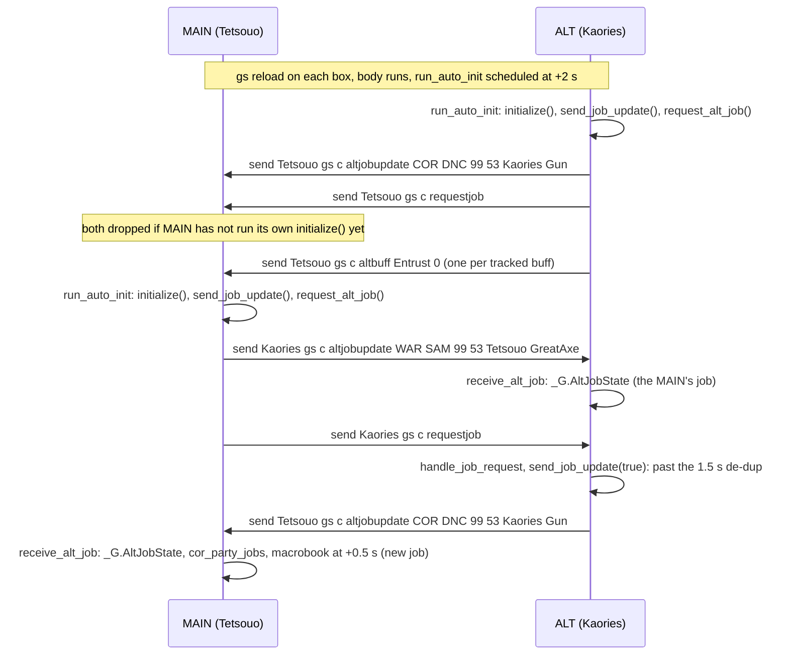
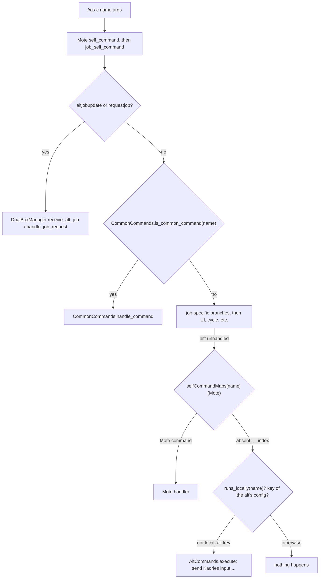

# Dual-box system (main/alt job exchange, alt commands, alt buff reporter, sync IPC)

The dual-box system connects two GearSwap instances running on the same machine: a
MAIN (Tetsouo) and an ALT (Kaories). It has four independent parts:

1. **Job exchange** (`dualbox_manager.lua`, `alt_states.lua`). About 2 s after every `gs reload`, each box sends
   its job, levels and main-hand weapon type to its partner and asks every other box of the group for theirs.
   Each stores its partner's job in `_G.AltJobState` and every box's report in `_G.AltStates`. On the MAIN that state drives the macrobook choice and the alt command set; on
   both it feeds the COR roll job bonus.
2. **Alt commands** (`alt_commands.lua` + `_common/dualbox/alt/*.lua`). A short `//gs c <name>` typed on
   the MAIN, when no command of the MAIN answers that name, becomes `send Kaories input /ma "Spell" <laststid>`. The command set comes from the
   ALT's current main job plus its subjob, and each spell tier is picked from the level the ALT reported.
3. **Alt buff reporter** (`alt_buff_reporter.lua`). The ALT reports a small list of tracked
   buffs (its `DUALBOX_CONFIG.lua` `tracked_buffs`; by default Entrust, Composure, Bolter's Roll) to the MAIN, and the MAIN keeps them in `_G.AltBuffState`
   so alt commands can re-target (GEO Indi- under Entrust).
4. **Sync IPC** (`dualbox_sync_ipc.lua`). This is a Windower-IPC side channel that replays
   `//gs c ls` and `//gs c rf` on the other characters of the box group. Every GearSwap instance of the
   machine receives the message; only a member of the sender's group (`AltGroup.get_alts()`) acts on it.

Parts 1 to 3 travel over the Windower **`send` addon** (`send <Name> gs c ...`) and arrive as
ordinary `//gs c` commands. Part 4 uses `windower.send_ipc_message` and an `ipc message` event.
On top of these, the **box group** (`alt_group.lua`, `dualbox_role.lua`, `alt_window.lua`) sends
orders to every other member (`//gs c alts`), swaps roles at runtime (`//gs c main`) and shows the
alts' state on the main, and **roll sharing** (`roll_share.lua`) shows a COR alt's roll results on the main.

Verified against the code on 2026-09-28 (config keys, buff list and sync filter on 2026-09-30). Functions are cited by name; line numbers only where
a name would not locate the spot (they move often in this folder).

## Files

| Path | Lines | Role |
|------|------:|------|
| `shared/utils/dualbox/dualbox_manager.lua` | 478 | Config load, job exchange protocol, `_G.AltJobState`, auto-init once per load |
| `shared/utils/dualbox/alt_states.lua` | 188 | Job, subjob and weapon type of every box of the group by name (`_G.AltStates`); `matches()` for keybind `alt` conditions; `watch_weapon()` reports a main-hand weapon type change; `on_weapon_change(key, fn)` is the shared listener behind it, also used by keybind entries with `weapon` (one packet hook per load, listeners on `_G._own_weapon_watch`) |
| `shared/utils/dualbox/alt_commands.lua` | 573 | Loads the alt's command configs, resolves tier/target, builds and sends `send <alt> input ...`; installs the `selfCommandMaps` fallback |
| `shared/utils/dualbox/alt_buff_reporter.lua` | 349 | ALT: report tracked buffs. MAIN: store them, guess/expire, trace log |
| `shared/utils/dualbox/dualbox_sync_ipc.lua` | 189 | Windower IPC broadcast/hook registry for `ls`/`rf` mirroring |
| `shared/utils/dualbox/alt_group.lua` | 477 | `//gs c alts`: orders to every other member of the box group (`sm on/off`, follow, `do <command>`, mirror, window); `route()` also dispatches `altreport`, `altmirror`, `altlead`, `main`, `setalt` |
| `shared/utils/dualbox/alt_window.lua` | 368 | Fixed-size overlay on the main: each alt (job, party, zone, Sneak / Invi time left from `StealthTimers`) and the Auto / Follow / Mirror / Step state |
| `shared/utils/dualbox/dualbox_role.lua` | 165 | `//gs c main` / `setalt`: switches the roles at runtime and saves them in `<Character>/saved/dualbox_role.lua` |
| `shared/utils/dualbox/roll_share.lua` | 110 | A COR alt's roll results and busts sent to the main (`gs c rollshow`) and shown there in the same format |
| `shared/utils/messages/formatters/system/message_altgroup.lua` + `data/systems/altgroup_messages.lua` | - | `[ALTS]` / `[DUALBOX]` lines of the box-group modules (including `not_ready`, `window_main_only`, `no_follower`) |
| `shared/utils/messages/formatters/ui/message_dualbox.lua` | 121 | Chat output for the job exchange (via `M.send('DUALBOX', ...)`) |
| `shared/utils/messages/data/systems/dualbox_messages.lua` | 164 | Message templates for the above |
| `shared/utils/messages/formatters/ui/message_alt_commands.lua` | 274 | Renders `//gs c altcmds` (grouped overview / filtered view, plus the names only `alt <name>` reaches) |
| `shared/data/alt/<JOB>_ALT_COMMANDS.lua` | 22 files, 45-435 | Generated command tables, one per job (BLM BLU BRD BST COR DNC DRG DRK GEO MNK NIN PLD PUP RDM RNG RUN SAM SCH SMN THF WAR WHM), the same for every character (moved out of the character folders on 2026-09-30) |
| `_master/config/alt/<JOB>_ALT_CUSTOM.lua` | 5 files | Hand-written overrides: BLM, GEO, RDM, SCH, SMN |
| `_master/config/alt/<JOB>_ALT_CUSTOM.lua.example` | 6 files | Commented templates: BLM, COR, GEO, RDM, SCH, WHM |
| `Tetsouo/_common/dualbox/alt/` (live, gitignored) | 5 files | Deployed copy of the 5 `_ALT_CUSTOM.lua` (only the `@author` line differs) |
| `<Character>/_common/dualbox/DUALBOX_CONFIG.lua` (live) | - | Role config, generated by `clone_character.py` (Tetsouo's is hand-written, identical to its overlay copy) |
| `_master/<Name>/config_global/DUALBOX_CONFIG.lua` (Tetsouo, Kaories overlays; untracked) | - | Overlay copies, always overwritten by the generated file on a clone (see Known issues) |
| `<Character>/saved/dualbox_role.lua`, `alt_state.lua`, `alt_window.lua` (live, written in game) | - | Saved role, last `alts` orders, window position/visibility. Kept across a re-clone (`KEPT_ON_RECLONE` in `clone_character.py`), except `dualbox_role.lua` |

Integration points outside the folder: `shared/utils/core/COMMON_COMMANDS.lua` (command routing),
`shared/utils/core/INIT_SYSTEMS.lua` (sync IPC block: hooks + listener), the 17
`shared/jobs/*/functions/*_COMMANDS.lua` (protocol commands), every entry file's `user_setup()`
and every `*_functions.lua` facade (module load), `shared/jobs/geo/functions/GEO_BUFFS.lua`
(buff reports), `shared/utils/macrobook/macrobook_manager.lua` `dualbox_config` (macro book per alt job),
`shared/jobs/cor/functions/logic/roll_party.lua` and `party_tracker.lua` (roll job bonus, party job cache),
`shared/utils/keybinds/keybind_manager.lua` (`alt` and `weapon` conditions on keys, through `alt_states.lua`).

How the config files were read for this page: every `*_ALT_CUSTOM.lua`, the GEO `.example`, and
`BLM_ALT_COMMANDS.lua` were read in full. The headers and samples of COR, GEO, BST, BLU and SMN
were read. Then all 27 command/custom files were loaded with `lua5.1` to count keys and fields
(numbers below).

## How it works

### Module load and auto-init (`dualbox_manager.lua`)

The module body schedules the auto-init. It runs when the module is `require`d without a cache hit,
which since the require cache is installed by `config_loader` (at the entry's file level) means
**once per load**:

- Every shared entry requires it at the end of `user_setup()` (e.g. `shared/entry/war.lua:255`). That is the first `require` of the load, so it executes the body.
- Every job facade requires it again (e.g. `shared/jobs/war/functions/war_functions.lua`); the job
  COMMANDS files require it to deliver `altjobupdate` / `requestjob`. Both are cache hits.
- On a subjob change Mote re-runs `user_setup()` in the old environment: also a cache hit, so the dying
  environment schedules no auto-init.

The body does this:

1. `windower._dualbox_init_counter += 1`, captures `my_init_counter`.
2. Schedules `run_auto_init(1)` after `INIT_FIRST_DELAY = 2` s.

`run_auto_init(attempt)`:

1. Aborts if another body ran since it was scheduled (`my_init_counter ~= windower._dualbox_init_counter`).
   This also stops a chain left over from a previous `user_env`, because coroutines survive `gs reload` and `windower` is shared.
2. Retries every `INIT_RETRY_DELAY = 1` s, at most `INIT_MAX_ATTEMPTS = 8` attempts, while `player.name` is missing.
3. Runs at most once per load: compares `windower._gs_reload_count` (incremented by every INIT_SYSTEMS
   run) to `windower._dualbox_init_last_reload`.
4. Calls `DualBoxManager.initialize()`, which loads `<player.name>/config/DUALBOX_CONFIG` into
   `_G.DualBoxConfig`, applies the saved role over it (`DualBoxRole.apply_saved`) and creates an empty
   `_G.AltJobState`. If the config is missing, it installs disabled defaults and prints a warning.
5. Returns unless the role is `main` or `alt`.
6. Both roles call `send_job_update()` and `request_alt_job()`: the reload wiped this box's copy of the
   other box's job, and the other box may have dropped this box's earlier send. Then
   `AltStates.watch_weapon(send_job_update)` so a main-hand weapon type change is reported too.
7. The **ALT** role also calls `AltBuffReporter.report_all()`.
8. Both roles call `AltWindow.start()` (the window shows itself on the main only) and
   `AltGroup.request_report()` (asks every box's automation addon for its state; reports sent during
   the reload were lost). Skipped when `DUALBOX_CONFIG.lua` sets `report_on_load = false`.

Until step 4 runs, `_G.DualBoxConfig` is nil. This window lasts 2 s at minimum after every reload. During it:

- `receive_alt_job` returns without storing.
- `handle_job_request` returns without answering.
- Alt commands are not recognised (`get_alt_name` in `alt_commands.lua`).
- `AltBuffReporter.report` sends nothing.
- `//gs c alts ...` and `//gs c main` print "Dual-box not initialised yet" (`not_ready`) instead of
  "No alt set". `//gs c setalt` received in this window still saves the role file; `initialize` applies it 2 s later.

### Job exchange protocol

| Wire command (sent via `send`) | Sender | When | Handler on receiver |
|---|---|---|---|
| `send <other> gs c altjobupdate <JOB>  <mlvl> <slvl> <sender> <weapon>` | either box, `send_job_update` | Auto-init of either box. Reply to `requestjob` (forced past the de-dup). When the main hand changes weapon type (`AltStates.watch_weapon`, packet 0x050 slot 0, read 0.5 s later); `<weapon>` is the skill name without spaces (`Sword`, `GreatKatana`, `None`), part of the de-dup payload. | Every job COMMANDS file (22), e.g. `WAR_COMMANDS.lua:91-98`, calls `receive_alt_job(cmdParams[2..7])` |
| `send <each other box> gs c requestjob` | either box, `request_alt_job` (every member of `AltGroup.get_alts()`, the partner alone when there is no group) | Auto-init of either box, `DualBoxRole` resync | Every job COMMANDS file, e.g. `WAR_COMMANDS.lua:103-108`, calls `handle_job_request`, which answers on either role with `send_job_update(true)` |
| `send <main> gs c altbuff <Buff Name> <0\|1>` | ALT, `AltBuffReporter.report` | GEO `job_buff_change`. `report_all` at ALT auto-init and on `altbuffsync` | `CommonCommands.handle_command` (`altbuff`) calls `AltBuffReporter.receive` |
| `send <alt> gs c altbuffsync` | MAIN, `request_sync` | `//gs c altsync`, or `sync_after` seconds after an alt command that declares it | `CommonCommands.handle_command` (`altbuffsync`) calls `report_all` (sends only on the ALT) |
| `send <other boxes> gs c altlead <leader\|off>` | the box that changed the follow, `AltGroup` `follow` | `//gs c alts follow` | `AltGroup.receive_lead` updates the saved follow state |
| `send <main> gs c rollshow <result\|bust> <caster> <fields...>` | COR alt, `RollShare.result` / `bust` | a roll result or bust on the alt | `RollShare.receive` on the main |
| `send <alt> input /ma "Name" <token>` (steps joined by `; wait N; `) | MAIN, `AltCommands.execute` | Player types an alt command | The `send` addon on the ALT's client. GearSwap is not involved on that side |
| `send <other> gs c setalt <me>` | the box that typed `//gs c main`, `DualBoxRole.become_main` | `//gs c main` | `AltGroup.route` -> `DualBoxRole.become_alt` |

Details of `send_job_update(force)`:

- **Role.** It has no role guard: both boxes call it at auto-init, and `handle_job_request` calls it on
  either role. It returns when dual-boxing is disabled or `player.main_job` is not known yet.
- **Payload.** `main_job/sub_job/main_level/sub_level/weapon`, with `sub_job` set to `"NON"` when there is
  no subjob and `weapon` from `AltStates.weapon_skill()` (`None` on error). The wire command appends the
  sender's name (`player.name`) and the weapon as fifth and sixth arguments; a receiver that reads fewer
  fields is unaffected.
- **De-dup.** An identical payload sent less than `SEND_DEDUP_WINDOW = 1.5` s ago is dropped, unless
  `force` is true. The last payload and time are stored on `windower._dualbox_last_send_payload/_time`, so
  the window survives `gs reload`. It is recorded only after a real send. A reply to `requestjob` is
  always forced: the asker has nothing, and this box's previous send of the same payload may have
  landed before the asker had initialised (and been dropped).
- **Target.** `get_target_character()`: `main_character` (fallback `alt_name`) for the ALT, and
  `alt_character` (fallback `alt_name`) for the MAIN.

`receive_alt_job(main_job, sub_job, main_level, sub_level, sender, weapon)` does the following on either box:

- It returns when dual-boxing is disabled or `main_job` is empty. An empty `weapon` becomes nil.
- A `sender` that is set and is not `get_target_character()` (case-insensitive) is recorded in
  `alt_states.lua` (`AltStates.record`) and goes no further, so in a group of three only the tracked
  partner writes `_G.AltJobState`. A nil or empty sender (older messages) is accepted as the partner.
- It notes whether the job or subjob differs from the stored `_G.AltJobState` (levels and weapon are
  not compared).
- It replaces `_G.AltJobState` with `{job, subjob, main_level, sub_level, weapon, last_update=os.time(), online=true}`.
  Missing levels become `0`.
- It records the update in `alt_states.lua` too (after `_G.AltJobState`, so keys that refresh on it see
  the new value); a change of job, subjob or weapon there calls `KeybindManager.refresh_active()`.
- It redraws the alt window (`AltWindow.refresh`).
- It overwrites `main_job`/`sub_job`/`timestamp` of the matching `_G.cor_party_jobs` entry by name.
  That entry is otherwise refreshed only from 0xDD packets.
- If the job and subjob are the ones it already held, it stops there, silently. Both boxes send
  at every reload, so most updates are such repeats.
- Otherwise it prints `show_job_update_received` and schedules `select_default_macro_book()` after
  0.5 s, on the ALT too (Kaories' configs have no `dualbox` table, so the ALT re-applies its
  solo book). The macrobook factory then reads `DualBoxManager.get_alt_job()` and picks
  `MACROBOOKS.dualbox[alt_job][own_sub]` (`dualbox_config` in `macrobook_manager.lua`).

The first update after this box's own reload always counts as new, because `initialize()` recreated an
empty `_G.AltJobState`. A reload of one box therefore re-selects the macro book on that box only; the
other box, which already held the same job, stores the push silently.

```mermaid
sequenceDiagram
    participant M as MAIN (Tetsouo)
    participant A as ALT (Kaories)
    Note over M,A: gs reload on each box, body runs, run_auto_init scheduled at +2 s
    A->>A: run_auto_init: initialize(), send_job_update(), request_alt_job()
    A->>M: send Tetsouo gs c altjobupdate COR DNC 99 53 Kaories Gun
    A->>M: send Tetsouo gs c requestjob
    Note over M: both dropped if MAIN has not run its own initialize() yet
    A->>M: send Tetsouo gs c altbuff Entrust 0 (one per tracked buff)
    M->>M: run_auto_init: initialize(), send_job_update(), request_alt_job()
    M->>A: send Kaories gs c altjobupdate WAR SAM 99 53 Tetsouo GreatAxe
    A->>A: receive_alt_job: _G.AltJobState (the MAIN's job)
    M->>A: send Kaories gs c requestjob
    A->>A: handle_job_request, send_job_update(true): past the 1.5 s de-dup
    A->>M: send Tetsouo gs c altjobupdate COR DNC 99 53 Kaories Gun
    M->>M: receive_alt_job: _G.AltJobState, cor_party_jobs, macrobook at +0.5 s (new job)
```

### Alt command routing

```mermaid
flowchart TD
    A["//gs c name args"] --> B["Mote self_command, then job_self_command"]
    B --> C{"altjobupdate or requestjob?"}
    C -- yes --> D["DualBoxManager.receive_alt_job / handle_job_request"]
    C -- no --> E{"CommonCommands.is_common_command(name)"}
    E -- yes --> F["CommonCommands.handle_command"]
    E -- no --> H["job-specific branches, then UI, cycle, etc."]
    H -- "left unhandled" --> I{"selfCommandMaps[name] (Mote)"}
    I -- "Mote command" --> J["Mote handler"]
    I -- "absent: __index" --> K{"runs_locally(name)? key of the alt's config?"}
    K -- "not local, alt key" --> G["AltCommands.execute: send Kaories input ..."]
    K -- otherwise --> L["nothing happens"]
```

- Every job `job_self_command` checks `CommonCommands.is_common_command(command)` **before** its
  job-specific branches (e.g. `WAR_COMMANDS.lua:113`, `BLM_COMMANDS.lua:277`).
  `CommonCommands.is_common_command` knows only built-in names and warp aliases; it does
  not look at the alt's config.
- The alt's keys are Mote's last lookup. When `COMMON_COMMANDS` is loaded (once per job-file load, on the
  first command that requires it) it calls `AltCommands.install_fallback(selfCommandMaps,
  CommonCommands.runs_locally)` (end of `COMMON_COMMANDS.lua`, `AltCommands.install_fallback`), which sets an
  `__index` on Mote's `selfCommandMaps`. Mote reads that table only when `job_self_command` left the
  command unhandled (`Mote-SelfCommands.lua:26-35`), and `__index` runs only for names the table lacks.
- The `__index` answers only when `CommonCommands.runs_locally(name)` is false (common
  names, warp aliases, Mote's own keys) and `is_alt_command(name)` is true; it then returns a function that
  calls `AltCommands.execute(name, args)`.
- The result: a job command, a common command and a Mote command all keep their names; a bare alt key
  works only for names nothing on the MAIN answers. `//gs c alt <name>` always reaches the alt. RDM's
  cast-by-name catch-all leaves a name unhandled when `selfCommandMaps` answers it (`RDM_COMMANDS.lua:396-399`). See
  [commands and debug](commands-and-debug.md#4-alt-commands-and-name-shadowing) for the names that collide
  today.

`AltCommands.execute(cmd, args)` runs these steps:

1. It resolves `alt = get_alt_name()`. This is nil unless `DualBoxConfig.enabled` and `role == 'main'`.
2. It calls `load_config()`, described below; no config prints an error and returns false.
3. It resolves the entry's default token: `token_for(entry.target or 'lastst')`.
4. It builds the command with `build_command`. Each step (the entry itself, or each element of
   `entry.chain`) becomes `send <alt> input <verb> "<name>" <token>` (`build_action` / `build_step`), and the steps are joined with `'; wait ' .. (entry.step_delay or 2) .. '; '`. Each step
   carries its own `send`, so the `wait` and later steps run on the MAIN's console.
5. It calls `send_command(command)`. In the GearSwap sandbox this is `send_cmd_user`, which prefixes `@`
   (`GearSwap/user_functions.lua:247-252`).
6. It writes a trace line if `altdebug` is on (`trace_sent`).
7. It applies the entry's buff effects (`apply_buff_effects`).

Token resolution (`AltCommands.token_for`):

- A function target is evaluated at command time under `pcall`.
- `me`/`pet` are sent literally (`<me>`, `<pet>`), so the ALT resolves them to itself (`ALT_SIDE_TARGETS`).
- `lastst`, `t`, `bt`, `ft`, `scan` become `<lastst id>` style tokens (`<laststid>`, `<tid>`, ...). The `send` addon rewrites
  these to numeric ids on the MAIN's client (`SHARED_TARGETS`).
- Any other value as the entry's `target` makes `execute` print an error. An unknown `target` on a
  `chain` step silently falls back to the entry's token (`build_step`).

Name resolution (`resolve_name`) has three cases:

- `spell` is a function: `pcall(spell, args)`.
- `spell_from_state`: `tostring(state[<name>].value)` read from the **MAIN's** Mote state, or `fallback`
  when that state is absent.
- Otherwise `spell` is used as is.

### Config loading (`load_config` / `load_job_config`)

The generated `<JOB>_ALT_COMMANDS` table is read from `shared/data/alt/` for every character; only
when that require fails does `load_job_config` look in the character's alt folder
(`CharPaths.load('alt', ...)`: `_common/dualbox/alt/`, then the older `common/...` and `config/alt/`), where a
folder cloned before 2026-09-30 still has its own copy. `<JOB>_ALT_CUSTOM` is read from the character's
alt folder, with `_master/config/alt/` as fallback: a character without `_common/dualbox/alt/` (one that
became main with `//gs c main` and never had alt configs) gets the `_master` custom commands
(`entrusthaste`, `compass`...). `Tetsouo/_common/dualbox/alt/*_ALT_CUSTOM.lua` are
identical to `_master`, so nothing changes for Tetsouo.

`load_config()`:

- It reads `_G.AltJobState` directly (`get_alt_jobs`) and deliberately bypasses the 30 s
  `is_alt_online()` timeout (comment above `get_alt_jobs`).
- It caches one result per key `job/subjob/main_level/sub_level` in the module-local `cache`. A cached `nil` is also kept.
- It loads the subjob first, then the main job, so the main job wins name clashes.

`load_job_config(job, level, source)`:

1. It returns nil for `nil`, `''` or `'NON'`.
2. It requires `shared/data/alt/<JOB>_ALT_COMMANDS` under `pcall`, and the file must return
   `{commands = {...}}`; when it does not, `CharPaths.load('alt', '<JOB>_ALT_COMMANDS')` in the
   character's folder. Nothing found: `nil`.
3. It copies `loaded.commands` into `merged`, then overlays `<JOB>_ALT_CUSTOM.commands` (`false`
   removes a name) and remembers `custom.refine` if it is a function.
4. It filters each merged entry:
   - `tiers`: `tier_for_level` picks the highest tier with `level <= level`. The entry is then
     copied with `spell` set and `tiers` removed. If no tier is reachable, the entry is dropped.
   - otherwise, if `entry.level > level`, the entry is dropped.
   - `main_only` entries are dropped when loaded as the subjob .
   - `refine(copy, name)` runs under `pcall`. Returning `false` drops the entry, a table replaces it, and
     anything else keeps the edited copy. A refine error keeps the entry unchanged.
   - It stamps `entry.source` (`'main'`/`'sub'`) and `entry.source_job`, then stores the entry under
     `name:lower()`. Entries not copied by tiers/refine are the tables returned by `require`,
     mutated in place.

A reported level of `0` (older two-argument payload) drops every entry that has a `level` or `tiers`.

### Alt buff reporter

**On the ALT:**

- The tracked buffs are the ALT's `DualBoxConfig.tracked_buffs` list, or `DEFAULT_TRACKED` when it is
  not a table (`Entrust`, `Composure`, `Bolter's Roll`). `tracked()` rebuilds them at each call, keyed
  by lowercase name, so the match ignores case.
- `report(buff, gained)` only sends for a tracked buff, and only when role is `alt` and dual-boxing is enabled.
- It sends `send <main> gs c altbuff <Buff Name> <1|0>` without quotes, because Mote does not strip
  quotes.
- The only live-event caller is `GEO_BUFFS.lua:36`. `report_all()` sends every
  tracked buff, up or down, under the name as written in the list. It runs at ALT auto-init (`run_auto_init`), after a
  received `setalt`, and on
  `//gs c altbuffsync`.

**On the MAIN:**

- `receive(args)` (`:220`) treats the last word as the value (`'1'`/`'true'` means up) and joins the rest as
  the buff name, stripping `"` and lowercasing it.
- It writes `_G.AltBuffState[buff]` (keys always lowercase: `receive`, `assume`, `consume` and `active`
  all lowercase the name, so a `tracked_buffs` entry written in any case still matches), clears any `_G.AltBuffExpiry[buff]`, and sets
  `windower._alt_buff_reporting = true`. That flag persists until `//lua reload gearswap`.
- `assume(buff, seconds)` (`:291`) records a guess with an `os.clock()` expiry. It is used **only
  while** `windower._alt_buff_reporting` is not set. It is called from alt commands that declare `sets_alt_buff`.
- `consume(buff)` (`:314`) clears a buff.
- `active(buff)` (`:332`) honours the expiry and clears expired guesses.

GEO uses this in `_master/config/alt/GEO_ALT_CUSTOM.lua` (`indi_target` and `M.refine`): `refine` replaces the `me` target of
every command whose name starts with `indi` by a function returning `'lastst'` while
`AltBuffReporter.active('Entrust')`. `altentrust` declares `sets_alt_buff = 'Entrust'`,
`alt_buff_duration = 60` and `sync_after = 3`. The comment there, recorded as verified in game,
states that FFXI fires `buff_change` for Entrust only on loss. The 3 s resync is how the MAIN learns of the gain.

**Tracing:**

- `//gs c altdebug` toggles `windower._alt_buff_debug` (`toggle_debug`, `:88`). It truncates and writes a header to
  `<Character>/logs/dualbox/altbuff.log` (`log_path`, through `CharPaths.log`).
- While on, `trace()` (`:61`) prints through `MessageFormatter.show_debug('ALTBUFF', ...)` and appends
  `[HH:MM:SS] msg` to that file.
- The ALT side logs every `buff_change`, including untracked ones. The MAIN side logs every
  alt-command send (`trace_sent`, `alt_commands.lua:43`), every receive, and every assume/refusal.
- `*.log` is gitignored.

### Sync IPC (`dualbox_sync_ipc.lua`)

- **Hooks.** INIT_SYSTEMS (sync IPC block) registers four hooks on every load: `ls` and `lockstyle` call
  `select_default_lockstyle()`, and `rf` and `refill` call `RefillManager.refill()`. It then calls
  `SyncIPC.init_listener()`.
- **Broadcast.** `broadcast(cmd)` is called only from `CommonCommands.handle_refill`
  (`'rf'`) and `handle_lockstyle` (`'ls'`). It sends
  `tetsouo_sync_<cmd> <sender name>` if a hook with that name exists locally, and records it on
  `windower._sync_ipc_last_sent(_time)` for self-echo suppression.
- **Receive.** `_on_ipc_message` ignores other prefixes. It then drops self-echo within
  `BROADCAST_TTL = 1.5` s, then any message whose sender is not in this box's `AltGroup.get_alts()`
  (`from_group`, case-insensitive; empty sender or dual-box disabled: refused), then duplicates within
  `IPC_DEBOUNCE = 1.0` s, and runs the hook under `pcall`. The group check comes before the debounce, so
  a refused message does not hold back the same order from a member of the group.
  The receiving side calls the hook directly, never `handle_lockstyle`, so there is no re-broadcast loop.
- **Scope.** Windower IPC reaches every other instance of the GearSwap addon on the machine; a window
  outside the group (or with dual-box disabled) receives the message and ignores it.

### Every box's job and weapon (`alt_states.lua`)

`_G.AltJobState` holds the tracked partner only. `alt_states.lua` keeps what every box of the group last
reported, by name (`_G.AltStates[name:lower()] = {name, job, subjob, weapon, last_update}`), so a main with
several alts can key binds on each (`alt` field, see [keybinds-and-custom.md](keybinds-and-custom.md)). A new
job, subjob or weapon type calls `KeybindManager.refresh_active()`. Lost on reload like `_G.AltJobState`,
refilled by the `requestjob` sent to every box at auto-init.

Sending side: `on_weapon_change(key, listener)` registers one raw `incoming chunk` hook per load (state on
`_G._own_weapon_watch`, shared by two module instances), watches packet 0x050 for the main slot, and 0.5 s
later (the item list lags the packet) compares `weapon_skill()` with the last value and calls every
listener under `pcall`. Two listeners exist: `dualbox` (`watch_weapon`, sends `altjobupdate`) and `keybinds`
(`KeybindManager`, keys with a `weapon` rule).

### Box group and role switch (`alt_group.lua`, `dualbox_role.lua`)

- **Group.** `DualBoxConfig.group = {"Tetsouo", "Kaories"}` in both configs; `clone_character.py`
  now writes it when dual-boxing is enabled (`_create_dualbox_config`, fixed 2026-09-25). Without it,
  the group is this character plus `alt_character(s)` / `main_character`. Two functions compute
  "the other members": `AltGroup.get_alts()` (role-aware fallback, respects `enabled`) and the local
  `others()` of `dualbox_role.lua` (ignores `enabled`); see Known issues.
- **`//gs c alts <on|off|toggle|follow [name|off]|do <command>|mirror>`**, from either box: sends
  `send <name> sm ...` (or the `do` command as typed) to every other member of the group, so it does
  not depend on the role. `follow <name>` leaves that character out (it cannot follow itself); when that leaves nobody
  (two boxes, told to follow the other one) it prints `no_follower`, sends nothing and keeps the
  saved state (fixed 2026-09-25).
  `follow` alone (Alt+Numpad7) makes the box that sends it the leader (2026-09-27): unless every
  other member already follows it (then the follow stops), it sends `sm follow off` to its own
  addon when its last `altreport` shows it following someone (or when no report is known), then
  `sm follow <me>` to the others. Pressing it on the follower of the last leader therefore turns the
  follow around instead of leaving two boxes following each other. Who follows whom is read from the
  addon's reports (`leader_of`), the saved state standing in for an alt no report speaks for.
  Every follow change also sends `gs c altlead <leader|off>` to the other boxes (`receive_lead`), which
  set their saved state to it: without the addon's reports (a box without the StateReport patch) the old
  leader's record would still say its alts follow it, and its next press would stop the follow instead of
  taking the lead.
  `mirror` runs `sm mirror` locally. The on/follow/mirror state starts as the last order sent, kept on
  `windower._alt_group` and saved in `alt_state.lua`; `//gs c sortie` records its own through
  `AltGroup.note`. When the addon reports its real state (next point), the reports overwrite it, so an
  order sent another way shows too. `alts window` toggles the alt window.
  With no other member it prints `no_alts`, or `not_ready` while `_G.DualBoxConfig` is still nil.
- **`//gs c main`** on the character that becomes main (`DualBoxRole.become_main`):
  `not_ready` while the config is nil, `no_alts` when disabled or alone; otherwise sets `role='main'`,
  `alt_characters` / `alt_character` = the other members, saves its own role file, **also writes each
  alt's `<alt>/saved/dualbox_role.lua` = `{role='alt', names={me}}`** (fixed 2026-09-25: an alt offline
  or still loading missed the `setalt` and came back as a second main; on another PC the folder is
  missing and `io.open` fails silently), sends `gs c setalt <me>` to each, then resyncs
  (`send_job_update(true)` + `request_alt_job()`) and redraws the window.
- **`//gs c setalt <main>`** (received, `DualBoxRole.become_alt`): saves `role='alt'` first, even when
  `_G.DualBoxConfig` is still nil (then `initialize` applies it); otherwise also `main_character=<main>`,
  resyncs the job and `AltBuffReporter.report_all()`.
- **Persistence.** `<Character>/saved/dualbox_role.lua` (`{role = ..., names = {...}}`) is applied
  over `DUALBOX_CONFIG.lua` by `DualBoxManager.initialize` right after the require, so it survives a
  reload and a game restart. Deleting the file restores the config file's role.
- **Real state from the automation addon** (2026-09-26). GearSwap cannot read another addon's
  variables, and the addon broadcasts nothing about its state. A local addition to the addon,
  `addons/Silmaril/lib/StateReport.lua` plus one `require 'lib./StateReport'` line at the end of
  `Silmaril.lua` (outside this repository; put back after an addon update), polls every 0.5 s the
  addon's getters (`get_enabled`, `get_following` / `get_fast_follow_target`, `get_mirror_on`) and on
  a change sends `send @all gs c altreport <name> <on|off> <leader|off> <on|off>`. Polling, not
  wrapped setters: `Mirror.lua` turns `mirror_on` off after a single mirror by writing the local
  directly. Every frame (`prerender`) it compares `get_mirroring()` / `get_injecting()`,
  `get_mirroring_state()` and `get_mirror_target()` and sends `altmirror <name> phase <step> <npc>`
  (`-` when idle, spaces as `_`); it wraps the global `mirror_results` (looked up at each call by
  `Connection.lua`) to send `altmirror <name> results <Name,Status|...>`. It also replaces the
  addon's three text boxes with a table that draws nothing (`set_sm_window` / `set_npc_window` /
  `set_result_window`, `HIDE_ADDON_BOXES`). `//sm report` resends the state.
  The character's name is read once through `get_player()` and kept in a local, cleared by the
  `login` / `logout` events (2026-09-27): `get_player()` builds a large table
  and the mirror check runs every frame. A copy of the patched file and its README live in this
  repository under `scripts/addon_patches/silmaril/`, so an addon update can be patched again from it.
  On the GearSwap side, `AltGroup.receive_report` keeps each box's report in
  `windower._alt_reports` and ignores boxes outside the group: Auto ON if any alt is on, Follow =
  the first alt's leader, Mirror ON if any box, this one included, has it (a mirror request starts
  on the box that sends it). `receive_mirror` keeps steps and results in
  `windower._alt_mirror` (results shown 8 s, a step never cleared dropped after 120 s).
  `request_report` sends `sm report` here and to each alt at every load
  (`run_auto_init`), since reports sent during a reload are lost; `report_on_load = false` in
  `DUALBOX_CONFIG.lua` stops it (nothing is sent either when the box has no alt). Each report writes an
  `ALTS` line to `trace.log`. Tested offline with stubs; in game, Auto/Follow/Mirror reports were
  seen in the trace on 2026-09-26.
- **Alt window after a reload** (2026-09-27): GearSwap destroys the old load's texts while that load's
  5 s refresh loop (and the stealth loop that redraws the window) can still run until the new load
  bumps the generation. Every access goes through `live_display()`: a destroyed object (its `visible`
  raises, the "libs/texts.lua:353 attempt to index field '?'" a player saw on reload) marks the load
  dead (`_G._alt_window_dead`), and from then on `refresh`, `is_shown`, the drag check and the loop do
  nothing, so no stray window is created by the dead load either.
- **Alt window** (`alt_window.lua`): drawn on the main only, at a fixed size: every line is
  `LABEL_WIDTH + 1 + VALUE_WIDTH` characters, padded with spaces and cut when longer, and
  the rows never change (`-` when empty), so the box does not resize. Per alt: its name as the title,
  Job (from `_G.AltJobState`, last one received), Party and Zone from the party list (`get_party`,
  `presence`; `no party` when absent) - not `is_alt_online()`, whose 30 s timeout reads a
  quiet alt as offline because the job exchange only speaks at a load or a job change. Since
  2026-09-26 each alt block ends with a Sneak and an Invi row (`stealth_lines`: `StealthTimers.left`, `m:ss` green, yellow under 60 s, `-` when unknown; the stealth
  loop redraws the window every second while a timer runs, see [stealth.md](stealth.md)). Then Auto,
  Follow, Mirror (with the NPC of a running mirror) and Step (the latest mirror step, packet codes
  dropped, then the results, `OK` in green) from `AltGroup.state()` / `mirror_progress()`
  (`?` until known; saved in `<Character>/saved/alt_state.lua`
  with `time = os.time()`; `load_state` ignores a file older than the game process (`os.time() - time >
  os.clock() + 1`) and a file without `time`, so the state survives a GearSwap reload but not a game
  restart - fixed 2026-09-25, the old file had no stamp). While it is on screen (`AltWindow.is_shown`), the Auto / Follow / Mirror
  orders print nothing in chat. Redrawn on every order, job update and role switch, and every 5 s
  (loop stopped by `windower._alt_window_gen` when a newer load starts). Position and
  visibility in `<Character>/saved/alt_window.lua` (default `x = 1600, y = 120`, `DEFAULT`).
  `//gs c alts window` on a box that is not main prints `window_main_only` and changes nothing
  (fixed 2026-09-25). a drag is saved by the 5 s loop, not a
  `mouse` event: an event registered from a job file runs GearSwap's `refresh_globals` +
  `equip_sets` on every call, which made dragging lag.
- **Not role-aware:** `//gs c sortie` sends to the `alt` named in the character's `_common/combat/SORTIE_CONFIG.lua` (Tetsouo's: Kaories and her Silmaril profiles), not to `DualBoxConfig`. A character without that file has no sortie command ([commands-and-debug](commands-and-debug.md#sortie-config)).

### COR rolls on the main (`roll_share.lua`, 2026-09-27)

When the box is an alt (`DualBoxConfig.role == 'alt'`) playing COR, `RollTracker.display_roll_result` and the bust display call `RollShare.result` / `RollShare.bust` (`roll_display.lua` and `roll_tracker.lua`, one line each, in a pcall) after showing the message locally. They send `send <main_character> gs c rollshow <result|bust> <caster> <fields...>`, each field hex-encoded (roll names hold spaces and apostrophes; an empty field is `-`). Nothing is sent when the box is not an alt or when the main has not reported its job through `alt_states.lua` (a main on another GearSwap would get an unknown command). The main's common command `rollshow` (`COMMON_COMMANDS.lua`) decodes the fields and calls `RollMessages.show_roll_result` / `show_roll_bust` with a last `source` argument ("Kaories COR"), which replaces the job tag: same lines, same colors, the caster in brackets, shown even with the job tag off. Double-Ups are roll results and are sent too; the party coverage and missed names are the COR's own count. The receiving box shows them in its `rolls.remote_style` (UI_CONFIG, `//gs c ui rollremote`; `same` = its own `rolls.style`, `off` = not shown, busts included).

## Public API

### `DualBoxManager` (`require('shared/utils/dualbox/dualbox_manager')`, not exported to `_G`)

| Function | Effect | Callers |
|---|---|---|
| `initialize(config?)` | Loads `_G.DualBoxConfig` once per env, applies `dualbox_role.lua`. Optional table overrides keys. Creates `_G.AltJobState` | `run_auto_init` only (no caller passes `config`) |
| `send_job_update(force?)` | Sends `altjobupdate` (with the sender's name and weapon) to the tracked partner, de-duplicated 1.5 s unless `force` | `run_auto_init` (both roles), the weapon watch, `handle_job_request` (forced), `DualBoxRole` resync |
| `handle_job_request()` | Either role: calls `send_job_update(true)` | 22 job COMMANDS on `requestjob` |
| `request_alt_job()` | Either role: sends `requestjob` to every other box of `AltGroup.get_alts()` (the partner alone when that list is empty) | `run_auto_init` (both roles), `DualBoxRole` resync |
| `receive_alt_job(job, sub, mlvl, slvl, sender, weapon)` | Records every sender in `alt_states.lua`; a box other than the tracked partner goes no further. Stores `_G.AltJobState` (with `weapon`), patches `_G.cor_party_jobs`, redraws the window; for a new job or subjob only, prints and reselects the macro book | 22 job COMMANDS on `altjobupdate` |
| `is_alt_online()` | True if `AltJobState.online` and last update within `DualBoxConfig.timeout` (default 30 s). Sets `online=false` once expired | `macrobook_manager.lua` `dualbox_config`, `get_alt_job` |
| `get_alt_job()` | Alt job or nil when offline | `macrobook_manager.lua` `dualbox_config` |

`get_alt_subjob`, `mark_alt_offline`, `get_time_since_update` and `show_status` were removed on 2026-09-28 (no caller anywhere, live folders included). The alt's subjob stays in `_G.AltJobState.subjob`, which nothing reads today.

### `AltStates` (`require('shared/utils/dualbox/alt_states')`; data on `_G.AltStates`)

| Function | Effect | Callers |
|---|---|---|
| `weapon_skill()` | Skill name of this character's main-hand weapon without spaces (`Sword`, `GreatKatana`), `None` when empty | `send_job_update`, `own_weapon_matches`, `KeybindManager` |
| `on_weapon_change(key, fn)` | Registers `fn` under `key`; installs the one 0x050 hook of the load | `watch_weapon`, `KeybindManager` (`watch_own_weapon`) |
| `watch_weapon(report)` | `on_weapon_change('dualbox', report)` | `run_auto_init` |
| `own_weapon_matches(rule, skill?)` | `rule` (string or list) names the skill, spaces and case ignored | `KeybindManager` (`wields`) |
| `record(sender, job, subjob, weapon)` | Stores a box's report; a change refreshes the keys | `receive_alt_job` |
| `get(name?)` | A box's last report; nil name = `_G.AltJobState` | `matches`, `roll_share.lua` |
| `matches(condition)` | `{name?, job?, subjob?, weapon?}` all hold for that box (false when nothing is known) | `KeybindManager` (`applies`) |

### `RollShare` (`require('shared/utils/dualbox/roll_share')`)

| Function | Effect | Callers |
|---|---|---|
| `result(roll_name, value_display, bonus_display, is_crooked, affected_count, total_count, ...)` | On a COR alt whose main has reported (`AltStates.get(main)`), sends `rollshow result ...` with hex-encoded fields | `roll_display.lua` `display_roll_result` |
| `bust(roll_name, bust_effect, effect_type)` | Same for a bust | `roll_tracker.lua` `handle_bust` |
| `receive(args)` | On the main: decodes and calls `RollMessages.show_roll_result` / `show_roll_bust` with the caster as `source`; returns true (handled, since 2026-09-28) | `CommonCommands.handle_command` (`rollshow`) |

### `AltCommands` (`_G.AltCommands`, returned)

| Function | Effect | Callers |
|---|---|---|
| `is_alt_command(cmd)` | True if the MAIN role is active and `cmd:lower()` is in the current merged config | the `selfCommandMaps` `__index` |
| `execute(cmd, args)` | Build and send. Returns true if sent. Silent `false` if `cmd` is unknown | `handle`, the `__index` function |
| `handle(cmd, args, runs_locally?)` | `altcmds`/`altlist` list, `alt` with no args lists, `alt <name> ...` executes with every extra word | `CommonCommands.handle_alt_command` |
| `install_fallback(maps, runs_locally?)` | Sets an `__index` on Mote's `selfCommandMaps` that runs an alt key nothing local answers. Does nothing if `maps` is not a table or already has a metatable | end of `COMMON_COMMANDS.lua`, at module load |
| `list(filter?, runs_locally?)` | Splits the names into bare-reachable and `runs_locally` ones, calls `MessageAltCommands.show_list` | `handle` |
| `token_for(target)` | Target to wire token | internal (public for tests) |
| `clear_cache()` | Resets the config cache | none |

### `AltBuffReporter` (`_G.AltBuffReporter`, returned)

| Function | Side | Callers |
|---|---|---|
| `report(buff, gained)` | ALT | `GEO_BUFFS.lua` `job_buff_change`, `report_all` |
| `report_all()` | ALT | `run_auto_init`, `COMMON_COMMANDS.lua` `altbuffsync`, `DualBoxRole` resync |
| `request_sync()` | MAIN | `COMMON_COMMANDS.lua` `altsync`, `apply_buff_effects` in `alt_commands.lua` |
| `receive(args)` | MAIN | `COMMON_COMMANDS.lua` `altbuff` |
| `assume(buff, seconds)` / `consume(buff)` | MAIN | `apply_buff_effects` in `alt_commands.lua` |
| `active(buff)` | MAIN | `GEO_ALT_CUSTOM.lua` `indi_target` |
| `show_state()` | MAIN | `COMMON_COMMANDS.lua` `altbuffs` |
| `toggle_debug()` / `trace(msg)` | both | `COMMON_COMMANDS.lua` `altdebug`, `trace_sent` in `alt_commands.lua` |

### `DualBoxSyncIPC` (`require('shared/utils/dualbox/dualbox_sync_ipc')`)

| Function | Effect | Callers |
|---|---|---|
| `register_hook(cmd, fn)` | `_G.DUALBOX_SYNC_HOOKS[cmd:lower()] = fn` | INIT_SYSTEMS sync IPC block |
| `broadcast(cmd)` | Sends `tetsouo_sync_<cmd> <player.name>` via Windower IPC | `CommonCommands.handle_refill`, `handle_lockstyle` |
| `_on_ipc_message(msg)` | Listener body: self-echo, group filter, debounce, hook | registered by `init_listener` |
| `init_listener()` | Unregisters `windower._sync_ipc_event_id` (pcall) only if it was registered in this same load (`windower._sync_ipc_event_load == windower._gs_reload_count`), registers `ipc message`, stores id and load | INIT_SYSTEMS sync IPC block |

### `AltGroup`, `DualBoxRole`, `AltWindow`

| Function | Effect | Callers |
|---|---|---|
| `AltGroup.route(cmd, args)` | `alts` -> `handle`, `altreport` / `altmirror` -> `receive_report` / `receive_mirror`, `altlead` -> `receive_lead`, `main` -> `become_main`, anything else (`setalt`) -> `become_alt` | `CommonCommands.handle_command` |
| `AltGroup.handle(args)` | `help`/`on`/`off`/`toggle`/`follow`/`do`/`mirror`/`window` | `route` |
| `AltGroup.get_alts()` | Other members of the group (empty when disabled) | `handle`, `request_alt_job`, `alt_window.lua`, `state_from_reports`, `from_group` in `dualbox_sync_ipc.lua` |
| `AltGroup.state()` / `note(changes)` | Auto / Follow / Mirror shown / record orders sent elsewhere | `alt_window.lua`, `sortie_commands.lua` |
| `AltGroup.receive_lead(args)` | Saved follow state = the new leader (or off) | `route` (`altlead`) |
| `AltGroup.receive_report(args)` / `receive_mirror(args)` | Real state and mirror progress reported by the addon addition | `route` (`altreport`, `altmirror`) |
| `AltGroup.mirror_progress()` | Steps per box and results of the mirror in progress | `alt_window.lua` |
| `AltGroup.request_report()` | `sm report` here and to each alt; nothing when `report_on_load == false` or no alt | `run_auto_init` |
| `DualBoxRole.become_main()` / `become_alt(args)` / `apply_saved()` | Role switch and persistence | `route`, `DualBoxManager.initialize` |
| `AltWindow.start()` / `refresh()` / `toggle()` / `is_shown()` | Window loop, redraw, show/hide, quiet chat while shown | `run_auto_init`, `receive_alt_job`, `alt_group.lua`, `dualbox_role.lua` |

## Commands

| Command | Run on | Handler | Effect |
|---|---|---|---|
| `//gs c altjobupdate <JOB>  [mlvl] [slvl] [sender] [weapon]` | either box | job COMMANDS, e.g. `WAR_COMMANDS.lua:91`, then `receive_alt_job` | Store the other box's job. Sent automatically |
| `//gs c requestjob` | either box | job COMMANDS, e.g. `WAR_COMMANDS.lua:103`, then `handle_job_request` | Pushes this box's job to the other box (past the de-dup) |
| `//gs c alt` | MAIN | `CommonCommands.handle_alt_command`, then `AltCommands.handle` | Same as `altcmds` |
| `//gs c alt <name> [args]` | MAIN | same | Explicit form of an alt command |
| `//gs c altcmds [group\|search]`, `altlist` | MAIN | `AltCommands.handle` -> `list` | Overview by group, or filtered view; names that run locally are listed apart under `//gs c alt <name>` |
| `//gs c <name> [args]` | MAIN | Mote's `selfCommandMaps` `__index` (`AltCommands.install_fallback`) | Any key of the alt's current config that nothing on the MAIN answers (job, common, warp or Mote command) |
| `//gs c altbuff <Buff Name> <1\|0>` | MAIN | `CommonCommands.handle_command` | Record a buff state. Sent by the ALT |
| `//gs c altbuffsync` | ALT | `CommonCommands.handle_command` | Resend all tracked buffs |
| `//gs c altsync` | MAIN | `CommonCommands.handle_command` | Send `altbuffsync` to the ALT (error if not main/enabled) |
| `//gs c altbuffs` | MAIN | `CommonCommands.handle_command` | Print `_G.AltBuffState`, guesses and reporting status |
| `//gs c alts <on\|off\|toggle\|follow [name\|off]\|do <command>\|mirror\|window>` | either | `CommonCommands.handle_command` then `AltGroup.route` | Orders to every other member of the group (see above) |
| `//gs c main` | the new main | `AltGroup.route`, then `DualBoxRole.become_main` | This box becomes main, the others its alts; saved on both sides |
| `//gs c setalt <main>` | the new alts | `DualBoxRole.become_alt` | Sent by `main`; this box becomes alt of `<main>`; saved |
| `//gs c altdebug` | either | `CommonCommands.handle_command` | Toggle tracing and print the log path |
| `//gs c altlead <leader\|off>` | other boxes | `AltGroup.receive_lead` | Sent by `alts follow`; updates the saved follow state |
| `//gs c altreport ...`, `altmirror ...` | any box | `AltGroup.receive_report` / `receive_mirror` | Sent by the automation addon's StateReport addition |
| `//gs c rollshow <result\|bust> ...` | MAIN | `RollShare.receive` | Sent by a COR alt |
| `//gs c ls`, `lockstyle` | either | `CommonCommands.handle_command`, then `handle_lockstyle` | Local lockstyle plus IPC `ls` broadcast (acted on by the group only) |
| `//gs c rf`, `refill` | either | `CommonCommands.handle_command`, then `handle_refill` | Local refill plus IPC `rf` broadcast (acted on by the group only) |

All `alt*` names, `alts`, `main`, `setalt`, `altreport`, `altmirror`, `altlead` and `rollshow` are in the `is_common_command` list.
`altjobupdate`/`requestjob` are not: every job's `job_self_command` handles them before the common check.

## Configuration

### `DUALBOX_CONFIG.lua` (`<Character>/_common/dualbox/DUALBOX_CONFIG.lua`)

Loaded with `require(player.name .. '/config/DUALBOX_CONFIG')` (`DualBoxManager.initialize`), which is cached per env.

| Key | MAIN (`Tetsouo/config`) | ALT (`Kaories/config`) | Read at |
|---|---|---|---|
| `role` | `"main"` | `"alt"` | everywhere, gates every function. Overridden by `dualbox_role.lua` when present |
| `group` | `{"Tetsouo", "Kaories"}` | same | `alt_group.lua`, `dualbox_role.lua`, `alt_window.lua` |
| `character_name` | `"Tetsouo"` | `"Kaories"` | `get_this_character`, debug output only |
| `alt_character` | `"Kaories"` | - | `get_target_character`, `get_alt_name` in `alt_commands.lua`, `request_sync`, `AltGroup.get_alts` fallback |
| `main_character` | - | `"Tetsouo"` | `get_target_character`, `AltBuffReporter.report` |
| `main_name` / `alt_name` | absent | legacy aliases (`= character_name` / `= main_character`) | fallbacks in the same places |
| `enabled` | `true` | `true` | every entry point |
| `timeout` | `30` | `30` | `is_alt_online`, default 30 |
| `debug` | `false` | `false` | verbose `MessageDualbox` output |
| `report_on_load` | absent (on) | absent (on) | `AltGroup.request_report`: only `false` stops the `sm report` sent at each load |
| `tracked_buffs` | absent | absent | `tracked()` in `alt_buff_reporter.lua`, on the ALT: list of buff names to report; not a table means `DEFAULT_TRACKED` |

Defaults when the file is missing (`initialize`): `enabled=false, role="main", main_name=<player>,
alt_name="Unknown", timeout=30, debug=false`.

Clones: `clone_character.py` generates `DUALBOX_CONFIG.lua` from its interactive answers
(`ask_dualbox`, `_create_dualbox_config`), after the overlay files are copied, so a generated file
always replaces the overlay's. It includes `DualBoxConfig.group = {"<char>", "<partner>"}`
when dual-boxing is enabled, and `report_on_load` / `tracked_buffs` as commented lines. `dualbox_role.lua` is deliberately **not** kept across a re-clone (it
would override the role the clone just wrote); `alt_state.lua` and `alt_window.lua` are.

### Alt command configs (`shared/data/alt/`, `<player.name>/_common/dualbox/alt/`)

These files are loaded **on the MAIN only** (`load_job_config`): the generated tables from
`shared/data/alt/`, the CUSTOM files from the MAIN's own folder with `_master/config/alt/` as fallback.
`clone_character.py` copies `_master/config/alt/*.lua` (the CUSTOM files) only for a character cloned
as MAIN (`shared_dirs` in `clone`).

Per-file format:

- `<JOB>_ALT_COMMANDS.lua` returns `{ commands = { <key> = entry, ... } }`. The header says it is generated from
  `shared/data/job_abilities/`, `shared/data/magic/` and Windower `res`. The generator is not in the
  repository; where it lives is not recorded.
- `<JOB>_ALT_CUSTOM.lua` returns `{ commands = {...}, refine = function(entry, name) }`. Both fields are optional.

Key counts (loaded with lua5.1): BLM 60, BLU 203, BRD 71, BST 19, COR 40, DNC 28, DRG 18, DRK 41,
GEO 89, MNK 13, NIN 44, PLD 20, PUP 21, RDM 76, RNG 15, RUN 51, SAM 14, SCH 81, SMN 144, THF 15,
WAR 12, WHM 76. The CUSTOM files have: BLM 2, GEO 6, RDM 2, SCH 2, SMN 9.

Entry fields:

| Field | Meaning | Consumed at |
|---|---|---|
| `action` | `ma` `ja` `ws` `so` `item` `pet` `ra` `ninjutsu` map to their verb. `raw` sends the name as is | `ACTION_VERBS`, `build_action` (unknown value falls back to `/ma`) |
| `spell` | String, or `function(args)` returning one | `resolve_name` |
| `tiers` | `{ {spell=, level=}, ... }`. Highest reachable wins | `load_job_config`, `tier_for_level` |
| `level` | Drop when above the reported level | `load_job_config` |
| `main_only` | Drop when loaded as subjob | `load_job_config` |
| `target` | `lastst` (default), `me`, `pet`, `t`, `bt`, `ft`, `scan`, or a function returning one | `token_for`, `execute` |
| `spell_from_state`, `fallback` | Read the MAIN's Mote state `.value` | `resolve_name` |
| `chain`, `step_delay` | List of steps (each with `action`/`spell`/`target`), joined with `wait` (default 2 s) | `build_command` |
| `sets_alt_buff`, `alt_buff_duration`, `consumes_alt_buff`, `sync_after` | Buff bookkeeping after the send | `apply_buff_effects` |
| `group`, `desc` | Display only | `message_alt_commands.lua` |

Shipped usage, counting the 6 `chain` steps: 1,175 entries set `action` (`ma` 615, `ja` 334, `pet` 125, `so` 64, `ninjutsu` 37).
No shipped entry uses `ws`, `item`, `ra` or `raw`. Targets are `lastst` 623 and `me` 552. `tiers` appears 683 times, `main_only` 193,
`spell_from_state` 8, `chain` 3, `sets_alt_buff`/`sync_after` once (GEO `altentrust`).
`consumes_alt_buff` is unused.

Editing a config needs a `gs reload`, because the require cache and `cache` are per `user_env`.

## State & lifetime

| State | Where | Lifetime |
|---|---|---|
| `_G.DualBoxConfig` | `DualBoxManager.initialize`, then `DualBoxRole.apply_saved` / `set_config` | Per `user_env`: rebuilt about 2 s after every reload |
| `_G.AltJobState` | `initialize`, `receive_alt_job` | Per env, on both boxes. Empty `{job=nil}` until the first `altjobupdate` after each reload |
| `_G.AltStates` | `AltStates.record` | Per env; every box's last report by name |
| `_G._own_weapon_watch` | `alt_states.lua` `weapon_watch` | Per env: listeners and the "hook registered" flag |
| `_G.AltBuffState`, `_G.AltBuffExpiry` | `AltBuffReporter.receive` / `assume` | Per env. Not re-requested after a MAIN reload |
| `_G.AltCommands`, `_G.AltBuffReporter` | module exports | Per env |
| `_G._alt_window_display`, `_G._alt_window_prefs`, `_G._alt_window_dead` | `alt_window.lua` | Per env (the text object, the loaded prefs, the "this load's window was destroyed" flag) |
| `__index` metatable on `selfCommandMaps` | `AltCommands.install_fallback` | Per env: Mote rebuilds the table on every job-file load, and the next load of `COMMON_COMMANDS` installs it again |
| `_G.DUALBOX_SYNC_HOOKS` | `dualbox_sync_ipc.lua` body | Per env. Re-registered by `INIT_SYSTEMS` each load |
| `cache` (alt configs), `last_msg` (IPC debounce), `MessageDualbox` | module locals | Per module execution |
| `windower._dualbox_init_counter`, `windower._dualbox_init_last_reload` | `dualbox_manager.lua` body, `run_auto_init` | Windower session |
| `windower._dualbox_last_send_payload/_time` | `send_job_update` | Windower session |
| `windower._alt_buff_debug` | `AltBuffReporter.toggle_debug` | Windower session |
| `windower._alt_buff_reporting` | `AltBuffReporter.receive` | Windower session (never reset) |
| `windower._sync_ipc_event_id`, `windower._sync_ipc_event_load` | `init_listener` | Windower session; the id is only unregistered by a later `init_listener` of the same load |
| `windower._sync_ipc_last_sent/_time` | `broadcast` | Windower session |
| `windower._alt_group` | `alt_group.lua` `group_state` | Windower session; loaded from `alt_state.lua` when absent |
| `windower._alt_reports`, `windower._alt_mirror` | `receive_report`, `receive_mirror` | Windower session: last addon report per box, mirror steps and results |
| `windower._alt_window_gen` | `AltWindow.start` | Windower session; a newer `start()` stops the older 5 s loop |
| `<Character>/saved/dualbox_role.lua` | `dualbox_role.lua` `save` | File: until deleted. Written by `//gs c main` for this box and each alt |
| `<Character>/saved/alt_state.lua` | `alt_group.lua` `save_state` | File, stamped; ignored after a game restart |
| `<Character>/saved/alt_window.lua` | `alt_window.lua` `save_prefs` | File: position and visibility |

In the GearSwap sandbox, `windower` is `user_windower`, a table created once at addon load with
`__index = windower` (`GearSwap/user_functions.lua:418-423`). Fields written on it survive `gs reload`
and job changes, but not `//lua reload gearswap`. `_G` is the per-load `user_env`
(`GearSwap/refresh.lua:83`, `:114`, `:149`).

Events and coroutines:

- **`ipc message` listener.** Registered through `register_event_user`. GearSwap itself unregisters
  every user-registered event at the start of each `load_user_files` (`GearSwap/refresh.lua:69-71`), which covers `gs reload`
  and job changes. `init_listener` unregisters the stored id under `pcall` only when that id was
  registered in the same load: an older id is already freed and could now belong to another listener.
- **Auto-init chain.** `coroutine.schedule` closures survive `gs reload`. The counter check at the top of
  `run_auto_init` invalidates a stale chain as soon as any new body runs.
- **Weapon watch** (raw `incoming chunk`) and its 0.5 s settle callback: the listener dies with the load;
  a settle callback already queued runs once against the old environment's watch (it only calls listeners).
- **Macrobook reselect** scheduled by `receive_alt_job` (0.5 s, new job only) and **`sync_after` resync**
  (`apply_buff_effects`). Neither is cancelled on reload. They run against the env they were
  created in.

Behaviour per event:

- **MAIN `gs reload` / job change / subjob change.** A subjob change goes through `JobChangeManager`,
  which reloads 2.0 s later (3.0 s when the main job changed). `_G` is lost, so alt commands are unknown for 2 s or more. `run_auto_init` then
  pushes the MAIN's job to the ALT and asks the ALT, whose forced reply restores `_G.AltJobState`.
  The ALT stores an unchanged MAIN job silently (no message, no macro book).
  `_G.AltBuffState` stays empty until the ALT's next buff report.
- **ALT `gs reload` / job change / subjob change.** At +2 s the ALT pushes `altjobupdate` (dropped
  only if the same payload went out less than 1.5 s earlier), asks the MAIN, whose forced reply restores
  the ALT's `_G.AltJobState`, and runs `report_all()`. The MAIN's `load_config` cache key changes and the
  command set follows.
- **Both boxes reload together.** Whichever initialises first loses the other's pushes (its own
  `_G.DualBoxConfig` exists, the other's does not yet); the later box's push and its request, answered
  with a forced reply, still reach both sides.
- **Zone change, death.** No part of this system listens to them. `_G.AltJobState` keeps its value.
- **ALT logs out.** The alt window shows it (`no party` once the alt leaves the party list; how
  `get_party()` presents a disconnected member that is still in the party was not checked). Nothing
  else notices: `_G.AltJobState` on the MAIN keeps the last job, so alt commands keep matching until
  the MAIN reloads. `is_alt_online()` turns false 30 s after the last update, which only affects the
  macrobook choice.
- **`//gs c main` while the partner is offline or loading.** Fixed 2026-09-25: the partner's role
  file is written directly, so it starts as alt. Game test pending (Kaories offline, `//gs c main` on
  Tetsouo, then the reverse: one alt window only).

## Interactions

- [Common commands](commands-and-debug.md): `COMMON_COMMANDS.lua` owns the routing and the `alt*` verbs.
- [Macrobook factory](factories-and-helpers.md): `macrobook_manager.lua` `dualbox_config` reads `is_alt_online()`/`get_alt_job()`.
  Per-job `MACROBOOKS.dualbox[<alt job>][<own subjob>]` tables exist in `Tetsouo/<job>/display/<JOB>_MACROBOOK.lua`.
- [Job change manager](../architecture/job-change-lifecycle.md): a subjob change reloads GearSwap, which re-runs the auto-init.
- [INIT_SYSTEMS](core-lifecycle.md): `windower._gs_reload_count`, module cache,
  sync IPC hooks.
- [Messages](messages.md): `MessageDualbox`, `MessageAltCommands`, and `MessageFormatter.show_error/show_debug`.
- [COR](../jobs/cor.md): `roll_party.lua` treats `_G.AltJobState.job` as present in the party for
  the roll job bonus. `receive_alt_job` patches `_G.cor_party_jobs`.
- [GEO](../jobs/geo.md): `GEO_BUFFS.lua` reports buffs.
- Sortie: `//gs c sortie` (`shared/utils/sortie/sortie_commands.lua`) orders the `alt` of the character's `SORTIE_CONFIG.lua` (Kaories for Tetsouo) and records its orders with `AltGroup.note`; an unknown mode value now warns instead of raising (fixed 2026-09-25). `GEO_ALT_CUSTOM.lua` retargets Indi- under Entrust.
- Windower `send` addon: required on both boxes for everything except sync IPC.

## Invariants & gotchas

- **The MAIN's own commands beat alt config keys.** A job command, a common command, a warp alias or a
  Mote command with the same name as an alt key runs on the MAIN; the alt's version is reachable only as
  `//gs c alt <name>`. `altcmds` lists the names `runs_locally` claims apart, but it cannot see
  job-specific commands, so a job command that shares an alt key is still listed in the bare form.
- A job whose `job_self_command` marks every unknown name as handled would hide every alt key. Only RDM
  has a catch-all, and it leaves names that `selfCommandMaps` answers unhandled (`RDM_COMMANDS.lua:396-399`).
- `requestjob` is answered on either role, always past the de-dup window.
- The de-dup window is keyed on the payload only and applies to the auto-init push; if both boxes
  initialise within the send latency, each can receive the other's job twice (push and reply).
- Everything received in the first 2 s after a reload on the receiving box is dropped, because `_G.DualBoxConfig` is still nil.
- `spell_from_state` sends `tostring(value)` as is. BLM's `MainLightSpell`/`MainDarkSpell` values are
  bare element names (`"Fire"`, `"Stone"`, see `MainLightSpell` / `MainDarkSpell` in `_master/config/blm/BLM_STATES.lua`), which are tier I spell
  names.
- Two alt command steps are joined with `; wait N; ` on the MAIN's console. A `<laststid>` in a later step
  is resolved when that step runs, not when the command is typed.
- Sync IPC reaches every GearSwap instance of the machine; only the group filter on the receiving side
  keeps a window outside the group from mirroring `ls`/`rf`. A message without a sender name (sent by
  code older than 2026-09-30) is refused.
- `report_all` on the ALT always sends every tracked buff, whatever the ALT's job.
- `//gs c altbuffs` prints the buff names in lowercase (the keys of `_G.AltBuffState`).

## For maintainers / AI

**Invariants**

- Everything received during the first 2 s of a load is dropped (`_G.DualBoxConfig` is nil). Any new
  protocol message must either be re-sent by the auto-init of the receiver's side (as `requestjob` makes
  the other box answer) or tolerate being lost.
- The module body of `dualbox_manager.lua` must run once per load. It relies on the require cache being
  installed before `user_setup()` (by `config_loader`); an entry that `require`s it before `config_loader`
  would schedule a second auto-init, which the counter and the `_gs_reload_count` check then reduce to one.
- Per-box state received from the other box (`_G.AltJobState`, `_G.AltStates`, `_G.AltBuffState`) lives on
  `_G` on purpose: it is refreshed by the exchange after every load. State that must survive a reload
  (de-dup window, listener tokens, addon reports, window generation) lives on `windower.*`.
- The IPC listener id is only valid inside the load that registered it: never unregister an id stamped with
  another `windower._gs_reload_count`.
- The wire format is positional and append-only: new fields go last so an older receiver keeps working.

**Traps**

- The engine removes the `ipc message` and raw listeners at every load; a coroutine of the old load can
  still run afterwards (weapon settle callback, macrobook reselect, `sync_after` resync).
- `send_command` in the sandbox prefixes `@` (`send_cmd_user`), and the `send` addon must be loaded on both
  boxes; nothing checks it.
- `buffactive` is stale inside raw events and coroutines: the ALT side reports from `job_buff_change`
  (an event), which is why it can use GearSwap's buff names. A report from a coroutine must read
  `windower.ffxi.get_player().buffs`.
- ripgrep and the Grep tool skip the live folders and the `_master/<Name>/` overlays (gitignored); the live
  `DUALBOX_CONFIG.lua` and `_common/dualbox/alt/` copies are only visible with `grep -r`.

**Testing offline** (`lua5.1`, `luac5.1`)

- `luac5.1 -p shared/utils/dualbox/*.lua` for syntax.
- The protocol is testable with two stubbed environments in one `lua5.1` process: stub `send_command` to
  push the parsed words into the other side's `receive_alt_job` / `handle_job_request`, stub
  `coroutine.schedule` into a queue, set `player` and `_G.DualBoxConfig`, then run the queue. The alt
  command tables load directly: `lua5.1 -e "package.path='./?.lua;'..package.path; local t=dofile('shared/data/alt/GEO_ALT_COMMANDS.lua'); local n=0; for _ in pairs(t.commands) do n=n+1 end; print(n)"`.
- The real exchange (`send` addon, two clients) needs a game test: `//gs c altdebug` on both boxes and
  `//gs c trace on`.

## Extending

- **New alt command for one job.** Add it to `Tetsouo/_common/dualbox/alt/<JOB>_ALT_CUSTOM.lua` (and to
  `_master/config/alt/` for the template), not to the generated file. A key that matches a command of the
  MAIN runs only as `//gs c alt <key>` (see above). `//gs c altcmds <key>` shows the result after `gs reload`.
- **Rule over a family of commands.** Export `M.refine(entry, name)` from the CUSTOM file. It receives a
  copy after the tier/level filtering.
- **New tracked buff.** Add it to the ALT's `DualBoxConfig.tracked_buffs` (any case), or to
  `DEFAULT_TRACKED` in `alt_buff_reporter.lua` for every character. Make sure the ALT job's
  `*_BUFFS.lua` calls `AltBuffReporter.report(buff, gain)`, because today only `GEO_BUFFS.lua` does. Read it on the
  MAIN with `AltBuffReporter.active(name)`.
- **New IPC-mirrored command.** Call `SyncIPC.register_hook('<cmd>', fn)` in `INIT_SYSTEMS.lua`, next to the
  existing hooks, and `SyncIPC.broadcast('<cmd>')` from the local handler after the local work. The
  hook must not call the handler that broadcasts.
- **New job.** Its `*_COMMANDS.lua` must copy the `altjobupdate`/`requestjob` block (present
  verbatim in all 22 job COMMANDS files, e.g. `WAR_COMMANDS.lua:91-108`, forwarding `cmdParams[2..7]`). Its facade or `user_setup` must
  `require('shared/utils/dualbox/dualbox_manager')`, or no auto-init runs for that job.

## Known issues

Fixed since the page was first written:

- The `sneak`/`invi` under `aoe` comments in BLM/GEO/PLD COMMANDS (rewritten 2026-09-25).
- `alt_buff_reporter.lua` header example and the `dualbox_sync_ipc.lua` comments.
- The `altcmds` footer told you to "copy the .example" for every job: it now names `<char>/_common/dualbox/alt/<JOB>_ALT_CUSTOM.lua`.
- The generic BST template sent the job from `job_sub_job_change`: removed.
- Group of three: `_G.AltJobState` could be written by any alt; the sender is now sent and filtered (fixed 2026-09-25).
- `//gs c main` with the partner offline or loading left two mains (fixed 2026-09-25, game test pending).
- Misleading messages in the 2 s after a reload, `alts window` on an alt, `alts follow <other>` with two boxes (fixed 2026-09-25).
- `alt_state.lua` reread after a game restart (fixed 2026-09-25).
- A character without `_common/dualbox/alt/` lost the `_ALT_CUSTOM` commands (fixed 2026-09-25).
- A clone never generated `DualBoxConfig.group` (fixed 2026-09-25).

Still open:

- `_G.AltBuffState` is not re-synced after a MAIN reload, and `assume()` stays disabled - `run_auto_init`, `shared/utils/dualbox/dualbox_manager.lua`
- `altlight`/`altdark` send tier I spells when the MAIN is BLM - `_master/config/alt/GEO_ALT_CUSTOM.lua` `altlight` / `altdark` (same in BLM/RDM/SCH CUSTOM)
- Dead API: `clear_cache` - `alt_commands.lua`. Fixed 2026-09-28: `DualBoxManager.show_status`, `mark_alt_offline`, `get_alt_subjob`, `get_time_since_update` removed (their `MessageDualbox.show_status_*` / `show_not_initialized` formatters followed on 2026-10-01; the `DUALBOX.status_*` templates have no sender, see [messages-catalog.md](messages-catalog.md)). `RollShare.receive` returns true, so `rollshow` counts as handled.
- `_G.DUALBOX_SYNC_DEBUG` is never set, so sync hook errors are always silent (the comment now says so) - `_on_ipc_message`, `shared/utils/dualbox/dualbox_sync_ipc.lua`
- `Composure` and `Bolter's Roll` are tracked by default but never reported on change and never read - `DEFAULT_TRACKED`, `shared/utils/dualbox/alt_buff_reporter.lua`
- `//gs c alt <unknown>` prints nothing - `AltCommands.execute`, `shared/utils/dualbox/alt_commands.lua`
- The overlays' `DUALBOX_CONFIG.lua` are always replaced by the generated file on a clone - `_master/Kaories/config_global/DUALBOX_CONFIG.lua`
- Two implementations of "the other members of the group", and a copied `messages()` helper: `others()` in `dualbox_role.lua` (ignores `enabled`) vs `AltGroup.get_alts()` (role-aware, respects `enabled`); without `group` the two lists can differ (z06 P3-9, not fixed: needs a game test of `//gs c main`) - `others` in `shared/utils/dualbox/dualbox_role.lua`, `AltGroup.get_alts` in `shared/utils/dualbox/alt_group.lua`
- `temp_binds.lua` is not time-stamped like `alt_state.lua` (not verified whether it matters) - `shared/utils/keybinds/temp_binds.lua`
