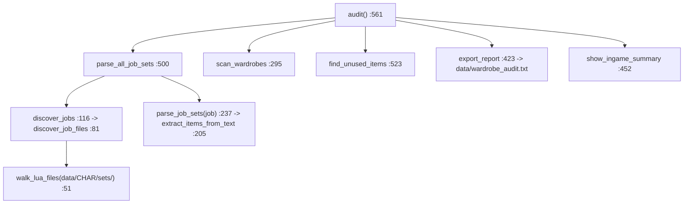
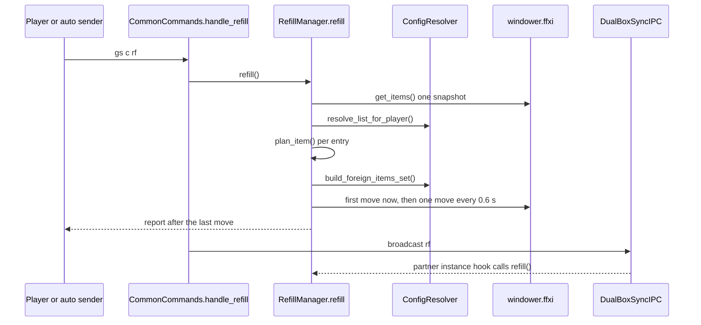

# Equipment checker, wardrobe auditor, refill and quiver

Four player-triggered inventory tools share this area. `//gs c checksets` walks the live `sets` table of the loaded job and reports every set slot whose item is not in an equippable bag (`shared/utils/equipment/equipment_checker.lua`). `//gs c wa` reads as text the set files of every job of the logged-in character (plus `common/`), compares the item names it finds against the eight wardrobes, and writes the unused ones to `data/wardrobe_audit.txt` (`shared/utils/equipment/wardrobe_auditor.lua`); the same file also feeds the wardrobe organizer with item-usage and bag-pin maps. `//gs c rf` restocks consumables in the inventory from the Mog Case and Mog Sack according to a per-character, per-job Lua config, pushes surplus and "foreign" consumables back, and prints a report (`shared/utils/inventory/refill_manager.lua` plus four helpers under `refill/`). `QuiverManager` opens an ammo quiver or pouch from THF and COR aftercast when the ammo stack runs low (`shared/utils/inventory/quiver_manager.lua`). None of these modules is loaded at job load: each is `pcall(require, ...)`-ed on first use by its caller.

## Files

| Path | Lines | Role |
|---|---|---|
| `shared/utils/equipment/equipment_checker.lua` | 493 | `//gs c checksets`: builds a name -> location cache of owned items, walks `sets`, reports unavailable slots |
| `shared/utils/equipment/wardrobe_auditor.lua` | 700 | `//gs c wa` report; text parser of set files; `build_pinned_bags` / `build_frequency_map` / `collect_all_used_names` for the wardrobe organizer |
| `shared/utils/inventory/refill_manager.lua` | 314 | `//gs c rf` facade: plans pulls/pushes, queues the moves, schedules them 0.6 s apart |
| `shared/utils/inventory/refill/config_resolver.lua` | 242 | Picks the refill list (craft / job+subjob / fallback) and builds the cross-character foreign item set |
| `shared/utils/inventory/refill/item_resolver.lua` | 75 | Lazy name -> item id index over `res.items` |
| `shared/utils/inventory/refill/bag_scanner.lua` | 45 | Counts one item id in one bag and returns its slots |
| `shared/utils/inventory/refill/refill_panels.lua` | 227 | Chat output of the refill (banner, progress, report) |
| `shared/utils/inventory/quiver_manager.lua` | 167 | After a ranged attack with the tracked ammo, uses a quiver/pouch with `/item` when the ammo count drops to a threshold |
| `_master/Tetsouo/config/<job>/<JOB>_REFILL.lua` | 20-48 | Refill templates for Tetsouo (BLM BRD BST COR DNC PLD THF WAR) |
| `_master/Tetsouo/config/craft/CRAFT_REFILL.lua` | 33 | Refill list used while a craft set is active |
| `_master/Kaories/config/<job>/<JOB>_REFILL.lua` | 22-23 | Refill templates for Kaories (COR GEO RDM) |

Live copies (gitignored): `Tetsouo/config/{blm,brd,bst,cor,craft,dnc,pld,thf,war}/*_REFILL.lua`, `Kaories/config/{cor,geo,pld,rdm}/*_REFILL.lua`. On 2026-09-18 every live file matches its template except `Tetsouo/config/pld/PLD_REFILL.lua` (live has Echo Drops in the SCH and RDM lists plus a RUN list, the template does not) and `Kaories/config/pld/PLD_REFILL.lua` (no Kaories overlay template exists; its content equals the Tetsouo template).

Related code outside this area: the command router `shared/utils/core/COMMON_COMMANDS.lua`, the message formatter `shared/utils/messages/formatters/system/message_equipment.lua` and its templates `shared/utils/messages/data/systems/equipment_messages.lua`, the dual-box IPC `shared/utils/dualbox/dualbox_sync_ipc.lua`, the craft modules `shared/utils/craft/craft_manager.lua` and `craft_commands.lua`, and the wardrobe organizer under `shared/utils/wardrobe/`.

## How it works

### `//gs c checksets`


1. `CommonCommands.handle_command` passes the job code the job file supplied (`'WAR'`, `'BRD'`, ...; `shared/jobs/*/functions/*_COMMANDS.lua`) to `handle_checksets` (`COMMON_COMMANDS.lua:114-124`), which requires the checker and calls `check_job_equipment(job_name)` (`equipment_checker.lua:449`). The job name is only used for the header and warning text; the data walked is always the sandbox global `sets` of the loaded job file.
2. Item cache (`build_item_cache`, `equipment_checker.lua:184-200`), built once per command from one `windower.ffxi.get_items()` call:
   - `add_equipped_items` (`:140-148`) iterates `items.equipment` and treats each non-`_bag` value as an item id. In the Windower API those values are inventory indices inside the `<slot>_bag` bag, not item ids (see Known issues). Equipped items are still found by the next step because an equipped item stays in its bag.
   - `add_bag_items` (`:151-162`) adds inventory and wardrobe 1-8 as `available = true`, then `safe safe2 storage locker satchel sack case temporary` as `in_storage = true` (`:104-106`).
   - `add_slip_items` (`:166-182`) adds Porter Moogle slip contents as storage (`bag_name = 'Slip NN'`) when `pcall(require, 'slips')` succeeded at module load (`:21-24`). Inside the sandbox this resolves to Windower's `addons/libs/slips.lua` through GearSwap's path search.
   - Every name field of the resource entry in `NAME_FIELDS` (`:96-101`) becomes a lowercase key. With the Windower resources library only `en`, `enl` and their aliases `english`, `english_log` return strings; the Japanese fields exist too, the French and German ones do not. When two bags hold the same name, an available location replaces an unavailable one; otherwise the first one written wins (`:130`).
3. Walk (`scan_sets_recursive`, `:341-362`), starting at `sets` with path `'sets'`:
   - `skip_node` (`:253-278`) stops at depth > 15 (`MAX_RECURSION_DEPTH`, `:30`, with an error message), at non-tables, at a table already visited in this scan (aliases such as `sets.a = sets.b` are therefore reported once, under whichever path `pairs` reaches first), and at `sets.naked` / any `*.naked` path. `visited_tables` is a module-level table reset by `scan_all_sets` (`:398`).
   - A table is an equipment set if any key is in `VALID_SLOTS` (`:53-74`: `main sub range ammo head neck ear1 ear2 left_ear right_ear body hands ring1 ring2 left_ring right_ring back waist legs feet`). GearSwap also accepts `ranged`, `lear`, `rear`, `learring`, `rearring`, `lring`, `rring` (`GearSwap/statics.lua:148-176`); those keys are not slots for the checker.
   - `collect_set_issues` (`:293-315`) takes the item name of each slot value (a string, or `.name` of a table, `:83-90`), looks it up lowercased, treats `'empty'` as available, and records every slot whose status is not `available`. Augments, `bag` and `priority` fields are ignored. A set that names no item (only `empty` tables, for example) is not counted.
   - The walk always continues into child tables whose key is not a slot and not `naked` (`:356-361`). Paths are built with `.` separators, so `sets.precast.WS['Savage Blade']` prints as `sets.precast.WS.Savage Blade`.
4. `record_set` (`:318-339`) counts a set as valid or increments `storage_count` / `missing_count` once per unavailable slot per set: the same missing ring in 20 sets counts 20.
5. Output: only problems are printed (`report_set_issues`, `:419-440`). Each problem is two lines from `equipment_messages.lua`: `[MISSING] [SLOT] Item` or `[STORAGE] [SLOT] Item - Found in <bag>`, followed by `  Set: <path>`. The header (`[EQUIPMENT CHECK] <JOB>` between 74-character `=` rules) and the summary (`Valid Sets: v/t`, then `Items in Storage: n` and `Missing Items: n` only when non-zero) are printed directly by `message_equipment.lua:22-92`.
6. Errors: a throw in the cache build or in the walk is caught and reported (`show_cache_build_failed`, `show_scan_failed`); the command returns `false`. The debug lines (`show_scanning`, `show_alias_detected`, cache size) exist but only print when the file-level `local DEBUG = false` (`:27`) is edited to `true`; no command toggles it.

### `//gs c wa` and the organizer helpers



1. Sets folder: `windower.addon_path .. 'data/' .. <player name> .. '/sets/'`, falling back to `Tetsouo` when `get_player()` returns nothing (`wardrobe_auditor.lua:36-40`). Nothing is loaded with `loadfile`; files are read with `io.open` because the sandbox has no `loadfile`/`setfenv`.
2. `walk_lua_files` (`:51-72`) walks the tree iteratively; an entry ending in `.lua` is a file, anything else is pushed as a directory (a file without that extension is then probed with `get_dir` and returns nothing).
3. `discover_job_files` (`:81-111`) maps each file to a job: `<job>_sets.lua` at the root (flat layout, Kaories and the templates) or anything under `<job>/` (modular layout, Tetsouo live). Only the 22 codes in `VALID_JOBS` (`:26-30`) count, so root files such as `bonecraft_sets.lua` and `fishing_sets.lua` are skipped. Every file under `common/` is appended to every discovered job (`:103-108`). `parse_job_sets` calls `discover_job_files()` again for each job (`:238`), so the tree is walked once per job plus once for the job list.
4. `extract_items_from_text` (`:205-228`) removes `--` line comments, then collects every single- or double-quoted string that follows `=` (patterns 3 and 4, `name = '...'`, are already covered by patterns 1 and 2). `looks_like_item_name` (`:165-180`) drops `empty`, `Path: A-D`, augment-like strings (`^%u%u%u?%u?[%+%-]%d`), numbers, strings shorter than 3 characters, and strings starting with `System:` or `wardrobe`. Every string that survives is a "used" name for that job, whether or not a set references the variable that holds it. Strings in list form without `=` (`{'Aegis', 'Ochain'}`) are not collected; continuation lines of `--[[ ... ]]` block comments are.
5. `scan_wardrobes` (`:295-334`) lists wardrobe 1-8 with, for each item, the `en`/`english`/`enl`/`english_log` variants in lowercase (`:275-290`). An item is used if any variant is a used name (`find_unused_items`, `:523-547`). `IGNORED_WARDROBES = { wardrobe7 = true }` (`:134-136`) is counted in totals but never judged.
6. `export_report` writes `data/wardrobe_audit.txt` (`:424`): header with scanned and failed jobs, one block per wardrobe, and a summary where `used = total - unused - ignored` (`:403-413`). The file name carries no character name; each run overwrites the previous one. The chat summary (`:452-486`) prints the unused count per wardrobe and `Used: total - unused / total`, which includes the ignored wardrobe in "used".
7. The command fails with a chat message when no job file could be read (`:565-569`) or when all wardrobes are empty (`:576-579`).

Organizer helpers (same text parser, no report):

- `build_pinned_bags()` (`:623-678`) scans every `.lua` under the sets folder and records `name` + `bag` pairs. It repeatedly removes the innermost `{...}` block (at most 200 passes per file, `:661-672`), which handles `{name=..., augments={...}, bag=...}` and nested maps such as `common/rings.lua`. The name pattern `name%s*=%s*['"]([^'"]+)['"]` (`:665`) stops at the first quote character of either kind. Bag strings are mapped by `BAG_NAME_TO_ID` (`:603-612`, `wardrobe`/`wardrobe 1`/`wardrobe1` -> 8, `wardrobe N` -> 10..16); any other bag string is ignored. Caller: `wardrobe/lib/state.lua:176-180`.
- `build_frequency_map()` (`:594-600`) and `collect_all_used_names()` (`:691-698`) have identical bodies and return `{[name_lower] = {[JOB] = true}}`. Callers: `wardrobe/lib/reports.lua:106-110` (declared-vs-held report of `//gs c wo scan`) and `wardrobe/lib/orchestrator_alt.lua:39-43` (`//gs c wo alt`). The docstring of `build_frequency_map` says it drives a frequency-based layout; the only caller today is the report.

### `//gs c rf`



1. Entry points. `//gs c refill` / `//gs c rf` -> `COMMON_COMMANDS.lua:493-494` -> `handle_refill` (`:200-216`), which calls `RefillManager.refill()` and then, whatever it returned, `DualBoxSyncIPC.broadcast('rf')`. The partner instance runs the hook registered at `INIT_SYSTEMS.lua:163-168`, which calls `RefillManager.refill()` directly and does not broadcast again. `gs c rf` is also sent automatically: 2.5 s after any craft set is equipped (`craft_commands.lua:168-170`, reached from `:206`, `:220`, `:230`), 0.5 s after `//gs c uncraft` (`craft_manager.lua:158-161`), and 3.5 s after a successful wardrobe organize (`wardrobe_organizer.lua:125-132`). Each of these goes through `handle_refill` and therefore also refills the partner.
2. Guards (`refill_manager.lua:246-256`): the sandbox `player` must exist and `get_items()` must return a table; otherwise one red `[Refill]` line. There is no in-progress guard.
3. List resolution (`ConfigResolver.resolve_list_for_player`, `config_resolver.lua:191-240`):
   - No player or main job `NON`: `FALLBACK_LIST` (`:39-46`, six medicines at 12).
   - Craft mode (`_G.__CraftManagerState.active`, set by `craft_manager.lua:49`): `require('<Char>/config/craft/CRAFT_REFILL')`; its `.default` is used and its `store_bag` applies. Without the file or without `.default`, resolution falls through to the job.
   - Job: `require('<Char>/config/<job>/<JOB>_REFILL')`. If the require throws (missing file or error in the file) the fallback list is used with label `fallback (no <path>)`. `subjobs[<SUB>]` replaces `.default` entirely when present; otherwise `.default`; otherwise the fallback.
   - `store_bag` (`case` default, `sack`, `satchel`, `:49-57`) only sets where surplus and foreign items go. Pulls always come from Case, then Sack (`refill_manager.lua:38-41`).
4. Planning (`plan_item`, `refill_manager.lua:153-202`), for each list entry:
   - `ItemResolver.resolve_variants(name)` keeps the variants whose name resolves in `res.items` through `en`/`enl`/`name`/`name_log` (`item_resolver.lua:30-73`). If none resolves, the row is reported with `current = 0` and `short = target` (printed as "Out of stock").
   - Held count = sum of all variants in the inventory (`count_held`, `:60-71`). Target: the number, or for `target = 'all'` the held count plus everything of every variant in Case and Sack (`:78-90`).
   - Deficit > 0: pull moves, variants in list order, Case before Sack, stack by stack (`queue_deficit`, `:119-149`).
   - Deficit < 0: push moves of the surplus to the store bag, variants in list order (`queue_surplus`, `:94-112`); the preferred variant is pushed first.
5. Foreign sweep (`sweep_foreign_items`, `:209-240`): `ConfigResolver.build_foreign_items_set` (`config_resolver.lua:151-179`) loads every `*_REFILL.lua` found under `data/<Dir>/config/<sub>/` for every directory of `data/` whose name starts with an uppercase letter (`:106-123`), i.e. all characters including frozen clones; the `char_name` argument is not used. Every item id named in any of those lists (defaults and all subjob lists) that is not a variant of the current list is foreign, and every inventory stack of a foreign id is queued for a full push to the store bag.
6. Execution (`:282-309`): the queue holds pulls and pushes in plan order, foreign pushes last. `execute_move(1)` runs immediately; each move schedules the next with `coroutine.schedule(..., 0.6)`. Pushes use `windower.ffxi.put_item(dst_bag, inventory_slot, count)`, pulls `windower.ffxi.get_item(src_bag, slot, count)`. Slots and counts come from the single snapshot taken at step 2; free space in the inventory or the store bag is not checked and failed moves are not detected. The report (`RefillPanels.show_report`, `refill_panels.lua:158-225`) is printed after the last move and shows the planned numbers.
7. Output example (produced by running the module against a mock inventory holding 12 Sublime Sushi +1 and 12 Sublime Sushi on WAR):

```
==========================================================================
========================= Inventory Refill - Started =========================
==========================================================================
  Config: WAR/default
  Surplus bag: Case
  Items tracked: 1
[Refill] Transferring 1 operation ...
==========================================================================
======================== Inventory Refill - Complete =========================
==========================================================================
  Sublime Sushi +1: 24/12 -> 12/12  (-12 -> Case)
  Pushed out: 12 item(s) (surplus)
==========================================================================
```

Report row kinds (`refill_panels.lua:165-209`): foreign (`foreign (n) -> Case`), surplus, already at target (`n/t (OK)`), fully refilled, partially refilled (`Short n`), nothing available (`Out of stock! Short n`). Item names are coloured by keyword: food, ammo/quiver, everything else as medicine (`:46-54`, `:116-126`).

### Quiver auto-open

`THF_AFTERCAST.lua:59-63` and `COR_AFTERCAST.lua:34-38` require `QuiverManager` on every aftercast and call `QuiverManager.after_ranged_attack(spell, 'Acid Bolt', 'Ac. Bolt Quiver', 5)` and `after_ranged_attack(spell, 'Bronze Bullet', 'Brz. Bull. Pouch', 15)`. The names are hardcoded in the shared job modules, so they apply to every character playing THF or COR.

`after_ranged_attack` (`quiver_manager.lua:151-165`) returns `false` unless `spell.action_type == 'Ranged Attack'` (GearSwap gives `/ra` the `type` `'Misc'`) and the shot was not interrupted (`:152`), and unless `player.equipment.ammo` is the tracked ammo (`:156-159`), so a shot with other ammo does not warn about a stack that is not in use. Otherwise it schedules `check_and_refill(ammo, quiver, threshold)` 1.0 s later, so FFXI has decremented the ammo count first (`:161-163`), and returns `true`.

`check_and_refill` (`quiver_manager.lua:87-137`):
1. Returns if the same quiver was used less than `OPEN_COOLDOWN = 8.0` s ago (`os.clock`, per-name table `last_open`, `:36-39`).
2. Resolves both names through its own lazy `res.items` index (`:57-80`, same fields and logic as `ItemResolver`).
3. Counts the ammo in the inventory and wardrobes 1-8 (`:27-31`); returns if the total is above the threshold.
4. If no quiver is in the inventory it prints a warning (`<ammo>: n left, no <quiver> in inventory!`) and returns without setting the cooldown, so the warning repeats on every ranged attack while the ammo stays low.
5. Otherwise it records the time, sends `input /item "<quiver>" <me>` and prints a success line.

The quiver has to be in the inventory for `/item`; the refill lists keep it there (`THF_REFILL.lua` `Ac. Bolt Quiver` 12, Kaories `COR_REFILL.lua` `Brz. Bull. Pouch` 2). Because of the foreign sweep, a character whose own list for the current job does not name the quiver has it pushed back to the store bag on every refill.

## Public API

### EquipmentChecker (`equipment_checker.lua`)

| Function | Returns | Notes |
|---|---|---|
| `check_job_equipment(job_name)` `:449` | `boolean` | Reads the global `sets`, prints report. `false` on missing job name, no `sets`, cache or scan error, or no set with items. Caller: `COMMON_COMMANDS.lua:117` only. |

Everything else is local. The module has no `_G` export.

### WardrobeAuditor (`wardrobe_auditor.lua`)

| Function | Returns | Side effects | Callers |
|---|---|---|---|
| `audit()` `:561` | `boolean` | Reads set files, `get_items()`, writes `data/wardrobe_audit.txt`, prints chat summary | `COMMON_COMMANDS.lua:132` |
| `build_frequency_map()` `:594` | `{[name_lower] = {[JOB] = true}}` | Reads set files | `wardrobe/lib/reports.lua:109` |
| `build_pinned_bags()` `:623` | `{[name_lower] = {bag_id, ...}}` | Reads set files | `wardrobe/lib/state.lua:178` |
| `collect_all_used_names()` `:691` | same as `build_frequency_map` | Reads set files | `wardrobe/lib/orchestrator_alt.lua:43` |

### RefillManager and helpers

| Function | Returns | Callers |
|---|---|---|
| `RefillManager.refill()` `refill_manager.lua:246` | `boolean` (true once the queue is started) | `COMMON_COMMANDS.lua:208`, IPC hook `INIT_SYSTEMS.lua:163-166` |
| `ConfigResolver.resolve_list_for_player()` `config_resolver.lua:191` | `list, source_label, store_info {id, display}` | `refill_manager.lua:259` |
| `ConfigResolver.build_foreign_items_set(char_name, current_list)` `:151` | `{[item_id] = config_name}` (`char_name` unused) | `refill_manager.lua:210` |
| `ItemResolver.resolve_item_id(name)` `item_resolver.lua:52` | `number or nil`; builds the index on first call | `config_resolver.lua:156,171`, `resolve_variants` |
| `ItemResolver.resolve_variants(name)` `:63` | `{ {name, id}, ... }` resolved only | `refill_manager.lua:154` |
| `BagScanner.count_item_in_bag(items, bag_key, id)` `bag_scanner.lua:25` | `total, { {slot, count}, ... }` | `refill_manager.lua:64,86,99,127` |
| `RefillPanels.show_error(msg)` / `show_start(label, store, n)` / `show_progress(n)` / `show_report(results)` `refill_panels.lua:134-225` | - | `refill_manager.lua` only |

### QuiverManager

| Function | Returns | Callers |
|---|---|---|
| `after_ranged_attack(spell, ammo_name, quiver_name, threshold)` `quiver_manager.lua:151` | `true` when a check was scheduled | `THF_AFTERCAST.lua:62`, `COR_AFTERCAST.lua:37` |
| `check_and_refill(ammo_name, quiver_name, threshold)` `quiver_manager.lua:87` | `true` when a use-item command was sent | `after_ranged_attack` (`:162`) |

## Commands

| Command | Args | Effect | Handler |
|---|---|---|---|
| `//gs c checksets` | none | Walks `sets`, prints missing and storage slots and a summary | `COMMON_COMMANDS.lua:487-488` -> `:114-124` -> `equipment_checker.lua:449` |
| `//gs c wardrobeaudit`, `//gs c wa` | none | Writes `data/wardrobe_audit.txt`, prints per-wardrobe unused counts | `:489-490` -> `:129-139` -> `wardrobe_auditor.lua:561` |
| `//gs c refill`, `//gs c rf` | none | Restock from Case/Sack, push surplus and foreign items, then broadcast `rf` to the partner | `:493-494` -> `:200-216` -> `refill_manager.lua:246` |

All three names are listed in `CommonCommands.is_common_command` (`COMMON_COMMANDS.lua:672`). There is no command for the quiver manager.

## Configuration

Refill file schema (reference comment in `_master/Tetsouo/config/war/WAR_REFILL.lua:1-15`):

```lua
local M = {}
M.store_bag = 'case'            -- 'case' (default) | 'sack' | 'satchel'; unknown values are ignored
M.default = {                   -- used when no subjobs[<SUB>] entry exists
    {name = 'Panacea', target = 12},
    {name = {'Sublime Sushi +1', 'Sublime Sushi'}, target = 12},  -- variants share one target
    {name = 'Pet Food Theta', target = 'all'},                    -- take everything Case/Sack hold
}
M.subjobs = {                   -- optional; a subjob list REPLACES default
    DNC = { ... },
}
return M
```

- Lookup path: `<Char>/config/<job lower>/<JOB>_REFILL` through the sandbox `require`, which is GearSwap's `include_user` path search (`GearSwap/refresh.lua:677-720`: `addons/GearSwap/libs-dev/`, `libs/`, `data/<player>/`, `data/common/`, `data/`, then `%APPDATA%/Windower/GearSwap/...`, then `addons/libs/`) wrapped by the project's `ModuleCache` (`shared/utils/core/module_cache.lua`, installed by `INIT_SYSTEMS.lua:47-52`). The directory scan for foreign detection uses `windower.addon_path .. 'data/'` only (`config_resolver.lua:72`, `:108`); `windower.windower_path` is not used anywhere in this area.
- Craft list: `<Char>/config/craft/CRAFT_REFILL.lua` (`config_resolver.lua:201`), only `.default` and `.store_bag` are read.
- Defaults in code: `FALLBACK_LIST` (`config_resolver.lua:39-46`), `DEFAULT_STORE_BAG = 'case'` (`:57`), `MOVE_DELAY = 0.6` (`refill_manager.lua:46`), `OPEN_COOLDOWN = 8.0` (`quiver_manager.lua:36`), quiver thresholds in the aftercast callers, `IGNORED_WARDROBES` (`wardrobe_auditor.lua:134-136`), `MAX_RECURSION_DEPTH = 15` (`equipment_checker.lua:30`). None of them is read from a config file.
- Templates and deployment: `clone_character.py` copies `config/<job>/` per file, taking the overlay `_master/<Source>/config/<job>/<file>` when it exists and `_master/config/<job>/<file>` otherwise (`clone_character.py:613-636`). With the default source `Tetsouo` the overlay `_master/Tetsouo/` exists and supplies all Tetsouo refill files. The loop only visits the selected job codes, so `config/craft/CRAFT_REFILL.lua` is not copied by the clone script.

## State & lifetime

- Module state: `visited_tables` (checker, reset per scan), `_name_to_id` (ItemResolver and QuiverManager, built on first lookup), `last_open` (QuiverManager). Because `ModuleCache` stores modules on the sandbox `_G`, these live for one user environment and are rebuilt after every `gs reload` and job change (GearSwap drops `user_env` in `load_user_files`, `GearSwap/refresh.lua:81-83`).
- Globals read: `sets` (checker, `equipment_checker.lua:404,459`), `player` (refill, `refill_manager.lua:210,247`), `_G.__CraftManagerState` (config resolver). No global is written. No `windower.*` field is used for persistence.
- Config caching: refill configs are cached by `ModuleCache` like modules, so an edited `*_REFILL.lua` is only read again after a `gs reload` or job change. A config that failed to load is not cached and is retried on the next refill.
- Files written: `data/wardrobe_audit.txt` only.
- Events, keybinds, text objects: none.
- Coroutines: the refill move chain (one `coroutine.schedule` per move, `refill_manager.lua:300-302`) and the aftercast quiver check (1.0 s). Neither is tracked or cancelled; a refill started before a job change keeps moving items and prints its report from the old environment's closures.
- Zone: nothing is re-checked; a refill that spans a zone line keeps sending moves from its snapshot.

## Interactions

- Command routing and the diagnostic command table: [commands-and-debug.md](commands-and-debug.md).
- Dual-box mirror of `rf`: [dualbox.md](dualbox.md).
- `require` caching and user-environment lifetime: [core-lifecycle.md](core-lifecycle.md).
- Checker messages and templates: [messages-formatters.md](messages-formatters.md), [messages-catalog.md](messages-catalog.md). The auditor and `refill_panels.lua` print with `add_to_chat` directly; both are listed diagnostic/panel exceptions in `.claude/CODE_QUALITY.md` section 6. `QuiverManager` uses `MessageFormatter.show_warning` / `show_success`.
- Auto-medicine (`shared/utils/debuff/precast_guard.lua`) uses Echo Drops, Remedy and Panacea from the inventory, which the refill lists stock: [precast-pipeline.md](precast-pipeline.md).
- Craft: `craft_manager.lua` owns `__CraftManagerState`; `craft_commands.lua` and `craft_manager.lua` send `gs c rf`.
- Wardrobe organizer: `shared/utils/wardrobe/lib/state.lua`, `reports.lua`, `orchestrator_alt.lua` consume the auditor's maps; `wardrobe_organizer.lua` sends `gs c rf` after a successful run.

## Invariants & gotchas

- `checksets` matches by name only, case-insensitively, over `en`/`enl`. An augmented piece is "valid" as soon as any item with that name is in an equippable bag; `bag = 'wardrobe N'` pins are not checked either. GearSwap itself matches augments for non-Rare items and honours `bag` (`GearSwap/equip_processing.lua:79-101`, `:154-172`).
- `checksets` never sees items under the `ranged` key, which BRD sets use for Linos (`Tetsouo/sets/brd/brd_sets.lua:105,165`, `_master/sets/brd_sets.lua:143,221`).
- STORAGE means "owned but not in inventory or wardrobe 1-8": safe, safe2, storage, locker, satchel, sack, case, temporary, or a storage slip.
- `wa` treats any quoted string after `=` in any set file of the job, plus all of `common/`, as a used item; a ring declared in `common/rings.lua` is used by every job even if no set references it.
- Wardrobe 7 is never judged by `wa` for any character.
- A refill `subjobs` list replaces the default list. Items of the default that are missing from the subjob list are foreign on that subjob and are pushed out.
- Foreign detection is global across characters: an item named in any list of any character under `data/` is pushed out unless the current list names it. Adding a consumable to one character's list makes it foreign for every list of every character that does not name it.
- A refill entry whose `target` is neither a number (a numeric string is coerced) nor `'all'` makes `plan_item` do arithmetic on it and throws after the start banner was printed; `handle_refill` does not catch it.
- Refill moves address inventory slots by index from one snapshot; running two refills at once (two quick `rf`, or `rf` from the partner while one is running) replays moves against slots the first run already changed.
- The quiver must stay in the inventory, and the character's refill list for the job must name it, or the next refill pushes it away as foreign.

## Extending

- New refill list: add `<Char>/config/<job>/<JOB>_REFILL.lua` (and the template under `_master/<Char>/config/<job>/`), then `gs reload`. Check the effect on other characters: every item it names becomes foreign for every list that does not name it.
- New quiver pair: call `QuiverManager.after_ranged_attack(spell, ammo, quiver, threshold)` from the job's `job_aftercast`, as THF and COR do (it filters ranged attacks by `action_type`, checks the equipped ammo and adds the 1 s delay), and add the quiver to that job's refill list of every character that plays it.
- New slot alias for `checksets`: add the key to `VALID_SLOTS` (`equipment_checker.lua:53-74`).
- New ignored wardrobe for `wa`: add it to `IGNORED_WARDROBES` (`wardrobe_auditor.lua:134-136`); the in-game total will still count it as used.

## Known issues

- `checksets` skips the `ranged` slot key, so BRD's Linos is never checked - `shared/utils/equipment/equipment_checker.lua:53-74`
- `checksets` ignores `augments` and `bag`, so a set naming an augment variant or a pinned copy you do not have is reported valid - `shared/utils/equipment/equipment_checker.lua:293-315`
- `add_equipped_items` reads inventory indices from `get_items().equipment` as item ids - `shared/utils/equipment/equipment_checker.lua:140-148`
- Refill surplus pushes the preferred variant back first and keeps the lesser one - `shared/utils/inventory/refill_manager.lua:94-112`
- Tetsouo's COR list lacks `Brz. Bull. Pouch`, so the global foreign sweep pushes the pouches COR_AFTERCAST needs - `_master/Tetsouo/config/cor/COR_REFILL.lua:11-18`
- PLD template SCH/RDM lists omit Echo Drops that the file header promises; live Tetsouo was fixed, template and Kaories live were not - `_master/Tetsouo/config/pld/PLD_REFILL.lua:25-40`
- Unresolvable refill item names are reported as "Out of stock" - `shared/utils/inventory/refill_manager.lua:156-165`
- A refill config that fails to load (syntax error) silently falls back to `FALLBACK_LIST` with the label "no <path>", and its food then counts as foreign - `shared/utils/inventory/refill/config_resolver.lua:223-226`
- Stale code comments: `refill_panels.lua:5` lists `section`/`divider` builders that do not exist, `refill_manager.lua:11` says "~150 lines", `wardrobe_auditor.lua:592` says the organizer layout uses `build_frequency_map`, `CRAFT_REFILL.lua:8` names `refill_manager` as the reader, docstrings sit above the wrong function at `equipment_checker.lua:92-93`, `:243-248` and `wardrobe_auditor.lua:492-493`
- Refill has no in-progress guard; overlapping runs replay stale slot moves - `shared/utils/inventory/refill_manager.lua:246-312`
- `store_bag = 'satchel'` is accepted, but pulls only read Case and Sack, so surplus pushed to the Satchel is never pulled back and later reads as "Out of stock" (no current config uses it) - `shared/utils/inventory/refill/config_resolver.lua:49-53`, `shared/utils/inventory/refill_manager.lua:38-41`
- Tetsouo plays SMN live (`Tetsouo/Tetsouo_SMN.lua`, `Tetsouo/sets/smn/`) but has no `SMN_REFILL.lua`: `rf` on SMN uses `FALLBACK_LIST` and pushes every food, Echo Drops and quiver named in any list to the Case as foreign - `shared/utils/inventory/refill/config_resolver.lua:222-226`
- With no player the auditor falls back to Tetsouo's sets folder, on any character; `wo` reaches it through `build_pinned_bags` and `collect_all_used_names` - `shared/utils/equipment/wardrobe_auditor.lua:36-40`
- `wa` counts strings inside `--[[ ]]` block comments as used items - `shared/utils/equipment/wardrobe_auditor.lua:207`
- `build_pinned_bags` truncates names containing an apostrophe - `shared/utils/equipment/wardrobe_auditor.lua:665`
- `wa` chat summary counts wardrobe 7 items as used while the text report does not - `shared/utils/equipment/wardrobe_auditor.lua:470`
- Dead or duplicated code: `SLOT_NAMES` unused (`wardrobe_auditor.lua:150-155`); `build_frequency_map` and `collect_all_used_names` identical (`:594-600`, `:691-698`); QuiverManager duplicates ItemResolver's index (`quiver_manager.lua:57-80`)
- User docs contradict the code: `docs/user/features/equipment-validation.md:30-47`, `docs/user/guides/configuration.md:196-208`, `README.md:141-145`
