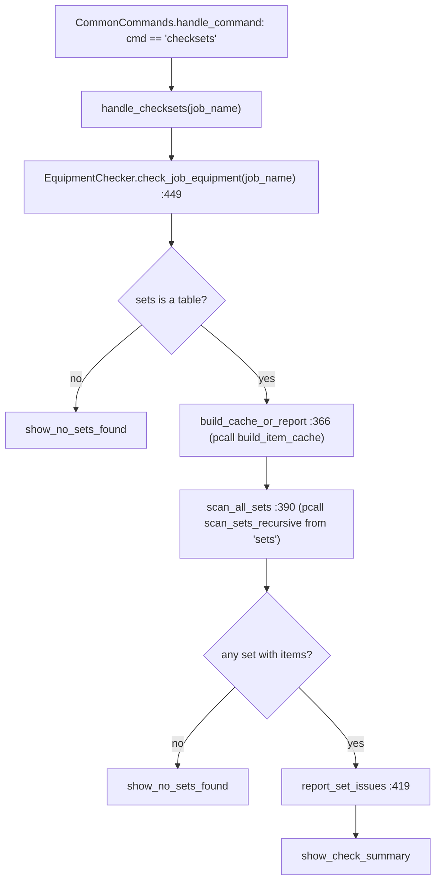
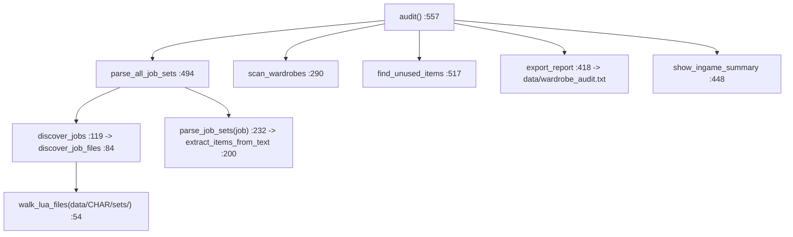
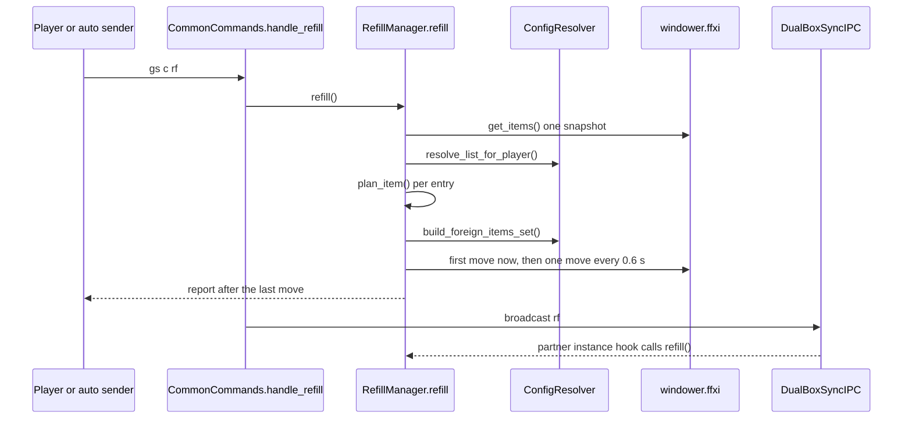

# Equipment, inventory and set-building helpers

This page covers everything under `shared/utils/equipment/`, `shared/utils/inventory/` and
`shared/utils/set_building/`, plus the generated HP/MP table `shared/data/equipment/ITEM_HP_MP.lua`.

The area holds three kinds of code:

- **Player-triggered inventory tools.** `//gs c checksets` walks the live `sets` table of the loaded
  job and reports every set slot whose item is not in an equippable bag (`equipment_checker.lua`).
  `//gs c wa` reads as text the set files of every job of the logged-in character (plus `common/`),
  compares the item names it finds against the eight wardrobes, and writes the unused ones to
  `data/wardrobe_audit.txt` (`wardrobe_auditor.lua`); the same file also feeds the wardrobe organizer
  with item-usage and bag-pin maps. `//gs c rf` restocks consumables in the inventory from the Mog
  Case and Mog Sack according to a per-character, per-job Lua config, pushes surplus and "foreign"
  consumables back, and prints a report (`refill_manager.lua` plus four helpers under `refill/`).
  `QuiverManager` opens an ammo quiver or pouch from THF and COR aftercast when the ammo stack runs
  low (`quiver_manager.lua`). None of these four is loaded at job load: each is `pcall(require, ...)`-ed
  on first use by its caller.
- **Load-time and per-action gear passes installed for every job.** `HPPriority` runs once per job
  load from `INIT_SYSTEMS` and gives every HP piece of the loaded sets an equip `priority`
  ([HP priority](#hp-priority)). `ElementalBelt`, `DualWield` and `TreasureHunter` are installed by
  `INIT_SYSTEMS` on Mote's hooks; they are documented in
  [factories-and-helpers.md](factories-and-helpers.md) and only summarised here.
- **Libraries called by job code.** `WeaponResolver` (weapon states -> sets), `BaseSetBuilder`
  (movement and town idle gear), `ElementalBonus` (Obi / Orpheus arithmetic), `AmpullaLock` (PLD/WAR
  Hoxne ammo lock), `SpellGearLock` (Dispelga's Daybreak).

Every claim below was checked against the code on 2026-09-28. Line numbers are given for the files
that were re-read that day; elsewhere the function is named, which survives edits better.

## Files

### Modules

| Path | Lines | Role | Loaded by | Documented in |
|---|---|---|---|---|
| `shared/utils/equipment/equipment_checker.lua` | 489 | `//gs c checksets`: name -> location cache of owned items, walk of `sets`, report of unavailable slots | `CommonCommands.handle_checksets`, on demand | this page |
| `shared/utils/equipment/wardrobe_auditor.lua` | 695 | `//gs c wa` report; text parser of set files; `build_pinned_bags` / `build_frequency_map` / `collect_all_used_names` for the organizer | `CommonCommands.handle_wardrobeaudit`; `wardrobe/lib/state.lua`, `reports.lua`, `orchestrator_alt.lua` | this page |
| `shared/utils/equipment/hp_priority.lua` | 196 | Load-time pass: `priority = HP` (HP*1000+MP on BLM/RDM/GEO) on every HP piece of `_G.sets` | `INIT_SYSTEMS.lua`, HP PRIORITY block, every load | this page |
| `shared/utils/equipment/weapon_resolver.lua` | 104 | `set_for(slot, value)`: the set a `MainWeapon` / `SubWeapon` value equips; `is_offhand_weapon(name)` | 12 job set builders (see below) | this page |
| `shared/utils/equipment/item_index.lua` | 140 | Name lookups over `res.items` built in one walk per session (`windower._item_index`): `id(name)`, `is_weapon(name)`, `dual_wields(name)`, `ammo_container(name)` (pouch / quiver of an ammo) | `weapon_resolver.lua`, `quiver_manager.lua`, `refill/item_resolver.lua`, `weaponskill/ws_slots.lua` (`same_item`, WAR / PLD weapon detection) | this page |
| `shared/utils/equipment/elemental_bonus.lua` | 75 | Pure arithmetic: what Hachirin-no-Obi and Orpheus's Sash add for an action | `elemental_belt.lua`, `custom/custom_conditions.lua` (`obi_better` / `orpheus_better`) | this page; [keybinds-and-custom.md](keybinds-and-custom.md) |
| `shared/utils/equipment/elemental_belt.lua` | 213 | Obi or Orpheus chosen for every job on `cleanup_precast` / `cleanup_midcast`; `//gs c belt` | `INIT_SYSTEMS.lua` (`ElementalBelt.install`) | [factories-and-helpers.md](factories-and-helpers.md#elementalbelt) |
| `shared/utils/equipment/dual_wield.lua` | 247 | Dual Wield tier sets (`sets.DW.*`) laid on the engaged set by magic haste; `//gs c dw` | `INIT_SYSTEMS.lua` (`DualWield.install`) | [factories-and-helpers.md](factories-and-helpers.md#dualwield) |
| `shared/utils/equipment/treasure_hunter.lua` | 290 | `TreasureMode` (Off/Tag/Full, SATA on THF), mob tagging, engaged (skipped during a COR roll, `GearHold`) and action overlays | `INIT_SYSTEMS.lua` (`TreasureHunter.install`) | [factories-and-helpers.md](factories-and-helpers.md#treasurehunter) |
| `shared/utils/equipment/treasure_commands.lua` | 63 | `//gs c th` built on `optional_state_commands.create` | `COMMON_COMMANDS.lua` router | [commands-and-debug.md](commands-and-debug.md) |
| `shared/utils/equipment/spell_gear_lock.lua` | 135 | A piece a spell cannot be cast without (Dispelga -> Daybreak), worn through Combat Mode | RDM precast / midcast / aftercast / commands | [factories-and-helpers.md](factories-and-helpers.md#spellgearlock), [../jobs/rdm.md](../jobs/rdm.md) |
| `shared/utils/equipment/ampulla_lock.lua` | 177 | Ammo slot held on Hoxne Ampulla for the Hoxne stance (PLD, WAR) | PLD/WAR commands (`job_state_change`), PLD/WAR entry `user_setup` / `file_unload`, wardrobe organizer | this page; [../jobs/pld.md](../jobs/pld.md) |
| `shared/utils/set_building/base_set_builder.lua` | 202 | `apply_movement`, `lay_weapon`, `lay_weapons`, `select_idle_base_town`, `select_idle_base`, `lay_town_set`, `is_in_town` shared by the job set builders | set builders of 15 jobs (BST: `lay_town_set` and `apply_movement`), `DNC_IDLE.lua`, `SMN_IDLE.lua`, `custom/custom_conditions.lua` | this page |
| `shared/utils/inventory/refill_manager.lua` | 315 | `//gs c rf` facade: plans pulls/pushes, queues the moves, schedules them 0.6 s apart | `CommonCommands.handle_refill`, dual-box `rf` hook | this page |
| `shared/utils/inventory/refill/config_resolver.lua` | 245 | Picks the refill list (craft / job+subjob / fallback) and builds the cross-character foreign item set | `refill_manager.lua` | this page |
| `shared/utils/inventory/refill/item_resolver.lua` | 75 | Lazy name -> item id index over `res.items` | `refill_manager.lua`, `config_resolver.lua` | this page |
| `shared/utils/inventory/refill/bag_scanner.lua` | 45 | Counts one item id in one bag and returns its slots | `refill_manager.lua` | this page |
| `shared/utils/inventory/refill/refill_panels.lua` | 227 | Chat output of the refill (banner, progress, report) | `refill_manager.lua` | this page |
| `shared/utils/inventory/quiver_manager.lua` | 161 | After a ranged attack with the ammo worn (or a named one), uses a quiver/pouch with `/item` when the ammo count drops to a threshold | `THF_AFTERCAST.lua`, `COR_AFTERCAST.lua` | this page |

### Data, generator and configs

| Path | Lines | Role |
|---|---|---|
| `shared/data/equipment/ITEM_HP_MP.lua` | 6 534 (6 529 entries) | Generated HP/MP table read by `hp_priority.lua` (do not edit by hand) |
| `scripts/item_db/build_item_db.py` | 379 | Builds the item database from Windower `res/` and regenerates `ITEM_HP_MP.lua` |
| `scripts/item_db/find_items.py` | 94 | Query tool over the generated SQLite (`--stat hp --slot Head --job WAR --top 10`) |
| `_master/Tetsouo/config/<job>/<JOB>_REFILL.lua` | 20-54 | Refill templates for Tetsouo (BLM BRD BST COR DNC PLD THF WAR) |
| `_master/Tetsouo/config/craft/CRAFT_REFILL.lua` | 34 | Refill list used while a craft set is active |
| `_master/Kaories/config/<job>/<JOB>_REFILL.lua` | 22-42 | Refill templates for Kaories (COR GEO PLD RDM) |
| `_master/config_global/WEAPON_CONFIG.lua` | - | Template of `<Char>/config/WEAPON_CONFIG.lua` (`equip_without_set`) |
| `_master/config_global/ELEMENTAL_BELT.lua`, `DW_CONFIG.lua` | - | Templates of the belt and Dual Wield settings (see [factories-and-helpers.md](factories-and-helpers.md)) |

Live copies (gitignored): `Tetsouo/config/{blm,brd,bst,cor,craft,dnc,pld,thf,war}/*_REFILL.lua`,
`Kaories/config/{cor,geo,pld,rdm}/*_REFILL.lua`. On 2026-09-25 every live refill file was identical to
its template (`diff --strip-trailing-cr`).

Related code outside this area: the command router `shared/utils/core/COMMON_COMMANDS.lua`, the
message formatter `shared/utils/messages/formatters/system/message_equipment.lua` and its templates
`shared/utils/messages/data/systems/equipment_messages.lua`, the dual-box IPC
`shared/utils/dualbox/dualbox_sync_ipc.lua`, the craft modules `shared/utils/craft/craft_manager.lua`
and `craft_commands.lua`, and the wardrobe organizer under `shared/utils/wardrobe/`
([wardrobe-organizer.md](wardrobe-organizer.md)).

## How it works

### `//gs c checksets`


```mermaid
flowchart TD
    A["CommonCommands.handle_command: cmd == 'checksets'"] --> B["handle_checksets(job_name)"]
    B --> C["EquipmentChecker.check_job_equipment(job_name) :449"]
    C --> D{"sets is a table?"}
    D -- no --> X1["show_no_sets_found"]
    D -- yes --> E["build_cache_or_report :366 (pcall build_item_cache)"]
    E --> F["scan_all_sets :390 (pcall scan_sets_recursive from 'sets')"]
    F --> G{"any set with items?"}
    G -- no --> X2["show_no_sets_found"]
    G -- yes --> H["report_set_issues :419"]
    H --> I["show_check_summary"]
```

1. `CommonCommands.handle_command` passes the job code the job file supplied (`'WAR'`, `'BRD'`, ...;
   `shared/jobs/*/functions/*_COMMANDS.lua`) to `CommonCommands.handle_checksets`, which requires the
   checker and calls `check_job_equipment(job_name)` (`equipment_checker.lua:449`). The job name is only
   used for the header and warning text; the data walked is always the sandbox global `sets` of the
   loaded job file.
2. Item cache (`build_item_cache`, `equipment_checker.lua:184`), built once per command from one
   `windower.ffxi.get_items()` call:
   - `add_equipped_items` (`:138`) iterates `items.equipment` and treats each non-`_bag` value as an
     item id. In the Windower API those values are inventory indices inside the `<slot>_bag` bag, not
     item ids (see Known issues). Equipped items are still found by the next step because an equipped
     item stays in its bag.
   - `add_bag_items` (`:149`) adds inventory and wardrobe 1-8 (`EQUIPPABLE_BAGS`, `:38`) as
     `available = true`, then `safe safe2 storage locker satchel sack case temporary` (`STORAGE_BAGS`,
     `:100`) as `in_storage = true`.
   - `add_slip_items` (`:164`) adds Porter Moogle slip contents as storage (`bag_name = 'Slip NN'`)
     when `pcall(require, 'slips')` succeeded at module load. Inside the sandbox this resolves to
     Windower's `addons/libs/slips.lua` through GearSwap's path search.
   - Every name field of the resource entry in `NAME_FIELDS` (`:92`) becomes a lowercase key
     (`make_cache_adder`, `:108`). With the Windower resources library only `en`, `enl` and their
     aliases `english`, `english_log` return strings; the French and German fields do not exist. When
     two bags hold the same name, an available location replaces an unavailable one; otherwise the
     first one written wins.
3. Walk (`scan_sets_recursive`, `:341`), starting at `sets` with path `'sets'`:
   - `skip_node` (`:247`) stops at depth > 15 (`MAX_RECURSION_DEPTH`, `:28`, with an error message), at
     non-tables, at a table already visited in this scan (aliases such as `sets.a = sets.b` are
     therefore reported once, under whichever path `pairs` reaches first), and at `sets.naked` / any
     `*.naked` path. `visited_tables` is module-level and reset by `scan_all_sets`.
   - A table is an equipment set if any key is in `VALID_SLOTS` (`:51-72`: `main sub range ammo head
     neck ear1 ear2 left_ear right_ear body hands ring1 ring2 left_ring right_ring back waist legs feet`).
     GearSwap also accepts `ranged`, `lear`, `rear`, `learring`, `rearring`, `lring`, `rring`
     (*(engine)* `statics.lua`, slot map); those keys are not slots for the checker.
   - `collect_set_issues` (`:287`) takes the item name of each slot value (a string, or `.name` of a
     table, `get_item_name`, `:81`), looks it up lowercased, treats `'empty'` as available, and records
     every slot whose status is not `available`. Augments, `bag` and `priority` fields are ignored. A
     set that names no item (only `empty` tables, for example) is not counted.
   - The walk always continues into child tables whose key is not a slot and not `naked`. Paths are
     built with `.` separators, so `sets.precast.WS['Savage Blade']` prints as
     `sets.precast.WS.Savage Blade`.
4. `record_set` (`:312`) counts a set as valid or increments `storage_count` / `missing_count` once
   per unavailable slot per set: the same missing ring in 20 sets counts 20.
5. Output: only problems are printed (`report_set_issues`, `:419`). Each problem is two lines from
   `equipment_messages.lua`: `[MISSING] [SLOT] Item` or `[STORAGE] [SLOT] Item - Found in <bag>`,
   followed by `  Set: <path>`. The header (`[EQUIPMENT CHECK] <JOB>` between `=` rules of
   `MessageCore.SEPARATOR_WIDTH`) and the summary (`Valid Sets: v/t`, then `Items in Storage: n` and
   `Missing Items: n` only when non-zero) are printed by `message_equipment.lua` `show_check_header` /
   `show_check_summary`.
6. Errors: a throw in the cache build or in the walk is caught and reported (`show_cache_build_failed`,
   `show_scan_failed`); the command returns `false`. The debug lines (`show_scanning`,
   `show_alias_detected`, cache size) only print when the file-level `local DEBUG = false` (`:26`) is
   edited to `true`; no command toggles it.

### `//gs c wa` and the organizer helpers


```mermaid
flowchart TD
    A["audit() :557"] --> B["parse_all_job_sets :494"]
    B --> C["discover_jobs :119 -> discover_job_files :84"]
    C --> D["walk_lua_files(data/CHAR/sets/) :54"]
    B --> E["parse_job_sets(job) :232 -> extract_items_from_text :200"]
    A --> F["scan_wardrobes :290"]
    A --> G["find_unused_items :517"]
    A --> H["export_report :418 -> data/wardrobe_audit.txt"]
    A --> I["show_ingame_summary :448"]
```

1. Sets folder: `windower.addon_path .. 'data/' .. <player name> .. '/sets/'`, falling back to
   `Tetsouo` when `get_player()` returns nothing (`sets_dir`, `wardrobe_auditor.lua:39`). Nothing is
   loaded with `loadfile`; files are read with `io.open` because the sandbox has no
   `loadfile`/`setfenv`.
2. `walk_lua_files` (`:54`) walks the tree iteratively; an entry ending in `.lua` is a file, anything
   else is pushed as a directory.
3. `discover_job_files` (`:84`) maps each file to a job: `<job>_sets.lua` at the root (flat layout,
   Kaories and the templates) or anything under `<job>/` (modular layout, Tetsouo live). Only the 22
   codes in `VALID_JOBS` (`:29`) count, so root files such as `bonecraft_sets.lua` and
   `fishing_sets.lua` are skipped. Every file under `common/` is appended to every discovered job.
   `parse_job_sets` calls `discover_job_files()` again for each job, so the tree is walked once per job
   plus once for the job list.
4. `extract_items_from_text` (`:200`) removes `--` line comments, then collects every single- or
   double-quoted string that follows `=`. `looks_like_item_name` (`:160`) drops `empty`, `Path: A-D`,
   augment-like strings (`^%u%u%u?%u?[%+%-]%d`), numbers, strings shorter than 3 characters, and
   strings starting with `System:` or `wardrobe`. Every string that survives is a "used" name for that
   job, whether or not a set references the variable that holds it. Strings in list form without `=`
   (`{'Aegis', 'Ochain'}`) are not collected; continuation lines of `--[[ ... ]]` block comments are.
5. `scan_wardrobes` (`:290`) lists wardrobe 1-8 with, for each item, the `en`/`english`/`enl`/
   `english_log` variants in lowercase (`get_all_names`, `:270`). An item is used if any variant is a
   used name (`find_unused_items`, `:517`). `IGNORED_WARDROBES = { wardrobe7 = true }` (`:137`) is
   counted in totals but never judged.
6. `export_report` (`:418`) writes `data/wardrobe_audit.txt`: header with scanned and failed jobs, one
   block per wardrobe, and a summary where `used = total - unused - ignored` (`write_report_summary`,
   `:398`). The file name carries no character name; each run overwrites the previous one. The chat
   summary (`show_ingame_summary`, `:448`) prints the unused count per wardrobe and
   `Used: total - unused / total`, which includes the ignored wardrobe in "used".
7. The command fails with a chat message when no job file could be read or when all wardrobes are
   empty (both in `audit()`).

Organizer helpers (same text parser, no report):

- `build_pinned_bags()` (`:619`) scans every `.lua` under the sets folder and records `name` + `bag`
  pairs. It repeatedly removes the innermost `{...}` block (at most 200 passes per file), which handles
  `{name=..., augments={...}, bag=...}` and nested maps such as `common/rings.lua`. The name pattern
  `name%s*=%s*['"]([^'"]+)['"]` stops at the first quote character of either kind. Bag strings are
  mapped by `BAG_NAME_TO_ID` (`:599`, `wardrobe`/`wardrobe 1`/`wardrobe1` -> 8, `wardrobe N` ->
  10..16); any other bag string is ignored. Caller: `wardrobe/lib/state.lua`.
- `build_frequency_map()` (`:590`) and `collect_all_used_names()` (`:686`) have identical bodies and
  return `{[name_lower] = {[JOB] = true}}`. Callers: `wardrobe/lib/reports.lua` (declared-vs-held
  report of `//gs c wo scan`) and `wardrobe/lib/orchestrator_alt.lua` (`//gs c wo alt`).

### `//gs c rf`


```mermaid
sequenceDiagram
    participant U as Player or auto sender
    participant CC as CommonCommands.handle_refill
    participant RM as RefillManager.refill
    participant CR as ConfigResolver
    participant W as windower.ffxi
    participant IPC as DualBoxSyncIPC
    U->>CC: gs c rf
    CC->>RM: refill()
    RM->>W: get_items() one snapshot
    RM->>CR: resolve_list_for_player()
    RM->>RM: plan_item() per entry
    RM->>CR: build_foreign_items_set()
    RM->>W: first move now, then one move every 0.6 s
    RM-->>U: report after the last move
    CC->>IPC: broadcast rf
    IPC-->>RM: partner instance hook calls refill()
```

1. Entry points. `//gs c refill` / `//gs c rf` -> `CommonCommands.handle_command` ->
   `CommonCommands.handle_refill` (`COMMON_COMMANDS.lua:234`), which calls `RefillManager.refill()` and
   then, whatever it returned, `DualBoxSyncIPC.broadcast('rf')`. The partner instance runs
   `refill_hook`, registered for `rf` and `refill` in the dual-box block of `INIT_SYSTEMS.lua`; it calls
   `RefillManager.refill()` directly and does not broadcast again. `gs c rf` is also sent
   automatically: 2.5 s after any craft set is equipped (`lock_after_delay` in `craft_commands.lua`),
   0.5 s after `//gs c uncraft` (`craft_manager.lua`), and 3.5 s after a successful wardrobe organize
   (`schedule_lockstyle` in `wardrobe_organizer.lua`). Each of these goes through `handle_refill` and
   therefore also refills the partner.
2. Guards (`RefillManager.refill`, `refill_manager.lua:249`): the sandbox `player` must exist and
   `get_items()` must return a table; otherwise one red `[Refill]` line. There is no in-progress guard.
3. List resolution (`ConfigResolver.resolve_list_for_player`, `config_resolver.lua:192`):
   - No player or main job `NON`: `FALLBACK_LIST` (`:39`, six medicines at 12).
   - Craft mode (`_G.CraftManager.is_active()`; `craft_manager.lua` owns the session state):
     `require('<Char>/config/craft/CRAFT_REFILL')`; its `.default` is used (label `CRAFT (<name>)`)
     and its `store_bag` applies. Without the file or without `.default`, resolution falls through to
     the job.
   - Job: `require('<Char>/config/<job>/<JOB>_REFILL')`. If the require throws (missing file or error
     in the file) the fallback list is used with label `fallback (no <path>)`. `subjobs[<SUB>]`
     replaces `.default` entirely when present; otherwise `.default`; otherwise the fallback.
   - `store_bag` (`case` default, `sack`, `satchel`; `BAG_INFO` `:49` and `DEFAULT_STORE_BAG` `:57`)
     only sets where surplus and foreign items go. Pulls always come from Case, then Sack
     (`SOURCE_BAGS`, `refill_manager.lua:38`).
4. Planning (`plan_item`, `refill_manager.lua:153`), for each list entry:
   - `ItemResolver.resolve_variants(name)` keeps the variants whose name resolves in `res.items`
     through `en`/`enl`/`name`/`name_log` (`ItemIndex.id`, `shared/utils/equipment/item_index.lua`). If none
     resolves, the row is reported with `current = 0` and `short = target` (printed as "Out of stock").
   - Held count = sum of all variants in the inventory (`count_held`, `:60`). Target: the number, or for
     `target = 'all'` the held count plus everything of every variant in Case and Sack
     (`effective_target`, `:78`).
   - Deficit > 0: pull moves, variants in list order, Case before Sack, stack by stack
     (`queue_deficit`, `:119`).
   - Deficit < 0: push moves of the surplus to the store bag, variants in list order (`queue_surplus`,
     `:94`); the preferred variant is pushed first.
5. Foreign sweep (`sweep_foreign_items`, `:209`): `ConfigResolver.build_foreign_items_set`
   (`config_resolver.lua:152`) loads every `*_REFILL.lua` found under `data/<Dir>/config/<sub>/` for
   every directory of `data/` whose name starts with an uppercase letter (`load_all_refill_configs`,
   `:107`), i.e. all characters including frozen clones; the `char_name` argument is not used. Every
   item id named in any of those lists (defaults and all subjob lists) that is not a variant of the
   current list is foreign, and every inventory stack of a foreign id is queued for a full push to the
   store bag.
6. Execution (end of `RefillManager.refill`): the queue holds pulls and pushes in plan order, foreign
   pushes last. `execute_move(1)` runs immediately; each move schedules the next with
   `coroutine.schedule(..., 0.6)` (`MOVE_DELAY`, `:46`). Pushes use
   `windower.ffxi.put_item(dst_bag, inventory_slot, count)`, pulls
   `windower.ffxi.get_item(src_bag, slot, count)`. Slots and counts come from the single snapshot
   taken at step 2; free space in the inventory or the store bag is not checked and failed moves are
   not detected. The report (`RefillPanels.show_report`, `refill_panels.lua:158`) is printed after the
   last move and shows the planned numbers.
7. Output example (WAR, inventory holding 24 Sublime Sushi +1 against a target of 12; colour codes
   omitted, standard separator options):

```
=====================================================================
====================== Inventory Refill - Started =======================
=====================================================================
  Config: WAR/default
  Surplus bag: Case
  Items tracked: 1
[Refill] Transferring 1 operation ...
=====================================================================
====================== Inventory Refill - Complete ======================
=====================================================================
  Sublime Sushi +1: 24/12 -> 12/12  (-12 -> Case)
  Pushed out: 12 item(s) (surplus)
=====================================================================
```

The rules are `WIDTH = 69` characters (`refill_panels.lua:28`); the title row is 4 characters wider on
purpose (`banner`, compensation for FFXI's proportional font). Since 2026-09-27 the panels write
through the sandbox `add_to_chat`, which `message_core.lua` wraps once per load with
`ChatSeparators.apply`: with the player's separator options a rule may be redrawn (character, colour,
width) or dropped; standard options leave every line as above.

Report row kinds (`show_report`): foreign (`foreign (n) -> Case`), surplus, already at target
(`n/t (OK)`), fully refilled, partially refilled (`Short n`), nothing available
(`Out of stock! Short n`). Totals: `Pulled in`, `Pushed out`, `Missing`, or `Status: Inventory already
complete`. Item names are coloured by keyword: food, ammo/quiver, everything else as medicine
(`FOOD_KEYWORDS` `:46`, `AMMO_KEYWORDS` `:54`, `item_row` `:116`).

### Quiver auto-open

`THF_AFTERCAST.lua` (`job_aftercast`) and `COR_AFTERCAST.lua` (`job_aftercast`) require `QuiverManager`
on every aftercast and call `QuiverManager.after_ranged_attack(spell, nil, nil, 5)` (THF) and
`after_ranged_attack(spell, nil, nil, 15)` (COR). With no names, the ammo is the one worn and the
container is `ItemIndex.ammo_container(ammo)`: the `Usable` item whose log name is the ammo's plus
` pouch` / ` quiver` (`'s` dropped, ` arrow` -> ` quiver`), and only when that name is unique (the
`Old Quiver` quest items are not a match). 95 ammo have one. Chrono / Living / Devastating Bullet
pouches and the Chrono Quiver are waist `Armor`: `/item` cannot use them from the inventory, so
they are left out. Explicit names still work (`after_ranged_attack(spell, 'Acid Bolt',
'Ac. Bolt Quiver', 5)`).

`after_ranged_attack` (`quiver_manager.lua:137`) returns `false` unless
`spell.action_type == 'Ranged Attack'` (GearSwap gives `/ra` the `type` `'Misc'`) and the shot was not
interrupted, and unless ammo is worn, is the tracked ammo (when one is named) and has a container, so a
shot with other ammo does not warn about a stack that is not in use. Otherwise it schedules `check_and_refill(ammo, quiver,
threshold)` 1.0 s later, so FFXI has decremented the ammo count first, and returns `true`.

`check_and_refill` (`quiver_manager.lua:73`):
1. Returns if the same quiver was used less than `OPEN_COOLDOWN = 8.0` s ago (`os.clock`, per-name
   table `last_open`, `:36`).
2. Resolves both names through `resolve_id`, which reads the session-wide item index
   (`ItemIndex.id`, same fields and logic as `ItemResolver`).
3. Counts the ammo in the inventory and wardrobes 1-8 (`AMMO_BAGS`, `:27`); returns if the total is
   above the threshold.
4. If no quiver is in the inventory it prints a warning (`<ammo>: n left, no <quiver> in inventory!`)
   and returns without setting the cooldown, so the warning repeats on every ranged attack while the
   ammo stays low.
5. Otherwise it records the time, sends `input /item "<quiver>" <me>` and prints a success line.

The quiver has to be in the inventory for `/item`; the refill lists keep it there (`THF_REFILL.lua`
`Ac. Bolt Quiver` 12, Kaories `COR_REFILL.lua` `Brz. Bull. Pouch` 2). Because of the foreign sweep, a
character whose own list for the current job does not name the quiver has it pushed back to the store
bag on every refill.

### Weapon states: `WeaponResolver`

Every set builder that applies `state.MainWeapon` / `state.SubWeapon` asks
`WeaponResolver.set_for(slot, value)` instead of reading `sets[value]` itself. Callers (all
`shared/jobs/<job>/functions/logic/set_builder.lua`): BLM, BLU, BRD, COR, DNC, DRK, GEO, RDM, RUN, SAM,
THF, WAR. PLD uses its own weapon logic. DRK's `apply_weapon` joined on 2026-09-28; before, it read
`sets[weapon]` directly and `equip_without_set` had no effect on DRK.

- **Default** (no `<Char>/config/WEAPON_CONFIG.lua`, or `equip_without_set` not `true`): returns
  `sets[value]`, exactly the old lookup. Tetsouo and Kaories have no `WEAPON_CONFIG.lua`, so nothing
  changed for them. Tetsouo's BLM relies on `Hvergelmir` having no set, so its idle and engaged sets
  keep their own staves.
- **`equip_without_set = true`** (template `_master/config_global/WEAPON_CONFIG.lua`), per slot:
  1. `sets[value]` when it exists and names that slot; an off-hand pick of a set that also carries a
     `main` returns only `{sub = set.sub}`, so it never moves the main hand;
  2. else `{main|sub = value}` when `value` is a weapon in `res.items` (category `Weapon`, grips
     included; `is_weapon`);
  3. else `nil`.
- `WeaponResolver.is_offhand_weapon(name)` answers "does this off-hand make the player dual wield?"
  from the game's item list: a `Weapon` with a combat skill (`skill > 0`) -> `true`; a shield or a grip
  (skill 0) -> `false`; a name the game does not know -> `nil`. Short and long names, any case. Used by
  the RDM set builder (`has_shield_equipped`, after its subjob test: off /NIN and /DNC the answer is
  always "no dual wield"; then `sets.shields` for unknown names) and the BLU set builder
  (`is_single_wield`).

The config is read once per sandbox (`enabled`, `pcall(require, 'config/WEAPON_CONFIG')`); both item
indexes are built lazily on first use (see [For maintainers / AI](#for-maintainers--ai) for the cost).

### Movement and town idle: `BaseSetBuilder`

`shared/utils/set_building/base_set_builder.lua` holds the five idle helpers the job set builders
share, by plain assignment (`SetBuilder.apply_movement = BaseSetBuilder.apply_movement`) or by call:

- `apply_movement(result)`: when `state.Moving.value == 'true'` (AutoMove,
  [factories-and-helpers.md](factories-and-helpers.md#automove)) and `sets.MoveSpeed` exists, returns
  `set_combine(result, sets.MoveSpeed)` under `pcall`; a failure prints `MessageFormatter.show_error` and
  returns `result` unchanged.
- `select_idle_base_town(base_set)`: lays the town set on top of an idle set (since 2026-09-29; it
  used to replace it). The idle underneath is `base_set`, except when `base_set` is Mote's own town
  pick (`sets.idle.Town` or `sets.idle.Town[IdleMode]`, which `get_idle_set` chooses in every city,
  Adoulin included): then it is rebuilt as Mote picks it in the field, `sets.idle`, then
  `sets.idle[IdleMode]` when that is a table. In Western/Eastern Adoulin, when `sets.Adoulin`
  exists, returns `set_combine(idle, sets.Adoulin), true`; in an `areas.Cities` zone whose name does
  not contain `Dynamis` (Adoulin without `sets.Adoulin` included), when `sets.idle.Town` exists,
  returns `set_combine(idle, town), true`, where `town` is Mote's town node or `sets.idle.Town`;
  otherwise `base_set, false`. A partial town set thus keeps the idle pieces in the slots it leaves
  out.
- `select_idle_base(base_set)` (since 2026-09-29): in town, the result of `select_idle_base_town`;
  outside town, `sets.idle[state.HybridMode.current]` when it is a table, else `base_set`; returns
  `set, in_town`. Mote's `get_idle_set` follows `IdleMode` only, so without it `sets.idle.PDT` is
  never worn on a job whose PDT toggle is `HybridMode`. The HybridMode set replaces Mote's base
  whole: `sets.idle.Weak` and Mote's defense and kiting layers only show when the current
  HybridMode value has no idle set. Used by: DNC, DRK, THF, WAR (DNC, THF and WAR as
  `SetBuilder.select_idle_base`, DRK from `build_idle_set`).
- `lay_town_set(idle, town_set)` (since 2026-09-29): the same zone test and layering for a job that
  builds its own idle and passes its own town set (BST: `sets.me.idle.Town` over the pet or master
  idle). In Western/Eastern Adoulin, when `sets.Adoulin` exists, returns
  `set_combine(idle, sets.Adoulin), true`; in an `areas.Cities` zone without `Dynamis` in its name
  (Adoulin included), when `town_set` is given, `set_combine(idle, town_set), true`; otherwise
  `idle, false`. `select_idle_base_town` and `lay_town_set` share one local zone test (`town_zone`)
  and one layering helper (`lay_town`).
- `lay_weapon(result, slot, value)` (since 2026-09-29): `WeaponResolver.set_for(slot, value)` on top of `result` under `pcall` (error message on failure), unchanged when the value has no set. `lay_weapons(result)`: `lay_weapon` with `state.MainWeapon.current` then `state.SubWeapon.current`. They replace the copies each set builder carried: BLM, BLU, BRD, GEO, RDM, THF (outside the Abyssea weapon) call `lay_weapons`; DNC, DRK, RUN (main and grip), SAM, WAR call `lay_weapon`. COR (sub only on /NIN or /DNC, gun from `sets[...]`), PLD and BST (`sets[...]` read directly) keep their own weapon code. 168-case offline comparison (every weapon value, `equip_without_set` on and off): identical.
- `is_in_town()`: the same zone test without any set (used by `SMN_IDLE.lua` for the avatar idle
  set and by the `town` condition of `custom/custom_conditions.lua`).

### HP priority

`INIT_SYSTEMS.lua` (HP PRIORITY block, right after the MODULE CACHE block) calls `HPPriority.apply()`
once per job load, under `pcall`. By then `get_sets()` has returned from `include('Mote-Include.lua')`,
so Mote has run `init_gear_sets()` and `_G.sets` holds the job's sets. (The require cache itself is
normally installed earlier, by `shared/utils/config/config_loader.lua`, which every entry file requires
at file level; the INIT_SYSTEMS call is a no-op then.)

GearSwap sends the pieces of a set from the highest `priority` to the lowest, pieces without one
counting as 0. Giving every piece its own HP as priority makes HP pieces go on before HP-less ones
replace the others, so max HP never dips mid-swap and current HP is not lost. `HPPriority.apply()`:

1. Returns 0 unless `player.name` is in `CHARACTERS` (`Tetsouo` with the top of the Unity range,
   `Kaories` with the bottom), `player.main_job` is known, `_G.sets` is a table and the job is not in
   `SKIP_JOBS` (`PLD`, which keeps its hand-tuned HP deltas).
2. Loads `ITEM_HP_MP.lua` with `pcall(dofile, windower.addon_path .. 'data/shared/data/equipment/ITEM_HP_MP.lua')`:
   `dofile`, not `require`, so the module cache does not keep the 6 529-entry table for the whole
   session.
3. Walks `_G.sets` (`walk`) with a `visited` table, since sets reference each other. For every key in
   `SLOTS` (GearSwap's slot names and aliases, `ranged`/`lear`/`rring` included) whose value is a plain
   name or a table with a string `name` and no `priority`, it computes HP and MP (`piece_hp_mp`): the
   table entry, plus the Unity bonus for the character's rank, plus the `HP+N` / `MP+N` augments
   written in the set (augments starting `Pet:`, `Avatar:`, `Automaton:`, `Wyvern:`, `Luopan:` are
   ignored, `augment_hp_mp`). A table with a `name` field is a piece and is not walked into; any other
   table is.
4. `priority = HP`, or `HP * 1000 + MP` on `MP_JOBS` (BLM, RDM, GEO). A priority of 0 is not written.
   A plain name becomes `{name = ..., priority = n}`; a table gets its `priority` field. A piece that
   already has a `priority` is never touched.

It returns the number of pieces changed and prints nothing. `HPPriority._piece_hp_mp` and
`HPPriority._config` are exposed for offline scripts that reproduce the arithmetic.

### ITEM_HP_MP.lua and its generator

`ITEM_HP_MP.lua` (header "GENERATED by scripts/item_db/build_item_db.py - do not edit by hand") is
`return { ["<lowercase name>"] = {hp, mp} | {hp, mp, unity_hp_min, unity_hp_max, unity_mp_min,
unity_mp_max}, ... }`, sorted by key; 22 entries carry the Unity columns. Keys are both the short
(`en`) and the log (`enl`) name of every item. Only `Armor` and `Weapon` items with equip slots and a
non-zero HP or MP stat are listed; when several items share a name, the one with the highest item
level (then level, then id) wins (`write_hp_mp_lua`), since that is the one a level 99 set means. HP%
and MP% stats are not counted (`hp_mp_entry`).

To regenerate it (after a game update that changes `res/`):

```
cd "D:/Windower Tetsouo/addons/GearSwap/data/scripts/item_db"
python build_item_db.py                 # or: --res "<Windower>/res"
```

The script reads `res/items.lua`, `res/item_descriptions.lua`, `res/jobs.lua`, `res/slots.lua` and
`res/skills.lua` from the Windower root (`DEFAULT_RES = parents[5] / "res"` of the script), parses the
stats out of the item descriptions (`parse_stats`, contexts such as `Unity Ranking:` split by
`split_contexts`), writes `items.sqlite`, `items.json` and `equipment.csv` to `scripts/item_db/out/`
(gitignored, `.gitignore`: `scripts/item_db/out/`), then overwrites
`shared/data/equipment/ITEM_HP_MP.lua` (UTF-8, LF). `python find_items.py --stat hp --slot Head --job
WAR --top 10` queries the SQLite file. A reload (`//gs reload`) is enough to use the new table: it is
read with `dofile` at every job load. Review the diff before committing: a description the parser
misreads shows up as a changed HP/MP pair.

## Public API

### EquipmentChecker (`equipment_checker.lua`)

| Function | Returns | Notes |
|---|---|---|
| `check_job_equipment(job_name)` `:449` | `boolean` | Reads the global `sets`, prints report. `false` on missing job name, no `sets`, cache or scan error, or no set with items. Caller: `CommonCommands.handle_checksets` only. |

Everything else is local. The module has no `_G` export.

### WardrobeAuditor (`wardrobe_auditor.lua`)

| Function | Returns | Side effects | Callers |
|---|---|---|---|
| `audit()` `:557` | `boolean` | Reads set files, `get_items()`, writes `data/wardrobe_audit.txt`, prints chat summary | `CommonCommands.handle_wardrobeaudit` |
| `build_frequency_map()` `:590` | `{[name_lower] = {[JOB] = true}}` | Reads set files | `wardrobe/lib/reports.lua` (`write_scan_report`) |
| `build_pinned_bags()` `:619` | `{[name_lower] = {bag_id, ...}}` | Reads set files | `wardrobe/lib/state.lua` (`build_state`) |
| `collect_all_used_names()` `:686` | same as `build_frequency_map` | Reads set files | `wardrobe/lib/orchestrator_alt.lua` (`build_alt_state`) |

### HPPriority (`hp_priority.lua`)

| Member | Returns | Callers |
|---|---|---|
| `apply()` | number of pieces given a priority (0 when skipped) | `INIT_SYSTEMS.lua`, HP PRIORITY block |
| `_piece_hp_mp(data, name, augments, unity)` | `hp, mp` | offline scripts only |
| `_config` | `{CHARACTERS, MP_JOBS, MP_WEIGHT, SKIP_JOBS}` | offline scripts only |

Exported as `_G.HPPriority` and returned.

### WeaponResolver (`weapon_resolver.lua`)

| Function | Returns | Callers |
|---|---|---|
| `set_for(slot, value)` | `table` or `nil` (see [Weapon states](#weapon-states-weaponresolver)) | set builders of BLM, BLU, BRD, COR, DNC, DRK, GEO, RDM, RUN, SAM, THF, WAR |
| `is_offhand_weapon(name)` | `true` (dual wield), `false` (shield/grip), `nil` (unknown name or empty) | RDM `SetBuilder.has_shield_equipped`, BLU `SetBuilder.is_single_wield` |

Returned only (no `_G` export).

### BaseSetBuilder (`base_set_builder.lua`)

| Function | Returns | Callers |
|---|---|---|
| `apply_movement(result)` | set (combined with `sets.MoveSpeed` when moving) | set builders of BLM, BLU, BRD, BST, COR, DNC, DRK, GEO, PLD, RDM, RUN, SAM, THF, WAR, WHM; `DNC_IDLE.lua`; `SMN_IDLE.lua` |
| `select_idle_base_town(base_set)` | `set, in_town` | set builders of BLM, BLU and RDM (as `SetBuilder.check_town`), BRD, COR, GEO, PLD, RUN, SAM, WHM; `select_idle_base`; `SMN_IDLE.lua` |
| `select_idle_base(base_set)` | `set, in_town` | set builders of DNC, DRK, THF, WAR |
| `lay_town_set(idle, town_set)` | `set, in_town` | BST set builder (`apply_common_overlays`) |
| `lay_weapon(result, slot, value)` | `set` | set builders of DNC, DRK, RUN, SAM, WAR (and `lay_weapons`) |
| `lay_weapons(result)` | `set` | set builders of BLM, BLU, BRD, GEO, RDM, THF |
| `is_in_town()` | `boolean` | `SMN_IDLE.lua`; `custom/custom_conditions.lua` (`town` condition) |

### ElementalBonus (`elemental_bonus.lua`)

| Function | Returns | Behaviour |
|---|---|---|
| `obi(element)` | percent (can be negative) | Day: +10 same element, -10 for the element that beats it. Weather: +10 single / +25 double (`world.weather_intensity >= 2`), same sign rule. `Thunder` is read as `Lightning`. 0 for a non-element or when `world` is nil. |
| `orpheus(distance)` | percent 1..15 | 15 up to 1.93 yalms, 1 from 13 yalms, `floor` of the linear interpolation in between; 0 when the distance is unknown. |
| `for_action(spell)` | `obi, orpheus` | Both for `spell.element` and `spell.target.distance`; `0, 0` when the action has no element. |

Callers: `ElementalBelt.choose` / `ElementalBelt.show_status`, and the `obi_better` / `orpheus_better`
conditions of `custom/custom_conditions.lua`.

### AmpullaLock (`ampulla_lock.lua`)

| Function | Behaviour | Callers |
|---|---|---|
| `apply(mode)` | `engage()` when `mode == 'Hoxne'`, else `release()` | PLD/WAR `job_state_change` on HybridMode (`PLD_COMMANDS.lua`, `WAR_COMMANDS.lua`); PLD/WAR entry `user_setup` |
| `engage()` | Bumps `lock_sequence`, opens the ammo slot, then polls every 0.5 s for up to 5 s (abandoned when `lock_sequence` or `windower._weapon_lock_gen`, bumped at every job load, has changed) until `Hoxne Ampulla` is worn and only then `disable('ammo')`; on timeout leaves the slot open with a warning | `apply` |
| `release()` | Bumps `lock_sequence` (cancels a pending lock) and re-enables the slot if this module locked it | PLD/WAR entry `file_unload`; `wardrobe_organizer.lua` `release_stance_locks` |
| `set_slot(locked)` | `disable`/`enable('ammo')`, records `_G.ampulla_ammo_locked`, and (since 2026-09-29) `CombatMode.hold('ampulla', {'ammo'})` / `CombatMode.release('ampulla')` | internal |

The lock lives in GearSwap's own `disable_table`, which survives `gs reload` and job changes; that is
why the entry file releases it in `file_unload` and re-applies it in `user_setup`.

Since 2026-09-29 the lock is also recorded in Combat Mode's registry (`windower._weapon_locks.ampulla`),
and Combat Mode's `handle_equipping_gear` wrapper disables the ammo slot again after the gear of every
update, outside a craft session (`combat_mode.lua` `reassert_holds`). `gs enable all`, sent at the end
of `//po` (PorterPacker), frees the slot while the stance still says Hoxne; the next update puts the
Ampulla back and locks it again. `//gs c wo` calls `release()` when it ends, so after `wo` the slot stays
open until the stance is selected again. The registry is emptied on every job load (Combat Mode's
`on_attach`).

### RefillManager and helpers

| Function | Returns | Callers |
|---|---|---|
| `RefillManager.refill()` `refill_manager.lua:249` | `boolean` (true once the queue is started) | `CommonCommands.handle_refill`, `refill_hook` in `INIT_SYSTEMS.lua` |
| `ConfigResolver.resolve_list_for_player()` `config_resolver.lua:192` | `list, source_label, store_info {id, display}` | `RefillManager.refill` |
| `ConfigResolver.build_foreign_items_set(char_name, current_list)` `:152` | `{[item_id] = config_name}` (`char_name` unused) | `sweep_foreign_items` |
| `ItemResolver.resolve_item_id(name)` | `number or nil`, through `ItemIndex.id` (index built once per session) | `config_resolver.lua`, `resolve_variants` |
| `ItemResolver.resolve_variants(name)` `:63` | `{ {name, id}, ... }` resolved only, in list order | `plan_item` |
| `BagScanner.count_item_in_bag(items, bag_key, id)` `bag_scanner.lua:25` | `total, { {slot, count}, ... }` | `refill_manager.lua` (`count_held`, `effective_target`, `queue_surplus`, `queue_deficit`) |
| `RefillPanels.show_error(msg)` / `show_start(label, store, n)` / `show_progress(n)` / `show_report(results)` `refill_panels.lua:134-158` | - | `refill_manager.lua` only |

### QuiverManager

| Function | Returns | Callers |
|---|---|---|
| `after_ranged_attack(spell, ammo_name, quiver_name, threshold)` `quiver_manager.lua:137` | `true` when a check was scheduled | `THF_AFTERCAST.lua`, `COR_AFTERCAST.lua` (`job_aftercast`) |
| `check_and_refill(ammo_name, quiver_name, threshold)` `quiver_manager.lua:73` | `true` when a use-item command was sent | `after_ranged_attack` |

### Modules documented on other pages

| Module | Public functions | Page |
|---|---|---|
| `ElementalBelt` | `settings`, `owned`, `applies`, `choose`, `apply`, `show_status`, `install` | [factories-and-helpers.md](factories-and-helpers.md#elementalbelt) |
| `DualWield` | `settings`, `magic_haste`, `tier`, `apply`, `install`, `command` | [factories-and-helpers.md](factories-and-helpers.md#dualwield) |
| `TreasureHunter` | `mode`, `is_tagged`, `wants_engaged_th`, `apply_engaged`, `init`, `install`, `status_fields`, `clear` | [factories-and-helpers.md](factories-and-helpers.md#treasurehunter) |
| `treasure_commands` | the `optional_state_commands.create(...)` handler for `//gs c th` | [commands-and-debug.md](commands-and-debug.md) |
| `SpellGearLock` | `required`, `cast`, `begin`, `hold`, `release` | [factories-and-helpers.md](factories-and-helpers.md#spellgearlock) |

## Commands

| Command | Args | Effect | Handler |
|---|---|---|---|
| `//gs c checksets` | none | Walks `sets`, prints missing and storage slots and a summary | `handle_command` -> `CommonCommands.handle_checksets` -> `EquipmentChecker.check_job_equipment` |
| `//gs c wardrobeaudit`, `//gs c wa` | none | Writes `data/wardrobe_audit.txt`, prints per-wardrobe unused counts | `handle_command` -> `CommonCommands.handle_wardrobeaudit` -> `WardrobeAuditor.audit` |
| `//gs c refill`, `//gs c rf` | none | Restock from Case/Sack, push surplus and foreign items, then broadcast `rf` to the partner | `handle_command` -> `CommonCommands.handle_refill` -> `RefillManager.refill` |
| `//gs c belt`, `//gs c dw ...`, `//gs c th ...` | see page | Belt status, Dual Wield tier, Treasure Mode | [factories-and-helpers.md](factories-and-helpers.md) |

The three inventory command names are listed in `CommonCommands.is_common_command`. There is no
command for the quiver manager, HP priority, the weapon resolver or the Ampulla lock.

## Configuration

Refill file schema (reference comment at the top of `_master/Tetsouo/config/war/WAR_REFILL.lua`):

```lua
local M = {}
M.store_bag = 'case'            -- 'case' (default) | 'sack' | 'satchel'; unknown values are ignored
M.default = {                   -- used when no subjobs[<SUB>] entry exists
    {name = 'Panacea', target = 12},
    {name = {'Sublime Sushi +1', 'Sublime Sushi'}, target = 12},  -- variants share one target
    {name = 'Pet Food Theta', target = 'all'},                    -- take everything Case/Sack hold
}
M.subjobs = {                   -- optional; a subjob list REPLACES default
    DNC = { ... },
}
return M
```

- Lookup path: `<Char>/config/<job lower>/<JOB>_REFILL` through the sandbox `require`, which is
  GearSwap's `include_user` path search (*(engine)* `refresh.lua`, `pathsearch`: `libs-dev/`, `libs/`,
  `data/<player>/`, `data/common/`, `data/`, then `%APPDATA%/Windower/GearSwap/...`, then
  `addons/libs/`) wrapped by the project's `ModuleCache` (`shared/utils/core/module_cache.lua`). The
  directory scan for foreign detection uses `windower.addon_path .. 'data/'` only
  (`load_char_refill_configs`, `load_all_refill_configs`).
- Craft list: `<Char>/config/craft/CRAFT_REFILL.lua`, only `.default` and `.store_bag` are read.
- Weapon resolver: `<Char>/config/WEAPON_CONFIG.lua`, `return { equip_without_set = true }`.
- Defaults in code: `FALLBACK_LIST` (`config_resolver.lua:39`), `DEFAULT_STORE_BAG = 'case'` (`:57`),
  `MOVE_DELAY = 0.6` (`refill_manager.lua:46`), `OPEN_COOLDOWN = 8.0` (`quiver_manager.lua:39`), quiver
  thresholds in the aftercast callers, `IGNORED_WARDROBES` (`wardrobe_auditor.lua:137`),
  `MAX_RECURSION_DEPTH = 15` (`equipment_checker.lua:28`), and in `hp_priority.lua` `CHARACTERS`,
  `MP_JOBS`, `MP_WEIGHT`, `SKIP_JOBS`. None of them is read from a config file.
- Templates and deployment: `clone_character.py` (`clone()`, step 4) copies `config/<job>/` per file,
  taking the overlay `_master/<Source>/config/<job>/<file>` when an overlay is selected and has the
  file, and `_master/config/<job>/<file>` otherwise (`_resolve_src`). The overlay is selected only when
  the target is the source character (default `Tetsouo`) or `--source` names it (`_select_overlay`).
  The shared config folders (`craft`, plus `alt` for a MAIN) are copied the same way. See
  [characters-and-templates.md](../architecture/characters-and-templates.md).

## State & lifetime

- Module state: `visited_tables` (checker, reset per scan), `_name_to_id` (ItemResolver and
  QuiverManager, built on first lookup), `last_open` (QuiverManager), `config_loaded` /
  `plain_enabled` / `weapon_names` / `offhand_kinds` (WeaponResolver), `lock_sequence` (AmpullaLock).
  Because `ModuleCache` stores modules on the sandbox `_G`, these live for one user environment and are
  rebuilt after every `gs reload` and job change (GearSwap drops `user_env` in `load_user_files`).
- Globals read: `sets` (checker, `HPPriority`, `WeaponResolver`), `player` (refill, `HPPriority`,
  `AmpullaLock`), `_G.CraftManager` (config resolver), `state.Moving`, `world`, `areas`
  (`BaseSetBuilder`), `world` (`ElementalBonus`). Globals written: `priority` fields into `_G.sets` and
  `_G.HPPriority` (HP priority), `_G.ampulla_ammo_locked` (Ampulla lock). The only `windower.*` field
  written is the Ampulla lock's record in `windower._weapon_locks` (through `CombatMode.hold` /
  `release`, since 2026-09-29).
- Config caching: refill configs and `WEAPON_CONFIG.lua` are cached by `ModuleCache` like modules, so
  an edited file is only read again after a `gs reload` or job change. A refill config that failed to
  load is not cached and is retried on the next refill.
- Files written: `data/wardrobe_audit.txt` only.
- Events, keybinds, text objects: none in the modules of this page (the belt, Dual Wield and Treasure
  Hunter hooks are described on their page).
- Coroutines: the refill move chain (one `coroutine.schedule` per move), the aftercast quiver check
  (1.0 s), the Ampulla polling (0.5 s, invalidated by `lock_sequence`). The first two are neither
  tracked nor cancelled; a refill started before a job change keeps moving items and prints its report
  from the old environment's closures.
- GearSwap slot locks (`disable('ammo')`) survive `gs reload`, subjob and main job changes.
- Zone: nothing is re-checked; a refill that spans a zone line keeps sending moves from its snapshot.

## Interactions

- Command routing and the diagnostic command table: [commands-and-debug.md](commands-and-debug.md).
- Dual-box mirror of `rf`: [dualbox.md](dualbox.md).
- `require` caching and user-environment lifetime: [core-lifecycle.md](core-lifecycle.md).
- Checker messages and templates: [messages-formatters.md](messages-formatters.md),
  [messages-catalog.md](messages-catalog.md). The auditor and `refill_panels.lua` print with the
  sandbox `add_to_chat` directly (no `MessageFormatter`); both are listed diagnostic/panel exceptions
  in `.claude/CODE_QUALITY.md` section 6, and both still go through `ChatSeparators`. `QuiverManager`
  uses `MessageFormatter.show_warning` / `show_success`; `AmpullaLock` uses
  `MessageFormatter.show_warning`.
- Auto-medicine (`shared/utils/debuff/precast_guard.lua`) uses Echo Drops, Remedy and Panacea from the
  inventory, which the refill lists stock: [precast-pipeline.md](precast-pipeline.md).
- Craft: `craft_manager.lua` owns the session state (read through `CraftManager.is_active()`);
  `craft_commands.lua` and `craft_manager.lua` send `gs c rf`.
- Wardrobe organizer: `shared/utils/wardrobe/lib/state.lua`, `reports.lua`, `orchestrator_alt.lua`
  consume the auditor's maps; `wardrobe_organizer.lua` sends `gs c rf` after a successful run and calls
  `AmpullaLock.release`.
- AutoMove sets `state.Moving`, which `BaseSetBuilder.apply_movement` reads:
  [factories-and-helpers.md](factories-and-helpers.md#automove).

## Invariants & gotchas

- `checksets` matches by name only, case-insensitively, over `en`/`enl`. An augmented piece is "valid"
  as soon as any item with that name is in an equippable bag; `bag = 'wardrobe N'` pins are not checked
  either. GearSwap itself matches augments for non-Rare items and honours `bag` (*(engine)*
  `equip_processing.lua`).
- `checksets` never sees items under the `ranged` key, which BRD sets use for Linos.
- STORAGE means "owned but not in inventory or wardrobe 1-8": safe, safe2, storage, locker, satchel,
  sack, case, temporary, or a storage slip.
- `wa` treats any quoted string after `=` in any set file of the job, plus all of `common/`, as a used
  item; a ring declared in `common/rings.lua` is used by every job even if no set references it.
- Wardrobe 7 is never judged by `wa` for any character.
- A refill `subjobs` list replaces the default list. Items of the default that are missing from the
  subjob list are foreign on that subjob and are pushed out.
- Foreign detection is global across characters: an item named in any list of any character under
  `data/` is pushed out unless the current list names it. Adding a consumable to one character's list
  makes it foreign for every list of every character that does not name it.
- A refill entry whose `target` is neither a number (a numeric string is coerced) nor `'all'` makes
  `plan_item` do arithmetic on it and throws after the start banner was printed; `handle_refill` does
  not catch it.
- Refill moves address inventory slots by index from one snapshot; running two refills at once (two
  quick `rf`, or `rf` from the partner while one is running) replays moves against slots the first run
  already changed.
- The quiver must stay in the inventory, and the character's refill list for the job must name it, or
  the next refill pushes it away as foreign.
- HP priority never overwrites an explicit `priority`; a set that must keep a hand-set order gives each
  piece its own `priority`.
- `WeaponResolver.set_for` returns the raw `sets[value]` when `equip_without_set` is off, including a
  set that names other slots than the one asked for; that is the historical behaviour the jobs rely on.

## Extending

- New refill list: add `<Char>/config/<job>/<JOB>_REFILL.lua` (and the template under
  `_master/<Char>/config/<job>/`), then `gs reload`. Check the effect on other characters: every item it
  names becomes foreign for every list that does not name it.
- New quiver pair: call `QuiverManager.after_ranged_attack(spell, ammo, quiver, threshold)` from the
  job's `job_aftercast`, as THF and COR do, and add the quiver to that job's refill list of every
  character that plays it.
- New slot alias for `checksets`: add the key to `VALID_SLOTS` (`equipment_checker.lua:51-72`).
- New ignored wardrobe for `wa`: add it to `IGNORED_WARDROBES` (`wardrobe_auditor.lua:137`); the
  in-game total will still count it as used.
- HP priority for another character or job: edit `CHARACTERS`, `MP_JOBS` or `SKIP_JOBS` in
  `hp_priority.lua`.
- A new job that has weapon states: call `WeaponResolver.set_for('main'|'sub', state.X.current)` from
  its set builder rather than `sets[value]`, so `equip_without_set` works for it.
- A new stance lock in the style of `AmpullaLock`: lock only after reading that the piece is worn,
  keep a sequence counter to cancel pending locks, release it in `file_unload`, and add the release to
  `release_stance_locks` in `wardrobe_organizer.lua` (the organizer re-enables every slot). Record it
  with `CombatMode.hold(owner, slots)` / `CombatMode.release(owner)` so that it is laid again after
  `gs enable all` (`//po`).

## For maintainers / AI

Invariants to keep:

- The four inventory tools are lazy: never `require` them from an entry file, `user_setup` or
  `INIT_SYSTEMS`; the router loads them on first use.
- `HPPriority` must run after Mote's `init_gear_sets()` (it walks the loaded `_G.sets`), and
  `ITEM_HP_MP.lua` must stay out of the require cache (`dofile`).
- `ITEM_HP_MP.lua` is generated. Change the generator (`build_item_db.py`) and re-run it; never edit
  the table by hand, the next regeneration would erase the edit.
- `ElementalBonus` is pure: no equip, no message, no state. Keep game rules there and the decision in
  `ElementalBelt` / custom conditions.
- Slot locks are GearSwap-global and outlive the job file. Anything that calls `disable()` must have a
  release path in `file_unload` and in the organizer's `release_stance_locks`.

Traps:

- **Scanning the whole item list.** `res.items` holds ~23 500 entries. Looking one item up by id
  (`res.items[id]`) is free; iterating it with `pairs` costs a visible stall the first time. Prefer the
  id you already have: `windower.ffxi.get_items(bag, index).id` then GearSwap's own table
  (`rawget(_G, 'res')` or `gearswap.res`), as `elemental_belt.lua`, `dual_wield.lua` and
  `cor/functions/logic/roll_gear.lua` do. In the sandbox, `require('resources')` returns GearSwap's
  already-loaded instance (`include_user` checks `package.loaded` first), so it does not load a second
  copy; the cost is the scan, not the require. Full scans that exist today, each once per sandbox:
  `ItemResolver.build_name_index` (first `rf`), `QuiverManager.build_name_index` (first low-ammo check),
  `WeaponResolver.is_weapon` (first plain-weapon lookup with `equip_without_set`) and
  `WeaponResolver.is_offhand_weapon` (first RDM/BLU engaged-set build with an off-hand). Do not add a
  new one on a precast/midcast path; if a name -> id map is needed, build it lazily once and share it.
- **`player.equipment` in coroutines** is GearSwap's copy from the last event. A callback scheduled
  after an equip reads the live slot with `windower.ffxi.get_items('equipment')` (as `roll_gear.lua`
  does) or polls, as `AmpullaLock` does.
- **`equip()` from a scheduled callback is dropped**: `flow.lua` clears `equip_list` at the start of
  each equip cycle. Put the piece in the set the set builder returns and let `handle_update` wear it.
- **The live character folders are gitignored**, and ripgrep skips them. A claim such as "no caller"
  must be checked with `grep -r` over `Tetsouo/`, `Kaories/`, `Hysoka/`, `Gabvanstronger/` too.

Offline testing with Lua 5.1 (`C:/ProgramData/chocolatey/bin/lua5.1.exe`), from a scratch directory,
with `package.path = '<repo>/?.lua;' .. package.path`:

- `hp_priority.lua`: stub `player = {name = 'Tetsouo', main_job = 'WAR'}`,
  `windower = {addon_path = '<GearSwap>/'}`, build a small `_G.sets` and call `HPPriority.apply()`; or
  call `HPPriority._piece_hp_mp(dofile('<repo>/shared/data/equipment/ITEM_HP_MP.lua'), name, augments, 'max')`
  directly.
- `ElementalBonus`: set `world = {day_element = 'Fire', weather_element = 'Fire', weather_intensity = 2}`
  and call `obi('Fire')` (expect 35) or `orpheus(5)`.
- Refill planning: `item_resolver.lua` does `require('resources')` at load, so set
  `package.preload['resources'] = function() return {items = {...}} end` (a few `{en, enl}` entries
  keyed by id), and stub `player`,
  `windower.ffxi.get_items` returning a fake bag table and `coroutine.schedule = function(f) f() end`,
  and replace `windower.ffxi.get_item` / `put_item` with recorders; the chat helpers need a global
  `add_to_chat = print`.
- `equipment_checker.lua` and `wardrobe_auditor.lua` require `resources` at module load: offline, the
  Windower `libs/` must be on `package.path` and `windower.ffxi.get_info` must be stubbed for the
  resources library to load, or `package.preload['resources']` must return a stub.

## Known issues

Fixed since the page was first written (night cleanup `85ad22b`, 2026-09-24, unless noted):

- Stale comments in `refill_panels.lua`, `refill_manager.lua`, `CRAFT_REFILL.lua`, misplaced docstrings
  in the checker and auditor, the `build_frequency_map` docstring.
- `SLOT_NAMES` in `wardrobe_auditor.lua` removed.
- PLD template SCH/RDM lists now carry Echo Drops (template = live); Kaories has its own PLD overlay.
- `config/craft/` is deployed by the clone (`2557885`).
- Refill and wardrobe panels now follow the player's chat separator options (`64a0c20`, 2026-09-27).
- 2026-09-29 (checked offline, not yet in game): after `//po` the Hoxne ammo lock stayed open while
  the stance still showed Hoxne. `AmpullaLock.set_slot` now records the lock with `CombatMode.hold`,
  and Combat Mode's wrapper lays it again after every update.

Still open:

- `checksets` skips the `ranged` slot key, so BRD's Linos is never checked - `VALID_SLOTS`,
  `shared/utils/equipment/equipment_checker.lua:51-72`
- `checksets` ignores `augments` and `bag`, so a set naming an augment variant or a pinned copy you do
  not have is reported valid - `collect_set_issues`, `equipment_checker.lua:287`
- `add_equipped_items` reads inventory indices from `get_items().equipment` as item ids (the code
  comment says so) - `equipment_checker.lua:138`
- Refill surplus pushes the preferred variant back first and keeps the lesser one - `queue_surplus`,
  `refill_manager.lua:94`
- Tetsouo's COR list lacks `Brz. Bull. Pouch`, so the global foreign sweep pushes the pouches
  COR_AFTERCAST needs - `_master/Tetsouo/config/cor/COR_REFILL.lua` (Kaories' list has it)
- Unresolvable refill item names are reported as "Out of stock" - `plan_item`, `refill_manager.lua:153`
- A refill config that fails to load (syntax error) silently falls back to `FALLBACK_LIST` with the
  label "no <path>", and its food then counts as foreign - `resolve_list_for_player`,
  `config_resolver.lua:192`
- Refill has no in-progress guard; overlapping runs replay stale slot moves - `RefillManager.refill`,
  `refill_manager.lua:249`
- `store_bag = 'satchel'` is accepted, but pulls only read Case and Sack (`SOURCE_BAGS`,
  `refill_manager.lua:38`), so surplus pushed to the Satchel is never pulled back and later reads as
  "Out of stock" (no current config uses it)
- Tetsouo plays SMN live but `Tetsouo/config/smn/` holds no refill file: `rf` on SMN uses
  `FALLBACK_LIST` and pushes every food, Echo Drops and quiver named in any list to the Case as foreign
- With no player the auditor falls back to Tetsouo's sets folder, on any character; `wo` reaches it
  through `build_pinned_bags` and `collect_all_used_names` - `sets_dir`, `wardrobe_auditor.lua:39`
- `wa` counts strings inside `--[[ ]]` block comments as used items (only `--` to end of line is
  stripped) - `extract_items_from_text`, `wardrobe_auditor.lua:200`
- `build_pinned_bags` truncates names containing an apostrophe - `wardrobe_auditor.lua:619`
- `wa` chat summary counts wardrobe 7 items as used while the text report does not -
  `show_ingame_summary`, `wardrobe_auditor.lua:448`
- Duplicated code: `build_frequency_map` and `collect_all_used_names` identical (`:590`, `:686`)
- HP priority processes only the characters listed in `CHARACTERS` (Tetsouo, Kaories); a new clone gets
  no automatic priorities until it is added - `hp_priority.lua`
- User docs contradict the code: `docs/user/features/equipment-validation.md`,
  `docs/user/guides/configuration.md`, `README.md` (refill section)
