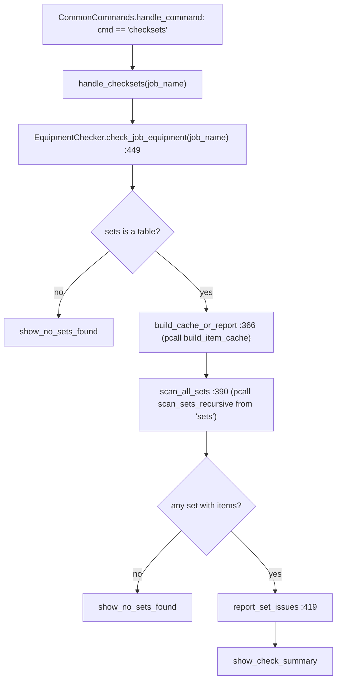
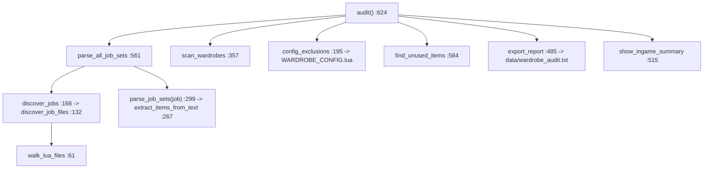
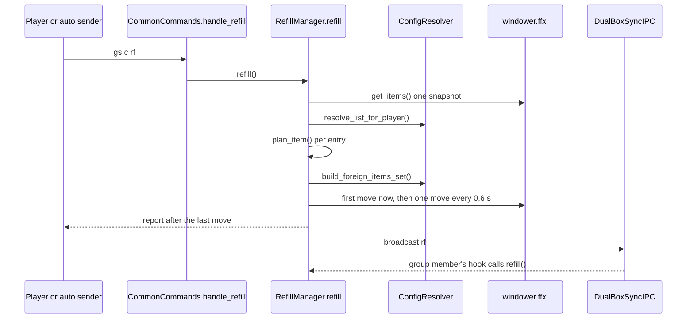

# Equipment, inventory and set-building helpers

This page covers everything under `shared/utils/equipment/`, `shared/utils/inventory/` and
`shared/utils/set_building/`, plus the generated HP/MP table `shared/data/equipment/ITEM_HP_MP.lua`.

The area holds three kinds of code:

- **Player-triggered inventory tools.** `//gs c checksets` walks the live `sets` table of the loaded
  job and reports every set slot whose item is not in an equippable bag (`equipment_checker.lua`).
  `//gs c wa` reads as text the set files of every job of the logged-in character (plus `_common/`),
  compares the item names it finds against the eight wardrobes, and writes the unused ones to
  `data/wardrobe_audit.txt` (`wardrobe_auditor.lua`); the same file also feeds the wardrobe organizer
  with item-usage and bag-pin maps. `//gs c rf` restocks consumables in the inventory from the Mog
  Case, Mog Sack and Mog Satchel according to a per-character list (a common list, per-job files that add to or replace it), pushes surplus and "foreign"
  consumables (named in another list, by default only the character's own: `store_foreign`) back, and prints a report (`refill_manager.lua` plus four helpers under `refill/`).
  `QuiverManager` opens an ammo quiver or pouch from THF, COR and RNG aftercast when the ammo stack runs
  low (`quiver_manager.lua`). None of these four is loaded at job load: each is `pcall(require, ...)`-ed
  on first use by its caller.
- **Load-time and per-action gear passes installed for every job.** `equip_hooks.lua` wraps
  GearSwap's `equip()` once per job load and passes every set through the registered hooks
  ([Equip hooks](#equip-hooks)). Three hooks are registered from `INIT_SYSTEMS`: `ImpactLock` keeps
  the cloak that grants Impact on through the cast ([Impact lock](#impact-lock)), `DuplicateGear` gives
  each side of a doubled ring / earring / weapon its own copy ([Doubled gear](#doubled-gear)), then
  `HPPriority` ranks every swap's pieces by the HP they gain over the gear worn
  ([HP priority](#hp-priority)); `//gs c gearscan` writes the augments it reads for pieces the sets
  name without augments ([Gear scan](#gear-scan)). `ElementalBelt`, `DualWield` and `TreasureHunter` are installed by
  `INIT_SYSTEMS` on Mote's hooks; they are documented in
  [factories-and-helpers.md](factories-and-helpers.md) and only summarised here.
- **Libraries called by job code.** `WeaponResolver` (weapon states -> sets), `BaseSetBuilder`
  (movement and town idle gear), `ElementalBonus` (Obi / Orpheus arithmetic), `AmpullaLock` (PLD/WAR
  Hoxne ammo lock), `SpellGearLock` (Dispelga's Daybreak).

Every claim below was checked against the code on 2026-09-28 (the equip hooks, doubled gear and HP
priority sections on 2026-09-30, commit `2588c3c`; the Impact lock on 2026-09-30, commit `1a25307`). Line numbers are given for the files
that were re-read that day; elsewhere the function is named, which survives edits better.

## Files

### Modules

| Path | Lines | Role | Loaded by | Documented in |
|---|---|---|---|---|
| `shared/utils/equipment/equipment_checker.lua` | 489 | `//gs c checksets`: name -> location cache of owned items, walk of `sets`, report of unavailable slots | `CommonCommands.handle_checksets`, on demand | this page |
| `shared/utils/equipment/wardrobe_auditor.lua` | 764 | `//gs c wa` report (skips the `NEVER_TOUCH` wardrobes of `WARDROBE_CONFIG.lua`); text parser of set files; `build_pinned_bags` / `build_frequency_map` / `collect_all_used_names` for the organizer | `CommonCommands.handle_wardrobeaudit`; `wardrobe/lib/state.lua`, `items.lua`, `rules.lua`, `reports.lua` | this page |
| `shared/utils/equipment/equip_hooks.lua` | 80 | Wraps GearSwap's `equip()` once per load (`_G._equip_hooks_wrapper`); every table argument goes through the registered hooks, lowest `order` first: 5 `impact_lock`, 10 `duplicate_gear`, 20 `hp_priority` | `impact_lock.lua`, `duplicate_gear.lua`, `hp_priority.lua` (`EquipHooks.add` / `remove`) | this page |
| `shared/utils/equipment/impact_lock.lua` | 159 | At the precast of Impact, picks the cloak that grants it (Crepuscular / Twilight Cloak) and locks it: the equip hook `impact_lock` (order 5) puts it on every set and drops their `head` until the aftercast, a cancel or 20 s | `INIT_SYSTEMS.lua`, GEAR HOOKS block (`ImpactLock.install`), every load, every job | this page |
| `shared/utils/equipment/duplicate_gear.lua` | 225 | Equip hook `duplicate_gear` (order 10): a ring, earring or main / sub piece named without bag or augments, owned in 2+ copies without augments, gets the `bag` of the copy that side takes | `INIT_SYSTEMS.lua`, GEAR HOOKS block (`DuplicateGear.install`), every load; then every `equip()` call | this page |
| `shared/utils/equipment/hp_priority.lua` | 380 | At load, keeps the HP / MP of the pieces the sets name and registers the equip hook `hp_priority` (order 20): each set goes on as a copy whose pieces carry `priority` = HP gained over the piece worn in that slot (dHP*1000+dMP on the `mp_jobs`, default BLM/RDM/GEO); settings from `<Char>/_common/combat/HP_PRIORITY.lua` | `INIT_SYSTEMS.lua`, GEAR HOOKS block, every load; then every `equip()` call | this page |
| `shared/utils/equipment/gear_scan.lua` | 175 | `//gs c gearscan`: decodes the augments of every equipment piece in the bags, writes `<Char>/saved/gear_augments.lua`; `load()` reads that file for HP priority | `COMMON_COMMANDS.lua` router (`run`); `hp_priority.lua` (`load`) | this page |
| `shared/utils/equipment/weapon_resolver.lua` | 119 | `set_for(slot, value)`: the set a `MainWeapon` / `SubWeapon` value equips, off-hand weapon replaced when the player cannot dual wield; `can_dual_wield()`; `is_offhand_weapon(name)` | 12 job set builders (see below) | this page |
| `shared/utils/equipment/item_index.lua` | 140 | Name lookups over `res.items` built in one walk per session (`windower._item_index`): `id(name)`, `is_weapon(name)`, `dual_wields(name)`, `ammo_container(name)` (pouch / quiver of an ammo) | `weapon_resolver.lua`, `quiver_manager.lua`, `refill/item_resolver.lua`, `weaponskill/ws_slots.lua` (`same_item`, WAR / PLD weapon detection) | this page |
| `shared/utils/equipment/elemental_bonus.lua` | 75 | Pure arithmetic: what Hachirin-no-Obi and Orpheus's Sash add for an action | `elemental_belt.lua`, `custom/custom_conditions.lua` (`obi_better` / `orpheus_better`) | this page; [keybinds-and-custom.md](keybinds-and-custom.md) |
| `shared/utils/equipment/elemental_belt.lua` | 213 | Obi or Orpheus chosen for every job on `cleanup_precast` / `cleanup_midcast`; `//gs c belt` | `INIT_SYSTEMS.lua` (`ElementalBelt.install`) | [factories-and-helpers.md](factories-and-helpers.md#elementalbelt) |
| `shared/utils/equipment/dual_wield.lua` | 247 | Dual Wield tier sets (`sets.DW.*`) laid on the engaged set by magic haste; `//gs c dw` | `INIT_SYSTEMS.lua` (`DualWield.install`) | [factories-and-helpers.md](factories-and-helpers.md#dualwield) |
| `shared/utils/party/support_tier.lua` | 108 | Weaponskill set version by party support (`.Group` / `.Solo`); `//gs c support` | `INIT_SYSTEMS.lua` (`SupportTier.install`) | [factories-and-helpers.md](factories-and-helpers.md#supporttier) |
| `shared/utils/party/party_jobs.lua` | 106 | Main job of each party member (0xDD / 0xDF, alt report, trusts) | `support_tier.lua` | [factories-and-helpers.md](factories-and-helpers.md#supporttier) |
| `shared/utils/equipment/treasure_hunter.lua` | 290 | `TreasureMode` (Off/Tag/Full, SATA on THF), mob tagging, engaged (skipped during a COR roll, `GearHold`) and action overlays | `INIT_SYSTEMS.lua` (`TreasureHunter.install`) | [factories-and-helpers.md](factories-and-helpers.md#treasurehunter) |
| `shared/utils/equipment/treasure_commands.lua` | 63 | `//gs c th` built on `optional_state_commands.create` | `COMMON_COMMANDS.lua` router | [commands-and-debug.md](commands-and-debug.md) |
| `shared/utils/equipment/spell_gear_lock.lua` | 135 | A piece a spell cannot be cast without (Dispelga -> Daybreak), worn through Combat Mode | RDM precast / midcast / aftercast / commands | [factories-and-helpers.md](factories-and-helpers.md#spellgearlock), [../jobs/rdm.md](../jobs/rdm.md) |
| `shared/utils/equipment/ampulla_lock.lua` | 194 | Ammo slot held on Hoxne Ampulla for the Hoxne stance (PLD, WAR) | PLD/WAR commands (`job_state_change`), PLD/WAR entry `user_setup` / `file_unload`, wardrobe organizer | this page; [../jobs/pld.md](../jobs/pld.md) |
| `shared/utils/set_building/base_set_builder.lua` | 216 | `apply_movement`, `lay_weapon`, `lay_weapons`, `kraken_in_offhand`, `select_idle_base_town`, `select_idle_base`, `lay_town_set`, `is_in_town` shared by the job set builders | set builders of 21 jobs (every job but SMN; BST: `lay_town_set` and `apply_movement`), `DNC_IDLE.lua`, `SMN_IDLE.lua`, `custom/custom_conditions.lua` | this page |
| `shared/utils/inventory/refill_manager.lua` | 312 | `//gs c rf` facade: plans pulls/pushes, queues the moves, schedules them 0.6 s apart | `CommonCommands.handle_refill`, dual-box `rf` hook | this page |
| `shared/utils/inventory/refill/config_resolver.lua` | 361 | Picks the refill list (craft / job+subjob / common list + job extra / fallback) and builds the foreign item set (this character's lists, or other characters' too, per `store_foreign`) | `refill_manager.lua` | this page |
| `shared/utils/inventory/refill/item_resolver.lua` | 49 | Lazy name -> item id index over `res.items` | `refill_manager.lua`, `config_resolver.lua` | this page |
| `shared/utils/inventory/refill/bag_scanner.lua` | 45 | Counts one item id in one bag and returns its slots | `refill_manager.lua` | this page |
| `shared/utils/inventory/refill/refill_panels.lua` | 227 | Chat output of the refill (banner, progress, report) | `refill_manager.lua` | this page |
| `shared/utils/inventory/quiver_manager.lua` | 184 | After a ranged attack with the ammo worn (or a named one), uses a quiver/pouch with `/item` when the ammo count drops to a threshold (per job overridable in `REFILL_CONFIG.lua` `quiver_open_at`) | `THF_AFTERCAST.lua`, `COR_AFTERCAST.lua`, `RNG_AFTERCAST.lua` | this page |

### Data, generator and configs

| Path | Lines | Role |
|---|---|---|
| `shared/data/equipment/ITEM_HP_MP.lua` | 6 534 (6 529 entries) | Generated HP/MP table read by `hp_priority.lua` (do not edit by hand) |
| `shared/data/equipment/PATH_RANK_GEAR.lua` | 2 598 (67 entries) | Stats of path / rank gear per path and rank, read by hand from BG-Wiki (page link and notes per entry); read by `gear_scan.lua` at `//gs c gearscan` |
| `scripts/item_db/build_item_db.py` | 379 | Builds the item database from Windower `res/` and regenerates `ITEM_HP_MP.lua` |
| `scripts/item_db/find_items.py` | 94 | Query tool over the generated SQLite (`--stat hp --slot Head --job WAR --top 10`) |
| `_master/config_global/REFILL_CONFIG.lua` | 71 | Template of `<Char>/_common/inventory/REFILL_CONFIG.lua`: bags, the common list `default_list` (Panacea, Antacid, Holy Water, Remedy, Prism Powder, Silent Oil, 12 each), a commented `subjobs` example and a commented `quiver_open_at` line |
| `_master/config/<job>/<JOB>_REFILL.lua` | 42 each | Generic job refill file for each of the 22 jobs: every line commented (`extra`, `default`, `subjobs` examples), so the common list applies |
| `_master/config/craft/CRAFT_REFILL.lua` | 32 | Generic craft list (empty) |
| `_master/Tetsouo/config/<job>/<JOB>_REFILL.lua` | 20-54 | Tetsouo's own job lists (BLM BRD BST COR DNC PLD THF WAR) |
| `_master/Tetsouo/config/craft/CRAFT_REFILL.lua` | 34 | Tetsouo's list used while a craft set is active |
| `_master/Kaories/config/<job>/<JOB>_REFILL.lua` | 22-42 | Kaories' own job lists (COR GEO PLD RDM) |
| `_master/config_global/WEAPON_CONFIG.lua` | - | Template of `<Char>/_common/combat/WEAPON_CONFIG.lua` (`equip_without_set`) |
| `_master/config_global/HP_PRIORITY.lua` | 36 | Template of `<Char>/_common/combat/HP_PRIORITY.lua` (`enabled`, `unity = 'min'`, `mp_jobs`, `skip_jobs`) |
| `_master/config_global/ELEMENTAL_BELT.lua`, `DW_CONFIG.lua` | - | Templates of the belt and Dual Wield settings (see [factories-and-helpers.md](factories-and-helpers.md)) |

Live copies (gitignored): `Tetsouo/{blm,brd,bst,cor,dnc,pld,thf,war}/inventory/*_REFILL.lua` and
`Tetsouo/_common/inventory/CRAFT_REFILL.lua`, `Kaories/{cor,geo,pld,rdm}/inventory/*_REFILL.lua`. On
2026-09-30 every live list was identical to its overlay (`diff --strip-trailing-cr`; only header
comments differ in some). Both characters' `_common/inventory/REFILL_CONFIG.lua` carry the template's
`default_list` since 2026-09-30, which gives the same lists as before (checked offline on 352
job/subjob cases).

Related code outside this area: the command router `shared/utils/core/COMMON_COMMANDS.lua`, the
message formatter `shared/utils/messages/formatters/system/message_equipment.lua` and its templates
`shared/utils/messages/data/systems/equipment_messages.lua`, the dual-box IPC
`shared/utils/dualbox/dualbox_sync_ipc.lua`, the craft modules `shared/utils/craft/craft_manager.lua`
and `craft_commands.lua`, and the wardrobe organizer under `shared/utils/wardrobe/`
([wardrobe-organizer.md](wardrobe-organizer.md)).

## How it works

### `//gs c checksets`


```mermaid
flowchart TD
    A["CommonCommands.handle_command: cmd == 'checksets'"] --> B["handle_checksets(job_name)"]
    B --> C["EquipmentChecker.check_job_equipment(job_name) :449"]
    C --> D{"sets is a table?"}
    D -- no --> X1["show_no_sets_found"]
    D -- yes --> E["build_cache_or_report :366 (pcall build_item_cache)"]
    E --> F["scan_all_sets :390 (pcall scan_sets_recursive from 'sets')"]
    F --> G{"any set with items?"}
    G -- no --> X2["show_no_sets_found"]
    G -- yes --> H["report_set_issues :419"]
    H --> I["show_check_summary"]
```

1. `CommonCommands.handle_command` passes the job code the job file supplied (`'WAR'`, `'BRD'`, ...;
   `shared/jobs/*/functions/*_COMMANDS.lua`) to `CommonCommands.handle_checksets`, which requires the
   checker and calls `check_job_equipment(job_name)` (`equipment_checker.lua:449`). The job name is only
   used for the header and warning text; the data walked is always the sandbox global `sets` of the
   loaded job file.
2. Item cache (`build_item_cache`, `equipment_checker.lua:184`), built once per command from one
   `windower.ffxi.get_items()` call:
   - `add_equipped_items` (`:138`) iterates `items.equipment` and treats each non-`_bag` value as an
     item id. In the Windower API those values are inventory indices inside the `<slot>_bag` bag, not
     item ids (see Known issues). Equipped items are still found by the next step because an equipped
     item stays in its bag.
   - `add_bag_items` (`:149`) adds inventory and wardrobe 1-8 (`EQUIPPABLE_BAGS`, `:38`) as
     `available = true`, then `safe safe2 storage locker satchel sack case temporary` (`STORAGE_BAGS`,
     `:100`) as `in_storage = true`.
   - `add_slip_items` (`:164`) adds Porter Moogle slip contents as storage (`bag_name = 'Slip NN'`)
     when `pcall(require, 'slips')` succeeded at module load. Inside the sandbox this resolves to
     Windower's `addons/libs/slips.lua` through GearSwap's path search.
   - Every name field of the resource entry in `NAME_FIELDS` (`:92`) becomes a lowercase key
     (`make_cache_adder`, `:108`). With the Windower resources library only `en`, `enl` and their
     aliases `english`, `english_log` return strings; the French and German fields do not exist. When
     two bags hold the same name, an available location replaces an unavailable one; otherwise the
     first one written wins.
3. Walk (`scan_sets_recursive`, `:341`), starting at `sets` with path `'sets'`:
   - `skip_node` (`:247`) stops at depth > 15 (`MAX_RECURSION_DEPTH`, `:28`, with an error message), at
     non-tables, at a table already visited in this scan (aliases such as `sets.a = sets.b` are
     therefore reported once, under whichever path `pairs` reaches first), and at `sets.naked` / any
     `*.naked` path. `visited_tables` is module-level and reset by `scan_all_sets`.
   - A table is an equipment set if any key is in `VALID_SLOTS` (`:51-72`: `main sub range ammo head
     neck ear1 ear2 left_ear right_ear body hands ring1 ring2 left_ring right_ring back waist legs feet`).
     GearSwap also accepts `ranged`, `lear`, `rear`, `learring`, `rearring`, `lring`, `rring`
     (*(engine)* `statics.lua`, slot map); those keys are not slots for the checker.
   - `collect_set_issues` (`:287`) takes the item name of each slot value (a string, or `.name` of a
     table, `get_item_name`, `:81`), looks it up lowercased, treats `'empty'` as available, and records
     every slot whose status is not `available`. Augments, `bag` and `priority` fields are ignored. A
     set that names no item (only `empty` tables, for example) is not counted.
   - The walk always continues into child tables whose key is not a slot and not `naked`. Paths are
     built with `.` separators, so `sets.precast.WS['Savage Blade']` prints as
     `sets.precast.WS.Savage Blade`.
4. `record_set` (`:312`) counts a set as valid or increments `storage_count` / `missing_count` once
   per unavailable slot per set: the same missing ring in 20 sets counts 20.
5. Output: only problems are printed (`report_set_issues`, `:419`). Each problem is two lines from
   `equipment_messages.lua`: `[MISSING] [SLOT] Item` or `[STORAGE] [SLOT] Item - Found in <bag>`,
   followed by `  Set: <path>`. The header (`[EQUIPMENT CHECK] <JOB>` between `=` rules of
   `MessageCore.SEPARATOR_WIDTH`) and the summary (`Valid Sets: v/t`, then `Items in Storage: n` and
   `Missing Items: n` only when non-zero) are printed by `message_equipment.lua` `show_check_header` /
   `show_check_summary`.
6. Errors: a throw in the cache build or in the walk is caught and reported (`show_cache_build_failed`,
   `show_scan_failed`); the command returns `false`. The debug lines (`show_scanning`,
   `show_alias_detected`, cache size) only print when the file-level `local DEBUG = false` (`:26`) is
   edited to `true`; no command toggles it.

### `//gs c wa` and the organizer helpers


```mermaid
flowchart TD
    A["audit() :624"] --> B["parse_all_job_sets :561"]
    B --> C["discover_jobs :166 -> discover_job_files :132"]
    C --> D["walk_lua_files :61"]
    B --> E["parse_job_sets(job) :299 -> extract_items_from_text :267"]
    A --> F["scan_wardrobes :357"]
    A --> X["config_exclusions :195 -> WARDROBE_CONFIG.lua"]
    A --> G["find_unused_items :584"]
    A --> H["export_report :485 -> data/wardrobe_audit.txt"]
    A --> I["show_ingame_summary :515"]
```

1. Sets folder: `windower.addon_path .. 'data/' .. <player name> .. '/sets/'`, falling back to
   `Tetsouo` when `get_player()` returns nothing (`sets_dir`, `wardrobe_auditor.lua:39`). Nothing is
   loaded with `loadfile`; files are read with `io.open` because the sandbox has no
   `loadfile`/`setfenv`.
2. `walk_lua_files` (`:61`) walks the tree iteratively; an entry ending in `.lua` is a file, anything
   else is pushed as a directory.
3. `discover_job_files` (`:132`) maps each file to a job: `<job>_sets.lua` at the root (flat layout,
   Kaories and the templates) or anything under `<job>/` (modular layout, Tetsouo live). Only the 22
   codes in `VALID_JOBS` (`:29`) count, so root files such as `bonecraft_sets.lua` and
   `fishing_sets.lua` are skipped. Every file under `_common/` is appended to every discovered job.
   `parse_job_sets` calls `discover_job_files()` again for each job, so the tree is walked once per job
   plus once for the job list.
4. `extract_items_from_text` (`:267`) removes `--` line comments, then collects every single- or
   double-quoted string that follows `=`. `looks_like_item_name` (`:227`) drops `empty`, `Path: A-D`,
   augment-like strings (`^%u%u%u?%u?[%+%-]%d`), numbers, strings shorter than 3 characters, and
   strings starting with `System:` or `wardrobe`. Every string that survives is a "used" name for that
   job, whether or not a set references the variable that holds it. Strings in list form without `=`
   (`{'Aegis', 'Ochain'}`) are not collected; continuation lines of `--[[ ... ]]` block comments are.
5. `scan_wardrobes` (`:357`) lists wardrobe 1-8 with, for each item, the `en`/`english`/`enl`/
   `english_log` variants in lowercase (`get_all_names`, `:337`). An item is used if any variant is a
   used name or a kept name (`find_unused_items`, `:584`). What is not judged comes from the
   character's `_common/inventory/WARDROBE_CONFIG.lua` since 2026-09-30 (`config_exclusions`, `:195`,
   which calls the organizer's `Config.refresh()`): the `NEVER_TOUCH` wardrobes are counted in totals
   but never judged (the report prints "(not judged - NEVER_TOUCH in WARDROBE_CONFIG.lua)" under
   them), and the `KEEP` and `NEVER_MOVE` items count as used. Before, a fixed
   `IGNORED_WARDROBES = { wardrobe7 = true }` skipped W7 for every character. Without a config
   nothing is skipped.
6. `export_report` (`:485`) writes `data/wardrobe_audit.txt`: header with scanned and failed jobs, one
   block per wardrobe, and a summary where `used = total - unused - ignored` (`write_report_summary`,
   `:465`; the ignored line is labelled "Not judged (NEVER_TOUCH)" since 2026-09-30). The file name carries no character name; each run overwrites the previous one. The chat
   summary (`show_ingame_summary`, `:515`) prints the unused count per wardrobe and
   `Used: total - unused / total`, which includes the ignored wardrobe in "used".
7. The command fails with a chat message when no job file could be read or when all wardrobes are
   empty (both in `audit()`).

Organizer helpers (same text parser, no report):

- `build_pinned_bags()` (`:688`) scans every `.lua` under the sets folder and records `name` + `bag`
  pairs. It repeatedly removes the innermost `{...}` block (at most 200 passes per file), which handles
  `{name=..., augments={...}, bag=...}` and nested maps such as `_common/sets/rings.lua`. The name pattern
  `name%s*=%s*['"]([^'"]+)['"]` stops at the first quote character of either kind. Bag strings are
  mapped by `BAG_NAME_TO_ID` (`:668`, `wardrobe`/`wardrobe 1`/`wardrobe1` -> 8, `wardrobe N` ->
  10..16); any other bag string is ignored. Caller: `wardrobe/lib/state.lua`, which merges the result with the
  `PLACE` / `JOBS` / `TYPES` rules of `WARDROBE_CONFIG.lua` (`wardrobe/lib/rules.lua`).
- `build_frequency_map()` (`:659`) and `collect_all_used_names()` (`:755`) have identical bodies and
  return `{[name_lower] = {[JOB] = true}}`. Callers: `build_frequency_map` - `wardrobe/lib/reports.lua`
  (declared-vs-held report of `//gs c wo scan`) and `wardrobe/lib/rules.lua` (`JOBS` pins);
  `collect_all_used_names` - `wardrobe/lib/items.lua` (`collect_used_names` when `SCOPE = 'all_jobs'`,
  which `//gs c wo alt` forces).

### `//gs c rf`


```mermaid
sequenceDiagram
    participant U as Player or auto sender
    participant CC as CommonCommands.handle_refill
    participant RM as RefillManager.refill
    participant CR as ConfigResolver
    participant W as windower.ffxi
    participant IPC as DualBoxSyncIPC
    U->>CC: gs c rf
    CC->>RM: refill()
    RM->>W: get_items() one snapshot
    RM->>CR: resolve_list_for_player()
    RM->>RM: plan_item() per entry
    RM->>CR: build_foreign_items_set()
    RM->>W: first move now, then one move every 0.6 s
    RM-->>U: report after the last move
    CC->>IPC: broadcast rf
    IPC-->>RM: group member's hook calls refill()
```

1. Entry points. `//gs c refill` / `//gs c rf` -> `CommonCommands.handle_command` ->
   `CommonCommands.handle_refill` (`COMMON_COMMANDS.lua:234`), which calls `RefillManager.refill()` and
   then, whatever it returned, `DualBoxSyncIPC.broadcast('rf')`. Every other instance whose box group holds the sender runs
   `refill_hook`, registered for `rf` and `refill` in the dual-box block of `INIT_SYSTEMS.lua`; it calls
   `RefillManager.refill()` directly and does not broadcast again. `gs c rf` is also sent
   automatically: 2.5 s after any craft set is equipped (`lock_after_delay` in `craft_commands.lua`),
   0.5 s after `//gs c uncraft` (`craft_manager.lua`), and 3.5 s after a successful wardrobe organize
   (`schedule_lockstyle` in `wardrobe_organizer.lua`). Each of these goes through `handle_refill` and
   therefore also refills the partner.
2. Guards (`RefillManager.refill`, `refill_manager.lua:259`): the sandbox `player` must exist and
   `get_items()` must return a table; otherwise one red `[Refill]` line. There is no in-progress guard.
3. List resolution (`ConfigResolver.resolve_list_for_player`, `config_resolver.lua:328`), first match
   (since 2026-09-30, `bea1f23`). The label is printed as `Config` in the start banner:
   - No player or main job `NON`: `FALLBACK_LIST` (`:54`, six medicines at 12), label
     `fallback (no player)`.
   - Craft mode (`_G.CraftManager.is_active()`; `craft_manager.lua` owns the session state):
     `CRAFT_REFILL` through `CharPaths.load('craft', ...)` (`<Char>/_common/inventory/CRAFT_REFILL.lua`,
     then the older places); its `.default` is used (label `CRAFT (<name>)`, or `CRAFT`) and its bag
     fields apply. Without the file or without `.default`, resolution falls through to the job.
   - Job file: `pcall(require, ...)` of `<Char>/<job>/inventory/<JOB>_REFILL` (`CharPaths.module('job', ...)`).
     A missing file, a file that throws or one that returns no table counts as no job file.
     `subjobs[<SUB>]` when present (label `<JOB>/<SUB>`), else `default`, the job's own list in place of
     the common one (label `<JOB>/default`).
   - Common list, from `<Char>/_common/inventory/REFILL_CONFIG.lua` (`common_list`): its
     `subjobs[<SUB>]` (label `common/<SUB>`), else its `default_list` (label `common`). When the job
     file has `extra`, it is added to that list (`with_extra`, label `<common label> + <JOB> extra`,
     e.g. `common/DNC + WAR extra`): an extra entry whose name, or first variant, matches a common
     entry's (case ignored) replaces that entry in place, so its target wins; the others are appended.
     A job file whose lines are all comments (the 22 generic templates) returns an empty table, so the
     common list applies as is.
   - Neither a job list nor a common list (no `REFILL_CONFIG.lua`, or one without `default_list` and
     without a matching `subjobs` entry): `FALLBACK_LIST`, label `fallback` (or
     `fallback + <JOB> extra` when the job file has `extra`).
   - Bags (`resolve_bags`), the player's choice since 2026-09-30: `store_bag` (where surplus and
     foreign items go) and `source_bags` (where pulls come from, in order) are read from the list file
     (`<JOB>_REFILL` / `CRAFT_REFILL`), else from `<Char>/_common/inventory/REFILL_CONFIG.lua`, else `case` and
     `{'case', 'sack', 'satchel'}` (`DEFAULT_STORE_BAG`, `DEFAULT_SOURCE_BAGS`). Names: `case`,
     `sack`, `satchel`, `wardrobe1`..`wardrobe8` (`wardrobe` = `wardrobe1`), case and spaces ignored
     (`BAG_INFO`): every bag the game opens away from the Mog House. Unknown names are skipped; a
     `source_bags` with none left falls back to the default. The third return value carries both:
     `{id, display, sources = {{key, id, display}, ...}}`.
4. Planning (`plan_item`, `refill_manager.lua:160`), for each list entry:
   - `ItemResolver.resolve_variants(name)` keeps the variants whose name resolves in `res.items`
     through `en`/`enl`/`name`/`name_log` (`ItemIndex.id`, `shared/utils/equipment/item_index.lua`). If none
     resolves, the row is reported with `current = 0` and `short = target` (printed as "Out of stock").
   - Held count = sum of all variants in the inventory (`count_held`, `:65`). Target: the number, or for
     `target = 'all'` the held count plus everything of every variant in the source bags
     (`effective_target`, `:83`).
   - Deficit > 0: pull moves, variants in list order, source bags in order, stack by stack
     (`queue_deficit`, `:125`).
   - Deficit < 0: push moves of the surplus to the store bag, variants in list order (`queue_surplus`,
     `:99`); the preferred variant is pushed first.
5. Foreign sweep (`sweep_foreign_items`, `:218`): `ConfigResolver.build_foreign_items_set`
   (`config_resolver.lua:210`, called with `player.name`) reads the character's `REFILL_CONFIG.lua`
   (`load_refill_config`, `:161`) and picks the lists to scan from its `store_foreign`
   (`foreign_sources`, `:172`; since 2026-10-01, before that every character folder was always read):
   - `'mine'`, or the key absent (any value other than `'all'`, `false` or `'off'` counts as `'mine'`):
     this character's lists only (`load_char_refill_configs(char_name)`, `:99`).
   - `'all'`: `load_all_refill_configs(foreign_characters)` (`:140`), the same scan for every
     directory of `data/` whose name starts with an uppercase letter; when `foreign_characters` is a
     non-empty list, only the folders it names (case-insensitive). Empty or absent: every such folder,
     frozen clones included (the behaviour before 2026-10-01).
   - `false` or `'off'`: no list, so nothing is foreign; only the surplus of step 4 goes back.

   `load_char_refill_configs` loads every `*_REFILL.lua`, and `REFILL_CONFIG.lua` (as job `COMMON`),
   found in `_common/inventory/`, `common/inventory/`, `common/craft/`, every `<sub>/` and
   `<sub>/inventory/` folder and the same under `config/`. Every item id named in any of those lists
   (`default`, `extra`, `default_list` and all `subjobs` lists, `iterate_config_entries`) that is
   neither a variant of the current list nor a name in `never_store` (a list of item names in
   `REFILL_CONFIG.lua`) is foreign, and every inventory stack of a foreign id is queued for a full push
   to the store bag.
6. Execution (end of `RefillManager.refill`): the queue holds pulls and pushes in plan order, foreign
   pushes last. `execute_move(1)` runs immediately; each move schedules the next with
   `coroutine.schedule(..., 0.6)` (`MOVE_DELAY`, `:42`); each move first writes a `REFILL` trace
   line (`move <item> x<n>: <from> -> <to> (missing | surplus | foreign)`), and the run writes
   `list ...` and one `plan <item>: have <n>, target <n>` per line (`trace`, `:48`; only while
   `//gs c trace` is on). Pushes use
   `windower.ffxi.put_item(dst_bag, inventory_slot, count)`, pulls
   `windower.ffxi.get_item(src_bag, slot, count)`. Slots and counts come from the single snapshot
   taken at step 2; free space in the inventory or the store bag is not checked and failed moves are
   not detected. The report (`RefillPanels.show_report`, `refill_panels.lua:158`) is printed after the
   last move and shows the planned numbers.
7. Output example (WAR, inventory holding 24 Sublime Sushi +1 against a target of 12; colour codes
   omitted, standard separator options):

```
=====================================================================
====================== Inventory Refill - Started =======================
=====================================================================
  Config: WAR/default
  Surplus bag: Case
  Items tracked: 1
[Refill] Transferring 1 operation ...
=====================================================================
====================== Inventory Refill - Complete ======================
=====================================================================
  Sublime Sushi +1: 24/12 -> 12/12  (-12 -> Case)
  Pushed out: 12 item(s) (surplus)
=====================================================================
```

The rules are `WIDTH = 69` characters (`refill_panels.lua:28`); the title row is 4 characters wider on
purpose (`banner`, compensation for FFXI's proportional font). Since 2026-09-27 the panels write
through the sandbox `add_to_chat`, which `message_core.lua` wraps once per load with
`ChatSeparators.apply`: with the player's separator options a rule may be redrawn (character, colour,
width) or dropped; standard options leave every line as above.

Report row kinds (`show_report`): foreign (`foreign (n) -> Case`), surplus, already at target
(`n/t (OK)`), fully refilled, partially refilled (`Short n`), nothing available
(`Out of stock! Short n`). Totals: `Pulled in`, `Pushed out`, `Missing`, or `Status: Inventory already
complete`. Item names are coloured by keyword: food, ammo/quiver, everything else as medicine
(`FOOD_KEYWORDS` `:46`, `AMMO_KEYWORDS` `:54`, `item_row` `:116`).

### Quiver auto-open

`THF_AFTERCAST.lua`, `COR_AFTERCAST.lua` and `RNG_AFTERCAST.lua` (`job_aftercast`) require `QuiverManager`
on every aftercast and call `QuiverManager.after_ranged_attack(spell, nil, nil, 5)` (THF),
`after_ranged_attack(spell, nil, nil, 15)` (COR) and `(spell, nil, nil, AMMO_REFILL_AT)` (RNG, 15). With no names, the ammo is the one worn and the
container is `ItemIndex.ammo_container(ammo)`: the `Usable` item whose log name is the ammo's plus
` pouch` / ` quiver` (`'s` dropped, ` arrow` -> ` quiver`), and only when that name is unique (the
`Old Quiver` quest items are not a match). 95 ammo have one. Chrono / Living / Devastating Bullet
pouches and the Chrono Quiver are waist `Armor`: `/item` cannot use them from the inventory, so
they are left out. Explicit names still work (`after_ranged_attack(spell, 'Acid Bolt',
'Ac. Bolt Quiver', 5)`).

`after_ranged_attack` (`quiver_manager.lua:156`) returns `false` unless
`spell.action_type == 'Ranged Attack'` (GearSwap gives `/ra` the `type` `'Misc'`) and the shot was not
interrupted. It then replaces the caller's threshold through `job_threshold` (`:75`): the character's
`_common/inventory/REFILL_CONFIG.lua` `quiver_open_at[player.main_job]` when set (`CharPaths.optional`
under pcall); `false` there returns `false` (never opened), a number replaces the threshold, anything
else, a missing table or a missing job keeps the caller's value. The template has the line commented
out (`{COR = 15, THF = 5, RNG = 15}`). It also returns `false` unless ammo is worn, is the tracked ammo (when one is named) and has a container, so a
shot with other ammo does not warn about a stack that is not in use. Otherwise it schedules `check_and_refill(ammo, quiver,
threshold)` 1.0 s later, so FFXI has decremented the ammo count first, and returns `true`.

`check_and_refill` (`quiver_manager.lua:92`):
1. Returns if the same quiver was used less than `OPEN_COOLDOWN = 8.0` s ago (`os.clock`, per-name
   table `last_open`, `:45`).
2. Resolves both names through `resolve_id`, which reads the session-wide item index
   (`ItemIndex.id`, same fields and logic as `ItemResolver`).
3. Counts the ammo in the inventory and wardrobes 1-8 (`AMMO_BAGS`, `:33`); returns if the total is
   above the threshold.
4. If no quiver is in the inventory it prints a warning (`<ammo>: n left, no <quiver> in inventory!`)
   and returns without setting the cooldown, so the warning repeats on every ranged attack while the
   ammo stays low.
5. Otherwise it records the time, sends `input /item "<quiver>" <me>` and prints a success line.

The quiver has to be in the inventory for `/item`; the refill lists keep it there (`THF_REFILL.lua`
`Ac. Bolt Quiver` 12, Kaories `COR_REFILL.lua` `Brz. Bull. Pouch` 2). Because of the foreign sweep, a
quiver that the list in use does not name, but another scanned list does (the character's own lists
by default, see `store_foreign`), is pushed back to the store bag on every refill unless
`never_store` names it.

### Weapon states: `WeaponResolver`

Every set builder that applies `state.MainWeapon` / `state.SubWeapon` asks
`WeaponResolver.set_for(slot, value)` instead of reading `sets[value]` itself. Callers (all
`shared/jobs/<job>/functions/logic/set_builder.lua`): BLM, BLU, BRD, COR, DNC, DRK, GEO, RDM, RUN, SAM,
THF, WAR. PLD uses its own weapon logic. DRK's `apply_weapon` joined on 2026-09-28; before, it read
`sets[weapon]` directly and `equip_without_set` had no effect on DRK.

- **Default** (no `<Char>/_common/combat/WEAPON_CONFIG.lua`, or `equip_without_set` not `true`): returns
  `sets[value]`, exactly the old lookup. Tetsouo and Kaories have no `WEAPON_CONFIG.lua`, so nothing
  changed for them. Tetsouo's BLM relies on `Hvergelmir` having no set, so its idle and engaged sets
  keep their own staves.
- **`equip_without_set = true`** (template `_master/config_global/WEAPON_CONFIG.lua`), per slot:
  1. `sets[value]` when it exists and names that slot; an off-hand pick of a set that also carries a
     `main` returns only `{sub = set.sub}`, so it never moves the main hand;
  2. else `{main|sub = value}` when `value` is a weapon in `res.items` (category `Weapon`, grips
     included; `is_weapon`);
  3. else `nil`.
- **Off hand without Dual Wield** (since 2026-09-29, both modes): the set found above goes through a
  local `single_wield`. When its `sub` is an off-hand weapon (`is_offhand_weapon` returns `true`) and
  `can_dual_wield()` is false, `set_for` returns a copy whose `sub` is `sets.SingleWield.sub` (a set the
  player writes, e.g. `sets.SingleWield = {sub = "Nusku Shield"}`), or no `sub` at all when that set
  does not exist. The original set is not modified. Shields, grips and names the game does not know
  are left as they are. Every caller above gets it; PLD and BST, which read `sets[...]` directly, do not.
- `WeaponResolver.can_dual_wield()` (since 2026-09-29): `true` when `player` or `player.main_job` is
  not known yet (nothing is stripped), when the main job is NIN, DNC, THF or BLU, or when the subjob is
  NIN with `sub_job_level >= 10` or DNC with `sub_job_level >= 20`. The subjob name alone is not
  enough: Sheol Gaol and similar events set the subjob to level 0, keep its name and take the trait
  away, so /NIN at level 0 counts as no Dual Wield.
- `WeaponResolver.is_offhand_weapon(name)` answers "does this off-hand make the player dual wield?"
  from the game's item list: a `Weapon` with a combat skill (`skill > 0`) -> `true`; a shield or a grip
  (skill 0) -> `false`; a name the game does not know -> `nil`. Short and long names, any case. Used by
  the RDM set builder (`has_shield_equipped`, after its `can_dual_wield()` test: without Dual Wield
  the answer is always "no dual wield"; then `sets.shields` for unknown names) and the BLU set builder
  (`is_single_wield`).

The config is read once per sandbox (`enabled`, `pcall(require, 'config/WEAPON_CONFIG')`); both item
indexes are built lazily on first use (see [For maintainers / AI](#for-maintainers--ai) for the cost).

### Movement and town idle: `BaseSetBuilder`

`shared/utils/set_building/base_set_builder.lua` holds the five idle helpers the job set builders
share, by plain assignment (`SetBuilder.apply_movement = BaseSetBuilder.apply_movement`) or by call:

- `apply_movement(result)`: when `state.Moving.value == 'true'` (AutoMove,
  [factories-and-helpers.md](factories-and-helpers.md#automove)) and `sets.MoveSpeed` exists, returns
  `set_combine(result, sets.MoveSpeed)` under `pcall`; a failure prints `MessageFormatter.show_error` and
  returns `result` unchanged.
- `select_idle_base_town(base_set)`: lays the town set on top of an idle set (since 2026-09-29; it
  used to replace it). The idle underneath is `base_set`, except when `base_set` is Mote's own town
  pick (`sets.idle.Town` or `sets.idle.Town[IdleMode]`, which `get_idle_set` chooses in every city,
  Adoulin included): then it is rebuilt as Mote picks it in the field, `sets.idle`, then
  `sets.idle[IdleMode]` when that is a table. In Western/Eastern Adoulin, when `sets.Adoulin`
  exists, returns `set_combine(idle, sets.Adoulin), true`; in an `areas.Cities` zone whose name does
  not contain `Dynamis` (Adoulin without `sets.Adoulin` included), when `sets.idle.Town` exists,
  returns `set_combine(idle, town), true`, where `town` is Mote's town node or `sets.idle.Town`;
  otherwise `base_set, false`. A partial town set thus keeps the idle pieces in the slots it leaves
  out.
- `select_idle_base(base_set)` (since 2026-09-29): in town, the result of `select_idle_base_town`;
  outside town, `sets.idle[state.HybridMode.current]` when it is a table, else `base_set`; returns
  `set, in_town`. Mote's `get_idle_set` follows `IdleMode` only, so without it `sets.idle.PDT` is
  never worn on a job whose PDT toggle is `HybridMode`. The HybridMode set replaces Mote's base
  whole: `sets.idle.Weak` and Mote's defense and kiting layers only show when the current
  HybridMode value has no idle set. Used by: DNC, DRK, THF, WAR (DNC, THF and WAR as
  `SetBuilder.select_idle_base`, DRK from `build_idle_set`).
- `lay_town_set(idle, town_set)` (since 2026-09-29): the same zone test and layering for a job that
  builds its own idle and passes its own town set (BST: `sets.me.idle.Town` over the pet or master
  idle). In Western/Eastern Adoulin, when `sets.Adoulin` exists, returns
  `set_combine(idle, sets.Adoulin), true`; in an `areas.Cities` zone without `Dynamis` in its name
  (Adoulin included), when `town_set` is given, `set_combine(idle, town_set), true`; otherwise
  `idle, false`. `select_idle_base_town` and `lay_town_set` share one local zone test (`town_zone`)
  and one layering helper (`lay_town`).
- `lay_weapon(result, slot, value)` (since 2026-09-29): `WeaponResolver.set_for(slot, value)` on top of `result` under `pcall` (error message on failure), unchanged when the value has no set. `lay_weapons(result)`: `lay_weapon` with `state.MainWeapon.current` then `state.SubWeapon.current`. They replace the copies each set builder carried: BLM, BLU, BRD, GEO, RDM, THF (outside the Abyssea weapon) call `lay_weapons`; DNC, DRK, RUN (main and grip), SAM, WAR call `lay_weapon`. COR calls `lay_weapon` for `MainWeapon` since 2026-09-29 (before, its own code laid the sub only on /NIN or /DNC); its gun still comes from `sets[...]`. PLD and BST (`sets[...]` read directly) keep their own weapon code. 168-case offline comparison (every weapon value, `equip_without_set` on and off): identical.
- `is_in_town()`: the same zone test without any set (used by `SMN_IDLE.lua` for the avatar idle
  set and by the `town` condition of `custom/custom_conditions.lua`).

### HP priority

`INIT_SYSTEMS.lua` (GEAR HOOKS block, right after the MODULE CACHE block) calls `HPPriority.apply()`
once per job load, under `pcall`, after `DuplicateGear.install()`. By then `get_sets()` has returned from `include('Mote-Include.lua')`,
so Mote has run `init_gear_sets()` and `_G.sets` holds the job's sets. (The require cache itself is
normally installed earlier, by `shared/utils/config/config_loader.lua`, which every entry file requires
at file level; the INIT_SYSTEMS call is a no-op then.)

GearSwap sends the pieces of a set from the highest `priority` to the lowest, pieces without one
counting as 0 (so a negative priority goes on after them). An action goes through several swaps
(idle or engaged > precast > midcast > aftercast > idle or engaged), each starting from what the one
before put on, so a rank fixed once per piece cannot be right at every step. The rank is therefore set
at each swap: a piece's priority is the HP it gains over the piece worn in that slot right now. Pieces
that raise max HP go on first, those that lower it last, so max HP never dips mid-swap and current HP
is not lost. The sets themselves are never modified.

`HPPriority.apply()`:

1. Clears `_G._hp_priority_state` and removes the `hp_priority` equip hook
   (`EquipHooks.remove`), then returns 0 unless `player.main_job` is known and `_G.sets` is a
   table; every character is processed. It reads the settings (`HPPriority.settings()`): the
   character's `_common/combat/HP_PRIORITY.lua` through `CharPaths.optional('common', 'HP_PRIORITY')`,
   every key optional, over `DEFAULTS` = `{enabled = true, unity = 'min', mp_jobs = {'BLM', 'RDM',
   'GEO'}, skip_jobs = {}}` (`unity` is `'max'` only when written so; the two job lists become sets of
   upper-case job codes). It returns 0 when `enabled` is `false` or the job is in `skip_jobs` (empty
   by default: PLD is ranked like every other job).
2. Loads `ITEM_HP_MP.lua` with `pcall(dofile, windower.addon_path .. 'data/shared/data/equipment/ITEM_HP_MP.lua')`:
   `dofile`, not `require`, so the module cache does not keep the 6 529-entry table for the whole
   session.
3. Builds an index (`build_index`) holding only the entries of the pieces the sets name and of the
   pieces worn now (`player.equipment`); the full table is then dropped. It walks `_G.sets` with a
   `visited` table, since sets reference each other: the value of every key in `SLOTS` (GearSwap's
   slot names and aliases, `ranged`/`lear`/`rring` included) is a piece; a table with a `name` field
   is a piece and is not walked into; any other table is.
4. Stores the load state on `_G._hp_priority_state` = `{index, unity, weigh_mp, scanned}`
   (`weigh_mp`: the job is in `mp_jobs`; `scanned`: the gear scan cache, `GearScan.load()`, read once
   per `apply()`, see [Gear scan](#gear-scan)).
5. Registers `rank_hook` as the equip hook `hp_priority`, order 20 (`EquipHooks.add`, which also
   wraps `equip()` if this load has not yet; see [Equip hooks](#equip-hooks)). Until 2026-09-30
   `hp_priority.lua` wrapped `equip()` itself (`wrap_equip`, `_G._hp_priority_equip`). When the
   system is off, the job skipped, or the data file or the sets missing, no hook is registered and
   the pieces go on without computed priorities.

At each `equip(...)` call the hook gets every table argument (after the `duplicate_gear` hook, so a
doubled piece already carries its `bag`) and returns a copy (`ranked_copy`); the set given is not
touched. For each key of the set that is in `SLOTS` (`priority_of`):

- A table that already has a `priority` is kept as it is, as is a value that is not a piece (neither a
  string nor a table with a string `name`).
- The worn piece is `player.equipment[slot]`, the set's slot name mapped to `player.equipment`'s own
  by `WORN_SLOT` (`ear1`/`lear` -> `left_ear`, `ear2`/`rear` -> `right_ear`, `ring1`/`lring` ->
  `left_ring`, `ring2`/`rring` -> `right_ring`, `ranged` -> `range`). `player.equipment` holds the gear
  GearSwap has sent, so at midcast it is the precast gear.
- HP and MP of the new piece and of the worn one (`piece_hp_mp`; an empty slot or `empty` is 0 / 0):
  the index entry, plus the Unity bonus for the `unity` setting (`'max'`: top of the range, `'min'`:
  bottom), plus the `HP+N` / `MP+N` augments written in the set (augments starting `Pet:`, `Avatar:`,
  `Automaton:`, `Wyvern:`, `Luopan:` are ignored, `augment_hp_mp`). For a piece named without augments
  (a plain name, a table with no `augments` field, and always the worn piece, which is a name) it also
  adds the `hp` / `mp` of the matching gear scan entry, unless that entry is marked `differ`.
- `priority = dHP`, or `dHP * 1000 + dMP` on the `mp_jobs` (default BLM, RDM, GEO), d being new minus
  worn. A priority of 0 leaves the piece without one; otherwise a plain name becomes
  `{name = ..., priority = n}` and a table is copied with its `priority` field set.

`apply()` returns the number of pieces whose HP / MP is known (entries of the index) and prints
nothing. `HPPriority._piece_hp_mp` and `HPPriority._config` are exposed for offline
scripts; `HPPriority._augment_hp_mp` is also used by `gear_scan.lua`, so both read augments the same
way.

### Equip hooks

`shared/utils/equipment/equip_hooks.lua` (since 2026-09-30) is the one place that wraps GearSwap's
`equip()`. A system that must adjust every set just before GearSwap equips it registers a hook
instead of wrapping `equip()` itself:

- `EquipHooks.add(name, order, fn)` puts `{name, order, fn}` in the hook list (a hook of the same name
  is replaced), sorts it by `order` (lowest first), stores it on `_G._equip_hooks`, then calls
  `install()`. `EquipHooks.remove(name)` takes a hook out (HP priority does so at each `apply()`).
- `install()` wraps the global `equip()` once per load: the wrapper is kept on
  `_G._equip_hooks_wrapper` and is not laid twice while `equip` is still that wrapper. Both globals
  live on the job's sandbox `_G`, which GearSwap rebuilds at each load, so every load starts with no
  hook and the raw `equip()`, and the systems register again from `INIT_SYSTEMS`.
- The wrapper: with no hook it calls the raw `equip()` unchanged. Otherwise every table argument goes
  through each hook in order, `fn(set)` under `pcall`; a hook returns the set to use (the same one,
  or a copy) and its result replaces the argument only when it is a table. A hook that throws is
  skipped silently for that set. The arguments then go to the raw `equip()`.

Hooks registered today:

| Order | Name | Module | Registered by |
|---|---|---|---|
| 5 | `impact_lock` | `impact_lock.lua` ([Impact lock](#impact-lock)) | `ImpactLock.install()`, `INIT_SYSTEMS.lua` GEAR HOOKS block (first); does nothing unless an Impact is being cast |
| 10 | `duplicate_gear` | `duplicate_gear.lua` ([Doubled gear](#doubled-gear)) | `DuplicateGear.install()`, same block, right after |
| 20 | `hp_priority` | `hp_priority.lua` ([HP priority](#hp-priority)) | `HPPriority.apply()`, same block, last; only when the system is on for the job |

The Impact hook runs first so that the cloak (and the missing head) are part of the set the other
hooks see; the doubled-gear hook runs before HP priority so that the HP rank is computed on the set as
it will really be equipped. Hooks never write into `_G.sets`: the player's sets stay as written.

### Impact lock

Impact can only be cast while a cloak that grants it is worn: Crepuscular Cloak (item id 23799) or
Twilight Cloak (11363), a body piece that also covers the head slot. The spell fails if the body
changes before it lands. `shared/utils/equipment/impact_lock.lua` (since 2026-09-30, replacing BLM's
own `'Twilight Cloak'` lock) handles it for every job. `INIT_SYSTEMS.lua` calls `ImpactLock.install()`
first in the GEAR HOOKS block, at each load:

- `install()` lifts any lock left over, registers `ImpactLock.hook` as the equip hook `impact_lock`
  (order 5), and wraps three globals once per load (`_G._impact_wrapped_<name>` remembers the
  wrapper, so a second install does not wrap it twice): `precast`, `aftercast` and `cancel_spell`.
  Each wrapper runs its step under `pcall`, then calls the original.
- **Precast** (Mote's `precast`, so before `job_precast` and the precast set): for Impact,
  `engage()` picks the cloak with `cloak()`:
  1. the `body` of `sets.precast.FC.Impact`,
  2. else the `body` of `sets.midcast.Impact`,
     each only when its name (a string or `{name = ...}`, compared lower case) is one of the two
     cloaks; the set's own value is kept, so its `bag` / `augments` / `priority` go with it;
  3. else the first cloak found in an equippable bag (`res.bags[...].equippable`, read from
     `windower.ffxi.get_items()`), Crepuscular first. The name is returned.

  With a cloak, `_G._impact_lock = {body = <cloak>, at = os.time()}`. Without one: no lock, and
  `MessageFormatter.show_warning('Impact: no Crepuscular or Twilight Cloak in your Impact sets or your
  wardrobes')`. The precast of any other action lifts the lock.
- **While locked**, `hook(set)` returns a copy of every set passed to `equip()` with `body` = the
  cloak and no `head` (a head piece would push the cloak off). The player's sets are not written.
  `current()` drops a lock older than `LOCK_SECONDS` (20) and returns nil, so a cast lost without an
  aftercast does not keep the cloak forever.
- **Lifted** (`release()`, `_G._impact_lock = nil`) before the aftercast of Impact runs (so the
  aftercast sets go on whole), on any `cancel_spell()` call (Mote's own cancel on `eventArgs.cancel`,
  or a job's direct call), at the precast of any other action, and after 20 s.

`custom_guards.lua` keeps the player's CUSTOM gear off `body` and `head` during Impact
([keybinds-and-custom.md](keybinds-and-custom.md)). BLM's `Router.handle_impact` only equips the
Impact set; it no longer forces a body ([../jobs/blm.md](../jobs/blm.md)). `global_probe.lua` lists
`_impact_lock` as an expected global (in place of BLM's former `casting_impact` / `impact_body`).

### Doubled gear

Two copies of one item (Chirich Ring +1, Moonlight Ring, Stikini Ring +1...) are one name to
GearSwap. Its `unpack_equip_list` (*(engine)* `equip_processing.lua`) walks the bags and takes the
first copy that matches the name; to avoid giving one side the copy the other side keeps wearing, it
checks `used_list` (`:146-151`), a table by slot of the worn pieces that stay. But after the first
match it overwrites that table with a single entry (`used_list = ret_list[slot_id]`, `:163` and
`:170`), so for every slot handled after that the check reads nothing. The right hand can then be
given the copy the left hand wears (the game moves it, one side ends up empty), and a copy can move
from one side to the other between two sets, which costs a Moonlight Ring its HP.

`duplicate_gear.lua` (since 2026-09-30) is the equip hook `duplicate_gear`, order 10. For the three
pairs, rings (`left_ring` / `ring1` / `lring` and `right_ring` / `ring2` / `rring`), earrings
(`left_ear` / `ear1` / `lear` and `right_ear` / `ear2` / `rear`) and `main` / `sub`, it names the bag of
the copy each side takes (GearSwap's `bag` field), so the engine can only take that copy.

**Which items.** `scan()` reads `windower.ffxi.get_items()` once for every equippable bag
(`res.bags[...].equippable`): every piece with status 0 or 5 and without augments (the `extdata`
decode has an empty or no `augments` list) is listed under its lower-case short name (`en`), and the
long name (`enl`) points to the same list, so a set may write either. Only the names with 2 or more
copies are kept (sorted by bag id, then slot index), plus the copy worn in each of `main`, `sub`, both
earrings and both rings (`equipment[slot]` and `equipment[slot .. '_bag']`). The result is cached for
`CACHE_SECONDS = 5` (`os.time()`, wall clock); `invalidate()` clears it, called by `install()` at each
load and by the wardrobe organizer when a run ends (`finish_run`).
Copies with augments are not doubled items here: GearSwap already tells them apart when the set names
the augments.

**Which pieces.** A slot value is placed when it is a plain name (not `''` or `empty`) or a table with
a string `name`, no `bag`, and no `augments` / `augment`. A piece whose set already names its bag or
its augments is left as written.

**Which copy** (`place_pair`, left side first, then right; `pick`):

1. the copy this side wears now, unless the other side of the set took it;
2. else a copy no slot of the six wears, not the one the other side took and not in the other side's
   bag;
3. else any copy not taken by the other side and not in its bag.

The piece becomes a copy of the value with `bag = <api of that copy's bag>` (for example
`'wardrobe2'`). The copy each side takes is remembered per item for the set (one list serves the short
and the long name), so the other side never gets the same one. A side whose piece names its own bag
counts as taking that bag. The two sides never name the same bag, in any step: bag is all the hook
can name. When no copy fits, the piece is left as written.

**Copies all in one bag.** Bag is the only thing the hook can name, so two copies in the same bag
cannot be told apart. The piece is left as written and a warning is shown once per session and item
(`windower._dup_gear_warned`, which survives job changes): "`<name>`: your copies are in the same bag,
so GearSwap cannot tell them apart. //gs c wo puts one in each wardrobe." The organizer does spread
them: its weakest pin layer puts one copy of each doubled used item in each USED bag
([wardrobe-organizer.md](wardrobe-organizer.md)).

The hook returns the set itself when no doubled item is owned or nothing changes, else a copy of the
set with the placed pieces replaced.

### Gear scan

A set can name a piece without its augments: GearSwap still finds it, but HP priority then only knows
its base HP and MP. `//gs c gearscan` (`COMMON_COMMANDS.lua` router -> `GearScan.run()`, listed in
`//gs c commands` under SYSTEM) reads the real augments once and keeps them in a file:

1. Needs Windower's `extdata` library and the path `<Char>/saved/gear_augments.lua`
   (`CharPaths.writable('saved', ...)`); if either is missing it shows a "Not available" InfoBlock.
2. Reads every bag of `res.bags` except `temporary` and `recycle` (`windower.ffxi.get_items(bag_id)`;
   a bag reported disabled is skipped). For each item of category `Armor` or `Weapon` it decodes the
   augments with `extdata.decode` and keeps the non-empty ones (`'none'` dropped). Each augmented copy
   gets its `hp` / `mp` (`HPPriority._augment_hp_mp`) and is filed under its lower-case short (`en`)
   and long (`enl`) name.
3. Resolves each name to one entry: the copies in the equippable bags (`res.bags` `equippable`:
   inventory and wardrobes) decide, or all copies when none is there; if the copies kept carry
   different augments, the entry is `{differ = true, copies = n}` and HP priority does not use it.
4. Writes the file (header comment, then `return { ["<name>"] = {hp, mp, augments} | {differ = true,
   copies}, ... }`, sorted by name) and shows an InfoBlock `GEARSCAN :: Augments read` with
   *Equipment read*, *Giving HP / MP*, *Copies that differ* (counted on short names, so each piece
   once) and *File*, then "Used from the next job load."

`GearScan.load()` is what `hp_priority.lua` calls at each job load: a `pcall(dofile, ...)` of that
file, `{}` when there is none; nothing is scanned at load. Path pieces (Odyssey, Unity +1, JSE
necks...) decode as `Path: X` only; the scan keeps their `path` and `rank` and looks them up in
`shared/data/equipment/PATH_RANK_GEAR.lua` (by long, then short name; the path letter, else
`unspecified`): the `by_rank` row of that rank (or the highest row below it), else the `at_max` box
once `rank >= max_rank`. Those stats are written as `rank_stats` (`HP +100` normalised to `HP+100`)
and their HP / MP added to the entry's. On 2026-09-30 only four pieces of the table give HP that way
(Unmoving Collar +1, Gelatinous Ring +1, War. Beads +2 and Kgt. Beads +2, the two necks only at max
rank since their pages show no per-rank table). `clone_character.py`
keeps `saved/gear_augments.lua` on a re-clone (`KEPT_ON_RECLONE`).

### ITEM_HP_MP.lua and its generator

`ITEM_HP_MP.lua` (header "GENERATED by scripts/item_db/build_item_db.py - do not edit by hand") is
`return { ["<lowercase name>"] = {hp, mp} | {hp, mp, unity_hp_min, unity_hp_max, unity_mp_min,
unity_mp_max}, ... }`, sorted by key; 22 entries carry the Unity columns. Keys are both the short
(`en`) and the log (`enl`) name of every item. Only `Armor` and `Weapon` items with equip slots and a
non-zero HP or MP stat are listed; when several items share a name, the one with the highest item
level (then level, then id) wins (`write_hp_mp_lua`), since that is the one a level 99 set means. HP%
and MP% stats are not counted (`hp_mp_entry`).

To regenerate it (after a game update that changes `res/`):

```
cd "D:/Windower Tetsouo/addons/GearSwap/data/scripts/item_db"
python build_item_db.py                 # or: --res "<Windower>/res"
```

The script reads `res/items.lua`, `res/item_descriptions.lua`, `res/jobs.lua`, `res/slots.lua` and
`res/skills.lua` from the Windower root (`DEFAULT_RES = parents[5] / "res"` of the script), parses the
stats out of the item descriptions (`parse_stats`, contexts such as `Unity Ranking:` split by
`split_contexts`), writes `items.sqlite`, `items.json` and `equipment.csv` to `scripts/item_db/out/`
(gitignored, `.gitignore`: `scripts/item_db/out/`), then overwrites
`shared/data/equipment/ITEM_HP_MP.lua` (UTF-8, LF). `python find_items.py --stat hp --slot Head --job
WAR --top 10` queries the SQLite file. A reload (`//gs reload`) is enough to use the new table: it is
read with `dofile` at every job load. Review the diff before committing: a description the parser
misreads shows up as a changed HP/MP pair.

## Public API

### EquipmentChecker (`equipment_checker.lua`)

| Function | Returns | Notes |
|---|---|---|
| `check_job_equipment(job_name)` `:449` | `boolean` | Reads the global `sets`, prints report. `false` on missing job name, no `sets`, cache or scan error, or no set with items. Caller: `CommonCommands.handle_checksets` only. |

Everything else is local. The module has no `_G` export.

### WardrobeAuditor (`wardrobe_auditor.lua`)

| Function | Returns | Side effects | Callers |
|---|---|---|---|
| `audit()` `:624` | `boolean` | Reads set files, `get_items()`, writes `data/wardrobe_audit.txt`, prints chat summary | `CommonCommands.handle_wardrobeaudit` |
| `build_frequency_map()` `:659` | `{[name_lower] = {[JOB] = true}}` | Reads set files | `wardrobe/lib/reports.lua` (`write_scan_report`), `wardrobe/lib/rules.lua` (`jobs_pins`) |
| `build_pinned_bags()` `:688` | `{[name_lower] = {bag_id, ...}}` | Reads set files | `wardrobe/lib/state.lua` (`build_state`) |
| `collect_all_used_names()` `:755` | same as `build_frequency_map` | Reads set files | `wardrobe/lib/items.lua` (`collect_used_names`, scope `all_jobs`) |

### HPPriority (`hp_priority.lua`)

| Member | Returns | Callers |
|---|---|---|
| `apply()` | number of pieces whose HP / MP is known (0 when off or skipped); sets `_G._hp_priority_state` and registers the `hp_priority` equip hook (removed first, so it stays off when the system is off or the job skipped) | `INIT_SYSTEMS.lua`, GEAR HOOKS block |
| `settings()` | `{enabled, unity, mp_jobs, skip_jobs}` (job lists as sets): `HP_PRIORITY.lua` over `DEFAULTS` | `apply()` |
| `_piece_hp_mp(data, name, augments, unity, scanned)` | `hp, mp` (`scanned`: gear scan cache, optional) | offline scripts only |
| `_augment_hp_mp(augments)` | `hp, mp` of a list of augment strings | `gear_scan.lua` |
| `_config` | `{DEFAULTS, MP_WEIGHT}` | offline scripts only |
| `toggle_order_display()` | flips `windower._hp_order_debug`; while on, the `hp_priority` hook notes each set's changing pieces and one block per frame lists them by priority (`//gs c hporder`) | `COMMON_COMMANDS` |

Exported as `_G.HPPriority` and returned.

### EquipHooks (`equip_hooks.lua`)

| Function | Effect | Callers |
|---|---|---|
| `add(name, order, fn)` | adds or replaces (by name) the hook `fn(set) -> set`, keeps the list sorted by `order`, then `install()` | `ImpactLock.install`, `DuplicateGear.install`, `HPPriority.apply` |
| `remove(name)` | takes the hook out | `HPPriority.apply` |
| `install()` | wraps `equip()` once per load (`_G._equip_hooks_wrapper`); no-op when `equip` is already the wrapper or not a function | `add` |

Returned only (no `_G` export).

### ImpactLock (`impact_lock.lua`)

| Function | Effect | Callers |
|---|---|---|
| `install()` | `release()`, registers `hook` as the equip hook `impact_lock`, order 5, and wraps `precast` / `aftercast` / `cancel_spell` once per load | `INIT_SYSTEMS.lua`, GEAR HOOKS block |
| `cloak()` | the body of `sets.precast.FC.Impact` or `sets.midcast.Impact` when it is a cloak, else the name of a cloak owned in an equippable bag, else nil | `engage` |
| `engage()` | locks the cloak (`_G._impact_lock = {body, at}`); true when one was found, else a warning and false | the `precast` wrapper (Impact) |
| `current()` | the lock in force, or nil (none, or older than 20 s: then cleared) | `hook` |
| `release()` | lifts the lock | `install`; the wrappers (other precast, Impact aftercast, `cancel_spell`) |
| `hook(set)` | the set itself when unlocked, else a copy with `body` = the cloak and no `head` | the `equip()` wrapper |

Returned only (no `_G` export).

### DuplicateGear (`duplicate_gear.lua`)

| Function | Effect | Callers |
|---|---|---|
| `install()` | `invalidate()`, then registers `hook` as the equip hook `duplicate_gear`, order 10 | `INIT_SYSTEMS.lua`, GEAR HOOKS block |
| `hook(set)` | the set itself, or a copy whose doubled pieces name their bag | the `equip()` wrapper |
| `invalidate()` | forgets the last bag read (the next hook call scans again) | `install`, `wardrobe_organizer.lua` `finish_run` |
| `augmented(it, extdata)` | true when a bag item carries augments (then it is not a doubled item) | `scan`, `wardrobe/lib/rules.lua` `duplicate_pins` |

Returned only (no `_G` export).

### GearScan (`gear_scan.lua`)

| Function | Returns | Callers |
|---|---|---|
| `run()` | `boolean`; reads the bags, writes the cache, shows the summary | `CommonCommands.handle_command` (`gearscan`) |
| `load()` | the cache table, `{}` when there is none | `HPPriority.apply()` |
| `path(writable)` | path of `saved/gear_augments.lua` (`writable`: creates its folder) | `run`, `load` |

Returned only (no `_G` export).

### WeaponResolver (`weapon_resolver.lua`)

| Function | Returns | Callers |
|---|---|---|
| `set_for(slot, value)` | `table` or `nil` (see [Weapon states](#weapon-states-weaponresolver)); an off-hand weapon the player cannot hold is replaced by `sets.SingleWield.sub` or dropped | set builders of BLM, BLU, BRD, COR, DNC, DRK, GEO, RDM, RUN, SAM, THF, WAR (through `BaseSetBuilder.lay_weapon` / `lay_weapons` for most) |
| `can_dual_wield()` | `true` when the player is unknown, main job NIN/DNC/THF/BLU, /NIN at level 10+ or /DNC at level 20+; else `false` | `set_for` (local `single_wield`), RDM `SetBuilder.has_shield_equipped` |
| `is_offhand_weapon(name)` | `true` (dual wield), `false` (shield/grip), `nil` (unknown name or empty) | `set_for` (local `single_wield`), RDM `SetBuilder.has_shield_equipped`, BLU `SetBuilder.is_single_wield` |

Returned only (no `_G` export).

### BaseSetBuilder (`base_set_builder.lua`)

| Function | Returns | Callers |
|---|---|---|
| `apply_movement(result)` | set (combined with `sets.MoveSpeed` when moving) | set builders of BLM, BLU, BRD, BST, COR, DNC, DRK, GEO, PLD, RDM, RUN, SAM, THF, WAR, WHM; `DNC_IDLE.lua`; `SMN_IDLE.lua` |
| `select_idle_base_town(base_set)` | `set, in_town` | set builders of BLM, BLU and RDM (as `SetBuilder.check_town`), BRD, COR, GEO, PLD, RUN, SAM, WHM; `select_idle_base`; `SMN_IDLE.lua` |
| `select_idle_base(base_set)` | `set, in_town` | set builders of DNC, DRK, THF, WAR |
| `lay_town_set(idle, town_set)` | `set, in_town` | BST set builder (`apply_common_overlays`) |
| `lay_weapon(result, slot, value)` | `set` | set builders of DNC, DRK, RUN, SAM, WAR (and `lay_weapons`) |
| `lay_weapons(result)` | `set` | set builders of BLM, BLU, BRD, GEO, RDM, THF |
| `kraken_in_offhand()` | `boolean` | WAR and PLD `select_engaged_base`: Kraken Club still worn in the sub while the chosen `sets[MainWeapon]` names no sub (the Kraken engaged set holds for that rebuild) |
| `is_in_town()` | `boolean` | `SMN_IDLE.lua`; `custom/custom_conditions.lua` (`town` condition) |

### ElementalBonus (`elemental_bonus.lua`)

| Function | Returns | Behaviour |
|---|---|---|
| `obi(element)` | percent (can be negative) | Day: +10 same element, -10 for the element that beats it. Weather: +10 single / +25 double (`world.weather_intensity >= 2`), same sign rule. `Thunder` is read as `Lightning`. 0 for a non-element or when `world` is nil. |
| `orpheus(distance)` | percent 1..15 | 15 up to 1.93 yalms, 1 from 13 yalms, `floor` of the linear interpolation in between; 0 when the distance is unknown. |
| `for_action(spell)` | `obi, orpheus` | Both for `spell.element` and `spell.target.distance`; `0, 0` when the action has no element. |

Callers: `ElementalBelt.choose` / `ElementalBelt.show_status`, and the `obi_better` / `orpheus_better`
conditions of `custom/custom_conditions.lua`.

### AmpullaLock (`ampulla_lock.lua`)

| Function | Behaviour | Callers |
|---|---|---|
| `apply(mode)` | `engage()` when `mode == 'Hoxne'`, else `release()` | PLD/WAR `job_state_change` on HybridMode (`PLD_COMMANDS.lua`, `WAR_COMMANDS.lua`); PLD/WAR entry `user_setup` |
| `stance_ammo(result)` | `ammo = 'Hoxne Ampulla'` on top while `HybridMode` is Hoxne, else `result` unchanged (puts the piece on; the lock keeps it) | WAR `apply_stance_ammo`, PLD `apply_mode_ammo` (since 2026-09-29; each had its own copy of the name before) |
| `engage()` | Bumps `lock_sequence`, opens the ammo slot, then polls every 0.5 s for up to 5 s (abandoned when `lock_sequence` or `windower._weapon_lock_gen`, bumped at every job load, has changed) until `Hoxne Ampulla` is worn and only then `disable('ammo')`; on timeout leaves the slot open with a warning | `apply` |
| `release()` | Bumps `lock_sequence` (cancels a pending lock) and re-enables the slot if this module locked it | PLD/WAR entry `file_unload`; `wardrobe_organizer.lua` `release_stance_locks` |
| `set_slot(locked)` | `disable`/`enable('ammo')`, records `_G.ampulla_ammo_locked`, and (since 2026-09-29) `CombatMode.hold('ampulla', {'ammo'})` / `CombatMode.release('ampulla')` | internal |

The lock lives in GearSwap's own `disable_table`, which survives `gs reload` and job changes; that is
why the entry file releases it in `file_unload` and re-applies it in `user_setup`.

Since 2026-09-29 the lock is also recorded in Combat Mode's registry (`windower._weapon_locks.ampulla`),
and Combat Mode's `handle_equipping_gear` wrapper disables the ammo slot again after the gear of every
update, outside a craft session (`combat_mode.lua` `reassert_holds`). `gs enable all`, sent at the end
of `//po` (PorterPacker), frees the slot while the stance still says Hoxne; the next update puts the
Ampulla back and locks it again. `//gs c wo` calls `release()` when it ends, so after `wo` the slot stays
open until the stance is selected again. The registry is emptied on every job load (Combat Mode's
`on_attach`).

### RefillManager and helpers

| Function | Returns | Callers |
|---|---|---|
| `RefillManager.refill()` `refill_manager.lua:259` | `boolean` (true once the queue is started) | `CommonCommands.handle_refill`, `refill_hook` in `INIT_SYSTEMS.lua` |
| `ConfigResolver.resolve_list_for_player()` `config_resolver.lua:328` | `list, source_label, bags {id, display, sources}`; labels `CRAFT (<name>)`, `<JOB>/<SUB>`, `<JOB>/default`, `common/<SUB>`, `common`, `<common label> + <JOB> extra`, `fallback`, `fallback (no player)` | `RefillManager.refill` |
| `ConfigResolver.build_foreign_items_set(char_name, current_list)` `:210` | `{[item_id] = config_name}`; `char_name` picks the `REFILL_CONFIG.lua` read and, with `store_foreign = 'mine'`, the folder scanned | `sweep_foreign_items` |
| `ItemResolver.resolve_item_id(name)` | `number or nil`, through `ItemIndex.id` (index built once per session) | `config_resolver.lua`, `resolve_variants` |
| `ItemResolver.resolve_variants(name)` `:37` | `{ {name, id}, ... }` resolved only, in list order | `plan_item` |
| `BagScanner.count_item_in_bag(items, bag_key, id)` `bag_scanner.lua:25` | `total, { {slot, count}, ... }` | `refill_manager.lua` (`count_held`, `effective_target`, `queue_surplus`, `queue_deficit`) |
| `RefillPanels.show_error(msg)` / `show_start(label, store, n)` / `show_progress(n)` / `show_report(results)` `refill_panels.lua:134-158` | - | `refill_manager.lua` only |

### QuiverManager

| Function | Returns | Callers |
|---|---|---|
| `after_ranged_attack(spell, ammo_name, quiver_name, threshold)` `quiver_manager.lua:156` | `true` when a check was scheduled; `threshold` is replaced by `REFILL_CONFIG.lua` `quiver_open_at[main job]` when set | `THF_AFTERCAST.lua`, `COR_AFTERCAST.lua`, `RNG_AFTERCAST.lua` (`job_aftercast`) |
| `check_and_refill(ammo_name, quiver_name, threshold)` `quiver_manager.lua:92` | `true` when a use-item command was sent | `after_ranged_attack` |

### Modules documented on other pages

| Module | Public functions | Page |
|---|---|---|
| `ElementalBelt` | `settings`, `owned`, `applies`, `choose`, `apply`, `show_status`, `install` | [factories-and-helpers.md](factories-and-helpers.md#elementalbelt) |
| `DualWield` | `settings`, `magic_haste`, `tier`, `apply`, `install`, `command` | [factories-and-helpers.md](factories-and-helpers.md#dualwield) |
| `TreasureHunter` | `mode`, `is_tagged`, `wants_engaged_th`, `apply_engaged`, `init`, `install`, `status_fields`, `clear` | [factories-and-helpers.md](factories-and-helpers.md#treasurehunter) |
| `treasure_commands` | the `optional_state_commands.create(...)` handler for `//gs c th` | [commands-and-debug.md](commands-and-debug.md) |
| `SpellGearLock` | `required`, `cast`, `begin`, `hold`, `release` | [factories-and-helpers.md](factories-and-helpers.md#spellgearlock) |

## Commands

| Command | Args | Effect | Handler |
|---|---|---|---|
| `//gs c checksets` | none | Walks `sets`, prints missing and storage slots and a summary | `handle_command` -> `CommonCommands.handle_checksets` -> `EquipmentChecker.check_job_equipment` |
| `//gs c wardrobeaudit`, `//gs c wa` | none | Writes `data/wardrobe_audit.txt`, prints per-wardrobe unused counts | `handle_command` -> `CommonCommands.handle_wardrobeaudit` -> `WardrobeAuditor.audit` |
| `//gs c refill`, `//gs c rf` | none | Restock from Case/Sack/Satchel, push surplus and foreign items, then broadcast `rf` to the partner | `handle_command` -> `CommonCommands.handle_refill` -> `RefillManager.refill` |
| `//gs c gearscan` | none | Writes `<Char>/saved/gear_augments.lua` (augments of every equipment piece), prints a summary | `handle_command` -> `GearScan.run` |
| `//gs c belt`, `//gs c dw ...`, `//gs c support ...`, `//gs c th ...` | see page | Belt status, Dual Wield tier, party support tier, Treasure Mode | [factories-and-helpers.md](factories-and-helpers.md) |

The three inventory command names and `gearscan` are listed in `CommonCommands.is_common_command`.
There is no command for the quiver manager, HP priority itself (only its `//gs c hporder` display,
[commands-and-debug.md](commands-and-debug.md)), the doubled-gear hook, the weapon resolver or the
Ampulla lock.

## Configuration

Refill file schema. The common file, `<Char>/_common/inventory/REFILL_CONFIG.lua` (template
`_master/config_global/REFILL_CONFIG.lua`):

```lua
local RefillConfig = {}
RefillConfig.source_bags = {'case', 'sack', 'satchel'}  -- where pulls come from, in order
RefillConfig.store_bag = 'case'                         -- where surplus and foreign items go
RefillConfig.store_foreign = 'mine'                     -- foreign lists: 'mine' (default when absent),
                                                        -- 'all' other folders too, false / 'off' none
RefillConfig.foreign_characters = {}                    -- with 'all': these folders only; empty = all
RefillConfig.never_store = {}                           -- item names never foreign
RefillConfig.default_list = {                           -- the common list: what every job refills
    {name = 'Panacea', target = 12},
    ...                                                 -- template: the six medicines of FALLBACK_LIST
}
RefillConfig.subjobs = {                                -- optional (commented in the template):
    DNC = { ... },                                      -- the common list for that subjob
}
RefillConfig.quiver_open_at = {COR = 15, THF = 5, RNG = 15}  -- optional (commented): QuiverManager
                                                        -- threshold per main job; false = never
return RefillConfig
```

A job file, `<Char>/<job>/inventory/<JOB>_REFILL.lua` (template `_master/config/<job>/<JOB>_REFILL.lua`,
every line commented, so it returns an empty table):

```lua
local M = {}
M.store_bag = 'case'            -- optional; wins over REFILL_CONFIG.lua; unknown values are ignored
M.source_bags = {'case', 'sack', 'satchel'}   -- optional, same
M.extra = {                     -- added to the common list; same name (or first variant): its target wins
    {name = {'Sublime Sushi +1', 'Sublime Sushi'}, target = 12},  -- variants share one target
    {name = 'Pet Food Theta', target = 'all'},                    -- take everything the source bags hold
}
M.default = { ... }             -- a list of its own, in place of the common one (extra is then ignored)
M.subjobs = {                   -- a list per subjob; wins over default and the common list
    DNC = { ... },
}
return M
```

- Lookup path: `<Char>/<job lower>/inventory/<JOB>_REFILL` (`CharPaths.module('job', ...)`, older
  layouts as fallback) through the sandbox `require`, which is
  GearSwap's `include_user` path search (*(engine)* `refresh.lua`, `pathsearch`: `libs-dev/`, `libs/`,
  `data/<player>/`, `data/common/`, `data/`, then `%APPDATA%/Windower/GearSwap/...`, then
  `addons/libs/`) wrapped by the project's `ModuleCache` (`shared/utils/core/module_cache.lua`). The
  directory scan for foreign detection uses `windower.addon_path .. 'data/'` only
  (`load_char_refill_configs`, and `load_all_refill_configs` with `store_foreign = 'all'`).
- Craft list: `<Char>/_common/inventory/CRAFT_REFILL.lua` (`CharPaths.load('craft', ...)`), only `.default`, `.store_bag` and `.source_bags`
  are read (template `_master/config/craft/CRAFT_REFILL.lua`, empty list).
- Bags for every list and the common list: `<Char>/_common/inventory/REFILL_CONFIG.lua` (`store_bag`,
  `source_bags`, `default_list`, `subjobs`, and for the foreign sweep `store_foreign`,
  `foreign_characters`, `never_store`; template `_master/config_global/REFILL_CONFIG.lua`). A list
  file's own bag fields win. The same file's `quiver_open_at` is read by `QuiverManager` only.
- Weapon resolver: `<Char>/_common/combat/WEAPON_CONFIG.lua`, `return { equip_without_set = true }`.
- HP priority: `<Char>/_common/combat/HP_PRIORITY.lua` (template `_master/config_global/HP_PRIORITY.lua`),
  every key optional: `enabled` (`false` turns it off), `unity` (`'max'` when the Unity leader is
  rank 1, `'min'` otherwise), `mp_jobs`, `skip_jobs`. No file: `DEFAULTS`.
- Defaults in code: `FALLBACK_LIST` (`config_resolver.lua:54`, used only when there is neither a job
  list nor a common list), `DEFAULT_STORE_BAG = 'case'` and `DEFAULT_SOURCE_BAGS`,
  `MOVE_DELAY = 0.6` (`refill_manager.lua:42`), `OPEN_COOLDOWN = 8.0` (`quiver_manager.lua:42`), quiver
  thresholds in the aftercast callers (the per-job override is `REFILL_CONFIG.lua` `quiver_open_at`),
  `MAX_RECURSION_DEPTH = 15` (`equipment_checker.lua:28`), and in `hp_priority.lua` `MP_WEIGHT`,
  `SLOTS` and `WORN_SLOT`. Apart from the quiver thresholds, none of them is read from a config file.
- Templates and deployment: `clone_character.py` (`clone()`, step 4) copies `<job>/` per file,
  taking the overlay `_master/<Source>/<job>/<file>` when an overlay is selected and has the
  file, and `_master/config/<job>/<file>` otherwise (`_resolve_src`). The overlay is selected only when
  the target is the source character (default `Tetsouo`) or `--source` names it (`_select_overlay`).
  The shared config folders (`craft`, plus `alt` for a MAIN) are copied the same way. See
  [characters-and-templates.md](../architecture/characters-and-templates.md).

## State & lifetime

- Module state: `visited_tables` (checker, reset per scan), `_name_to_id` (ItemResolver and
  QuiverManager, built on first lookup), `last_open` (QuiverManager), `config_loaded` /
  `plain_enabled` / `weapon_names` / `offhand_kinds` (WeaponResolver), `lock_sequence` (AmpullaLock).
  Because `ModuleCache` stores modules on the sandbox `_G`, these live for one user environment and are
  rebuilt after every `gs reload` and job change (GearSwap drops `user_env` in `load_user_files`).
- Globals read: `sets` (checker, `HPPriority`, `WeaponResolver`), `player` (refill, `HPPriority`,
  `AmpullaLock`), `_G.CraftManager` (config resolver), `state.Moving`, `world`, `areas`
  (`BaseSetBuilder`), `world` (`ElementalBonus`). Globals written: `_G.HPPriority`,
  `_G._hp_priority_state` (HP priority), `_G._equip_hooks`, `_G._equip_hooks_wrapper` and `_G.equip`
  (equip hooks; `_G.sets` is not written), `_G._impact_lock`, `_G.precast`, `_G.aftercast`,
  `_G.cancel_spell` and `_G._impact_wrapped_<name>` for each of them (Impact lock), `_G.ampulla_ammo_locked` (Ampulla lock). The `windower.*`
  fields written are the Ampulla lock's record in `windower._weapon_locks` (through `CombatMode.hold` /
  `release`, since 2026-09-29) and `windower._dup_gear_warned` (doubled items already warned about,
  kept for the session).
- Doubled gear: the bag read is a module-level cache of `duplicate_gear.lua`, refreshed when older than
  5 s and cleared at each load (`install`).
- Config caching: refill configs and `WEAPON_CONFIG.lua` are cached by `ModuleCache` like modules, so
  an edited file is only read again after a `gs reload` or job change. A refill config that failed to
  load is not cached and is retried on the next refill.
- Files written: `data/wardrobe_audit.txt` only.
- Events, keybinds, text objects: none in the modules of this page (the belt, Dual Wield and Treasure
  Hunter hooks are described on their page).
- Coroutines: the refill move chain (one `coroutine.schedule` per move), the aftercast quiver check
  (1.0 s), the Ampulla polling (0.5 s, invalidated by `lock_sequence`). The first two are neither
  tracked nor cancelled; a refill started before a job change keeps moving items and prints its report
  from the old environment's closures.
- GearSwap slot locks (`disable('ammo')`) survive `gs reload`, subjob and main job changes.
- Zone: nothing is re-checked; a refill that spans a zone line keeps sending moves from its snapshot.

## Interactions

- Command routing and the diagnostic command table: [commands-and-debug.md](commands-and-debug.md).
- Dual-box mirror of `rf`: [dualbox.md](dualbox.md).
- `require` caching and user-environment lifetime: [core-lifecycle.md](core-lifecycle.md).
- Checker messages and templates: [messages-formatters.md](messages-formatters.md),
  [messages-catalog.md](messages-catalog.md). The auditor and `refill_panels.lua` print with the
  sandbox `add_to_chat` directly (no `MessageFormatter`); both are listed diagnostic/panel exceptions
  in the project rule (see [messages.md](messages.md#where-add_to_chat-may-be-called-directly)), and both still go through `ChatSeparators`. `QuiverManager`
  uses `MessageFormatter.show_warning` / `show_success`; `AmpullaLock` uses
  `MessageFormatter.show_warning`.
- Auto-medicine (`shared/utils/debuff/precast_guard.lua`) uses Echo Drops and Remedy from the
  inventory, which the refill lists stock: [precast-pipeline.md](precast-pipeline.md).
- Craft: `craft_manager.lua` owns the session state (read through `CraftManager.is_active()`);
  `craft_commands.lua` and `craft_manager.lua` send `gs c rf`.
- Wardrobe organizer: `shared/utils/wardrobe/lib/state.lua`, `items.lua`, `rules.lua`, `reports.lua`
  consume the auditor's maps, and the auditor reads the organizer's `lib/config.lua`
  (`config_exclusions`); `wardrobe_organizer.lua` sends `gs c rf` after a successful run and calls
  `AmpullaLock.release`. The organizer spreads doubled used items one copy per USED bag
  (`rules.lua`, `duplicate_pins`), which is what lets the doubled-gear hook tell the copies apart.
- AutoMove sets `state.Moving`, which `BaseSetBuilder.apply_movement` reads:
  [factories-and-helpers.md](factories-and-helpers.md#automove).

## Invariants & gotchas

- `checksets` matches by name only, case-insensitively, over `en`/`enl`. An augmented piece is "valid"
  as soon as any item with that name is in an equippable bag; `bag = 'wardrobe N'` pins are not checked
  either. GearSwap itself matches augments for non-Rare items and honours `bag` (*(engine)*
  `equip_processing.lua`).
- `checksets` never sees items under the `ranged` key, which BRD sets use for Linos.
- STORAGE means "owned but not in inventory or wardrobe 1-8": safe, safe2, storage, locker, satchel,
  sack, case, temporary, or a storage slip.
- `wa` treats any quoted string after `=` in any set file of the job, plus all of `_common/`, as a used
  item; a ring declared in `_common/sets/rings.lua` is used by every job even if no set references it.
- `wa` does not judge the `NEVER_TOUCH` wardrobes of the character's `WARDROBE_CONFIG.lua` (W7 for
  Tetsouo); without a config it judges every wardrobe.
- Doubled gear only places a piece named without `bag` and without augments. A set that writes
  `bag = 'wardrobe N'` on a doubled ring keeps that bag; the other side then never takes that bag.
- Doubled gear tells copies apart by bag only: copies in the same bag get a warning and are left to the
  engine, as before.
- A refill `subjobs` list (job or common) and a job's `default` replace the list below them entirely;
  only `extra` adds to the common list. Items missing from the list in use are foreign and are pushed
  out.
- `extra` matches a common entry by its name, or its first variant, case ignored: an extra
  `{'Sublime Sushi +1', 'Sublime Sushi'}` replaces a common `'Sublime Sushi +1'` entry but not a common
  `'Sublime Sushi'` one (both are then kept).
- Foreign detection covers the character's own lists by default (`store_foreign = 'mine'`): an item
  named in any of them is pushed out unless the current list or `never_store` names it. With
  `store_foreign = 'all'` the lists of other character folders count too (only `foreign_characters`
  when set; empty means every uppercase folder of `data/`, a backup folder or frozen clone included),
  so adding a consumable to one character's list makes it foreign for the others. `false` turns the
  sweep off.
- A refill entry whose `target` is neither a number (a numeric string is coerced) nor `'all'` makes
  `plan_item` do arithmetic on it and throws after the start banner was printed; `handle_refill` does
  not catch it.
- Refill moves address inventory slots by index from one snapshot; running two refills at once (two
  quick `rf`, or `rf` from the partner while one is running) replays moves against slots the first run
  already changed.
- The quiver must stay in the inventory, and the character's refill list for the job must name it, or
  the next refill pushes it away as foreign.
- HP priority never overwrites an explicit `priority`; a set that must keep a hand-set order gives each
  piece its own `priority`. The computed priorities it sits among are HP differences (dHP*1000+dMP on
  the `mp_jobs`), so its scale matters.
- The HP / MP of a piece come from the index built at load: a piece that no set names and that was not
  worn at load (put on by hand later) counts only its scanned augments, not its base HP / MP.
- `WeaponResolver.set_for` returns the raw `sets[value]` when `equip_without_set` is off, including a
  set that names other slots than the one asked for; that is the historical behaviour the jobs rely on.
  The only change it makes to that set (a copy) is the off-hand swap when Dual Wield is not there.
- `can_dual_wield` reads `player.sub_job_level`; a subjob at level 0 (Sheol Gaol) is "no Dual Wield"
  even though `player.sub_job` still says NIN or DNC.

## Extending

- New refill list: for every job, edit `default_list` (or `subjobs`) in
  `<Char>/_common/inventory/REFILL_CONFIG.lua`; for one job, uncomment `extra`, `default` or `subjobs` in
  `<Char>/<job>/inventory/<JOB>_REFILL.lua` (and save it under `_master/<Char>/config/<job>/` for a
  re-clone), then `gs reload`. Check the effect on the character's other lists (and, with
  `store_foreign = 'all'`, on other characters): every item it names becomes foreign for every list
  that does not name it.
- New quiver pair: call `QuiverManager.after_ranged_attack(spell, ammo, quiver, threshold)` from the
  job's `job_aftercast`, as THF, COR and RNG do, and add the quiver to that job's refill list of every
  character that plays it.
- New slot alias for `checksets`: add the key to `VALID_SLOTS` (`equipment_checker.lua:51-72`).
- A wardrobe `wa` must not judge: list it in `NEVER_TOUCH` of the character's
  `_common/inventory/WARDROBE_CONFIG.lua` (the organizer then leaves it alone too); an item it must
  count as used: `KEEP` or `NEVER_MOVE` there. The in-game total still counts a `NEVER_TOUCH` wardrobe
  as used.
- HP priority for one character: edit its `_common/combat/HP_PRIORITY.lua` (`unity`, `mp_jobs`,
  `skip_jobs`, `enabled`). The defaults for every character are `DEFAULTS` in `hp_priority.lua` and
  the template `_master/config_global/HP_PRIORITY.lua`.
- A new job that has weapon states: call `WeaponResolver.set_for('main'|'sub', state.X.current)` from
  its set builder rather than `sets[value]`, so `equip_without_set` works for it.
- A new stance lock in the style of `AmpullaLock`: lock only after reading that the piece is worn,
  keep a sequence counter to cancel pending locks, release it in `file_unload`, and add the release to
  `release_stance_locks` in `wardrobe_organizer.lua` (the organizer re-enables every slot). Record it
  with `CombatMode.hold(owner, slots)` / `CombatMode.release(owner)` so that it is laid again after
  `gs enable all` (`//po`).

## For maintainers / AI

Invariants to keep:

- The four inventory tools are lazy: never `require` them from an entry file, `user_setup` or
  `INIT_SYSTEMS`; the router loads them on first use.
- `HPPriority` must run after Mote's `init_gear_sets()` (it indexes the pieces of the loaded
  `_G.sets`), and `ITEM_HP_MP.lua` must stay out of the require cache (`dofile`). It never writes into
  `_G.sets`: the ranks depend on the gear worn at each swap, so they live only on the copies the
  `equip()` wrapper passes on.
- Only `equip_hooks.lua` wraps `equip()`. A new per-set pass registers a hook with
  `EquipHooks.add(name, order, fn)` from `INIT_SYSTEMS` (after Mote's `init_gear_sets()`), returns a
  copy rather than changing the set it gets, and picks its `order` against the two existing ones: the
  doubled-gear hook (10) must run before HP priority (20), which ranks the set as it will really be
  equipped.
- `ITEM_HP_MP.lua` is generated. Change the generator (`build_item_db.py`) and re-run it; never edit
  the table by hand, the next regeneration would erase the edit.
- `ElementalBonus` is pure: no equip, no message, no state. Keep game rules there and the decision in
  `ElementalBelt` / custom conditions.
- Slot locks are GearSwap-global and outlive the job file. Anything that calls `disable()` must have a
  release path in `file_unload` and in the organizer's `release_stance_locks`.

Traps:

- **Scanning the whole item list.** `res.items` holds ~23 500 entries. Looking one item up by id
  (`res.items[id]`) is free; iterating it with `pairs` costs a visible stall the first time. Prefer the
  id you already have: `windower.ffxi.get_items(bag, index).id` then GearSwap's own table
  (`rawget(_G, 'res')` or `gearswap.res`), as `elemental_belt.lua`, `dual_wield.lua` and
  `cor/functions/logic/roll_gear.lua` do. In the sandbox, `require('resources')` returns GearSwap's
  already-loaded instance (`include_user` checks `package.loaded` first), so it does not load a second
  copy; the cost is the scan, not the require. Full scans that exist today, each once per sandbox:
  `ItemResolver.build_name_index` (first `rf`), `QuiverManager.build_name_index` (first low-ammo check),
  `WeaponResolver.is_weapon` (first plain-weapon lookup with `equip_without_set`) and
  `WeaponResolver.is_offhand_weapon` (first RDM/BLU engaged-set build with an off-hand). Do not add a
  new one on a precast/midcast path; if a name -> id map is needed, build it lazily once and share it.
- **`player.equipment` in coroutines** is GearSwap's copy from the last event. A callback scheduled
  after an equip reads the live slot with `windower.ffxi.get_items('equipment')` (as `roll_gear.lua`
  does) or polls, as `AmpullaLock` does.
- **`equip()` from a scheduled callback is dropped**: `flow.lua` clears `equip_list` at the start of
  each equip cycle. Put the piece in the set the set builder returns and let `handle_update` wear it.
- **The live character folders are gitignored**, and ripgrep skips them. A claim such as "no caller"
  must be checked with `grep -r` over `Tetsouo/`, `Kaories/`, `Hysoka/`, `Gabvanstronger/` too.

Offline testing with Lua 5.1 (`C:/ProgramData/chocolatey/bin/lua5.1.exe`), from a scratch directory,
with `package.path = '<repo>/?.lua;' .. package.path`:

- `hp_priority.lua`: stub `player = {name = 'Tetsouo', main_job = 'WAR'}`,
  `windower = {addon_path = '<GearSwap>/'}`, a stub `equip` (`equip_hooks.lua` wraps it), build a small `_G.sets`,
  call `HPPriority.apply()`, set `player.equipment`, call `equip(set)` and read the set the stub receives
  (settings and the gear scan cache go through `char_paths.lua`; when either read fails, the
  `DEFAULTS` apply and no scanned augments are added); or call
  `HPPriority._piece_hp_mp(dofile('<repo>/shared/data/equipment/ITEM_HP_MP.lua'), name, augments, 'max', scanned)`
  directly (`scanned` optional).
- `ElementalBonus`: set `world = {day_element = 'Fire', weather_element = 'Fire', weather_intensity = 2}`
  and call `obi('Fire')` (expect 35) or `orpheus(5)`.
- Refill planning: `item_resolver.lua` does `require('resources')` at load, so set
  `package.preload['resources'] = function() return {items = {...}} end` (a few `{en, enl}` entries
  keyed by id), and stub `player`,
  `windower.ffxi.get_items` returning a fake bag table and `coroutine.schedule = function(f) f() end`,
  and replace `windower.ffxi.get_item` / `put_item` with recorders; the chat helpers need a global
  `add_to_chat = print`.
- `equipment_checker.lua` and `wardrobe_auditor.lua` require `resources` at module load: offline, the
  Windower `libs/` must be on `package.path` and `windower.ffxi.get_info` must be stubbed for the
  resources library to load, or `package.preload['resources']` must return a stub.

## Known issues

Fixed since the page was first written (night cleanup `85ad22b`, 2026-09-24, unless noted):

- Stale comments in `refill_panels.lua`, `refill_manager.lua`, `CRAFT_REFILL.lua`, misplaced docstrings
  in the checker and auditor, the `build_frequency_map` docstring.
- `SLOT_NAMES` in `wardrobe_auditor.lua` removed.
- PLD template SCH/RDM lists now carry Echo Drops (template = live); Kaories has its own PLD overlay.
- `_common/sets/` is deployed by the clone (`2557885`).
- Refill and wardrobe panels now follow the player's chat separator options (`64a0c20`, 2026-09-27).
- 2026-09-29 (checked offline, not yet in game): after `//po` the Hoxne ammo lock stayed open while
  the stance still showed Hoxne. `AmpullaLock.set_slot` now records the lock with `CombatMode.hold`,
  and Combat Mode's wrapper lays it again after every update.
- 2026-09-29 (checked offline, not yet in game): an off-hand weapon was laid without Dual Wield. COR
  /NIN at level 0 (Sheol Gaol) tried Demersal and the game refused it; COR /WAR or /SCH got no sub.
  `WeaponResolver.set_for` now replaces the off-hand weapon with `sets.SingleWield.sub` (or nothing)
  when `can_dual_wield()` is false (COR /NIN0 -> Naegling + Nusku Shield; WAR NaeglingKC without Dual
  Wield leaves Kraken Club out). A 168-case comparison with Dual Wield available: identical.

Still open:

- `checksets` skips the `ranged` slot key, so BRD's Linos is never checked - `VALID_SLOTS`,
  `shared/utils/equipment/equipment_checker.lua:51-72`
- `checksets` ignores `augments` and `bag`, so a set naming an augment variant or a pinned copy you do
  not have is reported valid - `collect_set_issues`, `equipment_checker.lua:287`
- `add_equipped_items` reads inventory indices from `get_items().equipment` as item ids (the code
  comment says so) - `equipment_checker.lua:138`
- Refill surplus pushes the preferred variant back first and keeps the lesser one - `queue_surplus`,
  `refill_manager.lua:99`
- Tetsouo's COR list lacks `Brz. Bull. Pouch`; with `store_foreign = 'all'` (Kaories' lists read),
  the foreign sweep pushes the pouches COR_AFTERCAST needs - `_master/Tetsouo/cor/inventory/COR_REFILL.lua` (Kaories' list has it)
- Unresolvable refill item names are reported as "Out of stock" - `plan_item`, `refill_manager.lua:160`
- A job refill file that fails to load (syntax error) is silently treated as absent: the common list
  is used (label `common` or `common/<SUB>`), and that file's food then counts as foreign -
  `resolve_list_for_player`, `config_resolver.lua:344`
- Refill has no in-progress guard; overlapping runs replay stale slot moves - `RefillManager.refill`,
  `refill_manager.lua:259`
- Tetsouo plays SMN live but `Tetsouo/smn/` holds no refill file: `rf` on SMN uses the common list
  (`default_list` of his `REFILL_CONFIG.lua`, the six medicines) and pushes every food, Echo Drops and quiver named in his other lists (any character's with `store_foreign = 'all'`) to the Case as foreign, `never_store` aside
- With no player the auditor falls back to Tetsouo's sets folder, on any character; `wo` reaches it
  through `build_pinned_bags` and `collect_all_used_names` - `sets_dir`, `wardrobe_auditor.lua:39`
- `wa` counts strings inside `--[[ ]]` block comments as used items (only `--` to end of line is
  stripped) - `extract_items_from_text`, `wardrobe_auditor.lua:267`
- `build_pinned_bags` truncates names containing an apostrophe - `wardrobe_auditor.lua:688`
- `wa` chat summary counts the items of the `NEVER_TOUCH` wardrobes as used while the text report does
  not - `show_ingame_summary`, `wardrobe_auditor.lua:515`
- Duplicated code: `build_frequency_map` and `collect_all_used_names` identical (`:659`, `:755`)
- The gear scan counts path / rank stats only for the pieces of `PATH_RANK_GEAR.lua` (hand-read from
  BG-Wiki, 67 pieces), and a piece whose page gives only max-rank values counts nothing below max rank;
  the cache stays as last written until `//gs c gearscan` is run again after new or upgraded gear -
  `gear_scan.lua`
- User docs contradict the code: `docs/user/features/equipment-validation.md`,
  `docs/user/guides/configuration.md`, `README.md` (refill section)
