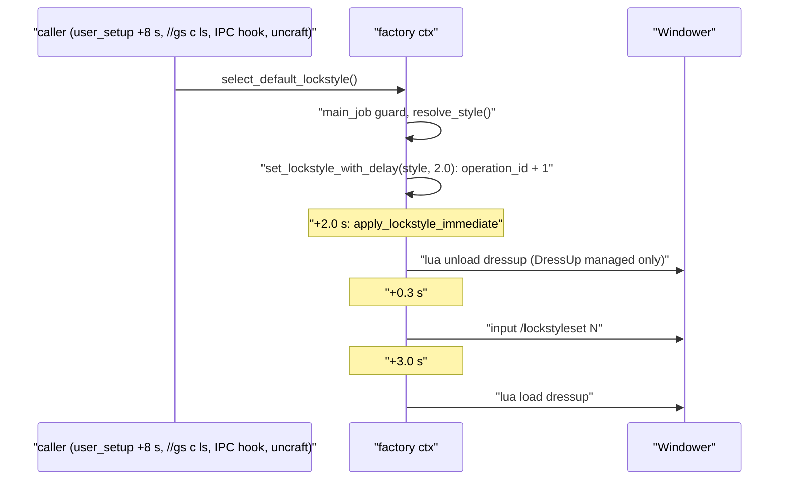
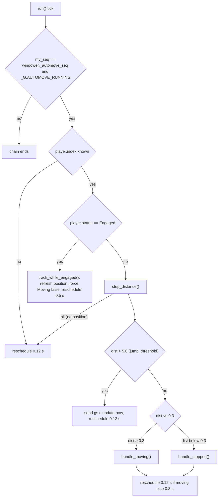
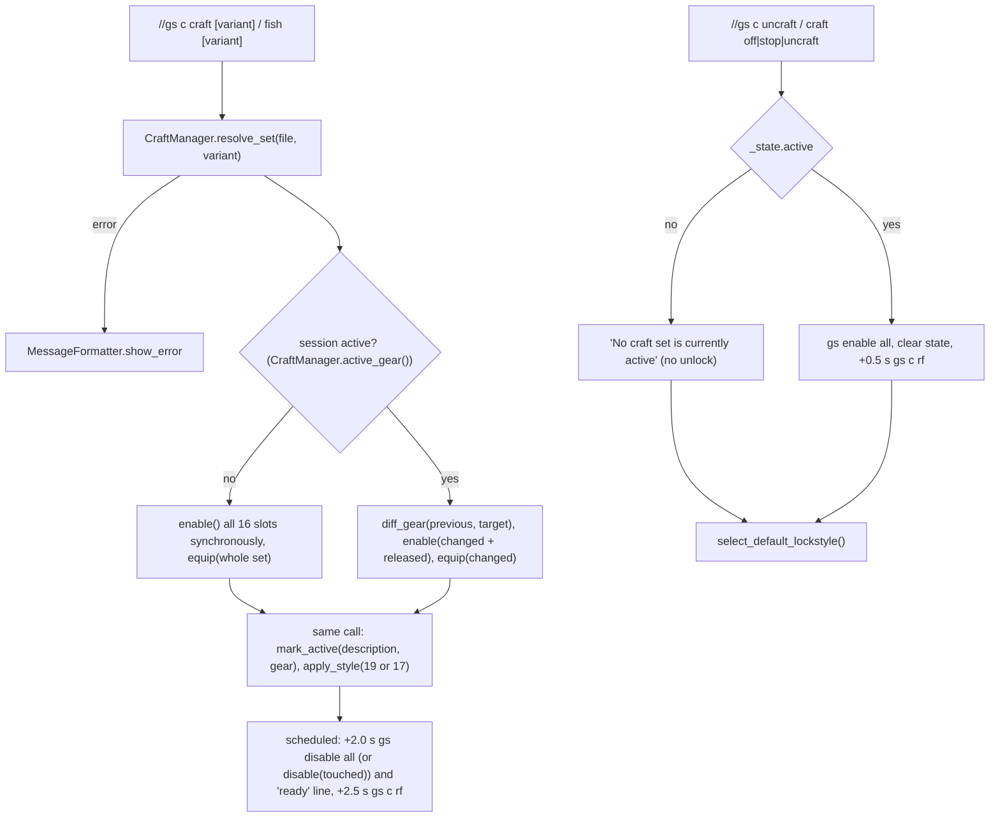
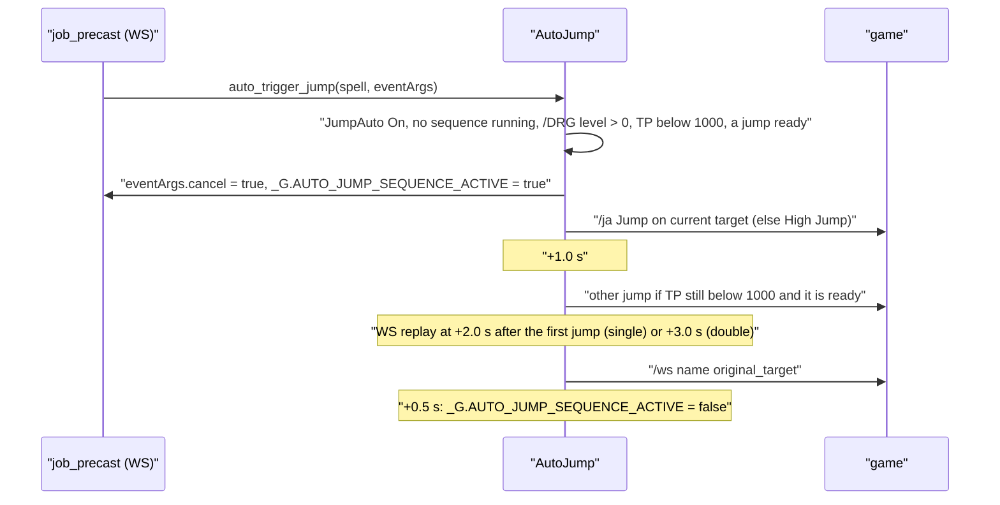
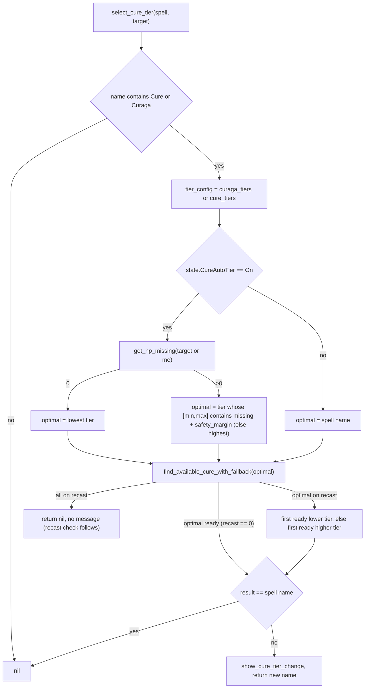

# Factories and helper systems

This page covers the two per-job factories (lockstyle and macrobook) and the shared helper systems that sit next to the job modules: AutoMove (movement-speed gear), craft/fishing mode, the /DRG jump helpers, the DNC waltz tier selector and the WHM cure tier selector. The factories are created lazily by one wrapper file per job (`shared/jobs/<job>/functions/<JOB>_LOCKSTYLE.lua` / `_MACROBOOK.lua`) and triggered from each entry's `user_setup()`, from `//gs c ls`, from the dual-box sync hooks and from craft mode. AutoMove is started by `INIT_SYSTEMS.lua` 0.5 s after every load and polls the player position with `coroutine.schedule`. The other helpers run only on demand: `//gs c craft|fish|uncraft|jump|waltz|aoewaltz`, `WAR_PRECAST`/`DNC_PRECAST` (auto-jump before a weaponskill) and `WHM_PRECAST` (cure re-tiering).

Everything described here runs inside the GearSwap sandbox of the current job file. Read [../architecture/job-change-lifecycle.md](../architecture/job-change-lifecycle.md) first if you have not: each job change, subjob change and `gs reload` throws the sandbox away, and most of the lifetime notes below follow from that.

## Files

| Path | Lines | Role |
|---|---|---|
| `shared/utils/lockstyle/lockstyle_manager.lua` | 343 | Lockstyle factory, DressUp toggle, stateless `apply_style` |
| `shared/utils/macrobook/macrobook_manager.lua` | 278 | Macrobook factory (solo and dual-box books) |
| `shared/jobs/<job>/functions/<JOB>_LOCKSTYLE.lua` (16 files) | 40-53 | Lazy wrapper: `select_default_lockstyle`, `cancel_<job>_lockstyle_operations` |
| `shared/jobs/<job>/functions/<JOB>_MACROBOOK.lua` (16 files) | 36-48 | Lazy wrapper: `select_default_macro_book` |
| `<char>/config/<job>/<JOB>_LOCKSTYLE.lua` | ~25-75 | Per-job style numbers (`default`, `by_subjob`, optional `get_style`) |
| `<char>/config/<job>/<JOB>_MACROBOOK.lua` | ~60-110 | Per-job books (`solo`, `dualbox`, `default`) |
| `_master/config_global/LOCKSTYLE_CONFIG.lua` | 56 | Global lockstyle timing, deployed as `<char>/config/LOCKSTYLE_CONFIG.lua` |
| `shared/utils/movement/automove.lua` | 380 | Movement detection loop, `state.Moving`, `gs c update` |
| `shared/utils/craft/craft_commands.lua` | 297 | `//gs c craft/fish/uncraft` handlers, gear diffing, slot locking |
| `shared/utils/craft/craft_manager.lua` | 164 | Craft set file loading/resolution, session flag, unlock |
| `Tetsouo/config/CRAFT_CONFIG.lua` (live only) | 24 | Craft/fish lockstyle numbers (19 / 17) |
| `_master/Tetsouo/sets/bonecraft_sets.lua` | 117 | Multi-variant craft set (6 variants) |
| `_master/Tetsouo/sets/fishing_sets.lua` | 38 | Single fishing set |
| `shared/utils/drg/auto_jump.lua` | 222 | Jump/High Jump before a WS when TP < 1000 (WAR, DNC) |
| `shared/utils/drg/DRG_JUMP_MANAGER.lua` | 97 | `//gs c jump` (manual Jump chain) |
| `shared/utils/dnc/waltz_manager.lua` | 261 | Curing / Divine Waltz tier selection |
| `shared/utils/whm/cure_manager.lua` | 423 | Cure / Curaga tier selection with recast fallback |
| `shared/utils/whm/whm_message_formatter.lua` | 411 | Cure tier-change and debug messages (read for the calls only) |

The two craft set files are identical to their live copies in `Tetsouo/sets/`. `Tetsouo/config/CRAFT_CONFIG.lua` has no template anywhere under `_master/` and has never been committed (the live folder is gitignored, `.gitignore:56`).

---

## LockstyleManager

### How it works

1. A job wrapper calls `LockstyleManager.create(job_code, config_path, default_lockstyle, default_subjob)` the first time one of its functions runs (`WAR_LOCKSTYLE.lua:27-40`). `create()` returns the `ctx` already built for that job code, or builds one (`lockstyle_manager.lua:280-298`). The ctxs are kept per job code in the sandbox global `_G.__lockstyle_contexts` (`contexts()`, `:265-272`), not in a module-local, so every copy of the wrapper and every instance of this module in one load share them, and they die with the load. A ctx holds the job code, the defaults, the config returned by `pcall(require, config_path)` or a fallback that always answers `default_lockstyle` (`:236-243`), and a `STATE` table (`enabled`, `is_processing`, `current_coroutines`, `dressup_state`, `last_dressup_command_time`, `operation_id`).
2. Every operation is a module-level function taking `ctx` first, bound with `bind()` (`:300-313`). The API also carries the job-suffixed key `cancel_<jl>_lockstyle_operations` (`:315`), the name the job wrappers call. `create()` then deletes the globals it registered on its previous call in this module instance (`:321-324`) and writes six job-suffixed globals (`:327-338`).
3. `select_default_lockstyle()` (`:190-194`) returns silently unless `player.main_job == ctx.job_code`, resolves the style (`resolve_style`, `:180-187`: `LockstyleConfig.default or default_lockstyle`, then `LockstyleConfig.get_style(subjob)` if the config defines it; `player.sub_job or default_subjob`) and calls `set_lockstyle_with_delay(style, 2.0)`.
4. `set_lockstyle_with_delay` (`:166-176`) is a debounce: it calls `cancel_pending_operations` (`:119-123`, bumps `STATE.operation_id`), captures the new id and schedules `apply_lockstyle_immediate` after `delay`.
5. `apply_lockstyle_immediate` (`:126-162`) returns if disabled or superseded. Without DressUp management it sends `input /lockstyleset N` at once. With it, it sends `lua unload dressup` unless `dressup_state == 'unloaded'` or the last DressUp command is less than 0.5 s old, then `/lockstyleset` 0.3 s later and `lua load dressup` 3.0 s later; both scheduled steps re-check `operation_id`.



`LockstyleManager.apply_style(style)` (`:75-89`) is the stateless variant used by craft mode: same DressUp cycle (unload, +0.3 s lockstyle, +3.0 s load) with no ctx, no operation id and no debounce.

There is no 15 s throttle anywhere in this module; the only rate limits are the per-ctx debounce above and the 0.5 s guard on DressUp commands.

### Public API

| Function | Line | Effect | Callers |
|---|---|---|---|
| `LockstyleManager.create(job_code, config_path, default_lockstyle, default_subjob)` | 280 | Returns the per-job API below and writes the generated globals | the 16 `<JOB>_LOCKSTYLE.lua` wrappers |
| `LockstyleManager.toggle_dressup()` | 54 | Flips `_G.DRESSUP_MANAGEMENT_ENABLED`, persists it as a file, returns the new value | `COMMON_COMMANDS.lua:352-363` (`//gs c dressup`) |
| `LockstyleManager.is_dressup_enabled()` | 66 | Returns the flag | none |
| `LockstyleManager.apply_style(style)` | 75 | Applies any number now (DressUp-aware); ignores non-numbers | `craft_commands.lua:51-56` |

Per-job API returned by `create()` (`:303-315`): `select_default_lockstyle()`, `set_lockstyle_with_delay(style, delay)`, `get_lockstyle_info()` (alias `get_info`) returning `{job, subjob, style, enabled, manage_dressup}`, `show_lockstyle_config()` (prints through `MessageFormatter.show_info`), `set_lockstyle_enabled(bool)`, `set_dressup_management(bool)` (writes the global flag and the file), `cancel_pending_operations()` (also under the key `cancel_<jl>_lockstyle_operations`, which the wrappers call), `get_state()`. The wrappers do not return this table, so outside the factory only the globals are reachable.

Generated globals (`:327-338`, `jl` = lower-case job code): `select_default_lockstyle`, `cancel_<jl>_lockstyle_operations`, `set_<jl>_lockstyle_enabled`, `set_<jl>_dressup_management`, `get_<jl>_lockstyle_info`, `show_<jl>_lockstyle_config`. `select_default_lockstyle` is called by the entries, `COMMON_COMMANDS.lua:327-346`, the IPC hooks at `INIT_SYSTEMS.lua:156-161` and `craft_commands.lua:59-63`; `cancel_<jl>_lockstyle_operations` is read once by each entry's `get_sets()` for the JobChangeManager registration, at a time when it is still the wrapper's function, not the factory's; that wrapper calls the API key of the same name. The other four globals have no reader. `global_probe.lua:132-136` whitelists the generated shapes.

### Configuration

Per-job config (`<char>/config/<job>/<JOB>_LOCKSTYLE.lua`, resolved by GearSwap's `pathsearch`, which tries `data/<player.name>/` before `data/`; BLM passes `<char>/config/...` explicitly, `BLM_LOCKSTYLE.lua:27-29`):

| Key | Read by the factory | Notes |
|---|---|---|
| `default` | yes (`:182`) | wins over the `default_lockstyle` argument |
| `get_style(subjob)` | yes, if present (`:183-185`) | defined by 8 of the 14 template configs (BST, COR, DNC, DRK, GEO, PLD, RUN, WAR); it reads `by_subjob` |
| `by_subjob` | **no** | only read through the config's own `get_style`; BLM, BRD, RDM, SAM, THF, WHM configs have no `get_style` (see Known issues) |
| `style` | no | "backward compatibility" field, no reader |

`_master/config_global/LOCKSTYLE_CONFIG.lua` (deployed to `<char>/config/`): the entries read `initial_load_delay` (8.0) to schedule `select_default_lockstyle` from `user_setup()` (e.g. `_master/entry/Tetsouo_WAR.lua:242-245`), with an inline fallback table (`:34-40`). `job_change_delay` and `cooldown` are defined but have no reader; the file's comments (`:29-37`, `:49-54`) describe a JobChangeManager use and a DressUp timing that the code does not have.

DressUp management flag: `_G.DRESSUP_MANAGEMENT_ENABLED`, initialised on each module load from the presence of `windower.addon_path .. 'data/.dressup_disabled'` (file present = off, `:20-31`, `:48-50`). The file is gitignored (`.gitignore:114`).

### Job wrappers

Each wrapper holds a module-local `lockstyle_module` / `macrobook_module`, defines the global wrapper functions, and returns nothing. Arguments passed to the factories:

| Job | Lockstyle default / subjob | Macrobook subjob / book / page |
|---|---|---|
| WAR | 4 / SAM | SAM / 22 / 1 |
| RDM | 1 / NIN | NIN / 1 / 1 |
| BRD, SMN | 1 / WHM | WHM / 1 / 1 |
| BLM, BST, COR, DNC, DRK, GEO, PLD, PUP, RUN, SAM, THF, WHM | 1 / SAM | SAM / 1 / 1 |

The config's `default` overrides the lockstyle argument (e.g. PLD config default 3 vs argument 1). `_master/config/` has no `pup/` folder, so a deployed PUP runs both factories on their fallbacks (style 1, book 1 page 1); SMN configs exist only in the live `Tetsouo/config/smn/`.

Each wrapper file is executed twice per sandbox: once by the job's `<JOB>_KEYBINDS.show_intro()` `require` during `user_setup()` (which runs inside `include('Mote-Include.lua')`), and once by the facade `include` in `get_sets()` (e.g. `shared/jobs/war/functions/war_functions.lua:65-67`, `blm_functions.lua:126-127`). The two executions have separate module-locals, so each calls `create()` once. The `coroutine.schedule(select_default_lockstyle, 8)` in `user_setup()` captures the first wrapper; `JobChangeManager.register_lockstyle_cancel(job, cancel_<job>_lockstyle_operations)` in `get_sets()` captures the second. Both get the same `ctx` from `create()` (one per job code in `_G.__lockstyle_contexts`, `lockstyle_manager.lua:257-298`), so the registered cancel bumps the `operation_id` of the lockstyle the first copy scheduled, whichever module instance each copy reached.

---

## MacrobookManager

### How it works

1. `create(job_code, config_path, default_subjob, default_book, default_page)` (`macrobook_manager.lua:224-276`) normalises the config (`load_macrobooks`, `:54-77`): `{solo, dualbox}` from a config that has `solo`/`dualbox`, or `{solo = macrobooks, dualbox = {}}` from the legacy flat shape; `solo.default` is set to the config's top-level `default` or the factory's `{default_book, default_page}` (this overwrites any `solo['default']` written in the config file). With no config at all it uses `fallback_macrobooks` (`:36-44`). All current configs have a top-level `default` and the `solo` shape.
2. `select_default_macro_book()` (`:128-146`) picks, in order: the dual-box book `dualbox[alt_job][sub_job]` when `DualBoxManager.is_alt_online()` (alt update seen in the last 30 s, `dualbox_manager.lua:338-353`), else `solo[sub_job]`, else `solo.default`, else the factory defaults. There is no main-job guard (unlike lockstyle).
3. `set_macro_with_delay` (`:95-107`) bumps `_G._macrobook_schedule_id` and schedules Mote's `set_macro_page(page, book)` after 1.5 s (0.5 s from `set_macro_book`). Mote sends `input /macro book B; wait 1.1; input /macro set P` and rejects books outside 1-40 and pages outside 1-10 (`libs/Mote-Utility.lua:511-534`).

### Public API

Returned by `create()` (`:264-275`): `select_default_macro_book()`, `set_macro_book(subjob)` (solo table only, error message on unknown subjob), `get_macro_info()` → `{book, page, subjob}` (solo only), `show_macro_configs()`, plus legacy keys `set_<jl>_macro_book`, `get_<jl>_macro_info`, `show_<jl>_macro_configs`. Globals (`:252-261`): `select_default_macro_book`, `set_<jl>_macro_book`, `get_<jl>_macro_info`, `show_<jl>_macro_configs`.

Callers: entry `user_setup()` (`select_default_macro_book()` directly, e.g. `_master/entry/Tetsouo_WAR.lua:243`), COR's second block, `dualbox_manager.lua:324-328` (0.5 s after an `altjobupdate` that brings a new job or subjob). The keybind intros look for `<JOB>_MACROBOOK.get_<job>_macro_info` on the value returned by `require` of the wrapper, which is `nil` (see Known issues). The other generated globals have no caller.

### Configuration

`<char>/config/<job>/<JOB>_MACROBOOK.lua`:

```lua
Cfg.solo    = { SAM = { book = 22, page = 1 }, ..., default = { book = 22, page = 1 } }
Cfg.dualbox = { GEO = { SAM = { book = 23, page = 1 } }, ... }   -- [alt_job][subjob]
Cfg.default = { book = 22, page = 1 }                             -- becomes solo.default
```

Book numbers above 20 are used although the config headers say "Book range: 1-20" (e.g. `_master/config/war/WAR_MACROBOOK.lua:21`); Mote accepts 1-40.

---

## AutoMove

### How it works

`INIT_SYSTEMS.lua:199-218`, inside the block deferred by 0.5 s, runs `pcall(include, '../shared/utils/movement/automove.lua')` then `AutoMove.start()` unless `_G.DISABLE_AUTOMOVE == true`. No file in the repository sets that flag any more (BST's was removed in commit 0563ff9 because nothing else maintains `state.Moving`); only `system_checker.lua:25` and `global_probe.lua:47` still read it.

Including the file (re)creates `_G.AutoMove` (`automove.lua:48-49`), the module-local position, callback list and counters, `state.Moving = M('false', 'true')` if absent (`:126-128`), seeds `windower._automove_seq` (`:82`) and reads the current position (`:159`).

`AutoMove.start()` (`:308-375`) increments `windower._automove_seq`, captures it as `my_seq`, sets `_G._automove_sequence` and `_G.AUTOMOVE_RUNNING = true`, resets `start_time`, `moving`, `pending_update`, `last_update_time`, re-reads the position and schedules `run`:



- `handle_moving` (`:260-286`): on the first moving tick sets `state.Moving.value = 'true'` and `pending_update`; `send_update('moving')`; every 2.0 s of continuous movement (`heal_interval`) sends another `gs c update` as a desync backstop; calls every registered callback with `(true, dist, player.status)`.
- `handle_stopped` (`:289-301`): on the transition sets `state.Moving.value = 'false'`, `pending_update`, calls callbacks with `false`; then `send_update('stopping')` while `pending_update` is set.
- `send_update` (`:236-257`) refuses for 2.0 s after `start()` (`job_change_cooldown`) and within 0.3 s of the last update (`update_debounce`); a refused update stays pending and is retried on later ticks. The jump branch (`:354-359`) and the heal branch bypass it.
- The gear itself comes from the job's set builder: `sets.MoveSpeed` is merged into the idle set when `state.Moving.value == 'true'` (e.g. `shared/utils/set_building/base_set_builder.lua:40-45`, `shared/jobs/bst/functions/logic/set_builder.lua:110`, `shared/jobs/drk/functions/logic/set_builder.lua:137`).

### Public API

| Function | Line | Callers |
|---|---|---|
| `AutoMove.start()` | 308 | `INIT_SYSTEMS.lua:209-210` only |
| `AutoMove.stop()` | 103 | `job_change_manager.lua:57-59` (`cleanup_all_systems`, subjob path only) |
| `AutoMove.register_callback(fn(is_moving, distance, status))` | 92 | `WAR_MOVEMENT.lua:46-125` (Retaliation cancel, registered 0.6 s after load); `THF_MOVEMENT.lua:30-36` (never runs, see Known issues) |
| `AutoMove.is_moving()`, `get_last_distance()`, `get_position()` | 167-181 | the `get_<job>_movement_status()` helpers in BLM/BRD/COR/DNC/GEO/SAM/THF/WAR `_MOVEMENT.lua` |
| `AutoMove.clear_callbacks()`, `AutoMove.reinit_position()` | 97, 185 | none |

Callback errors are caught and printed with `MessageCore.show_automove_error` (`:112-119`).

### Configuration

Hard-coded in `automove.lua:55-64`: `movement_threshold 0.3`, `check_interval 0.12`, `update_debounce 0.3`, `job_change_cooldown 2.0`, `jump_threshold 5.0`, `heal_interval 2.0`, `idle_interval 0.3`, `engaged_interval 0.5`. Debug output is gated by `_G.AUTOMOVE_DEBUG` (`//gs c automovedebug`, or `//gs c debugupdate`, which also persists through `windower._gs_debug` and is restored at `INIT_SYSTEMS.lua:32-35`).

---

## Craft and fishing mode

### How it works



- Set files are loaded with `pcall(require, <player.name>/sets/<name>_sets)` (`craft_manager.lua:59-66`); `craft` always uses `bonecraft`, `fish` always `fishing` (`craft_commands.lua:252`, `:272`).
- Resolution (`craft_manager.lua:72-114`): multi-variant files use `default` when no argument is given, a direct lower-case key lookup, then an alias scan; single-set files return the whole table and ignore the argument.
- Slot names are canonicalised to `player.equipment` names (`ranged`→`range`, `ear1`/`lear`→`left_ear`, `ring2`/`rring`→`right_ring`, ..., `craft_commands.lua:25-32`, `:83-92`). `diff_gear` (`:122-139`) keeps a slot untouched only when the running session put the same item there and it is still worn (item names compared case-insensitively); slots the new variant no longer covers are released.
- `equip_craft_gear` (`:184-232`) uses GearSwap's synchronous `enable()` rather than `gs enable all` because the command path lands after `equip()` (comment `:189-198`, commit 362ca25). The lock is applied 2.0 s later (`lock_after_delay`, `:159-171`); the coroutine carries no session check. When a variant switch changes nothing, only the lock is re-asserted (`:215-222`).
- While the session flag is set, `config_resolver.lua:200-213` switches refill to `<char>/config/craft/CRAFT_REFILL.lua`, and GEO/RDM `job_update` (e.g. `_master/entry/Tetsouo_GEO.lua:245-249`) and BLM `CombatMode` handling (`BLM_COMMANDS.lua:546-549`) skip their weapon `enable()`.

### Set file shapes

```lua
-- single set (fishing_sets.lua)
return { description = 'Fishing', gear = { range = 'Ebisu F. Rod +1', ... } }

-- multi-variant (bonecraft_sets.lua)
return {
    default  = 'hq',
    variants = {
        hq   = { description = 'Bonecraft HQ', aliases = { 'hq' }, gear = {...} },
        wood = { description = '...', aliases = { 'wood', 'woodworking', 'carver' }, gear = {...} },
    },
}
```

`bonecraft_sets.lua` defines `hq` (default), `nq`, `success`, `wood`, `smith`, `leather`, built from a shared base with a local `set_with()` helper (`:34-51`). Only Tetsouo has craft set files.

### Public API

`CraftManager`: `resolve_set(file, variant)` → `entry` or `nil, error` (125), `mark_active(name, gear)` (132), `active_gear()` (141), `unequip()` (147). `CraftCommands`: `handle_craft(variant)` (241), `handle_fish(variant)` (268), `handle_uncraft()` (287), aliased onto `CommonCommands` at `COMMON_COMMANDS.lua:253-256`.

### Configuration

| Source | Keys | Default |
|---|---|---|
| `<char>/config/CRAFT_CONFIG.lua` | `craft_lockstyle`, `fish_lockstyle` | 19 / 17 (`craft_commands.lua:21-22`) |
| `<char>/sets/bonecraft_sets.lua`, `fishing_sets.lua` | see shapes above | none (error message) |
| `<char>/config/craft/CRAFT_REFILL.lua` | refill list while crafting | job refill list |

Set files and `CRAFT_CONFIG` are cached per sandbox by `ModuleCache`, so an edit needs a reload.

---

## /DRG jumps

Two modules implement the same Jump → High Jump chain (recast ids 158/159, 1000 TP threshold, 1.0 s between steps, Sheol Gaol level-0 check).

### AutoJump (`shared/utils/drg/auto_jump.lua`)

Used by `WAR_PRECAST.lua:110-115` (before `WSPrecastHandler`) and `DNC_PRECAST.lua:118-137` (inside `job_precast_weaponskill`). Gated by `state.JumpAuto` (`On`/`Off`, default `On`, `WAR_STATES.lua:84-89`, `DNC_STATES.lua:135-140`; keybinds `cyclestate JumpAuto`).



The replayed WS goes through precast again while the flag is set, so it cannot start a second sequence (`auto_jump.lua:148-150`). Readiness uses the global `is_recast_ready` from `RECAST_CONFIG.lua` (tolerance 2.0 s). Diagnostics: `get_tp_threshold()`, `get_animation_delay()`, `get_status()`, `is_drg_subjob()` (no callers outside the module except `should_auto_jump`).

### DRGJumpManager (`shared/utils/drg/DRG_JUMP_MANAGER.lua`)

`execute_jump()` (`:26-95`): error unless `player.sub_job == 'DRG'` and level > 0; "TP ready" message if TP ≥ 1000; otherwise Jump (or High Jump) now and the other one 1.0 s later if TP is still short and it is ready; if both are on recast, a grouped cooldown message via `MessageCooldowns.show_multi_status`. It does not replay anything. Callers: `//gs c jump` (`COMMON_COMMANDS.lua:43-53`) and WAR's subjob TP ability on /DRG (`war/functions/logic/smartbuff_manager.lua:259-265`).

---

## DNC WaltzManager

`//gs c waltz` and `//gs c aoewaltz` go through `handle_waltz_generic` (`COMMON_COMMANDS.lua:58-84`): error unless DNC main or sub, `send_command('cancel Saber Dance')` if Saber Dance is active, then `cast_curing_waltz('<stpc>')` or `cast_divine_waltz()`. `DNC_PRECAST.lua:89-92` replaces Mote's `refine_waltz` with a no-op.

`cast_curing_waltz(target_type)` (`waltz_manager.lua:184-211`):

1. `effective_level` = DNC main level, else sub level.
2. `resolve_missing_hp()` (`:106-119`) reads the current target `<t>`: self → exact `max_hp - hp`; a mob → unknown (`nil`); no target → self. The party-member estimate `hp / (hpp/100) - hp` (`:51-86`) is gated on `isallymember`, a field GearSwap adds only to its own target tables (`GearSwap/targets.lua:64-73`), never to `get_mob_by_target`, so a targeted party member also reads as unknown.
3. `preferred_curing_waltz` (`:129-144`): with HP known, the tier whose band contains it (`CURING_HP_BRACKET`, `:91-97`: I < 200, II 200-600, III 600-1100, IV 1100-1500, V ≥ 1500); with HP unknown, the highest tier the level allows.
4. `curing_priority` (`:148-159`): preferred tier first, then all other castable tiers from highest down. The first one with recast ready (`is_recast_ready`) and enough TP is sent as `/ja "<name>" <stpc>` with `show_waltz_heal`.
5. If none fires, `curing_blockers` (`:163-180`) builds one cooldown line per tier and one TP line, shown with `show_multi_status`.

`cast_divine_waltz()` (`:214-259`) tries Divine Waltz II then I on `<me>` with the same readiness rules and an inline copy of the blocker loop.

`WALTZ_CONFIG` (`:32-46`): TP 800/650/500/350/200 for Curing V-I, 800/400 for Divine II/I; recast ids match `res/job_abilities.lua`; levels 87/70/45/35/15 and 78/40 (the project's own `shared/data/job_abilities/dnc/dnc_waltzes_subjob.lua` lists Curing Waltz II at 30 and Divine Waltz at 25).

---

## WHM CureManager

Loaded lazily by `WHM_PRECAST.ensure_modules_loaded()` (`WHM_PRECAST.lua:60-62`); called from `retier_cure` (`:77-94`), which runs after PrecastGuard and **before** CooldownChecker (`job_precast`, `:114-134`). When `select_cure_tier` returns a different name, `retier_cure` cancels the cast, sends `input /ma "<new>" <spell.target.raw>` and `job_precast` returns. A `nil` return (same name, not a cure, or every tier on recast) lets the original cast go on to the recast check. So a typed tier on recast is swapped for a ready one before CooldownChecker could cancel it; when every tier is on recast, `select_cure_tier` returns `nil` without a message (`cure_manager.lua:373-378`) and CooldownChecker gives the one cooldown message, cancelling the cast if its recast is over the 2.0 s tolerance.

At module load (`cure_manager.lua:35-44`) the config is `pcall(require, <player.name>/config/whm/WHM_CURE_CONFIG)`; on failure it `print`s an error and uses a table with no `cure_tiers`/`curaga_tiers`.



- HP (`:191-225`): self exact; party member `p0..p5` found by name → `max_hp` taken from `member.max_hp or 2000` and `hpp`; the alliance loop reads keys `a1p1..a3p6`; anything else → `target.hpp` against an assumed 2000 max; no target → `0`.
- Availability (`:85-102`): `get_spell_recasts()[CURE_IDS[name]] / 100 == 0`; unknown names are "available". This does not use `RECAST_CONFIG`.
- Config keys read: `cure_tiers`, `curaga_tiers` (`{min, max, spell}` lists in ascending order), `safety_margin` (default 50), `debug_messages`. `auto_tier_enabled`, `force_max_cure`, `message_color` are defined in `_master/config/whm/WHM_CURE_CONFIG.lua` but never read; auto-tier is `state.CureAutoTier` (`WHM_STATES.lua:97-99`, default `On`, keybind `cyclestate CureAutoTier`).

---

## Commands

| Command | Args | Effect | Handler |
|---|---|---|---|
| `//gs c lockstyle`, `ls` | - | `select_default_lockstyle()` + `SyncIPC.broadcast('ls')` | `COMMON_COMMANDS.lua:546` → `:327-346` |
| `//gs c dressup` | - | `LockstyleManager.toggle_dressup()`, persisted | `:548` → `:352-363` |
| `//gs c craft` | `[variant \| off \| stop \| uncraft]` | Equip / switch a bonecraft variant, lock slots, craft lockstyle; `off/stop/uncraft` = uncraft | `:540` → `craft_commands.lua:241-263` |
| `//gs c fish`, `fishing` | `[variant]` (ignored for single sets) | Equip fishing set, lock slots, fish lockstyle | `:542` → `craft_commands.lua:268-283` |
| `//gs c uncraft` | - | `CraftManager.unequip()` + job lockstyle | `:544` → `craft_commands.lua:287-295` |
| `//gs c jump` | - | `DRGJumpManager.execute_jump()` | `:554` → `:43-53` |
| `//gs c waltz` | - | Curing Waltz tier selection on `<stpc>` | `:556` → `:87-89`, `:58-84` |
| `//gs c aoewaltz` | - | Divine Waltz on `<me>` | `:558` → `:92-94` |
| `//gs c automovedebug`, `amd` | - | Toggle `_G.AUTOMOVE_DEBUG` | `:577-581` |
| `cyclestate JumpAuto` / `CureAutoTier` | - | Mote state cycle (keybinds) | Mote |

Dual-box: `INIT_SYSTEMS.lua:154-161` registers IPC hooks `ls` and `lockstyle` that call the current `select_default_lockstyle`.

## State and lifetime

| Item | Where | Lifetime |
|---|---|---|
| Lockstyle ctx (`STATE`, config, defaults) | `_G.__lockstyle_contexts[job_code]` (`lockstyle_manager.lua:265-272`) | one sandbox; one ctx per job code, shared by both wrapper copies |
| `last_registered_globals` | module local of each factory instance | one sandbox |
| `_G.DRESSUP_MANAGEMENT_ENABLED` | `lockstyle_manager.lua:48-50` | re-read from `data/.dressup_disabled` in every sandbox |
| `_G._macrobook_schedule_id` | `macrobook_manager.lua:100` | one sandbox; a coroutine from a previous sandbox checks its own copy |
| `windower._automove_seq` | `automove.lua:82`, `:105`, `:310` | survives `gs reload` and job change (reset by `lua reload gearswap`); kills old chains at their next tick |
| `_G.AUTOMOVE_RUNNING`, `_G._automove_sequence`, `_G.AutoMove`, `state.Moving` | `automove.lua` | one sandbox |
| `_G.__CraftManagerState {active, active_name, gear}` | `craft_manager.lua:49` | one sandbox; GearSwap's slot locks (`disable_table`, `statics.lua:194`) outlive it |
| `_G.AUTO_JUMP_SEQUENCE_ACTIVE` | `auto_jump.lua:46` | one sandbox |
| CureManager config / formatter | module locals | one sandbox (module cached) |

Scheduled coroutines:

| Coroutine | Delay | Invalidation |
|---|---|---|
| `select_default_lockstyle` from `user_setup()` | `initial_load_delay` (8 s) | none; returns if the main job changed |
| lockstyle apply / DressUp steps | 2.0 s, +0.3 s, +3.0 s | `STATE.operation_id` of the job's ctx |
| `apply_style` steps (craft) | 0.3 s, 3.0 s | none |
| `set_macro_page` | 1.5 s (0.5 s manual) | `_G._macrobook_schedule_id` of the sandbox |
| `select_default_macro_book` retry when `player` is nil | 0.5 s | none (the sandbox `player` table always exists) |
| AutoMove `run` | 0.12 / 0.3 / 0.5 s | `windower._automove_seq`, `_G.AUTOMOVE_RUNNING` |
| craft lock / refill | 2.0 s / 2.5 s | none |
| uncraft refill | 0.5 s | none |
| auto-jump steps | 1.0 s, 1.0 s, 0.5 s | none |
| DRGJumpManager second jump | 1.0 s | none |

No module on this page registers a Windower event, a keybind or a text object.

Transitions:

- **`gs reload` / subjob change**: JobChangeManager's `cleanup_all_systems()` stops AutoMove on the subjob path only (`job_change_manager.lua:57-59`); every path runs `file_unload` → `JobChangeManager.cancel_all()`, whose registered lockstyle cancel stops a lockstyle still waiting in its 2 s delay or DressUp steps (the raw +8 s `coroutine.schedule` itself is not tracked). The new sandbox starts a new AutoMove chain at +0.5 s, a new lockstyle cycle at +8 s, a new macrobook selection at once. A running craft session loses its flag but keeps its slot locks.
- **Main job change**: same, without `cleanup_all_systems()`; the old AutoMove chain dies when the new `start()` bumps the sequence.
- **Zone**: AutoMove sees a jump > 5 yalms and sends `gs c update`. Nothing else here reacts.

## Interactions

- Lifecycle, reload order and the two-executions-per-sandbox effect: [../architecture/job-change-lifecycle.md](../architecture/job-change-lifecycle.md), [core-lifecycle.md](core-lifecycle.md).
- Command router (`is_common_command`, `handle_command`): [commands-and-debug.md](commands-and-debug.md).
- Messages used: `MessageFormatter.show_info/show_success/show_error/show_tp_ready/show_multi_status/show_waltz_heal`, `MessageCommands.show_craft_*`, `show_lockstyle_reapplying`, `show_dressup_toggled`, `WHMMessageFormatter.*`: [messages.md](messages.md).
- Precast order around AutoJump and CureManager: [precast-pipeline.md](precast-pipeline.md).
- Dual-box books and the `ls` IPC hook: [dualbox.md](dualbox.md).
- Refill while crafting: [equipment-and-inventory.md](equipment-and-inventory.md).
- HUD ignores `state.Moving` (`ui_state_tracker.lua:25-28`, `lifecycle_manager.lua:81-89`): [ui-overlay.md](ui-overlay.md).
- `//gs c mount` (`shared/utils/mount/mount_manager.lua`) is documented in [warp.md](warp.md).

## Invariants and gotchas

1. The per-job lockstyle config must define `get_style` for `by_subjob` to have any effect; the factory never reads `by_subjob` itself (`lockstyle_manager.lua:180-187`).
2. `select_default_lockstyle` does nothing when `player.main_job` is not the factory's job; `select_default_macro_book` has no such guard.
3. A lockstyle debounce only covers operations of the same job `ctx` (shared by both wrapper copies of a sandbox); `apply_style` is not debounced against it.
4. `equip()` from a coroutine does nothing; AutoMove and craft use `gs c update` / `gs disable` commands or synchronous `enable()`/`equip()` inside the command handler.
5. AutoMove callbacks must be registered after `automove.lua` has been included, i.e. more than 0.5 s after `INIT_SYSTEMS` (WAR waits 0.6 s). `_G.AutoMove` does not exist while the facade is being included.
6. AutoMove writes `state.Moving.value` directly instead of `state.Moving:set()`; Mote's modes have no `__newindex`, so from then on `.value` is a plain field and `.current` / `:set()` no longer move it.
7. Craft slot locks belong to the GearSwap engine, not to the sandbox; only `//gs enable all` or a successful `//gs c uncraft` releases them.
8. `select_cure_tier` returning `nil` means "cast the original", including when every tier is on recast; it then prints nothing and the recast check that follows in `WHM_PRECAST` reports it.
9. Craft's "invalid format" error names `config/craft/<name>.lua` (`craft_manager.lua:112-113`); the file actually read is `<char>/sets/<name>_sets.lua`.

## Extending

- **New job lockstyle/macrobook**: copy `WAR_LOCKSTYLE.lua` / `WAR_MACROBOOK.lua`, change the job code, config path and defaults, `include` both from the facade, add `<char>/config/<job>/<JOB>_LOCKSTYLE.lua` with `default`, `by_subjob` **and** `get_style`, and `<JOB>_MACROBOOK.lua` with `solo`, `dualbox`, `default`. Register the cancel in the entry's `get_sets()` like the others.
- **New craft**: add `<char>/sets/<name>_sets.lua` in either shape and a command branch that calls `CraftManager.resolve_set('<name>', variant)` through `equip_craft_gear` the way `handle_fish` does.
- **New waltz tier or cure tier**: WaltzManager tiers live in `WALTZ_CONFIG` + `CURING_HP_BRACKET`; cure tiers in the character's `WHM_CURE_CONFIG.lua` (`cure_tiers` / `curaga_tiers`, ascending) plus `CURE_IDS` for the recast lookup.
- **New AutoMove consumer**: read `state.Moving.value` in the set builder, or register a callback from a coroutine scheduled after 0.5 s.

## Known issues

- `by_subjob` is ignored when a lockstyle config has no `get_style`; Kaories RDM always gets style 1 - `shared/utils/lockstyle/lockstyle_manager.lua:180-187`
- Craft slot locks outlive the session flag (reload, or uncraft within 2 s of craft) and `//gs c uncraft` then refuses to unlock - `shared/utils/craft/craft_manager.lua:148-151`
- Full Cure is re-tiered into a Cure tier when CureAutoTier is On - `shared/utils/whm/cure_manager.lua:335`
- Waltz tier is never sized for a targeted party member (`isallymember` is not a Windower mob field) - `shared/utils/dnc/waltz_manager.lua:109`
- CureManager's fallback config has no tier tables; every Cure/Curaga then raises in precast - `shared/utils/whm/cure_manager.lua:36-44`
- `//gs c waltz`/`aoewaltz` cancel Saber Dance before knowing whether any waltz can be used - `shared/utils/core/COMMON_COMMANDS.lua:67-69`
- CureManager treats a spell with any recast left as unavailable, unlike CooldownChecker's 2.0 s tolerance - `shared/utils/whm/cure_manager.lua:101`
- Curing Waltz II and Divine Waltz learn levels disagree with the project's DNC ability database - `shared/utils/dnc/waltz_manager.lua:38`
- DNC prints "Not enough TP" for a weaponskill that AutoJump has just taken over - `shared/jobs/dnc/functions/DNC_PRECAST.lua:177-181`
- AutoMove assigns `state.Moving.value` directly, desynchronising the Mote mode - `shared/utils/movement/automove.lua:264`
- THF's AutoMove callback is registered before AutoMove exists and never runs - `shared/jobs/thf/functions/THF_MOVEMENT.lua:30`
- Keybind intros never show macro/lockstyle info because the wrapper modules return nothing - `_master/config/war/WAR_KEYBINDS.lua:148-162`
- Unused factory/AutoMove exports - `shared/utils/lockstyle/lockstyle_manager.lua:327-338`
- Comments claim cross-reload persistence/invalidation that `_G` and module locals cannot provide - `shared/utils/macrobook/macrobook_manager.lua:98-100` (also `:21-26`, `lockstyle_manager.lua:249-254`)
- LOCKSTYLE_CONFIG keys `job_change_delay`/`cooldown` unread, DressUp sequence described wrongly, 15 s lockstyle throttle documented but absent - `_master/config_global/LOCKSTYLE_CONFIG.lua:29-37`
- `DISABLE_AUTOMOVE` still documented for BST/PUP though nothing sets it - `.claude/CODE_QUALITY.md:195`
- Jump chain implemented twice (AutoJump and DRGJumpManager) - `shared/utils/drg/DRG_JUMP_MANAGER.lua:26-95`
- Craft `apply_style` does not cancel a pending job lockstyle, which can override the craft style - `shared/utils/lockstyle/lockstyle_manager.lua:75-89`
- CureManager/WHM_CURE_CONFIG headers describe features and keys the code does not have - `shared/utils/whm/cure_manager.lua:10`
- CureManager party HP estimate: alliance keys never match, `max_hp` field never exists - `shared/utils/whm/cure_manager.lua:140`
- Help text misdescribes craft, jump and waltz - `shared/utils/messages/formatters/ui/message_commands.lua:570`
