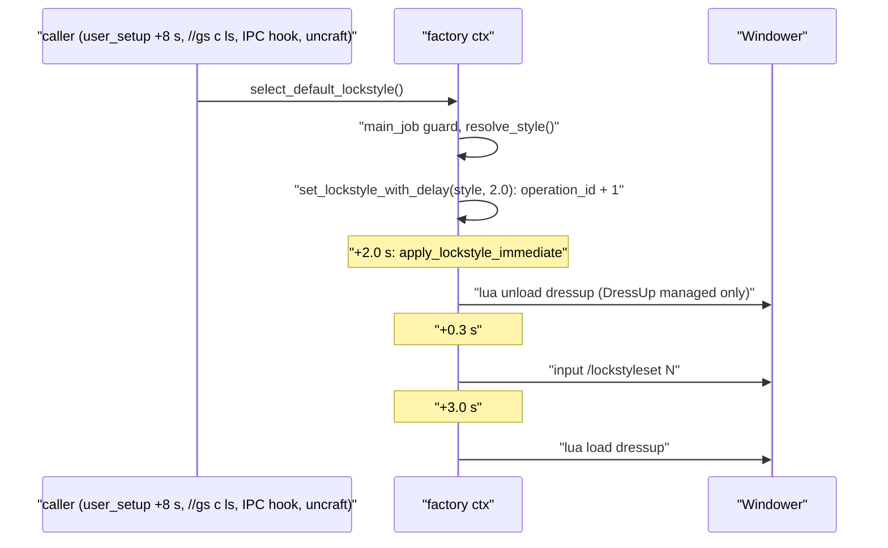
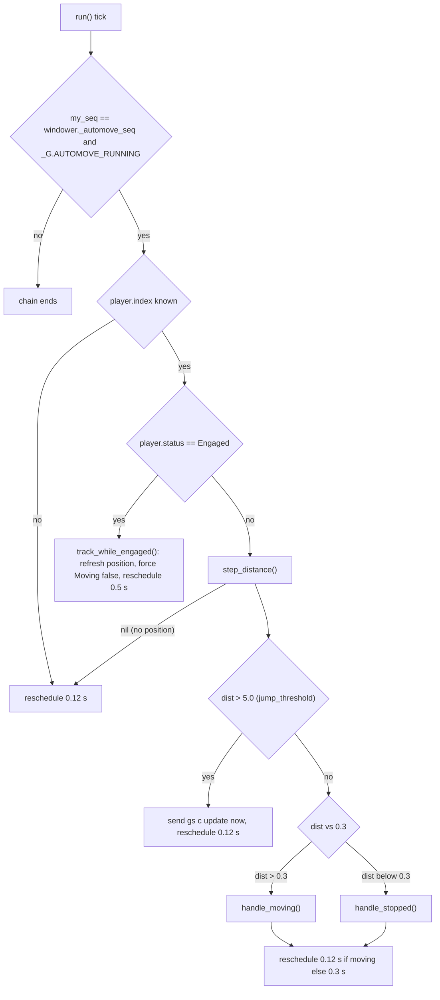
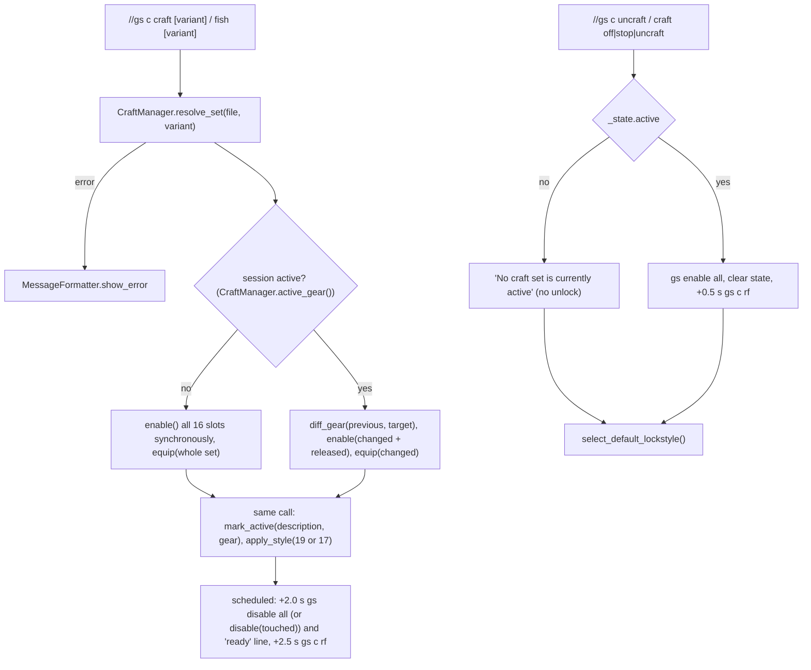
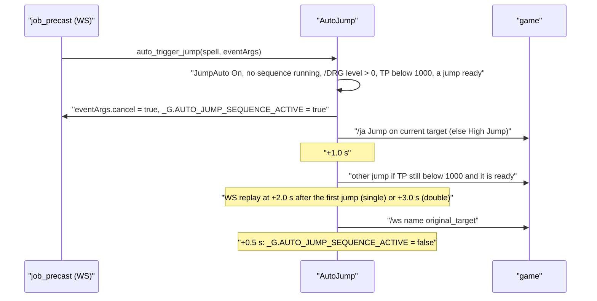
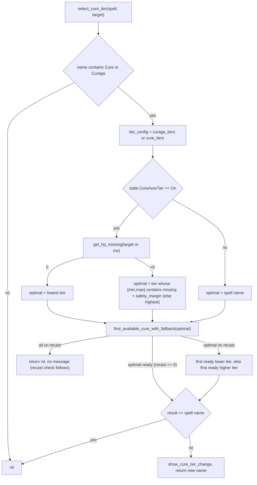

# Factories and helper systems

This page covers two groups of code:

- **The two per-job factories**, lockstyle and macrobook. Each job has one lazy wrapper file per factory: `shared/jobs/<job>/functions/<JOB>_LOCKSTYLE.lua` and `<JOB>_MACROBOOK.lua`. They are triggered from the entry's `user_setup()`, from `//gs c ls`, from the dual-box sync hooks and from craft mode.
- **The shared helpers** that apply to every job, or to several:
  - installed on Mote's hooks by `INIT_SYSTEMS.lua` on every load: ElementalBelt (Obi / Orpheus), DualWield (DW tiers by haste), TreasureHunter (Treasure Mode gear);
  - started by `INIT_SYSTEMS.lua` 0.5 s after load: AutoMove, which polls the player position with `coroutine.schedule`;
  - run on demand: craft and fishing mode, the /DRG jumps, the DNC waltz tier selector, the WHM cure tier selector, SpellGearLock (Dispelga) and the small core helpers (`live_tp`, `AutoOptions`, `ElementalBonus`).

The page ends with a matrix of which shared system applies to which job.

Everything described here runs inside the GearSwap sandbox of the current job file. Each job change, subjob change and `gs reload` throws the sandbox away, and most of the lifetime notes below follow from that: read [../architecture/job-change-lifecycle.md](../architecture/job-change-lifecycle.md) first if you have not.

## Files

| Path | Role |
|---|---|
| `shared/utils/lockstyle/lockstyle_manager.lua` | Lockstyle factory, DressUp toggle, stateless `apply_style` |
| `shared/utils/macrobook/macrobook_manager.lua` | Macrobook factory (solo and dual-box books) |
| `shared/jobs/<job>/functions/<JOB>_LOCKSTYLE.lua` (17 files) | Lazy wrapper: `select_default_lockstyle`, `cancel_<job>_lockstyle_operations` |
| `shared/jobs/<job>/functions/<JOB>_MACROBOOK.lua` (17 files) | Lazy wrapper: `select_default_macro_book` |
| `<char>/<job>/<JOB>_LOCKSTYLE.lua` | Per-job style numbers (`default`, `by_subjob`, optional `get_style`) |
| `<char>/<job>/<JOB>_MACROBOOK.lua` | Per-job books (`solo`, `dualbox`, `default`) |
| `_master/config_global/LOCKSTYLE_CONFIG.lua` | Global lockstyle timing, deployed as `<char>/common/display/LOCKSTYLE_CONFIG.lua` |
| `shared/utils/movement/automove.lua` | Movement detection loop, `state.Moving`, `gs c update` |
| `shared/utils/craft/craft_commands.lua` | `//gs c craft/fish/uncraft` handlers, gear diffing, slot locking |
| `shared/utils/craft/craft_manager.lua` | Craft set file loading and resolution, session flag, unlock; exported as `_G.CraftManager` |
| `_master/config_global/CRAFT_CONFIG.lua` | Which set files `craft` / `fish` read (`craft_file = 'craft'`, `fish_file = 'fishing'`) and their lockstyles (19 / 17), deployed as `<char>/common/inventory/CRAFT_CONFIG.lua` |
| `_master/sets/craft_sets.lua` | Generic craft set file, every slot empty: `hq`, `nq`, `success` and one variant per sub-craft (the 8 crafts) |
| `_master/Tetsouo/common/sets/bonecraft_sets.lua`, `fishing_sets.lua` | Tetsouo's craft set files (multi-variant / single) |
| `shared/utils/drg/auto_jump.lua` | Jump / High Jump before a WS when TP < 1000 (WAR, DNC) |
| `shared/utils/drg/DRG_JUMP_MANAGER.lua` | `//gs c jump` (manual Jump chain) |
| `shared/utils/dnc/waltz_manager.lua` | Curing / Divine Waltz tier selection |
| `shared/utils/whm/cure_manager.lua` | Cure / Curaga tier selection with recast fallback |
| `shared/utils/whm/whm_message_formatter.lua` | Cure tier-change and debug messages (read for the calls only) |
| `shared/utils/equipment/elemental_belt.lua` | Hachirin-no-Obi / Orpheus's Sash on elemental damage, every job |
| `shared/utils/equipment/elemental_bonus.lua` | What each belt would add for an action (day, weather, distance) |
| `shared/utils/equipment/dual_wield.lua` | Dual Wield tier pieces by magic haste on the engaged set, every job |
| `shared/utils/equipment/treasure_hunter.lua` | Treasure Mode on every job (optional state), tagging by any action, engaged and action overlays |
| `shared/utils/equipment/treasure_commands.lua` | `//gs c th` |
| `shared/utils/equipment/spell_gear_lock.lua` | A piece a spell cannot be cast without (Dispelga: Daybreak), worn through Combat Mode for the cast |
| `shared/utils/core/optional_state.lua`, `optional_state_commands.lua` | Base of Combat Mode and Treasure Mode: shown / hidden / key per job, commands (see [keybinds-and-custom.md](keybinds-and-custom.md#optional-states-combat-mode-and-treasure-mode)) |
| `shared/utils/core/live_tp.lua` | TP read from the game, not from GearSwap's copy |
| `shared/utils/core/gear_hold.lua` | `GearHold.active()`: whether a COR roll holds the idle / engaged gear; asked by DualWield, TreasureHunter (engaged overlay) and the custom gear hook (see [core-lifecycle.md](core-lifecycle.md#gearhold)) |
| `shared/utils/core/auto_options.lua` | Opt-in automatic job abilities (`common/combat/AUTO_ABILITIES.lua`) |
| `_master/config_global/DW_CONFIG.lua`, `ELEMENTAL_BELT.lua`, `AUTO_ABILITIES.lua` | Templates of the per-character settings of the helpers above |

Other helpers in `shared/utils/equipment/` are documented elsewhere:

- `hp_priority.lua`, `weapon_resolver.lua`, `equipment_checker.lua`, `wardrobe_auditor.lua`: [equipment-and-inventory.md](equipment-and-inventory.md);
- `ampulla_lock.lua`: [jobs/pld.md](../jobs/pld.md) and [jobs/war.md](../jobs/war.md).

---

## LockstyleManager

### How it works

1. A job wrapper calls `LockstyleManager.create(job_code, config_path, default_lockstyle, default_subjob)` the first time one of its functions runs (local `get_lockstyle_module`). `create()` returns the `ctx` already built for that job code, or builds one. The ctxs are kept per job code in the sandbox global `_G.__lockstyle_contexts` (local `contexts()`), not in a module-local. That way every copy of the wrapper and every instance of this module in one load share them, and they die with the load. A ctx holds:
   - the job code and the defaults;
   - the config returned by `pcall(require, config_path)`, or a fallback that always answers `default_lockstyle` (`load_config_or_fallback`);
   - a `STATE` table: `enabled`, `is_processing`, `current_coroutines`, `dressup_state`, `last_dressup_command_time`, `operation_id`.
2. Every operation is a module-level function taking `ctx` first, bound with a local `bind()`. The API also carries the job-suffixed key `cancel_<jl>_lockstyle_operations`, the name the job wrappers call. `create()` then deletes the globals it registered on its previous call in this module instance (`last_registered_globals`) and writes six job-suffixed globals.
3. `select_default_lockstyle()` returns silently unless `player.main_job == ctx.job_code`. Otherwise it resolves the style (`resolve_style`: `LockstyleConfig.default or default_lockstyle`, then `LockstyleConfig.get_style(subjob)` if the config defines it, with `subjob = player.sub_job or default_subjob`) and calls `set_lockstyle_with_delay(style, 2.0)`.
4. `set_lockstyle_with_delay` is a debounce. It calls `cancel_pending_operations` (which bumps `STATE.operation_id`), captures the new id and schedules `apply_lockstyle_immediate` after `delay`.
5. `apply_lockstyle_immediate` returns if disabled or superseded. Without DressUp management it sends `input /lockstyleset N` at once. With DressUp management:
   - it sends `lua unload dressup`, unless `dressup_state == 'unloaded'` or the last DressUp command is less than 0.5 s old;
   - `/lockstyleset` follows 0.3 s later, and `lua load dressup` 3.0 s later;
   - both scheduled steps re-check `operation_id`.


```mermaid
sequenceDiagram
    participant C as "caller (user_setup +8 s, //gs c ls, IPC hook, uncraft)"
    participant F as "factory ctx"
    participant W as "Windower"
    C->>F: select_default_lockstyle()
    F->>F: "main_job guard, resolve_style()"
    F->>F: "set_lockstyle_with_delay(style, 2.0): operation_id + 1"
    Note over F: "+2.0 s: apply_lockstyle_immediate"
    F->>W: "lua unload dressup (DressUp managed only)"
    Note over F: "+0.3 s"
    F->>W: "input /lockstyleset N"
    Note over F: "+3.0 s"
    F->>W: "lua load dressup"
```

`LockstyleManager.apply_style(style)` is the stateless variant used by craft mode. It runs the same DressUp cycle (unload, +0.3 s lockstyle, +3.0 s load) with no ctx, no operation id and no debounce.

There is no 15 s throttle anywhere in this module. The only rate limits are the per-ctx debounce above and the 0.5 s guard on DressUp commands.

### Public API

| Function | Effect | Callers |
|---|---|---|
| `LockstyleManager.create(job_code, config_path, default_lockstyle, default_subjob)` | Returns the per-job API below and writes the generated globals | the 17 `<JOB>_LOCKSTYLE.lua` wrappers |
| `LockstyleManager.toggle_dressup()` | Flips `_G.DRESSUP_MANAGEMENT_ENABLED`, persists it as a file, returns the new value | `COMMON_COMMANDS.lua` `handle_dressup` (`//gs c dressup`) |
| `LockstyleManager.is_dressup_enabled()` | Returns the flag | none |
| `LockstyleManager.apply_style(style)` | Applies any number now (DressUp-aware); ignores non-numbers | `craft_commands.lua` `apply_lockstyle` |

Per-job API returned by `create()`:

| Function | Behaviour |
|---|---|
| `select_default_lockstyle()` | Resolve the style and schedule it (steps 3-4 above) |
| `set_lockstyle_with_delay(style, delay)` | The debounce |
| `get_lockstyle_info()` (alias `get_info`) | `{job, subjob, style, enabled, manage_dressup}` |
| `show_lockstyle_config()` | Prints through `MessageFormatter.show_info` |
| `set_lockstyle_enabled(bool)` | Sets `STATE.enabled` |
| `set_dressup_management(bool)` | Writes the global flag and the file |
| `cancel_pending_operations()` | Bumps `operation_id`; also under the key `cancel_<jl>_lockstyle_operations`, which the wrappers call |
| `get_state()` | The ctx's `STATE` |

The wrappers do not return this table (BLU's returns only its two wrapper functions), so outside the factory only the globals are reachable.

Generated globals (`jl` = lower-case job code): `select_default_lockstyle`, `cancel_<jl>_lockstyle_operations`, `set_<jl>_lockstyle_enabled`, `set_<jl>_dressup_management`, `get_<jl>_lockstyle_info`, `show_<jl>_lockstyle_config`. Their callers:

- `select_default_lockstyle` is called by the entries, `COMMON_COMMANDS.lua` `handle_lockstyle`, the `ls` / `lockstyle` IPC hooks registered in `INIT_SYSTEMS.lua`, and `craft_commands.lua` `restore_job_lockstyle`.
- `cancel_<jl>_lockstyle_operations` is read once by each entry's `get_sets()` for the JobChangeManager registration. At that moment it is still the wrapper's function, not the factory's; the wrapper calls the API key of the same name.
- The other four globals have no reader.

`global_probe.lua` `GENERATED` whitelists the generated shapes.

### Configuration

The per-job config is `<char>/<job>/<JOB>_LOCKSTYLE.lua`. GearSwap's `pathsearch` resolves it, trying `data/<player.name>/` before `data/`. BLM passes `<char_name>/config/...` explicitly (`BLM_LOCKSTYLE.lua`).

| Key | Read by the factory | Notes |
|---|---|---|
| `default` | yes | wins over the `default_lockstyle` argument |
| `get_style(subjob)` | yes, if present | defined by 9 of the 16 generic templates: BST, COR, DNC, DRK, GEO, PLD, RUN, SMN, WAR. It reads `by_subjob` |
| `by_subjob` | **no** | only read through the config's own `get_style`. The BLM, BLU, BRD, RDM, SAM, THF and WHM templates have no `get_style`, so their `by_subjob` does nothing (BLM's file says so in a comment) |
| `style` | no | "backward compatibility" field, no reader |

`_master/config_global/LOCKSTYLE_CONFIG.lua` is deployed to `<char>/common/`. The entries read its `initial_load_delay` (8.0) to schedule `select_default_lockstyle` from `user_setup()`, with an inline fallback table (see `_master/entry/Tetsouo_WAR.lua`). It is the file's only setting: `job_change_delay` and `cooldown`, which nothing read, were removed on 2026-09-29.

DressUp management flag: `_G.DRESSUP_MANAGEMENT_ENABLED`. It is initialised on each module load from the presence of `windower.addon_path .. 'data/.dressup_disabled'` (file present = off; `read_dressup_state`). The file is gitignored.

### Job wrappers

Each wrapper holds a module-local `lockstyle_module` / `macrobook_module` and defines the global wrapper functions. It returns nothing, except BLU's, which returns a table of its wrapper functions. Arguments passed to the factories:

| Job | Lockstyle default / subjob | Macrobook subjob / book / page |
|---|---|---|
| WAR | 4 / SAM | SAM / 22 / 1 |
| RDM | 1 / NIN | NIN / 1 / 1 |
| BRD, SMN | 1 / WHM | WHM / 1 / 1 |
| BLU, PUP | 1 / WAR | WAR / 1 / 1 |
| BLM, BST, COR, DNC, DRK, GEO, PLD, RUN, SAM, THF, WHM | 1 / SAM | SAM / 1 / 1 |

The config's `default` overrides the lockstyle argument (e.g. the PLD config's default 3 vs the argument 1).

Each wrapper file is executed twice per sandbox:

1. by `KeybindManager`'s `show_intro()` `require`, during `user_setup()`, which runs inside `include('Mote-Include.lua')` (see [keybinds-and-custom.md](keybinds-and-custom.md#the-intro-message));
2. by the facade `include` in `get_sets()` (e.g. `shared/jobs/war/functions/war_functions.lua`).

The two executions have separate module-locals, so each calls `create()` once. The `coroutine.schedule(select_default_lockstyle, 8)` in `user_setup()` captures the first copy's function; `JobChangeManager.register_lockstyle_cancel(job, cancel_<job>_lockstyle_operations)` in `get_sets()` captures the second's. Both copies get the same `ctx` from `create()` (one per job code in `_G.__lockstyle_contexts`). The registered cancel therefore bumps the `operation_id` of the lockstyle the first copy scheduled, whichever module instance each copy reached.

---

## MacrobookManager

### How it works

1. `create(job_code, config_path, default_subjob, default_book, default_page)` normalises the config (`load_macrobooks`):
   - a config that has `solo` / `dualbox` gives `{solo, dualbox}`;
   - the legacy flat shape gives `{solo = macrobooks, dualbox = {}}`;
   - `solo.default` is then set to the config's top-level `default`, or to the factory's `{default_book, default_page}`. This overwrites any `solo['default']` written in the config file;
   - with no config at all, `fallback_macrobooks` is used.

   All current configs have a top-level `default` and the `solo` shape.
2. `select_default_macro_book()` asks `resolve_config`, the one resolver for both selection and `get_macro_info`. In order, it picks:
   - the dual-box book `dualbox[alt_job][sub_job]`, else `dualbox[alt_job].default` (any subjob not listed for that alt, since 2026-09-29), when `DualBoxManager.is_alt_online()` (an alt update seen within the last `DualBoxConfig.timeout`, 30 s by default);
   - else `solo[sub_job]`;
   - else `solo.default`;
   - else the factory defaults.

   There is no main-job guard, unlike lockstyle. When `player` is nil it retries 0.5 s later.
3. `set_macro_with_delay` bumps `_G._macrobook_schedule_id` and schedules Mote's `set_macro_page(page, book)` after 1.5 s (0.5 s when called from `set_macro_book`). Mote sends `input /macro book B; wait 1.1; input /macro set P`, and rejects books outside 1-40 and pages outside 1-10 (`libs/Mote-Utility.lua`).

### Public API

`create()` returns:

| Function | Behaviour |
|---|---|
| `select_default_macro_book()` | Resolve and schedule |
| `set_macro_book(subjob)` | Solo table only; error message on an unknown subjob |
| `get_macro_info()` -> `{book, page, subjob}` | Same resolver as the selection, so it reports the dual-box book when one applies |
| `show_macro_configs()` | Lists solo and dual-box books |
| legacy keys `set_<jl>_macro_book`, `get_<jl>_macro_info`, `show_<jl>_macro_configs` | Same functions |

Globals: `select_default_macro_book`, `set_<jl>_macro_book`, `get_<jl>_macro_info`, `show_<jl>_macro_configs`.

Callers of the selection:

- the entry's `user_setup()`, which calls `select_default_macro_book()` directly;
- COR's second block;
- `dualbox_manager.lua`, 0.5 s after an `altjobupdate` that brings a new job or subjob.

`KeybindManager`'s `show_intro` looks for `get_<job>_macro_info` on the value returned by the wrapper's `require`, which never carries it (see Known issues). The other generated globals have no caller.

### Configuration

`<char>/<job>/<JOB>_MACROBOOK.lua`:

```lua
Cfg.solo    = { SAM = { book = 22, page = 1 }, ..., default = { book = 22, page = 1 } }
Cfg.dualbox = { GEO = { SAM = { book = 23, page = 1 }, default = { book = 24, page = 1 } }, ... }   -- [alt_job][subjob], default = other subjobs
Cfg.default = { book = 22, page = 1 }                             -- becomes solo.default
```

The config headers say "Book range: 1-40", which is what Mote accepts.

---

## AutoMove

### How it works

In its block deferred by 0.5 s, `INIT_SYSTEMS.lua` runs `pcall(include, '../shared/utils/movement/automove.lua')`, then `AutoMove.start()` unless `_G.DISABLE_AUTOMOVE == true`. No file in the repository sets that flag; only `system_checker.lua` (`check_automove`) still reads it, and `global_probe.lua` lists the name.

Including the file does the following:

- (re)creates `_G.AutoMove` and the module-local position, callback list and counters;
- creates `state.Moving = M('false', 'true')` if absent;
- seeds `windower._automove_seq`;
- reads the current position (`init_position`).

`AutoMove.start()`:

1. increments `windower._automove_seq` and captures it as `my_seq`;
2. sets `_G._automove_sequence` and `_G.AUTOMOVE_RUNNING = true`;
3. resets `start_time`, `moving`, `pending_update` and `last_update_time`, and re-reads the position;
4. schedules the local `run`:


```mermaid
flowchart TD
    A["run() tick"] --> B{"my_seq == windower._automove_seq and _G.AUTOMOVE_RUNNING"}
    B -- no --> Z["chain ends"]
    B -- yes --> C{"player.index known"}
    C -- no --> R1["reschedule 0.12 s"]
    C -- yes --> D{"player.status == Engaged"}
    D -- yes --> E["track_while_engaged(): refresh position, force Moving false, reschedule 0.5 s"]
    D -- no --> F["step_distance()"]
    F -- "nil (no position)" --> R1
    F --> G{"dist > 5.0 (jump_threshold)"}
    G -- yes --> H["send gs c update now, reschedule 0.12 s"]
    G -- no --> I{"dist vs 0.3"}
    I -- "dist > 0.3" --> J["handle_moving()"]
    I -- "dist below 0.3" --> K["handle_stopped()"]
    J --> L["reschedule 0.12 s if moving else 0.3 s"]
    K --> L
```

- `handle_moving`: on the first moving tick, sets `state.Moving.value = 'true'` and `pending_update`, then calls `send_update('moving')`. While movement continues, it sends another `gs c update` every 2.0 s (`heal_interval`) as a desync backstop. It calls every registered callback with `(true, dist, player.status)`.
- `handle_stopped`: on the transition, sets `state.Moving.value = 'false'` and `pending_update`, and calls the callbacks with `false`. Then it calls `send_update('stopping')` while `pending_update` is set.
- `send_update` refuses for 2.0 s after `start()` (`job_change_cooldown`) and within 0.3 s of the last update (`update_debounce`). A refused update stays pending and is retried on later ticks. The jump branch and the heal branch bypass it.
- The gear itself comes from the job's set builder: `sets.MoveSpeed` is merged into the idle set when `state.Moving.value == 'true'`. That is done by `BaseSetBuilder.apply_movement` (`shared/utils/set_building/base_set_builder.lua`) on every job (see the matrix at the end of the page).

### Public API

| Function | Callers |
|---|---|
| `AutoMove.start()` | `INIT_SYSTEMS.lua` only |
| `AutoMove.stop()` | `job_change_manager.lua` `cleanup_all_systems` (subjob path only) |
| `AutoMove.register_callback(fn(is_moving, distance, status))` | `WAR_MOVEMENT.lua` (Retaliation cancel, registered 0.6 s after load) |
| `AutoMove.is_moving()`, `get_last_distance()`, `get_position()` | none |
| `AutoMove.clear_callbacks()`, `AutoMove.reinit_position()` | none |

Callback errors are caught and printed with `MessageCore.show_automove_error` (local `trigger_callbacks`).

### Configuration

Hard-coded in the `config` table of `automove.lua`:

| Key | Value |
|---|---|
| `movement_threshold` | 0.3 |
| `check_interval` | 0.12 |
| `update_debounce` | 0.3 |
| `job_change_cooldown` | 2.0 |
| `jump_threshold` | 5.0 |
| `heal_interval` | 2.0 |
| `idle_interval` | 0.3 |
| `engaged_interval` | 0.5 |

Debug output is gated by `_G.AUTOMOVE_DEBUG`, toggled by `//gs c automovedebug` or `//gs c debugupdate`. Both persist through `windower._gs_debug.AUTOMOVE`, restored by `INIT_SYSTEMS.lua`.

---

## Craft and fishing mode

### How it works


```mermaid
flowchart TD
    A["//gs c craft [variant] / fish [variant]"] --> B["CraftManager.resolve_set(file, variant)"]
    B -- "error" --> E["MessageFormatter.show_error"]
    B --> C{"session active? (CraftManager.active_gear())"}
    C -- no --> D["enable() all 16 slots synchronously, equip(whole set)"]
    C -- yes --> F["diff_gear(previous, target), enable(changed + released), equip(changed)"]
    D --> H["same call: mark_active(description, gear), apply_style(19 or 17)"]
    F --> H
    H --> G["scheduled: +2.0 s gs disable all (or disable(touched)) and 'ready' line, +2.5 s gs c rf"]
    I["//gs c uncraft / craft off|stop|uncraft"] --> J{"_state.active"}
    J -- no --> K["'No craft set is currently active' (no unlock)"]
    J -- yes --> L["gs enable all, clear state, +0.5 s gs c rf"]
    K --> M["select_default_lockstyle()"]
    L --> M
```

- **Loading.** Set files are loaded with `pcall(require, <player.name>/sets/<name>_sets)` (`load_craft_file`). Which file: `craft_file` / `fish_file` in `<char>/common/inventory/CRAFT_CONFIG.lua` (`configured_file` in `craft_commands.lua`; `_sets.lua` at the end is tolerated), else `bonecraft` / `fishing`, the names read before 2026-09-30, so an older `CRAFT_CONFIG.lua` keeps working. A missing file names the file and points to `CRAFT_CONFIG.lua`.
- **Resolution** (`resolve`). A multi-variant file uses `default` when no argument is given, then tries a direct lower-case key lookup, then an alias scan. A single-set file returns the whole table and ignores the argument.
- **Slot names** are canonicalised to `player.equipment` names (`ranged` -> `range`, `ear1` / `lear` -> `left_ear`, `ring2` / `rring` -> `right_ring`, ...; `canonical_gear`). `diff_gear` keeps a slot untouched only when the running session put the same item there and it is still worn (item names compared case-insensitively). Slots the new variant no longer covers are released.
- **Locking.** `equip_craft_gear` uses GearSwap's synchronous `enable()` rather than `gs enable all`, because the command would land after `equip()`. The lock is applied 2.0 s later (`lock_after_delay`); that coroutine carries no session check. When a variant switch changes nothing, only the lock is re-asserted.
- **Session flag.** While it is set (`CraftManager.is_active()`, read through the `_G.CraftManager` export):
  - refill switches to `<char>/common/sets/CRAFT_REFILL.lua` (`shared/utils/inventory/refill/config_resolver.lua`);
  - Combat Mode does not enable the weapon slots it locked (`combat_mode.lua` local `craft_active`);
  - WHM's own `OffenseMode` `Melee ON` weapon lock (`WHM_COMMANDS.lua` `job_state_change`, and the WHM entry's `file_unload`) skips its `enable()`;
  - Combat Mode's wrapper does not lay the `hold()` locks again after an update (`combat_mode.lua` `reassert_holds`: WHM `Melee ON`, THF `RangeLock`, the Hoxne Ampulla).

### Set file shapes

```lua
-- single set (fishing_sets.lua)
return { description = 'Fishing', gear = { range = 'Ebisu F. Rod +1', ... } }

-- multi-variant (bonecraft_sets.lua)
return {
    default  = 'hq',
    variants = {
        hq   = { description = 'Bonecraft HQ', aliases = { 'hq' }, gear = {...} },
        wood = { description = '...', aliases = { 'wood', 'woodworking', 'carver' }, gear = {...} },
    },
}
```

Tetsouo's `bonecraft_sets.lua` defines `hq` (default), `nq`, `success`, `wood`, `smith` and `leather`, built from a shared base with a local `set_with()` helper. The generic `_master/sets/craft_sets.lua` (copied by `clone_character.py` to every character, with the other set files of `sets/` that belong to no job; the overlay wins) has `hq`, `nq`, `success` and a variant per sub-craft from its `SUB_CRAFTS` table (`wood`, `smith`, `gold`, `cloth`, `leather`, `bone`, `alchemy`, `cook`, each with aliases): HQ plus that craft's neck piece. Its `set_with` skips slots left `""`, so a player only fills in names.

### Public API

| Module | Function | Behaviour |
|---|---|---|
| `CraftManager` | `resolve_set(file, variant)` | -> `entry`, or `nil, error` |
| `CraftManager` | `mark_active(name, gear)` | Set the session flag |
| `CraftManager` | `is_active()`, `active_name()`, `active_gear()` | Read the session |
| `CraftManager` | `unequip()` | End the session and unlock |
| `CraftCommands` | `handle_craft(variant)`, `handle_fish(variant)`, `handle_uncraft()` | The three commands; aliased onto `CommonCommands` |

`CraftManager` is also exported as `_G.CraftManager`.

### Configuration

| Source | Keys | Default |
|---|---|---|
| `<char>/common/inventory/CRAFT_CONFIG.lua` (template `_master/config_global/CRAFT_CONFIG.lua`) | `craft_file`, `fish_file`, `craft_lockstyle`, `fish_lockstyle` | `bonecraft` / `fishing` / 19 / 17 (`DEFAULT_FILES`, `DEFAULT_CRAFT_LOCKSTYLE`, `DEFAULT_FISH_LOCKSTYLE` in `craft_commands.lua`); the template sets `craft_file = 'craft'` |
| `<char>/sets/<craft_file>_sets.lua`, `<fish_file>_sets.lua` | see shapes above | none (error message) |
| `<char>/common/sets/CRAFT_REFILL.lua` | refill list while crafting | the job's refill list |

`ModuleCache` caches the set files and `CRAFT_CONFIG` per sandbox, so an edit needs a reload.

---

## /DRG jumps

Two modules implement the same Jump -> High Jump chain: recast ids 158 / 159, 1000 TP threshold, 1.0 s between steps, Sheol Gaol level-0 check.

### AutoJump (`shared/utils/drg/auto_jump.lua`)

`AutoJump.auto_trigger_jump(spell, eventArgs)` is used by `WAR_PRECAST.lua`, before `WSPrecastHandler`, and by `DNC_PRECAST.lua`, inside `job_precast_weaponskill`. It is gated by `state.JumpAuto` (`On` / `Off`, default `On`, defined in the WAR and DNC STATES templates; keybinds WAR `^numpad2`, DNC `^numpad7`).


```mermaid
sequenceDiagram
    participant P as "job_precast (WS)"
    participant J as "AutoJump"
    participant G as "game"
    P->>J: auto_trigger_jump(spell, eventArgs)
    J->>J: "JumpAuto On, no sequence running, /DRG level > 0, TP below 1000, a jump ready"
    J->>P: "eventArgs.cancel = true, _G.AUTO_JUMP_SEQUENCE_ACTIVE = true"
    J->>G: "/ja Jump on current target (else High Jump)"
    Note over J: "+1.0 s"
    J->>G: "other jump if TP still below 1000 and it is ready"
    Note over J: "WS replay at +2.0 s after the first jump (single) or +3.0 s (double)"
    J->>G: "/ws name original_target"
    Note over J: "+0.5 s: _G.AUTO_JUMP_SEQUENCE_ACTIVE = false"
```

TP is read from the game (`shared/utils/core/live_tp.lua`), both in the WS test and in the coroutine that decides the second jump; in a coroutine, GearSwap's `player.tp` is never refreshed. The replayed WS goes through precast again while the flag is set, so it cannot start a second sequence. Readiness uses the global `is_recast_ready` from `RECAST_CONFIG.lua` (tolerance 2.0 s). The diagnostics `get_tp_threshold()`, `get_animation_delay()`, `get_status()` and `is_drg_subjob()` have no callers outside the module, except `is_drg_subjob`, which `should_auto_jump` calls.

### DRGJumpManager (`shared/utils/drg/DRG_JUMP_MANAGER.lua`)

`execute_jump()`:

- errors unless `player.sub_job == 'DRG'` and its level is above 0;
- prints "TP ready" if TP is at least 1000;
- otherwise uses Jump (or High Jump) now, and the other one 1.0 s later if TP is still short and it is ready;
- if both are on recast, prints one grouped cooldown message through `MessageCooldowns.show_multi_status`.

It does not replay anything. Callers: `//gs c jump` (`COMMON_COMMANDS.lua` `handle_jump`) and WAR's subjob TP ability on /DRG (`war/functions/logic/smartbuff_manager.lua`).

---

## DNC WaltzManager

`//gs c waltz` and `//gs c aoewaltz` go through the local `handle_waltz_generic` in `COMMON_COMMANDS.lua`. It errors unless DNC is main or sub, sends `cancel Saber Dance` if Saber Dance is active, then calls `cast_curing_waltz('<stpc>')` or `cast_divine_waltz()`. `DNC_PRECAST.lua` replaces Mote's `refine_waltz` with a no-op.

`cast_curing_waltz(target_type)`:

1. `effective_level` = the DNC main level, else the sub level.
2. `resolve_missing_hp()` reads the current target `<t>`:
   - self: exact `max_hp - hp`;
   - a party or alliance member (`in_party` / `in_alliance`, fields `get_mob_by_target` does carry): the estimate `hp / (hpp/100) - hp` (`get_missing_hp`);
   - a mob: unknown (`nil`);
   - no target: self.
3. `preferred_curing_waltz`. With HP known, the tier whose band contains it (`CURING_HP_BRACKET`: I < 200, II 200-600, III 600-1100, IV 1100-1500, V ≥ 1500). With HP unknown, the highest tier the level allows.
4. `curing_priority`: the preferred tier first, then every other castable tier from highest down. The first one with its recast ready (`is_recast_ready`) and enough TP is sent as `/ja "<name>" <stpc>`, with `show_waltz_heal`.
5. If none fires, `curing_blockers` builds one cooldown line per tier and one TP line, shown with `show_multi_status`.

`cast_divine_waltz()` tries Divine Waltz II, then I, on `<me>`, with the same readiness rules and an inline copy of the blocker loop.

`WALTZ_CONFIG`:

| Waltz | TP cost | Learn level used |
|---|---|---|
| Curing V / IV / III / II / I | 800 / 650 / 500 / 350 / 200 | 87 / 70 / 45 / 35 / 15 |
| Divine II / I | 800 / 400 | 78 / 40 |

The recast ids match `res/job_abilities.lua`. The project's own `shared/data/job_abilities/dnc/dnc_waltzes_subjob.lua` lists Curing Waltz II at level 30 and Divine Waltz at 25.

---

## ElementalBelt

`shared/utils/equipment/elemental_belt.lua` puts Hachirin-no-Obi or Orpheus's Sash on an elemental damage action, for every job. `INIT_SYSTEMS` installs it on Mote's `cleanup_precast` / `cleanup_midcast` first, before the midcast fallback, TreasureHunter and the custom states wrap them. At the end of an action the gear therefore goes on in this order: the set, the belt, TH, then the player's CUSTOM gear.

| Function | Behaviour |
|---|---|
| `settings()` | `{enabled, min_bonus}` from `<Character>/common/combat/ELEMENTAL_BELT.lua` (`dofile`, cached in `_G._elemental_belt_settings`), defaults `true` / 5; template `_master/config_global/ELEMENTAL_BELT.lua` |
| `owned()` | `{[OBI] = bool, [ORPHEUS] = bool}` from the inventory and wardrobes 1-8 (bags 0, 8, 10-16), read through `gearswap.res`; cached 60 s in `_G._elemental_belt_owned` |
| `applies(spell, phase)` | Precast: weaponskills of `WEAPONSKILLS` (magical and hybrid) and Quick Draw except Light / Dark Shot. A spell's precast is its Fast Cast set, left alone. Midcast: Elemental Magic except the DoTs (`DOTS`), Banish / Holy, `<X>ton: Ichi\|Ni\|San`, and Blue Magic of a `Magical*` category (`blu/functions/logic/spell_map.lua`) |
| `choose(spell)` | `ElementalBonus.for_action`, then the owned belt with the higher bonus, provided that bonus reaches `min_bonus`; returns `belt, bonus, obi, orpheus`. Below `min_bonus`, the set's own belt stays |
| `apply(spell, phase, eventArgs)` | Nothing on a cancelled action or when disabled; else `equip({waist = belt})`; traced under `BELT` |
| `show_status()` | `//gs c belt` InfoBlock; also drops the owned cache |
| `install()` | Wraps `cleanup_precast` / `cleanup_midcast` once per sandbox (`_G._elemental_belt_installed`); `apply` runs before the original Mote cleanup, which equips nothing |

BLM's own `ElementalMatcher` (`blm/functions/logic/midcast_router.lua`) steps aside while ElementalBelt is enabled.

### ElementalBonus (`elemental_bonus.lua`)

| Function | Behaviour |
|---|---|
| `obi(element)` | Day: +10 on the same element, -10 on the element that beats it. Weather: +10 / +25 (single / double, SCH storms included), same minus. Summed. Thunder and Lightning are treated as one element |
| `orpheus(distance)` | 15 up to 1.93 yalms, 1 from 13 yalms, linear (floored) in between; 0 when the distance is unknown |
| `for_action(spell)` | `obi(spell.element), orpheus(spell.target.distance)`; `0, 0` for an action with no element. GearSwap's `spell.target.distance` is already in yalms (`targets.lua` takes the square root) |

Callers: `ElementalBelt`, and the CUSTOM conditions `obi_better`, `orpheus_better` and `obi_bonus_above` (see [keybinds-and-custom.md](keybinds-and-custom.md)).

---

## TreasureHunter

`shared/utils/equipment/treasure_hunter.lua` makes Treasure Hunter shared by every job. `TreasureMode` is an optional state (`TreasureHunter.optional`, file `common/keys/treasure_mode.lua`, default key `!numpad.`). THF defines it in its STATES file (Tag / SATA / Full) and shows it; every other job gets it with values Off / Tag / Full, set to Off and hidden until `//gs c th show` (`treasure_commands.lua`). A job without `sets.TreasureHunter` gets no TH gear, whatever the mode. The DNC and THF templates define that set.

Modes:

| Mode | Effect |
|---|---|
| `Off` | nothing |
| `Tag` | `sets.TreasureHunter` on the engaged set while the current target is not tagged, and on an action (weaponskill, JA, spell, ranged attack) against a MONSTER not tagged yet |
| `Full` | `sets.TreasureHunter` on the engaged set at all times, plus the action overlay |
| `SATA` | THF only: Tag + the SA/TA overlays built by THF's set builder |

Tagging (raw events, registered once per sandbox by `init()`):

- **Tagged.** An `action` of our own with category 1, 2, 3, 4, 6, 14 or 15 tags every NPC target.
- **Kept alive.** A tagged mob's tag is refreshed whenever it acts or is acted on.
- **Forgotten** on:
  - its death (`0x029` messages 6 / 20);
  - zoning;
  - 180 s without activity (`FORGET_AFTER`);
  - `//gs c th clear`.
- **Re-dress.** When the current target becomes tagged, or the target changes while engaged, `gs c update` re-dresses (not mid-action).

Overlays (`install()`, once per sandbox, after DualWield and ElementalBelt):

- **Engaged**: wraps `handle_equipping_gear` (after Dual Wield). When Engaged and no COR roll holds the gear (`GearHold.active()`), `lay_engaged()` equips `sets.TreasureHunter` if `wants_engaged_th()`, or, when `_G._treasure_engaged_by_job` is a function, the layer it returns. THF sets it in its `init` to `SetBuilder.sata_th_layer` (SA/TA + TH) and builds its engaged TH itself (`shared/jobs/thf/functions/logic/treasure_hunter.lua`, which proxies this module and adds `sata_overlay`): the layer goes on again after the Dual Wield pieces, so SA/TA and TH win over them.
- **Action**: wraps `cleanup_precast` (weaponskills, abilities) and `cleanup_midcast` (spells, ranged): `sets.TreasureHunter` when the target is a MONSTER not tagged yet and a mode is on.

| Function | Behaviour |
|---|---|
| `mode()` | `Tag` / `Full` / `SATA` when shown and not Off, else nil |
| `is_tagged(id)` | |
| `wants_engaged_th()` | Full, or Tag/SATA with an untagged current target |
| `apply_engaged(result)` | `set_combine(result, sets.TreasureHunter)` when wanted (THF set builder) |
| `init()`, `install()` | See above |
| `status_fields()` | `//gs c th` fields: mode, set found, mobs tagged, current target |
| `clear()` | Forget every tag |

State: `_G._treasure = {tagged, overlay_on, listening}`, `_G._treasure_installed`, `_G._treasure_engaged_by_job`.

---

## DualWield

`shared/utils/equipment/dual_wield.lua` lays Dual Wield pieces by magic haste tier on top of the engaged set, for every job. `INIT_SYSTEMS` installs it on `handle_equipping_gear`, after Mote and the job equip and before TreasureHunter and the custom states, so the player's custom gear still wins.

- **When it applies.** The status is Engaged, `enabled` is true, and the sub slot holds a weapon with a combat skill. The sub item is read from the game by id in `gearswap.res`: a shield is Armor, and a grip has skill 0. It is skipped while a COR roll hold is open (`GearHold.active()`, `shared/utils/core/gear_hold.lua`, which reads `_G.cor_roll_hold`).
- **Tiers.** `sets.DW.NoHaste`, `Haste` (15 %), `HasteII` (30 %), `MaxHaste` (43.75 %). A missing tier falls back to the one below, which means more DW. No `sets.DW` at all: nothing happens. The templates of BLU, BRD, BST, COR, DNC, RDM and THF end with a commented example.
- **Magic haste estimate** (`magic_haste()`):
  - buffs from `get_player().buffs`: 33 Haste, 580 Geo-Haste, 604 Mighty Guard, 228 Embrava, 214 March (up to 2);
  - the value of each from `<Character>/common/combat/DW_CONFIG.lua` (template `_master/config_global/DW_CONFIG.lua`), low on purpose;
  - Haste vs Haste II (same buff) and which March come from a raw `action` listener: spells 57 / 511 / 710 (Erratic Flutter) and 417 / 419 / 420, landing on this character, kept on `windower._dw_tracked`.
- **Not counted**: JA haste, Slow (buff 13) and Elegy (194). Their strength is unknown, and they are rare and short on a player. The config header tells the player to force `//gs c dw none` while slowed.
- **Re-dress.** On `gain buff` / `lose buff` of those buffs, after 0.3 s, it sends `gs c update` when the tier changed and the player is engaged (token `windower._dw_update_token`).
- **Command** `//gs c dw`. Not `haste`: that name is the alt command casting Haste. Without an argument it shows the estimate; `none|haste|haste2|max` forces a tier (`windower._dw_forced`); `auto` clears the force.

| Function | Behaviour |
|---|---|
| `settings()` | Defaults merged with `DW_CONFIG.lua`, cached in `_G._dual_wield_settings` |
| `magic_haste()` -> percent, parts | Estimate and its parts |
| `tier()` -> name, forced | Forced tier or the estimate's |
| `apply(status)` | Equip the tier set |
| `install()` | Wrap + raw events, once per sandbox (`_G._dual_wield_installed`) |
| `command(args)` | `//gs c dw` |

---

## SpellGearLock

Some spells only exist while a piece is worn: Dispelga needs Daybreak in the main hand. `REQUIRED` (spell -> `{slot = item}`) lists them. The shape is shared with BRD's instrument lock (`instrument_lock_config.lua`).

| Function | Where it is called | Behaviour |
|---|---|---|
| `required(spell)` | internal | The pieces, or nil |
| `begin(spell)` | last in `job_precast` | Records what the slots hold (or keeps the previous record if a stale lock is left) and opens the slots when Combat Mode locks them (`equip()` on a disabled slot is dropped). Then it equips the piece and stores `{gear, previous, relock}` in `_G._spell_gear_lock` |
| `cast(name, target)` | `//gs c dispelga [target]` (RDM_COMMANDS) | GearSwap only accepts Dispelga while main or sub is free (`GearSwap/helper_functions.lua` `check_spell`), and hands a refused `/ma` to the game, which does not know the spell without Daybreak. Combat Mode locks both, so `cast` enables the spell's slots, then sends the `/ma`. If the cast never starts, the next gear update locks the slots again |
| `hold()` | last in `job_post_precast` and `job_post_midcast` | Wears the piece again over any set |
| `release()` | `job_aftercast` | With Combat Mode On: puts the previous weapon back and calls `CombatMode.apply()` to lay the lock again. With Off: the job's sets bring the weapon back. The swap costs the TP either way |

Wired on RDM only. Another job that casts Dispelga needs the same four calls.

---

## WHM CureManager

`WHM_PRECAST.ensure_modules_loaded()` loads it lazily. It is called from `retier_cure`, which runs after PrecastGuard and **before** CooldownChecker in `job_precast`.

- When `select_cure_tier` returns a different name, `retier_cure` cancels the cast, sends `input /ma "<new>" <spell.target.raw>`, and `job_precast` returns.
- A `nil` return (same name, not a cure, or every tier on recast) lets the original cast go on to the recast check.

A typed tier on recast is thus swapped for a ready one before CooldownChecker could cancel it. When every tier is on recast, `select_cure_tier` returns `nil` without a message, and CooldownChecker gives the one cooldown message, cancelling the cast if its recast is over the 2.0 s tolerance.

At module load the config is `pcall(require, <player.name>/config/whm/WHM_CURE_CONFIG)`. On failure it `print`s an error and uses a table with no `cure_tiers` / `curaga_tiers`.


```mermaid
flowchart TD
    A["select_cure_tier(spell, target)"] --> B{"name contains Cure or Curaga"}
    B -- no --> N["nil"]
    B -- yes --> C["tier_config = curaga_tiers or cure_tiers"]
    C --> D{"state.CureAutoTier == On"}
    D -- no --> F["optimal = spell name"]
    D -- yes --> E["get_hp_missing(target or me)"]
    E -- "0" --> E0["optimal = lowest tier"]
    E -- ">0" --> E1["optimal = tier whose [min,max] contains missing + safety_margin (else highest)"]
    E0 --> G
    E1 --> G
    F --> G["find_available_cure_with_fallback(optimal)"]
    G -- "optimal ready (recast == 0)" --> H
    G -- "optimal on recast" --> I["first ready lower tier, else first ready higher tier"]
    G -- "all on recast" --> X["return nil, no message (recast check follows)"]
    I --> H{"result == spell name"}
    H -- yes --> N
    H -- no --> M["show_cure_tier_change, return new name"]
```

- **HP** (`get_hp_missing`):
  - self: exact;
  - a party member `p0`..`p5` found by name: `max_hp` taken from `member.max_hp or 2000`, together with `hpp`;
  - the alliance loop reads keys `a1p1`..`a3p6`;
  - anything else: `target.hpp` against an assumed 2000 max;
  - no target: `0`.
- **Availability** (`is_spell_available`): `get_spell_recasts()[CURE_IDS[name]] / 100 == 0`; unknown names count as available. This does not use `RECAST_CONFIG`.
- **Config keys read**: `cure_tiers`, `curaga_tiers` (`{min, max, spell}` lists in ascending order), `safety_margin` (default 50), `debug_messages`. `auto_tier_enabled` and `message_color` are defined in `_master/config/whm/WHM_CURE_CONFIG.lua` but never read. Auto-tier is `state.CureAutoTier` (WHM STATES, default `On`, key `^numpad4`).

---

## Core helpers

### `live_tp` (`shared/utils/core/live_tp.lua`)

The module returns a function: `local live_tp = require('shared/utils/core/live_tp'); live_tp()`. It returns `windower.ffxi.get_player().vitals.tp`, falling back to GearSwap's `player.vitals.tp`. GearSwap re-reads its copy only when the last read is over 0.5 s old, and never inside a `coroutine.schedule` callback. Every TP test goes through this function: AutoJump, the CUSTOM `tp_below` / `tp_above` conditions, the WS handlers and several job modules (see the job pages).

### `AutoOptions` (`shared/utils/core/auto_options.lua`)

`AutoOptions.on(name)` -> boolean reads `<Character>/common/combat/AUTO_ABILITIES.lua` once per sandbox (`pcall(require, 'config/AUTO_ABILITIES')`, cached in `_G._auto_options`, template in `_master/config_global/`). Every option is off unless the file sets it true:

| Option | Job | Effect | Reader |
|---|---|---|---|
| `sam_hasso` | SAM | the chosen stance (`state.Stance`: Hasso or Seigan) on engage unless Hasso or Seigan is up | `SAM_STATUS.lua` |
| `geo_entrust` | GEO | Entrust before an Indi- aimed at a party member | `geo/functions/logic/geo_auto_abilities.lua` |
| `geo_full_circle` | GEO | Full Circle before a Geo- while a luopan is out | same |
| `blu_unbridled` | BLU | Unbridled Learning before an unbridled spell | `blu/functions/logic/unbridled.lua` |
| `blu_expiacion_window` | BLU | Expiacion held once under 3000 TP without Aftermath: Lv.3 | `blu/functions/logic/expiacion_guard.lua` |

---

## Commands

| Command | Args | Effect | Handler |
|---|---|---|---|
| `//gs c lockstyle`, `ls` | - | `select_default_lockstyle()` + `SyncIPC.broadcast('ls')` | `COMMON_COMMANDS.lua` `handle_lockstyle` |
| `//gs c dressup` | - | `LockstyleManager.toggle_dressup()`, persisted | `handle_dressup` |
| `//gs c craft` | `[variant \| off \| stop \| uncraft]` | Equip or switch a variant of the craft file (`craft_file`), lock slots, craft lockstyle; `off` / `stop` / `uncraft` = uncraft | `CraftCommands.handle_craft` |
| `//gs c fish`, `fishing` | `[variant]` (ignored for single sets) | Equip the fishing set, lock slots, fish lockstyle | `CraftCommands.handle_fish` |
| `//gs c uncraft` | - | `CraftManager.unequip()` + job lockstyle | `CraftCommands.handle_uncraft` |
| `//gs c jump` | - | `DRGJumpManager.execute_jump()` | `handle_jump` |
| `//gs c waltz` | - | Curing Waltz tier selection on `<stpc>` | `handle_waltz` -> `handle_waltz_generic` |
| `//gs c aoewaltz` | - | Divine Waltz on `<me>` | `handle_aoewaltz` |
| `//gs c belt` | - | Obi / Orpheus status | `ElementalBelt.show_status` |
| `//gs c dw` | `auto\|none\|haste\|haste2\|max` | Dual Wield tier estimate / force | `DualWield.command` |
| `//gs c th` | `show\|hide\|key <k>\|clear\|help` | Treasure Mode | `treasure_commands.handle` |
| `//gs c dispelga` | `[target]` | Dispelga through Combat Mode (RDM job command) | `SpellGearLock.cast` |
| `//gs c automovedebug`, `amd` | - | Toggle `_G.AUTOMOVE_DEBUG` (persisted) | `DebugCommands.handle_automovedebug` |
| `cyclestate JumpAuto` / `CureAutoTier` | - | Mote state cycle (keybinds) | `CycleHandler` / Mote |

Dual-box: `INIT_SYSTEMS.lua` registers the IPC hooks `ls` and `lockstyle`, which call the current `select_default_lockstyle`, and `rf` / `refill`.

## State and lifetime

| Item | Where | Lifetime |
|---|---|---|
| Lockstyle ctx (`STATE`, config, defaults) | `_G.__lockstyle_contexts[job_code]` | one sandbox; one ctx per job code, shared by both wrapper copies |
| `last_registered_globals` | module local of each factory instance | one sandbox |
| `_G.DRESSUP_MANAGEMENT_ENABLED` | `lockstyle_manager.lua` | re-read from `data/.dressup_disabled` in every sandbox |
| `_G._macrobook_schedule_id` | `macrobook_manager.lua` | one sandbox; a coroutine from a previous sandbox checks its own copy |
| `windower._automove_seq` | `automove.lua` | survives `gs reload` and job change (reset by `lua reload gearswap`); kills old chains at their next tick |
| `_G.AUTOMOVE_RUNNING`, `_G._automove_sequence`, `_G.AutoMove`, `state.Moving` | `automove.lua` | one sandbox |
| `_G.__CraftManagerState {active, active_name, gear}` | `craft_manager.lua` | one sandbox; GearSwap's slot locks (`disable_table`) outlive it |
| `_G.AUTO_JUMP_SEQUENCE_ACTIVE` | `auto_jump.lua` | one sandbox |
| CureManager config / formatter | module locals | one sandbox (module cached) |
| Belt settings / owned cache / install flag | `_G._elemental_belt_settings`, `_G._elemental_belt_owned`, `_G._elemental_belt_installed` | one sandbox |
| DW settings / install flag | `_G._dual_wield_settings`, `_G._dual_wield_installed` | one sandbox |
| DW tracking, forced tier, last tier, update token | `windower._dw_tracked`, `windower._dw_forced`, `windower._dw_last_tier`, `windower._dw_update_token` | until `lua reload gearswap` |
| TH tags and flags | `_G._treasure`, `_G._treasure_installed`, `_G._treasure_engaged_by_job` | one sandbox (tags are lost on reload) |
| Spell gear lock | `_G._spell_gear_lock` | one sandbox |
| Auto options | `_G._auto_options` | one sandbox |

Scheduled coroutines:

| Coroutine | Delay | Invalidation |
|---|---|---|
| `select_default_lockstyle` from `user_setup()` | `initial_load_delay` (8 s) | none; returns if the main job changed |
| lockstyle apply / DressUp steps | 2.0 s, +0.3 s, +3.0 s | `STATE.operation_id` of the job's ctx |
| `apply_style` steps (craft) | 0.3 s, 3.0 s | none |
| `set_macro_page` | 1.5 s (0.5 s manual) | `_G._macrobook_schedule_id` of the sandbox |
| `select_default_macro_book` retry when `player` is nil | 0.5 s | none |
| AutoMove `run` | 0.12 / 0.3 / 0.5 s | `windower._automove_seq`, `_G.AUTOMOVE_RUNNING` |
| craft lock / refill | 2.0 s / 2.5 s | none |
| uncraft refill | 0.5 s | none |
| auto-jump steps | 1.0 s, 1.0 s, 0.5 s | none |
| DRGJumpManager second jump | 1.0 s | none |
| DW re-dress after a haste buff change | 0.3 s | `windower._dw_update_token` |

Events: DualWield (`action`, `gain buff`, `lose buff`) and TreasureHunter (`action`, `incoming chunk`, `target change`, `zone change`) register with `windower.raw_register_event`, once per sandbox. GearSwap drops them on the next load, and they avoid GearSwap's per-event `equip_sets` wrapper. The other modules on this page register no event, keybind or text object.

Transitions:

- **`gs reload` / subjob change.** JobChangeManager's `cleanup_all_systems()` stops AutoMove, on the subjob path only. Every path runs `file_unload` -> `JobChangeManager.cancel_all()`. Its registered lockstyle cancel stops a lockstyle still waiting in its 2 s delay or in its DressUp steps; the raw +8 s `coroutine.schedule` itself is not tracked. The new sandbox then starts a new AutoMove chain at +0.5 s, a new lockstyle cycle at +8 s and a new macrobook selection at once. A running craft session loses its flag but keeps its slot locks. TH tags are lost.
- **Main job change.** Same, without `cleanup_all_systems()`. The old AutoMove chain dies when the new `start()` bumps the sequence.
- **Zone.** AutoMove sees a jump of more than 5 yalms and sends `gs c update`. TreasureHunter forgets its tags.

## Common features per job

Which shared system applies to which job, checked in the code and the `_master` templates.

**Every job.** These apply to all 17 jobs, installed by `INIT_SYSTEMS.lua` or routed through `CommonCommands`.

| System | How | Notes |
|---|---|---|
| Warp commands | `CommonCommands` + `WarpInit.init()` on every load | [warp.md](warp.md) |
| Stealth (`//gs c stealth`, Alt+Z / Alt+X) | `CommonCommands` + `StealthTimers.start()` | [stealth.md](stealth.md) |
| Refill (`//gs c rf`) | `CommonCommands` | the list comes from `<Char>/<job>/<JOB>_REFILL.lua` (overlays only) |
| AutoMedicine | `AutoMedicine.ensure()` + common key `#numpad0` | |
| Doom handling | `debuff/doom_manager.lua` from each job's STATUS / BUFFS module, or through `LifecycleManager` (BLU) | |
| Recast announce (party message on a refused recast) | `CooldownChecker` -> `precast/recast_announce.lua`, per `RECAST_CONFIG.party_announce` | every job calls CooldownChecker |
| Obi / Orpheus (`ElementalBelt`) | hook on `cleanup_precast/midcast` | BLM's own matcher steps aside |
| DW tiers (`DualWield`) | hook on `handle_equipping_gear` | needs `sets.DW` in the set file |
| Treasure Mode gear (`TreasureHunter`) | hooks | needs `sets.TreasureHunter` and the mode shown |
| CUSTOM states | hooks + `<JOB>_CUSTOM.lua` | templates for all 17 jobs |
| Combat Mode lock | hook | needs the state shown |
| HP priority | `HPPriority.apply()` | every job except PLD (`SKIP_JOBS`), and only for the characters listed in `CHARACTERS` |
| Lockstyle / macrobook factories | wrappers | |
| KeybindGuard, common keys, key conflicts | KeybindManager | every job |
| AutoMove loop (`state.Moving`) | `INIT_SYSTEMS` +0.5 s | the gear depends on the set builder (column below) |
| `waltz` / `aoewaltz` / `jump` commands | `CommonCommands` | need DNC main or sub / DRG sub |

**Per job:**

| Job | MoveSpeed applied | Combat Mode | Treasure Mode | `sets.TreasureHunter` in template | `sets.DW` example in template | AbilityHelper | AutoJump (`JumpAuto`) | SmartBuff | AUTO_ABILITIES options | Other job-specific shared use |
|---|---|---|---|---|---|---|---|---|---|---|
| BLM | yes (base builder) | native (`^numpad8`) | optional | | | yes (`follow_up` Dark Arts) | | | | ElementalMatcher defers to ElementalBelt |
| BLU | yes | optional | optional | | commented | yes (Unbridled Learning) | | | `blu_unbridled`, `blu_expiacion_window` | Combat Mode On keeps the worn weapons because their slots are locked (`apply_weapon` itself does not test the mode) |
| BRD | yes | optional | optional | | commented | yes (Pianissimo, Nightingale / Troubadour) | | | | |
| BST | yes (base builder, idle, outside town; since 2026-09-29) | optional | optional | | commented | | | | | |
| COR | yes | optional | optional | | commented | | | | | DualWield, the TH engaged overlay and the custom idle / engaged gear skip during a roll hold (`GearHold`) |
| DNC | yes | optional | optional | yes | commented | yes (Climactic Flourish, Presto) | yes | yes (`smartbuff`, `buffself`) | | WaltzManager |
| DRK | yes (own builder) | optional | optional | | | | | | | weapons through `WeaponResolver` (`equip_without_set`) since 2026-09-28 |
| GEO | yes | native (`^numpad0`) | optional | | | yes (Entrust, Full Circle) | | | `geo_entrust`, `geo_full_circle` | |
| PLD | yes | optional | optional | | | yes (Divine Emblem, Majesty) | | | | no HP priority (own scheme) |
| PUP | yes (base builder, idle, outside town) | optional | optional | commented | | | | | | CooldownChecker exempts the maneuvers (charges); `LifecycleManager.refresh_after_buff` for Overdrive |
| RDM | yes | native (`^numpad5`) | optional | | commented | yes (Saboteur) | | | | SpellGearLock (Dispelga); set builder skips weapon states while Combat Mode is On |
| RUN | yes | optional | optional | | | | | | | |
| SAM | yes (base builder, idle; since 2026-09-28) | optional | optional | | | yes (Third Eye, Hasso check) | | | `sam_hasso` | |
| SMN | yes | optional | optional | | | | | | | |
| THF | yes | optional | native (`^numpad3`, Tag / SATA / Full) | yes (+ SA / TA / SATA / RA variants) | commented | | | yes (`smartbuff`) | | THF builds its engaged TH itself |
| WAR | yes | optional | optional | | | | yes | yes (buff hook, subjob TP ability) | | AutoMove callback (Retaliation) |
| WHM | yes | native (`^numpad2`) | optional | | | | | | | CureManager; `Melee ON` weapon lock with a craft-session guard |

"optional" means that the state is created Off and its row and key are hidden until `//gs c combatmode show` / `//gs c th show`, or until `shown` in the character's settings file lists the job.

## Interactions

- Lifecycle, reload order and the two-executions-per-sandbox effect: [../architecture/job-change-lifecycle.md](../architecture/job-change-lifecycle.md), [core-lifecycle.md](core-lifecycle.md).
- Command router (`is_common_command`, `handle_command`): [commands-and-debug.md](commands-and-debug.md).
- Optional states, CUSTOM order, keys: [keybinds-and-custom.md](keybinds-and-custom.md).
- Messages used: `MessageFormatter.show_info/show_success/show_error/show_tp_ready/show_multi_status/show_waltz_heal`, `MessageCommands.show_craft_*`, `show_lockstyle_reapplying`, `show_dressup_toggled`, `WHMMessageFormatter.*`, `InfoBlock` (`belt`, `dw`, `th`): [messages.md](messages.md).
- Precast order around AutoJump and CureManager: [precast-pipeline.md](precast-pipeline.md).
- Dual-box books and the `ls` IPC hook: [dualbox.md](dualbox.md).
- Refill while crafting: [equipment-and-inventory.md](equipment-and-inventory.md).
- The HUD ignores `state.Moving` (`ui_state_tracker.lua`, `lifecycle_manager.lua`): [ui-overlay.md](ui-overlay.md).
- `//gs c mount` (`shared/utils/mount/mount_manager.lua`): [warp.md](warp.md).

## Invariants and gotchas

1. A per-job lockstyle config must define `get_style` for its `by_subjob` to have any effect: the factory never reads `by_subjob` itself (`resolve_style`).
2. `select_default_lockstyle` does nothing when `player.main_job` is not the factory's job; `select_default_macro_book` has no such guard.
3. A lockstyle debounce only covers operations of the same job `ctx`, which both wrapper copies of a sandbox share. `apply_style` is not debounced against it.
4. `equip()` from a coroutine does nothing. AutoMove, DualWield and TreasureHunter send `gs c update`; craft uses `gs disable` commands, or synchronous `enable()` / `equip()` inside the command handler.
5. AutoMove callbacks must be registered after `automove.lua` has been included, i.e. more than 0.5 s after `INIT_SYSTEMS` (WAR waits 0.6 s). `_G.AutoMove` does not exist while the facade is being included.
6. AutoMove writes `state.Moving.value` directly instead of calling `state.Moving:set()`. Mote's modes have no `__newindex`, so from then on `.value` is a plain field, and `.current` / `:set()` no longer move it.
7. Craft slot locks belong to the GearSwap engine, not to the sandbox. Only `//gs enable all` or a successful `//gs c uncraft` releases them.
8. `select_cure_tier` returning `nil` means "cast the original", including when every tier is on recast. It then prints nothing, and the recast check that follows in `WHM_PRECAST` reports it.
9. Hook order on the Mote functions is decided by `INIT_SYSTEMS.lua` and matters:
   - `cleanup_*`: set (fallback), belt, TH, CUSTOM;
   - `handle_equipping_gear`: Combat Mode lock, CUSTOM lock release, Mote + job, DW, TH, CUSTOM gear, CUSTOM lock.

   A new hook must be inserted at the right place in `INIT_SYSTEMS.lua`, not from a job file.
10. Every hook installed on a Mote function must be idempotent per sandbox (an `_G._<name>_installed` marker). `INIT_SYSTEMS` runs once per load, but a module can be required from several places.

## For maintainers / AI

- **New job lockstyle / macrobook.** Copy `WAR_LOCKSTYLE.lua` / `WAR_MACROBOOK.lua` and change the job code, config path and defaults. `include` both from the facade. Add `<char>/<job>/<JOB>_LOCKSTYLE.lua` with `default`, `by_subjob` **and** `get_style`, and `<JOB>_MACROBOOK.lua` with `solo`, `dualbox` and `default`. Register the cancel in the entry's `get_sets()` like the others. Never write `/lockstyleset` or `/macro book` by hand (CODE_QUALITY section 3).
- **New craft.** Add `<char>/common/sets/<name>_sets.lua` in either shape, and a command branch that calls `CraftManager.resolve_set('<name>', variant)` through `equip_craft_gear`, the way `handle_fish` does.
- **New waltz or cure tier.** WaltzManager tiers live in `WALTZ_CONFIG` + `CURING_HP_BRACKET`. Cure tiers live in the character's `WHM_CURE_CONFIG.lua` (`cure_tiers` / `curaga_tiers`, ascending), plus `CURE_IDS` for the recast lookup.
- **New AutoMove consumer.** Read `state.Moving.value` in the set builder (or go through `base_set_builder.lua`), or register a callback from a coroutine scheduled after 0.5 s.
- **New belt weaponskill.** Add it to `WEAPONSKILLS` in `elemental_belt.lua`. A new damaging spell family goes in `applies`.
- **New spell that needs a piece.** Add it to `REQUIRED` in `spell_gear_lock.lua` and wire the four calls (`begin`, `hold` twice, `release`) plus a `cast` command on the job that casts it. Add its slots to `SLOTS_BY_SPELL` in `custom_guards.lua`.
- **New haste source for DW.** Add the buff id to `WATCHED_BUFFS` and `magic_haste`, and its value to `DEFAULTS` and to `_master/config_global/DW_CONFIG.lua`.
- **New AUTO_ABILITIES option.** Read it with `AutoOptions.on('<name>')`, add it (false) to `_master/config_global/AUTO_ABILITIES.lua` with a header line, and list it in the table above.
- **Global hook trap.** A system that wraps `handle_equipping_gear` or `cleanup_*` must go through `INIT_SYSTEMS`. From `user_setup`, the wrap would be overwritten by Mote's own definitions a moment later. From a job file, the order relative to belt, DW, TH and CUSTOM is lost.
- **Events trap.** Use `windower.raw_register_event` in shared helpers. The plain `register_event` from job code runs GearSwap's `refresh_globals` + `equip_sets` on every event.
- **TP trap.** Test TP with `live_tp()`, never `player.tp`, especially in a coroutine.

## Known issues

Open:

- `by_subjob` is ignored when a lockstyle config has no `get_style`: the BLM, BLU, BRD, RDM, SAM, THF and WHM templates, and the overlays copied from them (`lockstyle_manager.lua` `resolve_style`).
- Craft slot locks outlive the session flag (after a reload, or an uncraft within 2 s of craft), and `//gs c uncraft` then refuses to unlock (`craft_manager.lua` `CraftManager.unequip`).
- CureManager's fallback config has no tier tables, so every Cure / Curaga then raises an error in precast (`cure_manager.lua`, module load).
- `//gs c waltz` / `aoewaltz` cancel Saber Dance before knowing whether any waltz can be used (`COMMON_COMMANDS.lua` `handle_waltz_generic`).
- CureManager treats a spell with any recast left as unavailable, unlike CooldownChecker's 2.0 s tolerance (`cure_manager.lua` `is_spell_available`).
- The learn levels of Curing Waltz II and Divine Waltz (35, 40) disagree with the project's DNC ability database (30, 25) (`waltz_manager.lua` `WALTZ_CONFIG`).
- AutoMove assigns `state.Moving.value` directly, desynchronising the Mote mode (`automove.lua` `handle_moving`).
- The job intro never shows macro or lockstyle info: `KeybindManager`'s `show_intro` looks for `get_<job>_macro_info` / `get_info` on the wrapper modules, and no wrapper returns them (`keybind_manager.lua` `show_intro`).
- Four of the six lockstyle globals and the macrobook `set_/get_/show_` globals have no reader (`lockstyle_manager.lua` `create`).
- The Jump chain is implemented twice (AutoJump and DRGJumpManager).
- Craft's `apply_style` does not cancel a pending job lockstyle, which can then override the craft style (`lockstyle_manager.lua` `apply_style`).
- `WHM_CURE_CONFIG.lua` defines `auto_tier_enabled` and `message_color`, which nothing reads.
- CureManager's party HP estimate: the alliance keys it reads (`a1p1..a3p6`) are not the ones `get_party()` returns, and `max_hp` is not a party field, so the 2000 estimate is always used (`cure_manager.lua` `get_hp_missing_party`).
- The help text misdescribes craft (weapon slots only), jump (High Jump) and waltz (Curing Waltz III) (`message_commands.lua` `COMMANDS_HELP`).
- Stale comments in `geo/functions/logic/set_builder.lua` and `rdm/functions/logic/set_builder.lua` still say the Combat Mode lock is done by `disable()` in `job_update`. It has been done by `combat_mode.lua` since the job-level locks were removed.
- The waltz tier for a targeted party member has not been tested in game: the tier can come out one lower when the party list's HP lags.

Fixed:

- SAM's idle builder ends with `BaseSetBuilder.apply_movement`, so `sets.MoveSpeed` goes on while moving, as on the other jobs (2026-09-28).
- DRK and SAM idle builders start with `BaseSetBuilder.select_idle_base_town` (DRK through `BaseSetBuilder.select_idle_base` since the same day, which also wears `sets.idle[HybridMode]` outside town): in a town the town set goes on top of the idle set and the movement layer is skipped, as on the other jobs (2026-09-29).
- BST's idle builder laid `sets.MoveSpeed` inline, in town too: it now calls `BaseSetBuilder.apply_movement`, only when no town set was laid, after `BaseSetBuilder.lay_town_set` and the weapons (2026-09-29, checked offline).
- The TH engaged overlay and the custom idle / engaged gear went on during a COR roll, over the roll's gear; they now ask `GearHold.active()`, like DualWield (2026-09-28).
- The waltz tier was never sized for a targeted party member, because `isallymember` is not a Windower mob field. The test is now `in_party or in_alliance`.
- Macrobook: the load message could announce the solo book while the dual-box book was selected. `resolve_config` is now shared by selection and `get_macro_info`.
- Comments claiming cross-reload persistence or invalidation in `macrobook_manager.lua` and `lockstyle_manager.lua` were rewritten; they now say the list and counter live on the sandbox `_G`.
- LOCKSTYLE_CONFIG described a DressUp sequence and a 15 s throttle that the code does not have. Its comments were rewritten.
- Craft's "invalid format" error named `common/sets/<name>.lua`; it now names the set file actually read.
- `lockstyle_manager.lua`: a dead `else` branch and the unused `MessageCore.show_lockstyle_status` were removed.
- The job-level Combat Mode locks (BLM, WHM, RDM, GEO `job_state_change` / `job_update` / `file_unload`) were replaced by the single `combat_mode.lua` hook, so the craft guards they carried went with them.
