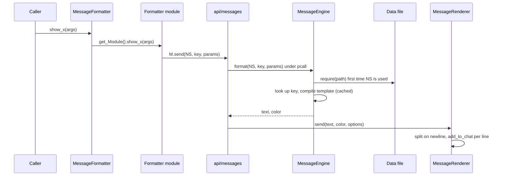

# Message templates catalogue

`shared/utils/messages/data/` holds every chat template used by the template-based half of the
message system: 36 pure-data Lua files (9 job namespaces under `data/jobs/`, 27 system namespaces
under `data/systems/`) returning 576 templates in total (counted on 2026-09-25 by loading each file
with `lua5.1`). Nothing in these files runs on its own. A
formatter module (`shared/utils/messages/formatters/**`, or a few utilities) calls
`M.send(namespace, key, params)` from `shared/utils/messages/api/messages.lua`; the engine
(`shared/utils/messages/core/message_engine.lua`) loads the namespace file on first use, fills the
template and hands the string to the renderer, which calls `add_to_chat`. Job and system code never
touches a template directly: it calls a `MessageFormatter.show_*` facade function
(`shared/utils/messages/message_formatter.lua`) or a formatter module.

This page also documents `shared/utils/whm/whm_message_formatter.lua`, a WHM formatter that lives
outside `messages/`, builds its lines by hand and uses no template (documented exception,
`.claude/CODE_QUALITY.md` section 6, item 3).

Numbers on this page come from loading every data file with `lua5.1` and resolving every
`M.send` / `M.job` call site, the formatter function containing it, the facade alias pointing to that
function, and every caller of the facade or module function in `shared/`, `_master/`, `Tetsouo/`,
`Kaories/` and root files, including string-built dispatch. That resolution was done on 2026-09-19
(381 reachable, 177 not). The figures below apply the key changes made since then: the `DATABASE`
namespace was deleted (`72e135d`, 10 reachable + 4 not), the `ALTGROUP`, `SORTIE` and `TEMPBIND`
namespaces were added (39 templates, every key sent by a function that has a caller), `WARP` lost
`registered_common` and `item_equip_delay` and gained `item_not_ready`, and six unreachable keys were
removed on 2026-09-25 (`BRD.marcato_honor_march`, `song_cast`, `honor_march_locked`,
`honor_march_released`, `UI.separator`, `WATCHDOG.status_header`). Result: **409 reachable, 167
not**. Existing namespaces were not re-resolved call by call, and the key line numbers were
re-read on 2026-09-25.

## Files

| Path | Lines | Role |
|---|---|---|
| `shared/utils/messages/data/jobs/blm_messages.lua` | 164 | `BLM` - element/tier cycles, refinement, MP conservation, arts, errors |
| `shared/utils/messages/data/jobs/brd_messages.lua` | 269 | `BRD` - JA, instrument lock, song packs, song refinement, errors |
| `shared/utils/messages/data/jobs/bst_messages.lua` | 306 | `BST` - ecosystem/species, broths, pet engage, Ready moves, errors |
| `shared/utils/messages/data/jobs/cor_messages.lua` | 32 | `COR` - PartyTracker load failures |
| `shared/utils/messages/data/jobs/drg_messages.lua` | 37 | `DRG` - Jump errors (all unreachable) |
| `shared/utils/messages/data/jobs/geo_messages.lua` | 41 | `GEO` - Indi/Geo cast lines, tier refinement |
| `shared/utils/messages/data/jobs/rdm_messages.lua` | 108 | `RDM` - state display, "not configured" errors, Phalanx up/downgrade |
| `shared/utils/messages/data/jobs/run_messages.lua` | 29 | `RUN` - Valiance/Vallation banners (never sent) |
| `shared/utils/messages/data/jobs/whm_messages.lua` | 22 | `WHM` - CureManager load warning (never sent) |
| `shared/utils/messages/data/systems/altgroup_messages.lua` | 29 | `ALTGROUP` - `//gs c alts`, `//gs c main` / `setalt` role lines, alt window toggle |
| `shared/utils/messages/data/systems/blm_midcast_messages.lua` | 89 | `BLM_MIDCAST` - BLM/RDM midcast router debug lines |
| `shared/utils/messages/data/systems/buffs_messages.lua` | 22 | `BUFFS` - one separator |
| `shared/utils/messages/data/systems/combat_messages.lua` | 158 | `COMBAT` - range/WS validation, WS TP lines, Waltz heal banners |
| `shared/utils/messages/data/systems/commands_messages.lua` | 352 | `COMMANDS` - output of common `//gs c` debug/config commands |
| `shared/utils/messages/data/systems/cooldowns_messages.lua` | 26 | `COOLDOWNS` - one separator |
| `shared/utils/messages/data/systems/debuffs_messages.lua` | 26 | `DEBUFFS` - one separator |
| `shared/utils/messages/data/systems/dualbox_messages.lua` | 164 | `DUALBOX` - dual-box init, job sync, status dump |
| `shared/utils/messages/data/systems/equipment_messages.lua` | 131 | `EQUIPMENT` - `//gs c checksets` lines and scanner debug |
| `shared/utils/messages/data/systems/info_messages.lua` | 51 | `INFO` - `//gs c info` lines (never sent) |
| `shared/utils/messages/data/systems/init_messages.lua` | 37 | `INIT` - INIT_SYSTEMS module load failure |
| `shared/utils/messages/data/systems/ja_buffs_messages.lua` | 59 | `JA_BUFFS` - universal job-ability activation lines |
| `shared/utils/messages/data/systems/keybinds_messages.lua` | 56 | `KEYBINDS` - keybind header and bind errors |
| `shared/utils/messages/data/systems/magic_messages.lua` | 209 | `MAGIC` - universal spell activation lines, 7 skill families x 4 shapes |
| `shared/utils/messages/data/systems/midcast_messages.lua` | 135 | `MIDCAST` - `//gs c debugmidcast` trace |
| `shared/utils/messages/data/systems/precast_messages.lua` | 98 | `PRECAST` - precast debug trace |
| `shared/utils/messages/data/systems/profiler_messages.lua` | 90 | `PROFILER` - `//gs c perf` output |
| `shared/utils/messages/data/systems/rdm_midcast_messages.lua` | 25 | `RDM_MIDCAST` - one separator |
| `shared/utils/messages/data/systems/songs_messages.lua` | 83 | `SONGS` - duplicate of part of `BRD` (all unreachable) |
| `shared/utils/messages/data/systems/sortie_messages.lua` | 102 | `SORTIE` - `//gs c sortie` target box, target list, alt orders, GEO escort |
| `shared/utils/messages/data/systems/status_messages.lua` | 60 | `STATUS` - generic error/warning/success/info, Mote state line, TP banner |
| `shared/utils/messages/data/systems/system_messages.lua` | 86 | `SYSTEM` - job-load intro box, COR color test |
| `shared/utils/messages/data/systems/tempbind_messages.lua` | 28 | `TEMPBIND` - `//gs c tb` temporary keybinds: added, taken, list, help |
| `shared/utils/messages/data/systems/ui_messages.lua` | 77 | `UI` - HUD toggles, position save, background |
| `shared/utils/messages/data/systems/warp_messages.lua` | 275 | `WARP` - warp/teleport casting, rings, IPC, equipment lock |
| `shared/utils/messages/data/systems/watchdog_messages.lua` | 262 | `WATCHDOG` - midcast watchdog status, config, alerts, test mode |
| `shared/utils/messages/data/systems/weaponskill_messages.lua` | 96 | `WEAPONSKILL` - WS manager and TP-bonus calculator debug |
| `shared/utils/whm/whm_message_formatter.lua` | 414 | Hand-built WHM chat lines (cure tier, Afflatus, CureManager debug) |

Context files read to write this page (documented on [messages.md](messages.md)):
`core/message_engine.lua` (323), `core/message_renderer.lua` (278), `api/messages.lua` (477),
`message_validator.lua` (417), `message_core.lua` (151), `message_colors.lua` (166).

## How it works



1. A formatter calls `M.send(ns, key, params)` (`api/messages.lua:53`), or the shortcuts `M.job(job, key, params)` (`:91`), `M.combat(key, params)` (`:99`), `M.magic(key, params)` (`:107`), `M.ability(key, params)` (`:117`). All shortcuts are `Messages.send` with a fixed namespace.
2. `Messages.send` wraps `MessageEngine.format` in `pcall` (`api/messages.lua:57-59`). On any error it prints `[MessageSystem ERROR] Failed to format message NS.key: <error>` in color 167 through `MessageRenderer.show_error` (`message_renderer.lua:273-276`) and returns `false, 0` (`api/messages.lua:61-67`). Nothing is raised to the caller.
3. `MessageEngine.format` (`message_engine.lua:227`) loads the namespace if needed (`:231-236`), indexes `_message_data[ns][key]` (`:239`), raises `Unknown message 'NS.key'` if absent (`:240-245`) and `Missing 'template' field` if the record has no `template` (`:248-253`).
4. Namespace to file (`message_engine.lua:184-190`): a namespace that is exactly 3 characters and already upper-case resolves to `shared/utils/messages/data/jobs/<ns:lower()>_messages`; anything else resolves to `shared/utils/messages/data/systems/<ns:lower()>_messages`. So `BLM` goes to `jobs/`, `BLM_MIDCAST` and `COMMANDS` go to `systems/`, and a lower-case `'brd'` goes to `systems/brd_messages` and fails. The file is loaded with `pcall(require, path)` (`:193`); a load failure or a non-table return raises (`:195-210`).
5. `compile_template` (`message_engine.lua:80-167`) tokenises the template once and caches the closure by template string (`:82-84`, `:164`). Tokens match `{([%w_]+)}` (`:93`). A token whose name is a key of `COLOR_CODES` (`:38-68`) becomes the 2-byte FFXI inline color `0x1F, code`; every other token is a parameter.
6. At format time each parameter is read from `params`; a `nil` raises `Missing parameter '<name>'` (`:150-155`), which step 2 turns into the error line. Values go through `tostring` (`:156`), so numbers need no conversion. Keys in `params` that the template does not use are ignored.
7. `format` returns the text and `template_data.color or 1` (`:260-262`). `Messages.send` measures the visible length by stripping every `0x1F`+1 byte pair (`api/messages.lua:71-72`), passes the text to `MessageRenderer.send` (`:77`) and returns `true, length`. `MessageCombat.show_spell_activated` and `JABuffs.show_activated` return that length to their callers.
8. `MessageRenderer.send` (`message_renderer.lua:88-140`) drops the message when disabled or filtered (no code in the repository changes those settings: `toggle`, `configure`/`config`, `set_color_mode`, `set_filter_level` and `toggle_timestamp` have no caller, so every message is sent with its own color), splits on `\n` with `gmatch("[^\n]+")` (`:116-126`) and calls `add_to_chat(color, line)` once per line with the same base color.

## Template schema

Every data file returns one flat table `key -> record`:

```lua
key_name = {
    template = "{gray}[{lightblue}{job}{gray}] {cyan}{spell}{gray} ...",  -- required
    color = 1,                                                              -- optional, default 1
},
```

- `template` (string, required): literal text plus `{token}` placeholders.
- `color` (number, optional): the chat mode passed to `add_to_chat` for every line of the message. It colors any text before the first inline color token and decides which chat filter the line falls under. Distribution over the 576 templates (2026-09-25): 1 (x365), 158 (x49), 167 (x44), 122 (x40), 160 (x33), 207 (x13), 200 (x11), 123 (x10), 159 (x6), 206, 8, 121 (x1 each) and two computed values. `MIDCAST.debug_result_fallback` and, since 2026-09-25, `STATUS.warning` compute their color at file load with `MessageColors.get_warning_color()` (`midcast_messages.lua:123`, `status_messages.lua:27`).
- No other field is read by the engine. Keys must be unique inside a file; the same key in two namespaces is independent (`BRD.doom_removed` vs `RDM.doom_removed`).

Color tokens (`message_engine.lua:38-68`, all other token names are parameters):

| Token | Code | Token | Code | Token | Code |
|---|---|---|---|---|---|
| `cyan` | 13 | `green` | 158 | `bluemagic` | 219 |
| `lightblue` | 207 | `red` | 167 | `orange` | region (see below) |
| `white` | 1 | `yellow` | 50 | `blue` | 122 |
| `gray` | 160 | `pink` | 11 | `purple` | 208 |
| `darkgray` | 8 | `healgreen` | 6 | `jobtag` | 207 |
| `enhancing` | 206 | `enfeebling` | 4 | `separatorcolor` | 160 |
| `divine` | 22 | `dark` | 15 | `spellcolor` | 13 |
| `itemcolor` | 63 | `warningcolor` | region | | |

`orange` and `warningcolor` are fixed when `message_engine.lua` is executed, from
`MessageColors.get_warning_color()` (`message_colors.lua:162-164`): `_G.ORANGE_COLOR_CODE` if set,
else 3 for `_G.DETECTED_FFXI_REGION == "EU"` or 57 for any other set region, else
`RegionConfig.get_orange_code(RegionConfig.get_region(player.name))`, else 57
(`get_region_orange`, `message_colors.lua:39-64`). Nothing in the repository sets either global any more (see Known issues).

Usage over the catalogue (2026-09-25): `gray` 368 templates, `lightblue` 310, `green` 173, `red` 122,
`yellow` 100, `cyan` 83, `white` 45, `jobtag` 44, `orange` 37, `separatorcolor` 36, `purple` 24,
`blue` 20, `itemcolor` 18, `pink` 10, `spellcolor` 9, the six spell-family tokens 4 each,
`warningcolor` 4, `darkgray` 0. The `{gray}[{lightblue}JOB{gray}]` job label is now the only style
in `RDM` and `COMBAT`, and for the `[WARP]` tag of `WARP` (set on 2026-09-25).

Parameter conventions found in the data:

- `{job}` (188 templates) carries the `[MAIN/SUB]` tag from `MessageCore.get_job_tag()` (`message_core.lua:56-67`); formatters pass it. `JA_BUFFS` and `SONGS` use `{job_tag}` instead. `GEO.spell_refined`/`no_tier_available` and the `COR`, `DRG`, `WHM` templates hard-code the job name.
- Parameters ending in `_color` (`element_color`, `mp_color`, `status_color`, `tp_color`, `hp_color`, `perf_color`, `key_color`, `desc_color`, `color_name`) receive an already-built `0x1F` escape from the formatter.
- Several parameters receive whole pre-built lines: `COMMANDS.testcolors_sample{sample}`, `INFO.entity_field{line}`, `KEYBINDS.keybind_header_separator{separator}`, `SYSTEM.intro_header_separator{separator}`, `STATUS.info{message}`.
- `MAGIC.*{spell}` and `{target}` arrive pre-colored (element and target-type colors, `message_combat.lua` local helpers above `spell_activated_key`).

Multi-line templates: a `\n` inside `template` produces several chat lines with the same base
`color`. Inline colors do not carry across lines, so every line restarts with its own token
(`run_messages.lua:20`). Empty lines are dropped by the renderer's `gmatch("[^\n]+")`
(`message_renderer.lua:120`), which is why blank lines are written as a single space
(`" \n"`, `commands_messages.lua` `detection_results_header`).

## Public API

The data files export only their returned table. Consumers:

| Function | File | Use of the catalogue |
|---|---|---|
| `Messages.send(ns, key, params, options)` | `api/messages.lua:53` | The only runtime entry point. Returns `ok, visible_length`. |
| `Messages.job/combat/magic/ability` | `api/messages.lua:91-119` | Fixed-namespace wrappers. `ability` targets `ABILITY`, which has no data file. |
| `Messages.list(ns)` | `api/messages.lua:302` | Prints all keys of a namespace. No caller. |
| `MessageEngine.load(ns)` | `message_engine.lua:176` | Lazy namespace load. |
| `MessageEngine.format(ns, key, params)` | `message_engine.lua:227` | Template lookup and fill. |
| `MessageEngine.list_keys/is_loaded/get_stats/clear_cache` | `message_engine.lua:272-321` | Debug helpers. |
| `MessageValidator.run_all_tests()` | `message_validator.lua:261` | Static check of `data/jobs/` for 8 jobs (`:42-44`). |

`whm_message_formatter.lua` (no template, no facade entry, loaded with `pcall(require, ...)`):

| Function | Line | Output | Callers |
|---|---|---|---|
| `show_cure_tier_change(original, new, hp_missing, reason)` | 90 | `[JOB] Cure IV >> Cure II (Target missing N HP)` via `MessageCore.raw` | `cure_manager.lua:378`, `:382` |
| `show_afflatus_change(stance)` | 177 | `[JOB] Afflatus Solace activated (Healing Focus)` | `WHM_COMMANDS.lua:157`, `:162` |
| `show_debug_no_target/target/self_hp/party_members/party_member_hp/alliance_member_hp` | 363-408 | `[DEBUG] ...` via `add_to_chat(123, ...)` | `cure_manager.lua:105-193`, only when `WHMCureConfig.debug_messages` |
| `show_cure_heal`, `show_cure_stoneskin`, `show_benediction`, `show_devotion`, `show_martyr`, `show_cursna`, `show_status_removal`, `show_auto_tier_toggle`, `warning`, `error` | 128-356 | hand-built lines | none |

The job tag is `MessageCore.get_job_tag()` in color 200 (local `get_job_tag`, `whm_message_formatter.lua:75-79`), not
the `lightblue` (207) used by the templates. `MessageCore.raw(message)` takes one argument and sends
with chat mode 1 (`message_core.lua:108-110`).

## Commands

| Command | Handler | Relation to the catalogue |
|---|---|---|
| `//gs c jamsg [full\|on\|off]`, `spellmsg`, `wsmsg` | `COMMON_COMMANDS.lua:638-643` -> `DEBUG_COMMANDS.lua` `handle_message_config_generic` (`:179-217`) | Calls `MessageCommands['show_' .. prefix .. '_<suffix>']` (`:185-214`); uses `COMMANDS.<prefix>_config_error`, `_invalid_mode`, `_mode_changed_full/on/off`, `_set_failed`. Mode aliases are normalised to `full`/`on`/`off` before the key is built (`:197-208`). |
| `//gs c testmsg [job]`, `msgtest` | `COMMON_COMMANDS.lua:648-653` -> `Messages.test` (`api/messages.lua:458`) | Runs `shared/utils/messages/api/tests/test_<job>`; that directory no longer exists. |
| `//gs c msgtests` | `COMMON_COMMANDS.lua:655-658` -> `MessageValidator.run_all_tests` | Checks tags of `data/jobs/*` and formatter exports; prints to the console with `print`, writes the generated `data/message_validation.{json,txt}` (`export_json` / `export_txt`, `message_validator.lua:306`, `:355`). |
| `//gs c testcolors`, `debugsubjob`, `checksets`, `info`, `perf`, `debugmidcast`, watchdog, warp, dualbox commands | see [messages.md](messages.md) and the owning system pages | Produce `COMMANDS`, `EQUIPMENT`, `PROFILER`, `MIDCAST`, `WATCHDOG`, `WARP`, `DUALBOX` lines. |
| `//gs c alts ...`, `//gs c main`, `//gs c setalt` | [dualbox.md](dualbox.md) | `ALTGROUP` lines. |
| `//gs c sortie ...` (main), `//gs c escort` (GEO alt) | `shared/utils/sortie/sortie_commands.lua`, `GEO_COMMANDS.lua` | `SORTIE` lines. |
| `//gs c tb ...` | `shared/utils/keybinds/temp_binds.lua` | `TEMPBIND` lines. |

## Configuration

- Region orange: `orange`/`warningcolor` tokens, `MIDCAST.debug_result_fallback.color` and `STATUS.warning.color` follow `message_colors.lua:39-64` (config `RegionConfig` from `_G.RegionConfig`, captured when `message_colors.lua` executes, `:31`).
- Display modes (`JA_MESSAGES_CONFIG`, `ENHANCING_MESSAGES_CONFIG`, `WS_MESSAGES_CONFIG` in `shared/config/`) decide in the formatters which key is sent (`activated_full` vs `activated_name_only`, `ws_activated_*` vs `ws_tp_*`); the data files read no configuration.
- WHM: `whm_message_formatter` has no configuration; `cure_manager.lua:34` loads `<char>/config/whm/WHM_CURE_CONFIG` whose `debug_messages` gates the debug lines.

## State & lifetime

- Data files hold no state and write no globals. `midcast_messages.lua:14` and `status_messages.lua:13` require `message_colors`, which reads `_G.RegionConfig`, `_G.ORANGE_COLOR_CODE`, `_G.DETECTED_FFXI_REGION` and `player.name` (the unused require in `precast_messages.lua` was removed on 2026-09-25).
- The engine keeps `_template_cache` (compiled closures by template string) and `_message_data` (namespace tables) as module locals (`message_engine.lua:21-24`). It writes `_G.MESSAGE_ENGINE_LOADED` (`:32`); if the file executes again while that flag is set it empties both caches (`:28-31`), which changes nothing because both are empty at that point.
- GearSwap's sandbox `require` is `include_user`, which never stores results (`user_functions.lua:300-333` in the GearSwap addon). The project's `ModuleCache` (installed first thing by `INIT_SYSTEMS.lua:54-56`) caches modules on the sandbox `_G`, so one engine instance and one copy of each data file exist per sandbox. The sandbox is rebuilt whenever GearSwap loads the job file (`gs reload`, main job change; `module_cache.lua:19-24` cites `refresh.lua:83`), and every namespace is re-read on the first message after that. A subjob change also ends in a `gs reload`, sent by JobChangeManager 0.5 s later (`JobChangeManager.on_job_change`, `job_change_manager.lua:134-191`, see [core-lifecycle.md](core-lifecycle.md)); zoning loads the job file only when the main job differs from the one GearSwap holds (GearSwap `packet_parsing.lua:39-41`).
- No event, keybind, coroutine or text object is created by any file in scope.

## Interactions

- Engine, API, renderer, facade and formatter modules: [messages.md](messages.md).
- Main senders by namespace are listed in the catalogue. The universal handlers `shared/utils/messages/handlers/spell_message_handler.lua:302` (`MAGIC`) and `ability_message_handler.lua:271` (`JA_BUFFS`) produce most of the per-action chat lines.
- Dual-box, Sortie and temporary binds: [dualbox.md](dualbox.md), [keybinds-and-custom.md](keybinds-and-custom.md).
- WHM formatter: [../jobs/whm.md](../jobs/whm.md) (`WHM_COMMANDS.lua`, `shared/utils/whm/cure_manager.lua`).
- Job-specific namespaces: [../jobs/blm.md](../jobs/blm.md), [../jobs/brd.md](../jobs/brd.md), [../jobs/bst.md](../jobs/bst.md), [../jobs/rdm.md](../jobs/rdm.md), [../jobs/geo.md](../jobs/geo.md), [../jobs/cor.md](../jobs/cor.md).

## Catalogue

Format: key, then the parameters it requires in parentheses. "Unreachable" keys are followed by
their line in the data file; they have no path from any caller (see Known issues for the causes).

### `BLM`

- File: `data/jobs/blm_messages.lua` - 23 templates, 12 reachable. Sender: `formatters/jobs/message_blm.lua`. Callers: `BLM_COMMANDS.lua`, `shared/utils/scholar/scholar_actions.lua`, `blm/functions/logic/spell_refiner.lua`, `storm_manager.lua`, `shared/utils/precast/tier_refiner.lua`. All `color = 1`.
- Reachable: `element_cycle` (job, state_type, element_color, element); `storm_cycle` (job, element_color, storm); `tier_cycle` (job, tier); `spell_refinement` (job, original, recast, downgrade); `arts_already_active` (job, arts); `stratagem_no_charges` (job, stratagem, recast); `buffself_error`, `spell_replacement_error`, `spell_refinement_error`, `spell_recasts_error`, `breakga_blocked` (job); `insufficient_mp_error` (job, mp).
- Unreachable: `mp_conservation`:93 (the BLM midcast router calls `MessageBLMMidcast.show_mp_conservation`, which sends `BLM_MIDCAST.mp_conservation`), `aja_cycle`:27, `buff_activated`:46, `buff_cast`:51, `magic_burst_on`:60, `magic_burst_off`:65, `free_nuke_on`:70, `spell_refinement_failed`:84, `dark_arts_activated`:102, `buff_casting`:155, `buff_status`:160. Five further keys were deleted in `78e3186` (`buffself_recasts_error`, `buffself_resources_error`, `unknown_buff_error`, `buff_already_active`, `manual_buff_cast`).

### `BLM_MIDCAST`

- File: `data/systems/blm_midcast_messages.lua` - 12, all reachable. Sender: `formatters/jobs/message_blm_midcast.lua`. Callers: `blm/functions/logic/midcast_router.lua`, `BLM_MIDCAST.lua` (RDM no longer calls it: `grep -r MessageBLMMidcast` finds only the BLM files, 2026-09-25). Colors 158 (x10), 159, 206.
- Keys: `elemental_routing`, `elemental_return`, `dark_routing`, `dark_return`, `enfeebling_routing`, `enfeebling_return` (no params); `elemental_magic_burst_mode` (magic_burst_mode); `mode_value` (mode_value); `mp_conservation`, `normal_mp` (current_mp, mp_threshold); `elemental_match` (reason); `skill_not_handled` (spell_skill).

### `BRD`

- File: `data/jobs/brd_messages.lua` - 42 templates, 23 reachable. Sender: `formatters/jobs/message_brd.lua`. Callers: `BRD_COMMANDS.lua`, `brd/functions/logic/song_rotation_manager.lua`, `BRD_PRECAST.lua`, `song_refinement.lua`, `midcast_router.lua`, `BRD_AFTERCAST.lua`. All `color = 1`.
- Reachable: `marcato_used`, `pianissimo_used`, `elegy_cast`, `requiem_cast`, `no_element_selected`, `no_carol_element`, `no_etude_type` (job); `pianissimo_target` (job, target); `ability_command` (job, ability); `instrument_locked`, `instrument_released` (job, song, instrument); `daurdabla_dummy` (job, song_name, instrument); `songs_casting` (job, rotation); `song_pack` (job, pack, songs); `dummy_casting` (job, count); `lullaby_cast` (job, type); `threnody_cast`, `carol_cast` (job, spell); `etude_cast` (job, stat); `song_refinement` (job, original, recast, downgrade); `song_refinement_failed` (job, song, recast); `no_song_in_slot` (job, slot); `pack_not_found` (job, pack).
- Unreachable: `soul_voice_activated`:18, `soul_voice_ended`:23, `nightingale_activated`:28, `nightingale_active`:33, `troubadour_activated`:38, `troubadour_active`:43, `marcato_skip_buffs`:53, `marcato_skip_soul_voice`:58, `songs_refresh`:115, `tank_casting`:131, `tank_refresh`:136, `healer_casting`:141, `healer_refresh`:146, `song_guidance`:155, `doom_gained`:216, `doom_removed`:221, `no_pack_configured`:230, `tank_not_configured`:235, `healer_not_configured`:240. The four dead keys `marcato_honor_march`, `song_cast`, `honor_march_locked` and `honor_march_released` were deleted on 2026-09-25, together with the empty `show_marcato_honor_march` / `show_song_cast` formatter functions, their facade lines and their BRD callers; `show_honor_march_locked/released` wrap `show_instrument_locked/released` (`message_brd.lua:170-179`). `dummy_cast` is commented out in the data file (`brd_messages.lua:126-129`) but still sent by `show_dummy_cast` (Known issues).

### `BST`

- File: `data/jobs/bst_messages.lua` - 53 templates, 19 reachable. Sender: `formatters/jobs/message_bst.lua` (facade exports each function twice, as `show_bst_<name>` and `show_<name>`). Callers: `BST_COMMANDS.lua`, `bst/functions/logic/ecosystem_manager.lua`, `pet_manager.lua`. All `color = 1`.
- Reachable: `broth_count_header`, `no_broths`, `no_pet`, `no_ready_moves` (job); `ecosystem_change` (job, ecosystem, count, species_text); `species_change` (job, species, count, jug_text); `broth_equip` (job, broth, pet); `broth_count_line` (job, broth, count); `pet_engage`, `pet_disengage`, `ready_moves_header` (job, pet); `ready_move_item`, `ready_move_use`, `ready_move_auto_engage`, `ready_move_auto_sequence` (job, index, move); `ready_moves_usage` (job, max); `invalid_index` (job, index); `index_out_of_range` (job, index, max); `module_not_loaded` (job, module).
- Unreachable (34): `call_beast_used`:18, `bestial_loyalty_used`:23, `familiar_activated`:28, `familiar_active`:33, `spur_used`:38, `run_wild_used`:43, `tame_used`:48, `reward_used`:53, `reward_no_food`:58, `feral_howl_used`:63, `killer_instinct_activated`:68, `jug_equipped`:96, `broth_count_footer`:116, `pet_summoned`:125, `pet_dismissed`:140, `auto_engage_enabled`:145, `auto_engage_disabled`:150, `auto_engage_status`:155, `pet_tp_status`:160, `pet_hp_status`:165, `ready_move_precast`:174, `ready_move_physical`:179, `ready_move_magical`:184, `ready_move_breath`:189, `ready_move_tp_check`:194, `ready_move_recast`:229, `pet_charmed`:238, `pet_charm_failed`:243, `pet_died`:248, `pet_despawned`:253, `no_target`:287, `pet_too_far`:292, `no_jug_equipped`:297, `insufficient_hp`:302.

### `BUFFS`, `COOLDOWNS`, `DEBUFFS`, `RDM_MIDCAST`

- One `separator` template each (`buffs_messages.lua:18` color 160, `cooldowns_messages.lua:22` color 1, `debuffs_messages.lua:22` color 1, `rdm_midcast_messages.lua:21` color 8), 69 characters wide since 2026-09-25 (they were shorter). The formatters of these areas (`message_buffs.lua`, `message_cooldowns.lua`, `message_debuffs.lua`, `message_rdm_midcast.lua`) build the rest of their output inline; the file headers say so.

### `COMBAT`

- File: `data/systems/combat_messages.lua` - 25 templates, 16 reachable. Sender: `formatters/combat/message_combat.lua`. Callers: `shared/utils/dnc/waltz_manager.lua`, `shared/hooks/init_ws_messages.lua` (WS wrapper, `:128`, `:132`), `weaponskill_manager.lua`, `ws_precast_handler.lua`, PLD/RUN `aoe_manager.lua`. The `[JOB]` label of its templates was set to `{gray}[{lightblue}{job}{gray}]` on 2026-09-25.
- Reachable: `range_error` (ability, distance); `ws_validation_error_status` (job, ws_name, reason, status); `ws_validation_error_detail` (ws_name, reason, detail); `ws_validation_error` (job, ws_name, reason); `ability_tp_error` (job, ability, current_tp, required_tp); `ws_tp_ultimate/enhanced/normal` (ws_name, tp) - chosen at 3000/2000 TP (`MessageCombat.show_ws_tp`, `message_combat.lua:232`); `ws_activated_ultimate/enhanced/normal` (job, ws_name, description, tp) (`show_ws_activated`, `:252`); `spell_cast` (job, spell_name); `waltz_heal_single` (job, hp, waltz_name), `waltz_heal_single_extra` (+ extra), `waltz_heal_aoe` (job, waltz_name), `waltz_heal_aoe_extra` (+ extra) (`show_waltz_heal`, `:313-350`).
- Unreachable: `target_error`:38 (`MessageFormatter.show_target_error` has no caller; the dual-box `show_target_error` is `MessageDualbox`'s), `ws_activated_no_tp`:87 (sent only when TP is nil; the only caller, the WS wrapper in `init_ws_messages.lua`, always passes a number), `state_change`:43, `ability_use`:101, `jump_activated`:134, `jump_chaining_desc`:139, `jump_chaining`:144, `jump_complete`:149, `jump_relaunch`:154 (the auto-jump code moved to `shared/utils/drg/auto_jump.lua` in `d9e5f38` sends no message).

### `COMMANDS`

- File: `data/systems/commands_messages.lua` - 59 templates, 34 reachable. Sender: `formatters/ui/message_commands.lua`. Callers: `COMMON_COMMANDS.lua`, `DEBUG_COMMANDS.lua` (string dispatch), every `<JOB>_COMMANDS.lua` for `debugmidcast_toggled`.
- Reachable: `testcolors_sample` (sample); `lockstyle_reapplying`; `warp_error_header`, `warp_error` (error), `warp_error_footer`, `warp_testing_modules`, `warp_module_test` (module, status); `debugsubjob_no_player`, `main_job_info` / `sub_job_info` (job, level), `zone_info_header`, `zone_id` (zone_id), `zone_name` (zone_name), `zone_info_unavailable`; for each of `jamsg`, `spellmsg`, `wsmsg`: `_config_error`, `_invalid_mode` (mode), `_mode_changed_full`, `_mode_changed_on`, `_mode_changed_off`, `_set_failed`; `warp_debug_toggled` (status); `debugmidcast_toggled` (job, debug_state).
- Unreachable (25): `testcolors_header`:18, `testcolors_separator`:28, `testcolors_footer`:33, `detectregion_header`:42, `windower_info_header`:47, `windower_info_field`:52, `detection_results_header`:57, `region_detected`:62, `region_detection_failed`:67, `detectregion_footer`:72, `region_saved`:77, `setregion_usage`:86, `region_set_us`:91, `region_set_eu`:96, `region_set_jp`:101, `invalid_region`:106, `region_reload_required`:111, `debugsubjob_header`:158, `debugsubjob_instructions`:198, `jamsg_status_header`:212, `jamsg_current_mode`:217, `spellmsg_status_header`:256, `spellmsg_current_mode`:261, `wsmsg_status_header`:300, `wsmsg_current_mode`:305.

### `COR`, `GEO`, `WHM`, `DRG`, `RUN`

- `COR` (`cor_messages.lua`, 3, all reachable): `rolltracker_load_failed`, `packets_load_failed`, `resources_load_failed`; sent by `message_cor.lua`, called from `cor/functions/logic/party_tracker.lua`.
- `GEO` (`geo_messages.lua`, 4, all reachable): `indi_cast`, `geo_cast` (job, spell, description); `spell_refined` (desired, final); `no_tier_available` (spell); sent by `message_geo.lua`, called from `GEO_MIDCAST.lua` and `geo/functions/logic/geo_spell_refiner.lua`.
- `WHM` (`whm_messages.lua`, 1): `curemanager_not_loaded`:18, unreachable.
- `DRG` (`drg_messages.lua`, 4): `drg_subjob_required`:18, `subjob_disabled`:23, `jump_on_cooldown`:28 (recast), `high_jump_on_cooldown`:33 (recast), all unreachable (`MessageDRG` functions have no caller).
- `RUN` (`run_messages.lua`, 2): `valiance_expired`:19, `vallation_expired`:25, never sent by any code since they were added in `6a8e637`.

### `ALTGROUP`

- File: `data/systems/altgroup_messages.lua` - 15 templates, all reachable, all `color = 1`. Added by `60aa138` (`//gs c alts`, `//gs c main`) and `6ef0e3d` (alt window); `not_ready`, `window_main_only` and `no_follower` added on 2026-09-25. Sender: `formatters/system/message_altgroup.lua` (not in the facade). Callers: `shared/utils/dualbox/alt_group.lua`, `alt_window.lua`, `dualbox_role.lua`, each through `pcall(require, ...)`.
- Keys: `auto_on`, `auto_off`, `follow_off` (names); `follow_on`, `no_follower` (names / leader); `sent` (names, command); `mirror`; `role_main` (name, alts); `role_alt` (name, main); `window_on`, `window_off`, `window_main_only`; `no_alts` (no alt in `DUALBOX_CONFIG`); `not_ready` (`_G.DualBoxConfig` still nil, the 2 s after a reload); `usage` (two lines).

### `DATABASE` (deleted)

- The data file `database_messages` and its formatter `message_database` were deleted in `72e135d`, with the weaponskill query API that was their last sender (see [../data/ability-and-weaponskill-databases.md](../data/ability-and-weaponskill-databases.md)).

### `DUALBOX`

- File: `data/systems/dualbox_messages.lua` - 27, all reachable. Sender: `formatters/ui/message_dualbox.lua`. Callers: `shared/utils/dualbox/dualbox_manager.lua` and the other dual-box modules. Colors 122 (x24), 167 (x3).
- Keys: `config_loaded`, `config_not_found` (config_path); `role`, `status_role` (role); `alt_info_this`, `main_info_this`, `status_alt_this`, `status_main_this` (this_char); `alt_info_target`, `main_info_target`, `status_alt_target`, `status_main_target` (target_char); `alt_role_detected`, `main_role_detected`, `reloading_macrobook`, `target_error`, `not_initialized`, `status_header`, `status_footer`; `job_update_sent` (target_name, main_job, sub_job); `job_request_received`, `requesting_job` (target_name); `job_update_received` (role, main_job, sub_job); `status_enabled` (enabled); `status_alt_online` (online); `status_alt_job` (job, subjob); `status_last_update` (seconds). `not_initialized` tells the user to "Check dualbox_config.lua"; the loader reads `<char>/config/DUALBOX_CONFIG` (`dualbox_manager.lua:78`).

### `EQUIPMENT`

- File: `data/systems/equipment_messages.lua` - 22 templates, 15 reachable. Sender: `formatters/system/message_equipment.lua`. Caller: `shared/utils/equipment/equipment_checker.lua` (`//gs c checksets`).
- Reachable: `missing_item` (slot, item_name); `missing_item_set`, `storage_item_set` (set_path); `storage_item` (slot, item_name, bag_name); `check_error` (job_name, error_msg); `no_sets_found` (job_name); `max_recursion_error` (max_depth, path); `alias_detected` (path); `scanning` (path, depth); `building_cache`, `starting_scan`; `cache_built` (cache_size); `scan_complete` (set_count); `cache_build_failed`, `scan_failed` (error_msg).
- Unreachable: `check_header_separator`:18, `check_header_title`:23, `set_valid`:28, `summary_separator`:53, `summary_valid_sets`:58, `summary_storage`:63, `summary_missing`:68 (header and summary are built with `add_to_chat` in `show_check_header` / `show_check_summary`, `message_equipment.lua:23-93`).

### `INFO`

- File: `data/systems/info_messages.lua` - 5 templates, none reachable: `entity_header`, `entity_name`, `entity_field`, `entity_footer`, `not_found` (`usage` deleted on 2026-09-25: the usage screen is a HelpScreen). `formatters/ui/message_info.lua:47-97` prints the same lines with `add_to_chat` and never calls `M.send`.

### `INIT`

- File: `data/systems/init_messages.lua` - 4 templates. Reachable: `module_load_failed` (module_name, error_msg), sent by `message_init.lua:23` from `INIT_SYSTEMS.lua`. Unreachable: `watchdog_load_failed`:23, `module_loaded`:28, `init_complete`:33.

### `JA_BUFFS`

- File: `data/systems/ja_buffs_messages.lua` - 7 templates. Sender: `formatters/combat/message_ja_buffs.lua`; main caller `handlers/ability_message_handler.lua:271` via `MessageFormatter.show_ja_activated`.
- Reachable: `activated_full` (job_tag, ability_name, description); `activated_name_only` (job_tag, ability_name).
- Unreachable: `active`:31, `ended`:37, `with_description`:43, `using`:49, `using_double`:55 - their senders (`show_active`, `show_ended`, `show_with_description`, `show_using`, `show_using_double`, facade `show_ja_*`, and the BRD wrappers that call them) have no caller.

### `KEYBINDS`

- File: `data/systems/keybinds_messages.lua` - 7 templates. Sender: `formatters/ui/message_keybinds.lua`. Callers: every `<char>/config/<job>/<JOB>_KEYBINDS.lua` (live `Tetsouo/`, `Kaories/` and `_master/`).
- Reachable: `keybind_header_separator` (separator); `keybind_header_title` (padded_title); `no_binds_error` (job_name); `bind_failed_error` (bind_key); `bind_failed_error_reason` (bind_key, reason).
- Unreachable: `keybind_line`:28, `invalid_bind_error`:42.

### `MAGIC`

- File: `data/systems/magic_messages.lua` - 28, all reachable. Sender: `MessageCombat.show_spell_activated` (`message_combat.lua:448-470`), called by `handlers/spell_message_handler.lua:302` and `brd/functions/logic/midcast_router.lua:135`. `BRDMessages.show_song_cast_generic` (`message_brd.lua:353-375`) also sends `spell_activated_full` but has no caller.
- Key = `<family>` + `spell_activated` + `<shape>` (`SPELL_KEY_PREFIX` and `spell_activated_key`, `message_combat.lua:412-438`). Family prefix from `spell.skill`: `healing_`, `enhancing_`, `enfeebling_`, `divine_`, `dark_`, `blue_`, or empty for any other skill. Shape: `_full_target` (job, spell, target, description), `_full` (job, spell, description), `_target` (job, spell, target), none (job, spell). The target is dropped when it is the player (`:456`). The families differ only in the color token around `{spell}`: none (inherits the pre-colored name), `healgreen`, `enhancing`, `enfeebling`, `divine`, `dark`, `bluemagic`.

### `MIDCAST`, `PRECAST`

- `midcast_messages.lua` - 19 templates, 17 reachable; sender `formatters/magic/message_midcast.lua`; callers `shared/utils/midcast/midcast_manager.lua` (debug trace) and the precast debug of RDM/BST/BRD/RUN. Keys: `debug_enabled_separator`, `debug_enabled_title`, `debug_disabled`, `debug_header_separator`, `debug_priorities_header`, `debug_result_header`; `debug_header_spell` (spell, skill, target); `debug_step_ok/warn/fail/info` (step, label, value) - key built from the status (`message_midcast.lua:59-65`); `debug_priority_found/missing` (priority, label); `debug_result_success/fallback` (set_type); `debug_equipment_line` (slot1, item1, slot2, item2); `debug_equipment_single` (slot, item). Unreachable: `debug_target_header`:78, `debug_target_property`:83.
- `precast_messages.lua` - 13, all reachable; sender `formatters/magic/message_precast.lua`; callers `RDM_PRECAST.lua`, `BST_PRECAST.lua`, `BRD_PRECAST.lua`, `RUN_PRECAST.lua`, `COMMON_COMMANDS.lua` (toggle). Same step keys as MIDCAST (`message_precast.lua:57-63`, value defaulted to `""`), plus `debug_header_action` (action, type), `debug_completion_separator`, `debug_completion`, `debug_set_equipped` (set), `debug_equipment_single` (slot, item).

### `PROFILER`

- File: `data/systems/profiler_messages.lua` - 13 templates. Senders: `shared/utils/debug/performance_profiler.lua` (through `get_M()`) and the `perf` branch of `WAR_COMMANDS.lua` (`usage`), which is unreachable because `perf` is a common command. Reachable: `enabled`, `disabled`, `reload_hint`, `status_enabled`, `status_disabled`, `status_hint`, `usage`, `separator`; `checkpoint_main` (context, label, perf_color, time); `checkpoint_job` (job, label, perf_color, time); `total` (context, perf_color, time). Unreachable: `measure`:81 and `call`:86 (sent by `Profiler.measure` and `Profiler.profile_call`, which have no caller).

### `RDM`

- File: `data/jobs/rdm_messages.lua` - 15 templates, 10 reachable. Sender: `formatters/jobs/message_rdm.lua`. Callers: `RDM_COMMANDS.lua`, `RDM_PRECAST.lua`.
- Reachable: `element_list`, `no_enspell_selected`, `gain_spell_not_configured`, `bar_element_not_configured`, `bar_ailment_not_configured`, `spike_not_configured`, `storm_requires_sch`, `phalanx_downgrade`, `phalanx_upgrade` (job); `storm_current` (job, value).
- Unreachable: `doom_warning`:18, `doom_removed`:23, `spell_casting`:32, `enspell_current`:46, `phalanx_detected`:94.

### `SONGS`

- File: `data/systems/songs_messages.lua` - 10 templates, none reachable. Sender `formatters/magic/message_songs.lua`, exported as `MessageFormatter.show_song_*` (`message_formatter.lua:151-160`); no caller uses those names. The same messages exist in `BRD` with `{job}` instead of `{job_tag}` and different parameter names (`rotation` vs `rotation_type`, `pack`/`songs` vs `pack_name`/`song_list`), and every live caller reaches the `BRD` versions.

### `STATUS`

- File: `data/systems/status_messages.lua` - 7 templates. Sender: `formatters/ui/message_status.lua`, used through `MessageFormatter.show_error/show_warning/show_success/show_info` by most `<JOB>_COMMANDS.lua`, `COMMON_COMMANDS.lua`, `macrobook_manager.lua`. Reachable: `error`, `warning`, `success`, `info` (message); `state_display` (state_name, value) from `shared/utils/core/state_display_override.lua:37`; `tp_ready` (job, tp_value). Unreachable: `tp_required`:56. Since 2026-09-25 `warning` takes its color from `MessageColors.get_warning_color()` (region orange) instead of a fixed code.

### `SYSTEM`

- File: `data/systems/system_messages.lua` - 13 templates. Sender: `formatters/system/message_system.lua`. `intro_*` are sent by the local `build_and_display_intro` (`message_system.lua:79-100`), reached from `MessageFormatter.show_system_intro` / `show_system_intro_complete` in `KeybindManager` (`shared/utils/keybinds/keybind_manager.lua:247-249`), which every job's keybinds now go through. `colortest_*` are sent only from `COR_COMMANDS.lua:309-321` (the title hard-codes `[COR]`), which is never reached: `testcolors` is a common command and returns through `CommonCommands` first (`COR_COMMANDS.lua:161-167`).
- Reachable: `intro_header_separator`, `intro_footer_separator` (separator); `intro_header_title` (title); `intro_macrobook` (key_color, desc_color, book, page); `intro_lockstyle` (key_color, desc_color, style, delay); `intro_keybinds` (key_color, desc_color, count); `intro_ui_visible`, `intro_ui_hidden` (key_color, desc_color). Unreachable: `colortest_header_separator`:62, `colortest_header_title`:67, `colortest_sample`:72, `colortest_footer_separator`:77, `colortest_footer_complete`:82.

### `UI`

- File: `data/systems/ui_messages.lua` - 9 templates. Sender: `formatters/ui/message_ui.lua`. Callers: `shared/utils/ui/ui_appearance.lua`, `ui_section_toggles.lua`, `ui_visibility.lua`, `UI_COMMANDS.lua`, `dualbox/alt_commands.lua`. Reachable: `toggle_on`/`toggle_off` (component, key chosen at `message_ui.lua:26`); `enabled`, `disabled`, `position_save_failed`; `position_saved` (x, y); `error` (error_text); `background_preset` (preset_name, r, g, b, a); `background_rgba` (r, g, b, a). The unreachable `separator` was deleted on 2026-09-25.

### `WARP`

- File: `data/systems/warp_messages.lua` - 46 templates, 35 reachable. Sender: `formatters/system/message_warp.lua`. Callers: `shared/utils/warp/casting/item_user.lua`, `spell_caster.lua`, `warp_commands.lua`, `warp_ipc.lua`, `warp_ipc_register.lua`, `warp_equipment.lua`, `warp_init.lua`, `warp_precast.lua`. 44 of the 46 templates start with `{jobtag}{gray}`: the first token is a color, immediately overridden, so no job tag is printed; the visible prefix is `[WARP]`, `[TELE]`, `[Warp IPC]`, `[Warp Init]` or the caller's `{tag}`. The template added in `d52ddc2` was `{jobtag}[WARP]`, which colored the tag; the rewrite to `{jobtag}{gray}[{separatorcolor}WARP{gray}]` in `a9c46e0` left the leading token without effect. On 2026-09-25 the 26 `[WARP]` tags became `{gray}[{lightblue}WARP{gray}]`.
- Reachable: `warp_casting`, `tele_casting`, `precast_fc_warning`, `force_fc` (spell_name); `warp_equipping`, `warp_using`, `tele_equipping`, `tele_using` (ring_name); `warp_level_error`, `tele_level_error` (spell_name, required_level, current_level); `warp_requires_blm`, `tele_requires_whm` (spell_name, required_level); `spell_cannot_cast` (error_reason); `ipc_test_sent`, `ipc_test_sent_confirm`, `ipc_test_received_confirm`; `ipc_test_received` (sender); `ipc_broadcasting`, `ipc_command_received`, `ipc_executing`, `ipc_not_allowed` (command); `equipment_locked`, `equipment_unlocked` (tag, duration); `equipment_lock_error`, `equipment_unlock_error`, `init_error` (+ module_name) (error_msg); `force_unlock`, `fix_ring_start`, `fix_ring_complete`, `manual_lock`, `all_items_cooldown`; `using_destination` (item_name, destination); `item_cooldown_time`, `next_available_item` (item_name, time_msg); `item_not_ready` (item_name, `item_user.lua:263`). `registered_common` and `item_equip_delay` were removed in `518e536`; `show_item_equip_delay` now prints with `add_to_chat`.
- Unreachable: `debug_toggle`:219 (its only sender, `warp_commands.lua:114`, is behind `debugwarp`, which `COMMON_COMMANDS.lua:620-621` answers first, through `DebugCommands.handle_debugwarp`), `warp_countdown`:28, `warp_unavailable`:48, `warp_no_charges`:53, `warp_recast`:58, `warp_charges_remaining`:63, `tele_countdown`:82, `tele_unavailable`:107, `tele_no_charges`:112, `tele_recast`:117, `tele_charges_remaining`:122.

### `WATCHDOG`

- File: `data/systems/watchdog_messages.lua` - 44 templates, 41 reachable. Sender: `formatters/system/message_watchdog.lua`. Callers: `shared/utils/core/midcast_watchdog.lua`, `WATCHDOG_COMMANDS.lua`. Colors 158 (x21), 207 (x13), 167 (x6), 200 (x4).
- Reachable: `enabled`, `disabled`, `not_loaded`, `invalid_buffer`, `invalid_fallback`, `debug_enabled`, `debug_disabled`, `debug_scanner_disabled`, `debug_no_active`, `all_cleared`, `test_aftercast_blocked`, `test_started`, `test_deactivated`, `help`; `status_enabled` (enabled); `status_debug` (debug); `status_buffer` (buffer); `status_fallback` (fallback); `status_active`, `status_active_midcast` (active); `status_spell`, `status_current_spell` (spell_name, spell_id); `status_item`, `status_current_item` (spell_name, item_id) - spell/item key chosen from `stats.action_type` (`message_watchdog.lua:58`, `:88`); `status_cast_time` (cast_time); `status_timeout` (timeout); `status_age` (age); `buffer_set`, `buffer_formula`, `fallback_set` (seconds); `debug_midcast_item` (spell_name, cast_delay, timeout); `debug_midcast_spell_fc` (spell_name, base_cast, fc_percent, adjusted_cast, timeout); `debug_ignored_action` (action_name, action_type); `debug_scan` (spell_name, age, timeout); `stuck_detected` (spell_name, action_label); `stuck_timing` (cast_time, age); `error_in_check` (error); `force_clearing`, `test_simulating` (spell_name); `test_cast_time` (cast_time, timeout, buffer); `test_fallback` (timeout).
- Unreachable: `stopped`:28, `stats_header`:39 (headers built with `add_to_chat` at `message_watchdog.lua:47-49`, `:77-79`), `debug_midcast_spell`:157. The unreachable `status_header` was deleted on 2026-09-25.

### `SORTIE`

- File: `data/systems/sortie_messages.lua` - 12 templates, all reachable. Added by `7a833d4`. Sender: `formatters/system/message_sortie.lua` (not in the facade). Callers: `shared/utils/sortie/sortie_commands.lua` (`//gs c sortie ...` on the main) and `GEO_COMMANDS.lua` (`//gs c escort` on the GEO alt), both through `pcall(require, ...)`. `separator` has color 160, the others 1.
- Keys: `separator` (separator); `title` (title); `field` (label, value), `field_spell` (label, value), `field_on` (label), `field_stopped` (label) - chosen by the caller of the local `field(key, label, value)` helper; `list_entry` (name, aliases, indi, summary); `list_orders`; `alt_off` (alt); `alt_action` (alt, action); `unknown_target` (name); `alt_escort` (full_circle, indi, follow).

### `TEMPBIND`

- File: `data/systems/block_messages.lua` - 12 templates, namespace `BLOCK`. Sender: `shared/utils/messages/info_block.lua` only. Callers: every data block (see messages-formatters.md, Data blocks).
- File: `data/systems/help_messages.lua` - 11 templates, namespace `HELP`, all `color = 121`. Sender: `shared/utils/messages/help_screen.lua` only. Callers: every help screen (see messages-formatters.md, Help screens).
- File: `data/systems/tempbind_messages.lua` - 11 templates, all reachable (`help_line` deleted on 2026-09-25). Added by `7694dd3`. Sender: `formatters/system/message_tempbind.lua` (not in the facade). Caller: `shared/utils/keybinds/temp_binds.lua` (`//gs c tb ...`). `separator` has color 160, the others 1.
- Keys: `separator` (separator); `title` (title); `row` (key, command); `help_line` (text: `show_help` builds its colored lines itself and sends each through this one template); `added` (key, command); `taken` (key, owner) followed by `taken_hint` (key_raw); `problem` (text); `unknown` (key); `not_found` (name); `removed` (key); `cleared` (count).

### `WEAPONSKILL`

- File: `data/systems/weaponskill_messages.lua` - 15, all reachable. Sender: `formatters/combat/message_weaponskill.lua`. Callers: `shared/utils/weaponskill/weaponskill_manager.lua`, `tp_bonus_calculator.lua` (debug only when `TPBonusCalculator.config.debug_mode`).
- Keys: `ws_manager_initialized`, `invalid_spell_parameter`, `target_info_missing`, `missing_numeric_values`, `player_info_missing`, `already_at_max`; `too_far` (ws_name, distance); `amnesia_error` (ws_name); `tp_validation_failed` (current_tp, tp_config); `tp_calculation` (current_tp, weapon, weapon_bonus, real_tp); `target_threshold` (target_threshold, gap); `gap_too_large` (gap, total_available); `total_available` (total_available); `checking_piece` (piece_name, slot, bonus, gap); `equipping_piece` (slot, piece_name, bonus, gap).

## Invariants & gotchas

- A typo in a color token (`{grey}`, `{Red}`) is a parameter, not a color: the message becomes `[MessageSystem ERROR] ... Missing parameter 'grey'`. Token names are case-sensitive.
- A template parameter must never be named like a color token: `{dark}`, `{blue}`, `{jobtag}` or `{separatorcolor}` in a template always emit a color, and a value passed under that name is ignored. The engine comments at `message_engine.lua:61-66` record that the aliases were renamed for this reason.
- Passing `nil` for a used parameter prints the error line instead of the message. Formatters that accept optional data either default the value (`message_precast.lua:61`, `message_geo.lua:118`) or pick a key without that parameter (`spell_activated_key`, `message_combat.lua:427-438`).
- Namespaces are resolved by string: a 3-letter upper-case name always means `data/jobs/`. A new system namespace must not be exactly 3 upper-case letters, and job namespaces must be passed upper-case.
- `{/}` is not a token. It is copied into the chat text as-is.
- Keys built at runtime cannot be found by searching for the key literal. The builders are `message_combat.lua:427-438` (MAGIC), `message_midcast.lua:59/107/127`, `message_precast.lua:57`, `message_watchdog.lua:58/88`, `message_ui.lua:26`, `message_system.lua:66`, `message_commands.lua:409/464/519`, the local `field(key, ...)` of `message_sortie.lua`, and the formatter names built in `DEBUG_COMMANDS.lua:185-214`. Search for the key suffix before deleting a template.
- A data file is executed once per sandbox (per `gs reload` or job change) when `ModuleCache` is installed; `midcast_messages.lua:122` evaluates the region warning color at that moment.
- `whm_message_formatter.lua` color comments (`COLORS`, `:37-67`) name 200 "Green", 167 "Orange", 123 "Red" and 8 "Light blue"; the engine table calls 167 `red` and 8 `darkgray`.

## Extending

Add a template to an existing namespace:

1. Add `key = { template = "...", color = N }` to the namespace file. Start with a color token; use `{job}` for the job tag.
2. Add a formatter function in the matching `formatters/**` module that calls `M.send('NS', 'key', {...})` (or `M.job('JOB', ...)`) with every parameter non-nil.
3. Export it in `message_formatter.lua` as `MessageFormatter.show_x = function(...) return get_Module().show_x(...) end` and call `MessageFormatter.show_x` from job code.
4. For a job namespace, `//gs c msgtests` checks tags against the whitelist in `message_validator.lua:29-63`; a new parameter name that does not end in `_color`, `_text` or `_name` and is not listed there is reported as an error.

Add a namespace: create `data/systems/<name>_messages.lua` (or `data/jobs/<job>_messages.lua` for a 3-letter job code) returning the table, and send with the upper-case name. No registration is needed.

## Known issues

Re-checked on 2026-09-25. Open:

- PUP commands call nonexistent `MessageFormatter.error_pup_*` / `show_pup_*` functions and require a `logic/` directory that does not exist; `PUP_MIDCAST.lua:50` makes the same undefined call from `job_midcast` - `shared/jobs/pup/functions/PUP_COMMANDS.lua:43`.
- BST midcast calls the nonexistent `MessageFormatter.error_bst_module_not_loaded` when the Ready move categorizer fails to load - `shared/jobs/bst/functions/BST_MIDCAST.lua:48`.
- `BRDMessages.show_dummy_cast` sends `BRD.dummy_cast`, which is commented out of the data file - `shared/utils/messages/formatters/jobs/message_brd.lua:236`.
- WHM swallows a CureManager load failure; `WHM.curemanager_not_loaded` is never shown - `shared/jobs/whm/functions/WHM_PRECAST.lua:58-60`.
- `SONGS` namespace and `message_songs.lua` are unreachable duplicates of `BRD` - `shared/utils/messages/data/systems/songs_messages.lua:18`.
- `INFO` namespace unreachable; `message_info.lua` prints the same text with `add_to_chat` - `shared/utils/messages/data/systems/info_messages.lua:18`.
- Region templates orphaned since `//gs c setregion`/`detectregion` were removed in `95b4ae3` (the `message_colors.lua` header now says `setregion` is not implemented) - `shared/utils/messages/data/systems/commands_messages.lua:86`.
- Header/summary templates replaced by direct `add_to_chat` in `074ec91` and never removed - `shared/utils/messages/data/systems/commands_messages.lua:212`.
- Remaining unreachable templates in BST, BRD, BLM, RDM, DRG, RUN, WHM, COMBAT, WARP, INIT, WATCHDOG and others (167 of 576 in total with the entries above) - `shared/utils/messages/data/jobs/bst_messages.lua:18`.
- `//gs c testmsg` reports `0/0 tests PASSED`: the test directory was deleted in `25dce0c` - `shared/utils/messages/api/messages.lua:421`.
- `//gs c msgtests` fails on valid templates because its whitelist does not match the engine - `shared/utils/messages/message_validator.lua:47`.
- API usage docs cite nonexistent templates (`BLM.manawall_ready`, `COMBAT.ws_tp`) and `M.ability` targets a namespace with no file - `shared/utils/messages/api/messages.lua:117,336-337`.
- Non-ASCII check mark in a chat template - `shared/utils/messages/data/systems/weaponskill_messages.lua:93`.
- Wrong color code in a section comment (Enfeebling "code 015", the engine uses 4) - `shared/utils/messages/data/systems/magic_messages.lua:99`.
- `jamsg`/`spellmsg`/`wsmsg` "Example output" lines do not match the real output format - `shared/utils/messages/data/systems/commands_messages.lua:228`.
- 10 of 19 `whm_message_formatter` functions have no caller - `shared/utils/whm/whm_message_formatter.lua:200`.
- The `ALTGROUP` lines added on 2026-09-25 (`not_ready`, `window_main_only`, `no_follower`) are tested with stubs only; not yet seen in game (`//gs c alts on` right after a reload, `//gs c alts window` on the alt).

Fixed:

- `{/}` documented as a color-end token but not implemented: the engine comment now says it is not recognised (`b6c7dc6`).
- Unused `MessageColors` require in `precast_messages.lua`: removed (fixed 2026-09-25).
- Wrong `@file` path in `magic_messages.lua`: corrected (`b6c7dc6`).
- `DATABASE` namespace and `message_database` with no live caller: deleted in `72e135d`.
- Four dead keys in `BRD` and one each in `UI` and `WATCHDOG`: deleted (fixed 2026-09-25).
- 50/51-character separators in `BUFFS`, `COOLDOWNS`, `DEBUFFS`, `RDM_MIDCAST`, `COMBAT`, `STATUS`, `PRECAST`: all 69 now (fixed 2026-09-25).
- Two job-label styles in `RDM`, `COMBAT` and `WARP`: unified to `{gray}[{lightblue}...{gray}]` (fixed 2026-09-25).
