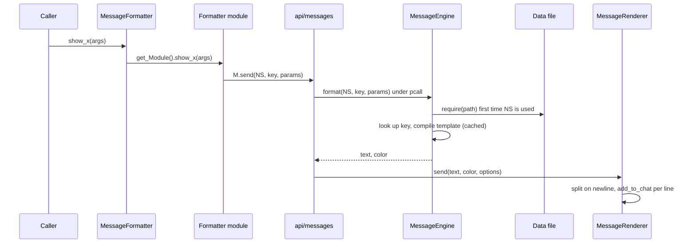

# Message templates catalogue

`shared/utils/messages/data/` holds every chat template used by the template-based half of the
message system: 34 pure-data Lua files (9 job namespaces under `data/jobs/`, 25 system namespaces
under `data/systems/`) returning 558 templates in total. Nothing in these files runs on its own. A
formatter module (`shared/utils/messages/formatters/**`, or a few utilities) calls
`M.send(namespace, key, params)` from `shared/utils/messages/api/messages.lua`; the engine
(`shared/utils/messages/core/message_engine.lua`) loads the namespace file on first use, fills the
template and hands the string to the renderer, which calls `add_to_chat`. Job and system code never
touches a template directly: it calls a `MessageFormatter.show_*` facade function
(`shared/utils/messages/message_formatter.lua`) or a formatter module.

This page also documents `shared/utils/whm/whm_message_formatter.lua`, a WHM formatter that lives
outside `messages/`, builds its lines by hand and uses no template (documented exception,
`.claude/CODE_QUALITY.md` section 6, item 3).

Numbers on this page come from loading every data file with `lua5.1` and resolving every
`M.send` / `M.job` call site, the formatter function containing it, the facade alias pointing to that
function, and every caller of the facade or module function in `shared/`, `_master/`, `Tetsouo/`,
`Kaories/` and root files, including string-built dispatch. 381 templates are reachable from live
code; 177 are not (listed per namespace below).

## Files

| Path | Lines | Role |
|---|---|---|
| `shared/utils/messages/data/jobs/blm_messages.lua` | 163 | `BLM` - element/tier cycles, refinement, MP conservation, arts, errors |
| `shared/utils/messages/data/jobs/brd_messages.lua` | 292 | `BRD` - JA, instrument lock, song packs, song refinement, errors |
| `shared/utils/messages/data/jobs/bst_messages.lua` | 306 | `BST` - ecosystem/species, broths, pet engage, Ready moves, errors |
| `shared/utils/messages/data/jobs/cor_messages.lua` | 31 | `COR` - PartyTracker load failures |
| `shared/utils/messages/data/jobs/drg_messages.lua` | 36 | `DRG` - Jump errors (all unreachable) |
| `shared/utils/messages/data/jobs/geo_messages.lua` | 40 | `GEO` - Indi/Geo cast lines, tier refinement |
| `shared/utils/messages/data/jobs/rdm_messages.lua` | 107 | `RDM` - state display, "not configured" errors, Phalanx up/downgrade |
| `shared/utils/messages/data/jobs/run_messages.lua` | 28 | `RUN` - Valiance/Vallation banners (never sent) |
| `shared/utils/messages/data/jobs/whm_messages.lua` | 21 | `WHM` - CureManager load warning (never sent) |
| `shared/utils/messages/data/systems/blm_midcast_messages.lua` | 88 | `BLM_MIDCAST` - BLM/RDM midcast router debug lines |
| `shared/utils/messages/data/systems/buffs_messages.lua` | 21 | `BUFFS` - one separator |
| `shared/utils/messages/data/systems/combat_messages.lua` | 157 | `COMBAT` - range/WS validation, WS TP lines, Waltz heal banners |
| `shared/utils/messages/data/systems/commands_messages.lua` | 351 | `COMMANDS` - output of common `//gs c` debug/config commands |
| `shared/utils/messages/data/systems/cooldowns_messages.lua` | 25 | `COOLDOWNS` - one separator |
| `shared/utils/messages/data/systems/database_messages.lua` | 90 | `DATABASE` - WS database load summary (spell-database keys left without a caller) |
| `shared/utils/messages/data/systems/debuffs_messages.lua` | 25 | `DEBUFFS` - one separator |
| `shared/utils/messages/data/systems/dualbox_messages.lua` | 163 | `DUALBOX` - dual-box init, job sync, status dump |
| `shared/utils/messages/data/systems/equipment_messages.lua` | 130 | `EQUIPMENT` - `//gs c checksets` lines and scanner debug |
| `shared/utils/messages/data/systems/info_messages.lua` | 50 | `INFO` - `//gs c info` lines (never sent) |
| `shared/utils/messages/data/systems/init_messages.lua` | 36 | `INIT` - INIT_SYSTEMS module load failure |
| `shared/utils/messages/data/systems/ja_buffs_messages.lua` | 58 | `JA_BUFFS` - universal job-ability activation lines |
| `shared/utils/messages/data/systems/keybinds_messages.lua` | 55 | `KEYBINDS` - keybind header and bind errors |
| `shared/utils/messages/data/systems/magic_messages.lua` | 208 | `MAGIC` - universal spell activation lines, 7 skill families x 4 shapes |
| `shared/utils/messages/data/systems/midcast_messages.lua` | 134 | `MIDCAST` - `//gs c debugmidcast` trace |
| `shared/utils/messages/data/systems/precast_messages.lua` | 100 | `PRECAST` - precast debug trace |
| `shared/utils/messages/data/systems/profiler_messages.lua` | 89 | `PROFILER` - `//gs c perf` output |
| `shared/utils/messages/data/systems/rdm_midcast_messages.lua` | 24 | `RDM_MIDCAST` - one separator |
| `shared/utils/messages/data/systems/songs_messages.lua` | 82 | `SONGS` - duplicate of part of `BRD` (all unreachable) |
| `shared/utils/messages/data/systems/status_messages.lua` | 57 | `STATUS` - generic error/warning/success/info, Mote state line, TP banner |
| `shared/utils/messages/data/systems/system_messages.lua` | 85 | `SYSTEM` - job-load intro box, COR color test |
| `shared/utils/messages/data/systems/ui_messages.lua` | 85 | `UI` - HUD toggles, position save, background |
| `shared/utils/messages/data/systems/warp_messages.lua` | 279 | `WARP` - warp/teleport casting, rings, IPC, equipment lock |
| `shared/utils/messages/data/systems/watchdog_messages.lua` | 266 | `WATCHDOG` - midcast watchdog status, config, alerts, test mode |
| `shared/utils/messages/data/systems/weaponskill_messages.lua` | 95 | `WEAPONSKILL` - WS manager and TP-bonus calculator debug |
| `shared/utils/whm/whm_message_formatter.lua` | 411 | Hand-built WHM chat lines (cure tier, Afflatus, CureManager debug) |

Context files read to write this page (documented on [messages.md](messages.md)):
`core/message_engine.lua` (325), `core/message_renderer.lua` (280), `api/messages.lua` (466),
`message_validator.lua` (414), `message_core.lua` (152), `message_colors.lua` (152).

## How it works



1. A formatter calls `M.send(ns, key, params)` (`api/messages.lua:49`), or the shortcuts `M.job(job, key, params)` (`:89`), `M.combat(key, params)` (`:96`), `M.magic(key, params)` (`:103`), `M.ability(key, params)` (`:110`). All shortcuts are `Messages.send` with a fixed namespace.
2. `Messages.send` wraps `MessageEngine.format` in `pcall` (`api/messages.lua:54-56`). On any error it prints `[MessageSystem ERROR] Failed to format message NS.key: <error>` in color 167 through `MessageRenderer.show_error` (`message_renderer.lua:275-278`) and returns `false, 0` (`api/messages.lua:58-65`). Nothing is raised to the caller.
3. `MessageEngine.format` (`message_engine.lua:229`) loads the namespace if needed (`:233-238`), indexes `_message_data[ns][key]` (`:241`), raises `Unknown message 'NS.key'` if absent (`:242-247`) and `Missing 'template' field` if the record has no `template` (`:250-255`).
4. Namespace to file (`message_engine.lua:186-192`): a namespace that is exactly 3 characters and already upper-case resolves to `shared/utils/messages/data/jobs/<ns:lower()>_messages`; anything else resolves to `shared/utils/messages/data/systems/<ns:lower()>_messages`. So `BLM` goes to `jobs/`, `BLM_MIDCAST` and `COMMANDS` go to `systems/`, and a lower-case `'brd'` goes to `systems/brd_messages` and fails. The file is loaded with `pcall(require, path)` (`:195`); a load failure or a non-table return raises (`:197-212`).
5. `compile_template` (`message_engine.lua:77-169`) tokenises the template once and caches the closure by template string (`:79-81`, `:166`). Tokens match `{([%w_]+)}` (`:93`). A token whose name is a key of `COLOR_CODES` (`:36-66`) becomes the 2-byte FFXI inline color `0x1F, code`; every other token is a parameter.
6. At format time each parameter is read from `params`; a `nil` raises `Missing parameter '<name>'` (`:148-157`), which step 2 turns into the error line. Values go through `tostring` (`:158`), so numbers need no conversion. Keys in `params` that the template does not use are ignored.
7. `format` returns the text and `template_data.color or 1` (`:262`). `Messages.send` measures the visible length by stripping every `0x1F`+1 byte pair (`api/messages.lua:69-70`), passes the text to `MessageRenderer.send` (`:76`) and returns `true, length`. `MessageCombat.show_spell_activated` and `JABuffs.show_activated` return that length to their callers.
8. `MessageRenderer.send` (`message_renderer.lua:86-140`) drops the message when disabled or filtered (no code in the repository changes those settings: `toggle`, `configure`/`config`, `set_color_mode`, `set_filter_level` and `toggle_timestamp` have no caller, so every message is sent with its own color), splits on `\n` with `gmatch("[^\n]+")` (`:116-125`) and calls `add_to_chat(color, line)` once per line with the same base color.

## Template schema

Every data file returns one flat table `key -> record`:

```lua
key_name = {
    template = "{gray}[{lightblue}{job}{gray}] {cyan}{spell}{gray} ...",  -- required
    color = 1,                                                              -- optional, default 1
},
```

- `template` (string, required): literal text plus `{token}` placeholders.
- `color` (number, optional): the chat mode passed to `add_to_chat` for every line of the message. It colors any text before the first inline color token and decides which chat filter the line falls under. Distribution over the 558 templates: 1 (x346), 158 (x50), 167 (x46), 122 (x40), 160 (x31), 207 (x13), 200 (x12), 123 (x10), 159 (x6), 206, 8, 121 and one computed value (x1 each). `MIDCAST.debug_result_fallback` computes its color at file load with `MessageColors.get_warning_color()` (`midcast_messages.lua:122`).
- No other field is read by the engine. Keys must be unique inside a file; the same key in two namespaces is independent (`BRD.doom_removed` vs `RDM.doom_removed`).

Color tokens (`message_engine.lua:36-66`, all other token names are parameters):

| Token | Code | Token | Code | Token | Code |
|---|---|---|---|---|---|
| `cyan` | 13 | `green` | 158 | `bluemagic` | 219 |
| `lightblue` | 207 | `red` | 167 | `orange` | region (see below) |
| `white` | 1 | `yellow` | 50 | `blue` | 122 |
| `gray` | 160 | `pink` | 11 | `purple` | 208 |
| `darkgray` | 8 | `healgreen` | 6 | `jobtag` | 207 |
| `enhancing` | 206 | `enfeebling` | 4 | `separatorcolor` | 160 |
| `divine` | 22 | `dark` | 15 | `spellcolor` | 13 |
| `itemcolor` | 63 | `warningcolor` | region | | |

`orange` and `warningcolor` are fixed when `message_engine.lua` is executed, from
`MessageColors.get_warning_color()` (`message_colors.lua:148-150`): `_G.ORANGE_COLOR_CODE` if set,
else 3 for `_G.DETECTED_FFXI_REGION == "EU"` or 57 for any other set region, else
`RegionConfig.get_orange_code(RegionConfig.get_region(player.name))`, else 57
(`message_colors.lua:38-62`). Nothing in the repository sets either global any more (see Known issues).

Usage over the catalogue: `gray` 325 templates, `lightblue` 254, `green` 175, `red` 111, `yellow` 99,
`cyan` 88, `separatorcolor` 47, `jobtag` 45, `orange` 37, `white` 36, `purple` 24, `blue` 20,
`itemcolor` 18, `pink` 10, `spellcolor` 6, the five spell-family tokens 4 each, `warningcolor` 4,
`darkgray` 0.

Parameter conventions found in the data:

- `{job}` (192 templates) carries the `[MAIN/SUB]` tag from `MessageCore.get_job_tag()` (`message_core.lua:51-62`); formatters pass it. `JA_BUFFS` and `SONGS` use `{job_tag}` instead. `GEO.spell_refined`/`no_tier_available` and the `COR`, `DRG`, `WHM` templates hard-code the job name.
- Parameters ending in `_color` (`element_color`, `mp_color`, `status_color`, `tp_color`, `hp_color`, `perf_color`, `key_color`, `desc_color`, `color_name`) receive an already-built `0x1F` escape from the formatter.
- Several parameters receive whole pre-built lines: `COMMANDS.testcolors_sample{sample}`, `INFO.entity_field{line}`, `KEYBINDS.keybind_header_separator{separator}`, `SYSTEM.intro_header_separator{separator}`, `STATUS.info{message}`.
- `MAGIC.*{spell}` and `{target}` arrive pre-colored (element and target-type colors, `message_combat.lua:46-136`).

Multi-line templates: a `\n` inside `template` produces several chat lines with the same base
`color`. Inline colors do not carry across lines, so every line restarts with its own token
(`run_messages.lua:19`). Empty lines are dropped by the renderer's `gmatch("[^\n]+")`
(`message_renderer.lua:118`), which is why blank lines are written as a single space
(`" \n"`, `commands_messages.lua:57`).

## Public API

The data files export only their returned table. Consumers:

| Function | File | Use of the catalogue |
|---|---|---|
| `Messages.send(ns, key, params, options)` | `api/messages.lua:49` | The only runtime entry point. Returns `ok, visible_length`. |
| `Messages.job/combat/magic/ability` | `api/messages.lua:89-112` | Fixed-namespace wrappers. `ability` targets `ABILITY`, which has no data file. |
| `Messages.list(ns)` | `api/messages.lua:295` | Prints all keys of a namespace. No caller. |
| `MessageEngine.load(ns)` | `message_engine.lua:178` | Lazy namespace load. |
| `MessageEngine.format(ns, key, params)` | `message_engine.lua:229` | Template lookup and fill. |
| `MessageEngine.list_keys/is_loaded/get_stats/clear_cache` | `message_engine.lua:274-323` | Debug helpers. |
| `MessageValidator.run_all_tests()` | `message_validator.lua:258` | Static check of `data/jobs/` for 8 jobs (`:40-42`). |

`whm_message_formatter.lua` (no template, no facade entry, loaded with `pcall(require, ...)`):

| Function | Line | Output | Callers |
|---|---|---|---|
| `show_cure_tier_change(original, new, hp_missing, reason)` | 87 | `[JOB] Cure IV >> Cure II (Target missing N HP)` via `MessageCore.raw` | `cure_manager.lua:409`, `:413` |
| `show_afflatus_change(stance)` | 174 | `[JOB] Afflatus Solace activated (Healing Focus)` | `WHM_COMMANDS.lua:156`, `:161` |
| `show_debug_no_target/target/self_hp/party_members/party_member_hp/alliance_member_hp` | 360-405 | `[DEBUG] ...` via `add_to_chat(123, ...)` | `cure_manager.lua:109-201`, only when `WHMCureConfig.debug_messages` |
| `show_cure_heal`, `show_cure_stoneskin`, `show_benediction`, `show_devotion`, `show_martyr`, `show_cursna`, `show_status_removal`, `show_auto_tier_toggle`, `warning`, `error` | 125-353 | hand-built lines | none |

The job tag is `MessageCore.get_job_tag()` in color 200 (`whm_message_formatter.lua:72-76`), not
the `lightblue` (207) used by the templates. `MessageCore.raw(message)` takes one argument and sends
with chat mode 1 (`message_core.lua:103-105`).

## Commands

| Command | Handler | Relation to the catalogue |
|---|---|---|
| `//gs c jamsg [full\|on\|off]`, `spellmsg`, `wsmsg` | `COMMON_COMMANDS.lua:613-618` -> `DEBUG_COMMANDS.lua:155-208` | Calls `MessageCommands['show_' .. prefix .. '_<suffix>']` (`:162-191`); uses `COMMANDS.<prefix>_config_error`, `_invalid_mode`, `_mode_changed_full/on/off`, `_set_failed`. Mode aliases are normalised to `full`/`on`/`off` before the key is built (`:172-185`). |
| `//gs c testmsg [job]`, `msgtest` | `COMMON_COMMANDS.lua:632-639` -> `Messages.test` (`api/messages.lua:447`) | Runs `shared/utils/messages/api/tests/test_<job>`; that directory no longer exists. |
| `//gs c msgtests` | `COMMON_COMMANDS.lua:640-644` -> `MessageValidator.run_all_tests` | Checks tags of `data/jobs/*` and formatter exports; prints to the console with `print`, writes `data/message_validation.json` and `.txt` (`message_validator.lua:305`, `:354`). |
| `//gs c testcolors`, `debugsubjob`, `checksets`, `info`, `perf`, `debugmidcast`, watchdog, warp, dualbox commands | see [messages.md](messages.md) and the owning system pages | Produce `COMMANDS`, `EQUIPMENT`, `PROFILER`, `MIDCAST`, `WATCHDOG`, `WARP`, `DUALBOX` lines. |

## Configuration

- Region orange: `orange`/`warningcolor` tokens and `MIDCAST.debug_result_fallback.color` follow `message_colors.lua:38-62` (config `RegionConfig` from `_G.RegionConfig`, captured when `message_colors.lua` executes, `:30`).
- Display modes (`JA_MESSAGES_CONFIG`, `ENHANCING_MESSAGES_CONFIG`, `WS_MESSAGES_CONFIG` in `shared/config/`) decide in the formatters which key is sent (`activated_full` vs `activated_name_only`, `ws_activated_*` vs `ws_tp_*`); the data files read no configuration.
- WHM: `whm_message_formatter` has no configuration; `cure_manager.lua:36` loads `<char>/config/whm/WHM_CURE_CONFIG` whose `debug_messages` gates the debug lines.

## State & lifetime

- Data files hold no state and write no globals. `midcast_messages.lua:13` and `precast_messages.lua:13` require `message_colors`, which reads `_G.RegionConfig`, `_G.ORANGE_COLOR_CODE`, `_G.DETECTED_FFXI_REGION` and `player.name`.
- The engine keeps `_template_cache` (compiled closures by template string) and `_message_data` (namespace tables) as module locals (`message_engine.lua:21-24`). It writes `_G.MESSAGE_ENGINE_LOADED` (`:31`); if the file executes again while that flag is set it empties both caches (`:27-30`).
- GearSwap's sandbox `require` is `include_user`, which never stores results (`user_functions.lua:300-333` in the GearSwap addon). The project's `ModuleCache` (installed first thing by `INIT_SYSTEMS.lua:47-52`) caches modules on the sandbox `_G`, so one engine instance and one copy of each data file exist per sandbox. The sandbox is rebuilt whenever GearSwap loads the job file (`gs reload`, main job change; `module_cache.lua:19-24` cites `refresh.lua:83`), and every namespace is re-read on the first message after that. A subjob change also ends in a `gs reload`, sent by JobChangeManager 0.5 s later (`job_change_manager.lua:149-181`, see [core-lifecycle.md](core-lifecycle.md)); zoning loads the job file only when the main job differs from the one GearSwap holds (GearSwap `packet_parsing.lua:39-41`).
- No event, keybind, coroutine or text object is created by any file in scope.

## Interactions

- Engine, API, renderer, facade and formatter modules: [messages.md](messages.md).
- Main senders by namespace are listed in the catalogue. The universal handlers `shared/utils/messages/handlers/spell_message_handler.lua:300` (`MAGIC`) and `ability_message_handler.lua:234` (`JA_BUFFS`) produce most of the per-action chat lines.
- WHM formatter: [../jobs/whm.md](../jobs/whm.md) (`WHM_COMMANDS.lua`, `shared/utils/whm/cure_manager.lua`).
- Job-specific namespaces: [../jobs/blm.md](../jobs/blm.md), [../jobs/brd.md](../jobs/brd.md), [../jobs/bst.md](../jobs/bst.md), [../jobs/rdm.md](../jobs/rdm.md), [../jobs/geo.md](../jobs/geo.md), [../jobs/cor.md](../jobs/cor.md).

## Catalogue

Format: key, then the parameters it requires in parentheses. "Unreachable" keys are followed by
their line in the data file; they have no path from any caller (see Known issues for the causes).

### `BLM`

- File: `data/jobs/blm_messages.lua` - 23 templates, 12 reachable. Sender: `formatters/jobs/message_blm.lua`. Callers: `BLM_COMMANDS.lua`, `shared/utils/scholar/scholar_actions.lua`, `blm/functions/logic/spell_refiner.lua`, `storm_manager.lua`, `shared/utils/precast/tier_refiner.lua`. All `color = 1`.
- Reachable: `element_cycle` (job, state_type, element_color, element); `storm_cycle` (job, element_color, storm); `tier_cycle` (job, tier); `spell_refinement` (job, original, recast, downgrade); `arts_already_active` (job, arts); `stratagem_no_charges` (job, stratagem, recast); `buffself_error`, `spell_replacement_error`, `spell_refinement_error`, `spell_recasts_error`, `breakga_blocked` (job); `insufficient_mp_error` (job, mp).
- Unreachable: `mp_conservation`:92 (the BLM midcast router calls `MessageBLMMidcast.show_mp_conservation`, which sends `BLM_MIDCAST.mp_conservation`), `aja_cycle`:26, `buff_activated`:45, `buff_cast`:50, `magic_burst_on`:59, `magic_burst_off`:64, `free_nuke_on`:69, `spell_refinement_failed`:83, `dark_arts_activated`:101, `buff_casting`:154, `buff_status`:159. Five further keys were deleted in the uncommitted working tree (`buffself_recasts_error`, `buffself_resources_error`, `unknown_buff_error`, `buff_already_active`, `manual_buff_cast`).

### `BLM_MIDCAST`

- File: `data/systems/blm_midcast_messages.lua` - 12, all reachable. Sender: `formatters/jobs/message_blm_midcast.lua`. Callers: `blm/functions/logic/midcast_router.lua`, `RDM_MIDCAST.lua:265`, `BLM_MIDCAST.lua`. Colors 158 (x10), 159, 206.
- Keys: `elemental_routing`, `elemental_return`, `dark_routing`, `dark_return`, `enfeebling_routing`, `enfeebling_return` (no params); `elemental_magic_burst_mode` (magic_burst_mode); `mode_value` (mode_value); `mp_conservation`, `normal_mp` (current_mp, mp_threshold); `elemental_match` (reason); `skill_not_handled` (spell_skill).

### `BRD`

- File: `data/jobs/brd_messages.lua` - 46 templates, 23 reachable. Sender: `formatters/jobs/message_brd.lua`. Callers: `BRD_COMMANDS.lua`, `brd/functions/logic/song_rotation_manager.lua`, `BRD_PRECAST.lua`, `song_refinement.lua`, `midcast_router.lua`, `BRD_AFTERCAST.lua`. All `color = 1`.
- Reachable: `marcato_used`, `pianissimo_used`, `elegy_cast`, `requiem_cast`, `no_element_selected`, `no_carol_element`, `no_etude_type` (job); `pianissimo_target` (job, target); `ability_command` (job, ability); `instrument_locked`, `instrument_released` (job, song, instrument); `daurdabla_dummy` (job, song_name, instrument); `songs_casting` (job, rotation); `song_pack` (job, pack, songs); `dummy_casting` (job, count); `lullaby_cast` (job, type); `threnody_cast`, `carol_cast` (job, spell); `etude_cast` (job, stat); `song_refinement` (job, original, recast, downgrade); `song_refinement_failed` (job, song, recast); `no_song_in_slot` (job, slot); `pack_not_found` (job, pack).
- Unreachable: `soul_voice_activated`:17, `soul_voice_ended`:22, `nightingale_activated`:27, `nightingale_active`:32, `troubadour_activated`:37, `troubadour_active`:42, `marcato_honor_march`:52, `marcato_skip_buffs`:57, `marcato_skip_soul_voice`:62, `honor_march_locked`:100, `honor_march_released`:105, `songs_refresh`:133, `tank_casting`:149, `tank_refresh`:154, `healer_casting`:159, `healer_refresh`:164, `song_cast`:173, `song_guidance`:178, `doom_gained`:239, `doom_removed`:244, `no_pack_configured`:253, `tank_not_configured`:258, `healer_not_configured`:263. `marcato_honor_march` and `song_cast` have their `M.job` call commented out in the formatter (`message_brd.lua:100-106`, `:278-285`); `honor_march_locked/released` are wrapped by `show_instrument_locked/released` instead (`message_brd.lua:170-176`). `dummy_cast` is commented out in the data file (`brd_messages.lua:143-147`) but still sent by `show_dummy_cast` (Known issues).

### `BST`

- File: `data/jobs/bst_messages.lua` - 53 templates, 19 reachable. Sender: `formatters/jobs/message_bst.lua` (facade exports each function twice, as `show_bst_<name>` and `show_<name>`). Callers: `BST_COMMANDS.lua`, `bst/functions/logic/ecosystem_manager.lua`, `pet_manager.lua`. All `color = 1`.
- Reachable: `broth_count_header`, `no_broths`, `no_pet`, `no_ready_moves` (job); `ecosystem_change` (job, ecosystem, count, species_text); `species_change` (job, species, count, jug_text); `broth_equip` (job, broth, pet); `broth_count_line` (job, broth, count); `pet_engage`, `pet_disengage`, `ready_moves_header` (job, pet); `ready_move_item`, `ready_move_use`, `ready_move_auto_engage`, `ready_move_auto_sequence` (job, index, move); `ready_moves_usage` (job, max); `invalid_index` (job, index); `index_out_of_range` (job, index, max); `module_not_loaded` (job, module).
- Unreachable (34): `call_beast_used`:18, `bestial_loyalty_used`:23, `familiar_activated`:28, `familiar_active`:33, `spur_used`:38, `run_wild_used`:43, `tame_used`:48, `reward_used`:53, `reward_no_food`:58, `feral_howl_used`:63, `killer_instinct_activated`:68, `jug_equipped`:96, `broth_count_footer`:116, `pet_summoned`:125, `pet_dismissed`:140, `auto_engage_enabled`:145, `auto_engage_disabled`:150, `auto_engage_status`:155, `pet_tp_status`:160, `pet_hp_status`:165, `ready_move_precast`:174, `ready_move_physical`:179, `ready_move_magical`:184, `ready_move_breath`:189, `ready_move_tp_check`:194, `ready_move_recast`:229, `pet_charmed`:238, `pet_charm_failed`:243, `pet_died`:248, `pet_despawned`:253, `no_target`:287, `pet_too_far`:292, `no_jug_equipped`:297, `insufficient_hp`:302.

### `BUFFS`, `COOLDOWNS`, `DEBUFFS`, `RDM_MIDCAST`

- One `separator` template each (`buffs_messages.lua:17` color 160, `cooldowns_messages.lua:21` color 1, `debuffs_messages.lua:21` color 1, `rdm_midcast_messages.lua:20` color 8). The formatters of these areas (`message_buffs.lua`, `message_cooldowns.lua`, `message_debuffs.lua`, `message_rdm_midcast.lua`) build the rest of their output inline; the file headers say so.

### `COMBAT`

- File: `data/systems/combat_messages.lua` - 25 templates, 16 reachable. Sender: `formatters/combat/message_combat.lua`. Callers: `shared/utils/dnc/waltz_manager.lua`, `shared/hooks/init_ws_messages.lua:162-165`, `weaponskill_manager.lua`, `ws_precast_handler.lua`, PLD/RUN `aoe_manager.lua`.
- Reachable: `range_error` (ability, distance); `ws_validation_error_status` (job, ws_name, reason, status); `ws_validation_error_detail` (ws_name, reason, detail); `ws_validation_error` (job, ws_name, reason); `ability_tp_error` (job, ability, current_tp, required_tp); `ws_tp_ultimate/enhanced/normal` (ws_name, tp) - chosen at 3000/2000 TP (`message_combat.lua:207-222`); `ws_activated_ultimate/enhanced/normal` (job, ws_name, description, tp) (`:224-251`); `spell_cast` (job, spell_name); `waltz_heal_single` (job, hp, waltz_name), `waltz_heal_single_extra` (+ extra), `waltz_heal_aoe` (job, waltz_name), `waltz_heal_aoe_extra` (+ extra) (`:277-314`).
- Unreachable: `target_error`:37 (`MessageFormatter.show_target_error` has no caller; the dual-box `show_target_error` is `MessageDualbox`'s), `ws_activated_no_tp`:86 (sent only when TP is nil; the only caller, `init_ws_messages.lua:162`, always passes a number), `state_change`:42, `ability_use`:100, `jump_activated`:133, `jump_chaining_desc`:138, `jump_chaining`:143, `jump_complete`:148, `jump_relaunch`:153 (the auto-jump code moved to `shared/utils/drg/auto_jump.lua` in `d9e5f38` sends no message).

### `COMMANDS`

- File: `data/systems/commands_messages.lua` - 59 templates, 34 reachable. Sender: `formatters/ui/message_commands.lua`. Callers: `COMMON_COMMANDS.lua`, `DEBUG_COMMANDS.lua` (string dispatch), every `<JOB>_COMMANDS.lua` for `debugmidcast_toggled`.
- Reachable: `testcolors_sample` (sample); `lockstyle_reapplying`; `warp_error_header`, `warp_error` (error), `warp_error_footer`, `warp_testing_modules`, `warp_module_test` (module, status); `debugsubjob_no_player`, `main_job_info` / `sub_job_info` (job, level), `zone_info_header`, `zone_id` (zone_id), `zone_name` (zone_name), `zone_info_unavailable`; for each of `jamsg`, `spellmsg`, `wsmsg`: `_config_error`, `_invalid_mode` (mode), `_mode_changed_full`, `_mode_changed_on`, `_mode_changed_off`, `_set_failed`; `warp_debug_toggled` (status); `debugmidcast_toggled` (job, debug_state).
- Unreachable (25): `testcolors_header`:17, `testcolors_separator`:27, `testcolors_footer`:32, `detectregion_header`:41, `windower_info_header`:46, `windower_info_field`:51, `detection_results_header`:56, `region_detected`:61, `region_detection_failed`:66, `detectregion_footer`:71, `region_saved`:76, `setregion_usage`:85, `region_set_us`:90, `region_set_eu`:95, `region_set_jp`:100, `invalid_region`:105, `region_reload_required`:110, `debugsubjob_header`:157, `debugsubjob_instructions`:197, `jamsg_status_header`:211, `jamsg_current_mode`:216, `spellmsg_status_header`:255, `spellmsg_current_mode`:260, `wsmsg_status_header`:299, `wsmsg_current_mode`:304.

### `COR`, `GEO`, `WHM`, `DRG`, `RUN`

- `COR` (`cor_messages.lua`, 3, all reachable): `rolltracker_load_failed`, `packets_load_failed`, `resources_load_failed`; sent by `message_cor.lua`, called from `cor/functions/logic/party_tracker.lua`.
- `GEO` (`geo_messages.lua`, 4, all reachable): `indi_cast`, `geo_cast` (job, spell, description); `spell_refined` (desired, final); `no_tier_available` (spell); sent by `message_geo.lua`, called from `GEO_MIDCAST.lua` and `geo/functions/logic/geo_spell_refiner.lua`.
- `WHM` (`whm_messages.lua`, 1): `curemanager_not_loaded`:17, unreachable.
- `DRG` (`drg_messages.lua`, 4): `drg_subjob_required`:17, `subjob_disabled`:22, `jump_on_cooldown`:27 (recast), `high_jump_on_cooldown`:32 (recast), all unreachable (`MessageDRG` functions have no caller).
- `RUN` (`run_messages.lua`, 2): `valiance_expired`:18, `vallation_expired`:24, never sent by any code since they were added in `6a8e637`.

### `DATABASE`

- File: `data/systems/database_messages.lua` - 14, 10 reachable. Sender: `formatters/system/message_database.lua`. Only caller: `UniversalWS.print_load_summary` (`shared/data/weaponskills/UNIVERSAL_WS_DATABASE.lua:365-389`), which itself has no caller.
- Unreachable: `total_loaded`, `database_count`, `breakdown_header`, `database_entry`. Their sender functions (`show_total_loaded`, `show_database_count`, `show_breakdown_header`, `show_database_entry`) were called only by `UNIVERSAL_SPELL_DATABASE.lua`, deleted in commit `83b5e0c`.
- Keys: `load_header_separator`, `separator`, `breakdown_header`; `load_header_title` (db_name); `total_loaded` (count, item_type); `total_loaded_with_expected` (loaded, expected, item_type); `weapon_type_count`, `database_count`, `failed_count` (count); `load_date` (date); `failed_item` (file, name); `category_header` (category); `database_entry` (db_name, count, item_type); `weapon_type_entry` (status, weapon_type, count).

### `DUALBOX`

- File: `data/systems/dualbox_messages.lua` - 27, all reachable. Sender: `formatters/ui/message_dualbox.lua`. Caller: `shared/utils/dualbox/dualbox_manager.lua`. Colors 122 (x24), 167 (x3).
- Keys: `config_loaded`, `config_not_found` (config_path); `role`, `status_role` (role); `alt_info_this`, `main_info_this`, `status_alt_this`, `status_main_this` (this_char); `alt_info_target`, `main_info_target`, `status_alt_target`, `status_main_target` (target_char); `alt_role_detected`, `main_role_detected`, `reloading_macrobook`, `target_error`, `not_initialized`, `status_header`, `status_footer`; `job_update_sent` (target_name, main_job, sub_job); `job_request_received`, `requesting_job` (target_name); `job_update_received` (role, main_job, sub_job); `status_enabled` (enabled); `status_alt_online` (online); `status_alt_job` (job, subjob); `status_last_update` (seconds). `not_initialized` tells the user to "Check dualbox_config.lua"; the loader reads `<char>/config/DUALBOX_CONFIG` (`dualbox_manager.lua:79`).

### `EQUIPMENT`

- File: `data/systems/equipment_messages.lua` - 22 templates, 15 reachable. Sender: `formatters/system/message_equipment.lua`. Caller: `shared/utils/equipment/equipment_checker.lua` (`//gs c checksets`).
- Reachable: `missing_item` (slot, item_name); `missing_item_set`, `storage_item_set` (set_path); `storage_item` (slot, item_name, bag_name); `check_error` (job_name, error_msg); `no_sets_found` (job_name); `max_recursion_error` (max_depth, path); `alias_detected` (path); `scanning` (path, depth); `building_cache`, `starting_scan`; `cache_built` (cache_size); `scan_complete` (set_count); `cache_build_failed`, `scan_failed` (error_msg).
- Unreachable: `check_header_separator`:17, `check_header_title`:22, `set_valid`:27, `summary_separator`:52, `summary_valid_sets`:57, `summary_storage`:62, `summary_missing`:67 (header and summary are built with `add_to_chat` in `message_equipment.lua:22-91`).

### `INFO`

- File: `data/systems/info_messages.lua` - 6 templates, none reachable: `entity_header`:17, `entity_name`:22, `entity_field`:27, `entity_footer`:32, `usage`:41, `not_found`:46. `formatters/ui/message_info.lua:45-95` prints the same lines with `add_to_chat` and never calls `M.send`.

### `INIT`

- File: `data/systems/init_messages.lua` - 4 templates. Reachable: `module_load_failed` (module_name, error_msg), sent by `message_init.lua:24` from `INIT_SYSTEMS.lua`. Unreachable: `watchdog_load_failed`:22, `module_loaded`:27, `init_complete`:32.

### `JA_BUFFS`

- File: `data/systems/ja_buffs_messages.lua` - 7 templates. Sender: `formatters/combat/message_ja_buffs.lua`; main caller `handlers/ability_message_handler.lua:234` via `MessageFormatter.show_ja_activated`.
- Reachable: `activated_full` (job_tag, ability_name, description); `activated_name_only` (job_tag, ability_name).
- Unreachable: `active`:30, `ended`:36, `with_description`:42, `using`:48, `using_double`:54 - their senders (`show_active`, `show_ended`, `show_with_description`, `show_using`, `show_using_double`, facade `show_ja_*`, and the BRD wrappers that call them) have no caller.

### `KEYBINDS`

- File: `data/systems/keybinds_messages.lua` - 7 templates. Sender: `formatters/ui/message_keybinds.lua`. Callers: every `<char>/config/<job>/<JOB>_KEYBINDS.lua` (live `Tetsouo/`, `Kaories/` and `_master/`).
- Reachable: `keybind_header_separator` (separator); `keybind_header_title` (padded_title); `no_binds_error` (job_name); `bind_failed_error` (bind_key); `bind_failed_error_reason` (bind_key, reason).
- Unreachable: `keybind_line`:27, `invalid_bind_error`:41.

### `MAGIC`

- File: `data/systems/magic_messages.lua` - 28, all reachable. Sender: `MessageCombat.show_spell_activated` (`message_combat.lua:395-417`), called by `handlers/spell_message_handler.lua:300` and `brd/functions/logic/midcast_router.lua:135`. `BRDMessages.show_song_cast_generic` (`message_brd.lua:359-381`) also sends `spell_activated_full` but has no caller.
- Key = `<family>` + `spell_activated` + `<shape>` (`message_combat.lua:367-393`). Family prefix from `spell.skill`: `healing_`, `enhancing_`, `enfeebling_`, `divine_`, `dark_`, `blue_`, or empty for any other skill. Shape: `_full_target` (job, spell, target, description), `_full` (job, spell, description), `_target` (job, spell, target), none (job, spell). The target is dropped when it is the player (`:403-405`). The families differ only in the color token around `{spell}`: none (inherits the pre-colored name), `healgreen`, `enhancing`, `enfeebling`, `divine`, `dark`, `bluemagic`.

### `MIDCAST`, `PRECAST`

- `midcast_messages.lua` - 19 templates, 17 reachable; sender `formatters/magic/message_midcast.lua`; callers `shared/utils/midcast/midcast_manager.lua` (debug trace) and the precast debug of RDM/BST/BRD/RUN. Keys: `debug_enabled_separator`, `debug_enabled_title`, `debug_disabled`, `debug_header_separator`, `debug_priorities_header`, `debug_result_header`; `debug_header_spell` (spell, skill, target); `debug_step_ok/warn/fail/info` (step, label, value) - key built from the status (`message_midcast.lua:60-65`); `debug_priority_found/missing` (priority, label); `debug_result_success/fallback` (set_type); `debug_equipment_line` (slot1, item1, slot2, item2); `debug_equipment_single` (slot, item). Unreachable: `debug_target_header`:77, `debug_target_property`:82.
- `precast_messages.lua` - 13, all reachable; sender `formatters/magic/message_precast.lua`; callers `RDM_PRECAST.lua`, `BST_PRECAST.lua`, `BRD_PRECAST.lua`, `RUN_PRECAST.lua`, `COMMON_COMMANDS.lua` (toggle). Same step keys as MIDCAST (`message_precast.lua:57-63`, value defaulted to `""`), plus `debug_header_action` (action, type), `debug_completion_separator`, `debug_completion`, `debug_set_equipped` (set), `debug_equipment_single` (slot, item).

### `PROFILER`

- File: `data/systems/profiler_messages.lua` - 13 templates. Senders: `shared/utils/debug/performance_profiler.lua` (through `get_M()`), `WAR_COMMANDS.lua:200` (`usage`). Reachable: `enabled`, `disabled`, `reload_hint`, `status_enabled`, `status_disabled`, `status_hint`, `usage`, `separator`; `checkpoint_main` (context, label, perf_color, time); `checkpoint_job` (job, label, perf_color, time); `total` (context, perf_color, time). Unreachable: `measure`:80 and `call`:85 (sent by `Profiler.measure` and `Profiler.profile_call`, which have no caller).

### `RDM`

- File: `data/jobs/rdm_messages.lua` - 15 templates, 10 reachable. Sender: `formatters/jobs/message_rdm.lua`. Callers: `RDM_COMMANDS.lua`, `RDM_PRECAST.lua`.
- Reachable: `element_list`, `no_enspell_selected`, `gain_spell_not_configured`, `bar_element_not_configured`, `bar_ailment_not_configured`, `spike_not_configured`, `storm_requires_sch`, `phalanx_downgrade`, `phalanx_upgrade` (job); `storm_current` (job, value).
- Unreachable: `doom_warning`:17, `doom_removed`:22, `spell_casting`:31, `enspell_current`:45, `phalanx_detected`:93.

### `SONGS`

- File: `data/systems/songs_messages.lua` - 10 templates, none reachable. Sender `formatters/magic/message_songs.lua`, exported as `MessageFormatter.show_song_*` (`message_formatter.lua:138-147`); no caller uses those names. The same messages exist in `BRD` with `{job}` instead of `{job_tag}` and different parameter names (`rotation` vs `rotation_type`, `pack`/`songs` vs `pack_name`/`song_list`), and every live caller reaches the `BRD` versions.

### `STATUS`

- File: `data/systems/status_messages.lua` - 7 templates. Sender: `formatters/ui/message_status.lua`, used through `MessageFormatter.show_error/show_warning/show_success/show_info` by most `<JOB>_COMMANDS.lua`, `COMMON_COMMANDS.lua`, `macrobook_manager.lua`. Reachable: `error`, `warning`, `success`, `info` (message); `state_display` (state_name, value) from `shared/utils/core/state_display_override.lua:40`; `tp_ready` (job, tp_value). Unreachable: `tp_required`:53.

### `SYSTEM`

- File: `data/systems/system_messages.lua` - 13 templates. Sender: `formatters/system/message_system.lua`. `intro_*` are sent by the local `build_and_display_intro` (`message_system.lua:105-126`), reached from `MessageFormatter.show_system_intro*` in each `<JOB>_KEYBINDS.lua` (for example `_master/config/blm/BLM_KEYBINDS.lua:136`). `colortest_*` are sent only from `COR_COMMANDS.lua:307-314` (the title hard-codes `[COR]`), which is never reached: `testcolors` is a common command and returns through `CommonCommands` first (`COR_COMMANDS.lua:154-163`).
- Reachable: `intro_header_separator`, `intro_footer_separator` (separator); `intro_header_title` (title); `intro_macrobook` (key_color, desc_color, book, page); `intro_lockstyle` (key_color, desc_color, style, delay); `intro_keybinds` (key_color, desc_color, count); `intro_ui_visible`, `intro_ui_hidden` (key_color, desc_color). Unreachable: `colortest_header_separator`:61, `colortest_header_title`:66, `colortest_sample`:71, `colortest_footer_separator`:76, `colortest_footer_complete`:81.

### `UI`

- File: `data/systems/ui_messages.lua` - 10 templates. Sender: `formatters/ui/message_ui.lua`. Callers: `shared/utils/ui/ui_appearance.lua`, `ui_section_toggles.lua`, `ui_visibility.lua`, `UI_COMMANDS.lua`, `dualbox/alt_commands.lua`. Reachable: `toggle_on`/`toggle_off` (component, key chosen at `message_ui.lua:28`); `enabled`, `disabled`, `position_save_failed`; `position_saved` (x, y); `error` (error_text); `background_preset` (preset_name, r, g, b, a); `background_rgba` (r, g, b, a). Unreachable: `separator`:81.

### `WARP`

- File: `data/systems/warp_messages.lua` - 47 templates, 36 reachable. Sender: `formatters/system/message_warp.lua`. Callers: `shared/utils/warp/casting/item_user.lua`, `spell_caster.lua`, `warp_commands.lua`, `warp_ipc.lua`, `warp_ipc_register.lua`, `warp_equipment.lua`, `warp_init.lua`, `warp_precast.lua`. 45 of the 47 templates start with `{jobtag}{gray}`: the first token is a color, immediately overridden, so no job tag is printed; the visible prefix is `[WARP]`, `[TELE]`, `[Warp IPC]`, `[Warp Init]` or the caller's `{tag}`. The template added in `d52ddc2` was `{jobtag}[WARP]`, which colored the tag; the rewrite to `{jobtag}{gray}[{separatorcolor}WARP{gray}]` in `a9c46e0` left the leading token without effect.
- Reachable: `warp_casting`, `tele_casting`, `precast_fc_warning`, `force_fc` (spell_name); `warp_equipping`, `warp_using`, `tele_equipping`, `tele_using` (ring_name); `warp_level_error`, `tele_level_error` (spell_name, required_level, current_level); `warp_requires_blm`, `tele_requires_whm` (spell_name, required_level); `spell_cannot_cast` (error_reason); `ipc_test_sent`, `ipc_test_sent_confirm`, `ipc_test_received_confirm`; `ipc_test_received` (sender); `ipc_broadcasting`, `ipc_command_received`, `ipc_executing`, `ipc_not_allowed` (command); `equipment_locked`, `equipment_unlocked` (tag, duration); `equipment_lock_error`, `equipment_unlock_error`, `init_error` (+ module_name) (error_msg); `force_unlock`, `fix_ring_start`, `fix_ring_complete`, `manual_lock`, `registered_common`, `all_items_cooldown`; `using_destination` (item_name, destination); `item_cooldown_time`, `next_available_item` (item_name, time_msg); `item_equip_delay` (item_name).
- Unreachable: `debug_toggle`:218 (its only sender, `warp_commands.lua:114`, is behind `debugwarp`, which `COMMON_COMMANDS.lua:562-566` answers first), `warp_countdown`:27, `warp_unavailable`:47, `warp_no_charges`:52, `warp_recast`:57, `warp_charges_remaining`:62, `tele_countdown`:81, `tele_unavailable`:106, `tele_no_charges`:111, `tele_recast`:116, `tele_charges_remaining`:121.

### `WATCHDOG`

- File: `data/systems/watchdog_messages.lua` - 45 templates, 41 reachable. Sender: `formatters/system/message_watchdog.lua`. Callers: `shared/utils/core/midcast_watchdog.lua`, `WATCHDOG_COMMANDS.lua`. Colors 158 (x22), 207 (x13), 167 (x6), 200 (x4).
- Reachable: `enabled`, `disabled`, `not_loaded`, `invalid_buffer`, `invalid_fallback`, `debug_enabled`, `debug_disabled`, `debug_scanner_disabled`, `debug_no_active`, `all_cleared`, `test_aftercast_blocked`, `test_started`, `test_deactivated`, `help`; `status_enabled` (enabled); `status_debug` (debug); `status_buffer` (buffer); `status_fallback` (fallback); `status_active`, `status_active_midcast` (active); `status_spell`, `status_current_spell` (spell_name, spell_id); `status_item`, `status_current_item` (spell_name, item_id) - spell/item key chosen from `stats.action_type` (`message_watchdog.lua:54`, `:86`); `status_cast_time` (cast_time); `status_timeout` (timeout); `status_age` (age); `buffer_set`, `buffer_formula`, `fallback_set` (seconds); `debug_midcast_item` (spell_name, cast_delay, timeout); `debug_midcast_spell_fc` (spell_name, base_cast, fc_percent, adjusted_cast, timeout); `debug_ignored_action` (action_name, action_type); `debug_scan` (spell_name, age, timeout); `stuck_detected` (spell_name, action_label); `stuck_timing` (cast_time, age); `error_in_check` (error); `force_clearing`, `test_simulating` (spell_name); `test_cast_time` (cast_time, timeout, buffer); `test_fallback` (timeout).
- Unreachable: `stopped`:27, `status_header`:38, `stats_header`:43 (headers now built with `add_to_chat` at `message_watchdog.lua:43-45`, `:75-77`), `debug_midcast_spell`:161.

### `WEAPONSKILL`

- File: `data/systems/weaponskill_messages.lua` - 15, all reachable. Sender: `formatters/combat/message_weaponskill.lua`. Callers: `shared/utils/weaponskill/weaponskill_manager.lua`, `tp_bonus_calculator.lua` (debug only when `TPBonusCalculator.config.debug_mode`).
- Keys: `ws_manager_initialized`, `invalid_spell_parameter`, `target_info_missing`, `missing_numeric_values`, `player_info_missing`, `already_at_max`; `too_far` (ws_name, distance); `amnesia_error` (ws_name); `tp_validation_failed` (current_tp, tp_config); `tp_calculation` (current_tp, weapon, weapon_bonus, real_tp); `target_threshold` (target_threshold, gap); `gap_too_large` (gap, total_available); `total_available` (total_available); `checking_piece` (piece_name, slot, bonus, gap); `equipping_piece` (slot, piece_name, bonus, gap).

## Invariants & gotchas

- A typo in a color token (`{grey}`, `{Red}`) is a parameter, not a color: the message becomes `[MessageSystem ERROR] ... Missing parameter 'grey'`. Token names are case-sensitive.
- A template parameter must never be named like a color token: `{dark}`, `{blue}`, `{jobtag}` or `{separatorcolor}` in a template always emit a color, and a value passed under that name is ignored. The engine comments at `message_engine.lua:60-63` record that the aliases were renamed for this reason.
- Passing `nil` for a used parameter prints the error line instead of the message. Formatters that accept optional data either default the value (`message_precast.lua:61`, `message_geo.lua:120`) or pick a key without that parameter (`message_combat.lua:382-393`).
- Namespaces are resolved by string: a 3-letter upper-case name always means `data/jobs/`. A new system namespace must not be exactly 3 upper-case letters, and job namespaces must be passed upper-case.
- `{/}` is not a token. It is copied into the chat text as-is.
- Keys built at runtime cannot be found by searching for the key literal. The builders are `message_combat.lua:382-393` (MAGIC), `message_midcast.lua:60/108/128`, `message_precast.lua:57`, `message_watchdog.lua:54/86`, `message_ui.lua:28`, `message_system.lua:92`, `message_commands.lua:356/406/456`, and the formatter names built in `DEBUG_COMMANDS.lua:162-191`. Search for the key suffix before deleting a template.
- A data file is executed once per sandbox (per `gs reload` or job change) when `ModuleCache` is installed; `midcast_messages.lua:122` evaluates the region warning color at that moment.
- `whm_message_formatter.lua` color comments (`:34-64`) name 200 "Green", 167 "Orange", 123 "Red" and 8 "Light blue"; the engine table calls 167 `red` and 8 `darkgray`.

## Extending

Add a template to an existing namespace:

1. Add `key = { template = "...", color = N }` to the namespace file. Start with a color token; use `{job}` for the job tag.
2. Add a formatter function in the matching `formatters/**` module that calls `M.send('NS', 'key', {...})` (or `M.job('JOB', ...)`) with every parameter non-nil.
3. Export it in `message_formatter.lua` as `MessageFormatter.show_x = function(...) return get_Module().show_x(...) end` and call `MessageFormatter.show_x` from job code.
4. For a job namespace, `//gs c msgtests` checks tags against the whitelist in `message_validator.lua:27-63`; a new parameter name that does not end in `_color`, `_text` or `_name` and is not listed there is reported as an error.

Add a namespace: create `data/systems/<name>_messages.lua` (or `data/jobs/<job>_messages.lua` for a 3-letter job code) returning the table, and send with the upper-case name. No registration is needed.

## Known issues

- PUP commands call nonexistent `MessageFormatter.error_pup_*` / `show_pup_*` functions and require a `logic/` directory that does not exist; `PUP_MIDCAST.lua:46` makes the same undefined call from `job_midcast` - `shared/jobs/pup/functions/PUP_COMMANDS.lua:76`.
- BST midcast calls the nonexistent `MessageFormatter.error_bst_module_not_loaded` when the Ready move categorizer fails to load - `shared/jobs/bst/functions/BST_MIDCAST.lua:46`.
- `BRDMessages.show_dummy_cast` sends `BRD.dummy_cast`, which is commented out of the data file - `shared/utils/messages/formatters/jobs/message_brd.lua:234`.
- WHM swallows a CureManager load failure; `WHM.curemanager_not_loaded` is never shown - `shared/jobs/whm/functions/WHM_PRECAST.lua:60`.
- `SONGS` namespace and `message_songs.lua` are unreachable duplicates of `BRD` - `shared/utils/messages/data/systems/songs_messages.lua:17`.
- `INFO` namespace unreachable; `message_info.lua` prints the same text with `add_to_chat` - `shared/utils/messages/data/systems/info_messages.lua:17`.
- Region templates orphaned since `//gs c setregion`/`detectregion` were removed in `95b4ae3`; `message_colors.lua:17-18` still documents the command - `shared/utils/messages/data/systems/commands_messages.lua:85`.
- Header/summary templates replaced by direct `add_to_chat` in `074ec91` and never removed - `shared/utils/messages/data/systems/commands_messages.lua:211`.
- Remaining unreachable templates in BST, BRD, BLM, RDM, DRG, RUN, WHM, COMBAT, WARP, INIT, WATCHDOG and others (177 of 558 in total with the entries above) - `shared/utils/messages/data/jobs/bst_messages.lua:18`.
- `//gs c testmsg` reports `0/0 tests PASSED`: the test directory was deleted in `25dce0c` - `shared/utils/messages/api/messages.lua:422`.
- `//gs c msgtests` fails on 12 valid templates because its whitelist does not match the engine - `shared/utils/messages/message_validator.lua:45`.
- `{/}` documented as a color-end token but not implemented - `shared/utils/messages/core/message_engine.lua:74`.
- API usage docs cite nonexistent templates (`BLM.manawall_ready`, `COMBAT.ws_tp`) and `M.ability` targets a namespace with no file - `shared/utils/messages/api/messages.lua:110`.
- Non-ASCII check mark in two chat templates - `shared/utils/messages/data/systems/weaponskill_messages.lua:92`.
- Unused `MessageColors` require in a data file - `shared/utils/messages/data/systems/precast_messages.lua:13`.
- Wrong `@file` path and wrong color code in section comments - `shared/utils/messages/data/systems/magic_messages.lua:7`.
- `jamsg`/`spellmsg`/`wsmsg` "Example output" lines do not match the real output format - `shared/utils/messages/data/systems/commands_messages.lua:227`.
- 10 of 19 `whm_message_formatter` functions have no caller - `shared/utils/whm/whm_message_formatter.lua:197`.
