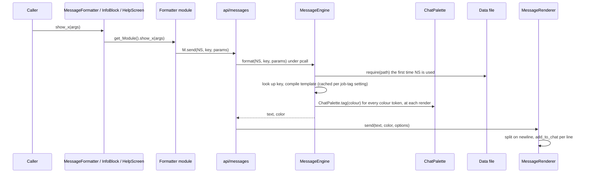

# Message templates catalogue

`shared/utils/messages/data/` holds every chat template used by the template path of the message
system: 38 pure-data Lua files (8 job namespaces under `data/jobs/`, 30 system namespaces under
`data/systems/`) returning **549 templates** (counted on 2026-09-28 by loading each file with
`lua5.1`, less the two of `run_messages.lua`, deleted the same day). Nothing in these files runs on its own. A formatter module
(`shared/utils/messages/formatters/**`), `info_block.lua`, `help_screen.lua` or a few utilities call
`M.send(namespace, key, params)` from `shared/utils/messages/api/messages.lua`; the engine
(`shared/utils/messages/core/message_engine.lua`) loads the namespace file on first use, fills the
template, and the renderer (`core/message_renderer.lua`) hands each line to `add_to_chat`. Job and
system code never touches a template directly: it calls a `MessageFormatter.show_*` facade function
(`shared/utils/messages/message_formatter.lua`), a formatter module, `InfoBlock` or `HelpScreen`.

This page also documents `shared/utils/whm/whm_message_formatter.lua`, a WHM formatter that lives
outside `messages/`, builds its lines by hand and uses no template (`.claude/CODE_QUALITY.md`
section 6, item 4).

**How the reachability figures were obtained (2026-09-28).** Every `M.send` / `M.job` /
`Messages.send` call site in the repository (excluding `_dev/`) was listed with the function that
contains it. A function counts as reachable when its name, or one of its facade aliases in
`message_formatter.lua`, appears outside its own file in any `.lua` file of the repository,
including the gitignored `Tetsouo/`, `Kaories/`, `Hysoka/` and `Gabvanstronger/` folders (searched
with `grep -r`/Python, not ripgrep, which skips them), or when a reachable function of the same file
calls it. Name collisions (a generic name such as `show_buff_status`, `show_active` or
`show_target_error` defined in two modules) and string-built dispatch
(`DEBUG_COMMANDS.lua` `handle_message_config_generic`) were then resolved by hand. Keys built at run
time were resolved from their builder (list under "For maintainers / AI"). Result: **402
reachable, 147 unreachable** (after the 2026-09-28 removals of `ReplacementLogic.should_cancel` and
`DualBoxManager.show_status`, whose templates lost their only caller).

## Files

| Path (under `shared/utils/messages/data/` unless stated) | Lines | Templates | Namespace and role |
|---|---|---|---|
| `jobs/blm_messages.lua` | 106 | 13 | `BLM` - element/storm cycles, refinement, arts, stratagems, BLM errors |
| `jobs/brd_messages.lua` | 269 | 42 | `BRD` - JA, instrument lock, song packs, song refinement, BRD errors |
| `jobs/bst_messages.lua` | 271 | 46 | `BST` - ecosystem/species, broth equip, pet engage, Ready moves, BST errors |
| `jobs/cor_messages.lua` | 32 | 3 | `COR` - PartyTracker load failures |
| `jobs/drg_messages.lua` | 37 | 4 | `DRG` - Jump errors (all unreachable) |
| `jobs/geo_messages.lua` | 41 | 4 | `GEO` - Indi/Geo cast lines, tier refinement |
| `jobs/rdm_messages.lua` | 108 | 15 | `RDM` - element list, "not configured" errors, Phalanx up/downgrade |
| `jobs/whm_messages.lua` | 22 | 1 | `WHM` - CureManager load warning (never sent) |
| `systems/altgroup_messages.lua` | 28 | 14 | `ALTGROUP` - `//gs c alts`, `main` / `setalt` roles, alt window |
| `systems/blm_midcast_messages.lua` | 89 | 12 | `BLM_MIDCAST` - BLM midcast router debug lines |
| `systems/block_messages.lua` | 91 | 13 | `BLOCK` - the data-block look used by `info_block.lua` |
| `systems/buffs_messages.lua` | 22 | 1 | `BUFFS` - one separator |
| `systems/combat_messages.lua` | 158 | 25 | `COMBAT` - range/WS validation, WS TP lines, Waltz heal lines |
| `systems/commands_messages.lua` | 282 | 45 | `COMMANDS` - output of common `//gs c` debug/config commands |
| `systems/cooldowns_messages.lua` | 26 | 1 | `COOLDOWNS` - one separator |
| `systems/debuffs_messages.lua` | 26 | 1 | `DEBUFFS` - one separator |
| `systems/dualbox_messages.lua` | 164 | 27 | `DUALBOX` - dual-box init, job sync, status dump |
| `systems/equipment_messages.lua` | 131 | 22 | `EQUIPMENT` - `//gs c checksets` lines and scanner debug |
| `systems/help_messages.lua` | 87 | 11 | `HELP` - the help-screen look used by `help_screen.lua` |
| `systems/info_messages.lua` | 26 | 1 | `INFO` - `//gs c info` "not found" line |
| `systems/init_messages.lua` | 37 | 4 | `INIT` - INIT_SYSTEMS module load failure |
| `systems/ja_buffs_messages.lua` | 59 | 7 | `JA_BUFFS` - universal job-ability activation lines |
| `systems/keybinds_messages.lua` | 56 | 7 | `KEYBINDS` - keybind list header and bind errors |
| `systems/magic_messages.lua` | 209 | 28 | `MAGIC` - universal spell activation lines, 7 skill families x 4 shapes |
| `systems/midcast_messages.lua` | 135 | 19 | `MIDCAST` - `//gs c debugmidcast` trace |
| `systems/precast_messages.lua` | 98 | 13 | `PRECAST` - precast debug trace |
| `systems/profiler_messages.lua` | 90 | 13 | `PROFILER` - `//gs c perf` output |
| `systems/rdm_midcast_messages.lua` | 25 | 1 | `RDM_MIDCAST` - one separator |
| `systems/songs_messages.lua` | 83 | 10 | `SONGS` - duplicate of part of `BRD` (all unreachable) |
| `systems/sortie_messages.lua` | 102 | 12 | `SORTIE` - `//gs c sortie` target box, target list, alt orders, GEO escort |
| `systems/status_messages.lua` | 60 | 7 | `STATUS` - generic error/warning/success/info, Mote state line, TP lines |
| `systems/stealth_messages.lua` | 23 | 10 | `STEALTH` - `//gs c stealth` (Sneak / Invisible) lines |
| `systems/system_messages.lua` | 46 | 5 | `SYSTEM` - COR colour test (all unreachable) |
| `systems/tempbind_messages.lua` | 26 | 11 | `TEMPBIND` - `//gs c tb` temporary keybinds |
| `systems/ui_messages.lua` | 91 | 11 | `UI` - HUD toggles, position save, look options saved, background |
| `systems/warp_messages.lua` | 275 | 46 | `WARP` - warp/teleport casting, rings, IPC, equipment lock |
| `systems/watchdog_messages.lua` | 187 | 29 | `WATCHDOG` - midcast watchdog config, debug, alerts, test mode |
| `systems/weaponskill_messages.lua` | 96 | 15 | `WEAPONSKILL` - WS manager and TP-bonus calculator debug |
| `shared/utils/whm/whm_message_formatter.lua` | 438 | - | Hand-built WHM chat lines (cure tier, Afflatus, CureManager debug) |

Context read to write this page (documented on [messages.md](messages.md)):
`core/message_engine.lua`, `core/message_renderer.lua`, `api/messages.lua`, `chat_palette.lua`,
`chat_separators.lua`, `message_core.lua`, `message_colors.lua`, `message_validator.lua`,
`info_block.lua`, `help_screen.lua`.

## How it works


```mermaid
sequenceDiagram
    participant C as Caller
    participant F as MessageFormatter / InfoBlock / HelpScreen
    participant FM as Formatter module
    participant API as api/messages
    participant E as MessageEngine
    participant P as ChatPalette
    participant D as Data file
    participant R as MessageRenderer
    C->>F: show_x(args)
    F->>FM: get_Module().show_x(args)
    FM->>API: M.send(NS, key, params)
    API->>E: format(NS, key, params) under pcall
    E->>D: require(path) the first time NS is used
    E->>E: look up key, compile template (cached per job-tag setting)
    E->>P: ChatPalette.tag(colour) for every colour token, at each render
    E-->>API: text, color
    API->>R: send(text, color, options)
    R->>R: split on newline, add_to_chat per line
```

1. A formatter calls `M.send(ns, key, params)` (`Messages.send`), or the shortcuts
   `M.job(job, key, params)`, `M.combat(key, params)`, `M.magic(key, params)`,
   `M.ability(key, params)`. All shortcuts are `Messages.send` with a fixed namespace
   (`ABILITY` has no data file, so `M.ability` always fails; it has no caller).
2. `Messages.send` wraps `MessageEngine.format` in `pcall`. On any error it prints
   `[MessageSystem ERROR] Failed to format message NS.key: <error>` in colour 167 through
   `MessageRenderer.show_error` and returns `false, 0`. Nothing is raised to the caller.
3. `MessageEngine.format` loads the namespace if needed (`MessageEngine.load`), indexes
   `_message_data[ns][key]`, raises `Unknown message 'NS.key'` if absent and
   `Missing 'template' field` if the record has no `template`.
4. Namespace to file (`MessageEngine.load`): a namespace that is exactly 3 characters and already
   upper-case resolves to `shared/utils/messages/data/jobs/<ns:lower()>_messages`; anything else
   resolves to `shared/utils/messages/data/systems/<ns:lower()>_messages`. So `BLM` goes to `jobs/`,
   `BLM_MIDCAST`, `UI` and `COMMANDS` go to `systems/`, and a lower-case `'brd'` goes to
   `systems/brd_messages` and fails. The file is loaded with `pcall(require, path)`; a load failure
   or a non-table return raises. Loaded tables are cached by the exact namespace string.
5. `compile_template` tokenises the template once. Tokens match `{([%w_]+)}`. A token whose name
   is a key of the engine's `COLOR_CODES` table is a colour; every other token is a parameter. The
   compiled closure is cached under `(job-tag flag) .. template`: when the player turned the job tag
   off (`UI_CONFIG.lua` `chat.job_tag = false`, `//gs c ui jobtag off`), the template is first passed
   through `ChatPalette.strip_job_tag` (see "Job tag" below) and cached separately, so the option
   applies without a reload.
6. At render time each colour token is replaced by `ChatPalette.tag(name)`, that is
   `0x1F` + the player's code for that colour (`chat.colors` in `UI_CONFIG.lua`, `//gs c ui chatcolor`)
   or the standard code. The codes in `COLOR_CODES` are therefore only the list of known tag names
   (plus their standard values, which match `ChatPalette`'s `BASE`); a colour change applies to the
   next message without reload. Each parameter is read from `params`; a `nil` raises
   `Missing parameter '<name>'`, which step 2 turns into the error line. Values go through
   `tostring`, so numbers need no conversion. Keys in `params` that the template does not use are
   ignored. A parameter value is never re-parsed: `"{green}"` passed as a value prints literally.
7. `format` returns the text and `template_data.color or 1`. `Messages.send` measures the visible
   length by stripping every `0x1F`+1 byte pair, passes the text to `MessageRenderer.send` and
   returns `true, length`. `MessageCombat.show_spell_activated` and `JABuffs.show_activated` return
   that length to their callers.
8. `MessageRenderer.send` would drop the message when disabled or filtered (no code in the repository
   changes those settings), splits on `\n` with `gmatch("[^\n]+")` and calls `add_to_chat(color,
   line)` once per line with the same base colour. `add_to_chat` is the sandbox wrapper installed by
   `message_core.lua`, which passes each line through `ChatSeparators.apply` (the player's separator
   options, see [messages.md](messages.md)).

## Template schema

Every data file returns one flat table `key -> record`:

```lua
key_name = {
    template = "{gray}[{lightblue}{job}{gray}] {cyan}{spell}{gray} ...",  -- required
    color = 1,                                                              -- optional, default 1
},
```

- `template` (string, required): literal text plus `{token}` placeholders.
- `color` (number, optional): the chat mode passed to `add_to_chat` for every line of the message.
  It colours any text before the first inline colour token and decides which FFXI chat filter the
  line falls under (121 is the "system" mode the help screens use). Distribution over the 549
  templates (2026-09-28): 1 (x346), 167 (x42), 122 (x40), 158 (x34), 160 (x32), 207 (x12),
  121 (x12), 200 (x11), 123 (x10), 159 (x6), 8, 206 (x1 each) and two computed values:
  `MIDCAST.debug_result_fallback` and `STATUS.warning` compute their colour when the data file is
  executed, with `MessageColors.get_warning_color()` (the player's `warning`/`orange` override, else
  the region orange). That value is frozen for the sandbox (the data file runs once per load).
- No other field is read by the engine. Keys must be unique inside a file; the same key in two
  namespaces is independent (`BRD.doom_removed` vs `RDM.doom_removed`).

Colour tokens (the keys of `COLOR_CODES` in `core/message_engine.lua`, standard codes from
`chat_palette.lua` `BASE`; all other token names are parameters):

| Token | Code | Token | Code | Token | Code |
|---|---|---|---|---|---|
| `cyan` | 13 | `green` | 158 | `bluemagic` | 219 |
| `lightblue` | 207 | `red` | 167 | `orange` | region orange |
| `white` | 1 | `yellow` | 50 | `blue` | 122 |
| `gray` | 160 | `pink` | 11 | `purple` | 208 |
| `darkgray` | 8 | `healgreen` | 6 | `itemcolor` | 63 |
| `enhancing` | 206 | `enfeebling` | 4 | `divine` | 22 |
| `dark` | 15 | `gold` | 220 (help title) | `aqua` | 159 (help commands) |
| `mustard` | 36 (help separators, placeholders) | `amber` | 68 (help group headings) | | |
| `jobtag` | alias of `lightblue` | `separatorcolor` | alias of `gray` | `spellcolor` | alias of `cyan` |
| `warningcolor` | alias of `orange` | | | | |

An alias follows its base colour unless the player sets the alias itself in `chat.colors`
(`ChatPalette.code`). `orange` is `MessageColors.region_orange()`: 57 by default, or the code
returned by `<Char>/_common/display/REGION_CONFIG.lua` through `_G.RegionConfig` (see
[messages.md](messages.md)). It is read at each render, so the frozen-orange behaviour described in
earlier revisions of this page no longer exists.

Usage over the catalogue (templates using each token at least once, 2026-09-28): `gray` 370,
`lightblue` 309, `green` 153, `red` 124, `yellow` 91, `cyan` 78, `white` 54, `jobtag` 44,
`separatorcolor` 36, `orange` 35, `purple` 18, `itemcolor` 18, `blue` 13, `spellcolor` 10, `pink` 10,
`warningcolor` 4, the six spell-family tokens (`healgreen`, `enhancing`, `enfeebling`, `divine`,
`dark`, `bluemagic`) 4 each, `mustard` 3, `aqua` 3, `gold` 2, `amber` 2, `darkgray` 1.

Parameter conventions found in the data:

- `{job}` (171 templates) carries the `MAIN/SUB` tag from `MessageCore.get_job_tag()`; formatters
  pass it. `JA_BUFFS` (7) and `SONGS` (10) use `{job_tag}` instead. `GEO.spell_refined` /
  `no_tier_available` and the `COR`, `DRG`, `WHM` templates hard-code a label (`[GEO]`,
  `[COR PartyTracker]`, `[Jump]`).
- Parameters ending in `_color` (`element_color`, `mp_color`, `status_color`, `tp_color`, `hp_color`,
  `perf_color`, `key_color`, `desc_color`) receive an already-built `0x1F` escape from the formatter.
- Several parameters receive whole pre-built strings: `COMMANDS.testcolors_sample{sample}`,
  `KEYBINDS.keybind_header_separator{separator}`, `BLOCK.separator{separator}`,
  `HELP.separator{separator}`, `STATUS.info{message}`, `HELP.row{dots}`, `HELP.row_more{indent}`.
- `MAGIC.*{spell}` and `{target}` arrive pre-coloured (element and target-type colours,
  `message_combat.lua` local helpers `apply_element_color` / `get_target_color`).

Multi-line templates: a `\n` inside `template` produces several chat lines with the same base
`color`. Inline colours do not carry across lines, so every line restarts with its own token
(`STATUS.tp_required`, `COMBAT.ability_tp_error`). Empty lines are dropped by the renderer's
`gmatch("[^\n]+")`, which is why a blank line is written as a single space (`"\n \n"`, the
`COMMANDS.*_mode_changed_*` templates; `HELP.blank` is `" "`).

Hard-coded separator lines (69 `=` in `BUFFS`, `COOLDOWNS`, `DEBUFFS`, `RDM_MIDCAST`, `STATUS`,
`COMBAT`, `PRECAST` ...) are rewritten on output by `ChatSeparators.apply` when the player changes
`chat.width`, `separator_char`, `separator_color` or turns separators off; `BLOCK.separator`,
`HELP.separator`, `SORTIE.separator` and `TEMPBIND.separator` receive a line already built at
`MessageCore.SEPARATOR_WIDTH` (the player's `chat.width`, default 69).

### Job tag option

`ChatPalette.strip_job_tag(template)` (called by `compile_template` when `chat.job_tag == false`)
looks at every bracketed group `[...]` of the template, ignoring the colour tokens inside it:

| Template fragment | Result |
|---|---|
| `{gray}[{lightblue}{job}{gray}] ` (or `{job_tag}`) | removed with its trailing space (the colour token before the bracket stays) |
| `[{job} Phalanx]` | `[Phalanx]` |
| `[{job}_COMMANDS]`, `Main Job: {job}` | unchanged (text, not a tag) |

Hand-built lines follow the same option through `MessageCore.job_prefix()` and the WHM formatter's
local `get_job_tag`.

## Public API

The data files export only their returned table. Consumers:

| Function | File | Use of the catalogue |
|---|---|---|
| `Messages.send(ns, key, params, options)` | `api/messages.lua` | The only runtime entry point. Returns `ok, visible_length`. |
| `Messages.job/combat/magic/ability` | `api/messages.lua` | Fixed-namespace wrappers. `ability` targets `ABILITY`, which has no data file. |
| `Messages.list(ns)` | `api/messages.lua` | Prints all keys of a namespace. No caller. |
| `MessageEngine.load(ns)` | `core/message_engine.lua` | Lazy namespace load. |
| `MessageEngine.format(ns, key, params)` | `core/message_engine.lua` | Template lookup and fill. |
| `MessageEngine.list_keys/is_loaded/get_stats/clear_cache` | `core/message_engine.lua` | Debug helpers, no production caller. |
| `ChatPalette.tag(name)`, `ChatPalette.strip_job_tag(template)` | `chat_palette.lua` | Colour code per token at render time; job-tag removal. |
| `MessageValidator.run_all_tests()` | `message_validator.lua` | Static check of `data/jobs/` for 8 jobs (`JOBS_TO_VALIDATE`). |

`whm_message_formatter.lua` (no template, no facade entry, loaded with `pcall(require, ...)`):

| Function | Output | Callers |
|---|---|---|
| `show_cure_tier_change(original, new, hp_missing, reason)` | `[WHM/SUB] Cure IV >> Cure II (...)` via `MessageCore.raw` | `shared/utils/whm/cure_manager.lua` (2 calls) |
| `show_afflatus_change(stance)` | `[WHM/SUB] Afflatus Solace ...` via `MessageCore.raw` | `WHM_COMMANDS.lua` (2 calls) |
| `show_debug_no_target`, `show_debug_target`, `show_debug_self_hp`, `show_debug_party_members`, `show_debug_party_member_hp`, `show_debug_alliance_member_hp` | `[DEBUG] ...` via `add_to_chat(123, ...)` | `cure_manager.lua`, only when `WHMCureConfig.debug_messages` |
| `show_cure_heal`, `show_cure_stoneskin`, `show_benediction`, `show_devotion`, `show_martyr`, `show_cursna`, `show_status_removal`, `show_auto_tier_toggle`, `warning`, `error` | hand-built lines via `MessageCore.raw` | none (10 of 19 functions) |

Its colours are `DEFAULT_COLORS` read through a `COLORS` metatable: an entry follows a palette colour
when the player remaps that colour (`FOLLOWS`: `cure_tier`/`cursna` follow `darkgray`,
`cure_potency`/`afflatus_solace`/`auto_tier_on` follow `green`, `separator` follows `gray`,
`afflatus_misery`/`auto_tier_off`/`warning` follow `red`, `martyr` follows `enhancing`). The job tag
is `[MAIN/SUB] ` in colour 200 (local `get_job_tag`), not the `lightblue` 207 of the templates, and
is empty when `chat.job_tag` is false.

## Commands

| Command | Handler | Relation to the catalogue |
|---|---|---|
| `//gs c jamsg [full\|on\|off]`, `spellmsg`, `wsmsg` | `COMMON_COMMANDS.lua` -> `DEBUG_COMMANDS.lua` `handle_message_config_generic` | Calls `MessageCommands['show_' .. prefix .. '_<suffix>']`; uses `COMMANDS.<prefix>_config_error`, `_invalid_mode`, `_mode_changed_full/on/off`, `_set_failed`. Mode aliases are normalised to `full`/`on`/`off` before the key is built (`show_<prefix>_mode_changed`). With no argument, `MessageCommands.show_message_mode_help` prints a HelpScreen. |
| `//gs c testmsg [job]`, `msgtest` | `COMMON_COMMANDS.lua` -> `Messages.test` | Runs `shared/utils/messages/api/tests/test_<job>`; that directory does not exist (the suites live in `_dev/message_api_tests/`, outside the require path). |
| `//gs c msgtests` | `COMMON_COMMANDS.lua` -> `MessageValidator.run_all_tests` | Checks tags of `data/jobs/*` and formatter exports; prints with `print`, writes `data/message_validation.{json,txt}` (`export_json` / `export_txt`). |
| `//gs c testcolors`, `debugsubjob`, `checksets`, `info`, `perf`, `debugmidcast`, watchdog, warp, dualbox commands | see [messages.md](messages.md) and the owning system pages | Produce `COMMANDS`, `EQUIPMENT`, `INFO`, `PROFILER`, `MIDCAST`, `WATCHDOG`, `WARP`, `DUALBOX` lines. |
| `//gs c alts ...`, `//gs c main`, `//gs c setalt` | [dualbox.md](dualbox.md) | `ALTGROUP` lines. |
| `//gs c sortie ...` (main), `//gs c escort` (GEO alt) | `shared/utils/sortie/sortie_commands.lua`, `GEO_COMMANDS.lua` | `SORTIE` lines. |
| `//gs c stealth ...` | `shared/utils/stealth/stealth.lua`, `stealth_timers.lua` | `STEALTH` lines. |
| `//gs c tb ...` | `shared/utils/keybinds/temp_binds.lua` | `TEMPBIND` lines. |
| `//gs c ui ...` | [ui-overlay.md](ui-overlay.md) | `UI` lines, `BLOCK` (`ui style`, `ui bg list`), `HELP` (`ui help`). |

## Configuration

- Colours: every colour token follows `UI_CONFIG.lua` `chat.colors` (`//gs c ui chatcolor <name>
  <code>`), read at each render through `ChatPalette`. `orange` / `warningcolor` follow the region
  orange (`message_colors.lua` `get_region_orange`: `_G.ORANGE_COLOR_CODE`, `_G.DETECTED_FFXI_REGION`
  (no writer for either), `RegionConfig` from `_G.RegionConfig`, default 57).
- Job tag: `chat.job_tag` (`//gs c ui jobtag on|off`), see "Job tag option".
- Separator lines: `chat.separators`, `separator_char`, `separator_color`, `width` (applied on
  output by `chat_separators.lua`).
- Display modes (`JA_MESSAGES_CONFIG`, `ENHANCING_MESSAGES_CONFIG`, `ENFEEBLING_MESSAGES_CONFIG`,
  `WS_MESSAGES_CONFIG` in `shared/config/`) decide in the formatters and hooks which key is sent
  (`activated_full` vs `activated_name_only`, `ws_activated_*` vs `ws_tp_*`); the data files read no
  configuration.
- WHM: `whm_message_formatter` reads only `chat.colors` / `chat.job_tag`; `cure_manager.lua` loads
  `<char>/whm/WHM_CURE_CONFIG`, whose `debug_messages` gates the debug lines.

## State & lifetime

- Data files hold no state and write no globals. `midcast_messages.lua` and `status_messages.lua`
  require `message_colors` to compute their warning colour when they execute.
- The engine keeps `_template_cache` (compiled closures keyed by job-tag flag + template string) and
  `_message_data` (namespace tables) as module locals. It writes `_G.MESSAGE_ENGINE_LOADED`; if the
  file executes again while that flag is set it empties both caches, which changes nothing because
  both are empty at that point (the comment says so).
- GearSwap's sandbox `require` is `include_user`, which never stores results. The project's
  `ModuleCache` (installed by `config_loader` before `user_setup`, see
  [core-lifecycle.md](core-lifecycle.md)) caches modules on the sandbox `_G`, so one engine instance
  and one copy of each data file exist per sandbox. The sandbox is rebuilt whenever GearSwap loads
  the job file (`gs reload`, main job change, and the `gs reload` JobChangeManager sends 2.0 s after
  a subjob change); every namespace is re-read on the first message after that. Zoning keeps it.
- No event, keybind, coroutine or text object is created by any file in scope.

## Interactions

- Engine, API, renderer, palette, separators, facade: [messages.md](messages.md). Formatter
  modules, InfoBlock and HelpScreen usage: [messages-formatters.md](messages-formatters.md).
- The universal handlers `handlers/spell_message_handler.lua` (`MAGIC`) and
  `handlers/ability_message_handler.lua` (`JA_BUFFS`) produce most per-action chat lines; the WS hook
  `shared/hooks/init_ws_messages.lua` produces the `COMBAT.ws_*` lines.
- Dual-box, Sortie, stealth and temporary binds: [dualbox.md](dualbox.md), [stealth.md](stealth.md),
  [keybinds-and-custom.md](keybinds-and-custom.md).
- WHM formatter: [../jobs/whm.md](../jobs/whm.md).
- Job namespaces: [../jobs/blm.md](../jobs/blm.md), [../jobs/brd.md](../jobs/brd.md),
  [../jobs/bst.md](../jobs/bst.md), [../jobs/rdm.md](../jobs/rdm.md), [../jobs/geo.md](../jobs/geo.md),
  [../jobs/cor.md](../jobs/cor.md).

## Catalogue

Format: key, then the parameters it requires in parentheses. "Unreachable" keys are followed by
their line in the data file; they have no path from any caller (see Known issues for the causes).

### Summary

| Namespace | Templates | Reachable | Unreachable |
|---|---|---|---|
| `BLM` | 13 | 10 | 3 |
| `BRD` | 42 | 23 | 19 |
| `BST` | 46 | 13 | 33 |
| `COR` / `GEO` | 3 / 4 | 3 / 4 | 0 |
| `DRG` / `WHM` | 4 / 1 | 0 | 4 / 1 |
| `RDM` | 15 | 10 | 5 |
| `ALTGROUP`, `BLM_MIDCAST`, `BLOCK`, `HELP`, `MAGIC`, `PRECAST`, `SORTIE`, `STEALTH`, `TEMPBIND`, `UI`, `WEAPONSKILL`, `INFO`, `BUFFS`, `COOLDOWNS`, `DEBUFFS`, `RDM_MIDCAST` | 14, 12, 13, 11, 28, 13, 12, 10, 11, 11, 15, 1, 1, 1, 1, 1 | all | 0 |
| `DUALBOX` | 27 | 15 | 12 |
| `COMBAT` | 25 | 16 | 9 |
| `COMMANDS` | 45 | 34 | 11 |
| `EQUIPMENT` | 22 | 15 | 7 |
| `INIT` | 4 | 1 | 3 |
| `JA_BUFFS` | 7 | 2 | 5 |
| `KEYBINDS` | 7 | 5 | 2 |
| `MIDCAST` | 19 | 17 | 2 |
| `PROFILER` | 13 | 11 | 2 |
| `SONGS` | 10 | 0 | 10 |
| `STATUS` | 7 | 6 | 1 |
| `SYSTEM` | 5 | 0 | 5 |
| `WARP` | 46 | 35 | 11 |
| `WATCHDOG` | 29 | 27 | 2 |
| **Total** | **549** | **402** | **147** |

### `BLM`

- File: `data/jobs/blm_messages.lua` - 13 templates, 10 reachable. Sender: `formatters/jobs/message_blm.lua`. Callers: `BLM_COMMANDS.lua`, `shared/utils/scholar/scholar_actions.lua`, BLM `functions/logic/spell_refiner.lua`, `storm_manager.lua`, `replacement_logic.lua`, `refiner/special_handlers.lua`, `shared/utils/precast/tier_refiner.lua`. All `color = 1`.
- Reachable: `element_cycle` (job, state_type, element_color, element); `storm_cycle` (job, element_color, storm); `spell_refinement` (job, original, recast, downgrade); `arts_already_active` (job, arts); `stratagem_no_charges` (job, stratagem, recast); `spell_replacement_error`, `spell_refinement_error`, `spell_recasts_error`, `breakga_blocked` (job).
- Unreachable: `insufficient_mp_error`:88 (its only caller, the `ReplacementLogic.should_cancel` branch of `spell_refiner.lua`, could never fire and was removed on 2026-09-28), `mp_conservation`:45 (the BLM midcast router calls `MessageBLMMidcast.show_mp_conservation`, which sends `BLM_MIDCAST.mp_conservation`), `buff_status`:102 (`MessageFormatter.show_buff_status` is `MessageBuffs.show_buff_status`; nothing calls `BLMMessages.show_buff_status`). The dead-code cleanup of 2026-09-27 (`964ca51`) deleted `aja_cycle`, `tier_cycle`, `buff_activated`, `buff_cast`, `magic_burst_on`, `magic_burst_off`, `free_nuke_on`, `spell_refinement_failed`, `dark_arts_activated`, `buff_casting`, with their formatter functions and facade lines.

### `BLM_MIDCAST`

- File: `data/systems/blm_midcast_messages.lua` - 12, all reachable. Sender: `formatters/jobs/message_blm_midcast.lua`. Callers: BLM `functions/logic/midcast_router.lua` and `BLM_MIDCAST.lua`. Colours 158 (x10), 159, 206.
- Keys: `elemental_routing`, `elemental_return`, `dark_routing`, `dark_return`, `enfeebling_routing`, `enfeebling_return` (no params); `elemental_magic_burst_mode` (magic_burst_mode); `mode_value` (mode_value); `mp_conservation`, `normal_mp` (current_mp, mp_threshold); `elemental_match` (reason); `skill_not_handled` (spell_skill).

### `BLOCK`

- File: `data/systems/block_messages.lua` - 13 templates, all reachable. Sender: `shared/utils/messages/info_block.lua` only (`InfoBlock.separator`, `header`, `field`, `fields`, `text`, `footer`, `show`). Callers: every data block: `ui style`, `ui bg list`, `warp status`/`test`, watchdog status/stats, `info <name>` card, the job-load block, `checksets`, COR `rolls`/`party`, BST `broth`/`rdylist`, Combat Mode / Treasure Mode status, key conflicts, dual wield and belt status, stealth, BRD commands (see [messages-formatters.md](messages-formatters.md)).
- Keys: `separator` (separator, colour 160); `title` (tag, title) - `  TAG :: title`; `field` (label, value) white value; `field_good` green, `field_bad` red, `field_warn` orange, `field_spell` spellcolor, `field_dim` gray (label, value); `field_on` / `field_off` (label) - `ON` green / `OFF` red, chosen when the value is `true` / `false`; `text`, `text_dim`, `text_bad` (text). The field key is built at run time: `'field_' .. kind` for a known kind (`good`, `bad`, `warn`, `spell`, `dim`), else `field`; `'text_' .. kind` for `dim` / `bad`, else `text`.

### `BRD`

- File: `data/jobs/brd_messages.lua` - 42 templates, 23 reachable. Sender: `formatters/jobs/message_brd.lua`. Callers: `BRD_COMMANDS.lua`, BRD `functions/logic/song_rotation_manager.lua`, `BRD_PRECAST.lua`, `song_refinement.lua`, `midcast_router.lua`, `BRD_AFTERCAST.lua`. All `color = 1`.
- Reachable: `marcato_used`, `pianissimo_used`, `no_element_selected`, `no_carol_element`, `no_etude_type` (job); `pianissimo_target` (job, target); `ability_command` (job, ability); `instrument_locked`, `instrument_released` (job, song, instrument); `daurdabla_dummy` (job, song_name, instrument); `songs_casting` (job, rotation); `song_pack` (job, pack, songs); `dummy_casting` (job, count); `lullaby_cast`, `elegy_cast`, `requiem_cast`, `threnody_cast`, `carol_cast` (job, spell); `etude_cast` (job, stat); `song_refinement` (job, original, recast, downgrade); `song_refinement_failed` (job, song, recast); `no_song_in_slot` (job, slot); `pack_not_found` (job, pack).
- Unreachable: `soul_voice_activated`:18, `soul_voice_ended`:23, `nightingale_activated`:28, `nightingale_active`:33, `troubadour_activated`:38, `troubadour_active`:43, `marcato_skip_buffs`:53, `marcato_skip_soul_voice`:58, `songs_refresh`:115, `tank_casting`:131, `tank_refresh`:136, `healer_casting`:141, `healer_refresh`:146, `song_guidance`:155, `doom_gained`:216, `doom_removed`:221, `no_pack_configured`:230, `tank_not_configured`:235, `healer_not_configured`:240. `show_honor_march_locked/released` wrap `show_instrument_locked/released` and have no caller. `dummy_cast` is commented out in the data file (`brd_messages.lua:126`) but still sent by `BRDMessages.show_dummy_cast`, which has no caller (Known issues).

### `BST`

- File: `data/jobs/bst_messages.lua` - 46 templates, 13 reachable. Sender: `formatters/jobs/message_bst.lua` (the facade exports each function twice, as `show_bst_<name>` and `show_<name>`). Callers: `BST_COMMANDS.lua`, BST `functions/logic/ecosystem_manager.lua`, `pet_manager.lua`. All `color = 1`. The broth count and Ready-move list screens are InfoBlocks since 2026-09-25, so their former templates (`broth_count_*`, `no_broths`, `ready_moves_header`, `ready_move_item`, `ready_moves_usage`) are gone.
- Reachable: `no_pet`, `no_ready_moves` (job); `ecosystem_change` (job, ecosystem, count, species_text); `species_change` (job, species, count, jug_text); `broth_equip` (job, broth, pet); `pet_engage`, `pet_disengage` (job, pet); `ready_move_use`, `ready_move_auto_engage`, `ready_move_auto_sequence` (job, index, move); `invalid_index` (job, index); `index_out_of_range` (job, index, max); `module_not_loaded` (job, module). The error keys are sent by `show_error_*` functions.
- Unreachable (33): `call_beast_used`:18, `bestial_loyalty_used`:23, `familiar_activated`:28, `familiar_active`:33, `spur_used`:38, `run_wild_used`:43, `tame_used`:48, `reward_used`:53, `reward_no_food`:58, `feral_howl_used`:63, `killer_instinct_activated`:68, `jug_equipped`:96, `pet_summoned`:105, `pet_dismissed`:120, `auto_engage_enabled`:125, `auto_engage_disabled`:130, `auto_engage_status`:135, `pet_tp_status`:140, `pet_hp_status`:145, `ready_move_precast`:154, `ready_move_physical`:159, `ready_move_magical`:164, `ready_move_breath`:169, `ready_move_tp_check`:174, `ready_move_recast`:194, `pet_charmed`:203, `pet_charm_failed`:208, `pet_died`:213, `pet_despawned`:218, `no_target`:252, `pet_too_far`:257, `no_jug_equipped`:262, `insufficient_hp`:267.

### `BUFFS`, `COOLDOWNS`, `DEBUFFS`, `RDM_MIDCAST`

- One `separator` template each (`buffs_messages.lua` colour 160, `cooldowns_messages.lua` colour 1, `debuffs_messages.lua` colour 1, `rdm_midcast_messages.lua` colour 8), 69 `=` literal (resized on output by `ChatSeparators.apply`). The formatters of these areas (`message_buffs.lua`, `message_cooldowns.lua`, `message_debuffs.lua`, `message_rdm_midcast.lua`) build the rest of their output inline.

### `COMBAT`

- File: `data/systems/combat_messages.lua` - 25 templates, 16 reachable. Sender: `formatters/combat/message_combat.lua`. Callers: `shared/utils/dnc/waltz_manager.lua`, `shared/hooks/init_ws_messages.lua` (WS hook), `weaponskill/weaponskill_manager.lua`, `precast/ws_precast_handler.lua`, PLD/RUN `aoe_manager.lua`, `DNC_PRECAST.lua`.
- Reachable: `range_error` (ability, distance); `ws_validation_error_status` (job, ws_name, reason, status); `ws_validation_error_detail` (ws_name, reason, detail); `ws_validation_error` (job, ws_name, reason) - key chosen in `show_ws_validation_error`; `ability_tp_error` (job, ability, current_tp, required_tp); `ws_tp_ultimate/enhanced/normal` (ws_name, tp) - chosen at 3000/2000 TP in `show_ws_tp`; `ws_activated_ultimate/enhanced/normal` (job, ws_name, description, tp) - `show_ws_activated`; `spell_cast` (job, spell_name); `waltz_heal_single` (job, hp, waltz_name), `waltz_heal_single_extra` (+ extra), `waltz_heal_aoe` (job, waltz_name), `waltz_heal_aoe_extra` (+ extra) - `show_waltz_heal`.
- Unreachable: `target_error`:38 (`MessageFormatter.show_target_error` has no caller; the dual-box `show_target_error` is `MessageDualbox`'s), `ws_activated_no_tp`:87 (sent only when TP is nil; the WS hook always passes a number), `state_change`:43, `ability_use`:101, `jump_activated`:134, `jump_chaining_desc`:139, `jump_chaining`:144, `jump_complete`:149, `jump_relaunch`:154 (the auto-jump code in `shared/utils/drg/auto_jump.lua` sends no message).

### `COMMANDS`

- File: `data/systems/commands_messages.lua` - 45 templates, 34 reachable. Sender: `formatters/ui/message_commands.lua`. Callers: `COMMON_COMMANDS.lua`, `DEBUG_COMMANDS.lua` (string dispatch), every `<JOB>_COMMANDS.lua` for `debugmidcast_toggled`.
- Reachable: `testcolors_sample` (sample; `show_color_sample_row`, from `CommonCommands.handle_testcolors`); `lockstyle_reapplying`; `warp_error_header`, `warp_error` (error), `warp_error_footer`, `warp_testing_modules`, `warp_module_test` (module, status); `debugsubjob_no_player`, `main_job_info` / `sub_job_info` (job, level), `zone_info_header`, `zone_id` (zone_id), `zone_name` (zone_name), `zone_info_unavailable`; for each of `jamsg`, `spellmsg`, `wsmsg`: `_config_error`, `_invalid_mode` (mode), `_mode_changed_full`, `_mode_changed_on`, `_mode_changed_off` (key built in `show_<prefix>_mode_changed`), `_set_failed`; `warp_debug_toggled` (status); `debugmidcast_toggled` (job, debug_state).
- Unreachable (11): `testcolors_header`:18, `testcolors_separator`:28, `testcolors_footer`:33, `detectregion_header`:42, `windower_info_header`:47, `windower_info_field`:52, `detection_results_header`:57, `region_detection_failed`:62, `detectregion_footer`:67, `debugsubjob_header`:118, `debugsubjob_instructions`:158. The region keys are left from `//gs c detectregion`/`setregion` (removed); the `testcolors_*` frame and debugsubjob header are built by `message_commands.lua` itself; `show_windower_info_*` and `show_color_sample` have no caller. The `*_status_header` / `*_current_mode` keys listed here before were deleted when the no-argument help became a HelpScreen.

### `COR`, `GEO`, `WHM`, `DRG`

- `COR` (`cor_messages.lua`, 3, all reachable): `rolltracker_load_failed`, `packets_load_failed`, `resources_load_failed`; sent by `message_cor.lua`, called from `cor/functions/logic/party_tracker.lua`.
- `GEO` (`geo_messages.lua`, 4, all reachable): `indi_cast`, `geo_cast` (job, spell, description); `spell_refined` (desired, final); `no_tier_available` (spell); sent by `message_geo.lua`, called from `GEO_MIDCAST.lua` and `geo/functions/logic/geo_spell_refiner.lua`.
- `WHM` (`whm_messages.lua`, 1): `curemanager_not_loaded`:18, unreachable (`WHM_PRECAST.lua` `ensure_modules_loaded` stores a failed CureManager load as `nil` and prints nothing).
- `DRG` (`drg_messages.lua`, 4): `drg_subjob_required`:18, `subjob_disabled`:23, `jump_on_cooldown`:28 (recast), `high_jump_on_cooldown`:33 (recast), all unreachable (`MessageDRG` functions have no caller).
- `RUN`: `run_messages.lua` (two Valiance / Vallation banners that no code sent) was deleted on 2026-09-28; no `RUN` namespace exists any more, and a `M.send('RUN', ...)` would fail to load it.

### `ALTGROUP`

- File: `data/systems/altgroup_messages.lua` - 14 templates, all reachable, all `color = 1`. Sender: `formatters/system/message_altgroup.lua` (not in the facade). Callers: `shared/utils/dualbox/alt_group.lua`, `alt_window.lua`, `dualbox_role.lua`, each through `pcall(require, ...)`. The usage text is a HelpScreen.
- Keys: `auto_on`, `auto_off` (names; key chosen in `show_auto`), `follow_off` (names); `follow_on` (names, leader); `no_follower` (leader); `sent` (names, command); `mirror`; `role_main` (name, alts); `role_alt` (name, main); `window_on`, `window_off` (key chosen in `show_window`), `window_main_only`; `no_alts` (no alt in `DUALBOX_CONFIG`); `not_ready` (`_G.DualBoxConfig` still nil, the 2 s after a reload).

### `DUALBOX`

- File: `data/systems/dualbox_messages.lua` - 27, 15 reachable. Sender: `formatters/ui/message_dualbox.lua`. Caller: `shared/utils/dualbox/dualbox_manager.lua`. Colours 122 (x24), 167 (x3).
- Unreachable since 2026-09-28 (12): `not_initialized` and the `status_*` keys (`status_header`, `status_role`, `status_alt_this`, `status_alt_target`, `status_main_this`, `status_main_target`, `status_enabled`, `status_alt_online`, `status_alt_job`, `status_last_update`, `status_footer`). Their only sender, `DualBoxManager.show_status`, had no caller and was removed; the `MessageDualbox.show_not_initialized` / `show_status_*` functions remain, uncalled.
- Keys: `config_loaded`, `config_not_found` (config_path); `role`, `status_role` (role); `alt_info_this`, `main_info_this`, `status_alt_this`, `status_main_this` (this_char); `alt_info_target`, `main_info_target`, `status_alt_target`, `status_main_target` (target_char); `alt_role_detected`, `main_role_detected`, `reloading_macrobook`, `target_error`, `not_initialized`, `status_header`, `status_footer`; `job_update_sent` (target_name, main_job, sub_job); `job_request_received`, `requesting_job` (target_name); `job_update_received` (role, main_job, sub_job); `status_enabled` (enabled); `status_alt_online` (online); `status_alt_job` (job, subjob); `status_last_update` (seconds). `not_initialized` tells the user to "Check dualbox_config.lua"; the loader reads `<char>/_common/dualbox/DUALBOX_CONFIG`.

### `EQUIPMENT`

- File: `data/systems/equipment_messages.lua` - 22 templates, 15 reachable. Sender: `formatters/system/message_equipment.lua`. Caller: `shared/utils/equipment/equipment_checker.lua` (`//gs c checksets`).
- Reachable: `missing_item` (slot, item_name); `missing_item_set`, `storage_item_set` (set_path); `storage_item` (slot, item_name, bag_name); `check_error` (job_name, error_msg); `no_sets_found` (job_name); `max_recursion_error` (max_depth, path); `alias_detected` (path); `scanning` (path, depth); `building_cache`, `starting_scan`; `cache_built` (cache_size); `scan_complete` (set_count); `cache_build_failed`, `scan_failed` (error_msg).
- Unreachable: `check_header_separator`:18, `check_header_title`:23, `set_valid`:28, `summary_separator`:53, `summary_valid_sets`:58, `summary_storage`:63, `summary_missing`:68 (the header and the summary are InfoBlock pieces in `show_check_header` / `show_check_summary`; `show_set_valid` has no caller).

### `HELP`

- File: `data/systems/help_messages.lua` - 11 templates, all reachable, all `color = 121`. Sender: `shared/utils/messages/help_screen.lua` only (`HelpScreen.show`, `header`, `group`, `rows`, `names`, `notes`, `footer`). Callers: every help screen (`//gs c help`, `commands`, `ui help`, `tb help`, `warp help`, `alts` usage, `watchdog` help, `info` usage, `jamsg`/`spellmsg`/`wsmsg` usage, `altcmds`, Sortie help, stealth usage, Combat/Treasure Mode help; see [messages-formatters.md](messages-formatters.md)).
- Keys: `blank` (a single space: the renderer drops empty lines); `separator` (separator; `mustard`); `title` (title; `gold`); `title_subtitle` (title, subtitle); `group` (title; `amber` `>> TITLE`); `group_note` (title, note); `row` (command, params, dots, description: `aqua` command, `mustard` placeholders, `darkgray` dot leader, `white` description); `row_more` (indent, description; continuation of a wrapped description); `row_command` (command); `row_command_params` (command, params); `note` (text; gray).

### `INFO`

- File: `data/systems/info_messages.lua` - 1 template, reachable: `not_found` (name, colour 167), sent by `MessageInfo.show_not_found` from `shared/utils/commands/info_command.lua`. The `//gs c info <name>` card is an InfoBlock and the usage a HelpScreen; the former `entity_*` keys were deleted.

### `INIT`

- File: `data/systems/init_messages.lua` - 4 templates. Reachable: `module_load_failed` (module_name, error_msg), sent by `MessageInit.show_module_load_failed` from `INIT_SYSTEMS.lua` and others. Unreachable: `watchdog_load_failed`:23, `module_loaded`:28, `init_complete`:33.

### `JA_BUFFS`

- File: `data/systems/ja_buffs_messages.lua` - 7 templates. Sender: `formatters/combat/message_ja_buffs.lua`; caller `handlers/ability_message_handler.lua` via `MessageFormatter.show_ja_activated`.
- Reachable: `activated_full` (job_tag, ability_name, description); `activated_name_only` (job_tag, ability_name).
- Unreachable: `active`:31, `ended`:37, `with_description`:43, `using`:49, `using_double`:55 - their senders (`show_active`, `show_ended`, `show_with_description`, `show_using`, `show_using_double`, facade `show_ja_*`, and the BRD compatibility wrappers that call them) have no caller.

### `KEYBINDS`

- File: `data/systems/keybinds_messages.lua` - 7 templates. Sender: `formatters/ui/message_keybinds.lua`. Callers: `shared/utils/keybinds/keybind_manager.lua` (every job's keybinds go through it) and the frozen `Gabvanstronger/_common/*/<JOB>_KEYBINDS.lua` files (`show_keybind_list`).
- Reachable: `keybind_header_separator` (separator); `keybind_header_title` (padded_title); `no_binds_error` (job_name); `bind_failed_error` (bind_key); `bind_failed_error_reason` (bind_key, reason).
- Unreachable: `keybind_line`:28 (`format_keybind_line` builds the line itself), `invalid_bind_error`:42.

### `MAGIC`

- File: `data/systems/magic_messages.lua` - 28, all reachable. Sender: `MessageCombat.show_spell_activated`, called by `handlers/spell_message_handler.lua` and BRD `functions/logic/midcast_router.lua` (`show_normal_song_message`). `BRDMessages.show_song_cast_generic` also sends `spell_activated_full` but has no caller.
- Key = `<family>` + `spell_activated` + `<shape>` (`SPELL_KEY_PREFIX` and `spell_activated_key` in `message_combat.lua`). Family prefix from `spell.skill`: `healing_`, `enhancing_`, `enfeebling_`, `divine_`, `dark_`, `blue_`, or empty for any other skill. Shape: `_full_target` (job, spell, target, description), `_full` (job, spell, description), `_target` (job, spell, target), none (job, spell). The target is dropped when it is the player. The families differ only in the colour token around `{spell}`: none (inherits the pre-coloured name), `healgreen`, `enhancing`, `enfeebling`, `divine`, `dark`, `bluemagic`.

### `MIDCAST`, `PRECAST`

- `midcast_messages.lua` - 19 templates, 17 reachable; sender `formatters/magic/message_midcast.lua`; caller `shared/utils/midcast/midcast_manager.lua` (debug trace). Keys: `debug_enabled_separator`, `debug_enabled_title`, `debug_disabled`, `debug_header_separator`, `debug_priorities_header`, `debug_result_header`; `debug_header_spell` (spell, skill, target); `debug_step_ok/warn/fail/info` (step, label, value) - key built from the status in `show_debug_step`; `debug_priority_found/missing` (priority, label) - `show_priority_check`; `debug_result_success/fallback` (set_type) - `show_result`; `debug_equipment_line` (slot1, item1, slot2, item2); `debug_equipment_single` (slot, item). Unreachable: `debug_target_header`:78, `debug_target_property`:83.
- `precast_messages.lua` - 13, all reachable; sender `formatters/magic/message_precast.lua`; callers `RDM_PRECAST.lua`, `BST_PRECAST.lua`, `BRD_PRECAST.lua`, `RUN_PRECAST.lua`, `DebugCommands.handle_debugprecast` (toggle). Same step keys as MIDCAST (`show_debug_step`, value defaulted to `""`), plus `debug_enabled_separator`, `debug_enabled_title`, `debug_disabled`, `debug_header_separator`, `debug_header_action` (action, type), `debug_completion_separator`, `debug_completion`, `debug_set_equipped` (set), `debug_equipment_single` (slot, item).

### `PROFILER`

- File: `data/systems/profiler_messages.lua` - 13 templates. Senders: `shared/utils/debug/performance_profiler.lua` (through its `get_M()`) and the `perf` branch of `WAR_COMMANDS.lua` (`usage`), which is unreachable because `perf` is a common command. Reachable: `enabled`, `disabled`, `reload_hint`, `status_enabled`, `status_disabled`, `status_hint`, `usage`, `separator`; `checkpoint_main` (context, label, perf_color, time); `checkpoint_job` (job, label, perf_color, time); `total` (context, perf_color, time). Unreachable: `measure`:81 and `call`:86 (`measure` is sent by `Profiler.measure`, which has no caller and appears only in a comment; `call` has no sender).

### `RDM`

- File: `data/jobs/rdm_messages.lua` - 15 templates, 10 reachable. Sender: `formatters/jobs/message_rdm.lua`. Callers: `RDM_COMMANDS.lua`, `RDM_PRECAST.lua`.
- Reachable: `element_list`, `no_enspell_selected`, `gain_spell_not_configured`, `bar_element_not_configured`, `bar_ailment_not_configured`, `spike_not_configured`, `storm_requires_sch`, `phalanx_downgrade`, `phalanx_upgrade` (job; the Phalanx keys are colour 158); `storm_current` (job, value).
- Unreachable: `doom_warning`:18, `doom_removed`:23, `spell_casting`:32, `enspell_current`:46, `phalanx_detected`:94.

### `SONGS`

- File: `data/systems/songs_messages.lua` - 10 templates, none reachable. Sender `formatters/magic/message_songs.lua`, exported as `MessageFormatter.show_song_rotation`, `show_song_pack_select`, `show_song_honor_march_*`, `show_song_daurdabla_dummy`, `show_song_pianissimo_*`, `show_song_marcato_*`; nothing calls those names or requires the module. The same messages exist in `BRD` with `{job}` instead of `{job_tag}` and different parameter names (`rotation` vs `rotation_type`, `pack`/`songs` vs `pack_name`/`song_list`), and every live caller reaches the `BRD` versions (`MessageFormatter.show_song_pack` and `show_songs_casting` go to `message_brd.lua`).
- Keys: `songs_casting` (job_tag, rotation_type), `song_pack` (job_tag, pack_name, song_list), `honor_march_locked`, `honor_march_released`, `daurdabla_dummy`, `pianissimo_used`, `marcato_skip_buffs`, `marcato_skip_soul_voice` (job_tag), `pianissimo_target` (job_tag, target_name), `marcato_honor_march` (job_tag, song_name).

### `SORTIE`

- File: `data/systems/sortie_messages.lua` - 12 templates, all reachable. Sender: `formatters/system/message_sortie.lua` (not in the facade). Callers: `shared/utils/sortie/sortie_commands.lua` (`//gs c sortie ...` on the main) and `GEO_COMMANDS.lua` (`//gs c escort` on the GEO alt), both through `pcall(require, ...)`. `separator` has colour 160, the others 1. These blocks were the model of `BLOCK`.
- Keys: `separator` (separator); `title` (title); `field` (label, value), `field_spell` (label, value), `field_on` (label), `field_stopped` (label) - chosen by the callers of the local `field(key, label, value)` helper (`show_target_loaded`, `show_escort`); `list_entry` (name, aliases, indi, summary); `list_orders`; `alt_off` (alt); `alt_action` (alt, action); `unknown_target` (name); `alt_escort` (full_circle, indi, follow).

### `STATUS`

- File: `data/systems/status_messages.lua` - 7 templates. Sender: `formatters/ui/message_status.lua`, used through `MessageFormatter.show_error/show_warning/show_success/show_info` by most `<JOB>_COMMANDS.lua`, `COMMON_COMMANDS.lua`, `macrobook_manager.lua` and many systems. Reachable: `error`, `warning`, `success`, `info` (message); `state_display` (state_name, value) from `shared/utils/core/state_display_override.lua`; `tp_ready` (job, tp_value). Unreachable: `tp_required`:56. `warning` takes its colour from `MessageColors.get_warning_color()` when the file executes.

### `STEALTH`

- File: `data/systems/stealth_messages.lua` - 10 templates, all reachable, all `color = 1`. Sender: `formatters/system/message_stealth.lua` (not in the facade). Callers: `shared/utils/stealth/stealth.lua`, `stealth_timers.lua` (see [stealth.md](stealth.md)). The usage is a HelpScreen.
- Keys: `skipped_unknown` (buff); `skipped` (buff, left); `covered` (buff, name); `no_way` (buff); `jig_recast` (left; Spectral Jig recast, `show_jig_recast`); `asked` (buff); `wearing_off` (buff, left); `wearing_off_other` (name, buff, left); `setting` / `setting_unsaved` (key, value; chosen in `show_setting`).

### `SYSTEM`

- File: `data/systems/system_messages.lua` - 5 templates, none reachable: `colortest_header_separator`:22, `colortest_header_title`:27, `colortest_sample`:32 (sample_text), `colortest_footer_separator`:37, `colortest_footer_complete`:42. They are sent only by `MessageSystem.show_color_test_header/footer`, called from `COR_COMMANDS.lua`, which is never reached: `testcolors` is a common command and returns through `CommonCommands` first; `show_color_test_sample` writes with `add_to_chat` and never sends `colortest_sample`. The job-load block (`WAR :: System loaded`) is an InfoBlock since 2026-09-25, so the former `intro_*` keys were deleted.

### `TEMPBIND`

- File: `data/systems/tempbind_messages.lua` - 11 templates, all reachable. Sender: `formatters/system/message_tempbind.lua` (not in the facade). Caller: `shared/utils/keybinds/temp_binds.lua` (`//gs c tb ...`). `separator` has colour 160, the others 1. The help is a HelpScreen (`help_line` was deleted).
- Keys: `separator` (separator); `title` (title); `row` (key, command); `added` (key, command); `taken` (key, owner) followed by `taken_hint` (key_raw); `problem` (text); `unknown` (key); `not_found` (name); `removed` (key); `cleared` (count).

### `UI`

- File: `data/systems/ui_messages.lua` - 11 templates, all reachable, all `color = 1`. Sender: `formatters/ui/message_ui.lua`. Callers: `shared/utils/ui/ui_appearance.lua`, `ui_section_toggles.lua`, `ui_visibility.lua`, `ui_style_commands.lua`, `UI_COMMANDS.lua`.
- Keys: `toggle_on` / `toggle_off` (component; key chosen in `show_toggle`); `enabled`, `disabled`, `position_save_failed`; `position_saved` (x, y); `error` (error_text); `style_saved` (option, value) / `style_not_saved` (option, value, error_text) (key chosen in `show_style_set`); `background_preset` (preset_name, r, g, b, a); `background_rgba` (r, g, b, a).

### `WARP`

- File: `data/systems/warp_messages.lua` - 46 templates, 35 reachable. Sender: `formatters/system/message_warp.lua`. Callers: `shared/utils/warp/casting/item_user.lua`, `spell_caster.lua`, `warp_commands.lua`, `warp_ipc.lua`, `warp_ipc_register.lua`, `warp_equipment.lua`, `warp_init.lua`, `warp_precast.lua`. The `[WARP]` tags are `{gray}[{lightblue}WARP{gray}]`; the other lines still start with `{jobtag}{gray}`, where the first token is immediately overridden, so no job tag is printed.
- Reachable: `warp_casting`, `tele_casting`, `precast_fc_warning`, `force_fc` (spell_name); `warp_equipping`, `warp_using`, `tele_equipping`, `tele_using` (ring_name); `warp_level_error`, `tele_level_error` (spell_name, required_level, current_level); `warp_requires_blm`, `tele_requires_whm` (spell_name, required_level); `spell_cannot_cast` (error_reason); `ipc_test_sent`, `ipc_test_sent_confirm`, `ipc_test_received_confirm`; `ipc_test_received` (sender); `ipc_broadcasting`, `ipc_command_received`, `ipc_executing`, `ipc_not_allowed` (command); `equipment_locked`, `equipment_unlocked` (tag, duration); `equipment_lock_error`, `equipment_unlock_error` (error_msg); `init_error` (module_name, error_msg); `force_unlock`, `fix_ring_start`, `fix_ring_complete`, `manual_lock`, `all_items_cooldown`; `using_destination` (item_name, destination); `item_cooldown_time`, `next_available_item` (item_name, time_msg); `item_not_ready` (item_name).
- Unreachable: `debug_toggle`:219 (its only sender, `warp_commands.lua` `command_debugwarp`, is behind `debugwarp`, which `COMMON_COMMANDS.lua` answers first through `DebugCommands.handle_debugwarp`), `warp_countdown`:28, `warp_unavailable`:48, `warp_no_charges`:53, `warp_recast`:58, `warp_charges_remaining`:63, `tele_countdown`:82, `tele_unavailable`:107, `tele_no_charges`:112, `tele_recast`:117, `tele_charges_remaining`:122.

### `WATCHDOG`

- File: `data/systems/watchdog_messages.lua` - 29 templates, 27 reachable. Sender: `formatters/system/message_watchdog.lua`. Callers: `shared/utils/core/midcast_watchdog.lua`, `WATCHDOG_COMMANDS.lua`. The status and stats screens are InfoBlocks and the help a HelpScreen since 2026-09-25, so the `status_*` keys and `help` were deleted.
- Reachable: `enabled`, `disabled`, `not_loaded`, `invalid_buffer`, `invalid_fallback`, `debug_enabled`, `debug_disabled`, `debug_scanner_disabled`, `debug_no_active`, `all_cleared`, `test_aftercast_blocked`, `test_started`, `test_deactivated`; `buffer_set`, `buffer_formula`, `fallback_set` (seconds); `debug_midcast_item` (spell_name, cast_delay, timeout); `debug_midcast_spell_fc` (spell_name, base_cast, fc_percent, adjusted_cast, timeout); `debug_ignored_action` (action_name, action_type); `debug_scan` (spell_name, age, timeout); `stuck_detected` (spell_name, action_label); `stuck_timing` (cast_time, age); `error_in_check` (error); `force_clearing`, `test_simulating` (spell_name); `test_cast_time` (cast_time, timeout, buffer); `test_fallback` (timeout).
- Unreachable: `stopped`:28, `debug_midcast_spell`:86.

### `WEAPONSKILL`

- File: `data/systems/weaponskill_messages.lua` - 15, all reachable. Sender: `formatters/combat/message_weaponskill.lua`. Callers: `shared/utils/weaponskill/weaponskill_manager.lua`, `tp_bonus_calculator.lua` (debug only when `TPBonusCalculator.config.debug_mode`).
- Keys: `ws_manager_initialized`, `invalid_spell_parameter`, `target_info_missing`, `missing_numeric_values`, `player_info_missing`, `already_at_max`; `too_far` (ws_name, distance); `amnesia_error` (ws_name); `tp_validation_failed` (current_tp, tp_config); `tp_calculation` (current_tp, weapon, weapon_bonus, real_tp); `target_threshold` (target_threshold, gap); `gap_too_large` (gap, total_available); `total_available` (total_available); `checking_piece` (piece_name, slot, bonus, gap); `equipping_piece` (slot, piece_name, bonus, gap).

## Invariants & gotchas

- A typo in a colour token (`{grey}`, `{Red}`) is a parameter, not a colour: the message becomes `[MessageSystem ERROR] ... Missing parameter 'grey'`. Token names are case-sensitive.
- A template parameter must never be named like a colour token: `{dark}`, `{blue}`, `{gold}`, `{aqua}`, `{amber}`, `{mustard}`, `{jobtag}` or `{separatorcolor}` in a template always emit a colour, and a value passed under that name is ignored. The aliases `spellcolor`, `itemcolor`, `warningcolor`, `separatorcolor` were renamed from `spell`, `item`, `warning`, `separator` for this reason.
- Passing `nil` for a used parameter prints the error line instead of the message. Formatters that accept optional data either default the value (`message_precast.lua` `show_debug_step`, `message_geo.lua`) or pick a key without that parameter (`spell_activated_key` in `message_combat.lua`).
- Namespaces are resolved by string: a 3-letter upper-case name always means `data/jobs/`. A new system namespace must not be exactly 3 upper-case letters, and job namespaces must be passed upper-case.
- `{/}` is not a token. It is copied into the chat text as-is.
- Colour codes come from the player's palette at render time; a template's `color` field (the chat mode) does not. `MIDCAST.debug_result_fallback` and `STATUS.warning` compute their `color` once per load.
- A data file is executed once per sandbox (per `gs reload` or job change) when `ModuleCache` is installed.
- `whm_message_formatter.lua` colour comments call 200 "Green", 167 "Orange", 123 "Red" and 8 "Light blue"; the engine table calls 167 `red` and 8 `darkgray`.

## For maintainers / AI

### Adding a template

1. Pick the namespace. A job's own lines go in `data/jobs/<job>_messages.lua` and are sent with the
   3-letter upper-case code (`M.job('BLM', ...)`). Anything else goes in
   `data/systems/<name>_messages.lua` and is sent with `<NAME>` upper-case; the name must not be 3
   upper-case letters. A new file needs no registration: return a table and send.
2. Write `key = { template = "...", color = N }`.
   - Start every line with a colour token; for the job label use `{gray}[{lightblue}{job}{gray}] `
     (the only style used today) so that `chat.job_tag = false` can strip it
     (`ChatPalette.strip_job_tag` removes a bracket whose only content, colour tokens aside, is
     `{job}` or `{job_tag}`, and turns `[{job} Name]` into `[Name]`).
   - Use only the tokens of the table in "Template schema". Help-screen colours (`gold`, `aqua`,
     `mustard`, `amber`) exist for the `HELP` look; prefer `HelpScreen` over new help templates.
   - `color` is the chat mode: `1` for coloured lines (most templates), `121` for help screens,
     another code only when the whole line should be that mode's colour or fall under another
     chat filter.
   - Multi-line: separate with `\n`, restart the colour on each line, write a blank line as `" "`.
3. Name parameters so that they cannot be colour tokens (never `gold`, `dark`, `blue`, `spell`-like
   names that are tokens: check `COLOR_CODES`). Values are inserted with `tostring` and never
   re-parsed, so a colour must be a token in the template, or a pre-built `0x1F` escape passed in a
   parameter ending in `_color`.
4. In the formatter, call `M.send('NS', 'key', {...})` with every parameter non-nil. Prefer a literal
   key; if the key must be built at run time, add the builder to the list below.
5. For data blocks and help screens do not add templates: use `InfoBlock` (`BLOCK`) and
   `HelpScreen` (`HELP`), which already follow the player's colours and width.
6. For a job namespace, `//gs c msgtests` checks tags against `VALID_COLORS` (every engine colour tag) and `COMMON_PARAMS`
   (`message_validator.lua`); a parameter name that does not end in `_color`, `_text` or `_name`
   and is not listed there is reported as an error, and the formatter function must be exported in
   the facade under the same name.

### Deleting a template safely

A key can be sent without its literal appearing anywhere. Before deleting, search for the key and
for its suffix in these run-time builders:

| Builder | Keys built |
|---|---|
| `message_combat.lua` `show_ws_validation_error`, `show_ws_tp`, `show_ws_activated`, `show_waltz_heal`, `spell_activated_key` | `COMBAT.ws_*`, `waltz_heal_*`, all `MAGIC` keys |
| `message_midcast.lua` `show_debug_step`, `show_priority_check`, `show_result`; `message_precast.lua` `show_debug_step` | `debug_step_*`, `debug_priority_*`, `debug_result_*` |
| `info_block.lua` `InfoBlock.field`, `InfoBlock.text` | `BLOCK.field_*`, `BLOCK.text_*` |
| `message_sortie.lua` local `field(key, ...)` | `SORTIE.field*` |
| `message_altgroup.lua` `show_auto`, `show_window` | `ALTGROUP.auto_on/off`, `window_on/off` |
| `message_stealth.lua` `show_setting` | `STEALTH.setting`, `setting_unsaved` |
| `message_ui.lua` `show_toggle`, `show_style_set` | `UI.toggle_on/off`, `style_saved/not_saved` |
| `message_commands.lua` `show_<prefix>_mode_changed`; `DEBUG_COMMANDS.lua` `handle_message_config_generic` (`MessageCommands['show_' .. prefix .. '_<suffix>']`) | `COMMANDS.<jamsg\|spellmsg\|wsmsg>_*` |

Then check that no caller of the sending function exists, including the gitignored character
folders (`grep -r`, not ripgrep) and string dispatch.

### Traps

- Generic function names collide across modules (`show_buff_status`, `show_doom_removed`,
  `show_target_error`, `show_active`): a name search can find a caller of another module's function.
  Check the module the caller actually reaches (the facade maps each name to one module).
- A literal 69-character separator inside a template is resized by `ChatSeparators.apply`; a
  separator passed as a parameter should be built from `MessageCore.SEPARATOR_WIDTH`.
- `M.send` returns `false, 0` on any template error and prints a red error line; the caller is not
  interrupted, so a broken template shows up only in the chat.
- Do not read colour codes into module-level locals: `ChatPalette.tag` and `MessageColors.X` are
  resolved at each use so that `//gs c ui chatcolor` applies without reload.

## Known issues

Re-checked on 2026-09-28. Open:

- PUP commands call nonexistent `MessageFormatter.error_pup_*` / `show_pup_*` functions; `PUP_MIDCAST.lua` `job_midcast` makes the same undefined call - `shared/jobs/pup/functions/PUP_COMMANDS.lua:43`.
- `BRDMessages.show_dummy_cast` sends `BRD.dummy_cast`, which is commented out of the data file (no caller today) - `shared/utils/messages/formatters/jobs/message_brd.lua` `show_dummy_cast`.
- WHM swallows a CureManager load failure; `WHM.curemanager_not_loaded` is never shown - `shared/jobs/whm/functions/WHM_PRECAST.lua` `ensure_modules_loaded`.
- `SONGS` namespace and `message_songs.lua` are unreachable duplicates of `BRD` - `shared/utils/messages/data/systems/songs_messages.lua`.
- `SYSTEM` colour-test templates are unreachable (COR `testcolors` branch shadowed by the common command) - `shared/jobs/cor/functions/COR_COMMANDS.lua` `testcolors` branch.
- Region templates orphaned since `//gs c setregion`/`detectregion` were removed - `shared/utils/messages/data/systems/commands_messages.lua` `detectregion_header`.
- Remaining unreachable templates in BST, BRD, BLM, RDM, DRG, WHM, COMBAT, COMMANDS, DUALBOX, EQUIPMENT, WARP, INIT, JA_BUFFS, KEYBINDS, MIDCAST, PROFILER, STATUS, WATCHDOG (147 of 549 with the entries above; see the catalogue).
- `//gs c testmsg` reports `0/0 tests PASSED`: the test directory is not on the require path - `shared/utils/messages/api/messages.lua` `Messages.test`.
- `//gs c msgtests` fails on valid templates because its parameter whitelist does not match the templates (`instrument`, `hp`, `jug`, `tp`, `max`, `module`, `potency` missing) - `shared/utils/messages/message_validator.lua` `COMMON_PARAMS`. Fixed 2026-09-28 for colours: `VALID_COLORS` adds every key of `MessageEngine.COLOR_CODES` (27 tags, `gold`/`aqua`/`mustard`/`amber` included).
- `M.ability` targets a namespace with no file - `shared/utils/messages/api/messages.lua` `Messages.ability` (its comment says so).
- Fixed 2026-09-28: no more non-ASCII marks in chat lines (the FFXI chat does not render UTF-8). `equipping_piece` (`weaponskill_messages.lua`) lost its check mark, `ipc_test_received_confirm` (`warp_messages.lua`) says `OK:`, and `MessageCommands.show_warp_module_test` prints `OK` / `FAILED: <error>`.
- Wrong colour code in section comments (Enfeebling and Dark both "code 015"; the engine uses 4 for `enfeebling`) - `shared/utils/messages/data/systems/magic_messages.lua:99`.
- `jamsg`/`spellmsg`/`wsmsg` "Example output" lines do not match the real output format - `shared/utils/messages/data/systems/commands_messages.lua` `jamsg_mode_changed_full` and siblings.
- 10 of 19 `whm_message_formatter` functions have no caller - `shared/utils/whm/whm_message_formatter.lua` `show_cure_heal`.
- The `ALTGROUP` lines `not_ready`, `window_main_only` and `no_follower` are tested with stubs only; not yet seen in game.

Fixed:

- Orange frozen when `message_engine.lua` executed: colour tokens are resolved at each render through `ChatPalette.tag` (2026-09-25/27).
- `{/}` documented as a colour-end token but not implemented: the engine comment now says it is not recognised (`b6c7dc6`).
- API usage header cited nonexistent templates (`BLM.manawall_ready`, `COMBAT.ws_tp`): the example now uses `BLM.element_cycle`.
- `BLOCK` and `HELP` were listed under the `TEMPBIND` heading on this page: separate sections now.
- 10 dead BLM keys and their formatter functions and facade lines: deleted in `964ca51` (2026-09-27).
- `INFO.entity_*`, `SYSTEM.intro_*`, `WATCHDOG.status_*`/`help`, `COMMANDS.*_status_header`/`*_current_mode`, `TEMPBIND.help_line`, BST broth/Ready-move list keys: replaced by InfoBlock / HelpScreen and deleted (2026-09-25).
- Unused `MessageColors` require in `precast_messages.lua`: removed (2026-09-25).
- `DATABASE` namespace and `message_database` with no live caller: deleted in `72e135d`.
- 50/51-character separators in `BUFFS`, `COOLDOWNS`, `DEBUFFS`, `RDM_MIDCAST`, `COMBAT`, `STATUS`, `PRECAST`: all 69 now (2026-09-25).
- Two job-label styles in `RDM`, `COMBAT` and `WARP`: unified to `{gray}[{lightblue}...{gray}]` (2026-09-25).
