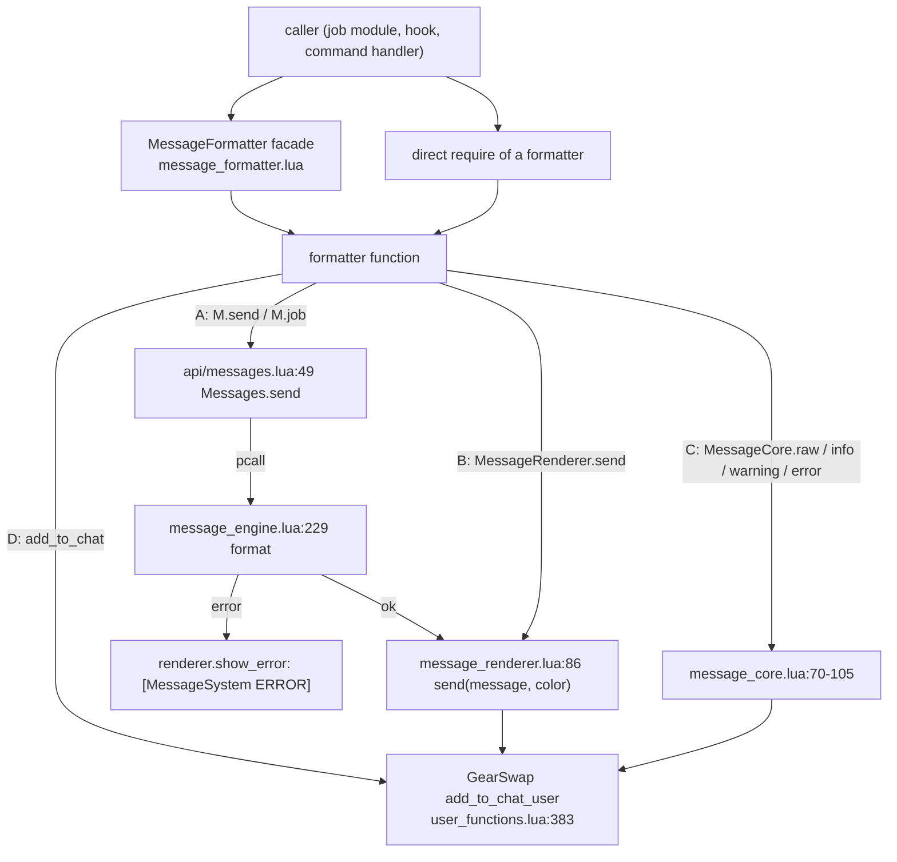

# Message formatters and utilities

The formatter layer turns "something happened" into coloured chat lines. It is the 34 modules under
`shared/utils/messages/formatters/` (split into `combat/`, `jobs/`, `magic/`, `system/`, `ui/`) plus the
two helpers under `shared/utils/messages/utilities/`: `roll_messages.lua` and `party_messages.lua`.
Game code reaches a formatter in one of two ways: through the facade
`shared/utils/messages/message_formatter.lua` (lazy wrappers, see [messages.md](messages.md)), or
directly with `require('shared/utils/messages/formatters/...')`. Formatters run on demand: when a
precast guard blocks an action, a JA/spell/WS hook announces an action, a `//gs c` command prints
status or help, a keybind file prints its intro, and so on. They register no events, schedule no
coroutines and bind no keys.

This page covers the formatter modules and what they expose. The pipeline beneath them (`api/messages.lua`,
`core/message_engine.lua`, `core/message_renderer.lua`, `message_core.lua`, `message_colors.lua`) is
described in [messages.md](messages.md). The template data files (`data/jobs/*`, `data/systems/*`) are
catalogued in [messages-catalog.md](messages-catalog.md).

Counts on this page come from a static scan of `shared/`, `_master/`, `Tetsouo/`, `Kaories/` and the root
`*.lua` files on 2026-09-18, with commented-out calls excluded and string dispatch
(`DEBUG_COMMANDS.lua:162-191`) resolved by hand. Of 553 public formatter functions, about 159 have no
reachable caller. They are listed per module under [Public API](#public-api).

## Files

| Path (under `shared/utils/messages/`) | Lines | Functions | Role |
|---|---|---|---|
| `formatters/combat/message_combat.lua` | 423 | 15 | WS TP/activation, WS validation errors, range error, waltz, spell activation line (MAGIC namespace) |
| `formatters/combat/message_cooldowns.lua` | 339 | 12 (+2 exported helpers) | Cooldown lines, multi-line cooldown/TP blocks, recast helpers |
| `formatters/combat/message_ja_buffs.lua` | 214 | 13 | Generic JA activation line honouring `JA_MESSAGES_CONFIG` |
| `formatters/combat/message_weaponskill.lua` | 119 | 15 | WeaponSkillManager and TP bonus calculator debug/error lines |
| `formatters/jobs/message_blm.lua` | 309 | 23 | BLM cycles, refinement, Arts/stratagem, BLM errors |
| `formatters/jobs/message_blm_midcast.lua` | 108 | 11 | BLM midcast debug trace |
| `formatters/jobs/message_brd.lua` | 511 | 48 | BRD songs, instruments, refinement, BRD errors |
| `formatters/jobs/message_bst.lua` | 546 | 53 | BST ecosystem/broth, pet engage, ready moves, BST errors |
| `formatters/jobs/message_cor.lua` | 41 | 3 | PartyTracker load failures |
| `formatters/jobs/message_drg.lua` | 52 | 4 | DRG jump errors (no caller, see below) |
| `formatters/jobs/message_geo.lua` | 185 | 4 | Indi/Geo cast line with element colour, tier refinement |
| `formatters/jobs/message_rdm.lua` | 167 | 15 | RDM state/help/error lines, Phalanx swap |
| `formatters/jobs/message_rdm_midcast.lua` | 203 | 18 | RDM midcast debug trace |
| `formatters/jobs/message_whm.lua` | 31 | 1 | CureManager load warning (no caller) |
| `formatters/magic/message_buffs.lua` | 67 | 1 | Buff status block for smartbuff managers |
| `formatters/magic/message_debuffs.lua` | 392 | 11 | "Blocked by debuff" lines, auto-cure lines, AutoMedicine toggle |
| `formatters/magic/message_midcast.lua` | 157 | 11 | MidcastManager debug trace |
| `formatters/magic/message_precast.lua` | 133 | 7 | Precast debug trace |
| `formatters/magic/message_songs.lua` | 154 | 10 | Song messages; no caller at all |
| `formatters/system/message_database.lua` | 133 | 13 | Universal spell/WS database load summary |
| `formatters/system/message_equipment.lua` | 178 | 16 | `//gs c checksets` report and checker debug |
| `formatters/system/message_init.lua` | 51 | 4 | INIT_SYSTEMS module load failures |
| `formatters/system/message_system.lua` | 191 | 6 | Job "SYSTEM LOADED" intro box, colour test (SYSTEM namespace) |
| `formatters/system/message_warp.lua` | 753 | 85 | Warp/teleport system: templates, status/help screens, item_user debug |
| `formatters/system/message_watchdog.lua` | 265 | 30 | Midcast watchdog status/debug/test |
| `formatters/ui/message_alt_commands.lua` | 317 | 1 | `//gs c altcmds` listing |
| `formatters/ui/message_commands.lua` | 650 | 59 | Output of common/debug commands, help and command list |
| `formatters/ui/message_dualbox.lua` | 191 | 23 | Dual-box role/job sync/status lines |
| `formatters/ui/message_info.lua` | 101 | 6 | `//gs c info <name>` screen |
| `formatters/ui/message_keybinds.lua` | 119 | 6 | Keybind list and bind errors |
| `formatters/ui/message_status.lua` | 86 | 7 | Generic error/warning/success/info, Mote state line, TP lines |
| `formatters/ui/message_ui.lua` | 195 | 10 | `//gs c ui` feedback, theme list, UI help |
| `utilities/roll_messages.lua` | 515 | 11 | COR Phantom Roll result block, bust, Double-Up, roll list |
| `utilities/party_messages.lua` | 74 | 1 | COR `//gs c party` listing |

## How it works

### Four ways a formatter writes to chat

Every formatter function ends in one of four output paths. Which one a module uses decides whether the
message passes the template engine, whether a mistake raises or prints an error line, and whether the
renderer's toggle/filter/stats apply.

**A. Templates (`M.send(namespace, key, params)` / `M.job(job, key, params)`).** Used by most modules.
`Messages.send` (`api/messages.lua:49-79`) formats inside `pcall`. The namespace picks the data file:
a three-letter upper-case namespace loads `data/jobs/<ns>_messages.lua`, anything else loads
`data/systems/<ns>_messages.lua` (`message_engine.lua:185-192`). An unknown key
(`message_engine.lua:242-247`) or a `nil` parameter (`message_engine.lua:150-157`) raises inside the
pcall and is shown as `[MessageSystem ERROR] Failed to format message NS.key: ...`
(`api/messages.lua:58-65`) instead of stopping the caller. `{name}` tokens that match a colour name in
`COLOR_CODES` (`message_engine.lua:36-66`) become colour codes; every other token is a parameter and is
inserted with `tostring` without being parsed again (`message_engine.lua:147-159`). A parameter whose
value is the text `"{green}"` therefore prints the literal text `{green}`; see Known issues.
`M.send` returns `(true, visible_length)`, which `show_activated` (`message_ja_buffs.lua:53-79`) and
`show_spell_activated` (`message_combat.lua:395-417`) pass back to their callers.

**B. `MessageRenderer.send`.** Signature `send(message, color, options)` (`message_renderer.lua:86`).
Among the formatters only `message_keybinds.lua:82` passes arguments in that order. `message_cooldowns.lua`,
`message_debuffs.lua`, `message_warp.lua`, `message_alt_commands.lua` (all `send(1, text)`) and
`message_rdm_midcast.lua` (`send(CHAT_*, text)`) pass the colour first: 105 call sites. They still print
because GearSwap's `add_to_chat_user` (`GearSwap/user_functions.lua:383-399`) accepts a string first
argument: it takes that string as the text and forces colour 8. For lines that start with an inline
colour code the result looks right. The renderer's own handling is applied to the number instead: the
timestamp option would print `[hh:mm:ss] 1`, and `_stats.by_color` is keyed by the whole message text
(`message_renderer.lua:138`).

**C. `MessageCore`.** `MessageCore.raw(text)` sends on channel 001 (`message_core.lua:103-105`);
`info/success/error/warning` prefix `[MAIN/SUB]` and use colours 121/158/167/205 (`message_core.lua:70-94`).
Used by `roll_messages.lua`, `party_messages.lua` and `message_bst.lua` (separator only).

**D. `add_to_chat` directly.** `message_commands.lua` (167 calls, a documented exception in
`.claude/CODE_QUALITY.md` section 6), and also `message_ui.lua`, `message_info.lua`,
`message_equipment.lua`, `message_watchdog.lua`, `message_warp.lua`, `message_system.lua:177`,
`roll_messages.lua:416`, `party_messages.lua:47-67`. Paths B and C also end in `add_to_chat`, but path D
bypasses the renderer's toggle and filter as well.

### Namespaces used per module

| Module | Namespace(s) | Other paths |
|---|---|---|
| message_combat | `COMBAT`, `MAGIC` | none |
| message_cooldowns | `COOLDOWNS` (separator only) | B |
| message_ja_buffs | `JA_BUFFS` | none |
| message_weaponskill | `WEAPONSKILL` | none |
| message_blm / _blm_midcast | `BLM` / `BLM_MIDCAST` | none |
| message_brd | `BRD`, `MAGIC` (`show_song_cast_generic`) | none |
| message_bst | `BST` | C (separator) |
| message_cor / drg / geo / rdm / whm | `COR` / `DRG` / `GEO` / `RDM` / `WHM` | none |
| message_rdm_midcast | `RDM_MIDCAST` (separator only) | B |
| message_buffs / debuffs | `BUFFS` / `DEBUFFS` (separators) | debuffs: B |
| message_midcast / precast | `MIDCAST` / `PRECAST` | none |
| message_songs | `SONGS` | none |
| message_database / equipment / init | `DATABASE` / `EQUIPMENT` / `INIT` | equipment: D |
| message_system | `SYSTEM` | D (colour sample) |
| message_warp | `WARP` | B, D |
| message_watchdog | `WATCHDOG` | D (headers) |
| message_alt_commands | none | B |
| message_commands | `COMMANDS` | D |
| message_dualbox / keybinds / status / ui | `DUALBOX` / `KEYBINDS` / `STATUS` / `UI` | keybinds: B; ui: D |
| message_info | none | D |
| roll_messages / party_messages | none | C, D |

Templates that no formatter uses (static scan of `M.send`/`M.job` keys): all of `SONGS` is only
used by the dead `message_songs.lua`; `INFO` (6 keys) is unused because `message_info.lua` writes with
`add_to_chat`; `COMMANDS` `testcolors_*`, `detectregion_*`, `region_detection_failed`,
`debugsubjob_header`, `debugsubjob_instructions` and the `*_status_header` / `*_current_mode` keys are
unused because `message_commands.lua` builds those lines itself; `EQUIPMENT` `check_header_*` and
`summary_*`; `KEYBINDS keybind_line`; `SYSTEM colortest_sample`, `UI separator`;
`WATCHDOG status_header`, `stats_header`; `BRD honor_march_locked/released`. The catalogue page owns
the data side.

### Lazy loading and module identity

The facade caches each formatter in an upvalue on first call (`message_formatter.lua:5-113`). GearSwap's
`require` is `include_user` (`GearSwap/refresh.lua:132`), which never writes `package.loaded`
(`GearSwap/user_functions.lua:300-333`). `ModuleCache.install()` (`shared/utils/core/module_cache.lua:44-88`,
called at `INIT_SYSTEMS.lua:47-52`) replaces `require` on the sandbox `_G` with a caching version. A
formatter required before that point is a separate copy. None of the formatters keep state that
matters, so the only visible effect is load cost.

### Job tag

Most lines start with `[MAIN/SUB]`. `MessageCore.get_job_tag()` (`message_core.lua:51-62`) returns
`"JOB"` when `player` is nil. `message_blm.lua:19-26`, `message_brd.lua:19-26`, `message_bst.lua:22-29`,
`message_geo.lua:25-32` and `message_rdm.lua:19-26` each carry a local copy that falls back to the job's
own code instead.

### Notable formatter logic

- **Spell activation line** (`message_combat.lua:395-417`). Picks one of 28 `MAGIC` keys:
  `<prefix>spell_activated[_full][_target|_full_target]` where the prefix comes from the spell skill
  (`message_combat.lua:367-374`) and the suffix from whether a description and a target exist
  (`message_combat.lua:382-393`). The target is dropped when it equals `player.name`
  (`message_combat.lua:403-405`). The spell name is wrapped in its element colour
  (`message_combat.lua:24-40`); Bar-spells are coloured by the name instead of the database element
  (`message_combat.lua:53-87`). Targets are green for `PLAYER`/`PC`/`SELF`, pale yellow for `NPC`,
  pink otherwise (`message_combat.lua:101-122`).
- **WS lines** (`message_combat.lua:207-251`). Three TP tiers: >= 3000 green, >= 2000 cyan, else white.
- **Cooldown line** (`message_cooldowns.lua:89-152`). The colour of the action name is chosen by
  substring of `action_type` (`magic`/`spell`, `ability`/`ja`, `weapon`/`ws`, else item colour).
  `status == "Ready"` or `"Active"` replace the timer. `format_recast_duration` renders `>= 3600` as
  `1h 02m 03s`, `>= 60` as `MM:SS min`, otherwise `12.3 sec` (`message_cooldowns.lua:23-49`).
  `show_spell_cooldown` takes centiseconds and divides by 100 (`message_cooldowns.lua:158-163`);
  `show_ability_cooldown` takes seconds.
- **Multi-status block** (`message_cooldowns.lua:214-261`). Entries `{type="cooldown"|"tp", name,
  value, extra, action_type}`; `tp` entries require `extra` (the needed TP). All callers
  (`thf/.../smartbuff_manager.lua:60`, `dnc/waltz_manager.lua:173,250`) provide it.
- **Buff block** (`message_buffs.lua:27-56`). Statuses `active`, `ready`, `cooldown`; each line is a
  `show_cooldown_message(..., no_separators=true)` between two `BUFFS.separator` lines.
- **JA activation** (`message_ja_buffs.lua:53-79`). Returns 0 and prints nothing when
  `JA_MESSAGES_CONFIG.is_enabled()` is false; shows the description only in `full` mode.
- **Keybind intro** (`message_system.lua:105-126`). Fixed width of 74 `=` (`message_system.lua:53`),
  macrobook and lockstyle lines only when that info is passed (`message_system.lua:57-76`), keybind count,
  and a UI visible/hidden line only when `_G.ui_display_config` exists (`message_system.lua:81-97`).
- **Alt command list** (`message_alt_commands.lua:295-311`). With no filter: one line per group in
  `GROUP_ORDER` order (`message_alt_commands.lua:22-26, 223-245`) plus the path of the override file.
  With a filter: names matching group, name or action text, split into "needs a target" and "on <alt>"
  (`message_alt_commands.lua:192-217`). After either view, the names that run on this character (a
  common command or warp alias of the same name) are listed apart under a `//gs c alt <name>` line
  (`show_shadowed`, `:277-285`).
- **GEO cast line** (`message_geo.lua:93-157`). Requires both geomancy databases at module load
  (`message_geo.lua:19-22`); a spell missing from the database prints an `M.error` line and nothing else.
  `GEO_MIDCAST.lua:55-59` only routes `Indi-` and `Geo-` spells here, so the `-ra` entries of
  `ELEMENT_COLORS` (`message_geo.lua:54-60`: `Fira`, `Blizzara`, `Aera`, `Stonera`, `Thundara`, `Watera`) are never matched by name.
- **Roll result** (`roll_messages.lua:192-307`). Builds up to six lines (roll, lucky/unlucky, coverage,
  missed names, bust risk, natural 11), then frames them with a separator sized from
  `get_visual_length` minus 3, minimum 60 (`roll_messages.lua:277-292`). Risk bands are the table
  `BUST_BANDS` (`roll_messages.lua:72-86`), first match wins. `get_visual_length` treats `0x1E` as a
  4-byte sequence (`roll_messages.lua:55-56`) while `message_commands.lua:26-35` and GearSwap
  (`helper_functions.lua:1134`) use `0x1E` plus one byte; no roll line contains `0x1E` today.

## Public API

Signatures are as declared. "Callers" lists call sites outside the formatter file (first site per file).
`(dead)` means no reachable caller was found.

### Facade-only notes

- Facade keys that point to functions that do not exist: `show_convert_activated`, `show_convert_used`,
  `show_chainspell_activated`, `show_chainspell_ended`, `show_composure_activated`,
  `show_composure_active` (`message_formatter.lua:303-308`). No caller; calling one raises
  "attempt to call field ... (a nil value)".
- Name overlaps: `MessageFormatter.show_buff_status` is `MessageBuffs.show_buff_status`, not the BLM one;
  `show_doom_removed` is BRD's (RDM's is `show_rdm_doom_removed`); `show_songs_casting`, `show_song_pack`,
  `show_daurdabla_dummy`, `show_pianissimo_*`, `show_marcato_*` go to `message_brd.lua`, and the
  `show_song_*` keys go to `message_songs.lua`; BST functions are exported twice, as `show_bst_x` and
  `show_x` (`message_formatter.lua:359-469`).

### combat/message_combat.lua

| Function | Output | Callers |
|---|---|---|
| `show_range_error(ability, distance_info)` | `COMBAT.range_error` | `weaponskill_manager.lua:96` |
| `show_ws_validation_error(ws_name, reason, detail, status_ailment, detail_color_code)` | `ws_validation_error[_status\|_detail]`; last param unused | `ws_precast_handler.lua:57`, `weaponskill_manager.lua:128` |
| `show_ability_tp_error(ability_name, current_tp, required_tp, job_tag)` | `ability_tp_error` | `DNC_PRECAST.lua:111` |
| `show_ws_tp(ws_name, total_tp)` | `ws_tp_{ultimate,enhanced,normal}` | `hooks/init_ws_messages.lua:165` |
| `show_ws_activated(ws_name, description, total_tp)` | `ws_activated_*`; `description` must not be nil | `hooks/init_ws_messages.lua:162` |
| `show_spell_cast(spell_name)` | `spell_cast` | `pld/.../aoe_manager.lua:122`, `run/.../aoe_manager.lua:122` |
| `show_waltz_heal(waltz_name, missing_hp, extra_ability, job_tag)` | `waltz_heal_{single,aoe}[_extra]` | `dnc/waltz_manager.lua:202,233` |
| `show_spell_activated(spell_name, description, target_name, spell_skill, spell_element, target_type)` | `MAGIC.*spell_activated*`; returns visible length | `handlers/spell_message_handler.lua:300`, `brd/.../midcast_router.lua:135` |
| `show_target_error`, `show_state_change`, `show_ability_use`, `show_jump_activated`, `show_jump_chaining`, `show_jump_complete`, `show_jump_relaunch` | | (dead) |

### combat/message_cooldowns.lua

| Function | Notes | Callers |
|---|---|---|
| `show_cooldown_message(job_name, action_type, name, remaining, status, no_separators)` | core line | `message_buffs.lua:45`, `pld\|run/.../aoe_manager.lua:153` |
| `show_spell_cooldown(spell_name, remaining_centiseconds, job_name)` | centiseconds | `precast/cooldown_checker.lua:131`, BLM `storm_manager.lua:255`, `refiner/recast_display.lua:136`, `refiner/special_handlers.lua:147` |
| `show_ability_cooldown(ability_name, remaining_seconds, job_name)` | seconds | `cooldown_checker.lua:107`, `dnc/.../step_manager.lua:66`, `pld\|run/.../rune_manager.lua:65` |
| `show_multi_status(messages, job_name)` | block | BLM `spell_refiner.lua:87`, `storm_manager.lua:113`, `recast_display.lua:133`, `thf/.../smartbuff_manager.lua:61`, `dnc/waltz_manager.lua:209`, `drg/DRG_JUMP_MANAGER.lua:71`, `precast/tier_refiner.lua:157` |
| `get_ability_recast_seconds(id)` | exported helper | via facade |
| `format_recast_duration(recast)` | used internally only | |
| `show_ws_cooldown`, `show_item_recast`, `show_stratagem_cooldown`, `show_song_duration`, `show_compact_status`, `show_spell_cooldown_by_id`, `show_ability_cooldown_by_id`, `get_spell_recast_seconds` | | (dead) |

### combat/message_ja_buffs.lua

Only `show_activated(ability_name, description)` (facade `show_ja_activated`) has a caller:
`handlers/ability_message_handler.lua:234`. `show_active`, `show_ended`, `show_with_description`,
`show_using`, `show_using_double` (facade `show_ja_*`) and the seven BRD compatibility wrappers
(`show_soul_voice_activated` ... `show_marcato_used`, facade `*_new`) are dead.

### combat/message_weaponskill.lua

Not in the facade. `show_ws_manager_initialized`, `show_invalid_spell_parameter`,
`show_target_info_missing`, `show_missing_numeric_values`, `show_too_far`, `show_player_info_missing`,
`show_amnesia_error` are called from `weaponskill/weaponskill_manager.lua:40-135`;
`show_tp_validation_failed`, `show_tp_calculation`, `show_already_at_max`, `show_target_threshold`,
`show_gap_too_large`, `show_total_available`, `show_checking_piece`, `show_equipping_piece` from
`weaponskill/tp_bonus_calculator.lua:134-203` (loaded by `precast/tp_bonus_handler.lua:30`).

### jobs/*

| Module | Live (callers) | Dead |
|---|---|---|
| message_blm | `show_element_cycle`, `show_storm_cycle`, `show_tier_cycle` (`BLM_COMMANDS.lua:122,180,191`); `show_spell_refinement` (`refiner/special_handlers.lua:108`, `precast/tier_refiner.lua:186`); `show_arts_already_active`, `show_stratagem_no_charges` (`scholar/scholar_actions.lua:56,41`); `show_buffself_error` (`BLM_COMMANDS.lua:359`); `show_spell_replacement_error`, `show_spell_refinement_error`, `show_spell_recasts_error`, `show_insufficient_mp_error`, `show_breakga_blocked` (BLM refiner files) | `show_aja_cycle`, `show_buff_activated`, `show_buff_cast`, `show_magic_burst_on/off`, `show_free_nuke_on`, `show_spell_refinement_failed`, `show_mp_conservation`, `show_dark_arts_activated`, `show_buff_casting`, `show_buff_status` |
| message_blm_midcast | all 11, from `BLM_MIDCAST.lua` (as `MessageBLMMidcast`) and `blm/.../midcast_router.lua` (as `ctx.messages`) | none |
| message_brd | `show_marcato_used`, `show_pianissimo_used`, `show_ability_command`, lullaby/elegy/requiem/threnody/carol/etude casts, `show_no_*` errors, `show_song_cast` (`BRD_COMMANDS.lua`); `show_pianissimo_target`, `show_instrument_locked`, `show_marcato_honor_march` (`BRD_PRECAST.lua`); `show_instrument_released` (`BRD_AFTERCAST.lua:54`); `show_songs_casting`, `show_song_pack`, `show_dummy_casting`, `show_pack_not_found` (`song_rotation_manager.lua`); `show_daurdabla_dummy` (`midcast_router.lua:150`); `show_song_refinement[_failed]` (`song_refinement.lua:80,87`) | 23: Soul Voice/Nightingale/Troubadour lines, `show_marcato_skip_*`, `show_honor_march_locked/released`, `show_songs_refresh`, `show_dummy_cast`, tank/healer casting/refresh and not-configured, `show_song_guidance`, `show_song_cast_generic`, `show_doom_gained/removed`, `show_no_pack_configured` |
| message_bst | ecosystem/species/broth equip (`bst/.../ecosystem_manager.lua:49,89,124`), broth count header/line, no broths, ready-move list/use/auto lines, `show_error_*` for pet, moves, index, module (`BST_COMMANDS.lua`), pet engage/disengage (`pet_manager.lua:164,176`) | 34: all JA lines, `show_jug_equipped`, `show_broth_count_footer`, pet summoned/dismissed/charm/died/despawned, auto-engage lines, pet TP/HP status, ready-move precast/physical/magical/breath/tp_check/recast, `show_error_no_target/pet_too_far/no_jug_equipped/insufficient_hp` |
| message_cor | all 3 (`cor/.../party_tracker.lua:123,149,157`) | none |
| message_drg | none (`drg/DRG_JUMP_MANAGER.lua:29,36` writes the same texts with `show_error`) | all 4 |
| message_geo | all 4 (`GEO_MIDCAST.lua:56,58`, `geo_spell_refiner.lua:155,164`) | none |
| message_rdm | `show_element_list`, `show_storm_current`, the `*_not_configured` / `no_enspell` / `storm_requires_sch` errors (`RDM_COMMANDS.lua:89-347`); `show_phalanx_downgrade/upgrade` (`RDM_PRECAST.lua:200,203`) | `show_doom_warning`, `show_doom_removed`, `show_spell_casting` (calls commented out at `RDM_COMMANDS.lua:277,315,333` as duplicates of the universal spell line), `show_enspell_current`, `show_phalanx_detected` |
| message_rdm_midcast | all 18 from `RDM_MIDCAST.lua` | none |
| message_whm | none | `show_curemanager_not_loaded` |

`message_brd.show_marcato_honor_march` (`message_brd.lua:100-107`) and `show_song_cast`
(`message_brd.lua:278-285`) have callers but empty bodies; the comments say "DISABLED: Too verbose" and
"DISABLED: Duplicate message".

### magic/*

| Module | Live | Dead |
|---|---|---|
| message_buffs | `show_buff_status(buffs_data, action_type)`: DNC/THF/WAR `smartbuff_manager.lua`, `buffs/self_buff_manager.lua:195` | none |
| message_debuffs | `show_spell/ja/ws/item_blocked`, `show_action_blocked`, `show_no_silence_cure`, `show_no_paralysis_cure` (`debuff/precast_guard.lua:251-438`); `show_silence_cure_success`, `show_paralysis_cure_success` passed as callbacks (`precast_guard.lua:172,180`); `show_auto_medicine_toggled` (`debuff/auto_medicine.lua:185`) | `show_incapacitated` |
| message_midcast | debug enabled/disabled/header/step, priorities, result, equipment line (`midcast/midcast_manager.lua:27-636`) | `show_target_details_header`, `show_target_property` |
| message_precast | all 7 (`BRD/BST/RDM/RUN_PRECAST.lua`, `COMMON_COMMANDS.lua:572-574`) | none |
| message_songs | none | all 10 |

### system/*

| Module | Live | Dead |
|---|---|---|
| message_database | `show_load_header`, `show_total_loaded_with_expected`, `show_weapon_type_count`, `show_load_date`, `show_failed_count`, `show_failed_item`, `show_separator`, `show_category_header`, `show_weapon_type_entry` (all from `data/weaponskills/UNIVERSAL_WS_DATABASE.lua:370-389`, `print_load_summary`, which has no caller) | `show_total_loaded`, `show_database_count`, `show_breakdown_header`, `show_database_entry` (their only caller, `UNIVERSAL_SPELL_DATABASE.lua`, was deleted) |
| message_equipment | `show_check_header/summary/error`, `show_missing_item`, `show_storage_item`, `show_no_sets_found`, checker debug lines (`equipment/equipment_checker.lua:255-483`) | `show_set_valid` |
| message_init | `show_module_load_failed(module_name, error_msg)` (`INIT_SYSTEMS.lua:103-232` and others) | `show_watchdog_load_failed`, `show_module_loaded`, `show_init_complete` |
| message_system | `show_system_intro(title, keybinds, job_name)` and `show_system_intro_complete(title, keybinds, macro_info, lockstyle_info, job_name)` from every `config/<job>/<JOB>_KEYBINDS.lua` | `show_system_intro_with_macros`; `show_color_test_header/sample/footer` are called only from `COR_COMMANDS.lua:302-314`, which is unreachable because `testcolors` returns through `CommonCommands` first (`COR_COMMANDS.lua:154-164`) |
| message_warp | casting/equipping/using, level/job errors, IPC, equipment lock, status/test screens, precast FC, item cooldown lines, item_user and IPC debug (`shared/utils/warp/*`) | `show_warp_countdown`, `show_warp_unavailable`, `show_warp_no_charges`, `show_warp_recast`, `show_warp_charges_remaining`, the five `show_tele_*` equivalents, `show_status`, `show_debug_toggle` (`debugwarp` is answered by `COMMON_COMMANDS.lua:562-566`; `warp_commands.lua:263` is never reached because `debugwarp` is not in the warp registry) |
| message_watchdog | status/stats/config/debug/alert/test/help (`core/midcast_watchdog.lua`, `core/WATCHDOG_COMMANDS.lua:61-95`) | `show_stopped`, `show_debug_midcast_spell` |

Several `message_warp` functions are intentionally empty ("Silent init"): `show_init_success`,
`show_commands_registered`, `show_ipc_unavailable`, `show_ipc_registered`, `show_equipment_initialized`,
`show_precast_initialized` (`message_warp.lua:272-303, 379-381, 496-498`).

### ui/*

| Module | Live | Dead |
|---|---|---|
| message_alt_commands | `show_list(alt, job, names, commands, filter, subjob, char, shadowed)` (`dualbox/alt_commands.lua:547`) | local helpers `target_note` (`:38-60`) and `job_label` (`:122-125`) |
| message_commands | colour test header/row/separator/footer (`COMMON_COMMANDS.lua:263-296`), craft (`craft/craft_commands.lua:166-228`), lockstyle/dressup (`COMMON_COMMANDS.lua:334,356`), warp load errors (`COMMON_COMMANDS.lua:394-408`), debugsubjob (`DEBUG_COMMANDS.lua:117-143`), jamsg/spellmsg/wsmsg (string dispatch `DEBUG_COMMANDS.lua:162-191`), `show_warp_debug_toggled` (`COMMON_COMMANDS.lua:565`), `show_debugmidcast_toggled` (every `<JOB>_COMMANDS.lua`), `show_help`, `show_commands_list` (`COMMON_COMMANDS.lua:649,653`) | `show_color_sample` and the 14 region functions `show_detect_region_header` ... `show_region_reload_required` (`message_commands.lua:122-216`) |
| message_dualbox | all 23 (`dualbox/dualbox_manager.lua`) | none |
| message_info | all 6 (`commands/info_command.lua:218-383`) | none |
| message_keybinds | `show_keybind_list`, `show_no_binds_error`, `show_bind_failed_error`, `format_keybind_line` (keybind config files); `calculate_max_width` (internal) | `show_invalid_bind_error` |
| message_status | `show_error`, `show_warning`, `show_success`, `show_info` (widely), `show_state_display` (`core/state_display_override.lua:40`), `show_tp_ready` (`drg/DRG_JUMP_MANAGER.lua:43`) | `show_tp_required` |
| message_ui | all 10 (`ui/UI_COMMANDS.lua:39-92`, `ui/ui_appearance.lua`, `ui/ui_section_toggles.lua`, `ui/ui_visibility.lua`) | none |

`MessageStatus.show_error(message)` takes one argument. `COMMON_COMMANDS.lua:629` and
`DEBUG_COMMANDS.lua:446` pass two, so the second (the actual reason) is dropped.

### utilities/*

| Function | Callers |
|---|---|
| `RollMessages.show_roll_result(roll_name, value_display, bonus_display, is_crooked, affected_count, total_count, lucky_num, unlucky_num, missed_names, bust_rate, job_bonus_info, roll_range)` | `cor/.../roll_tracker.lua:701` |
| `show_roll_bust(roll_name, bust_effect, effect_type)` | `roll_tracker.lua:378` |
| `show_roll_double_up_window(remaining_seconds)`, `show_roll_double_up_expired()`, `show_no_active_roll()` | `roll_tracker.lua:708-718` |
| `show_active_rolls(active_rolls)`, `show_rolls_cleared()`, `show_invalid_roll_value(roll_value)` | `COR_COMMANDS.lua:252,278,236` |
| `show_roll_natural_eleven`, `show_roll_bust_rate`, `show_roll_not_found` | (dead; `show_roll_bust_rate` repeats the `BUST_BANDS` thresholds inline, `roll_messages.lua:338-371`) |
| `PartyMessages.show_party_members(party_jobs)` | `COR_COMMANDS.lua:284`; expects `{[id] = {name, main_job, sub_job, main_job_level}}` as built by `party_tracker.lua:229-236` |

## Commands

Formatters handle no command themselves. These commands print through them:

| Command | Handler | Formatter |
|---|---|---|
| `//gs c commands` / `cmds`, `help` / `?` | `COMMON_COMMANDS.lua:647-654` | `message_commands.show_commands_list` / `show_help` |
| `//gs c testcolors` / `colors` | `COMMON_COMMANDS.lua:552`, `263-296` | `message_commands` colour test |
| `//gs c jamsg\|spellmsg\|wsmsg [full\|on\|off]` | `DEBUG_COMMANDS.lua:156-209` | `message_commands.show_<prefix>_*` by string dispatch |
| `//gs c debugsubjob` / `dsj` | `DEBUG_COMMANDS.lua:117-143` | `message_commands` debugsubjob block |
| `//gs c debugwarp` | `COMMON_COMMANDS.lua:562-566` | `message_commands.show_warp_debug_toggled` |
| `//gs c debugprecast` | `COMMON_COMMANDS.lua:567-576` | `message_precast.show_debug_enabled/disabled` |
| `//gs c debugmidcast` | each `<JOB>_COMMANDS.lua` | `message_commands.show_debugmidcast_toggled` |
| `//gs c info <name>` | `DEBUG_COMMANDS.lua:215-218` -> `commands/info_command.lua` | `message_info` |
| `//gs c checksets` | `COMMON_COMMANDS.lua:487`, `114` | `message_equipment` |
| `//gs c altcmds [filter]` | `COMMON_COMMANDS.lua:497` -> `alt_commands.lua:528-550` | `message_alt_commands.show_list` |
| `//gs c ui ...` | `ui/UI_COMMANDS.lua:39-92` | `message_ui` |
| `//gs c warp status\|test\|help\|unlock\|fix\|lock\|ipctest` | `warp/warp_commands.lua:196-214` | `message_warp` |
| `//gs c watchdog [on\|off\|toggle\|debug\|buffer n\|fallback n\|clear\|test\|stats]` | `core/WATCHDOG_COMMANDS.lua:61-95` | `message_watchdog` |
| `//gs c rolls`, `clearrolls`, `party`, `track_roll` (COR) | `COR_COMMANDS.lua:167-285` | `roll_messages`, `party_messages` |

## Configuration

| Source | Read by | Effect |
|---|---|---|
| `shared/config/JA_MESSAGES_CONFIG.lua` | `message_ja_buffs.lua:27-36` (pcall; fallback = always `full`) | `off` silences `show_activated`, `full` adds the description; the mode is re-read from `MessageSettings` on each call (`JA_MESSAGES_CONFIG.lua:60-77`) |
| `message_colors.lua` (`MessageCore.COLORS`) | every module that builds inline colours | colour numbers; `WARNING` and `get_warning_color()` are region dependent |
| `_G.LockstyleConfig.initial_load_delay` (default 8.0) | `message_system.lua:68` | delay shown in the intro lockstyle line; set by `_master/entry/*` |
| `_G.ui_display_config.enabled` | `message_system.lua:90` | UI visible/hidden line in the intro |
| `shared/data/magic/geomancy/geomancy_indi.lua`, `geomancy_geo.lua` | `message_geo.lua:19-22` at load | descriptions and elements for Indi/Geo lines |
| UI theme names | hard-coded in `message_ui.lua:113-158` | matches the 36 `background_presets` of `_master/config_global/UI_CONFIG.lua`, `Tetsouo/config/UI_CONFIG.lua` and `Kaories/config/UI_CONFIG.lua` |

Not read, but repeated as literal text: cure item names (`message_debuffs.lua:266-273, 342-347, 379-382`,
see `shared/config/DEBUFF_AUTOCURE_CONFIG.lua:40-52`) and the command lists in the help screens.

## State & lifetime

- No formatter registers an event, schedules a coroutine, binds a key or writes `windower.*`.
- Globals read: `player` (job tag, `message_combat.lua:403`), `_G.LockstyleConfig`,
  `_G.ui_display_config` (`message_system.lua:68,90`). `windower.ffxi.get_spell_recasts` and
  `get_ability_recasts` are read in `message_cooldowns.lua:59-76`. No formatter writes a global;
  `message_buffs.lua:61-65` records that five former `_G.show_*_buff_status` globals were removed.
- Module-level state: the facade's upvalue caches (`message_formatter.lua:5-113`), `JAConfig` in
  `message_ja_buffs.lua:27`, the geomancy tables in `message_geo.lua:19-22`. All live in the sandbox
  and are rebuilt when GearSwap drops `user_env` on `gs reload` or a main-job change
  (see `module_cache.lua:18-25`). A subjob change is followed by a `gs reload` 0.5 s later
  (`job_change_manager.lua:149-181`), which rebuilds them too.
- The renderer's `_stats.by_color` gains one entry per distinct colour-first message (path B above)
  until the next reload.

## Interactions

- Below: [messages.md](messages.md) (API, engine, renderer, colours, facade),
  [messages-catalog.md](messages-catalog.md) (templates).
- Callers: [precast-pipeline.md](precast-pipeline.md) (PrecastGuard debuff lines, cooldown lines, WS
  validation), [midcast-and-buffs.md](midcast-and-buffs.md) (MidcastManager debug, smartbuff blocks),
  [commands-and-debug.md](commands-and-debug.md) (help, command list, jamsg/spellmsg/wsmsg, info),
  [dualbox.md](dualbox.md) (dual-box and altcmds), [ui-overlay.md](ui-overlay.md) (`//gs c ui`),
  [core-lifecycle.md](core-lifecycle.md) (INIT_SYSTEMS load failures, watchdog).
- `message_validator.lua` (`//gs c msgtests`) checks that each job formatter function exists in the
  facade under the same name (`message_validator.lua:180-195`). Because of the name overlaps above it
  passes BLM `show_buff_status` and RDM `show_doom_removed` although the facade key reaches another
  module, and it flags BRD `show_song_cast_generic`, which is not exported.

## Invariants & gotchas

- Colour tokens go in the template, never in a parameter. `"{green}"` passed as a value prints the
  literal text (verified by running `message_engine.lua` under Lua 5.1).
- Every placeholder in a template must be supplied and not nil, otherwise the line becomes a
  `[MessageSystem ERROR]` line. `message_precast.show_debug_step` guards `value or ""`
  (`message_precast.lua:61`); `message_midcast.show_debug_step` does not (`message_midcast.lua:62-64`),
  and all current midcast callers pass non-nil values.
- `show_spell_cooldown` wants centiseconds, `show_ability_cooldown` seconds; `show_multi_status`
  values are seconds.
- Lines that should keep their inline colours go through `MessageCore.raw` (channel 001) or a template
  with `color = 1`. Direct `add_to_chat` in these files uses channel 121 with an inline code first.
- `MessageRenderer.send` takes `(text, color)`. In the message layer only `message_keybinds.lua:82` and
  `MessageFormatter.show_debug` (`message_formatter.lua:488-492`) use that order today; outside it,
  `core/DEBUG_COMMANDS.lua:399-434` does too.
- Unrecognised `//gs c warp ` falls through to casting Warp (`warp_commands.lua:256-260, 272`), so
  any help text naming a `warp` subcommand must match `warpcommands_handle_command_warp`
  (`warp_commands.lua:196-214`).

## Extending

To add a message:

1. Add the template to the namespace file under `data/jobs/` (three-letter job code) or
   `data/systems/` (`<namespace>_messages.lua`), with `template` and `color`. Put colours as tokens.
2. Add a function to the formatter that calls `M.send('<NS>', '<key>', {...})` (or `M.job`) and supplies
   every placeholder, converting numbers with `tostring` where the other functions do.
3. If game code should reach it through the facade, add a lazy wrapper in `message_formatter.lua` next
   to the module's block, under a name no other module already uses. For a job formatter the validator
   expects the same name as the formatter function.
4. For multi-part lines with computed colours, build the string with `MessageCore.create_color_code`
   and send it with `MessageCore.raw(text)` or `MessageRenderer.send(text, 1)`.

To add a formatter module: create it under the matching `formatters/<area>/`, `return` the module
table, and add a `get_<Module>()` lazy getter in the facade if it is to be exported.

## Known issues

- `MessageWarp.show_item_equip_delay` is defined twice; the second (`message_warp.lua:607`) replaces the first (`:521`), and the one-argument call at `item_user.lua:286` raises.
- `//gs c warp help` lists `//gs c warp debug` (`message_warp.lua:249`); that command casts Warp or uses the Warp Ring.
- 105 `MessageRenderer.send` calls pass colour and text in the wrong order (`message_cooldowns.lua:146`, `message_debuffs.lua:46`, `message_warp.lua:221`, `message_alt_commands.lua:112`, `message_rdm_midcast.lua:38`); RDM midcast debug lines lose their colours.
- Six facade entries point to RDM functions that do not exist (`message_formatter.lua:303-308`).
- `message_brd.show_dummy_cast` uses the missing key `BRD.dummy_cast` (`message_brd.lua:234`).
- `message_songs.lua` has no caller; neither do the `show_song_*` and `*_new` facade keys (`message_formatter.lua:138-155`).
- Region detection functions left after the `setregion`/`detectregion` handlers were removed (`message_commands.lua:122-216`); `message_colors.lua:18` still documents `//gs c setregion`.
- About 159 of 553 formatter functions have no caller (tables above).
- Colour tokens passed as parameters print literally (`message_warp.lua:456`, `message_blm.lua:194`, `message_bst.lua:260, 270, 286, 342`); all on paths without callers today.
- "No cure" and AutoMedicine lines name fixed items and omit Panacea (`message_debuffs.lua:266-273, 342-347, 379-382`).
- The BST broth listing opens a separator block it never closes (`BST_COMMANDS.lua:120-129`).
- `MessageFormatter.show_error` called with two arguments drops the reason (`COMMON_COMMANDS.lua:629`, `DEBUG_COMMANDS.lua:446`).
- README describes `jamsg`/`spellmsg`/`wsmsg`/`info`/`debugmsg` wrongly (`README.md:380-387`).
- The watchdog help lists `status` (not a subcommand) and omits `toggle` (`watchdog_messages.lua:263`).
- Five local `get_job_tag` copies and four `ELEMENT_COLORS` tables; Ice is 210 in `message_combat.lua:30` and 30 in BLM/BRD/GEO.
- Direct `add_to_chat` in formatter files that `.claude/CODE_QUALITY.md` section 6 does not list (path D above).
