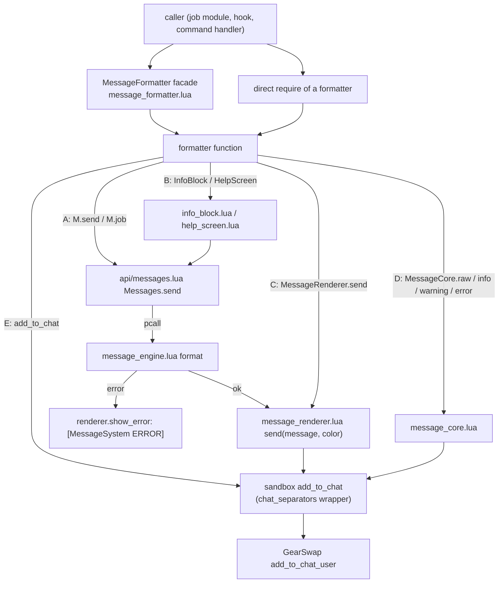

# Message formatters and utilities

The formatter layer turns "something happened" into coloured chat lines. It is the 35 modules under
`shared/utils/messages/formatters/` (split into `combat/`, `jobs/`, `magic/`, `system/`, `ui/`) plus the
two helpers under `shared/utils/messages/utilities/`: `roll_messages.lua` and `party_messages.lua`.
Game code reaches a formatter in one of two ways: through the facade
`shared/utils/messages/message_formatter.lua` (lazy wrappers, see [messages.md](messages.md)), or
directly with `require('shared/utils/messages/formatters/...')`. Formatters run on demand: when a
precast guard blocks an action, a JA/spell/WS hook announces an action, a `//gs c` command prints
status or help, a job loads and prints its intro block, and so on. They register no events, schedule
no coroutines and bind no keys.

This page covers the formatter modules and what they expose. The pipeline beneath them (`api/messages.lua`,
`core/message_engine.lua`, `core/message_renderer.lua`, `message_core.lua`, `message_colors.lua`,
`chat_palette.lua`, `chat_separators.lua`, `info_block.lua`, `help_screen.lua`) is described in
[messages.md](messages.md). The template data files (`data/jobs/*`, `data/systems/*`) are catalogued in
[messages-catalog.md](messages-catalog.md).

Figures on this page were measured on 2026-09-28: line counts with `wc -l`, public functions with
`grep -cE "^function [A-Za-z_]+[.:]"` (37 files, **537** public functions, plus the two recast helpers
that `message_cooldowns.lua` exports as fields). Callers were resolved by name with `grep -r` over the
whole data folder, the gitignored `Tetsouo/`, `Kaories/`, `Hysoka/` and `Gabvanstronger/` included
(ripgrep skips them), with comments stripped, facade aliases followed, and the string-built
`MessageCommands['show_' .. prefix .. '_...']` dispatch of `DEBUG_COMMANDS.lua`
`handle_message_config_generic` resolved by hand. About **138** of the 537 functions have no reachable
caller; they are listed per module under Public API.

## Files

| Path (under `shared/utils/messages/`) | Lines | Functions | Role |
|---|---|---|---|
| `formatters/combat/message_combat.lua` | 477 | 15 | WS TP/activation, WS validation errors, range error, waltz, spell activation line (MAGIC namespace) |
| `formatters/combat/message_cooldowns.lua` | 340 | 12 (+2 exported helpers) | Cooldown lines, multi-line cooldown/TP blocks, recast helpers |
| `formatters/combat/message_ja_buffs.lua` | 220 | 13 | Generic JA activation line honouring `JA_MESSAGES_CONFIG`, plus 7 unused BRD compatibility wrappers |
| `formatters/combat/message_weaponskill.lua` | 148 | 15 | WeaponSkillManager and TP bonus calculator debug/error lines |
| `formatters/jobs/message_blm.lua` | 212 | 13 | BLM cycles, refinement, Arts/stratagem, BLM errors |
| `formatters/jobs/message_blm_midcast.lua` | 108 | 11 | BLM midcast router debug trace |
| `formatters/jobs/message_brd.lua` | 513 | 46 | BRD songs, instruments, refinement, BRD errors |
| `formatters/jobs/message_bst.lua` | 546 | 48 | BST ecosystem/broth, pet engage, ready moves, BST errors |
| `formatters/jobs/message_cor.lua` | 39 | 3 | PartyTracker load failures |
| `formatters/jobs/message_drg.lua` | 50 | 4 | DRG jump errors (no caller) |
| `formatters/jobs/message_geo.lua` | 183 | 4 | Indi/Geo cast line with element colour, tier refinement |
| `formatters/jobs/message_rdm.lua` | 169 | 15 | RDM state/error lines, Phalanx swap |
| `formatters/jobs/message_rdm_midcast.lua` | 203 | 18 | RDM midcast debug trace |
| `formatters/jobs/message_whm.lua` | 29 | 1 | CureManager load warning (no caller) |
| `formatters/magic/message_buffs.lua` | 60 | 1 | Buff status block for smartbuff managers |
| `formatters/magic/message_debuffs.lua` | 394 | 11 | "Blocked by debuff" lines, auto-cure lines, AutoMedicine toggle |
| `formatters/magic/message_midcast.lua` | 156 | 11 | MidcastManager debug trace |
| `formatters/magic/message_precast.lua` | 135 | 7 | Precast debug trace |
| `formatters/magic/message_songs.lua` | 155 | 10 | Song messages; no caller at all |
| `formatters/system/message_altgroup.lua` | 105 | 12 | `ALTGROUP` lines: `//gs c alts`, `main` / `setalt` roles, alt window toggle, usage screen |
| `formatters/system/message_equipment.lua` | 158 | 16 | `//gs c checksets` report and checker debug |
| `formatters/system/message_init.lua` | 50 | 4 | INIT_SYSTEMS module load failures |
| `formatters/system/message_sortie.lua` | 165 | 8 | `SORTIE` lines: target box, target list, alt orders, GEO escort, sortie help |
| `formatters/system/message_stealth.lua` | 98 | 8 | `STEALTH` lines of `//gs c stealth` ([stealth.md](stealth.md)) |
| `formatters/system/message_system.lua` | 132 | 6 | Job-load block (`WAR :: System loaded`), colour test |
| `formatters/system/message_tempbind.lua` | 138 | 9 | `TEMPBIND` lines: `//gs c tb` added / taken / list / help |
| `formatters/system/message_warp.lua` | 711 | 81 | Warp/teleport system: casting lines, status/test blocks, help, item_user and IPC debug |
| `formatters/system/message_watchdog.lua` | 289 | 30 | Midcast watchdog status/stats/config/debug/alert/test/help |
| `formatters/ui/message_alt_commands.lua` | 237 | 1 | `//gs c altcmds` listing |
| `formatters/ui/message_commands.lua` | 527 | 42 | Output of common/debug commands, `//gs c help` and `//gs c commands` |
| `formatters/ui/message_dualbox.lua` | 190 | 23 | Dual-box role/job sync/status lines |
| `formatters/ui/message_info.lua` | 66 | 3 | `//gs c info <name>` card, usage, not found |
| `formatters/ui/message_keybinds.lua` | 119 | 6 | Keybind list line format and bind errors |
| `formatters/ui/message_status.lua` | 86 | 7 | Generic error/warning/success/info, Mote state line, TP lines |
| `formatters/ui/message_ui.lua` | 231 | 12 | `//gs c ui` feedback, look settings, theme list, UI help |
| `utilities/roll_messages.lua` | 596 | 10 | COR Phantom Roll result in three styles, bust, Double-Up, active roll list |
| `utilities/party_messages.lua` | 48 | 1 | COR `//gs c party` listing |

## How it works

### Output paths

Every formatter function ends in one of six output paths. Which one a module uses decides whether the
message passes the template engine, whether a mistake raises or prints an error line, and whether the
renderer's toggle/filter/stats apply.

```mermaid
flowchart TD
    CALLER["caller (job module, hook, command handler)"] --> FAC["MessageFormatter facade<br/>message_formatter.lua"]
    CALLER --> DIRECT["direct require of a formatter"]
    FAC --> F["formatter function"]
    DIRECT --> F
    F -->|"A: M.send / M.job"| API["api/messages.lua Messages.send"]
    F -->|"B: InfoBlock / HelpScreen"| BLK["info_block.lua / help_screen.lua"]
    BLK --> API
    API -->|pcall| ENG["message_engine.lua format"]
    ENG -->|"ok"| REND["message_renderer.lua send(message, color)"]
    ENG -->|"error"| ERR["renderer.show_error: [MessageSystem ERROR]"]
    F -->|"C: MessageRenderer.send"| REND
    F -->|"D: MessageCore.raw / info / warning / error"| CORE["message_core.lua"]
    F -->|"E: add_to_chat"| WRAP["sandbox add_to_chat<br/>(chat_separators wrapper)"]
    REND --> WRAP
    CORE --> WRAP
    WRAP --> ATC["GearSwap add_to_chat_user"]
```

**A. Templates (`M.send(namespace, key, params)` / `M.job(job, key, params)`).** Used by most modules.
`Messages.send` formats inside `pcall`. The namespace picks the data file: a three-letter upper-case
namespace loads `data/jobs/<ns>_messages.lua`, anything else loads `data/systems/<ns>_messages.lua`
(`MessageEngine.load`). An unknown key or a `nil` parameter raises inside the pcall and is shown as
`[MessageSystem ERROR] Failed to format message NS.key: ...` instead of stopping the caller. `{name}`
tokens that name a palette colour become colour codes; every other token is a parameter and is
inserted with `tostring` without being parsed again, so a parameter whose value is the text
`"{green}"` prints the literal text `{green}` (see Known issues). `M.send` returns
`(true, visible_length)`, which `JABuffs.show_activated` and `MessageCombat.show_spell_activated` pass
back to their callers.

**B. `InfoBlock` / `HelpScreen`.** Data blocks and help screens are built from specs and rendered
through the `BLOCK` and `HELP` templates, so they are path A underneath (see
[messages.md#infoblock-data-blocks](messages.md#infoblock-data-blocks) and
[messages.md#helpscreen-help-screens](messages.md#helpscreen-help-screens)).

**C. `MessageRenderer.send`.** Signature `send(message, color, options)`. Among the formatters only
`message_keybinds.lua` (`show_keybind_list`) passes arguments in that order. `message_cooldowns.lua`
(3 calls), `message_debuffs.lua` (14) and `message_rdm_midcast.lua` (48) pass the colour first:
**65** call sites (grep, 2026-09-28; `message_warp.lua` and `message_alt_commands.lua` no longer use the
renderer). They still print because GearSwap's `add_to_chat_user` (`GearSwap/user_functions.lua`)
accepts a string first argument: it keeps that string as the text when the second argument is
numeric (`"1"` after the renderer's `tostring`) and forces chat mode 8. Lines that start with an inline
colour code look right; RDM midcast lines, whose colour is only the chat mode, lose it. Side effects:
the renderer's newline split and timestamp apply to the number, `_stats.by_color` is keyed by the whole
text, and the separator wrapper in `message_core.lua` sees `"1"` as the text, so the player's separator
options do not apply to these lines (`message_debuffs.lua` states the swap in its header).

**D. `MessageCore`.** `MessageCore.raw(text)` sends on chat mode 1; `info/success/error/warning`
prefix `MessageCore.job_prefix()` (`[MAIN/SUB] `, or nothing when the player turned the job tag off)
and use modes 121 / 158 / 167 / `MessageColors.WARNING` (region orange). Used by `roll_messages.lua`
(`raw` 4, `info`/`warning`/`error` 7) and `party_messages.lua` (`info` 1).

**E. `add_to_chat` directly.** `message_warp.lua` (29 calls in code, debug and error lines with inline
codes), `message_commands.lua` (14: colour test, craft, dressup, debugsubjob frames),
`message_system.lua` (1: `show_color_test_sample`) and `roll_messages.lua` (1: `show_roll_bust`, mode 121)
(grep with comments stripped, 2026-09-28). `.claude/CODE_QUALITY.md` section 6 allows `add_to_chat`
anywhere under `shared/utils/messages/`. Paths C and D also end in `add_to_chat`, but path E bypasses the
renderer's toggle and filter as well. Every path goes through the sandbox `add_to_chat` that
`message_core.lua` wraps once per load, so the player's separator options (`chat_separators.lua`) apply
to all of them.

### Help screens and data blocks: who uses them

The format and specs of both renderers are documented in [messages.md](messages.md). Users:

| Renderer | Screens (module, function) |
|---|---|
| `HelpScreen.show` | `//gs c help` (`MessageCommands.show_help`), `//gs c commands` (`show_commands_list`), `jamsg`/`spellmsg`/`wsmsg` with no argument (`show_message_mode_help`), `ui help` (`MessageUI.show_help`), `tb help` (`MessageTempBind.show_help`), `warp help` (`MessageWarp.show_help`), `watchdog help` (`MessageWatchdog.show_help`), `info` usage (`MessageInfo.show_usage`), `alts` usage (`MessageAltGroup.show_usage`), `stealth` usage (`MessageStealth.show_usage`), `sortie help` / target list (`MessageSortie.show_help`) |
| `HelpScreen` pieces (`header`, `group`, `rows`, `column`, `names`, `notes`, `footer`) | `//gs c altcmds` (`MessageAltCommands.show_list`), `MessageUI.show_help` (theme names) |
| `InfoBlock.show` | job-load block (`MessageSystem.show_system_intro*`), `ui style` (`MessageUI.show_style_list`), `ui bg list` (`MessageUI.show_theme_list`), `warp status` / `warp test` (`MessageWarp.show_status` / `show_test`), `watchdog` status and stats (`MessageWatchdog.show_status` / `show_stats`), `info <name>` card (`MessageInfo.show_entity`), COR `rolls` (`RollMessages.show_active_rolls`) and `party` (`PartyMessages.show_party_members`), BST `broth` and `rdylist` (`MessageBST.show_broth_list` / `show_ready_moves_list`) |
| `InfoBlock` pieces (`header`, `separator`, `fields`, `footer`) | `checksets` (`MessageEquipment.show_check_header` then the set lines, then `show_check_summary`) |

Outside the formatter folder, `InfoBlock` is also used by `BRD_COMMANDS.lua`, COR `roll_debug.lua`,
`optional_state_commands.lua`, `dual_wield.lua`, `elemental_belt.lua`, `key_conflicts.lua` and
`stealth.lua`, and `HelpScreen` by `optional_state_commands.lua`.

Not converted, on purpose: Sortie's own blocks (`message_sortie.lua`, the model of the InfoBlock look,
with their own templates), in-game event messages (roll result, recasts, debuff alerts, the line after
each spell), and the diagnostic tools (`debugstate`, `fulltest`, `syscheck`, `wa`, `rf`, `wo`, `perf`,
`memcheck`, `testmsg`), which must keep working when the message system does not.

### Namespaces and paths per module

| Module | Namespace(s) | Other paths |
|---|---|---|
| message_combat | `COMBAT`, `MAGIC` | none |
| message_cooldowns | `COOLDOWNS` (separator only) | C (3) |
| message_ja_buffs | `JA_BUFFS` | none |
| message_weaponskill | `WEAPONSKILL` | none |
| message_blm / _blm_midcast | `BLM` / `BLM_MIDCAST` | none |
| message_brd | `BRD`, `MAGIC` (`show_song_cast_generic`) | none |
| message_bst | `BST` | B (broth list, ready move list) |
| message_cor / drg / geo / rdm / whm | `COR` / `DRG` / `GEO` / `RDM` / `WHM` | geo: `M.error` |
| message_rdm_midcast | `RDM_MIDCAST` (separator only) | C (48) |
| message_buffs / debuffs | `BUFFS` / `DEBUFFS` (separators) | debuffs: C (14) |
| message_midcast / precast | `MIDCAST` / `PRECAST` | none |
| message_songs | `SONGS` | none |
| message_altgroup / stealth / tempbind | `ALTGROUP` / `STEALTH` / `TEMPBIND` | B (usage / help) |
| message_sortie | `SORTIE` | B (help) |
| message_equipment | `EQUIPMENT` | B (pieces) |
| message_init | `INIT` | none |
| message_system | `SYSTEM` (colour test) | B (intro), E (colour sample) |
| message_warp | `WARP` | B, E |
| message_watchdog | `WATCHDOG` | B |
| message_alt_commands | none | B (pieces) |
| message_commands | `COMMANDS` | B, E |
| message_dualbox / keybinds / status | `DUALBOX` / `KEYBINDS` / `STATUS` | keybinds: C (correct order) |
| message_ui | `UI` | B |
| message_info | `INFO` (`not_found`) | B |
| roll_messages / party_messages | none | B, D, E |

Templates that no formatter uses are listed in [messages-catalog.md](messages-catalog.md). Since the
intro block became an InfoBlock, the `SYSTEM.intro_*` templates are no longer sent by
`message_system.lua`.

### Lazy loading and module identity

The facade caches each formatter in an upvalue on first call (the `get_<Module>()` getters at the top
of `message_formatter.lua`). GearSwap's `require` is `include_user`, which never writes
`package.loaded`. `ModuleCache.install()` (`shared/utils/core/module_cache.lua`) replaces `require`
on the sandbox `_G` with a caching version; since 2026-09-27 it is installed by `config_loader` before
Mote's `user_setup`. A formatter required before that point is a separate copy. None of the formatters
keep state that matters, so the only visible effect is load cost.

### Job tag

Most lines start with `[MAIN/SUB]`. Templates carry it as `{job}` / `{job_tag}`; the engine strips the
bracket when the player sets `chat.job_tag = false` (`ChatPalette.strip_job_tag`), and hand-built lines
ask `MessageCore.job_prefix()` (`message_cooldowns.lua` local `job_part`, `roll_messages.lua` local
`tag_prefix`). `MessageCore.get_job_tag()` returns `"JOB"` when `player` is nil. `message_blm.lua`,
`message_brd.lua`, `message_bst.lua`, `message_geo.lua` and `message_rdm.lua` each carry a local
`get_job_tag` copy that falls back to the job's own code instead.

### Notable formatter logic

- **Spell activation line** (`MessageCombat.show_spell_activated`). Picks one of 28 `MAGIC` keys:
  `<prefix>spell_activated[_full][_target|_full_target]`, where the prefix comes from the spell skill
  (`SPELL_KEY_PREFIX`) and the suffix from whether a description and a target exist (local
  `spell_activated_key`). The target is dropped when it equals `player.name`. The spell name is wrapped
  in its element colour (local `get_element_color`); Bar-spells are coloured by the name instead of
  the database element (local `apply_element_color`). Targets are green for `PLAYER`/`PC`/`SELF`, pale
  yellow for `NPC`, pink otherwise (local `get_target_color`, `apply_target_color`).
- **WS lines** (`show_ws_tp` / `show_ws_activated`). Three TP tiers: >= 3000 green, >= 2000 cyan,
  else white.
- **Cooldown line** (`MessageCooldowns.show_cooldown_message`). The colour of the action name is
  chosen by substring of `action_type` (`magic`/`spell`, `ability`/`ja`, `weapon`/`ws`, else item
  colour). `status == "Ready"` or `"Active"` replace the timer. `format_recast_duration` renders
  `>= 3600` as `1h 02m 03s`, `>= 60` as `MM:SS min`, otherwise `12.3 sec`. `show_spell_cooldown` takes
  centiseconds and divides by 100; `show_ability_cooldown` takes seconds.
- **Multi-status block** (`MessageCooldowns.show_multi_status`). Entries
  `{type="cooldown"|"tp", name, value, extra, action_type}`; `tp` entries require `extra` (the needed
  TP).
- **Buff block** (`MessageBuffs.show_buff_status`). Statuses `active`, `ready`, `cooldown`; each line
  is a `show_cooldown_message(..., no_separators=true)` between two `BUFFS.separator` lines.
- **JA activation** (`JABuffs.show_activated`). Returns 0 and prints nothing when
  `JA_MESSAGES_CONFIG.is_enabled()` is false; shows the description only in `full` mode. The config is
  loaded with `pcall`; on failure a stub that always answers `full` is used.
- **Job-load block** (`MessageSystem.show_system_intro` / `show_system_intro_complete`, local
  `build_and_display_intro`). `title` is `"<JOB> SYSTEM LOADED"`: its first word becomes the block tag,
  the rest the title (`WAR :: System loaded`). Fields: `Macrobook` (`Book N, set N`) and `Lockstyle`
  (`Set N (in X s)`, delay from `_G.LockstyleConfig.initial_load_delay`, default 8.0) only when that info
  is passed; `Keybinds` (count of bound keys) when above 0; `HUD` Visible/Hidden only when
  `_G.ui_display_config` exists. Caller: `KeybindManager` local `show_intro`, which every job's keybind
  file goes through.
- **Alt command list** (`MessageAltCommands.show_list`). With no filter: local `show_overview`, one row
  per group in `GROUP_ORDER` order plus the path of the override file. With a filter: local
  `show_filtered`, names matching group, name or action text, split into "needs a target" and
  "on <alt>". After either view, the names that run on this character are listed apart under a
  `//gs c alt <name>` group (local `show_shadowed`). All through HelpScreen pieces.
- **GEO cast line** (`MessageGEO.show_indi_cast` / `show_geo_cast`). Requires both geomancy databases
  at module load; a spell missing from the database prints an `M.error` line and nothing else.
  `midcast_geomancy` (`GEO_MIDCAST.lua`) only routes `Indi-` and `Geo-` spells here, so the `-ra`
  entries of `ELEMENT_COLORS` are never matched by name.
- **Checksets report** (`MessageEquipment`). `show_check_header` opens an InfoBlock
  (`CHECKSETS :: <JOB>`), the checker prints `missing_item` / `storage_item` lines, and
  `show_check_summary(total, valid, storage, missing)` closes with a separator, a field list and the
  footer.
- **Roll lines** (`utilities/roll_messages.lua`): see the next section.

### COR roll messages (`roll_messages.lua`)

`RollMessages.show_roll_result` prints a roll in the player's roll style, read from
`UIStyle.get().rolls` (`UI_CONFIG.lua` `rolls`, `//gs c ui rollstyle | rollremote | rollorder |
rolllucky | rollparty | rollbust | roll11`, see [ui-overlay.md](ui-overlay.md)):

| Style | Output | Details shown |
|---|---|---|
| `full` (default) | Head line (`[COR/DNC] Fighter's Roll (7) / +5% ... [+DNC] [CROOKED +20%]`), then one line per detail, framed by two separators sized to the longest line (minimum 60, at most `MessageCore.SEPARATOR_WIDTH`) | `party` (Affected N/M coloured green / cyan >= 75% / orange < 50%, plus a Missed line with the range), `lucky` (Lucky / Unlucky numbers), `eleven` (`11! Reset / 30s Recast / Bust Immunity`), `bust` (rate coloured by `BUST_BANDS`) |
| `compact` | Head line (`[CC]` for Crooked Cards), then one line of details joined with ` / ` | `PT 3/4 (missed: ...)`, `L4 U8`, `11! bust immune`, `Bust 12.5%` |
| `line` | One line: roll, number, bonus, then the details | `PT 3/4`, `L4 U8`, `11!` (never the bust rate) |
| `off` | nothing (only as `remote_style`) | |

- Details follow `rolls.order` (names `party`, `lucky`, `eleven`, `bust`; `DEFAULT_ORDER` otherwise),
  each turned off by `rolls.<name> = false` (local `detail_order`).
- A roll made on another box (`source` argument, from `cor/functions/logic/roll_share.lua`) uses
  `rolls.remote_style` unless it is `same`, and carries the caster instead of the job tag
  (`[Kaories COR]`, local `tag_prefix`).
- The roll number is drawn as a circled digit (Shift-JIS bytes `0x87 0x40`...); it is green when lucky
  or 11, red when unlucky.
- Every line is fitted to `MessageCore.SEPARATOR_WIDTH` (local `fit`): cut between the ` / `
  details first, then at spaces inside a detail wider than the chat (`wrap_words`); continuation
  lines are indented 4 and restart with the colour in force (`last_color_code`). Visible width skips
  `0x1F`+1, `0x1E`+3 and counts the 2-byte special characters as one (`get_visual_length`).
- Bust risk bands (`BUST_BANDS`, first match wins): 100 GUARANTEED BUST, >= 83.3 EXTREME DANGER,
  >= 66.6 HIGH RISK (red), >= 50 MODERATE, >= 33.3 LOW (orange), >= 16.6 VERY LOW (light blue),
  > 0 SAFE, else NO RISK (green). Only the colour is printed; the wording is not.

`show_roll_bust(roll_name, bust_effect, effect_type, source)` honours the same style switch (nothing
for `off`) and prints `BUST! <roll> / Penalty: <effect>` fitted to the chat width with
`add_to_chat(121, ...)`.

## Public API

Signatures are as declared. "Callers" lists the files that call the function from outside the
formatter file. `(dead)` means no reachable caller was found (2026-09-28 scan, see the introduction).

### Facade-only notes

- `message_formatter.lua` has **271** wrappers (2026-09-28). 147 of them have no caller under the facade
  name or the target name anywhere in the data folder, live folders included (by name; many point to
  live functions whose callers use the module directly).
- Facade keys that point to functions that do not exist: `show_convert_activated`, `show_convert_used`,
  `show_chainspell_activated`, `show_chainspell_ended`, `show_composure_activated`,
  `show_composure_active` (RDM block of `message_formatter.lua`). No caller; calling one raises
  "attempt to call field ... (a nil value)".
- Name overlaps: `MessageFormatter.show_buff_status` is `MessageBuffs.show_buff_status`, not the BLM
  one; `show_mp_conservation` is BLM's (`message_blm.lua`), while the BLM midcast router calls
  `MessageBLMMidcast.show_mp_conservation`; `show_doom_removed` is BRD's (RDM's is
  `show_rdm_doom_removed`); `show_songs_casting`, `show_song_pack`, `show_daurdabla_dummy`,
  `show_pianissimo_*`, `show_marcato_*`, `show_honor_march_*`, `show_soul_voice_activated` go to
  `message_brd.lua`, the `show_song_*` keys to `message_songs.lua`, and the `*_new` keys to the
  compatibility wrappers of `message_ja_buffs.lua`. BST functions are exported twice, as `show_bst_x`
  and `show_x`, except `show_broth_list` and `show_ready_moves_list`, exported only as
  `show_bst_broth_list` / `show_bst_ready_moves_list`.
- Not in the facade at all: `message_weaponskill`, `message_blm_midcast`, `message_rdm_midcast`,
  `message_midcast`, `message_precast`, `message_init`, `message_warp`, `message_watchdog`,
  `message_commands`, `message_dualbox`, `message_info`, `message_ui`, `message_alt_commands`,
  `message_altgroup`, `message_sortie`, `message_stealth`, `message_tempbind` (their callers `require`
  them directly).

### combat/message_combat.lua

| Function | Output | Callers |
|---|---|---|
| `show_range_error(ability, distance_info)` | `COMBAT.range_error` | `weaponskill_manager.lua` |
| `show_ws_validation_error(ws_name, reason, detail, status_ailment, detail_color_code)` | `ws_validation_error[_status\|_detail]`; last param unused | `ws_precast_handler.lua`, `weaponskill_manager.lua` |
| `show_ability_tp_error(ability_name, current_tp, required_tp, job_tag)` | `ability_tp_error` | `DNC_PRECAST.lua` |
| `show_ws_tp(ws_name, total_tp)` | `ws_tp_{ultimate,enhanced,normal}` | `hooks/init_ws_messages.lua` |
| `show_ws_activated(ws_name, description, total_tp)` | `ws_activated_*`; `description` must not be nil | `hooks/init_ws_messages.lua` |
| `show_spell_cast(spell_name)` | `spell_cast` | PLD and RUN `functions/logic/aoe_manager.lua` |
| `show_waltz_heal(waltz_name, missing_hp, extra_ability, job_tag)` | `waltz_heal_{single,aoe}[_extra]` | `dnc/waltz_manager.lua` |
| `show_spell_activated(spell_name, description, target_name, spell_skill, spell_element, target_type)` | `MAGIC.*spell_activated*`; returns visible length | `handlers/spell_message_handler.lua`, BRD `functions/logic/midcast_router.lua` |
| `show_target_error(action, reason)`, `show_state_change(old_state, new_state)`, `show_ability_use(ability_name, job_tag)`, `show_jump_activated(jump_ability, description, job_tag)`, `show_jump_chaining(second_jump, description, job_tag)`, `show_jump_complete(job_tag)`, `show_jump_relaunch(ws_name, job_tag)` | `target_error`, `state_change`, `ability_use`, `jump_*` | (dead; `dualbox_manager.lua` calls `MessageDualbox.show_target_error`, a different function) |

### combat/message_cooldowns.lua

| Function | Notes | Callers |
|---|---|---|
| `show_cooldown_message(job_name, action_type, name, remaining, status, no_separators)` | core line, path C | `message_buffs.lua`, PLD and RUN `aoe_manager.lua` |
| `show_spell_cooldown(spell_name, remaining_centiseconds, job_name)` | centiseconds | `precast/cooldown_checker.lua`, BLM `refiner/recast_display.lua`, `refiner/special_handlers.lua` |
| `show_ability_cooldown(ability_name, remaining_seconds, job_name)` | seconds | `cooldown_checker.lua`, DNC `step_manager.lua`, PLD and RUN `rune_manager.lua` |
| `show_multi_status(messages, job_name)` | block | BLM `spell_refiner.lua`, `storm_manager.lua`, `recast_display.lua`, DNC/THF `smartbuff_manager.lua`, `dnc/waltz_manager.lua`, `drg/DRG_JUMP_MANAGER.lua`, `precast/tier_refiner.lua` |
| `get_ability_recast_seconds(id)`, `get_spell_recast_seconds(id)` | exported fields (read `windower.ffxi.get_*_recasts`) | `get_ability_recast_seconds`: `cooldown_checker.lua` via the facade; `get_spell_recast_seconds`: internal only |
| `format_recast_duration(recast)` | used internally only | |
| `show_ws_cooldown`, `show_item_recast`, `show_stratagem_cooldown`, `show_song_duration`, `show_compact_status`, `show_spell_cooldown_by_id`, `show_ability_cooldown_by_id` | | (dead) |

### combat/message_ja_buffs.lua

Only `show_activated(ability_name, description)` (facade `show_ja_activated`) has a caller:
`handlers/ability_message_handler.lua`. `show_active`, `show_ended`, `show_with_description`,
`show_using`, `show_using_double` (facade `show_ja_*`) and the seven BRD compatibility wrappers
(`show_soul_voice_activated`, `show_soul_voice_ended`, `show_nightingale_activated`,
`show_nightingale_active`, `show_troubadour_activated`, `show_troubadour_active`, `show_marcato_used`;
facade `*_new`) are dead: `BRD_COMMANDS.lua` calls `MessageFormatter.show_marcato_used`, which is BRD's.

### combat/message_weaponskill.lua

All 15 live, no facade. `show_ws_manager_initialized`, `show_invalid_spell_parameter`,
`show_target_info_missing`, `show_missing_numeric_values`, `show_too_far(spell_name, distance_info)`,
`show_player_info_missing`, `show_amnesia_error(ws_name)` are called from
`weaponskill/weaponskill_manager.lua`; `show_tp_validation_failed(current_tp, tp_config)`,
`show_tp_calculation(current_tp, weapon_name, weapon_bonus, real_tp)`, `show_already_at_max`,
`show_target_threshold(target_threshold, gap)`, `show_gap_too_large(gap, total_available)`,
`show_total_available(total_available)`, `show_checking_piece(piece_name, slot, bonus, gap)`,
`show_equipping_piece(slot, piece_name, bonus, gap)` from `weaponskill/tp_bonus_calculator.lua` (debug
lines only when `TPBonusCalculator.config.debug_mode`).

### jobs/*

| Module | Live (callers) | Dead |
|---|---|---|
| message_blm | `show_element_cycle(state_type, element_name)`, `show_storm_cycle(storm_name)`, `show_buffself_error` (`BLM_COMMANDS.lua`); `show_spell_refinement(original, downgrade, recast_seconds)` (BLM `refiner/special_handlers.lua`, `precast/tier_refiner.lua`); `show_arts_already_active(arts_status)`, `show_stratagem_no_charges(stratagem_name, recast_minutes)` (`scholar/scholar_actions.lua`); `show_spell_replacement_error` (`replacement_logic.lua`), `show_spell_refinement_error`, `show_spell_recasts_error` (`spell_refiner.lua`, `storm_manager.lua`), `show_breakga_blocked` (`special_handlers.lua`) | `show_mp_conservation(mp_status)`, `show_buff_status(status_string)`, `show_insufficient_mp_error(player_mp)` (no caller since `ReplacementLogic.should_cancel` was removed, 2026-09-28) |
| message_blm_midcast | all 11: `show_elemental_routing(magic_burst_mode)`, `show_mode_value`, `show_mp_conservation(current_mp, mp_threshold)`, `show_normal_mp`, `show_elemental_match(reason)`, `show_elemental_return`, `show_dark_routing`, `show_dark_return`, `show_enfeebling_routing`, `show_enfeebling_return`, `show_skill_not_handled(spell_skill)`, from BLM `functions/logic/midcast_router.lua` (as `ctx.messages`) and `BLM_MIDCAST.lua` | none |
| message_brd | `show_marcato_used`, `show_pianissimo_used`, `show_ability_command(ability_name)`, `show_lullaby_cast(type)`, `show_elegy_cast`, `show_requiem_cast`, `show_threnody_cast(element)`, `show_carol_cast(element)`, `show_etude_cast(stat)`, `show_no_element_selected`, `show_no_carol_element`, `show_no_etude_type`, `show_no_song_in_slot(slot)` (`BRD_COMMANDS.lua`); `show_pianissimo_target(target_name)`, `show_instrument_locked(song_name, instrument)` (`BRD_PRECAST.lua`); `show_instrument_released` (`BRD_AFTERCAST.lua`); `show_songs_casting(song_count, rotation_type)`, `show_song_pack(pack_name, song_list)`, `show_dummy_casting(total_songs)`, `show_pack_not_found(pack_name)` (`song_rotation_manager.lua`); `show_daurdabla_dummy(song_name, instrument)` (BRD `midcast_router.lua`); `show_song_refinement`, `show_song_refinement_failed` (`song_refinement.lua`) | 23: `show_soul_voice_activated/ended`, `show_nightingale_activated/active`, `show_troubadour_activated/active`, `show_marcato_skip_buffs`, `show_marcato_skip_soul_voice`, `show_honor_march_locked/released` (wrappers of the instrument lines), `show_songs_refresh`, `show_dummy_cast`, `show_tank_casting/refresh`, `show_healer_casting/refresh`, `show_song_guidance`, `show_song_cast_generic`, `show_doom_gained`, `show_doom_removed`, `show_no_pack_configured`, `show_tank_not_configured`, `show_healer_not_configured` |
| message_bst | `show_ecosystem_change(ecosystem, num_species)`, `show_species_change(species, num_jugs)`, `show_broth_equip(pet_name, broth_name)` (BST `ecosystem_manager.lua`); `show_pet_engage`, `show_pet_disengage` (`pet_manager.lua`); `show_broth_list(broth_counts)`, `show_ready_moves_list(pet_name, moves)` (InfoBlock), `show_ready_move_use`, `show_ready_move_auto_engage`, `show_ready_move_auto_sequence(index, move_name)`, `show_error_no_pet`, `show_error_no_ready_moves`, `show_error_invalid_index(index)`, `show_error_index_out_of_range(index, max)`, `show_error_module_not_loaded(module_name)` (`BST_COMMANDS.lua`) | 33: the 11 JA lines (`show_call_beast_used` ... `show_killer_instinct_activated`), `show_jug_equipped`, `show_pet_summoned`, `show_pet_dismissed`, `show_auto_engage_enabled/disabled/status`, `show_pet_tp_status`, `show_pet_hp_status`, `show_ready_move_precast/physical/magical/breath/tp_check/recast`, `show_pet_charmed`, `show_pet_charm_failed`, `show_pet_died`, `show_pet_despawned`, `show_error_no_target`, `show_error_pet_too_far`, `show_error_no_jug_equipped`, `show_error_insufficient_hp` |
| message_cor | all 3: `show_rolltracker_load_failed`, `show_packets_load_failed`, `show_resources_load_failed` (`cor/functions/logic/party_tracker.lua`) | none |
| message_drg | none (`drg/DRG_JUMP_MANAGER.lua` writes the same texts with `show_error`) | all 4: `show_drg_subjob_required`, `show_subjob_disabled`, `show_jump_on_cooldown(recast_time)`, `show_high_jump_on_cooldown(recast_time)` |
| message_geo | all 4: `show_indi_cast(spell_name)`, `show_geo_cast(spell_name)` (`GEO_MIDCAST.lua` `midcast_geomancy`); `show_spell_refined(desired, final)`, `show_no_tier_available(desired)` (`geo_spell_refiner.lua`) | none |
| message_rdm | `show_element_list`, `show_storm_current(storm_value)`, `show_no_enspell_selected`, `show_gain_spell_not_configured`, `show_bar_element_not_configured`, `show_bar_ailment_not_configured`, `show_spike_not_configured`, `show_storm_requires_sch` (`RDM_COMMANDS.lua`); `show_phalanx_downgrade`, `show_phalanx_upgrade` (`RDM_PRECAST.lua`) | `show_doom_warning`, `show_doom_removed`, `show_spell_casting(spell_name)`, `show_enspell_current(enspell_value)`, `show_phalanx_detected(spell_name, target_name)` |
| message_rdm_midcast | all 18 from `RDM_MIDCAST.lua`: `show_function_entry`, `show_enfeebling_routing`, `show_enfeebling_type_detection`, `show_enfeebling_database_not_loaded`, `show_enfeebling_priority_with_mode/no_mode`, `show_enfeebling_result`, `show_saboteur_override`, `show_enhancing_routing`, `show_spell_family_detection`, `show_enhancing_database_not_loaded`, `show_enhancing_priority_full/target_only/family_only`, `show_enhancing_result`, `show_elemental_routing(nuke_mode)`, `show_elemental_result`, `show_skill_not_handled` | none |
| message_whm | none | `show_curemanager_not_loaded` |

### magic/*

| Module | Live | Dead |
|---|---|---|
| message_buffs | `show_buff_status(buffs_data, action_type)`: DNC/THF/WAR `smartbuff_manager.lua`, `buffs/self_buff_manager.lua` | none |
| message_debuffs | `show_spell_blocked`, `show_ja_blocked`, `show_ws_blocked`, `show_item_blocked` (`(name, debuff_name)`), `show_action_blocked(action_name, action_type, debuff_name)`, `show_no_silence_cure(spell_name, debuff_message)`, `show_no_paralysis_cure(action_name, debuff_message)` (`debuff/precast_guard.lua`); `show_silence_cure_success(item_name, spell_name, debuff_message)`, `show_paralysis_cure_success(item_name, action_name, debuff_message)` (passed as callbacks by `precast_guard.lua`); `show_auto_medicine_toggled(enabled)` (`debuff/auto_medicine.lua`) | `show_incapacitated(debuff_name)` |
| message_midcast | `show_debug_enabled`, `show_debug_disabled`, `show_debug_header(spell, skill, target)`, `show_debug_step(step, label, status, value)`, `show_priorities_header`, `show_priority_check(priority, label, found)`, `show_result_header`, `show_result(set_type, is_fallback)`, `show_equipment_line(slot1, item1, slot2, item2)` (`midcast/midcast_manager.lua`) | `show_target_details_header`, `show_target_property(property, value)` |
| message_precast | all 7: `show_debug_enabled`, `show_debug_disabled` (`DebugCommands.handle_debugprecast`), `show_debug_header(action, action_type)`, `show_debug_step(step, label, status, value)`, `show_completion`, `show_equipped_set(set_type)`, `show_equipment(gear_set)` (`BRD_PRECAST.lua`, `BST_PRECAST.lua`, `RDM_PRECAST.lua`, `RUN_PRECAST.lua`) | none |
| message_songs | none | all 10: `show_songs_casting`, `show_song_pack`, `show_honor_march_locked/released`, `show_daurdabla_dummy`, `show_pianissimo_used/target`, `show_marcato_honor_march(song_name)`, `show_marcato_skip_buffs`, `show_marcato_skip_soul_voice` |

### system/*

| Module | Live | Dead |
|---|---|---|
| message_altgroup | all 12: `show_auto(names, on)`, `show_follow(names, leader)`, `show_sent(names, command)`, `show_mirror`, `show_no_alts`, `show_not_ready`, `show_no_follower(leader)`, `show_usage` (`dualbox/alt_group.lua`); `show_role_main(name, alts)`, `show_role_alt(name, main)` (`dualbox/dualbox_role.lua`, which also calls `show_no_alts` / `show_not_ready`); `show_window(visible)`, `show_window_main_only` (`dualbox/alt_window.lua`) | none |
| message_equipment | `show_check_header(job_name)`, `show_missing_item(set_path, slot, item_name)`, `show_storage_item(set_path, slot, item_name, bag_name)`, `show_check_summary(total_sets, valid_sets, storage_count, missing_count)`, `show_check_error(job_name, error_msg)`, `show_no_sets_found(job_name)`, `show_max_recursion_error`, `show_alias_detected`, `show_scanning`, `show_building_cache`, `show_cache_built`, `show_starting_scan`, `show_scan_complete`, `show_cache_build_failed`, `show_scan_failed` (`equipment/equipment_checker.lua`) | `show_set_valid(set_path)` |
| message_init | `show_module_load_failed(module_name, error_msg)` (`INIT_SYSTEMS.lua`) | `show_watchdog_load_failed`, `show_module_loaded`, `show_init_complete` |
| message_sortie | all 8: `show_target_loaded(target, alt, indi, summary)`, `show_escort(alt, indi, player_name)`, `show_help(entries, alt)`, `show_target_list(entries)`, `show_alt_off(alt)`, `show_alt_action(alt, action)`, `show_unknown_target(name)` (`sortie/sortie_commands.lua`); `show_alt_escort(indi, full_circle, leader)` (`GEO_COMMANDS.lua`, `//gs c escort`) | none |
| message_stealth | all 8: `show_skipped(buff, left)`, `show_covered(buff, name)`, `show_no_way(buff)`, `show_jig_recast(left)`, `show_asked(buff)`, `show_setting(key, value, saved)`, `show_usage` (`stealth/stealth.lua`); `show_wearing_off(name, buff, left)` (`stealth/stealth_timers.lua`) | none |
| message_system | `show_system_intro(title, keybinds, job_name)`, `show_system_intro_complete(title, keybinds, macro_info, lockstyle_info, job_name)` (`keybinds/keybind_manager.lua` local `show_intro`; also the frozen Gabvanstronger keybind files); `job_name` is unused | `show_system_intro_with_macros`; `show_color_test_header/sample(code)/footer` are called only from `COR_COMMANDS.lua`, whose `testcolors` branch is unreachable because `testcolors` is answered first by `CommonCommands` |
| message_tempbind | all 9: `show_added(key, command)`, `show_taken(key, owner)`, `show_usage(problem)`, `show_help`, `show_unknown(key)`, `show_not_found(name)`, `show_removed(key)`, `show_cleared(count)`, `show_list(rows)` (`keybinds/temp_binds.lua`, `//gs c tb`) | none |
| message_warp | casting/equipping/using (`show_warp_*`, `show_tele_*`), level/job errors, `show_spell_cannot_cast`, IPC lines, equipment lock lines, `show_status(fields)` / `show_test(fields)` (InfoBlock), `show_help` (HelpScreen), precast FC, item cooldown lines, and the item_user / IPC / command debug lines (`shared/utils/warp/*`) | `show_warp_countdown`, `show_warp_unavailable`, `show_warp_no_charges`, `show_warp_recast`, `show_warp_charges_remaining`, the five `show_tele_*` equivalents, `show_debug_toggle` (its only caller, the `debugwarp` branch of `WarpCommands.handle_command`, is unreachable: `COMMON_COMMANDS.lua` answers `debugwarp` first through `DebugCommands.handle_debugwarp`) |
| message_watchdog | `show_enabled`, `show_disabled`, `show_buffer_set`, `show_invalid_buffer`, `show_fallback_set`, `show_invalid_fallback`, debug/alert/test lines (`core/midcast_watchdog.lua`); `show_not_loaded`, `show_status(stats)`, `show_stats(stats)`, `show_help` (`core/WATCHDOG_COMMANDS.lua`) | `show_stopped`, `show_debug_midcast_spell` |

Several `message_warp` functions are intentionally empty ("Silent init"): `show_init_success`,
`show_commands_registered`, `show_ipc_unavailable`, `show_ipc_registered`, `show_equipment_initialized`,
`show_precast_initialized`.

### ui/*

| Module | Live | Dead |
|---|---|---|
| message_alt_commands | `show_list(alt, job, names, commands, filter, subjob, char, shadowed)` (`dualbox/alt_commands.lua` `AltCommands.list`) | none |
| message_commands | colour test `show_color_test_header`, `show_color_sample_row(code1..code14)`, `show_color_test_separator`, `show_color_test_footer` (`CommonCommands.handle_testcolors`); `show_craft_equipping`, `show_craft_ready` (`craft/craft_commands.lua`); `show_lockstyle_reapplying`, `show_dressup_toggled`, `show_warp_error_header/error/footer`, `show_warp_testing_modules`, `show_warp_module_test` (`COMMON_COMMANDS.lua`); the debugsubjob block (`show_debugsubjob_header`, `_no_player`, `_instructions`, `show_main_job_info`, `show_sub_job_info`, `show_zone_info_header`, `show_zone_id`, `show_zone_name`, `show_zone_info_unavailable`; `DebugCommands.handle_debugsubjob`); for each of `jamsg`, `spellmsg`, `wsmsg`: `show_
_config_error`, `_invalid_mode(mode)`, `_mode_changed(mode)`, `_set_failed` (string dispatch in `handle_message_config_generic`) and `show_message_mode_help(msg_type, mode)`; `show_warp_debug_toggled` (`DebugCommands.handle_debugwarp`); `show_debugmidcast_toggled(job_name, debug_state)` (every `<JOB>_COMMANDS.lua`); `show_help`, `show_commands_list` (`COMMON_COMMANDS.lua`) | `show_color_sample(code)`, `show_windower_info_header`, `show_windower_info_field(key, value)` |
| message_dualbox | 13 of 23 (`dualbox/dualbox_manager.lua`): config, role, job exchange, `show_target_error` | `show_not_initialized` and the nine `show_status_*` (their only caller, `DualBoxManager.show_status`, was removed on 2026-09-28) |
| message_info | all 3: `show_entity(name, kind, fields)`, `show_usage`, `show_not_found(name)` (`commands/info_command.lua`) | none |
| message_keybinds | `show_no_binds_error(job_name)`, `show_bind_failed_error(bind_key, reason)` (`keybinds/keybind_manager.lua`); `format_keybind_line(key, description)` (`ui/UI_FORMATTER.lua`, `ui/UI_SECTIONS.lua`); `calculate_max_width` (internal) | `show_invalid_bind_error`; `show_keybind_list(title, keybinds)` is reached only through the `show_binds` method `KeybindManager.create` attaches to each keybind module, which nothing calls (the frozen Hysoka and Gabvanstronger files define their own uncalled `show_binds`) |
| message_status | `show_error(message)`, `show_warning`, `show_success`, `show_info` (widely), `show_state_display(state_name, value)` (`core/state_display_override.lua`), `show_tp_ready(job, tp_value)` (`drg/DRG_JUMP_MANAGER.lua`) | `show_tp_required` |
| message_ui | all 12: `show_toggle(component, enabled)` (`ui_appearance.lua`, `ui_section_toggles.lua`), `show_enabled`, `show_disabled`, `show_position_saved(x, y)`, `show_position_save_failed` (`ui_visibility.lua`), `show_error(error_text)`, `show_help`, `show_theme_list` (`UI_COMMANDS.lua`), `show_style_set(option, value, error_text)`, `show_style_list(fields)` (`ui_style_commands.lua`), `show_background_preset(name, r, g, b, a)`, `show_background_rgba(r, g, b, a)` (`ui_appearance.lua`) | none |

`MessageStatus.show_error(message)` takes one argument. `DEBUG_COMMANDS.lua` `handle_memcheck` and
`handle_debugmsg` passed two until 2026-09-28 (the reason was dropped); they now pass one message.

### utilities/*

| Function | Callers |
|---|---|
| `RollMessages.show_roll_result(roll_name, value_display, bonus_display, is_crooked, affected_count, total_count, lucky_num, unlucky_num, missed_names, bust_rate, job_bonus_info, roll_range, source)` | `cor/functions/logic/roll_display.lua`, `roll_share.lua` (remote rolls, `source` set) |
| `show_roll_bust(roll_name, bust_effect, effect_type, source)` | `roll_tracker.lua`, `roll_share.lua` |
| `show_roll_double_up_window(remaining_seconds)` (`info`), `show_roll_double_up_expired()`, `show_no_active_roll()` (`warning`) | `roll_display.lua` |
| `show_active_rolls(active_rolls)` (InfoBlock `COR :: Active rolls (n)`; a roll without value shows `? (cast before the reload)`), `show_rolls_cleared()`, `show_invalid_roll_value(roll_value)` | `COR_COMMANDS.lua` (`rolls`, `clearrolls`, `track_roll`) |
| `show_roll_natural_eleven`, `show_roll_not_found` | (dead; `show_roll_result` prints the 11 line itself) |
| `PartyMessages.show_party_members(members)` | `COR_COMMANDS.lua` (`party`); expects an array of `{name, main_job?, sub_job?, main_job_level?}` from `PartyTracker.members_for_display`; a member without job prints `job unknown (until it zones or changes job)` |

## Commands

Formatters handle no command themselves. These commands print through them:

| Command | Handler | Formatter |
|---|---|---|
| `//gs c commands` / `cmds`, `help` / `?` | `COMMON_COMMANDS.lua` | `message_commands.show_commands_list` / `show_help` |
| `//gs c testcolors` / `colors` | `CommonCommands.handle_testcolors` | `message_commands` colour test |
| `//gs c jamsg\|spellmsg\|wsmsg [full\|on\|off]` | `DEBUG_COMMANDS.lua` `handle_message_config_generic` | `message_commands.show_<prefix>_*` by string dispatch, `show_message_mode_help` without argument |
| `//gs c debugsubjob` / `dsj` | `DebugCommands.handle_debugsubjob` | `message_commands` debugsubjob block |
| `//gs c debugwarp` | `DebugCommands.handle_debugwarp` | `message_commands.show_warp_debug_toggled` |
| `//gs c debugprecast` | `DebugCommands.handle_debugprecast` | `message_precast.show_debug_enabled/disabled` |
| `//gs c debugmidcast` | each `<JOB>_COMMANDS.lua` | `message_commands.show_debugmidcast_toggled` |
| `//gs c info <name>` | `DebugCommands.handle_info` -> `commands/info_command.lua` | `message_info` |
| `//gs c checksets` | `CommonCommands.handle_checksets` | `message_equipment` |
| `//gs c altcmds [filter]` | `AltCommands.list` (`dualbox/alt_commands.lua`) | `message_alt_commands.show_list` |
| `//gs c alts ...`, `main`, `setalt` | `dualbox/alt_group.lua`, `dualbox_role.lua`, `alt_window.lua` (see [dualbox.md](dualbox.md)) | `message_altgroup` |
| `//gs c sortie ...`; `//gs c escort` (GEO) | `sortie/sortie_commands.lua`; `GEO_COMMANDS.lua` | `message_sortie` |
| `//gs c stealth ...` | `stealth/stealth.lua`, `stealth_timers.lua` (see [stealth.md](stealth.md)) | `message_stealth` |
| `//gs c tb ...` | `keybinds/temp_binds.lua` | `message_tempbind` |
| `//gs c ui ...` | `ui/UI_COMMANDS.lua` `UICommands.handle_ui_command`, `ui_style_commands.lua` | `message_ui` |
| `//gs c warp status\|test\|help\|unlock\|fix\|lock\|ipctest` | `warp/warp_commands.lua` | `message_warp` |
| `//gs c watchdog [on\|off\|toggle\|debug\|buffer n\|fallback n\|clear\|test\|stats\|help]` | `WatchdogCommands.handle_command` (`core/WATCHDOG_COMMANDS.lua`) | `message_watchdog` |
| `//gs c rolls`, `clearrolls`, `party`, `track_roll` (COR) | `COR_COMMANDS.lua` | `roll_messages`, `party_messages` |
| `//gs c broth`, `rdylist` (BST) | `BST_COMMANDS.lua` | `message_bst.show_broth_list`, `show_ready_moves_list` |

Every command with a help screen answers `help`: `ui`, `tb`, `warp`, `alts`, `watchdog`, `info`,
`jamsg`/`spellmsg`/`wsmsg`, `sortie` (= the target list) and `altcmds`/`altlist`/`alt` (= the overview).

## Configuration

| Source | Read by | Effect |
|---|---|---|
| `shared/config/JA_MESSAGES_CONFIG.lua` | `message_ja_buffs.lua` (pcall; fallback = always `full`) | `off` silences `show_activated`, `full` adds the description; re-read on each call |
| `message_colors.lua` (`MessageCore.COLORS`) and `chat_palette.lua` | every module that builds inline colours | colour numbers, with the player's `chat.colors` overrides applied at each read |
| `UI_CONFIG.lua` `chat` (`width`, `job_tag`, separators) | `MessageCore.SEPARATOR_WIDTH`, `MessageCore.job_prefix`, the separator wrapper | width of separators, wrapped help/block/roll lines; job tag on or off |
| `UI_CONFIG.lua` `rolls` | `roll_messages.lua` local `roll_view` (through `UIStyle.get().rolls`) | roll style, remote style, detail switches and order |
| `_G.LockstyleConfig.initial_load_delay` (default 8.0) | `message_system.lua` local `add_config_fields` | delay shown in the intro lockstyle field |
| `_G.ui_display_config.enabled` | `message_system.lua` local `add_status_fields` | HUD Visible/Hidden field in the intro |
| `shared/data/magic/geomancy/geomancy_indi.lua`, `geomancy_geo.lua` | `message_geo.lua` at load | descriptions and elements for Indi/Geo lines |
| UI theme names | `_G.UIConfig.background_presets`, read by `MessageUI.show_theme_list` | a theme added to `UI_CONFIG.lua` shows up in the list |

Not read, but repeated as literal text: cure item names in `message_debuffs.lua` (`show_no_silence_cure`,
`show_no_paralysis_cure`, `show_auto_medicine_toggled`; see `shared/config/DEBUFF_AUTOCURE_CONFIG.lua`)
and the command lists in the help screens.

## State & lifetime

- No formatter registers an event, schedules a coroutine, binds a key or writes `windower.*`.
- Globals read: `player` (job tag, spell target), `_G.LockstyleConfig`, `_G.ui_display_config`,
  `_G.UIConfig` (theme list, look options through `UIStyle`). `windower.ffxi.get_spell_recasts` and
  `get_ability_recasts` are read by `message_cooldowns.lua`. No formatter writes a global.
- Module-level state: the facade's upvalue caches, `JAConfig` in `message_ja_buffs.lua`, the geomancy
  tables in `message_geo.lua`. All live in the sandbox and are rebuilt when GearSwap drops `user_env`
  on `gs reload` or a main-job change. A subjob change is followed by a `gs reload` 0.5 s later
  (`JobChangeManager.on_job_change`), which rebuilds them too.
- The renderer's `_stats.by_color` gains one entry per distinct colour-first message (path C above)
  until the next reload.

## Interactions

- Below: [messages.md](messages.md) (API, engine, renderer, colours, palette, separators, InfoBlock,
  HelpScreen, facade), [messages-catalog.md](messages-catalog.md) (templates).
- Callers: [precast-pipeline.md](precast-pipeline.md) (PrecastGuard debuff lines, cooldown lines, WS
  validation), [midcast-and-buffs.md](midcast-and-buffs.md) (MidcastManager debug, smartbuff blocks),
  [commands-and-debug.md](commands-and-debug.md) (help, command list, jamsg/spellmsg/wsmsg, info),
  [dualbox.md](dualbox.md) (dual-box, altcmds, `alts`), [ui-overlay.md](ui-overlay.md) (`//gs c ui`,
  roll options), [keybinds-and-custom.md](keybinds-and-custom.md) (job-load block, `//gs c tb`),
  [core-lifecycle.md](core-lifecycle.md) (INIT_SYSTEMS load failures, watchdog).
- `message_validator.lua` (`//gs c msgtests`) checks that each job formatter function exists in the
  facade under the same name (`validate_exports`). Because of the name overlaps above it passes BLM
  `show_buff_status` / `show_mp_conservation` and RDM `show_doom_removed` although the facade key
  reaches another module or function, and it flags BRD `show_song_cast_generic` and BST
  `show_broth_list` / `show_ready_moves_list`, which are exported only under other names.

## Invariants & gotchas

- Colour tokens go in the template, never in a parameter. `"{green}"` passed as a value prints the
  literal text.
- Every placeholder in a template must be supplied and not nil, otherwise the line becomes a
  `[MessageSystem ERROR]` line. `MessagePrecast.show_debug_step` guards `value or ""`;
  `MessageMidcast.show_debug_step` does not, and all current midcast callers pass non-nil values.
- `show_spell_cooldown` wants centiseconds, `show_ability_cooldown` seconds; `show_multi_status`
  values are seconds.
- Lines that should keep their inline colours go through `MessageCore.raw` (mode 1), a template with
  `color = 1`, or `add_to_chat(121, ...)` with an inline code first.
- `MessageRenderer.send` takes `(text, color)`. In the message layer only `message_keybinds.lua` and
  `MessageFormatter.show_debug` use that order; outside it, `core/DEBUG_COMMANDS.lua`
  (`announce_summary`, `handle_memcheck`) does too.
- Unrecognised `//gs c warp ` falls through to casting Warp (`WarpCommands.handle_command`), so
  any help text naming a `warp` subcommand must match `warp_commands.lua`.

## For maintainers / AI

**Add a message (template path, preferred)**

1. Pick the namespace: an existing `data/systems/<ns>_messages.lua` or `data/jobs/<job>_messages.lua`
   (3-letter job code; any other 3-letter all-caps name would be routed to `data/jobs/`). Add
   `key = { template = "...", color = 1 }`. Put colours as palette tokens (`{gray}`, `{green}`,
   `{spellcolor}`...), open the line with the job label `{gray}[{lightblue}{job}{gray}]` when it is a
   job-tagged line, never name a parameter like a colour token.
2. Add a `show_*` function to the formatter of that area (`formatters/<area>/message_<x>.lua`) that
   calls `M.send('<NS>', '<key>', {...})` (or `M.job`), passing every placeholder non-nil
   (`tostring` numbers you format yourself; pick a different key rather than pass nil).
3. Expose it: through the facade (`MessageFormatter.show_x = function(...) return get_Module().show_x(...) end`
   next to the module's block, under a name no other module uses) when job code should call it, or let
   the one feature that needs it `require` the formatter directly (as alt-group, Sortie, stealth,
   temp-bind, warp and watchdog do). For the job formatters validated by `//gs c msgtests` (BLM, BRD,
   BST, COR, DRG, GEO, RDM, WHM) the function name must start with `show_`, the facade must export the
   same name, and every parameter must be whitelisted in `message_validator.lua` or end in
   `_color` / `_text` / `_name`.
4. A new formatter module: create it under the matching `formatters/<area>/`, `local M = require('shared/utils/messages/api/messages')`,
   return the module table, add a `get_<Module>()` lazy getter in the facade if it is exported, and
   document it on this page (Files table and Public API).

**Add a help screen**: describe it as data and call `require('shared/utils/messages/help_screen').show{title, subtitle, groups = {{title, note, rows = {{command, placeholders, description}}}}, notes}`;
answer `help` in the command handler before any state check (so it works when the feature is not set
up), and list the command in `MessageCommands.show_commands_list` / `show_help`. Build nothing by hand:
no new help templates, no `add_to_chat`.

**Add a data block** (status, stats, card, list): `require('shared/utils/messages/info_block').show{tag, title, fields = {{label, value, kind}}, lines}`;
booleans print ON/OFF, kinds are `good`, `bad`, `warn`, `spell`, `dim`. Use the pieces (`header`,
`fields`, `text`, `footer`) only when the block is printed in steps, as `checksets` does.

**Traps**

- Colours: use template tokens or `ChatPalette.tag(name)` / `MessageCore.COLORS.<NAME>` read at call
  time; a raw `string.char(0x1F, n)` bypasses the player's `chat.colors` (as `message_sortie.lua` and
  `message_commands.lua` still do).
- Width: use `MessageCore.SEPARATOR_WIDTH` (the player's `chat.width`), never a literal 69, and do not
  cache it at module load.
- `MessageRenderer.send(message, color)`: text first. A swapped call still prints, through a GearSwap
  fallback that forces colour 8, so the mistake is easy to miss (65 of them were fixed on 2026-09-28).
- `MessageFormatter.show_error/show_warning/show_success/show_info` and `MessageCore.raw` take one
  argument; a second is silently dropped.
- Direct `add_to_chat` is allowed only in the cases of `.claude/CODE_QUALITY.md` section 6 (the message
  system itself, diagnostic tools, the INIT_SYSTEMS fallback); a job module or shared system never
  calls it.
- Before deleting a template or a formatter function, search for the key suffix and the function name
  in the live folders with `grep -r` (keys and formatter names are sometimes built at run time:
  `spell_activated_key`, `MessageCommands['show_' .. prefix .. ...]`, `message_sortie.lua` local
  `field`).

## Known issues

Re-checked on 2026-09-28. Open:

- Six facade entries point to RDM functions that do not exist (`message_formatter.lua`, RDM block).
- `MessageBST.show_broth_list` and `show_ready_moves_list` are exported only as `show_bst_*`, so `//gs c msgtests` reports them as not exported (`message_formatter.lua`, BST block).
- `message_brd.show_dummy_cast` uses the key `BRD.dummy_cast`, commented out of the data file; its two callers in `BRD_COMMANDS.lua` are commented out.
- `message_songs.lua` has no caller; neither do the `show_song_*` and `*_new` facade keys.
- About 138 formatter functions have no caller (tables above).
- Colour tokens passed as parameters print literally (`MessageWarp.show_debug_toggle`, `BLMMessages.show_mp_conservation`, `MessageBST.show_auto_engage_status`, `show_pet_tp_status`, `show_pet_hp_status`); all on paths without callers today, and each function's comment says so.
- "No cure" and AutoMedicine lines name fixed items and omit Panacea (`message_debuffs.lua` `show_no_silence_cure`, `show_no_paralysis_cure`, `show_auto_medicine_toggled`).
- Fixed 2026-09-28: `MessageFormatter.show_error` was called with two arguments, dropping the reason (`DEBUG_COMMANDS.lua` `handle_memcheck`, `handle_debugmsg`); both now pass one message.
- Five local `get_job_tag` copies and four element colour maps (`message_combat.lua` `get_element_color`, `ELEMENT_COLORS` in BLM/BRD/GEO); Ice is 210 in `message_combat.lua` and 30 in BLM/BRD/GEO.
- `message_sortie.lua` and `message_commands.lua` build some colours from raw codes (`YELLOW`, `GRAY`, `LIGHTBLUE`; `generate_color_code`), which the player's `chat.colors` does not reach.
- `COR_COMMANDS.lua` keeps a `testcolors` branch (calling `MessageSystem.show_color_test_*`) that `CommonCommands` always answers first.
- Colours changed on 2026-09-25 (`MessageCore.warning` and `STATUS.warning` now region orange, one `[JOB]` label style in RDM/COMBAT/WARP templates): not yet checked in game on an EU account.

Fixed:

- `//gs c warp help` listed `//gs c warp debug`; it now lists `//gs c debugwarp`, `fix`, `lock`, `test` (fixed 2026-09-25).
- The watchdog help listed `status` and omitted `toggle`; it now matches `WatchdogCommands.handle_command`, `fallback <1-30>` included (fixed 2026-09-25).
- The BST broth listing opened a separator block it never closed: it is an InfoBlock now.
- The dead region detection functions of `message_commands.lua` (`show_detect_region_*` ... `show_region_reload_required`) were removed.
- `message_warp.lua` and `message_alt_commands.lua` no longer call `MessageRenderer.send` with swapped arguments (InfoBlock / HelpScreen / `add_to_chat` instead).
- README no longer describes `jamsg`/`spellmsg`/`wsmsg`/`info`/`debugmsg`.
- `MessageWarp.show_item_equip_delay` was defined twice: one definition left, `item_user.lua` uses `show_item_not_ready` for the other case (`518e536`).
- `message_database` with no live caller: deleted in `72e135d`.
- `message_brd.show_marcato_honor_march` / `show_song_cast` with empty bodies: removed with their callers (2026-09-25).
