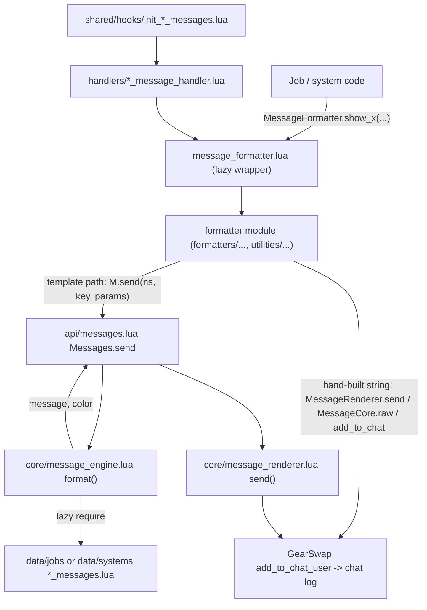
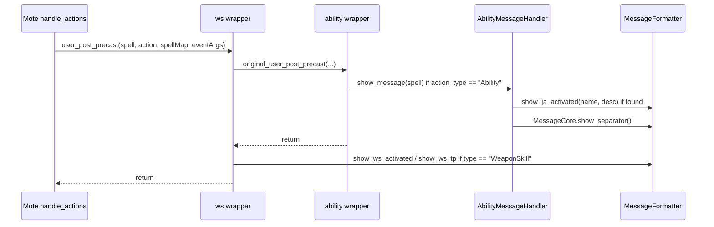
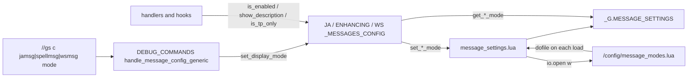

# Message system (core)

Every line this project prints to the FFXI chat log goes through the message system: a facade
(`MessageFormatter`) exposes ~300 `show_*` functions, each forwarding to a formatter module that
either fills a data template through the Messages API (`M.send`) or builds a coloured string by
hand; the template path goes through a template engine and a renderer that finally calls
GearSwap's `add_to_chat`. On top of that, three include-time hooks wrap Mote-Include's
`user_post_precast` / `user_post_midcast` so that every job ability, spell and weapon skill is
announced automatically, with a per-character verbosity (`full` / `on` / `off`) persisted to
`<Char>/config/message_modes.lua` and changed with `//gs c jamsg|spellmsg|wsmsg`.

This page covers the core: facade, API, engine, renderer, colours, job tag, action hooks and
handlers, mode settings, validator. The ~30 formatter modules under
`shared/utils/messages/formatters/` and `utilities/` and the 34 template files under
`shared/utils/messages/data/` are described here only as far as the core contract goes.

## Files

| Path | Lines | Role |
|---|---|---|
| `shared/utils/messages/message_formatter.lua` | 494 | Facade: 296 lazy wrappers `MessageFormatter.show_x -> <module>.show_y`, the `COLORS` proxy, plus `show_debug` |
| `shared/utils/messages/message_core.lua` | 152 | Colour-code builder, job tag, fixed 74-char separator, direct-output helpers (`info/success/error/warning/raw/...`) |
| `shared/utils/messages/message_colors.lua` | 152 | Named FFXI chat colour codes (`SPELL`, `JA`, `ERROR`, ...) and region-dependent orange |
| `shared/utils/messages/message_validator.lua` | 414 | `//gs c msgtests`: static checks of job templates and job formatter exports, writes a JSON and a TXT report |
| `shared/utils/messages/api/messages.lua` | 466 | Messages API (`M.send`, `M.job`, `M.error`, ...), builder, renderer config wrappers, `//gs c testmsg` runner |
| `shared/utils/messages/core/message_engine.lua` | 325 | Namespace loader (data files) + template compiler/cache |
| `shared/utils/messages/core/message_renderer.lua` | 280 | Final output: master toggle, filter level, colour scheme, timestamp, newline split, stats |
| `shared/utils/messages/handlers/ability_message_handler.lua` | 284 | Finds a JA in the per-job JA databases and prints it via `show_ja_activated` |
| `shared/utils/messages/handlers/spell_message_handler.lua` | 323 | Finds a spell in the magic databases and prints it via `show_spell_activated` |
| `shared/hooks/init_ability_messages.lua` | 97 | Wraps `user_post_precast` -> ability handler |
| `shared/hooks/init_spell_messages.lua` | 92 | Wraps `user_post_midcast` -> spell handler |
| `shared/hooks/init_ws_messages.lua` | 138 | Wraps `user_post_precast` -> WS message from `UNIVERSAL_WS_DATABASE` |
| `shared/config/message_settings.lua` | 183 | Loads/saves `<Char>/config/message_modes.lua` into `_G.MESSAGE_SETTINGS` |
| `shared/config/JA_MESSAGES_CONFIG.lua` | 104 | JA mode accessors over `ja_mode` |
| `shared/config/WS_MESSAGES_CONFIG.lua` | 103 | WS mode accessors over `ws_mode` |
| `shared/config/ENHANCING_MESSAGES_CONFIG.lua` | 102 | Spell mode accessors over `spell_mode` |
| `shared/config/ENFEEBLING_MESSAGES_CONFIG.lua` | 102 | Spell mode accessors over the same `spell_mode` |
| `shared/config/message_modes.lua` | 27 | Orphan: nothing loads it (see Known issues) |
| `_master/config_global/message_modes.lua` | 12 | Seed copied by `clone_character.py` to `<Char>/config/message_modes.lua` |

Outside this page but part of the pipeline: formatters (`formatters/{combat,jobs,magic,system,ui}/`,
`utilities/roll_messages.lua`, `utilities/party_messages.lua`), templates
(`data/jobs/*_messages.lua`: 9 files, `data/systems/*_messages.lua`: 25 files, 558 templates in
total), and the command front-ends in `shared/utils/core/COMMON_COMMANDS.lua` and
`shared/utils/core/DEBUG_COMMANDS.lua`. The template files were characterised by loading every one
with `lua5.1` and dumping `{namespace, key, color, template}`; they are pure `return { key = {template=..., color=...} }` tables.

## How it works

### Overview

### 1. Loading and module lifetime

- GearSwap builds a fresh sandbox table `user_env` on every job-file load and sets
  `user_env._G = user_env` (`../refresh.lua:114-149`, GearSwap engine). `require` inside the sandbox is
  `include_user` (`../refresh.lua:132`), which returns `package.loaded[str]` when present but never
  stores into it (`../user_functions.lua:300-333`).
- `shared/utils/core/module_cache.lua` replaces the sandbox `require` with a caching wrapper; it is
  installed near the top of `INIT_SYSTEMS.lua` (`shared/utils/core/INIT_SYSTEMS.lua:47-52`). Before
  that point every `require` re-executes the file; after it, each message module is executed once per
  sandbox. The cache lives on the sandbox `_G`, so all module-local state in this page (engine caches,
  renderer config and stats, handler DB caches, duplicate-suppression timestamps) is rebuilt on every
  `gs reload`, main-job change and `//lua reload gearswap`. A subjob change is first handled inside
  the same sandbox (Mote `sub_job_change` -> `user_setup`), then JobChangeManager sends `gs reload`
  0.5 s later (`shared/utils/core/job_change_manager.lua:150-179`), which rebuilds it as well. Zoning
  does not reload the file, so the state survives a zone change.
- The facade does not load anything at require time: each target module is required the first time
  one of its wrappers is called (`message_formatter.lua:9-113`). `api/messages.lua` also loads the
  engine and renderer lazily (`api/messages.lua:20-35`).
- `message_colors.lua` is the exception: it evaluates the region orange when first executed
  (`message_colors.lua:30`, `:86`), and `message_engine.lua` requires it at load and freezes the
  `orange` / `warningcolor` tags (`core/message_engine.lua:17`, `:55`, `:65`). See "Colours".

Entry files (`_master/entry/Tetsouo_<JOB>.lua`, e.g. `Tetsouo_WAR.lua:82-109`) include, in order:
`Mote-Include.lua`, `INIT_SYSTEMS.lua`, `data_loader`, then `init_spell_messages.lua`,
`init_ability_messages.lua`, `init_ws_messages.lua`. All 15 `_master/entry` templates, the 4
`_master/Kaories/entry` overlays and every live `Tetsouo/` and `Kaories/` entry file (including the
live-only `Tetsouo/Tetsouo_SMN.lua:57-63`) include the three hooks.

### 2. The facade (`message_formatter.lua`)

Every public name is a one-line forwarder:
`MessageFormatter.show_x = function(...) return get_Module().show_y(...) end`. Groups and the
module each group forwards to:

| Lines | Group | Target module |
|---|---|---|
| 118-125 | `COLORS` proxy, `convert_key_display`, `show_separator`, `get_job_tag` | `message_core.lua` |
| 130-135, 152-155 | `show_ja_*`, legacy `*_new` BRD names | `formatters/combat/message_ja_buffs.lua` |
| 138-147 | `show_song_*` | `formatters/magic/message_songs.lua` |
| 158-162 | keybind list/errors | `formatters/ui/message_keybinds.lua` |
| 165-170 | system intro, colour test | `formatters/system/message_system.lua` |
| 173-179 | `show_error/warning/success/info/state_display/tp_*` | `formatters/ui/message_status.lua` |
| 182-196 | cooldowns, `get_*_recast_seconds` | `formatters/combat/message_cooldowns.lua` |
| 199-213 | range/WS/target errors, WS TP, spell/JA/waltz/jump | `formatters/combat/message_combat.lua` |
| 216 | `show_buff_status` | `formatters/magic/message_buffs.lua` |
| 219-225 | checksets output | `formatters/system/message_equipment.lua` |
| 228-235 | debuff blocking (PrecastGuard) | `formatters/magic/message_debuffs.lua` |
| 238-251 | COR rolls, party list | `utilities/roll_messages.lua`, `utilities/party_messages.lua` |
| 254-483 | job groups BRD, RDM, GEO, BLM, BST (both `show_bst_*` and unprefixed names), COR, DRG, WHM | `formatters/jobs/message_<job>.lua` |
| 488-492 | `show_debug(prefix, message)` | direct `MessageRenderer.send('[prefix] message', 8)` |

A wrapper whose target function does not exist only fails when called (`attempt to call field ...`).
163 of the 296 wrappers have no caller anywhere in `shared/`, `_master/`, `Tetsouo/`, `Kaories/`
(checked by name, including string dispatch); 6 RDM wrappers point to functions that
`message_rdm.lua` does not define (Known issues).

### 3. Formatters: three output styles

1. **Template path** (the majority): the formatter calls `M.send('NS', 'key', params)` or
   `M.job('JOB', 'key', params)`. A static cross-check of the 496 call sites with a literal namespace
   and key against the dumped templates found every template parameter supplied by the literal
   params table, and one unknown key (`BRD.dummy_cast`, commented out in
   `data/jobs/brd_messages.lua:144`, reached only through the dead `show_dummy_cast`). 22 more call
   sites build the key at runtime (e.g. `message_combat.lua:415`, `message_commands.lua:357`) and were
   not checked.
2. **Hand-built string through the renderer**: the formatter concatenates
   `MessageCore.create_color_code(n)` codes and calls `MessageRenderer.send(...)` (message_cooldowns,
   message_debuffs, message_warp, message_alt_commands, message_rdm_midcast, message_keybinds). 105 of
   these call sites pass the arguments in the order `(color, message)` although the signature is
   `(message, color, options)` (Known issues).
3. **Direct output**: `MessageCore.raw(msg)` (roll_messages, whm_message_formatter) or `add_to_chat`
   (message_commands, message_ui, message_warp, message_info, message_equipment, message_watchdog,
   party_messages). These bypass the renderer: the master toggle, colour scheme and stats do not apply.

### 4. Messages API: `Messages.send` (`api/messages.lua:49-79`)

1. `params` and `options` default to `{}`.
2. `MessageEngine.format(namespace, key, params)` runs inside `pcall` (`:54-56`). Any error (unknown
   namespace file, unknown key, missing `template`, missing parameter) is reported by
   `MessageRenderer.show_error("Failed to format message NS.key: <error>")`, which prints
   `[MessageSystem ERROR] ...` in colour 167 and increments the error counter; `send` returns
   `false, 0`.
3. The visible length is computed by stripping every `0x1F`+byte pair (`:69-70`).
4. `options.namespace = namespace` is added for statistics, then
   `MessageRenderer.send(message, color, options)`.
5. Returns `true, visible_length`. `show_ja_activated` and `show_spell_activated` propagate this
   length; the handlers add 2 and pass it to `MessageCore.show_separator`, which ignores it and always
   prints 74 `=` (`message_core.lua:41-47`).

`M.job(job, key, params)` is `send(job, key, params)`. `M.error(msg)` goes through
`Messages.system('error', msg)`, which bypasses the engine and sends `"[SYSTEM] " .. msg` in a fixed
colour (`error=167, warning=200, info=122, success=158, debug=8`) with `level` 2/1/0
(`:117-132`).

### 5. Engine (`core/message_engine.lua`)

**Namespace resolution** (`:178-218`): a namespace that is exactly 3 characters and already
upper-case loads `shared/utils/messages/data/jobs/<ns:lower()>_messages`; anything else loads
`shared/utils/messages/data/systems/<ns:lower()>_messages`. So `'RUN'` is a job file,
`'BLM_MIDCAST'`, `'UI'`, `'JA_BUFFS'` are system files. A load failure or non-table result raises an
error (caught by `Messages.send`). Loaded tables are cached in `_message_data[namespace]` keyed by the
exact string passed (so `'combat'` and `'COMBAT'` are cached twice).

**Template syntax** (`compile_template`, `:77-169`):

- `{name}` where `name` matches `[%w_]+`. If `name` is a key of `COLOR_CODES` it becomes the inline
  colour code `string.char(0x1F, code)`; otherwise it is a parameter.
- Parameters are replaced with `tostring(params[name])`. A `nil` value raises
  `MessageEngine: Missing parameter '<name>' in template`; `false` prints `false`.
- A parameter can never be named like a colour: `{dark}`, `{divine}`, `{enhancing}`, `{blue}` etc.
  are always colours. Commit `d52ddc2` renamed `{spell}`, `{item}`, `{warning}`, `{separator}` to
  `{spellcolor}`, `{itemcolor}`, `{warningcolor}`, `{separatorcolor}` for this reason.
- `{/}` is not supported although the comment at `:74-75` says it is: `close_start/close_end`
  (`:90`) are computed and never used, and `{/}` does not match `[%w_]+`, so it would be printed
  literally. No template uses it.
- Compiled closures are cached by template string in `_template_cache`.

**Colour tags** (`:36-66`):

| Tag | Code | Tag | Code |
|---|---|---|---|
| `cyan`, `spellcolor` | 13 | `green` | 158 |
| `lightblue`, `jobtag` | 207 | `red` | 167 |
| `white` | 1 | `yellow` | 50 |
| `gray`, `separatorcolor` | 160 | `pink` | 11 |
| `darkgray` | 8 | `healgreen` | 6 |
| `enhancing` | 206 | `enfeebling` | 4 |
| `divine` | 22 | `dark` | 15 |
| `bluemagic` | 219 | `blue` | 122 |
| `purple` | 208 | `itemcolor` | 63 |
| `orange`, `warningcolor` | region orange at engine load | | |

`cyan` moved from 205 to 13 in `d52ddc2` ("user preference"); `MessageColors.SPELL` is still 205, so
templates and hand-built formatters do not use the same "spell" colour.

`format()` (`:229-265`) returns `message, template.color or 1`. Its fallback
`return "[ERROR] Failed to load ..."` (`:235-237`) is unreachable because `load()` raises instead of
returning `false`.

### 6. Renderer (`core/message_renderer.lua`)

`MessageRenderer.send(message, color, options)` (`:86-140`):

1. Returns if `_config.enabled` is false (master toggle) or `options.level < _config.filter_level`.
2. If `_config.color_mode ~= "normal"`, remaps the base colour through `COLOR_SCHEMES`
   (`colorblind`, `monochrome`; only codes 1, 8, 122, 158, 167, 200 are mapped, `:152-159`).
   Inline `0x1F` codes inside the string are not touched.
3. `message = tostring(message)`; prefixes `[HH:MM:SS]` if `_config.timestamp`.
4. If the message contains `\n`, splits it with `gmatch("[^\n]+")` and calls `add_to_chat(color, line)`
   per line; empty lines are dropped, which is why templates use `"\n \n"` for a blank line. Each line
   restarts with the base colour, so multi-line templates start every line with its own colour tag.
5. Updates `_stats` (`total_sent`, `by_namespace`, `by_color`).

`configure`, `toggle`, `set_filter_level`, `set_color_mode`, `toggle_timestamp`, `show_stats`,
`reset_stats` exist and are wrapped by `Messages.*`, but nothing in the repository calls them: in
practice the renderer always runs with `enabled=true, filter_level=0, color_mode="normal",
timestamp=false`.

`add_to_chat` here is GearSwap's `add_to_chat_user` (`../user_functions.lua:383-399`): when the first
argument is a string it prints the second argument if that is not numeric, otherwise the first, and
forces colour 8. The swapped `(color, message)` calls in the formatters print only because of that
branch (Known issues).

### 7. Colours (`message_colors.lua`) and region orange

Flat constants (`:70-104`): `SPELL=205`, `JA=50`, `WS=50`, `ITEM_COLOR=211`, `SEPARATOR=GRAY=160`,
`JOB_TAG=HEADER=INFO_HEADER=207`, `INFO=158`, `SUCCESS=READY=ACTIVE=158`, `ERROR=BLOCKED=RANGE_ERROR=167`,
`DEBUFF=208`, `COOLDOWN=125`, `WS_BLOCKED=200`, `TP_NORMAL=1`, `TP_ENHANCED=207`, `TP_ULTIMATE=158`,
`TP_LABEL=160`, `SYSTEM_LOADED=207`, `KEYBIND_KEY=158`, `KEYBIND_DESC=160`, and
`WARNING = get_region_orange()` evaluated once at load. Helpers: `get_tp_color(tp)` (>=3000 -> 158,
>=2000 -> 207, else 1), `get_warning_color()` (re-evaluates), `get_action_color(type)` (no caller).
`MessageCore.COLORS` is this table; `MessageFormatter.COLORS` is an empty proxy table with an
`__index` to it (no caller; `pairs()` on it yields nothing).

`get_region_orange()` (`:38-63`), in order:
1. `_G.ORANGE_COLOR_CODE` - nothing in the repository writes it.
2. `_G.DETECTED_FFXI_REGION` (`"EU"` -> 3, else 57) - nothing writes it either; the
   `//gs c setregion` command that did lost its dispatch in `95b4ae3` and its handler in `868a64d`.
3. `RegionConfig.get_orange_code(RegionConfig.get_region(player.name))`, where `RegionConfig` is
   `_G.RegionConfig` captured when `message_colors.lua` first executes (`:30`). Live values:
   `Tetsouo/config/REGION_CONFIG.lua` maps EU to 3, `Kaories/config/REGION_CONFIG.lua` maps EU to 2.
4. Default 57.

Load-order dependency: `_G.RegionConfig` must be set before the first post-ModuleCache execution of
`message_colors.lua`, otherwise that sandbox keeps orange 57. 13 of 15 `_master/entry` templates set it
at file top level (e.g. `_master/entry/Tetsouo_WAR.lua:43-47`); `Tetsouo_COR.lua:180` and
`Tetsouo_SAM.lua:70` (and the Kaories COR overlay) set it inside `get_sets()` after
`INIT_SYSTEMS.lua`.

### 8. Job tag

`MessageCore.get_job_tag()` (`message_core.lua:51-62`) returns `"MAIN/SUB"` from GearSwap's `player`
table, `"MAIN"` when `sub_job` is nil, `""` or `"NON"`, and `"JOB"` when `player` is nil. It is the
tag formatters pass as `{job}` / `{job_tag}`. `message_blm/brd/bst/geo/rdm.lua` each carry an
identical private copy whose fallback is the job's own code (Known issues).

### 9. Automatic JA / spell / WS messages (hooks and handlers)

Mote-Include's `handle_actions` (`../libs/Mote-Include.lua:227-283`) calls, per action,
`user_<action>` -> `job_<action>` -> `default_<action>` -> `user_post_<action>` -> `job_post_<action>`,
and skips `user_post_*` when `eventArgs.cancel` is set (`:269`). The hooks install themselves as
`user_post_precast` / `user_post_midcast`, so an action cancelled by PrecastGuard, CooldownChecker or
WSPrecastHandler in `job_precast` prints no announcement, and the announcement is printed before
`job_post_precast` / `job_post_midcast` run.

Each hook file is `include()`d, saves the current global (`original_user_post_*`), defines a wrapper
that calls the original first, then re-exports the wrapper to `_G`. Because GearSwap rebuilds
`_G` on every load, the saved original is `nil` for the first wrapper of each load: the chain is
exactly `ws_wrapper -> ability_wrapper` for precast and `spell_wrapper` for midcast. There is
intentionally no idempotence guard: a guard stored outside `_G` would stop the re-wrap on the fresh
`_G` after a reload. Each include increments `windower._hook_wraps.{ability,ws,midcast}`; together with
`windower._gs_reload_count` (`INIT_SYSTEMS.lua:38`) this feeds the "Hook Chain" line of
`//gs c syscheck` (`shared/utils/debug/system_checker.lua:71-97`), which fails above 1.1 wraps per
reload.

**Ability wrapper** (`init_ability_messages.lua:79-94`): for `spell.action_type == 'Ability'`,
lazy-requires the handler (`:42-61`, timing reported via `show_debug('PERF', ...)` when
`_G.PERFORMANCE_PROFILING.enabled`) and calls `AbilityMessageHandler.show_message(spell)`.
GearSwap gives `action_type = 'Ability'` to `/ja`, `/pet`, `/bstpet`, `/ms` and `/ws` commands
(`../statics.lua:33-35`), so weapon skills, blood pacts and ready moves also reach this handler;
it returns at once for weapon skills and sends blood pacts to the SMN database (below).

`AbilityMessageHandler.show_message(spell, show_separator)` (`ability_message_handler.lua:215-278`):
1. Returns unless `action_type == 'Ability'`; returns for `type == 'WeaponSkill'` (the WS wrapper
   prints those, `:221-225`); skips `type == 'CorsairRoll'` (roll tracker prints its own) and
   `name == 'Pianissimo'` (BRD prints its own with the target).
2. Returns when `JA_MESSAGES_CONFIG.is_enabled()` is false (`ja_mode` off).
3. `find_ability_in_databases(name, spell.type)` (`:150-186`):
   - `BloodPactRage` / `BloodPactWard` go straight to `shared/data/magic/SMN_SPELL_DATABASE`
     (`find_blood_pact`, `:130-143`; accepted when `category` is `Blood Pact: Rage/Ward`).
   - Otherwise the caster's main and sub job databases from `windower.ffxi.get_player()`.
   - Then, only for the types that have records in the JA databases (`DATABASE_TYPES`, `:94-98`:
     JobAbility, Scholar, Rune, Ward, Effusion, Waltz, Samba, Step, Jig, Flourish1-3), every job in
     `JOBS` (21 codes, `:67-71`). Ready moves (`Monster`), Quick Draw shots (`CorsairShot`) and
     SMN/PUP/DRG pet commands (`PetCommand`) are in none of them and stop after main/sub; BST's own
     pet commands are in the BST database.
   Each JA database is `shared/data/job_abilities/<JOB>_JA_DATABASE` (a `JA_DATABASE_FACTORY.create`
   wrapper that merges 3+ sub-files) and is memoised in `JOB_DATABASES` (`false` on failure).
4. Not found -> silent return.
5. `description` only when `show_description()` (`ja_mode == 'full'`).
6. Duplicate suppression: the same `spell.name` within 0.5 s (`os.clock()`) is skipped (`:257-266`).
7. `MessageFormatter.show_ja_activated(name, description)` -> template `JA_BUFFS.activated_full`
   or `activated_name_only`, then a separator unless `show_separator == false` (no caller passes it).

**Spell wrapper** (`init_spell_messages.lua:74-89`): for `action_type == 'Magic'`, calls
`SpellMessageHandler.show_message(spell)` (`spell_message_handler.lua:250-317`):
1. `handles()` (`:220-247`) rejects non-Magic actions and `skill == 'Geomancy'` / `'Singing'`
   (GEO and BRD print their own from their midcast code). The `BloodPactRage/BloodPactWard` entries
   in `valid_action_types` are never reached: the hook only forwards `Magic`, and GearSwap gives
   blood pacts `action_type = 'Ability'`.
2. Returns before any database is loaded when both `ENFEEBLING_MESSAGES_CONFIG.is_enabled()` and
   `ENHANCING_MESSAGES_CONFIG.is_enabled()` are false (`spellmsg off`, `:255-261`).
3. `find_spell_in_databases(spell)` (`:147-176`): fast path `SKILL_PATH[spell.skill]` (one
   database). A spell whose skill has no `SKILL_PATH` entry, or `type == 'Trust'` (GearSwap reports
   `skill = '(N/A)'` for Trusts), stops there (`:159-163`): in `res/spells.lua` only Trusts have such
   a skill. Otherwise `FALLBACK_DATABASES` in order (skill databases, then RDM, WHM, BLM, GEO, BRD,
   SCH, BLU, SMN). Memoised per path in `db_cache`. A miss on the fast path loads databases until a
   hit, or all 15 when nothing matches: `Dispelga` and the other castable spells with no record
   anywhere, and the Helix spells (skill Elemental, stored in the SCH database, 13 of the 15 files
   loaded) take that path (Known issues).
4. The config is chosen by the database entry's `category`: `'Enfeebling'` ->
   `ENFEEBLING_MESSAGES_CONFIG`, anything else -> `ENHANCING_MESSAGES_CONFIG`. Both read
   `spell_mode`, so the split has no effect on behaviour.
5. `describe_target(spell.target)` (`:192-211`): party/alliance or charmed -> `PLAYER`,
   `spawn_type == 16` -> `MONSTER`, `spawn_type == 2` or `is_npc` -> `NPC`, else `target.type`, else
   `MONSTER`.
6. `MessageFormatter.show_spell_activated(english, description, target_name, skill, element,
   target_type)` then separator.

**WS wrapper** (`init_ws_messages.lua:95-135`), for `spell.type == 'WeaponSkill'`:
1. Lazy-loads `MessageFormatter`, `WS_MESSAGES_CONFIG` and
   `shared/data/weaponskills/UNIVERSAL_WS_DATABASE` (`:45-77`; the module loads no WS file by itself).
2. Needs `WS_MESSAGES_CONFIG.is_enabled()`, `not eventArgs.cancel`, and
   `windower.ffxi.get_player().vitals.tp >= 1000`.
3. `full`: resolves the WS with `UniversalWS.resolve(spell.english, spell.skill)` (`:122-129`).
   `spell.skill` is the weaponskill's own skill (`Sword`, `Marksmanship`, ...), not the main hand's,
   and `resolve` loads only that skill's file (`UNIVERSAL_WS_DATABASE.lua:136-143`). A WS missing from
   its file (Atonement), or of a skill with no file (Marksmanship, Throwing: Leaden Salute, Wildfire,
   Last Stand), returns nil without merging the others. A hit -> `show_ws_activated(name,
   description, tp)`; no hit prints nothing.
4. `on` (or `tp`, `tp_only`) -> `show_ws_tp(name, tp)` without reading any database (`:130-133`).

### 10. Message modes

- `message_settings.lua` runs at its first `require` in a sandbox (first JA/spell/WS, first
  `jamsg|spellmsg|wsmsg`, or first load of `message_ja_buffs.lua`). It `dofile`s
  `windower.addon_path .. 'data/' .. player.name .. '/config/message_modes.lua'` (`:36-58`; falls back to
  `Tetsouo` when `player.name` is nil). A table result replaces `_G.MESSAGE_SETTINGS`. With no file and
  no global it creates `{spell_mode='on', ja_mode='on', ws_mode='on'}` and writes the file (`:95-109`).
- Keys: `spell_mode` (every spell category, Enfeebling included), `ja_mode`, `ws_mode`. Values:
  `full`, `on`, `off` (the commands only ever write these three; the config modules also accept
  `name_only`, `name`, `disabled`, `disable`, and WS `tp_only`, `tp`).
- Every setter writes the whole file (`:62-87`). Getters default to `'on'` for a missing key.
- The four `*_MESSAGES_CONFIG` modules are identical apart from the key: `display_mode` (snapshot
  taken at load, updated by `set_display_mode`), `VALID_MODES`, `is_enabled()` (not
  `off/disabled/disable`), `show_description()` (`== 'full'`), `is_name_only()` (JA/ENH/ENF, no
  caller) or `is_tp_only()` (WS), `set_display_mode(mode)`. The predicates read
  `MessageSettings` on every call, so a mode change applies to the next action without reload.
- Seeds: `_master/config_global/message_modes.lua` (`ja_mode='full'`, others `'on'`) is copied to
  `<Char>/config/` by `clone_character.py:641-655`. `shared/config/message_modes.lua` is never read.

### 11. Validator (`//gs c msgtests`)

`MessageValidator.run_all_tests()` (`message_validator.lua:258-282`) resets its counters, then for
BLM, BRD, BST, COR, DRG, GEO, RDM, WHM (`:40-42`; RUN and all system namespaces are not covered):
- loads `data/jobs/<job>_messages` and checks every entry has `template` and `color` and that every
  `{tag}` is in `VALID_COLORS` (9 names), `COMMON_PARAMS`, or ends in `_color`, `_text`, `_name`;
- loads `formatters/jobs/message_<job>` and checks every function starts with `show_` and exists as
  `MessageFormatter[name]`.
It prints results with `print`, and always writes `data/message_validation.json` and
`data/message_validation.txt` under `windower.addon_path`. The export check is why BST has both
`show_bst_*` and unprefixed facade names (`message_formatter.lua:425`). On the current tree the run
reports 13 failures: 12 valid templates flagged because their parameters (`instrument`, `hp`, `jug`,
`tp`, `max`, `module`, `potency`) are not whitelisted, and `BRDMessages.show_song_cast_generic` not exported.

## Public API

### MessageFormatter (`shared/utils/messages/message_formatter.lua`)
296 forwarders (see section 2) plus:

| Function | Notes |
|---|---|
| `show_debug(prefix, message)` | `MessageRenderer.send('[prefix] message', 8)`. 91 call sites. |
| `get_job_tag()` | -> `MessageCore.get_job_tag()` |
| `show_separator(len)` | -> `MessageCore.show_separator` (length ignored) |
| `show_error(message)`, `show_warning`, `show_success`, `show_info` | ONE argument; templates `STATUS.error` ("Error: {message}", 167), `warning` (200), `success` (158), `info` (1) |
| `show_ja_activated(name, desc)` | returns visible length; respects `ja_mode` itself (`message_ja_buffs.lua:53-79`) |
| `show_spell_activated(name, desc, target, skill, element, target_type)` | returns visible length |
| `show_ws_activated(name, desc, tp)`, `show_ws_tp(name, tp)` | used only by the WS hook |
| `show_ability_cooldown(name, seconds, job)`, `show_spell_cooldown(name, centiseconds, job)`, `show_multi_status(messages, job)` | CooldownChecker / PrecastGuard output |

### MessageCore (`message_core.lua`)
| Function | Behaviour | Callers |
|---|---|---|
| `create_color_code(n)` | `string.char(0x1F, n)`; raises on non-number | 175 call sites |
| `convert_key_display(key)` | `!`->`ALT+`, `^`->`CTRL+`, `~`->`SHIFT+`, `@`->`WIN+`, `fN`->`FN`, upper-cased | 3 (+ facade) |
| `show_separator(len)` | `add_to_chat(1, gray .. 74 '=')` | 4 (both handlers included) |
| `get_job_tag()` | section 8 | 44 |
| `info/success/error/warning(msg)` | `add_to_chat(121/158/167/205, "[JOB/SUB] msg")` | 4 / 0 / 15 / 3 |
| `raw(message)` | `add_to_chat(1, message)`; ONE argument | 20 (roll_messages, whm_message_formatter) |
| `show_lockstyle_status`, `show_automove_error`, `show_config_error(module, msg)`, `show_ui_error`, `show_ui_info`, `show_test_mode` | fixed-colour `add_to_chat` | 1 / 1 / 2 / 1 / 1 / 4 |

### Messages API (`api/messages.lua`)
| Function | Notes | Callers |
|---|---|---|
| `send(ns, key, params, options)` | section 4; returns `ok, visible_length` | 361 sites (formatters, `WAR_COMMANDS.lua:200`, profiler) |
| `job(job, key, params)` | alias of `send` | 148 sites (job formatters) |
| `error(msg)` | `[SYSTEM] msg`, colour 167 | `message_brd.lua:361`, `message_geo.lua:95-136` |
| `test(job_filter)` | `//gs c testmsg` | `COMMON_COMMANDS.lua:638` |
| `combat`, `magic`, `ability`, `system`, `warning`, `info`, `success`, `debug`, `custom`, `config`, `get_config`, `toggle`, `set_filter_level`, `set_color_mode`, `toggle_timestamp`, `show_stats`, `reset_stats`, `list`, `get_engine_stats`, `clear_cache`, `help` | work, but no caller in the repository (`system` is used internally by `error`) | none |

### MessageEngine / MessageRenderer
`MessageEngine.format(ns, key, params) -> message, color`, `load(ns)`, `is_loaded(ns)`,
`list_keys(ns)`, `clear_cache()`, `get_stats()`. Only `format` is on a live path.
`MessageRenderer.send(message, color, options)` (called directly by 6 formatter files, `DEBUG_COMMANDS.lua:399-434` and `show_debug`), `show_error(msg)`, `transform_color(color)` plus the unused configuration functions listed in section 6. `COMMON_COMMANDS.lua:6` requires the renderer and never uses it.

### Handlers
`AbilityMessageHandler.show_message(spell, show_separator)` and
`SpellMessageHandler.show_message(spell, show_separator)`; only callers are the hooks.

### MessageSettings and the mode configs
`MessageSettings.get_spell_mode/get_ja_mode/get_ws_mode()`, `get_enhancing_mode/get_enfeebling_mode()`
(both return `spell_mode`), `set_spell_mode/set_ja_mode/set_ws_mode(mode)`,
`set_enhancing_mode/set_enfeebling_mode(mode)` (both write `spell_mode`). Only the four config
modules call them; `COMMON_COMMANDS.lua:621-631` reads `_G.MESSAGE_SETTINGS` directly.

### MessageValidator
`run_all_tests() -> boolean`, `get_stats()`, `export_json(path?)`, `export_txt(path?)`.

## Commands

| Command | Handler | Effect |
|---|---|---|
| `//gs c jamsg [full\|f\|on\|name\|nameonly\|name_only\|n\|off\|disabled\|disable\|d]` | `COMMON_COMMANDS.lua:613` -> `DEBUG_COMMANDS.lua:197` -> `handle_message_config_generic` (`:156-194`) | No argument: shows `JA_MESSAGES_CONFIG.display_mode`. Otherwise normalises to `full/on/off`, `set_display_mode`, writes the settings file. |
| `//gs c spellmsg <same>` | `COMMON_COMMANDS.lua:615` -> `DEBUG_COMMANDS.lua:202` | Same, through `ENHANCING_MESSAGES_CONFIG`; changes `spell_mode`, which also governs Enfeebling. Does not affect BRD songs or Geomancy (their job code prints unconditionally). |
| `//gs c wsmsg <same> \| tp\|tponly\|tp_only\|t` | `COMMON_COMMANDS.lua:617` -> `DEBUG_COMMANDS.lua:207` | Same for `ws_mode`; the `tp` aliases map to `on`. |
| `//gs c debugmsg` | `COMMON_COMMANDS.lua:621-631` | Prints `_G.MESSAGE_SETTINGS` through `show_debug`. Before `message_settings.lua` has been loaded in the current sandbox it prints `Error: MSG` (see Known issues). |
| `//gs c testmsg [job]` / `msgtest` | `COMMON_COMMANDS.lua:632-638` -> `Messages.test` | Runs `shared/utils/messages/api/tests/test_<job>.lua` suites; that directory was deleted in `25dce0c`, so it reports `0/0 PASSED` or "Test file not found". |
| `//gs c msgtests` | `COMMON_COMMANDS.lua:640-644` -> `MessageValidator.run_all_tests()` | Section 11. |

All are listed in `CommonCommands.is_common_command` (`COMMON_COMMANDS.lua:685-686`).

## Configuration

| Source | Keys / values | Default and where it lives |
|---|---|---|
| `<Char>/config/message_modes.lua` (live `Tetsouo/config/`, `Kaories/config/`) | `spell_mode`, `ja_mode`, `ws_mode` in `full/on/off` | `'on'` each (`message_settings.lua:102-106`) when the file is missing; clone seed `_master/config_global/message_modes.lua` has `ja_mode='full'` |
| `<Char>/config/REGION_CONFIG.lua` via `_G.RegionConfig` | `get_region(name)`, `get_orange_code(region)` | orange 57 when absent (`message_colors.lua:62`) |
| `_G.PERFORMANCE_PROFILING.enabled` | prints hook lazy-load time | written by `shared/utils/debug/performance_profiler.lua:73` |
| Renderer `_config` | `enabled`, `filter_level`, `color_mode`, `timestamp`, `prefix_style` (never read) | `message_renderer.lua:20-26`, reset per sandbox |
| Engine `COLOR_CODES`, `MessageColors` constants | hard-coded | see Colours |

## State & lifetime

| State | Where | Lifetime |
|---|---|---|
| `_G.MESSAGE_SETTINGS` | written `message_settings.lua:99,102`, read `:119-166`, `COMMON_COMMANDS.lua:622-626` | per sandbox; reloaded from the file on the first require after each load |
| `_G.MESSAGE_ENGINE_LOADED` | `message_engine.lua:27-31` | per sandbox; the reset branch it guards is a no-op |
| `_G.user_post_precast`, `_G.user_post_midcast` | hook files | re-created on every load |
| `_G.RegionConfig` | read `message_colors.lua:30` | written by entry files |
| `_G.ORANGE_COLOR_CODE`, `_G.DETECTED_FFXI_REGION` | read `message_colors.lua:40-51` | never written |
| `windower._hook_wraps` | `init_*_messages.lua` | stored on GearSwap's persistent `user_windower` proxy (`../user_functions.lua:418-423`): survives `gs reload` and job changes, reset by `//lua reload gearswap` |
| Engine `_template_cache`, `_message_data`; renderer `_config`, `_stats`; handler `JOB_DATABASES`, `db_cache`, `recent_messages`; hook `handler_loaded`/`modules_loaded` | module locals | per sandbox: rebuilt by every reload, including the one JobChangeManager issues after a subjob change; kept across zoning |
| Files written | `<Char>/config/message_modes.lua` (every mode change and first run), `data/message_validation.{json,txt}` (every `msgtests`) | disk |

No event is registered, no coroutine scheduled, no keybind or text object created by any file on
this page, so nothing needs cleanup in `file_unload`.

## Interactions

- Callers of the facade: every job module and most shared systems; the precast pipeline uses
  `show_ability_cooldown`, `show_spell_cooldown`, `show_multi_status`, `show_*_blocked`
  (see [precast-pipeline.md](precast-pipeline.md)); midcast debug uses `MIDCAST`/`PRECAST` templates
  (see [midcast-and-buffs.md](midcast-and-buffs.md)).
- Data consumed: `shared/data/job_abilities/*_JA_DATABASE.lua` (via `JA_DATABASE_FACTORY`),
  `shared/data/magic/*_DATABASE.lua`, `shared/data/weaponskills/UNIVERSAL_WS_DATABASE.lua`
  (`_G.WS_DATABASE`).
- Commands: `COMMON_COMMANDS.lua` / `DEBUG_COMMANDS.lua` (front-ends), `message_commands.lua`
  (their output, allowed to use `add_to_chat` per `.claude/CODE_QUALITY.md` section 6).
- Diagnostics: `system_checker.lua:71-97` reads `windower._hook_wraps`.
- BRD (`shared/jobs/brd/functions/logic/midcast_router.lua:97-139`) and GEO print their own spell
  lines with `show_spell_activated` / `show_indi_cast` / `show_geo_cast` and never consult
  `spell_mode`.

## Invariants & gotchas

- A message whose template references a parameter that the call leaves `nil` is not printed; the
  chat shows `[MessageSystem ERROR] Failed to format message NS.key: ...` instead.
- A parameter name equal to a colour tag is silently treated as a colour.
- Multi-line templates: use `\n`, start each line with a colour tag, use `"\n \n"` for a blank line.
- `MessageFormatter.show_error/show_warning/show_info/show_success` take exactly one string. A second
  argument is ignored.
- `MessageCore.raw` takes one argument (the string); colour is always 1.
- `MessageRenderer.send` takes `(message, color, options)`.
- `MessageCore.*` direct helpers, `show_separator`, `raw`, and formatters that call `add_to_chat` are
  not affected by the renderer toggle, colour scheme or stats.
- Announcements come from `user_post_precast`/`user_post_midcast`: an action cancelled with
  `eventArgs.cancel` before that point prints nothing; an action cancelled later (in `job_post_*`) has
  already been announced.
- Weapon skills are `action_type == 'Ability'` in GearSwap, so the ability handler runs for every WS
  before the WS hook prints (it finds nothing and returns).
- Namespace strings are case-sensitive cache keys; 3-letter all-caps namespaces are always job files.
- The spell-mode split (Enhancing vs Enfeebling config) is cosmetic: both read `spell_mode`.

## Extending

**Add a templated message**
1. Add `key = { template = "...", color = N }` to `shared/utils/messages/data/jobs/<job>_messages.lua`
   (3-letter job namespace) or `data/systems/<name>_messages.lua` (any other namespace; file name is
   the lower-cased namespace + `_messages.lua`). Use only engine colour tags (section 5).
2. Add a `show_*` function to the matching formatter that calls `M.send('NS', 'key', { ... })` (or
   `M.job`) and supplies every parameter with a non-nil value (use `tostring` for numbers you format).
3. Expose it in `message_formatter.lua` next to its group:
   `MessageFormatter.show_x = function(...) return get_Module().show_x(...) end`; for a new formatter
   module add a lazy getter in the same style as `:9-113`.
4. For the 8 validated jobs, the function name must start with `show_`, the facade must export the same
   name, and every parameter must be in `COMMON_PARAMS` or end in `_color/_text/_name`, or
   `//gs c msgtests` reports a failure.
5. Call it through `MessageFormatter.show_x(...)`.

**Add a new namespace**: create `data/systems/<ns>_messages.lua` returning a table; avoid 3-letter
all-caps names, which route to `data/jobs/`.

**Add a new auto-announced action type**: write a hook file in `shared/hooks/` following the same
wrap-and-reexport pattern (save `_G.user_post_<action>`, call it first, re-export), include it from
every entry template in `_master/entry/` and `_master/Kaories/entry/`, and do not add an idempotence
guard.

**Add a new mode key**: add the key to `message_settings.lua` (getter, setter, `save_to_file`
format), a `*_MESSAGES_CONFIG.lua` module, a row in `DEBUG_COMMANDS.lua` `MSG_CONFIG_MAP`, the six
`MessageCommands.show_<prefix>_*` functions and their `COMMANDS` templates, and the command name in
`COMMON_COMMANDS.lua` (dispatch and `is_common_command`).

## Known issues

- The first SMN job ability after each load (Apogee, Astral Conduit, Mana Cede, Elemental Siphon, Astral Flow) walks all 21 JA databases: SMN has no JA database and those abilities are type `JobAbility`: `shared/utils/messages/handlers/ability_message_handler.lua:173-184`.
- The first cast after each load of a spell with no record anywhere (Dispelga, Virus, Curse, Diaga II/III, Banishga III, Banish IV, Meteor II, the -ga enfeebles, Chocobo Hum, Cactuar Fugue, some Ninjutsu San/Ni) loads all 15 magic databases, and a first Helix loads 13: `shared/utils/messages/handlers/spell_message_handler.lua:165-173`.
- 105 `MessageRenderer.send(color, message)` calls with swapped arguments (colour forced to 8, no newline split, text lost with timestamps): `shared/utils/messages/core/message_renderer.lua:86`, e.g. `formatters/combat/message_cooldowns.lua:146`, `formatters/jobs/message_rdm_midcast.lua:38-102`.
- `show_error(prefix, message)` calls lose the message: `shared/utils/core/COMMON_COMMANDS.lua:629`, `shared/utils/core/DEBUG_COMMANDS.lua:446`; `.claude/CODE_QUALITY.md:324-325` documents two-argument `show_error` and `MessageCore.raw`.
- 163 facade wrappers without caller, 6 of them pointing at undefined RDM functions: `shared/utils/messages/message_formatter.lua:303-308`.
- `//gs c testmsg` runs no test (suites deleted) and reports success: `shared/utils/messages/api/messages.lua:370-429`.
- `//gs c msgtests` validator whitelist out of date, fails on valid templates: `shared/utils/messages/message_validator.lua:27-63`.
- `//gs c setregion` advertised but not implemented; region overrides 1-2 dead: `shared/utils/messages/message_colors.lua:18,39-51`.
- `spellmsg` help says it covers BRD/GEO and not Enfeebling; the code does the opposite: `shared/utils/messages/data/systems/commands_messages.lua:261`.
- Engine: `{/}` documented but unimplemented, no-op cache reset with a false comment, unreachable fallback: `shared/utils/messages/core/message_engine.lua:20-31,74-75,90,235-237`.
- WS `full` mode prints nothing for a WS missing from the database, and the TP gate reuses the lagged TP value: `shared/hooks/init_ws_messages.lua:118,122-129`.
- Job-tag helper duplicated in five job formatters: `shared/utils/messages/message_core.lua:51`.
- Four near-identical mode config modules whose headers name the wrong settings path: `shared/config/JA_MESSAGES_CONFIG.lua:22` (and WS/ENHANCING/ENFEEBLING).
- `shared/config/message_modes.lua` is loaded by nothing: `shared/config/message_modes.lua:1`.
- Unused API surface: 20 `Messages.*` configuration/stat/builder functions, the renderer configuration functions they wrap, `MessageCore.success`, `MessageColors.get_action_color`, `MessageFormatter.COLORS`, the configs' `is_name_only`: `shared/utils/messages/api/messages.lua:96-339`.
- Unreachable spell-handler branches (`BloodPactRage/Ward`, `SKILL_PATH` Singing/Geomancy) and an orphaned doc comment: `shared/utils/messages/handlers/spell_message_handler.lua:182-183,226-230,79-80`.
- User guide describes `debugmsg` as a toggle: `docs/user/guides/commands.md:154`.
