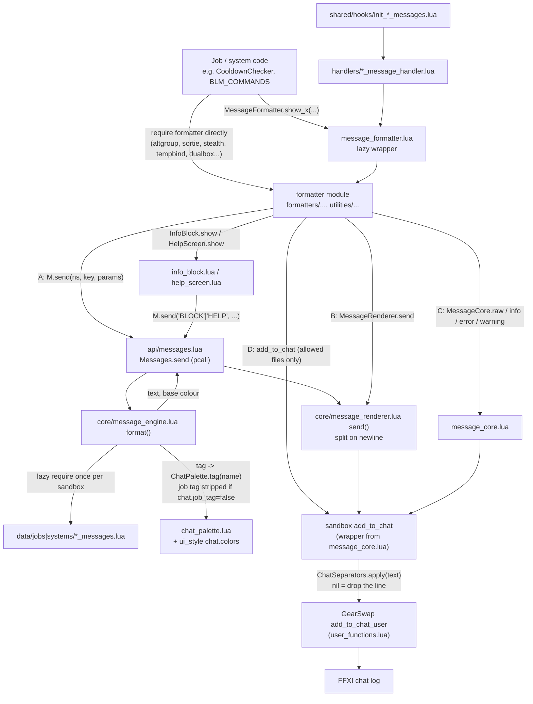
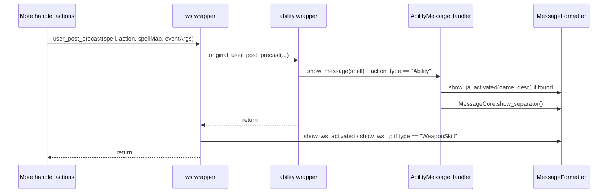
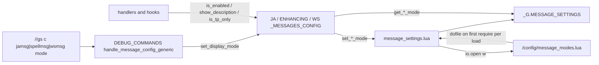

# Message system (core)

Every line this project prints to the FFXI chat log goes through the message system. Game code
calls a `MessageFormatter.show_*` facade function (or requires a formatter module directly); the
formatter either fills a data template through the Messages API (`M.send`) or builds a coloured
string itself; the template path runs through a template engine (colour tags resolved against the
player's palette, optional job-tag stripping) and a renderer; every path ends in the sandbox
`add_to_chat`, which this project wraps once per load so the player's separator options apply to
every chat line, whoever wrote it. Two shared renderers give multi-line output one look:
`InfoBlock` for data blocks (status, stats, cards) and `HelpScreen` for help screens. On top of
that, three include-time hooks wrap Mote-Include's `user_post_precast` / `user_post_midcast` so
that every job ability, spell and weapon skill is announced automatically, with a per-character
verbosity (`full` / `on` / `off`) persisted to `<Char>/config/message_modes.lua` and changed with
`//gs c jamsg|spellmsg|wsmsg`.

This page covers the core: facade, API, engine, renderer, colours and palette, chat options (width,
separators, job tag, colour overrides), the chat-line filter, `InfoBlock`, `HelpScreen`, action
hooks and handlers, mode settings, validator, and the allowed direct `add_to_chat` calls. The 37
formatter modules (35 under `shared/utils/messages/formatters/`, 2 under `utilities/`) are documented in
[messages-formatters.md](messages-formatters.md); the template files under
`shared/utils/messages/data/` in [messages-catalog.md](messages-catalog.md); the HUD and the
`//gs c ui` commands that set the chat options in [ui-overlay.md](ui-overlay.md).

Figures on this page were measured on 2026-09-28 (`wc -l`, `grep -r` over `shared/`, `_master/`
and the gitignored live folders `Tetsouo/`, `Kaories/`; ripgrep skips the live folders, `grep -r`
does not).

## Files

| Path | Lines | Role |
|---|---|---|
| `shared/utils/messages/message_formatter.lua` | 480 | Facade: 271 lazy one-line wrappers `MessageFormatter.show_x -> <module>.show_y`, the `COLORS` proxy, `show_debug` |
| `shared/utils/messages/message_core.lua` | 196 | Colour-code builder, job tag and job prefix, `SEPARATOR_WIDTH` (player's `chat.width` or 69), separator line, direct-output helpers (`info/success/error/warning/raw/...`); installs the chat-line filter on the sandbox `add_to_chat` |
| `shared/utils/messages/chat_separators.lua` | 145 | `ChatSeparators.apply(text)`: redraws or drops separator lines and framed titles according to the player's `chat` options; called for every chat line by the wrapper in `message_core.lua` |
| `shared/utils/messages/chat_palette.lua` | 113 | Named chat colours (template tags) with the player's `chat.colors` overrides, alias rules, job-tag switch and `strip_job_tag` |
| `shared/utils/messages/message_colors.lua` | 227 | Named colour constants (`SUCCESS`, `ERROR`, `WARNING`...) resolved at each read through the player's overrides; region-dependent orange; `//gs c trace` probe of the orange |
| `shared/utils/messages/info_block.lua` | 134 | `InfoBlock`: one renderer for data blocks (`TAG :: title`, aligned `Label : value` fields), namespace `BLOCK` |
| `shared/utils/messages/help_screen.lua` | 178 | `HelpScreen`: one renderer for help screens (groups, dot-leader rows, notes), namespace `HELP` |
| `shared/utils/messages/api/messages.lua` | 456 | Messages API (`send`, `job`, `error`...), builder, renderer configuration wrappers, `//gs c testmsg` runner |
| `shared/utils/messages/core/message_engine.lua` | 338 | Namespace loader (data files) and template compiler/cache; colour tags resolved through `ChatPalette` at render |
| `shared/utils/messages/core/message_renderer.lua` | 255 | Final template-path output: master toggle, filter level, colour scheme, timestamp, newline split, statistics |
| `shared/utils/messages/message_validator.lua` | 417 | `//gs c msgtests`: static checks of job templates and job formatter exports, JSON and TXT reports |
| `shared/utils/messages/handlers/ability_message_handler.lua` | 284 | Finds a JA in the per-job JA databases (or a Blood Pact in the SMN database) and prints it via `show_ja_activated` |
| `shared/utils/messages/handlers/spell_message_handler.lua` | 315 | Finds a spell in the magic databases and prints it via `show_spell_activated` |
| `shared/hooks/init_ability_messages.lua` | 97 | Wraps `user_post_precast` -> ability handler |
| `shared/hooks/init_spell_messages.lua` | 97 | Wraps `user_post_midcast` -> spell handler |
| `shared/hooks/init_ws_messages.lua` | 138 | Wraps `user_post_precast` -> WS line from `UNIVERSAL_WS_DATABASE` |
| `shared/config/message_settings.lua` | 188 | Loads/saves `<Char>/config/message_modes.lua` into `_G.MESSAGE_SETTINGS` |
| `shared/config/message_mode_config.lua` | 82 | Factory `MessageModeConfig.create(opts)` that builds the four mode configs below |
| `shared/config/JA_MESSAGES_CONFIG.lua` | 38 | `MessageModeConfig.create{...}` over `ja_mode` |
| `shared/config/WS_MESSAGES_CONFIG.lua` | 37 | Same over `ws_mode` (short check `is_tp_only`) |
| `shared/config/ENHANCING_MESSAGES_CONFIG.lua` | 37 | Same over `spell_mode` |
| `shared/config/ENFEEBLING_MESSAGES_CONFIG.lua` | 37 | Same over the same `spell_mode` |
| `shared/config/message_modes.lua` | 29 | Reference copy nothing loads (its header says so) |
| `_master/config_global/message_modes.lua` | 12 | Seed copied by `clone_character.py` to `<Char>/config/message_modes.lua` |

Also part of the pipeline, documented elsewhere: formatters (`formatters/{combat,jobs,magic,system,ui}/`,
`utilities/roll_messages.lua`, `utilities/party_messages.lua`) in
[messages-formatters.md](messages-formatters.md); templates (`data/jobs/*_messages.lua`,
`data/systems/*_messages.lua`, including `block_messages.lua` for InfoBlock and `help_messages.lua`
for HelpScreen) in [messages-catalog.md](messages-catalog.md); the chat options resolver
`shared/utils/ui/ui_style.lua` (`resolve_chat`) and the `//gs c ui` chat commands in
`shared/utils/ui/ui_style_commands.lua` in [ui-overlay.md](ui-overlay.md); the command front-ends
`shared/utils/core/COMMON_COMMANDS.lua` and `DEBUG_COMMANDS.lua` in
[commands-and-debug.md](commands-and-debug.md).

## How it works

### End to end: from a job module to the chat log


```mermaid
flowchart TD
    JOB["Job / system code<br/>e.g. CooldownChecker, BLM_COMMANDS"] -->|"MessageFormatter.show_x(...)"| FAC["message_formatter.lua<br/>lazy wrapper"]
    JOB -->|"require formatter directly<br/>(altgroup, sortie, stealth, tempbind, dualbox...)"| FMT
    FAC --> FMT["formatter module<br/>formatters/..., utilities/..."]
    FMT -->|"A: M.send(ns, key, params)"| API["api/messages.lua<br/>Messages.send (pcall)"]
    FMT -->|"InfoBlock.show / HelpScreen.show"| BLK["info_block.lua / help_screen.lua"]
    BLK -->|"M.send('BLOCK'|'HELP', ...)"| API
    API --> ENG["core/message_engine.lua format()"]
    ENG -->|"lazy require once per sandbox"| DATA["data/jobs|systems/*_messages.lua"]
    ENG -->|"tag -> ChatPalette.tag(name)<br/>job tag stripped if chat.job_tag=false"| PAL["chat_palette.lua<br/>+ ui_style chat.colors"]
    ENG -->|"text, base colour"| API
    API --> REN["core/message_renderer.lua send()<br/>split on newline"]
    FMT -->|"B: MessageRenderer.send"| REN
    FMT -->|"C: MessageCore.raw / info / error / warning"| CORE["message_core.lua"]
    FMT -->|"D: add_to_chat (allowed files only)"| WRAP
    REN --> WRAP["sandbox add_to_chat<br/>(wrapper from message_core.lua)"]
    CORE --> WRAP
    WRAP -->|"ChatSeparators.apply(text)<br/>nil = drop the line"| GS["GearSwap add_to_chat_user<br/>(user_functions.lua)"]
    GS --> LOG["FFXI chat log"]
    HOOKS["shared/hooks/init_*_messages.lua"] --> HAND["handlers/*_message_handler.lua"]
    HAND --> FAC
```

Worked example: CooldownChecker blocks Provoke (seconds remaining 12.3).

1. `CooldownChecker` calls `MessageFormatter.show_ability_cooldown('Provoke', 12.3)`.
2. The facade wrapper requires `formatters/combat/message_cooldowns.lua` on first use and calls
   `MessageCooldowns.show_ability_cooldown`, which builds a coloured line by hand
   (`MessageCore.create_color_code`, `job_part` honouring `MessageCore.job_prefix()`) and hands it to
   `MessageRenderer.send`.
3. The renderer calls the sandbox `add_to_chat`; the wrapper passes the text through
   `ChatSeparators.apply` (a non-separator line comes back unchanged) and calls GearSwap's
   `add_to_chat_user`, which prints it.

A template example: `MessageFormatter.show_error('No target')` -> `MessageStatus.show_error` ->
`M.send('STATUS', 'error', {message = 'No target'})` -> engine loads `data/systems/status_messages.lua`,
compiles `"{red}Error: {message}"` (colour tag -> `ChatPalette.tag('red')`, i.e. the player's red or
167), returns `(text, 167)` -> renderer -> `add_to_chat(167, text)` -> filter -> chat.

### Loading and module lifetime

- GearSwap builds a fresh sandbox table `user_env` on every job-file load and sets
  `user_env._G = user_env` (GearSwap `refresh.lua`, `load_user_files`). The sandbox `require` is
  GearSwap's `include_user`, which returns `package.loaded[str]` when present but never stores into it
  (GearSwap `user_functions.lua`, `include_user`).
- `shared/utils/core/module_cache.lua` replaces the sandbox `require` with a caching wrapper. Since
  2026-09-27 (`7a5cd20`) it is installed by `shared/utils/config/config_loader.lua` at its own load,
  which every entry file requires at file level, before `get_sets()` and Mote's `user_setup()`;
  `INIT_SYSTEMS.lua` calls `ModuleCache.install()` again (idempotent). So every message module runs
  once per sandbox. The cache lives on the sandbox `_G`: all module-local state on this page (engine
  caches, renderer config and statistics, handler DB caches, duplicate-suppression timestamps) is
  rebuilt on every `gs reload`, main-job change and `//lua reload gearswap`. A subjob change is first
  handled inside the same sandbox (Mote `sub_job_change` -> `user_setup`), then JobChangeManager sends
  `gs reload` 0.5 s later (`JobChangeManager.on_job_change`), which rebuilds it as well. Zoning does
  not reload the file.
- `config_loader.lua` also requires `message_core.lua` at load, so the chat-line filter (see "The chat-line filter") is
  installed at entry-file top level, before any job message is printed.
- The facade loads nothing at require time: each target module is required the first time one of
  its wrappers is called (the local `get_<Module>()` getters at the top of `message_formatter.lua`).
  `api/messages.lua` also loads the engine and renderer lazily (`get_MessageEngine`,
  `get_MessageRenderer`).
- `message_colors.lua` and `chat_palette.lua` read `_G.RegionConfig`, the player's `chat.colors`
  and `player.name` at each use, not at load (see "Colours, palette and chat options"). The data files `status_messages.lua` and
  `midcast_messages.lua` compute one base colour at their own load (`MessageColors.get_warning_color()`),
  which is the one value that stays fixed until the next reload.

All 29 entry templates (`_master/entry/*.lua` 16, `_master/Kaories/entry/*.lua` 4,
`_master/Tetsouo/entry/*.lua` 9) include, inside `get_sets()` and in this order: `Mote-Include.lua`,
`INIT_SYSTEMS.lua`, `data_loader`, then `init_spell_messages.lua`, `init_ability_messages.lua`,
`init_ws_messages.lua` (for example `_master/entry/Tetsouo_WAR.lua` `get_sets`). Each sets
`_G.RegionConfig` at file level before requiring `config_loader`.

### The facade (`message_formatter.lua`)

Every public name is a one-line forwarder
`MessageFormatter.show_x = function(...) return get_Module().show_y(...) end`. Wrappers per target
module (271 in total; "no caller" = the name appears in no file outside `formatters/` and
`utilities/`, string-built names not resolved):

| Target module | Wrappers | Without caller | Notes |
|---|---|---|---|
| `message_core.lua` | 3 | 0 | `convert_key_display`, `show_separator`, `get_job_tag`; plus the `COLORS` proxy |
| `formatters/combat/message_ja_buffs.lua` | 10 | 9 | `show_ja_*` and the BRD `*_new` legacy names; only `show_ja_activated` is used |
| `formatters/magic/message_songs.lua` | 10 | 10 | `show_song_*`; module unreachable |
| `formatters/ui/message_keybinds.lua` | 5 | 1 | keybind list and bind errors |
| `formatters/system/message_system.lua` | 6 | 1 | job-load intro block, colour test |
| `formatters/ui/message_status.lua` | 7 | 1 | `show_error/warning/success/info`, `show_state_display`, TP lines |
| `formatters/combat/message_cooldowns.lua` | 13 | 8 | cooldown lines, `show_multi_status`, recast helpers |
| `formatters/combat/message_combat.lua` | 15 | 6 | WS/range errors, WS TP, spell/JA/waltz/jump lines |
| `formatters/magic/message_buffs.lua` | 1 | 0 | `show_buff_status` |
| `formatters/system/message_equipment.lua` | 7 | 1 | `//gs c checksets` |
| `formatters/magic/message_debuffs.lua` | 8 | 1 | PrecastGuard "blocked" lines |
| `utilities/roll_messages.lua` | 10 | 2 | COR rolls |
| `utilities/party_messages.lua` | 1 | 0 | COR party list |
| `formatters/jobs/message_brd.lua` | 45 | 21 | |
| `formatters/jobs/message_rdm.lua` | 21 | 11 | 6 point to functions `message_rdm.lua` does not define (Known issues) |
| `formatters/jobs/message_geo.lua` | 4 | 0 | |
| `formatters/jobs/message_blm.lua` | 12 | 0 | trimmed by the 2026-09-27 dead-code cleanup (`964ca51`) |
| `formatters/jobs/message_bst.lua` | 85 | 70 | every function exported twice, `show_bst_x` and `show_x` |
| `formatters/jobs/message_cor.lua` | 3 | 0 | |
| `formatters/jobs/message_drg.lua` | 4 | 4 | |
| `formatters/jobs/message_whm.lua` | 1 | 1 | |

147 of the 271 wrappers have no caller by that measure. A wrapper whose target function does not
exist only fails when called (`attempt to call field ... (a nil value)`).

Not every formatter is in the facade: `message_weaponskill`, `message_alt_commands`,
`message_dualbox`, `message_altgroup`, `message_sortie`, `message_stealth`, `message_tempbind`,
`message_info`, `message_ui`, `message_warp`, `message_watchdog`, `message_commands`,
`message_precast`, `message_midcast`, `message_init`, `message_blm_midcast`, `message_rdm_midcast`
are required directly by their callers; `info_block.lua` and `help_screen.lua` too.

### Four output paths

| Path | How | Engine / palette / job-tag switch | Renderer toggle, scheme, stats | Chat-line filter |
|---|---|---|---|---|
| A. Template | `M.send(ns, key, params)` / `M.job(job, key, params)`; also every `InfoBlock` and `HelpScreen` line | yes | yes | yes |
| B. Renderer | `MessageRenderer.send(text, color, options)` with a hand-built string | no (the formatter builds colours; the palette applies only where it uses `ChatPalette.tag`) | yes | yes |
| C. MessageCore helpers | `MessageCore.raw(text)`, `info/error/warning/success(text)`, `show_separator()` | no | no | yes |
| D. Direct | `add_to_chat(color, text)` in the files allowed by `.claude/CODE_QUALITY.md` section 6 | no | no | yes (it is the sandbox `add_to_chat`) |

Per-module counts are in [messages-formatters.md](messages-formatters.md). Until 2026-09-28, 65
path-B call sites passed `(color, message)` (`message_rdm_midcast.lua` 48, `message_debuffs.lua` 14,
`message_cooldowns.lua` 3): GearSwap's fallback printed them in colour 8. They now pass
`(message, color)`; checked with `scripts/audit/difftest_renderer_argorder.lua` (same text on every
line, only the colour changes).

### Messages API: `Messages.send` (`api/messages.lua`)

1. `params` and `options` default to `{}`.
2. `MessageEngine.format(namespace, key, params)` runs inside `pcall`. Any error (unknown namespace
   file, unknown key, missing `template`, missing parameter) is reported by
   `MessageRenderer.show_error("Failed to format message NS.key: <error>")`, which prints
   `[MessageSystem ERROR] ...` in colour 167 and increments the error counter; `send` returns
   `false, 0`. Nothing is raised to the caller.
3. The visible length is computed by stripping every `0x1F`+byte pair.
4. `options.namespace = namespace` is set for the statistics, then
   `MessageRenderer.send(message, color, options)`.
5. Returns `true, visible_length`. `show_ja_activated` and `show_spell_activated` return this length;
   the handlers add 2 and pass it to `MessageCore.show_separator`, which ignores it.

`M.job(job, key, params)` is `send(job, key, params)`. `M.combat`, `M.magic`, `M.ability` are
`send` with a fixed namespace (`ABILITY` has no data file). `M.error(msg)` goes through
`Messages.system('error', msg)`, which bypasses the engine and sends `"[SYSTEM] " .. msg` in a fixed
colour (`error=167, warning=200, info=122, success=158, debug=8`) with `level` 2/1/0.

### Engine (`core/message_engine.lua`)

**Namespace resolution** (`MessageEngine.load`): a namespace that is exactly 3 characters and already
upper-case loads `shared/utils/messages/data/jobs/<ns:lower()>_messages`; anything else loads
`shared/utils/messages/data/systems/<ns:lower()>_messages`. So `'RUN'` is a job file, `'BLM_MIDCAST'`,
`'UI'`, `'HELP'`, `'BLOCK'` are system files. A load failure or non-table result raises (caught by
`Messages.send`). Loaded tables are cached in `_message_data[namespace]` keyed by the exact string
passed (so `'combat'` and `'COMBAT'` are cached twice).

**Template syntax** (local `compile_template`):

- `{name}` where `name` matches `[%w_]+`. If `name` is a key of `COLOR_CODES` it is a colour tag;
  otherwise it is a parameter.
- Parameters are replaced with `tostring(params[name])`. A `nil` value raises
  `MessageEngine: Missing parameter '<name>' in template`; `false` prints `false`.
- A parameter can never be named like a colour tag (`{dark}`, `{divine}`, `{blue}`, `{gold}`,
  `{amber}`...): it is always a colour. This is why the aliases are `{spellcolor}`, `{itemcolor}`,
  `{warningcolor}`, `{separatorcolor}`.
- `{/}` is not a token (it does not match `[%w_]+`) and is printed literally.
- A colour runs until the next colour tag. A value inserted into a parameter is never parsed again:
  a value containing `{green}` prints those characters.

**Job-tag switch.** When the player sets `chat.job_tag = false`, `compile_template` first runs
`ChatPalette.strip_job_tag(template)`: a bracket whose content, colour tags aside, is exactly `{job}`
or `{job_tag}` is removed with its trailing space (`"[{job}] "`), and `"[{job} Phalanx]"` becomes
`"[Phalanx]"`; `"[{job}_COMMANDS]"` or `"Main Job: {job}"` stay. The compiled closure is cached
under `(show_tag and '1' or '0') .. template`, so switching the option needs no reload.

**Colour tags.** `COLOR_CODES` is the list of known tags (its values are the standard codes, kept as
documentation). At render each colour part is emitted as `ChatPalette.tag(name)`, i.e. the player's
code for that name if set, else the standard code (see "Colours, palette and chat options"). A `chat.colors` change therefore
applies to the next message without reload.

| Tag | Standard code | Tag | Standard code |
|---|---|---|---|
| `cyan`, `spellcolor` | 13 | `green` | 158 |
| `lightblue`, `jobtag` | 207 | `red` | 167 |
| `white` | 1 | `yellow` | 50 |
| `gray`, `separatorcolor` | 160 | `pink` | 11 |
| `darkgray` | 8 | `healgreen` | 6 |
| `enhancing` | 206 | `enfeebling` | 4 |
| `divine` | 22 | `dark` | 15 |
| `bluemagic` | 219 | `blue` | 122 |
| `purple` | 208 | `itemcolor` | 63 |
| `orange`, `warningcolor` | region orange (see "Colours, palette and chat options") | | |
| `gold` (help title) | 220 | `aqua` (help commands) | 159 |
| `mustard` (help separators, parameters) | 36 | `amber` (help group headings) | 68 |

`cyan` is 13 here while `MessageColors.SPELL` is 205, so templates and hand-built formatters do not use
the same "spell" colour.

`format()` returns `message, template.color or 1`. Its fallback `return "[ERROR] Failed to load ..."`
is unreachable because `load()` raises instead of returning `false`.

### Renderer (`core/message_renderer.lua`)

`MessageRenderer.send(message, color, options)`:

1. Returns if `_config.enabled` is false (master toggle) or `options.level < _config.filter_level`.
2. If `_config.color_mode ~= "normal"`, remaps the base colour through `COLOR_SCHEMES` (`colorblind`,
   `monochrome`; only codes 1, 8, 122, 158, 167, 200 are mapped, `transform_color`). Inline `0x1F`
   codes inside the string are not touched.
3. `message = tostring(message)`; prefixes `[HH:MM:SS]` if `_config.timestamp`.
4. If the message contains `\n`, splits it with `gmatch("[^\n]+")` and calls `add_to_chat(color, line)`
   per line; empty lines are dropped, which is why templates use `"\n \n"` for a blank line. Each line
   restarts with the base colour, so multi-line templates start every line with a colour tag.
5. Updates `_stats` (`total_sent`, `by_namespace`, `by_color`).

`configure`, `get_config`, `toggle`, `set_filter_level`, `set_color_mode`, `toggle_timestamp` and
`reset_stats` exist and are wrapped by `Messages.*`, but nothing in the repository calls them: in
practice the renderer always runs with `enabled=true, filter_level=0, color_mode="normal",
timestamp=false`.

### Colours, palette and chat options

Three modules decide a colour code, all reading the player's `chat` table of
`<Char>/config/UI_CONFIG.lua`, resolved and checked by `UIStyle.get().chat`
(`shared/utils/ui/ui_style.lua`, local `resolve_chat`; cached per `_G.UIConfig` table, so re-read on
every job load and after `UIStyle.invalidate()`):

| `chat` key | Type, range, default | Consumed by | Effect |
|---|---|---|---|
| `separators` | boolean, default true | `ChatSeparators.apply`, `MessageCore.show_separator` | false drops every separator line and the runs of a framed title |
| `separator_char` | ASCII string, default `'='` | same | character(s) the lines are redrawn with; a multi-character string is repeated and cut; non-ASCII refused (the FFXI chat does not render UTF-8) |
| `separator_color` | 1-255, default unset | same | colour of redrawn lines; unset keeps the line's own first colour (`MessageCore.show_separator` uses `MessageColors.SEPARATOR`) |
| `width` | 20-150, default unset (= 69) | `MessageCore.SEPARATOR_WIDTH` | width of separators and framed blocks; wrap width of InfoBlock values and HelpScreen descriptions; roll lines are fitted to it |
| `job_tag` | boolean, default true | `ChatPalette.show_job_tag` | false removes `[MAIN/SUB]` from templates (`strip_job_tag`), `MessageCore` helpers (`job_prefix`), cooldown lines, roll lines and the WHM formatter |
| `colors` | `{name = 1-255}`, default `{}` | `ChatPalette.overrides`, `MessageColors` metatable | remaps a palette colour or a `MessageColors` constant (below) |

A wrong value prints one `show_warning` per load (`UI_CONFIG.lua: ... (default used)`) and falls back
to the default. The in-game commands that set them (`//gs c ui separators|sepchar|sepcolor|chatwidth|jobtag|chatcolor`)
save the value into `UI_CONFIG.lua`: see [ui-overlay.md](ui-overlay.md).

**ChatPalette (`chat_palette.lua`).** `BASE` holds the standard code of each palette name (the engine
tags of "Engine", including the four help colours); `ALIASES` makes `jobtag`, `separatorcolor`,
`spellcolor`, `warningcolor` follow `lightblue`, `gray`, `cyan`, `orange` unless set by their own
name. `ChatPalette.code(name)`: the player's code for that name, else the alias target's code, else
the standard code; `orange` has no fixed code and resolves to `MessageColors.region_orange()`.
`ChatPalette.tag(name)` returns `string.char(0x1F, code or 1)`.

**MessageColors (`message_colors.lua`).** `DEFAULTS` holds the standard codes: `SPELL=205`, `JA=50`,
`WS=50`, `ITEM_COLOR=211`, `SEPARATOR=GRAY=160`, `JOB_TAG=HEADER=INFO_HEADER=207`, `INFO=158`,
`SUCCESS=READY=ACTIVE=158`, `ERROR=BLOCKED=RANGE_ERROR=167`, `WARNING` (region orange), `DEBUFF=208`,
`COOLDOWN=125`, `WS_BLOCKED=200`, `TP_NORMAL=1`, `TP_ENHANCED=207`, `TP_ULTIMATE=158`, `TP_LABEL=160`,
`SYSTEM_LOADED=207`, `KEYBIND_KEY=158`, `KEYBIND_DESC=160`. Reading `MessageColors.X` goes through a
metatable: the player's code for `x` (lower-case constant name) if set, else the code of the palette
colour it follows (`FOLLOWS`: e.g. `SUCCESS`, `READY`, `INFO` follow `green`; `ERROR` follows `red`;
`WARNING` follows `orange`), else the standard. `SPELL`, `ITEM_COLOR`, `COOLDOWN`, `WS_BLOCKED` follow
no palette colour and change only when set by their own name. `MessageColors.SETTABLE` lists the
lower-case constant names accepted in `chat.colors`. `MessageCore.COLORS` is this table;
`MessageFormatter.COLORS` is an empty proxy with an `__index` to it.

Helpers: `get_tp_color(tp)` (>= 3000 -> `TP_ULTIMATE`, >= 2000 -> `TP_ENHANCED`, else `TP_NORMAL`),
`get_warning_color()` (`colors.warning`, else `colors.orange`, else region orange),
`region_orange()` (region only; used by the palette to avoid a loop), `get_action_color(type)` (no
caller).

**Region orange** (local `get_region_orange`), in order:

1. `_G.ORANGE_COLOR_CODE` - nothing in the repository writes it.
2. `_G.DETECTED_FFXI_REGION` (`"EU"` -> 3, else 57) - nothing writes it either (`//gs c setregion`
   does not exist).
3. `_G.RegionConfig.get_orange_code(_G.RegionConfig.get_region(player.name))`, read at each use
   (`rawget(_G, 'RegionConfig')`). Each entry file sets `_G.RegionConfig` from
   `<Char>/config/REGION_CONFIG.lua` at file level. Live values: Tetsouo EU -> 3, Kaories EU -> 2.
4. Default 57.

The first time `WARNING` is read after `RegionConfig` exists, `trace_region` writes the orange it
picked to the `//gs c trace` log (`REGION orange N (region R)`). This probe exists to confirm the
Kaories COR orange in game.

**Job tag.** `MessageCore.get_job_tag()` returns `"MAIN/SUB"` from GearSwap's `player`, `"MAIN"` when
`sub_job` is nil, `""` or `"NON"`, and `"JOB"` when `player` is nil. Formatters pass it as `{job}` or
`{job_tag}`. `MessageCore.job_prefix()` returns `"[MAIN/SUB] "`, or `""` when `chat.job_tag` is false.
`message_blm.lua`, `message_brd.lua`, `message_bst.lua`, `message_geo.lua` and `message_rdm.lua` each
carry a private `get_job_tag` whose fallback is the job's own code (Known issues).

**Width.** `MessageCore.SEPARATOR_WIDTH` is not a stored field: a metatable `__index` returns
`UIStyle.get().chat.width` when set, else `MessageCore.DEFAULT_SEPARATOR_WIDTH` (69). Code must read
it at each use (never cache it in a module local, never write a literal 69).

### The chat-line filter (`chat_separators.lua`)

`message_core.lua`, at its first execution in a sandbox (guard `_G.__chat_separators_installed`, only
when `add_to_chat` is a function), replaces the sandbox `add_to_chat` with a wrapper:
`text = ChatSeparators.apply(text)`, drop the call when that returns nil, else call the original
GearSwap `add_to_chat_user`. Every writer that calls the global `add_to_chat` goes through it:
the renderer, `MessageCore`, formatters, the diagnostic tools, and Mote-Include's own messages (Mote
runs in the same sandbox). `windower.add_to_chat` would bypass it; nothing in `shared/` or `_master/`
calls it.

`ChatSeparators.apply(text)`:

1. Returns `text` unchanged if it is not a string or has no run of three separator characters
   (`= - ~ * # _`).
2. Returns `text` unchanged when the options are the standard ones (separators on, `'='`, no colour,
   width 69): the default output is byte-identical to the unfiltered one.
3. Splits the line into colour codes (`0x1E`/`0x1F` + one byte) and text.
4. A line whose visible text, trimmed, is 5 or more separator characters and nothing else: dropped
   when `separators` is off; else redrawn with the player's character, in `separator_color` or the
   line's first colour code, at `chat.width` when the line was at least 69 wide, else at its own
   length.
5. A framed title (trimmed text starts and ends with a run of 3+ separator characters followed or
   preceded by a space, e.g. `===== TITLE =====`, `--- name ------`): when off, the runs are removed
   and the line is re-indented by two spaces; when on, each run is redrawn with the player's
   character, and the last run is lengthened or shortened by `chat.width - length` when the title was
   full width (69 or more).
6. Anything else is returned unchanged.

When the filter module cannot load, the wrapper falls back to the raw line, so diagnostic tools keep
speaking when the message chain is broken.

### InfoBlock: data blocks

`shared/utils/messages/info_block.lua` renders every status, statistics, detail card or list in one
look (namespace `BLOCK`, `data/systems/block_messages.lua`):

```
=====================================================================   separator (gray)
  WATCHDOG :: Status                                                    title: lightblue tag, gray ::, white title
=====================================================================
Enabled   : ON                                                          field_on (green ON)
Buffer    : 1.0 s                                                       field (white value)
Stuck     : 3                                                           field_bad (red value)
free text under the fields                                              text (white)
=====================================================================
```

Labels are `lightblue`, the colon `gray`. Field kinds (third element of a field): nil (white),
`good` (green), `bad` (red), `warn` (orange), `spell` (`spellcolor`), `dim` (gray value); a boolean
value prints `ON` (green) / `OFF` (red). Labels are padded to the widest label of the block so the
colons line up. A string value longer than `SEPARATOR_WIDTH - label_width - 3` (minimum 10) is cut
at word boundaries and continues under its column. Every line goes through `M.send`, so palette
overrides, the job-tag switch and the chat-line filter apply.

| Function | Behaviour |
|---|---|
| `InfoBlock.show(spec)` | `spec = {tag, title, fields?, lines?, width?}`: header, `fields(fields, width)`, then each of `lines` (a string, or `{text, kind}` with kind `dim` or `bad`), footer |
| `InfoBlock.header(tag, title)` | separator, `"  TAG :: title"`, separator |
| `InfoBlock.fields(fields, width?)` | one line per `{label, value, kind}`, labels padded to `width` (default `label_width(fields)`), long values wrapped |
| `InfoBlock.field(label, value, kind?)` | one `Label : value` line; `label` must already be padded |
| `InfoBlock.label_width(fields)` | widest label |
| `InfoBlock.text(text, kind?)` | a non-field line: white, or `dim` (gray) / `bad` (red) |
| `InfoBlock.separator()`, `InfoBlock.footer()` | a gray line of `SEPARATOR_WIDTH` `=` |

Callers of `show`: `message_system.lua` (job-load block), `message_ui.lua` (`ui style`, `ui bg list`),
`message_warp.lua` (`warp status`, `warp test`), `message_watchdog.lua` (status, statistics),
`message_info.lua` (`info <name>` card), `message_bst.lua` (broths, ready moves),
`roll_messages.lua` (`rolls`), `party_messages.lua` (`party`), `BRD_COMMANDS.lua`,
`cor/functions/logic/roll_debug.lua`, `core/optional_state_commands.lua` (Combat/Treasure Mode
status), `equipment/dual_wield.lua`, `equipment/elemental_belt.lua`, `keybinds/key_conflicts.lua`,
`stealth/stealth.lua`. Pieces (`header`, `fields`, `separator`, `footer`): `message_equipment.lua`
(`//gs c checksets`).

Not converted on purpose: Sortie's own blocks (the model, same look, own templates), in-game event
lines (roll result, recasts, debuff alerts, per-spell lines), and the diagnostic tools, which must keep
working when the message system does not.

### HelpScreen: help screens

`shared/utils/messages/help_screen.lua` renders every multi-line help screen in the look of
`//gs c commands` (namespace `HELP`, `data/systems/help_messages.lua`, base chat mode 121 for every
line):

```
(blank)
=====================================================================   separator (mustard)
 WARP - Teleport commands                                               title (gold) - subtitle (gray)
=====================================================================
(blank)
>> SPELLS (BLM / WHM)                                                   group (amber), note (gray)
   //gs c warp ................ Warp to home point                      command (aqua), dots (darkgray), description (white)
   //gs c tele <name> ......... Teleport crag                           placeholders (mustard)
   //gs c w                                                             command alone
(blank)
   Items are used when no spell is known.                               note (gray)
=====================================================================
(blank)
```

Rows are `{command, placeholders, description}`. The description column (`HelpScreen.column(rows)`)
is the widest `3 + #command + #placeholders` among rows that have a description, plus 4; the dot
leader fills the gap (at least 2 dots). A description that does not fit `SEPARATOR_WIDTH` is cut at
word boundaries (minimum 10 characters) and continues aligned under its column (`row_more`).
`HelpScreen.show` computes one column for all groups so the dots line up across groups; a group with
`own_col = true` gets its own column.

| Function | Behaviour |
|---|---|
| `HelpScreen.show(spec)` | `spec = {title, subtitle?, col?, groups = {{title?, note?, own_col?, rows}}, notes?}`: header, each group (heading + rows), notes, footer |
| `HelpScreen.header(title, subtitle?)` | blank, separator, `" title"` or `" title - subtitle"`, separator |
| `HelpScreen.group(title?, note?)` | blank line, then `">> TITLE"` or `">> TITLE (note)"`; nil title prints only the blank line |
| `HelpScreen.rows(rows, col?)` | the rows, dots aligned at `col` (default `column(rows)`) |
| `HelpScreen.column(rows)` | description column of a row list |
| `HelpScreen.names(names)` | names joined by spaces on as few aqua lines as fit `SEPARATOR_WIDTH - 3` |
| `HelpScreen.notes(notes?)` | blank line, one gray line per note; nothing for an empty list |
| `HelpScreen.footer()` | separator, blank line |

Callers of `show`: `message_commands.lua` (`//gs c help`, `//gs c commands`,
`jamsg|spellmsg|wsmsg` with no argument via `show_message_mode_help`), `message_ui.lua` (`ui help`),
`message_warp.lua` (`warp help`), `message_watchdog.lua`, `message_tempbind.lua` (`tb help`),
`message_altgroup.lua` (`alts` usage), `message_sortie.lua`, `message_stealth.lua`,
`message_info.lua` (`info` usage), `core/optional_state_commands.lua` (Combat/Treasure Mode help).
Pieces: `message_alt_commands.lua` (`//gs c altcmds`, built at run time) and `message_ui.lua`.

Convention: every command with a help screen answers `help` (`//gs c ui help`, `tb help`, `warp help`,
`alts help`, `watchdog help`, `info help`, `jamsg help`...).

### Automatic JA / spell / WS messages (hooks and handlers)

Mote-Include's `handle_actions` calls, per action, `user_<action>` -> `job_<action>` ->
`default_<action>` -> `user_post_<action>` -> `job_post_<action>`, and skips `user_post_*` when
`eventArgs.cancel` is set. The hooks install themselves as `user_post_precast` /
`user_post_midcast`, so an action cancelled by PrecastGuard, CooldownChecker or WSPrecastHandler in
`job_precast` prints no announcement, and the announcement is printed before `job_post_precast` /
`job_post_midcast` run.

Each hook file is `include()`d, saves the current global (`original_user_post_*`), defines a wrapper
that calls the original first, then re-exports the wrapper to `_G`. Because GearSwap rebuilds `_G` on
every load, the saved original is `nil` for the first wrapper of each load: the chain is exactly
`ws_wrapper -> ability_wrapper` for precast and `spell_wrapper` for midcast. There is intentionally no
idempotence guard: a guard stored outside `_G` would stop the re-wrap on the fresh `_G` after a
reload. Each include increments `windower._hook_wraps.{ability,ws,midcast}`; together with
`windower._gs_reload_count` this feeds the "Hook Chain" line of `//gs c syscheck`
(`shared/utils/debug/system_checker.lua` `check_hook_chain`), which fails above 1.1 wraps per reload.


```mermaid
sequenceDiagram
    participant M as Mote handle_actions
    participant W as ws wrapper
    participant A as ability wrapper
    participant AH as AbilityMessageHandler
    participant F as MessageFormatter
    M->>W: user_post_precast(spell, action, spellMap, eventArgs)
    W->>A: original_user_post_precast(...)
    A->>AH: show_message(spell) if action_type == "Ability"
    AH->>F: show_ja_activated(name, desc) if found
    AH->>F: MessageCore.show_separator()
    A-->>W: return
    W->>F: show_ws_activated / show_ws_tp if type == "WeaponSkill"
    W-->>M: return
```

**Ability wrapper** (`init_ability_messages.lua` `user_post_precast`): for
`spell.action_type == 'Ability'`, lazy-requires the handler (`ensure_handler_loaded`; timing via
`show_debug('PERF', ...)` when `_G.PERFORMANCE_PROFILING.enabled`) and calls
`AbilityMessageHandler.show_message(spell)`. GearSwap gives `action_type = 'Ability'` to `/ja`,
`/pet`, `/bstpet`, `/ms` and `/ws` commands (GearSwap `statics.lua`), so weapon skills, blood pacts
and ready moves also reach this handler.

`AbilityMessageHandler.show_message(spell, show_separator)`:
1. Returns unless `action_type == 'Ability'`; returns for `type == 'WeaponSkill'` (the WS wrapper
   prints those); skips `type == 'CorsairRoll'` (the roll tracker prints its own) and
   `name == 'Pianissimo'` (BRD prints its own with the target).
2. Returns when `JA_MESSAGES_CONFIG.is_enabled()` is false (`ja_mode` off).
3. Local `find_ability_in_databases(name, spell.type)`:
   - `BloodPactRage` / `BloodPactWard` go straight to `shared/data/magic/SMN_SPELL_DATABASE`
     (`find_blood_pact`; accepted when `category` is `Blood Pact: Rage/Ward`).
   - Otherwise the caster's main and sub job databases from `windower.ffxi.get_player()`.
   - Then, only for types in `DATABASE_TYPES` (JobAbility, Scholar, Rune, Ward, Effusion, Waltz,
     Samba, Step, Jig, Flourish1-3), every job in `JOBS` (21 codes). Ready moves (`Monster`), Quick
     Draw shots (`CorsairShot`) and pet commands stop after main/sub.
   Each JA database is `shared/data/job_abilities/<JOB>_JA_DATABASE` (a `JA_DATABASE_FACTORY.create`
   wrapper) memoised in `JOB_DATABASES` (`false` on failure).
4. Not found -> silent return.
5. Description only when `show_description()` (`ja_mode == 'full'`).
6. Duplicate suppression: the same `spell.name` within 0.5 s (`os.clock()`, `DUPLICATE_THRESHOLD`) is
   skipped.
7. `MessageFormatter.show_ja_activated(name, description)` -> `JA_BUFFS.activated_full` or
   `activated_name_only`, then `MessageCore.show_separator` unless `show_separator == false` (no caller
   passes it).

**Spell wrapper** (`init_spell_messages.lua` `user_post_midcast`): for `action_type == 'Magic'`,
calls `SpellMessageHandler.show_message(spell)`:
1. `handles()` rejects non-Magic actions and `skill == 'Geomancy'` / `'Singing'` (GEO and BRD print
   their own from their midcast code). The `BloodPactRage/BloodPactWard` entries in
   `valid_action_types` are never reached (blood pacts are `action_type = 'Ability'`).
2. Returns before any database is loaded when both `ENFEEBLING_MESSAGES_CONFIG.is_enabled()` and
   `ENHANCING_MESSAGES_CONFIG.is_enabled()` are false (`spellmsg off`).
3. `find_spell_in_databases(spell)`: fast path `SKILL_PATH[spell.skill]` (one database); a spell whose
   skill has no `SKILL_PATH` entry, or a Trust, stops there. Otherwise `FALLBACK_DATABASES` in order
   (skill databases, then RDM, WHM, BLM, GEO, BRD, SCH, BLU, SMN), memoised per path in `db_cache`. A
   miss loads databases until a hit, or all 15 when nothing matches (Known issues).
4. The config is chosen by the entry's `category`: `'Enfeebling'` -> `ENFEEBLING_MESSAGES_CONFIG`,
   anything else -> `ENHANCING_MESSAGES_CONFIG`. Both read `spell_mode`, so the split has no effect.
5. `describe_target(spell.target)`: party/alliance or charmed -> `PLAYER`, `spawn_type == 16` ->
   `MONSTER`, `spawn_type == 2` or `is_npc` -> `NPC`, else `target.type`, else `MONSTER`.
6. `MessageFormatter.show_spell_activated(english, description, target_name, skill, element,
   target_type)` then separator.

**WS wrapper** (`init_ws_messages.lua` `user_post_precast`), for `spell.type == 'WeaponSkill'`:
1. Lazy-loads `MessageFormatter`, `WS_MESSAGES_CONFIG` and
   `shared/data/weaponskills/UNIVERSAL_WS_DATABASE` (`ensure_modules_loaded`).
2. Needs `WS_MESSAGES_CONFIG.is_enabled()`, `not eventArgs.cancel`, and
   `windower.ffxi.get_player().vitals.tp >= 1000`.
3. `full`: `UniversalWS.resolve(spell.english, spell.skill)` (loads only the file of the weapon
   skill's own skill). A hit -> `show_ws_activated(name, description, tp)`; a miss prints nothing.
4. `on` (or `tp`, `tp_only`) -> `show_ws_tp(name, tp)` without reading any database.

### Message modes


```mermaid
flowchart LR
    CMD["//gs c jamsg|spellmsg|wsmsg mode"] --> DC["DEBUG_COMMANDS handle_message_config_generic"]
    DC -->|"set_display_mode"| CFG["JA / ENHANCING / WS _MESSAGES_CONFIG"]
    CFG -->|"set_*_mode"| MS["message_settings.lua"]
    MS --> G["_G.MESSAGE_SETTINGS"]
    MS -->|"io.open w"| FILE["<Char>/config/message_modes.lua"]
    FILE -->|"dofile on first require per load"| MS
    HND["handlers and hooks"] -->|"is_enabled / show_description / is_tp_only"| CFG
    CFG -->|"get_*_mode"| G
```

- `message_settings.lua` runs at its first `require` in a sandbox. It `dofile`s
  `windower.addon_path .. 'data/' .. player.name .. '/config/message_modes.lua'` (local
  `get_settings_path`, `load_from_file`; falls back to `Tetsouo` when `player.name` is nil). A table
  result replaces `_G.MESSAGE_SETTINGS`. With no file and no global it creates
  `{spell_mode='on', ja_mode='on', ws_mode='on'}` and writes the file.
- Keys: `spell_mode` (every spell category, Enfeebling included), `ja_mode`, `ws_mode`. Values:
  `full`, `on`, `off` (the commands only write these three; the configs also accept `disabled`,
  `disable`, JA/spell `name_only`, `name`, WS `tp_only`, `tp`).
- Every setter rewrites the whole file (local `save_to_file`). Getters default to `'on'`.
- The four `*_MESSAGES_CONFIG` modules are one call each to
  `MessageModeConfig.create{getter, setter, tag, short_check, short_aliases}`. The built table has
  `display_mode` (snapshot at load, updated by `set_display_mode`), `VALID_MODES`, `is_enabled()` (not
  `off/disabled/disable`), `show_description()` (`== 'full'`), the short check (`is_name_only()` for
  JA/ENH/ENF, no caller; `is_tp_only()` for WS, true for `on`, `tp_only`, `tp`) and
  `set_display_mode(mode)`, which prints two `show_error` lines tagged `[JA_CONFIG]`, `[WS_CONFIG]`...
  on an invalid mode. The predicates read `MessageSettings` on every call, so a mode change applies to
  the next action without reload.
- Seeds: `_master/config_global/message_modes.lua` (`ja_mode='full'`, others `'on'`) is copied to
  `<Char>/config/` by `clone_character.py`; a re-clone keeps the character's own file
  (`KEPT_ON_RECLONE`). `shared/config/message_modes.lua` is never read.

### Validator (`//gs c msgtests`)

`MessageValidator.run_all_tests()` resets its counters, then for each of `JOBS_TO_VALIDATE` (BLM, BRD,
BST, COR, DRG, GEO, RDM, WHM; RUN and all system namespaces are not covered):
- loads `data/jobs/<job>_messages` and checks every entry has `template` and `color` and that every
  `{tag}` is in `VALID_COLORS` (9 names: gray, yellow, green, orange, red, cyan, lightblue, blue,
  white), in `COMMON_PARAMS`, or ends in `_color`, `_text`, `_name`;
- loads `formatters/jobs/message_<job>` and checks every function starts with `show_` and exists as
  `MessageFormatter[name]`.

It prints with `print` (Windower console, not the chat) and writes `data/message_validation.json` and
`.txt` under `windower.addon_path` (`export_json`, `export_txt`). The whitelist is narrower than the
engine (no `purple`, `jobtag`, `itemcolor`...), so valid templates are reported as failures (Known
issues).

### Where `add_to_chat` may be called directly

`.claude/CODE_QUALITY.md` section 6 allows a direct `add_to_chat` only in: the message system itself
(everything under `shared/utils/messages/`), the diagnostic tools, and the fallback used when the
message system cannot load. Current state (grep `add_to_chat(`, 2026-09-28):

| Category | Files (calls) |
|---|---|
| Last rendering level | `core/message_renderer.lua` (9), `message_core.lua` (13, including the wrapper), `api/messages.lua` (25: `list` and the `testmsg` runner) |
| Formatters writing their own lines | `formatters/system/message_warp.lua` (29 in code), `formatters/ui/message_commands.lua` (14), `formatters/system/message_system.lua` (1, colour sample), `utilities/roll_messages.lua` (1, fitted roll lines) |
| Diagnostic tools | `core/DEBUG_COMMANDS.lua`, `debug/full_test.lua`, `debug/lag_debugger.lua`, `debug/system_checker.lua`, `debug/trace_log.lua`, `equipment/wardrobe_auditor.lua`, `wardrobe/lib/chat.lua`, `inventory/refill/refill_panels.lua` |
| Fallback | `core/INIT_SYSTEMS.lua` (`ensure_message_init`) |
| Formatter outside `messages/` | `shared/utils/whm/whm_message_formatter.lua` (debug lines) |

`shared/jobs/` has none. `debug/debug_logger.lua` mentions `add_to_chat` only in a comment.

## Public API

### MessageFormatter (`message_formatter.lua`)

271 forwarders (see "The facade") plus:

| Function | Behaviour | Callers |
|---|---|---|
| `show_debug(prefix, message)` | `MessageRenderer.send('[prefix] message', 8)` | 81 call sites |
| `COLORS` | proxy table, `__index` -> `MessageCore.COLORS` (`pairs()` yields nothing) | none |
| `get_job_tag()`, `show_separator(len)`, `convert_key_display(key)` | -> `MessageCore` | |
| `show_error(message)`, `show_warning`, `show_success`, `show_info` | ONE argument; templates `STATUS.error` ("Error: {message}", 167), `warning` (region orange), `success` (158), `info` (1) | widely |
| `show_ja_activated(name, desc)` | returns visible length; respects `ja_mode` itself | `ability_message_handler.lua` |
| `show_spell_activated(name, desc, target, skill, element, target_type)` | returns visible length | `spell_message_handler.lua`, BRD `midcast_router.lua` |
| `show_ws_activated(name, desc, tp)`, `show_ws_tp(name, tp)` | WS lines | WS hook only |
| `show_ability_cooldown(name, seconds, job?)`, `show_spell_cooldown(name, centiseconds, job?)`, `show_multi_status(messages, job?)` | cooldown output | CooldownChecker, PrecastGuard, job managers |

The full per-module list is in [messages-formatters.md](messages-formatters.md).

### MessageCore (`message_core.lua`)

| Member | Behaviour | Callers |
|---|---|---|
| `COLORS` | = `MessageColors` | formatters |
| `DEFAULT_SEPARATOR_WIDTH` | 69 | read only through `SEPARATOR_WIDTH` |
| `SEPARATOR_WIDTH` (metatable) | `chat.width` or 69, read at each use | 15 files (InfoBlock, HelpScreen, formatters, test runner) |
| `create_color_code(n)` | `string.char(0x1F, n)`; raises on a non-number | 125 call sites in 7 files |
| `convert_key_display(key)` | `!`->`ALT+`, `^`->`CTRL+`, `~`->`SHIFT+`, `@`->`WIN+`, `fN`->`FN`, upper-cased | `key_conflicts.lua`, `message_keybinds.lua`, `ui_style.lua` (`display_key`), facade |
| `show_separator(len)` | `len` ignored; nothing when `chat.separators` is false; else `add_to_chat(1, color .. line)` with `chat.separator_char` (default `=`), `chat.separator_color` or `COLORS.SEPARATOR`, `SEPARATOR_WIDTH` characters | both handlers, BST `BST_PET_PRECAST.lua`, PLD/RUN `aoe_manager.lua`, facade |
| `job_prefix()` | `"[MAIN/SUB] "` or `""` when `chat.job_tag` is false | `info/success/error/warning`, `message_cooldowns.lua`, `roll_messages.lua` |
| `get_job_tag()` | "Colours, palette and chat options" | 182 call sites |
| `info(msg)`, `success(msg)`, `error(msg)`, `warning(msg)` | `add_to_chat(121 / 158 / 167 / MessageColors.WARNING, job_prefix() .. msg)` | info: `party_messages.lua`, `roll_messages.lua`; success: none; error: `roll_messages.lua` and four warp files; warning: `BLM_COMMANDS.lua`, `roll_messages.lua` |
| `raw(message)` | `add_to_chat(1, message)`; ONE argument; for pre-coloured strings | `roll_messages.lua`, `whm_message_formatter.lua` |
| `show_automove_error(msg)`, `show_config_error(module, msg)`, `show_ui_error(msg)`, `show_ui_info(msg)`, `show_test_mode(msg)` | fixed-colour `add_to_chat` (167/167/167/122/8) | `automove.lua`, `config_loader.lua`, `UI_COMMANDS.lua`, `ui_appearance.lua`, `precast_guard.lua` |

### MessageColors (`message_colors.lua`)

| Member | Behaviour |
|---|---|
| constants (`SUCCESS`, `ERROR`, `WARNING`...) | "Colours, palette and chat options"; resolved at each read through the player's overrides |
| `SETTABLE` | lower-case constant names accepted in `chat.colors` (read by `ui_style.lua`) |
| `get_tp_color(tp)` | TP tier colour |
| `get_warning_color()` | `colors.warning` / `colors.orange` / region orange |
| `region_orange()` | region orange ignoring the player's colours (used by `ChatPalette`) |
| `get_action_color(action_type)` | colour by action-type substring; no caller |

### ChatPalette (`chat_palette.lua`)

| Member | Behaviour | Callers |
|---|---|---|
| `NAMES` | every palette name (BASE + ALIASES) | `strip_job_tag`, `ui_style.lua` (`resolve_chat_colors`) |
| `overrides()` | `UIStyle.get().chat.colors` or `{}` (pcall-protected) | `code`, `message_colors.lua`, `whm_message_formatter.lua` |
| `code(name)` | player's code, else alias target, else standard; nil for an unknown name | `tag` |
| `tag(name)` | `0x1F` + `code(name) or 1` | engine (every colour tag), `message_combat.lua`, `message_commands.lua`, `roll_messages.lua` |
| `show_job_tag()` | false only when `chat.job_tag == false` | engine, `MessageCore.job_prefix`, `whm_message_formatter.lua` |
| `strip_job_tag(template)` | template without its `[{job}]` / `[{job_tag}]` bracket (see "Engine") | engine |

### ChatSeparators (`chat_separators.lua`)

`ChatSeparators.apply(text) -> text | nil` (see "The chat-line filter"). Only caller: the `add_to_chat` wrapper in
`message_core.lua`.

### InfoBlock, HelpScreen

See "InfoBlock: data blocks" and "HelpScreen: help screens".

### Messages API (`api/messages.lua`)

| Function | Notes | Callers |
|---|---|---|
| `send(ns, key, params?, options?)` | "Messages API"; returns `ok, visible_length` | 392 lines `M.send(` / `Messages.send(` (formatters, InfoBlock, HelpScreen, `performance_profiler.lua`, the unreachable `perf` branch of `WAR_COMMANDS.lua`) |
| `job(job, key, params?)` | alias of `send` | 130 lines (job formatters) |
| `error(msg)` | `[SYSTEM] msg`, colour 167 | `message_brd.lua`, `message_geo.lua` |
| `test(job_filter?)` | `//gs c testmsg [job]`: runs `shared/utils/messages/api/tests/test_<job>.lua` suites, which were moved to the gitignored `_dev/message_api_tests/`; a full run prints `0/0 tests PASSED`, a named run `Test file not found` | `COMMON_COMMANDS.lua` |
| `combat`, `magic`, `ability`, `system`, `warning`, `info`, `success`, `debug`, `custom` (builder: `with`, `colored`, `level`, `send`, `preview`), `config`, `get_config`, `toggle`, `set_filter_level`, `set_color_mode`, `toggle_timestamp`, `reset_stats`, `list`, `get_engine_stats`, `clear_cache` | work, no caller (`system` is used by `error`). `custom():send()` uses plain `gsub`, not the engine: colour tags are not converted | none |

### MessageEngine (`core/message_engine.lua`)

`format(ns, key, params) -> message, color` (the live path), `load(ns) -> true` (raises on failure),
`is_loaded(ns)`, `list_keys(ns)`, `clear_cache()`, `get_stats() -> {compiled_templates,
loaded_namespaces, total_messages}`. Only `format` and `load` are on a live path.

### MessageRenderer (`core/message_renderer.lua`)

`send(message, color, options?)` (see "Renderer"), `show_error(msg)` (`[MessageSystem ERROR] msg`, 167),
`transform_color(color)`, and the unused configuration functions `configure`, `get_config`, `toggle`,
`set_filter_level`, `set_color_mode`, `toggle_timestamp`, `reset_stats`. Direct callers of `send`:
`message_cooldowns.lua`, `message_rdm_midcast.lua`, `message_debuffs.lua`, `message_keybinds.lua`,
`MessageFormatter.show_debug`, `api/messages.lua`, `DEBUG_COMMANDS.lua` (`announce_summary`,
`handle_memcheck`).

### Handlers

`AbilityMessageHandler.show_message(spell, show_separator?)` and
`SpellMessageHandler.show_message(spell, show_separator?)`; only callers are the hooks.

### MessageSettings and the mode configs

`MessageSettings.get_spell_mode/get_ja_mode/get_ws_mode()`, `get_enhancing_mode/get_enfeebling_mode()`
(both return `spell_mode`), `set_spell_mode/set_ja_mode/set_ws_mode(mode)`,
`set_enhancing_mode/set_enfeebling_mode(mode)` (both write `spell_mode`). Only the four config modules
call them; `DebugCommands.handle_debugmsg` reads `_G.MESSAGE_SETTINGS` directly.
`MessageModeConfig.create(opts)`: "Message modes".

### MessageValidator

`run_all_tests() -> boolean`, `get_stats()`, `export_json(path?)`, `export_txt(path?)`.

## Commands

| Command | Handler | Effect |
|---|---|---|
| `//gs c jamsg [full\|f\|on\|name\|nameonly\|name_only\|n\|off\|disabled\|disable\|d\|help]` | `CommonCommands.handle_jamsg` = `DebugCommands.handle_jamsg` -> local `handle_message_config_generic('ja', mode)` | No argument or `help`: `MessageCommands.show_message_mode_help` (a HelpScreen with the current mode). Otherwise normalises to `full/on/off`, `Config.set_display_mode`, writes the settings file, prints `show_jamsg_mode_changed(mode)`; an unknown mode prints `show_jamsg_invalid_mode`. |
| `//gs c spellmsg <same>` | `DebugCommands.handle_spellmsg` | Same through `ENHANCING_MESSAGES_CONFIG`; changes `spell_mode`, which also governs Enfeebling. BRD songs and Geomancy lines are printed by their job code regardless. |
| `//gs c wsmsg <same> \| tp\|tponly\|tp_only\|t` | `DebugCommands.handle_wsmsg` | Same for `ws_mode`; the `tp` aliases map to `on`. |
| `//gs c debugmsg` | `DebugCommands.handle_debugmsg` | Prints `_G.MESSAGE_SETTINGS` through `show_debug`. Before `message_settings.lua` has loaded in the current sandbox it prints `Error: MSG` (Known issues). |
| `//gs c testmsg [job]` / `msgtest` | `COMMON_COMMANDS.lua` -> `Messages.test` | Runs no test (suites moved out of the require path). |
| `//gs c msgtests` | `COMMON_COMMANDS.lua` -> `MessageValidator.run_all_tests()` | Section 14. |
| `//gs c testcolors` / `colors` | `CommonCommands.handle_testcolors` | Colour sample rows (`message_commands.lua`). |
| `//gs c ui separators\|sepchar\|sepcolor\|chatwidth\|jobtag\|chatcolor ...` | `ui_style_commands.lua` | Set the chat options of "Colours, palette and chat options"; see [ui-overlay.md](ui-overlay.md). |

All message commands are listed in `CommonCommands.is_common_command`.

## Configuration

| Source | Keys / values | Default and where it lives |
|---|---|---|
| `<Char>/config/message_modes.lua` | `spell_mode`, `ja_mode`, `ws_mode` in `full/on/off` | `'on'` each when the file is missing; clone seed has `ja_mode='full'` |
| `<Char>/config/UI_CONFIG.lua` `UIConfig.chat` | `separators`, `separator_char`, `separator_color`, `width`, `job_tag`, `colors` (see "Colours, palette and chat options") | template `_master/config_global/UI_CONFIG.lua` block `CHAT`; standard look when absent |
| `<Char>/config/UI_CONFIG.lua` `UIConfig.rolls` | COR roll display (`style`, `remote_style`, details, order) | see [messages-formatters.md](messages-formatters.md) (`roll_messages.lua`) and [ui-overlay.md](ui-overlay.md) |
| `<Char>/config/REGION_CONFIG.lua` via `_G.RegionConfig` | `get_region(name)`, `get_orange_code(region)` | orange 57 when absent |
| `_G.PERFORMANCE_PROFILING.enabled` | prints hook lazy-load time | written by `shared/utils/debug/performance_profiler.lua` |
| Renderer `_config` | `enabled`, `filter_level`, `color_mode`, `timestamp`, `prefix_style` (never read) | module local, reset per sandbox |

## State & lifetime

| State | Where | Lifetime |
|---|---|---|
| `_G.MESSAGE_SETTINGS` | written and read by `message_settings.lua`, read by `handle_debugmsg` | per sandbox; reloaded from the file on the first require after each load |
| `_G.__chat_separators_installed`, the wrapped `_G.add_to_chat` | `message_core.lua` | per sandbox (a job load gets a fresh `_G` and a fresh `add_to_chat`); `global_probe` skips names starting with `__` |
| `_G.MESSAGE_ENGINE_LOADED` | `message_engine.lua` | per sandbox; the reset branch it guards is a no-op (its comment says so) |
| `_G.user_post_precast`, `_G.user_post_midcast` | hook files | re-created on every load |
| `_G.RegionConfig` | written by entry files, read by `message_colors.lua` at each use | per sandbox |
| `_G.ORANGE_COLOR_CODE`, `_G.DETECTED_FFXI_REGION` | read by `message_colors.lua` | never written |
| `windower._hook_wraps` | `init_*_messages.lua` | on GearSwap's persistent `user_windower` proxy: survives `gs reload` and job changes, reset by `//lua reload gearswap` |
| `UIStyle` cache (chat options) | `ui_style.lua` | per `_G.UIConfig` table (re-resolved on each load and after `invalidate`) |
| Engine `_template_cache`, `_message_data`; renderer `_config`, `_stats`; handler `JOB_DATABASES`, `db_cache`, `recent_messages`; hook `handler_loaded`/`modules_loaded`; `region_traced` | module locals | per sandbox |
| Files written | `<Char>/config/message_modes.lua` (every mode change and first run), `data/message_validation.{json,txt}` (every `msgtests`) | disk |

No event is registered, no coroutine scheduled, no keybind or text object created by any file on this
page, so nothing needs cleanup in `file_unload`.

## Interactions

- Callers of the facade: every job module and most shared systems; the precast pipeline uses
  `show_ability_cooldown`, `show_spell_cooldown`, `show_multi_status`, `show_*_blocked`
  ([precast-pipeline.md](precast-pipeline.md)); midcast debug uses the `MIDCAST`/`PRECAST` templates
  ([midcast-and-buffs.md](midcast-and-buffs.md)).
- Data consumed: `shared/data/job_abilities/*_JA_DATABASE.lua`, `shared/data/magic/*_DATABASE.lua`,
  `shared/data/weaponskills/UNIVERSAL_WS_DATABASE.lua`.
- Chat options: resolved by `shared/utils/ui/ui_style.lua`, set by `ui_style_commands.lua`, saved by
  `ui_config_writer.lua` ([ui-overlay.md](ui-overlay.md)).
- Commands: `COMMON_COMMANDS.lua` / `DEBUG_COMMANDS.lua` ([commands-and-debug.md](commands-and-debug.md)).
- Diagnostics: `system_checker.lua` `check_hook_chain` reads `windower._hook_wraps`; `trace_log.lua`
  receives the region probe.
- BRD (`shared/jobs/brd/functions/logic/midcast_router.lua`) and GEO (`GEO_MIDCAST.lua`) print their own
  spell lines and never consult `spell_mode`.

## Invariants & gotchas

- A template parameter left `nil` prints `[MessageSystem ERROR] Failed to format message NS.key: ...`
  instead of the message.
- A parameter named like a colour tag (including `gold`, `aqua`, `mustard`, `amber`) is silently a
  colour.
- Multi-line templates: use `\n`, start each line with a colour tag, use `"\n \n"` for a blank line.
- `MessageFormatter.show_error/show_warning/show_info/show_success` take exactly one string; a second
  argument is ignored.
- `MessageCore.raw` takes one argument; colour is always 1.
- `MessageRenderer.send` takes `(message, color, options)`. A swapped call still prints (GearSwap's
  `add_to_chat_user` accepts a string first argument and forces colour 8), but the chat-line filter
  sees the number, not the text, a multi-line text is not split, and a timestamp would print the
  number.
- Paths C and D bypass the renderer toggle, colour scheme and statistics, but not the chat-line filter.
- Announcements come from `user_post_precast`/`user_post_midcast`: an action cancelled before that
  point prints nothing; one cancelled later (in `job_post_*`) has already been announced.
- Weapon skills are `action_type == 'Ability'` in GearSwap, so the ability handler runs for every WS
  before the WS hook prints (it returns at once).
- Namespace strings are case-sensitive cache keys; 3-letter all-caps namespaces are always job files.
- `chat.colors.job_tag` (the `MessageColors.JOB_TAG` constant) and `chat.colors.jobtag` (the
  template tag alias) are different names: the first does not recolour the `{jobtag}` tag.
  `chat.job_tag` (boolean, outside `colors`) hides the tag.
- `STATUS.warning` and `MIDCAST.debug_result_fallback` take their base colour when their data file
  loads; a `chat.colors.warning` change reaches them at the next reload.

## For maintainers / AI

**Add a message (template path, preferred).**
1. Add `key = { template = "...", color = N }` to `data/jobs/<job>_messages.lua` (3-letter job
   namespace) or `data/systems/<name>_messages.lua` (any other namespace; file name is the namespace
   lower-cased). Start with a colour tag; use only engine tags (see "Engine"); use `{job}` for the job
   tag so `chat.job_tag = false` can strip it; never name a parameter like a tag.
2. Add a `show_*` function to the matching formatter that calls `M.send('NS', 'key', { ... })` (or
   `M.job`) with every parameter non-nil.
3. Either expose it in `message_formatter.lua` next to its group
   (`MessageFormatter.show_x = function(...) return get_Module().show_x(...) end`, with a lazy getter
   for a new module), or require the formatter directly from its one caller. For the 8 validated job
   formatters the facade must export the same name and parameters must satisfy the validator
   whitelist (see "Validator").
4. Call it from game code; never call `add_to_chat` from `shared/jobs/`.

**Add a data block.** Call `InfoBlock.show{tag = 'NAME', title = '...', fields = {{'Label', value,
kind}}, lines = {...}}` from a formatter (or the owning module). Booleans print ON/OFF; pick kinds,
not colour codes. Build in pieces (`header`, `fields`, `text`, `footer`) only when the content is
produced in steps.

**Add a help screen.** Describe it as data and call `HelpScreen.show{title, subtitle, groups = {{title,
note, rows = {{'//gs c cmd ', '<param>', 'What it does'}}}}, notes}`; make the command answer `help`;
for a list built at run time use `header`/`group`/`rows`/`names`/`notes`/`footer`. Do not write a new
help screen by hand.

**Colours and width.** Use template tags or `ChatPalette.tag('green')` for hand-built lines, and
`MessageColors.X` for base colours; never a raw code for a colour that has a name, or the player's
`chat.colors` will not reach it. Read `MessageCore.SEPARATOR_WIDTH` at each use; never write 69. For a
separator, prefer `InfoBlock.separator()` or `MessageCore.show_separator()`; any line of 5+ `=`/`-`
characters is reshaped by the chat-line filter anyway.

**Add a chat option.** Resolve and check it in `ui_style.lua` `resolve_chat` (with a warning and a
default), consume it where the output is built (never in the data files), add the `//gs c ui` command
in `ui_style_commands.lua` (saved through `ui_config_writer.lua`), document it in the `CHAT` block of
`_master/config_global/UI_CONFIG.lua` and in the `ui help` screen.

**Add a new auto-announced action type.** Write a hook file in `shared/hooks/` with the same
wrap-and-reexport pattern (save `_G.user_post_<action>`, call it first, re-export), include it from
every entry template in `_master/entry/`, `_master/Kaories/entry/`, `_master/Tetsouo/entry/`, and do
not add an idempotence guard.

**Add a mode key.** Add the key to `message_settings.lua` (getter, setter, `save_to_file`), a
`*_MESSAGES_CONFIG.lua` built with `MessageModeConfig.create`, a row in `DEBUG_COMMANDS.lua`
`MSG_CONFIG_MAP`, the `MessageCommands.show_<prefix>_config_error/_invalid_mode/_mode_changed/_set_failed`
functions and their `COMMANDS` templates, the help text in `show_message_mode_help`, and the command
in `COMMON_COMMANDS.lua` (dispatch and `is_common_command`).

**Traps.**
- `grep`/ripgrep over the repository skips the gitignored live folders: check callers with `grep -r`
  over `Tetsouo/` and `Kaories/` too before calling anything dead.
- Keys built at run time (`spell_activated_key`, `show_<prefix>_mode_changed`, `field(key, ...)` in
  `message_sortie.lua`...) cannot be found by searching the key literal.
- `require` is cached per sandbox: module-level values are computed once per load, so anything the
  player can change in game (palette, width, job tag) must be read at call time.
- A one-argument `show_error` called with two arguments drops the second.
- `MessageRenderer.send(text, color)`: text first.
- A new direct `add_to_chat` outside the allowed files of "Where add_to_chat may be called directly" is a bug.

## Known issues

Re-checked on 2026-09-28. Open:

- The first SMN job ability after each load (Apogee, Astral Conduit, Mana Cede, Elemental Siphon,
  Astral Flow) walks all 21 JA databases: SMN has no JA database and those abilities are type
  `JobAbility` (`ability_message_handler.lua` `find_ability_in_databases`).
- The first cast after each load of a spell with no record anywhere (Dispelga, Virus, Curse, Diaga
  II/III, Banishga III, Banish IV, Meteor II, the -ga enfeebles, Chocobo Hum, Cactuar Fugue, some
  Ninjutsu) loads all 15 magic databases, and a first Helix loads 13
  (`spell_message_handler.lua` `find_spell_in_databases`).
- `show_error(prefix, message)` calls lose the message: `DEBUG_COMMANDS.lua` `handle_memcheck` and
  `handle_debugmsg`.
- 147 of 271 facade wrappers have no caller by name, 6 of them pointing at undefined RDM functions
  (`show_convert_activated`, `show_convert_used`, `show_chainspell_activated`, `show_chainspell_ended`,
  `show_composure_activated`, `show_composure_active`).
- `//gs c testmsg` runs no test and reports success (`api/messages.lua` `Messages.test`).
- `//gs c msgtests` whitelist out of date, fails on valid templates (`message_validator.lua`
  `VALID_COLORS`, `COMMON_PARAMS`).
- Region overrides 1-2 (`_G.ORANGE_COLOR_CODE`, `_G.DETECTED_FFXI_REGION`) have no writer; the
  orphaned `COMMANDS` region templates still advise `//gs c setregion` (see
  [messages-catalog.md](messages-catalog.md)).
- Engine: no-op cache reset and unreachable `[ERROR] Failed to load` fallback
  (`message_engine.lua` top level and `MessageEngine.format`); `COLOR_CODES` values are unused
  (only the key list is read).
- WS `full` mode prints nothing for a WS missing from the database (`init_ws_messages.lua`).
- Job-tag helper duplicated in five job formatters (`message_blm.lua`, `message_brd.lua`,
  `message_bst.lua`, `message_geo.lua`, `message_rdm.lua`: local `get_job_tag`).
- `shared/config/message_modes.lua` is loaded by nothing.
- Unused API surface: 20 `Messages.*` configuration/statistics/builder functions and the renderer
  functions they wrap, `MessageCore.success`, `MessageColors.get_action_color`,
  `MessageFormatter.COLORS`, the configs' `is_name_only`.
- Unreachable spell-handler branches (`BloodPactRage/Ward` in `valid_action_types`, `SKILL_PATH`
  Singing/Geomancy): `spell_message_handler.lua`.
- Warning colours (region orange 3 on EU, 2 for Kaories) not yet checked in game; the
  `trace_region` probe in `message_colors.lua` should be removed once `trace.log` shows `orange 2` for
  Kaories COR.
- The `CHAT` block comment of `_master/config_global/UI_CONFIG.lua` does not list the four help
  colours (`gold`, `aqua`, `mustard`, `amber`) that `chat.colors` accepts.

Fixed:

- Region orange frozen at the first execution of `message_colors.lua`, and the COR/SAM entries that set
  `_G.RegionConfig` too late: `message_colors.lua` now reads `_G.RegionConfig` at each use, and the
  engine resolves `orange` at render through `ChatPalette`.
- Separator width fixed at 69 and separators impossible to turn off: `chat.width`,
  `chat.separators`, `separator_char`, `separator_color`, applied to every chat line through the
  `add_to_chat` wrapper (2026-09-27, `64a0c20`).
- Four near-identical mode config modules: replaced by the `MessageModeConfig.create` factory.
- `{/}` documented as supported: comment corrected, dead variables removed (`b6c7dc6`).
- `COMMON_COMMANDS.lua` required the renderer without using it (`7694dd3`).
- `//gs c debugmsg` described as a toggle in the user guide: the guide no longer says so.
- Six separate `jamsg`/`spellmsg`/`wsmsg` help screens and three `*_mode_changed_<mode>` functions per
  command: one `show_message_mode_help` HelpScreen and one `show_<prefix>_mode_changed(mode)`.
