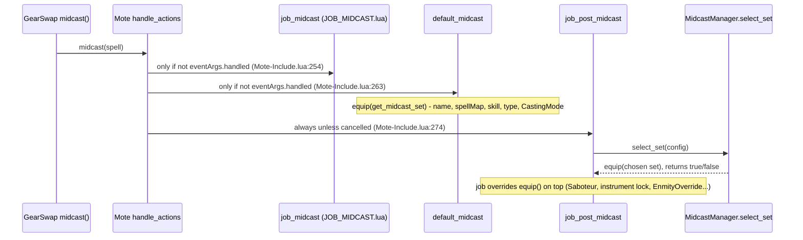
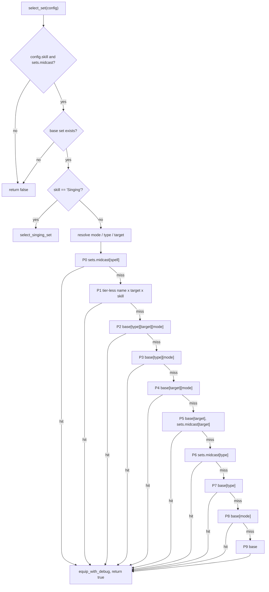

# Midcast selection, set building and buff helpers

`MidcastManager` picks the midcast set for a spell from nested `sets.midcast` tables. Every job's `job_post_midcast` calls it (directly or through a router) after Mote-Include's default midcast has already equipped its own guess. Alongside it sit a lazy loader for its dependencies (`MidcastDeps`), the helpers every job `set_builder.lua` uses for idle movement and town gear (`BaseSetBuilder`), and three action helpers that send `/ja`/`/ma` chains from `//gs c` commands: the `//gs c buff` self-buff queue (`SelfBuffManager`), the /WAR subjob buff list shared by DNC and THF (`SubjobWarBuffs`), and the /SCH Arts and Accession chains (`ScholarActions`, `StratagemCharges`).

None of these modules registers a Windower event, schedules a coroutine or writes a `windower.*` field. Their state is either module-local or on the sandbox `_G`, so it is rebuilt whenever GearSwap rebuilds the user environment (see [State & lifetime](#state--lifetime)).

## Files

| Path | Lines | Role |
|---|---|---|
| `shared/utils/midcast/midcast_manager.lua` | 753 | `select_set()` with the 10-level standard chain (P0-P9) and the Singing chain, debug toggle, Composure target helper, song helpers, unused preset configs |
| `shared/utils/midcast/midcast_deps.lua` | 44 | Loads `MidcastManager` and `ENHANCING_MAGIC_DATABASE` once per instance, for the 7 subjob-magic jobs |
| `shared/utils/messages/formatters/magic/message_midcast.lua` | 157 | Debug output used by `MidcastManager` (templates in `shared/utils/messages/data/systems/midcast_messages.lua`) |
| `shared/utils/set_building/base_set_builder.lua` | 107 | `apply_movement`, `select_idle_base_town`, `is_in_town` |
| `shared/utils/buffs/self_buff_manager.lua` | 259 | Factory: resolves a list of spells/abilities and queues the missing ones (only BLM uses it) |
| `shared/utils/smartbuff/subjob_war_buffs.lua` | 73 | Berserk / Aggressor / Warcry collection and casting for DNC and THF subbing /WAR |
| `shared/utils/scholar/scholar_actions.lua` | 163 | Light/Dark Arts toggles and the `aoe sneak/invi/erase` Accession chains (BLM, PLD, GEO) |
| `shared/utils/scholar/stratagem_charges.lua` | 104 | Stratagem charge count derived from recast id 231 |

`shared/utils/midcast/midcast_manager.lua.preref.bak` also sits on disk. It is ignored by `.gitignore:18` (`*.bak`) and nothing loads it.

## Where MidcastManager runs

Mote-Include drives every action through `handle_actions` (`libs/Mote-Include.lua:227`). For midcast:

Consequences:

- `MidcastManager` equips on top of whatever `default_midcast` chose (`Mote-Include.lua:332-334`, `705-760`). A partial set (only a few slots) leaves the other slots as Mote left them, which is often the precast Fast Cast set.
- When `select_set` returns `false` nothing more is equipped, so Mote's default choice stands.
- `job_post_midcast` runs even when `job_midcast` set `eventArgs.handled` (`Mote-Include.lua:274`). PLD relies on that and returns early itself (`shared/jobs/pld/functions/PLD_MIDCAST.lua:166-168`); that early return also skips `EnmityOverride.apply_midcast` for Cure III/IV.
- `user_post_midcast` (the spell-message hook, `shared/hooks/init_spell_messages.lua:74-92`) runs between `default_midcast` and `job_post_midcast` (`Mote-Include.lua:269-270`). A cancelled precast never reaches midcast, so no message is printed for it.

## MidcastManager.select_set

`MidcastManager.select_set(config)` (`midcast_manager.lua:609-645`):

1. Returns `false` if `config` or `config.skill` is missing (`:611-613`) or `sets.midcast` is missing (`:615-617`).
2. Resolves the base set: `sets.midcast.BardSong` when `config.skill == 'Singing'`, otherwise `sets.midcast[config.skill]` (`:620-625`).
3. **Returns `false` if the base set is missing** (`:627-629`). This happens before any lookup, so a job that has `sets.midcast['Cure II']` but no `sets.midcast['Healing Magic']` gets nothing from `MidcastManager`, and only Mote's default choice applies.
4. With debug on, prints the header: spell, skill, target name (`:632-637`).
5. Routes to `select_singing_set` (`:640-641`) or `select_standard_set` (`:643`).

### Config keys

| Key | Type | Used at | Meaning |
|---|---|---|---|
| `skill` | string, required | `:611`, `:624`, every path string | Name of the base set under `sets.midcast`. It does not have to be a real FFXI skill: jobs pass "pseudo-skills" that are just root set names (`'Flash'`, `'Enmity'`, `'Phalanx'`, `'Cocoon'` in PLD; `'Death'` in BLM; `'Absorb'`, `'Dread Spikes'` in DRK; `'StatusRemoval'` in WHM; `'RA'` in COR) |
| `spell` | GearSwap spell table | P0, P1, header, pickers | Only `spell.english` and `spell.target.name` are read by the manager; `target_func` receives the whole table |
| `mode_value` | string | `resolve_metadata` `:308-312` | Explicit mode. Wins over `mode_state`. Only BLM passes it (`shared/jobs/blm/functions/logic/midcast_router.lua:156-160`, value `'MagicBurst'`) |
| `mode_state` | Mote state | `:313-317` | Its `.value` is the mode when `mode_value` is absent |
| `database_func` | `function(spell_name) -> string` | `:325-341` | Called with `spell.english` under `pcall`. Its result is the **type** (for example `'Refresh'`, `'Enspell'`, `'mnd_potency'`). An error or `nil` means no type |
| `target_func` | `function(spell) -> string` | `:344-360` | Called with the whole spell under `pcall`. Its result is the **target** key (`'Composure'` from `get_enhancing_target`, `'Self'`/`'Other'` in PLD/RUN) |

Any other key (for example an `element` key shown in `.claude/rules/midcast-pattern.md`) is ignored. The Singing branch reads only `spell`.

`mode_state` values passed today: `state.EnfeebleMode` and `state.NukeMode` (RDM, `RDM_MIDCAST.lua:130,273`; defined in `_master/config/rdm/RDM_STATES.lua:116,125`), `state.EnhancingMode` (RDM only, `RDM_MIDCAST.lua:226`), and `state.CastingMode` (SMN, `SMN_MIDCAST.lua:129,142`; Mote creates it, the live `Tetsouo/config/smn/SMN_STATES.lua:22` gives Normal/Resistant). No states file in `_master/`, `Tetsouo/`, `Kaories/` or `shared/` defines `state.EnhancingMode`, so that value is always `nil`. `state.CureMode` (`_master/config/whm/WHM_STATES.lua:76`) is read by `WHM_MIDCAST.lua` itself and never passed to `select_set`; only the unused `MidcastManager.cure` preset names it.

### Standard chain (every skill except Singing)

`select_standard_set` (`:562-598`) resolves `mode`, `type` and `target` once, then walks `RESOLVERS` (`:550-560`) in order and stops at the first set found. Table order is priority order. "base" below is `sets.midcast[skill]`.

| Level | Resolver (lines) | Runs when | Paths tried, in order |
|---|---|---|---|
| P0 | `resolve_exact_spell` (`:376-391`) | `spell.english` set | `sets.midcast[spell.english]` |
| P1 | `resolve_base_name` (`:394-430`) | `spell.english` set | `name` = `spell.english` with a trailing space-separated word made only of the letters I, V, X removed (`:399`, pattern `%s+[IVX]+$`). If a target exists: `sets.midcast[name][target]`, `sets.midcast[target][name]`, `base[name][target]`, `base[target][name]`. Then, unless target is `'others'`: `sets.midcast[name]`, `base[name]` |
| P2 | `resolve_type_target_mode` (`:433-450`) | type, target and mode all set | `base[type][target][mode]` |
| P3 | `resolve_type_mode` (`:453-466`) | type and mode | `base[type][mode]` |
| P4 | `resolve_target_mode` (`:469-482`) | target and mode | `base[target][mode]` |
| P5 | `resolve_target` (`:485-506`) | target | `base[target]`, then `sets.midcast[target]` |
| P6 | `resolve_type_root` (`:509-523`) | type | `sets.midcast[type]` |
| P7 | `resolve_type_under_skill` (`:526-535`) | type | `base[type]` |
| P8 | `resolve_mode` (`:538-547`) | mode | `base[mode]` |
| P9 | fallback (`:585-589`) | nothing above matched | `base` |

P0 and P1 go through `try_path` (`:72-101`): missing intermediate tables are fine and only the last node has to be a table. P2-P8 index tables directly and accept any non-nil value. After choosing a set, `equip_with_debug` (`:108-131`) calls `equip()` and, with debug on, prints every slot in `SLOT_ORDER` (`:61-66`). `is_fallback` is `selected_set == base` (`:595`). A named set that is literally the same table as the base (for example `sets.midcast['Comet'] = sets.midcast['Elemental Magic']` in the BLM sets) is therefore reported as a fallback.

Properties that follow from the order:

- A spell-name set (P0) or a tier-less name set (P1) beats every type, target and mode set. No level looks up `sets.midcast[spell][mode]`, so a mode sub-table hung under a spell-name set is never selected.
- When a spell's tier-less name equals its database family (Refresh, Regen, Phalanx, Stoneskin, Aquaveil in `ENHANCING_MAGIC_DATABASE`), P1 finds `sets.midcast[family]` or `base[family]` before P2-P4, so mode-specific family sets are unreachable for those spells.
- Target beats type (P5 before P6/P7) and type beats mode (P6/P7 before P8).
- The chain picks one set and never combines. Inheritance from the base set has to be written into the set file with `set_combine`.

#### Worked examples

These were checked by loading the real `midcast_manager.lua` under `lua5.1` with stubbed `sets`, `equip` and `set_combine`:

| Job / cast | Metadata | Result |
|---|---|---|
| RDM Refresh III on self (`_master/sets/rdm_sets.lua:389`) | type `Refresh`, target nil | P1 `sets.midcast.Refresh`, a 2-slot set (see Known issues) |
| RDM Refresh III on a party member with Composure | type `Refresh`, target `Composure` | P1 `sets.midcast.Refresh.Composure` |
| BLM Thunder VI, MagicBurstMode On | mode `MagicBurst` | P8 `sets.midcast['Elemental Magic'].MagicBurst` |
| BLM Comet, MagicBurstMode On | mode `MagicBurst` | P0 `sets.midcast.Comet`, which is the non-MB base table (see Known issues) |
| PLD Cure II (no `sets.midcast['Healing Magic']` in any PLD set file) | target `Self` | returns `false`, nothing equipped |
| RDM Slow II, EnfeebleMode Potency (traced by reading, not simulated) | type `mnd_potency` (`shared/data/magic/enfeebling/enfeebling_debuffs.lua:78`), mode `Potency` | P3 misses (`.mnd_potency.Potency` absent), P7 `base.mnd_potency`; the `.Potency` mode set is never reached while a type set exists |

### Singing chain (BRD)

`select_singing_set` (`:233-285`) has two phases: **pickers** choose one set, most specific first, and stop at the first hit (`SONG_PICKERS`, `:207`). **Layers** then `set_combine` onto whatever was chosen.

| Step | Function (lines) | Lookup |
|---|---|---|
| 1 | `song_by_name` (`:152-167`) | `sets.midcast[spell.english]` |
| 1.5 | same | `sets.midcast[name with all whitespace removed]` ("Honor March" -> `HonorMarch`, "Aria of Passion" -> `AriaofPassion`) |
| 2 | `song_by_base_name` (`:170-178`) | `sets.midcast[name without tier]` ("Valor Minuet V" -> "Valor Minuet") |
| 3 | `song_by_type` (`:181-189`) | `sets.midcast[last word of the tier-less name]` via `get_song_type` (`:682-689`): Minne, Madrigal, March, Paeon... |
| 3.5 | `song_by_first_word` (`:192-204`) | `sets.midcast[first word]` ("Honor March" -> `Honor`), skipped for one-word names |
| 4 (layer) | `layer_instrument` (`:210-219`) | `get_song_instrument(name)` (`:693-709`); if `sets.midcast.Songs[instrument]` exists it is combined on top of the pick (or used alone when nothing was picked) |
| 5 (layer) | `layer_troubadour` (`:222-231`) | with `buffactive['Troubadour']`, `sets.midcast.Songs.Duration` combined on top |
| 6 | `:265-271` | nothing picked and no layer applied: `sets.midcast.BardSong` |

`get_song_instrument` delegates to `_G.SongRotationManager.get_required_instrument` (`shared/jobs/brd/functions/logic/song_rotation_manager.lua:152-173`: Honor March -> Marsyas, Aria of Passion -> Loughnashade, all others `nil`). `BRD_MIDCAST.lua:48-50` publishes that global on first midcast. The hard-coded fallback at `midcast_manager.lua:702-706` repeats the same two pairs.

Data facts that shape the result today (`_master/sets/brd_sets.lua`, same in `Tetsouo/sets/brd/brd_sets.lua`):

- `sets.midcast.Songs` holds `Gjallarhorn`, `Marsyas`, `Daurdabla`, each `set_combine(sets.midcast.BardSong, {range = ...})` (`:350-353`). There is no `Songs.Loughnashade` and no `Songs.Duration`, so the Troubadour layer never fires and Aria of Passion gets no instrument layer.
- Because `Songs.Marsyas` is a full BardSong set, layering it onto `HonorMarch` overwrites every slot BardSong defines.
- Songs that are not "normal" never reach this chain: dummy songs are equipped from `sets.midcast.DummySong` and debuff songs (Lullaby, Threnody, Elegy, Requiem, Virelai, Nocturne, Finale) are left to Mote's default midcast (`shared/jobs/brd/functions/logic/midcast_router.lua:178-202`). After `select_set`, the router forces `range = _G.locked_instrument` for Marcato-locked songs (`:164-170`).
- `default_midcast` has already equipped `sets.midcast.BardSong` via the `spell.type` (`'BardSong'`) fallback in `select_specific_set` (`Mote-Include.lua:929-948`), so layer-only results still sit on top of the BardSong base.

### Debug mode

- `//gs c debugmidcast` is handled in each job's COMMANDS file (16 files: BLM `:308`, BRD `:285`, BST `:185`, COR `:95`, DNC `:120`, DRK `:131`, GEO `:119`, PLD `:145`, PUP `:185`, RDM `:196`, RUN `:136`, SAM `:112`, SMN `:326`, THF `:124`, WAR `:131`, WHM `:121`). Each requires the manager, calls `MidcastManager.toggle_debug()` (`midcast_manager.lua:37-43`), then prints `MessageCommands.show_debugmidcast_toggled(job, _G.MidcastManagerDebugState)`.
- State is `_G.MidcastManagerDebugState`, initialised to `false` when the module loads if it is `nil` (`:15-17`) and read through `is_debug_enabled()` (`:20-22`). Job routers read the same global to gate their own traces (`RDM_MIDCAST.lua:350`, `BRD_MIDCAST.lua:86`, `BLM_MIDCAST.lua:145`, `SMN_MIDCAST.lua:176,180`).
- Output: header (`:632-637`), mode/type/target steps (`:304-363`), one line per priority checked (P1 prints only its first failing path, `:425-427`), then the chosen path and every equipped slot (`:108-131`).
- The comment at `:14` says the flag "survives reloads". It does not: `_G` is the sandbox `user_env`, rebuilt by every `load_user_files` (`GearSwap/refresh.lua:83`, `:114-149`), which runs on `gs reload` and main job change. `JobChangeManager` also issues `gs reload` after a subjob change (`shared/utils/core/job_change_manager.lua:149-179`). Debug mode is therefore off again after any job or subjob change.

### Helpers and presets

| Function | Lines | Callers |
|---|---|---|
| `get_enhancing_target(spell)` | `:652-666` | `target_func` in BRD router, BST, COR, DNC, PLD, PUP, RDM, RUN, SAM, SMN, THF, WAR, WHM midcast files. Returns `'Composure'` when `buffactive['Composure']` and the target is not the player, else `nil` |
| `get_song_type(name)` | `:682-689` | only `song_by_type` |
| `get_song_instrument(name)` | `:693-709` | only `layer_instrument` |
| `get_element(spell)` | `:669-674` | none |
| `rdm_enfeebling`, `enhancing`, `elemental`, `cure` | `:716-751` | none (preset config builders) |
| `MidcastManager.debug.enabled` | `:48-54` | none |
| `enable_debug`, `disable_debug`, `toggle_debug` | `:25-43` | `toggle_debug` from the 16 COMMANDS files |

## MidcastDeps

`MidcastDeps.load()` (`midcast_deps.lua:29-42`) `pcall`-requires `midcast_manager` and `ENHANCING_MAGIC_DATABASE` on first call and returns the same pair afterwards, even if a load failed (`loaded = true` is set unconditionally, `:40`). Callers: `COR_MIDCAST.lua:52`, `DNC_MIDCAST.lua:46`, `DRK_MIDCAST.lua:130`, `SAM_MIDCAST.lua:34`, `THF_MIDCAST.lua:48`, `WAR_MIDCAST.lua:38`, `WHM_MIDCAST.lua:158`, each at the top of `job_post_midcast`. These callers index `MidcastManager.select_set` without a nil check, so they depend on the manager loading.

The cache lives in module locals. GearSwap's `require` is `include_user`, which reads `package.loaded` but never writes it (`GearSwap/user_functions.lua:300-333`); caching comes from `ModuleCache`, installed by `INIT_SYSTEMS.lua:47-52` on the sandbox `_G`. Each user environment therefore gets its own `MidcastDeps` instance.

## Job usage patterns

Every `[JOB]_MIDCAST.lua` exports `job_midcast` and `job_post_midcast` on `_G` and returns them. The three samples show the variants:

**PLD** (`shared/jobs/pld/functions/PLD_MIDCAST.lua`): `ensure_modules_loaded()` (`:32-50`) loads the manager, `CureSetBuilder`, `EnmityOverride` and the enhancing DB. `job_midcast` (`:57-75`) handles Cure III/IV itself with `CureSetBuilder.generate` and sets `eventArgs.handled`. `job_post_midcast` (`:160-190`) returns when handled, then dispatches name-before-skill: Healing with a `'Self'`/`'Other'` `target_func` (`:79-87`), Flash as pseudo-skill `'Flash'` (`:90-95`), Enlight/Enlight II as `'Enmity'` (`:98-103`), Enhancing (Phalanx goes to `sets.midcast.SIRDPhalanx` when `PhalanxSIRD` or `Xp` is On, otherwise pseudo-skill `'Phalanx'`, `:109-122`; the rest with Composure target and `get_spell_family`, `:125-137`), Divine (`:139-144`), Blue (`'Cocoon'` or `'Blue Magic'`, `:148-153`). `EnmityOverride.apply_midcast(spell)` runs last (`:187-189`).

**RDM** (`shared/jobs/rdm/functions/RDM_MIDCAST.lua`): `job_midcast` is empty (`:79-82`). `job_post_midcast` (`:342-369`) looks up `SKILL_HANDLERS` (`:329-335`): Enfeebling with `EnfeebleMode` and `get_enfeebling_type`, then `sets.midcast['Enfeebling Magic'].Saboteur` on top when Saboteur is up (`:93-148`); Enhancing with the Accession + Phalanx exception to the plain base set (`:206-213`) and otherwise mode/target/family (`:223-229`); Healing, Elemental (`NukeMode`), Dark with only skill and spell. The fallback to `midcast_subjob` with `skill = spell.skill` (`:308-325`) is gated on `spell.type == 'Magic'` (`:362`), which no spell has (`spell.type` is `WhiteMagic`, `Ninjutsu`, ...), so subjob spells (Utsusemi, Divine, Blue...) keep Mote's default set.

**BRD** (`shared/jobs/brd/functions/BRD_MIDCAST.lua`): a dispatcher (`:76-119`) that builds a `ctx` and hands off to `logic/midcast_router.lua` (Singing, Healing, Enhancing, Enfeebling, Elemental). It also defines a passthrough `job_customize_midcast_set` (`:71-73`).

## BaseSetBuilder and job set builders

Each `[JOB]_IDLE.lua` / `[JOB]_ENGAGED.lua` implements Mote's `customize_idle_set(idleSet)` / `customize_melee_set(meleeSet)` and returns `SetBuilder.build_idle_set(...)` / `build_engaged_set(...)` from `shared/jobs/<job>/functions/logic/set_builder.lua` (for example `PLD_IDLE.lua:18-45`). Builders layer overlays with `set_combine`, which returns a new table. When no overlay applies they can return a table from `sets` itself (the set Mote passed in, `sets.idle.Town`, `sets.Adoulin`, `sets.idle[mode]`), so a builder that writes into its result in place (DNC `apply_weapon` assigns `result.sub`, `shared/jobs/dnc/functions/logic/set_builder.lua:118`) edits that shared set when its weapon set was missing.

`BaseSetBuilder` (`shared/utils/set_building/base_set_builder.lua`):

- `apply_movement(result)` (`:39-49`): when `state.Moving.value == 'true'` (the string state created by `shared/utils/movement/automove.lua:127`) and `sets.MoveSpeed` exists, returns `set_combine(result, sets.MoveSpeed)` under `pcall`; on error shows `MessageFormatter.show_error` and returns `result`.
- `select_idle_base_town(base_set)` (`:65-84`): returns `sets.Adoulin, true` in Western/Eastern Adoulin when that set exists; otherwise `sets.idle.Town, true` when `areas.Cities` (`libs/Mote-Mappings.lua:219-247`) contains `world.area` and the area name does not contain "Dynamis"; otherwise `base_set, false`. No Dynamis zone is in `areas.Cities`, so the Dynamis test never changes the result.
- `is_in_town()` (`:90-101`): the same test without a set.

Who uses what:

| Job builder | Town | Movement |
|---|---|---|
| BLM, GEO | `BaseSetBuilder.select_idle_base_town` called directly | `apply_movement` outside town (`blm/.../set_builder.lua:180-183`) |
| WHM | `BaseSetBuilder.select_idle_base_town` called directly (`whm/.../set_builder.lua:48`) | `BaseSetBuilder.apply_movement` always, in town too (`:63`) |
| COR, DNC, PLD, RUN, THF | `SetBuilder.select_idle_base = BaseSetBuilder.select_idle_base_town` | `apply_movement` (DNC and PLD return before it in town: `dnc/.../set_builder.lua:152-154`, `pld/.../set_builder.lua:267-269`) |
| WAR, BRD | own `select_idle_base` wrapping `select_idle_base_town` | `apply_movement` outside town (`war/.../set_builder.lua:198-204`); BRD also applies it to the engaged set (`brd/.../set_builder.lua:173-174`) |
| RDM | `SetBuilder.check_town = select_idle_base_town`, applied after IdleMode (`rdm/.../set_builder.lua:238-242`) | `apply_movement` outside town |
| BST | `BaseSetBuilder.is_in_town()` for Town feet only (`bst/.../set_builder.lua:117-120`) | inline `set_combine(..., sets.MoveSpeed)` (`:110-111`) |
| DRK | none | inline `set_combine(result, sets.MoveSpeed)` (`drk/.../set_builder.lua:137-138`) |
| SAM | none | none from this module |
| PUP | `PUP_IDLE.lua:32` and `PUP_ENGAGED.lua:32` require `shared/jobs/pup/functions/logic/set_builder`, which does not exist on disk | n/a |

Typical order (PLD `build_idle_set`, `set_builder.lua:247-301`): town base -> main weapon -> shield -> (return early in town) -> HybridMode set -> Xp set -> movement -> Sortie shield. Engaged (`:210-238`): BurtgangKC / Kraken Club / HybridMode base -> weapon -> Alber Strap -> Xp -> Sortie shield.

## SelfBuffManager

`SelfBuffManager.create({buffs = list, action_type = 'Magic'})` (`self_buff_manager.lua:135-257`) returns `{ buff_self = fn }`. A list entry is `{spell = name}` or `{ability = name}` with optional `buff` (buff name to test) and `delay` (seconds to wait after this action, default `DEFAULT_DELAY = 6`, `:30`).

`buff_self()` (`:225-254`):

1. Reads spell and ability recasts; shows an error and returns `false` if either is not a table (`:229-237`).
2. Resources: `_G.res or windower.res or require('resources')` (`:239`).
3. `usable_entries` (`:203-221`) resolves each entry (`resolve_entry`, `:59-80`): the buff name comes from `res.buffs[data.status].en` unless given; entries with no buff name are dropped. `is_usable` (`:108-122`): an ability must be in `windower.ffxi.get_abilities().job_abilities`; a spell must be known and either listed for the main job at any level or listed for the subjob at a level `<=` `player.sub_job_level`.
4. `queue_ready` (`:146-165`) keeps entries whose buff is not active, whose recast is 0 and that were not queued in the last `CAST_COOLDOWN = 2.0` seconds (`:26`, `os.clock`). The wait for each entry is the sum of the `delay` of the entries queued before it.
5. `send_queue` (`:170-177`) sends every action at once as `wait N; input /ma "X" <me>` (or `/ja`) and stamps the anti-spam time.
6. With nothing to send, `show_active` (`:182-198`) lists the buffs already up with `MessageBuffs.show_buff_status`. If none is up (everything missing is on recast) nothing is printed and `false` is returned.

Only caller: `shared/jobs/blm/functions/logic/buff_manager.lua:25` (Stoneskin with `delay = 8`, Blink, Aquaveil, Ice Spikes), reached by `//gs c buff|buffs|buffself|selfbuff` (`BLM_COMMANDS.lua:352-361` -> global `BuffSelf()` in `blm_functions.lua:163-166`). The anti-spam table is per manager instance, created when `buff_manager.lua` loads.

## SubjobWarBuffs

`SubjobWarBuffs.collect()` (`subjob_war_buffs.lua:36-57`) walks Berserk (recast 1), Aggressor (4), Warcry (2): an active buff goes to `status_data` as `active`; a ready recast (`is_recast_ready`, the global defined by `RECAST_CONFIG.lua` and loaded by each entry file's `get_sets`, for example `_master/entry/Tetsouo_THF.lua:103`) goes to `abilities_to_cast`; otherwise `status_data` gets `cooldown` with `math.ceil(recast)`. `SubjobWarBuffs.cast(list)` (`:61-71`) sends the first `/ja` at once and each next one `2 * (i - 1)` seconds later.

It does not check the subjob. Callers: THF `SmartbuffManager.apply_war_buffs()` (`shared/jobs/thf/functions/logic/smartbuff_manager.lua:79-90`, uses both `collect` and `cast`) and DNC `collect_subjob_buffs('WAR')` (`shared/jobs/dnc/functions/logic/smartbuff_manager.lua:224-225`, uses `collect` only and casts through its own queue). Entry commands: `//gs c smartbuff` (THF `THF_COMMANDS.lua:149`), `//gs c smartbuff|buffself` (DNC `DNC_COMMANDS.lua:145`).

## ScholarActions and StratagemCharges

`StratagemCharges` (`stratagem_charges.lua`):

- Scholar level from main or sub job (`:42-50`); capacity by tier 10/30/50/70/90 -> 1..5 charges (`:32-38`, `get_max` `:54-64`).
- `available()` (`:68-78`): `floor(max - max * recast / 240)` using ability recast id 231, the shared stratagem slot (`:26`, `:29`). The 240 s full-recharge constant is the unmerited value (header `:12-15`).
- `next_charge_minutes()` (`:88-102`): time until the next whole-charge boundary, in minutes; `0` when Scholar is neither main nor sub.
- Example with 2 charges: recast 0 -> 2 available; 120 -> 1 available, next in 2.00 min; 121 -> 0 available, next in 1 s.

`ScholarActions` (`scholar_actions.lua`):

- `chain(steps)` (`:34-36`): joins steps with `; wait 2; ` (`STEP_SPACING`, `:18`).
- `light_arts()` / `dark_arts()` (`:54-73`): Addendum already up -> message; Arts up -> Addendum; otherwise Arts. Addendum is tested first because it replaces the Arts buff in `buffactive`.
- `build_accession_chain(spell, aoe_state, needs_addendum)` (`:89-132`): target `<me>` when the state is missing or not `'Off'`, else `<stal>`. Addendum: White takes the first charge when `needs_addendum` and it is not up; Accession takes the next when the target is `<me>` and Accession is not up. Each stratagem that cannot be paid shows `show_stratagem_no_charges` and is dropped. Light Arts is prepended only when at least one stratagem is queued and neither Light Arts nor Addendum: White is up. The spell is always the last step.
- `try_aoe_subcommand(word, aoe_state)` (`:154-161`) maps `sneak`, `invi`, `invisible` (use the state) and `erase` (ignores the state, needs Addendum) through `AOE_SPELLS` (`:143-148`).
- Messages go through `MessageFormatter.show_stratagem_no_charges` / `show_arts_already_active`, which forward to the BLM message templates (`shared/utils/messages/message_formatter.lua:345-346`), so PLD and GEO print them with the BLM templates and a dynamic job tag.

## Commands

| Command | Handler | Effect |
|---|---|---|
| `//gs c debugmidcast` | 16 job COMMANDS files (see Debug mode) | Toggle `_G.MidcastManagerDebugState` |
| `//gs c buff` / `buffs` / `buffself` / `selfbuff` (BLM) | `BLM_COMMANDS.lua:352-361` | `SelfBuffManager` queue |
| `//gs c lightarts` | BLM `:365`, PLD `PLD_COMMANDS.lua:203` -> `ScholarActions.light_arts()`; GEO `GEO_COMMANDS.lua:264-275` (own copy) | Light Arts, then Addendum: White |
| `//gs c darkarts` | BLM `:371` -> `ScholarActions.dark_arts()`; GEO `:278-289` (own copy) | Dark Arts, then Addendum: Black |
| `//gs c aoe sneak\|invi\|invisible\|erase` | BLM `:381-386` (`state.SneakInviAOE`), PLD `:178-189` (same state; bare `aoe` runs the PLD Blue Magic rotation), GEO `:295-300` (no state, always AoE) | `build_accession_chain` |
| `//gs c klima` / `klimaform` | BLM `:390-412` | Dark Arts if not up and ready, Manifestation if `KlimaformAOE` is on and a charge exists, then Klimaform |
| `//gs c smartbuff` | THF `:149`, DNC `:145` (also `buffself`) | Job smartbuff, using `SubjobWarBuffs` for /WAR |

`SCH_ALT_COMMANDS.lua` defines `darkarts`, `lightarts` (level 10) and `klimaform` (level 46) (`_master/config/alt/SCH_ALT_COMMANDS.lua:38,45,187`, same in `Tetsouo/config/alt/`). The local handlers in the table above still answer those words: `CommonCommands.is_common_command` knows only built-in names and warp aliases, and the dual-box alt's commands are Mote's last lookup, reached only when `job_self_command` leaves a name unhandled (`shared/utils/dualbox/alt_commands.lua:507-520`, see [dualbox](dualbox.md#alt-command-routing)). `//gs c alt lightarts` sends the alt's version. Commit 6970e82 moved Sneak/Invisible/Erase under `aoe` when the alt keys still took precedence over job commands.

## Configuration

No config file is read by these modules. Inputs are:

- Set tables: `sets.midcast[...]`, `sets.midcast.BardSong`, `sets.midcast.Songs[instrument]`, `sets.midcast.Songs.Duration`, `sets.MoveSpeed`, `sets.Adoulin`, `sets.idle.Town`.
- Mote states: whatever a caller passes as `mode_state`; `state.Moving`.
- Globals: `buffactive`, `player`, `world`, `areas.Cities`, `_G.SongRotationManager`, `is_recast_ready` (from `RECAST_CONFIG.lua`, tolerance 2.0 s in `_master/config_global/RECAST_CONFIG.lua:31`).
- Hard-coded constants: `CAST_COOLDOWN = 2.0`, `DEFAULT_DELAY = 6` (self buffs); `CAST_SPACING = 2` (/WAR buffs); `STEP_SPACING = 2` (scholar chains); `STRATAGEM_RECAST_ID = 231`, `FULL_RECHARGE = 240` (stratagems); WAR recast ids 1/4/2.

## State & lifetime

- `_G.MidcastManagerDebugState`: written `midcast_manager.lua:15-16,26,33`. Lives on the sandbox `_G`, so it resets on `gs reload`, main job change and (through `JobChangeManager`'s reload) subjob change.
- `_G.SongRotationManager`: written `BRD_MIDCAST.lua:50` on the first BRD midcast; read `midcast_manager.lua:698`.
- Module locals: `MidcastDeps` cache (`midcast_deps.lua:20-22`), `SelfBuffManager` per-instance `last_use_times` (`self_buff_manager.lua:137`), `ScholarActions` lazy `MessageFormatter` (`scholar_actions.lua:22-29`). All die with the user environment.
- `CureSetBuilder.generate` (PLD `cure_set_builder.lua:44`, RUN same line) assigns `sets.midcast.Cure`, so after the first Cure III/IV that key holds the last CureSelf/CureOther choice until the next reload.
- No events, keybinds, text objects or coroutines. `send_command('wait N; ...')` chains are handed to Windower and cannot be cancelled by a reload or job change.

## Interactions

- Mote-Include midcast pipeline (described above) and the job midcast files: see the job pages under [../jobs/](../jobs/) (for example [../jobs/pld.md](../jobs/pld.md), [../jobs/rdm.md](../jobs/rdm.md), [../jobs/brd.md](../jobs/brd.md), [../jobs/blm.md](../jobs/blm.md)).
- Messages: `MessageMidcast`, `MessageBuffs`, `MessageFormatter`, BLM templates. See [messages.md](messages.md).
- `MidcastWatchdog.on_midcast_start(spell)` is called by most `job_post_midcast` functions before routing (for example `PLD_MIDCAST.lua:161-163`), independent of `MidcastManager`.
- Enhancing/Enfeebling databases under `shared/data/magic/` supply `database_func`.
- `JobChangeManager` (reload on job/subjob change) determines the lifetime of everything here.

## Invariants & gotchas

- `select_set` equips nothing unless `sets.midcast[skill]` exists, even for a spell that has its own named set (`:627-629`). No PLD set file defines `sets.midcast['Healing Magic']`, `['Divine Magic']` or `['Blue Magic']`, so for PLD those calls return `false` and Mote's default choice stands.
- Sets are chosen, never merged. A set that only lists the slots that differ (for example RDM `sets.midcast.Refresh`, `sets.midcast.Regen`) is worn over whatever was on before, which is the precast set for the slots Mote's default did not touch.
- A spell-name or tier-less-name set shadows every mode and family set for that spell (P0/P1 come first).
- `target_func` values must match the keys in the set file exactly. PLD/RUN return `'Self'`/`'Other'`; no PLD or RUN set defines those keys. RDM's `sets.midcast.CureSelf` (`_master/sets/rdm_sets.lua:284`) has no selector.
- Singing Step 1.5 removes every space: "Aria of Passion" looks up `AriaofPassion`, not the `AriaPassion` defined in the BRD sets.
- `get_enhancing_target` only returns something on a RDM main with Composure; for every other job it is `nil`.
- `SubjobWarBuffs.collect` needs the global `is_recast_ready`, which exists only after the entry file has required `RECAST_CONFIG`.
- `StratagemCharges` assumes the unmerited 240 s pool and returns 0 when Scholar is neither main nor sub; `ScholarActions` then warns "No charges available (next charge: 0.0m)" for each stratagem it wanted.

## Extending

- **New skill in a job**: add a branch in `job_post_midcast` calling `MidcastManager.select_set({skill = ..., spell = spell, ...})` and define `sets.midcast[skill]` (the base set is mandatory). Pass `database_func` only if the database returns strings that match set keys.
- **Mode-specific gear**: put it under the base (`base[mode]`, P8) or under a family (`base[type][mode]`, P3). Do not hang it under a spell-name set, and do not define a root set named after a spell whose family you want mode-routed (P0/P1 would win).
- **New target key**: write a `target_func` returning the key, then define `base[key]` (P5) or `base[type][key]` / `base[type][key][mode]` (P2).
- **New song set**: name it exactly like the spell, the tier-less spell, the family word, or the first word; for a multi-word name without spaces use the name with every space removed.
- **New self-buff list for another job**: `SelfBuffManager.create({buffs = {...}})` in the job's logic folder and a `buff` command that calls `buff_self()`.
- **New /SCH chain**: add an entry to `AOE_SPELLS` (`scholar_actions.lua:143-148`) with `toggle` and `addendum` flags.

## Known issues

- BLM Comet never uses the MagicBurst set: P0 returns `sets.midcast['Comet']`, which is the base Elemental table (`midcast_manager.lua:376-391`, `_master/sets/blm_sets.lua:547-548`).
- RDM self-cast Refresh/Regen wear only 2 midcast slots over the precast set (`_master/sets/rdm_sets.lua:389,401`, live `Kaories/sets/rdm_sets.lua:443,459`).
- `sets.midcast.AriaPassion` is unreachable by name (`midcast_manager.lua:159`, `_master/sets/brd_sets.lua:361`).
- The Marsyas instrument layer overwrites a customised `HonorMarch` set (`midcast_manager.lua:210-219`, `_master/sets/brd_sets.lua:352`).
- PLD/RUN Healing `select_set` calls always return `false`; Cure I/II gear depends on the last Cure III/IV target (`PLD_MIDCAST.lua:79-87`, `cure_set_builder.lua:44`).
- Unused public API: `get_element`, the four preset builders, `MidcastManager.debug` (`midcast_manager.lua:48-54,669-674,716-751`).
- Dead `ctx.target ~= 'others'` guard (`midcast_manager.lua:411`).
- "Debug state survives reloads" is false (`midcast_manager.lua:14`, `.claude/MIDCAST_STANDARD.md`, `.claude/CODE_QUALITY.md` section 4.2).
- The fallback chain described in `.claude/CODE_QUALITY.md` 4.2, `.claude/rules/midcast-pattern.md` and `midcast_manager.lua:1-2` does not match the code.
- `base_set_builder.lua:36,59-60` list the wrong users.
- Scholar chains warn "No charges (0.0m)" when /SCH is absent (`scholar_actions.lua:102-120`).
- GEO keeps its own Light/Dark Arts toggles (`GEO_COMMANDS.lua:264-289`).
- BST and DRK repeat `apply_movement` inline (`bst/.../set_builder.lua:110-111`, `drk/.../set_builder.lua:137-138`).
- The comment at `self_buff_manager.lua:226-227` describes a sub-second window; the window is 2.0 s.
- RDM's subjob-magic fallback is gated on `spell.type == 'Magic'` and never runs (`shared/jobs/rdm/functions/RDM_MIDCAST.lua:362`).
- DRK passes the Enhancing database's `get_spell_family` as `database_func` for Enfeebling Magic (`shared/jobs/drk/functions/DRK_MIDCAST.lua:103`).
