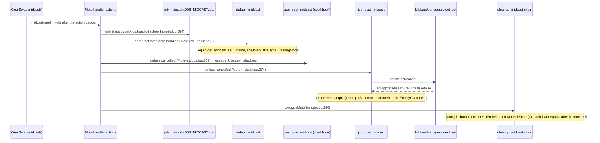
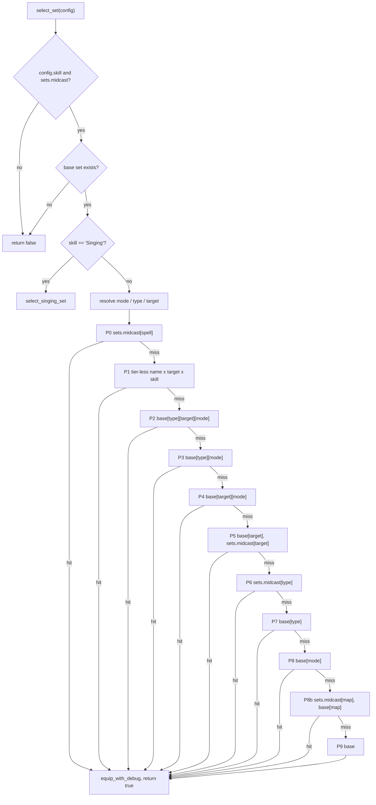

# Midcast selection, set building and buff helpers

`MidcastManager` picks the midcast set for a spell from nested `sets.midcast` tables. Every job's `job_post_midcast` calls it (directly or through a router) after Mote-Include's default midcast has already equipped its own guess, and `MidcastFallback` routes the spells a job does not (a subjob's magic) from Mote's `cleanup_midcast`. `MidcastTrace` writes each choice to the trace log, `UtsusemiShadows` lets Utsusemi: Ichi replace shadows already up, and `MidcastDeps` lazy-loads the manager for the subjob-magic jobs. Alongside them sit the helpers every job `set_builder.lua` uses for idle movement and town gear (`BaseSetBuilder`), and two action helpers that send `/ja`/`/ma` from `//gs c` commands: the buff engine behind `//gs c buff` on every job and WAR's `berserk` / `defender` (`SelfBuffManager`, `BuffCommand`, `BuffConfig`), and the /SCH Arts, Accession and Addendum chains (`ScholarActions`, `StratagemCharges`).

The whole action lifecycle (precast -> midcast -> aftercast -> status rebuild, with the cleanup wrapper order) is on [precast-pipeline.md](precast-pipeline.md#action-lifecycle-end-to-end); this page details the midcast half.

None of these modules registers a Windower event. `MidcastManager` keeps its debug flag on `windower._midcast_debug`, and `ScholarActions` polls buffs with `coroutine.schedule` under a `windower._sch_cast_seq` generation counter; everything else is module-local or on the sandbox `_G`, so it is rebuilt whenever GearSwap rebuilds the user environment (see [State & lifetime](#state--lifetime)).

References are to the code as of 2026-09-28. Functions are named (`file` `function`) where lines drift.

## Files

| Path | Lines | Role |
|---|---|---|
| `shared/utils/midcast/midcast_manager.lua` | 751 | `select_set()` with the standard chain (P0-P9, plus P8b) and the Singing chain, persistent debug toggle, Composure target helper, song helpers |
| `shared/utils/midcast/midcast_fallback.lua` | 53 | Routes a spell no job midcast handed to `select_set` (a subjob's magic), on Mote's `cleanup_midcast` |
| `shared/utils/midcast/midcast_trace.lua` | 81 | `MIDCAST` lines in `<Character>/trace.log` (chosen path and pieces, or "no set"); slot-name aliasing |
| `shared/utils/midcast/utsusemi_shadows.lua` | 32 | Cancels Copy Image buffs 2.3 s into Utsusemi: Ichi (Cancel addon) |
| `shared/utils/midcast/midcast_deps.lua` | 44 | Loads `MidcastManager` and `ENHANCING_MAGIC_DATABASE` once per instance, for the 8 subjob-magic jobs |
| `shared/utils/messages/formatters/magic/message_midcast.lua` | 156 | Debug output used by `MidcastManager` (templates in `shared/utils/messages/data/systems/midcast_messages.lua`) |
| `shared/utils/set_building/base_set_builder.lua` | 216 | `apply_movement`, `lay_weapon`, `lay_weapons`, `kraken_in_offhand`, `select_idle_base_town`, `select_idle_base`, `lay_town_set`, `is_in_town` |
| `shared/utils/buffs/self_buff_manager.lua` | 300 | The one buff engine: `collect(list)` (names or entries -> what to cast now, and the status of the rest; tiers of one buff best first), `cast(to_cast)` (shared action queue), `show_status(status)`; the names with a rule (Warcry, Hasso / Seigan, Utsusemi, Haste Samba) |
| `shared/utils/buffs/buff_command.lua` | 59 | `BuffCommand.apply()`: `//gs c buff` on every job (`_G.job_buff_extra`, then `job[main]`, then `subjob[sub]`) |
| `shared/utils/buffs/buff_config.lua` | 82 | `BuffConfig.DEFAULTS` and `get()`: the character's `_common/combat/BUFF_CONFIG.lua` over the defaults |
| `_master/config_global/BUFF_CONFIG.lua` | 66 | Template of `<Character>/_common/combat/BUFF_CONFIG.lua`, every key set to its default (the same lists as `BuffConfig.DEFAULTS`), a comment naming the jobs without a list |
| `shared/utils/scholar/scholar_actions.lua` | 366 | Light/Dark Arts toggles, the `aoe sneak/invi/erase` Accession casts, buff-gated stratagem chains, Addendum: Black casts (BLM, PLD, GEO) |
| `shared/utils/scholar/stratagem_charges.lua` | 104 | Stratagem charge count derived from recast id 231 |

Also on the midcast path, documented on [precast-pipeline.md](precast-pipeline.md#message-hooks-sharedhooks): `shared/hooks/init_spell_messages.lua` (wraps `user_post_midcast`) and the cleanup wrappers (Obi/Orpheus, Treasure Hunter, custom states).

## Where MidcastManager runs

Mote-Include drives every action through `handle_actions` (`libs/Mote-Include.lua:227`). For midcast:


```mermaid
sequenceDiagram
    participant GS as GearSwap midcast()
    participant Mote as Mote handle_actions
    participant Job as job_midcast (JOB_MIDCAST.lua)
    participant Def as default_midcast
    participant UP as user_post_midcast (spell hook)
    participant Post as job_post_midcast
    participant MM as MidcastManager.select_set
    participant CL as cleanup_midcast chain
    GS->>Mote: midcast(spell), right after the action packet
    Mote->>Job: only if not eventArgs.handled (Mote-Include.lua:254)
    Mote->>Def: only if not eventArgs.handled (Mote-Include.lua:263)
    Note over Def: equip(get_midcast_set) - name, spellMap, skill, type, CastingMode
    Mote->>UP: unless cancelled (Mote-Include.lua:269): message, Utsusemi shadows
    Mote->>Post: unless cancelled (Mote-Include.lua:274)
    Post->>MM: select_set(config)
    MM-->>Post: equip(chosen set), returns true/false
    Note over Post: job overrides equip() on top (Saboteur, instrument lock, EnmityOverride...)
    Mote->>CL: always (Mote-Include.lua:280)
    Note over CL: custom( fallback route, then TH( belt, then Mote cleanup ) ), each layer equips after its inner call
```

Consequences:

- `MidcastManager` equips on top of whatever `default_midcast` chose. A partial set (only a few slots) leaves the other slots as Mote left them, which is often the precast Fast Cast set.
- When `select_set` returns `false` nothing more is equipped, so Mote's default choice stands.
- `job_post_midcast` runs even when `job_midcast` set `eventArgs.handled`. PLD, RUN and WHM rely on that and return early themselves when `handled` (their cures are dressed in `job_midcast`).
- `user_post_midcast` (the spell-message hook) runs between `default_midcast` and `job_post_midcast`. A cancelled precast never reaches midcast, so no message is printed for it.
- **Spells a job does not route** (`midcast_fallback.lua`, since 2026-09-27): each `job_post_midcast` hands `select_set` only the skills it knows, so a subjob's magic (COR/DRK Drain, WAR/NIN Utsusemi) used to get Mote's set with no debug output. `MidcastFallback.install()` (INIT_SYSTEMS, before the custom states hook) wraps Mote's `cleanup_midcast`, which runs after `job_post_midcast`: a spell with `action_type == 'Magic'` that `select_set` did not see (`_G._midcast_routed`, written at the top of `select_set`) is routed with `{skill = spell.skill, spell = spell}`. Left alone: a cancelled action, `eventArgs.handled`, anything but magic. No change of gear when `sets.midcast[skill]` does not exist (select_set returns false).
- Midcast runs for job abilities and weaponskills too. Mote finds nothing under `sets.midcast` for them unless a set is named after the action, so the precast set stays on through the action.

### Mote's own choice (`get_midcast_set`)

`default_midcast` equips `get_midcast_set(spell, spellMap)` (`Mote-Include.lua:705`):

1. Start at `sets.midcast` (`{}` when missing). Only `Ranged Attack` (`RangedAttack` / `RA`) and `Item` get a category sub-table; if that sub-table is missing the result is `{}`.
2. `classes.SkipSkillCheck = classes.NoSkillSpells:contains(spell.english)`.
3. `select_specific_set`: `get_named_set` tries `classes.CustomClass`, `spell.english`, `spellMap` (from `get_spell_map`: `classes.SpellMaps[spell.english]`, overridden by a job's `job_get_spell_map`); if none, `[spell.skill]` (unless SkipSkillCheck) else `[spell.type]`, then `get_named_set` again under it.
4. Magic: `[state.CastingMode.current]` when present. Ranged: `get_ranged_set` (CombatForm, CombatWeapon, RangedMode, CustomRangedGroups).

Example, `Utsusemi: Ni` on WAR/NIN: `sets.midcast['Utsusemi: Ni']`, else `sets.midcast.Utsusemi` (map), else `sets.midcast.Ninjutsu` (skill; `spell.type` is also `Ninjutsu`) refined by `['Utsusemi: Ni']` or `.Utsusemi` under it, else `sets.midcast` itself (whose non-slot keys `equip` ignores, so nothing changes). Then the fallback's `select_set({skill='Ninjutsu'})`: P0 name, ..., P8b `sets.midcast.Utsusemi`, P9 `sets.midcast.Ninjutsu`. The two agree since P8b.

## MidcastManager.select_set

`MidcastManager.select_set(config)`:

1. Returns `false` if `config` or `config.skill` is missing.
2. Writes `_G._midcast_routed = config.spell` (read by `MidcastFallback`) and `MidcastTrace.begin(config.spell)`, **before** any other check.
3. Returns `false` if `sets.midcast` is missing.
4. Resolves the base set: `sets.midcast.BardSong` when `config.skill == 'Singing'`, otherwise `sets.midcast[config.skill]`.
5. **Returns `false` if the base set is missing**, after `MidcastTrace.no_set(skill)` and (debug on) a header plus `STEP 1: Skill set >> WARN: sets.midcast['<skill>'] missing - Mote's set stays (spell name / map)`. This happens before any lookup, so a job that has `sets.midcast['Cure II']` but no `sets.midcast['Healing Magic']` gets nothing from `MidcastManager`, and only Mote's default choice applies.
6. With debug on, prints the header: spell, skill, target name (`spell.target.name`, else the player's name).
7. Routes to `select_singing_set` or `select_standard_set`.

### Config keys

| Key | Type | Read in | Meaning |
|---|---|---|---|
| `skill` | string, required | `select_set`, every path string | Name of the base set under `sets.midcast`. It does not have to be a real FFXI skill: jobs pass "pseudo-skills" that are just root set names (`'Flash'`, `'Enmity'`, `'Phalanx'`, `'Cocoon'` in PLD; `'Death'` in BLM; `'Absorb'`, `'Dread Spikes'` in DRK; `'StatusRemoval'`, `'MndEnfeebles'`, `'IntEnfeebles'`, `'Repose'` in WHM; `'RA'` in COR) |
| `spell` | GearSwap spell table | P0, P1, P8b, header, pickers | `spell.english` and `spell.target.name` are read by the manager; `target_func` and Mote's `get_spell_map` receive the whole table |
| `mode_value` | string | `resolve_metadata` | Explicit mode. Wins over `mode_state`. Only BLM passes it (`logic/midcast_router.lua` `Router.handle_elemental`, value `'MagicBurst'`) |
| `mode_state` | Mote state | `resolve_metadata` | Its `.value` is the mode when `mode_value` is absent |
| `database_func` | `function(spell_name) -> string` | `resolve_metadata` | Called with `spell.english` under `pcall`. Its result is the **type** (for example `'Refresh'`, `'Enspell'`, `'mnd_potency'`). An error or `nil` means no type |
| `target_func` | `function(spell) -> string` | `resolve_metadata` | Called with the whole spell under `pcall`. Its result is the **target** key (`'Composure'` from `get_enhancing_target`, `'Self'`/`'Other'` in PLD/RUN) |

Any other key is ignored. The Singing branch reads only `spell`.

`mode_state` values passed today:

| Job | State | Skills |
|---|---|---|
| RDM | `state.EnfeebleMode`, `state.EnhancingMode`, `state.NukeMode` | Enfeebling, Enhancing, Elemental |
| SMN | `state.CastingMode` | Elemental, Enfeebling |
| BLU | `state.CastingMode` | Blue Magic routes |
| WHM | `state.CastingMode` | Divine, the enfeeble pseudo-skills |
| COR | `state.RangedMode` | `'RA'` (ranged midcast) |

No states file in `_master/`, `Tetsouo/`, `Kaories/` or `shared/` defines `state.EnhancingMode`, so that value is always `nil`. `state.CureMode` (`_master/config/whm/WHM_STATES.lua`) is read by `WHM_MIDCAST.lua` `job_midcast` itself and never passed to `select_set`.

### Standard chain (every skill except Singing)

`select_standard_set` resolves `mode`, `type` and `target` once (`resolve_metadata`), then walks `RESOLVERS` in order and stops at the first set found. Table order is priority order. "base" below is `sets.midcast[skill]`.

| Level | Resolver | Runs when | Paths tried, in order |
|---|---|---|---|
| P0 | `resolve_exact_spell` | `spell.english` set | `sets.midcast[spell.english]`, or its `[mode]` child when it has one (`sets.midcast['Repose'].Resistant`), as Mote picks it (since 2026-09-29; before, P0 laid the plain set back over Mote's mode variant) |
| P1 | `resolve_base_name` | `spell.english` set | `name` = `spell.english` with a trailing space-separated word made only of the letters I, V, X removed (pattern `%s+[IVX]+$`). If a target exists: `sets.midcast[name][target]`, `sets.midcast[target][name]`, `base[name][target]`, `base[target][name]`. Then, unless target is `'others'`: `sets.midcast[name]`, `base[name]` |
| P2 | `resolve_type_target_mode` | type, target and mode all set | `base[type][target][mode]` |
| P3 | `resolve_type_mode` | type and mode | `base[type][mode]` |
| P4 | `resolve_target_mode` | target and mode | `base[target][mode]` |
| P5 | `resolve_target` | target | `base[target]`, then `sets.midcast[target]` |
| P6 | `resolve_type_root` | type | `sets.midcast[type]` |
| P7 | `resolve_type_under_skill` | type | `base[type]` |
| P8 | `resolve_mode` | mode | `base[mode]` |
| P8b | `resolve_spell_map` (2026-09-28) | Mote's `get_spell_map(spell)` gives a string map (`Utsusemi`, `BarElement`, `Storm`, a job's `job_get_spell_map`...) | `sets.midcast[map]`, then `base[map]` (tables only) |
| P9 | fallback in `select_standard_set` | nothing above matched | `base` |

P0 and P1 go through `try_path`: missing intermediate tables are fine and only the last node has to be a table. P2-P8 index tables directly and accept any non-nil value. After choosing a set, `equip_with_debug` calls `equip()`, `MidcastTrace.selection`, and, with debug on, prints every slot in `SLOT_ORDER` (names resolved through `MidcastTrace.item_name`, so `left_ring` / `ring1` / `lring` all show). `is_fallback` is `selected_set == base`. A named set that is literally the same table as the base (for example `sets.midcast['Comet'] = sets.midcast['Elemental Magic']` in the BLM sets) is therefore reported as a fallback.

The header of `midcast_manager.lua` describes this chain including P8b; the older comment block above `resolve_metadata` ("STANDARD BRANCH (P0-P9)") does not list P8b.


```mermaid
flowchart TD
    A["select_set(config)"] --> B{"config.skill and sets.midcast?"}
    B -- no --> F0["return false"]
    B -- yes --> C{"base set exists?"}
    C -- no --> F0
    C -- yes --> D{"skill == 'Singing'?"}
    D -- yes --> S["select_singing_set"]
    D -- no --> M["resolve mode / type / target"]
    M --> P0["P0 sets.midcast[spell]"]
    P0 -- miss --> P1["P1 tier-less name x target x skill"]
    P1 -- miss --> P2["P2 base[type][target][mode]"]
    P2 -- miss --> P3["P3 base[type][mode]"]
    P3 -- miss --> P4["P4 base[target][mode]"]
    P4 -- miss --> P5["P5 base[target], sets.midcast[target]"]
    P5 -- miss --> P6["P6 sets.midcast[type]"]
    P6 -- miss --> P7["P7 base[type]"]
    P7 -- miss --> P8["P8 base[mode]"]
    P8 -- miss --> P8b["P8b sets.midcast[map], base[map]"]
    P8b -- miss --> P9["P9 base"]
    P0 -- hit --> E["equip_with_debug, return true"]
    P1 -- hit --> E
    P2 -- hit --> E
    P3 -- hit --> E
    P4 -- hit --> E
    P5 -- hit --> E
    P6 -- hit --> E
    P7 -- hit --> E
    P8 -- hit --> E
    P8b -- hit --> E
    P9 --> E
```

Properties that follow from the order:

- A spell-name set (P0) or a tier-less name set (P1) beats every type, target and mode set. No level looks up `sets.midcast[spell][mode]`, so a mode sub-table hung under a spell-name set is never selected.
- When a spell's tier-less name equals its database family (Refresh, Regen, Phalanx, Stoneskin, Aquaveil in `ENHANCING_MAGIC_DATABASE`), P1 finds `sets.midcast[family]` or `base[family]` before P2-P4, so mode-specific family sets are unreachable for those spells.
- Target beats type (P5 before P6/P7) and type beats mode (P6/P7 before P8).
- The spell map (P8b) only matters when nothing above matched: it cannot change a choice made before 2026-09-28, it only stops P9 from replacing the map set Mote had already put on.
- The chain picks one set and never combines. Inheritance from the base set has to be written into the set file with `set_combine`.

#### Worked examples

Checked by loading the real `midcast_manager.lua` under `lua5.1` with stubbed `sets`, `equip`, `set_combine` and `get_spell_map` (harness under [For maintainers / AI](#for-maintainers--ai)):

| Job / cast | Metadata | Result |
|---|---|---|
| RDM Refresh III on self (`_master/sets/rdm_sets.lua` `sets.midcast.Refresh`) | type `Refresh`, target nil | P1 `sets.midcast.Refresh`, a 2-slot set (see Known issues) |
| RDM Refresh III on a party member with Composure | type `Refresh`, target `Composure` | P1 `sets.midcast.Refresh.Composure` |
| BLM Thunder VI, MagicBurstMode On | mode `MagicBurst` | P8 `sets.midcast['Elemental Magic'].MagicBurst` |
| BLM Comet, MagicBurstMode On | mode `MagicBurst` | P0 `sets.midcast.Comet`, which is the non-MB base table (see Known issues) |
| WAR/NIN Utsusemi: Ni, `sets.midcast.Ninjutsu` and `sets.midcast.Utsusemi` defined | map `Utsusemi` | P8b `sets.midcast.Utsusemi` (before 2026-09-28: P9 `Ninjutsu`) |
| Any job, `Cure` with no `sets.midcast['Healing Magic']` | - | returns `false`, Mote's `sets.midcast.Cure` stays |
| RDM Slow II, EnfeebleMode Potency (traced by reading) | type `mnd_potency`, mode `Potency` | P3 misses (`.mnd_potency.Potency` absent), P7 `base.mnd_potency`; the `.Potency` mode set is never reached while a type set exists |

### Singing chain (BRD)

`select_singing_set` has two phases: **pickers** choose one set, most specific first, and stop at the first hit (`SONG_PICKERS`). **Layers** then `set_combine` onto whatever was chosen.

| Step | Function | Lookup |
|---|---|---|
| 1 | `song_by_name` | `sets.midcast[spell.english]` |
| 1.5 | same | `sets.midcast[name with all whitespace removed]` ("Honor March" -> `HonorMarch`, "Aria of Passion" -> `AriaofPassion`) |
| 2 | `song_by_base_name` | `sets.midcast[name without tier]` ("Valor Minuet V" -> "Valor Minuet") |
| 3 | `song_by_type` | `sets.midcast[last word of the tier-less name]` via `get_song_type`: Minne, Madrigal, March, Paeon... |
| 3.5 | `song_by_first_word` | `sets.midcast[first word]` ("Honor March" -> `Honor`), skipped for one-word names |
| 4 (layer) | `layer_instrument` | `get_song_instrument(name)`; if `sets.midcast.Songs[instrument]` exists it is combined on top of the pick (or used alone when nothing was picked) |
| 5 (layer) | `layer_troubadour` | with `buffactive['Troubadour']`, `sets.midcast.Songs.Duration` combined on top |
| 6 | end of `select_singing_set` | nothing picked and no layer applied: `sets.midcast.BardSong` |

`get_song_instrument` delegates to `_G.SongRotationManager.get_required_instrument`, which delegates to `instrument_lock_config.get_instrument` (`shared/jobs/brd/functions/logic/song_rotation_manager.lua`): Honor March -> Marsyas, Aria of Passion -> Loughnashade, all others `nil`. `BRD_MIDCAST.lua` `ensure_modules_loaded` publishes that global on first midcast. The hard-coded fallback at the end of `get_song_instrument` repeats the same two pairs.

After `select_set`, the BRD router (`shared/jobs/brd/functions/logic/midcast_router.lua` `equip_normal_song`) forces `range = _G.locked_instrument` for a song that holds the instrument lock (Honor March, Aria of Passion) and otherwise puts the instrument chosen by `state.MainInstrument` in the range slot (`apply_main_instrument`): only the `range` of `sets.midcast.Songs[instrument]` is taken, so the family pieces stay (added in `002493f`).

Data facts that shape the result today (`_master/sets/brd_sets.lua`, same in `Tetsouo/brd/brd_sets.lua`):

- `sets.midcast.Songs` holds `Gjallarhorn` and `Daurdabla`, each `set_combine(sets.midcast.BardSong, {range = ...})`, and `Marsyas = {range = ...}`. There is no `Songs.Loughnashade` and no `Songs.Duration`, so the Troubadour layer never fires and Aria of Passion gets no instrument layer.
- `Songs.Marsyas` is only the instrument, so layering it onto `HonorMarch` changes the range slot alone.
- Songs that are not "normal" never reach this chain: dummy songs are equipped from `sets.midcast.DummySong` and debuff songs (Lullaby, Threnody, Elegy, Requiem, Virelai, Nocturne, Finale) are left to Mote's default midcast (`Router.handle_singing`).
- `default_midcast` has already equipped `sets.midcast.BardSong` via the `spell.type` (`'BardSong'`) fallback in `select_specific_set`, so layer-only results still sit on top of the BardSong base.

### Debug mode

- `//gs c debugmidcast` is handled in each job's COMMANDS file (17 files: BLM, BLU, BRD, BST, COR, DNC, DRK, GEO, PLD, PUP, RDM, RUN, SAM, SMN, THF, WAR, WHM; `if command == 'debugmidcast'` in `job_self_command`). Each requires the manager, calls `MidcastManager.toggle_debug()`, then prints `MessageCommands.show_debugmidcast_toggled(job, _G.MidcastManagerDebugState)`.
- **The flag lives on `windower._midcast_debug`** and is copied into `_G.MidcastManagerDebugState` every time the module loads; `enable_debug` / `disable_debug` write both. It therefore survives `gs reload`, main job changes and subjob changes, and is reset only by `//lua reload gearswap` (since `445e5ed`). Job routers read the `_G` mirror to gate their own traces (`RDM_MIDCAST.lua` `route_midcast`, `BRD_MIDCAST.lua` and `BLM_MIDCAST.lua` `job_post_midcast` ctx, `SMN_MIDCAST.lua` `job_post_midcast`).
- Output: header, mode/type/target steps (`resolve_metadata`), one line per priority checked (P1 prints only its first failing path; P8b prints as priority 8, label `Map (...)`), then the chosen path and every equipped slot (`equip_with_debug`).
- A skill with no `sets.midcast[skill]` prints the header and the `Skill set` warning (see `select_set` step 5). With the fallback above, every spell cast on any main / sub is reported.

### Trace log (`MidcastTrace`)

With `//gs c trace on` (independent of `debugmidcast`), `shared/utils/midcast/midcast_trace.lua` writes one `MIDCAST` line per `select_set` to `<Character>/trace.log`:

- `begin(spell)` remembers `"<spell> on <target|self>"` (called at the top of `select_set`);
- `selection(set, path, slots)` (from `equip_with_debug`) writes `<spell> -> <path> | slot=item, ...`;
- `no_set(skill)` writes `<spell> -> no sets.midcast['<skill>']: Mote's own set (spell name / map) stays`. That line is not "no gear": MidcastManager adds nothing, and the set Mote picked by spell name or spell map (`sets.midcast.Cure`, `sets.midcast['Banishga']`) stays on.

Each call is a no-op while the trace is off (`trace_log.enabled()`).

### UtsusemiShadows

`UtsusemiShadows.on_midcast(spell)`: for `Utsusemi: Ichi` only, sends `wait 2.3; cancel <id>` for each Copy Image buff id (66, 444, 445, 446), so Ichi can replace shadows it could not overwrite. Needs Windower's Cancel addon. Caller: `shared/hooks/init_spell_messages.lua` (`user_post_midcast`), so it runs for every job; DNC used to do it on its own. The `wait` chains cannot be cancelled: an interrupted Ichi still drops the shadows 2.3 s later.

### Helpers and presets

| Function | Callers |
|---|---|
| `get_enhancing_target(spell)` | `target_func` in the BRD router, BLU, BST, COR, DNC, GEO, PLD, PUP, RDM, RUN, SAM, SMN, THF, WAR, WHM midcast files. Returns `'Composure'` when `buffactive['Composure']` and the target is not the player, else `nil` |
| `get_song_type(name)` | only `song_by_type` |
| `get_song_instrument(name)` | `layer_instrument`, BRD router `apply_main_instrument` |
| `MidcastManager.debug.enabled` | none (read-only proxy; any other key returns nil) |
| `enable_debug`, `disable_debug`, `toggle_debug` | `toggle_debug` from the 17 COMMANDS files |

## MidcastFallback

| Function | Behaviour | Callers |
|---|---|---|
| `route(spell, eventArgs)` | reads and clears `_G._midcast_routed`; returns when it equals `spell`, when `spell.action_type ~= 'Magic'`, when `spell.skill` is missing, or when `eventArgs.cancel` / `eventArgs.handled`; otherwise `MidcastManager.select_set({skill = spell.skill, spell = spell})` | the `cleanup_midcast` wrapper |
| `install()` | wraps `cleanup_midcast` once per sandbox (`_G._midcast_fallback_installed`): `route` first, then the original | `INIT_SYSTEMS.lua` (after the Obi/Orpheus and TH hooks, before the custom states hook) |

| `skip(spell)` | writes `_G._midcast_routed = spell`, so `route` leaves the spell alone | the job branches that dress a spell themselves: RDM Phalanx under Accession, BLM `Router.handle_impact`, GEO Indi- under Entrust on a party member, PLD Phalanx SIRD, BRD dummy and debuff songs |

**Rule: a job branch that equips a set itself and does not call `select_set` must call `MidcastFallback.skip(spell)`** (or set `eventArgs.handled`). Otherwise the fallback sees no routing for the spell and lays the skill chain's set over the branch's choice. Until 2026-09-28 the six branches above lacked it: GEO Entrust, PLD Phalanx SIRD and the fifth BRD dummy song (Shining Fantasia, sung in `BardSong` with Gjallarhorn instead of the dummy harp) visibly lost their gear with the template sets; RDM Accession + Phalanx and BRD debuff songs under Troubadour lost it as soon as the player's sets differ. Checked with `scripts/audit/difftest_midcast_fallback.lua` (every job, 73 spells, 10 contexts, with and without probe sets): after the fix every case gives the same gear as with the fallback turned off, i.e. as before 2026-09-27.

## MidcastDeps

`MidcastDeps.load()` `pcall`-requires `midcast_manager` and `ENHANCING_MAGIC_DATABASE` on first call and returns the same pair afterwards, even if a load failed (`loaded = true` is set unconditionally). Callers, each at the top of `job_post_midcast`: `BLU_MIDCAST.lua`, `COR_MIDCAST.lua`, `DNC_MIDCAST.lua`, `DRK_MIDCAST.lua`, `SAM_MIDCAST.lua`, `THF_MIDCAST.lua`, `WAR_MIDCAST.lua`, `WHM_MIDCAST.lua`. These callers index `MidcastManager.select_set` without a nil check, so they depend on the manager loading.

The cache lives in module locals. GearSwap's `require` is `include_user`, which reads `package.loaded` but never writes it; caching comes from `ModuleCache`, installed at the top of `INIT_SYSTEMS.lua` on the sandbox `_G`. Each user environment therefore gets its own `MidcastDeps` instance.

## Job usage patterns

Every `[JOB]_MIDCAST.lua` exports `job_midcast` and `job_post_midcast` on `_G` and returns them. Most `job_post_midcast` functions call `MidcastWatchdog.on_midcast_start(spell)` first (every job but WAR). Samples:

**PLD** (`shared/jobs/pld/functions/PLD_MIDCAST.lua`): `ensure_modules_loaded()` loads the manager, `CureSetBuilder`, `EnmityOverride` and the enhancing DB. `job_midcast` equips `CureSetBuilder.generate(spell, 'SELF'|'OTHER')` (`sets.midcast.CureSelf` / `CureOther`) for Cure to Cure IV and sets `eventArgs.handled`. `job_post_midcast` returns when handled, then dispatches name-before-skill: Healing with a `'Self'`/`'Other'` `target_func` (`midcast_healing`), Flash as pseudo-skill `'Flash'` (`midcast_flash`), Enlight/Enlight II as `'Enmity'` (`midcast_enlight`), Enhancing (Phalanx goes to `sets.midcast.SIRDPhalanx` when `PhalanxSIRD` or `Xp` is On, otherwise pseudo-skill `'Phalanx'`, `midcast_phalanx`; the rest with Composure target and `get_spell_family`, `midcast_enhancing`), Divine (`midcast_divine`), Blue (`'Cocoon'` or `'Blue Magic'`, `midcast_blue`). `EnmityOverride.apply_midcast(spell)` runs last, so the early return skips it for Cure I-IV.

**RUN**: same Cure pattern (`CureSetBuilder`, `handled`); other Healing through `'Healing Magic'` with a `'Self'`/`'Other'` `target_func`; `sets.midcast['Healing Magic']` exists in `_master/sets/run_sets.lua` (`= sets.Cure`), so RUN's Healing calls do select a set.

**RDM** (`shared/jobs/rdm/functions/RDM_MIDCAST.lua`): `job_midcast` is empty. `job_post_midcast` -> `route_midcast` looks up `SKILL_HANDLERS`: Enfeebling with `EnfeebleMode` and `get_enfeebling_type`, then `sets.midcast['Enfeebling Magic'].Saboteur` on top when Saboteur is up; Enhancing with the Accession + Phalanx exception to the plain base set and otherwise mode/target/family; Healing, Elemental (`NukeMode`), Dark with only skill and spell. A skill outside `SKILL_HANDLERS` (a subjob's magic) is routed by `MidcastFallback` (since 2026-09-27); the dead `midcast_subjob` branch, gated on `spell.type == 'Magic'`, was removed on 2026-09-28.

**BRD** (`shared/jobs/brd/functions/BRD_MIDCAST.lua`): a dispatcher (`job_post_midcast`) that builds a `ctx` and hands off to `logic/midcast_router.lua` (Singing, Healing, Enhancing, Enfeebling, Elemental). It also defines a passthrough `job_customize_midcast_set`.

**BLM**: `BLM_MIDCAST.lua` builds a `ctx` and hands off to `logic/midcast_router.lua` (`handle_impact`, `handle_elemental` with `mode_value = 'MagicBurst'`, `handle_dark`, `handle_enfeebling`), then BLM overrides (MP conservation, elemental match, Quanpur).

**WHM**: `job_midcast` dresses Cure / Curaga (CureMode SIRD vs Potency, Afflatus Solace, CureMelee) and sets `handled`; `job_post_midcast` routes `StatusRemoval` (spell map), Enhancing, Divine (`CastingMode`), Enfeebling (pseudo-skills `MndEnfeebles` / `IntEnfeebles` / `Repose`, `CastingMode`), Dark, Elemental.

## BaseSetBuilder and job set builders

Each `[JOB]_IDLE.lua` / `[JOB]_ENGAGED.lua` implements Mote's `customize_idle_set(idleSet)` / `customize_melee_set(meleeSet)` and returns `SetBuilder.build_idle_set(...)` / `build_engaged_set(...)` from `shared/jobs/<job>/functions/logic/set_builder.lua`. Builders layer overlays with `set_combine`, which returns a new table. When no overlay applies they can return a table from `sets` itself (the set Mote passed in, `sets.idle.Town`, `sets.Adoulin`, `sets.idle[mode]`), so a builder that writes into its result in place (DNC `apply_weapon` assigns `result.sub`) edits that shared set when its weapon set was missing.

`BaseSetBuilder` (`shared/utils/set_building/base_set_builder.lua`):

- `apply_movement(result)`: when `state.Moving.value == 'true'` (the string state created by `shared/utils/movement/automove.lua`) and `sets.MoveSpeed` exists, returns `set_combine(result, sets.MoveSpeed)` under `pcall`; on error shows `MessageFormatter.show_error` and returns `result`.
- `select_idle_base_town(base_set)`: returns `set_combine(idle, sets.Adoulin), true` in Western/Eastern Adoulin when that set exists; otherwise `set_combine(idle, sets.idle.Town), true` when `areas.Cities` (`libs/Mote-Mappings.lua`) contains `world.area` and the area name does not contain "Dynamis"; otherwise `base_set, false`. No Dynamis zone is in `areas.Cities`, so the Dynamis test never changes the result. `idle` is `base_set`, or, when `base_set` is Mote's own town pick (`sets.idle.Town` or its `IdleMode` child, chosen by `get_idle_set` in every city), `sets.idle` then `sets.idle[IdleMode]`, and Mote's town node is what goes on top. Since 2026-09-29 the town set goes on top of the idle set instead of replacing it, so a partial one keeps the idle pieces in the other slots.
- `select_idle_base(base_set)` (since 2026-09-29): `select_idle_base_town` in town; outside town `sets.idle[state.HybridMode.current]` when it is a table, else `base_set`. Mote's idle follows `IdleMode` only, so this is what puts `sets.idle.PDT` on the jobs whose PDT toggle is `HybridMode`. Used by DNC, DRK, THF, WAR.
- `lay_town_set(idle, town_set)` (since 2026-09-29): the same test and layering for a job that builds its own idle: `sets.Adoulin` on top in Adoulin when it exists, else `town_set` on top in any city (Adoulin included); returns `idle, false` outside town. Used by BST.
- `is_in_town()`: the same test without a set.

| Job builder | Town | Movement |
|---|---|---|
| BLM, GEO | `BaseSetBuilder.select_idle_base_town` called directly | `apply_movement` outside town |
| WHM | `select_idle_base_town` called directly | `BaseSetBuilder.apply_movement` always, in town too |
| COR, PLD, RUN | `SetBuilder.select_idle_base = BaseSetBuilder.select_idle_base_town` | `apply_movement` (PLD returns before it in town) |
| DNC, THF, WAR | `SetBuilder.select_idle_base = BaseSetBuilder.select_idle_base` (town, else `sets.idle[HybridMode]`) | `apply_movement` outside town |
| BRD | own `select_idle_base` wrapping `select_idle_base_town` | `apply_movement` outside town (engaged set: no longer, since 2026-09-29) |
| RDM, BLU | `SetBuilder.check_town = select_idle_base_town` | `apply_movement` outside town |
| SMN | `SMN_IDLE.lua` calls `select_idle_base_town` / `is_in_town` directly | `BaseSetBuilder.apply_movement` |
| BST | `BaseSetBuilder.lay_town_set(final_set, sets.me.idle.Town)` over the pet or master idle, before weapons | `BaseSetBuilder.apply_movement` outside town |
| DRK | `BaseSetBuilder.select_idle_base` called directly (town, else `sets.idle[HybridMode]`) | `apply_movement` outside town |
| SAM | `select_idle_base_town` called directly | `apply_movement` outside town |
| PUP | `select_idle_base_town` called directly, then the automaton layer on top | `apply_movement` outside town |

Typical order (PLD `build_idle_set`): town base -> main weapon -> shield -> (return early in town) -> HybridMode set -> Xp set -> Regen set -> movement -> mode shield (`PLD_WEAPONS.lua` `shields`) -> mode ammo. Engaged (`build_engaged_set`): BurtgangKC / Kraken Club / HybridMode base -> weapon -> grip of a two-handed weapon (`PLD_WEAPONS.lua` `grips`, default Shining: Alber Strap) -> Xp -> mode shield -> mode ammo.

## Buff command and engine

Since 2026-10-01 one command and one engine cover every buff list. `buff`, `buffs`, `buffself`, `selfbuff` and `smartbuff` are common commands: `COMMON_COMMANDS.lua` lists them in `is_common_command` and routes them to `BuffCommand.apply()` (`shared/utils/buffs/buff_command.lua`). BLM's own `buff` command, its `logic/buff_manager.lua`, `smartbuff/subjob_buffs.lua`, `smartbuff/buff_list.lua` and `smartbuff/smartbuff_config.lua` are gone; the global `BuffSelf()` (`blm_functions.lua`) stays and calls `BuffCommand.apply()`. WAR's `berserk` / `defender` / `thirdeye` / `tp` (Meditate) send their lists through the same engine ([war.md](../jobs/war.md#buff-chains-berserk-defender-thirdeye-tp)).

### `//gs c buff` (`BuffCommand.apply`)

1. `_G.job_buff_extra`, when a job defines it (only DNC: `DNC_COMMANDS.lua` -> `SmartbuffManager.collect_extra()`, the selected dance, then the selected samba). Called under `pcall`; its `to_cast` and `status` are appended.
2. `cfg.job[player.main_job]`, when it is a non-empty table: `SelfBuffManager.collect`.
3. `cfg.subjob[player.sub_job]`, when `player.sub_job_level > 0` (not on a disabled subjob) and the list is non-empty: `SelfBuffManager.collect`.
4. No list applied (none of the three): `MessageFormatter.show_warning('buff: nothing set for <main>/<sub> (_common/combat/BUFF_CONFIG.lua)')`, returns `false`. A `job_buff_extra` that ran counts as a list, so DNC never gets the warning.
5. Otherwise `show_status(status)` then `cast(to_cast)`; returns true when something was queued or shown.

### Settings (`BUFF_CONFIG.lua`)

`BuffConfig.get()` reads `CharPaths.optional('common', 'BUFF_CONFIG')` (`<Character>/_common/combat/BUFF_CONFIG.lua`; a cached `require`, so an edit applies after a reload; missing file or an error = defaults) at each call and lays it over `BuffConfig.DEFAULTS`:

| Key | Default | Read by |
|---|---|---|
| `job` | one list for BLM, RDM, WHM, PLD, RUN, SCH, NIN, SAM, DRK, MNK, RNG (table below); none for the other jobs | `BuffCommand` (main job list) |
| `subjob` | `WAR = {'Berserk', 'Aggressor', 'Warcry'}`, `SAM = {'Hasso', 'Third Eye'}`, `NIN = {'Utsusemi'}`, `DNC = {'Haste Samba'}` | `BuffCommand` (subjob list) |
| `war_berserk` | `{'Berserk', 'Aggressor', 'Retaliation', 'Restraint', 'Warcry'}` | WAR `buff_war('Berserk')` (and any other `param`) |
| `war_defender` | `{'Defender', 'Aggressor', 'Retaliation', 'Restraint', 'Warcry'}` | WAR `buff_war('Defender')` |
| `war_add_sam` | `true` | WAR `buff_war`: on /SAM, append the stance and Third Eye |

Merge: `job` and `subjob` per job (a job the file names gets its table, the others keep their default; a non-table value is ignored); every other key replaced whole when the file's value has the default's type (`false` is kept), else the default. A character file copied from the first template (commit ea90614) names only BLM under `job`, so every other job gets the default list below. The template `_master/config_global/BUFF_CONFIG.lua` writes every key with its default and a commented example for `subjob` (WAR `{'Aggressor', 'Warcry'}`); `char_paths.lua` and `migrate_layout.py` `COMMON_GROUPS` put it in `combat`, `where_is_what.py` describes it.

Default `job` lists (`BuffConfig.DEFAULTS`, since 2026-10-01; names checked against `res/spells.lua` and `res/job_abilities.lua`), tiers of one buff best first:

| Job | List |
|---|---|
| BLM | Stoneskin, Blink, Aquaveil, Ice Spikes |
| RDM | Composure, Haste II, Haste, Refresh III, Refresh II, Refresh, Phalanx, Temper II, Temper, Protect V, Protect IV, Shell V, Shell IV, Stoneskin, Blink, Aquaveil |
| WHM | Afflatus Solace, Reraise IV, Reraise III, Haste, Protect V, Protect IV, Shell V, Shell IV, Auspice, Stoneskin, Blink, Aquaveil |
| PLD | Majesty, Crusade, Reprisal, Enlight II, Enlight, Phalanx, Protect V, Protect IV, Shell IV |
| RUN | Swordplay, Crusade, Temper, Phalanx, Regen IV, Refresh, Protect IV, Shell V, Shell IV, Foil, Aquaveil, Stoneskin, Blink |
| SCH | Protect V, Protect IV, Shell V, Shell IV, Regen V, Regen IV, Stoneskin, Blink, Aquaveil |
| NIN | Utsusemi, Migawari: Ichi, Kakka: Ichi, Myoshu: Ichi |
| SAM | Hasso, Third Eye |
| DRK | Last Resort, Endark II, Endark |
| MNK | Impetus, Focus |
| RNG | Velocity Shot |

No list on purpose (comment in `buff_config.lua` and the template): BRD (songs), COR (rolls), GEO (bubbles), BST / SMN / PUP (pets), DNC (dance and samba through `job_buff_extra`), WAR (`berserk` / `defender`), BLU (the game does not tell which blue spells are set), DRG, THF. The lower tiers are kept as fallbacks for players who have not unlocked the top ones (Haste II level 96; Refresh III and Temper II 1200 job points; Enlight II, Endark II, Reraise IV 100 job points).

### SelfBuffManager (`self_buff_manager.lua`)

`collect(list)` walks the list in order and returns `to_cast` and `status` (`{name, status, time?, value?, extra?}`). Resources: `_G.res or windower.res or require('resources')`; none = two empty lists. The context (known abilities and spells, main / sub job ids, sub level, ability and spell recasts) is read once per call.

- Entry forms: a name (`'Stoneskin'`), or a table `{name = ..., buff = ..., wait = ...}` (`delay` is read as `wait`); `{spell = ...}` looks only in `res.spells`, `{ability = ...}` only in `res.job_abilities`. A plain name is looked up as a job ability first, else a spell. Not found: skipped quietly.
- Buff name: `entry.buff`, else the English name of the action's status (`res.buffs[data.status].en`: Enlight II gives Enlight), else the ability's own name; a spell without a status has no buff check.
- Usable (`usable`), else skipped quietly: an ability must be in `windower.ffxi.get_abilities().job_abilities` (the game accounts for job and level); a spell must be learned (`get_spells()`) and listed for the main job at any level, or for the subjob at a level `<=` `player.sub_job_level`.
- Then (`collect_item`, returns the outcome): buff in `buffactive` -> `active` line; recast not ready (`is_recast_ready`, the `RECAST_CONFIG.lua` global; spell recasts divided by 100) -> `cooldown` line with `math.ceil(recast)`; queued less than `CAST_COOLDOWN = 2.0` s ago (`os.clock`, double press) -> `spam`, skipped silently; else `queued`.
- Tiers (since 2026-10-01): `collect` keeps a `covered` table keyed by buff name. An entry whose buff is already covered is skipped before `collect_item` (no line in chat). After `collect_item`, an outcome `active`, `queued` or `spam` covers the item's buff; `cooldown` does not, so the next tier of the same buff is tried. An entry not found or not usable (not learned, level too low) covers nothing either. So with tiers written best first (Refresh III, Refresh II, Refresh) the first one learned, in reach and off recast goes. Tiers share their status in the game data (Haste II and Haste give Haste, Enlight II gives Enlight), which is what links them; an entry without a buff (a spell with no status) never covers or is covered. The check is `buffactive`, so the same buff put up by another player (Haste from a WHM) counts as `active` and no higher tier is cast over it. `SPECIAL` names are outside this rule.
- Wait of a step: `entry.wait`, else the spell's `cast_time` (1 for an ability) + `WAIT_MARGIN = 3.0`.

Names with a rule of their own (`SPECIAL`, matched on the entry's name):

| Name | Rule |
|---|---|
| `Warcry` | Warcry queued when ready and Blood Rage not up; Blood Rage (only when usable, so WAR main) queued when Warcry is not up, Warcry is on cooldown and Blood Rage is ready. Each gets its `active` / `cooldown` line |
| `Hasso`, `Seigan` | the plain rule, only when the main hand holds a two-handed weapon (`res.items` `skill` 4, 6, 7, 8, 10 or 12; an item not found counts as two-handed, the game refuses the stance itself). Empty hand: nothing |
| `Utsusemi` | Utsusemi: Ni when usable and ready, else Ichi when usable and ready (no buff check: shadows are counted by the game); Ichi usable but both on recast gives the `cooldown` lines |
| `Haste Samba` | the plain rule, plus a `tp` status entry (`value` = live TP, `extra` = 350) instead of the cast when `live_tp` is under 350 |

`cast(to_cast)` sends each name once (a duplicate in the same call is dropped), stamps `last_use`, and pushes `input /ma "<name>" <me>` (a spell, `is_ability == false`, or an entry with `magic = true`) or `input /ja ...` onto the shared `ActionQueue` (`shared/utils/core/action_queue.lua`) with `{delay = <after>, tag = 'BUFF'}` and the step's wait plus that delay (an entry from `job_buff_extra` has no wait: 1 + 3 s), where `<after>` is BUFF_CONFIG `wait_after_spell` (default 3.0) for a spell and `wait_after_ability` (default 0.5) for an ability. In game a spell sent 1 s after the previous one ended was refused, then sent again by the queue (2026-10-01): hence the longer wait after a spell. The queue sends a step when the previous action has ended plus `delay`, or after the wait; a spell the game refused silently is sent again (see `action_queue.lua`). It is the same queue as `//gs c stealth` and `//gs c cleanse`.

`show_status(status, action_type)` shows the `active` / `cooldown` lines through `MessageBuffs.show_buff_status`, then the short-TP entries through `MessageFormatter.show_multi_status`.

### Callers

| Caller | Lists |
|---|---|
| `BuffCommand.apply()` (`//gs c buff` and aliases, every job; BLM `BuffSelf()`; DNC `SmartbuffManager.apply()`) | `job_buff_extra`, `job[main]`, `subjob[sub]` |
| WAR `SmartbuffManager.buff_war(param)` (`berserk` / `defender`) | `war_berserk` or `war_defender`, then with `war_add_sam` on an enabled /SAM `Hasso` (Seigan for Defender) and `Third Eye` |
| WAR `buff_sam_sub()` (`thirdeye`) | the /SAM part, stance from `buffactive['Defender']` |
| WAR `build_tp()` (`tp`) | `{'Meditate'}` on /SAM; /DRG goes to `DRG_JUMP_MANAGER` |

DNC's `//gs c dance` (`apply_dance`) keeps its own `cast_queue` (`send_command` with `wait` chains, `CAST_SPACING = 2`); only its `//gs c buff` part goes through the engine. THF's `smartbuff_manager.lua` keeps `fbc` and `steal`.

## ScholarActions and StratagemCharges

`StratagemCharges` (`stratagem_charges.lua`):

| Function | Behaviour |
|---|---|
| `get_max()` | Scholar level from main or sub job (`get_scholar_level`); capacity by tier 10/30/50/70/90 -> 1..5 charges (`CHARGE_TIERS`); 0 without Scholar |
| `available()` | `floor(max - max * recast / full)` using ability recast id 231, the shared stratagem slot. `full` is `Tuning.get('stratagem_full_recharge', 240)` (`_common/combat/TUNING.lua`, since 2026-09-30; `DEFAULT_FULL_RECHARGE`): the Scholar 550 Job Point gift shortens it, so left at 240 the estimate is slightly optimistic for a SCH main with that gift and exact for a job subbing /SCH |
| `has_charge()` | `available() > 0`; caller BLM `klima` |
| `next_charge_minutes()` | time until the next whole-charge boundary, in minutes; `0` when Scholar is neither main nor sub |

Example with 2 charges: recast 0 -> 2 available; 120 -> 1 available, next in 2.00 min; 121 -> 0 available, next in 1 s.

`ScholarActions` (`scholar_actions.lua`):

| Function | Behaviour | Callers |
|---|---|---|
| `chain(steps)` | joins steps with `; wait 2; ` (`STEP_SPACING`); kept only as the spacing value passed to `AbilityHelper.follow_up` | none building a chain |
| `warn_no_charge(stratagem)` | `MessageFormatter.show_stratagem_no_charges(stratagem, next_charge_minutes())` | the chains |
| `is_on(mode)` | true when the state is missing or its value is not `Off` | `cast_with_stratagems`, BLM `klima` (`KlimaformAOE`) |
| `light_arts()` / `dark_arts()` | Addendum already up -> message; Arts up -> Addendum; otherwise Arts. Addendum is tested first because it replaces the Arts buff in `buffactive` | BLM, PLD (`lightarts`) |
| `run_chain(steps, on_done, finish_anyway)` | sends each step only once the previous one's buff is actually up (poll every `POLL_INTERVAL` 0.5 s, give up after `POLL_GRACE` 6 s per step), then runs `on_done`; `finish_anyway` decides what a step that never lands means | BLM `klima` |
| `cast_with_stratagems(spell, aoe_state, needs_addendum)` | target `<me>` when `is_on(aoe_state)`, else `<stal>`. With `needs_addendum` and Addendum: White not up, Addendum takes the first charge; Accession takes the next when the target is `<me>` and Accession is not up. A stratagem that cannot be paid shows `warn_no_charge` and is dropped. With nothing to wait for the spell goes out at once; otherwise Light Arts (only if neither Light Arts nor Addendum: White is up) and the stratagems run through `run_steps`, then `cast_when_ready` waits until every required buff is up and casts, or warns "`<spell>` cancelled: `<buff>` never came up" | `try_aoe_subcommand`, `//gs c stealth` ([stealth.md](stealth.md)) |
| `cast_under_black_addendum(spell, target)` | Dark Arts, then Addendum: Black, then the spell, skipping what is already up, each step through `AbilityHelper.follow_up` | BLM and GEO `dispel` |
| `try_aoe_subcommand(word, aoe_state)` | maps `sneak`, `invi`, `invisible` (use the state) and `erase` (ignores the state, needs Addendum) through `AOE_SPELLS` | `handle_command` |
| `handle_command(cmd, arg)` | `lightarts` / `darkarts` / `aoe <word>` for every job, routed by `CommonCommands`. Without SCH as main or subjob: the dual-box alt's command of that name when its config has one, else `<cmd> requires SCH main or subjob`. `aoe` passes the job's `state.SneakInviAOE` (nil counts as On) | `COMMON_COMMANDS.lua` |

- `buff_up(name)` (local): Light Arts, Dark Arts, Addendum: White / Black, Accession and Manifestation are read from `windower.ffxi.get_player().buffs` by id (`BUFF_IDS`: 358, 359, 401, 402, 366, 367); any other name falls back to `buffactive`. The chains poll from scheduled functions, where GearSwap's `buffactive` can lag behind a buff just gained.
- Every new cast bumps `windower._sch_cast_seq`; a pending chain from an older cast (or an older sandbox) sees the mismatch and stops.
- Messages go through `MessageFormatter.show_stratagem_no_charges` / `show_arts_already_active` / `show_warning`; the first two forward to the BLM message templates, so PLD and GEO print them with the BLM templates and a dynamic job tag.

## Commands

| Command | Handler | Effect |
|---|---|---|
| `//gs c debugmidcast` | 17 job COMMANDS files (see Debug mode) | Toggle `windower._midcast_debug` / `_G.MidcastManagerDebugState` |
| `//gs c trace on` / `off` | `CommonCommands` | `MIDCAST` trace lines (and every other trace tag) |
| `//gs c buff` / `buffs` / `buffself` / `selfbuff` / `smartbuff` | every job, common command -> `BuffCommand.apply()` | DNC dance and samba (`job_buff_extra`), then `job[main]`, then `subjob[sub]` of `BUFF_CONFIG.lua`, through `SelfBuffManager` |
| `//gs c lightarts` | every job, common command -> `ScholarActions.handle_command` | Light Arts, then Addendum: White |
| `//gs c darkarts` | every job, common command | Dark Arts, then Addendum: Black |
| `//gs c aoe sneak\|invi\|invisible\|erase` | every job, common command, with the job's `state.SneakInviAOE` when it has one (BLM, PLD, SCH). PLD and RUN answer the bare `aoe` themselves, ahead of the common commands: their Blue Magic rotation | `cast_with_stratagems` |
| `//gs c klima` / `klimaform` | BLM | Dark Arts if not up and ready, Manifestation if `KlimaformAOE` is on and a charge exists, then Klimaform (`run_chain` with `finish_anyway`) |
| `//gs c dispel` | BLM, GEO | `cast_under_black_addendum('Dispel', ...)` |

`SCH_ALT_COMMANDS.lua` defines `darkarts`, `lightarts` (level 10) and `klimaform` (level 46) (`_master/config/alt/SCH_ALT_COMMANDS.lua`, same in `Tetsouo/_common/dualbox/alt/`). `klimaform` is answered by BLM's handler; the alt's commands are Mote's last lookup, reached only when `job_self_command` leaves a name unhandled (`shared/utils/dualbox/alt_commands.lua` `AltCommands.install_fallback`, see [dualbox](dualbox.md#alt-command-routing)). `lightarts` / `darkarts` run here when this character has SCH, else they go to the alt when it offers them (`handle_command`). `//gs c alt lightarts` always sends the alt's version.

### Scholar commands

Until 2026-09-30 `lightarts`, `darkarts` and `aoe` were wired by hand in BLM, PLD, GEO (its own copy) and SCH, so the 18 other jobs on /SCH had none of them. They are now common commands, like `waltz` for /DNC: `CommonCommands.is_common_command` names them and routes them to `ScholarActions.handle_command`. Commit `d10783b` moved Sneak/Invisible/Erase under `aoe` when the alt keys still took precedence over job commands.

## Configuration

The buff engine reads `BUFF_CONFIG.lua` (above); the other modules read no config file of their own. Inputs are:

- Set tables: `sets.midcast[...]`, `sets.midcast.BardSong`, `sets.midcast.Songs[instrument]`, `sets.midcast.Songs.Duration`, `sets.midcast.CureSelf` / `CureOther` (PLD, RUN), `sets.MoveSpeed`, `sets.Adoulin`, `sets.idle.Town`.
- Mote states: whatever a caller passes as `mode_state`; `state.Moving`; `state.MainInstrument` (BRD router).
- Mote data: `classes.SpellMaps` and `job_get_spell_map` (P8b through `get_spell_map`).
- Globals: `buffactive`, `player`, `world`, `areas.Cities`, `_G.SongRotationManager`, `is_recast_ready` (from `RECAST_CONFIG.lua`, tolerance 2.0 s).
- Hard-coded constants: `CAST_COOLDOWN = 2.0`, `DEFAULT_AFTER_SPELL = 3.0`, `DEFAULT_AFTER_ABILITY = 0.5`, `WAIT_MARGIN = 3.0`, `HASTE_SAMBA_TP = 350` (buff engine); `STEP_SPACING = 2`, `POLL_INTERVAL = 0.5`, `POLL_GRACE = 6.0` (scholar chains); `STRATAGEM_RECAST_ID = 231` (stratagems; the 240 s full recharge is now `DEFAULT_FULL_RECHARGE`, overridable by `TUNING.lua` `stratagem_full_recharge`); WAR recast ids 1/4/2; `CANCEL_DELAY = 2.3` and Copy Image ids (Utsusemi).

## State & lifetime

- `windower._midcast_debug` (written by `enable_debug` / `disable_debug`): survives every job load, reset by `//lua reload gearswap`. `_G.MidcastManagerDebugState` is its per-load mirror.
- `_G._midcast_routed`: written by every `select_set`, read and cleared by `MidcastFallback.route` at the end of each midcast. `_G._midcast_fallback_installed`: one wrap per sandbox.
- `MidcastTrace` `current`: module local, the spell last passed to `begin`.
- `windower._sch_cast_seq`: generation of the latest scholar cast; pending polls of an older one stop.
- `_G.SongRotationManager`: written by `BRD_MIDCAST.lua` on the first BRD midcast; read by `get_song_instrument`.
- Module locals: `MidcastDeps` cache, `SelfBuffManager` `last_use` (double press), `ScholarActions` lazy `MessageFormatter`. All die with the user environment.
- Coroutines: the `ScholarActions` buff polls (invalidated by `windower._sch_cast_seq`) and the `AbilityHelper.follow_up` polls it starts. The buff engine's steps wait in the shared `ActionQueue` on `windower._action_queue` (a queue under way goes on across a job change; a queue started after it gets a new generation). `send_command('wait N; ...')` chains (DNC `dance`, Utsusemi shadow cancel) are handed to Windower and cannot be cancelled by a reload or job change. No events, keybinds or text objects.

## Interactions

- Mote-Include midcast pipeline (described above) and the job midcast files: see the job pages under [../jobs/](../jobs/) (for example [../jobs/pld.md](../jobs/pld.md), [../jobs/rdm.md](../jobs/rdm.md), [../jobs/brd.md](../jobs/brd.md), [../jobs/blm.md](../jobs/blm.md)).
- Cleanup wrapper order and the end-to-end lifecycle: [precast-pipeline.md](precast-pipeline.md#cleanup-chain-aftercast-and-status-rebuild).
- Messages: `MessageMidcast`, `MessageBuffs`, `MessageFormatter`, BLM templates. See [messages.md](messages.md).
- `MidcastWatchdog.on_midcast_start(spell)` (`shared/utils/core/midcast_watchdog.lua`) is called by most `job_post_midcast` functions before routing, independent of `MidcastManager`; it reads the cast-time estimate `_G._precast_cast_time` from [CastTime](precast-pipeline.md#casttime-end-of-every-precast).
- Enhancing/Enfeebling databases under `shared/data/magic/` supply `database_func`.
- `AbilityHelper.follow_up` (see [precast-pipeline.md](precast-pipeline.md#abilityhelper)) runs the Addendum: Black chain.
- `JobChangeManager` (reload on job/subjob change) determines the lifetime of everything here except the `windower.*` fields.

## Invariants & gotchas

- `select_set` equips nothing unless `sets.midcast[skill]` exists, even for a spell that has its own named set. No PLD set file defines `sets.midcast['Healing Magic']`, `['Divine Magic']` or `['Blue Magic']`, so for PLD those calls return `false` and Mote's default choice stands.
- Sets are chosen, never merged. A set that only lists the slots that differ (for example RDM `sets.midcast.Refresh`, `sets.midcast.Regen`) is worn over whatever was on before, which is the precast set for the slots Mote's default did not touch.
- A spell-name or tier-less-name set shadows every mode and family set for that spell (P0/P1 come first).
- `target_func` values must match the keys in the set file exactly. PLD/RUN return `'Self'`/`'Other'`; no PLD or RUN set defines those keys. RDM's `sets.midcast.CureSelf` has no selector.
- Singing Step 1.5 removes every space: "Aria of Passion" looks up `AriaofPassion`, not the `AriaPassion` defined in the BRD sets.
- `get_enhancing_target` only returns something with Composure up (a RDM main); for every other job it is `nil`.
- `SelfBuffManager.collect` needs the global `is_recast_ready`, which exists only after the entry file has required `RECAST_CONFIG`.
- `StratagemCharges` returns 0 when Scholar is neither main nor sub; `ScholarActions` then warns "No charges available (next charge: 0.0m)" for each stratagem it wanted.
- The debug flag outlives job changes on purpose (it is there to trace them); remember to turn it off.
- `MidcastFallback` identifies "already routed" by table identity (`_G._midcast_routed == spell`). A router that passes a copy of the spell to `select_set` would be routed twice.

## Extending

- **New skill in a job**: add a branch in `job_post_midcast` calling `MidcastManager.select_set({skill = ..., spell = spell, ...})` and define `sets.midcast[skill]` (the base set is mandatory). Pass `database_func` only if the database returns strings that match set keys. A skill the job does not route still reaches `select_set` through `MidcastFallback`.
- **Mode-specific gear**: put it under the base (`base[mode]`, P8) or under a family (`base[type][mode]`, P3). Do not hang it under a spell-name set, and do not define a root set named after a spell whose family you want mode-routed (P0/P1 would win).
- **New target key**: write a `target_func` returning the key, then define `base[key]` (P5) or `base[type][key]` / `base[type][key][mode]` (P2).
- **Gear by Mote spell map**: define `sets.midcast[map]` or `base[map]`; P8b picks it when nothing more specific exists.
- **New song set**: name it exactly like the spell, the tier-less spell, the family word, or the first word; for a multi-word name without spaces use the name with every space removed.
- **New self-buff list for a job**: a list under `job` (or `subjob`) in the character's `BUFF_CONFIG.lua`, or in `BuffConfig.DEFAULTS` plus the template for everyone. A job part computed from states: define `_G.job_buff_extra` returning `to_cast, status` (DNC model). A new name with its own rule: a `SPECIAL` entry in `self_buff_manager.lua`.
- **New /SCH cast**: add an entry to `AOE_SPELLS` with `toggle` and `addendum` flags, or call `cast_with_stratagems` / `cast_under_black_addendum` / `run_chain` from the job command.

## Known issues

Open:

- BLM Comet never uses the MagicBurst set: P0 returns `sets.midcast['Comet']`, which is the base Elemental table (`_master/sets/blm_sets.lua`, `sets.midcast['Comet'] = sets.midcast['Elemental Magic']`).
- RDM self-cast Refresh/Regen wear only 2 midcast slots over the precast set (`_master/sets/rdm_sets.lua`, live `Kaories/rdm/rdm_sets.lua`).
- `sets.midcast.AriaPassion` is unreachable by name (`song_by_name`, `_master/sets/brd_sets.lua`).
- PLD Healing `select_set` calls always return `false` (no `sets.midcast['Healing Magic']`); Cure I-IV are dressed in `job_midcast` and skip `EnmityOverride.apply_midcast`.
- Unused public API: `MidcastManager.debug`.
- Dead `ctx.target ~= 'others'` guard in `resolve_base_name` (no `target_func` returns `'others'`).
- The "STANDARD BRANCH (P0-P9)" comment block in `midcast_manager.lua` omits P8b, and P8b's debug line is labelled priority 8.
- Scholar chains warn "No charges (0.0m)" when /SCH is absent (`warn_no_charge`).
- GEO keeps its own Light/Dark Arts toggles (`GEO_COMMANDS.lua`).
- RDM's subjob-magic fallback is gated on `spell.type == 'Magic'` and never runs (`RDM_MIDCAST.lua` `route_midcast`); `MidcastFallback` covers those spells now, so the branch is dead code.
- DRK passes the Enhancing database's `get_spell_family` as `database_func` for Enfeebling Magic (`DRK_MIDCAST.lua`).
- The `AOE_SPELLS` comment says `CommonCommands` answers `sneak`/`invi`/`erase` before the job block and sends them to the partner; since `53bf99f` alt keys are Mote's last lookup, so that reason no longer holds (`scholar_actions.lua`, above `AOE_SPELLS`).

Fixed:

- Before 2026-09-28 a spell whose Mote map differs from its tier-less name (`Utsusemi: Ni` -> `Utsusemi`, `Barfire` -> `BarElement`) lost its map set as soon as the skill set existed: P8b keeps it.
- PLD/RUN Cure I/II gear depended on the last Cure III/IV target (`CureSetBuilder` assigned `sets.midcast.Cure`): it now returns `CureSelf` / `CureOther` for Cure to Cure IV and leaves `sets.midcast.Cure` untouched. RUN now defines `sets.midcast['Healing Magic']`.
- `get_element` and the four preset builders (`rdm_enfeebling`, `enhancing`, `elemental`, `cure`) were removed on 2026-09-28 (no caller in any folder).
- `midcast_manager.lua.preref.bak` is gone from disk.
- "Debug state survives reloads" was false: the flag now lives on `windower._midcast_debug` (`445e5ed`).
- The fallback chain described in `.claude/CODE_QUALITY.md` §4.2, `.claude/rules/midcast-pattern.md` and the `midcast_manager.lua` header did not match the code: all three describe the chain (2026-09-25).
- `base_set_builder.lua` listed the wrong users: the header lists match the code.
- The comment in `self_buff_manager.lua` described a sub-second window: it now explains why `os.clock` is used for the 2.0 s window (`85ad22b`).
- BLM passed the Enhancing database to Enfeebling midcast (`database_func` always nil): removed (2026-09-25).
- `build_accession_chain` (a blind `wait 2` chain) was replaced by the buff-gated `cast_with_stratagems`.
- BRD kept two copies of the song -> instrument table: `SongRotationManager.get_required_instrument` delegates to `instrument_lock_config` (2026-09-25).
- BST repeated `apply_movement` inline (also in town) and laid only the feet of `sets.me.idle.Town`: it now calls `BaseSetBuilder.lay_town_set` then `apply_movement` outside town (2026-09-29, checked offline, not yet in game). DRK stopped repeating it the same day.
- BRD's engaged builder applied `apply_movement`, so a `state.Moving` left true from running up to the mob kept `sets.MoveSpeed` on in the fight: `build_engaged_set` no longer calls it (2026-09-29, checked offline, not yet in game).

Commit hashes on this page are post-rewrite (2026-09-27); an older hash maps through `.git/filter-repo/commit-map`.

## For maintainers / AI

### Invariants to keep

| Invariant | Why |
|---|---|
| `RESOLVERS` order is the priority | moving an entry silently changes which set wins for every job |
| A resolver **returns** `(set, path)`; it never writes into shared locals | the cascade relies on the return to stop |
| `select_set` writes `_G._midcast_routed` before any early return | otherwise `MidcastFallback` would route the spell a second time |
| `MidcastFallback` is installed before `CustomStates` and after the belt / TH hooks | the player's custom gear must go on last (set -> belt -> TH -> custom) |
| The debug flag is read from `_G.MidcastManagerDebugState`, persisted on `windower._midcast_debug` | `_G` is rebuilt at every job load |
| New midcast gear logic goes after `select_set`, never as a manual fallback (`set or sets.midcast[...]`) | MIDCAST standard |
| `eventArgs.handled = true` after `select_set` belongs in `job_midcast` only | set in `job_midcast` it skips Mote's default midcast and `MidcastFallback`; set in `job_post_midcast` it changes nothing (default midcast already ran, and the spell is already marked routed) |

### Traps

- A set equal (same table) to its base is reported as a fallback in debug output.
- `database_func` errors are swallowed (`pcall`); a typo in a database function looks like "no type".
- A set file that assigns a set under a spell name blocks every mode set for that spell.
- The live character folders (`Tetsouo/`, `Kaories/`, gitignored) can differ from `_master/` sets: check both before calling a set "missing"; `rg` does not search them, `grep -r` does.
- `buffactive` inside a scheduled chain lags; the scholar chains use buff ids.

### How to debug

| Question | Tool |
|---|---|
| Which set did MidcastManager choose, and why | `//gs c debugmidcast`, cast; the chat shows mode/type/target, each priority tried and the equipped slots |
| Same, without chat noise, over a whole fight | `//gs c trace on`; `MIDCAST` lines in `<Character>/trace.log` (next to `PRECAST` lines from CastTime) |
| "no sets.midcast['X']" in the trace | the skill has no base set: Mote's name / map set stayed on; define `sets.midcast.X` if the spell should be managed |
| A subjob spell with the wrong gear | check the `MIDCAST` line exists (fallback routed it) and which path it chose |
| Scholar chain stopped | "never came up" warning names the buff; a newer command bumps `windower._sch_cast_seq` |

### Offline testing (lua5.1)

Syntax:

```bash
cd "D:/Windower Tetsouo/addons/GearSwap/data"
for f in shared/utils/midcast/*.lua shared/utils/scholar/*.lua shared/utils/buffs/*.lua \
         shared/utils/set_building/*.lua; do
  luac5.1 -p "$f" || echo "FAIL $f"; done
```

`MidcastManager` loads as is with a few stubs (its message and trace modules degrade on their own), run from `data/`:

```lua
package.path = './?.lua;' .. package.path
windower = {ffxi = {}, add_to_chat = function() end}
buffactive, player = {}, {name = 'Me'}
local equipped
function equip(s) equipped = s end
function set_combine(a, b) local r = {} for k, v in pairs(a or {}) do r[k] = v end
    for k, v in pairs(b or {}) do r[k] = v end return r end
function get_spell_map(spell) return ({['Utsusemi: Ni'] = 'Utsusemi'})[spell.english] end
sets = {midcast = {Ninjutsu = {head = 'Base'}, Utsusemi = {head = 'Map'}}}
local MM = require('shared/utils/midcast/midcast_manager')
print(MM.select_set({skill = 'Ninjutsu', spell = {english = 'Utsusemi: Ni', target = {name = 'Me'}}}), equipped.head)  --> true Map
print(MM.select_set({skill = 'Healing Magic', spell = {english = 'Cure', target = {name = 'Me'}}}))                   --> false
```

Add `mode_state = {value = 'X'}`, `database_func` or `target_func` to the config to exercise P2-P8, and `MM.enable_debug()` to see the chain (the debug output then needs `add_to_chat` stubbed). `StratagemCharges` only needs `player` and a stubbed `windower.ffxi.get_ability_recasts`. The Mote side (`get_midcast_set`, `cleanup_midcast` order) needs the game: `//lua reload gearswap`, then the trace log.
