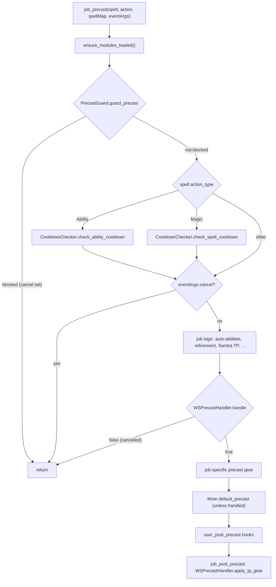
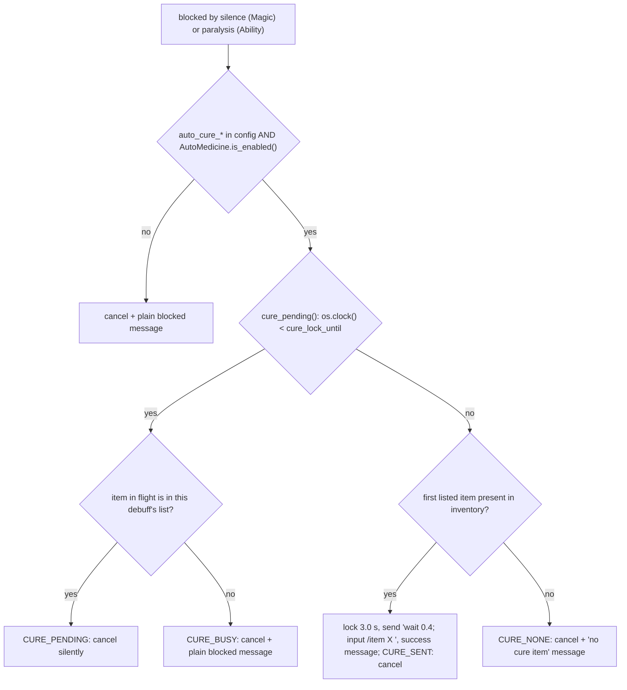
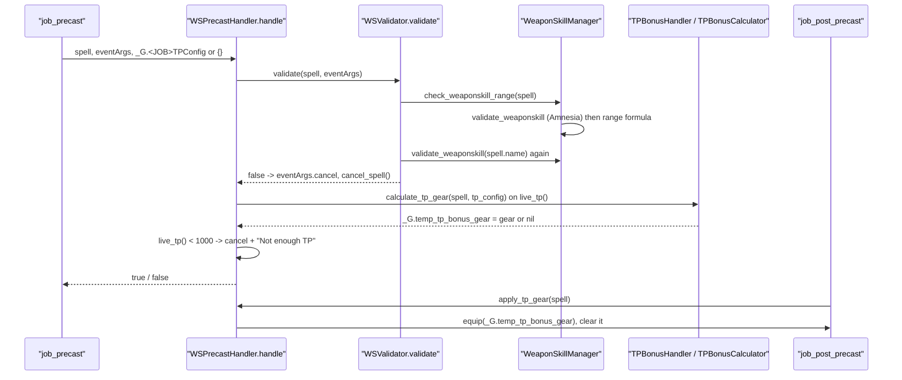

# Precast pipeline, weaponskills and debuff guard

This page covers everything that runs between the moment GearSwap intercepts an
outgoing `/ma`, `/ja`, `/ws` or `/item` command and the moment precast gear is
sent: the debuff guard (`PrecastGuard` + `DebuffChecker` + automatic cure items),
the recast check (`CooldownChecker` + `RECAST_CONFIG`), the pre-action ability
trigger (`AbilityHelper`), the weaponskill chain (`WSPrecastHandler` ->
`WSValidator` -> `WeaponSkillManager`, TP-bonus gear), the tier downgrade engine
(`TierRefiner`), the weaponskill slots (`WSSlots`, WAR and PLD) and the Doom slot lock
(`DoomManager`). The modules are loaded lazily by every job's
`[JOB]_PRECAST.lua` (`ensure_modules_loaded()`), `DoomManager` by
`LifecycleManager`, and `AutoMedicine` by every job's `[JOB]_STATES.lua` plus
`INIT_SYSTEMS.lua`.

Line references are to the code as of 2026-09-25, after that day's audit fixes
(AbilityHelper replay marker, Z07-P1-1). Where a line number adds nothing the
page names the function instead.

## Files

| Path | Lines | Role |
|------|------:|------|
| `shared/utils/debuff/precast_guard.lua` | 475 | PrecastGuard: routes by `spell.type`, cancels blocked actions, sends Echo Drops/Remedy/Panacea |
| `shared/utils/debuff/debuff_checker.lua` | 288 | Blocking-debuff tables (production and test mode) and lookups |
| `shared/utils/debuff/auto_medicine.lua` | 202 | `state.AutoMedicine` On/Off, persisted in `windower._auto_medicine`, `//gs c am` |
| `shared/utils/debuff/doom_manager.lua` | 157 | Equips `sets.buff.Doom`, locks neck/ring1/ring2/waist, unlocks on removal or death |
| `shared/config/DEBUFF_AUTOCURE_CONFIG.lua` | 70 | Auto-cure switches, cure item lists, test mode |
| `shared/utils/precast/cooldown_checker.lua` | 143 | CooldownChecker: ability and spell recast checks with tolerance |
| `_master/config_global/RECAST_CONFIG.lua` | 99 | Recast tolerance (2.0 s) and global `is_recast_ready` / `is_on_cooldown` |
| `shared/utils/precast/ability_helper.lua` | 394 | AbilityHelper: fire a JA, then re-send the spell/WS once it has landed (or abort, via `follow_up_or_abort`); at most one attempt per action |
| `shared/utils/precast/ws_precast_handler.lua` | 103 | WSPrecastHandler: validation, TP gear, TP >= 1000 check on the game's own TP, TP gear application |
| `shared/utils/precast/ws_validator.lua` | 46 | Thin wrapper over WeaponSkillManager (range + Amnesia) |
| `shared/utils/weaponskill/weaponskill_manager.lua` | 133 | Range formula and Amnesia check; exported as `_G.WeaponSkillManager` |
| `shared/utils/precast/tp_bonus_handler.lua` | 85 | `live_tp()` (TP read from the game), computes TP gear into `_G.temp_tp_bonus_gear` |
| `shared/utils/weaponskill/tp_bonus_calculator.lua` | 275 | Pure TP-threshold arithmetic; exported as `_G.TPBonusCalculator` |
| `shared/utils/weaponskill/ws_slots.lua` | 141 | `//gs c ws1..ws9` (WAR) and `ws`, `ws1..` (PLD): weaponskill slots rebuilt per weapon |
| `shared/utils/precast/tier_refiner.lua` | 226 | TierRefiner: cast the highest tier whose recast and MP allow it |

Sampled job files used to document the contract: `shared/jobs/dnc/functions/DNC_PRECAST.lua`
(220), `shared/jobs/blm/functions/BLM_PRECAST.lua` (191),
`shared/jobs/brd/functions/BRD_PRECAST.lua` (313), `shared/jobs/whm/functions/WHM_PRECAST.lua`.
PLD and RDM precast files were read for the AbilityHelper and TierRefiner call sites.

## How it works

### Where precast comes from

1. GearSwap intercepts the outgoing command and calls `refresh_globals()`
   without a user-event flag (`GearSwap/triggers.lua:89`), so `player`,
   `player.vitals` and `buffactive` are refreshed from `windower.ffxi.get_player()`
   before any user code runs.
2. `filter_pretarget` (`GearSwap/helper_functions.lua:661`) drops spells the
   player does not know, and job abilities/weaponskills not listed in
   `windower.ffxi.get_abilities()`.
3. GearSwap builds the `spell` table. Two fields matter for routing here:
   - `spell.type` comes from the resource: `WhiteMagic`, `BlackMagic`, `BardSong`,
     `Ninjutsu`, `SummonerPact`, `BlueMagic`, `Geomancy`, `Trust` for spells;
     `JobAbility`, `PetCommand`, `CorsairRoll`, `CorsairShot`, `Samba`, `Waltz`,
     `Step`, `Flourish1-3`, `Jig`, `Scholar`, `Rune`, `Ward`, `Effusion`,
     `BloodPactRage`, `BloodPactWard`, `Monster` for abilities; `WeaponSkill`
     (`GearSwap/statics.lua:80`), `Item` (`GearSwap/triggers.lua:126`), `Misc`
     for `/ra`. **No spell ever has `spell.type == 'Magic'`.**
   - `spell.action_type` comes from the command prefix
     (`GearSwap/statics.lua:33-35`): `Magic`, `Ability` (this includes `/ws`),
     `Item`, `Ranged Attack`, `Trade`.
4. Mote's `handle_actions` (`GearSwap/libs/Mote-Include.lua:227`) calls
   `job_precast` (line 254). If `eventArgs.cancel` is set, Mote calls
   `cancel_spell()` and skips the rest. If only `eventArgs.handled` is set,
   Mote skips `default_precast` (line 263) but still runs `user_post_precast`
   (line 269, the message hooks in `shared/hooks/init_ability_messages.lua` and
   `init_ws_messages.lua`) and `job_post_precast` (line 274).
5. Gear placed with `equip()` during precast is sent even when the action is
   cancelled: GearSwap processes `equip_list` before `equip_sets_exit`
   (`GearSwap/flow.lua:115-170`).

### The job_precast contract

Every job's `job_precast` follows this order (DNC shown; BLM, BRD and WHM deviate as
noted below, RDM under [Tier refinement](#tier-refinement)):

- DNC (`DNC_PRECAST.lua:139-179`): guard (143), cooldown by `action_type` with
  Utsusemi Ichi/Ni excluded from the spell check (147-154), cancel check (156),
  Samba TP check against `spell.tp_cost`, skipped under Trance (`job_precast_samba`,
  99-110), Climactic timestamp (166), Jump and Climactic auto-triggers for
  weaponskills (`job_precast_weaponskill`, 116-137), then `WSPrecastHandler.handle`
  for every action (176; it returns `true` for non-WS).
  Post-precast applies the WS variant then the TP gear (`job_post_precast`, 190-205).
- BLM (`BLM_PRECAST.lua:137-168`): guard (140), then `check_recast_or_refine`
  (104-119): abilities are cooldown-checked unless listed in
  `BLM_SPELL_FILTERS.CHARGE_ABILITIES`; tiered spells go to
  `refine_various_spells` (BLM's own refiner, which calls
  `TierRefiner.find_available_tier`); other spells take the plain spell check.
- BRD (`BRD_PRECAST.lua:205-252`): guard (208), then `SongRefinement` **before**
  the cooldown check (217; BLM, RDM and WHM depart from the order for the
  same reason), cooldown (221-227), cancel check (229), then Pianissimo
  (`job_precast_bardsong`, through `AbilityHelper.follow_up_or_abort`) and Marcato
  (`try_marcato`) once the song's own recast has passed (236-241), WS handler (243),
  instrument lock (249-251).
- WHM (`WHM_PRECAST.lua:118-151`): guard (121), then `retier_cure` (128,
  helper 77-94) **before** the cooldown check: a Cure/Curaga that
  `CureManager.select_cure_tier` swaps for another tier is cancelled and re-sent
  under the new name, and `job_precast` returns; a cure left as it is (every
  tier on recast included) goes on to the cooldown check (132-137), cancel
  check (139), self-Paralyna under paralysis (143), WS handler (147). See
  [factories and helpers](factories-and-helpers.md#whm-curemanager).
- COR (`COR_PRECAST.lua`): guard, then `DoubleUp.redirect`
  (`cor/functions/logic/double_up.lua`, 2026-09-25) **before** the cooldown check: a
  Phantom Roll already up is cancelled and sent as Double-Up when Double-Up Chance is up
  and it is the last roll; otherwise cancelled with a warning. The Phantom Roll recast
  would otherwise cancel it first.

The five-line `action_type` dispatch in front of `CooldownChecker` is repeated in
all 16 `[JOB]_PRECAST.lua` files; `CooldownChecker` itself has no dispatcher.

### PrecastGuard routing

`PrecastGuard.guard_precast` (`precast_guard.lua:435-453`) dispatches on
`spell.type`:

| `spell.type` | Handler | Debuffs checked (`debuff_checker.lua`) | Auto-cure |
|---|---|---|---|
| `WeaponSkill` | `check_ws` (382) | universal + amnesia/impairment/paralysis (114-118) | none; if the highest-priority hit is paralysis the WS is let through (394-396) |
| `JobAbility`, `Ability`, `PetCommand` | `check_ja` (333) | universal + amnesia/impairment/paralysis (100-104) | paralysis -> Remedy, Panacea |
| `Magic` | `check_magic` (283) | universal + silence/mute/omerta | never reached, see gotchas |
| `Item` | `check_item` (410) | universal + encumbrance (120-122) | none |
| anything else (all real spells, CorsairRoll, Waltz, Samba, Step, Flourish, Jig, Scholar, Rune, Ward, Effusion, Blood Pacts, Monster, `/ra`) | `check_and_block` (184) with `spell.action_type` | `Magic` -> magic list; `Ability` -> JA list; `Ranged Attack` -> universal only (`check_action_blocked`, 211-236) | `Magic`+silence -> Echo Drops, Remedy; `Ability`+paralysis -> Remedy, Panacea |

Universal debuffs (checked first for every list, `debuff_checker.lua:107-112`):
stun, sleep, petrification, terror. Within a list the lowest `priority` wins
(`get_active_blocking_debuff`, 133-155), so Amnesia (1) hides Paralysis (3) and no
Remedy is spent on an action Amnesia would still block.

When a guard blocks, it sets `eventArgs.cancel = true` and prints one of
`MessageDebuffs.show_spell_blocked / show_ja_blocked / show_ws_blocked /
show_item_blocked / show_action_blocked`
(`shared/utils/messages/formatters/magic/message_debuffs.lua:29-170`).

### Automatic cure items

- `try_cure_debuff` (`precast_guard.lua:132-158`) walks the configured list in
  order and uses the first item with `count > 0` in the main inventory
  (`has_item_in_inventory`, 52-66). Wardrobes and other bags are not searched.
- The lock is one module-level timestamp for every debuff
  (`cure_lock_until`, 94) plus the name of the item in flight (`cure_in_flight`,
  97). `CURE_LOCK_DURATION = 3.0` (81), `CURE_INPUT_DELAY = 0.4` (87).
- The four outcomes (`CURE_SENT`, `CURE_PENDING`, `CURE_BUSY`, `CURE_NONE`,
  102-105) are what fixed the 2026-09-18 audit's P2-2: with Silence and
  Paralysis together, Echo Drops in flight no longer swallow a JA silently; the
  JA gets the plain blocked message (`CURE_BUSY`, see the "falls through" lines
  263, 317, 366). A Remedy in flight does cure both, so it answers
  `CURE_PENDING` for either debuff.
- The cure item is itself sent through `input /item`, so it goes through
  GearSwap precast and `PrecastGuard.check_item` like any other item.
- AutoMedicine Off does not unblock the action (`precast_guard.lua:229-231`,
  `auto_medicine.lua:7-9`): it only stops the item use.

### Recast check

`CooldownChecker.check_ability_cooldown` (`cooldown_checker.lua:90-112`):

1. `recast_id` from `spell.recast_id`, else `MANUAL_RECAST_IDS` (empty, 85).
   Weaponskills have no `recast_id`, so a WS passed here returns immediately.
2. Skips names in `MULTI_CHARGE_ABILITIES` (43-82).
3. Reads seconds via `MessageFormatter.get_ability_recast_seconds`
   (`message_cooldowns.lua:68`, `windower.ffxi.get_ability_recasts()`),
   applies `RECAST_CONFIG.on_cooldown` (tolerance) and, if on cooldown, prints
   `show_ability_cooldown` and sets `eventArgs.cancel`.

`check_spell_cooldown` (117-136) reads `windower.ffxi.get_spell_recasts()`
(centiseconds), divides by 100 for the tolerance test and passes centiseconds to
`show_spell_cooldown`.

The tolerance comes from `local RECAST_CONFIG = _G.RECAST_CONFIG or {}`, captured
once when the module is first executed (28). With `ModuleCache` installed
(`INIT_SYSTEMS.lua:53-58`) that first execution is the lazy `require` in the job's
`ensure_modules_loaded()`, which happens after the entry point has set
`_G.RECAST_CONFIG`. Without `RECAST_CONFIG` the checker falls back to
`recast > 0` (38) and AbilityHelper to `recast < 1` (`ability_helper.lua:29`).

### AbilityHelper

`try_ability` / `try_ability_smart` / `try_ability_ws`
(`ability_helper.lua:351-392`) share two local helpers:

- `may_try(spell, ability_name)` (320-324) refuses the attempt when the action
  is the replay of an earlier attempt (`is_replay`, below), when
  `DebuffChecker.check_ja_blocked()` reports a debuff other than Paralysis
  (`ja_blocked_without_cure`, 310-315: Amnesia, Impairment or a universal
  debuff; Paralysis keeps its attempt because PrecastGuard answers it on the
  ability with a Remedy or Panacea), or when `can_use_ability` says the player
  does not have the ability.
- `fire_then_replay` (332-341) sets `eventArgs.handled`, runs `cancel_spell()`,
  sends `input /ja "<ability>" <me>`, writes the replay marker
  `windower._ability_replay = {action = spell.name, expires = now + wait_time +
  FOLLOW_UP_GRACE + REPLAY_MARGIN}` and hands the re-send to `follow_up`.

When the ability is ready (tolerance applies) and its buff is not up, the three
entry points call `fire_then_replay`; `try_ability_ws` also sets
`eventArgs.cancel` and re-sends `/ws "<name>" <t>`, the other two re-send
`/ma "<name>" <target id>`. The re-sent action goes through the whole precast
pipeline again. There `is_replay` (294-304) finds the marker, consumes it and
returns true, so the action goes out as it is, without a second attempt at the
ability. The marker lives on `windower` because the follow-up coroutine
outlives a `gs reload`; it expires on its own (`expires`), and a different
action name does not match it.

This bounds the old infinite loop (2026-09-25 audit Z07-P1-1, fixed that day):
an ability that could not fire while its recast read ready (Amnesia,
Impairment, level sync, or an ability the player does not have) used to leave
the spell cancelled and re-sent every `wait_time` seconds for as long as the
condition lasted. Now each action tries the ability at most once. Paralysis
without a cure item still costs one attempt (the guard cancels the ability,
`follow_up` sends the spell once the refusal is visible).

`can_use_ability` (56-70) reads `windower.ffxi.get_abilities().job_abilities`,
the same list GearSwap filters outgoing `/ja` commands against, so it follows
job, subjob, level sync and job points.

**`follow_up` waits for the ability to land, it does not wait a fixed delay**
(`ability_helper.lua:159-207`). This matters when adding a new call site,
because the shape it replaced looks reasonable and is not: a single
`send_command('input /ja X; wait N; input /ma Y')` is a Windower chain that
never looks back, so an ability refused during an action lock let the spell go
out without it. Instead `follow_up` polls every `POLL_INTERVAL` (0.3 s) and
acts on whichever comes first:

- the buff is up — usually sooner than the old fixed delay;
- the ability provably never fired — its recast is still ready more than
  `JA_REGISTER_WINDOW` (1.0 s) after the send;
- the soft deadline `wait_time + FOLLOW_UP_GRACE` (3.0 s) passes.

In all three cases the follow-up **is sent**. That is deliberate: the caller
has already run `cancel_spell()`, so the follow-up is the only thing that will
cast, and dropping it would leave the player doing nothing at all.

`follow_up_or_abort` (`:223-278`) is the sibling for the opposite situation:
nothing was cancelled, and the follow-up on its own would be wrong. It sends
on the buff and otherwise gives up with a warning — "Cancelled: X was refused"
when the recast proves the ability never fired, "Cancelled: X never came up"
at the deadline. Used by GEO's `entrust` (`GEO_COMMANDS.lua:268-269`), where an
Indi- aimed at an ally does nothing without Entrust and Entrust carries a five
minute recast, and by BRD's Pianissimo (`BRD_PRECAST.lua:116`): BRD has cancelled the song, but a song aimed at another player is refused without Pianissimo, so re-sending it anyway gains nothing, and the `on_abort` callback lowers `_G.pianissimo_in_progress`.
`ScholarActions.run_chain` / `cast_with_stratagems`
(`shared/utils/scholar/scholar_actions.lua:204-279`) implement the same idea for
several buffs at once.

Choosing between them is the whole decision at a new call site: **did the
caller already cancel the player's action?** If yes, `follow_up`. If no,
`follow_up_or_abort`.

The "never fired" shortcut is skipped for abilities whose recast is shared
(`has_shared_recast`, `:109-132`). The four stratagems all report recast 231,
the shared charge pool, so a ready recast there only means a charge is left.

`windower._ability_follow_seq` (`:141`) invalidates a pending follow-up when a
new one starts. It lives on `windower` because that outlives the sandbox: after
a `gs reload` an orphaned poll would otherwise still believe it is current.

| Caller | Helper ability | Trigger |
|---|---|---|
| `PLD_PRECAST.lua:85` | Divine Emblem (`try_ability`) | Flash |
| `PLD_PRECAST.lua:88-100` | Majesty (`try_ability_smart`) | Protect III/IV/V, Cure III/IV |
| `RDM_PRECAST.lua:239` | Saboteur (`try_ability_smart`) | enfeebles in `RDMSaboteurConfig.auto_trigger_spells` when `state.SaboteurMode` is On |
| `dnc/functions/logic/climactic_manager.lua:66` | Climactic Flourish (`try_ability_ws`, 1 s) | configured WS, `player.tp >= min_tp`, target HP above `min_target_hpp`, and 3 or more Finishing Moves: any of the buffs `Finishing Move 3`, `4`, `5`, `(6+)` (`FINISHING_MOVES_3_PLUS`, `:28-33`) |
| `blm_functions.lua:285` | Dark Arts (`follow_up`) | a Dark Magic spell cast without Dark Arts up |
| `dnc/functions/logic/step_manager.lua:77` | Presto (`follow_up`) | a step, to guarantee the extra Finishing Move |
| `SAM_PRECAST.lua:110` | Third Eye (`follow_up`) | before Third Eye-gated actions |
| `BRD_PRECAST.lua:116` | Pianissimo (`follow_up_or_abort`) | a song aimed at another party member |
| `GEO_COMMANDS.lua:268` | Entrust (`follow_up_or_abort`) | `//gs c entrust` |
| `scholar_actions.lua:306-313` | Dark Arts, Addendum: Black (`follow_up`) | `cast_under_black_addendum`, e.g. Dispel on BLM/GEO |

`try_ability` and `try_ability_smart` set `eventArgs.handled` but not
`eventArgs.cancel`, so the job's `job_precast` keeps running after them and Mote
still calls `user_post_precast` and `job_post_precast`. `try_ability_ws` sets
both.

### Weaponskill chain

- `WSPrecastHandler`'s local `ensure_modules_loaded` (`ws_precast_handler.lua:24-40`)
  loads MessageFormatter, WSValidator and TPBonusHandler. It loads no WS
  database; only the WS message hook reads one
  ([messages](messages.md)).
- `ws_validator.lua:17` `include()`s `weaponskill_manager.lua`, which sets
  `_G.WeaponSkillManager` (`weaponskill_manager.lua:132`). With ModuleCache the
  validator (and so the include) runs once per sandbox.
- Range formula (`weaponskill_manager.lua:77-80`):
  `target.model_size + spell.range * 1.55 < target.distance` cancels. GearSwap
  gives `target.distance` in yalms (square root applied at
  `GearSwap/targets.lua:111-112`). If `spell.range`, `target.distance` or
  `target.model_size` is not a number the WS is cancelled without a message
  (70-75, messages only in `debug_mode`).
- `validate_weaponskill` (100-129) only checks `buffactive['Amnesia']`; its
  comment (110-112) says the TP check lives in WSPrecastHandler.
- **TP is read from the game, not from GearSwap's copy.** `WSPrecastHandler.handle`
  (`ws_precast_handler.lua:47-86`) cancels below 1000 TP using
  `TPBonusHandler.live_tp()` (`tp_bonus_handler.lua:41-47`), which reads
  `windower.ffxi.get_player().vitals.tp` and falls back to `player.vitals.tp`
  only when that read fails. GearSwap re-reads its own `player.vitals.tp` only
  when the last read is over 0.5 s old, so it can trail the real value; checking
  the 1000 TP threshold on it refused weaponskills the game would accept. Both
  values go to the trace log (`WSTP` tag) when `//gs c trace` is on. Changed in
  `518e536`.
- `WeaponSkillManager.MessageFormatter` (19) is never assigned, so the range and
  Amnesia errors always use the `MessageWeaponskill` fallbacks.

### TP bonus gear

`TPBonusHandler.calculate_tp_gear` (`tp_bonus_handler.lua:53-83`) reads
`live_tp()`, `player.equipment.main/sub` and `buffactive`, calls
`TPBonusCalculator.calculate` and stores the result in `_G.temp_tp_bonus_gear`.
`WSPrecastHandler.apply_tp_gear` (`ws_precast_handler.lua:91-101`) equips and
clears it in `job_post_precast`; DNC applies its WS variant first so the TP piece
is not overwritten (`DNC_PRECAST.lua:190-205`).

`TPBonusCalculator.calculate` (`tp_bonus_calculator.lua:162-213`):

1. Effective TP (`effective_tp`, 61-89) = current TP + `get_weapon_bonus(main)`
   + `get_weapon_bonus(sub)` when the sub is a different weapon (an off-hand TP
   Bonus weapon such as Centovente counts too) + `get_warcry_bonus()` (only if
   `buffactive['Warcry']`) + `get_hagakure_bonus()` (the config checks the buff
   itself) + `get_fencer_bonus(main, sub)`.
2. Next threshold from `config.thresholds = {2000, 3000}` (43, `next_threshold`
   92-99); none above 3000 -> nil.
3. Pieces sorted by bonus descending (`ranked_pieces`, 104-117). If the gap
   exceeds the sum -> nil.
4. `pieces_for_gap` (127-153): first single piece whose bonus covers the gap
   (the largest, since the list is sorted), else the greedy largest-first
   combination.

TP bonus from pieces already in the WS set is not part of step 1; only the
unused `get_final_tp` (220-270) counts equipped pieces, and it does not count
the sub weapon or Fencer.

TP config schema (per job, `Tetsouo/config/<job>/<JOB>_TP_CONFIG.lua`, loaded
into `_G.<JOB>TPConfig` by the entry point): `pieces = { {slot, name, bonus}, ... }`
plus optional `get_weapon_bonus(weapon)`, `get_warcry_bonus()`,
`get_hagakure_bonus()`, `get_fencer_bonus(weapon, sub)`. The BLM config
(`_master/config/blm/BLM_TP_CONFIG.lua:21`) defines `moonshade = {name, tp_bonus}`
instead of `pieces`, which the calculator does not read.

### Tier refinement

`TierRefiner.refine(spell, eventArgs, correspondence)` (`tier_refiner.lua:201-224`):

1. Returns `false` within `REPLACEMENT_COOLDOWN = 0.2 s` of the last replacement
   (36, 205), so the re-sent replacement is not refined again.
2. Parses `spell.name` with `(%a+)%s*(%a*)` into category and tier (210).
3. `find_available_tier` (58-86) walks `correspondence[tier].replace` for at
   most `MAX_STEPS = 8` steps (32) and returns the first tier with recast exactly 0
   and `player.mp >= mp_cost` (no tolerance here).
4. A different tier -> `execute_replacement` (172-188): stamp, send
   `wait 0.1; @input /ma "<new>" <target.raw>`, cancel, `show_spell_refinement`.
5. Same tier -> `show_unavailable` (137-159): if the requested spell's recast is
   0 the cast is let through (MP failures are left to the server); otherwise
   cancel and print the requested spell plus every lower tier's recast through
   `MessageCooldowns.show_multi_status`.

Callers: RDM `stage_cooldown` (`RDM_PRECAST.lua:139`) for families in
`shared/data/spells/RDM_ENFEEBLE_TIERS.lua` (instead of the cooldown check);
BLM `replacement_logic.lua:54` uses `find_available_tier` only. BLM keeps its
own copies of the recast display and replacement
(`blm/functions/logic/refiner/recast_display.lua`,
`special_handlers.lua`).

### WSSlots (WAR, PLD)

`WSSlots.sync(weapon_state, config)` (`ws_slots.lua:94-108`) matches the equipped
main/sub to a `state.MainWeapon` option (`detect_weapon`, 63-85), then
`rebuild` (40-55) recreates `state.WS1..WS<max_slots>` as Mote modes listing that
weapon's weaponskills. WAR calls `sync` from `WAR_STATES.lua` (`_master/config/war/WAR_STATES.lua:74`)
and from the entry's `sync_weapon_with_hand` (`_master/entry/Tetsouo_WAR.lua:163`), and
`rebuild` from `WAR_COMMANDS.lua` `job_state_change` when `MainWeapon` changes. PLD
calls `rebuild` from `PLD_STATES.lua` and `PLD_COMMANDS.lua`.
`WSSlots.cast(i)` (125-139) sends `input /ws "<name>" <t>`, which then goes
through the normal WS precast. WAR answers `ws1`..`ws9` (`WAR_COMMANDS.lua:255-264`;
only five slots exist, a higher number warns), PLD `ws` (= slot 1) and `ws1`..`ws9`.

### Doom

`DoomManager.handle_buff_change(buff, gain)` (`doom_manager.lua:67-104`) acts
only on `buff == 'doom'` (GearSwap passes `res.buffs[id].english`, lowercase
`doom`). It reads `buffactive['doom']` rather than `gain`. Doomed: equip
`sets.buff.Doom` **then** `disable('neck','ring1','ring2','waist')` (the order
matters: `disable` is honoured at `equip()` time, `GearSwap/helper_functions.lua:319-326`).
Not doomed: `enable` the four slots and `handle_equipping_gear(player.status)`.
It returns `true` for any doom event, which makes `LifecycleManager.buff_change`
skip the job's own handler.

`handle_status_change` (112-133) re-enables the four slots on entering `Dead`
and on leaving it, re-equipping for the new status if Doom is gone.

Every job wires both through `LifecycleManager` (`shared/utils/core/lifecycle_manager.lua:38-59`)
or its own `[JOB]_BUFFS.lua` / `[JOB]_STATUS.lua` (DRK, GEO, SMN, THF, WAR).

GearSwap's `disable_table` is a GearSwap global (`GearSwap/statics.lua:194`)
that `load_user_files` does not reset, so a Doom lock survives `gs reload` and
job changes until something calls `enable`.

## Public API

### PrecastGuard (`shared/utils/debuff/precast_guard.lua`)

| Function | Returns | Side effects | Callers |
|---|---|---|---|
| `guard_precast(spell, eventArgs)` (435) | `true` if blocked | may set `eventArgs.cancel`, send a cure item, print | first step of all 16 `[JOB]_PRECAST.lua` |
| `check_and_block(spell, eventArgs)` (184) | blocked | same | `guard_precast` fallback |
| `check_magic(spell, eventArgs)` (283) | blocked | same | `guard_precast` only, unreachable |
| `check_ja(spell, eventArgs)` (333) | blocked | same | `guard_precast` |
| `check_ws(spell, eventArgs)` (382) | blocked | cancel + message | `guard_precast` |
| `check_item(spell, eventArgs)` (410) | blocked | cancel + message | `guard_precast` |
| `would_block(action_type)` (464) | blocked, debuff name | none | no caller |
| `get_active_blocks()` (471) | list | none | no caller |

### DebuffChecker (`shared/utils/debuff/debuff_checker.lua`)

`check_magic_blocked()`, `check_ja_blocked()`, `check_ws_blocked()`,
`check_item_blocked()` (178-204) each return `blocked, debuff_name, message`.
`check_ja_blocked` is also called by `AbilityHelper` (`ja_blocked_without_cure`).
`check_action_blocked(action_type)` (211-236) dispatches on
`"Magic"`, `"Ability"/"JobAbility"/"PetCommand"`, `"WeaponSkill"/"Weaponskill"`,
`"Item"`, `"Ranged"` (GearSwap never produces `"Ranged"`; `/ra` is
`"Ranged Attack"` and falls to universal-only). `get_all_active_blocks()` (240)
and `is_incapacitated()` (283) have no caller outside this module chain.

### AutoMedicine (`shared/utils/debuff/auto_medicine.lua`, also `_G.AutoMedicine`)

| Function | Effect | Callers |
|---|---|---|
| `init(state_table, mode_ctor)` (90) | creates `state.AutoMedicine = M{'On','Off'}`, wraps `cycle/set/reset/toggle` to persist, restores the persisted value | every `[JOB]_STATES.lua` (`_master/config/*/`, 14 files; live copies) |
| `ensure()` (124) | `init()` if the state is missing | `INIT_SYSTEMS.lua:150-152` |
| `is_enabled()` (137) | `state.AutoMedicine.value == 'On'`, else persisted value | PrecastGuard (231, 307, 356) |
| `toggle()` (147), `set(enabled)` (184) | change and persist | `handle_command` |
| `handle_command(arg)` (162) | `on`/`off`/toggle, repaint the HUD if visible, print | `CommonCommands.handle_automedicine` (`COMMON_COMMANDS.lua:259-266`) |

### DoomManager (`shared/utils/debuff/doom_manager.lua`)

`handle_buff_change(buff, gain) -> boolean` (67), `handle_status_change(new, old)`
(112); callers listed above. `validate_doom_set()` (139) has no caller.

### CooldownChecker (`shared/utils/precast/cooldown_checker.lua`)

`check_ability_cooldown(spell, eventArgs)` (90) and
`check_spell_cooldown(spell, eventArgs)` (123). Both set `eventArgs.cancel` and
print when on cooldown. Callers: all 16 `[JOB]_PRECAST.lua`, always gated by
`spell.action_type` (`'Ability'` / `'Magic'`). There is no third "exclusions"
parameter.

### RECAST_CONFIG (`Tetsouo/config/RECAST_CONFIG.lua`, template `_master/config_global/RECAST_CONFIG.lua`)

`RECAST_CONFIG.is_ready(recast, custom_tolerance)` (48): `nil` -> false; if
`enabled` is false, `recast == 0`; else `recast <= tolerance`.
`RECAST_CONFIG.on_cooldown(...)` (68) is its negation. Globals
`is_recast_ready(recast)` and `is_on_cooldown(recast)` (79-92) are exported with
`_G.RECAST_CONFIG` (95-97) and used directly by `waltz_manager.lua`,
`drg/auto_jump.lua`, `drg/DRG_JUMP_MANAGER.lua`,
`smartbuff/subjob_war_buffs.lua`, the DNC/THF/WAR smartbuff managers, the DNC
step manager, the PLD/RUN aoe and rune managers and `BLM_COMMANDS.lua`.

### AbilityHelper (`shared/utils/precast/ability_helper.lua`)

`can_use_ability(name)` (56), `is_ability_ready(name)` (75),
`is_buff_active(name)` (87), `follow_up(name, command, wait)` (159),
`follow_up_or_abort(name, command, wait, on_abort)` (223),
`try_ability(spell, eventArgs, name, wait)` (351, default wait 2),
`try_ability_smart(...)` (366, same but returns early when the buff is up),
`try_ability_ws(...)` (383, re-sends `/ws "<name>" <t>` and sets `eventArgs.cancel`).
Ability lookups are memoised in `ability_cache` (38), shared-recast answers in
`shared_recast_cache` (98).

### Weaponskill modules

- `WSPrecastHandler.handle(spell, eventArgs, tp_config) -> boolean` (47):
  `true` for non-WS or a WS that may proceed. `apply_tp_gear(spell)` (91).
  Callers: all 16 `[JOB]_PRECAST.lua`.
- `WSValidator.validate(spell, eventArgs) -> boolean` (`ws_validator.lua:24`).
  Caller: WSPrecastHandler only.
- `WeaponSkillManager.check_weaponskill_range(spell)` (45),
  `validate_weaponskill(ws_name)` (100), `initialize()` (36, no caller),
  `config` (25-29; `distance_check_enabled` is never read).
- `TPBonusHandler.live_tp()` (`tp_bonus_handler.lua:41`),
  `TPBonusHandler.calculate_tp_gear(spell, tp_config)` (53), internal to WSPrecastHandler.
- `TPBonusCalculator.calculate(tp, cfg, main, buffs, sub) -> table|nil` (162),
  `get_final_tp(...)` (220, no caller), `config.thresholds`, `config.debug_mode`.
- `WSSlots.rebuild`, `detect_weapon`, `sync`, `get`, `cast` (`ws_slots.lua:40-139`).

### TierRefiner (`shared/utils/precast/tier_refiner.lua`)

`refine(spell, eventArgs, correspondence) -> boolean` (201),
`find_available_tier(name, corr, category, tier, recasts, mp) -> string` (58),
`collect_tier_cooldowns(category, start, corr, recasts) -> list` (98),
`show_unavailable(...)` (137), `execute_replacement(...)` (172).

## Commands

| Command | Args | Effect | Handler |
|---|---|---|---|
| `//gs c automedicine` / `//gs c am` | optional `on` / `off` | toggle or force `state.AutoMedicine`, persist, repaint HUD, print | `COMMON_COMMANDS.lua:553` -> `auto_medicine.lua:162` |
| `//gs c cyclestate AutoMedicine` | - | Mote cycle through the wrapped `cycle` (persists) | bound to `#numpad0` by each character's `config/COMMON_KEYBINDS.lua` (template `_master/config_global/COMMON_KEYBINDS.lua`), merged into every job's binds |
| `//gs c ws1` .. `//gs c ws9` (WAR), `ws`, `ws1`.. (PLD) | - | fire the weaponskill held by slot N | `WAR_COMMANDS.lua:255-264`, `PLD_COMMANDS.lua` -> `ws_slots.lua:125` |
| `//gs c debugprecast` | - | toggle `_G.PrecastDebugState` (read by RDM, BRD, RUN precast debug output), persisted in `windower._gs_debug.PRECAST` | `DEBUG_COMMANDS.lua:516` |

## Configuration

### `shared/config/DEBUFF_AUTOCURE_CONFIG.lua` (shared, no per-character copy)

| Key | Default | Read by |
|---|---|---|
| `test_mode` | `false` (29) | `debuff_checker.lua:23` (at load, builds test tables), `precast_guard.lua:212,221,300,349` |
| `test_debuff` | `"Berserk"` (30) | only `check_magic` (300), which is unreachable |
| `auto_cure_silence` | `true` (39) | `precast_guard.lua:201, 294` |
| `silence_cure_items` | Echo Drops 4151, Remedy 4155 (40-43) | `precast_guard.lua:42` |
| `auto_cure_paralysis` | `true` (48) | `precast_guard.lua:206, 344` |
| `paralysis_cure_items` | Remedy 4155, Panacea 4145 (49-52) | `precast_guard.lua:43` |
| `auto_cure_poison`, `auto_cure_blind` | `false` (57-58) | nothing |
| `debug` | `false` (64) | test-mode messages in PrecastGuard |

If the file fails to load, `precast_guard.lua:22-41` uses built-in defaults
(Panacea included) and `debuff_checker.lua:23` runs in production mode. Both
modules read the config once at load; changes need a `gs reload`.

Test mode (`debuff_checker.lua:31-37`) maps WAR buffs to debuffs: Berserk ->
Silence, Aggressor -> Amnesia, Warcry -> Stun, Defender -> Paralysis. In test mode
the production lists are empty.

### RECAST_CONFIG

`tolerance = 2.0` (34), `enabled = true` (38). Each entry point loads it with
`_G.RECAST_CONFIG = require('<Char>/config/RECAST_CONFIG')` (e.g.
`_master/entry/Tetsouo_WAR.lua:117`; `_master/entry/Tetsouo_SAM.lua:82`). The
`Tetsouo/config` and `Kaories/config` copies differ from the template only by
their `@file` line (comments aligned 2026-09-25).

### TP configs

`Tetsouo/config/<job>/<JOB>_TP_CONFIG.lua` (templates in `_master/config/<job>/`),
schema above. Jobs pass `_G.<JOB>TPConfig or {}`; an empty config yields no TP
gear.

## State & lifetime

| State | Where | Lifetime |
|---|---|---|
| `cure_lock_until`, `cure_in_flight` | `precast_guard.lua:94,97` | module-level; reset by `gs reload` / job change (new sandbox) |
| `last_replacement_time` | `tier_refiner.lua:37` | module-level |
| `ability_cache`, `shared_recast_cache` | `ability_helper.lua:38,98` | module-level, never invalidated |
| `windower._ability_follow_seq` | `ability_helper.lua:141,168,243` | survives `gs reload`; invalidates an older follow-up |
| `windower._ability_replay` | written `ability_helper.lua:336`, consumed or expired in `is_replay` (294-304) | survives `gs reload` until consumed or expired (wait time + 4 s) |
| `modules_loaded` + cached module refs | `ws_precast_handler.lua:22`, `tp_bonus_handler.lua:20` | module-level |
| `_G.temp_tp_bonus_gear` | written `tp_bonus_handler.lua:82`, cleared `ws_precast_handler.lua:99` | sandbox global; left set if the WS is cancelled after the calculation, overwritten by the next WS |
| `_G.RECAST_CONFIG`, `_G.is_recast_ready`, `_G.is_on_cooldown` | `_master/config_global/RECAST_CONFIG.lua:95-97` | sandbox globals, set by the entry point |
| `_G.WeaponSkillManager`, `_G.TPBonusCalculator`, `_G.AutoMedicine` | `weaponskill_manager.lua:132`, `tp_bonus_calculator.lua:273` / `tp_bonus_handler.lua:28`, `auto_medicine.lua:200` | sandbox globals |
| `windower._auto_medicine` | `auto_medicine.lua:42,52` | survives `gs reload` and job change; reset by `lua reload gearswap` |
| `state.AutoMedicine`, `state.WS1..n` | `auto_medicine.lua:116`, `ws_slots.lua` `rebuild` | Mote states; recreated by `user_setup` on each load and subjob change |
| GearSwap `disable_table` (Doom lock) | `doom_manager.lua:86,92,119,125` | GearSwap global, survives reload |

No module in this area registers Windower events, binds keys or creates text
objects. Deferred work: Windower `wait` chains in `send_command`
(`precast_guard.lua:146-148`, `tier_refiner.lua:175`), which cannot be cancelled
and outlive a `gs reload` (they are plain console commands), and the
AbilityHelper poll (`coroutine.schedule`, invalidated by
`windower._ability_follow_seq`).

## Interactions

- Messages: `MessageFormatter` / `MessageCooldowns` / `MessageDebuffs` /
  `MessageWeaponskill` / `MessageCombat` / `MessageCore.show_test_mode` (see
  [messages](./messages.md)).
- Keybind HUD: `auto_medicine.lua:68-77` calls `UI_MANAGER.update()` when visible.
- `INIT_SYSTEMS.lua` installs `ModuleCache` (53-58) before any of these modules
  are required, and calls `AutoMedicine.ensure()` (150-152).
- Message hooks `init_ability_messages.lua` / `init_ws_messages.lua` wrap
  `user_post_precast`; the WS hook re-reads TP from `windower.ffxi.get_player()`
  and stays silent below 1000.
- Trace: `WSPrecastHandler.handle` (`WSTP`) and `TPBonusHandler.calculate_tp_gear`
  (`TP`) write to `<Character>/trace.log` while `//gs c trace on`; see
  [commands-and-debug.md](commands-and-debug.md).
- Jobs: [DNC](../jobs/dnc.md), [BLM](../jobs/blm.md), [BRD](../jobs/brd.md),
  [PLD](../jobs/pld.md), [RDM](../jobs/rdm.md), [WAR](../jobs/war.md),
  [THF](../jobs/thf.md), [SAM](../jobs/sam.md).

## Invariants & gotchas

- `spell.type` is never `"Magic"`. All spells reach
  `PrecastGuard.check_and_block` through the fallback branch
  (`precast_guard.lua:450-451`), so `check_magic` and the configurable
  `test_debuff` are dead; in test mode only Berserk simulates Silence
  (hard-coded at 212).
- A `/ws` has `action_type == 'Ability'`; code that dispatches on
  `action_type` must test `spell.type == 'WeaponSkill'` first if it matters.
  `check_ability_cooldown` is harmless on a WS only because WS resources have no
  `recast_id`.
- Weaponskills are never blocked by Paralysis alone, job abilities always are,
  and spells never are.
- The Silence/Paralysis cure lock is shared on purpose (`precast_guard.lua:89-94`);
  `CURE_BUSY` makes the second debuff visible instead of silent.
- Auto-cure item uses are themselves `/item` commands and pass through
  `check_item`; anything that blocks items also blocks the auto-cure after the
  success message has been printed.
- `CooldownChecker` and `AbilityHelper` capture `_G.RECAST_CONFIG` when first
  executed. Requiring either before the entry point sets it freezes the
  fallback behaviour for the whole sandbox.
- AbilityHelper tries a helper ability at most once per action: the re-sent
  action carries the replay marker and goes out without it. A new call site
  that re-sends an action by another path (not through `fire_then_replay`) does
  not get that protection.
- The 1000 TP check reads the game's TP (`live_tp`), not `player.vitals.tp`. Do
  not "simplify" it back to the GearSwap copy: that copy lags and refused
  weaponskills the game accepts.
- The DNC Climactic auto-trigger runs before `WSPrecastHandler` (range, TP), so
  a WS pressed out of range still fires Climactic Flourish first.
- `WSValidator` calls `validate_weaponskill` twice on the success path, and
  PrecastGuard has already blocked Amnesia before it runs.
- TierRefiner requires recast exactly 0 while CooldownChecker tolerates 2.0 s;
  a tier with 1 s left is skipped by the refiner even though the checker would
  let it through.
- Doom handling is keyed on the lowercase English buff name; the lock covers
  exactly neck, ring1, ring2, waist whatever `sets.buff.Doom` contains.
- `handle_status_change` tests only `'Dead'`. GearSwap passes
  `res.statuses[...].english` (`GearSwap/gearswap.lua:328`), and a death while
  engaged is `'Engaged dead'` (`res/statuses.lua:7`), which the status safety
  unlock does not match; the buff-loss path still unlocks.
- `/ra` has `spell.type == 'Misc'` (`GearSwap/statics.lua:134`), never
  `'RangedAttack'` or `'Ranged Attack'`; only `spell.action_type` identifies it.

## Extending

- **New blocking debuff**: add it to the right production table in
  `debuff_checker.lua:94-122` (lowercase name, `priority`, `message`) and to
  `DEBUFF_DEFINITIONS` (41-62) if it should have a test-mode stand-in.
- **New cure item**: add `{ name, id }` to `silence_cure_items` or
  `paralysis_cure_items` in `DEBUFF_AUTOCURE_CONFIG.lua`, in priority order.
  Auto-cure for a new debuff needs a new branch in `check_and_block` /
  `check_ja` and a message pair in `message_debuffs.lua`.
- **New multi-charge ability**: add it to `MULTI_CHARGE_ABILITIES`
  (`cooldown_checker.lua:43-82`). PLD, RUN and BLM keep their own lists
  (`cooldown_exclusions` in `PLD_PRECAST.lua:56` and `RUN_PRECAST.lua:50`,
  `BLM_SPELL_FILTERS.CHARGE_ABILITIES`).
- **New auto-trigger ability**: call `AbilityHelper.try_ability_smart` after the
  cooldown check in the job's `job_precast`; return after it if the rest of the
  job logic must not run for the cancelled spell.
- **New TP piece**: add `{slot, name, bonus}` to the job's `pieces`; weapon/buff
  bonuses go in the `get_*_bonus` callbacks.
- **New tier family**: add `Family = { ['III'] = {replace='II'}, ['II'] = {replace=''} }`
  to the correspondence table the job passes to `TierRefiner.refine`.

## Known issues

Open:

- Encumbrance blocks all `/item` use (auto-cure included) while Muddle is not detected: `shared/utils/debuff/debuff_checker.lua:120-122`.
- Paralysis blocks Healing Waltz, the JA that removes it: `shared/utils/debuff/precast_guard.lua:206-208`, `:244-257`.
- `check_magic` unreachable; `test_debuff` ignored; `"Ranged"` branch dead: `shared/utils/debuff/precast_guard.lua:446`, `debuff_checker.lua:220`.
- `MULTI_CHARGE_ABILITIES` includes single-recast abilities (Light/Dark Arts, Sublimation, Enlightenment, Tabula Rasa); the comment now says so, the list is unchanged: `shared/utils/precast/cooldown_checker.lua:55-81`.
- Unused API and dead branches in the WS chain (`initialize`, `MessageFormatter` field, `distance_check_enabled`, `get_final_tp`): `shared/utils/weaponskill/weaponskill_manager.lua:16-40`.
- Unused PrecastGuard/DebuffChecker API (`would_block`, `get_active_blocks`, `get_all_active_blocks`, `is_incapacitated`): `shared/utils/debuff/precast_guard.lua:464-475`.
- BLM TP config uses a `moonshade` key the calculator never reads: `_master/config/blm/BLM_TP_CONFIG.lua:21`.
- Fixed 2026-09-25 (game test pending): THF no longer sets `_G.suppress_cooldown_messages` during `fbc` / `steal`, and the check no longer reads it.
- AbilityHelper replay marker (fixed 2026-09-25) not yet tested in game: Majesty before Cure IV, Saboteur before an enfeeble, Climactic before a WS, then the same under Amnesia (one message, the action goes out without the ability).

Fixed:

- AbilityHelper replayed the spell forever while the helper JA could not fire (Amnesia, unavailable ability): replay marker and `may_try` (fixed 2026-09-25).
- `can_use_ability` returned true for any existing ability (it read a `levels` field `res.job_abilities` does not have): it now reads `get_abilities().job_abilities` (fixed 2026-09-25).
- WSPrecastHandler's 1000 TP check on `player.vitals.tp` (a lagging copy): it reads the game's TP since `518e536`.
- `DoomManager.is_doom_locked` always returned false and unlocked the neck slot: removed in `a6dcd81`.
- `_G.DNC_AUTO_WS_RECAST` written but never read: removed in `f5a0976`.
- `.claude/rules/precast-pattern.md` documented a non-existent `exclusions` parameter: rewritten 2026-09-25 (`try_ability_ws(..., wait_time)`, DRK/DNC model).
