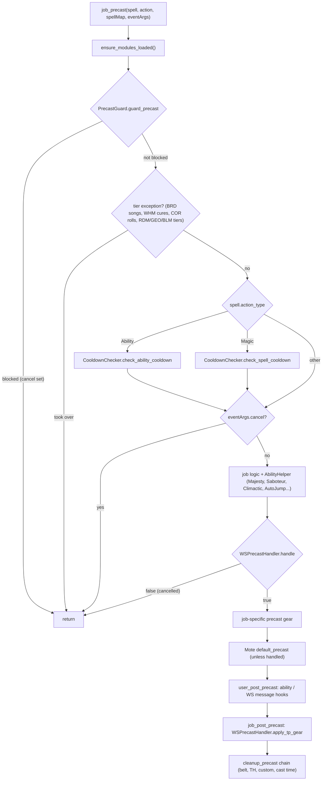
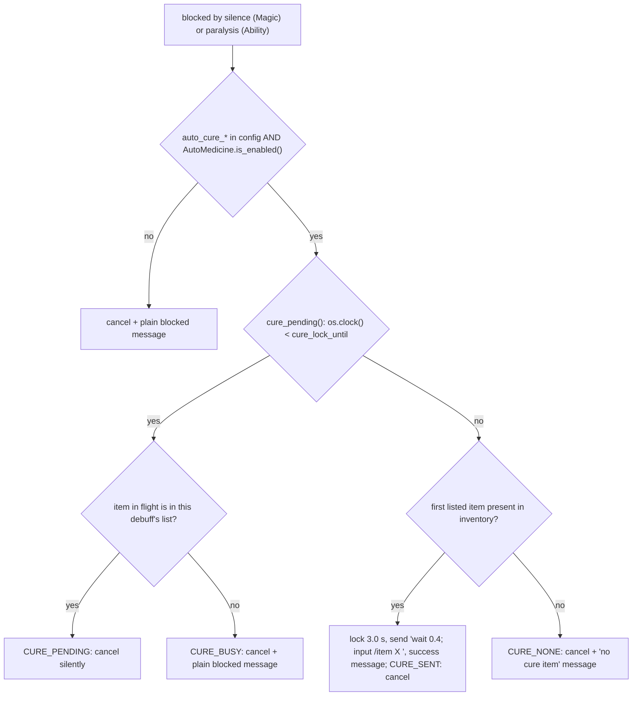
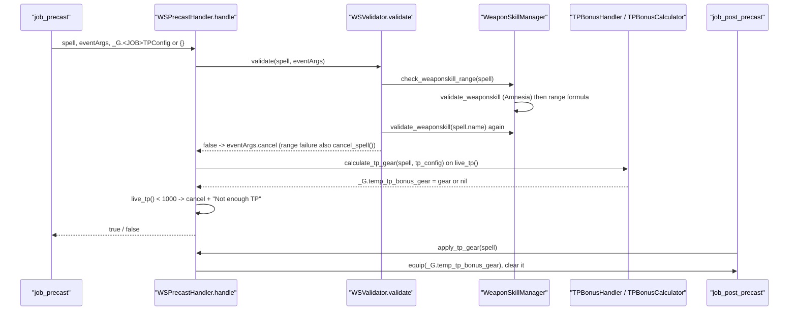

# Precast pipeline, weaponskills and debuff guard

This page covers everything that runs between the moment GearSwap intercepts an
outgoing `/ma`, `/ja`, `/ws`, `/ra` or `/item` command and the moment precast gear
is sent, and it is the reference for the **whole action lifecycle** (precast ->
midcast -> aftercast -> status rebuild) that the other pages link to:

- the debuff guard (`PrecastGuard` + `DebuffChecker` + automatic cure items, `AutoMedicine`);
- the recast check (`CooldownChecker` + `RECAST_CONFIG`) and its party announce (`RecastAnnounce`);
- the pre-action ability trigger (`AbilityHelper`);
- the weaponskill chain (`WSPrecastHandler` -> `WSValidator` -> `WeaponSkillManager`, TP-bonus gear);
- the tier downgrade engine (`TierRefiner`) and the tier tables it reads;
- the cast-time estimate recorded at the end of every precast (`CastTime`);
- the Flurry level for ranged precast sets (`FlurryTracker`);
- the weaponskill slots (`WSSlots`, WAR and PLD) and the Doom slot lock (`DoomManager`);
- the three universal message hooks in `shared/hooks/`.

Midcast set selection itself (`MidcastManager`, `MidcastFallback`, `MidcastTrace`,
`UtsusemiShadows`) is on [midcast-and-buffs.md](midcast-and-buffs.md).

References are to the code as of 2026-09-28. Where lines drift the page names the
function (`file` `function`); a raw `:NNN` is given only where the line itself matters.

## Files

| Path | Lines | Role |
|------|------:|------|
| `shared/utils/debuff/precast_guard.lua` | 475 | PrecastGuard: routes by `spell.type`, cancels blocked actions, sends Echo Drops/Remedy/Panacea |
| `shared/utils/debuff/debuff_checker.lua` | 288 | Blocking-debuff tables (production and test mode) and lookups |
| `shared/utils/debuff/auto_medicine.lua` | 202 | `state.AutoMedicine` On/Off, persisted in `windower._auto_medicine`, `//gs c am` |
| `shared/utils/debuff/doom_manager.lua` | 157 | Equips `sets.buff.Doom`, locks neck/ring1/ring2/waist, unlocks on removal or death |
| `shared/config/DEBUFF_AUTOCURE_CONFIG.lua` | 70 | Auto-cure switches, cure item lists, test mode |
| `shared/utils/precast/cooldown_checker.lua` | 146 | CooldownChecker: ability and spell recast checks with tolerance |
| `shared/utils/precast/recast_announce.lua` | 83 | Party message (`/p`) for an action refused on recast, per `RECAST_CONFIG.party_announce` |
| `_master/config_global/RECAST_CONFIG.lua` | 115 | Recast tolerance (2.0 s), party announce list, global `is_recast_ready` / `is_on_cooldown` |
| `shared/utils/precast/ability_helper.lua` | 409 | AbilityHelper: fire a JA, then re-send the spell/WS once it has landed (or abort, via `follow_up_or_abort`); at most one attempt per action |
| `shared/utils/precast/ws_precast_handler.lua` | 103 | WSPrecastHandler: validation, TP gear calculation, 1000 TP check on the game's own TP, TP gear application |
| `shared/utils/precast/ws_validator.lua` | 46 | Thin wrapper over WeaponSkillManager (range + Amnesia) |
| `shared/utils/weaponskill/weaponskill_manager.lua` | 133 | Range formula and Amnesia check; exported as `_G.WeaponSkillManager` |
| `shared/utils/precast/tp_bonus_handler.lua` | 79 | `live_tp()` (TP read from the game), computes TP gear into `_G.temp_tp_bonus_gear` |
| `shared/utils/weaponskill/tp_bonus_calculator.lua` | 275 | Pure TP-threshold arithmetic; exported as `_G.TPBonusCalculator` |
| `shared/utils/weaponskill/ws_slots.lua` | 159 | `//gs c ws1..ws9` (WAR) and `ws`, `ws1..` (PLD): weaponskill slots rebuilt per weapon |
| `shared/utils/precast/tier_refiner.lua` | 230 | TierRefiner: cast the highest learned tier whose recast and MP allow it |
| `shared/data/spells/RDM_ENFEEBLE_TIERS.lua` | 55 | Tier table for RDM enfeebles (`get(family)`) |
| `shared/data/spells/NUKE_TIERS.lua` | 56 | Tier table for nukes I-V, the GEO -ra nukes and Aspir (`get(family)`) |
| `shared/utils/precast/cast_time.lua` | 241 | CastTime: cast-time estimate from the gear actually sent; `cleanup_precast` hook, `PRECAST` trace line |
| `shared/utils/precast/flurry_tracker.lua` | 73 | FlurryTracker: Flurry I / II on this character, for `sets.precast.RA.Flurry1/2` |
| `shared/hooks/init_ability_messages.lua` | 97 | Wraps `user_post_precast`: job ability messages |
| `shared/hooks/init_ws_messages.lua` | 138 | Wraps `user_post_precast`: weaponskill messages |
| `shared/hooks/init_spell_messages.lua` | 97 | Wraps `user_post_midcast`: spell messages, Utsusemi: Ichi shadow cancel |

Job files used to document the contract: every `shared/jobs/<job>/functions/<JOB>_PRECAST.lua`
(17 files since BLU was added; BST also has `BST_PET_PRECAST.lua`, which does not run this pipeline).

## Action lifecycle, end to end

This is the full path of one action. It is the same for a spell, a job ability, a
weaponskill, a ranged attack and an item; only the set lookups differ.

### Engine side (GearSwap)

1. GearSwap intercepts the outgoing command and calls `refresh_globals()`
   (`GearSwap/triggers.lua`, before the `r_line` parse), so `player`,
   `player.vitals` and `buffactive` are refreshed from `windower.ffxi.get_player()`
   before any user code runs.
2. `filter_pretarget` (`GearSwap/helper_functions.lua`) drops spells the player does
   not know and job abilities / weaponskills not listed in `windower.ffxi.get_abilities()`.
3. GearSwap builds the `spell` table. Two fields matter for routing:
   - `spell.type` comes from the resource: `WhiteMagic`, `BlackMagic`, `BardSong`,
     `Ninjutsu`, `SummonerPact`, `BlueMagic`, `Geomancy`, `Trust` for spells;
     `JobAbility`, `PetCommand`, `CorsairRoll`, `CorsairShot`, `Samba`, `Waltz`,
     `Step`, `Flourish1-3`, `Jig`, `Scholar`, `Rune`, `Ward`, `Effusion`,
     `BloodPactRage`, `BloodPactWard`, `Monster` for abilities; `WeaponSkill`
     (`GearSwap/statics.lua`, `v.type = 'WeaponSkill'`), `Item`, `Misc` for `/ra`.
     **No spell ever has `spell.type == 'Magic'`.**
   - `spell.action_type` comes from the command prefix (`action_type_map` in
     `GearSwap/statics.lua`): `Magic`, `Ability` (this includes `/ws`), `Item`,
     `Ranged Attack`.
4. `pretarget` event (Mote: `default_pretarget` -> `auto_change_target`), then the
   `precast` event. Every user event runs inside `equip_sets(swap_type, ...)`
   (`GearSwap/flow.lua`), which clears `equip_list` on entry and sends it on exit.
   `equip()` only fills `equip_list`.
5. At the end of precast, `precast_send_check` (`flow.lua`) either deletes the
   command (if `cancel_spell()` was called) or calls `send_action`, which marks the
   action `midaction` and immediately runs the `midcast` event. In the midcast
   `equip_sets`, the action packet is injected **before** the midcast gear packets.
   So midcast gear goes on right after the action leaves; there is no wait.
6. Gear placed with `equip()` during precast is sent even when the action is
   cancelled: GearSwap processes `equip_list` before `equip_sets_exit`.
7. The action-completion packet (`packet_parsing.lua` / `triggers.lua`) runs the
   `aftercast` event. An interrupted spell gets `spell.interrupted = true`.

The project also wraps `_G.precast` once per sandbox (`warp_init.lua`
`hook_global_precast`): `WarpPrecast.handle_precast` runs **before** Mote's
`precast` for transport spells (see [warp.md](warp.md)).

### Mote side: `handle_actions(spell, action)`

`libs/Mote-Include.lua` routes `precast`, `midcast`, `aftercast`, `pet_midcast`
and `pet_aftercast` through one function. `precast(spell)` first sets
`state.Buff[spell.english] = true` when that key exists; `aftercast(spell)` sets
it to `not spell.interrupted or buffactive[...]`.

| Step (line in Mote-Include.lua) | Runs when | Project code that hooks it |
|---|---|---|
| `eventArgs = {handled=false, cancel=false}`, clear breadcrumbs, `spellMap = get_spell_map(spell)` (`:227-234`) | always | `job_get_spell_map` (per job) |
| `filter_<action>` (`:238`) | always | Mote only: `filter_midcast` / `filter_aftercast` cancel under `state.EquipStop`; `filter_aftercast` also cancels `Unknown Interrupt` |
| `user_<action>` (`:245`) | not cancelled | none defined in the project |
| `job_<action>` (`:254`) | not cancelled, not handled | `job_precast`, `job_midcast`, `job_aftercast` (job modules); `cancel_spell()` is called if it set `cancel` |
| `default_<action>` (`:263`) | not cancelled, not handled | Mote: `equip(get_precast_set)`, `equip(get_midcast_set)`, `handle_equipping_gear(player.status)` |
| `user_post_<action>` (`:269`) | not cancelled | `user_post_precast` (ability + WS message hooks), `user_post_midcast` (spell message hook) |
| `job_post_<action>` (`:274`) | not cancelled (handled does not matter) | `job_post_precast` (TP gear), `job_post_midcast` (MidcastManager) |
| `cleanup_<action>` (`:280`) | **always, even cancelled** | precast: belt, TH, custom, cast time; midcast: fallback, belt, TH, custom |

Consequences:

- `eventArgs.cancel` stops everything but `cleanup_*`. Every cleanup wrapper in the
  project therefore tests `eventArgs.cancel` itself.
- `eventArgs.handled` skips `default_*` only. `user_post_*` and `job_post_*` still
  run. `AbilityHelper.try_ability` relies on this (it sets `handled` and calls
  `cancel_spell()` without setting `cancel`).

### Precast set name resolution (Mote `get_precast_set`)

`default_precast` equips `get_precast_set(spell, spellMap)` (`Mote-Include.lua:628`).
The walk starts at `sets.precast` and returns `{}` when that table is missing.

1. **Category** from the action:

   | `spell.action_type` | `spell.type` | Category |
   |---|---|---|
   | `Magic` | any | `FC` |
   | `Ranged Attack` | - | `RangedAttack` if `sets.precast.RangedAttack` exists, else `RA` |
   | `Ability` | `WeaponSkill` | `WS` |
   | `Ability` | `JobAbility` | `JA` |
   | `Ability` | anything else (`Waltz`, `Step`, `CorsairRoll`...) | `spell.type` if `sets.precast[spell.type]` exists, else `JA` |
   | `Item` | - | `Item` |

   If `sets.precast[category]` does not exist the result is `{}` (nothing equipped).
2. **`select_specific_set`** (`:929`) on that table:
   - `get_named_set` (`:958`): the first of `classes.CustomClass`, `spell.english`,
     `spellMap` that exists as a key wins.
   - If none did: `equipSet[spell.skill]` (skipped when `classes.SkipSkillCheck`),
     else `equipSet[spell.type]`, else stop with the category table. After a skill
     or type hit, `get_named_set` runs again under it (so
     `sets.precast.FC['Enhancing Magic'].Stoneskin` works).
3. **Mode refinement**:
   - Magic: `[state.CastingMode.current]` when that key exists.
   - Weaponskill: `get_weaponskill_set` (`:798`): `state.WeaponskillMode.current`;
     when it is `Normal`, `state.OffenseMode.current` (or `RangedMode` for Archery /
     Marksmanship) is used instead if `WeaponskillMode` contains it; a job
     `get_custom_wsmode(spell, spellMap, ws_mode)` overrides; `[ws_mode]` applied if it exists.
   - Other abilities: `[classes.JAMode]` if set and present.
   - Ranged: `get_ranged_set` (`:838`): `[state.CombatForm]`, `[state.CombatWeapon]`,
     `[state.RangedMode.current]`, then each `classes.CustomRangedGroups` entry
     (this is where `FlurryTracker` puts `Flurry1` / `Flurry2`).
4. `set_elemental_gear(spell)`; the set is returned and equipped as a whole.

Examples: `Cure IV` with `spellMap = 'Cure'` -> `sets.precast.FC['Cure IV']`, else
`sets.precast.FC.Cure`, else `sets.precast.FC['Healing Magic']`, else
`sets.precast.FC.WhiteMagic`, else `sets.precast.FC`; then `.Resistant` if CastingMode
is Resistant and that sub-table exists. `Savage Blade` with WeaponskillMode `Normal`
and OffenseMode `Acc` -> `sets.precast.WS['Savage Blade'].Acc` if `WeaponskillMode`
lists `Acc`. `Provoke` -> `sets.precast.JA.Provoke`, else `sets.precast.JA`.

The chosen path is kept in `mote_vars.set_breadcrumbs`; `CastTime` writes it to the
trace log (`PRECAST ... -> sets.precast.FC.Cure`).

### The job_precast contract

Every job's `job_precast` follows this order (WAR shown; deviations below):


```mermaid
flowchart TD
    A["job_precast(spell, action, spellMap, eventArgs)"] --> B["ensure_modules_loaded()"]
    B --> C{"PrecastGuard.guard_precast"}
    C -- "blocked (cancel set)" --> X["return"]
    C -- "not blocked" --> T{"tier exception? (BRD songs, WHM cures, COR rolls, RDM/GEO/BLM tiers)"}
    T -- "took over" --> X
    T -- "no" --> D{"spell.action_type"}
    D -- "Ability" --> E["CooldownChecker.check_ability_cooldown"]
    D -- "Magic" --> F["CooldownChecker.check_spell_cooldown"]
    E --> G{"eventArgs.cancel?"}
    F --> G
    D -- "other" --> G
    G -- yes --> X
    G -- no --> H["job logic + AbilityHelper (Majesty, Saboteur, Climactic, AutoJump...)"]
    H --> I{"WSPrecastHandler.handle"}
    I -- "false (cancelled)" --> X
    I -- "true" --> J["job-specific precast gear"]
    J --> K["Mote default_precast (unless handled)"]
    K --> L["user_post_precast: ability / WS message hooks"]
    L --> M["job_post_precast: WSPrecastHandler.apply_tp_gear"]
    M --> N["cleanup_precast chain (belt, TH, custom, cast time)"]
```

The `action_type` dispatch in front of `CooldownChecker` is repeated in all 17
`[JOB]_PRECAST.lua` files; `CooldownChecker` itself has no dispatcher.

| Job | Deviation (function) |
|---|---|
| WAR | `WSPrecastHandler.validate` (range) then `AutoJump.auto_trigger_jump` (`shared/utils/drg/auto_jump.lua`, /DRG) **before** `WSPrecastHandler.handle` (TP): it cancels a WS short on TP, Jumps, and replays the WS |
| DNC | Utsusemi: Ichi/Ni excluded from the spell cooldown check; `job_precast_samba` checks `spell.tp_cost` against `live_tp()` (skipped under Trance); Climactic timestamp; `job_precast_weaponskill` runs `WSPrecastHandler.validate` (range), `JumpManager.auto_trigger_jump`, `WSPrecastHandler.handle` (TP), then `ClimaticManager.auto_trigger` (`AbilityHelper.try_ability_ws`, gated by `state.ClimacticAuto`). `job_post_precast` applies `WSVariantSelector.apply_variant` **then** the TP gear. `refine_waltz` is overridden with a no-op |
| BLM | `check_recast_or_refine`: abilities in `BLM_SPELL_FILTERS.CHARGE_ABILITIES` skip the cooldown check; tiered spells go to BLM's own `refine_various_spells` (`logic/refiner/`, which calls `TierRefiner.find_available_tier`); others take the plain spell check |
| BRD | `SongRefinement.refine_song` **before** the cooldown check; after the cancel check `job_precast_bardsong` (Pianissimo through `AbilityHelper.follow_up_or_abort`) and `try_marcato`; `WSPrecastHandler`; instrument lock for Honor March / Aria of Passion (`InstrumentLockConfig.requires_lock`) |
| WHM | `retier_cure` **before** the cooldown check: a Cure/Curaga that `CureManager.select_cure_tier` swaps is cancelled and re-sent under the new name; a cure left as it is goes on to the cooldown check. `paralyna_on_self` sets `handled` (no swap) for Paralyna while paralyzed. See [factories and helpers](factories-and-helpers.md#whm-curemanager) |
| COR | `DoubleUp.redirect` (`cor/functions/logic/double_up.lua`) **before** the cooldown check: a roll already up becomes Double-Up or is refused. `apply_cor_precast`: Crooked Cards timestamp, `job_precast_corsairroll`, `FlurryTracker.apply_ranged_groups()` for `/ra`, Double-Up gear. `job_post_precast`: TP gear, Luzaf's Ring (`apply_luzaf`), `hold_fold_gear` |
| RDM | Stages: `stage_guard`, `stage_cooldown` (tiered enfeebles, unless `state.EnfeebleTier` is Off, and tiered nukes go to `TierRefiner.refine` instead of the spell check), `stage_phalanx` (Phalanx II on self becomes Phalanx...), `stage_saboteur` (`AbilityHelper.try_ability_smart`), WS handler, `spell_gear_lock.begin`. `combat_mode.apply()` runs first. `//gs c debugprecast` prints each stage |
| GEO | Tiered spells in `NUKE_TIERS` (nukes, -ra, Aspir) go to `TierRefiner.refine` instead of the cooldown check; then `geo_auto_abilities.apply` (Entrust / Full Circle, `AbilityHelper.try_ability`) |
| PLD | `AbilityHelper.try_ability` (Divine Emblem before Flash) and `try_ability_smart` (Majesty before Protect / Cure) after the cancel check |
| BLU | `unbridled.lua`: `AbilityHelper.try_ability(..., 'Unbridled Learning', ...)` for Unbridled spells |
| SAM | Third Eye through `AbilityHelper.follow_up` |
| SMN | `WSPrecastHandler.handle(spell, eventArgs, {})` only for weaponskills |

### PrecastGuard routing

`PrecastGuard.guard_precast` (`precast_guard.lua:435-453`) dispatches on `spell.type`:

| `spell.type` | Handler | Debuffs checked (`debuff_checker.lua`) | Auto-cure |
|---|---|---|---|
| `WeaponSkill` | `check_ws` | universal + amnesia/impairment/paralysis | none; if the highest-priority hit is paralysis the WS is let through |
| `JobAbility`, `Ability`, `PetCommand` | `check_ja` | universal + amnesia/impairment/paralysis | paralysis -> Remedy, Panacea |
| `Magic` | `check_magic` | universal + silence/mute/omerta | never reached, see gotchas |
| `Item` | `check_item` | universal + encumbrance | none |
| anything else (all real spells, CorsairRoll, Waltz, Samba, Step, Flourish, Jig, Scholar, Rune, Ward, Effusion, Blood Pacts, Monster, `/ra`) | `check_and_block` with `spell.action_type` | `Magic` -> magic list; `Ability` -> JA list; `Ranged Attack` -> universal only (`check_action_blocked`) | `Magic`+silence -> Echo Drops, Remedy; `Ability`+paralysis -> Remedy, Panacea |

Universal debuffs (checked first for every list): stun, sleep, petrification,
terror. Within a list the lowest `priority` wins (`get_active_blocking_debuff`),
so Amnesia (1) hides Paralysis (3) and no Remedy is spent on an action Amnesia
would still block.

When a guard blocks, it sets `eventArgs.cancel = true` and prints one of
`MessageDebuffs.show_spell_blocked / show_ja_blocked / show_ws_blocked /
show_item_blocked / show_action_blocked`
(`shared/utils/messages/formatters/magic/message_debuffs.lua`).

### Automatic cure items


```mermaid
flowchart TD
    A["blocked by silence (Magic) or paralysis (Ability)"] --> B{"auto_cure_* in config AND AutoMedicine.is_enabled()"}
    B -- no --> Z["cancel + plain blocked message"]
    B -- yes --> C{"cure_pending(): os.clock() < cure_lock_until"}
    C -- yes --> D{"item in flight is in this debuff's list?"}
    D -- yes --> P["CURE_PENDING: cancel silently"]
    D -- no --> Q["CURE_BUSY: cancel + plain blocked message"]
    C -- no --> E{"first listed item present in inventory?"}
    E -- yes --> S["lock 3.0 s, send 'wait 0.4; input /item X <me>', success message; CURE_SENT: cancel"]
    E -- no --> N["CURE_NONE: cancel + 'no cure item' message"]
```

- `try_cure_debuff` walks the configured list in order and uses the first item with
  `count > 0` in the main inventory (`has_item_in_inventory`). Wardrobes and other
  bags are not searched.
- The lock is one module-level timestamp for every debuff (`cure_lock_until`) plus
  the name of the item in flight (`cure_in_flight`). `CURE_LOCK_DURATION = 3.0`,
  `CURE_INPUT_DELAY = 0.4`.
- The four outcomes (`CURE_SENT`, `CURE_PENDING`, `CURE_BUSY`, `CURE_NONE`) make a
  second debuff visible: with Silence and Paralysis together, Echo Drops in flight no
  longer swallow a JA silently (`CURE_BUSY`). A Remedy in flight cures both, so it
  answers `CURE_PENDING` for either debuff.
- The cure item is itself sent through `input /item`, so it goes through GearSwap
  precast and `PrecastGuard.check_item` like any other item.
- AutoMedicine Off does not unblock the action: it only stops the item use.

### Recast check

`CooldownChecker.check_ability_cooldown(spell, eventArgs)`:

1. `recast_id` from `spell.recast_id`, else `MANUAL_RECAST_IDS` (empty). Weaponskills
   have no `recast_id`, so a WS passed here returns immediately.
2. Skips names in `MULTI_CHARGE_ABILITIES`: Quick Draw shots and the SCH
   stratagems (recast 231, a charge pool), plus Tabula Rasa (no recast to read).
   Light Arts, Dark Arts, Sublimation and Enlightenment have a plain recast each
   and are checked like any ability (since 2026-09-29), and so are the PUP
   maneuvers (one shared 10-second recast, no charges).
3. Reads seconds via `MessageFormatter.get_ability_recast_seconds`
   (`message_cooldowns.lua`, `windower.ffxi.get_ability_recasts()`), applies
   `RECAST_CONFIG.on_cooldown` (tolerance) and, if on cooldown, prints
   `show_ability_cooldown`, sets `eventArgs.cancel` and calls
   `RecastAnnounce.on_refused(spell, recast_id)` (under `pcall`).

`check_spell_cooldown` reads `windower.ffxi.get_spell_recasts()` (centiseconds),
divides by 100 for the tolerance test, passes centiseconds to `show_spell_cooldown`,
then `RecastAnnounce.on_refused(spell, nil)`.

The tolerance comes from `local RECAST_CONFIG = _G.RECAST_CONFIG or {}`, captured
once when the module is first executed (`cooldown_checker.lua:28`). With `ModuleCache`
installed (`INIT_SYSTEMS.lua`, top) that first execution is the lazy `require` in the
job's `ensure_modules_loaded()`, which happens after the entry point has set
`_G.RECAST_CONFIG`. Without `RECAST_CONFIG` the checker falls back to `recast > 0`
and AbilityHelper to `recast < 1`.

### RecastAnnounce

`RecastAnnounce.on_refused(spell, recast_id)` (`recast_announce.lua`, since 2026-09-28)
sends a party message for a refused action when the character's
`RECAST_CONFIG.party_announce` lists it:

- It reads `rawget(_G, 'RECAST_CONFIG')` **on every call** (unlike CooldownChecker,
  which captured its copy once).
- Keys tried in order: `spell.english`, `spell.name`, the shared recast's name from
  `res.ability_recasts[recast_id].en` (every roll is recast 193, "Phantom Roll").
  For spells `recast_id` is nil, so only the names are tried.
- Value `true` -> `<key> ready in <recast=<key>>`; a non-empty string is sent as is
  with `{action}` replaced by `spell.english`. The game expands `<recast=...>`.
- Anti-spam: one message per key per `party_announce_every` seconds (default 1),
  timed with `os.clock()` in `windower._recast_announce_last[key]`.
- Sent with `send_command('input /p ...')`.

### AbilityHelper

`try_ability` / `try_ability_smart` / `try_ability_ws` share two local helpers:

- `may_try(spell, ability_name)` refuses the attempt when the action is the replay of
  an earlier attempt (`is_replay`, below), when `DebuffChecker.check_ja_blocked()`
  reports a debuff other than Paralysis (`ja_blocked_without_cure`: Amnesia,
  Impairment or a universal debuff; Paralysis keeps its attempt because PrecastGuard
  answers it on the ability with a Remedy or Panacea), or when `can_use_ability` says
  the player does not have the ability.
- `fire_then_replay` sets `eventArgs.handled`, runs `cancel_spell()`, sends
  `input /ja "<ability>" <me>`, writes the replay marker
  `windower._ability_replay = {action = spell.name, expires = now + wait_time +
  FOLLOW_UP_GRACE + REPLAY_MARGIN}` and hands the re-send to `follow_up`.

When the ability is ready (tolerance applies) and its buff is not up, the three entry
points call `fire_then_replay`; `try_ability_ws` also sets `eventArgs.cancel` and
re-sends `/ws "<name>" <t>`, the other two re-send `/ma "<name>" <target id>`. The
re-sent action goes through the whole precast pipeline again. There `is_replay` finds
the marker, consumes it and returns true, so the action goes out as it is, without a
second attempt at the ability. The marker lives on `windower` because the follow-up
coroutine outlives a `gs reload`; it expires on its own (`expires`), and a different
action name does not match it.

`can_use_ability` reads `windower.ffxi.get_abilities().job_abilities`, the same list
GearSwap filters outgoing `/ja` commands against, so it follows job, subjob, level
sync and job points. `is_buff_active` reads `buffactive` first, then the game's
buff ids (`windower.ffxi.get_player().buffs` matched against `res.buffs[id].en`),
because `buffactive` lags in a scheduled poll.

**`follow_up` waits for the ability to land, it does not wait a fixed delay.** A
single `send_command('input /ja X; wait N; input /ma Y')` is a Windower chain that
never looks back, so an ability refused during an action lock let the spell go out
without it. Instead `follow_up` polls every `POLL_INTERVAL` (0.3 s) and acts on
whichever comes first:

- the buff is up;
- the ability provably never fired: its recast is still ready more than
  `JA_REGISTER_WINDOW` (1.0 s) after the send;
- the soft deadline `wait_time + FOLLOW_UP_GRACE` (3.0 s) passes.

In all three cases the follow-up **is sent**: the caller has already run
`cancel_spell()`, so the follow-up is the only thing that will cast.

`follow_up_or_abort(name, command, wait, on_abort)` is the sibling for the opposite
situation: nothing was cancelled, and the follow-up on its own would be wrong. It
sends on the buff and otherwise gives up with a warning ("Cancelled: X was refused"
or "Cancelled: X never came up") after running `on_abort`.

Choosing between them is the whole decision at a new call site: **did the caller
already cancel the player's action?** If yes, `follow_up`. If no, `follow_up_or_abort`.

The "never fired" shortcut is skipped for abilities whose recast is shared
(`has_shared_recast`): the four stratagems report recast 231, the shared charge pool,
so a ready recast there only means a charge is left.

`windower._ability_follow_seq` invalidates a pending follow-up when a new one starts
(both `follow_up` and `follow_up_or_abort` bump it). It lives on `windower` because
that outlives the sandbox.

| Caller | Helper ability | Trigger |
|---|---|---|
| `PLD_PRECAST.lua` | Divine Emblem (`try_ability`, 2 s) | Flash |
| `PLD_PRECAST.lua` | Majesty (`try_ability_smart`, 2 s) | Protect III/IV/V, Cure III/IV |
| `RDM_PRECAST.lua` `stage_saboteur` | Saboteur (`try_ability_smart`, `RDMSaboteurConfig.wait_time`) | enfeebles in `RDMSaboteurConfig.auto_trigger_spells` when `state.SaboteurMode` is On |
| `dnc/functions/logic/climactic_manager.lua` `auto_trigger` | Climactic Flourish (`try_ability_ws`, 1 s) | `state.ClimacticAuto` not Off, configured WS, live TP >= max(`min_tp`, 1000), target HP above `min_target_hpp`, 3 or more Finishing Moves |
| `blu/functions/logic/unbridled.lua` | Unbridled Learning (`try_ability`) | an Unbridled spell, unless Unbridled Wisdom is up |
| `geo/functions/logic/geo_auto_abilities.lua` `apply` | Entrust (`try_ability`, 1.5 s) | Indi- on an ally when turned on in `common/combat/AUTO_ABILITIES.lua` |
| `blm_functions.lua` | Dark Arts (`follow_up`) | a Dark Magic spell cast without Dark Arts up |
| `dnc/functions/logic/step_manager.lua` | Presto (`follow_up`) | a step, to guarantee the extra Finishing Move |
| `SAM_PRECAST.lua` | Third Eye (`follow_up`) | before Third Eye-gated actions |
| `brd/functions/logic/song_rotation_manager.lua` | Nightingale then Troubadour (`follow_up` chain) | song rotation, when both are ready |
| `BRD_PRECAST.lua` `job_precast_bardsong` | Pianissimo (`follow_up_or_abort`) | a song aimed at another party member |
| `GEO_COMMANDS.lua` | Entrust (`follow_up_or_abort`) | `//gs c entrust` |
| `scholar_actions.lua` `cast_under_black_addendum` | Dark Arts, Addendum: Black (`follow_up`) | e.g. Dispel on BLM/GEO |

`try_ability` and `try_ability_smart` set `eventArgs.handled` but not
`eventArgs.cancel`, so the job's `job_precast` keeps running after them and Mote
still calls `user_post_precast` and `job_post_precast`. `try_ability_ws` sets both.

### Weaponskill chain


```mermaid
sequenceDiagram
    participant J as "job_precast"
    participant H as "WSPrecastHandler.handle"
    participant V as "WSValidator.validate"
    participant M as "WeaponSkillManager"
    participant T as "TPBonusHandler / TPBonusCalculator"
    participant P as "job_post_precast"
    J->>H: spell, eventArgs, _G.<JOB>TPConfig or {}
    H->>V: validate(spell, eventArgs)
    V->>M: check_weaponskill_range(spell)
    M->>M: validate_weaponskill (Amnesia) then range formula
    V->>M: validate_weaponskill(spell.name) again
    V-->>H: false -> eventArgs.cancel (range failure also cancel_spell())
    H->>T: calculate_tp_gear(spell, tp_config) on live_tp()
    T-->>H: _G.temp_tp_bonus_gear = gear or nil
    H->>H: live_tp() < 1000 -> cancel + "Not enough TP"
    H-->>J: true / false
    P->>H: apply_tp_gear(spell)
    H->>P: equip(_G.temp_tp_bonus_gear), clear it
```

- `WSPrecastHandler`'s local `ensure_modules_loaded` loads MessageFormatter,
  WSValidator and TPBonusHandler under `pcall`. It loads no WS database; only the WS
  message hook reads one.
- `ws_validator.lua` `include()`s `weaponskill_manager.lua`, which sets
  `_G.WeaponSkillManager`. With ModuleCache the validator (and so the include) runs
  once per sandbox.
- Range formula (`WeaponSkillManager.check_weaponskill_range`):
  `target.model_size + spell.range * 1.55 < target.distance` cancels. GearSwap gives
  `target.distance` in yalms. If `spell.range`, `target.distance` or
  `target.model_size` is not a number the WS is cancelled without a message (messages
  only in `debug_mode`).
- `validate_weaponskill` only checks `buffactive['Amnesia']`.
- **TP is read from the game, not from GearSwap's copy.** `WSPrecastHandler.handle`
  cancels below 1000 TP using `TPBonusHandler.live_tp()` (=
  `shared/utils/core/live_tp.lua`), which reads `windower.ffxi.get_player().vitals.tp`
  and falls back to `player.vitals.tp` only when that read fails. GearSwap re-reads
  its own copy only when the last read is over 0.5 s old. Both values go to the trace
  log (`WSTP` tag) when `//gs c trace` is on.
- `WeaponSkillManager.MessageFormatter` is never assigned, so the range and Amnesia
  errors always use the `MessageWeaponskill` fallbacks.

### TP bonus gear

`TPBonusHandler.calculate_tp_gear` reads `live_tp()`, `player.equipment.main/sub` and
`buffactive`, calls `TPBonusCalculator.calculate` and stores the result in
`_G.temp_tp_bonus_gear` (and writes a `TP` trace line). `WSPrecastHandler.apply_tp_gear`
equips and clears it in `job_post_precast`; DNC applies its WS variant first so the TP
piece is not overwritten.

`TPBonusCalculator.calculate(tp, cfg, main, buffs, sub)` (`tp_bonus_calculator.lua:162`):

1. Effective TP (`effective_tp`) = current TP + `get_weapon_bonus(main)`
   + `get_weapon_bonus(sub)` when the sub is a different weapon + `get_warcry_bonus()`
   (only if `buffactive['Warcry']`) + `get_hagakure_bonus()` + `get_fencer_bonus(main, sub)`.
2. Next threshold from `config.thresholds = {2000, 3000}` (`next_threshold`); none
   above 3000 -> nil.
3. Pieces sorted by bonus descending (`ranked_pieces`). If the gap exceeds the sum -> nil.
4. `pieces_for_gap`: first single piece whose bonus covers the gap, else the greedy
   largest-first combination.

TP bonus from pieces already in the WS set is not part of step 1; only the unused
`get_final_tp` counts equipped pieces.

TP config schema (per job, `<Character>/<job>/combat/<JOB>_TP_CONFIG.lua`, loaded
into `_G.<JOB>TPConfig` by the entry point): `pieces = { {slot, name, bonus}, ... }`
plus optional `get_weapon_bonus(weapon)`, `get_warcry_bonus()`,
`get_hagakure_bonus()`, `get_fencer_bonus(weapon, sub)`. The BLM config
(`_master/config/blm/BLM_TP_CONFIG.lua`) defines `moonshade = {name, tp_bonus}`
instead of `pieces`, which the calculator does not read.

### Tier refinement

`TierRefiner.refine(spell, eventArgs, correspondence)`:

1. Returns `false` within `REPLACEMENT_COOLDOWN = 0.2 s` of the last replacement, so
   the re-sent replacement is not refined again (and, since the callers use
   `refine` **instead of** the cooldown check, it is not cooldown-checked either).
2. Parses `spell.name` with `(%a+)%s*(%a*)` into category and tier.
3. `find_available_tier` walks `correspondence[tier].replace` for at most
   `MAX_STEPS = 8` steps and returns the first tier that is **learned**
   (`windower.ffxi.get_spells()[id]`), has recast exactly 0 and
   `player.mp >= mp_cost` (no tolerance here).
4. A different tier -> `execute_replacement`: stamp, send
   `wait 0.1; @input /ma "<new>" <target.raw>`, cancel, `show_spell_refinement`.
5. Same tier -> `show_unavailable`: if the requested spell's recast is 0 the cast is
   let through (MP failures are left to the server); otherwise cancel and print the
   requested spell plus every lower tier's recast through
   `MessageCooldowns.show_multi_status`.

`refine` returns `true` whenever it reached step 3.

| Caller | Table | Families |
|---|---|---|
| RDM `stage_cooldown` (`get_spell_tiers`) | `RDM_ENFEEBLE_TIERS` (skipped when `state.EnfeebleTier` is Off), then `NUKE_TIERS` | enfeebles; Fire..Water I-V, Aspir |
| GEO `job_precast` | `NUKE_TIERS` | Fire..Water I-V, Fira..Watera I-III, Aspir I-III |
| BLM `logic/refiner/replacement_logic.lua` | BLM `correspondence.lua` | `find_available_tier` only; BLM keeps its own recast display and replacement (`recast_display.lua`, `special_handlers.lua`) |

Correspondence format: `correspondence[tier].replace = next_lower_tier`, `''` = the
base tier (name without numeral).

### CastTime (end of every precast)

`CastTime.install_hook()` (called from `INIT_SYSTEMS.lua`, after the custom states
hook) wraps `cleanup_precast` once per load (`_G._cast_time_hook`). After the inner
chain has run, and only if the action was not cancelled:

- for `action_type == 'Magic'`, `CastTime.estimate(spell, precast_gear())` and store
  `_G._precast_cast_time = {id, name, seconds, percent}`. `precast_gear()` is the worn
  gear with this precast's `gearswap.equip_list` pieces over it, **only for pieces the
  character owns** (inventory + wardrobes 1-8, `CastTime.owned_ids()`, cached 30 s in
  `_G._cast_time_owned`);
- write a `PRECAST` trace line: action, target, Mote's breadcrumb path, `FC n% x.ys`
  and the pieces sent.

`estimate` sums, per piece, `"Fast Cast"+N` and `<kind> casting time -N%` from the item
description (`res.item_descriptions`) and the augments written in the set, applying a
"kind" filter (`applies`: song, cure, utsusemi, stoneskin, a magic skill, a grimoire
under the matching Arts, or all spells); adds the RDM Fast Cast trait (10-30 % by
level); caps at 80 %; then x0.5 Nightingale / x1.5 Troubadour for songs and x0.5
under Celerity (white) / Alacrity (black). Readers: `shared/utils/core/midcast_watchdog.lua`
and `brd/functions/logic/song_queue.lua`; `song_slots.lua` uses `owned_ids()`.

### FlurryTracker (ranged precast)

`FlurryTracker.start()` registers a raw `action` listener once per load
(`_G._flurry_listening`; COR_PRECAST calls it at file load). A category 4 packet with
param 845 (Flurry) or 846 (Flurry II) that targets this character stores the level in
`windower._flurry_level`; Flurry I never overwrites a Flurry II. `level()` returns 0
when neither Flurry buff id (265, 581) is in `get_player().buffs` (and forgets the
level), else the stored level or 1. `apply_ranged_groups()` clears
`classes.CustomRangedGroups` and appends `Flurry1` / `Flurry2`, so Mote's
`get_ranged_set` picks `sets.precast.RA.Flurry1/2` when they exist. Caller: COR
`apply_cor_precast` for `/ra`.

### WSSlots (WAR, PLD)

`WSSlots.sync(weapon_state, config)` matches the equipped main/sub to a
`state.MainWeapon` option (`detect_weapon`; its `same_item` accepts a set entry written as a
string or a `{name = ...}` table, in any case, short or long name, through `item_index.lua`,
since 2026-09-28), then `rebuild` recreates
`state.WS1..WS<max_slots>` as Mote modes listing that weapon's weaponskills. WAR calls
`sync` from `WAR_STATES.lua` and the entry's `sync_weapon_with_hand`, and `rebuild`
from `WAR_COMMANDS.lua` `job_state_change` when `MainWeapon` changes. PLD calls
`rebuild` through `rebuild_ws_slots` (`PLD_COMMANDS.lua`, exported as
`_G.pld_rebuild_ws_slots`). `WSSlots.cast(i)` sends `input /ws "<name>" <t>`, which
then goes through the normal WS precast. WAR answers `ws1`..`ws9` (five slots exist;
`ws6`..`ws9` warn), PLD `ws` (= slot 1) and `ws1`..`ws9`.

### Doom

`DoomManager.handle_buff_change(buff, gain)` acts only on `buff == 'doom'` (GearSwap
passes `res.buffs[id].english`, lowercase `doom`). It reads `buffactive['doom']`
rather than `gain`. Doomed: equip `sets.buff.Doom` **then**
`disable('neck','ring1','ring2','waist')` (the order matters: `disable` is honoured at
`equip()` time). Not doomed: `enable` the four slots and
`handle_equipping_gear(player.status)`. It returns `true` for any doom event, which
makes `LifecycleManager.buff_change` skip the job's own handler.

`handle_status_change` re-enables the four slots on entering `Dead` and on leaving it,
re-equipping for the new status if Doom is gone.

Every job wires both through `LifecycleManager.status_change` / `buff_change`
(`shared/utils/core/lifecycle_manager.lua`) from its `[JOB]_STATUS.lua`, or calls
`DoomManager` from its own `[JOB]_BUFFS.lua` (DRK, GEO, SMN, THF, WAR).

GearSwap's `disable_table` is a GearSwap global that `load_user_files` does not reset,
so a Doom lock survives `gs reload` and job changes until something calls `enable`.

### Cleanup chain, aftercast and status rebuild

`cleanup_precast` and `cleanup_midcast` are wrapped once per sandbox by
`INIT_SYSTEMS.lua`, after Mote-Include has defined them (from `user_setup()` the
wrappers would be overwritten). Install order (inner to outer) and resulting
equip order:

| Install order | Module | precast | midcast | Behaviour |
|---|---|---|---|---|
| 1 | `ElementalBelt.install` (`equipment/elemental_belt.lua`) | yes | yes | Obi / Orpheus on elemental damage; runs **before** calling the inner function |
| 2 | `DualWield.install` | - | - | wraps `handle_equipping_gear` only |
| 3 | `TreasureHunter.install` | yes | yes | calls inner first, then `sets.TreasureHunter` on the first action against an untagged mob |
| 4 | `MidcastFallback.install` | - | yes | routes an unrouted spell through `MidcastManager` **before** calling inner |
| 5 | `CustomStates.install_hooks` (only if the job has custom entries) | yes | yes | calls inner first, then the player's `<JOB>_CUSTOM.lua` gear |
| 6 | `CastTime.install_hook` | yes | - | calls inner first, then records the estimate and the `PRECAST` trace line |
| 7 | `CombatMode.install_hook` | - | - | wraps `handle_equipping_gear` only (lock before any gear) |

Effective midcast order: `job_post_midcast` set -> fallback set -> belt -> TH -> custom
gear. All wrappers check `eventArgs.cancel` because `cleanup_*` also runs on a cancelled action.

**Aftercast.** `filter_aftercast` cancels under `EquipStop` or for `Unknown Interrupt`.
`job_aftercast` is usually `LifecycleManager.aftercast(extra)`, which ticks
`MidcastWatchdog.on_aftercast()` (WAR's is empty). No job sends `gs c update` from
aftercast any more. `default_aftercast` calls `handle_equipping_gear(player.status)`
unless a pet action is running; `cleanup_aftercast` resets `classes.CustomClass` and
`classes.JAMode`.

**Status rebuild.** `handle_equipping_gear` chain (outer to inner): CombatMode lock ->
CustomStates (release locks, inner, custom gear, re-lock) -> TreasureHunter (engaged
overlay) -> DualWield (tier pieces) -> Mote: `job_handle_equipping_gear`, then
`equip_gear_by_status`: `get_idle_set` (`sets.idle[Weak|Town|Field][IdleMode][Pet[Engaged]][CustomIdleGroups]`,
defense, kiting, `customize_idle_set` = the job's `SetBuilder`) or `get_melee_set`
(`sets.engaged[CombatForm][CombatWeapon][OffenseMode][HybridMode][CustomMeleeGroups]`,
defense, kiting, `customize_melee_set`) or `get_resting_set`. A status change during
an action is held back by `LifecycleManager.status_change` (`hold_during_action`,
3 s fallback `gs c update`). During a COR roll the custom gear, the TH overlay and the
DW tiers stay off too (`GearHold.active()`, `shared/utils/core/gear_hold.lua`).

### Three worked traces

**Spell: Cure IV on a party member, WHM main.**
`refresh_globals` -> Mote `precast` -> `job_precast`: guard (no debuff) ->
`retier_cure` (CureManager keeps Cure IV) -> `check_spell_cooldown` (ready) ->
WS handler (non-WS, `true`) -> `default_precast`: `sets.precast.FC['Cure IV']` ->
`FC.Cure` (spellMap) -> ... -> `user_post_precast` (no message: not an ability) ->
`job_post_precast` -> `cleanup_precast`: belt (not elemental), TH (no), custom,
CastTime estimate + trace -> gear sent, action sent -> midcast: `job_midcast`
(WHM dresses cures itself: CureMode / Solace, sets `handled`) -> `default_midcast`
skipped -> `user_post_midcast`: spell message -> `job_post_midcast`: watchdog, sees
`handled`, returns -> `cleanup_midcast`: fallback skipped (`handled`), belt, TH,
custom -> action completes -> aftercast -> idle/engaged set rebuilt.

**Weaponskill: Savage Blade, WAR main with /DRG, 900 TP.**
guard -> `check_ability_cooldown` (WS has no `recast_id`, returns) ->
`WSPrecastHandler.validate` (range) -> `AutoJump` cancels the WS, Jumps, replays it
(`eventArgs.cancel`, return) -> cleanup only. The replayed WS: guard -> cooldown ->
validate -> AutoJump (TP now enough) -> `WSPrecastHandler.handle`:
range, Amnesia, TP gear computed, `live_tp() >= 1000` -> `default_precast`:
`sets.precast.WS['Savage Blade'][ws_mode]` -> `user_post_precast`: WS message (TP from
the game) -> `job_post_precast`: TP gear equipped over the WS set -> cleanup chain ->
midcast: Mote finds nothing under `sets.midcast` for a WS, so the WS set stays ->
aftercast -> engaged set.

**Job ability: Provoke, on recast by 5 s.**
guard -> `check_ability_cooldown`: 5 s > 2.0 s tolerance -> cooldown message,
`eventArgs.cancel`, `RecastAnnounce.on_refused` (party message if `Provoke` is listed)
-> Mote calls `cancel_spell()` and skips everything but `cleanup_precast` (whose
wrappers see `cancel` and do nothing). Ready instead: `default_precast` equips
`sets.precast.JA.Provoke` (else `sets.precast.JA`), `user_post_precast` prints the
ability message, TH may add its piece, the midcast equips nothing unless
`sets.midcast.Provoke` exists.

### Message hooks (`shared/hooks/`)

Each entry point `include()`s the three files after Mote-Include. Each wraps the
current global and calls the previous one first; each bumps a counter in
`windower._hook_wraps` (`ability`, `ws`, `midcast`) read by `//gs c syscheck`. There
is deliberately no idempotence guard: every job load builds a fresh `_G`, so the
wrap must be redone (the ratio of wraps to loads stays 1.0).

| File | Wraps | Acts on | Behaviour |
|---|---|---|---|
| `init_ability_messages.lua` | `user_post_precast` | `action_type == 'Ability'` | lazy-loads `messages/handlers/ability_message_handler.lua`; `show_message` itself skips weaponskills, CorsairRoll and Pianissimo |
| `init_ws_messages.lua` | `user_post_precast` | `spell.type == 'WeaponSkill'` | lazy-loads MessageFormatter, `shared/config/WS_MESSAGES_CONFIG` and `UNIVERSAL_WS_DATABASE`; silent when cancelled or when `get_player().vitals.tp < 1000`; full mode `show_ws_activated` (database resolved by `spell.skill`), TP-only mode `show_ws_tp` |
| `init_spell_messages.lua` | `user_post_midcast` | `action_type == 'Magic'` | `UtsusemiShadows.on_midcast` for Utsusemi: Ichi, then lazy-loads `spell_message_handler.lua` and `show_message(spell)` |

`user_post_*` runs only when the action was not cancelled, so a refused action never
prints its message. With `_G.PERFORMANCE_PROFILING.enabled` each hook reports its
lazy-load time.

## Public API

### PrecastGuard (`shared/utils/debuff/precast_guard.lua`)

| Function | Returns | Side effects | Callers |
|---|---|---|---|
| `guard_precast(spell, eventArgs)` | `true` if blocked | may set `eventArgs.cancel`, send a cure item, print | first step of all 17 `[JOB]_PRECAST.lua` |
| `check_and_block(spell, eventArgs)` | blocked | same | `guard_precast` fallback |
| `check_magic(spell, eventArgs)` | blocked | same | `guard_precast` only, unreachable |
| `check_ja(spell, eventArgs)` | blocked | same | `guard_precast` |
| `check_ws(spell, eventArgs)` | blocked | cancel + message | `guard_precast` |
| `check_item(spell, eventArgs)` | blocked | cancel + message | `guard_precast` |
| `would_block(action_type)` | blocked, debuff name | none | no caller |
| `get_active_blocks()` | list | none | no caller |

### DebuffChecker (`shared/utils/debuff/debuff_checker.lua`)

`check_magic_blocked()`, `check_ja_blocked()`, `check_ws_blocked()`,
`check_item_blocked()` each return `blocked, debuff_name, message`.
`check_ja_blocked` is also called by `AbilityHelper` (`ja_blocked_without_cure`).
`check_action_blocked(action_type)` dispatches on `"Magic"`,
`"Ability"/"JobAbility"/"PetCommand"`, `"WeaponSkill"/"Weaponskill"`, `"Item"`,
`"Ranged"` (GearSwap never produces `"Ranged"`; `/ra` is `"Ranged Attack"` and falls
to universal-only). `get_all_active_blocks()` and `is_incapacitated()` have no caller
outside this module chain.

### AutoMedicine (`shared/utils/debuff/auto_medicine.lua`, also `_G.AutoMedicine`)

| Function | Effect | Callers |
|---|---|---|
| `init(state_table, mode_ctor)` | creates `state.AutoMedicine = M{'On','Off'}`, wraps `cycle/set/reset/toggle` to persist, restores the persisted value | every `[JOB]_STATES.lua` (`_master/config/*/`, live copies) |
| `ensure()` | `init()` if the state is missing | `INIT_SYSTEMS.lua` (AutoMedicine block) |
| `is_enabled()` | `state.AutoMedicine.value == 'On'`, else persisted value | PrecastGuard |
| `toggle()`, `set(enabled)` | change and persist | `handle_command` |
| `handle_command(arg)` | `on`/`off`/toggle, repaint the HUD if visible, print | `CommonCommands.handle_automedicine` |

### DoomManager (`shared/utils/debuff/doom_manager.lua`)

`handle_buff_change(buff, gain) -> boolean`, `handle_status_change(new, old)`;
callers listed above. `validate_doom_set()` has no caller.

### CooldownChecker (`shared/utils/precast/cooldown_checker.lua`)

`check_ability_cooldown(spell, eventArgs)` and `check_spell_cooldown(spell, eventArgs)`.
Both set `eventArgs.cancel`, print and call `RecastAnnounce.on_refused` when on
cooldown. Callers: all 17 `[JOB]_PRECAST.lua`, always gated by `spell.action_type`
(`'Ability'` / `'Magic'`), plus BLM `check_recast_or_refine`. There is no third
"exclusions" parameter.

### RecastAnnounce (`shared/utils/precast/recast_announce.lua`)

`on_refused(spell, recast_id)`: see above. Caller: `CooldownChecker` (`announce`, under `pcall`).

### RECAST_CONFIG (`<Character>/common/combat/RECAST_CONFIG.lua`, template `_master/config_global/RECAST_CONFIG.lua`)

`RECAST_CONFIG.is_ready(recast, custom_tolerance)`: `nil` -> false; if `enabled` is
false, `recast == 0`; else `recast <= tolerance`. `RECAST_CONFIG.on_cooldown(...)` is
its negation. Globals `is_recast_ready(recast)` and `is_on_cooldown(recast)` are
exported with `_G.RECAST_CONFIG` and used directly by `waltz_manager.lua`,
`drg/auto_jump.lua`, `drg/DRG_JUMP_MANAGER.lua`, `smartbuff/subjob_war_buffs.lua`, the
DNC/THF/WAR smartbuff managers, the DNC step manager, the PLD/RUN aoe and rune
managers and `BLM_COMMANDS.lua`.

### AbilityHelper (`shared/utils/precast/ability_helper.lua`)

| Function | Params | Behaviour |
|---|---|---|
| `can_use_ability(name)` | English name | ability in `get_abilities().job_abilities` |
| `is_ability_ready(name)` | English name | recast (by `recast_id` or id) within tolerance; false when unknown |
| `is_buff_active(name)` | buff name | `buffactive`, else the game's buff ids |
| `follow_up(name, command, wait)` | command string or function | always acts: on buff, on "never fired", or at `wait + 3` s |
| `follow_up_or_abort(name, command, wait, on_abort)` | wait default 2 | acts on buff only; otherwise `on_abort()` + warning |
| `try_ability(spell, eventArgs, name, wait)` | wait default 2 | ready and buff not up -> `fire_then_replay` with `/ma "<spell>" <target id>` |
| `try_ability_smart(...)` | same | returns early when the buff is up, then as `try_ability` |
| `try_ability_ws(...)` | same | also sets `eventArgs.cancel`; replays `/ws "<name>" <t>` |

Ability lookups are memoised in `ability_cache`, shared-recast answers in
`shared_recast_cache`. None is exported to `_G`.

### Weaponskill modules

- `WSPrecastHandler.validate(spell, eventArgs) -> boolean` (2026-09-28): range and
  weapon only (`WSValidator`), no TP check, no TP gear. Callers: DNC and WAR, before
  AutoJump.
- `WSPrecastHandler.handle(spell, eventArgs, tp_config) -> boolean`: `true` for non-WS
  or a WS that may proceed; `tp_config = nil` skips the TP gear. `apply_tp_gear(spell)`.
  Callers: all 17 `[JOB]_PRECAST.lua` (`job_precast` / `job_post_precast`).
- `WSValidator.validate(spell, eventArgs) -> boolean`. Callers: `WSPrecastHandler.handle` and `.validate`.
- `WeaponSkillManager.check_weaponskill_range(spell)`, `validate_weaponskill(ws_name)`,
  `initialize()` (no caller), `config` (`distance_check_enabled` is never read).
- `TPBonusHandler.live_tp()`, `TPBonusHandler.calculate_tp_gear(spell, tp_config)`,
  internal to WSPrecastHandler.
- `TPBonusCalculator.calculate(tp, cfg, main, buffs, sub) -> table|nil`,
  `get_final_tp(...)` (no caller), `config.thresholds`, `config.debug_mode`.
- `WSSlots.rebuild(ws_list, max_slots)`, `detect_weapon(weapon_state)`,
  `sync(weapon_state, config)`, `get(index)`, `cast(index)`.

### TierRefiner (`shared/utils/precast/tier_refiner.lua`)

| Function | Returns | Notes |
|---|---|---|
| `refine(spell, eventArgs, correspondence)` | boolean | entry point; false inside the 0.2 s guard or on bad input |
| `find_available_tier(name, corr, category, tier, recasts, mp)` | spell name | first learned tier with recast 0 and enough MP; the requested name when none |
| `collect_tier_cooldowns(category, start, corr, recasts)` | list | lower tiers on recast, seconds |
| `show_unavailable(spell, corr, category, tier, recasts, eventArgs)` | - | cancels only when the requested spell is on recast |
| `execute_replacement(spell, new_spell, eventArgs, now)` | - | `@input` re-send, cancel, message |

`RDM_ENFEEBLE_TIERS.get(family)` and `NUKE_TIERS.get(family)` return the tier table or nil.

### CastTime (`shared/utils/precast/cast_time.lua`)

| Function | Returns | Callers |
|---|---|---|
| `estimate(spell, gear)` | seconds, percent (capped 80) | the hook; offline tests |
| `owned_ids()` | set of item ids in inventory + wardrobes 1-8 (cached 30 s) | the hook, `brd/functions/logic/song_slots.lua` |
| `install_hook()` | - | `INIT_SYSTEMS.lua` |

### FlurryTracker (`shared/utils/precast/flurry_tracker.lua`)

`start()`, `level() -> 0|1|2`, `apply_ranged_groups()`. Callers: `COR_PRECAST.lua`
(file level and `apply_cor_precast`).

## Commands

| Command | Args | Effect | Handler |
|---|---|---|---|
| `//gs c automedicine` / `//gs c am` | optional `on` / `off` | toggle or force `state.AutoMedicine`, persist, repaint HUD, print | `COMMON_COMMANDS.lua` `handle_command` -> `CommonCommands.handle_automedicine` -> `AutoMedicine.handle_command` |
| `//gs c cyclestate AutoMedicine` | - | Mote cycle through the wrapped `cycle` (persists) | bound to `#numpad0` by `common/keys/COMMON_KEYBINDS.lua` (template `_master/config_global/COMMON_KEYBINDS.lua`) |
| `//gs c ws1` .. `//gs c ws9` (WAR), `ws`, `ws1`.. (PLD) | - | fire the weaponskill held by slot N | `WAR_COMMANDS.lua`, `PLD_COMMANDS.lua` -> `WSSlots.cast` |
| `//gs c debugprecast` | - | toggle `_G.PrecastDebugState` (read by RDM, BRD, RUN precast debug output), persisted in `windower._gs_debug.PRECAST` | `DebugCommands.handle_debugprecast` |
| `//gs c trace on` / `off` | - | trace log: `PRECAST`, `WSTP`, `TP`, `BELT`, `MIDCAST` lines in `<Character>/trace.log` | see [commands-and-debug.md](commands-and-debug.md) |

## Configuration

### `shared/config/DEBUFF_AUTOCURE_CONFIG.lua` (shared, no per-character copy)

| Key | Default | Read by |
|---|---|---|
| `test_mode` | `false` | `debuff_checker.lua` (at load, builds test tables), `precast_guard.lua` |
| `test_debuff` | `"Berserk"` | only `check_magic`, which is unreachable |
| `auto_cure_silence` | `true` | `precast_guard.lua` |
| `silence_cure_items` | Echo Drops 4151, Remedy 4155 | `precast_guard.lua` |
| `auto_cure_paralysis` | `true` | `precast_guard.lua` |
| `paralysis_cure_items` | Remedy 4155, Panacea 4145 | `precast_guard.lua` |
| `auto_cure_poison`, `auto_cure_blind` | `false` | nothing |
| `debug` | `false` | test-mode messages in PrecastGuard |

If the file fails to load, `precast_guard.lua` uses built-in defaults and
`debuff_checker.lua` runs in production mode. Both modules read the config once at
load; changes need a `gs reload`. Test mode maps WAR buffs to debuffs: Berserk ->
Silence, Aggressor -> Amnesia, Warcry -> Stun, Defender -> Paralysis; the production
lists are then empty.

### RECAST_CONFIG

| Key | Default | Meaning |
|---|---|---|
| `tolerance` | `2.0` | recast at or below this counts as ready |
| `enabled` | `true` | false = strict `recast == 0` |
| `party_announce` | `{}` | name / shared recast name -> `true` or text (RecastAnnounce) |
| `party_announce_every` | `1` | seconds between two announces of one key |

Each entry point loads it with `_G.RECAST_CONFIG = require('<Char>/common/combat/RECAST_CONFIG')`
in `get_sets()`, before the job modules.

### TP configs

`<Character>/<job>/combat/<JOB>_TP_CONFIG.lua` (templates in `_master/config/<job>/`),
schema above. Jobs pass `_G.<JOB>TPConfig or {}`; an empty config yields no TP gear.

## State & lifetime

| State | Where | Lifetime |
|---|---|---|
| `cure_lock_until`, `cure_in_flight` | `precast_guard.lua` module locals | reset by `gs reload` / job change (new sandbox) |
| `last_replacement_time` | `tier_refiner.lua` | module-level |
| `ability_cache`, `shared_recast_cache` | `ability_helper.lua` | module-level, never invalidated |
| `windower._ability_follow_seq` | `ability_helper.lua` | survives `gs reload`; invalidates an older follow-up |
| `windower._ability_replay` | written by `fire_then_replay`, consumed or expired in `is_replay` | survives `gs reload` until consumed or expired (wait time + 4 s) |
| `windower._recast_announce_last` | `recast_announce.lua` | survives `gs reload`; reset by `//lua reload gearswap` |
| `windower._flurry_level` | `flurry_tracker.lua` | survives `gs reload`; cleared when Flurry is not up |
| `_G._flurry_listening` | `flurry_tracker.lua` | one listener per load |
| `_G._precast_cast_time`, `_G._cast_time_owned`, `_G._cast_time_hook` | `cast_time.lua` | per sandbox |
| `windower._hook_wraps` | the three hook files | survives reloads (diagnostic counter) |
| `modules_loaded` + cached module refs | `ws_precast_handler.lua`, `tp_bonus_handler.lua` | module-level |
| `_G.temp_tp_bonus_gear` | written by `calculate_tp_gear`, cleared by `apply_tp_gear` | sandbox global; left set if the WS is cancelled after the calculation, overwritten by the next WS |
| `_G.RECAST_CONFIG`, `_G.is_recast_ready`, `_G.is_on_cooldown` | `RECAST_CONFIG.lua` | sandbox globals, set by the entry point |
| `_G.WeaponSkillManager`, `_G.TPBonusCalculator`, `_G.AutoMedicine` | their modules | sandbox globals |
| `windower._auto_medicine` | `auto_medicine.lua` | survives `gs reload` and job change |
| `state.AutoMedicine`, `state.WS1..n` | `auto_medicine.lua`, `ws_slots.lua` `rebuild` | Mote states; recreated by `user_setup` on each load and subjob change |
| GearSwap `disable_table` (Doom lock) | `doom_manager.lua` | GearSwap global, survives reload |

Registered events: FlurryTracker's raw `action` listener (removed by the engine at the
next load). Deferred work: Windower `wait` chains in `send_command` (PrecastGuard's
cure item, TierRefiner's replacement), which cannot be cancelled and outlive a
`gs reload`, and the AbilityHelper poll (`coroutine.schedule`, invalidated by
`windower._ability_follow_seq`).

## Interactions

- Messages: `MessageFormatter` / `MessageCooldowns` / `MessageDebuffs` /
  `MessageWeaponskill` / `MessageCore.show_test_mode` (see [messages](./messages.md)).
- Keybind HUD: `AutoMedicine` calls `UI_MANAGER.update()` when visible.
- `INIT_SYSTEMS.lua` installs `ModuleCache` before any of these modules are required,
  calls `AutoMedicine.ensure()`, installs the cleanup wrappers, and 3 s after each load
  re-requires PrecastGuard, CooldownChecker and WSPrecastHandler and reports a load
  failure (each job's `ensure_modules_loaded` would otherwise swallow it).
- Trace: `WSTP`, `TP`, `PRECAST` lines; see [commands-and-debug.md](commands-and-debug.md).
- Midcast side of the lifecycle: [midcast-and-buffs.md](midcast-and-buffs.md).
- Jobs: [DNC](../jobs/dnc.md), [BLM](../jobs/blm.md), [BRD](../jobs/brd.md),
  [PLD](../jobs/pld.md), [RDM](../jobs/rdm.md), [WAR](../jobs/war.md),
  [THF](../jobs/thf.md), [SAM](../jobs/sam.md).

## Invariants & gotchas

- `spell.type` is never `"Magic"`. All spells reach `PrecastGuard.check_and_block`
  through the fallback branch, so `check_magic` and the configurable `test_debuff` are
  dead; in test mode only Berserk simulates Silence (hard-coded).
- A `/ws` has `action_type == 'Ability'`; code that dispatches on `action_type` must
  test `spell.type == 'WeaponSkill'` first if it matters. `check_ability_cooldown` is
  harmless on a WS only because WS resources have no `recast_id`.
- Weaponskills are never blocked by Paralysis alone, job abilities always are, and
  spells never are.
- The Silence/Paralysis cure lock is shared on purpose; `CURE_BUSY` makes the second
  debuff visible instead of silent.
- Auto-cure item uses are themselves `/item` commands and pass through `check_item`.
- `CooldownChecker` and `AbilityHelper` capture `_G.RECAST_CONFIG` when first
  executed. Requiring either before the entry point sets it freezes the fallback
  behaviour for the whole sandbox. `RecastAnnounce` reads it live.
- AbilityHelper tries a helper ability at most once per action. A new call site that
  re-sends an action by another path (not through `fire_then_replay`) does not get
  that protection.
- The 1000 TP check reads the game's TP (`live_tp`). Every other TP test in `shared/`
  uses `shared/utils/core/live_tp.lua` too; GearSwap's copy is never refreshed inside
  a `coroutine.schedule` callback.
- An ability fired before a weaponskill belongs after the checks: SAM's Third Eye
  and DNC's Climactic run after `WSPrecastHandler.handle`, WAR/DNC Jump after
  `WSPrecastHandler.validate` (range) but before the TP check it exists to satisfy.
  Until 2026-09-28 all three ran first, so a WS out of range spent the ability.
- `WSValidator` calls `validate_weaponskill` twice on the success path, and
  PrecastGuard has already blocked Amnesia before it runs.
- TierRefiner requires recast exactly 0 while CooldownChecker tolerates 2.0 s; a tier
  with 1 s left is skipped by the refiner even though the checker would let it through.
- A spell routed to TierRefiner is never cooldown-checked by CooldownChecker, so it
  never triggers `RecastAnnounce`.
- Doom handling is keyed on the lowercase English buff name; the lock covers exactly
  neck, ring1, ring2, waist whatever `sets.buff.Doom` contains.
- `handle_status_change` tests only `'Dead'`; a death while engaged is `'Engaged dead'`,
  which the status safety unlock does not match; the buff-loss path still unlocks.
- `/ra` has `spell.type == 'Misc'`, never `'RangedAttack'`; only `spell.action_type`
  identifies it.
- Mote runs `default_midcast` for job abilities and weaponskills too; with no
  `sets.midcast[<name>]` it equips nothing, so the precast set stays through the action.

## Extending

- **New blocking debuff**: add it to the right production table in
  `debuff_checker.lua` (lowercase name, `priority`, `message`) and to
  `DEBUFF_DEFINITIONS` if it should have a test-mode stand-in.
- **New cure item**: add `{ name, id }` to `silence_cure_items` or
  `paralysis_cure_items` in `DEBUFF_AUTOCURE_CONFIG.lua`, in priority order.
  Auto-cure for a new debuff needs a new branch in `check_and_block` / `check_ja` and
  a message pair in `message_debuffs.lua`.
- **New multi-charge ability**: add it to `MULTI_CHARGE_ABILITIES`
  (`cooldown_checker.lua`). PLD, RUN and BLM keep their own lists
  (`cooldown_exclusions` in `PLD_PRECAST.lua` and `RUN_PRECAST.lua`,
  `BLM_SPELL_FILTERS.CHARGE_ABILITIES`).
- **New auto-trigger ability**: call `AbilityHelper.try_ability_smart` after the
  cooldown check in the job's `job_precast`; return after it if the rest of the job
  logic must not run for the cancelled spell.
- **New TP piece**: add `{slot, name, bonus}` to the job's `pieces`; weapon/buff
  bonuses go in the `get_*_bonus` callbacks.
- **New tier family**: add `Family = { ['III'] = {replace='II'}, ['II'] = {replace=''} }`
  to `NUKE_TIERS.TIERS` / `RDM_ENFEEBLE_TIERS.TIERS`, or to the table the job passes to
  `TierRefiner.refine`, and route the job's spell to `refine` **instead of** the
  cooldown check.
- **New party announce**: add the key to `party_announce` in the character's
  `common/combat/RECAST_CONFIG.lua`; no code change.
- **New cleanup overlay**: write an `install()` that wraps `cleanup_precast` /
  `cleanup_midcast` once per sandbox (flag on `_G`), tests `eventArgs.cancel`, and call
  it from `INIT_SYSTEMS.lua` at the right place in the order above.

## Known issues

Open:

- Encumbrance blocks all `/item` use (auto-cure included) while Muddle is not
  detected (`debuff_checker.lua` `ITEM_BLOCKING_DEBUFFS`).
- Paralysis blocks Healing Waltz, the JA that removes it (`precast_guard.lua`
  `check_and_block`).
- `check_magic` unreachable; `test_debuff` ignored; `"Ranged"` branch dead
  (`precast_guard.lua` `guard_precast`, `debuff_checker.lua` `check_action_blocked`).
- Fixed 2026-09-29 (checked offline, not yet in game): `MULTI_CHARGE_ABILITIES`
  held Light Arts (recast 228), Dark Arts (232), Sublimation (234) and
  Enlightenment (235), which have a plain recast each: pressed on recast they
  went through, swapped the precast gear, and the game refused them. They are
  now blocked with their time left.
- Unused API and dead branches in the WS chain (`initialize`, `MessageFormatter` field,
  `distance_check_enabled`, `get_final_tp`).
- Unused PrecastGuard/DebuffChecker API (`would_block`, `get_active_blocks`,
  `get_all_active_blocks`, `is_incapacitated`) and `DoomManager.validate_doom_set`.
- BLM TP config uses a `moonshade` key the calculator never reads
  (`_master/config/blm/BLM_TP_CONFIG.lua`).
- Not yet tested in game: AbilityHelper replay marker (Majesty before Cure IV,
  Saboteur before an enfeeble, Climactic before a WS, then the same under Amnesia),
  RecastAnnounce (2026-09-28), THF without `_G.suppress_cooldown_messages`.

Fixed:

- AbilityHelper replayed the spell forever while the helper JA could not fire
  (Amnesia, unavailable ability): replay marker and `may_try` (2026-09-25).
- `can_use_ability` returned true for any existing ability: it now reads
  `get_abilities().job_abilities` (2026-09-25).
- WSPrecastHandler's 1000 TP check on `player.vitals.tp`: it reads the game's TP since
  `32b1dc6`.
- `DoomManager.is_doom_locked` always returned false and unlocked the neck slot:
  removed in `bcdc68b`.
- `_G.DNC_AUTO_WS_RECAST` written but never read: removed in `f4cdbdd`.
- `TierRefiner.find_available_tier` could pick a tier the character never learned: it
  checks `windower.ffxi.get_spells()` since `53e680c` (which also routed RDM and GEO
  nukes through the refiner).
- `.claude/rules/precast-pattern.md` documented a non-existent `exclusions` parameter:
  rewritten 2026-09-25.

Commit hashes on this page are post-rewrite (2026-09-27); an older hash maps through
`.git/filter-repo/commit-map`.

## For maintainers / AI

### Invariants to keep

| Invariant | Why | Where it breaks if ignored |
|---|---|---|
| PrecastGuard is the first call of every `job_precast` | a blocked action must not spend a recast or an ability | any new job file |
| A spell that may change tier is handled **before** `CooldownChecker` | the checker cancels it first | BRD, WHM, COR, RDM, GEO, BLM |
| `if eventArgs.cancel then return end` after the cooldown check | Mote only cancels after `job_precast` returns | any new job file |
| Weaponskill TP is read with `live_tp()` | `player.vitals.tp` lags 0.5 s and is frozen in coroutines | WS handler, auto-triggers |
| A caller that already ran `cancel_spell()` uses `follow_up`; one that did not uses `follow_up_or_abort` | the first must always send; the second must not send a useless action | new AbilityHelper call sites |
| Cleanup wrappers are installed from `INIT_SYSTEMS`, not from `user_setup` | Mote defines `cleanup_*` after `user_setup` runs and would overwrite them | any new overlay |
| Cleanup wrappers test `eventArgs.cancel` | `cleanup_*` runs on cancelled actions | any new overlay |
| `disable()` after `equip()` | `equip` honours `disable_table` | Doom, craft, warp |

### Traps

- Editing `_master/` templates does not change a live character folder
  (`Tetsouo/`, `Kaories/`); `rg` skips those gitignored folders, so check callers with
  `grep -r` when claiming "no caller".
- `lua i _G.X = Y` in the Windower console writes the Windower scope, not the GearSwap
  sandbox.
- A job file loaded twice in the same sandbox (a load replaced within 0.5 s) must not
  double-wrap: every wrapper here keys itself on a `_G` flag or on the function it
  installed.
- `send_command('wait N; ...')` chains cannot be cancelled and survive reloads.
- `buffactive` read inside a `coroutine.schedule` callback can miss a buff just gained;
  read `windower.ffxi.get_player().buffs`.

### How to debug

| Symptom | Tool |
|---|---|
| Which precast set was sent | `//gs c trace on`, cast, read the `PRECAST` line in `<Character>/trace.log` (Mote breadcrumbs + pieces + cast time) |
| Why a WS was refused | `WSTP` trace line (live TP vs GearSwap copy); range / Amnesia messages; `WeaponSkillManager.config.debug_mode = true` for the numeric-value failures |
| TP bonus choice | `TP` trace line |
| RDM / BRD / RUN precast stages | `//gs c debugprecast` |
| An action cancelled silently | check the 3 s load report (PrecastGuard / CooldownChecker / WSPrecastHandler failed to load); `//gs c syscheck` |
| An AbilityHelper loop or a missing replay | `windower._ability_replay` and `windower._ability_follow_seq` (print them from a `//gs c` debug command, not `lua i`) |
| Doom slots stuck | `//gs enable all` (engine), then check `sets.buff.Doom` |

### Offline testing (lua5.1)

Syntax of the whole area:

```bash
cd "D:/Windower Tetsouo/addons/GearSwap/data"
for f in shared/utils/precast/*.lua shared/utils/debuff/*.lua shared/hooks/*.lua \
         shared/utils/weaponskill/*.lua; do luac5.1 -p "$f" || echo "FAIL $f"; done
```

Pure modules can be loaded directly with stubs, from `data/`:

```lua
-- lua5.1 harness.lua   (run from data/)
package.path = './?.lua;' .. package.path
windower = {ffxi = {get_spell_recasts = function() return {[144] = 0, [145] = 3000} end,
                    get_spells = function() return {[144] = true, [145] = true} end}}
player = {mp = 500}
res = {spells = {with = function(_, _, name)
    return ({['Fire'] = {id = 144, recast_id = 144, mp_cost = 7},
             ['Fire II'] = {id = 145, recast_id = 145, mp_cost = 26}})[name] end}}
package.loaded['shared/utils/messages/message_formatter'] = {}
package.loaded['shared/utils/messages/formatters/combat/message_cooldowns'] = {}
local TR = require('shared/utils/precast/tier_refiner')
print(TR.find_available_tier('Fire II', {['II'] = {replace = ''}}, 'Fire', 'II',
      windower.ffxi.get_spell_recasts(), player.mp))   --> Fire
```

`TPBonusCalculator` (`calculate` with a hand-written `tp_config`) and `CastTime.estimate`
(stub `res.items` / `item_descriptions`, `buffactive = {}`, `player`) are testable the
same way. Anything that needs GearSwap's event loop (`equip_sets`, `cancel_spell`,
`midaction`) has to be checked in game: `//lua reload gearswap`, then the trace log.
