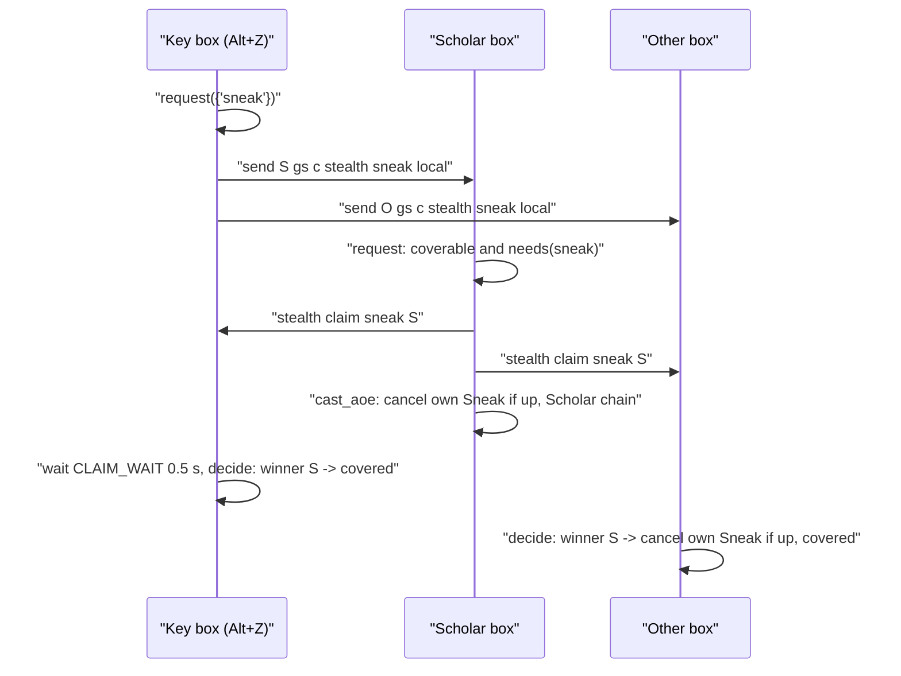
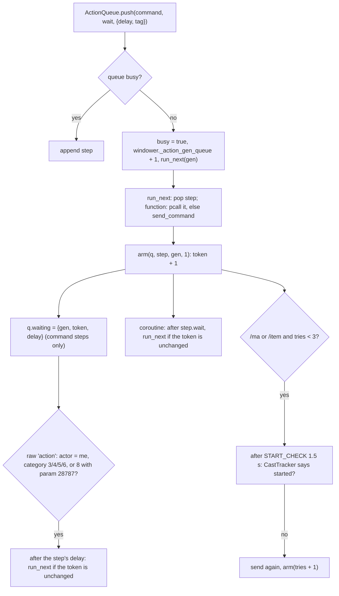

# Stealth system (`//gs c stealth`, Sneak / Invisible on the box group)

`//gs c stealth sneak | invi | both` (Alt+Z / Alt+X by default) puts Sneak or Invisible on this character and on every other member of the box group. A Scholar that needs the buff itself and has a stratagem charge covers the whole group with Accession and announces it; every other box picks its own best way from what the game says it can do right now (Spectral Jig > spell > ninjutsu with a tool > Silent Oil / Prism Powder > Evanessence > a partner casts it). A buff still up is cancelled (Cancel addon) before the new cast, since an active Sneak or Invisible blocks a new one. Actions go out through the shared action queue (`shared/utils/core/action_queue.lua`, also used by `//gs c cleanse`), which advances on the action's real end (raw `action` event) plus a delay, with a timed fallback and a resend when the game silently refused a spell or item. Each box reads the end time of its own two buffs from packet 0x063 order 9 and sends it to the group; a one-second loop warns before a buff wears off and redraws the alt window, which shows a Sneak and an Invi row per alt.

Verified against the code on 2026-09-28 (system added 2026-09-26, trace module added 2026-09-28); queue section re-verified 2026-10-01, when the queue moved to `action_queue.lua` and gained `push_next`; main-DNC Jig rule verified 2026-10-01 (commit `ce45482`); step guard and the shared 0x063 decoding (`BuffTimers.read`) verified 2026-10-01. The page names functions rather than line numbers; a line is given only where the line itself matters.

## Files

| Path | Lines | Role |
|---|---:|---|
| `shared/utils/stealth/stealth.lua` | 455 | Command router (`Stealth.handle`), `push` into the shared queue, per-box decision (`handle_self`), claim handling (`request` / `decide`), `status`, `check` |
| `shared/utils/stealth/stealth_methods.lua` | 181 | Which ways this character has now: `has_jig`, `jig_recast`, `can_jig`, `can_cast`, `best_own`, `has_spell`, `item_count`, `cast_time`; fixed id tables |
| `shared/utils/stealth/stealth_aoe.lua` | 148 | One Scholar for the group: `coverable`, claims (`record` / `winner` / `clear`), `status`, flat `distance`, `trace_distances`, `chain_time` |
| `shared/utils/stealth/stealth_timers.lua` | 167 | Packet 0x063 order 9 listener (decoding by `BuffTimers.read`), end-time store, `stealth time` broadcast and receive, wear-off alerts, alt window refresh loop |
| `shared/utils/stealth/stealth_trace.lua` | 103 | Trace only: own Sneak / Invisible gained / refreshed / lost, and who each Sneak / Invisible cast reached |
| `shared/utils/stealth/stealth_config.lua` | 79 | Reads `<Character>/_common/combat/STEALTH_CONFIG.lua` once per load, rewrites one line on an in-game change |
| `shared/utils/messages/formatters/system/message_stealth.lua` | 98 | `show_skipped`, `show_covered`, `show_no_way`, `show_jig_recast`, `show_asked`, `show_wearing_off`, `show_setting`, `show_usage` |
| `shared/utils/messages/data/systems/stealth_messages.lua` | 23 | `STEALTH` namespace, 10 templates |
| `_master/config_global/STEALTH_CONFIG.lua` | 37 | Settings template, copied to `<Character>/_common/` by the clone |

Integration points outside the folder:

- `shared/utils/core/COMMON_COMMANDS.lua` `handle_command`: `stealth` is routed to `require('shared/utils/stealth/stealth').handle(args)`, after `sortie`, the box-group words (`alts`, `main`, `setalt`, `altreport`, `altmirror`, `altlead`) and `rollshow`, before `combatmode`, `keyconflicts`, `th`, `dw` and the warp aliases. `stealth` is in the hand-written list of `is_common_command`.
- `shared/utils/core/INIT_SYSTEMS.lua` (block "Sneak / Invisible timers"): `pcall(require, 'shared/utils/stealth/stealth_timers')` then `StealthTimers.start()` synchronously on every load; a load failure prints `show_module_load_failed('Stealth Timers', ...)`.
- `_master/config_global/COMMON_KEYBINDS.lua`: `!z` -> `stealth sneak`, `!x` -> `stealth invi`. The Blodykiller and Gabvanstronger overlays (`_master/<Name>/config_global/COMMON_KEYBINDS.lua`) keep their own per-subjob `!z` / `!x` binds (raw `/ja`, `/ma`, `/item` or alias commands) instead.
- `shared/utils/dualbox/alt_window.lua` `stealth_lines` (called from `alt_lines`): a Sneak and an Invi row per alt.
- `clone_character.py`: `('config', 'STEALTH_CONFIG.lua')` is in `KEPT_ON_RECLONE`, so a re-clone copies the player's file back from the backup. The template itself reaches `config/` through the `config_global` copy loop (overlay-aware, every `*.lua` of `_master/config_global/` and the overlay's `config_global/`).
- `shared/utils/messages/formatters/ui/message_commands.lua`: `//gs c commands` lists `stealth help` and `stealth sneak | invi | both`, `stealth check`. `help` is not a subcommand: it falls to the usage screen like any unknown word.
- `shared/utils/core/action_queue.lua` (180 lines, since 2026-10-01): the action queue, shared with `//gs c cleanse` ([cleanse.md](cleanse.md)) and `//gs c buff` ([midcast-and-buffs.md](midcast-and-buffs.md#buff-command-and-engine)).
- `shared/utils/buffs/buff_timers.lua` `BuffTimers.read(data)`: the packet 0x063 decoding `read_packet` uses (moved there on 2026-10-01, shared with the buff refresh of `//gs c buff`).
- `shared/utils/core/cast_tracker.lua`: `started_since(t)` / `acted_since(t)` tell the queue whether a sent spell / item started.
- `shared/utils/scholar/scholar_actions.lua` `cast_with_stratagems` and `shared/utils/scholar/stratagem_charges.lua` `available`: the Accession chain and the charge count.
- `shared/utils/dualbox/alt_group.lua` `get_alts()` (group members) and `shared/utils/dualbox/alt_states.lua` `get(name)` (their known jobs).
- `shared/utils/debug/trace_log.lua` `log` / `enabled`: `STEALTH` trace lines.

## How it works

### Command

`Stealth.handle(args)`, `args` = the words after `stealth`, first one lower-cased, `status` when empty. Always returns `true`.

| Sub | Effect |
|---|---|
| `sneak` / `invi` / `both` | Kinds pass through `keep_invisible` first. With the flag `self`: `handle_self(kinds, true)` only. Otherwise `request(kinds)`, then, unless the flag is `local`, `send <name> gs c stealth <sub> local` to every `AltGroup.get_alts()` member. The relay goes **after** `request`, so a claim this box sends reaches the others before the relayed key |
| `claim <kind> <name>` | `Aoe.record(kind, name)` (sent by a covering Scholar) |
| `cast <kind> <name>` | `cast_for(kind, name)`: a partner with no way of its own asks |
| `time <name> <sneak end> <invi end>` | `Timers.receive` (sent by `stealth_timers.lua` of another box) |
| `refresh` / `alert` / `overwrite` / `alerts` / `delay` `<value>` | `set_setting` through the `SETTINGS` map -> `Config.set`; numbers through `tonumber`, booleans `on` / `off`; anything else prints the usage |
| `status` | `show_status`: InfoBlock `STEALTH :: Sneak / Invisible`: the five settings, then `Sneak m:ss  Invi m:ss` for this character and each alt |
| `check` | `show_check`: dry run, see below |
| other | `show_usage()` |

### A key press across the group



`request(kinds)`, for each kind:

1. A claim from another box is already recorded (`Aoe.winner`) -> `decide({kind})` at once: covered.
2. This box can cover it (`Aoe.coverable`) **and** `needs(kind)` -> `Aoe.trace_distances`, send `stealth claim <kind> <me>` to every other member, `cast_aoe(kind)`. Needing the buff itself is what stops a second press from spending another stratagem when a member was out of reach: the Scholar is covered by then, claims nothing, and the member gets the buff its own way. The covering box does not record its own claim.
3. Otherwise the kind waits. The waiting kinds are decided after `CLAIM_WAIT` = 0.5 s, or at once when `nobody_else_scholar(names)`: every other box's job is known in `AltStates` and none has SCH main or sub. An unknown job means waiting.

`decide(kinds)` reads `Aoe.winner(kind)` and clears the claims of that kind. A winner that is not this character: `cancel_if_up(kind)` (before the Scholar's chain reaches its cast), mark the kind pending, trace `covered by <name>`, `show_covered`. The rest goes to `handle_self(rest)` (not alone).

### Claims (`stealth_aoe.lua`)

- `coverable(kinds, names)`: empty when there is no other member, no Scholar main or sub (`has_scholar`), or the job's `state.SneakInviAOE` is `Off` (`aoe_allowed`; only BLM and PLD define that state, a missing state counts as allowed). Charges = `StratagemCharges.available()`, plus one when `buffactive['Accession']` is already up. One charge per kind in the order asked, and only for a kind whose spell `Methods.can_cast` now. So with one charge, `both` covers Sneak only.
- `record(kind, name)` stores `{name, time = os.clock()}` in `windower._stealth_claims[kind][name:lower()]`; `winner(kind)` returns the first name in alphabetical order among claims at most `CLAIM_LIFE` = 5 s old, so two crossing claims settle the same way on every box that has not cast yet.
- `cast_aoe(kind)` (`stealth.lua`) cancels this box's own buff if up, queues one **function step** that calls `ScholarActions.cast_with_stratagems(spell, nil)` (nil state = On = Accession, target `<me>`), with a wait of `Aoe.chain_time(cast time + delay)`: +2 s for Light Arts unless Light Arts or Addendum: White is up, +2 s for Accession unless up. The chain itself waits on each buff (see [midcast-and-buffs.md](midcast-and-buffs.md), ScholarActions).

### One box's own way (`handle_self(kinds, alone)`)

1. `wanted` = the kinds that `needs()`: false while a request of that kind is pending (`PENDING_FOR` = 12 s, `mark_pending`); true while `forced` (see `keep_invisible`); true with `overwrite`; else, when an end time is known, true below `refresh_below`; else true when the buff is not up. `is_up` reads buff ids 71 (Sneak) / 69 (Invisible) from `windower.ffxi.get_player().buffs`, because `buffactive` can lag in a scheduled function. A kind not wanted prints `show_skipped` (time left, or "up (time unknown)") and a trace line.
2. `Methods.has_jig()`, Jig on recast and **not** `main_dnc()` (a /DNC) -> nothing is used (no spell, item or partner), `show_jig_recast` gives the time left: nothing else spends recast 218 on a /DNC, so the Jig is soon back. A main DNC (`main_dnc()`: `player.main_job == 'DNC'`) shares recast 218 with Chocobo Jig and Chocobo Jig II (level 55, main job only), so a Jig on recast falls through to step 3 (own spell, ninjutsu, items), then step 4 (partners). `Methods.can_jig()` -> cancel both buffs if up, `/ja "Spectral Jig" <me>`, both pending. Jig is used as soon as one of the asked kinds is wanted.
3. Otherwise, per kind: `use_own(kind)` takes `Methods.best_own(kind)`, cancels the buff if up (both when the way gives both), sends `/ma "<name>" <me>` or `/item "<name>" <me>`, marks pending (both for Evanessence). A kind already covered by an earlier item that gives both is skipped (`needs` false).
4. No way of its own: with `alone` (the `self` flag) print `show_no_way` and stop. Otherwise cancel its own buff if up, send `stealth cast <kind> <me>` to every other member, `show_asked`. Each receiver with the spell learned and the level (`has_spell`, whatever its MP or recast) queues `/ma "<spell>" <name>` (`cast_for`).

`self` mode never claims, never waits and never asks anyone.

`keep_invisible(kinds)` runs first in `Stealth.handle` (`self` mode included): when Sneak is asked, still `needs()`ed and Invisible is up on this box, the request becomes `{'sneak', 'invi'}` and `forced.invi` makes `needs('invi')` true for `FORCE_WINDOW` (10 s), because the Sneak cast (any action) breaks this box's own Invisible. The rule runs on each box for its own buffs: the alts get `stealth sneak local` and apply it themselves. `forced` is a module-local table (per load).

### Which ways exist (`stealth_methods.lua`)

`best_own(kind)` (Jig is handled before it by `handle_self`): the spell (`can_cast`), then the ninjutsu list, then the items in order (`BY_BUFF`: Sneak -> Monomi: Ichi, Silent Oil, Evanessence; Invisible -> Tonko: Ni, Tonko: Ichi, Prism Powder, Evanessence). Returns `{how = 'ma'|'item', name, both}` or nil. `check` uses the same function, so it shows what the key will do.

`can_cast(name)`: learned (`get_spells()[id]`), main or sub level reaches the spell (`level_ok`, job ids 3 WHM, 5 RDM, 20 SCH, 13 NIN), MP, spell recast 0, and for ninjutsu one of its tools in the inventory (`TOOLS`: Monomi -> Sanjaku-Tenugui or Shikanofuda; Tonko -> Shinobi-Tabi or Shikanofuda). `has_jig()`: ability 196 among `get_abilities().job_abilities`; `jig_recast()`: recast id 218 in seconds; `can_jig()` = both, recast 0.

**Fixed ids, no `res` lookups** (`SPELLS`, `ITEMS`): the five spells (id, MP, cast time, levels per job id) and six items are copied from `res/spells.lua` and `res/items.lua`. Looking them up by name walked 976 spells and 23 555 items several times per key press and could load the item list on the first one. Values: Sneak 137 (12 MP, 3 s), Invisible 136 (15 MP, 3 s), Monomi: Ichi 318, Tonko: Ichi 353, Tonko: Ni 354 (1.5 s), Silent Oil 4165, Prism Powder 4164, Evanessence 6699 (items 1 s, `ITEM_CAST`), Sanjaku-Tenugui 2553, Shinobi-Tabi 1194, Shikanofuda 2972, Spectral Jig 196 (recast 218), buffs Sneak 71 / Invisible 69. Inventory counts (bag 0 only, items are used from there) are cached for one second (`counts`, `bag_cache`).

### Action queue (`shared/utils/core/action_queue.lua`)

Since 2026-10-01 the queue is its own module, shared by stealth, `//gs c cleanse` ([cleanse.md](cleanse.md)) and `//gs c buff`: one queue per character, so a stealth and a cleanse pressed together run one after the other instead of stepping on each other. `stealth.lua` keeps only a local `push(command, wait)` that calls `ActionQueue.push(command, wait, {delay = Config.get().delay, tag = 'STEALTH'})`.



- The queue lives on `windower._action_queue` (`{steps, busy, token, waiting}`), its generation on `windower._action_gen_queue`, so both survive a reload.
- Each step carries its own `delay` and `tag` (`opts` of `push`): stealth passes its `delay` setting and `STEALTH`, cleanse 1.0 s and `CLEANSE`, `//gs c buff` `wait_after_spell` / `wait_after_ability` and `BUFF`.
- Guard (since 2026-10-01, `opts.guard`, `opts.magic`): `run_next` calls `step.guard(step)` under `pcall` just before the step goes. `nil` (or an error): the step goes. `'skip'`: this step is dropped. `'stop'`: this step and every waiting step with the same `tag` are dropped. `'stop_magic'`: the waiting steps of that tag with `magic` are dropped, and this step too when it is a spell (an ability is put back in front). `'before', steps`: those steps go first, then this one (its guard runs again then). Only `//gs c buff` sets a guard (`BuffGuard.check`, [midcast-and-buffs.md](midcast-and-buffs.md#debuffs-during-the-queue-buff_guardlua)); stealth and cleanse steps have none. `push_next` takes the same two options.
- A command step ends on whichever comes first: the game reporting this character's action finished (`on_action`: category 3 weapon skill, 4 spell, 5 item, 6 job ability, or 8 with param 28787 = interrupted cast) followed by the step's `delay`, or its longest wait. Stealth's longest wait is `wait_after(kind, name)`: the base cast time from the fixed table plus `delay` (Fast Cast not counted: on the safe side). `cancel` steps wait 0.5 s.
- A **function step runs first, then waits**: `run_next` calls it at once and `arm` leaves `waiting` nil, so only its longest wait ends it. Stealth's Scholar chain is one (it sends several actions of its own); cleanse uses an empty one to hold the queue for `partner_wait`.
- `listen()` registers the `action` listener with `raw_register_event` once per load (`_G._action_queue_listener`): a plain `register_event` from a job file runs GearSwap's `refresh_globals` and `equip_sets` on every action packet. It is called from `push`, so a load registers it only when its first step is queued.
- Refused actions: for a step that is a spell (`input /ma`) or an item (`input /item`) (`refusable`), `arm()` checks `START_CHECK` (1.5 s) later that it started (`CastTracker.started_since(sent_at)` for a spell, `acted_since(sent_at)` for an item). Not started (and the token and queue generation unchanged): the game refused it (sent too soon after the previous action), so it is sent again with a fresh token and a fresh longest wait, up to `MAX_TRIES` (3) sends; each resend writes a trace line under the step's tag, `not started, sent again: <command>`.
- `ActionQueue.push_next(command, wait, {delay, tag})` puts a step at the front of `steps` (next to go) when the queue is busy, else it is `push` (append and start). Its use: a function step decides at the last moment and then acts right after itself, since the running step is already off `steps` when it runs. Cleanse uses it for every own spell and item (the step checks the debuff is still up, then `push_next`es the `/ma` or `/item`) and for Doom retries ([cleanse.md](cleanse.md#items-use_itementry-item-tries-settings-front)). Several `push_next` from one step end up in reverse order: the last one goes first. Stealth does not use it. `push_next` does not call `listen()`: the `push` that started the queue did.
- `ActionQueue.busy()` tells whether steps are still waiting; no caller today.
- Generation: `windower._action_gen_queue` goes up only when `push` starts an idle queue, never on a load. A queue under way therefore goes on across a job change or `gs reload` (its steps are on `windower`, its coroutines check the generation, which has not changed); a queue started after it is idle gets a new generation. The `action_queue.lua` header says so since 2026-10-01 (commit `295e701`).

### Timers (`stealth_timers.lua`)

- `start()`, once per load (`_G._stealth_listener`): starts `StealthTrace.start()`, a raw `incoming chunk` listener for 0x063 with byte 5 = 9, and a one-second loop stopped by `windower._stealth_gen` when a newer load starts.
- `read_packet`: keeps Sneak (71) and Invisible (69) from `BuffTimers.read(data)` (`shared/utils/buffs/buff_timers.lua`, since 2026-10-01; the decoding was here before): 32 buff ids (u16 from offset 0x08) and 32 end times (u32 from 0x48), in 1/60 s since 2002-01-01 JST (`EPOCH` = 1009810800), wrapping every 2^32/60 s (about 2.27 years); `end_time` picks the wrap count nearest to now. Result in `os.time()` seconds, 0 = not up. A packet shorter than `0x48 + 128` bytes gives zeros. `BuffTimers` has its own listener on the same packet (all buffs, for `//gs c buff`).
- `on_buffs` stores this character's entry in `windower._stealth_timers[name:lower()]` only when an end time changed, calls `StealthTrace.buff_change(old, entry, StealthTimers.left)` under `pcall`, then sends `send <alt> gs c stealth time <name> <sneak> <invi>` to every `AltGroup.get_alts()` member. Only one's own buffs come with a time, so each box reports its own.
- `left(kind, name)`: seconds left, nil when unknown or past; `name` nil = this character.
- `tick_once`: for every stored character and kind, when `alerts` is on and `left <= alert_before`, one `show_wearing_off` per end time (key `name..kind..end` in `windower._stealth_warned`); while any timer runs, `AltWindow.refresh()`.
- Alt window rows (`alt_window.lua` `stealth_lines`): `Sneak` / `Invi`, `m:ss` green, yellow under 60 s, `-` when nothing is known.

### Distance (`StealthAoe.distance`)

Flat: `sqrt(dx^2 + dy^2)` from `get_mob_by_name(name)` and `get_mob_by_target('me')`, nil when the member is not in the zone. Same measure as the automation addon's own box, so the two can be compared; Windower's `mob.distance` also counts the height and reads higher on slopes. It is only reported (the `check` block and trace lines): Accession is cast wherever the others stand.

### `check` (`show_check`)

InfoBlock `STEALTH :: Check (nothing is cast)`: jobs; per kind the buff state (`m:ss`, `up (time unknown)`, `not up`) and `key would` (`planned`: `nothing, <left> left`, `nothing, up (time unknown)`, `Accession for the group`, `Spectral Jig`, `Spectral Jig in m:ss (nothing else)` for a /DNC; for a main DNC with the Jig on recast `<best_own name> (Spectral Jig in m:ss)` or `Spectral Jig in m:ss, nothing else: asks the others`; the `best_own` name, or `none of its own: asks the others`); `Accession` (`accession_text` over `Aoe.status()`: `no (no Scholar)`, `no (SneakInviAOE Off)`, `no (no stratagem charge)`, `yes (<n> charge[s])`); each other member's flat distance and timers; the settings line.

### Trace

With `//gs c trace on`, `trace()` (`stealth.lua`) and `Aoe.trace_distances` write `STEALTH` lines to `<Character>/trace.log`, one per decision: `<kind>: skipped, <m:ss> left` (or `up, time unknown`), `invi: up, recast after sneak (an action breaks it)`, `<kind>: own <name>`, `sneak+invi: Spectral Jig`, `sneak+invi: Spectral Jig on recast, <n>s` (a /DNC only), `<kind>: no way of its own, asked the others`, `<kind>: Accession for the group`, `Accession: <name> at <d> yalms` (or `not in zone`), `<kind>: covered by <name>`, `not started, sent again: <command>`.

What the game did afterwards (`stealth_trace.lua`, trace on only, checked with `TraceLog.enabled()`), on every box: `buff Sneak gained, <n> s left` / `refreshed` / `lost` (own buff end times from packet 0x063, via `StealthTimers`), and, when this character finishes casting Sneak or Invisible (raw `action`, category 4, spell 137 / 136), one `<spell> landed: <member> at <d> y` line for **every** group member (reached or not), then `<spell> landed[ with Accession]: reached <names>; missed <names (d y)>` from the targets of the action packet. `with Accession` reads buff 366 from `get_player().buffs`. The `Accession: ... yalms` line above is measured at the key press, several seconds before the cast.

## Public API

None of these is exported to `_G`; every caller `require`s the module (inside `pcall` for the optional ones).

### `Stealth` (`stealth.lua`)

| Function | Params | Behaviour | Callers |
|---|---|---|---|
| `handle(args)` | `args`: words after `stealth` | Command router above; returns `true` | `COMMON_COMMANDS.lua` `handle_command` |

Everything else in the file (`push`, `wait_after`, `needs`, `handle_self`, `request`, `decide`, `cast_for`, `cast_aoe`, `keep_invisible`, `show_status`, `show_check`...) is local.

### `StealthMethods` (`stealth_methods.lua`)

| Function / field | Params | Returns / behaviour | Callers |
|---|---|---|---|
| `BY_BUFF` | - | `{sneak = {buff, spell, ninjutsu, items}, invi = {...}}` | `stealth.lua`, `stealth_aoe.lua` |
| `item_count(name)` | item name from `ITEMS` | inventory (bag 0) count, 1 s cache; 0 for an unknown name | `can_cast`, `best_own` |
| `cast_time(name)` | spell / item name | base cast time in s (spells from `SPELLS`, items 1, unknown 0) | `stealth.lua` `wait_after` |
| `can_cast(name)` | spell / ninjutsu name | learned, level, MP, recast 0, tool | `best_own`, `StealthAoe.coverable` |
| `has_jig()` | - | Spectral Jig among the current job abilities | `stealth.lua` `handle_self`, `planned` |
| `jig_recast()` | - | seconds before Jig is ready | same |
| `can_jig()` | - | `has_jig()` and recast 0 | `handle_self` |
| `best_own(kind)` | `'sneak'` / `'invi'` | `{how, name, both}` or nil | `use_own`, `planned` |
| `has_spell(kind)` | `'sneak'` / `'invi'` | spell learned and level reached, whatever MP / recast | `cast_for` |

### `StealthAoe` (`stealth_aoe.lua`)

| Function | Params | Returns / behaviour | Callers |
|---|---|---|---|
| `distance(name)` | member name | flat yalms or nil (not in zone) | `trace_distances`, `show_check`, `StealthTrace.on_action` |
| `trace_distances(names)` | other members | one `Accession: <name> at ...` trace line each | `request` |
| `status()` | - | `{scholar, allowed, charges}` | `show_check` |
| `coverable(kinds, names)` | kinds in order, other members | kinds this box can cover now (one charge each) | `request`, `show_check` |
| `record(kind, name)` | kind, claimant | stores a claim on `windower._stealth_claims` | `Stealth.handle` (`claim`) |
| `winner(kind)` | kind | alphabetically first claimant of the last 5 s, or nil | `request`, `decide` |
| `clear(kind)` | kind | forgets that kind's claims | `decide` |
| `chain_time(cast_wait)` | cast time + delay | seconds the Scholar chain takes (+2 Arts, +2 Accession) | `cast_aoe` |

### `StealthTimers` (`stealth_timers.lua`)

| Function | Params | Returns / behaviour | Callers |
|---|---|---|---|
| `start()` | - | once per load: trace listener, 0x063 listener, one-second loop | `INIT_SYSTEMS.lua` |
| `left(kind, name)` | kind, character (nil = self) | seconds left or nil | `stealth.lua`, `alt_window.lua` `stealth_lines`, `on_buffs` (passed to the trace) |
| `format(seconds)` | seconds or nil | `m:ss` or `-` | `stealth.lua`, `alt_window.lua` |
| `receive(args)` | `{name, sneak_end, invi_end}` | stores another box's end times | `Stealth.handle` (`time`) |

### `StealthTrace` (`stealth_trace.lua`)

| Function | Params | Returns / behaviour | Callers |
|---|---|---|---|
| `buff_change(old, new, left)` | previous and new `{sneak, invi}` end times, `StealthTimers.left` | one trace line per changed kind (gained / refreshed / lost) | `stealth_timers.lua` `on_buffs` |
| `on_action(act)` | Windower action | reach report for this character's finished Sneak / Invisible | its own raw `action` listener |
| `start()` | - | registers that listener once per load (`_G._stealth_trace_listener`) | `StealthTimers.start` |

### `StealthConfig` (`stealth_config.lua`)

| Function / field | Params | Returns / behaviour | Callers |
|---|---|---|---|
| `DEFAULTS` | - | default values and types | `stealth.lua` `set_setting`, `get` |
| `path()` | - | `windower.addon_path .. 'data/<player.name>/config/STEALTH_CONFIG.lua'`, nil without a player name | `get`, `save` |
| `get()` | - | settings, read once per load into `_G._stealth_settings` | `stealth.lua`, `stealth_timers.lua` `tick_once` |
| `set(key, value)` | key of `DEFAULTS`, value of the same type | changes memory, then `save`; returns whether the file was written | `set_setting` |

### `MessageStealth` (`message_stealth.lua`)

| Function | Template key(s) |
|---|---|
| `show_skipped(buff, left)` | `skipped` or `skipped_unknown` (left nil or `-`) |
| `show_covered(buff, name)` | `covered` |
| `show_no_way(buff)` | `no_way` |
| `show_jig_recast(left)` | `jig_recast` |
| `show_asked(buff)` | `asked` |
| `show_wearing_off(name, buff, left)` | `wearing_off` (name nil) or `wearing_off_other` |
| `show_setting(key, value, saved)` | `setting` or `setting_unsaved` |
| `show_usage()` | none: `HelpScreen.show{...}` |

## Commands

| Command | Args | Effect |
|---|---|---|
| `stealth sneak` / `invi` / `both` | `[self\|local]` | Key press (see above); `local` = relayed, do not relay again; `self` = this character only |
| `stealth status` (or bare `stealth`) | - | Settings and timers of the group |
| `stealth check` | - | Dry run |
| `stealth refresh` / `alert` / `delay` | seconds | Setting, saved |
| `stealth overwrite` / `alerts` | `on` / `off` | Setting, saved |
| `stealth help` / any unknown word | - | Usage screen |
| `stealth claim` | `<kind> <name>` | Internal: a Scholar covers `<kind>` |
| `stealth cast` | `<kind> <name>` | Internal: cast the spell on `<name>` when this box has it |
| `stealth time` | `<name> <sneak end> <invi end>` | Internal: another box's end times (`os.time()`, 0 = none) |

## Configuration

`<Character>/_common/combat/STEALTH_CONFIG.lua` (template `_master/config_global/STEALTH_CONFIG.lua`), path from `StealthConfig.path()`:

| Key | Default | Meaning |
|---|---|---|
| `refresh_below` | 180 | A buff with more seconds left is not cast again; Jig is skipped only when both have that much |
| `alert_before` | 60 | Warn this many seconds before a buff wears off (0 = never) |
| `overwrite` | false | Cast again whatever time is left |
| `alerts` | true | Wear-off warnings in chat |
| `delay` | 3.0 | Seconds after an action ends before the next one (2.5 until 2026-09-27: a RDM/WHM Invisible right after Sneak was refused) |

`get()` reads the file once per load with `pcall(dofile, path)` into `_G._stealth_settings`; a missing file or key, or a value of another type, keeps the default. `set()` changes the value in memory, then the local `save` rewrites only that key's `key = value,` line (or adds it before the closing brace), keeping comments and the file's line endings; a missing file gives `setting_unsaved` ("not saved (_common/combat/STEALTH_CONFIG.lua missing)"). Note: the template's header still suggests `//gs c stealth delay 2.5`, the old default.

## State & lifetime

| Where | What | Lifetime |
|---|---|---|
| `windower._action_queue`, `_action_gen_queue` | Shared action queue and its generation (`action_queue.lua`, also cleanse) | Survive `gs reload` and job changes; reset by `//lua reload gearswap` |
| `windower._stealth_pending` | `os.clock()` until which a kind counts as coming | same |
| `windower._stealth_claims` | Claims per kind | same; cleared per kind by `decide` |
| `windower._stealth_timers` | End times per character | same |
| `windower._stealth_warned` | Alerts already shown (one key per end time) | same, never pruned |
| `windower._stealth_gen` | Generation of the one-second loop | same |
| `forced` (module local, `stealth.lua`) | Kinds to recast although up, until `os.clock()` | Per load |
| `bag_cache` (module local, `stealth_methods.lua`) | Inventory counts, 1 s | Per load |
| `_G._stealth_settings` | Settings read from the file | Per load |
| `_G._stealth_listener`, `_G._action_queue_listener`, `_G._stealth_trace_listener` | Raw event ids (0x063, shared queue `action`, trace `action`) | Per load; the engine removes raw events recorded in `registered_user_events` at the next load |

Coroutines: the one-second loop (stopped by generation), the queue's fallback waits, post-action delays and start checks (stopped by the token and queue generation), the 0.5 s claim wait (not cancellable).

## Interactions

- Box group, `AltGroup.get_alts()`, `AltStates`, alt window: [dualbox.md](dualbox.md).
- Scholar chain (Light Arts, Accession, each step waiting on its buff read from the game): [midcast-and-buffs.md](midcast-and-buffs.md). `StratagemCharges.available()` for the charge count.
- `SneakInviAOE` (BLM `Apps+Numpad8`, PLD held On under /SCH) also gates `//gs c aoe sneak` / `aoe invi`: [jobs/blm.md](../jobs/blm.md), [jobs/pld.md](../jobs/pld.md).
- Messages: `STEALTH` namespace; `M.send` loads `data/systems/stealth_messages.lua` by namespace (`api/messages.lua`); blocks through `InfoBlock`, usage through `HelpScreen`. See [messages.md](messages.md).
- Trace log: [commands-and-debug.md](commands-and-debug.md#trace-gs-c-trace).
- External addons: `send` (every relay), `Cancel` (`cancel Sneak` / `cancel Invisible`).

## Invariants & gotchas

- The key box runs `request` before relaying the key, and a covering Scholar sends its claim before casting: that order is what lets the others see the claim first.
- `needs()` tests pending first: `overwrite` (and `forced`) do not bypass the 12 s after a request.
- An active Sneak or Invisible blocks a new one: every path that casts for a kind cancels it first (`cancel_if_up`), and a box covered by another's Accession cancels its own before the Scholar's cast lands.
- A timer is known only once the game has sent 0x063 order 9 after the buff went up; until then `needs()` falls back to "up or not" from the player's buff list.
- `coverable` and `chain_time` read `buffactive`, the table `is_up` and the Scholar chain avoid in scheduled code; both run synchronously inside the command, where it is current.
- A queue started before a reload keeps its steps; after the load, until the next `push` registers the new sandbox's `action` listener, its steps advance on their longest wait only.

## For maintainers / AI

### Invariants to keep

| Invariant | Why | Where |
|---|---|---|
| No `res` lookup at run time; ids and cast times are copied constants | Walking `res.items` per key press was slow and could load the item list | `stealth_methods.lua` `SPELLS`, `ITEMS`, `SPECTRAL_JIG*`; `stealth.lua` / `stealth_timers.lua` `BUFF_IDS`; `stealth_trace.lua` `SPELLS`, `ACCESSION` |
| Every Windower listener is `raw_register_event`, guarded by an `_G` id (`_stealth_*`, `_action_queue_listener`) | A plain `register_event` runs `refresh_globals` + `equip_sets` per packet; the `_G` guard makes it once per load | `ActionQueue` `listen`, `StealthTimers.start`, `StealthTrace.start` |
| Buff state in scheduled code comes from `windower.ffxi.get_player().buffs`, never `buffactive` | `buffactive` lags inside `coroutine.schedule` | `is_up`, `accession_up` |
| Cross-load state lives on `windower._stealth_*`; per-load state on `_G` or module locals | `_G` is rebuilt at every load; `windower.*` survives until `//lua reload gearswap` | State table above |
| Every scheduled callback checks a token or generation before acting | Coroutines are never cancelled by a reload | `arm`, `on_action`, `tick` |
| Relay after `request`; claim before `cast_aoe` | Claim ordering across boxes | `Stealth.handle`, `request` |
| Every cast path cancels the buff first | An active buff blocks the new one | `cancel_if_up` |
| Messages only through `MessageStealth` / `InfoBlock` / `HelpScreen` | Project rule: no direct `add_to_chat` | `message_stealth.lua` |

### Traps

- The 0.5 s claim wait is a latency bet on `send`; raising `CLAIM_WAIT` delays every non-Scholar box's own cast.
- `winner()` only helps boxes that have not cast yet: a covering box casts in `request` without recording its own claim, so two Scholar boxes pressing at the same time both spend a stratagem (see Known issues).
- A partner request (`stealth cast`) has no claim: every box with the spell answers.
- `forced.invi` is set by `keep_invisible` even in `self` mode and even when the request is later covered by a Scholar; it only lasts 10 s.
- `StealthConfig.get()` caches whatever it read, defaults included: if it ever ran before `player.name` exists, the file would be ignored for that load. Today its first callers run after login (key press, the one-second loop).
- `on_action` ends a step on category 8 / param 28787 (interrupted spell) but not on an interrupted item (category 9, param 28787): such a step ends on its longest wait.
- Adding a setting touches four places: `DEFAULTS`, the template, the `SETTINGS` map in `stealth.lua`, and the `show_status` / `show_usage` texts. `save` matches `^%s*key%s*=%s*<value>,` per line, so a key must not be a prefix-with-`=` of another (current keys are safe).

### How to debug

| Step | Command | What to look for |
|---|---|---|
| What the key would do, without casting | `//gs c stealth check` | `key would` per kind, `Accession` reason, member distances and timers |
| Settings and known timers | `//gs c stealth status` | `-` = no end time received yet (0x063 not seen, or the alt did not broadcast) |
| Decisions and results | `//gs c trace on`, press the key, then read `<Character>/trace.log` | `STEALTH` lines: decision at the press, `not started, sent again`, `buff ... gained/lost`, `<spell> landed ... reached ...; missed ...` |
| Cross-box relay | trace on every box | the relayed key and claims appear on each box's own trace |
| Stuck queue | `//lua reload gearswap` | resets `windower._action_queue` (stealth and cleanse); a `gs reload` does not |

### Offline testing with lua5.1

Syntax check (all six files passed on 2026-09-28; `shared/utils/core/action_queue.lua` is loaded by `stealth.lua` too):

```bash
cd "D:/Windower Tetsouo/addons/GearSwap/data"
for f in shared/utils/stealth/*.lua; do luac5.1 -p "$f" && echo "ok $f"; done
```

The modules load outside the game with a few stubs. Run from `data/` so `require('shared/utils/...')` resolves through `./?.lua`:

```lua
package.path = './?.lua;' .. package.path
coroutine.schedule = function(f, t) end          -- or collect and call them by hand
local sent = {}
send_command = function(c) sent[#sent + 1] = c end
player = {name = 'Me', id = 1, main_job = 'RDM', sub_job = 'SCH'}
windower = {addon_path = './', raw_register_event = function() return 1 end, ffxi = {
    get_player = function() return {buffs = {}, main_job_id = 5, main_job_level = 99,
        sub_job_id = 20, sub_job_level = 49, vitals = {mp = 500}} end,
    get_spells = function() return {[136] = true, [137] = true} end,
    get_spell_recasts = function() return {} end,
    get_abilities = function() return {job_abilities = {}} end,
    get_ability_recasts = function() return {} end,
    get_items = function() return {} end,
}}
local Stealth = require('shared/utils/stealth/stealth')
Stealth.handle({'sneak', 'self'})
for _, c in ipairs(sent) do print(c) end        --> input /ma "Sneak" <me>
```

The missing `STEALTH_CONFIG.lua` makes `StealthConfig.get()` fall back to the defaults. To test the group path, stub `shared/utils/dualbox/alt_group` in `package.loaded` with a `get_alts` returning names; to test the packet decoder, build a 0x063 string with the buff id at offset 9 + 2i and the end time at 73 + 4i and call `StealthTimers.start` with a `raw_register_event` stub that keeps the handler.

## Extending

- Another way to get a buff: add it to `BY_BUFF` (order = priority) and, for a spell, its id, MP, cast time and levels per job id to `SPELLS`; for an item, its id to `ITEMS`; a ninja tool to `TOOLS`. Copy the values from Windower `res/`, do not look them up at run time.
- Another setting: see the four places listed under Traps.

## Known issues

Open:

- The header of `stealth.lua` still says "a newer load drops an older queue"; the queue generation changes only when an idle queue starts (`push`), not on a load (see gotchas). The `action_queue.lua` header was corrected on 2026-10-01.
- A partner request (`stealth cast`) is answered by every box that has the spell: with two such partners the character gets two casts (`cast_for`; no claim for partner casts).
- Two Scholar boxes that both qualify both cast Accession: `request` casts at once without recording its own claim, so the alphabetical `winner` rule never stops a box that has already cast.
- `windower._stealth_warned` gains one key per buff end time and is never pruned before `//lua reload gearswap` (`stealth_timers.lua` `tick_once`).
- The template `STEALTH_CONFIG.lua` header suggests `stealth delay 2.5`, the value before the 3.0 default.
- Not yet verified in game on this page's date: Accession reach, the 0.5 s claim wait against `send` latency, the action-end detection per category, the resend of refused actions.

Fixed:

- The headers of `stealth.lua` and `stealth_aoe.lua` said a box waits one second for a claim; they now say half a second, matching `CLAIM_WAIT`.
- The comment of `alt_window.lua` `stealth_lines` named a non-existent `//gs c stealth timers`; it now names `stealth_timers.lua`.
- A DNC with Spectral Jig on recast fell back to oils and powders; it now waits for the Jig (`show_jig_recast`, 2026-09-27). Since 2026-10-01 (`ce45482`) that wait is for a /DNC only: a main DNC, whose Jig recast can be taken by Chocobo Jig / Chocobo Jig II (shared recast 218), goes its other ways.
- The `action_queue.lua` header said "a newer load drops an older queue"; it now says a queue under way goes on across a job change and a queue started after it gets a new generation (2026-10-01).
