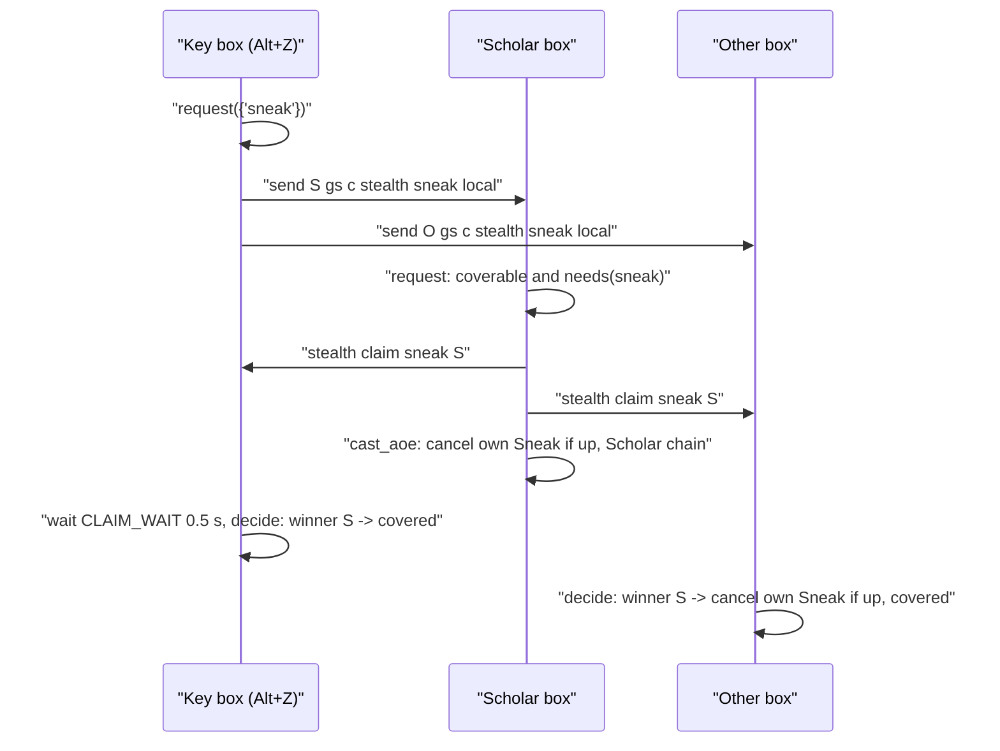
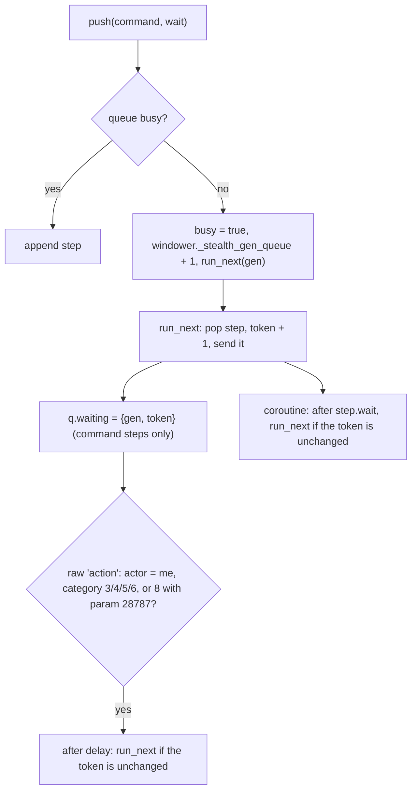

# Stealth system (`//gs c stealth`, Sneak / Invisible on the box group)

`//gs c stealth sneak | invi | both` (Alt+Z / Alt+X by default) puts Sneak or Invisible on this character and on every other member of the box group. A Scholar that needs the buff itself and has a stratagem charge covers the whole group with Accession and announces it; every other box picks its own best way from what the game says it can do right now (Spectral Jig > spell > ninjutsu with a tool > Silent Oil / Prism Powder > Evanessence > a partner casts it). A buff still up is cancelled (Cancel addon) before the new cast, since an active Sneak or Invisible blocks a new one. Actions go out through a queue that advances on the action's real end (raw `action` event) plus a delay, with a timed fallback. Each box reads the end time of its own two buffs from packet 0x063 order 9 and sends it to the group; a one-second loop warns before a buff wears off and redraws the alt window, which shows a Sneak and an Invi row per alt.

Written on 2026-09-27 from the code as it stands on disk (added 2026-09-26). Line numbers are given where the line itself matters.

## Files

| Path | Lines | Role |
|---|---:|---|
| `shared/utils/stealth/stealth.lua` | 468 | Command router, action queue, per-box decision (`handle_self`), claim handling (`request` / `decide`), `status`, `check` |
| `shared/utils/stealth/stealth_methods.lua` | 170 | Which ways this character has now: `can_jig`, `can_cast`, `best_own`, `has_spell`, `item_count`, `cast_time`; fixed ids table |
| `shared/utils/stealth/stealth_aoe.lua` | 148 | One Scholar for the group: `coverable`, claims (`record` / `winner` / `clear`), `status`, flat `distance`, `chain_time` |
| `shared/utils/stealth/stealth_timers.lua` | 177 | Packet 0x063 order 9 listener, end-time store, `stealth time` broadcast and receive, wear-off alerts, alt window refresh loop |
| `shared/utils/stealth/stealth_config.lua` | 79 | Reads `<Character>/config/STEALTH_CONFIG.lua` once per load, rewrites one line on an in-game change |
| `shared/utils/messages/formatters/system/message_stealth.lua` | 74 | `show_skipped`, `show_covered`, `show_no_way`, `show_asked`, `show_wearing_off`, `show_setting`, `show_usage` |
| `shared/utils/messages/data/systems/stealth_messages.lua` | 23 | `STEALTH` namespace, 10 templates |
| `_master/config_global/STEALTH_CONFIG.lua` | 37 | Settings template, copied to `<Character>/config/` by the clone |

Integration points outside the folder:

- `shared/utils/core/COMMON_COMMANDS.lua:503-506` routes `stealth` to `Stealth.handle(args)` (after `sortie` and `alts`, before `combatmode`, `tb`, `trace` and the warp aliases); `stealth` is in the `is_common_command` list (`:716`).
- `shared/utils/core/INIT_SYSTEMS.lua:284-291` calls `StealthTimers.start()` synchronously on every load (header `:13-15`).
- `_master/config_global/COMMON_KEYBINDS.lua:27-31`: `!z` -> `stealth sneak`, `!x` -> `stealth invi`. The Blodykiller overlay (`_master/Blodykiller/config_global/COMMON_KEYBINDS.lua`) keeps its own per-subjob `!z` / `!x` binds instead.
- `shared/utils/dualbox/alt_window.lua:165-174` (`stealth_lines`, called `:193`): a Sneak and an Invi row per alt.
- `clone_character.py:319`: `('config', 'STEALTH_CONFIG.lua')` in `KEPT_ON_RECLONE`, so a re-clone copies the player's file back from the backup. The template itself reaches `config/` through the `config_global` copy (`clone_character.py:752-765`).

## How it works

### Command

`Stealth.handle(args)` (`stealth.lua:435-466`), `args` = the words after `stealth`, first one lower-cased, `status` when empty:

| Sub | Effect |
|---|---|
| `sneak` / `invi` / `both` | With `self`: `handle_self(kinds, true)` only (`:440-443`). Otherwise `request(kinds)` (`:444`), then, unless the flag is `local`, `send <name> gs c stealth  local` to every `AltGroup.get_alts()` member (`:445-449`). The relay goes **after** `request`, so a claim this box sends reaches the others before the relayed key |
| `claim <kind> <name>` | `Aoe.record(kind, name)` (sent by a covering Scholar) |
| `cast <kind> <name>` | `cast_for(kind, name)`: a partner with no way of its own asks (`:238-244`) |
| `time <name> <sneak end> <invi end>` | `Timers.receive` (sent by `stealth_timers.lua` of another box) |
| `refresh` / `alert` / `overwrite` / `alerts` / `delay` `<value>` | `set_setting` (`:333-347`) -> `Config.set`; numbers through `tonumber`, booleans `on` / `off`; anything else prints the usage |
| `status` | InfoBlock `STEALTH :: Sneak / Invisible`: the five settings, then `Sneak m:ss  Invi m:ss` for this character and each alt (`:349-367`) |
| `check` | Dry run, see below |
| other | `show_usage()` |

### A key press across the group

`request(kinds)` (`stealth.lua:301-327`), for each kind:

1. A claim from another box is already recorded (`Aoe.winner`) -> `decide({kind})` at once: covered.
2. This box can cover it (`Aoe.coverable`) **and** `needs(kind)` -> trace the distances, send `stealth claim <kind> <me>` to every other member, `cast_aoe(kind)`. Needing the buff itself is what stops a second press from spending another stratagem when a member was out of reach: the Scholar is covered by then, claims nothing, and the member gets the buff its own way (comment `:294-300`).
3. Otherwise the kind waits. The waiting kinds are decided after `CLAIM_WAIT` = 0.5 s (`:44`, `:325`), or at once when `nobody_else_scholar(names)` (`:283-292`): every other box's job is known in `AltStates` and none has SCH main or sub. An unknown job means waiting.

`decide(kinds)` (`:263-279`) reads `Aoe.winner(kind)` and clears the claims of that kind. A winner that is not this character: `cancel_if_up(kind)` (before the Scholar's chain reaches its cast), mark the kind pending, trace `covered by <name>`, `show_covered`. The rest goes to `handle_self`.

### Claims (`stealth_aoe.lua`)

- `coverable(kinds, names)` (`:94-108`): empty when there is no other member, no Scholar main or sub (`has_scholar`, `:41-43`), or the job's `state.SneakInviAOE` is `Off` (`aoe_allowed`, `:47-50`; only BLM and PLD define that state, a missing state counts as allowed). Charges = `StratagemCharges.available()`, plus one when `buffactive['Accession']` is already up. One charge per kind in the order asked, and only for a kind whose spell `can_cast` now. So with one charge, `both` covers Sneak only.
- `record(kind, name)` stores `{name, time = os.clock()}` in `windower._stealth_claims[kind][name:lower()]`; `winner(kind)` returns the first name in alphabetical order among claims at most `CLAIM_LIFE` = 5 s old (`:32`, `:122-130`), so two crossing claims settle the same way on every box.
- `cast_aoe(kind)` (`stealth.lua:251-258`) cancels this box's own buff if up, queues one **function step** that calls `ScholarActions.cast_with_stratagems(spell, nil)` (nil state = On = Accession, target `<me>`), with a wait of `Aoe.chain_time(cast time + delay)`: +2 s for Light Arts unless Light Arts or Addendum: White is up, +2 s for Accession unless up (`stealth_aoe.lua:142-146`). The chain itself waits on each buff (see [midcast-and-buffs.md](midcast-and-buffs.md), Scholar stratagems).

### One box's own way (`handle_self`, `stealth.lua:201-236`)

1. `wanted` = the kinds that `needs()` (`:168-175`): false while a request of that kind is pending (`PENDING_FOR` = 12 s, `:43`, `mark_pending`); true with `overwrite`; else, when an end time is known, true below `refresh_below`; else true when the buff is not up. `is_up` (`:152-158`) reads buff ids 71 / 69 from `windower.ffxi.get_player().buffs`, because `buffactive` can lag in a scheduled function. A kind not wanted prints `show_skipped` (time left, or "up (time unknown)") and a trace line.
2. `Methods.can_jig()` -> cancel both buffs if up, `/ja "Spectral Jig" <me>`, both pending. Jig is used as soon as one of the asked kinds is wanted.
3. Otherwise, per kind: `use_own(kind)` (`:185-197`) takes `Methods.best_own(kind)`, cancels the buff if up (both when the way gives both), sends `/ma "<name>" <me>` or `/item "<name>" <me>`, marks pending (both for Evanessence). A kind already covered by an earlier item that gives both is skipped (`needs` false).
4. No way of its own: with `alone` (the `self` flag) print `show_no_way` and stop. Otherwise cancel its own buff if up, send `stealth cast <kind> <me>` to every other member, `show_asked`. Each receiver with the spell learned and the level (`has_spell`, whatever its MP or recast) queues `/ma "<spell>" <name>` (`cast_for`).

`self` mode never claims, never waits and never asks anyone.

### Which ways exist (`stealth_methods.lua`)

`best_own(kind)` (`:145-157`) after Jig: the spell (`can_cast`), then the ninjutsu list, then the items in order (`BY_BUFF`, `:26-39`: Sneak -> Monomi: Ichi, Silent Oil, Evanessence; Invisible -> Tonko: Ni, Tonko: Ichi, Prism Powder, Evanessence). `check` uses the same function, so it shows what the key will do.

`can_cast(name)` (`:111-125`): learned (`get_spells`), main or sub level reaches the spell (`level_ok`, job ids 3 WHM, 5 RDM, 20 SCH, 13 NIN), MP, spell recast 0, and for ninjutsu one of its tools in the inventory (`TOOLS`, `:58-62`). `can_jig()` (`:129-138`): ability 196 among `get_abilities().job_abilities` and recast id 218 at 0.

**Fixed ids, no `res` lookups** (`:41-56`): the five spells (id, MP, cast time, levels per job id) and six items are copied from `res/spells.lua` and `res/items.lua`. Looking them up by name walked 976 spells and 23 555 items several times per key press and could load the item list on the first one. Re-checked on 2026-09-27 against Windower `res/`: Sneak 137, Invisible 136, Monomi: Ichi 318, Tonko: Ichi 353, Tonko: Ni 354, Silent Oil 4165, Prism Powder 4164, Evanessence 6699, Sanjaku-Tenugui 2553, Shinobi-Tabi 1194, Shikanofuda 2972, Spectral Jig 196 (recast 218), buffs Sneak 71 / Invisible 69. Inventory counts (bag 0 only, items are used from there) are cached for one second (`counts`, `:66-80`).

### Action queue (`stealth.lua:56-133`)

- The queue lives on `windower._stealth_queue` (`{steps, busy, token, waiting}`), so it survives a reload.
- A step ends on whichever comes first: the game reporting this character's action finished (`on_action`, `:105-114`: category 3 weapon skill, 4 spell, 5 item, 6 job ability, or 8 with param 28787 = interrupted cast) followed by `delay` seconds, or its longest wait. The longest wait is `wait_after` (`:63-65`): the base cast time from the fixed table plus `delay` (Fast Cast not counted: on the safe side). `cancel` steps wait 0.5 s.
- A function step (the Scholar chain) sends several actions of its own, so it leaves `waiting` nil and ends only on its longest wait (`:87-89`).
- `listen()` (`:118-121`) registers the `action` listener with `raw_register_event` once per load (`_G._stealth_action_listener`): a plain `register_event` from a job file runs GearSwap's `refresh_globals` and `equip_sets` on every action packet.

### Timers (`stealth_timers.lua`)

- `start()` (`:162-175`), once per load: a raw `incoming chunk` listener for 0x063 with byte 5 = 9 (`_G._stealth_listener`), and a one-second loop stopped by `windower._stealth_gen` when a newer load starts.
- `read_packet` (`:82-92`): 32 buff ids (u16 from offset 0x08) and 32 end times (u32 from 0x48), in 1/60 s since 2002-01-01 JST (`EPOCH` = 1009810800), wrapping every 2^32/60 s (about 2.27 years); `end_time` picks the wrap count nearest to now (`:75-79`). Result in `os.time()` seconds, 0 = not up.
- `on_buffs` (`:103-112`) stores this character's entry in `windower._stealth_timers[name:lower()]` only when an end time changed, then sends `send <alt> gs c stealth time <name> <sneak> <invi>` to every `AltGroup.get_alts()` member. Only one's own buffs come with a time, so each box reports its own.
- `left(kind, name)` (`:47-53`): seconds left, nil when unknown or past.
- `tick_once` (`:133-156`): for every stored character and kind, when `alerts` is on and `left <= alert_before`, one `show_wearing_off` per end time (key `name..kind..end` in `windower._stealth_warned`); while any timer runs, `AltWindow.refresh()`.
- Alt window rows (`alt_window.lua:165-174`): `Sneak` / `Invi`, `m:ss` green, yellow under 60 s, `-` when nothing is known.

### Distance (`StealthAoe.distance`, `stealth_aoe.lua:58-64`)

Flat: `sqrt(dx^2 + dy^2)` from `get_mob_by_name(name)` and `get_mob_by_target('me')`, nil when the member is not in the zone. Same measure as the automation addon's own box, so the two can be compared; Windower's `mob.distance` also counts the height and reads higher on slopes. It is only reported (the `check` block and the `Accession: <name> at <d> yalms` trace lines): Accession is cast wherever the others stand.

### `check` (`stealth.lua:374-423`)

InfoBlock `STEALTH :: Check (nothing is cast)`: jobs; per kind the buff state (`m:ss`, `up (time unknown)`, `not up`) and `key would` (`planned`, `:374-384`: `nothing, <left> left`, `Accession for the group`, `Spectral Jig`, the `best_own` name, or `none of its own: asks the others`); `Accession` (`accession_text`, `:387-392`: `no (no Scholar)`, `no (SneakInviAOE Off)`, `no (no stratagem charge)`, `yes (<n> charges)`); each other member's flat distance and timers; the settings line.

### Trace

With `//gs c trace on`, `trace()` (`stealth.lua:178-181`) and `Aoe.trace_distances` write `STEALTH` lines to `<Character>/trace.log`, one per decision: `<kind>: skipped, <m:ss> left` (or `up, time unknown`), `<kind>: own <name>`, `sneak+invi: Spectral Jig`, `<kind>: no way of its own, asked the others`, `<kind>: Accession for the group`, `Accession: <name> at <d> yalms` (or `not in zone`), `<kind>: covered by <name>`.

## Public API

| Function | Where | Callers |
|---|---|---|
| `Stealth.handle(args)` | `stealth.lua:435` | `COMMON_COMMANDS.lua:505` |
| `StealthMethods.best_own(kind)`, `can_cast(name)`, `can_jig()`, `has_spell(kind)`, `item_count(name)`, `cast_time(name)`, `BY_BUFF` | `stealth_methods.lua` | `stealth.lua`, `stealth_aoe.lua` |
| `StealthAoe.coverable`, `record`, `winner`, `clear`, `status`, `distance`, `trace_distances`, `chain_time` | `stealth_aoe.lua` | `stealth.lua` |
| `StealthTimers.start()`, `left(kind, name)`, `format(seconds)`, `receive(args)` | `stealth_timers.lua` | `INIT_SYSTEMS.lua:288`, `stealth.lua`, `alt_window.lua:168` |
| `StealthConfig.get()`, `set(key, value)`, `path()`, `DEFAULTS` | `stealth_config.lua` | `stealth.lua`, `stealth_timers.lua` |

None is exported to `_G`; every caller `require`s the module (inside `pcall` for the optional ones).

## Commands

| Command | Args | Effect |
|---|---|---|
| `stealth sneak` / `invi` / `both` | `[self\|local]` | Key press (see above); `local` = relayed, do not relay again; `self` = this character only |
| `stealth status` | - | Settings and timers of the group |
| `stealth check` | - | Dry run |
| `stealth refresh` / `alert` / `delay` | seconds | Setting, saved |
| `stealth overwrite` / `alerts` | `on` / `off` | Setting, saved |
| `stealth claim` | `<kind> <name>` | Internal: a Scholar covers `<kind>` |
| `stealth cast` | `<kind> <name>` | Internal: cast the spell on `<name>` when this box has it |
| `stealth time` | `<name> <sneak end> <invi end>` | Internal: another box's end times (`os.time()`, 0 = none) |

## Configuration

`<Character>/config/STEALTH_CONFIG.lua` (template `_master/config_global/STEALTH_CONFIG.lua`), path built from `windower.addon_path .. 'data/<player.name>/config/'` (`stealth_config.lua:27-30`):

| Key | Default | Meaning |
|---|---|---|
| `refresh_below` | 180 | A buff with more seconds left is not cast again; Jig is skipped only when both have that much |
| `alert_before` | 60 | Warn this many seconds before a buff wears off (0 = never) |
| `overwrite` | false | Cast again whatever time is left |
| `alerts` | true | Wear-off warnings in chat |
| `delay` | 2.5 | Seconds after an action ends before the next one |

`get()` (`:34-44`) reads the file once per load with `pcall(dofile, ...)` into `_G._stealth_settings`; a missing file or key, or a value of another type, keeps the default. `set()` (`:74-77`) changes the value in memory, then `save` (`:49-68`) rewrites only that key's `key = value,` line (or adds it before the closing brace), keeping comments and the file's line endings; a missing file gives `setting_unsaved` ("not saved (config/STEALTH_CONFIG.lua missing)").

## State & lifetime

| Where | What | Lifetime |
|---|---|---|
| `windower._stealth_queue`, `_stealth_gen_queue` | Action queue and its generation | Survive `gs reload` and job changes; reset by `//lua reload gearswap` |
| `windower._stealth_pending` | `os.clock()` until which a kind counts as coming | same |
| `windower._stealth_claims` | Claims per kind | same; cleared per kind by `decide` |
| `windower._stealth_timers` | End times per character | same |
| `windower._stealth_warned` | Alerts already shown (one key per end time) | same, never pruned |
| `windower._stealth_gen` | Generation of the one-second loop | same |
| `_G._stealth_settings` | Settings read from the file | Per load |
| `_G._stealth_listener`, `_G._stealth_action_listener` | Raw event ids (0x063, `action`) | Per load; the engine removes raw events at the next load too |

Coroutines: the one-second loop (stopped by generation), the queue's fallback waits and post-action delays (stopped by the token), the 0.5 s claim wait.

## Interactions

- Box group, `AltGroup.get_alts()`, `AltStates`, alt window: [dualbox.md](dualbox.md).
- Scholar chain (Light Arts, Accession, each step waiting on its buff read from the game): [midcast-and-buffs.md](midcast-and-buffs.md). `StratagemCharges.available()` for the charge count.
- `SneakInviAOE` (BLM `Apps+Numpad8`, PLD held On under /SCH) also gates `//gs c aoe sneak` / `aoe invi`: [jobs/blm.md](../jobs/blm.md), [jobs/pld.md](../jobs/pld.md).
- Messages: `STEALTH` namespace, `M.send` loads `data/systems/stealth_messages.lua` (`api/messages.lua:6-7`); blocks through `InfoBlock`. See [messages.md](messages.md).
- Trace log: [commands-and-debug.md](commands-and-debug.md#trace-gs-c-trace).
- External addons: `send` (every relay), `Cancel` (`cancel Sneak` / `cancel Invisible`).

## Invariants & gotchas

- The key box runs `request` before relaying the key, and a covering Scholar sends its claim before casting: that order is what lets the others see the claim first.
- `needs()` tests pending first: `overwrite` does not bypass the 12 s after a request.
- An active Sneak or Invisible blocks a new one: every path that casts for a kind cancels it first (`cancel_if_up`), and a box covered by another's Accession cancels its own before the Scholar's cast lands.
- A timer is known only once the game has sent 0x063 order 9 after the buff went up; until then `needs()` falls back to "up or not" from the player's buff list.
- `coverable` and `chain_time` read `buffactive` (`stealth_aoe.lua:98`, `:143-145`), the table `is_up` and the Scholar chain avoid in scheduled code; both run synchronously inside the command, where it is current.
- A queue started before a reload keeps its steps; after the load, until the next `push` registers the new sandbox's `action` listener, its steps advance on their longest wait only.

## Extending

- Another way to get a buff: add it to `BY_BUFF` (order = priority) and, for a spell, its id, MP, cast time and levels per job id to `SPELLS`; for an item, its id to `ITEMS`; a ninja tool to `TOOLS`. Copy the values from Windower `res/`, do not look them up at run time.
- Another setting: add it to `StealthConfig.DEFAULTS`, the template file, the `SETTINGS` map in `stealth.lua:429-430`, and the `status` / usage texts.

## Known issues

- The headers of `stealth.lua` (`:12-14`) and `stealth_aoe.lua` (`:18-19`) say a box that cannot cover waits one second for a claim; the code waits `CLAIM_WAIT` = 0.5 s (`stealth.lua:44`).
- The header of `stealth.lua` (`:26-27`) says "a newer load drops an older queue"; the queue generation changes only when an idle queue starts (`push`, `:131`), not on a load (see gotchas).
- A partner request (`stealth cast`) is answered by every box that has the spell: with two such partners the character gets two casts (`cast_for`, `:238-244`; no claim for partner casts).
- `windower._stealth_warned` gains one key per buff end time and is never pruned before `//lua reload gearswap` (`stealth_timers.lua:136-148`).
- The comment of `stealth_lines` (`alt_window.lua:165`) names `//gs c stealth timers`, which is not a subcommand.
- Not yet verified in game on this page's date: Accession reach, the 0.5 s claim wait against `send` latency, the action-end detection per category.
