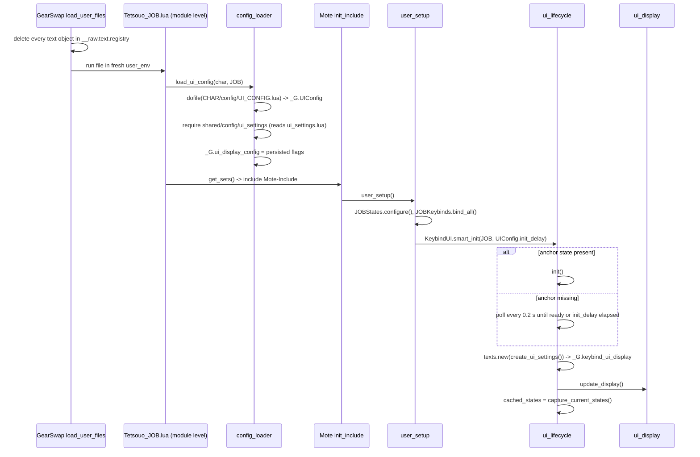
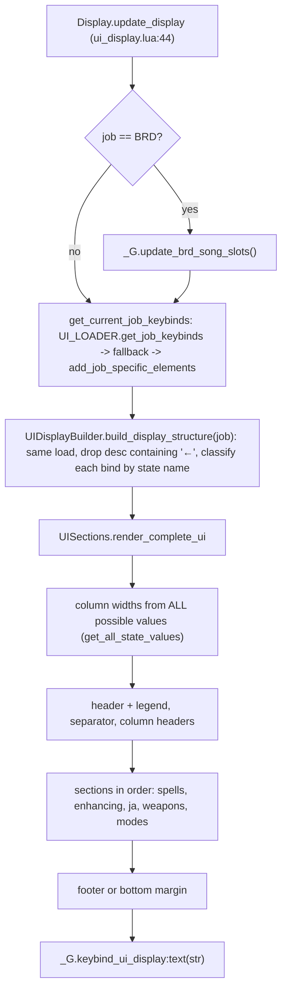
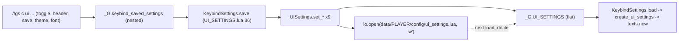
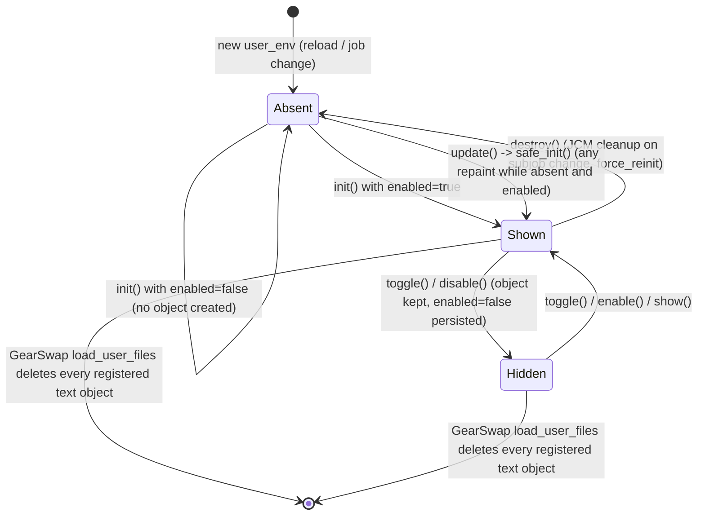

# Keybind HUD (UI overlay)

The keybind HUD is the on-screen text box that lists, for the current job, every state-cycling keybind with its key, a short description and the live value of the Mote state it cycles (for example `^numpad9  Hybrid Mode  ● PDT`). It is a single Windower `texts` object, rebuilt from three inputs: the job's keybind file (`config/<job>/<JOB>_KEYBINDS.lua`), a name-pattern classifier that sorts each bind into a section, and the live `state` table. Every job entry file creates it from `user_setup()` through `KeybindUI.smart_init()`. It is repainted from `job_update`, `job_state_change`, the `cyclestate` handler and some job commands, and a diff over all state values skips repaints that would change nothing. Position and display flags are saved per character in `data/<char>/config/ui_settings.lua`. Users control it with `//gs c ui ...`.

Scope of this page: everything under `shared/utils/ui/`, the settings store `shared/config/ui_settings.lua`, the loader `shared/utils/config/config_loader.lua` (UI part only), the override `shared/utils/core/state_display_override.lua`, and the three per-character config files (`UI_CONFIG.lua`, `UI_COLOR_CONFIG.lua`, `ui_settings.lua`).

## Files

| Path | Lines | Role |
|---|---|---|
| `shared/utils/ui/UI_MANAGER.lua` | 157 | Facade. Seeds the `_G` UI globals, loads the sub-modules and builds the `KeybindUI` table that jobs call |
| `shared/utils/ui/ui_lifecycle.lua` | 194 | `init`, `smart_init`, `safe_init`, `destroy`; creates and destroys the `texts` object |
| `shared/utils/ui/ui_update_orchestrator.lua` | 260 | `update` (repaint only when states changed), `force_reinit`, plus `schedule_update`/`needs_reinit`/`get_status`/`handle_job_configuration_change`, which nothing calls |
| `shared/utils/ui/ui_visibility.lua` | 149 | `toggle`, `show`, `hide`, `is_visible`, `enable`, `disable`, `save_position` |
| `shared/utils/ui/ui_section_toggles.lua` | 84 | Header / legend / column-header / footer toggles |
| `shared/utils/ui/ui_appearance.lua` | 152 | Background preset, custom RGBA, background toggle, font |
| `shared/utils/ui/ui_display.lua` | 71 | Collects the keybinds and pushes the rendered string to the `texts` object |
| `shared/utils/ui/UI_LOADER.lua` | 143 | Loads `config/<job>/<JOB>_KEYBINDS`, has hard-coded COR/GEO fallbacks, appends the BRD song-slot rows |
| `shared/utils/ui/UI_DISPLAY_BUILDER.lua` | 302 | Sorts binds into spell / ja / weapon / mode by substring rules on `bind.state` |
| `shared/utils/ui/UI_SECTIONS.lua` | 361 | Renders the full text in order: header, column headers, sections, footer |
| `shared/utils/ui/UI_FORMATTER.lua` | 393 | Line formatting, column widths, header/legend text, section titles |
| `shared/utils/ui/COLOR_SYSTEM.lua` | 536 | Picks the colour code for each value, with per-character overrides |
| `shared/utils/ui/ui_state_value.lua` | 128 | Reads a state's current value and all its possible values (the latter sizes the columns) |
| `shared/utils/ui/ui_state_tracker.lua` | 89 | Snapshots every state value and diffs it against the previous snapshot |
| `shared/utils/ui/ui_settings_resolver.lua` | 144 | Builds the settings table passed to `texts.new`, plus the Y-offset formula |
| `shared/utils/ui/UI_SETTINGS.lua` | 86 | Adapter between the flat `ui_settings` store and the `keybind_saved_settings` table shape |
| `shared/utils/ui/UI_COMMANDS.lua` | 109 | `//gs c ui ...` dispatcher |
| `shared/config/ui_settings.lua` | 319 | Per-character store: `_G.UI_SETTINGS` plus file I/O (`dofile` / `io.open`) |
| `shared/utils/config/config_loader.lua` | 86 | `load_ui_config(char, job)`: `dofile` of `UI_CONFIG.lua`, then fills `_G.UIConfig` and `_G.ui_display_config` |
| `shared/utils/core/state_display_override.lua` | 49 | Replaces Mote's `display_current_state` (see Interactions) |
| `_master/config_global/UI_CONFIG.lua` | 390 | Template for `data/<char>/config/UI_CONFIG.lua` (display defaults, presets, flags) |
| `_master/config_global/UI_COLOR_CONFIG.lua` | 265 | Template for the per-character colour overrides |
| `_master/config_global/ui_settings.lua` | 33 | Template copy of an auto-generated settings file. `clone_character.py` copies it into `<char>/config/` (`clone_character.py:643-655`) |

## How it works

### Module instances and shared state

All sub-modules are loaded with `require`. In the GearSwap sandbox `require` is `include_user`, which never caches (`GearSwap/user_functions.lua:300-329`). The project's cache (`shared/utils/core/module_cache.lua`) is installed only when `INIT_SYSTEMS.lua` runs (`INIT_SYSTEMS.lua:47-52`), and that happens after `include('Mote-Include.lua')` in `get_sets()`. Anything required before that point, meaning module-level code and `user_setup()`, gets a fresh copy of every UI module. So the same environment usually holds two or three separate `KeybindUI` tables. They behave as one because every piece of mutable state lives on the sandbox `_G`:

| Global | Written by | Meaning |
|---|---|---|
| `_G.UIConfig` | `UI_MANAGER.lua:43-62` (stub, only if absent), `config_loader.lua:67`, entry `get_sets()` (for example `_master/entry/Tetsouo_WAR.lua:116`) | Contents of `UI_CONFIG.lua` |
| `_G.ui_display_config` | `config_loader.lua:71-77`, `UI_MANAGER.lua:75-84` (fallback), toggles | `{enabled, show_header, show_legend, show_column_headers, show_footer}`, the live display flags |
| `_G.keybind_ui_display` | `ui_lifecycle.lua:94` / `:183`, `job_change_manager.lua:73` | The `texts` object, or nil |
| `_G.keybind_ui_visible` | `UI_MANAGER.lua:67`, `ui_lifecycle.lua:95,184`, `ui_visibility.lua:72,100,109`, `job_change_manager.lua:74` | Visibility flag read by `is_visible()` |
| `_G.keybind_saved_settings` | `ui_lifecycle.lua:77-80`, `ui_settings_resolver.lua:88-89` | Nested copy of the store (`pos`, `bg_*`, `font_*`, flags) that the setters write back |
| `_G.ui_manager_state` | `UI_MANAGER.lua:87-114` | Cancel tokens (`smart_init_id`, `update_cancel_id`, `pending_update_id`), failure counter, `cached_states` |
| `_G.UI_SETTINGS` | `ui_settings.lua:165-178` and every setter | Flat settings table, mirrored to disk |

Each job file load builds a new sandbox `_G` (`GearSwap/refresh.lua:83,114-146`), so all of these start empty after `gs reload` or a job change. Nothing in this area stores anything on `windower.*`. The only persistence is the settings file.

### Initialisation (cold load, `gs reload`, main job change)

Details:

1. `ConfigLoader.load_ui_config` (`config_loader.lua:33-80`) runs `dofile` on `<windower>/addons/GearSwap/data/<char>/config/UI_CONFIG.lua`. If that fails it substitutes a small table (`config_loader.lua:53-62`: header, legend, column headers and footer all `true`). It then fills `_G.ui_display_config` from the persisted store.
2. **Load order differs per entry file.** In `_master/entry/Tetsouo_WAR.lua:51`, `Tetsouo_BST.lua:29`, `Tetsouo_PUP.lua:29` and the live-only `Tetsouo/Tetsouo_SMN.lua:34`, `UI_MANAGER` is required at module level before `load_ui_config` (lines 58, 36, 36 and 37). In those files `UI_MANAGER.lua:43-62` finds no `_G.UIConfig`, writes a stub, and `UI_MANAGER.lua:75-84` loads `shared/config/ui_settings` against that stub. The other entry files require `UI_MANAGER` only inside `user_setup()`, after the config is loaded. See Known issues.
3. `smart_init` (`ui_lifecycle.lua:110-154`) bumps `smart_init_id`, then calls `init()` immediately if `are_states_ready()` (`ui_lifecycle.lua:31-63`). Otherwise it schedules `try_init` every 0.2 s. A newer `smart_init` (or `JobChangeManager` cleanup, `job_change_manager.lua:85-87`) invalidates the pending poll. The poll gives up waiting after `max_wait_time` (= `UIConfig.init_delay`, 5.0 in the template) and calls `init()` anyway. Anchor states per job: BRD `SongMode`, BLM `MainLightSpell`, BST `Ecosystem`, THF `TreasureMode`, WAR/PLD `HybridMode` (a Mote built-in, always present, `Mote-Include.lua:44`), DNC `MainStep`, RDM `MainLightSpell`, DRG `WeaponSet` (no DRG job exists), RUN `RuneElement` (no RUN state has that name), GEO `MainIndi`. Every other job counts as ready.
4. `init()` (`ui_lifecycle.lua:75-104`) loads `_G.keybind_saved_settings` once, returns early when `_G.ui_display_config.enabled` is false, and returns if a display already exists. Otherwise it builds the settings with `create_ui_settings()` (`ui_settings_resolver.lua:84-111`), which re-reads the store, calls `texts.new`, shows the object and renders once. The first render is **not** wrapped in `pcall`.

### Rendering pipeline

**Keybind source** (`UI_LOADER.lua:22-50`): `require('config/<job>/<JOB>_KEYBINDS')`. GearSwap's `pathsearch` checks `data/<player.name>/` first (`GearSwap/refresh.lua:693-703`), so each character reads its own file. If the module has `get_active_binds()` (PLD, RUN, DRK today), the loader uses its subjob-filtered list. Otherwise it uses `.binds`. `add_job_specific_elements` (`UI_LOADER.lua:94-112`) returns a copy and, on BRD, appends five display-only rows `{key="", desc="Slot N", state="BRDSongN"}`. It copies because appending to the cached table used to add another five rows on every redraw (commit 8c83203). The keybind table is loaded twice per render, once in `ui_display.lua:27` and once in `UI_DISPLAY_BUILDER.lua:118`.

**Classification** (`UI_DISPLAY_BUILDER.lua:23-94`) uses `string.find` substring matches on `bind.state`, tested in this order:

| Order | Category | Patterns |
|---|---|---|
| 1 | mode | `Mode Combat Engaged Idle Enfeeble Nuke PetIdleMode AutoPetEngage Rotation Xp PhalanxSIRD UseAltStep Auto Lock Marcato Dance Samba SneakInvi Klimaform` |
| 2 | spell | `Spell Element Tier Aja Storm Bar EnSpell Spike Gain Ecosystem species RuneElement Light Dark Rune BRDRotation VictoryMarch Etude QuickDraw Roll Luzaf Indi Geo AOE` |
| 3 | ja | `Step BRDSong WS` |
| 4 | weapon | `Weapon WeaponSet SubSet Proc` |
| 5 | other | anything else, including binds with no `state`. **Not rendered.** |

Matching is case-sensitive, and the first category that matches wins. For example `NukeTier` becomes a mode because `Nuke` is tested before `Tier`, and `KlimaformAOE` becomes a mode because `Klimaform` is tested before `AOE`. The builder stores **keys**, not binds. `render_section` (`UI_SECTIONS.lua:46-79`) walks the keybind list in file order and prints each bind whose key is in the section's key list, skipping binds whose `subjob` differs from `player.sub_job`. Rows therefore follow file order within each section, and the design depends on keys being unique within one keybind file (they are today).

The HUD each template produces (from running the real classifier over every `_master/config/*/*_KEYBINDS.lua`):

| Job | Spells section (title) | JA section (title) | Weapons | Modes | Not shown |
|---|---|---|---|---|---|
| BLM | Main/Sub Light, Dark, Light AOE, Dark AOE, SpellTier, AOETier, Storm | | | HybridMode, CombatMode, MagicBurstMode, DeathMode, SneakInviAOE, KlimaformAOE, AutoMedicine | |
| BRD | VictoryMarch, EtudeType, CarolElement, ThrenodyElement ("Song Settings") | BRDSong1-5 ("Song Slots") | MainWeapon, SubWeapon | IdleMode, EngagedMode, SongMode, MarcatoSong, AutoMedicine | MainInstrument |
| BST | Ecosystem, species ("Pet Abilities") | | WeaponSet, SubSet | HybridMode, AutoPetEngage, PetIdleMode, AutoMedicine | |
| COR | QuickDraw, MainRoll, SubRoll, LuzafRing ("Rolls & Quick Draw") | | MainWeapon, RangeWeapon | HybridMode, AutoMedicine | |
| DNC | | MainStep, AltStep ("JA") | MainWeapon, SubWeaponOverride | HybridMode, UseAltStep, ClimacticAuto, JumpAuto, Dance, Samba, AutoMedicine | |
| DRK | | | MainWeapon | HybridMode, AutoMedicine | |
| GEO | MainIndi, MainGeo, MainLight/DarkSpell, SpellTier, MainLight/DarkAOE, AOETier | | | HybridMode, CombatMode, LuopanMode, IndicolureMode, AutoMedicine | |
| PLD | | | MainWeapon | HybridMode, Xp (/RDM), RuneMode (/RUN), SneakInviAOE (/SCH), AutoMedicine (live Tetsouo adds PhalanxSIRD) | |
| RDM | Storm (/SCH), EnSpell, GainSpell, Barspell, BarAilment, Spike | | MainWeapon, SubWeapon | EngagedMode, IdleMode, CombatMode, EnfeebleMode, NukeMode, SaboteurMode, NukeTier, AutoMedicine | |
| RUN | | | MainWeapon, SubWeapon | HybridMode, RuneMode, AutoMedicine | |
| SAM | | | MainWeapon | HybridMode, AutoMedicine | |
| THF | | | MainWeapon, SubWeapon, AbyProc (/WAR), AbyWeapon (/WAR) | HybridMode, TreasureMode, RangeLock, AutoMedicine | |
| WAR | | WS1-WS5 ("Weapon Skills") | MainWeapon | HybridMode, JumpAuto, AutoMedicine | |
| WHM | | | | CureMode, IdleMode, AfflatusMode, CureAutoTier, CombatMode, CastingMode, AutoMedicine | |
| PUP | no `config/pup/` in `_master`, so the loader returns nothing and the HUD has no rows | | | | |
| SMN (live Tetsouo only) | | | | IdleMode, CastingMode, AutoMedicine | AvatarFavor |

**Line format** (`UI_FORMATTER.lua:235-261`): `"  " .. key .. "    " .. desc .. "    " .. colour .. "● " .. value .. "  "`. Key and description are grey (180,180,180). Key, description and value columns are padded to the widest entry. The value column width comes from **every** possible value of every displayed state (`ui_state_value.lua:23-63`, `UI_FORMATTER.lua:293-311`), so the box keeps a fixed width when a value changes. The content width is the longest candidate line plus 2 (`UI_FORMATTER.lua:45-74`). The layout assumes a monospace font, which is why `set_font` only accepts Consolas and Courier New.

**Value reading** (`ui_state_value.lua:70-126`): `BRDSong%d` states return `.current`/`.value`, or `"Empty"`. Any missing state returns `"N/A"`. A Mote `M{}` object returns `.current` (boolean modes give `"on"`/`"off"`). A plain Lua boolean is passed through `tostring`.

**Header and footer**: `create_header` (`UI_FORMATTER.lua:91-132`) prints a black-background margin line, the centred title (`job_titles`, lines 24-37, which falls back to `"<JOB> Settings"` for DRK/SAM/WHM/PUP/SMN), an `=` separator, and when `show_legend` is set the two legend lines (`^ = Ctrl`, `! = Alt`, `@ = Windows`, `~ = Shift`). The legend is part of the header, so hiding the header also hides the legend. The footer (`UI_SECTIONS.lua:291-311`) is a separator plus a centred `//gs c ui`.

**Colours** (`COLOR_SYSTEM.lua:491-512`), first match wins:
1. The description contains `Gain`: the stat inside the value picks an element colour (`get_gain_color`, lines 247-264; unknown stats fall back to red).
2. The description contains `Element`, `AOE`, `Etude`, `Rune`, `Light`, `Dark`, `Aja`, `Storm` or `Quick Draw`, and the value is an exact key of that palette (lines 415-425). Then `Storm` goes through `get_storm_color`.
3. The description contains `Dance`: Saber Dance is fire red, Fan Dance is green.
4. The value contains `PDT MDT Normal Refresh Potency SIRD Solace Misery`: that mode's colour.
5. Spell-family probes: Bar-element, Bar-ailment (by associated element), En-spells, Spikes, Quick Draw shots.
6. Exact literals: `true/True/On/on` are green, `false/False/Off/off` red, `unknown/Unknown/N/A` grey.
7. Otherwise white.

At module load `COLOR_SYSTEM.lua:21-29` requires `<player.name>/config/UI_COLOR_CONFIG` and converts its `{r,g,b}` triples into `\cs(r,g,b)` overrides (lines 136-230).

### Update triggers

| Trigger | Path |
|---|---|
| `job_update` (every `gs c update`, Mote `handle_cycle` and CycleHandler -> `handle_update({'auto'})`, Mote `sub_job_change` -> `send_command('gs c update')`) | every entry file, for example `_master/entry/Tetsouo_WAR.lua:265-271`; BRD refreshes the song slots first (`Tetsouo_BRD.lua:225-236`) |
| `job_state_change` | `LifecycleManager.state_change` (`shared/utils/core/lifecycle_manager.lua:85-99`, ignores `Moving`), also used by SMN (`shared/jobs/smn/functions/SMN_COMMANDS.lua:420`) |
| `cyclestate` keybinds while the HUD reports visible | `shared/utils/core/CYCLE_HANDLER.lua:120-122`, after the `job_update` above |
| Jobs' own `job_state_change` handlers and state-changing job commands | `BLM_COMMANDS.lua:97` (`update_ui` helper), `RDM_COMMANDS.lua:417`, `WAR_COMMANDS.lua:291`, `WHM_COMMANDS.lua:220` (all inside `job_state_change`; COR and THF go through `LifecycleManager.state_change`, `COR_COMMANDS.lua:345`, `THF_COMMANDS.lua:214`), THF `range` through `RangeLock.engage()` (`shared/jobs/thf/functions/logic/range_lock.lua:40-43`) |
| `//gs c am` (Auto Medicine) | `shared/utils/debuff/auto_medicine.lua:68-83`, only when `is_visible()` |
| BST ecosystem cycling | `shared/jobs/bst/functions/logic/ecosystem_manager.lua:51,92,144`, through `_G.KeybindUI`, which only the BST/PUP entries export (`_master/entry/Tetsouo_BST.lua:158`, cleared at `:423`) |
| UI commands | `toggle`, `show`, section toggles: these call `Display.update_display()` directly and skip the diff |

`KeybindUI.update()` (`ui_update_orchestrator.lua:43-88`):
1. No display: call `safe_init()`, which calls `init()`. With the HUD disabled, `init()` returns straight away, so this path is cheap.
2. `StateTracker.capture_current_states()` (`ui_state_tracker.lua:19-56`) turns every `_G.state` entry into a string, skipping names that start with `_`, functions and `Moving`. AutoMove flips `Moving` several times per second.
3. `have_states_changed` (`ui_state_tracker.lua:62-87`) compares the snapshot with `_G.ui_manager_state.cached_states`. An empty cache counts as changed.
4. If something changed, render under `pcall`. On success, cache the snapshot and reset `consecutive_failures`. On failure, increment the counter. Once it passes 5, every further failing update schedules `force_reinit(player.main_job, 5.0)` two seconds later (`:72-76`), with no de-duplication.

### Persistence

- File: `windower.addon_path .. 'data/' .. player.name .. '/config/ui_settings.lua'` (`ui_settings.lua:85-92`). It is a `return { ... }` literal with all 19 keys, written by `save_to_file` (`ui_settings.lua:111-157`). A write failure is reported through `MessageFormatter.show_error`.
- At module load (`ui_settings.lua:165-178`) the file always wins. If it is missing, `_G.UI_SETTINGS` is seeded from `D = compute_defaults()` (values from `_G.UIConfig` at that moment, lines 49-76) and written to disk immediately.
- Every `UISettings.set_*` rewrites the whole file. `KeybindSettings.save` calls up to nine setters (position, enabled, four flags, background, background visible, font), so one command can write the file nine times.
- Boolean defaults are consistent within this module. `enabled`, `show_legend`, `bg_visible` and `section_*` default to true (`~= false`); `show_header`, `show_column_headers` and `show_footer` default to false (`== true`). The same form is used in `compute_defaults`, the getters and `save_to_file`, so the 2026-05-18 P2-9 mismatch is fixed. Two other places use different defaults: the `UI_MANAGER` stub (`UI_MANAGER.lua:58-62`, nil means true) and the `config_loader` fallback (`config_loader.lua:57-61`, true).
- Position: the saved Y is stored relative to a layout with the header shown. `save_position_internal` subtracts `calculate_y_offset()` (`ui_visibility.lua:32-37`) and `create_ui_settings` adds it back (`ui_settings_resolver.lua:98-101`). Dragging with the mouse (`texts` library `draggable` flag) is **not** saved automatically. Only `//gs c ui s` saves. After a reload or job change the HUD goes back to the last saved position.

### Lifecycle across events

- **gs reload / main job change.** GearSwap deletes every text object created through `windower.text.create` (`GearSwap/refresh.lua:73-75`, registry kept by the override at `GearSwap/gearswap.lua:55-84`, which the `texts` library goes through). Old HUDs cannot leak into the next file. The new environment starts with every UI global unset.
- **Subjob change** (same environment). Mote's `sub_job_change` (`Mote-Include.lua:981-990`) calls `user_setup()` (`smart_init` returns at once because a display exists), then `job_sub_job_change`, then `JobChangeManager.on_job_change`. That runs `cleanup_all_systems` (`job_change_manager.lua:66-87`), which destroys the HUD, clears `_G.keybind_ui_display`/`_G.keybind_ui_visible`, resets fields of `_G.ui_manager_state` and bumps `smart_init_id`. Mote then sends `gs c update`, whose `job_update` finds no display and recreates the HUD through `safe_init`. The debounced `gs reload` (0.5 s for a subjob change) finally replaces the whole environment.
- **Zone change, death, raise.** No UI handling. The object persists and repaints on the next update.
- **Events.** The UI modules register no Windower events. Dragging is handled by the `texts` library's own global `mouse` handler, registered once inside GearSwap.
- **Coroutines.** `smart_init.try_init` (0.2 s, cancelled by `smart_init_id`), `force_reinit.try_reinit` (0.2 s, cancelled by `update_cancel_id`), `schedule_update` (cancelled by `pending_update_id`, never called), and the failure-recovery `force_reinit` (2 s, not cancellable). All are bounded by a timeout or run once.

## Public API

### `KeybindUI` (returned by `require('shared/utils/ui/UI_MANAGER')`)

| Function | Effect | Main callers |
|---|---|---|
| `init()` | Load saved settings once; if `enabled` and no display exists, `texts.new` + show + render + seed `cached_states` | internal (`smart_init`, `safe_init`, `enable`, `force_reinit`) |
| `smart_init(job_name, max_wait_time=3)` | `init()` now, or poll every 0.2 s until the job's anchor state exists or `max_wait_time` s pass. `job_name` is unused | every entry `user_setup()` (for example `_master/entry/Tetsouo_WAR.lua:231`) |
| `safe_init()` | Record `current_job`/`current_subjob`, then `init()` if no display | `update()` |
| `destroy()` | `pcall(display:destroy())`, clear the globals and `cached_states` | `force_reinit`, `job_change_manager.lua:67-70` |
| `update()` | Diff the states, repaint on change (see above) | about 40 call sites in `shared/` and `_master/` (Update triggers) |
| `force_reinit(job_name, max_wait_time=3)` | Bump `update_cancel_id`, destroy, `init()` now or poll. Returns a boolean (or `true` when async) | only the failure path of `update()` and `schedule_update` |
| `schedule_update(reason, delay=1.0)` | Debounced update, or `force_reinit` if job/subjob changed | only `handle_job_configuration_change` |
| `handle_job_configuration_change(change_data)` | Maps `change_data.type` to a delay and calls `schedule_update` | **no callers** (its header says JobChangeManager dispatches it; JobChangeManager does not) |
| `needs_reinit(job)`, `get_status()` | Diagnostics | **no callers** |
| `save_position()` | Read `display:pos()`, subtract the Y offset, persist, confirm in chat | `//gs c ui s` |
| `toggle()` | If a display exists: flip visibility **and** persist `enabled`. Otherwise `enable()`/`disable()` | `//gs c ui` |
| `show()`, `hide()` | Visibility only, not persisted | `enable`, `disable` |
| `is_visible()` | `_G.keybind_ui_visible == true` | `CYCLE_HANDLER.lua:107`, `auto_medicine.lua:76` |
| `enable()`, `disable()` | Set and persist `enabled`, create/show or hide | `//gs c ui on/off`, `toggle` |
| `toggle_header()`, `toggle_legend()`, `toggle_column_headers()`, `toggle_footer()` | Flip the flag, move the box by the offset delta (top sections only), repaint, persist. No-op without a display | `//gs c ui h/l/c/f` |
| `set_background_preset(name)` | Apply `UIConfig.background_presets[name]`, persist | `//gs c ui bg <name>` |
| `set_background_rgba(r,g,b,a)` | `tonumber`, clamp 0-255, apply, persist | `//gs c ui bg r g b a` |
| `toggle_background()` | Flip `_G.UIConfig.background.visible`, apply, persist `bg_visible` | `//gs c ui bg toggle` |
| `set_font(name)` | Accepts `consolas`, `courier new`, `courier`, then applies and persists | `//gs c ui font <name>` |

### Helper modules

- `UICommands.handle_ui_command(cmdParams)`, `UICommands.is_ui_command(cmd)`: called from every job's `job_self_command` (`shared/jobs/*/functions/*_COMMANDS.lua`, for example `WAR_COMMANDS.lua:122-126`).
- `KeybindLoader.get_job_keybinds(job)`, `.get_fallback_keybinds(job)`, `.add_job_specific_elements(job, binds)`: used by `ui_display.lua` and `UI_DISPLAY_BUILDER.lua`. `.config_exists(job)` and `.get_config_path(job)` have no callers and build the wrong path `config/<JOB>_KEYBINDS` (no job folder).
- `UIDisplayBuilder.build_display_structure(job)` returns `{spell_keys, ja_keys, weapon_keys, mode_keys, enhancing_keys?}`. `extract_display_keys` and `apply_job_enhancements` are only used inside it. `validate_structure` and `get_categorization_stats` have no callers.
- `UISections.render_complete_ui(ds, binds, job, get_value, get_all_values)` returns a string. The per-section `render_*_section` functions are public but only used inside the module. `validate_configuration` and `get_section_statistics` have no callers.
- `UIFormatter`: layout helpers. `calculate_header_width`, `format_empty_section`, `validate_configuration` and `get_statistics` have no callers.
- `ColorSystem.get_value_color(value, desc)` is used by `UI_FORMATTER.lua:244`. `get_element_colors`, `get_stat_colors` and `add_custom_color` have no callers.
- `StateValue.get_state_value(name, key)`, `.get_all_state_values(name)`, `StateTracker.capture_current_states()`, `.have_states_changed(snapshot)`: internal.
- `UISettingsResolver.create_ui_settings()`, `.calculate_y_offset()`, `.get_background_settings()`. `.default_ui_settings()` has no callers.
- `KeybindSettings.load()` and `.save(tbl)` (`UI_SETTINGS.lua`).
- `UISettings` (`shared/config/ui_settings.lua`): `get/set_position`, `get/set_enabled`, `get/set_show_header|legend|column_headers|footer`, `get/set_background`, `set_background_visible`, `get/set_font`. `get_sections` and `set_section` have no callers.
- `ConfigLoader.load_ui_config(char, job)`: every entry file.
- `StateDisplayOverride.init()`: `INIT_SYSTEMS.lua:225-233`, deferred 0.5 s.

## Commands

All are `//gs c ui  ...`, routed by each job's `job_self_command` to `UICommands.handle_ui_command` (`UI_COMMANDS.lua:27-96`). The subcommand is lowercased.

| Syntax | Effect | Handler |
|---|---|---|
| `ui` | `toggle()`: hide/show and persist `enabled` | `ui_visibility.lua:70-95` |
| `ui h` / `header` | Toggle title (and legend) | `ui_section_toggles.lua:55-57` |
| `ui l` / `legend` | Toggle legend (visible only while the header is shown) | `ui_section_toggles.lua:60-62` |
| `ui c` / `columns` | Toggle the `Key / Function / Current` row | `ui_section_toggles.lua:65-67` |
| `ui f` / `footer` | Toggle footer | `ui_section_toggles.lua:70-82` |
| `ui s` / `save` | Save the current screen position and all flags | `ui_visibility.lua:60-67` |
| `ui on` / `enable`, `ui off` / `disable` | Enable/disable and persist | `ui_visibility.lua:121-146` |
| `ui font <Consolas\|Courier>` | Change font (only the first word is read, so `Courier New` is entered as `courier`) | `ui_appearance.lua:117-150` |
| `ui bg\|background\|theme <preset>` | Apply a preset from `UIConfig.background_presets` (lowercase keys) | `ui_appearance.lua:53-69` |
| `ui bg <r> <g> <b> <a>` | Custom background | `ui_appearance.lua:77-94` |
| `ui bg toggle` | Background on/off | `ui_appearance.lua:97-112` |
| `ui bg list` | Print preset names (`MessageUI.show_theme_list`) | `message_ui.lua:113-158` |
| `ui help` / `?` | Print help. Anything else prints an error followed by the help | `message_ui.lua:161-189` |

There is no `//gs c uisave` command, although `UI_MANAGER.lua:28` and `UI_CONFIG.lua:337` mention one. The help text does not list `ui font`, and "dark" and "light" in its "dark/light/blue" preset example are not preset names (`blue` is).

## Configuration

### `data/<char>/config/UI_CONFIG.lua` (template `_master/config_global/UI_CONFIG.lua`)

| Key | Template value | Read by |
|---|---|---|
| `enabled`, `show_header`, `show_legend`, `show_column_headers`, `show_footer` | true, false, true, false, false | only as `compute_defaults` input (`ui_settings.lua:58-62`), i.e. when the settings file is missing or lacks a key. At runtime the persisted values win |
| `default_position {x,y}` | 1857, -24 | the same, defaults only |
| `text.size`, `text.font` | 10, Consolas | defaults only. `text.stroke` is passed straight to `texts.new` on every init (`ui_settings_resolver.lua:105`) |
| `background {r,g,b,a,visible}` | 15,15,35,180,true | defaults. `toggle_background` also flips `background.visible` at runtime |
| `background_presets` | 36 named presets | `UI_COMMANDS.lua:75`, `ui_appearance.lua:55-60` |
| `flags {draggable, bold}` | true, true | passed to `texts.new` (`ui_settings_resolver.lua:109`); the `texts` library applies both |
| `sections {spells, enhancing, job_abilities, weapons, modes}` | all true | `UI_SECTIONS.lua:132,148,166,189,205`, through a reference captured when the module loads (`UI_SECTIONS.lua:16`) |
| `init_delay` | 5.0 | used as `smart_init`'s maximum wait (not a delay), and by BRD to schedule the song-slot refresh (`_master/entry/Tetsouo_BRD.lua:204-209`) |
| `colors`, `auto_save_position`, `auto_save_delay`, `debug`, `update_throttle` | | **nothing reads them** |
| `validate()`, `print_config()` | | **no callers** |

### `data/<char>/config/ui_settings.lua` (auto-generated)

Keys: `pos_x, pos_y, enabled, show_header, show_legend, show_column_headers, show_footer, bg_r, bg_g, bg_b, bg_a, bg_visible, font_size, font_name, section_spells, section_enhancing, section_job_abilities, section_weapons, section_modes`. The `section_*` keys are written but never read by the renderer. `font_size` has no command. Live values differ per character (Tetsouo 1726,-22 dark blue; Kaories 1642,-16 with `35,20,10`). `clone_character.py` copies the template `_master/config_global/ui_settings.lua` into the target's `config/`, replacing an existing file.

### `data/<char>/config/UI_COLOR_CONFIG.lua`

Takes effect: `elements`, `stats`, `modes`, `special.true/false/unknown`, `spells.en`, `spells.spikes`, `spells.storms`, `jobs.quick_draw`. No effect: `bar_spells.ailment` (`COLOR_SYSTEM.lua:177` stores it in `special_colors.bar_ailment`, which nothing reads), `special.default` (the fallback is the constant `DEFAULT_COLOR`, `COLOR_SYSTEM.lua:411`), `jobs.runes` (empty). The helper functions at the bottom of the file have no callers, and `get_bar_element_color` would error because `bar_spells.element` does not exist.

### Keybind file fields read by the HUD

`key` (required, string), `desc` (required, string: `UI_DISPLAY_BUILDER.lua:102` and `UI_FORMATTER.lua:284` call string functions on it), `state` (the Mote state name; its classification decides whether and where the row appears), `subjob` (optional). `command` is only used by `bind_all`. Binds whose `desc` contains `←` are dropped (`UI_DISPLAY_BUILDER.lua:99-107`).

## State & lifetime

- Sandbox `_G` globals: see the table under "Module instances and shared state". Also read: `_G.state`, `player`, `_G.UPDATE_DEBUG` (restored from `windower._gs_debug` in `INIT_SYSTEMS.lua:32-35`), `_G.update_brd_song_slots` (`song_rotation_manager.lua:298`).
- `windower.*`: not used by this area.
- Files: `UI_CONFIG.lua` (dofile, every load), `ui_settings.lua` (dofile at module load, rewritten on each setter), `UI_COLOR_CONFIG.lua` (require at `COLOR_SYSTEM` load), `config/<job>/<JOB>_KEYBINDS.lua` (require on each render; cached once `module_cache` is installed).
- Events: none registered. Text objects: at most one per environment (the `init()` guard on `_G.keybind_ui_display`), deleted by GearSwap on every file load.

## Interactions

- **JobChangeManager** (`shared/utils/core/job_change_manager.lua:55-91`) destroys the HUD and resets UI globals on a subjob change before its debounced `gs reload`. See [core-lifecycle.md](core-lifecycle.md).
- **CycleHandler** (`shared/utils/core/CYCLE_HANDLER.lua:90-124`): when `KeybindUI.is_visible()` is true it does what Mote's `handle_cycle` does without the chat line (same `job_state_change(description, new, old)` call, then `handle_update({'auto'})`, so `job_update` repaints the HUD), then calls `KeybindUI.update()` once more. Otherwise it sends `gs c cycle <state>` so Mote prints `"<desc> is now <value>."`. The HUD is the only feedback on the silent path. `cyclestate <state> reverse` cycles backwards on both paths. See [core-lifecycle.md](core-lifecycle.md#cyclehandler-and-state-display).
- **StateDisplayOverride** (`state_display_override.lua:29-43`) replaces Mote's `display_current_state`. Mote calls that function only from `handle_update` when the argument is `user` (`Mote-SelfCommands.lua:255-257`, bound to F12 by `Mote-Globals.lua:57`), and passes no arguments. The override prints nothing while `_G.ui_display_config.enabled` is true, and otherwise prints `State: Unknown`.
- **LifecycleManager** (`lifecycle_manager.lua:85-99`) provides the `job_state_change` handler that repaints.
- **Messages**: `MessageUI` (`shared/utils/messages/formatters/ui/message_ui.lua`) and `MessageCore.show_ui_error/show_ui_info`. See [messages.md](messages.md).
- **Keybind files and job states**: see each job page, for example [../jobs/brd.md](../jobs/brd.md) and [../jobs/pld.md](../jobs/pld.md).
- **Auto Medicine** (`shared/utils/debuff/auto_medicine.lua:68-83`) repaints after `//gs c am`.

## Invariants & gotchas

- A new state only appears in the HUD if its **name** matches one of the category patterns. Anything classified as "other" is dropped without a warning, even though its keybind still works. With the HUD visible, `cyclestate` prints no chat line, so an unclassified state gives no feedback at all.
- Pattern order matters: mode patterns are tested first, so a name containing `Mode`, `Auto`, `Lock`, `Idle`... is a mode even if it also contains `Spell` or `Weapon`.
- Rows are matched to sections **by key**. Two binds sharing a key in one file would appear in both sections.
- The first render inside `init()` is not protected by `pcall`. When `smart_init` runs synchronously in `user_setup()`, a render error aborts `user_setup`, and with it the rest of Mote's `init_include` and the job's `get_sets()`.
- Code that must still see the live `_G.UIConfig` when it runs has to read it at call time, as `ui_settings_resolver.lua:85`, `ui_appearance.lua` and `UI_COMMANDS.lua:74` do. `UI_SECTIONS.lua:16` captures it at load time, which on WAR/BST/PUP/SMN happens before `config_loader` has run (`UI_FORMATTER.lua:16` captures it too, but only the uncalled `get_statistics` reads it).
- `toggle()` does not only hide the box: it also persists `enabled=false`, so after the next load no text object is created at all.
- `update()` repaints only when some state value changed. Code that changes something the HUD shows without changing a state (for example BRD song slots) must refresh that data before calling `update()` (BRD does this in `job_update`).
- `ui_settings_resolver.lua:106` puts `padding` inside `text`, but the `texts` library reads it from the top-level `padding`, so the setting has no effect. The library default is also 0.

## Extending

- **Show a new state**: add the bind to `config/<job>/<JOB>_KEYBINDS.lua` in `_master/config/` and in the live character folders (`key`, `command = "cyclestate X"`, `desc`, `state`). Run the classifier mentally. If no pattern matches, add a pattern to the right list in `UI_DISPLAY_BUILDER.lua:23-59`, and check that it does not re-classify an existing state, since substring matches are broad. Mode patterns are tested first.
- **New job**: add a keybind file and an anchor state to `are_states_ready()` (`ui_lifecycle.lua:31-63`) if the states are created after `user_setup` starts. Optionally add a title to `job_titles` (`UI_FORMATTER.lua:24-37`) and a section title case in `get_section_title` (`UI_FORMATTER.lua:194-223`). Call `KeybindUI.smart_init(JOB, UIConfig.init_delay)` from `user_setup()` after the states and keybinds, and `KeybindUI.update()` from `job_update`. Call `ConfigLoader.load_ui_config` before any module-level `require` of `UI_MANAGER`.
- **New colour rule**: extend `DESCRIPTION_PALETTES`, `MODE_SUBSTRINGS`, `SPELL_COLOR_PROBES` or `EXACT_VALUE_COLORS` (`COLOR_SYSTEM.lua:415-447`). Per-character values go in `UI_COLOR_CONFIG.lua`.
- **New `//gs c ui` subcommand**: add a branch to `UI_COMMANDS.lua:36-93` and a line to `MessageUI.show_help`.

## Known issues

- With the HUD disabled or hidden before a reload, `is_visible()` still reports true, so keybind cycling prints nothing (`shared/utils/ui/UI_MANAGER.lua:67`).
- A keybind without `desc` makes the first render throw inside `user_setup()` and aborts the job load (`shared/utils/ui/ui_lifecycle.lua:100`, `shared/utils/ui/UI_DISPLAY_BUILDER.lua:102`).
- SMN `AvatarFavor` matches no category pattern and never appears in the HUD (`shared/utils/ui/UI_DISPLAY_BUILDER.lua:43-58`).
- BRD `MainInstrument` matches no category pattern, and nothing reads the state (`shared/utils/ui/UI_DISPLAY_BUILDER.lua:39-41`).
- Header/legend/column toggles move the box in the wrong direction, so it jumps instead of staying put (`shared/utils/ui/ui_section_toggles.lua:42`).
- RUN's readiness anchor `RuneElement` does not exist, so the RUN HUD waits the full `init_delay` (`shared/utils/ui/ui_lifecycle.lua:56-57`).
- WAR/BST/PUP (and live SMN) require `UI_MANAGER` before `config_loader`. A missing `ui_settings.lua` is then regenerated from stub defaults, and `UI_SECTIONS` keeps the stub `UIConfig` (`shared/utils/ui/UI_MANAGER.lua:43`).
- `section_*` settings are persisted but never read, and `UIConfig.sections` is captured when the module loads (`shared/config/ui_settings.lua:299-313`, `shared/utils/ui/UI_SECTIONS.lua:16`).
- `toggle_background` flips `UIConfig.background.visible`, not the persisted `bg_visible` (`shared/utils/ui/ui_appearance.lua:100`).
- `KeybindSettings.save` rewrites the settings file up to nine times per command (`shared/utils/ui/UI_SETTINGS.lua:36-84`).
- `handle_job_configuration_change`, `schedule_update`, `needs_reinit` and `get_status` have no callers, and the header says JobChangeManager dispatches the first one (`shared/utils/ui/ui_update_orchestrator.lua:9,242`).
- Several dead helpers, the RDM `enhancing_keys` that can never match, and the unreachable GEO/`result` branches (`shared/utils/ui/UI_DISPLAY_BUILDER.lua:190`, `shared/utils/ui/ui_state_value.lua:111-123`).
- The `display_current_state` override prints `State: Unknown` on F12 while the HUD is disabled (`shared/utils/core/state_display_override.lua:30-42`).
- `UI_CONFIG.lua` has keys nothing reads, and `print_config`/`validate` have no callers (`_master/config_global/UI_CONFIG.lua:319-388`).
- In `UI_COLOR_CONFIG.lua`, `bar_spells.ailment` and `special.default` have no effect (`shared/utils/ui/COLOR_SYSTEM.lua:174-179`).
- The legend explains `^ ! @ ~` but not `#` (Apps), the modifier of every job's `#numpad0` AutoMedicine bind (`shared/utils/ui/UI_FORMATTER.lua:123-124`).
