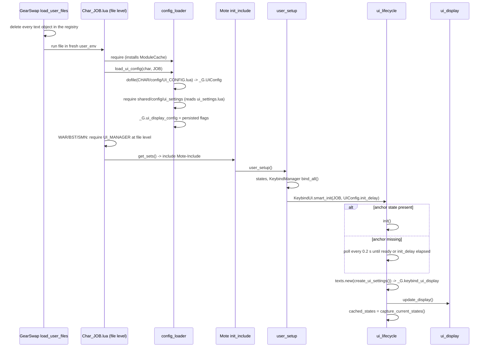
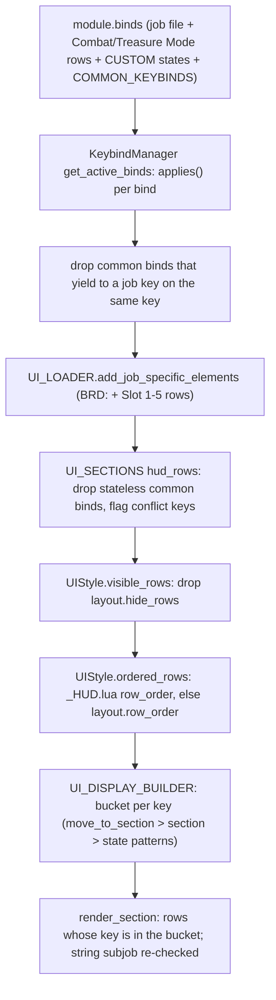
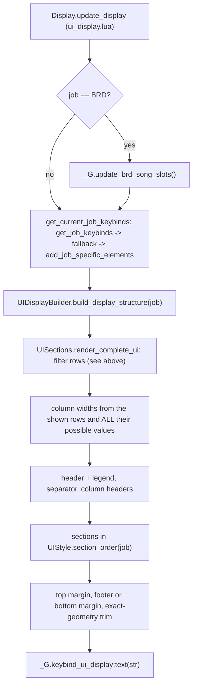
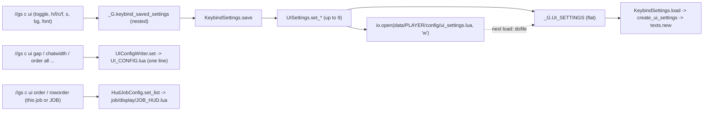
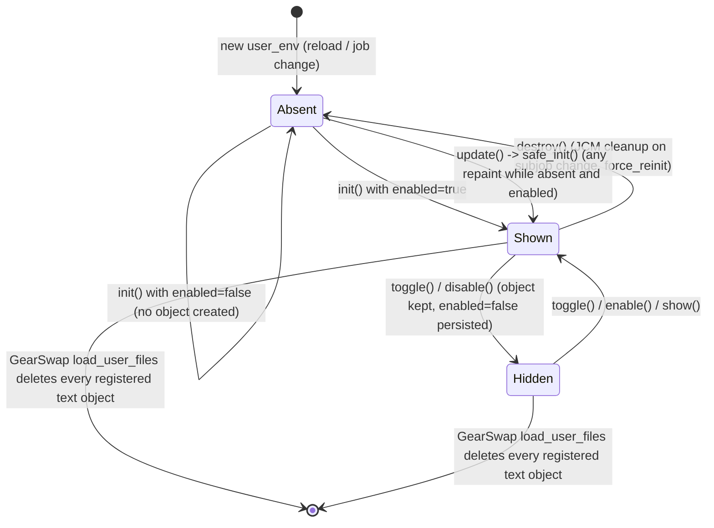

# Keybind HUD (UI overlay)

The keybind HUD is the on-screen text box that lists, for the current job, every state-cycling keybind with its key, a short description and the live value of the Mote state it cycles (for example `^numpad9    Hybrid Mode    ● PDT`). It is a single Windower `texts` object, rebuilt from four inputs: the job's keybind module (`<job>/keys/<JOB>_KEYBINDS.lua`, made by `KeybindManager.create`), the player's look options (`UI_CONFIG.lua` `layout` / `colors`, and the job's own `<job>/display/<JOB>_HUD.lua`), a name-pattern classifier that sorts each bind into a section, and the live `state` table. Every job entry file creates it from `user_setup()` through `KeybindUI.smart_init()`. It is repainted from `job_update`, `job_state_change`, the `cyclestate` handler and some job commands; a diff over all state values skips repaints that would change nothing. Position and display flags are saved per character in `data/<char>/saved/ui_settings.lua`, look options in `data/<char>/_common/display/UI_CONFIG.lua`. Users control it with `//gs c ui ...`.

Scope of this page: everything under `shared/utils/ui/` (22 files), the settings store `shared/config/ui_settings.lua`, the loader `shared/utils/config/config_loader.lua` (UI part), the override `shared/utils/core/state_display_override.lua`, the per-character config files (`UI_CONFIG.lua`, `UI_COLOR_CONFIG.lua`, `ui_settings.lua`, `<JOB>_HUD.lua`), and the HUD side of the two optional states (Combat Mode, Treasure Mode). The chat side of the `UI_CONFIG.lua` `chat` block (palette, separators, job tag, width) is owned by [messages.md](messages.md#colours-palette-and-chat-options); the keybind engine by [keybinds-and-custom.md](keybinds-and-custom.md).

Line counts re-measured on 2026-09-28 (`wc -l`).

## Files

| Path | Lines | Role |
|---|---|---|
| `shared/utils/ui/UI_MANAGER.lua` | 167 | Facade. Seeds the `_G` UI globals (stub `UIConfig` keys, `ui_display_config`, `ui_manager_state`), records the live load in `windower._ui_live_state`, loads the sub-modules and builds the `KeybindUI` table that jobs call |
| `shared/utils/ui/ui_lifecycle.lua` | 202 | `init`, `smart_init`, `safe_init`, `destroy`; per-job readiness anchors; creates and destroys the `texts` object |
| `shared/utils/ui/ui_update_orchestrator.lua` | 277 | `update` (repaint only when states changed), `force_reinit`, plus `schedule_update` / `needs_reinit` / `get_status` / `handle_job_configuration_change`, which nothing calls |
| `shared/utils/ui/ui_visibility.lua` | 149 | `toggle`, `show`, `hide`, `is_visible`, `enable`, `disable`, `save_position` |
| `shared/utils/ui/ui_section_toggles.lua` | 194 | Header / legend / column-header / footer toggles; moves the box by the measured height change |
| `shared/utils/ui/ui_appearance.lua` | 155 | Background preset, custom RGBA, background toggle, font |
| `shared/utils/ui/ui_display.lua` | 72 | Collects the keybinds and pushes the rendered string to the `texts` object |
| `shared/utils/ui/UI_LOADER.lua` | 145 | Requires `<job>/keys/<JOB>_KEYBINDS`, hard-coded COR/GEO fallbacks, appends the BRD song-slot rows |
| `shared/utils/ui/UI_DISPLAY_BUILDER.lua` | 335 | Sorts binds into spell / ja / weapon / mode: `layout.move_to_section`, then `bind.section`, then substring rules on `bind.state` |
| `shared/utils/ui/UI_SECTIONS.lua` | 428 | Filters the rows (`hud_rows`, hidden rows, row order), renders the full text: header, column headers, sections in the player's order, footer |
| `shared/utils/ui/UI_FORMATTER.lua` | 425 | Line formatting, column widths, header / legend text, section titles |
| `shared/utils/ui/COLOR_SYSTEM.lua` | 533 | Picks the colour code for each value, with per-character overrides from `UI_COLOR_CONFIG.lua` |
| `shared/utils/ui/ui_state_value.lua` | 119 | Reads a state's current value and all its possible values (the latter sizes the value column) |
| `shared/utils/ui/ui_state_tracker.lua` | 90 | Snapshots every state value and diffs it against the previous snapshot |
| `shared/utils/ui/ui_settings_resolver.lua` | 112 | Builds the settings table passed to `texts.new` |
| `shared/utils/ui/UI_SETTINGS.lua` | 98 | Adapter between the flat `ui_settings` store and the nested `keybind_saved_settings` shape |
| `shared/utils/ui/UI_COMMANDS.lua` | 108 | `//gs c ui ...` dispatcher (visibility, sections, font, background; everything else goes to `ui_style_commands.lua`) |
| `shared/utils/ui/ui_style.lua` | 576 | Player look options from `UI_CONFIG.lua` (`layout`, `colors`, `chat`, `rolls`): checked, cached per `_G.UIConfig` table, one chat warning per wrong value |
| `shared/utils/ui/ui_style_commands.lua` | 479 | In-game look commands (`//gs c ui gap 3`, `compact`, `chatwidth`, `rollstyle`, `order`...): check, apply live, save |
| `shared/utils/ui/ui_config_writer.lua` | 179 | Saves one look option into `UI_CONFIG.lua` by rewriting its line only |
| `shared/utils/ui/hud_job_config.lua` | 208 | A job's own HUD settings, `<Character>/<job>/display/<JOB>_HUD.lua` (section and row order that replace the `UI_CONFIG.lua` defaults on that job); writes the file with its explanation |
| `shared/config/ui_settings.lua` | 344 | Per-character store: `_G.UI_SETTINGS` plus file I/O (`dofile` / `io.open`) |
| `shared/utils/config/config_loader.lua` | 91 | Installs the require cache, then `load_ui_config(char, job)`: `dofile` of `UI_CONFIG.lua`, fills `_G.UIConfig` and `_G.ui_display_config` |
| `shared/utils/core/state_display_override.lua` | 46 | Replaces Mote's `display_current_state` (see Interactions) |
| `shared/utils/core/optional_state.lua` | 142 | `OptionalState.create{...}`: a Mote state the project adds to jobs, with a HUD row and key shown or hidden per job (Combat Mode, Treasure Mode) |
| `shared/utils/core/optional_state_commands.lua` | 147 | `//gs c <mode> [show\|hide\|key <key>\|help]` for an optional state; rewrites its settings file |
| `_master/config_global/UI_CONFIG.lua` | 533 | Template for `data/<char>/_common/display/UI_CONFIG.lua` (display defaults, 36 presets, `layout` / `colors` / `chat` / `rolls` blocks) |
| `_master/config_global/UI_COLOR_CONFIG.lua` | 275 | Template for the per-character value-colour overrides |
| `_master/config_global/ui_settings.lua` | 36 | Starting settings for a new character (position 1600, 300). A re-clone keeps the character's existing file (`clone_character.py` `KEPT_ON_RECLONE`, which also keeps `combat_mode.lua`, `treasure_mode.lua` and `config/*/*_HUD.lua`) |

## How it works

### Module instances and shared state

All sub-modules are loaded with `require`. In the GearSwap sandbox `require` is `include_user`, which never caches (`GearSwap/user_functions.lua`). The project's cache (`shared/utils/core/module_cache.lua`) is installed at the top of `config_loader.lua`, which every entry file requires at file level before anything else of the UI, so since 2026-09-27 one copy of each UI module exists per sandbox in practice (`INIT_SYSTEMS.lua` installs it again, idempotently). All mutable state still lives on the sandbox `_G`, so a second copy would behave the same:

| Global | Written by | Meaning |
|---|---|---|
| `_G.UIConfig` | `ConfigLoader.load_ui_config`; `UI_MANAGER.lua` fills missing keys (`text`, `background`, `default_position`, `flags`, `show_*`, `enabled`) | Contents of `UI_CONFIG.lua` |
| `_G.ui_display_config` | `ConfigLoader.load_ui_config`, `UI_MANAGER.lua` (fallback when absent), the toggles | `{enabled, show_header, show_legend, show_column_headers, show_footer}`, the live display flags |
| `_G.keybind_ui_display` | `KeybindUI.init` / `destroy`, `JobChangeManager` `cleanup_all_systems` | The `texts` object, or nil |
| `_G.keybind_ui_visible` | `UI_MANAGER.lua` (seeded `true`), `init`, `destroy`, `toggle`, `show`, `hide`, `JobChangeManager` | Visibility flag read by `is_visible()` (together with the display) |
| `_G.keybind_saved_settings` | `init`, `create_ui_settings` (`KeybindSettings.load()`) | Nested copy of the store (`pos`, `bg_*`, `font_*`, flags) that the setters write back |
| `_G.ui_manager_state` | `UI_MANAGER.lua` | Cancel tokens (`smart_init_id`, `update_cancel_id`, `pending_update_id`), failure counter, `cached_states` |
| `_G.UI_SETTINGS` | `shared/config/ui_settings.lua` (module load and every setter) | Flat settings table, mirrored to disk |
| `_G._hud_job_config` | `hud_job_config.lua` | Per-job cache of `<JOB>_HUD.lua` |
| `_G._keybind_active`, `_G._combat_mode_*`, `_G._treasure_mode_*` | `KeybindManager.create`, `OptionalState` | The job's keybind module (for `conflict_keys`), optional-state settings / native flag / entry |

Each job file load builds a new sandbox `_G` (`GearSwap/refresh.lua`), so all of these start empty after `gs reload` or a job change. Three values live on `windower.*` and outlive the sandbox: `windower._ui_live_state` (the live load's `_G.ui_manager_state`; a coroutine scheduled by an older load compares against it and gives up), `windower._hud_virtual_y` (the unclamped Y, see Persistence) and `windower._hud_line_height` (line heights learned per font size, `ui_section_toggles.lua` `learned_heights`). Everything else persists only through files.

The keybind file itself is loaded twice per load under two require paths: the entry file requires `'<Char>/<job>/keys/<JOB>_KEYBINDS'`, the HUD requires `'<job>/keys/<JOB>_KEYBINDS'` (`KeybindLoader.get_job_keybinds`). The module cache keys by path, so these are two module tables, and `KeybindManager.create` runs on each. The first one is the one that lays the keys (`_G._keybind_active`); the HUD draws from the second.

### Initialisation (cold load, `gs reload`, main job change)

```mermaid
sequenceDiagram
    participant GS as GearSwap load_user_files
    participant Entry as Char_JOB.lua (file level)
    participant CL as config_loader
    participant Mote as Mote init_include
    participant US as user_setup
    participant LC as ui_lifecycle
    participant D as ui_display
    GS->>GS: delete every text object in the registry
    GS->>Entry: run file in fresh user_env
    Entry->>CL: require (installs ModuleCache)
    Entry->>CL: load_ui_config(char, JOB)
    CL->>CL: dofile(CHAR/config/UI_CONFIG.lua) -> _G.UIConfig
    CL->>CL: require shared/config/ui_settings (reads ui_settings.lua)
    CL->>CL: _G.ui_display_config = persisted flags
    Entry->>Entry: WAR/BST/SMN: require UI_MANAGER at file level
    Entry->>Mote: get_sets() -> include Mote-Include
    Mote->>US: user_setup()
    US->>US: states, KeybindManager bind_all()
    US->>LC: KeybindUI.smart_init(JOB, UIConfig.init_delay)
    alt anchor state present
        LC->>LC: init()
    else anchor missing
        LC->>LC: poll every 0.2 s until ready or init_delay elapsed
    end
    LC->>LC: texts.new(create_ui_settings()) -> _G.keybind_ui_display
    LC->>D: update_display()
    LC->>LC: cached_states = capture_current_states()
```

1. `ConfigLoader.load_ui_config(char_name, job_name)` runs `dofile` on `<windower>/addons/GearSwap/data/<char>/_common/display/UI_CONFIG.lua`. On failure it substitutes a small table (`init_delay` 5.0, position 1600/300, every flag `true`) and prints `MessageCore.show_config_error(job, 'UIConfig load failed, using defaults')`. It then fills `_G.ui_display_config` from the persisted store.
2. Load order: every `_master/entry/*`, `_master/Tetsouo/entry/*`, live `Tetsouo/` and `Kaories/` entry now requires `config_loader` before `UI_MANAGER` (checked 2026-09-28). WAR, BST and SMN require `UI_MANAGER` at file level right after it, the others inside `user_setup()`. The `UI_MANAGER.lua` stub therefore only fills keys missing from a real `UI_CONFIG.lua`; its comment still names WAR/BST/PUP as entries that load it first (stale comment).
3. `smart_init(job_name, max_wait_time)` bumps `smart_init_id`, then calls `init()` at once if `are_states_ready()`. Otherwise it schedules `try_init` every 0.2 s. A newer `smart_init` (or `JobChangeManager` `cleanup_all_systems`) invalidates the poll, and so does a newer file load (`windower._ui_live_state` no longer its own state table). After `max_wait_time` (= `UIConfig.init_delay`, 5.0 in the template) it calls `init()` anyway. Anchor states (`are_states_ready`): BRD `SongMode`, BLM `MainLightSpell`, BST `Ecosystem`, THF `TreasureMode`, WAR/PLD `HybridMode` (Mote built-in, always present), DNC `MainStep`, RDM `MainLightSpell`, DRG `WeaponSet` (no DRG job exists), RUN `RuneElement` (no RUN state has that name, see Known issues), GEO `MainIndi`, BLU `MainWeapon`. Every other job counts as ready.
4. `init()` loads `_G.keybind_saved_settings` once, returns when `_G.ui_display_config.enabled` is false or a display already exists, builds the settings with `create_ui_settings()` (re-reads the store), calls `texts.new`, shows the object and renders once. The first render is **not** wrapped in `pcall`.

### How the rows are chosen

A bind becomes a HUD row only if it passes every filter below, in this order:

```mermaid
flowchart TD
    A["module.binds (job file + Combat/Treasure Mode rows + CUSTOM states + COMMON_KEYBINDS)"] --> B["KeybindManager get_active_binds: applies() per bind"]
    B --> C["drop common binds that yield to a job key on the same key"]
    C --> D["UI_LOADER.add_job_specific_elements (BRD: + Slot 1-5 rows)"]
    D --> E["UI_SECTIONS hud_rows: drop stateless common binds, flag conflict keys"]
    E --> F["UIStyle.visible_rows: drop layout.hide_rows"]
    F --> G["UIStyle.ordered_rows: <JOB>_HUD.lua row_order, else layout.row_order"]
    G --> H["UI_DISPLAY_BUILDER: bucket per key (move_to_section > section > state patterns)"]
    H --> I["render_section: rows whose key is in the bucket; string subjob re-checked"]
```

1. **Active binds** (`keybind_manager.lua` `applies`, `get_active_binds`). A bind is kept when: its `subjob` (string or list) names the current subjob; its `exclude_subjob` does not; its `weapon` rule matches the current main-hand weapon skill (`AltStates.own_weapon_matches`, read once per pass); its `alt` rule matches a partner box (`AltStates.matches`); and its `visible` function, if any, returns a value other than `false`/`nil` under `pcall` (an error hides the row). Then a common bind (`_common`, from `COMMON_KEYBINDS.lua`) that `KeyConflicts.yields` is dropped when a job or custom bind applies on the same key. `get_active_binds` runs on every render, so `visible` is re-evaluated each time the HUD repaints (which happens on a state change).
2. **Song slots**: on BRD, `add_job_specific_elements` returns a copy with five display-only rows `{key = "", desc = "Slot N", state = "BRDSongN"}` (a copy, so redraws do not keep appending).
3. **`hud_rows`** (`UI_SECTIONS.lua`): a common bind with neither `state` nor `section` never gets a row (so a partner's key sharing a job key is not drawn under it). A bind whose key is in `KeybindManager.conflict_keys()` (keys two entries claim right now, see [keybinds-and-custom.md](keybinds-and-custom.md)) is copied with `conflict = true`; `format_keybind_line` draws its key in `colors.conflict` (default 255,80,80). `KeybindManager` repaints the HUD itself (`redraw_hud` -> `Display.update_display`) when the set of conflict keys changes, since that is not a state change.
4. **Hidden rows**: `UIStyle.visible_rows` removes rows named in `layout.hide_rows` (state name or key, case-insensitive). The key stays bound.
5. **Row order**: `UIStyle.ordered_rows` stable-sorts the list so the rows named in the job's `<JOB>_HUD.lua` `row_order` (else `layout.row_order.<JOB>`, else `layout.row_order` / `.all`) come first, in that order; the others keep file order. One list orders every section at once.
6. **Buckets** (`UI_DISPLAY_BUILDER.lua` `categorize_keybind`), per bind, first match wins: `layout.move_to_section` (player's choice), then the bind's `section` field (`mode(s)`, `spell(s)`, `ja` / `ability` / `abilities`, `weapon(s)`), then case-sensitive `string.find` on `bind.state`:

| Order | Bucket | Patterns |
|---|---|---|
| 1 | mode | `Mode Combat Engaged Idle Enfeeble Nuke PetIdleMode AutoPetEngage Rotation Xp PhalanxSIRD UseAltStep Auto Lock Marcato Dance Samba SneakInvi Klimaform Favor Regen` |
| 2 | spell | `Spell Element Tier Aja Storm Bar EnSpell Spike Gain Ecosystem species RuneElement Light Dark Rune BRDRotation VictoryMarch Etude QuickDraw Roll Luzaf Indi Geo AOE` |
| 3 | ja | `Step BRDSong WS` |
| 4 | weapon | `Weapon WeaponSet SubSet Proc Instrument` |
| 5 | mode (default) | any other state name. A bind with no `state` and no `section` goes nowhere. |

   So `NukeTier` is a mode (`Nuke` before `Tier`), `KlimaformAOE` a mode, `WeaponskillMode` a mode (`Mode` before `Weapon`). Binds whose `desc` contains `←` are dropped (`filter_reverse_keybinds`); on BRD an empty key `""` is added to the JA bucket so the song-slot rows show. The builder stores **keys**, not binds. It loads the keybinds a second time (same path as `ui_display.lua`), so the bucket lists come from the unfiltered-by-style list; that is harmless because rendering walks the filtered list.
7. **Rendering a section** (`render_section`): walk the filtered list in order, print each bind whose key is in the bucket. A string `subjob` is compared with `player.sub_job` once more (lists were already filtered). The section title is printed before its first row, so an empty section prints nothing.

The HUD each template produces (running the real classifier over `_master/config/*/*_KEYBINDS.lua`; the AutoMedicine row comes from `COMMON_KEYBINDS.lua`, Combat Mode and Treasure Mode rows follow their settings, and a character's `<JOB>_CUSTOM.lua` can add rows):

| Job | Spells section (title) | JA section (title) | Weapons | Modes |
|---|---|---|---|---|
| BLM | Main/Sub Light, Dark, Light AOE, Dark AOE, SpellTier, AOETier, Storm | | | HybridMode, CombatMode, MagicBurstMode, DeathMode, SneakInviAOE, KlimaformAOE, AutoMedicine |
| BLU | | | MainWeapon, SubWeapon | OffenseMode, IdleMode, CastingMode, WeaponskillMode, AutoMedicine |
| BRD | VictoryMarch, EtudeType, CarolElement, ThrenodyElement ("Song Settings") | BRDSong1-5 ("Song Slots") | MainWeapon, SubWeapon, MainInstrument | IdleMode, EngagedMode, SongMode, MarcatoSong, AutoMedicine |
| BST | Ecosystem, species ("Pet Abilities") | | WeaponSet, SubSet | HybridMode, AutoPetEngage, PetIdleMode, AutoMedicine |
| COR | QuickDraw, MainRoll, SubRoll, LuzafRing ("Rolls & Quick Draw") | | MainWeapon, RangeWeapon | HybridMode, AutoMedicine |
| DNC | | MainStep, AltStep ("JA") | MainWeapon, SubWeaponOverride | HybridMode, UseAltStep, ClimacticAuto, JumpAuto, Dance, Samba, AutoMedicine |
| DRK | | | MainWeapon | HybridMode, AutoMedicine |
| GEO | MainIndi, MainGeo, MainLight/DarkSpell, SpellTier, MainLight/DarkAOE, AOETier | | | HybridMode, CombatMode, LuopanMode, IndicolureMode, AutoMedicine |
| PLD | | | MainWeapon (hidden under /SCH Tanking, `visible`) | HybridMode, Xp (/RDM), RuneMode (/RUN), PhalanxSIRD (`^numpad2`, `^numpad3` under /SCH), Regen (/SCH), SneakInviAOE (/SCH), AutoMedicine |
| RDM | Storm (/SCH), EnSpell, GainSpell, Barspell, BarAilment, Spike | | MainWeapon, SubWeapon | EngagedMode, IdleMode, CombatMode, EnfeebleMode, NukeMode, SaboteurMode, NukeTier, AutoMedicine |
| RUN | | | MainWeapon, SubWeapon | HybridMode, RuneMode, AutoMedicine |
| SAM | | | MainWeapon | HybridMode, AutoMedicine |
| THF | | | MainWeapon, SubWeapon, AbyProc (/WAR), AbyWeapon (/WAR) | HybridMode, TreasureMode, RangeLock, AutoMedicine |
| WAR | | WS1-WS5 ("Weapon Skills") | MainWeapon | HybridMode, JumpAuto, AutoMedicine |
| WHM | | | | CureMode, IdleMode, AfflatusMode, CureAutoTier, CombatMode, CastingMode, AutoMedicine |
| PUP | | | MainWeapon | OffenseMode, HybridMode, PetMode, PetWS (`section = "mode"`), AutoMedicine |
| SMN | | | | IdleMode, CastingMode, AvatarFavor, AutoMedicine |

### Optional states: Combat Mode and Treasure Mode

Two Mote states are added by the project, not by the job files: `CombatMode` (`Off`/`On`, locks main/sub/range; `shared/utils/core/combat_mode.lua`) and `TreasureMode` (`Off`/`Tag`/`Full`, Treasure Hunter gear; `shared/utils/equipment/treasure_hunter.lua`). Both are built on `OptionalState.create{id, state, description, values, file, default_key, on_attach?}`:

- **Attach**. `KeybindManager.create(job, module)` calls `CombatMode.attach(job, module.binds)` then `TreasureHunter.optional.attach(job, module.binds)` before the custom states and common keys are merged. `attach` records once per load whether the job's own STATES file defined the state (`_G._<id>_native`; the first attach wins because the HUD's second require sees the state already created), creates `state.<State> = M{description, values...}` when missing, reuses the job's own bind for that state or appends `{key = default_key, command = 'cyclestate <State>', desc, state}`, applies the per-job key from settings, and wraps `entry.visible` so the row and key exist only while `is_shown(job)` (and the bind's own `visible`, if any) is true. Default keys: Combat Mode `!numpad0`, Treasure Mode `!numpad.`. Right after them `KeybindManager.create` calls `AutoJump.attach(job, module.binds)`, which is not an optional state: it creates `state.JumpAuto` (Off) when missing and appends a `!numpad-` row when the job has none, with `subjob = 'DRG'`, so the Jump Auto row shows on /DRG only on every job.
- **Shown or not** (`is_shown(job)`): `hidden[job]` -> no; `shown[job]` or (`shown.all` and not `hidden.all`) -> yes; `hidden.all` -> no; otherwise yes only when the job defines the state natively. Natively: Combat Mode on BLM, GEO, RDM, WHM; Treasure Mode on THF. So on every other job the state exists (value `Off`) but has no row and no key.
- **Settings file**: `<Char>/_common/keys/combat_mode.lua` / `treasure_mode.lua`, `return {shown = {JOB = true}, hidden = {...}, keys = {JOB = '!f10', all = '~f9'}}`; job codes are upper-cased on read, `ALL` / `all` accepted. Read once per load (`_G._<id>_settings`).
- **Commands** (`OptionalStateCommands.create`): `//gs c combatmode` / `//gs c th` (status InfoBlock: Shown, mode fields, Key), `... show`, `... hide` (also resets the state to its first value), `... key <key>|none` (validated by `key_validator.is_valid_key`), `... help` (HelpScreen); `th clear` forgets tagged mobs. Each command rewrites the whole settings file with its explanatory header, then `KeybindManager.refresh_active()`, `Display.update_display()` and `gs c update`, so the HUD row appears or disappears at once.

### Rendering pipeline

```mermaid
flowchart TD
    A["Display.update_display (ui_display.lua)"] --> B{"job == BRD?"}
    B -- yes --> B1["_G.update_brd_song_slots()"]
    B -- no --> C
    B1 --> C["get_current_job_keybinds: get_job_keybinds -> fallback -> add_job_specific_elements"]
    C --> D["UIDisplayBuilder.build_display_structure(job)"]
    D --> E["UISections.render_complete_ui: filter rows (see above)"]
    E --> F["column widths from the shown rows and ALL their possible values"]
    F --> G["header + legend, separator, column headers"]
    G --> H["sections in UIStyle.section_order(job)"]
    H --> I["top margin, footer or bottom margin, exact-geometry trim"]
    I --> J["_G.keybind_ui_display:text(str)"]
```

**Keybind source** (`KeybindLoader.get_job_keybinds(job)`): `pcall(require, '<job>/keys/<JOB>_KEYBINDS')`. GearSwap's `pathsearch` checks `data/<player.name>/` first, so each character reads its own file. Every job keybind file goes through `KeybindManager.create`, so the loader uses `get_active_binds()`; the `.binds` branch only serves a file that does not. A require error is swallowed (returns nil, then the fallback: hard-coded COR and GEO lists, else `{}`).

**Widths** are measured on the rows a section actually draws (`shown_rows`). The value column width comes from **every** possible value of every shown state (`StateValue.get_all_state_values`, `UIFormatter.calculate_value_column_width`), so the box keeps a fixed width when a value changes. Content width = the longest candidate line plus margins (`calculate_content_width`; in exact geometry it counts displayed columns via `UIStyle.display_len`, otherwise bytes).

**Line format** (`UIFormatter.format_keybind_line`): side margin, key (`UIStyle.display_key`: symbols, or `CTRL+F1` with `key_style = 'words'`), gap, description, value gap, colour, bullet (`layout.bullet`, default `●`) and value. Key and description use `colors.key` / `colors.description` (default grey 180,180,180), the key `colors.conflict` when flagged. The layout assumes a monospace font, which is why `set_font` accepts only Consolas and Courier New.

**Value reading** (`StateValue.get_state_value(name, key)`): `BRDSong<n>` returns `.current` / `.value`, or `"Empty"`. A missing state returns `"N/A"`. A table returns `.current`, else `:display()`, else `tostring(.value)`. A plain boolean goes through `tostring`.

**Header and footer**: `UIFormatter.create_header` prints (when `show_header`) a black-background margin line, the centred title (`job_titles`, which falls back to `"<JOB> Settings"` for DRK/SAM/WHM/PUP/SMN), an `=` separator in `colors.separator`, and when `show_legend` is set and `key_style` is not `words`, the legend lines (`layout.legend`, default `^ = Ctrl`, `! = Alt`, `@ = Windows`, `~ = Shift`; up to 8 texts). The legend is part of the header, so hiding the header also hides it. The footer (`UISections.render_commands_footer`, when `show_footer`) is a separator plus a centred `//gs c ui`.

**Colours** (`ColorSystem.get_value_color(value, description)`), first match wins:
1. The description contains `Gain`: the stat inside the value picks an element colour (unknown stats fall back to red).
2. The description contains `Element`, `AOE`, `Etude`, `Rune`, `Light`, `Dark`, `Aja`, `Storm` or `Quick Draw`, and the value is an exact key of that palette (`DESCRIPTION_PALETTES`); `Storm` then goes through `get_storm_color`.
3. The description contains `Dance`: Saber Dance fire red, Fan Dance green.
4. The value contains `PDT MDT Normal Refresh Potency SIRD Solace Misery`: that mode's colour.
5. Spell-family probes: Bar-element, Bar-ailment (by associated element), En-spells, Spikes, Quick Draw shots.
6. Exact literals: `true/True/On/on` green, `false/False/Off/off` red, `unknown/Unknown/N/A` grey.
7. Otherwise white. `colors.value` in `UI_CONFIG.lua`, when set, replaces all of this with one colour.

At module load `COLOR_SYSTEM.lua` requires `<player.name>/config/UI_COLOR_CONFIG` and converts its `{r,g,b}` triples into `\cs(r,g,b)` overrides.

### Update triggers

| Trigger | Path |
|---|---|
| `job_update` (every `gs c update`, Mote `handle_cycle` and CycleHandler -> `handle_update({'auto'})`, Mote `sub_job_change` -> `gs c update`) | every entry file's `job_update` calls `KeybindUI.update()`; BRD refreshes the song slots first |
| `job_state_change` via `LifecycleManager.state_change` (ignores `Moving`) | BLU, BRD, BST, COR, DNC, DRK, GEO, PLD, PUP, RUN, SAM, SMN, THF `*_COMMANDS.lua` |
| Jobs' own `job_state_change` | `RDM_COMMANDS.lua`, `WAR_COMMANDS.lua`, `WHM_COMMANDS.lua`; BLM through its local `update_ui` helper (`BLM_COMMANDS.lua`) |
| `cyclestate` keybinds while the HUD reports visible | `shared/utils/core/CYCLE_HANDLER.lua`, after the `job_update` above |
| THF `range` | `RangeLock.engage()` (`shared/jobs/thf/functions/logic/range_lock.lua`) |
| `//gs c am` (Auto Medicine) | `shared/utils/debuff/auto_medicine.lua`, only when `is_visible()` |
| BST ecosystem cycling | `shared/jobs/bst/functions/logic/ecosystem_manager.lua`, through `_G.KeybindUI`, which only the BST entry exports (cleared in `file_unload`) |
| Key conflicts changed | `KeybindManager` `redraw_hud` -> `Display.update_display()` (no diff) |
| Optional-state commands | `OptionalStateCommands` `refresh` -> `Display.update_display()` then `gs c update` |
| UI commands | `toggle`, `show`, section toggles and every look command call `Display.update_display()` directly (no diff) |

`KeybindUI.update()`:
1. No display: `safe_init()` -> `init()`. With the HUD disabled, `init()` returns at once, so this path is cheap.
2. `StateTracker.capture_current_states()` turns every `_G.state` entry into a string, skipping names that start with `_`, functions and `Moving` (AutoMove flips it several times per second).
3. `StateTracker.have_states_changed(snapshot)` compares with `_G.ui_manager_state.cached_states`. An empty cache counts as changed.
4. If something changed, render under `pcall`. On success, cache the snapshot and reset `consecutive_failures`. On failure, increment it; above 5, every further failing update schedules `force_reinit(player.main_job, 5.0)` two seconds later, with no de-duplication (the scheduled call returns when a newer load owns `windower._ui_live_state`).

### Persistence

```mermaid
flowchart LR
    CMD["//gs c ui (toggle, h/l/c/f, s, bg, font)"] --> KSS["_G.keybind_saved_settings (nested)"]
    KSS --> KS["KeybindSettings.save"]
    KS --> SET["UISettings.set_* (up to 9)"]
    SET --> GUS["_G.UI_SETTINGS (flat)"]
    SET --> FILE["io.open(data/PLAYER/config/ui_settings.lua, 'w')"]
    FILE -. "next load: dofile" .-> GUS
    GUS --> LOAD["KeybindSettings.load -> create_ui_settings -> texts.new"]
    LOOK["//gs c ui gap / chatwidth / order all ..."] --> W["UIConfigWriter.set -> UI_CONFIG.lua (one line)"]
    ORD["//gs c ui order / roworder (this job or JOB)"] --> HJ["HudJobConfig.set_list -> job/display/JOB_HUD.lua"]
```

- `ui_settings.lua`: `windower.addon_path .. 'data/' .. player.name .. '/config/ui_settings.lua'`, a `return { ... }` literal with all 19 keys, written whole by `save_to_file`. A write failure is reported through `MessageFormatter.show_error`. At module load the file always wins; if it is missing, `_G.UI_SETTINGS` is seeded from `compute_defaults()` (values from `_G.UIConfig` at that moment) and written at once.
- Every `UISettings.set_*` rewrites the whole file; `KeybindSettings.save` calls up to nine setters, so one command can write the file nine times.
- Boolean defaults inside the store: `enabled`, `show_legend`, `bg_visible`, `section_*` default to true (`~= false`); `show_header`, `show_column_headers`, `show_footer` default to false (`== true`). The `UI_MANAGER` stub (nil means true) and the `config_loader` fallback (all true) use other defaults.
- Position: saved as drawn (`ui_visibility.lua` `save_position_internal`; `create_ui_settings` reads it back as is, default 1600/300). A header, legend or column-header toggle moves the box by the height it adds or removes, so the key rows stay put, and saves the new position (`ui_section_toggles.lua` `toggle_top_section`); when Windower has not re-measured yet the shift is line count times a learned line height, corrected 0.15 s later (`SETTLE_DELAY`). Near the top of the screen Y can go negative: the box is drawn at 0 and the unclamped value is kept in `windower._hud_virtual_y`. Dragging with the mouse (`texts` `draggable` flag) is **not** saved automatically; `//gs c ui s` and the section toggles save.
- Look options (`layout`, `colors`, `chat`, `rolls`) are saved into `UI_CONFIG.lua` by `UIConfigWriter.set(block, name, value)`: it rewrites only that option's line (uncommenting it, or commenting it out on `reset`), keeps line endings and the column of a trailing comment, adds a missing line at the top of its block and a missing block before `return UIConfig`. A table spread over several lines is refused, not rewritten.
- Per-job orders are saved into `<Char>/<job>/display/<JOB>_HUD.lua` by `HudJobConfig.set_list`, which rewrites the whole file (header, the job's states read from its `_KEYBINDS.lua`, both lists).

### Lifecycle across events

```mermaid
stateDiagram-v2
    [*] --> Absent: new user_env (reload / job change)
    Absent --> Shown: init() with enabled=true
    Absent --> Absent: init() with enabled=false (no object created)
    Shown --> Hidden: toggle() / disable() (object kept, enabled=false persisted)
    Hidden --> Shown: toggle() / enable() / show()
    Shown --> Absent: destroy() (JCM cleanup on subjob change, force_reinit)
    Absent --> Shown: update() -> safe_init() (any repaint while absent and enabled)
    Shown --> [*]: GearSwap load_user_files deletes every registered text object
    Hidden --> [*]: GearSwap load_user_files deletes every registered text object
```

- **gs reload / main job change.** GearSwap deletes every text object created through `windower.text.create` (which the `texts` library goes through). A coroutine left by the old load returns first, because `windower._ui_live_state` now belongs to the new load. The new environment starts with every UI global unset.
- **Subjob change** (same environment). Mote's `sub_job_change` calls `user_setup()` (`smart_init` returns at once because a display exists), then `job_sub_job_change`, then `JobChangeManager.on_job_change`, whose `cleanup_all_systems` destroys the HUD, clears `_G.keybind_ui_display` / `_G.keybind_ui_visible`, resets fields of `_G.ui_manager_state` and bumps `smart_init_id`. Mote then sends `gs c update`, whose `job_update` recreates the HUD through `safe_init`. The debounced `gs reload` (2.0 s for a subjob change) finally replaces the whole environment.
- **Zone change, death, raise.** No UI handling. The object persists and repaints on the next update. A weapon-type change refreshes the keys (`weapon` field) but does not force a repaint.
- **Events.** The UI modules register no Windower events. Dragging is handled by the `texts` library's own `mouse` handler.
- **Coroutines.** `smart_init` `try_init` (0.2 s; cancelled by `smart_init_id` and by `windower._ui_live_state`), `force_reinit` `try_reinit` (0.2 s; `update_cancel_id`), `schedule_update` (`pending_update_id`; never called), the failure-recovery `force_reinit` (2 s; skipped after a newer load) and the section-toggle correction (0.15 s; dropped by a newer toggle or another display). All are bounded by a timeout or run once.

## Public API

Callers were found with `grep -r` over `shared/`, `_master/`, `Tetsouo/` and `Kaories/` (ripgrep skips the gitignored live folders).

### `KeybindUI` (returned by `require('shared/utils/ui/UI_MANAGER')`)

| Function | Effect | Callers |
|---|---|---|
| `init()` | Load saved settings once; if `enabled` and no display exists, `texts.new` + show + render + seed `cached_states` | `smart_init`, `safe_init`, `enable`, `force_reinit` |
| `smart_init(job_name, max_wait_time = 3)` | `init()` now, or poll every 0.2 s until the job's anchor state exists or `max_wait_time` s pass. `job_name` is unused | every entry `user_setup()` (`KeybindUI.smart_init("WAR", UIConfig.init_delay)`) |
| `safe_init()` | Record `current_job` / `current_subjob`, then `init()` if no display | `update()` |
| `destroy()` | `pcall(display:destroy())`, clear the globals and `cached_states` | `force_reinit`, `job_change_manager.lua` `cleanup_all_systems` |
| `update()` | Diff the states, repaint on change | Update triggers table |
| `force_reinit(job_name, max_wait_time = 3)` | Bump `update_cancel_id`, destroy, `init()` now or poll. Returns a boolean (`true` when async) | failure path of `update()`, `schedule_update` |
| `schedule_update(reason, delay = 1.0)` | Debounced update, or `force_reinit` if job/subjob changed | only `handle_job_configuration_change` |
| `handle_job_configuration_change(change_data)` | Maps `change_data.type` to a delay and calls `schedule_update` | **none** |
| `needs_reinit(job)`, `get_status()` | Diagnostics | **none** |
| `save_position()` | Read `display:pos()`, persist it with the display flags, confirm in chat (`MessageUI.show_position_saved`) | `//gs c ui s` |
| `toggle()` | With a display: flip visibility **and** persist `enabled`. Otherwise `enable()` / `disable()` | `//gs c ui` |
| `show()`, `hide()` | Visibility only, not persisted | `enable`, `disable` |
| `is_visible()` | `_G.keybind_ui_display ~= nil and _G.keybind_ui_visible == true` | `CYCLE_HANDLER.lua`, `auto_medicine.lua` |
| `enable()`, `disable()` | Set and persist `enabled`, create/show or hide, chat confirmation | `//gs c ui on/off`, `toggle` |
| `toggle_header()`, `toggle_legend()`, `toggle_column_headers()`, `toggle_footer()` | Flip the flag, repaint, move the box by the measured height change (top sections only), persist flag and position. No-op without a display | `//gs c ui h/l/c/f` |
| `set_background_preset(name)` | Apply `UIConfig.background_presets[name]`, persist | `//gs c ui bg <name>` |
| `set_background_rgba(r, g, b, a)` | `tonumber`, clamp 0-255, apply, persist | `//gs c ui bg r g b a` |
| `toggle_background()` | Flip `_G.UIConfig.background.visible`, apply, persist `bg_visible` | `//gs c ui bg toggle` |
| `set_font(name)` | Accepts `consolas`, `courier new`, `courier`; applies and persists | `//gs c ui font <name>` |

### Rendering modules

| Module / function | Behaviour | Callers |
|---|---|---|
| `Display.update_display()` (`ui_display.lua`) | Full render into `_G.keybind_ui_display`; no-op without a display. No diff | lifecycle, visibility, section toggles, style commands, orchestrator, `keybind_manager.lua` `redraw_hud`, `optional_state_commands.lua` |
| `Display.get_current_job_keybinds()` | Loader chain (job file, fallback, BRD slots); `{}` when nothing | `update_display` |
| `KeybindLoader.get_job_keybinds(job)` | `require('<job>/keys/<JOB>_KEYBINDS')`, `get_active_binds()` or `.binds`, else nil | `ui_display.lua`, `UI_DISPLAY_BUILDER.lua` |
| `KeybindLoader.get_fallback_keybinds(job)` | Hard-coded COR and GEO lists, else `{}` | same |
| `KeybindLoader.add_job_specific_elements(job, binds)` | Copy + BRD slot rows | same |
| `KeybindLoader.config_exists(job)`, `.get_config_path(job)` | Build the wrong path `config/<JOB>_KEYBINDS` (no job folder) | **none** |
| `UIDisplayBuilder.build_display_structure(job)` | `{spell_keys, ja_keys, weapon_keys, mode_keys, enhancing_keys?}` | `ui_display.lua` |
| `UIDisplayBuilder.extract_display_keys(job)`, `.apply_job_enhancements(job, cats)` | Bucketing; RDM gets `enhancing_keys = {"Ctrl+6".."Ctrl+0"}`, which match no Windower key | internal |
| `UIDisplayBuilder.validate_structure(job, s)`, `.get_categorization_stats()` | Diagnostics | **none** |
| `UISections.render_complete_ui(ds, binds, job, get_value, get_all_values)` | Returns the whole HUD string (row filters, widths, header, sections, footer) | `ui_display.lua` |
| `UISections.render_spells/enhancing/ja/weapons/modes_section(...)` | One section each; skipped when `UIConfig.sections.<name>` is false (captured at module load) | internal (`SECTION_RENDERERS`) |
| `UISections.render_commands_footer(job, width)` | Separator + centred `//gs c ui`, only with `show_footer` | internal |
| `UISections.validate_configuration()`, `.get_section_statistics(ds)` | Diagnostics | **none** |
| `UIFormatter.create_header`, `legend_lines`, `create_column_headers`, `create_section_title`, `get_section_title(job, category)`, `create_colored_section_header`, `create_section_separator`, `calculate_key/function/value_column_width`, `calculate_content_width` | Layout pieces; `get_section_title` applies `layout.section_titles` then the per-job titles | `UI_SECTIONS.lua` |
| `UIFormatter.format_keybind_line(bind, kw, fw, get_value, vw)` | One row | `UI_SECTIONS.lua`; the name also exists in `message_keybinds.lua` (a separate chat function) |
| `UIFormatter.calculate_header_width`, `format_empty_section`, `validate_configuration`, `get_statistics` | | **none** |
| `ColorSystem.get_value_color(value, desc)` | See Colours | `UI_FORMATTER.lua` |
| `ColorSystem.get_element_colors()`, `.get_stat_colors()`, `.add_custom_color(type, name, code)` | | **none** |
| `StateValue.get_state_value(name, key)`, `.get_all_state_values(name)` | See Value reading | `ui_display.lua` (passed to the renderer) |
| `StateTracker.capture_current_states()`, `.have_states_changed(snapshot)` | Snapshot and diff | lifecycle, orchestrator |
| `Lifecycle.are_states_ready()` | Anchor check | `force_reinit` |

### Settings and style modules

| Module / function | Behaviour | Callers |
|---|---|---|
| `UISettingsResolver.create_ui_settings()` | Re-reads the store; `{pos (Y clamped at 0), text {size, font, stroke}, bg, flags = UIConfig.flags, padding = layout.spacing.padding}` | `init()` |
| `UISettingsResolver.get_background_settings()` | Store background in `texts` field names | `create_ui_settings`, `dualbox/alt_window.lua` |
| `UISettingsResolver.default_ui_settings()` | Static defaults | **none** |
| `KeybindSettings.load()`, `.save(tbl)` (`UI_SETTINGS.lua`) | Nested <-> flat store; `save` returns true | lifecycle, resolver, visibility, toggles, appearance |
| `UISettings` (`shared/config/ui_settings.lua`) | `get/set_position`, `get/set_enabled`, `get/set_show_header\|legend\|column_headers\|footer`, `get/set_background`, `set_background_visible`, `get/set_font`; `get_sections`, `set_section` have no callers | `UI_SETTINGS.lua`, `config_loader`, `UI_MANAGER`, resolver |
| `ConfigLoader.load_ui_config(char, job)` | See Initialisation; returns the config | every entry file |
| `UIStyle.get()` | Resolved `{layout, colors, chat, rolls}`, re-resolved only for a new `_G.UIConfig` table; problems reported once through `MessageFormatter.show_warning` | UI modules, `chat_palette.lua`, `chat_separators.lua`, `message_core.lua`, `roll_messages.lua` |
| `UIStyle.resolve(source)` | `style, problems` without cache or chat (used to check a typed value) | `ui_style_commands.lua` |
| `UIStyle.invalidate()` | Forget the cache (in-place changes) | `ui_style_commands.lua` |
| `UIStyle.color(name, fallback)` | `\cs(r,g,b)` of a style colour | `UI_FORMATTER`, `UI_SECTIONS` |
| `UIStyle.display_key(key)`, `.display_len(text)`, `.bullet_name(bullet)` | Key in words; UTF-8 display width; symbol -> name | `UI_FORMATTER`, `ui_style_commands` |
| `UIStyle.visible_rows(binds)`, `.ordered_rows(binds)`, `.section_order(job)`, `.forced_section(bind)` | Row filters and order (see How the rows are chosen) | `UI_SECTIONS`, `UI_DISPLAY_BUILDER`, `ui_style_commands` |
| `UIStyleCommands.handles(sub)`, `.run(sub, cmdParams)` | Look commands (see Commands) | `UI_COMMANDS.lua` |
| `UIConfigWriter.set(block, name, value)` -> `saved, err`; `.to_lua(value)`; `.path()` | Line-level rewrite of `UI_CONFIG.lua` | `ui_style_commands.lua` |
| `HudJobConfig.path(job)`, `.get(job)`, `.list(job, field)`, `.row_order(job)`, `.section_order(job)` | Read `<JOB>_HUD.lua` (cached per job and load; an empty list means "use the default") | `ui_style.lua`, `ui_style_commands.lua` |
| `HudJobConfig.render(job, data, keybinds_path)`, `.set_list(job, field, list)` -> `saved, err` | Write the file whole, keeping the other list | `ui_style_commands.lua` |
| `UICommands.handle_ui_command(cmdParams)`, `.is_ui_command(cmd)` | Dispatcher | every job's `*_COMMANDS.lua` (17 files) |
| `StateDisplayOverride.init()` | Installs `_G.display_current_state` | `INIT_SYSTEMS.lua`, deferred 0.5 s |
| `OptionalState.create(cfg)` -> `{settings_path, settings, is_shown(job), value, entry, attach(job, binds)}` | See Optional states | `combat_mode.lua`, `treasure_hunter.lua` |
| `OptionalStateCommands.create(cfg)` -> `{handle(args)}` | See Optional states | `combat_mode_commands.lua`, `treasure_commands.lua` |

## Commands

All are `//gs c ui  ...`, routed by each job's `job_self_command` to `UICommands.handle_ui_command`. The subcommand is lower-cased; anything unknown prints an error then the help.

| Syntax | Effect | Handler |
|---|---|---|
| `ui` | `toggle()`: hide/show and persist `enabled` | `ui_visibility.lua` |
| `ui h` / `header`, `l` / `legend`, `c` / `columns`, `f` / `footer` | Toggle title (and legend), legend (visible only with the header), `Key / Function / Current` row, footer | `ui_section_toggles.lua` |
| `ui s` / `save` | Save the current position and all flags | `ui_visibility.lua` |
| `ui on` / `enable`, `ui off` / `disable` | Enable/disable and persist | `ui_visibility.lua` |
| `ui font <consolas\|courier>` | Change font (only the first word is read) | `ui_appearance.lua` |
| `ui bg\|background\|theme <preset>` | Preset from `UIConfig.background_presets` (lowercase keys) | `ui_appearance.lua` |
| `ui bg <r> <g> <b> <a>`, `ui bg toggle`, `ui bg list` | Custom background, background on/off, preset names grouped by prefix, drawn with HelpScreen pieces (`MessageUI.show_theme_list`) | `ui_appearance.lua`, `message_ui.lua` |
| `ui help` / `?` | HelpScreen (`MessageUI.show_help`) | `message_ui.lua` |
| `ui style` | InfoBlock of the current look values | `ui_style_commands.lua`, `MessageUI.show_style_list` |
| `ui compact [on\|off]` | `layout.compact` (no value = toggle) | `ui_style_commands.lua` (SWITCHES) |
| `ui gap <1-10>`, `ui valuegap <1-10>`, `ui side <0-3>`, `ui padding <0-20>` | `layout.column_gap`, `value_gap`, `margin_side`, `padding` | OPTIONS |
| `ui margin <0-3> [0-3]` | `layout.margin_top` [and `margin_bottom`; one value sets both] | SPECIAL |
| `ui keys symbols\|words`, `ui bullet <name>` | `layout.key_style`, `layout.bullet` (names only: dot, circle, square, smallsquare, triangle, diamond, arrow, gt, dash, star, none) | OPTIONS |
| `ui order [all\|<JOB>] <sections...>`, `ui roworder [all\|<JOB>] <states...>` | Section / row order. No target = the job played now (its `<JOB>_HUD.lua`), `all` = the `UI_CONFIG.lua` default, a job code = that job's file; `reset` empties that target. Names typed go first, the rest of the list in force follows; names compared without case. An unknown section name is refused before writing | SPECIAL (`take_scope`, `merged`) |
| `ui color <name> <r> <g> <b>` (also `colour`) | `colors.<name>`: title, section_title, key, description, value, legend, separator, footer, column_key, column_function, column_current, conflict | SPECIAL |
| `ui separators [on\|off]`, `ui sepchar <chars>`, `ui sepcolor <1-255>`, `ui chatwidth <20-150>`, `ui jobtag [on\|off]`, `ui chatcolor <name> <1-255>\|reset` | `chat.*`: consumed by the message system, not the HUD. See [messages.md](messages.md#colours-palette-and-chat-options) | OPTIONS / SWITCHES / SPECIAL |
| `ui rollstyle full\|compact\|line`, `ui rollremote same\|full\|compact\|line\|off`, `ui rolllucky\|rollparty\|rollbust\|roll11 [on\|off]`, `ui rollorder <party lucky 11 bust>` | `rolls.*`: COR roll message layout, consumed by `roll_messages.lua` | OPTIONS / SWITCHES / SPECIAL |
| `ui <option> reset` | Back to the standard value (line commented out in `UI_CONFIG.lua`) | `ui_style_commands.lua` |

Look commands check the value with `UIStyle.resolve` on a copy (only problems the change adds count), change `_G.UIConfig` in place, call `UIStyle.invalidate`, re-pad the box and redraw through `Display.update_display`, then save through `UIConfigWriter.set` (or `HudJobConfig.set_list` for a per-job order) and confirm with `MessageUI.show_style_set`. A job change reloads `UI_CONFIG.lua`, so the saved value stays.

Related commands outside `ui`: `//gs c combatmode ...` and `//gs c th ...` (optional states, above), `//gs c keyconflicts` / `kc` ([keybinds-and-custom.md](keybinds-and-custom.md)).

## Configuration

### `data/<char>/_common/display/UI_CONFIG.lua` (template `_master/config_global/UI_CONFIG.lua`)

| Key | Template value | Read by |
|---|---|---|
| `enabled`, `show_header`, `show_legend`, `show_column_headers`, `show_footer` | true, false, true, false, false | only as `compute_defaults` input (settings file missing or lacking a key). At runtime the persisted values win |
| `default_position {x,y}` | 1600, 300 (the code's own default, since 2026-09-30) | the same, defaults only |
| `text.size`, `text.font` | 10, Consolas | defaults only. `text.stroke` is passed straight to `texts.new` on every init |
| `background {r,g,b,a,visible}` | 15,15,35,180,true | defaults. `toggle_background` also flips `background.visible` at runtime |
| `background_presets` | 36 named presets | `UI_COMMANDS.lua`, `set_background_preset`, `show_theme_list` |
| `flags {draggable, bold}` | true, true | passed to `texts.new` |
| `sections {spells, enhancing, job_abilities, weapons, modes}` | all true | `UI_SECTIONS.lua`, through the table captured when the module loads |
| `init_delay` | 5.0 | `smart_init`'s maximum wait (not a delay), and BRD's song-slot refresh schedule |
| `layout`, `colors`, `chat`, `rolls` | standard look | `ui_style.lua`, see below |
| `auto_save_position`, `auto_save_delay`, `debug`, `update_throttle` | | **nothing reads them** |
| `validate()` | | **no callers** |

#### Look options: `layout`, `colors`, `chat`, `rolls`

`UIStyle.get()` resolves the four tables into one checked table, cached per `_G.UIConfig` table (so re-read on each job load). A wrong value prints one chat warning per load (`UI_CONFIG.lua: <problem> (default used)`) and falls back to the standard value. With the tables absent, or holding the template values, the HUD text is byte-identical to the one rendered before these options existed.

| Option | Effect | Applied in |
|---|---|---|
| `layout.section_order` (default) and `<JOB>_HUD.lua` `section_order` | order of the five sections (`spells`, `enhancing`, `abilities`, `weapons`, `modes`); missing ones appended in standard order. The job's list, when not empty, replaces the default on that job | `UIStyle.section_order`, `render_complete_ui` |
| `layout.row_order` (list, or `{all = {...}, THF = {...}}`) and `<JOB>_HUD.lua` `row_order` | rows named come first in each section; precedence job file > `row_order.<JOB>` > `all` / plain list | `UIStyle.ordered_rows` |
| `layout.compact`, `column_gap` (1-10), `value_gap` (1-10) | compact: margins 1/2/2/1 instead of 2/4/4/2, no blank line under section titles, padding 4. `value_gap` follows `column_gap` when only that one is set | `UI_FORMATTER` |
| `layout.margin_top` / `margin_bottom` (0-3), `margin_side` (0-3), `padding` (0-20 px) | blank lines above/below, spaces left/right, pixels of background. Compact, or a player-set `margin_bottom` / `margin_side`, switches to exact geometry (`spacing.exact`: no final newline, widths in displayed columns). `padding` goes to `texts.new` top-level, so it applies when the HUD is created | `render_complete_ui` (`top_margin`), `create_ui_settings` |
| `layout.key_style` | `'words'` shows `CTRL+F1` (`MessageCore.convert_key_display`) and hides the legend and its separator | `UI_FORMATTER`, `UI_SECTIONS` |
| `layout.bullet` | symbol or name (see Commands); the value column counts one character per UTF-8 symbol | `UI_FORMATTER` |
| `layout.legend` | 1 to 8 legend texts replacing the standard four | `UIFormatter.create_header` |
| `layout.move_to_section` | state name or key -> section; checked before `bind.section` and the patterns | `categorize_keybind` |
| `layout.hide_rows` | rows removed before the widths are computed; the key stays bound | `UIStyle.visible_rows` |
| `layout.section_titles` | replaces a section title for every job, BRD "Song Slots" included | `UIFormatter.get_section_title` |
| `colors.*` | `{r,g,b}`: see `ui color`. `key` unset = same as description; `value` unset = `COLOR_SYSTEM` per-value colours | `UI_FORMATTER`, `UI_SECTIONS` |
| `chat.*` | separators, separator character / colour, width, job tag, palette colours | message system: [messages.md](messages.md#colours-palette-and-chat-options) |
| `rolls.*` | `style`, `remote_style`, `lucky`, `party`, `bust`, `eleven`, `order` | `roll_messages.lua` |

### `data/<char>/saved/ui_settings.lua` (auto-generated)

Keys: `pos_x, pos_y, enabled, show_header, show_legend, show_column_headers, show_footer, bg_r, bg_g, bg_b, bg_a, bg_visible, font_size, font_name, section_spells, section_enhancing, section_job_abilities, section_weapons, section_modes`. The `section_*` keys are written but never read by the renderer. `font_size` has no command. A first clone copies the template (position 1600, 300); a re-clone keeps the character's own file.

### `data/<char>/<job>/<JOB>_HUD.lua` (written by `ui order` / `roworder`)

`return {section_order = {...}, row_order = {...}}` with an explanatory header and the job's state names as a comment. An empty or missing list means the `UI_CONFIG.lua` default. Kept on re-clone.

### `data/<char>/_common/keys/combat_mode.lua`, `treasure_mode.lua`

`return {shown = {...}, hidden = {...}, keys = {...}}`, rewritten whole (with header) by `//gs c combatmode ...` / `//gs c th ...`. Deleting the file restores the defaults (native jobs only).

### `data/<char>/_common/display/UI_COLOR_CONFIG.lua`

Takes effect: `elements`, `stats`, `modes`, `special.true/false/unknown`, `spells.en`, `spells.spikes`, `spells.storms`, `jobs.quick_draw`. No effect: `bar_spells.ailment` (stored in `special_colors.bar_ailment`, which nothing reads), `special.default` (the fallback is the constant `DEFAULT_COLOR`), `jobs.runes` (empty). The helper functions at the bottom of the file have no callers, and `get_bar_element_color` would error because `bar_spells.element` does not exist.

### Keybind entry fields read by the HUD

| Field | Use |
|---|---|
| `key` | Row key and bucket identity. `""` = HUD row only, nothing bound. Must be unique in the file |
| `desc` | Row label (required: string functions are called on it) |
| `state` | Mote state shown; its name picks the bucket unless `section` / `move_to_section` say otherwise |
| `section` | Explicit bucket (`mode(s)`, `spell(s)`, `ja`, `ability`, `abilities`, `weapon(s)`) |
| `subjob`, `exclude_subjob` | String or list; filters in `get_active_binds` (a string `subjob` is re-checked in `render_section`) |
| `weapon`, `alt` | Main-hand weapon skill / partner-box rules (see `keybind_manager.lua` header) |
| `visible` | `function() -> boolean`, asked on every render; `false`, `nil` or an error hides the row and unbinds the key at the next `refresh()` |
| `command` | Only used for binding |

Binds whose `desc` contains `←` are dropped.

## State & lifetime

- Sandbox `_G` globals: see "Module instances and shared state". Also read: `_G.state`, `player`, `_G.update_brd_song_slots` (BRD `song_rotation_manager.lua`).
- `windower.*`: `_ui_live_state`, `_hud_virtual_y`, `_hud_line_height`. They survive job changes and `gs reload`, and are reset by `//lua reload gearswap`.
- Files: `UI_CONFIG.lua` (dofile, every load; line-rewritten by look commands), `ui_settings.lua` (dofile at module load, rewritten on each setter), `UI_COLOR_CONFIG.lua` (require at `COLOR_SYSTEM` load), `<JOB>_HUD.lua` (read once per job and load; rewritten by order commands), `combat_mode.lua` / `treasure_mode.lua` (read once per load), `<job>/keys/<JOB>_KEYBINDS.lua` (require; cached per path).
- Events: none registered. Text objects: at most one per environment (the `init()` guard), deleted by GearSwap on every file load.

## Interactions

- **KeybindManager** ([keybinds-and-custom.md](keybinds-and-custom.md)): provides `get_active_binds`, `conflict_keys`, `refresh_active`; attaches the optional-state rows; repaints on conflict changes.
- **JobChangeManager** (`job_change_manager.lua` `cleanup_all_systems`) destroys the HUD and resets UI globals on a subjob change before its debounced `gs reload`. See [core-lifecycle.md](core-lifecycle.md).
- **CycleHandler** (`shared/utils/core/CYCLE_HANDLER.lua`): when `KeybindUI.is_visible()` is true it does what Mote's `handle_cycle` does without the chat line (same `job_state_change` call, then `handle_update({'auto'})`), then calls `KeybindUI.update()` once more. Otherwise it sends `gs c cycle <state>` so Mote prints `"<desc> is now <value>."`. The HUD is the only feedback on the silent path.
- **StateDisplayOverride** replaces Mote's `display_current_state`, which Mote calls only from `handle_update` with argument `user` (F12), passing no arguments. The override prints nothing while `_G.ui_display_config.enabled` is true, and otherwise prints `State: Unknown` through `MessageFormatter.show_state_display`.
- **LifecycleManager** (`lifecycle_manager.lua` `state_change`) provides the shared `job_state_change` handler that repaints.
- **Messages**: `MessageUI` (`shared/utils/messages/formatters/ui/message_ui.lua`: toggles, errors, style list (InfoBlock), theme list and help (HelpScreen)) and `MessageCore.show_ui_error` / `show_ui_info`. The chat look options live in the same `UI_CONFIG.lua` and are read through `UIStyle.get().chat`. See [messages.md](messages.md), [messages-formatters.md](messages-formatters.md).
- **Auto Medicine** repaints after `//gs c am`; **Dual-box alt window** (`dualbox/alt_window.lua`) reuses `get_background_settings`.

## Invariants & gotchas

- A state's **name** decides its section; an unmatched name defaults to mode. Mode patterns are tested first, so a name containing `Mode`, `Auto`, `Lock`, `Idle`, `Combat`... is a mode even if it also contains `Spell` or `Weapon`.
- Rows are matched to sections **by key**. Two binds sharing a key in one file would appear in both sections.
- The first render inside `init()` is not protected by `pcall`. When `smart_init` runs synchronously in `user_setup()`, a render error aborts `user_setup`, the rest of Mote's `init_include` and the job's `get_sets()`.
- `UI_SECTIONS.lua` captures `_G.UIConfig` (for `sections`) when it loads; code that must see later changes reads `_G.UIConfig` at call time (resolver, appearance, `UI_COMMANDS`, `UIStyle.get`).
- `toggle()` does not only hide the box: it persists `enabled = false`, so after the next load no text object is created at all.
- `update()` repaints only when some state value changed. Code that changes what the HUD shows without changing a state (BRD song slots, key conflicts, optional-state visibility) must refresh that data and call `Display.update_display()` or refresh before `update()`.
- `visible` functions are evaluated at render time, but a render is only triggered by a state change: a `visible` that depends on something other than a state will not update the HUD by itself.

## For maintainers / AI

**Add a HUD row for a new state**
1. Create the state in the job's STATES module (or `<JOB>_CUSTOM.lua` for player states).
2. Add `{key = "^numpadN", command = "cyclestate MyState", desc = "My State", state = "MyState"}` to `<job>/keys/<JOB>_KEYBINDS.lua` in `_master/config/` and in each live character folder that plays the job (`Tetsouo/`, `Kaories/`; gitignored, so `grep -r`, not ripgrep, finds them). Keep the key unique in the file.
3. Check the bucket with the pattern table: if the name matches the wrong bucket (substring, mode first), add `section = 'spells'` etc. to the entry rather than a new broad pattern. Only add a pattern to `UI_DISPLAY_BUILDER.lua` `categorization_rules` when a whole family of names needs it, and re-check every existing state name against it.
4. For a row that should appear only sometimes, use `subjob` / `exclude_subjob` (fixed per load), `weapon`, `alt`, or `visible = function() ... end` (state-dependent; must not error).
5. If the job's states are created after `user_setup` starts, add an anchor in `ui_lifecycle.lua` `are_states_ready`. Optionally add a title to `UI_FORMATTER.lua` `job_titles` and a section title in `get_section_title`.
6. Check the state's values for colours (`COLOR_SYSTEM.lua` `DESCRIPTION_PALETTES`, `MODE_SUBSTRINGS`, `SPELL_COLOR_PROBES`, `EXACT_VALUE_COLORS`), and that the row appears in game with `//lua reload gearswap`.

**Add a `//gs c ui` look option**
1. Resolve and validate it in `ui_style.lua` (the matching `resolve_*`, with a default equal to today's look so an absent option changes nothing byte for byte).
2. Read it where it applies through `UIStyle.get()` at call time, never cached at module level.
3. Add the command in `ui_style_commands.lua`: `OPTIONS` (value + parser), `SWITCHES` (on/off/toggle) or `SPECIAL` (custom parser). `apply()` validates with `UIStyle.resolve`, applies live, saves with `UIConfigWriter.set`.
4. Add the commented line to the template `_master/config_global/UI_CONFIG.lua` block, a row to `MessageUI.show_help` (HelpScreen), a field to `show_style` if it is a look value, and a line to the user guide.

**Add an optional state like Combat Mode**: `OptionalState.create{id, state, description, values, file, default_key, on_attach?}`, attach it in `KeybindManager.create` next to the two existing ones, build its commands with `OptionalStateCommands.create{optional, command, label, tag, header, status, subtitle, notes, extra?, extra_rows?}`, route the command in `COMMON_COMMANDS.lua` (dispatch and `is_common_command`), add its settings file to `clone_character.py` `KEPT_ON_RECLONE`, and its globals to `global_probe.lua` `EXPECTED`.

**Traps**
- The first render is unprotected (see Invariants): a bind row that raises there breaks the job load. `KeybindManager.create` gives every row without `desc` its state or command as `desc` (2026-09-28), which removes the known case.
- Lifetimes: sandbox `_G` is rebuilt on every load; only `windower.*` persists. Coroutines are never cancelled by GearSwap: every scheduled UI callback must check `windower._ui_live_state` or a cancel id.
- Two module tables per keybind file (two require paths): code that mutates a bind entry after load changes only one of them.
- `toggle` persists; `show` / `hide` do not.
- The diff in `update()` sees only `_G.state`; anything else needs a direct `Display.update_display()`.
- Live character folders are gitignored: ripgrep and the IDE search skip them. Use `grep -r` before calling a function dead or a file unused.

## Known issues

Open:

- Fixed 2026-09-28: a keybind without `desc` made the first render throw inside `user_setup()` and aborted the job load; `KeybindManager.create` now fills `desc` from the state or the command.
- Fixed 2026-09-28: RUN's HUD readiness anchor was `RuneElement` (no such state, the HUD waited 5 s); it is `RuneMode`.
- `//gs c combatmode key` / `//gs c th key` update the entry of the last `attach` (the HUD's module), while the keys are laid from the first module (`_G._keybind_active`); the new key may be drawn in the HUD but bound only after a reload (`optional_state.lua` `attach`, `optional_state_commands.lua` `set_key`; not checked in game).
- `section_*` settings are persisted but never read, and `UIConfig.sections` is captured when `UI_SECTIONS.lua` loads (`shared/config/ui_settings.lua` `get_sections` / `set_section`).
- `toggle_background` flips `UIConfig.background.visible`, not the persisted `bg_visible` (`ui_appearance.lua` `toggle_background`).
- `KeybindSettings.save` rewrites the settings file up to nine times per command (`UI_SETTINGS.lua`).
- `handle_job_configuration_change`, `schedule_update`, `needs_reinit` and `get_status` have no callers (`ui_update_orchestrator.lua`, header says so).
- Dead helpers: `KeybindLoader.config_exists` / `get_config_path` (wrong path), `UIDisplayBuilder.validate_structure` / `get_categorization_stats`, `UISections.validate_configuration` / `get_section_statistics`, `UIFormatter.calculate_header_width` / `format_empty_section` / `validate_configuration` / `get_statistics`, `ColorSystem.get_element_colors` / `get_stat_colors` / `add_custom_color`, `UISettingsResolver.default_ui_settings`; RDM `enhancing_keys` that can never match (`UI_DISPLAY_BUILDER.lua` `job_enhancements`).
- The `display_current_state` override prints `State: Unknown` on F12 while the HUD is disabled (`state_display_override.lua`).
- `UI_CONFIG.lua` has keys nothing reads (`auto_save_position`, `auto_save_delay`, `debug`, `update_throttle`), and `validate` has no callers.
- In `UI_COLOR_CONFIG.lua`, `bar_spells.ailment` and `special.default` have no effect (`COLOR_SYSTEM.lua`).
- The standard legend explains `^ ! @ ~` but not `#` (Apps), the modifier of the common `#numpad0` AutoMedicine bind; `layout.legend` can add it (`ui_style.lua` `DEFAULT_LEGEND`).
- `UI_MANAGER.lua` comments still say WAR/BST/PUP require it before `config_loader`; no entry does any more.

Fixed (kept here so an audit does not re-report them):

- `ui_settings_resolver.lua` put `padding` only inside `text`, which the `texts` library ignores: `create_ui_settings` now passes the top-level `padding` from `layout.padding`.
- WAR/BST/PUP/SMN required `UI_MANAGER` before `config_loader`, so a missing `ui_settings.lua` was regenerated from stub defaults: every entry now loads `config_loader` first (checked in `_master/` and the live folders, 2026-09-28).
- `MessageUI.show_help` did not list `ui font` and named non-existent presets: it is now a HelpScreen listing every subcommand.
- `ui_state_value.lua` branches that tested an undeclared `result` were removed (2026-09-27).
- `is_visible()` reported true with the HUD disabled or hidden before a reload, so keybind cycling printed nothing: it now also requires the display.
- Header/legend/column toggles moved the box the wrong way: the shift is now measured.
- The saved-position Y offset (`calculate_y_offset`) is gone; the position is saved as drawn.
- A `subjob` list on a bind hid the row (fixed 2026-09-25).
- A `smart_init` poll or failure-recovery `force_reinit` left by an older load could create a HUD no load would destroy: both check `windower._ui_live_state` (fixed 2026-09-25, not tested in game).
- The template `ui_settings.lua` placed a new character off a 1920-wide screen: now 1600, 300.
- `//gs c syscheck` reported the globals created by `tb`, `sortie`, custom states and the alts window as leaks: they are in `global_probe.lua` `EXPECTED`.
