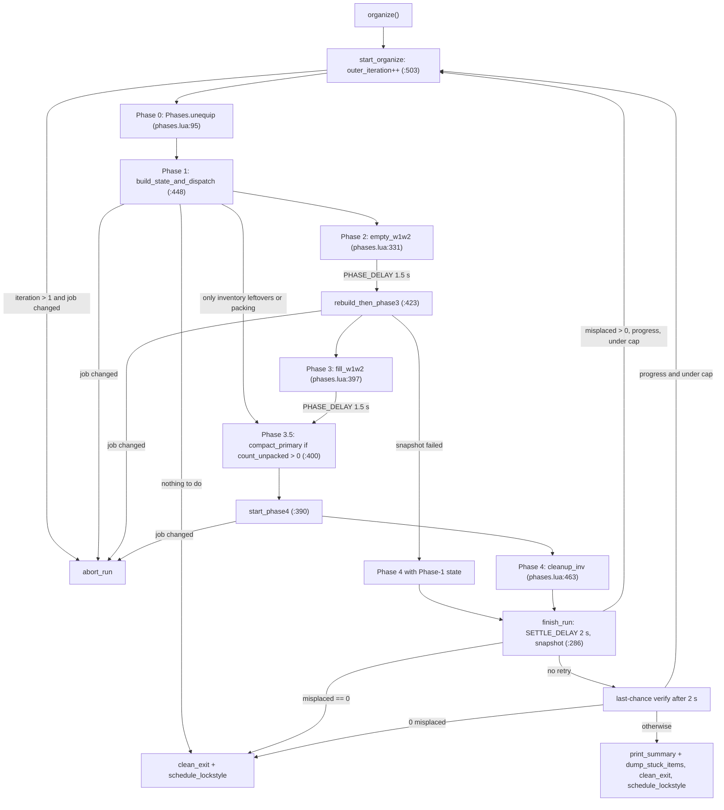
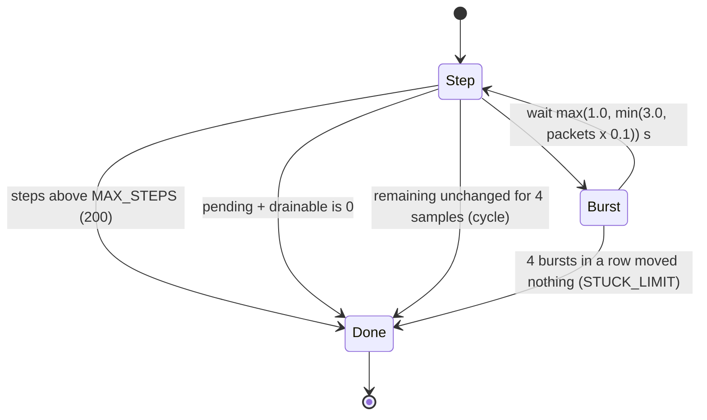
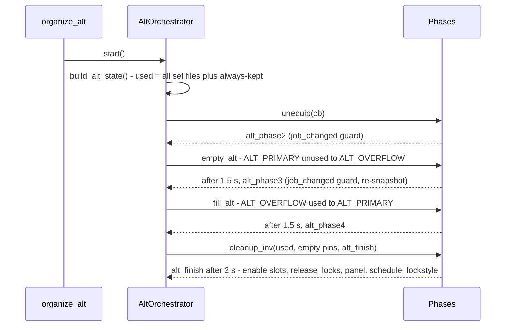

# Wardrobe organizer (`//gs c wo`)

The wardrobe organizer moves gear between the character's bags so that what the game reads first (W1, then W2) holds the gear the character needs, and everything else sits in "overflow" bags. It runs only on demand, from `//gs c wo` (alias `worganize`), dispatched by `CommonCommands.handle_wardrobeorganize` (`shared/utils/core/COMMON_COMMANDS.lua:183-226`, routed from `:549-550`). A run strips the character naked, locks every slot with `gs disable all`, walks through up to six phases that issue raw item-move packets (`windower.ffxi.get_item` / `put_item`), snapshots the result, retries the whole chain up to 12 times while it keeps making progress, and finally unlocks the slots, releases the stance locks the unlock broke (PLD Hoxne ammo, THF range; since 2026-09-25) and fires `gs c ls` (lockstyle) and `gs c rf` (refill). Two flows exist: the **active-job flow** (default: only the gear named by the currently loaded job's `sets` is "used") and the **all-jobs / alt flow** (every set file under `data/<char>/sets/` counts, primary/overflow come from the `ALT_*` lists). Which one `//gs c wo` runs is decided by the character's `WARDROBE_CONFIG.lua` (`SCOPE`), `//gs c wo alt` forces the second. Two read-only reports (`wo scan`, `wo keep`) and two recovery commands (`wo reset`, `wo recover`) complete the area.

Nothing in the organizer is loaded at job load: `handle_wardrobeorganize` requires it lazily the first time a `wo` command is typed.

Line numbers were re-read on 2026-09-25 (after the uncommitted fixes of that day in `wardrobe_organizer.lua` and `orchestrator_alt.lua`); most citations name the function instead.

## Files

| Path | Lines | Role |
|---|---|---|
| `shared/utils/wardrobe/wardrobe_organizer.lua` | 739 | Public API, active-job phase chain, outer retry loop, module run state (`IS_RUNNING`, iteration counters, `start_job_tag`), `release_stance_locks` |
| `shared/utils/wardrobe/lib/config.lua` | 245 | Defaults (bag lists, timing, limits, log path) and `Config.refresh()` which overlays `data/<char>/config/WARDROBE_CONFIG.lua` |
| `shared/utils/wardrobe/lib/phases.lua` | 798 | Phase 0 (unequip + lock), shared burst loop, Phase 2/3/3.5/4, alt phases A2/A3, `enable_slots`, `force_enable_all`, `count_unpacked` |
| `shared/utils/wardrobe/lib/state.lua` | 277 | Snapshot of the bags into a state table, pin resolution (`pin_target_for`) |
| `shared/utils/wardrobe/lib/moves.lua` | 196 | Packet primitives `pull_slot` / `push_slot`, `space_in`, pin-bag ordering (`unclaimed_pins_first`) |
| `shared/utils/wardrobe/lib/items.lua` | 170 | `res.items` helpers, walk of `_G.sets` to collect used names, always-kept items (KEEP_ITEMS, warp rings) |
| `shared/utils/wardrobe/lib/orchestrator_alt.lua` | 171 | Alt / all-jobs phase chain, built by a factory that receives the organizer's state setters |
| `shared/utils/wardrobe/lib/reports.lua` | 267 | `wo scan` and `wo keep` |
| `shared/utils/wardrobe/lib/warp_owned.lua` | 118 | Scan / load / save of the warp items the character owns (`WARP_ITEMS_OWNED.lua`) |
| `shared/utils/wardrobe/lib/chat.lua` | 169 | Chat panel helpers (direct `windower.add_to_chat`; listed as an allowed exception in `.claude/CODE_QUALITY.md` section 6) |
| `shared/utils/wardrobe/lib/log.lua` | 48 | `wardrobe_debug.log` writer, `bag_name()` |
| `_master/Tetsouo/config_global/WARDROBE_CONFIG.lua` | 59 | Tetsouo template, deployed as `Tetsouo/config/WARDROBE_CONFIG.lua` (identical on disk) |
| `_master/Kaories/config_global/WARDROBE_CONFIG.lua` | 60 | Kaories template, deployed as `Kaories/config/WARDROBE_CONFIG.lua` (same values; the live copy has newer header and comments only) |

External dependency: `shared/utils/equipment/wardrobe_auditor.lua` provides `build_pinned_bags()` (`:619`), `collect_all_used_names()` (`:686`) and `build_frequency_map()` (`:590`). All three parse set-file text found by the recursive walk of `data/<char>/sets/` (`walk_lua_files`), not the loaded `sets` table: `build_pinned_bags()` reads every `.lua` of the tree (root files such as `bonecraft_sets.lua` included), the other two only the files `discover_job_files()` maps to a job code, plus `common/`.

There is no generic `WARDROBE_CONFIG.lua` in `_master/config_global/`; `clone_character.py` (`clone()`, step 4, "Global configs") copies `config_global` files from `_master/config_global` and the selected overlay, so a clone without an overlay file runs on the defaults of `lib/config.lua`.

## Vocabulary

| Term | Meaning in the code |
|---|---|
| Bag ids | `0` inventory, `5` Satchel, `6` Sack, `7` Case, `8` W1, `10` W2, `11..14` W3..W6, `15` W7, `16` W8 (`lib/config.lua:6-8`, `Config.BAG_LABELS` `:230`) |
| Primary bags | `Config.PRIMARY_BAGS`, default `{8, 10}`. Where the used gear must live, in load order |
| Overflow bags | `Config.OVERFLOW_BAGS`, default `{16, 14, 13, 12, 11}` (W8 first). Push order for unused gear |
| Used | An item whose name (any of `en`/`enl`/`english`/`english_log`, lower-cased, `Items.item_names`) is in `used_names` |
| Movable | `status == 0` and `res.items[id].slots ~= 0` (`Items.is_equipment`, `lib/items.lua:56`). Equipped (5), bazaar, linkshell copies are never moved |
| Pin | `{name = 'X', bag = 'wardrobe N'}` found anywhere in the character's set files. `pinned_bags[name_lower] = {bag_id, ...}`, deduplicated, in the order the parser meets them (file-walk order, innermost tables first), which is not necessarily declaration order |
| `w1w2_unused` | State list: entries in a primary bag that must leave (unused, or pinned elsewhere) |
| `w3w6_used` | State list: entries in a scanned non-primary bag that must be promoted (used, or pinned elsewhere) |
| Misplaced | `#w1w2_unused + #w3w6_used + inventory gear that is not used` (`finish_run`; since 2026-09-25 the count also adds `Phases.count_unpacked`, see below) |

## How it works

### Command entry

`handle_wardrobeorganize(arg, arg2)` (`COMMON_COMMANDS.lua:183-226`) compares `arg` case-sensitively (the router lower-cases only the command name). Anything unrecognised falls through to `organize()`.

`WardrobeOrganizer.organize()` (`wardrobe_organizer.lua:540-567`):

1. Refuses if `IS_RUNNING` or if `_G.sets` is not a table.
2. `Config.refresh()` (see Configuration).
3. If `Config.SCOPE == 'all_jobs'`, delegates to `organize_alt()`.
4. `reset_module_state()` and `pcall(start_organize)`; on error re-enables slots and prints.

### Active-job phase chain

**Phase 0 - unequip and lock** (`Phases.unequip`, `phases.lua:95-157`). Sends `gs enable all` first (`:104`; the comment above it records why: a previous run cut short left the slots disabled and `equip()` is a no-op on a disabled slot). After 0.3 s it tries up to four strategies, each followed by a 1.2 s settle and a check of `windower.ffxi.get_items().equipment` (`still_equipped`, `:73`):

1. `gs c naked` (handled by `CommonCommands.handle_naked`, `COMMON_COMMANDS.lua:335`),
2. `gs c naked` again,
3. `gs equip naked` (GearSwap's built-in `sets.naked`, `GearSwap/refresh.lua:143-146`),
4. `input /equip <slot> empty` for every slot still occupied, using the Windower equipment key names (`left_ear`, `right_ring`, ...; `NAKED_SLOTS`, `:58`). Whether the game accepts those names in `/equip` is not verified (audit 2026-09-25, Z07-P3-14: needs a game test before mapping them to `ear1`/`ring1`).

As soon as a check finds no equipped slot, or after the fourth attempt regardless of the result (`try_next`), it sends `gs disable all` and calls the continuation 0.3 s later (`lock_and_finish`, `:120-126`). Because each iteration re-enters Phase 0, the slots are briefly re-enabled at the start of every retry.

**Phase 1 - recensement** (`build_state_and_dispatch`, `wardrobe_organizer.lua:448-497`). Checks `job_changed()`, builds the state (`State.build_state`, below), counts inventory gear split into used/unused (`count_inv_gear`, `:200`) and the number of used items that could move from a later primary bag into an earlier one (`Phases.count_unpacked`, `phases.lua:591`). Then:

- nothing to evict, promote, clean or pack: success message, `clean_exit`, `schedule_lockstyle`;
- nothing to evict or promote: skip to Phase 3.5 then Phase 4;
- otherwise Phase 2 (`start_phase2`).

**Phase 2 - empty the primary bags** (`Phases.empty_w1w2`, `phases.lua:331`). Pending = movable items in `PRIMARY_BAGS` that are unused and unpinned, or whose pin resolves to another bag. Drainable = movable inventory gear that is pinned (destinations = its pins, empty pins first) or unused (destinations = `OVERFLOW_BAGS`). Used unpinned inventory gear is left for Phase 3.

**Phase 2.5 - re-snapshot** (`rebuild_then_phase3`, `wardrobe_organizer.lua:423`) rebuilds the state; if that fails it jumps to Phase 4 with the Phase 1 state.

**Phase 3 - fill the primary bags** (`Phases.fill_w1w2`, `phases.lua:397`). Pending = movable items in `OVERFLOW_BAGS` that are used and unpinned, or whose pin resolves to another bag. Drainable = inventory gear that is pinned (to its pins) or used (to `PRIMARY_BAGS` only, never back to overflow).

**Phase 3.5 - pack** (`start_phase_pack` `wardrobe_organizer.lua:400`, `Phases.compact_primary` `phases.lua:628`). Runs only when `count_unpacked(state) > 0`. For every primary bag after the first, pulls at most as many used, unpinned items as the earlier primary bags have free slots (its `discover_pending`), and pushes every used inventory item, pinned or not, back to the first primary bag with room (its `discover_drainable`). `discover_pending` recomputes the room from `get_bag_info` on every step without counting what already waits in the inventory, so on the next step it pulls up to the same number again; the surplus finds the first bag full and is pushed back to the later bag it came from, contrary to the doc comment of `compact_primary` ("the item cannot bounce back"). `count_unpacked` applies the same filters so the Phase 1 decision matches what the phase will do.

**Phase 4 - inventory cleanup** (`Phases.cleanup_inv`, `phases.lua:463`). Guarded by `job_changed()` in `start_phase4` (`wardrobe_organizer.lua:390`). Builds a plan for every movable inventory item (`build_plan`):

| Item | Destination order |
|---|---|
| Pinned and used | its pins (empty pins first), `PRIMARY_BAGS`, `FILL_FALLBACK` |
| Pinned, not used | its pins, `FILL_FALLBACK` |
| Used, unpinned | `PRIMARY_BAGS`, `FILL_FALLBACK` |
| Unused, unpinned | `OVERFLOW_BAGS` only |

It pushes one item every `MOVE_DELAY` (0.35 s), re-checking that the slot still holds the same id, and runs up to `CLEANUP_MAX_PASSES` (3) passes 0.7 s apart (`run_pass`); a fourth plan that is still non-empty is logged as `LEFTOVER` and the phase ends.

**finish_run** (`wardrobe_organizer.lua:286-384`). After `SETTLE_DELAY` (2 s) it snapshots again and computes the misplaced count: `#w1w2_unused + #w3w6_used + unused inventory gear + Phases.count_unpacked(final)` (the last term since 2026-09-25, so a Phase 3.5 that stopped early is still counted as work and no longer ends on "Layout OK"). `should_retry` (`:221`) retries when misplaced > 0, `outer_iteration < MAX_OUTER_ITERATIONS` (12) and the count has not been identical `TRULY_STUCK_THRESHOLD` (4) times in a row. The retry warning prints "(was N)" only when a previous count exists (fixed 2026-09-25; it used to print "was inf"). The next Phase 0 re-enables the slots (`phases.lua:104`). When no retry is granted and misplaced > 0, a "last-chance verify" re-snapshots 2 s later, with the same formula: clean -> success; fewer misplaced and under the cap -> one more iteration with the stuck counter reset; otherwise the summary panel (`print_summary`, `:233`) and a per-item dump to the log (`dump_stuck_items`, `:263`).

`clean_exit()` (`:142-148`) runs `Phases.enable_slots()`, then `release_stance_locks()` (`:118-138`, added 2026-09-25, game test pending): `AmpullaLock.release()` is always called (it also bumps the lock sequence, so a pending Hoxne lock cannot close the ammo slot on the naked set), `RangeLock.release()` and `state.RangeLock = false` only when `_G.thf_range_locked`; when a lock was actually in place it prints one warning ("Stance slot locks released ... re-select the stance to lock again"). It does not re-apply the Hoxne lock, because the character is naked. `wo reset` and the two "crashed" paths still call `Phases.enable_slots()` directly, so they leave a stale stance flag.

`schedule_lockstyle` (`:159-167`) runs on every successful or "with leftovers" exit, never on abort, crash, preview, verify or the "snapshot failed" exit of `finish_run`: `gs c ls` after 1.5 s, `gs c rf` after 3.5 s. `gs c rf` also broadcasts `rf` to the dual-box partner through `DualBoxSyncIPC` (`CommonCommands.handle_refill`, hook registered at `INIT_SYSTEMS.lua:193-198`), so the partner refills its consumables too. No re-equip is requested: the character stays naked until the next GearSwap event, except for equip requests GearSwap queued while the slots were disabled, which `gs enable` flushes (`GearSwap/user_functions.lua:145-183`).

### The burst loop (Phases 2, 3, 3.5, A2, A3)

`run_burst_loop(opts)` (`phases.lua:206-328`) is shared by every phase except 0 and 4. Each phase supplies `discover_pending()` (items to pull out of a source bag) and `discover_drainable()` (inventory items with a destination list). Every step re-discovers both from live bag contents, so slot indices are never reused across steps.

Per step (`step()`, `:225`):

1. `push_budget = min(BURST_SIZE (30), #drainable)`; `pull_budget = min(30 - push_budget, inv_free + push_budget, #pending)` Pushes are sent first so the captured inventory indices stay valid; pulls go after (comment above `run_burst_loop`).
2. Pushes walk each drainable's `dst_list` and use the first bag whose `space_in()` is positive. For pinned items a per-burst `(id, bag)` claim table keeps two copies of the same ring from both targeting the same pin (`burst_claims`), because `space_in()` does not change until the server answers.
3. Pulls call `pull_slot(bag, slot)` for the first `pull_budget` pending entries.
4. Delay before the next step: `max(1.0, min(POST_BURST_DELAY (3.0), packets * 0.1))` (`ADAPTIVE_DELAY_FLOOR` / `ADAPTIVE_DELAY_PER_PACKET`, `:203-204`).

`space_in` reads `windower.ffxi.get_bag_info` (`Moves.space_in`, `moves.lua:40`) and is not decremented locally, so within one burst several pushes can target a bag that has fewer free slots than pushes; whatever did not land is still in the inventory at the next step, where it is re-discovered and routed again (by then the full bag reports no space). A pull-only step leaves `pending + drainable` unchanged (the items move from one list to the other), so the cycle counter only trips when pushes also fail for several consecutive steps.

### Move primitives

| Function | Packet | Guards (`moves.lua`) |
|---|---|---|
| `pull_slot(src_bag, src_slot)` | `windower.ffxi.get_item(src_bag, src_slot, count)` bag -> inventory | inventory has space, slot non-empty, `status == 0` (`:51`) |
| `push_slot(inv_slot, dst_bag)` | `windower.ffxi.put_item(dst_bag, inv_slot, count)` inventory -> bag | destination has space, slot non-empty, `status == 0` (`:84`) |

All moves go through the inventory; there is no direct bag-to-bag move. Neither function waits for the server; both return `true` as soon as the packet is sent. The whole stack (`it.count`) is moved.

### State snapshot and pins

`State.build_state()` (`state.lua:181-262`):

1. `used_names = Items.collect_used_names()` (`items.lua:161`): recursive walk of the loaded `_G.sets` (depth cap 50, cycle-safe, `walk_sets`, `:80`) collecting every string stored under a slot key or `name` (`Config.SLOT_KEYS`, `config.lua:74`), then `Items.add_always_kept` (`items.lua:130`): every `KEEP_ITEMS` name, plus the warp items when any `OVERFLOW_BAGS` entry is not equippable (`overflow_stays_reachable`, `:108`). The warp list comes from `WARP_ITEMS_OWNED.lua` when present, otherwise from `WarpDatabase.get_all_item_names()` (`warp_database_core.lua:230`).
2. `pinned_bags = WardrobeAuditor.build_pinned_bags()` (pcall'd, `state.lua:190-191`). The auditor strips comments, then repeatedly replaces every innermost `{...}` block that has no nested brace with `''`, extracting `name=` and `bag=` from each (leaf-first, max 200 passes, `build_pinned_bags`). This is what finds the second ring of a pair inside a nested table and a pin written after an `augments={...}` table. Only `wardrobe`, `wardrobe N` and `wardrobeN` names map to a bag (`BAG_NAME_TO_ID`, `wardrobe_auditor.lua:599-608`).
3. Snapshots every bag of `Config.ALL_WARDROBES` (movable equipment only, `snapshot_bag` `:147`).
4. Resolves each entry's target with one shared `claim_pool` in `ALL_WARDROBES` order and fills `w1w2_unused` / `w3w6_used`. Inventory is not part of the state lists; it is counted separately by the orchestrator.

`State.pin_target_for(entry, pinned_bags, claim_pool)` (`state.lua:104`), per item name:

1. On first sight of the name, the pool is the pin list minus any pin bag that holds a non-movable copy (`init_claim_pool_for`, `:44`).
2. If the entry's own bag is still in the pool, claim it (stay put).
3. Else claim the first pool bag that holds no copy at all (status ignored, `bag_holds`, `:78`).
4. Else, if the entry already sits in one of its pins, return that bag (no move).
5. Else `nil` (pinned, but not in any pin and no free pin) - it then follows the used/unused rules.

`Moves.unclaimed_pins_first` (`moves.lua:170`) orders the same pins for the drainers: pins holding no copy first, pins holding a copy last. Steps 3 and 4 of `pin_target_for` were aligned with that ordering by commits `44e7f66` and `3d8cb28` so the snapshot never asks for a move the drainer then undoes.

Phase 2 and Phase 3 re-run `pin_target_for` with a fresh `claim_pool` over only their own source bags (their `discover_pending`), so their claims can differ from the snapshot's when copies are spread over primary and overflow; the drainer's ordering is what finally decides the destination.

### Alt / all-jobs chain

`organize_alt()` (`wardrobe_organizer.lua:722-737`) shares `IS_RUNNING` with the active-job flow and starts `AltOrchestrator.start`, built at module load by `OrchestratorAlt.create(ctx)` (`orchestrator_alt.lua:74`; call at `wardrobe_organizer.lua:698-712`) with the organizer's setters and helpers injected, including `release_locks = release_stance_locks`.

Differences from the active-job flow:

- `used_names` = `WardrobeAuditor.collect_all_used_names()` (text regex over the job-mapped set files plus `common/`, `extract_items_from_text`) plus `Items.add_always_kept` (`build_alt_state`, `orchestrator_alt.lua:47`).
- Pins are ignored (`pinned_bags = {}` in `build_alt_state`).
- No Phase 3.5, no outer retry, no misplaced count, no last-chance verify; the final panel only shows free slots (`alt_finish`).
- Phase 4 is the same `Phases.cleanup_inv`, which reads the regular `PRIMARY_BAGS` / `FILL_FALLBACK` / `OVERFLOW_BAGS`, not the `ALT_*` lists (see Known issues).
- No `with_panic_unlock` wrapper on any alt callback. `alt_finish` calls `ctx.release_locks` (pcall, nil-guarded) after `Phases.enable_slots()`.

### Read-only commands

- `preview()` (`wardrobe_organizer.lua:570`): refresh config, build the state, print counts (evict, promote, pinned moves), and log every planned move to `wardrobe_debug.log` (the log is truncated first).
- `verify_global()` (`:645`): refresh config, build the state, report `w1w2_unused` and `w3w6_used`. Neither counts Phase 3.5 packing or inventory leftovers.
- `Reports.show_kept()` (`reports.lua:212`): lists `KEEP_ITEMS` and, when overflow is not all equippable, the warp items and where the list came from.
- `Reports.scan_warp_items()` (`reports.lua:170`): `WarpOwned.scan()` walks every bag of `windower.ffxi.get_items()` (storage included, `warp_owned.lua:55`), saves the names found to `data/<char>/config/WARP_ITEMS_OWNED.lua` (`WarpOwned.save`, `:98`), then writes `data/wardrobe_scan_<char>.txt` (`write_scan_report`, `reports.lua:61`): bag occupancy, warp items with their bag, and per-job "declared in the sets vs held" counts from `WardrobeAuditor.build_frequency_map()`.

## Public API

`shared/utils/wardrobe/wardrobe_organizer.lua` returns a table; nothing is exported to `_G`. The only caller of every function below is `CommonCommands.handle_wardrobeorganize` (`COMMON_COMMANDS.lua:183-226`); no keybind, macro config or `send_command` in the repository or the live folders invokes a `wo` subcommand.

| Function | Effect |
|---|---|
| `organize()` (`:540`) | Active-job run, or `organize_alt()` when `SCOPE == 'all_jobs'`. Sets `IS_RUNNING`. Sends item-move packets, `gs enable/disable all`, `gs c naked`, `gs c ls`, `gs c rf` |
| `organize_global` (`:688`) | Alias of `organize` (legacy name) |
| `organize_alt()` (`:722`) | Alt / all-jobs run |
| `preview()` / `preview_global` (`:570`, `:689`) | Dry run; truncates and rewrites `wardrobe_debug.log` |
| `verify_global()` (`:645`) | Read-only layout check |
| `reset()` (`:670`) | `IS_RUNNING = false`, counters reset, `gs enable all`. Does not stop scheduled phase coroutines, does not release stance locks |
| `recover()` (`:680`) | `IS_RUNNING = false`, counters reset, `gs enable all` at 0, 0.5 and 1.5 s (`Phases.force_enable_all`, `phases.lua:65`). Does not stop scheduled phase coroutines either |
| `scan_warp_items` (`:717`) | `Reports.scan_warp_items` |
| `show_kept` (`:718`) | `Reports.show_kept` |

Library modules (internal to the area; callers are the organizer files only):

| Module | Functions |
|---|---|
| `lib/phases.lua` | `unequip(on_done)`, `enable_slots()`, `force_enable_all()`, `empty_w1w2(state, on_done)`, `fill_w1w2(state, on_done)`, `count_unpacked(state) -> number`, `compact_primary(state, on_done)`, `cleanup_inv(used_names, pinned_bags, on_done)`, `empty_alt(state, on_done)`, `fill_alt(state, on_done)` |
| `lib/state.lua` | `build_state() -> state or nil, err`, `pin_target_for(entry, pinned_bags, claim_pool) -> bag_id or nil`, `snapshot_bag(bag_id, used_names)`, `dlog_state(state, label)` |
| `lib/moves.lua` | `space_in(bag)`, `pull_slot(bag, slot) -> ok, reason`, `push_slot(inv_slot, bag) -> ok, reason`, `all_pinned_bags(id, pins)`, `unclaimed_pins_first(id, pins)`; `find_inv_slot` and `first_pinned_bag` have no caller |
| `lib/items.lua` | `item_names(id)`, `display_name(id)`, `is_equipment(id)`, `is_used_name(id, used)`, `add_always_kept(used)`, `collect_used_names()` |
| `lib/config.lua` | constants, `refresh() -> path or nil` |
| `lib/warp_owned.lua` | `path()`, `load() -> names or nil`, `scan() -> found, total, where`, `save(names) -> path or nil, err` |
| `lib/reports.lua` | `scan_warp_items()`, `show_kept()` |
| `lib/orchestrator_alt.lua` | `create(ctx) -> { start = fn }` |
| `lib/chat.lua` | `separator`, `banner`, `section`, `info`, `success`, `error`, `warn`, `alert`, `phase`, `detail`; `divider` and `kv` have no caller |
| `lib/log.lua` | `dlog(line)`, `dlog_clear()`, `bag_name(id)` |

## Commands

All are `//gs c wo <arg> [arg2]` or `//gs c worganize ...`; arguments are case-sensitive (`handle_wardrobeorganize`).

| Syntax | Effect | Handler |
|---|---|---|
| `wo` | Organize according to `SCOPE` | `organize()` `wardrobe_organizer.lua:540` |
| `wo alt` / `wo kaories` | Alt / all-jobs organize | `organize_alt()` `:722` |
| `wo global` | Same as `wo` (alias) | `:688` |
| `wo preview` / `wo dry` / `wo global preview` / `wo global dry` | Dry run of the active-job plan | `preview()` `:570` |
| `wo verify` / `wo check` | Layout check | `verify_global()` `:645` |
| `wo reset` | Clear run state, enable slots | `reset()` `:670` |
| `wo recover` / `wo unlock` | Clear run state, enable slots three times | `recover()` `:680` |
| `wo scan` / `wo scanwarp` | Record owned warp items, write scan report | `reports.lua:170` |
| `wo keep` / `wo kept` / `wo items` | Show what is kept out of overflow | `reports.lua:212` |
| anything else | `organize()` | |

Commands the organizer itself sends (through the sandbox `windower.send_command`, which GearSwap prefixes with `@`, `GearSwap/user_functions.lua:247-252`): `gs enable all` (`force_enable_all`, `unequip`, `enable_slots` in `phases.lua`), `gs c naked` and `gs equip naked` (`unequip`), `input /equip <slot> empty` (`unequip`), `gs disable all` (`lock_and_finish`), `gs c ls` and `gs c rf` (`schedule_lockstyle` in `wardrobe_organizer.lua`).

## Configuration

### Defaults (`lib/config.lua`)

| Key | Default | Used by |
|---|---|---|
| `SCOPE` | `'active_job'` (`:31`) | `organize()` routing |
| `KEEP_ITEMS` | `{}` (`:41`) | `Items.add_always_kept`, `wo keep` |
| `PRIMARY_BAGS` | `{8, 10}` (`:43`) | Phases 2/3/3.5/4, state |
| `OVERFLOW_BAGS` | `{16, 14, 13, 12, 11}` (`:50`) | Phases 2/3/4, warp reachability, `wo keep` |
| `FILL_FALLBACK` | `{16, 14, 13, 12, 11}` (`:51`) | Phase 4 |
| `PROTECTED` | `{[15] = true}` (`:54`) | nothing reads it (see Known issues) |
| `ALL_WARDROBES` | `{8, 10, 11, 12, 13, 14, 16}` (`:57`) | `build_state` scan list |
| `ALT_PRIMARY_BAGS` / `ALT_OVERFLOW_BAGS` / `ALT_ALL_BAGS` | `{8,10,11,12}` / `{6,7,5}` / union (`:69-71`) | alt flow |
| `MOVE_DELAY` | 0.35 s | Phase 4 pacing |
| `PHASE_DELAY` | 1.5 s | gap after Phases 2, 3, A2, A3 |
| `POST_BURST_DELAY` | 3.0 s | burst delay ceiling |
| `SETTLE_DELAY` | 2.0 s | before the final and verify snapshots, before `alt_finish` |
| `RETRY_DELAY` | 2.5 s | between outer iterations |
| `BURST_SIZE` | 30 | packets per burst |
| `STUCK_LIMIT` | 4 | zero-move bursts before a phase gives up |
| `MAX_STEPS` | 200 | bursts per phase |
| `MAX_OUTER_ITERATIONS` | 12 | outer retries |
| `CLEANUP_MAX_PASSES` | 3 | Phase 4 passes |
| `TRULY_STUCK_THRESHOLD` | 4 | same misplaced count before giving up; also the burst-loop cycle threshold (`CYCLE_THRESHOLD`, `phases.lua:46`) |
| `MAX_WALK_DEPTH` | 50 | `_G.sets` walk |
| `DEBUG_LOG` / `LOG_PATH` | `true` / `<addon>/data/wardrobe_debug.log` (`:140-141`) | `lib/log.lua` |
| `UNEQUIP_DELAY`, `EQUIP_SLOTS`, `BAG_NAME_TO_ID` | (`:123`, `:149`, `:99`) | nothing reads them |

### Per-character override

`Config.refresh()` (`config.lua:172-227`) runs at the start of `organize`, `organize_alt`, `preview`, `verify_global` and `show_kept`. It `pcall(dofile, ...)` `data/<player.name>/config/WARDROBE_CONFIG.lua` and copies over the module table only the keys it knows and the file defines: `SCOPE`, `KEEP_ITEMS`, `PRIMARY_BAGS`, `OVERFLOW_BAGS`, `FILL_FALLBACK`, `ALL_WARDROBES`, the three `ALT_*` lists and `PROTECTED`, converted from an array to a set (`:197-202`). Any other key (timings, limits) is ignored. Then:

- `FILL_FALLBACK` mirrors `OVERFLOW_BAGS` unless the file sets it;
- with `SCOPE == 'all_jobs'`, `ALT_PRIMARY_BAGS` / `ALT_OVERFLOW_BAGS` mirror the regular lists unless the file sets them;
- `ALT_ALL_BAGS` is rebuilt from the two `ALT_*` lists unless the file sets it.

Keys are only ever overwritten, never reset: removing a key from the file keeps its previous value until the sandbox is rebuilt (`gs reload` or job change). A missing file only clears `LOADED_CHAR_CONFIG`.

The shared `Config` table is seen by all libs only because `require` is cached per sandbox by `ModuleCache` (`shared/utils/core/module_cache.lua` `install`, called near the top of `INIT_SYSTEMS.lua`). Without the cache, each lib would get its own default `Config` table and `refresh()` would only affect `wardrobe_organizer.lua`'s copy.

### Current character configs

| Key | Tetsouo (`_master/Tetsouo/config_global/WARDROBE_CONFIG.lua`) | Kaories (`_master/Kaories/config_global/WARDROBE_CONFIG.lua`) |
|---|---|---|
| `SCOPE` | `'active_job'` (`:26`) | `'active_job'` (`:28`) |
| `PRIMARY_BAGS` | `{8, 10}` | `{8, 10}` |
| `OVERFLOW_BAGS` | `{16, 14, 13, 12, 11}` | `{12, 11, 6, 7, 5}` (`:40`): W4, W3, then Sack, Case, Satchel |
| `PROTECTED` | `{15}` | `{}` |
| `ALL_WARDROBES` | `{8, 10, 11, 12, 13, 14, 16}` | `{8, 10, 11, 12}` (`:46`) |
| `KEEP_ITEMS` | `{}` | `{}` |
| Warp items kept | no (overflow all equippable) | yes (overflow contains Sack/Case/Satchel) |

The live `Tetsouo/config/WARDROBE_CONFIG.lua` is identical to its template; `Kaories/config/WARDROBE_CONFIG.lua` has the same values and differs from `_master/Kaories/config_global/` only in header and comments (live -> overlay copy still to do, see [characters-and-templates.md](../architecture/characters-and-templates.md)). Both characters also have a `config/WARP_ITEMS_OWNED.lua` generated by `wo scan`.

## State & lifetime

Module state (locals of `wardrobe_organizer.lua:52-58`): `IS_RUNNING`, `outer_iteration`, `last_misplaced`, `same_misplaced_count`, `start_job_tag`. Each phase keeps its own counters in closures (`run_burst_loop`, `cleanup_inv`, `unequip`). `Config` is mutated by `refresh()`.

- `_G`: reads `_G.sets` (`Items.collect_used_names`, `organize()`), the `player` global (`job_changed`, `active_job_tag`, `:76-99`) and `_G.ampulla_ammo_locked` / `_G.thf_range_locked`; `release_stance_locks` clears them through `AmpullaLock.release` / `RangeLock.release` and sets `state.RangeLock` to false.
- `windower.*` persistent fields: none. Events: none registered. Keybinds, text or prim objects: none.
- Scheduled coroutines: every phase step, phase transition, retry, snapshot and the post-run `gs c ls` / `gs c rf`. None is cancellable and none checks a run identifier; they stop only by reaching their own exit condition or a `job_changed()` guard.
- Files written: `data/wardrobe_debug.log` (one fixed path for every character of this Windower install, `config.lua:141`; truncated at the start of each run and each preview, `Log.dlog_clear`, appended one line per event), `data/wardrobe_scan_<char>.txt`, `data/<char>/config/WARP_ITEMS_OWNED.lua`.
- Files read: `data/<char>/config/WARDROBE_CONFIG.lua`, `data/<char>/config/WARP_ITEMS_OWNED.lua`, every `.lua` under `data/<char>/sets/` (through the auditor).
- Slot lock: `gs disable all` sets GearSwap's `disable_table` (`GearSwap/statics.lua:194`, `user_functions.lua:131-143`), which is GearSwap global state and survives `gs reload` and job changes. Only a `gs enable` clears it.

Behaviour on lifecycle events during a run:

| Event | Effect |
|---|---|
| Main or sub job change | GearSwap rebuilds the sandbox (new organizer instance, `IS_RUNNING = false` there). The old chain keeps running with the old job's `used_names` until its next `job_changed()` check (start of an iteration > 1, Phase 1, Phase 2 -> 3, before Phase 4), which aborts and sends `gs enable all`. Until then the new job's slots stay disabled. The Phase 3 -> 3.5 transition, `finish_run` (its snapshot and verify evaluate the old job's `sets`, so a change during Phase 4 can still end on the "Layout OK" panel), the alt flow's Phase 4 and `alt_finish`, and the inside of every phase have no check |
| `gs reload` on the same job (typed, or `//gs c reload` -> `JobChangeManager.force_reload`) | Same sandbox rebuild, but `job_changed()` stays false, so the old chain runs to completion, including retries, while the new sandbox accepts another `wo` |
| `//lua reload gearswap` | The addon's Lua state is destroyed with every coroutine; slots are left as they were (possibly disabled). Recovery: `wo recover` or the Phase 0 unlock of the next run |
| Zone | Not handled; the chat tells the player not to zone (`start_organize`, `wardrobe_organizer.lua:517`) |
| Lua error in a phase coroutine | Only `build_state_and_dispatch`, `finish_run.snapshot` and `finish_run.verify` are wrapped by `with_panic_unlock` (`:171`). An error elsewhere kills that coroutine and leaves `IS_RUNNING = true` and the slots disabled; `wo reset` / `wo recover` clear both |

## Interactions

- Calls: `WardrobeAuditor` (pins, all-jobs used names, frequency map), `WarpDatabase.get_all_item_names` (`shared/utils/warp/database/warp_database_core.lua:230`), `res.items` / `res.bags`, `CommonCommands.handle_naked` via `gs c naked`, the lockstyle command via `gs c ls`, `RefillManager` and `DualBoxSyncIPC` via `gs c rf`.
- Stance locks: `shared/utils/equipment/ampulla_lock.lua` (PLD Hoxne ammo) and `shared/jobs/thf/functions/logic/range_lock.lua` (THF range) are released by `clean_exit` / `alt_finish` (2026-09-25).
- Called by: `CommonCommands.handle_wardrobeorganize` only. Routing details: [commands-and-debug.md](commands-and-debug.md).
- Sandbox model (why old coroutines outlive a reload): [core-lifecycle.md](core-lifecycle.md).
- Dual-box side effect of `gs c rf`: [dualbox.md](dualbox.md).
- `shared/utils/craft/craft_commands.lua` (`enable(...)` before the craft equip, `:203-206`) re-enables all slots before equipping craft gear because a `wo` run may have left them disabled; conversely a `wo` run started during a craft session sends `gs enable all` and removes the craft lock.

## Invariants & gotchas

- Only items with `status == 0` and a non-zero `slots` field move (`pull_slot`, `push_slot`; every discover filter). Equipped, bazaar and linkshell-locked copies are never touched, but they still count as "occupying" a pin (`bag_holds`, `unclaimed_pins_first`).
- Every move is a bag -> inventory -> bag round trip; the inventory is the staging area, so a full inventory makes every pull fail (the phase exits through `STUCK_LIMIT`).
- Pins are the union of all set files of the character, not the active job's (`build_pinned_bags`). A ring pinned by any job is kept in, or promoted to, its pin bags whatever job is loaded, even if the active job does not use it (`build_state`, `fill_w1w2`).
- In the active-job flow "used" means "named somewhere in the loaded `_G.sets`". Gear equipped by code outside `sets` (inline `equip({...})` in job logic, weapon names kept in config tables) counts as unused and is evicted unless listed in `KEEP_ITEMS`.
- The alt flow's "used" comes from a regex over the set files' text (`extract_items_from_text`, `wardrobe_auditor.lua:200`): any quoted string after `=` counts, which is broader than the loaded sets.
- Warp items are kept out of overflow only when `OVERFLOW_BAGS` contains a bag that cannot be equipped from (`overflow_stays_reachable`, `items.lua:108`, `res.bags[..].equippable`).
- Every run starts and ends with `gs enable all`: slots the player disabled on purpose are re-enabled. The Hoxne ammo lock and THF range lock are released (with a warning) at the end of a successful, aborted-by-job-change or alt run; re-select the stance to lock again.
- Phase 0 removes the weapons, so TP is lost.
- The chat panels print W1..W8 free slots by fixed bag id (`print_summary`, `preview`), whatever the configured lists; bags a character does not scan show 0.
- Phase 3.5 is printed as "Phase 3": `Chat.phase` formats the number with `%d` (`Chat.phase`, `chat.lua:138`), which truncates 3.5 in Lua 5.1.
- `wo reset` is what the "already in progress" message suggests (`organize()`), but it does not stop the running chain.

## Extending

Adding a phase to the active-job chain:

1. Write `Phases.<name>(state, on_done)` that calls `run_burst_loop{label, discover_pending, discover_drainable, on_done}`. `discover_pending` returns `{bag, slot, id, name}` entries in non-inventory bags; `discover_drainable` returns `{slot, dst_list, name, id, is_pinned}` for inventory slots. Both must re-read live bag contents on every call.
2. If the phase can be the only work left, add a counter to the Phase 1 test (`build_state_and_dispatch`) that uses exactly the same filters as `discover_pending`; `count_unpacked` shows why (a counter that reports work the phase refuses to do makes the outer loop retry to the cap).
3. Chain it in `wardrobe_organizer.lua` with a `job_changed()` check before it starts, and wrap the callback in `with_panic_unlock` if an error there should unlock the slots.
4. Make sure the phase does not undo another one: every phase's drain destination must agree with `pin_target_for` and with the other phases' pending filters, or items ping-pong until `TRULY_STUCK_THRESHOLD`.

Adding a configuration key: default in `lib/config.lua`, an override line in `Config.refresh()`, and a commented entry in both `_master/*/config_global/WARDROBE_CONFIG.lua` templates (then redeploy or copy to the live folders).

## Known issues

Fixed since the page was first written:

- Unused locals in `phases.lua` and `wardrobe_organizer.lua`, the "keep slots locked through the retry" comment (night cleanup `b6c7dc6`).
- "Layout OK" while Phase 3.5 had stopped early: `finish_run` and the last-chance verify now add `Phases.count_unpacked` (fixed 2026-09-25).
- Retry warning printed "(was inf)" on the first retry (fixed 2026-09-25).
- `wo` left PLD's Hoxne ammo lock and THF's range lock flagged over an open slot: `clean_exit` / `alt_finish` now release them (fixed 2026-09-25; game test pending: PLD Hoxne then `wo` -> warning, ammo free, Hoxne locks again when re-selected; THF `range` then `wo` -> HUD RangeLock Off).

Still open:

- `wo reset` / `wo recover` and a same-job `gs reload` do not stop an in-flight chain; a second `wo` then runs concurrently with it - `WardrobeOrganizer.reset` / `recover`, `shared/utils/wardrobe/wardrobe_organizer.lua:670-686`
- `wo reset` and the two "crashed" paths call `Phases.enable_slots()` without `release_stance_locks`, so a stance flag can stay set - `wardrobe_organizer.lua:670`
- Gear in overflow bags that are not in `ALL_WARDROBES` (Kaories: Sack, Case, Satchel) is invisible to the snapshot, so "already optimized" / "Layout OK" are reported while used gear sits there - `State.build_state`, `shared/utils/wardrobe/lib/state.lua:181`
- The alt flow's Phase 4 routes leftovers with the regular bag lists, so unused gear can be pushed back into the alt primary bags (W3/W4) - `alt_phase4` in `shared/utils/wardrobe/lib/orchestrator_alt.lua`, `build_plan` in `lib/phases.lua`
- The alt flow decides whether to keep warp items from `OVERFLOW_BAGS`, not `ALT_OVERFLOW_BAGS`; with the default config `wo alt` evicts warp rings to Sack/Case - `overflow_stays_reachable`, `shared/utils/wardrobe/lib/items.lua:108`
- `verify` / `preview` ignore Phase 3.5 packing and inventory leftovers - `shared/utils/wardrobe/wardrobe_organizer.lua:570-667`
- The scan report matches set names against `en` only; the many set files that use the long log name are reported as "declared but not held" - `owned_item_names`, `shared/utils/wardrobe/lib/reports.lua:35`
- Warp-keep reachability and source selection are implemented twice - `Reports.show_kept`, `Items.add_always_kept`
- `Config.PROTECTED` is never read; W7 stays untouched only because it is in no bag list, and a `bag='wardrobe 7'` pin would send gear there - `shared/utils/wardrobe/lib/config.lua:54`
- Dead helpers and constants: `Moves.find_inv_slot`, `Moves.first_pinned_bag`, `Chat.divider`, `Chat.kv`, `Config.UNEQUIP_DELAY`, `Config.EQUIP_SLOTS`, `Config.BAG_NAME_TO_ID`
- No `job_changed()` check between Phase 3 and Phase 3.5 - `start_phase_pack`, `shared/utils/wardrobe/wardrobe_organizer.lua:400`
- No `job_changed()` check before the alt flow's Phase 4 or `alt_finish`, nor in `finish_run` - `shared/utils/wardrobe/lib/orchestrator_alt.lua`, `wardrobe_organizer.lua:286-384`
- `FILL_FALLBACK` mirrors `OVERFLOW_BAGS` by default, so for a character whose overflow ends in Sack/Case/Satchel (Kaories) Phase 4 files used or pinned gear there when the primary bags and pins are full; the snapshot does not scan those bags, so the run then reports the layout as OK - `Config.refresh`, `lib/phases.lua` `build_plan`
- The debug log path carries no character name; two characters organising at the same time truncate and interleave one log - `shared/utils/wardrobe/lib/config.lua:141`, `Log.dlog_clear`
- Phase 3.5 over-pulls: pending ignores items already waiting in the inventory, so the surplus goes back to the bag it came from - `Phases.compact_primary`, `shared/utils/wardrobe/lib/phases.lua:628`
- Phase 3.5 prints as "Phase 3" - `start_phase_pack`, `Chat.phase` (`('Phase %d'):format(3.5)`)
- Phase 0's fourth strategy sends `/equip left_ear empty` etc. with Windower key names; whether the game accepts them is untested (Z07-P3-14, needs a game test) - `NAKED_SLOTS`, `phases.lua:58`
- Comments that contradict the code: the doc comment of `CommonCommands.handle_wardrobeorganize` (`COMMON_COMMANDS.lua:173`, `wo global` described as a "cross-job freq-based static layout"; `:179`, W7 described as protected by `Config.PROTECTED`)
