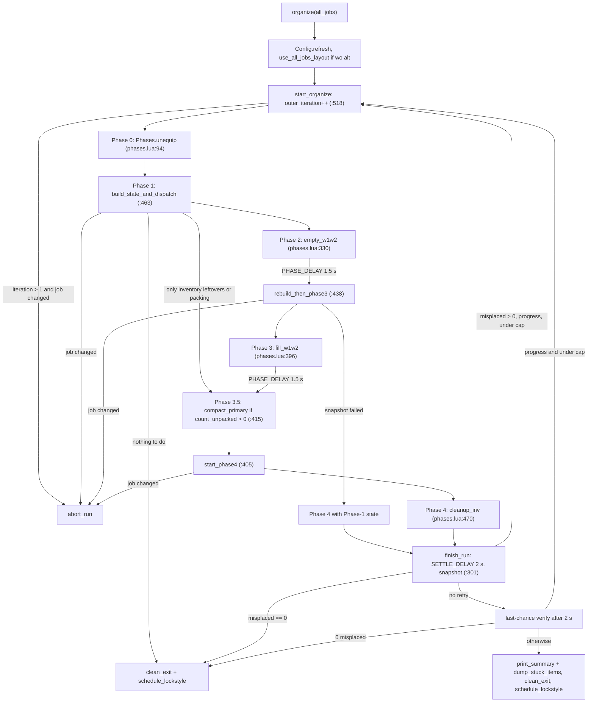
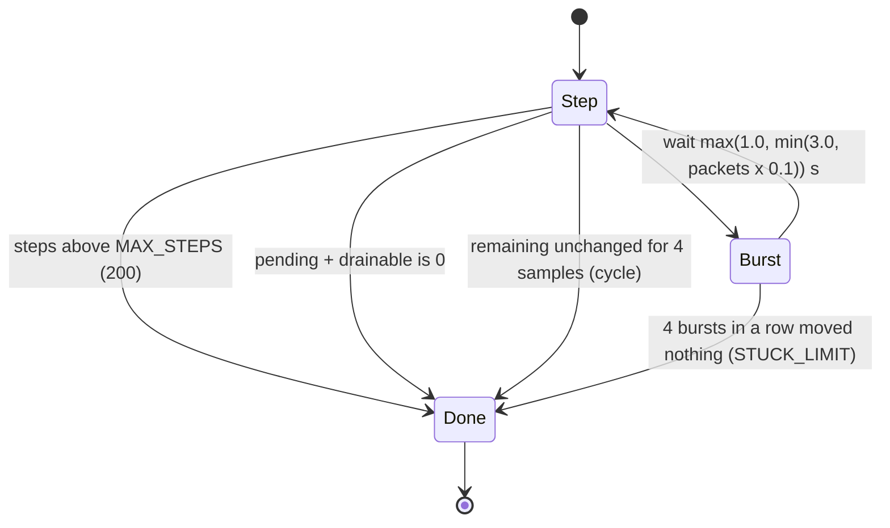

# Wardrobe organizer (`//gs c wo`)

The wardrobe organizer moves gear between the character's bags so that the bags the game reads first hold the gear the character needs ("used" bags, W1 then W2 by default), everything else sits in the "unused" bags, and the placement rules of the character's `WARDROBE_CONFIG.lua` put chosen items, jobs or item types in chosen bags. It runs only on demand, from `//gs c wo` (alias `worganize`), dispatched by `CommonCommands.handle_wardrobeorganize` (`shared/utils/core/COMMON_COMMANDS.lua:185-228`, routed from the `wo` / `worganize` branch of `CommonCommands.handle_command`). A run strips the character naked, locks every slot with `gs disable all`, walks through up to six phases that issue raw item-move packets (`windower.ffxi.get_item` / `put_item`), snapshots the result, retries the whole chain up to 12 times while it keeps making progress, and finally unlocks the slots, releases the stance locks the unlock broke (PLD Hoxne ammo, THF range; since 2026-09-25) and fires `gs c ls` (lockstyle) and `gs c rf` (refill). There is one flow. What counts as "used" is set by `SCOPE`: the gear named by the loaded job's `sets` (`'active_job'`, default) or by every job's set files (`'all_jobs'`). `//gs c wo alt` runs the same flow with `SCOPE = 'all_jobs'` on its own bag lists (`USED_WHEN_ALL` / `UNUSED_WHEN_ALL`). Two read-only reports (`wo scan`, `wo keep`) and two recovery commands (`wo reset`, `wo recover`) complete the area.

Nothing in the organizer is loaded at job load: `handle_wardrobeorganize` requires it lazily the first time a `wo` command is typed.

Re-checked against the code on 2026-09-30, after commit `1c42340` ("the organizer placed by the player's own rules"): named bags and placement rules in `WARDROBE_CONFIG.lua` (`lib/config.lua`, new `lib/rules.lua`), defaults that follow the wardrobes the character has unlocked, `wo alt` on the regular flow (`lib/orchestrator_alt.lua` and `Phases.empty_alt` / `fill_alt` deleted), chat panels that name the character's bags, and a generic template `_master/config_global/WARDROBE_CONFIG.lua`. Updated the same day for commit `2588c3c`: a pin layer that spreads doubled items one copy per used bag (`duplicate_pins`), and the rule bags emptied of the gear no rule puts there (`Config.RULE_BAGS`). Line numbers below were re-read after `2588c3c`. None of it has been run in game yet; the commit checked offline that Tetsouo's and Kaories' converted configs plan the same moves as before.

## Files

| Path | Lines | Role |
|---|---|---|
| `shared/utils/wardrobe/wardrobe_organizer.lua` | 713 | Public API, phase chain, outer retry loop, module run state (`IS_RUNNING`, iteration counters, `start_job_tag`), `release_stance_locks`, chat panels (`free_of`, `primary_label`) |
| `shared/utils/wardrobe/lib/config.lua` | 397 | Defaults (bag lists, timing, limits, log path), bag-name parser `Config.bag_id`, `Config.refresh()` which reads `data/<char>/_common/inventory/WARDROBE_CONFIG.lua` and computes the rule bags (`Config.RULE_BAGS`), `Config.use_all_jobs_layout()` |
| `shared/utils/wardrobe/lib/rules.lua` | 166 | `PLACE` / `JOBS` / `TYPES` of the config turned into pins and merged with the sets' own `bag = '...'` pins and the doubled-item pins (`Rules.pins`); item type from `res.items` slots (`Rules.item_type`). New 2026-09-30 (`1c42340`; doubled items `2588c3c`) |
| `shared/utils/wardrobe/lib/phases.lua` | 692 | Phase 0 (unequip + lock), shared burst loop, Phase 2/3/3.5/4, `enable_slots`, `force_enable_all`, `count_unpacked` |
| `shared/utils/wardrobe/lib/state.lua` | 283 | Snapshot of the bags into a state table, pin resolution (`pin_target_for`) |
| `shared/utils/wardrobe/lib/moves.lua` | 162 | Packet primitives `pull_slot` / `push_slot`, `space_in`, pin-bag ordering (`unclaimed_pins_first`) |
| `shared/utils/wardrobe/lib/items.lua` | 185 | `res.items` helpers, `NEVER_MOVE` filter (`is_equipment`), used names of the scope (`_G.sets` walk, plus every job's set files when `SCOPE = 'all_jobs'`), always-kept items (`KEEP`, warp rings) |
| `shared/utils/wardrobe/lib/reports.lua` | 267 | `wo scan` and `wo keep` |
| `shared/utils/wardrobe/lib/warp_owned.lua` | 118 | Scan / load / save of the warp items the character owns (`WARP_ITEMS_OWNED.lua`) |
| `shared/utils/wardrobe/lib/chat.lua` | 164 | Chat panel helpers. They call the sandbox `add_to_chat` directly (no `MessageFormatter`; listed as an allowed exception in `.claude/CODE_QUALITY.md` section 6). Since 2026-09-27 (`64a0c20`) that `add_to_chat` is the one `message_core.lua` wraps with `ChatSeparators.apply`, so the `=` rules follow the player's separator options; before, the helpers called `windower.add_to_chat` and bypassed them |
| `shared/utils/wardrobe/lib/log.lua` | 48 | `wardrobe_debug.log` writer, `bag_name()` |
| `_master/config_global/WARDROBE_CONFIG.lua` | 80 | Generic template (new 2026-09-30): every key commented out, with examples; `clone_character.py` copies it to every clone (`_common/inventory/` after the layout step) |
| `_master/Tetsouo/config_global/WARDROBE_CONFIG.lua` | 40 | Tetsouo overlay, deployed as `Tetsouo/_common/inventory/WARDROBE_CONFIG.lua` (same content; only the `@file` line differs) |
| `_master/Kaories/config_global/WARDROBE_CONFIG.lua` | 41 | Kaories overlay, deployed as `Kaories/_common/inventory/WARDROBE_CONFIG.lua` (same content; only the `@file` line differs) |

External dependency: `shared/utils/equipment/wardrobe_auditor.lua` provides `build_pinned_bags()` (`:688`), `collect_all_used_names()` (`:755`) and `build_frequency_map()` (`:659`). All three parse set-file text, not the loaded `sets` table: `build_pinned_bags()` reads every set file of the character (`all_set_files`), the other two only the files `discover_job_files()` maps to a job code, plus the common set files. The auditor in turn reads the organizer's `lib/config.lua` for `//gs c wa` (`config_exclusions`, see [equipment-and-inventory.md](equipment-and-inventory.md)).

`clone_character.py` (`clone()`, step 4, "Global configs") copies the union of `_master/config_global/*.lua` and the overlay's `config_global/*.lua`, overlay first. Since 2026-09-30 the generic folder has a `WARDROBE_CONFIG.lua`, so every clone gets one; with its keys all commented out it returns an empty table and the run uses the defaults of `lib/config.lua`.

## Vocabulary

| Term | Meaning in the code |
|---|---|
| Bag ids | `0` inventory, `5` Satchel, `6` Sack, `7` Case, `8` W1, `10` W2, `11..14` W3..W6, `15` W7, `16` W8 (`lib/config.lua:8-9`, `Config.BAG_LABELS` `:382`) |
| Bag names | What `WARDROBE_CONFIG.lua` may write for a bag (`Config.bag_id`, `config.lua:194`, table `BAG_IDS` `:172`): `'inventory'`, `'satchel'`, `'sack'`, `'case'`, `'wardrobe'` / `'wardrobe 1'` ... `'wardrobe 8'`, `'W1'` ... `'W8'`, case-insensitive, spaces and `_` ignored; or a numeric id. An unknown name is dropped and added to `Config.WARNINGS` |
| Used bags | `Config.PRIMARY_BAGS` (config key `USED`). Where the used gear must live, in fill order |
| Unused bags | `Config.OVERFLOW_BAGS` (config key `UNUSED`). Push order for the rest |
| Rule bags | Bags named by `PLACE`, `JOBS` or `TYPES`. Without an explicit `UNUSED`, they are kept out of the default unused list (`rule_bags`, `config.lua:265`). Those that end up in neither the used nor the unused list are `Config.RULE_BAGS` (computed by `refresh()` after `strip_protected`, filtered again by `use_all_jobs_layout()`): the snapshot and Phase 3 empty them of the gear no rule puts there |
| Used | An item whose name (any of `en`/`enl`/`english`/`english_log`, lower-cased, `Items.item_names`) is in `used_names` |
| Movable | `status == 0`, `res.items[id].slots ~= 0` and not a `NEVER_MOVE` item (`Items.is_equipment`, `lib/items.lua:57`). Equipped, bazaar, linkshell copies and `NEVER_MOVE` items are never moved; `NEVER_MOVE` items are not even seen (not snapshotted, not counted as inventory leftovers) |
| Pin | `pinned_bags[name_lower] = {bag_id, ...}`: an item that must sit in given bags, one copy per listed bag. Built by `Rules.pins` (`rules.lua:157`) from five layers, strongest last written: doubled items (`duplicate_pins`), `TYPES`, `JOBS`, the sets' own `{name = 'X', bag = 'wardrobe N'}` (`build_pinned_bags`), `PLACE`. A stronger layer replaces the whole bag list of a weaker one for that name |
| `w1w2_unused` | State list: entries in a used bag that must leave (unused and unpinned, or pinned elsewhere) |
| `w3w6_used` | State list: entries in a scanned bag outside the used bags that must move (used and unpinned, pinned elsewhere, or unused and unpinned in a rule bag of `Config.RULE_BAGS`) |
| Misplaced | `#w1w2_unused + #w3w6_used + inventory gear that is not used + Phases.count_unpacked` (`finish_run`) |

## How it works

### Command entry

`handle_wardrobeorganize(arg, arg2)` (`COMMON_COMMANDS.lua:185-228`) compares `arg` case-sensitively (the router lower-cases only the command name). Anything unrecognised falls through to `organize()`.

`WardrobeOrganizer.organize(all_jobs)` (`wardrobe_organizer.lua:562-583`):

1. Refuses if `IS_RUNNING` or if `_G.sets` is not a table.
2. `Config.refresh()` (see Configuration).
3. If `all_jobs` (`wo alt`, through `organize_alt()`, `:709-711`), `Config.use_all_jobs_layout()` (`config.lua:368`): `SCOPE = 'all_jobs'`, used bags = `ALT_PRIMARY_BAGS`, unused bags and `FILL_FALLBACK` = `ALT_OVERFLOW_BAGS`, scanned bags = `ALT_ALL_BAGS`.
4. `reset_module_state()` and `pcall(start_organize)`; on error re-enables slots and prints.

`SCOPE = 'all_jobs'` in the config no longer diverts `wo` to a separate flow (before 2026-09-30 it called `organize_alt()`): it runs this chain on the regular bag lists, with every job's gear counted as used.

### Phase chain

```mermaid
flowchart TD
    A["organize(all_jobs)"] --> RF["Config.refresh, use_all_jobs_layout if wo alt"]
    RF --> B["start_organize: outer_iteration++ (:518)"]
    B -->|"iteration > 1 and job changed"| X["abort_run"]
    B --> P0["Phase 0: Phases.unequip (phases.lua:94)"]
    P0 --> P1["Phase 1: build_state_and_dispatch (:463)"]
    P1 -->|"job changed"| X
    P1 -->|"nothing to do"| OK["clean_exit + schedule_lockstyle"]
    P1 -->|"only inventory leftovers or packing"| P35
    P1 --> P2["Phase 2: empty_w1w2 (phases.lua:330)"]
    P2 -->|"PHASE_DELAY 1.5 s"| R["rebuild_then_phase3 (:438)"]
    R -->|"job changed"| X
    R -->|"snapshot failed"| P4b["Phase 4 with Phase-1 state"]
    R --> P3["Phase 3: fill_w1w2 (phases.lua:396)"]
    P3 -->|"PHASE_DELAY 1.5 s"| P35["Phase 3.5: compact_primary if count_unpacked > 0 (:415)"]
    P35 --> P4["start_phase4 (:405)"]
    P4 -->|"job changed"| X
    P4 --> C4["Phase 4: cleanup_inv (phases.lua:470)"]
    P4b --> F
    C4 --> F["finish_run: SETTLE_DELAY 2 s, snapshot (:301)"]
    F -->|"misplaced > 0, progress, under cap"| B
    F -->|"misplaced == 0"| OK
    F -->|"no retry"| V["last-chance verify after 2 s"]
    V -->|"0 misplaced"| OK
    V -->|"progress and under cap"| B
    V -->|"otherwise"| S["print_summary + dump_stuck_items, clean_exit, schedule_lockstyle"]
```

Each outer iteration re-enters `start_organize`, not `organize`, so the config is read once per run: `Config.refresh()` and `use_all_jobs_layout()` are not repeated between iterations.

**Start banner** (`start_organize`, `:523-538`, first iteration only): `Active job`, `Config` (`per-character` or `defaults`), `Gear of` (`every job` or `the job loaded`), `Used` and `Unused` (bag names from `Log.bag_name`), `Never touched` (only when `NEVER_TOUCH` names a bag), one `Config: <warning>` line per entry of `Config.WARNINGS`, then the "PROCESSING - please wait" alert.

**Phase 0 - unequip and lock** (`Phases.unequip`, `phases.lua:94-156`). Sends `gs enable all` first (`:103`; the comment above it records why: a previous run cut short left the slots disabled and `equip()` is a no-op on a disabled slot). After 0.3 s it tries up to four strategies, each followed by a 1.2 s settle and a check of `windower.ffxi.get_items().equipment` (`still_equipped`, `:72`):

1. `gs c naked` (handled by `CommonCommands.handle_naked`, `COMMON_COMMANDS.lua:337`),
2. `gs c naked` again,
3. `gs equip naked` (GearSwap's built-in `sets.naked`, `GearSwap/refresh.lua:143-146`),
4. `input /equip <slot> empty` for every slot still occupied, using the Windower equipment key names (`left_ear`, `right_ring`, ...; `NAKED_SLOTS`, `:57`). Whether the game accepts those names in `/equip` is not verified (audit 2026-09-25, Z07-P3-14: needs a game test before mapping them to `ear1`/`ring1`).

As soon as a check finds no equipped slot, or after the fourth attempt regardless of the result (`try_next`), it sends `gs disable all` and calls the continuation 0.3 s later (`lock_and_finish`, `:119-125`). Because each iteration re-enters Phase 0, the slots are briefly re-enabled at the start of every retry.

**Phase 1 - recensement** (`build_state_and_dispatch`, `wardrobe_organizer.lua:463-512`). Checks `job_changed()`, builds the state (`State.build_state`, below), counts inventory gear split into used/unused (`count_inv_gear`, `:219`) and the number of used items that could move from a later used bag into an earlier one (`Phases.count_unpacked`, `phases.lua:598`). Then:

- nothing to evict, promote, clean or pack: success message, `clean_exit`, `schedule_lockstyle`;
- nothing to evict or promote: skip to Phase 3.5 then Phase 4;
- otherwise Phase 2 (`start_phase2`).

**Phase 2 - empty the used bags** (`Phases.empty_w1w2`, `phases.lua:330`; chat title `Empty <used bag names>`, for instance `Empty W1/W2`, `primary_label`, `wardrobe_organizer.lua:121`). Pending = movable items in `PRIMARY_BAGS` that are unused and unpinned, or whose pin resolves to another bag. Drainable = movable inventory gear that is pinned (destinations = its pins, empty pins first) or unused (destinations = `OVERFLOW_BAGS`). Used unpinned inventory gear is left for Phase 3.

**Phase 2.5 - re-snapshot** (`rebuild_then_phase3`, `wardrobe_organizer.lua:438`) rebuilds the state; if that fails it jumps to Phase 4 with the Phase 1 state.

**Phase 3 - fill the used bags** (`Phases.fill_w1w2`, `phases.lua:396`; chat title `Fill <used bag names>`). Pending = movable items in `OVERFLOW_BAGS` and, since 2026-09-30 (`2588c3c`), in `Config.RULE_BAGS`, that are used and unpinned, or whose pin resolves to another bag; in a rule bag, unpinned unused items are pulled too (`rule_bag[b]`, `discover_pending`, `phases.lua:400-428`). Drainable = inventory gear that is pinned (to its pins) or used (to `PRIMARY_BAGS` only, never back to the unused bags). The unused gear pulled out of a rule bag stays in the inventory until Phase 4 files it in `OVERFLOW_BAGS`.

**Phase 3.5 - pack** (`start_phase_pack` `wardrobe_organizer.lua:415`, `Phases.compact_primary` `phases.lua:635`; chat title `Pack into <first used bag>`). Runs only when `count_unpacked(state) > 0`. For every used bag after the first, pulls at most as many used, unpinned items as the earlier used bags have free slots (its `discover_pending`), and pushes every used inventory item, pinned or not, back to the first used bag with room (its `discover_drainable`). `discover_pending` recomputes the room from `get_bag_info` on every step without counting what already waits in the inventory, so on the next step it pulls up to the same number again; the surplus finds the first bag full and is pushed back to the later bag it came from, contrary to the doc comment of `compact_primary` ("the item cannot bounce back"). `count_unpacked` applies the same filters so the Phase 1 decision matches what the phase will do.

**Phase 4 - inventory cleanup** (`Phases.cleanup_inv`, `phases.lua:470`). Guarded by `job_changed()` in `start_phase4` (`wardrobe_organizer.lua:405`). Builds a plan for every movable inventory item (`build_plan`, `:474`):

| Item | Destination order |
|---|---|
| Pinned and used | its pins (empty pins first), `PRIMARY_BAGS`, `FILL_FALLBACK` |
| Pinned, not used | its pins, `FILL_FALLBACK` |
| Used, unpinned | `PRIMARY_BAGS`, `FILL_FALLBACK` |
| Unused, unpinned | `OVERFLOW_BAGS` only |

It pushes one item every `MOVE_DELAY` (0.35 s), re-checking that the slot still holds the same id, and runs up to `CLEANUP_MAX_PASSES` (3) passes 0.7 s apart (`run_pass`); a fourth plan that is still non-empty is logged as `LEFTOVER` and the phase ends. Under `wo alt`, `use_all_jobs_layout()` has already swapped the lists, so Phase 4 routes with the `ALT_*` bags (before 2026-09-30 the alt flow's Phase 4 used the regular lists).

**finish_run** (`wardrobe_organizer.lua:301-398`). After `SETTLE_DELAY` (2 s) it snapshots again and computes the misplaced count: `#w1w2_unused + #w3w6_used + unused inventory gear + Phases.count_unpacked(final)`. `should_retry` (`:240`) retries when misplaced > 0, `outer_iteration < MAX_OUTER_ITERATIONS` (12) and the count has not been identical `TRULY_STUCK_THRESHOLD` (4) times in a row. The retry warning prints "(was N)" only when a previous count exists. The next Phase 0 re-enables the slots (`phases.lua:103`). When no retry is granted and misplaced > 0, a "last-chance verify" re-snapshots 2 s later, with the same formula: clean -> success; fewer misplaced and under the cap -> one more iteration with the stuck counter reset; otherwise the summary panel (`print_summary`, `:252`) and a per-item dump to the log (`dump_stuck_items`, `:278`).

The summary panel (`print_summary`) prints `Iterations`, `Inventory free`, `Used bags free` and `Other bags free` (free slots of each bag of `PRIMARY_BAGS` / `OVERFLOW_BAGS`, named, for instance `W1 12, W2 30`, `free_of`, `:112`), `Stuck in inventory` when non-zero, and `Layout` (`OK (every item where the config puts it)`, `N items stuck ...` or `N items off ...`). Before 2026-09-30 it printed W1..W8 by fixed bag id.

`clean_exit()` (`:161-166`) runs `Phases.enable_slots()`, then `release_stance_locks()` (`:137-157`, added 2026-09-25, game test pending): `AmpullaLock.release()` is always called (it also bumps the lock sequence, so a pending Hoxne lock cannot close the ammo slot on the naked set), `RangeLock.release()` and `state.RangeLock = false` only when `_G.thf_range_locked`; when a lock was actually in place it prints one warning ("Stance slot locks released ... re-select the stance to lock again"). It does not re-apply the Hoxne lock, because the character is naked. `AmpullaLock.release()` and `RangeLock.release()` also drop their records in Combat Mode's lock registry (`CombatMode.release('ampulla')` / `('thf_range')`, since 2026-09-29), so those two locks stay off after `wo` until the stance or `RangeLock` is selected again. WHM's `Melee ON` lock is not released here: its record (`whm_melee`) survives the run, and Combat Mode's `handle_equipping_gear` wrapper disables main / sub / range again after the gear of the next update (`combat_mode.lua` `reassert_holds`, see [core-lifecycle.md](core-lifecycle.md#combatmode-hook-sharedutilscorecombat_modelua)). With Combat Mode On, that same update puts the job's weapons back before the Combat Mode lock (the main hand is empty after the run). `wo reset` and the two "crashed" paths still call `Phases.enable_slots()` directly, so they leave a stale stance flag; its registry record survives too, so the next update locks the slot again.

`schedule_lockstyle` (`:176-185`) runs on every successful or "with leftovers" exit, never on abort, crash, preview, verify or the "snapshot failed" exit of `finish_run`: `gs c ls` after 1.5 s, `gs c rf` after 3.5 s. `gs c rf` also broadcasts `rf` to the dual-box partner through `DualBoxSyncIPC` (`CommonCommands.handle_refill`; the partner runs `refill_hook`, registered for `rf` / `refill` in the dual-box block of `INIT_SYSTEMS.lua`), so the partner refills its consumables too. No re-equip is requested: the character stays naked until the next GearSwap event, except for equip requests GearSwap queued while the slots were disabled, which `gs enable` flushes (`GearSwap/user_functions.lua:145-183`).

### The burst loop (Phases 2, 3, 3.5)

`run_burst_loop(opts)` (`phases.lua:205-327`) is shared by every phase except 0 and 4. Each phase supplies `discover_pending()` (items to pull out of a source bag) and `discover_drainable()` (inventory items with a destination list). Every step re-discovers both from live bag contents, so slot indices are never reused across steps.

```mermaid
stateDiagram-v2
    [*] --> Step
    Step --> Done: steps above MAX_STEPS (200)
    Step --> Done: pending + drainable is 0
    Step --> Done: remaining unchanged for 4 samples (cycle)
    Step --> Burst
    Burst --> Done: 4 bursts in a row moved nothing (STUCK_LIMIT)
    Burst --> Step: wait max(1.0, min(3.0, packets x 0.1)) s
    Done --> [*]
```

Per step (`step()`, `:224`):

1. `push_budget = min(BURST_SIZE (30), #drainable)`; `pull_budget = min(30 - push_budget, inv_free + push_budget, #pending)` Pushes are sent first so the captured inventory indices stay valid; pulls go after (comment above `run_burst_loop`).
2. Pushes walk each drainable's `dst_list` and use the first bag whose `space_in()` is positive. For pinned items a per-burst `(id, bag)` claim table keeps two copies of the same ring from both targeting the same pin (`burst_claims`), because `space_in()` does not change until the server answers.
3. Pulls call `pull_slot(bag, slot)` for the first `pull_budget` pending entries.
4. Delay before the next step: `max(1.0, min(POST_BURST_DELAY (3.0), packets * 0.1))` (`ADAPTIVE_DELAY_FLOOR` / `ADAPTIVE_DELAY_PER_PACKET`, `:202-203`).

`space_in` reads `windower.ffxi.get_bag_info` (`Moves.space_in`, `moves.lua:40`) and is not decremented locally, so within one burst several pushes can target a bag that has fewer free slots than pushes; whatever did not land is still in the inventory at the next step, where it is re-discovered and routed again (by then the full bag reports no space). A pull-only step leaves `pending + drainable` unchanged (the items move from one list to the other), so the cycle counter only trips when pushes also fail for several consecutive steps.

### Move primitives

| Function | Packet | Guards (`moves.lua`) |
|---|---|---|
| `pull_slot(src_bag, src_slot)` | `windower.ffxi.get_item(src_bag, src_slot, count)` bag -> inventory | inventory has space, slot non-empty, `status == 0` (`:51`) |
| `push_slot(inv_slot, dst_bag)` | `windower.ffxi.put_item(dst_bag, inv_slot, count)` inventory -> bag | destination has space, slot non-empty, `status == 0` (`:84`) |

All moves go through the inventory; there is no direct bag-to-bag move. Neither function waits for the server; both return `true` as soon as the packet is sent. The whole stack (`it.count`) is moved.

### State snapshot, rules and pins

`State.build_state()` (`state.lua:181-265`):

1. `used_names = Items.collect_used_names()` (`items.lua:170`): with `SCOPE = 'all_jobs'`, first every name of `WardrobeAuditor.collect_all_used_names()` (text parse of every job's set files, `extract_items_from_text`); then, in both scopes, the recursive walk of the loaded `_G.sets` (depth cap 50, cycle-safe, `walk_sets`, `:88`) collecting every string stored under a slot key or `name` (`Config.SLOT_KEYS`, `config.lua:76`); then `Items.add_always_kept` (`items.lua:138`): every `KEEP` name, plus the warp items when any `OVERFLOW_BAGS` entry is not equippable (`overflow_stays_reachable`, `:116`). The warp list comes from `WARP_ITEMS_OWNED.lua` when present, otherwise from `WarpDatabase.get_all_item_names()` (`warp_database_core.lua:230`). Under `wo alt` the unused bags are the `ALT_OVERFLOW_BAGS` at that point, so the warp decision follows them.
2. Pins (`state.lua:187-195`): `WardrobeAuditor.build_pinned_bags()` (pcall'd) gives the sets' own pins; `Rules.pins(set_pins, used_names)` merges them with the config's rules (next section). The auditor strips comments, then repeatedly replaces every innermost `{...}` block that has no nested brace with `''`, extracting `name=` and `bag=` from each (leaf-first, max 200 passes, `build_pinned_bags`). This is what finds the second ring of a pair inside a nested table and a pin written after an `augments={...}` table. In set files only `wardrobe`, `wardrobe N` and `wardrobeN` names map to a bag (`BAG_NAME_TO_ID`, `wardrobe_auditor.lua:668`); the config's bag names (`'case'`, `'W3'`...) are parsed by `Config.bag_id` instead.
3. Snapshots every bag of `Config.ALL_WARDROBES` (movable equipment only, `snapshot_bag` `:147`).
4. Resolves each entry's target with one shared `claim_pool` in `ALL_WARDROBES` order: a pin, else `primary` for a used item, else `overflow`; then fills `w1w2_unused` (in a used bag, target elsewhere) and `w3w6_used` (outside the used bags, pinned elsewhere or used; or, since `2588c3c`, unpinned and unused in a bag of `Config.RULE_BAGS`, `state.lua:255-257`). Inventory is not part of the state lists; it is counted separately by the orchestrator.

`Rules.pins` (`rules.lua:157-163`) builds the final map from five layers, each written over the previous one, so the strongest is last:

| Layer | Source | Which items |
|---|---|---|
| Doubled items (weakest, since `2588c3c`) | `duplicate_pins` (`:113`) | A used item owned in 2 or more copies without augments (`extdata` decode; equipment outside `NEVER_MOVE` per `Items.is_equipment`; copies counted over the inventory, `ALL_WARDROBES` and `OVERFLOW_BAGS`, whatever their status, so a worn copy counts): pinned to the first `n` bags of `PRIMARY_BAGS` followed by the equippable `FILL_FALLBACK` bags, `n` = its number of copies, capped by that list; a list of one bag pins nothing. Filed under every name of the item (`Items.item_names`) |
| `TYPES` | `types_pins` (`:84`) | Used items (of the current scope) found in the inventory, `ALL_WARDROBES` and `OVERFLOW_BAGS`, whose type is listed. Type from `res.items[id].slots` (`Rules.item_type`, `:35`): main/sub/range -> `weapons`, ammo -> `ammo`, head..feet -> `armor`, neck..back -> `accessories` |
| `JOBS` | `jobs_pins` (`:71`) | Every item of `WardrobeAuditor.build_frequency_map()` used by a listed job, whatever `SCOPE` says; an item several listed jobs use gets their bags in job-name order, deduplicated (`job_bags`, `:55`) |
| sets | `build_pinned_bags()` | `{name = ..., bag = 'wardrobe N'}` in any set file |
| `PLACE` (strongest) | `Config.RULES.place` | The named items |

A pin is a bag list, and `pin_target_for` gives each physical copy one bag of the list: with `TYPES = { weapons = {'wardrobe 5'} }` and two copies of a used dagger, one copy is pinned to W5 and the second, with no pin left, follows the used rule (used bags). A pinned item goes to its pin even when it is used by the job loaded, so rules win over `USED`. `NEVER_TOUCH` bags are taken out of every rule list by `strip_protected` (`config.lua:274`), but not out of the sets' own pins.

Why the doubled-item layer: GearSwap tells two copies of an item without augments apart only by the bag a set names, and the equip hook `shared/utils/equipment/duplicate_gear.lua` names that bag at each swap, so each side of a ring, earring or weapon pair takes its own copy ([equipment-and-inventory.md](equipment-and-inventory.md#doubled-gear)). That only works when the copies sit in different bags; with `USED = {'wardrobe', 'wardrobe 2'}` and two Chirich Ring +1, this layer puts one in W1 and one in W2, with no `bag =` in the sets. Being the weakest layer, any other rule naming the item replaces it: with `TYPES = { accessories = {'wardrobe 5'} }`, one ring is pinned to W5 and the other follows the used rule.

`NEVER_MOVE` is not a pin: `Items.is_equipment` returns `false` for those names, so every snapshot, phase filter and inventory count skips them wherever they are.

`State.pin_target_for(entry, pinned_bags, claim_pool)` (`state.lua:104`), per item name:

1. On first sight of the name, the pool is the pin list minus any pin bag that holds a non-movable copy (`init_claim_pool_for`, `:44`).
2. If the entry's own bag is still in the pool, claim it (stay put).
3. Else claim the first pool bag that holds no copy at all (status ignored, `bag_holds`, `:78`).
4. Else, if the entry already sits in one of its pins, return that bag (no move).
5. Else `nil` (pinned, but not in any pin and no free pin) - it then follows the used/unused rules.

`Moves.unclaimed_pins_first` (`moves.lua:170`) orders the same pins for the drainers: pins holding no copy first, pins holding a copy last. Steps 3 and 4 of `pin_target_for` were aligned with that ordering by commits `22df295` and `ea818c8` (2026-09-18) so the snapshot never asks for a move the drainer then undoes.

Phase 2 and Phase 3 re-run `pin_target_for` with a fresh `claim_pool` over only their own source bags (their `discover_pending`), so their claims can differ from the snapshot's when copies are spread over used and unused bags; the drainer's ordering is what finally decides the destination.

### `wo alt` (every job at once)

`organize_alt()` (`wardrobe_organizer.lua:709-711`) is `organize(true)`. Since 2026-09-30 it runs the chain above, pins and rules included, with Phase 3.5, the outer retry and the last-chance verify. The only differences from `wo` are the settings `use_all_jobs_layout()` applies after `refresh()`:

| Setting | `wo` | `wo alt` |
|---|---|---|
| `SCOPE` | from the config (default `'active_job'`) | `'all_jobs'` |
| Used bags | `USED` | `USED_WHEN_ALL`, else `USED` |
| Unused bags and `FILL_FALLBACK` | `UNUSED` and `FILL_FALLBACK` | `UNUSED_WHEN_ALL`, else `UNUSED` (both) |
| Scanned bags | `ALL_WARDROBES` | `ALT_ALL_BAGS`, else the union of the two lists above and the rule bags |
| Rule bags emptied (`RULE_BAGS`) | the rule bags in neither `USED` nor `UNUSED` | the rule bags in neither `wo alt` list (recomputed from the rules), also added to the scanned bags |

Before 2026-09-30, `wo alt` ran a separate chain (`lib/orchestrator_alt.lua`, `Phases.empty_alt` / `fill_alt`, now deleted) that ignored every pin, had no Phase 3.5 or retry, and defaulted to W1-W4 used and Sack/Case/Satchel unused. Those defaults are gone: without `USED_WHEN_ALL` / `UNUSED_WHEN_ALL` the alt run uses the regular lists.

### Read-only commands

- `preview()` (`wardrobe_organizer.lua:586-649`): refresh config, build the state, print a panel titled `Wardrobe Preview (job loaded)` or `(every job)` after `SCOPE` (it does not apply `use_all_jobs_layout`; there is no `wo alt preview`) with `Inventory free`, `Used bags free`, `Other bags free`, `Out of <used bags>`, `Into their bag`, `Placed by a rule` (moves of pinned entries, sets' pins included) and the config warnings, and log every planned move to `wardrobe_debug.log` (the log is truncated first).
- `verify_global()` (`:652-674`): refresh config, build the state, report `Misplaced (total)`, `To leave <used bags>` (`w1w2_unused`) and `Not in their bag` (`w3w6_used`). Neither counts Phase 3.5 packing or inventory leftovers, and neither prints the config warnings.
- `Reports.show_kept()` (`reports.lua:212`): lists `KEEP` (`Config.KEEP_ITEMS`) and, when the unused bags are not all equippable, the warp items and where the list came from.
- `Reports.scan_warp_items()` (`reports.lua:170`): `WarpOwned.scan()` walks every bag of `windower.ffxi.get_items()` (storage included, `warp_owned.lua:55`), saves the names found to `data/<char>/saved/WARP_ITEMS_OWNED.lua` (`WarpOwned.save`, `:98`), then writes `data/wardrobe_scan_<char>.txt` (`write_scan_report`, `reports.lua:61`): bag occupancy, warp items with their bag, and per-job "declared in the sets vs held" counts from `WardrobeAuditor.build_frequency_map()`.

## Public API

`shared/utils/wardrobe/wardrobe_organizer.lua` returns a table; nothing is exported to `_G`. The only caller of every function below is `CommonCommands.handle_wardrobeorganize` (`COMMON_COMMANDS.lua:185-228`); no keybind, macro config or `send_command` in the repository or the live folders invokes a `wo` subcommand.

| Function | Effect |
|---|---|
| `organize(all_jobs)` (`:562`) | Run on the config; `all_jobs = true` applies `use_all_jobs_layout`. Sets `IS_RUNNING`. Sends item-move packets, `gs enable/disable all`, `gs c naked`, `gs c ls`, `gs c rf` |
| `organize_global` (`:695`) | Alias of `organize` (legacy name) |
| `organize_alt()` (`:709`) | `organize(true)` |
| `preview()` / `preview_global` (`:586`, `:696`) | Dry run; truncates and rewrites `wardrobe_debug.log` |
| `verify_global()` (`:652`) | Read-only layout check |
| `reset()` (`:677`) | `IS_RUNNING = false`, counters reset, `gs enable all`. Does not stop scheduled phase coroutines, does not release stance locks |
| `recover()` (`:687`) | `IS_RUNNING = false`, counters reset, `gs enable all` at 0, 0.5 and 1.5 s (`Phases.force_enable_all`, `phases.lua:64`). Does not stop scheduled phase coroutines either |
| `scan_warp_items` (`:704`) | `Reports.scan_warp_items` |
| `show_kept` (`:705`) | `Reports.show_kept` |

Library modules (internal to the area; callers are the organizer files, plus the auditor for `lib/config.lua`):

| Module | Functions |
|---|---|
| `lib/phases.lua` | `unequip(on_done)`, `enable_slots()`, `force_enable_all()`, `empty_w1w2(state, on_done)`, `fill_w1w2(state, on_done)`, `count_unpacked(state) -> number`, `compact_primary(state, on_done)`, `cleanup_inv(used_names, pinned_bags, on_done)` |
| `lib/state.lua` | `build_state() -> state or nil, err`, `pin_target_for(entry, pinned_bags, claim_pool) -> bag_id or nil`, `snapshot_bag(bag_id, used_names)`, `dlog_state(state, label)` |
| `lib/rules.lua` | `pins(set_pins, used_names) -> {[name] = {bag, ...}}`, `item_type(item_id) -> 'weapons' / 'ammo' / 'armor' / 'accessories' or nil` |
| `lib/moves.lua` | `space_in(bag)`, `pull_slot(bag, slot) -> ok, reason`, `push_slot(inv_slot, bag) -> ok, reason`, `all_pinned_bags(id, pins)`, `unclaimed_pins_first(id, pins)` |
| `lib/items.lua` | `item_names(id)`, `display_name(id)`, `is_equipment(id)`, `is_used_name(id, used)`, `add_always_kept(used)`, `collect_used_names()` |
| `lib/config.lua` | constants, `bag_id(name_or_id) -> id or nil`, `refresh() -> path or nil`, `use_all_jobs_layout()`; fields `RULES`, `RULE_BAGS`, `WARNINGS`, `LOADED_CHAR_CONFIG` |
| `lib/warp_owned.lua` | `path()`, `load() -> names or nil`, `scan() -> found, total, where`, `save(names) -> path or nil, err` |
| `lib/reports.lua` | `scan_warp_items()`, `show_kept()` |
| `lib/chat.lua` | `separator`, `banner`, `section`, `info`, `success`, `error`, `warn`, `alert`, `phase`, `detail`; `kv` has no caller |
| `lib/log.lua` | `dlog(line)`, `dlog_clear()`, `bag_name(id)` |

## Commands

All are `//gs c wo <arg> [arg2]` or `//gs c worganize ...`; arguments are case-sensitive (`handle_wardrobeorganize`).

| Syntax | Effect | Handler |
|---|---|---|
| `wo` | Organize according to the config (`SCOPE`, `USED`, `UNUSED`, rules) | `organize()` `wardrobe_organizer.lua:562` |
| `wo alt` / `wo kaories` | Same flow, every job's gear, `USED_WHEN_ALL` / `UNUSED_WHEN_ALL` bags | `organize_alt()` `:709` |
| `wo global` | Same as `wo` (alias) | `:695` |
| `wo preview` / `wo dry` / `wo global preview` / `wo global dry` | Dry run of the `wo` plan | `preview()` `:586` |
| `wo verify` / `wo check` | Layout check | `verify_global()` `:652` |
| `wo reset` | Clear run state, enable slots | `reset()` `:677` |
| `wo recover` / `wo unlock` | Clear run state, enable slots three times | `recover()` `:687` |
| `wo scan` / `wo scanwarp` | Record owned warp items, write scan report | `reports.lua:170` |
| `wo keep` / `wo kept` / `wo items` | Show what is kept out of the unused bags | `reports.lua:212` |
| anything else | `organize()` | |

Commands the organizer itself sends (through the sandbox `windower.send_command`, which GearSwap prefixes with `@`, `GearSwap/user_functions.lua:247-252`): `gs enable all` (`force_enable_all`, `unequip`, `enable_slots` in `phases.lua`), `gs c naked` and `gs equip naked` (`unequip`), `input /equip <slot> empty` (`unequip`), `gs disable all` (`lock_and_finish`), `gs c ls` and `gs c rf` (`schedule_lockstyle` in `wardrobe_organizer.lua`).

## Configuration

### Character file (`<Char>/_common/inventory/WARDROBE_CONFIG.lua`)

Found through `CharPaths.file('common', 'WARDROBE_CONFIG.lua', nil, <player name>)` (`read_char_config`, `config.lua:298`), read with `pcall(dofile, ...)`; a file that fails to load adds a warning and counts as absent. Every key is optional. The template `_master/config_global/WARDROBE_CONFIG.lua` explains each one with commented examples.

| Key (old name still read) | Value | Effect |
|---|---|---|
| `SCOPE` | `'active_job'` (default) or `'all_jobs'` | Which gear is used: the loaded job's `sets`, or every job's set files as well |
| `USED` (`PRIMARY_BAGS`) | bag list | Used bags, fill order. Default: W1 and W2, those the character has unlocked |
| `UNUSED` (`OVERFLOW_BAGS`) | bag list | Unused bags, push order; storage bags allowed. Default: every other unlocked wardrobe that is not a rule bag, in id order (W3 ... W8) |
| `NEVER_TOUCH` (`PROTECTED`) | bag list | Taken out of every bag list and every rule (`strip_protected`, `config.lua:274`); also not judged by `//gs c wa`. Default: none |
| `KEEP` (`KEEP_ITEMS`) | item names | Counted as used although no set names them; `//gs c wa` counts them as used too |
| `NEVER_MOVE` | item names | Invisible to the organizer (`Items.is_equipment`), left in whatever bag they are; counted as used by `//gs c wa` |
| `PLACE` | `{['Item'] = bag or {bags}}` | The item pinned to these bags, one copy per bag (strongest rule) |
| `JOBS` | `{WAR = {bags}, ...}` | Gear of each listed job (from its set files, whatever `SCOPE` says) pinned to its bags |
| `TYPES` | `{weapons = {bags}, ammo = ..., armor = ..., accessories = ...}` | Used gear of the type pinned to its bags; any other type name adds a warning |
| `USED_WHEN_ALL` (`ALT_PRIMARY_BAGS`), `UNUSED_WHEN_ALL` (`ALT_OVERFLOW_BAGS`) | bag lists | Bags of `wo alt`. Default: `USED` / `UNUSED` |
| `FILL_FALLBACK` | bag list | Where Phase 4 files used or pinned gear when the used bags and pins are full. Default: `UNUSED` |
| `ALL_WARDROBES`, `ALT_ALL_BAGS` | bag lists | Bags the snapshot scans (for `wo` / `wo alt`). Default: the union of the used, unused and rule bags |

Rules, strongest first: `NEVER_TOUCH` / `NEVER_MOVE`, `PLACE`, `bag = '...'` in the sets, `JOBS`, `TYPES`, doubled items (one copy per used bag, automatic, no key), then the used / unused split.

Before 2026-09-30 the file took only bag ids, and without a file the defaults were Tetsouo's layout: W1/W2 used, W8, W6, W5, W4, W3 unused, W7 protected; alt mode W1-W4 used and Sack/Case/Satchel unused.

### `Config.refresh()` (`config.lua:315-364`)

Runs at the start of `organize` (so `wo` and `wo alt`), `preview`, `verify_global` and `show_kept`, and in the auditor's `config_exclusions`. In order:

1. Clears `Config.WARNINGS` and puts back the defaults of `SCOPE`, `KEEP_ITEMS` and every bag list (`DEFAULTS`, snapshot taken at module load, `:182`). A key removed from the file therefore stops applying at the next command (before 2026-09-30 keys were only ever overwritten, until the sandbox was rebuilt).
2. Reads the file; lists the unlocked wardrobes (`unlocked_wardrobes`, `:216`: `windower.ffxi.get_items(id).enabled ~= false`, every wardrobe when the game gives no answer).
3. `SCOPE`, `KEEP_ITEMS`, `RULES` (`read_rules`, `:239`: names lower-cased, jobs upper-cased, bags through `Config.bag_id`, unknown `TYPES` names warned), `PROTECTED` (as a set).
4. Used and unused bags from the file, else the defaults above; `FILL_FALLBACK`, `ALL_WARDROBES`, the `ALT_*` lists from the file, else their defaults.
5. `strip_protected()` (`:274`): every `NEVER_TOUCH` bag out of `PRIMARY_BAGS`, `OVERFLOW_BAGS`, `FILL_FALLBACK`, `ALL_WARDROBES`, the three `ALT_*` lists and the `PLACE` / `JOBS` / `TYPES` bag lists (a rule left with no bag is dropped). A `bag = 'wardrobe N'` pin in a set file is not stripped.
6. `LOADED_CHAR_CONFIG = path`.

Timings and limits are not read from the file.

The shared `Config` table is seen by all libs only because `require` is cached per sandbox by `ModuleCache` (`shared/utils/core/module_cache.lua` `install`, called by `shared/utils/config/config_loader.lua`, which every entry file requires at file level, and again, as a no-op, near the top of `INIT_SYSTEMS.lua`). Without the cache, each lib would get its own default `Config` table and `refresh()` would only affect `wardrobe_organizer.lua`'s copy.

### Constants (`lib/config.lua`)

| Key | Value | Used by |
|---|---|---|
| `MOVE_DELAY` | 0.35 s | Phase 4 pacing |
| `PHASE_DELAY` | 1.5 s | gap after Phases 2 and 3 |
| `POST_BURST_DELAY` | 3.0 s | burst delay ceiling |
| `SETTLE_DELAY` | 2.0 s | before the final and verify snapshots |
| `RETRY_DELAY` | 2.5 s | between outer iterations |
| `BURST_SIZE` | 30 | packets per burst |
| `STUCK_LIMIT` | 4 | zero-move bursts before a phase gives up |
| `MAX_STEPS` | 200 | bursts per phase |
| `MAX_OUTER_ITERATIONS` | 12 | outer retries |
| `CLEANUP_MAX_PASSES` | 3 | Phase 4 passes |
| `TRULY_STUCK_THRESHOLD` | 4 | same misplaced count before giving up; also the burst-loop cycle threshold (`CYCLE_THRESHOLD`, `phases.lua:45`) |
| `MAX_WALK_DEPTH` | 50 | `_G.sets` walk |
| `DEBUG_LOG` / `LOG_PATH` | `true` / `<addon>/data/wardrobe_debug.log` (`:138-139`) | `lib/log.lua` |
| `UNEQUIP_DELAY`, `EQUIP_SLOTS`, `BAG_NAME_TO_ID` | (`:121`, `:147`, `:97`) | nothing reads them |

### Current character configs

Both converted to the new key names on 2026-09-30; the commit reports that the planned moves are identical to the old configs (offline, WAR/PLD/BLM and GEO/RDM).

| Key | Tetsouo (`_master/Tetsouo/config_global/WARDROBE_CONFIG.lua`) | Kaories (`_master/Kaories/config_global/WARDROBE_CONFIG.lua`) |
|---|---|---|
| `SCOPE` | `'active_job'` | `'active_job'` |
| `USED` | `{'wardrobe', 'wardrobe 2'}` | `{'wardrobe', 'wardrobe 2'}` |
| `UNUSED` | `{'wardrobe 8', 'wardrobe 6', 'wardrobe 5', 'wardrobe 4', 'wardrobe 3'}` | `{'wardrobe 4', 'wardrobe 3', 'sack', 'case', 'satchel'}` |
| `NEVER_TOUCH` | `{'wardrobe 7'}` | `{}` |
| `ALL_WARDROBES` | not set (default: used + unused) | `{'wardrobe', 'wardrobe 2', 'wardrobe 3', 'wardrobe 4'}` |
| `KEEP` | `{}` | `{}` |
| Rules (`PLACE`, `JOBS`, `TYPES`, `NEVER_MOVE`) | none (commented out) | none |
| Warp items kept | no (unused bags all equippable) | yes (unused bags contain Sack/Case/Satchel) |

The live `Tetsouo/_common/inventory/WARDROBE_CONFIG.lua` and `Kaories/_common/inventory/WARDROBE_CONFIG.lua` differ from their overlay files only in the `@file` header line. Both characters also have a `saved/WARP_ITEMS_OWNED.lua` generated by `wo scan`.

## State & lifetime

Module state (locals of `wardrobe_organizer.lua:53-59`): `IS_RUNNING`, `outer_iteration`, `last_misplaced`, `same_misplaced_count`, `start_job_tag`. Each phase keeps its own counters in closures (`run_burst_loop`, `cleanup_inv`, `unequip`). `Config` is mutated by `refresh()` and `use_all_jobs_layout()`; a `wo alt` layout therefore stays in `Config` until the next `refresh()`, which every command runs first.

- `_G`: reads `_G.sets` (`Items.collect_used_names`, `organize()`), the `player` global (`job_changed`, `active_job_tag`, `:77-99`) and `_G.ampulla_ammo_locked` / `_G.thf_range_locked`; `release_stance_locks` clears them through `AmpullaLock.release` / `RangeLock.release` and sets `state.RangeLock` to false.
- `windower.*` persistent fields: none. Events: none registered. Keybinds, text or prim objects: none.
- Scheduled coroutines: every phase step, phase transition, retry, snapshot and the post-run `gs c ls` / `gs c rf`. None is cancellable and none checks a run identifier; they stop only by reaching their own exit condition or a `job_changed()` guard.
- Files written: `data/wardrobe_debug.log` (one fixed path for every character of this Windower install, `config.lua:143`; truncated at the start of each run and each preview, `Log.dlog_clear`, appended one line per event), `data/wardrobe_scan_<char>.txt`, `data/<char>/saved/WARP_ITEMS_OWNED.lua`.
- Files read: `data/<char>/_common/inventory/WARDROBE_CONFIG.lua`, `data/<char>/saved/WARP_ITEMS_OWNED.lua`, the character's set files (through the auditor).
- Slot lock: `gs disable all` sets GearSwap's `disable_table` (`GearSwap/statics.lua:194`, `user_functions.lua:131-143`), which is GearSwap global state and survives `gs reload` and job changes. Only a `gs enable` clears it.

Behaviour on lifecycle events during a run:

| Event | Effect |
|---|---|
| Main or sub job change | GearSwap rebuilds the sandbox (new organizer instance, `IS_RUNNING = false` there). The old chain keeps running with the old job's `used_names` until its next `job_changed()` check (start of an iteration > 1, Phase 1, Phase 2 -> 3, before Phase 4), which aborts and sends `gs enable all`. Until then the new job's slots stay disabled. The Phase 3 -> 3.5 transition, `finish_run` (its snapshot and verify evaluate the old job's `sets`, so a change during Phase 4 can still end on the "Layout OK" panel) and the inside of every phase have no check |
| `gs reload` on the same job (typed, or `//gs c reload` -> `JobChangeManager.force_reload`) | Same sandbox rebuild, but `job_changed()` stays false, so the old chain runs to completion, including retries, while the new sandbox accepts another `wo` |
| `//lua reload gearswap` | The addon's Lua state is destroyed with every coroutine; slots are left as they were (possibly disabled). Recovery: `wo recover` or the Phase 0 unlock of the next run |
| Zone | Not handled; the chat tells the player not to zone (`start_organize`, `wardrobe_organizer.lua:538`) |
| Lua error in a phase coroutine | Only `build_state_and_dispatch`, `finish_run.snapshot` and `finish_run.verify` are wrapped by `with_panic_unlock` (`:190`). An error elsewhere kills that coroutine and leaves `IS_RUNNING = true` and the slots disabled; `wo reset` / `wo recover` clear both |

## Interactions

- Calls: `WardrobeAuditor` (sets' pins, all-jobs used names, frequency map for `JOBS` and `wo scan`), `CharPaths.file` (config path), `WarpDatabase.get_all_item_names` (`shared/utils/warp/database/warp_database_core.lua:230`), `res.items` / `res.bags`, `CommonCommands.handle_naked` via `gs c naked`, the lockstyle command via `gs c ls`, `RefillManager` and `DualBoxSyncIPC` via `gs c rf`.
- Called for its config by: `WardrobeAuditor.audit()` (`config_exclusions`, `wardrobe_auditor.lua:195`), which calls `Config.refresh()` and reads `PROTECTED`, `KEEP_ITEMS` and `RULES.never_move`.
- Stance locks: `shared/utils/equipment/ampulla_lock.lua` (PLD/WAR Hoxne ammo) and `shared/jobs/thf/functions/logic/range_lock.lua` (THF range) are released by `clean_exit` (2026-09-25), which also drops their `CombatMode.hold` records. Locks recorded with `CombatMode.hold` and not released here (WHM `Melee ON`) are laid again by `shared/utils/core/combat_mode.lua` after the next update.
- Called by: `CommonCommands.handle_wardrobeorganize` only. Routing details: [commands-and-debug.md](commands-and-debug.md).
- Sandbox model (why old coroutines outlive a reload): [core-lifecycle.md](core-lifecycle.md).
- Dual-box side effect of `gs c rf`: [dualbox.md](dualbox.md).
- `shared/utils/craft/craft_commands.lua` (`enable(...)` before the craft equip, `:203-206`) re-enables all slots before equipping craft gear because a `wo` run may have left them disabled; conversely a `wo` run started during a craft session sends `gs enable all` and removes the craft lock.

## Invariants & gotchas

- Only items with `status == 0`, a non-zero `slots` field and no `NEVER_MOVE` entry move (`pull_slot`, `push_slot`; every discover filter). Equipped, bazaar and linkshell-locked copies are never touched, but they still count as "occupying" a pin (`bag_holds`, `unclaimed_pins_first`).
- Every move is a bag -> inventory -> bag round trip; the inventory is the staging area, so a full inventory makes every pull fail (the phase exits through `STUCK_LIMIT`).
- The sets' own pins are the union of all set files of the character, not the active job's (`build_pinned_bags`); `JOBS` pins also cover every listed job whatever the scope. A pinned item is kept in, or promoted to, its pin bags whatever job is loaded, even if the active job does not use it (`build_state`, `fill_w1w2`).
- With `SCOPE = 'active_job'`, "used" means "named somewhere in the loaded `_G.sets`". Gear equipped by code outside `sets` (inline `equip({...})` in job logic, weapon names kept in config tables) counts as unused and is evicted unless listed in `KEEP` or pinned by a rule.
- With `SCOPE = 'all_jobs'` (and `wo alt`), "used" also includes a regex over the set files' text (`extract_items_from_text`, `wardrobe_auditor.lua:267`): any quoted string after `=` counts, which is broader than the loaded sets.
- Warp items are kept out of the unused bags only when `OVERFLOW_BAGS` contains a bag that cannot be equipped from (`overflow_stays_reachable`, `items.lua:116`, `res.bags[..].equippable`).
- Without a config, the default used bags are W1 and W2 only if the character has unlocked them, and the default unused bags follow the unlocked wardrobes; the defaults never protect a bag. A character that keeps craft gear in W7 must say `NEVER_TOUCH = {'wardrobe 7'}` (Tetsouo's config does).
- Every run starts and ends with `gs enable all`: slots the player disabled on purpose are re-enabled. The Hoxne ammo lock and THF range lock are released (with a warning) at the end of a successful or aborted-by-job-change run; re-select the stance to lock again. WHM `Melee ON` is not released: the next update after the run locks main / sub / range again (2026-09-29).
- Phase 0 removes the weapons, so TP is lost.
- Phase 3.5 is printed as "Phase 3": `Chat.phase` formats the number with `%d` (`Chat.phase`, `chat.lua:138`), which truncates 3.5 in Lua 5.1.
- `wo reset` is what the "already in progress" message suggests (`organize()`), but it does not stop the running chain.

## Extending

Adding a phase to the chain:

1. Write `Phases.<name>(state, on_done)` that calls `run_burst_loop{label, discover_pending, discover_drainable, on_done}`. `discover_pending` returns `{bag, slot, id, name}` entries in non-inventory bags; `discover_drainable` returns `{slot, dst_list, name, id, is_pinned}` for inventory slots. Both must re-read live bag contents on every call.
2. If the phase can be the only work left, add a counter to the Phase 1 test (`build_state_and_dispatch`) that uses exactly the same filters as `discover_pending`; `count_unpacked` shows why (a counter that reports work the phase refuses to do makes the outer loop retry to the cap).
3. Chain it in `wardrobe_organizer.lua` with a `job_changed()` check before it starts, and wrap the callback in `with_panic_unlock` if an error there should unlock the slots.
4. Make sure the phase does not undo another one: every phase's drain destination must agree with `pin_target_for` and with the other phases' pending filters, or items ping-pong until `TRULY_STUCK_THRESHOLD`.

Adding a configuration key: default in `lib/config.lua` (and in the `DEFAULTS` snapshot list if `refresh()` must reset it), a read in `Config.refresh()` (bags through `bag_list` so names and warnings work, and through `strip_protected` if a `NEVER_TOUCH` bag must not appear in it), and a commented entry with an example in `_master/config_global/WARDROBE_CONFIG.lua`. The overlay configs of Tetsouo and Kaories only need it if they use it.

Adding a placement rule: a new layer in `Rules.pins` at the right strength (the list order in `pins` is weakest first), its parsing in `read_rules`, its bags in `rule_bags` (so the default unused list leaves them free and `Config.RULE_BAGS` gets emptied of foreign gear) and in `strip_protected`.

## For maintainers / AI

Invariants to keep:

- Every move is a single packet from a live re-read of the bags. Never cache slot indices across a
  burst step or a phase: the server moves items asynchronously and indices shift.
- Every phase's pending filter and drain destinations must agree with `State.pin_target_for` and with
  `Moves.unclaimed_pins_first`; a phase that files an item where another phase will pick it up again
  makes the outer loop ping-pong until `TRULY_STUCK_THRESHOLD`.
- A Phase 1 counter (`count_unpacked`, `count_inv_gear`) must use exactly the filter of the phase it
  predicts, or the run retries to `MAX_OUTER_ITERATIONS`.
- A run always ends with the slots enabled and every stance lock released: any new exit path goes
  through `clean_exit` (or calls `Phases.enable_slots()` plus `release_stance_locks()`), and any new
  module that calls `disable()` adds its release to `release_stance_locks`. A lock recorded with
  `CombatMode.hold` and not released there is laid again by Combat Mode after the next update.
- `Config.refresh()` must reset everything it sets (the `DEFAULTS` snapshot, `RULES`, `WARNINGS`), so
  a key removed from the file stops applying at the next command.
- `wo` and `wo alt` are one flow; a difference between them belongs in `use_all_jobs_layout()`, not in
  a second chain (the old alt chain drifted: no pins, regular lists in Phase 4).
- The old key names (`PRIMARY_BAGS`, `OVERFLOW_BAGS`, `PROTECTED`, `KEEP_ITEMS`, `ALT_*`) are still read;
  configs of players outside this repository may use them.
- The organizer is lazy (`handle_wardrobeorganize` requires it); do not load it from an entry file or
  `INIT_SYSTEMS`.
- `wardrobe_organizer.lua` returns its table and exports nothing to `_G`; keep it that way, the router
  is its only caller.

Traps:

- `lib/phases.lua` is 684 lines (it was 798 before the alt phases were deleted), above the 600-line
  soft limit of `.claude/CODE_QUALITY.md`: a new phase goes in a new `lib/` module, not in `phases.lua`.
- Item names: look items up by id (`res.items[id]`, as `lib/items.lua` does), never by scanning
  `res.items` with `pairs`; bag loops iterate `res.bags` (a dozen entries), which is cheap.
- `Chat.phase` formats with `%d`, so a fractional phase number is truncated (3.5 prints as 3).
- Coroutines scheduled by a run are never cancelled; a change that must stop a run has to be checked
  inside every callback (`job_changed()` is the existing pattern) or guarded by a run identifier.
- Set files are parsed as text by `wardrobe_auditor.lua`, not loaded: a new set-file syntax (list
  form without `=`, names built by concatenation) is invisible to pins, to `JOBS` and to the
  `all_jobs` scope.

Offline testing with Lua 5.1 (`C:/ProgramData/chocolatey/bin/lua5.1.exe`): the libraries only need
`windower.ffxi.get_items` / `get_bag_info` / `get_item` / `put_item` / `get_player`,
`windower.send_command`, `windower.file_exists`, `coroutine.schedule`, `res.items` / `res.bags` and
`player`. A fake bag table (with `enabled` on the wardrobes, which the defaults read) plus a synchronous
`coroutine.schedule = function(f) f() end` and recording `get_item` / `put_item` stubs that mutate the
fake bags lets `State.build_state()` and a whole phase chain run on a desktop; stub `add_to_chat = print`
for `lib/chat.lua`. Compare the recorded moves with what `preview()` logs to `wardrobe_debug.log`.

## Known issues

Fixed since the page was first written:

- Unused locals in `phases.lua` and `wardrobe_organizer.lua`, the "keep slots locked through the retry" comment (night cleanup `85ad22b`, 2026-09-24).
- "Layout OK" while Phase 3.5 had stopped early: `finish_run` and the last-chance verify now add `Phases.count_unpacked` (fixed 2026-09-25).
- Retry warning printed "(was inf)" on the first retry (fixed 2026-09-25).
- `wo` left PLD's Hoxne ammo lock and THF's range lock flagged over an open slot: `clean_exit` now releases them (fixed 2026-09-25; game test pending: PLD Hoxne then `wo` -> warning, ammo free, Hoxne locks again when re-selected; THF `range` then `wo` -> HUD RangeLock Off).
- 2026-09-29 (checked offline, not yet in game): after `wo`, WHM's `Melee ON` weapon lock stayed open while the HUD showed `Melee ON`. Combat Mode's wrapper now lays every `CombatMode.hold` lock again after each update; the Hoxne and THF range locks are still released by `wo` on purpose.
- 2026-09-30 (`1c42340`, offline only): the alt flow ignored pins, routed Phase 4 leftovers with the regular lists and decided the warp items from the regular unused bags, and had no `job_changed()` check before its Phase 4 or finish. The alt chain is deleted; `wo alt` runs the regular chain on its own lists.
- 2026-09-30: the chat panels printed W1..W8 free slots by fixed bag id whatever the configured lists; they now print the character's used and other bags by name.
- 2026-09-30: removing a key from `WARDROBE_CONFIG.lua` kept its old value until the sandbox was rebuilt; `refresh()` now resets to the defaults first.
- 2026-09-30: the doc comment of `CommonCommands.handle_wardrobeorganize` described `wo global` as a "cross-job freq-based static layout"; it now says alias.
- 2026-09-30: the defaults were Tetsouo's layout (W7 protected, W8 first), wrong for a character with fewer wardrobes; they now follow the unlocked wardrobes.
- 2026-09-30 (`2588c3c`, offline only): a rule bag in neither the used nor the unused list (the default when `UNUSED` is not written) was scanned but never pulled from, so gear no rule puts there was counted misplaced and never moved (retries until `TRULY_STUCK_THRESHOLD`). Such bags are now `Config.RULE_BAGS`: the snapshot queues their unpinned unused gear (`w3w6_used`), Phase 3 scans them and pulls out what no rule puts there (used gear on to the used bags, the rest through Phase 4 to the unused bags).
- 2026-09-30 (`2588c3c`): stale comments fixed: `CommonCommands.handle_wardrobeorganize` (W7 "in none of the bag lists"; now: the bags come from `WARDROBE_CONFIG.lua`, `NEVER_TOUCH` taken out of every list; `wo verify` "checks every item is where the config puts it"), the header of `lib/phases.lua` (alt phases "A2 and A3"), the header of `lib/state.lua` (`ALL_WARDROBES` "default W1-W6 + W8").

Still open:

- `wo reset` / `wo recover` and a same-job `gs reload` do not stop an in-flight chain; a second `wo` then runs concurrently with it - `WardrobeOrganizer.reset` / `recover`, `shared/utils/wardrobe/wardrobe_organizer.lua:677-692`
- `wo reset` and the two "crashed" paths call `Phases.enable_slots()` without `release_stance_locks`, so a stance flag can stay set - `wardrobe_organizer.lua:677`. Since 2026-09-29 the lock's `CombatMode.hold` record stays too, so the next update closes the slot again, in line with the flag (checked offline only).
- Gear in unused bags that are not in `ALL_WARDROBES` is invisible to the snapshot, so "already optimized" / "Layout OK" are reported while used gear sits there. Since 2026-09-30 the default `ALL_WARDROBES` includes the unused bags, so this only happens when the config sets `ALL_WARDROBES` (Kaories: Sack, Case, Satchel left out) - `State.build_state`, `shared/utils/wardrobe/lib/state.lua:181`
- `FILL_FALLBACK` mirrors the unused bags by default, so for a character whose unused bags end in Sack/Case/Satchel (Kaories) Phase 4 files used or pinned gear there when the used bags and pins are full; with Kaories' `ALL_WARDROBES` the snapshot does not scan those bags, so the run then reports the layout as OK - `Config.refresh`, `lib/phases.lua` `build_plan`
- A `bag = 'wardrobe 7'` pin in a set file still sends gear into a `NEVER_TOUCH` W7: `strip_protected` takes the bag out of the organizer's own lists and the config's rules, not out of the sets' pins - `shared/utils/wardrobe/lib/config.lua:274`
- `verify` / `preview` ignore Phase 3.5 packing and inventory leftovers - `shared/utils/wardrobe/wardrobe_organizer.lua:586-674`
- The scan report matches set names against `en` only; the many set files that use the long log name are reported as "declared but not held" - `owned_item_names`, `shared/utils/wardrobe/lib/reports.lua:35`
- Warp-keep reachability and source selection are implemented twice - `Reports.show_kept`, `Items.add_always_kept`
- Dead helpers and constants: `Chat.kv`, `Config.UNEQUIP_DELAY`, `Config.EQUIP_SLOTS`, `Config.BAG_NAME_TO_ID`
- No `job_changed()` check between Phase 3 and Phase 3.5, nor in `finish_run` - `start_phase_pack`, `shared/utils/wardrobe/wardrobe_organizer.lua:415`, `:301-398`
- The debug log path carries no character name; two characters organising at the same time truncate and interleave one log - `shared/utils/wardrobe/lib/config.lua:143`, `Log.dlog_clear`
- Phase 3.5 over-pulls: pending ignores items already waiting in the inventory, so the surplus goes back to the bag it came from - `Phases.compact_primary`, `shared/utils/wardrobe/lib/phases.lua:635`
- Phase 3.5 prints as "Phase 3" - `start_phase_pack`, `Chat.phase` (`('Phase %d'):format(3.5)`)
- Phase 0's fourth strategy sends `/equip left_ear empty` etc. with Windower key names; whether the game accepts them is untested (Z07-P3-14, needs a game test) - `NAKED_SLOTS`, `phases.lua:57`
- The doubled-item layer counts copies whatever their status and in every scanned bag, but pins them only to `PRIMARY_BAGS` and the equippable `FILL_FALLBACK` bags; with a single used bag and no equippable fallback the list has one bag and the copies are not spread (the equip hook then warns) - `duplicate_pins`, `shared/utils/wardrobe/lib/rules.lua:113`
- `State.dlog_state` logs W1..W6 and W8 by fixed id (`state.lua:272`)
