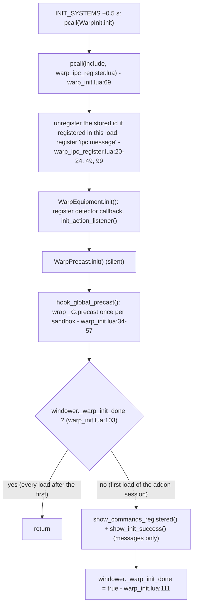
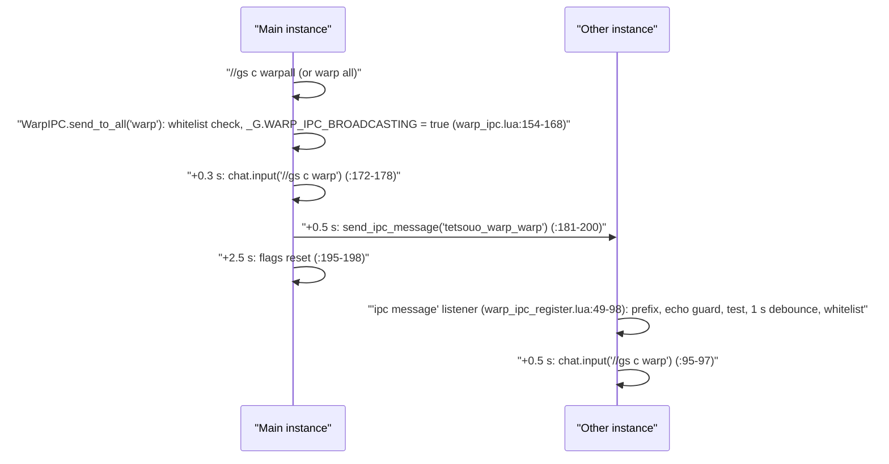

# Warp system and mount toggle

The warp system turns short `//gs c` words into a way home: it casts the BLM/WHM transport spell when the current job can, otherwise it equips a warp or teleport ring in `ring1`, waits for the ring to become usable, fires `/item`, and watches the cast until the character zones. The same words suffixed with `all` are broadcast over Windower IPC so every dual-boxed instance runs them. A third family (79 aliases for 39 destinations) names a destination and sends `/item` for an item from a built-in database. The system is loaded for every job 0.5 s after each file load by `INIT_SYSTEMS.lua`, and every command reaches it through `CommonCommands`. The mount toggle (`//gs c mount`) is a small, independent module routed the same way; it is documented at the end.

Everything below was re-read on disk on 2026-09-25, after `518e536` (gear restored through `gs c update`, `warp test` rewritten), `b6c7dc6` (night cleanup: `WarpCommands.register()` removed) and the 2026-09-25 fix that moved the detector listener to `raw_register_event`. Line numbers are given only where the line itself matters; otherwise the page names the function.

## Files

| Path | Lines | Role |
|---|---|---|
| `shared/utils/warp/warp_init.lua` | 132 | Bootstrap on every load: IPC listener, detector listener, precast hook; the init messages once per addon session |
| `shared/utils/warp/warp_ipc_register.lua` | 101 | The live `ipc message` listener (receiver side of `warp all`) |
| `shared/utils/warp/warp_ipc.lua` | 216 | `send_to_all()` (sender side); also an older listener that nothing registers |
| `shared/utils/warp/warp_command_registry.lua` | 87 | The 105 command aliases and `IPC_DEBOUNCE` |
| `shared/utils/warp/warp_commands.lua` | 361 | Command router: system subcommands, spell/ring fallback, destinations, broadcast |
| `shared/utils/warp/casting/spell_caster.lua` | 172 | Job/level gate and `/ma "<spell>" <me>` |
| `shared/utils/warp/casting/item_user.lua` | 736 | Ring sequence: readiness check, lock, equip, wait, use, post-use monitor, restore |
| `shared/utils/warp/casting/cast_helpers.lua` | 103 | `has_item()` over inventory + wardrobes, ring name to id table |
| `shared/utils/warp/warp_detector.lua` | 257 | Spell/item classification, raw `action` listener registered on every load (inert, see Known issues) |
| `shared/utils/warp/warp_equipment.lua` | 207 | Module-flag lock/unlock of slots, fed by the detector and `warp lock` |
| `shared/utils/warp/warp_precast.lua` | 102 | Forces `sets.precast.FC` for transport spells (through the precast hook) |
| `shared/utils/warp/warp_item_database.lua` | 14 | Alias: `return require('.../database/warp_database_core')` |
| `shared/utils/warp/database/warp_database_core.lua` | 303 | Destination keys, lazy module routing, lookups |
| `shared/utils/warp/database/warp_database_home.lua` | 142 | Home point items (5) |
| `shared/utils/warp/database/warp_database_teleports.lua` | 188 | Teleport crag rings (9) |
| `shared/utils/warp/database/warp_database_nations.lua` | 134 | Nation and Jeuno earrings (4) |
| `shared/utils/warp/database/warp_database_cities_chocobo_conquest.lua` | 97 | Outpost cities, expansion cities, stables, conquest (16) |
| `shared/utils/warp/database/warp_database_adoulin_special_mechanics.lua` | 109 | Adoulin frontier, special locations, Nexus Cape, Tidal Talisman (31) |
| `shared/utils/mount/mount_manager.lua` | 160 | `//gs c mount`: dismount or summon a random owned mount |
| `Tetsouo/config/WARP_ITEMS_OWNED.lua` (live, gitignored) | 10 | Owned warp items written by `//gs c wo scan`; read by the wardrobe organizer only |

Not owned by this area but on the path: `shared/utils/core/COMMON_COMMANDS.lua` (routing, `debugwarp`, `mount`), `shared/utils/core/INIT_SYSTEMS.lua` (the deferred +0.5 s block that calls `WarpInit.init()`), `shared/utils/core/DEBUG_COMMANDS.lua` (`debugwarp`), `shared/utils/messages/formatters/system/message_warp.lua` (748 lines, every warp message), `shared/utils/wardrobe/lib/warp_owned.lua` (writes and reads `WARP_ITEMS_OWNED.lua`).

The six database files were read in full; the destination table in [Configuration](#configuration) was produced by loading them with `lua5.1` and calling `get_items_by_destination()` for every key.

## How it works

### Engine facts this page relies on

These come from the GearSwap engine (`D:\Windower Tetsouo\addons\GearSwap\`), see also [job-change-lifecycle.md](../architecture/job-change-lifecycle.md):

- `windower` inside project code is GearSwap's `user_windower` proxy, created once per addon load (`user_functions.lua:418-423`). `windower._x = v` therefore survives `gs reload` and job changes, and is reset only by `//lua reload gearswap`.
- `windower.register_event` from project code is `register_event_user` (`user_functions.lua:254-263`): the id is recorded in `registered_user_events` and the handler is wrapped in `equip_sets(func)`. `load_user_files()` unregisters every recorded id on each file load (`refresh.lua:69-71`). Listeners never outlive the load that follows them.
- `windower.unregister_event` is `unregister_event_user` (`user_functions.lua:276-282`), which raises an error for a non-number id; the warp code wraps it in `pcall` where the id may be stale.
- `equip()` only fills `equip_list` (`user_functions.lua:127-129`); `equip_sets()` clears that list on entry (`flow.lua:60`) and sends it on exit. An `equip()` made from a bare `coroutine.schedule` callback is discarded by the next event.
- Slot locks (`disable_table`) are engine state. `gs disable <slot>` / `gs enable <slot>` go through `disenable()` (`gearswap.lua:205-208`); `command_enable()` re-sends the item an event tried to put in the slot while it was locked (`not_sent_out_equip`, `user_functions.lua:146-183`). A zone clears that pending table (`packet_parsing.lua:35`). The enable-all at `packet_parsing.lua:755-757` does not fire on an outgoing main-job change: `:744` has already set `player.main_job_id = newmain`, so the test at `:756` is false. It fires only for a 0x100 whose main-job byte is 0 (`res.jobs[0]` exists).
- Scheduled coroutines are never cancelled by a reload; a chain started in one sandbox keeps running against that sandbox's `_G`.

### Bootstrap

`INIT_SYSTEMS.lua` schedules a coroutine 0.5 s after each file load (the "DEFERRED SYSTEMS" block); its first step requires `warp_init` and calls `WarpInit.init()` under `pcall`.



Consequences:

- The IPC listener, the detector `action` listener and the `_G.precast` wrapper are re-created on every load, which is required because the engine removes every sandbox listener at each load and the new sandbox's `precast` is Mote's own. Only the two init messages are printed once per addon session; warp commands need no registration (`WarpCommands.register()` was removed).
- The wrap is guarded by `_G.WARP_PRECAST_HOOKED` (`warp_init.lua:38-41`): when a load is replaced within 0.5 s, the replaced load's deferred block runs `WarpInit.init()` in the new sandbox too (a `require` from a dead environment's callback loads into the current one), and a second wrap would handle every warp spell twice.
- `WarpInit.is_initialized()` (`warp_init.lua:121-123`) is true once `init()` has completed in this module instance, i.e. from +0.5 s after the load. `system_checker.lua` `check_warp()` still reports "initialized" from `windower._warp_init_done` before it asks `is_initialized()`, so after the first load it never looks at the current sandbox.
- Command handling does not depend on the bootstrap: `CommonCommands` requires `warp_commands` lazily on every warp command (`CommonCommands.handle_warp_commands`).

### Command routing

Every job's `job_self_command` calls `CommonCommands.is_common_command(command)` and then `CommonCommands.handle_command(command, JOB, table.unpack(args))` (for example `WAR_COMMANDS.lua` `job_self_command`). Inside `CommonCommands` (`COMMON_COMMANDS.lua`):

1. `is_common_command()` accepts any registry alias and any word ending in `all` whose base is an alias (loops over `WARP_COMMANDS` after the hand-written list). `debugwarp` and `mount` are in the hand-written list.
2. `handle_command()` rebuilds `cmdParams = {command, args...}`, answers `sortie`, `alts` / `main` / `setalt`, `tb` and `trace` first, then checks the warp aliases (and `<alias>all`) before every other common command and before alt commands. A warp alias therefore runs locally even when the dual-box alt config has a key of the same name (the generated BLM alt config defines `warp`, `escape`, `retrace`; they are reachable only as `//gs c alt warp`).
3. `handle_warp_commands(cmdParams)` requires `warp_commands` and returns `WarpCommands.handle_command(cmdParams)`; when the module fails to load it prints a module test.
4. `debugwarp` is routed to `CommonCommands.handle_debugwarp`, which is `DebugCommands.handle_debugwarp` (`DEBUG_COMMANDS.lua`, flag kept in `windower._gs_debug.WARP`); `mount` calls `handle_mount()`.

`WarpCommands.handle_command(cmdParams)` (`warp_commands.lua:235-355`):

```mermaid
flowchart TD
    S["handle_command(cmdParams)"] --> DB{"same text as last call within 0.5 s? (:245)"}
    DB -- yes --> R1["return true (swallowed)"]
    DB -- no --> W{"command == 'warp' and a subcommand? (:263)"}
    W -- "status/unlock/fix/lock/test/help/ipctest" --> SYS["system handler, return true (:198-216)"]
    W -- "anything else (including 'all' and 'debug')" --> ALL
    W -- no --> ALL{"command ends in 'all' or subcommand == 'all'? (:274)"}
    ALL -- yes --> IPC["WarpIPC.send_to_all(base) (:221-230)"]
    ALL -- no --> SP{"spell alias? (:279-295)"}
    SP -- yes --> CWF["cast_with_fallback(spell, rings) (:129-156)"]
    SP -- no --> DEST{"destination alias? (:298-352)"}
    DEST -- yes --> UWD["use_warp_destination(key, name) (:166-189)"]
    DEST -- no --> F["return false"]
    CWF --> SC{"SpellCaster.cast_spell: job and level OK? (spell_caster.lua:99-144)"}
    SC -- yes --> MA["windower.chat.input('/ma \"<spell>\" <me>'), return true"]
    SC -- no --> RING{"rings listed?"}
    RING -- yes --> UR["ItemUser.use_ring(rings) (item_user.lua:57-103)"]
    RING -- no --> F2["return false (Retrace, Escape, Recalls)"]
```

Spell-first decision. `SpellCaster.cast_spell()` checks only that BLM (Warp 17, Warp II 40, Escape 29, Retrace 55) or WHM (Teleports 36-42, Recalls 53) is the main or sub job and that the relevant job level reaches the spell (`BLM_SPELLS` / `WHM_SPELLS` at `spell_caster.lua:24-37`, `can_cast_spell`). It does not look at MP, recast, silence or whether the spell is learned; once it sends `/ma` it returns true and the ring fallback is skipped.

Ring fallback lists (`warp_commands.lua:279-290`): `w`/`w2` -> `Warp Ring`; `tph` -> `Holla Ring`, `Dim. Ring (Holla)`; `tpd` -> `Dem Ring`, `Dim. Ring (Dem)`; `tpm` -> `Mea Ring`, `Dim. Ring (Mea)`; `tpa`, `tpy`, `tpv` -> `Altep Ring`, `Yhoat Ring`, `Vahzl Ring`. Ring ids come from `CastHelpers.RING_IDS` (`cast_helpers.lua:72-83`, all verified against `res/items.lua`).

Destination decision. `use_warp_destination()` takes `items[1]` of the destination (lowest `priority`), checks `get_mob_by_target('me').spawn_type` (a guard against a GearSwap `band()` error on a zone edge, `:175-181`) and sends `input /item "<name>" <me>`. It does not check that the character owns the item, does not equip it and does not wait for its activation delay (see Known issues). `Instant Warp` and the other `home_point` items have no command.

### Ring sequence (`ItemUser`)

`use_ring(ring_names)` (`item_user.lua:57-103`) walks the list in order. For each ring that `CastHelpers.has_item()` finds in inventory or a wardrobe, `_check_ring_usable(id)` (`:140`) decodes its extdata:

- `General` type: ready.
- `Enchanted Equipment`: not ready when `charges_remaining` is 0 (delay = time to `next_use_time`, or 600 when absent) or when `next_use_time + 18000 - os.time() > 0`; ready otherwise. The activation delay (`activation_time`) is not considered at this stage.
- Anything else, decode failure, missing `extdata`, not found: not ready with delay 0.

The first ready ring starts `_execute_ring_sequence()`. When none is ready, `_show_all_cooldowns()` (`:232`) prints one line per ring and the soonest one.

```mermaid
sequenceDiagram
    participant C as "WarpCommands"
    participant U as "ItemUser"
    participant G as "GearSwap engine"
    participant F as "FFXI client"
    C->>U: "use_ring({'Warp Ring'})"
    U->>G: "gs disable ring1 (:298)"
    U->>F: "+0.5 s: input /equip ring1 \"Warp Ring\" (:301-303)"
    U->>U: "+2.5 s: _wait_for_ring_usable (:305-307)"
    loop "check_usable (:420-516)"
        U->>U: "hard ceiling 90 s? extdata ok? item found? charges?"
        U->>U: "not ready: stretch deadline, sleep min(max(delay,1),5) s"
        U->>U: "ready: hold SAFETY_DELAY 3.5 s, wait for me.spawn_type"
    end
    U->>G: "use_now: register 'action' + 'zone change' (_setup_auto_fix)"
    U->>F: "input /item \"Warp Ring\" <me> (:405)"
    loop "check_cast_status every 0.5 s (:705-731)"
        U->>U: "status changed -> interrupted; elapsed >= cast_duration -> timeout"
    end
    F-->>U: "zone change -> cleanup 'success'"
    U->>G: "gs enable ring1 (:647)"
```

Patience windows (all in `item_user.lua`):

| Constant / delay | Value | Line | Meaning |
|---|---|---|---|
| equip delay | 0.5 s | 301-303 | `/equip ring1` after `gs disable ring1` |
| first check | 2.5 s | 305-307 | `_wait_for_ring_usable` starts; `started = os.time()` (`:415`) |
| `WAIT_FLOOR` | 15 s | 121 | initial deadline, `started + 15` (`:416`) |
| `WAIT_GRACE` | 5 s | 123 | added to the delay the item reports |
| `WAIT_CEILING` | 60 s | 122 | the deadline never moves past `started + 60` (`:495-497`) |
| `WAIT_HARD_CEILING` | 90 s | 128 | tested first in every `check_usable`, covers the self-rescheduling paths (`:421`) |
| `SAFETY_DELAY` | 3.5 s | 110 | hold after the first "ready" reading (`:462-474`, re-check every 0.5 s) |
| mob record retry | 1.0 s | 479-485 | `/item` is not sent while `me.spawn_type` is nil |
| `POLL_INTERVAL` / `MAX_POLL_SLEEP` | 1.0 / 5.0 s | 130-131 | sleep = `min(max(remaining, 1), 5)` (`:515`) |
| `EXTDATA_TIME_OFFSET` | 18000 s | 107 | added to extdata timestamps before comparing with `os.time()`; the comment says only that the MyHome addon uses the same +18000 |
| `cast_duration` | `cast_time + cast_delay + 5` (fallback 8+0+5) | 402 | post-use monitoring window from the database (`use_now`); Warp Ring 21 s, Holla Ring 43 s |

Deadline rule on each not-ready check (`:492-515`): `wanted = now + max(recast, activation) + 3.5 + 5`; if `wanted > deadline` then `deadline = min(wanted, started + 60)`; if `now >= deadline` the wait reports why (`report_timeout`, `:373`) and gives up. The deadline only grows. The announce line "Waiting... Ns" is printed once, when the activation delay exceeds 1 s (`:505`).

Every failure exit of the wait goes through `abandon_wait()` (`:315-328`): `gs enable ring1`, then 1 s later `restore_equipment()`. Upper bound on the lock: about 90 s of waiting plus one sleep (at most 5 s), or, after use, `1 + cast_duration` seconds of monitoring. Both are bounded as long as no Lua error ends a coroutine early.

Post-use monitor (`_setup_auto_fix`, `:562-735`):

- `drop_stale_autofix_listeners()` (`:545-553`) unregisters the ids parked on `windower._warp_autofix_action_id` / `_zone_id` by a previous sequence of the same load (`windower._warp_autofix_load == windower._gs_reload_count`); ids from an earlier load are only forgotten, since the engine already freed them.
- `action` listener (`:678-686`): the player's own category 1 packet (a melee round) -> `cleanup_and_restore('interrupted')`.
- `zone change` listener (`:691-694`) -> `cleanup_and_restore('success')`.
- `check_cast_status` (`:705-731`), first run 1 s after setup, then every 0.5 s: `player.status` differs from the status at setup -> `interrupted`; `elapsed >= cast_duration` -> `timeout`. The `if not player` branch is marked "defensive only" in the code (`player` is GearSwap's table, never nil).
- `cleanup_and_restore(reason)` (`:622-675`) runs once (`cleanup_done`). When it runs in the load that registered the listeners, it unregisters both and clears their `windower.*` ids; after a reload (only the timeout path can still fire) it leaves them alone. Then it sends `gs enable ring1`. `success` stops there. `interrupted` and `timeout` print two lines and, 1 s later, call `restore_equipment()` then `verify_ring_restored()` (`:580-619`: first check after 1.5 s, up to 4 checks 1.5 s apart, success when `player.equipment.ring1` is neither empty nor the warp item).

`restore_equipment()` (`:39-51`) sends `gs c update` (since `518e536`): every call site runs inside a `coroutine.schedule` callback, where a direct `equip()` would be dropped, while `gs c update` goes through a real event (Mote's `handle_update`). The engine also helps: `gs enable ring1` re-sends the ring an event (typically the item's aftercast) tried to equip while the slot was locked. `//gs c warp fix` (`warp_commands.lua` `command_fix`, `:71-83`) is the manual path: `enable('ring1')`, `gs enable ring1`, then `gs equip sets.engaged|sets.idle` 1 s later.

A movement interruption of the item is not seen by either listener (the item-interrupt packet is category 9, param 28787, and the status stays `Idle`); it ends as `timeout` after `cast_duration`.

### Automatic detection (inert)

The design: `WarpDetector`'s `action` listener (`init_action_listener`, `warp_detector.lua:167-201`; registered with `windower.raw_register_event` since 2026-09-25, so it no longer costs a GearSwap event cycle per action) recognises the player's warp item use (category 9, id looked up in the database) and calls every callback in `_G.warp_detector_callbacks`; `WarpEquipment` registers one that calls `lock('item', duration, tag, slot)` (`WarpEquipment.on_warp_item`, `warp_equipment.lua:135-158`), which `disable()`s the slot and schedules `unlock(true)` after `duration + 3` s. `WarpPrecast.handle_precast()` (through the `_G.precast` wrapper) equips `sets.precast.FC` for spells matching `WARP_SPELLS` or the name patterns `warp|teleport|recall|retrace|escape` (`WARP_SPELLS` and `is_warp_spell`, `warp_detector.lua:41-90`; `warp_precast.lua` `force_fc` / `handle_precast`); `WarpEquipment.on_warp_spell()` is a no-op.

In the code on disk the item lock never engages: the callback is wiped immediately after registration and the listener reads the item id from the wrong field (details in Known issues). The comment in `WarpEquipment.init()` now says so and warns against just swapping the two calls. The listener itself is registered on every load. The only live path into `WarpEquipment.lock()` is `//gs c warp lock` (all slots, 13 s).

### Broadcast (`warp all`)



- Base command: `<alias>all` strips the suffix; `<alias> all` uses the alias (`warpcommands_handle_command_all`, `warp_commands.lua:221-230`, `:274`).
- Whitelist: sender `ALLOWED_COMMANDS = Registry.COMMANDS` (`warp_ipc.lua:47`, linear scan in `is_command_allowed`, `:56`); receiver `Registry.is_warp_command()` (`warp_ipc_register.lua:35-37`). System subcommands (`status`, `fix`...) are never broadcast.
- Test: `//gs c warp ipctest` sends `tetsouo_warp_test_<name>`; receivers print it (`warp_commands.lua:205-215`, `warp_ipc_register.lua:67-71`).
- The receiver drops every `tetsouo_warp_` message while its own `_G.WARP_IPC_BROADCASTING` is true, i.e. for 2.5 s after it broadcast (`warp_ipc_register.lua:60-65`).
- `IPC_DEBOUNCE = 1.0` (`warp_command_registry.lua:85`), compared with `os.clock()`.
- The receiver runs a plain alias, never the `all` form, so broadcasts do not cascade.

### Mount toggle

`//gs c mount` -> `CommonCommands.handle_mount()` (`COMMON_COMMANDS.lua:123-132`) -> `MountManager.toggle()` (`mount_manager.lua:152-158`):

- Mounted when `player.status` is `Mount` or `Chocobo` (`res/statuses.lua` ids 85 and 5) or `buffactive['Mounted']` (`:50-56`) -> `input /dismount`.
- Otherwise a random owned mount (`math.random`, seeded with `os.time()` at module load, `:41-42`) -> `input /mount "<name>"`. Ownership: `windower.ffxi.get_abilities().mounts` (list of ids or id-keyed map, `:65-82`), else the bitfield of the last incoming 0x0AE packet, bit `id` at byte `floor(id/8) + 5` (`:86-101`; the packet layout is `data[7]` at offset 4 in `libs/packets/fields.lua:3486-3488`), else `Chocobo` (`:105-117`).
- Zone and combat restrictions are left to the server (the `toggle()` doc comment, `:148-150`).

## Public API

`WarpCommands` (`warp_commands.lua`)

| Function | Line | Notes |
|---|---|---|
| `handle_command(cmdParams)` | 235 | Router above. Returns true when handled (or debounced), false otherwise. Caller: `CommonCommands.handle_warp_commands` |

`WarpCommands.register()` no longer exists (removed by the night cleanup `b6c7dc6`; `grep -rn "WarpCommands.register"` finds nothing).

`ItemUser` (`casting/item_user.lua`)

| Function | Line | Notes |
|---|---|---|
| `use_ring(ring_names, context)` | 57 | `ring_names` string or list; `context` is only forwarded to `_show_all_cooldowns`, which ignores it. Returns true once a sequence started. Caller: `cast_with_fallback` in `warp_commands.lua` |
| `_check_ring_usable(item_id)` | 140 | `usable, delay_s, status` with status `ready`, `cooldown`, `not_found`, `decode_failed`, `unknown_type`, `extdata_missing` |
| `_show_all_cooldowns(info, context)` | 232 | Chat report when no ring is ready |
| `_execute_ring_sequence(name, id, is_warp, tag)` | 289 | Lock, equip, schedule the wait |
| `_wait_for_ring_usable(name, id, is_warp, tag, initial_ring1)` | 414 | The patience loop |
| `_setup_auto_fix(id, tag, cast_duration, initial_ring1, item_name)` | 562 | Post-use listeners and monitor; `initial_ring1` is unused |

`SpellCaster` (`casting/spell_caster.lua`): `cast_spell(name)` (99, caller `cast_with_fallback`); `can_cast`, `get_required_level`, `is_blm_spell`, `is_whm_spell` (146-171) have no caller.

`CastHelpers` (`casting/cast_helpers.lua`): `has_item(name, id)` (24; caller `use_ring`), `RING_IDS` (72), `get_ring_id(name)` (88; caller `use_ring`), `has_ring(name)` (95, no caller).

`WarpIPC` (`warp_ipc.lua`): `send_to_all(cmd)` (154; caller `warpcommands_handle_command_all`). `init()` (134), `is_initialized()` (206), `get_allowed_commands()` (212) have no caller, so `handle_ipc_message` (74) and `windower._warp_ipc_event_id` are never used.

`WarpInit` (`warp_init.lua`): `init()` (65; caller the deferred block of `INIT_SYSTEMS.lua`, every load), `is_initialized()` (121, per sandbox; callers `command_status` in `warp_commands.lua`, `check_warp` in `system_checker.lua`), `handle_warp_spell(spell)` (127, no caller).

`WarpDetector` (`warp_detector.lua`): `is_warp_spell` (69; callers `warp_precast.lua:31,62`), `is_warp_item` (116; caller its own listener), `register_callback` (152), `clear_callbacks` (157), `init_action_listener` (167), `get_warp_spells` (207) and `get_warp_items` (219) (callers `command_test` in `warp_commands.lua`). No caller: `has_blm`, `has_whm`, `get_items_by_destination`, `get_all_destinations` (would raise: the database has no such function), `count_warp_items`, `ItemDB`.

`WarpEquipment` (`warp_equipment.lua`): `lock(type, duration, tag, slot)` (36), `unlock(is_timeout, tag)` (78), `on_warp_spell` (127, no-op), `on_warp_item(data)` (135), `init()` (164), `is_locked()` (191), `get_warp_type()` (197), `force_unlock(tag)` (203). Callers: `command_status` / `command_unlock` / `command_lock` in `warp_commands.lua`, `WarpInit.init()`.

`WarpPrecast` (`warp_precast.lua`): `force_fc(spell)` (25), `handle_precast(spell, eventArgs)` (56; caller the `_G.precast` wrapper `warp_init.lua:47-56`, and `WarpInit.handle_warp_spell`), `init()` (98). `global_precast_hook` (85) has no caller.

`WarpDatabase` (`database/warp_database_core.lua`, also reached as `warp_item_database`): `DESTINATIONS` (25), `get_items_by_destination(key)` (177) returns `{ {item_id, data}, ... }` sorted by `priority`; `get_item_by_id(id)` (195) returns `data, destination` (searches cached modules first, then loads the rest); `get_all_item_names()` (230; callers `wardrobe/lib/items.lua` `add_always_kept`, `wardrobe/lib/reports.lua`, `wardrobe/lib/warp_owned.lua` `scan`); `count_total_items()` (251, 65 today, measured with `lua5.1`); `can_player_use_item(data)` (271, no caller). Each database module exposes `get_items(key)`, `get_item_by_id(id)`, `count_items()`.

`Registry` (`warp_command_registry.lua`): `COMMANDS` (22), `SET`, `is_warp_command(cmd)` (75; caller `warp_ipc_register.lua:36`), `IPC_DEBOUNCE` (85). `COMMANDS` is read by `COMMON_COMMANDS.lua:25` and `warp_ipc.lua:47`.

`MountManager` (`mount/mount_manager.lua`): `is_mounted()` (50), `get_owned_mounts()` (105), `pick_random_mount()` (125), `dismount()` (132), `mount()` (139), `toggle()` (152). Only `toggle()` is called from outside (`CommonCommands.handle_mount`).

## Commands

| Command | Handler | Effect |
|---|---|---|
| `w`, `warp` | `warp_commands.lua:279` | Warp (BLM) else Warp Ring |
| `w2`, `warp2` | `:280` | Warp II (cast on `<me>`) else Warp Ring |
| `ret`, `retrace` / `esc`, `escape` | `:281-282` | Spell only |
| `tph tpholla`, `tpd tpdem`, `tpm tpmea`, `tpa tpaltep`, `tpy tpyhoat`, `tpv tpvahzl` | `:285-290` | Teleport spell else ring list |
| `rj recjugner`, `rp recpashh`, `rm recmeriph` | `:293-295` | Recall spell only |
| 79 destination aliases, 39 destinations (see Configuration) | `:298-352` | `/item "<first database item>" <me>` |
| `<alias>all`, `<alias> all` | `:274-276`, `:221-230` | Run locally (+0.3 s) and broadcast (+0.5 s) |
| `warp status` | `command_status` (`:34`) | Initialised flag, `WarpEquipment` lock flag, job, database count |
| `warp unlock` | `command_unlock` (`:59`) | `WarpEquipment.force_unlock()` if its module flag is set; does not see the ring1 lock of a ring sequence |
| `warp fix` | `command_fix` (`:71`) | Release ring1 and re-equip `sets.engaged` or `sets.idle` |
| `warp lock` | `command_lock` (`:85`) | Lock all slots for 13 s |
| `warp test` | `command_test` (`:97`) | Counts warp spells, database item ids (walked per destination since `518e536`) and the database total |
| `warp help` | `command_help` -> `MessageWarp.show_help()` | System and spell commands only |
| `warp ipctest` | `:205-215` | IPC round-trip test |
| `warp <anything else>` | falls through to `:279` | Casts Warp / uses Warp Ring |
| `debugwarp` | `DebugCommands.handle_debugwarp` (`DEBUG_COMMANDS.lua`) | Toggle `_G.WARP_DEBUG` (the copy at `warp_commands.lua:270` is unreachable) |
| `mount` | `CommonCommands.handle_mount` -> `MountManager.toggle` | Dismount or random mount |
| `wo scan` / `wo scanwarp` | `CommonCommands` `wo` branch -> `WardrobeOrganizer.scan_warp_items` | Writes `WARP_ITEMS_OWNED.lua` (wardrobe organizer) |

A repeat of the exact same command text within 0.5 s is swallowed (`warp_commands.lua:241-250`). No keybind file in `_master/config`, `Tetsouo/config`, `Kaories/config` or `shared/config` sends a warp or mount command.

## Configuration

There is no per-character warp configuration. All tuning is constants:

- `item_user.lua:105-131` (table above).
- `warp_commands.lua:28` `DEBOUNCE_THRESHOLD = 0.5`.
- `warp_command_registry.lua:85` `IPC_DEBOUNCE = 1.0`; prefix `tetsouo_warp_` duplicated in `warp_ipc.lua:30` and `warp_ipc_register.lua:29`.
- `WarpEquipment.lock()` auto-unlock after `duration + 3` s (duration default 15).
- `spell_caster.lua:24-37` spell levels; `warp_detector.lua:41-60` (`WARP_SPELLS`) spell names and durations; `cast_helpers.lua:72-83` ring ids.
- `mount_manager.lua:28-39` fallback mount, packet id and offset, mounted statuses.

`WARP_ITEMS_OWNED.lua` (`data/<char>/config/`) is written by `WarpOwned.save()` (`wardrobe/lib/warp_owned.lua:98`) and read by `WarpOwned.load()` (`:39`) for the wardrobe organizer's keep list. The warp system itself never reads it. Live today: Tetsouo `Delegate's Garb`, `Dim. Ring (Holla)`, `Instant Warp`, `Nexus Cape`, `Warp Ring`; Kaories `Dim. Ring (Holla)`, `Nexus Cape`, `Warp Ring`.

Destination database (first entry is what the command uses; `act` is the database `cast_delay`; the code only adds it to the post-use window, `use_now` in `item_user.lua`, while the wait reads the activation delay from extdata):

| Alias | Key | Items in priority order |
|---|---|---|
| (none) | `home_point` | Warp Ring (28540, ring, act 8), Instant Warp (4181, item), Treat Staff II (17588, main), Warp Cudgel (17040, main, act 3), Treat Staff (17566, main) |
| (ring lists only) | `crag_holla` / `crag_dem` / `crag_mea` | Holla/Dem/Mea Ring (act 30), then Dim. Ring (act 8) |
| (ring lists only) | `crag_vahzl` / `crag_yhoat` / `crag_altep` | Vahzl/Yhoat/Altep Ring |
| `sd` `bt` `wd` `jn` | nations, `jeuno` | Kingdom / Republic / Federation / Duchy Earring (ears) |
| `sb` `mh` `rb` `kz` `ng` | outpost cities | Selbina / Mhaura / Rabao / Kazham / Norg Earring |
| `tv` | `tavnazia` | Tavnazian Ring, Safehold Earring |
| `au` `wg`, `ns`, `ad` | `aht_urhgan`, `nashmau`, `adoulin` | Empire Earring, Nashmau Earring, Delegate's Garb (body) |
| `stsd` `stbt` `stwd` `stjn` | stables | Kgd. Stable Collar, Rep. Stable Medal, Fed. Stable Scarf (neck), Bl. Chocobo Cap (head) |
| `op` | `outpost` | Homing Ring, Return Ring |
| `cz` `ys` `hn` `mm` `mj` `yc` `km` | Adoulin frontier | Ceizak ... Kamihr Ring |
| `wj` `ar` | `wajaom`, `arrapago` | Olduum Ring, Arrapago Ring |
| `pg` | `purgonorgo` | 8 race-specific bodies, Custom Gilet +1 first |
| `rl` | `rulude` | Maat's Cap, Stars Cap, Laurel Crown |
| `zv` `riv` `yo` `lf` `bh` | special | Shadow Lord Shirt, Wyrmking Suit +1, Mandra. Suit +1, Leafkin Cap +1, Behemoth Suit +1 |
| `cc` `pt` `cg` | special | Chocobo Blinkers, Warp Ring +1, Ch. Shirt +1 (none of these names exists in `res/items.lua`) |
| (none) | `romaeve` | Ra'Kaznar Turban (name not in `res/items.lua`) |
| `ld`, `td` | `party_leader`, `tidal` | Nexus Cape (back), Tidal Talisman |

Database `slot` values are `ring`, `ears`, `neck`, `head`, `body`, `back`, `main`, `item`, not GearSwap slot names.

## State & lifetime

`windower.*` fields (survive `gs reload` and job changes, reset by `//lua reload gearswap`):

| Field | Written | Purpose |
|---|---|---|
| `_warp_init_done` | `warp_init.lua:111` | Skips the init messages on later loads (`:103-105`); also read by `system_checker.lua` `check_warp` |
| `_warp_ipc_register_event_id`, `_warp_ipc_register_event_load` | `warp_ipc_register.lua:24, 49, 99` | Id of the live IPC listener and the load (`windower._gs_reload_count`) that registered it |
| `_warp_detector_event_id`, `_warp_detector_event_load` | `init_action_listener` in `warp_detector.lua` | Id of the detector listener and its load |
| `_warp_ipc_event_id` | `WarpIPC.init()` | Never written: `WarpIPC.init()` has no caller |
| `_warp_autofix_action_id`, `_warp_autofix_zone_id`, `_warp_autofix_load` | `drop_stale_autofix_listeners`, `cleanup_and_restore`, `_setup_auto_fix` in `item_user.lua` | Ids of the post-use listeners and their load |

Because the engine unregisters sandbox listeners on every load, a persisted id is already dead when the next load reads it, and Windower may have given the number to another listener since. Each id is therefore stored with `windower._gs_reload_count` (bumped by `INIT_SYSTEMS.lua:44` on every load) and unregistered only when that stamp equals the current count: a second registration in the same load (a stale sandbox's deferred init after a load within 0.5 s, or a second ring sequence) replaces its own listener, and nothing else is touched.

`_G` globals (per sandbox, reset on every load): `WARP_DEBUG` (read across the warp modules, toggled by `debugwarp`; backed by `windower._gs_debug.WARP` and restored by `INIT_SYSTEMS.lua:38`, so it survives a job change), `WARP_IPC_BROADCASTING` (`warp_ipc.lua:168, 197`, read `warp_ipc_register.lua:60`), `warp_detector_callbacks` (`warp_detector.lua` `register_callback` / `clear_callbacks` / the listener), `precast` (replaced in every sandbox by `warp_init.lua:47`), `WARP_PRECAST_HOOKED` (`warp_init.lua:38-41`, one wrap per sandbox). Module-local state: `WarpEquipment` lock flags, `WarpCommands` debounce, IPC debounce, `WarpDatabase._cached_modules`.

Registered events:

| Event | Where | Lifetime |
|---|---|---|
| `ipc message` | `warp_ipc_register.lua:49` | Re-registered 0.5 s after every load |
| `action` (detector, raw) | `warp_detector.lua` `init_action_listener` | Re-registered 0.5 s after every load |
| `action`, `zone change` (post-use) | `item_user.lua:678, 691` | One ring use; removed by `cleanup_and_restore`, by the next sequence, or by the engine at the next load |

The IPC and post-use listeners run through GearSwap's `equip_sets` wrapper, so while the post-use `action` listener is registered each action packet in range costs a GearSwap event cycle. The detector listener uses `raw_register_event` (fixed 2026-09-25): the engine still records its id in `registered_user_events` (`user_functions.lua` `raw_register_event_user`), so it is removed at the next load like the others.

Coroutines (none can be cancelled): the deferred bootstrap (`INIT_SYSTEMS.lua`), the ring chain (`item_user.lua:301-307` and the `check_usable` reschedules), the post-use monitor and verify chains, `abandon_wait`'s restore, `WarpEquipment`'s auto-unlock (`lock()`; `lock_timer = nil` does not cancel it) and its 0.5 s `gs c update` in `unlock()`, the IPC timers (`warp_ipc.lua:172-200`, `warp_ipc_register.lua:95-97`), `warp fix`'s 1 s equip.

Lifecycle:

- `gs reload`, subjob change, main job change: a running ring chain keeps running in the old sandbox and still ends with `gs enable ring1`; its post-use listeners are removed by the engine, so it can only finish through the status test or the timeout. A main job change does not re-enable slots at the engine level (see Engine facts). `WarpEquipment`'s flag resets to false while a pending auto-unlock from the old sandbox still fires.
- Zone: the post-use zone listener ends the sequence as `success`. The engine clears pending slot items on zone, so `gs enable ring1` after a zone re-sends nothing.
- Death: no special handling; the chains run to their bounds.

## Interactions

- Routing, `debugwarp`, `mount`, load-failure diagnostics: [commands-and-debug.md](commands-and-debug.md).
- Deferred bootstrap, require cache per sandbox, stale coroutines: [core-lifecycle.md](core-lifecycle.md), [job-change-lifecycle.md](../architecture/job-change-lifecycle.md).
- Every message: `message_warp.lua`, see [messages.md](messages.md) and [messages-formatters.md](messages-formatters.md).
- The `_G.precast` wrapper runs before Mote's precast and therefore before the job's PrecastGuard/CooldownChecker pipeline: [precast-pipeline.md](precast-pipeline.md).
- Dual-box: the warp broadcast is independent from `dualbox_sync_ipc` and the alt-command system ([dualbox.md](dualbox.md)); alt config keys named like a warp alias are shadowed.
- Wardrobe organizer: keeps warp items out of non-equippable overflow using `get_all_item_names()` or `WARP_ITEMS_OWNED.lua`; the ring path searches only equippable bags (`find_equippable_item` in `item_user.lua`, `cast_helpers.lua:31-40`).
- Other systems that lock `ring1`: DoomManager (`doom_manager.lua:86`), craft mode (`craft_commands.lua:203-206`). The ring sequence does not record a pre-existing lock and always ends with `gs enable ring1`.
- `BRD_COMMANDS.lua:196` has a `forceidle` command ("WARP RING FIX COMMAND"); its comment says no code sends it any more, and nothing in the warp code does.

## Invariants & gotchas

- Every exit of the ring wait must release `ring1`: all go through `abandon_wait()` or `cleanup_and_restore()`. A Lua error inside a scheduled step ends the chain without releasing it; `//gs c warp fix` is the recovery.
- The readiness check before equipping ignores the activation delay; only the wait loop reads it. A second `//gs c warp` issued during the wait therefore sees the ring as ready.
- The wait searches all equippable bags for the ring id and does not check that the ring is actually in `ring1`; if `/equip` failed, the ring can read as ready and `/item` is sent anyway, ending as `timeout`.
- Restoring gear from a scheduled callback needs a command (`gs c update`, `gs equip <set>`, `gs enable <slot>`), not `equip()` or a direct call to a Mote hook.
- `gs disable ring1` and `/equip ring1` bypass GearSwap's set logic; the equip is the client's native command.
- A warp alias always wins over a Mote command, a job command checked after `is_common_command`, and an alt-config key of the same name. Before adding a job or alt command, check `warp_command_registry.lua` and the `all` suffix rule (any registered alias + `all`).
- `warp <unknown subcommand>` casts Warp; only the seven listed subcommands stop the dispatch.
- `WarpEquipment.on_warp_item()` would pass database slot names such as `ears` and `item` to `disable()`, which rejects them (`statics.lua:148-163` has `ear1`/`ear2`, no `ears`).

## Extending

Add a warp alias: append it to `Registry.COMMANDS` (`Registry.COMMANDS` in `warp_command_registry.lua`; this makes it a common command, an IPC whitelist entry and an `<alias>all` broadcast), then add its branch in `WarpCommands.handle_command()` (`warp_commands.lua:272-352`). The registry header's step 2 ("add a handler in `command_status()`") is wrong. Update `MessageWarp.show_help()` if it should be listed.

Add a destination item: add an entry to the relevant `ITEMS` table with `name` exactly as `res/items.lua` spells it, the matching id, `slot`, `priority`, `max_charges`, `recast_delay`, `level`, `cast_time`, `cast_delay`; a new destination key also needs `DESTINATIONS` and `MODULE_ROUTING` entries in `warp_database_core.lua` and an alias.

Add a ring to a spell fallback: add its id to `CastHelpers.RING_IDS` and its name to the list at the call site in `handle_command()`; it must also exist in the database, because `use_now()` reads `cast_time`/`cast_delay` from there (`item_user.lua:397-402`).

## Known issues

Fixed since the page was first written:

- `restore_equipment()` now sends `gs c update` instead of calling Mote's `status_change` from a scheduled callback (`518e536`); `WarpEquipment.unlock()` does the same.
- `MessageWarp.show_item_equip_delay` has one definition (`message_warp.lua:602`).
- `//gs c warp test` walks the database per destination instead of reading a missing `WarpItemDB.ITEMS` (`518e536`).
- `WarpCommands.register()` (dead, wrong require path) was removed (`b6c7dc6`).
- `warp_detector.lua` no longer claims 68 items.
- The detector `action` listener goes through `raw_register_event` instead of the `equip_sets` wrapper (fixed 2026-09-25; not yet played).

Still open:

- Destination commands send `/item` without ownership check, equip or activation wait (`use_warp_destination`, `warp_commands.lua:166-189`).
- `//gs c warp debug`, listed by the help (`message_warp.lua:245`), casts Warp: `warpcommands_handle_command_warp` has no `debug` branch.
- No ring fallback when the spell cannot actually be cast (MP, recast, silence, spell not learned) (`SpellCaster.cast_spell`).
- Automatic item-use lock never engages: callbacks cleared after registration, item id read from `act.param` (for category 9 GearSwap reads it from `act.targets[1].actions[1].param`, `helper_functions.lua:961-962`) (`WarpEquipment.init`, `WarpDetector.init_action_listener`). Documented in the `init()` comment; kept inactive on purpose.
- No single-flight guard: a second ring command during the wait starts a parallel chain (`use_ring`, `_wait_for_ring_usable`).
- Database names or ids that do not match `res/items.lua` (`warp_database_adoulin_special_mechanics.lua`, special locations).
- Dead code: `WarpIPC.init`/`handle_ipc_message`, several detector, caster and helper functions, the `debugwarp` branch in `warp_commands.lua:270`.
- `//gs c warp unlock` cannot release the ring sequence's `ring1` lock and the help does not mention `warp fix` (`command_unlock`, `MessageWarp.show_help`).
- `syscheck` reports the warp system as initialised from `windower._warp_init_done`, even when this sandbox's `init()` failed (`system_checker.lua` `check_warp`).
- `CommonCommands.handle_warp_commands` (`COMMON_COMMANDS.lua:442`), on a load failure, probes `shared/utils/messages/message_warp`, a path that no longer exists (see [commands-and-debug.md](commands-and-debug.md)).
