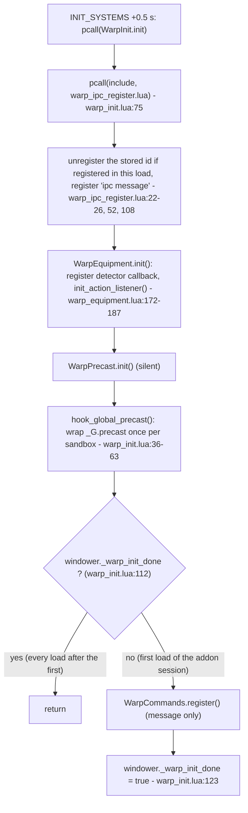
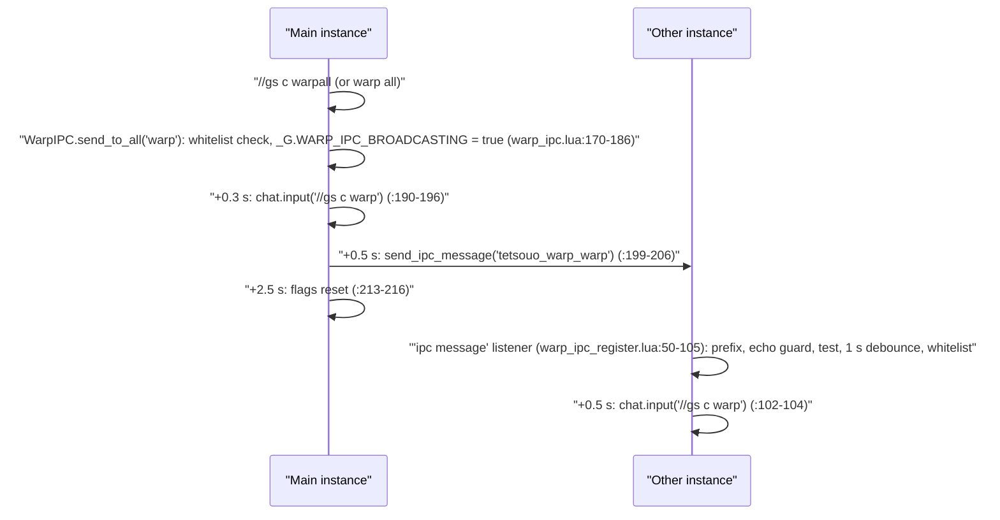

# Warp system and mount toggle

The warp system turns short `//gs c` words into a way home: it casts the BLM/WHM transport spell when the current job can, otherwise it equips a warp or teleport ring in `ring1`, waits for the ring to become usable, fires `/item`, and watches the cast until the character zones. The same words suffixed with `all` are broadcast over Windower IPC so every dual-boxed instance runs them. A third family (79 aliases for 39 destinations) names a destination and sends `/item` for an item from a built-in database. The system is loaded for every job 0.5 s after each file load by `INIT_SYSTEMS.lua`, and every command reaches it through `CommonCommands`. The mount toggle (`//gs c mount`) is a small, independent module routed the same way; it is documented at the end.

Everything below was read on disk on 2026-09-18, including the changes to `item_user.lua` (patience windows, `abandon_wait()` restore, listener ids on `windower.*`) and the removal of `MessageWarp.show_safety_timeout()`, committed as `4d2b9d6`.

## Files

| Path | Lines | Role |
|---|---|---|
| `shared/utils/warp/warp_init.lua` | 144 | Bootstrap: IPC listener, detector listener and precast hook on every load; command registration once per addon session |
| `shared/utils/warp/warp_ipc_register.lua` | 110 | The live `ipc message` listener (receiver side of `warp all`) |
| `shared/utils/warp/warp_ipc.lua` | 235 | `send_to_all()` (sender side); also an older listener that nothing registers |
| `shared/utils/warp/warp_command_registry.lua` | 84 | The 105 command aliases and `IPC_DEBOUNCE` |
| `shared/utils/warp/warp_commands.lua` | 361 | Command router: system subcommands, spell/ring fallback, destinations, broadcast |
| `shared/utils/warp/casting/spell_caster.lua` | 176 | Job/level gate and `/ma "<spell>" <me>` |
| `shared/utils/warp/casting/item_user.lua` | 759 | Ring sequence: readiness check, lock, equip, wait, use, post-use monitor, restore |
| `shared/utils/warp/casting/cast_helpers.lua` | 105 | `has_item()` over inventory + wardrobes, ring name to id table |
| `shared/utils/warp/warp_detector.lua` | 260 | Spell/item classification, `action` listener registered on every load (inert, see Known issues) |
| `shared/utils/warp/warp_equipment.lua` | 211 | Module-flag lock/unlock of slots, fed by the detector and `warp lock` |
| `shared/utils/warp/warp_precast.lua` | 113 | Forces `sets.precast.FC` for transport spells (through the precast hook) |
| `shared/utils/warp/warp_item_database.lua` | 14 | Alias: `return require('.../database/warp_database_core')` |
| `shared/utils/warp/database/warp_database_core.lua` | 307 | Destination keys, lazy module routing, lookups |
| `shared/utils/warp/database/warp_database_home.lua` | 142 | Home point items (5) |
| `shared/utils/warp/database/warp_database_teleports.lua` | 179 | Teleport crag rings (9) |
| `shared/utils/warp/database/warp_database_nations.lua` | 125 | Nation and Jeuno earrings (4) |
| `shared/utils/warp/database/warp_database_cities_chocobo_conquest.lua` | 89 | Outpost cities, expansion cities, stables, conquest (16) |
| `shared/utils/warp/database/warp_database_adoulin_special_mechanics.lua` | 100 | Adoulin frontier, special locations, Nexus Cape, Tidal Talisman (31) |
| `shared/utils/mount/mount_manager.lua` | 160 | `//gs c mount`: dismount or summon a random owned mount |
| `Tetsouo/config/WARP_ITEMS_OWNED.lua` (live, gitignored) | 10 | Owned warp items written by `//gs c wo scan`; read by the wardrobe organizer only |

Not owned by this area but on the path: `shared/utils/core/COMMON_COMMANDS.lua` (routing, `debugwarp`, `mount`), `shared/utils/core/INIT_SYSTEMS.lua:181-195` (bootstrap), `shared/utils/messages/formatters/system/message_warp.lua` (753 lines, every warp message), `shared/utils/wardrobe/lib/warp_owned.lua` (writes and reads `WARP_ITEMS_OWNED.lua`).

The six database files were read in full; the destination table in [Configuration](#configuration) was produced by loading them with `lua5.1` and calling `get_items_by_destination()` for every key.

## How it works

### Engine facts this page relies on

These come from the GearSwap engine (`D:\Windower Tetsouo\addons\GearSwap\`), see also [job-change-lifecycle.md](../architecture/job-change-lifecycle.md):

- `windower` inside project code is GearSwap's `user_windower` proxy, created once per addon load (`user_functions.lua:418-423`). `windower._x = v` therefore survives `gs reload` and job changes, and is reset only by `//lua reload gearswap`.
- `windower.register_event` from project code is `register_event_user` (`user_functions.lua:254-263`): the id is recorded in `registered_user_events` and the handler is wrapped in `equip_sets(func)`. `load_user_files()` unregisters every recorded id on each file load (`refresh.lua:69-71`). Listeners never outlive the load that follows them.
- `windower.unregister_event` is `unregister_event_user` (`user_functions.lua:276-282`), which raises an error for a non-number id; the warp code wraps it in `pcall` where the id may be stale.
- `equip()` only fills `equip_list` (`user_functions.lua:127-129`); `equip_sets()` clears that list on entry (`flow.lua:60`) and sends it on exit. An `equip()` made from a bare `coroutine.schedule` callback is discarded by the next event.
- Slot locks (`disable_table`) are engine state. `gs disable <slot>` / `gs enable <slot>` go through `disenable()` (`gearswap.lua:205-208`); `command_enable()` re-sends the item an event tried to put in the slot while it was locked (`not_sent_out_equip`, `user_functions.lua:146-183`). A zone clears that pending table (`packet_parsing.lua:35`). The enable-all at `packet_parsing.lua:755-757` does not fire on an outgoing main-job change: `:744` has already set `player.main_job_id = newmain`, so the test at `:756` is false. It fires only for a 0x100 whose main-job byte is 0 (`res.jobs[0]` exists).
- Scheduled coroutines are never cancelled by a reload; a chain started in one sandbox keeps running against that sandbox's `_G`.

### Bootstrap

`INIT_SYSTEMS.lua:181-234` schedules a coroutine 0.5 s after each file load; its first block (`:186-195`) calls `WarpInit.init()` under `pcall`.



Consequences:

- The IPC listener, the detector `action` listener and the `_G.precast` wrapper are re-created on every load, which is required because the engine removes every sandbox listener at each load and the new sandbox's `precast` is Mote's own. Only the message-only command registration runs once per addon session.
- The wrap is guarded by `_G.WARP_PRECAST_HOOKED` (`warp_init.lua:40-43`): when a load is replaced within 0.5 s, the replaced load's deferred block runs `WarpInit.init()` in the new sandbox too (a `require` from a dead environment's callback loads into the current one), and a second wrap would handle every warp spell twice.
- `WarpInit.is_initialized()` (`warp_init.lua:133-135`) is true once `init()` has completed in this module instance, i.e. from +0.5 s after the load. `system_checker.lua:56` still short-circuits on `windower._warp_init_done`.
- Command handling does not depend on the bootstrap: `CommonCommands` requires `warp_commands` lazily on every warp command (`COMMON_COMMANDS.lua:389`).

### Command routing

Every job's `job_self_command` calls `CommonCommands.is_common_command(command)` and then `CommonCommands.handle_command(command, JOB, table.unpack(args))` (for example `WAR_COMMANDS.lua:106-116`). Inside `CommonCommands`:

1. `is_common_command()` accepts any registry alias (`COMMON_COMMANDS.lua:692-697`) and any word ending in `all` whose base is an alias (`:699-707`). `debugwarp` and `mount` are in the hand-written list (`:671-679`).
2. `handle_command()` rebuilds `cmdParams = {command, args...}` (`:430-445`) and checks the warp aliases first (`:459-474`), before every other common command and before alt commands. A warp alias therefore always runs locally even when the dual-box alt config has a key of the same name (the generated BLM alt config defines `warp`, `escape`, `retrace`; they are reachable only as `//gs c alt warp`).
3. `handle_warp_commands(cmdParams)` (`:388-414`) requires `warp_commands` and returns `WarpCommands.handle_command(cmdParams)`.
4. `debugwarp` is handled in `CommonCommands` itself (`:562-566`) and `mount` calls `handle_mount()` (`:483-484`, `:100-109`).

`WarpCommands.handle_command(cmdParams)` (`warp_commands.lua:228-348`):

```mermaid
flowchart TD
    S["handle_command(cmdParams)"] --> DB{"same text as last call within 0.5 s? (:238)"}
    DB -- yes --> R1["return true (swallowed)"]
    DB -- no --> W{"command == 'warp' and a subcommand? (:256)"}
    W -- "status/unlock/fix/lock/test/help/ipctest" --> SYS["system handler, return true (:196-214)"]
    W -- "anything else (including 'all' and 'debug')" --> ALL
    W -- no --> ALL{"command ends in 'all' or subcommand == 'all'? (:267)"}
    ALL -- yes --> IPC["WarpIPC.send_to_all(base) (:217-226)"]
    ALL -- no --> SP{"spell alias? (:272-288)"}
    SP -- yes --> CWF["cast_with_fallback(spell, rings) (:129-156)"]
    SP -- no --> DEST{"destination alias? (:291-345)"}
    DEST -- yes --> UWD["use_warp_destination(key, name) (:166-189)"]
    DEST -- no --> F["return false"]
    CWF --> SC{"SpellCaster.cast_spell: job and level OK? (spell_caster.lua:100-145)"}
    SC -- yes --> MA["windower.chat.input('/ma \"<spell>\" <me>'), return true"]
    SC -- no --> RING{"rings listed?"}
    RING -- yes --> UR["ItemUser.use_ring(rings) (item_user.lua:71-125)"]
    RING -- no --> F2["return false (Retrace, Escape, Recalls)"]
```

Spell-first decision. `SpellCaster.cast_spell()` checks only that BLM (Warp 17, Warp II 40, Escape 29, Retrace 55) or WHM (Teleports 36-42, Recalls 53) is the main or sub job and that the relevant job level reaches the spell (`spell_caster.lua:23-41`, `50-91`). It does not look at MP, recast, silence or whether the spell is learned; once it sends `/ma` it returns true and the ring fallback is skipped.

Ring fallback lists (`warp_commands.lua:272-283`): `w`/`w2` -> `Warp Ring`; `tph` -> `Holla Ring`, `Dim. Ring (Holla)`; `tpd` -> `Dem Ring`, `Dim. Ring (Dem)`; `tpm` -> `Mea Ring`, `Dim. Ring (Mea)`; `tpa`, `tpy`, `tpv` -> `Altep Ring`, `Yhoat Ring`, `Vahzl Ring`. Ring ids come from `CastHelpers.RING_IDS` (`cast_helpers.lua:74-85`, all verified against `res/items.lua`).

Destination decision. `use_warp_destination()` takes `items[1]` of the destination (lowest `priority`), checks `get_mob_by_target('me').spawn_type` (a guard against a GearSwap `band()` error on a zone edge, `:175-181`) and sends `input /item "<name>" <me>`. It does not check that the character owns the item, does not equip it and does not wait for its activation delay (see Known issues). `Instant Warp` and the other `home_point` items have no command.

### Ring sequence (`ItemUser`)

`use_ring(ring_names)` (`item_user.lua:71-125`) walks the list in order. For each ring that `CastHelpers.has_item()` finds in inventory or a wardrobe, `_check_ring_usable(id)` (`:157-248`) decodes its extdata:

- `General` type: ready.
- `Enchanted Equipment`: not ready when `charges_remaining` is 0 (delay = time to `next_use_time`, or 600 when absent) or when `next_use_time + 18000 - os.time() > 0`; ready otherwise. The activation delay (`activation_time`) is not considered at this stage.
- Anything else, decode failure, missing `extdata`, not found: not ready with delay 0.

The first ready ring starts `_execute_ring_sequence()`. When none is ready, `_show_all_cooldowns()` (`:251-305`) prints one line per ring and the soonest one.

```mermaid
sequenceDiagram
    participant C as "WarpCommands"
    participant U as "ItemUser"
    participant G as "GearSwap engine"
    participant F as "FFXI client"
    C->>U: "use_ring({'Warp Ring'})"
    U->>G: "gs disable ring1 (:316)"
    U->>F: "+0.5 s: input /equip ring1 \"Warp Ring\" (:319-321)"
    U->>U: "+2.5 s: _wait_for_ring_usable (:323-325)"
    loop "check_usable (:433-529)"
        U->>U: "hard ceiling 90 s? extdata ok? item found? charges?"
        U->>U: "not ready: stretch deadline, sleep min(max(delay,1),5) s"
        U->>U: "ready: hold SAFETY_DELAY 3.5 s, wait for me.spawn_type"
    end
    U->>G: "use_now: register 'action' + 'zone change' (:688-707)"
    U->>F: "input /item \"Warp Ring\" <me> (:423)"
    loop "check_cast_status every 0.5 s (:716-746)"
        U->>U: "status changed -> interrupted; elapsed >= cast_duration -> timeout"
    end
    F-->>U: "zone change -> cleanup 'success'"
    U->>G: "gs enable ring1 (:652)"
```

Patience windows (all in `item_user.lua`):

| Constant / delay | Value | Line | Meaning |
|---|---|---|---|
| equip delay | 0.5 s | 319-321 | `/equip ring1` after `gs disable ring1` |
| first check | 2.5 s | 323-325 | `_wait_for_ring_usable` starts; `started = os.time()` (`:428`) |
| `WAIT_FLOOR` | 15 s | 143 | initial deadline, `started + 15` (`:429`) |
| `WAIT_GRACE` | 5 s | 145 | added to the delay the item reports |
| `WAIT_CEILING` | 60 s | 144 | the deadline never moves past `started + 60` (`:507-510`) |
| `WAIT_HARD_CEILING` | 90 s | 150 | tested first in every `check_usable`, covers the self-rescheduling paths (`:434-438`) |
| `SAFETY_DELAY` | 3.5 s | 132 | hold after the first "ready" reading (`:476-488`, re-check every 0.5 s) |
| mob record retry | 1.0 s | 494-498 | `/item` is not sent while `me.spawn_type` is nil |
| `POLL_INTERVAL` / `MAX_POLL_SLEEP` | 1.0 / 5.0 s | 152-153 | sleep = `min(max(remaining, 1), 5)` (`:527-528`) |
| `EXTDATA_TIME_OFFSET` | 18000 s | 129 | added to extdata timestamps before comparing with `os.time()`; same constant as `MyHome.lua:71,80`, the comment's "JST vs local" explanation is not otherwise recorded |
| `cast_duration` | `cast_time + cast_delay + 5` (fallback 8+0+5) | 416-420 | post-use monitoring window from the database; Warp Ring 21 s, Holla Ring 43 s |

Deadline rule on each not-ready check (`:505-515`): `wanted = now + max(recast, activation) + 3.5 + 5`; if `wanted > deadline` then `deadline = min(wanted, started + 60)`; if `now >= deadline` the wait reports why (`report_timeout`, `:391-404`) and gives up. The deadline only grows. The announce line "Waiting... Ns" is printed once, when the activation delay exceeds 1 s (`:517-524`).

Every failure exit of the wait goes through `abandon_wait()` (`:333-345`): `gs enable ring1`, then 1 s later `restore_equipment()`. Upper bound on the lock: about 90 s of waiting plus one sleep (at most 5 s), or, after use, `1 + cast_duration` seconds of monitoring. Both are bounded as long as no Lua error ends a coroutine early.

Post-use monitor (`_setup_auto_fix`, `:570-758`):

- `drop_stale_autofix_listeners()` (`:560-568`) unregisters the ids parked on `windower._warp_autofix_action_id` / `_zone_id` by a previous sequence of the same load (`windower._warp_autofix_load == windower._gs_reload_count`); ids from an earlier load are only forgotten, since the engine already freed them.
- `action` listener (`:695-703`): the player's own category 1 packet (a melee round) -> `cleanup_and_restore('interrupted')`.
- `zone change` listener (`:709-712`) -> `cleanup_and_restore('success')`.
- `check_cast_status` (`:724-754`), first run 1 s after setup, then every 0.5 s: `player.status` differs from the status at setup -> `interrupted`; `elapsed >= cast_duration` -> `timeout`. The `if not player` branch cannot fire (`player` is GearSwap's table, never nil).
- `cleanup_and_restore(reason)` (`:633-692`) runs once (`cleanup_done`). When it runs in the load that registered the listeners, it unregisters both and clears their `windower.*` ids; after a reload (only the timeout path can still fire) it leaves them alone. Then it sends `gs enable ring1`. `success` stops there. `interrupted` and `timeout` print two lines and, 1 s later, call `restore_equipment()` then `verify_ring_restored()` (`:588-630`: first check after 1.5 s, up to 4 checks 1.5 s apart, success when `player.equipment.ring1` is neither empty nor the warp item).

`restore_equipment()` (`:25-69`) calls Mote's `status_change(player.status, player.status)` when it exists, which it always does under Mote. Every call site runs inside a `coroutine.schedule` callback, so the resulting `equip()` is discarded (see Known issues). What actually puts the normal ring back is the engine: `gs enable ring1` re-sends the ring an event (typically the item's aftercast) tried to equip while the slot was locked. `//gs c warp fix` (`warp_commands.lua:71-83`) is the working manual path: `enable('ring1')`, `gs enable ring1`, then `gs equip sets.engaged|sets.idle` 1 s later.

A movement interruption of the item is not seen by either listener (the item-interrupt packet is category 9, param 28787, and the status stays `Idle`); it ends as `timeout` after `cast_duration`.

### Automatic detection (inert)

The design: `WarpDetector`'s permanent `action` listener (`warp_detector.lua:184-204`) recognises the player's warp item use (category 9, id looked up in the database) and calls every callback in `_G.warp_detector_callbacks`; `WarpEquipment` registers one that calls `lock('item', duration, tag, slot)` (`warp_equipment.lua:143-165`), which `disable()`s the slot and schedules `unlock(true)` after `duration + 3` s. `WarpPrecast.handle_precast()` (through the `_G.precast` wrapper) equips `sets.precast.FC` for spells matching `WARP_SPELLS` or the name patterns `warp|teleport|recall|retrace|escape` (`warp_detector.lua:39-95`, `warp_precast.lua:30-85`); `WarpEquipment.on_warp_spell()` is a no-op.

In the code on disk the item lock never engages: the callback is wiped immediately after registration and the listener reads the item id from the wrong field (details in Known issues). The listener itself is registered on every load. The only live path into `WarpEquipment.lock()` is `//gs c warp lock` (all slots, 13 s).

### Broadcast (`warp all`)



- Base command: `<alias>all` strips the suffix; `<alias> all` uses the alias (`warp_commands.lua:217-218`, `:267`).
- Whitelist: sender `ALLOWED_COMMANDS = Registry.COMMANDS` (`warp_ipc.lua:47`, linear scan `:56-64`); receiver `Registry.is_warp_command()` (`warp_ipc_register.lua:36-38`). System subcommands (`status`, `fix`...) are never broadcast.
- Test: `//gs c warp ipctest` sends `tetsouo_warp_test_<name>`; receivers print it (`warp_commands.lua:203-213`, `warp_ipc_register.lua:71-75`).
- The receiver drops every `tetsouo_warp_` message while its own `_G.WARP_IPC_BROADCASTING` is true, i.e. for 2.5 s after it broadcast (`warp_ipc_register.lua:63-68`).
- `IPC_DEBOUNCE = 1.0` (`warp_command_registry.lua:82`), compared with `os.clock()`.
- The receiver runs a plain alias, never the `all` form, so broadcasts do not cascade.

### Mount toggle

`//gs c mount` -> `CommonCommands.handle_mount()` (`COMMON_COMMANDS.lua:100-109`) -> `MountManager.toggle()` (`mount_manager.lua:152-158`):

- Mounted when `player.status` is `Mount` or `Chocobo` (`res/statuses.lua` ids 85 and 5) or `buffactive['Mounted']` (`:50-56`) -> `input /dismount`.
- Otherwise a random owned mount (`math.random`, seeded with `os.time()` at module load, `:41-42`) -> `input /mount "<name>"`. Ownership: `windower.ffxi.get_abilities().mounts` (list of ids or id-keyed map, `:65-82`), else the bitfield of the last incoming 0x0AE packet, bit `id` at byte `floor(id/8) + 5` (`:86-101`; the packet layout is `data[7]` at offset 4 in `libs/packets/fields.lua:3486-3488`), else `Chocobo` (`:105-117`).
- Zone and combat restrictions are left to the server (`:149-151`).

## Public API

`WarpCommands` (`warp_commands.lua`)

| Function | Line | Notes |
|---|---|---|
| `handle_command(cmdParams)` | 228 | Router above. Returns true when handled (or debounced), false otherwise. Caller: `COMMON_COMMANDS.lua:391` |
| `register()` | 354 | `pcall(require, 'utils/core/COMMON_COMMANDS')` (path does not exist), so the `show_registered_common()` message after it (`message_warp.lua:475-477`) is never reached. No functional effect. Caller: `warp_init.lua:119` (first load of the addon session only) |

`ItemUser` (`casting/item_user.lua`)

| Function | Line | Notes |
|---|---|---|
| `use_ring(ring_names, context)` | 71 | `ring_names` string or list; `context` is ignored. Returns true once a sequence started. Caller: `warp_commands.lua:148` |
| `_check_ring_usable(item_id)` | 157 | `usable, delay_s, status` with status `ready`, `cooldown`, `not_found`, `decode_failed`, `unknown_type`, `extdata_missing` |
| `_show_all_cooldowns(info, context)` | 251 | Chat report when no ring is ready |
| `_execute_ring_sequence(name, id, is_warp, tag)` | 307 | Lock, equip, schedule the wait |
| `_wait_for_ring_usable(name, id, is_warp, tag, initial_ring1)` | 427 | The patience loop |
| `_setup_auto_fix(id, tag, cast_duration, initial_ring1, item_name)` | 568 | Post-use listeners and monitor; `initial_ring1` is unused |

`SpellCaster` (`casting/spell_caster.lua`): `cast_spell(name)` (100, caller `warp_commands.lua:135`); `can_cast`, `get_required_level`, `is_blm_spell`, `is_whm_spell` (150-174) have no caller.

`CastHelpers` (`casting/cast_helpers.lua`): `has_item(name, id)` (23; callers `item_user.lua:87`), `RING_IDS` (74), `get_ring_id(name)` (90; caller `item_user.lua:85`), `has_ring(name)` (97, no caller).

`WarpIPC` (`warp_ipc.lua`): `send_to_all(cmd)` (170; caller `warp_commands.lua:221`). `init()` (149), `is_initialized()` (224), `get_allowed_commands()` (231) have no caller, so `handle_ipc_message` (81) and `windower._warp_ipc_event_id` are never used.

`WarpInit` (`warp_init.lua`): `init()` (71; caller `INIT_SYSTEMS.lua:189`, every load), `is_initialized()` (133, per sandbox; callers `warp_commands.lua:39`, `system_checker.lua:62`), `handle_warp_spell(spell)` (139, no caller).

`WarpDetector` (`warp_detector.lua`): `is_warp_spell` (76; caller `warp_precast.lua:36,71`), `is_warp_item` (123; caller its own listener), `register_callback` (159), `clear_callbacks` (164), `init_action_listener` (173), `get_warp_spells` (213) and `get_warp_items` (223) (callers `warp_commands.lua:102,105`). No caller: `has_blm`, `has_whm`, `get_items_by_destination`, `get_all_destinations` (would raise: the database has no such function), `count_warp_items`, `ItemDB`.

`WarpEquipment` (`warp_equipment.lua`): `lock(type, duration, tag, slot)` (37), `unlock(is_timeout, tag)` (81), `on_warp_spell` (135, no-op), `on_warp_item(data)` (143), `init()` (172), `is_locked()` (195), `get_warp_type()` (201), `force_unlock(tag)` (207). Callers: `warp_commands.lua:35-94`, `warp_precast.lua:82`, `warp_init.lua:84`.

`WarpPrecast` (`warp_precast.lua`): `force_fc(spell)` (30), `handle_precast(spell, eventArgs)` (63; caller the `_G.precast` wrapper `warp_init.lua:54-55`), `init()` (109). `global_precast_hook` (95) has no caller.

`WarpDatabase` (`database/warp_database_core.lua`, also reached as `warp_item_database`): `DESTINATIONS` (25), `get_items_by_destination(key)` (181) returns `{ {item_id, data}, ... }` sorted by `priority`; `get_item_by_id(id)` (199) returns `data, destination` (searches cached modules first, then loads the rest); `get_all_item_names()` (236; callers `wardrobe/lib/items.lua:130`, `wardrobe/lib/reports.lua:233`, `wardrobe/lib/warp_owned.lua:57`); `count_total_items()` (255, 65 today); `can_player_use_item(data)` (275, no caller). Each database module exposes `get_items(key)`, `get_item_by_id(id)`, `count_items()`.

`Registry` (`warp_command_registry.lua`): `COMMANDS` (22), `SET` (65), `is_warp_command(cmd)` (72; caller `warp_ipc_register.lua:37`), `IPC_DEBOUNCE` (82). `COMMANDS` is read by `COMMON_COMMANDS.lua:9` and `warp_ipc.lua:47`.

`MountManager` (`mount/mount_manager.lua`): `is_mounted()` (50), `get_owned_mounts()` (105), `pick_random_mount()` (125), `dismount()` (132), `mount()` (139), `toggle()` (152). Only `toggle()` is called from outside (`COMMON_COMMANDS.lua:108`).

## Commands

| Command | Handler | Effect |
|---|---|---|
| `w`, `warp` | `warp_commands.lua:272` | Warp (BLM) else Warp Ring |
| `w2`, `warp2` | `:273` | Warp II (cast on `<me>`) else Warp Ring |
| `ret`, `retrace` / `esc`, `escape` | `:274-275` | Spell only |
| `tph tpholla`, `tpd tpdem`, `tpm tpmea`, `tpa tpaltep`, `tpy tpyhoat`, `tpv tpvahzl` | `:278-283` | Teleport spell else ring list |
| `rj recjugner`, `rp recpashh`, `rm recmeriph` | `:286-288` | Recall spell only |
| 79 destination aliases, 39 destinations (see Configuration) | `:291-345` | `/item "<first database item>" <me>` |
| `<alias>all`, `<alias> all` | `:267-269`, `:217-226` | Run locally (+0.3 s) and broadcast (+0.5 s) |
| `warp status` | `:34-57` | Initialised flag, `WarpEquipment` lock flag, job, database count |
| `warp unlock` | `:59-69` | `WarpEquipment.force_unlock()` if its module flag is set; does not see the ring1 lock of a ring sequence |
| `warp fix` | `:71-83` | Release ring1 and re-equip `sets.engaged` or `sets.idle` |
| `warp lock` | `:85-95` | Lock all slots for 13 s |
| `warp test` | `:97-110` | Counts spells and database items (errors today, see Known issues) |
| `warp help` | `:117-119` -> `message_warp.lua:237-265` | System and spell commands only |
| `warp ipctest` | `:203-213` | IPC round-trip test |
| `warp <anything else>` | falls through to `:272` | Casts Warp / uses Warp Ring |
| `debugwarp` | `COMMON_COMMANDS.lua:562-566` | Toggle `_G.WARP_DEBUG` (the copy at `warp_commands.lua:263` is unreachable) |
| `mount` | `COMMON_COMMANDS.lua:483-484` -> `mount_manager.lua:152` | Dismount or random mount |
| `wo scan` / `wo scanwarp` | `COMMON_COMMANDS.lua:157-160` | Writes `WARP_ITEMS_OWNED.lua` (wardrobe organizer) |

A repeat of the exact same command text within 0.5 s is swallowed (`warp_commands.lua:235-246`). No keybind file in `_master/config`, `Tetsouo/config`, `Kaories/config` or `shared/config` sends a warp or mount command.

## Configuration

There is no per-character warp configuration. All tuning is constants:

- `item_user.lua:129-153` (table above).
- `warp_commands.lua:28` `DEBOUNCE_THRESHOLD = 0.5`.
- `warp_command_registry.lua:82` `IPC_DEBOUNCE = 1.0`; prefix `tetsouo_warp_` duplicated in `warp_ipc.lua:30` and `warp_ipc_register.lua:30`.
- `warp_equipment.lua:72` auto-unlock after `duration + 3` s (duration default 15).
- `spell_caster.lua:23-41` spell levels; `warp_detector.lua:39-66` spell names and durations; `cast_helpers.lua:74-85` ring ids.
- `mount_manager.lua:28-39` fallback mount, packet id and offset, mounted statuses.

`WARP_ITEMS_OWNED.lua` (`data/<char>/config/`) is written by `WarpOwned.save()` (`wardrobe/lib/warp_owned.lua:94-112`) and read by `WarpOwned.load()` (`:35-41`) for the wardrobe organizer's keep list. The warp system itself never reads it. Live today: Tetsouo `Delegate's Garb`, `Dim. Ring (Holla)`, `Instant Warp`, `Nexus Cape`, `Warp Ring`; Kaories `Dim. Ring (Holla)`, `Nexus Cape`, `Warp Ring`.

Destination database (first entry is what the command uses; `act` is the database `cast_delay`; the code only adds it to the post-use window, `item_user.lua:419-420`, while the wait reads the activation delay from extdata):

| Alias | Key | Items in priority order |
|---|---|---|
| (none) | `home_point` | Warp Ring (28540, ring, act 8), Instant Warp (4181, item), Treat Staff II (17588, main), Warp Cudgel (17040, main, act 3), Treat Staff (17566, main) |
| (ring lists only) | `crag_holla` / `crag_dem` / `crag_mea` | Holla/Dem/Mea Ring (act 30), then Dim. Ring (act 8) |
| (ring lists only) | `crag_vahzl` / `crag_yhoat` / `crag_altep` | Vahzl/Yhoat/Altep Ring |
| `sd` `bt` `wd` `jn` | nations, `jeuno` | Kingdom / Republic / Federation / Duchy Earring (ears) |
| `sb` `mh` `rb` `kz` `ng` | outpost cities | Selbina / Mhaura / Rabao / Kazham / Norg Earring |
| `tv` | `tavnazia` | Tavnazian Ring, Safehold Earring |
| `au` `wg`, `ns`, `ad` | `aht_urhgan`, `nashmau`, `adoulin` | Empire Earring, Nashmau Earring, Delegate's Garb (body) |
| `stsd` `stbt` `stwd` `stjn` | stables | Kgd. Stable Collar, Rep. Stable Medal, Fed. Stable Scarf (neck), Bl. Chocobo Cap (head) |
| `op` | `outpost` | Homing Ring, Return Ring |
| `cz` `ys` `hn` `mm` `mj` `yc` `km` | Adoulin frontier | Ceizak ... Kamihr Ring |
| `wj` `ar` | `wajaom`, `arrapago` | Olduum Ring, Arrapago Ring |
| `pg` | `purgonorgo` | 8 race-specific bodies, Custom Gilet +1 first |
| `rl` | `rulude` | Maat's Cap, Stars Cap, Laurel Crown |
| `zv` `riv` `yo` `lf` `bh` | special | Shadow Lord Shirt, Wyrmking Suit +1, Mandra. Suit +1, Leafkin Cap +1, Behemoth Suit +1 |
| `cc` `pt` `cg` | special | Chocobo Blinkers, Warp Ring +1, Ch. Shirt +1 (none of these names exists in `res/items.lua`) |
| (none) | `romaeve` | Ra'Kaznar Turban (name not in `res/items.lua`) |
| `ld`, `td` | `party_leader`, `tidal` | Nexus Cape (back), Tidal Talisman |

Database `slot` values are `ring`, `ears`, `neck`, `head`, `body`, `back`, `main`, `item`, not GearSwap slot names.

## State & lifetime

`windower.*` fields (survive `gs reload` and job changes, reset by `//lua reload gearswap`):

| Field | Written | Purpose |
|---|---|---|
| `_warp_init_done` | `warp_init.lua:123` | Skips the command registration on later loads (`:112-114`); also read by `system_checker.lua:56` |
| `_warp_ipc_register_event_id`, `_warp_ipc_register_event_load` | `warp_ipc_register.lua:26, 52, 108` | Id of the live IPC listener and the load (`windower._gs_reload_count`) that registered it |
| `_warp_detector_event_id`, `_warp_detector_event_load` | `warp_detector.lua:185, 206` | Id of the detector listener and its load |
| `_warp_ipc_event_id` | `warp_ipc.lua:154, 157` | Never written: `WarpIPC.init()` has no caller |
| `_warp_autofix_action_id`, `_warp_autofix_zone_id`, `_warp_autofix_load` | `item_user.lua:566, 648, 653, 705, 714-715` | Ids of the post-use listeners and their load |

Because the engine unregisters sandbox listeners on every load, a persisted id is already dead when the next load reads it, and Windower may have given the number to another listener since. Each id is therefore stored with `windower._gs_reload_count` (bumped by `INIT_SYSTEMS.lua:38` on every load) and unregistered only when that stamp equals the current count: a second registration in the same load (a stale sandbox's deferred init after a load within 0.5 s, or a second ring sequence) replaces its own listener, and nothing else is touched.

`_G` globals (per sandbox, reset on every load): `WARP_DEBUG` (`item_user.lua:14`, toggled by `debugwarp`; not persisted, so debug output stops after a job change), `WARP_IPC_BROADCASTING` (`warp_ipc.lua:186, 215`, read `warp_ipc_register.lua:63`), `warp_detector_callbacks` (`warp_detector.lua:155, 160, 165, 201`), `precast` (replaced in every sandbox by `warp_init.lua:51`), `WARP_PRECAST_HOOKED` (`warp_init.lua:40-43`, one wrap per sandbox). Module-local state: `WarpEquipment` lock flags, `WarpCommands` debounce, IPC debounce, `WarpDatabase._cached_modules`.

Registered events:

| Event | Where | Lifetime |
|---|---|---|
| `ipc message` | `warp_ipc_register.lua:52` | Re-registered 0.5 s after every load |
| `action` (detector) | `warp_detector.lua:185` | Re-registered 0.5 s after every load |
| `action`, `zone change` (post-use) | `item_user.lua:695, 709` | One ring use; removed by `cleanup_and_restore`, by the next sequence, or by the engine at the next load |

Every one of them runs through GearSwap's `equip_sets` wrapper, so while an `action` listener is registered each action packet in range costs a GearSwap event cycle.

Coroutines (none can be cancelled): the deferred bootstrap (`INIT_SYSTEMS.lua:181`), the ring chain (`item_user.lua:319-325` and the `check_usable` reschedules), the post-use monitor and verify chains, `abandon_wait`'s restore, `WarpEquipment`'s auto-unlock (`warp_equipment.lua:73-75`; `lock_timer = nil` does not cancel it) and its 0.5 s re-equip, the IPC timers (`warp_ipc.lua:190-217`, `warp_ipc_register.lua:102-104`), `warp fix`'s 1 s equip.

Lifecycle:

- `gs reload`, subjob change, main job change: a running ring chain keeps running in the old sandbox and still ends with `gs enable ring1`; its post-use listeners are removed by the engine, so it can only finish through the status test or the timeout. A main job change does not re-enable slots at the engine level (see Engine facts). `WarpEquipment`'s flag resets to false while a pending auto-unlock from the old sandbox still fires.
- Zone: the post-use zone listener ends the sequence as `success`. The engine clears pending slot items on zone, so `gs enable ring1` after a zone re-sends nothing.
- Death: no special handling; the chains run to their bounds.

## Interactions

- Routing, `debugwarp`, `mount`, load-failure diagnostics: [commands-and-debug.md](commands-and-debug.md).
- Deferred bootstrap, require cache per sandbox, stale coroutines: [core-lifecycle.md](core-lifecycle.md), [job-change-lifecycle.md](../architecture/job-change-lifecycle.md).
- Every message: `message_warp.lua`, see [messages.md](messages.md) and [messages-formatters.md](messages-formatters.md).
- The `_G.precast` wrapper runs before Mote's precast and therefore before the job's PrecastGuard/CooldownChecker pipeline: [precast-pipeline.md](precast-pipeline.md).
- Dual-box: the warp broadcast is independent from `dualbox_sync_ipc` and the alt-command system ([dualbox.md](dualbox.md)); alt config keys named like a warp alias are shadowed.
- Wardrobe organizer: keeps warp items out of non-equippable overflow using `get_all_item_names()` or `WARP_ITEMS_OWNED.lua`; the ring path searches only equippable bags (`item_user.lua:168`, `cast_helpers.lua:30-40`).
- Other systems that lock `ring1`: DoomManager (`doom_manager.lua:99`), craft mode (`craft_commands.lua:201`). The ring sequence does not record a pre-existing lock and always ends with `gs enable ring1`.
- `BRD_COMMANDS.lua:232` has a `forceidle` command whose comment names the warp system; nothing in the warp code sends it.

## Invariants & gotchas

- Every exit of the ring wait must release `ring1`: all go through `abandon_wait()` or `cleanup_and_restore()`. A Lua error inside a scheduled step ends the chain without releasing it; `//gs c warp fix` is the recovery.
- The readiness check before equipping ignores the activation delay; only the wait loop reads it. A second `//gs c warp` issued during the wait therefore sees the ring as ready.
- The wait searches all equippable bags for the ring id and does not check that the ring is actually in `ring1`; if `/equip` failed, the ring can read as ready and `/item` is sent anyway, ending as `timeout`.
- Restoring gear from a scheduled callback needs a command (`gs c update`, `gs equip <set>`, `gs enable <slot>`), not `equip()` or a direct call to a Mote hook.
- `gs disable ring1` and `/equip ring1` bypass GearSwap's set logic; the equip is the client's native command.
- A warp alias always wins over a Mote command, a job command checked after `is_common_command`, and an alt-config key of the same name. Before adding a job or alt command, check `warp_command_registry.lua` and the `all` suffix rule (any registered alias + `all`).
- `warp <unknown subcommand>` casts Warp; only the seven listed subcommands stop the dispatch.
- `WarpEquipment.on_warp_item()` would pass database slot names such as `ears` and `item` to `disable()`, which rejects them (`statics.lua:148-163` has `ear1`/`ear2`, no `ears`).

## Extending

Add a warp alias: append it to `Registry.COMMANDS` (`warp_command_registry.lua:22-62`; this makes it a common command, an IPC whitelist entry and an `<alias>all` broadcast), then add its branch in `WarpCommands.handle_command()` (`warp_commands.lua:271-345`). The registry header's step 2 ("add a handler in `command_status()`") is wrong. Update `MessageWarp.show_help()` if it should be listed.

Add a destination item: add an entry to the relevant `ITEMS` table with `name` exactly as `res/items.lua` spells it, the matching id, `slot`, `priority`, `max_charges`, `recast_delay`, `level`, `cast_time`, `cast_delay`; a new destination key also needs `DESTINATIONS` and `MODULE_ROUTING` entries in `warp_database_core.lua:25-161` and an alias.

Add a ring to a spell fallback: add its id to `CastHelpers.RING_IDS` and its name to the list at the call site in `handle_command()`; it must also exist in the database, because `use_now()` reads `cast_time`/`cast_delay` from there (`item_user.lua:416-420`).

## Known issues

- Destination commands send `/item` without ownership check, equip or activation wait (`warp_commands.lua:166-185`).
- `restore_equipment()` runs from scheduled callbacks, so its `equip()` is discarded; the new `abandon_wait()` restore has no effect (`item_user.lua:25-45`, `340-344`, `665-680`, `614`; same class `warp_equipment.lua:118-126`).
- `MessageWarp.show_item_equip_delay` is defined twice and the second definition wins; the one-argument call raises whenever a listed ring is not ready with a 0 s delay (`decode_failed`, `unknown_type`, `extdata_missing`, or no charges with `next_use_time` already past) (`message_warp.lua:521`, `:607`; `item_user.lua:286`).
- `//gs c warp test` raises: `WarpItemDB.ITEMS` does not exist (`warp_detector.lua:229`).
- `//gs c warp debug`, listed by the help, casts Warp (`message_warp.lua:249`, `warp_commands.lua:196-214`, `:272`).
- No ring fallback when the spell cannot actually be cast (MP, recast, silence, spell not learned) (`spell_caster.lua:100-145`).
- Automatic item-use lock never engages: callbacks cleared after registration, item id read from `act.param` (for category 9 GearSwap reads it from `act.targets[1].actions[1].param`, `helper_functions.lua:961-962`) (`warp_equipment.lua:176-183`, `warp_detector.lua:176`, `:196`).
- No single-flight guard: a second ring command during the wait starts a parallel chain (`item_user.lua:89`, `:552-553`).
- Database names or ids that do not match `res/items.lua` (`warp_database_adoulin_special_mechanics.lua:56-64`).
- Dead code: `WarpIPC.init`/`handle_ipc_message`, several detector, caster and helper functions, `WarpCommands.register`, the `debugwarp` branch in `warp_commands.lua:263` (`warp_ipc.lua:81-165` and others).
- `//gs c warp unlock` cannot release the ring sequence's `ring1` lock and the help does not mention `warp fix` (`warp_commands.lua:59-69`, `message_warp.lua:246`).
- Misplaced doc comment: `count_total_items`' header sits above `get_all_item_names` (`warp_database_core.lua:226-235`); `warp_detector.lua:7,16` says 68 items, the database holds 65.
- `COMMON_COMMANDS.lua:404` probes `shared/utils/messages/message_warp`, a path that no longer exists (see [commands-and-debug.md](commands-and-debug.md)).
