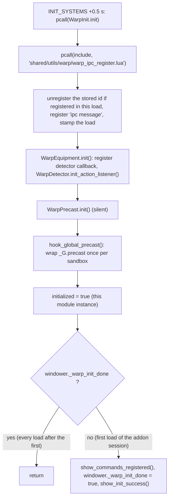
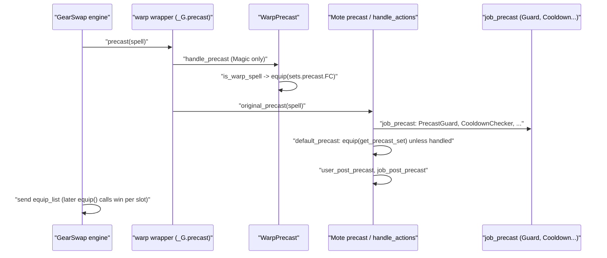
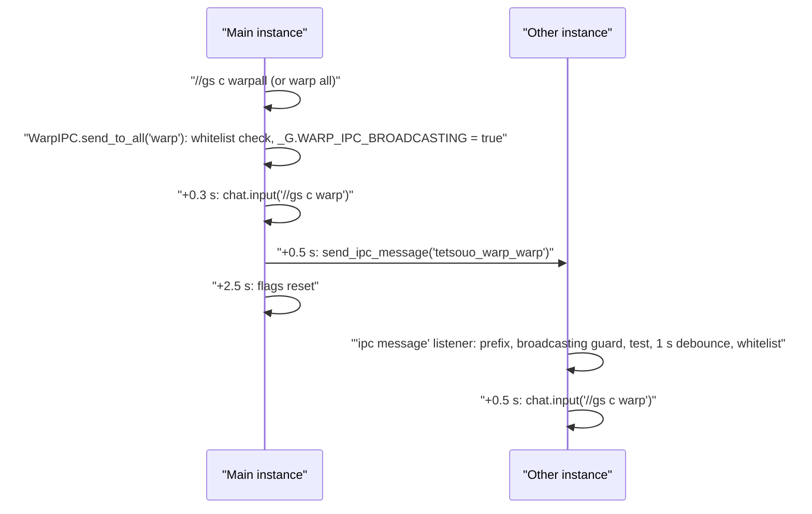

# Warp system and mount toggle

The warp system turns short `//gs c` words into a way home: it casts the BLM/WHM transport spell when the current job can, otherwise it equips a warp or teleport ring in `ring1`, waits for the ring to become usable, fires `/item`, and watches the cast until the character zones. The same words suffixed with `all` are broadcast over Windower IPC so every dual-boxed instance runs them. A third family (79 aliases for 39 destinations) names a destination and sends `/item` for an item from a built-in database. The system is loaded for every job 0.5 s after each file load by `INIT_SYSTEMS.lua`, and every command reaches it through `CommonCommands`. A `_G.precast` wrapper also puts `sets.precast.FC` on for every transport spell, whatever the job. The mount toggle (`//gs c mount`) is a small, independent module routed the same way; it is documented at the end.

Everything below was re-read on disk on 2026-09-28. Since the previous revision (2026-09-25) the warp code changed only in `warp_commands.lua` (`warp status` and `warp test` now print one InfoBlock) and in `message_warp.lua` (help rewritten through `HelpScreen`, init messages silent); every other warp file changed only its `@author` line. Commit hashes quoted here are those of the current history (rewritten 2026-09-27). Line numbers are given only where the line itself matters; otherwise the page names the function.

## Files

| Path | Lines | Role |
|---|---|---|
| `shared/utils/warp/warp_init.lua` | 132 | Bootstrap on every load: IPC listener, detector listener, precast hook; `windower._warp_init_done` once per addon session |
| `shared/utils/warp/warp_ipc_register.lua` | 101 | Script (not a module), `include`d on every load: the live `ipc message` listener (receiver side of `warp all`) |
| `shared/utils/warp/warp_ipc.lua` | 216 | `send_to_all()` (sender side); also an older listener that nothing registers |
| `shared/utils/warp/warp_command_registry.lua` | 87 | The 105 command aliases, the lookup set and `IPC_DEBOUNCE` |
| `shared/utils/warp/warp_commands.lua` | 357 | Command router: system subcommands, spell/ring fallback, destinations, broadcast |
| `shared/utils/warp/casting/spell_caster.lua` | 172 | Job/level gate and `/ma "<spell>" <me>` |
| `shared/utils/warp/casting/item_user.lua` | 736 | Ring sequence: readiness check, lock, equip, wait, use, post-use monitor, restore |
| `shared/utils/warp/casting/cast_helpers.lua` | 103 | `has_item()` over inventory + wardrobes, ring name to id table |
| `shared/utils/warp/warp_detector.lua` | 251 | Spell/item classification, `ActionListener` subscription (`warp_detector`) made on every load (inert, see Known issues) |
| `shared/utils/warp/warp_equipment.lua` | 207 | Module-flag lock/unlock of slots, fed by the detector and `warp lock` |
| `shared/utils/warp/warp_precast.lua` | 102 | Equips `sets.precast.FC` for transport spells (through the precast hook) |
| `shared/utils/warp/warp_item_database.lua` | 14 | Alias: `return require('shared/utils/warp/database/warp_database_core')` |
| `shared/utils/warp/database/warp_database_core.lua` | 303 | Destination keys, lazy module routing, lookups |
| `shared/utils/warp/database/warp_database_home.lua` | 142 | Home point items (5) |
| `shared/utils/warp/database/warp_database_teleports.lua` | 188 | Teleport crag rings (9) |
| `shared/utils/warp/database/warp_database_nations.lua` | 134 | Nation and Jeuno earrings (4) |
| `shared/utils/warp/database/warp_database_cities_chocobo_conquest.lua` | 97 | Outpost cities, expansion cities, stables, conquest (16) |
| `shared/utils/warp/database/warp_database_adoulin_special_mechanics.lua` | 109 | Adoulin frontier, special locations, Nexus Cape, Tidal Talisman (31) |
| `shared/utils/mount/mount_manager.lua` | 160 | `//gs c mount`: dismount or summon a random owned mount |
| `<Character>/saved/WARP_ITEMS_OWNED.lua` (live, gitignored) | 10 (Tetsouo) | Owned warp items written by `//gs c wo scan`; read by the wardrobe organizer only |

Not owned by this area but on the path: `shared/utils/core/COMMON_COMMANDS.lua` (routing, `debugwarp`, `mount`), `shared/utils/core/INIT_SYSTEMS.lua` (the deferred +0.5 s block that calls `WarpInit.init()`), `shared/utils/core/DEBUG_COMMANDS.lua` (`handle_debugwarp`), `shared/utils/messages/formatters/system/message_warp.lua` (711 lines, every warp message; templates in `shared/utils/messages/data/systems/warp_messages.lua`), `shared/utils/wardrobe/lib/warp_owned.lua` (writes and reads `WARP_ITEMS_OWNED.lua`), `shared/utils/debug/system_checker.lua` (`check_warp`).

The six database files were read in full; the alias, destination and item counts on this page were measured on 2026-09-28 by loading the registry and the database with `lua5.1` (see [For maintainers / AI](#for-maintainers--ai)).

## How it works

### Engine facts this page relies on

These come from the GearSwap engine (`D:\Windower Tetsouo\addons\GearSwap\`), see also [job-change-lifecycle.md](../architecture/job-change-lifecycle.md):

- `windower` inside project code is GearSwap's `user_windower` proxy, created once per addon load (`user_functions.lua:418-423`). `windower._x = v` therefore survives `gs reload` and job changes, and is reset only by `//lua reload gearswap`.
- `windower.register_event` from project code is `register_event_user` (`user_functions.lua:254-263`): the id is recorded in `registered_user_events` and the handler is wrapped in `equip_sets(func)`. `raw_register_event_user` (`:265`) records the id too but calls the handler bare. `load_user_files()` unregisters every recorded id on each file load (`refresh.lua:69-71`). Listeners never outlive the load that follows them.
- `windower.unregister_event` is `unregister_event_user` (`user_functions.lua:276-282`), which raises an error for a non-number id; the warp code wraps it in `pcall` where the id may be stale.
- `equip()` only fills `equip_list` (`user_functions.lua:127-129`); `equip_sets()` clears that list on entry (`flow.lua:60`) and sends it on exit. An `equip()` made from a bare `coroutine.schedule` callback is discarded by the next event.
- Slot locks (`disable_table`) are engine state. `gs disable <slot>` / `gs enable <slot>` go through `disenable()` (`gearswap.lua:205-208`); `command_enable()` re-sends the item an event tried to put in the slot while it was locked (`not_sent_out_equip`, `user_functions.lua:146-183`). A zone clears that pending table (`packet_parsing.lua:35`). The enable-all at `packet_parsing.lua:755-757` does not fire on an outgoing main-job change: `:744` has already set `player.main_job_id = newmain`, so the test at `:756` is false. It fires only for a 0x100 whose main-job byte is 0 (`res.jobs[0]` exists).
- For an action packet of category 7, 8 or 9 GearSwap reads the ability or item id from `act.targets[1].actions[1].param` (`helper_functions.lua:961-962`), not from `act.param`.
- Scheduled coroutines are never cancelled by a reload; a chain started in one sandbox keeps running against that sandbox's `_G`.

### Bootstrap

`INIT_SYSTEMS.lua` schedules a coroutine 0.5 s after each file load (the "DEFERRED SYSTEMS" block); its first step requires `warp_init` and calls `WarpInit.init()` under `pcall`. A load failure or an error in `init()` is reported through `show_module_load_failed('Warp System', ...)`.


```mermaid
flowchart TD
    A["INIT_SYSTEMS +0.5 s: pcall(WarpInit.init)"] --> B["pcall(include, 'shared/utils/warp/warp_ipc_register.lua')"]
    B --> C["unregister the stored id if registered in this load, register 'ipc message', stamp the load"]
    C --> F["WarpEquipment.init(): register detector callback, WarpDetector.init_action_listener()"]
    F --> G["WarpPrecast.init() (silent)"]
    G --> H["hook_global_precast(): wrap _G.precast once per sandbox"]
    H --> I["initialized = true (this module instance)"]
    I --> D{"windower._warp_init_done ?"}
    D -- "yes (every load after the first)" --> E["return"]
    D -- "no (first load of the addon session)" --> J["show_commands_registered(), windower._warp_init_done = true, show_init_success()"]
```

Consequences:

- The IPC listener, the detector's `ActionListener` subscription and the `_G.precast` wrapper are re-created on every load, which is required because the engine removes every sandbox listener at each load and the new sandbox's `precast` is Mote's own (`1e7cc50`). Only `windower._warp_init_done` is once per addon session, and the two messages it gates (`show_commands_registered`, `show_init_success`) are empty functions today (`message_warp.lua`, "Silent init"); so are `show_ipc_registered`, `show_equipment_initialized`, `show_precast_initialized` and `show_ipc_unavailable`. A successful init prints nothing.
- If `WarpEquipment` or `WarpPrecast` fails to load or init, `init()` prints `show_init_error` and returns before the precast hook: `initialized` stays false. A failed IPC include only calls the (silent) `show_ipc_unavailable` and init goes on.
- The wrap is guarded by `_G.WARP_PRECAST_HOOKED` (`hook_global_precast`, `warp_init.lua:38-41`): when a load is replaced within 0.5 s, the replaced load's deferred block runs `WarpInit.init()` in the new sandbox too (a `require` from a dead environment's callback loads into the current one), and a second wrap would handle every warp spell twice.
- `WarpInit.is_initialized()` is true once `init()` has completed in this module instance, i.e. from +0.5 s after the load. `system_checker.lua` `check_warp()` still reports "initialized (windower persistent)" from `windower._warp_init_done` before it asks `is_initialized()`, so after the first load it never looks at the current sandbox.
- Command handling does not depend on the bootstrap: `CommonCommands` requires `warp_commands` lazily on every warp command (`CommonCommands.handle_warp_commands`). Only the precast hook, the IPC receiver and the (inert) detector need it.

### The precast hook (Fast Cast on transport spells)

`hook_global_precast()` (`warp_init.lua`) saves the sandbox's `_G.precast` (Mote-Include's `precast(spell)`, `libs/Mote-Include.lua:294`, which calls `handle_actions(spell, 'precast')`) and replaces it with:

```lua
_G.precast = function(spell)
    if spell and spell.action_type == 'Magic' then
        require('shared/utils/warp/warp_precast').handle_precast(spell, nil)
    end
    if original_precast then original_precast(spell) end
end
```

`WarpPrecast.handle_precast(spell)` returns unless `spell.action_type == 'Magic'` and `WarpDetector.is_warp_spell(spell)` (exact name in `WARP_SPELLS`, 13 spells, else any name containing `warp`, `teleport`, `recall`, `retrace` or `escape`, case-insensitive). Then `force_fc(spell)` does `equip(sets.precast.FC)` and prints `show_force_fc` (the `force_fc` template, one chat line per transport spell); a missing `sets.precast.FC` prints `show_precast_fc_warning` instead.

Position in the precast lifecycle ([precast-pipeline.md](precast-pipeline.md)):


```mermaid
sequenceDiagram
    participant GS as "GearSwap engine"
    participant W as "warp wrapper (_G.precast)"
    participant WP as "WarpPrecast"
    participant M as "Mote precast / handle_actions"
    participant J as "job_precast (Guard, Cooldown...)"
    GS->>W: "precast(spell)"
    W->>WP: "handle_precast (Magic only)"
    WP->>WP: "is_warp_spell -> equip(sets.precast.FC)"
    W->>M: "original_precast(spell)"
    M->>J: "job_precast: PrecastGuard, CooldownChecker, ..."
    M->>M: "default_precast: equip(get_precast_set) unless handled"
    M->>M: "user_post_precast, job_post_precast"
    GS->>GS: "send equip_list (later equip() calls win per slot)"
```

- The wrapper runs **before** Mote, and so before `PrecastGuard` and `CooldownChecker`. Its `equip()` is queued even when the job then cancels the spell (silenced, on recast): GearSwap sends `equip_list` before `equip_sets_exit`, cancelled or not.
- Every later `equip()` in the same event (Mote's `default_precast`, the job's own precast gear, the cleanup wrappers) overrides the forced FC slot by slot. For a job whose precast set for the spell is itself built on `sets.precast.FC`, the wrapper changes nothing; it matters for slots Mote's selection leaves untouched.
- The wrapper passes only `spell` to Mote's `precast`; Mote's `precast(spell)` takes nothing else.

### Command routing

Every job's `job_self_command` calls `CommonCommands.is_common_command(command)` and then `CommonCommands.handle_command(command, JOB, table.unpack(args))` (for example `WAR_COMMANDS.lua` `job_self_command`). Inside `CommonCommands` (`COMMON_COMMANDS.lua`):

1. `is_common_command()` accepts the hand-written list (it contains `mount` and `debugwarp`), then any registry alias, then any word ending in `all` whose base is an alias (two loops over `WARP_COMMANDS`, the registry's `COMMANDS` read at `COMMON_COMMANDS.lua:25`).
2. `handle_command()` rebuilds `cmdParams = {command, args...}`, answers `sortie`, `alts` / `main` / `setalt` / `altreport` / `altmirror` / `altlead`, `rollshow`, `stealth`, `combatmode`, `keyconflicts` / `kc`, `th`, `dw`, `belt`, `tb` and `trace` first, then checks the warp aliases (and `<alias>all`) before every other common command. Alt commands are Mote's last lookup (`AltCommands.install_fallback`), so a warp alias always runs locally even when the dual-box alt config has a key of the same name (the generated BLM alt config `shared/data/alt/BLM_ALT_COMMANDS.lua` defines `warp`, `escape`, `retrace`; they are reachable only as `//gs c alt warp`).
3. `handle_warp_commands(cmdParams)` requires `warp_commands` and returns `WarpCommands.handle_command(cmdParams)`; when the module fails to load it prints the error and a module test (see Known issues for a stale path in that test).
4. `debugwarp` is routed to `CommonCommands.handle_debugwarp`, which is `DebugCommands.handle_debugwarp` (`DEBUG_COMMANDS.lua`, flag kept in `windower._gs_debug.WARP`); `mount` calls `handle_mount()`.

`WarpCommands.handle_command(cmdParams)` (`warp_commands.lua`):

```mermaid
flowchart TD
    S["handle_command(cmdParams)"] --> DB{"same text as last call within 0.5 s?"}
    DB -- yes --> R1["return true (swallowed)"]
    DB -- no --> W{"command == 'warp' and a subcommand?"}
    W -- "status/unlock/fix/lock/test/help/ipctest" --> SYS["warpcommands_handle_command_warp: handler, return true"]
    W -- "anything else (including 'all' and 'debug')" --> ALL
    W -- no --> ALL{"command ends in 'all' or subcommand == 'all'?"}
    ALL -- yes --> IPC["warpcommands_handle_command_all: WarpIPC.send_to_all(base)"]
    ALL -- no --> SP{"spell alias?"}
    SP -- yes --> CWF["cast_with_fallback(spell, rings)"]
    SP -- no --> DEST{"destination alias?"}
    DEST -- yes --> UWD["use_warp_destination(key, name)"]
    DEST -- no --> F["return false"]
    CWF --> SC{"SpellCaster.cast_spell: job and level OK?"}
    SC -- yes --> MA["windower.chat.input('/ma \"<spell>\" <me>'), return true"]
    SC -- no --> RING{"rings listed?"}
    RING -- yes --> UR["ItemUser.use_ring(rings, spell)"]
    RING -- no --> F2["return false (Retrace, Escape, Recalls)"]
```

Spell-first decision. `SpellCaster.cast_spell()` checks only that BLM (Warp 17, Warp II 40, Escape 29, Retrace 55) or WHM (Teleport-Holla/Dem/Mea 36, Yhoat/Altep 38, Vahzl 42, Recalls 53) is the main or sub job and that the relevant job level reaches the spell (`BLM_SPELLS` / `WHM_SPELLS`, `spell_caster.lua:24-42`, local `can_cast_spell`). It does not look at MP, recast, silence or whether the spell is learned; once it sends `/ma` it returns true and the ring fallback is skipped. On a refusal it prints why (`show_warp_requires_blm`, `show_warp_level_error`, `show_tele_requires_whm`, `show_tele_level_error`).

Ring fallback lists (the call sites in `handle_command`): `w`/`w2` -> `Warp Ring`; `tph` -> `Holla Ring`, `Dim. Ring (Holla)`; `tpd` -> `Dem Ring`, `Dim. Ring (Dem)`; `tpm` -> `Mea Ring`, `Dim. Ring (Mea)`; `tpa`, `tpy`, `tpv` -> `Altep Ring`, `Yhoat Ring`, `Vahzl Ring`. Ring ids come from `CastHelpers.RING_IDS` (`cast_helpers.lua:72-83`, all verified against `res/items.lua`).

Destination decision. `use_warp_destination()` takes `items[1]` of the destination (lowest `priority`), checks `get_mob_by_target('me').spawn_type` (a guard against a GearSwap `band()` error on a zone edge) and sends `input /item "<name>" <me>`. It does not check that the character owns the item, does not equip it and does not wait for its activation delay (see Known issues). `Instant Warp` and the other `home_point` items, the six `crag_*` keys and `romaeve` have no destination command.

### Ring sequence (`ItemUser`)

`use_ring(ring_names, context)` (`item_user.lua:57-103`) walks the list in order. For each ring that `CastHelpers.has_item()` finds in inventory or a wardrobe, `_check_ring_usable(id)` (`:140`) decodes its extdata (Windower `extdata` library, searched over `res.bags:equippable(true)`):

- `General` type: ready.
- `Enchanted Equipment`: not ready when `charges_remaining` is 0 (delay = time to `next_use_time + 18000`, or 600 when absent) or when `next_use_time + 18000 - os.time() > 0`; ready otherwise. The activation delay (`activation_time`) is not considered at this stage.
- Anything else, decode failure, missing `extdata`, not found: not ready with delay 0.

The first ready ring starts `_execute_ring_sequence()`. When none is ready, `_show_all_cooldowns()` (`:232`) prints one line per ring and the soonest one; when the list has no owned ring at all, `[WARP] No available rings found`.

```mermaid
sequenceDiagram
    participant C as "WarpCommands"
    participant U as "ItemUser"
    participant G as "GearSwap engine"
    participant F as "FFXI client"
    C->>U: "use_ring({'Warp Ring'})"
    U->>G: "gs disable ring1 (:298)"
    U->>F: "+0.5 s: input /equip ring1 \"Warp Ring\""
    U->>U: "+2.5 s: _wait_for_ring_usable"
    loop "check_usable"
        U->>U: "hard ceiling 90 s? extdata ok? item found? charges?"
        U->>U: "not ready: stretch deadline, sleep min(max(delay,1),5) s"
        U->>U: "ready: hold SAFETY_DELAY 3.5 s, wait for me.spawn_type"
    end
    U->>G: "use_now: ActionListener 'warp_autofix' + register 'zone change' (_setup_auto_fix)"
    U->>F: "input /item \"Warp Ring\" <me> (:405)"
    loop "check_cast_status every 0.5 s"
        U->>U: "status changed -> interrupted; elapsed >= cast_duration -> timeout"
    end
    F-->>U: "zone change -> cleanup 'success'"
    U->>G: "gs enable ring1 (:647)"
```

Patience windows (all in `item_user.lua`):

| Constant / delay | Value | Line | Meaning |
|---|---|---|---|
| equip delay | 0.5 s | 301-303 | `/equip ring1` after `gs disable ring1` |
| first check | 2.5 s | 305-307 | `_wait_for_ring_usable` starts; `started = os.time()` (`:415`) |
| `WAIT_FLOOR` | 15 s | 121 | initial deadline, `started + 15` (`:416`) |
| `WAIT_GRACE` | 5 s | 123 | added to the delay the item reports |
| `WAIT_CEILING` | 60 s | 122 | the deadline never moves past `started + 60` |
| `WAIT_HARD_CEILING` | 90 s | 128 | tested first in every `check_usable`, covers the self-rescheduling paths (`:421`) |
| `SAFETY_DELAY` | 3.5 s | 110 | hold after the first "ready" reading (re-check every 0.5 s) |
| mob record retry | 1.0 s | 479-485 | `/item` is not sent while `me.spawn_type` is nil |
| `POLL_INTERVAL` / `MAX_POLL_SLEEP` | 1.0 / 5.0 s | 130-131 | sleep = `min(max(remaining, 1), 5)` (`:515`) |
| `EXTDATA_TIME_OFFSET` | 18000 s | 107 | added to extdata timestamps before comparing with `os.time()`; the comment says only that the MyHome addon uses the same +18000 |
| `cast_duration` | `cast_time + cast_delay + 5` (fallback 8+0+5) | 402 | post-use monitoring window from the database (`use_now`); Warp Ring 21 s, Holla Ring 43 s |

Deadline rule on each not-ready check (`:492-515`): `wanted = now + max(recast, activation) + 3.5 + 5`; if `wanted > deadline` then `deadline = min(wanted, started + 60)`; if `now >= deadline` the wait reports why (`report_timeout`, `:373`) and gives up. The deadline only grows. The announce line "Waiting... Ns" is printed once, when the activation delay exceeds 1 s (`:505`).

Every failure exit of the wait goes through `abandon_wait()` (`:315`): `gs enable ring1`, then 1 s later `restore_equipment()`. Upper bound on the lock: about 90 s of waiting plus one sleep (at most 5 s), or, after use, `1 + cast_duration` seconds of monitoring. Both are bounded as long as no Lua error ends a coroutine early.

Post-use monitor (`_setup_auto_fix`, `:563-736`):

- `drop_stale_autofix_listeners()` (`:545-554`) removes the `warp_autofix` subscription (`ActionListener.off`) and unregisters the zone id parked on `windower._warp_autofix_zone_id` by a previous sequence of the same load (`windower._warp_autofix_load == windower._gs_reload_count`); an id from an earlier load is only forgotten, since the engine already freed it.
- `ActionListener` key `warp_autofix` (`:679-688`, see [core-lifecycle.md](core-lifecycle.md#actionlistener)): the player's own category 1 packet (a melee round) -> `cleanup_and_restore('interrupted')`.
- `zone change` listener (`:692-695`, plain `register_event`) -> `cleanup_and_restore('success')`.
- `check_cast_status` (`:706-733`), first run 1 s after setup, then every 0.5 s: `player.status` differs from the status at setup -> `interrupted`; `elapsed >= cast_duration` -> `timeout`. `elapsed` counts 0.5 per run starting at the 1 s mark, so it trails the real time by 0.5 s. The `if not player` branch is marked "defensive only" in the code (`player` is GearSwap's table, never nil).
- `cleanup_and_restore(reason)` (`:623-677`) runs once (`cleanup_done`). When it runs in the load that registered the listeners, it removes the `warp_autofix` subscription, unregisters the zone listener and clears `windower._warp_autofix_zone_id`; after a reload (only the timeout path can still fire) it leaves them alone. Then it sends `gs enable ring1`. `success` stops there. `interrupted` and `timeout` print two lines and, 1 s later, call `restore_equipment()` then `verify_ring_restored()` (`:581-620`: first check after 1.5 s, up to 4 checks 1.5 s apart, success when `player.equipment.ring1` is neither empty nor the warp item).

`restore_equipment()` (`:39-51`) writes a `WARP` trace line (`restore: gs c update (ring1 now ...)`, only while `//gs c trace` is on) and sends `gs c update` (since `32b1dc6`): every call site runs inside a `coroutine.schedule` callback, where a direct `equip()` would be dropped, while `gs c update` goes through a real event (Mote's `handle_update`). The engine also helps: `gs enable ring1` re-sends the ring an event (typically the item's aftercast) tried to equip while the slot was locked. `//gs c warp fix` (`command_fix`) is the manual path: `enable('ring1')`, `gs enable ring1`, then `gs equip sets.engaged|sets.idle` 1 s later.

A movement interruption of the item is not seen by either listener (the item-interrupt packet is category 9, param 28787, and the status stays `Idle`); it ends as `timeout` after `cast_duration`.

### Automatic detection (inert)

The design: `WarpDetector`'s action subscription (`init_action_listener`, `warp_detector.lua:167-193`; `ActionListener` key `warp_detector`, one raw listener for every module, so it does not cost a GearSwap event cycle per action) recognises the player's warp item use (category 9, id looked up in the database) and calls every callback in `_G.warp_detector_callbacks` with `('item', warp_data)`; `WarpEquipment` registers one that calls `on_warp_item`, which calls `lock('item', duration, tag, slot)` (`warp_equipment.lua:135-157`): `disable()` the slot and schedule `unlock(true)` after `duration + 3` s.

In the code on disk the item lock never engages: `init_action_listener()` calls `clear_callbacks()` first, which drops the callback `WarpEquipment.init()` registered just before, and the listener reads the item id from `act.param` instead of `act.targets[1].actions[1].param`. The comment in `WarpEquipment.init()` says so and warns against just swapping the two calls (database slots such as `ears` and `item` are not GearSwap slot names, and the ring commands already lock `ring1` themselves). The listener itself is registered on every load. The only live path into `WarpEquipment.lock()` is `//gs c warp lock` (all slots, `lock('manual', 10)`, released after 13 s).

### Broadcast (`warp all`)


```mermaid
sequenceDiagram
    participant M as "Main instance"
    participant A as "Other instance"
    M->>M: "//gs c warpall (or warp all)"
    M->>M: "WarpIPC.send_to_all('warp'): whitelist check, _G.WARP_IPC_BROADCASTING = true"
    M->>M: "+0.3 s: chat.input('//gs c warp')"
    M->>A: "+0.5 s: send_ipc_message('tetsouo_warp_warp')"
    M->>M: "+2.5 s: flags reset"
    A->>A: "'ipc message' listener: prefix, broadcasting guard, test, 1 s debounce, whitelist"
    A->>A: "+0.5 s: chat.input('//gs c warp')"
```

- Base command: `<alias>all` strips the suffix; `<alias> all` uses the alias (`warpcommands_handle_command_all`).
- Whitelist: sender `ALLOWED_COMMANDS = Registry.COMMANDS` (`warp_ipc.lua:47`, linear scan in `is_command_allowed`); receiver `Registry.is_warp_command()` (O(1) set, `warp_ipc_register.lua` `is_command_allowed`). System subcommands (`status`, `fix`...) are never broadcast: `warp status all` sends `warp`.
- Test: `//gs c warp ipctest` sends `tetsouo_warp_test_<name>`; receivers print it (`show_ipc_test_received`). The sender does not print its own echo (receivers only).
- The receiver drops every `tetsouo_warp_` message while its own `_G.WARP_IPC_BROADCASTING` is true, i.e. for 2.5 s after it broadcast.
- `IPC_DEBOUNCE = 1.0` (`warp_command_registry.lua:85`), compared with `os.clock()`.
- The receiver runs a plain alias, never the `all` form, so broadcasts do not cascade.

### Mount toggle

`//gs c mount` -> `CommonCommands.handle_mount()` (`COMMON_COMMANDS.lua:123-132`) -> `MountManager.toggle()` (`mount_manager.lua:152-158`):

- Mounted when `player.status` is `Mount` or `Chocobo` (`res/statuses.lua` ids 85 and 5) or `buffactive['Mounted']` (`is_mounted`, `:50`) -> `input /dismount`.
- Otherwise a random owned mount (`math.random`, seeded with `os.time()` at module load, `:41-42`) -> `input /mount "<name>"`. Ownership (`get_owned_mounts`, `:105`): `windower.ffxi.get_abilities().mounts` (list of ids or id-keyed map, `owned_from_api`, `:65`), else the bitfield of the last incoming 0x0AE packet, bit `id` at byte `floor(id/8) + 5` (`owned_from_packet`, `:86`; the packet layout is `data[7]` at offset 4 in `libs/packets/fields.lua:3486-3488`), else `Chocobo` (`FALLBACK_MOUNT`).
- Zone and combat restrictions are left to the server (the `toggle()` doc comment).

## Public API

None of the warp modules exports a function to `_G`; every caller `require`s them. The `_G` names they own are state, listed under [State & lifetime](#state--lifetime).

`WarpCommands` (`warp_commands.lua`)

| Function | Line | Notes |
|---|---|---|
| `handle_command(cmdParams)` | 231 | `cmdParams = {command, subcommand, ...}`. Router above. Returns true when handled (or debounced), false otherwise. Caller: `CommonCommands.handle_warp_commands` |

Local helpers (not exported): `command_status` (34), `command_unlock` (61), `command_fix` (73), `command_lock` (87), `command_test` (99), `command_debugwarp` (108, unreachable), `command_help` (113), `cast_with_fallback(spell_name, ring_names)` (125), `use_warp_destination(destination_key, destination_name)` (162), `warpcommands_handle_command_warp(subcommand)` (194), `warpcommands_handle_command_all(command)` (217).

`ItemUser` (`casting/item_user.lua`). The underscore functions are module fields only so they can call each other; nothing outside the file calls them.

| Function | Line | Notes |
|---|---|---|
| `use_ring(ring_names, context)` | 57 | `ring_names` string or list; `context` (the spell name) is only forwarded to `_show_all_cooldowns`, which ignores it. Returns true once a sequence started. Caller: `cast_with_fallback` |
| `_check_ring_usable(item_id)` | 140 | `usable, delay_s, status` with status `ready`, `cooldown`, `not_found`, `decode_failed`, `unknown_type`, `extdata_missing` |
| `_show_all_cooldowns(info, context)` | 232 | Chat report when no ring is ready |
| `_execute_ring_sequence(name, id, is_warp, tag)` | 289 | Save `ring1`, `gs disable ring1`, `/equip`, schedule the wait |
| `_wait_for_ring_usable(name, id, is_warp, tag, initial_ring1)` | 414 | The patience loop; `initial_ring1` is forwarded, unused |
| `_setup_auto_fix(id, tag, cast_duration, initial_ring1, item_name)` | 562 | Post-use listeners and monitor; `initial_ring1` is unused |

Local helpers: `restore_equipment` (39), `abandon_wait` (315), `find_equippable_item` (332), `usability` (355), `report_timeout` (373), `use_now` (389), `get_action_name` (521), `drop_stale_autofix_listeners` (545).

`SpellCaster` (`casting/spell_caster.lua`)

| Function | Line | Notes |
|---|---|---|
| `cast_spell(spell_name)` | 99 | Gate, message, `/ma "<spell>" <me>`, true; false with a message otherwise. Caller: `cast_with_fallback` |
| `can_cast(spell_name)` | 146 | Gate only. No caller |

`CastHelpers` (`casting/cast_helpers.lua`): `has_item(item_name, item_id)` (24; inventory and wardrobes 1-8 by name key, match by id or by `res.items[id].en`, case-insensitive; caller `use_ring`), `RING_IDS` (72), `get_ring_id(name)` (88; caller `use_ring`).

`WarpIPC` (`warp_ipc.lua`)

| Function | Line | Notes |
|---|---|---|
| `send_to_all(command)` | 154 | Whitelist, flags, local run +0.3 s, IPC +0.5 s, reset +2.5 s. Returns false when not whitelisted. Caller: `warpcommands_handle_command_all` |
| `init()` | 134 | Registers `handle_ipc_message` on `windower._warp_ipc_event_id`. No caller (the live listener is `warp_ipc_register.lua`) |
| `is_initialized()` | 206 | True when `send_ipc_message` and `register_event` exist. No caller |

`warp_ipc_register.lua` is a script, not a module: it returns nothing and exposes nothing; `include`-ing it registers the listener.

`WarpInit` (`warp_init.lua`)

| Function | Line | Notes |
|---|---|---|
| `init()` | 65 | Bootstrap above. Caller: the deferred block of `INIT_SYSTEMS.lua`, every load |
| `is_initialized()` | 121 | Per sandbox. Callers: `command_status`, `system_checker.lua` `check_warp` |

`WarpDetector` (`warp_detector.lua`)

| Function | Line | Notes |
|---|---|---|
| `is_warp_spell(spell)` | 69 | `bool, data` (`{duration, type}`). Callers: `WarpPrecast.force_fc`, `handle_precast` |
| `has_blm()`, `has_whm()` | 92, 103 | No caller |
| `is_warp_item(item_id)` | 116 | `bool, data` from `WarpItemDB.get_item_by_id`; `duration = cast_time + cast_delay`. Caller: its own listener |
| `register_callback(fn)` | 152 | Appends to `_G.warp_detector_callbacks`. Caller: `WarpEquipment.init` |
| `clear_callbacks()` | 157 | Caller: `init_action_listener` |
| `init_action_listener()` | 167 | Clears the callbacks, then subscribes to `ActionListener` under `warp_detector` (subscribing again replaces). Caller: `WarpEquipment.init` |
| `get_warp_spells()` | 207 | 13 names. Caller: `command_test` |
| `get_warp_items()` | 219 | Unique database ids, walked per destination (65). Caller: `command_test` |
| `get_items_by_destination(key)`, `ItemDB` | 229, 241 | No caller |
| `get_all_destinations()` | 244 | No caller; would raise (the database has no such function; the comment says so) |

`WarpEquipment` (`warp_equipment.lua`)

| Function | Line | Notes |
|---|---|---|
| `lock(warp_type, duration, tag, slot)` | 36 | `disable(slot)` or all 16 slots, flag, auto-unlock after `(duration or 15) + 3` s. Caller: `command_lock`, `on_warp_item` |
| `unlock(is_timeout, tag)` | 78 | No-op unless the flag is set; `enable`, message, `gs c update` after 0.5 s. Callers: the auto-unlock, `force_unlock` |
| `on_warp_item(warp_data)` | 135 | `ring` -> `ring1`, tag `TELE` for teleport names, `lock('item', ...)`. Caller: the detector callback (never fires) |
| `init()` | 164 | Callback + `init_action_listener()`. Caller: `WarpInit.init` |
| `is_locked()`, `get_warp_type()` | 191, 197 | Callers: `command_status`, `command_unlock`, `command_lock` |
| `force_unlock(tag)` | 203 | `unlock(false, tag)`. Caller: `command_unlock` |

`WarpPrecast` (`warp_precast.lua`): `force_fc(spell)` (25), `handle_precast(spell, eventArgs)` (56; caller the `_G.precast` wrapper; `eventArgs` unused), `init()` (98, silent message; caller `WarpInit.init`).

`WarpDatabase` (`database/warp_database_core.lua`, also reached as `warp_item_database`)

| Function | Line | Notes |
|---|---|---|
| `DESTINATIONS` | 21 | 47 constant keys (`SAN_DORIA = 'san_doria'`, ...) |
| `get_items_by_destination(key)` | 177 | `{ {item_id, data}, ... }` sorted by `priority`; loads the one module `MODULE_ROUTING` names. Callers: `use_warp_destination`, `WarpDetector.get_warp_items` |
| `get_item_by_id(id)` | 195 | `data, destination`; searches cached modules first, then loads the rest. Callers: `use_now` (`item_user.lua`), `WarpDetector.is_warp_item` |
| `get_all_item_names()` | 230 | 65 names. Callers: `wardrobe/lib/items.lua` `add_always_kept`, `wardrobe/lib/reports.lua`, `wardrobe/lib/warp_owned.lua` `scan` |
| `count_total_items()` | 251 | 65 today. Callers: `command_status`, `command_test` |

Each database module (`HomeDB`, `TeleportsDB`, `NationsDB`, `CitiesDB`, `CombinedDB`) exposes `get_items(key)`, `get_item_by_id(id)` and `count_items()`, called only by the core.

`Registry` (`warp_command_registry.lua`): `COMMANDS` (24, 105 aliases), `SET` (lookup set built from it), `is_warp_command(cmd)` (75; caller `warp_ipc_register.lua`), `IPC_DEBOUNCE` (85; read by both IPC sides). `COMMANDS` is read by `COMMON_COMMANDS.lua:25` and `warp_ipc.lua:47`.

`MountManager` (`mount/mount_manager.lua`): `is_mounted()` (50), `get_owned_mounts()` (105), `pick_random_mount()` (125), `dismount()` (132), `mount()` (139), `toggle()` (152). Only `toggle()` is called from outside (`CommonCommands.handle_mount`).

## Commands

| Command | Handler | Effect |
|---|---|---|
| `w`, `warp` | `handle_command` | Warp (BLM) else Warp Ring |
| `w2`, `warp2` | same | Warp II (cast on `<me>`) else Warp Ring |
| `ret`, `retrace` / `esc`, `escape` | same | Spell only |
| `tph tpholla`, `tpd tpdem`, `tpm tpmea`, `tpa tpaltep`, `tpy tpyhoat`, `tpv tpvahzl` | same | Teleport spell else ring list |
| `rj recjugner`, `rp recpashh`, `rm recmeriph` | same | Recall spell only |
| 79 destination aliases, 39 destinations (see Configuration) | same | `/item "<first database item>" <me>` |
| `<alias>all`, `<alias> all` | `warpcommands_handle_command_all` | Run locally (+0.3 s) and broadcast (+0.5 s) |
| `warp status` | `command_status` | InfoBlock `WARP`: Initialized (this sandbox), Equipment locked (`WarpEquipment` flag only), current warp type, can cast warp spells (BLM/WHM main or sub), database items |
| `warp unlock` | `command_unlock` | `WarpEquipment.force_unlock()` if its module flag is set; does not see the `ring1` lock of a ring sequence |
| `warp fix` | `command_fix` | Release `ring1` and re-equip `sets.engaged` or `sets.idle` |
| `warp lock` | `command_lock` | Lock all slots, released after 13 s (`lock('manual', 10)` + 3) |
| `warp test` | `command_test` | InfoBlock `WARP :: Detection test`: warp spells (13), database item ids (65), database total (65) |
| `warp help` | `command_help` -> `MessageWarp.show_help()` | `HelpScreen`: system, BLM, WHM, destination codes and the `all` form |
| `warp ipctest` | `warpcommands_handle_command_warp` | IPC round-trip test |
| `warp <anything else>` | falls through to the spell aliases | Casts Warp / uses Warp Ring |
| `debugwarp` | `DebugCommands.handle_debugwarp` (`DEBUG_COMMANDS.lua`) | Toggle `_G.WARP_DEBUG`, persisted in `windower._gs_debug.WARP` (the copy `command_debugwarp` in `warp_commands.lua` is unreachable) |
| `mount` | `CommonCommands.handle_mount` -> `MountManager.toggle` | Dismount or random mount |
| `wo scan` / `wo scanwarp` | `CommonCommands.handle_wardrobeorganize` -> `WardrobeOrganizer.scan_warp_items` | Writes `WARP_ITEMS_OWNED.lua` (wardrobe organizer) |

A repeat of the exact same command text within 0.5 s is swallowed (`DEBOUNCE_THRESHOLD`, `warp_commands.lua:28`). No keybind file in `_master/config`, `Tetsouo/config`, `Kaories/config` or `shared/config` sends a warp or mount command.

## Configuration

There is no per-character warp configuration. All tuning is constants:

- `item_user.lua:105-131` (table above).
- `warp_commands.lua:28` `DEBOUNCE_THRESHOLD = 0.5`.
- `warp_command_registry.lua:85` `IPC_DEBOUNCE = 1.0`; prefix `tetsouo_warp_` duplicated in `warp_ipc.lua:30` and `warp_ipc_register.lua` (`IPC_PREFIX`), and written literally in `warp_commands.lua` (`ipctest`).
- `WarpEquipment.lock()` auto-unlock after `duration + 3` s (duration default 15).
- `spell_caster.lua:24-42` spell levels; `warp_detector.lua:41-59` (`WARP_SPELLS`) spell names and durations, `:32-38` name patterns; `cast_helpers.lua:72-83` ring ids.
- `mount_manager.lua:28-39` fallback mount, packet id and offset, mounted statuses.

`WARP_ITEMS_OWNED.lua` (`data/<char>/_common/`) is written by `WarpOwned.save()` (`wardrobe/lib/warp_owned.lua:98`) and read by `WarpOwned.load()` (`:39`) for the wardrobe organizer's keep list. The warp system itself never reads it. Live today: Tetsouo `Delegate's Garb`, `Dim. Ring (Holla)`, `Instant Warp`, `Nexus Cape`, `Warp Ring`; Kaories `Dim. Ring (Holla)`, `Nexus Cape`, `Warp Ring`.

Destination database (first entry is what the command uses; `act` is the database `cast_delay`; the code only adds it to the post-use window, `use_now` in `item_user.lua`, while the wait reads the activation delay from extdata):

| Alias | Key | Items in priority order |
|---|---|---|
| (none) | `home_point` | Warp Ring (28540, ring, act 8), Instant Warp (4181, item), Treat Staff II (17588, main), Warp Cudgel (17040, main, act 3), Treat Staff (17566, main) |
| (ring lists only) | `crag_holla` / `crag_dem` / `crag_mea` | Holla/Dem/Mea Ring (act 30), then Dim. Ring (act 8) |
| (ring lists only) | `crag_vahzl` / `crag_yhoat` / `crag_altep` | Vahzl/Yhoat/Altep Ring |
| `sd` `bt` `wd` `jn` | nations, `jeuno` | Kingdom / Republic / Federation / Duchy Earring (ears) |
| `sb` `mh` `rb` `kz` `ng` | outpost cities | Selbina / Mhaura / Rabao / Kazham / Norg Earring |
| `tv` | `tavnazia` | Tavnazian Ring, Safehold Earring |
| `au` `wg`, `ns`, `ad` | `aht_urhgan`, `nashmau`, `adoulin` | Empire Earring, Nashmau Earring, Delegate's Garb (body) |
| `stsd` `stbt` `stwd` `stjn` | stables | Kgd. Stable Collar, Rep. Stable Medal, Fed. Stable Scarf (neck), Bl. Chocobo Cap (head) |
| `op` | `outpost` | Homing Ring, Return Ring |
| `cz` `ys` `hn` `mm` `mj` `yc` `km` | Adoulin frontier | Ceizak ... Kamihr Ring |
| `wj` `ar` | `wajaom`, `arrapago` | Olduum Ring, Arrapago Ring |
| `pg` | `purgonorgo` | 8 race-specific bodies, Custom Gilet +1 first |
| `rl` | `rulude` | Maat's Cap, Stars Cap, Laurel Crown |
| `zv` `riv` `yo` `lf` `bh` | special | Shadow Lord Shirt, Wyrmking Suit +1, Mandra. Suit +1, Leafkin Cap +1, Behemoth Suit +1 |
| `cc` `pt` `cg` | special | Chocobo Blinkers, Warp Ring +1, Ch. Shirt +1 (none of these names exists in `res/items.lua`) |
| (none) | `romaeve` | Ra'Kaznar Turban (name not in `res/items.lua`) |
| `ld`, `td` | `party_leader`, `tidal` | Nexus Cape (back), Tidal Talisman |

Each alias also has a long form (`sandoria`, `whitegate`, `stable-sd`, `chocircuit`...): `Registry.COMMANDS` is the full list. Database `slot` values are `ring`, `ears`, `neck`, `head`, `body`, `back`, `main`, `item`, not GearSwap slot names.

## State & lifetime

`windower.*` fields (survive `gs reload` and job changes, reset by `//lua reload gearswap`):

| Field | Written | Purpose |
|---|---|---|
| `_warp_init_done` | `WarpInit.init` | Gates the (silent) init messages; also read by `system_checker.lua` `check_warp` |
| `_warp_ipc_register_event_id`, `_warp_ipc_register_event_load` | `warp_ipc_register.lua` (top of the script and after the `register_event`) | Id of the live IPC listener and the load (`windower._gs_reload_count`) that registered it |
| `_warp_ipc_event_id` | `WarpIPC.init()` | Never written: `WarpIPC.init()` has no caller |
| `_warp_autofix_zone_id`, `_warp_autofix_load` | `drop_stale_autofix_listeners`, `cleanup_and_restore`, `_setup_auto_fix` in `item_user.lua` | Id of the post-use `zone change` listener and its load |
| `_gs_debug.WARP` | `DebugCommands.handle_debugwarp` (`flip_debug`) | Persistent copy of `_G.WARP_DEBUG` |

Because the engine unregisters sandbox listeners on every load, a persisted id is already dead when the next load reads it, and Windower may have given the number to another listener since. Each id is therefore stored with `windower._gs_reload_count` (bumped by `INIT_SYSTEMS.lua:44` on every load) and unregistered only when that stamp equals the current count: a second registration in the same load (a stale sandbox's deferred init after a load within 0.5 s, or a second ring sequence) replaces its own listener, and nothing else is touched.

`_G` globals (per sandbox, reset on every load): `WARP_DEBUG` (read across the warp modules, toggled by `debugwarp`; restored from `windower._gs_debug.WARP` by `INIT_SYSTEMS.lua:38`, so it survives a job change; `item_user.lua:24` defaults it to false), `WARP_IPC_BROADCASTING` (written by `send_to_all`, read by the IPC listener), `warp_detector_callbacks` (`warp_detector.lua` `register_callback` / `clear_callbacks` / the listener), `precast` (replaced in every sandbox by `hook_global_precast`), `WARP_PRECAST_HOOKED` (one wrap per sandbox). `shared/utils/debug/global_probe.lua` lists these names as known globals. Module-local state: `WarpEquipment` lock flags, `WarpCommands` debounce, IPC debounce (each side), `WarpIPC.initiated_broadcast`, `WarpDatabase._cached_modules`, `WarpInit.initialized` / `original_precast`.

Registered events:

| Event | Where | Lifetime |
|---|---|---|
| `ipc message` | `warp_ipc_register.lua` | Re-registered 0.5 s after every load |
| `ActionListener` key `warp_detector` | `warp_detector.lua` `init_action_listener` | Subscribed again 0.5 s after every load |
| `ActionListener` key `warp_autofix`, `zone change` (post-use) | `item_user.lua:680, 692` | One ring use; removed by `cleanup_and_restore`, by the next sequence, or with the load |

The IPC and post-use `zone change` listeners run through GearSwap's `equip_sets` wrapper. Both action subscriptions go through `ActionListener`'s one `raw_register_event('incoming chunk')`, so an action packet costs no GearSwap event cycle; the engine still records that id in `registered_user_events`, so it is removed at the next load like the others.

Coroutines (none can be cancelled): the deferred bootstrap (`INIT_SYSTEMS.lua`), the ring chain (`item_user.lua:301-307` and the `check_usable` reschedules), the post-use monitor and verify chains, `abandon_wait`'s restore, `WarpEquipment`'s auto-unlock (`lock()`; `lock_timer = nil` does not cancel it) and its 0.5 s `gs c update` in `unlock()`, the IPC timers (`send_to_all`, the receiver's 0.5 s delay), `warp fix`'s 1 s equip.

Lifecycle:

- `gs reload`, subjob change, main job change: a running ring chain keeps running in the old sandbox and still ends with `gs enable ring1`; its post-use listeners are removed by the engine, so it can only finish through the status test or the timeout. A main job change does not re-enable slots at the engine level (see Engine facts). `WarpEquipment`'s flag resets to false while a pending auto-unlock from the old sandbox still fires.
- Zone: the post-use zone listener ends the sequence as `success`. The engine clears pending slot items on zone, so `gs enable ring1` after a zone re-sends nothing.
- Death: no special handling; the chains run to their bounds.

## Interactions

- Routing, `debugwarp`, `mount`, load-failure diagnostics: [commands-and-debug.md](commands-and-debug.md).
- Deferred bootstrap, require cache per sandbox, stale coroutines: [core-lifecycle.md](core-lifecycle.md), [job-change-lifecycle.md](../architecture/job-change-lifecycle.md).
- Every message: `message_warp.lua`, see [messages.md](messages.md) and [messages-formatters.md](messages-formatters.md). `warp status` / `warp test` go through `InfoBlock`, `warp help` through `HelpScreen`.
- The `_G.precast` wrapper runs before Mote's precast and therefore before the job's PrecastGuard/CooldownChecker pipeline: [precast-pipeline.md](precast-pipeline.md).
- Dual-box: the warp broadcast is independent from `dualbox_sync_ipc` and the alt-command system ([dualbox.md](dualbox.md)); alt config keys named like a warp alias are shadowed.
- Wardrobe organizer: keeps warp items out of non-equippable overflow using `get_all_item_names()` or `WARP_ITEMS_OWNED.lua`; the ring path searches only equippable bags (`find_equippable_item` in `item_user.lua`, `EQUIPPABLE_BAGS` in `CastHelpers.has_item`).
- Trace log: `restore_equipment` writes one `WARP` line per restore while `//gs c trace on` ([commands-and-debug.md](commands-and-debug.md)); nothing else in the warp code traces.
- Other systems that lock `ring1`: DoomManager (`doom_manager.lua` `handle_buff_change`, neck/ring1/ring2/waist), craft mode (`craft_commands.lua` `lock_after_delay`, all slots). The ring sequence does not record a pre-existing lock and always ends with `gs enable ring1`.
- `BRD_COMMANDS.lua` has a `forceidle` command ("re-equip idle ring1"); nothing in the warp code sends it.

## Invariants & gotchas

- Every exit of the ring wait must release `ring1`: all go through `abandon_wait()` or `cleanup_and_restore()`. A Lua error inside a scheduled step ends the chain without releasing it; `//gs c warp fix` is the recovery.
- The readiness check before equipping ignores the activation delay; only the wait loop reads it. A second `//gs c warp` issued during the wait therefore sees the ring as ready.
- The wait searches all equippable bags for the ring id and does not check that the ring is actually in `ring1`; if `/equip` failed, the ring can read as ready and `/item` is sent anyway, ending as `timeout`.
- Restoring gear from a scheduled callback needs a command (`gs c update`, `gs equip <set>`, `gs enable <slot>`), not `equip()` or a direct call to a Mote hook.
- `gs disable ring1` and `/equip ring1` bypass GearSwap's set logic; the equip is the client's native command.
- A warp alias always wins over a Mote command, a job command checked after `is_common_command`, and an alt-config key of the same name. Before adding a job or alt command, check `warp_command_registry.lua` and the `all` suffix rule (any registered alias + `all`).
- `warp <unknown subcommand>` casts Warp; only the seven listed subcommands stop the dispatch.
- `WarpEquipment.on_warp_item()` would pass database slot names such as `ears` and `item` to `disable()`, which rejects them (`statics.lua:148-163` has `ear1`/`ear2`, no `ears`).
- The precast wrapper's Fast Cast set is queued before PrecastGuard can cancel the spell, and is overridden slot by slot by anything equipped later in the same event.

## Extending

Add a warp alias: append it to `Registry.COMMANDS` (`warp_command_registry.lua`; this makes it a common command, an IPC whitelist entry on both sides and an `<alias>all` broadcast), then add its branch in `WarpCommands.handle_command()`. The registry header's steps (alias, branch in `handle_command`, database entry) are correct. Update the `HELP` table in `message_warp.lua` if it should be listed.

Add a destination item: add an entry to the relevant `ITEMS` table with `name` exactly as `res/items.lua` spells it, the matching id, `slot`, `priority`, `max_charges`, `recast_delay`, `level`, `cast_time`, `cast_delay`; a new destination key also needs `DESTINATIONS` and `MODULE_ROUTING` entries in `warp_database_core.lua`, a registry alias and a `handle_command` branch.

Add a ring to a spell fallback: add its id to `CastHelpers.RING_IDS` and its name to the list at the call site in `handle_command()`; it must also exist in the database, because `use_now()` reads `cast_time`/`cast_delay` from there (otherwise the 8 + 0 + 5 s fallback window applies).

## For maintainers / AI

### Invariants to keep

| Invariant | Where it is enforced | What breaks if lost |
|---|---|---|
| `ring1` is released on every exit of a ring sequence | `abandon_wait`, `cleanup_and_restore`, `WAIT_HARD_CEILING` | Ring slot stays disabled across reloads and job changes (engine state) |
| Listener ids are unregistered only when stamped with the current `windower._gs_reload_count` | `warp_ipc_register.lua`, `init_action_listener`, `drop_stale_autofix_listeners` | Unregistering a recycled id kills another system's listener |
| One `_G.precast` wrap per sandbox | `_G.WARP_PRECAST_HOOKED` | Warp spells handled twice |
| Hook and listeners set up on every load, not once per session | `WarpInit.init` (only `_warp_init_done` is per session) | Warp spells lose Fast Cast after the first job change (`1e7cc50`) |
| System subcommands return true | `warpcommands_handle_command_warp` | `warp status` prints the status and then casts Warp |
| `Registry.COMMANDS` is the single alias list | `COMMON_COMMANDS.lua`, both IPC sides | A command handled locally but refused over IPC, or the reverse |
| Gear restored from coroutines goes through a command | `restore_equipment`, `WarpEquipment.unlock`, `command_fix` | `equip()` silently dropped |
| The sender ignores warp IPC for 2.5 s after broadcasting | `_G.WARP_IPC_BROADCASTING` | Echo cascades between boxes |

### Traps

- `rg` skips the gitignored live folders; check callers with `grep -rn` over `shared _master Tetsouo Kaories` before calling a function dead.
- A new common command word ending in `all` whose base is a warp alias (`sdall`, `tvall`, `opall`...) is taken by the warp broadcast.
- Do not "activate" the detector by swapping `register_callback` and `init_action_listener`: the item id is read from the wrong field and the slot names are wrong (see the `WarpEquipment.init` comment).
- Most init messages are empty functions; a silent chat after a load is normal. Check `//gs c warp status` instead.
- `//gs c syscheck` reports the warp system as initialised from `windower._warp_init_done`; only `warp status` answers for the current sandbox.
- `windower.register_event` from project code costs a full GearSwap event cycle per event; new high-frequency listeners (`incoming chunk`) must use `windower.raw_register_event`, and action packets go through `ActionListener`.
- `os.clock()` (debounces) is CPU time in Windower's Lua state, `os.time()` (ring wait, extdata) is wall time: do not mix them in one comparison.

### How to debug

| Tool | What it shows |
|---|---|
| `//gs c debugwarp` | Toggles `_G.WARP_DEBUG` (persisted): router steps, debounce hits, IPC raw messages, every ring-sequence step (`debug_log` in `item_user.lua`) |
| `//gs c warp status` | Init state of this sandbox, `WarpEquipment` lock flag, whether BLM/WHM can cast, database count (65) |
| `//gs c warp test` | 13 spells, 65 item ids, 65 total; a lower count means a database module failed to load |
| `//gs c warp ipctest` | The other boxes print "[Warp IPC] TEST message received from: <name>" if their listener is live |
| `//gs c trace on` | `WARP` line on each `restore_equipment` in `<Character>/logs/trace/trace.log` |
| `//gs c warp fix` / `gs enable ring1` | Recovery when `ring1` stays locked |
| `//gs c syscheck` | `WarpInit` line (see the trap above) |

### Offline testing (lua5.1)

Syntax of the whole area:

```bash
cd "D:/Windower Tetsouo/addons/GearSwap/data"
luac5.1 -p shared/utils/warp/*.lua shared/utils/warp/*/*.lua shared/utils/mount/*.lua
```

The registry and the six database modules have no Windower dependency and load standalone from `data/`:

```lua
-- run from data/ with: lua5.1 check_warp.lua
package.path = './?.lua;' .. package.path
local R  = require('shared/utils/warp/warp_command_registry')
local DB = require('shared/utils/warp/warp_item_database')
print('aliases', #R.COMMANDS)                    -- 105
print('items', DB.count_total_items())           -- 65
for key, dest in pairs(DB.DESTINATIONS) do       -- 47 keys
    local items = DB.get_items_by_destination(dest)
    if not items or #items == 0 then print('empty destination', key) end
end
```

Matching the `DESTINATIONS.<KEY>` names used in `warp_commands.lua` against the database the same way gives the 79 destination aliases and 39 destinations quoted above, and lists the 8 keys without a command. `item_user.lua`, `warp_ipc*.lua`, `warp_init.lua` and `mount_manager.lua` need `windower`, `extdata`, `resources` and GearSwap globals; they can only be exercised with stubs or in game.

## Known issues

Fixed since the page was first written:

- `restore_equipment()` now sends `gs c update` instead of calling Mote's `status_change` from a scheduled callback (`32b1dc6`); `WarpEquipment.unlock()` does the same.
- `MessageWarp.show_item_equip_delay` has one definition (`message_warp.lua:565`).
- `//gs c warp test` walks the database per destination instead of reading a missing `WarpItemDB.ITEMS` (`32b1dc6`).
- `WarpCommands.register()` (dead, wrong require path) was removed (`85ad22b`).
- `warp_detector.lua` no longer claims 68 items.
- The detector `action` listener goes through `raw_register_event` instead of the `equip_sets` wrapper (2026-09-25; not yet played), and since 2026-10-01 both action listeners (detector and post-use) are `ActionListener` subscriptions (not yet played).
- `warp help` no longer lists `//gs c warp debug` (which cast Warp) and now lists `warp fix`, the destination codes and the `all` form (HelpScreen rewrite, `37337ca`).

Still open:

- Destination commands send `/item` without ownership check, equip or activation wait (`use_warp_destination`, `warp_commands.lua`).
- No ring fallback when the spell cannot actually be cast (MP, recast, silence, spell not learned) (`SpellCaster.cast_spell`).
- Automatic item-use lock never engages: callbacks cleared after registration, item id read from `act.param` (`WarpEquipment.init`, `WarpDetector.init_action_listener`). Documented in the `init()` comment; kept inactive on purpose.
- No single-flight guard: a second ring command during the wait starts a parallel chain (`use_ring`, `_wait_for_ring_usable`).
- Database names or ids that do not match `res/items.lua` (`warp_database_adoulin_special_mechanics.lua`, special locations).
- Dead code: `WarpIPC.init` / `handle_ipc_message` / `is_initialized`, `WarpDetector.has_blm` / `has_whm` / `get_items_by_destination` / `get_all_destinations`, `SpellCaster.can_cast`, `command_debugwarp` in `warp_commands.lua`.
- `//gs c warp unlock` cannot release the ring sequence's `ring1` lock (`command_unlock`).
- `warp help` says `warp lock` locks for 10 s; the lock lasts 13 s (`lock('manual', 10)` + 3). `warp ipctest` is not in the help (`message_warp.lua` `HELP`).
- `syscheck` reports the warp system as initialised from `windower._warp_init_done`, even when this sandbox's `init()` failed (`system_checker.lua` `check_warp`).
- `CommonCommands.handle_warp_commands` (`COMMON_COMMANDS.lua:442`), on a load failure, probes `shared/utils/messages/message_warp`, a path that no longer exists (the formatter is `shared/utils/messages/formatters/system/message_warp`); see [commands-and-debug.md](commands-and-debug.md).
